# Opinion Poll by Gallup International, 1–9 October 2020

<a href="#voting-intentions">Voting Intentions</a> | <a href="#seats">Seats</a> | <a href="#coalitions">Coalitions</a> | <a href="#technical-information">Technical Information</a>

## Voting Intentions

### Confidence Intervals

| Party | Last Result | Poll Result | 80% Confidence Interval | 90% Confidence Interval | 95% Confidence Interval | 99% Confidence Interval |
|:-----:|:-----------:|:-----------:|:-----------------------:|:-----------------------:|:-----------------------:|:-----------------------:|
| Българска социалистическа партия | 27.9% | 19.8% | 18.1–21.7% |17.6–22.2% |17.2–22.7% |16.4–23.6% |
| Граждани за европейско развитие на България | 33.5% | 19.1% | 17.4–20.9% |16.9–21.5% |16.5–21.9% |15.7–22.8% |
| Има такъв народ | 0.0% | 12.6% | 11.2–14.2% |10.8–14.7% |10.5–15.1% |9.8–15.9% |
| Движение за права и свободи | 9.2% | 10.1% | 8.8–11.6% |8.5–12.0% |8.2–12.4% |7.6–13.1% |
| Демократична България | 0.0% | 7.3% | 6.3–8.7% |6.0–9.0% |5.7–9.4% |5.3–10.0% |
| Изправи се Бг | 0.0% | 3.7% | 3.0–4.8% |2.8–5.0% |2.6–5.3% |2.3–5.8% |
| Обединени Патриоти | 9.3% | 3.4% | 2.7–4.3% |2.5–4.6% |2.3–4.9% |2.0–5.4% |
| Воля | 4.3% | 2.6% | 2.0–3.5% |1.9–3.7% |1.7–4.0% |1.5–4.4% |

*Note:* The poll result column reflects the actual value used in the calculations. Published results may vary slightly, and in addition be rounded to fewer digits.

## Seats

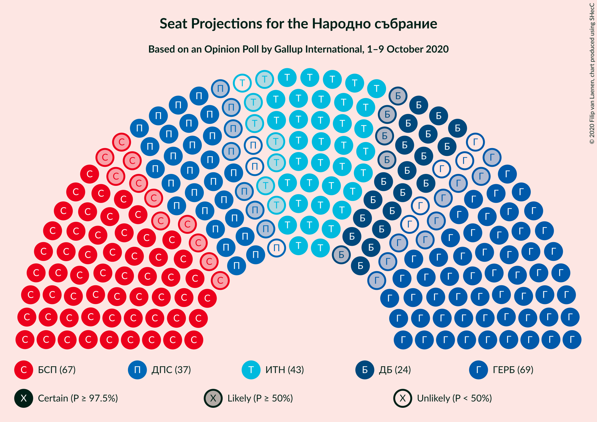

### Confidence Intervals

| Party | Last Result | Median | 80% Confidence Interval | 90% Confidence Interval | 95% Confidence Interval | 99% Confidence Interval |
|:-----:|:-----------:|:------:|:-----------------------:|:-----------------------:|:-----------------------:|:-----------------------:|
| <a href="#българска-социалистическа-партия">Българска социалистическа партия</a> | 80 | 67 | 60–76 |57–76 |56–76 |54–80 |
| <a href="#граждани-за-европейско-развитие-на-българия">Граждани за европейско развитие на България</a> | 95 | 65 | 57–71 |55–72 |55–72 |51–75 |
| <a href="#има-такъв-народ">Има такъв народ</a> | 0 | 41 | 37–48 |36–50 |35–51 |33–52 |
| <a href="#движение-за-права-и-свободи">Движение за права и свободи</a> | 26 | 35 | 28–38 |28–39 |26–41 |25–43 |
| <a href="#демократична-българия">Демократична България</a> | 0 | 24 | 21–28 |20–29 |19–31 |18–34 |
| <a href="#изправи-се-бг">Изправи се Бг</a> | 0 | 0 | 0–15 |0–16 |0–16 |0–18 |
| <a href="#обединени-патриоти">Обединени Патриоти</a> | 27 | 0 | 0–14 |0–15 |0–16 |0–17 |
| <a href="#воля">Воля</a> | 12 | 0 | 0 |0 |0 |0–14 |

### Българска социалистическа партия

*For a full overview of the results for this party, see the [Българска социалистическа партия](party-българскасоциалистическапартия.html) page.*

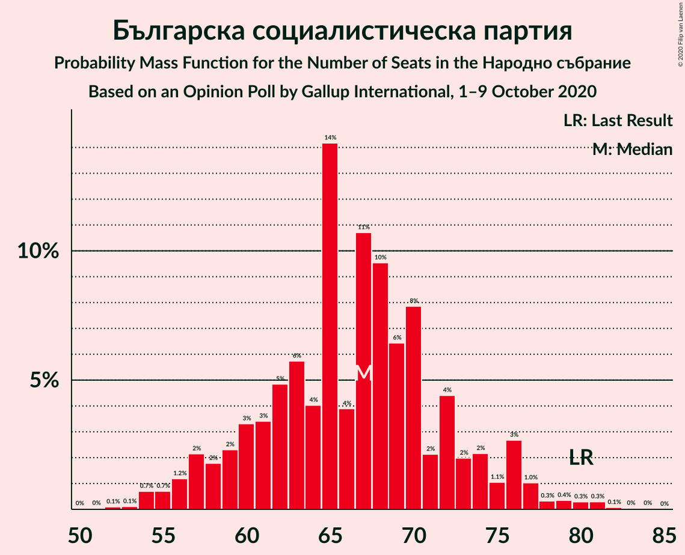

| Number of Seats | Probability | Accumulated | Special Marks |
|:---------------:|:-----------:|:-----------:|:-------------:|
| 51 | 0% | 100% |  |
| 52 | 0% | 99.9% |  |
| 53 | 0.1% | 99.9% |  |
| 54 | 0.5% | 99.8% |  |
| 55 | 1.5% | 99.3% |  |
| 56 | 0.4% | 98% |  |
| 57 | 4% | 97% |  |
| 58 | 2% | 94% |  |
| 59 | 0.8% | 92% |  |
| 60 | 2% | 91% |  |
| 61 | 8% | 89% |  |
| 62 | 9% | 81% |  |
| 63 | 1.3% | 73% |  |
| 64 | 7% | 71% |  |
| 65 | 7% | 65% |  |
| 66 | 1.4% | 58% |  |
| 67 | 7% | 56% | Median |
| 68 | 3% | 49% |  |
| 69 | 13% | 47% |  |
| 70 | 7% | 33% |  |
| 71 | 3% | 26% |  |
| 72 | 4% | 24% |  |
| 73 | 1.1% | 19% |  |
| 74 | 2% | 18% |  |
| 75 | 0.9% | 17% |  |
| 76 | 15% | 16% |  |
| 77 | 0.3% | 1.2% |  |
| 78 | 0% | 1.0% |  |
| 79 | 0.1% | 0.9% |  |
| 80 | 0.6% | 0.8% | Last Result |
| 81 | 0.1% | 0.2% |  |
| 82 | 0.1% | 0.1% |  |
| 83 | 0% | 0.1% |  |
| 84 | 0% | 0% |  |

### Граждани за европейско развитие на България

*For a full overview of the results for this party, see the [Граждани за европейско развитие на България](party-гражданизаевропейскоразвитиенабългария.html) page.*

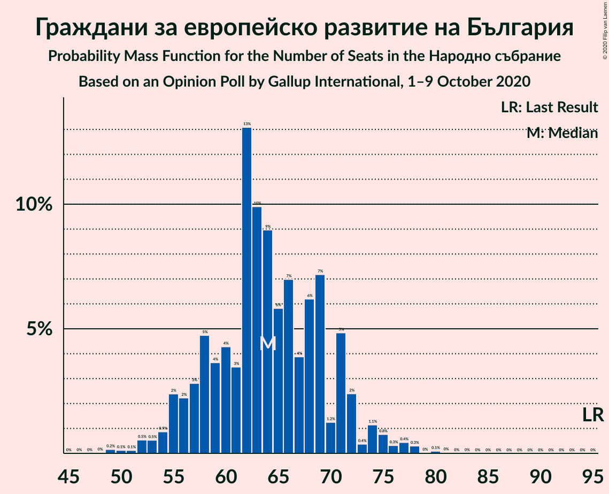

| Number of Seats | Probability | Accumulated | Special Marks |
|:---------------:|:-----------:|:-----------:|:-------------:|
| 49 | 0.2% | 100% |  |
| 50 | 0.2% | 99.8% |  |
| 51 | 0.3% | 99.6% |  |
| 52 | 0.4% | 99.3% |  |
| 53 | 0.4% | 99.0% |  |
| 54 | 0.5% | 98.6% |  |
| 55 | 6% | 98% |  |
| 56 | 2% | 92% |  |
| 57 | 2% | 90% |  |
| 58 | 0.5% | 88% |  |
| 59 | 1.2% | 87% |  |
| 60 | 3% | 86% |  |
| 61 | 2% | 83% |  |
| 62 | 6% | 81% |  |
| 63 | 18% | 74% |  |
| 64 | 4% | 57% |  |
| 65 | 8% | 53% | Median |
| 66 | 11% | 45% |  |
| 67 | 2% | 34% |  |
| 68 | 8% | 32% |  |
| 69 | 3% | 24% |  |
| 70 | 1.2% | 21% |  |
| 71 | 12% | 20% |  |
| 72 | 7% | 8% |  |
| 73 | 0.5% | 1.5% |  |
| 74 | 0.1% | 1.0% |  |
| 75 | 0.8% | 0.9% |  |
| 76 | 0% | 0.1% |  |
| 77 | 0% | 0.1% |  |
| 78 | 0% | 0.1% |  |
| 79 | 0% | 0.1% |  |
| 80 | 0% | 0.1% |  |
| 81 | 0% | 0% |  |
| 82 | 0% | 0% |  |
| 83 | 0% | 0% |  |
| 84 | 0% | 0% |  |
| 85 | 0% | 0% |  |
| 86 | 0% | 0% |  |
| 87 | 0% | 0% |  |
| 88 | 0% | 0% |  |
| 89 | 0% | 0% |  |
| 90 | 0% | 0% |  |
| 91 | 0% | 0% |  |
| 92 | 0% | 0% |  |
| 93 | 0% | 0% |  |
| 94 | 0% | 0% |  |
| 95 | 0% | 0% | Last Result |

### Има такъв народ

*For a full overview of the results for this party, see the [Има такъв народ](party-иматакъвнарод.html) page.*

| Number of Seats | Probability | Accumulated | Special Marks |
|:---------------:|:-----------:|:-----------:|:-------------:|
| 0 | 0% | 100% | Last Result |
| 1 | 0% | 100% |  |
| 2 | 0% | 100% |  |
| 3 | 0% | 100% |  |
| 4 | 0% | 100% |  |
| 5 | 0% | 100% |  |
| 6 | 0% | 100% |  |
| 7 | 0% | 100% |  |
| 8 | 0% | 100% |  |
| 9 | 0% | 100% |  |
| 10 | 0% | 100% |  |
| 11 | 0% | 100% |  |
| 12 | 0% | 100% |  |
| 13 | 0% | 100% |  |
| 14 | 0% | 100% |  |
| 15 | 0% | 100% |  |
| 16 | 0% | 100% |  |
| 17 | 0% | 100% |  |
| 18 | 0% | 100% |  |
| 19 | 0% | 100% |  |
| 20 | 0% | 100% |  |
| 21 | 0% | 100% |  |
| 22 | 0% | 100% |  |
| 23 | 0% | 100% |  |
| 24 | 0% | 100% |  |
| 25 | 0% | 100% |  |
| 26 | 0% | 100% |  |
| 27 | 0% | 100% |  |
| 28 | 0% | 100% |  |
| 29 | 0% | 100% |  |
| 30 | 0% | 100% |  |
| 31 | 0.1% | 100% |  |
| 32 | 0.1% | 99.9% |  |
| 33 | 0.8% | 99.7% |  |
| 34 | 0.9% | 98.9% |  |
| 35 | 2% | 98% |  |
| 36 | 4% | 96% |  |
| 37 | 8% | 92% |  |
| 38 | 8% | 85% |  |
| 39 | 2% | 76% |  |
| 40 | 8% | 75% |  |
| 41 | 18% | 67% | Median |
| 42 | 2% | 49% |  |
| 43 | 7% | 47% |  |
| 44 | 10% | 40% |  |
| 45 | 10% | 29% |  |
| 46 | 6% | 19% |  |
| 47 | 3% | 13% |  |
| 48 | 3% | 10% |  |
| 49 | 0.2% | 7% |  |
| 50 | 2% | 7% |  |
| 51 | 4% | 5% |  |
| 52 | 0.9% | 1.2% |  |
| 53 | 0.1% | 0.3% |  |
| 54 | 0% | 0.1% |  |
| 55 | 0% | 0.1% |  |
| 56 | 0% | 0.1% |  |
| 57 | 0% | 0% |  |

### Движение за права и свободи

*For a full overview of the results for this party, see the [Движение за права и свободи](party-движениезаправаисвободи.html) page.*

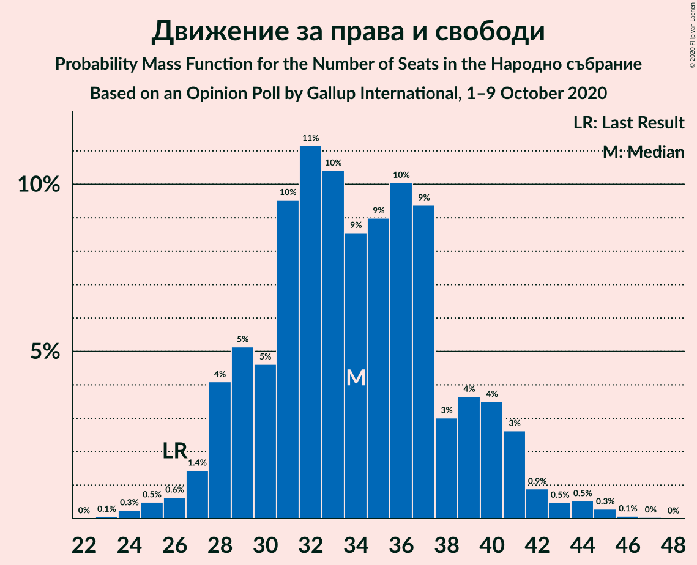

| Number of Seats | Probability | Accumulated | Special Marks |
|:---------------:|:-----------:|:-----------:|:-------------:|
| 23 | 0% | 100% |  |
| 24 | 0.2% | 99.9% |  |
| 25 | 1.3% | 99.7% |  |
| 26 | 1.1% | 98% | Last Result |
| 27 | 0.4% | 97% |  |
| 28 | 8% | 97% |  |
| 29 | 7% | 89% |  |
| 30 | 2% | 82% |  |
| 31 | 2% | 80% |  |
| 32 | 11% | 78% |  |
| 33 | 9% | 67% |  |
| 34 | 6% | 57% |  |
| 35 | 16% | 51% | Median |
| 36 | 17% | 35% |  |
| 37 | 7% | 18% |  |
| 38 | 5% | 12% |  |
| 39 | 3% | 7% |  |
| 40 | 0.8% | 4% |  |
| 41 | 0.9% | 3% |  |
| 42 | 0.9% | 2% |  |
| 43 | 0.8% | 1.2% |  |
| 44 | 0.2% | 0.4% |  |
| 45 | 0% | 0.1% |  |
| 46 | 0% | 0.1% |  |
| 47 | 0% | 0% |  |

### Демократична България

*For a full overview of the results for this party, see the [Демократична България](party-демократичнабългария.html) page.*

| Number of Seats | Probability | Accumulated | Special Marks |
|:---------------:|:-----------:|:-----------:|:-------------:|
| 0 | 0% | 100% | Last Result |
| 1 | 0% | 100% |  |
| 2 | 0% | 100% |  |
| 3 | 0% | 100% |  |
| 4 | 0% | 100% |  |
| 5 | 0% | 100% |  |
| 6 | 0% | 100% |  |
| 7 | 0% | 100% |  |
| 8 | 0% | 100% |  |
| 9 | 0% | 100% |  |
| 10 | 0% | 100% |  |
| 11 | 0% | 100% |  |
| 12 | 0% | 100% |  |
| 13 | 0% | 100% |  |
| 14 | 0% | 100% |  |
| 15 | 0% | 100% |  |
| 16 | 0.1% | 100% |  |
| 17 | 0.3% | 99.8% |  |
| 18 | 1.4% | 99.5% |  |
| 19 | 1.4% | 98% |  |
| 20 | 2% | 97% |  |
| 21 | 16% | 95% |  |
| 22 | 12% | 79% |  |
| 23 | 2% | 67% |  |
| 24 | 23% | 65% | Median |
| 25 | 13% | 42% |  |
| 26 | 4% | 29% |  |
| 27 | 9% | 25% |  |
| 28 | 8% | 15% |  |
| 29 | 4% | 8% |  |
| 30 | 0.6% | 3% |  |
| 31 | 1.1% | 3% |  |
| 32 | 0.3% | 2% |  |
| 33 | 0.6% | 1.2% |  |
| 34 | 0.4% | 0.6% |  |
| 35 | 0% | 0.3% |  |
| 36 | 0.2% | 0.3% |  |
| 37 | 0% | 0% |  |

### Изправи се Бг

*For a full overview of the results for this party, see the [Изправи се Бг](party-изправисебг.html) page.*

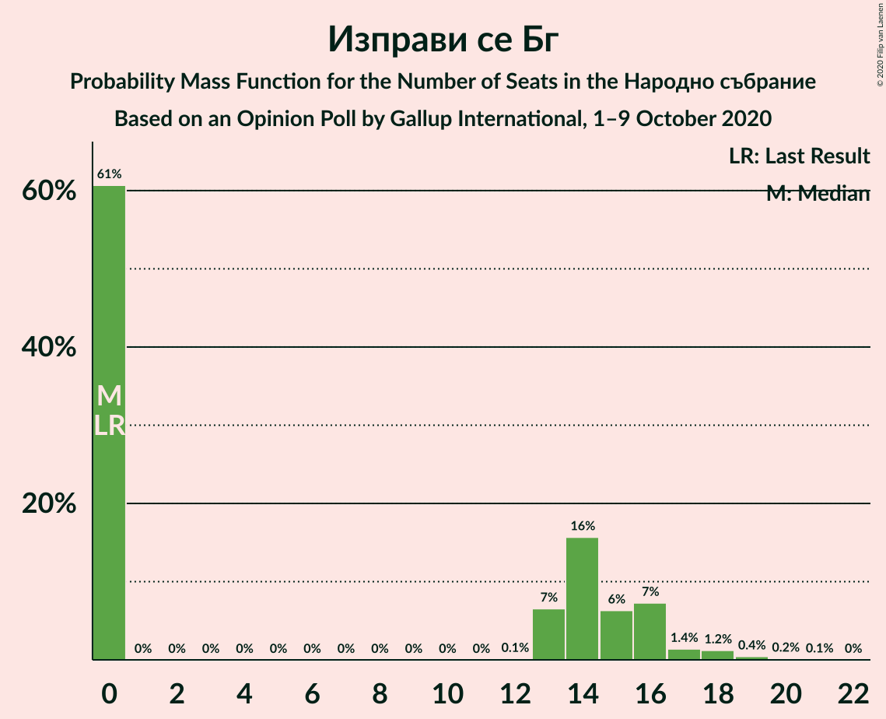

| Number of Seats | Probability | Accumulated | Special Marks |
|:---------------:|:-----------:|:-----------:|:-------------:|
| 0 | 65% | 100% | Last Result, Median |
| 1 | 0% | 35% |  |
| 2 | 0% | 35% |  |
| 3 | 0% | 35% |  |
| 4 | 0% | 35% |  |
| 5 | 0% | 35% |  |
| 6 | 0% | 35% |  |
| 7 | 0% | 35% |  |
| 8 | 0% | 35% |  |
| 9 | 0% | 35% |  |
| 10 | 0% | 35% |  |
| 11 | 0% | 35% |  |
| 12 | 0.4% | 35% |  |
| 13 | 9% | 35% |  |
| 14 | 13% | 26% |  |
| 15 | 7% | 13% |  |
| 16 | 5% | 7% |  |
| 17 | 0.9% | 2% |  |
| 18 | 0.7% | 1.0% |  |
| 19 | 0.2% | 0.3% |  |
| 20 | 0% | 0.1% |  |
| 21 | 0% | 0.1% |  |
| 22 | 0.1% | 0.1% |  |
| 23 | 0% | 0% |  |

### Обединени Патриоти

*For a full overview of the results for this party, see the [Обединени Патриоти](party-обединенипатриоти.html) page.*

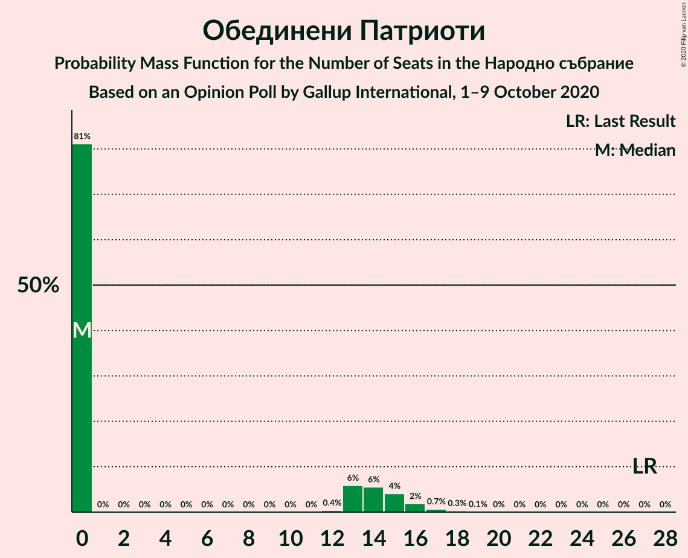

| Number of Seats | Probability | Accumulated | Special Marks |
|:---------------:|:-----------:|:-----------:|:-------------:|
| 0 | 82% | 100% | Median |
| 1 | 0% | 18% |  |
| 2 | 0% | 18% |  |
| 3 | 0% | 18% |  |
| 4 | 0% | 18% |  |
| 5 | 0% | 18% |  |
| 6 | 0% | 18% |  |
| 7 | 0% | 18% |  |
| 8 | 0% | 18% |  |
| 9 | 0% | 18% |  |
| 10 | 0% | 18% |  |
| 11 | 0% | 18% |  |
| 12 | 0.1% | 18% |  |
| 13 | 6% | 18% |  |
| 14 | 6% | 12% |  |
| 15 | 2% | 6% |  |
| 16 | 3% | 4% |  |
| 17 | 0.4% | 0.7% |  |
| 18 | 0.2% | 0.3% |  |
| 19 | 0.1% | 0.2% |  |
| 20 | 0% | 0% |  |
| 21 | 0% | 0% |  |
| 22 | 0% | 0% |  |
| 23 | 0% | 0% |  |
| 24 | 0% | 0% |  |
| 25 | 0% | 0% |  |
| 26 | 0% | 0% |  |
| 27 | 0% | 0% | Last Result |

### Воля

*For a full overview of the results for this party, see the [Воля](party-воля.html) page.*

| Number of Seats | Probability | Accumulated | Special Marks |
|:---------------:|:-----------:|:-----------:|:-------------:|
| 0 | 98% | 100% | Median |
| 1 | 0% | 2% |  |
| 2 | 0% | 2% |  |
| 3 | 0% | 2% |  |
| 4 | 0% | 2% |  |
| 5 | 0% | 2% |  |
| 6 | 0% | 2% |  |
| 7 | 0% | 2% |  |
| 8 | 0% | 2% |  |
| 9 | 0% | 2% |  |
| 10 | 0% | 2% |  |
| 11 | 0% | 2% |  |
| 12 | 0% | 2% | Last Result |
| 13 | 1.4% | 2% |  |
| 14 | 0.5% | 0.9% |  |
| 15 | 0.3% | 0.4% |  |
| 16 | 0.1% | 0.2% |  |
| 17 | 0% | 0.1% |  |
| 18 | 0% | 0% |  |

## Coalitions

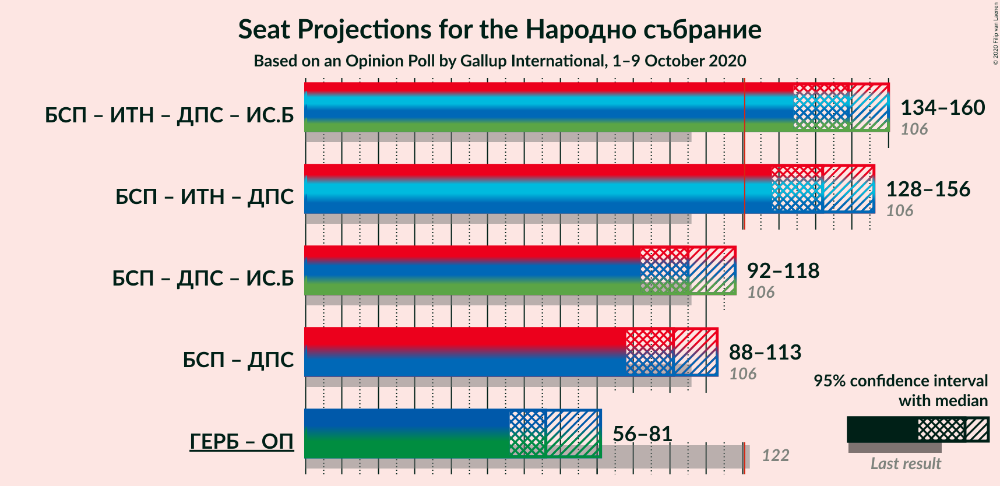

### Confidence Intervals

| Coalition | Last Result | Median | Majority? | 80% Confidence Interval | 90% Confidence Interval | 95% Confidence Interval | 99% Confidence Interval |
|:---------:|:-----------:|:------:|:---------:|:-----------------------:|:-----------------------:|:-----------------------:|:-----------------------:|
| Българска социалистическа партия – Има такъв народ – Движение за права и свободи – Изправи се Бг | 106 | 148 | 100% | 140–154 | 135–156 | 133–160 | 132–163 |
| Българска социалистическа партия – Има такъв народ – Движение за права и свободи | 106 | 144 | 99.9% | 132–153 | 131–154 | 129–154 | 123–158 |
| Българска социалистическа партия – Движение за права и свободи – Изправи се Бг | 106 | 104 | 1.3% | 99–112 | 96–115 | 94–117 | 89–123 |
| Българска социалистическа партия – Движение за права и свободи | 106 | 100 | 0% | 93–112 | 89–112 | 87–112 | 84–113 |
| Граждани за европейско развитие на България – Обединени Патриоти | 122 | 66 | 0% | 60–76 | 57–79 | 56–81 | 53–84 |

### Българска социалистическа партия – Има такъв народ – Движение за права и свободи – Изправи се Бг

| Number of Seats | Probability | Accumulated | Special Marks |
|:---------------:|:-----------:|:-----------:|:-------------:|
| 106 | 0% | 100% | Last Result |
| 107 | 0% | 100% |  |
| 108 | 0% | 100% |  |
| 109 | 0% | 100% |  |
| 110 | 0% | 100% |  |
| 111 | 0% | 100% |  |
| 112 | 0% | 100% |  |
| 113 | 0% | 100% |  |
| 114 | 0% | 100% |  |
| 115 | 0% | 100% |  |
| 116 | 0% | 100% |  |
| 117 | 0% | 100% |  |
| 118 | 0% | 100% |  |
| 119 | 0% | 100% |  |
| 120 | 0% | 100% |  |
| 121 | 0% | 100% | Majority |
| 122 | 0% | 100% |  |
| 123 | 0% | 100% |  |
| 124 | 0% | 100% |  |
| 125 | 0% | 100% |  |
| 126 | 0% | 100% |  |
| 127 | 0.2% | 100% |  |
| 128 | 0.1% | 99.8% |  |
| 129 | 0% | 99.7% |  |
| 130 | 0% | 99.7% |  |
| 131 | 0.1% | 99.7% |  |
| 132 | 0.5% | 99.6% |  |
| 133 | 2% | 99.0% |  |
| 134 | 1.5% | 97% |  |
| 135 | 0.8% | 95% |  |
| 136 | 0.5% | 94% |  |
| 137 | 0.9% | 94% |  |
| 138 | 0.5% | 93% |  |
| 139 | 1.4% | 92% |  |
| 140 | 9% | 91% |  |
| 141 | 2% | 83% |  |
| 142 | 0.3% | 81% |  |
| 143 | 0.2% | 80% | Median |
| 144 | 1.3% | 80% |  |
| 145 | 2% | 79% |  |
| 146 | 5% | 77% |  |
| 147 | 12% | 72% |  |
| 148 | 11% | 59% |  |
| 149 | 2% | 48% |  |
| 150 | 7% | 46% |  |
| 151 | 4% | 39% |  |
| 152 | 2% | 35% |  |
| 153 | 18% | 33% |  |
| 154 | 9% | 15% |  |
| 155 | 0.8% | 6% |  |
| 156 | 0.8% | 5% |  |
| 157 | 0.4% | 5% |  |
| 158 | 1.1% | 4% |  |
| 159 | 0.4% | 3% |  |
| 160 | 0.2% | 3% |  |
| 161 | 2% | 2% |  |
| 162 | 0.1% | 0.8% |  |
| 163 | 0.4% | 0.7% |  |
| 164 | 0.1% | 0.3% |  |
| 165 | 0% | 0.3% |  |
| 166 | 0.1% | 0.2% |  |
| 167 | 0.1% | 0.1% |  |
| 168 | 0.1% | 0.1% |  |
| 169 | 0% | 0% |  |

### Българска социалистическа партия – Има такъв народ – Движение за права и свободи

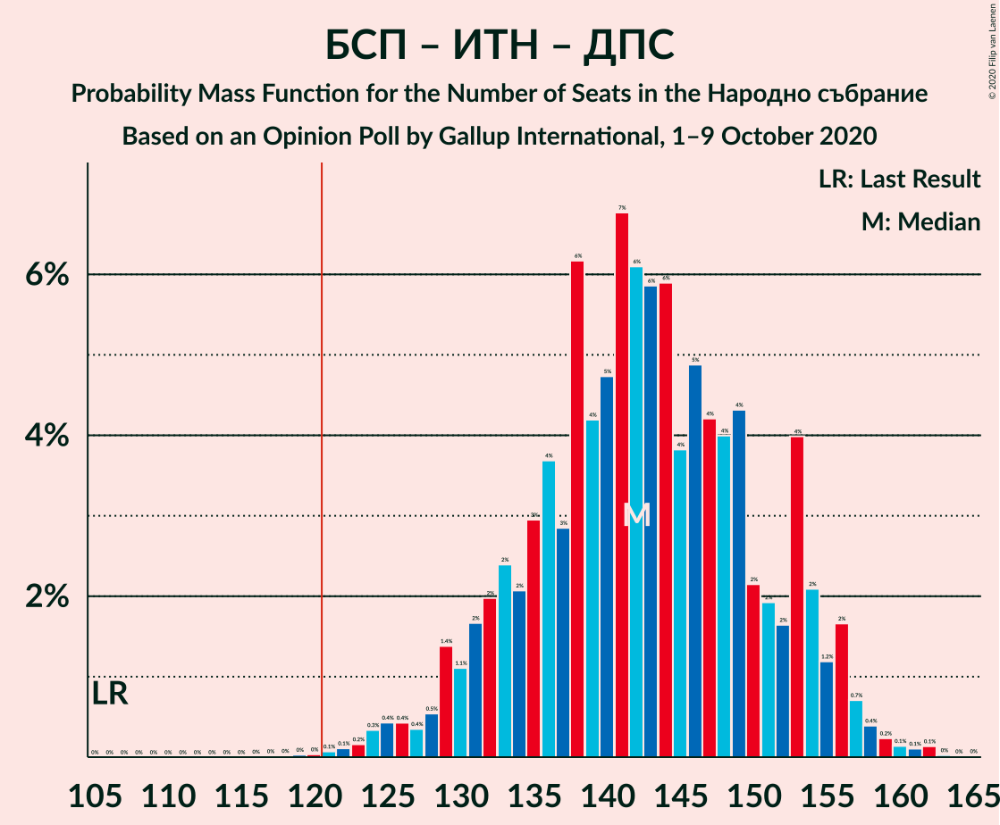

| Number of Seats | Probability | Accumulated | Special Marks |
|:---------------:|:-----------:|:-----------:|:-------------:|
| 106 | 0% | 100% | Last Result |
| 107 | 0% | 100% |  |
| 108 | 0% | 100% |  |
| 109 | 0% | 100% |  |
| 110 | 0% | 100% |  |
| 111 | 0% | 100% |  |
| 112 | 0% | 100% |  |
| 113 | 0% | 100% |  |
| 114 | 0% | 100% |  |
| 115 | 0% | 100% |  |
| 116 | 0% | 100% |  |
| 117 | 0% | 100% |  |
| 118 | 0% | 100% |  |
| 119 | 0% | 100% |  |
| 120 | 0% | 99.9% |  |
| 121 | 0% | 99.9% | Majority |
| 122 | 0% | 99.9% |  |
| 123 | 0.5% | 99.9% |  |
| 124 | 1.0% | 99.4% |  |
| 125 | 0.1% | 98% |  |
| 126 | 0.1% | 98% |  |
| 127 | 0.5% | 98% |  |
| 128 | 0.3% | 98% |  |
| 129 | 0.9% | 98% |  |
| 130 | 0.2% | 97% |  |
| 131 | 2% | 96% |  |
| 132 | 5% | 94% |  |
| 133 | 4% | 89% |  |
| 134 | 2% | 85% |  |
| 135 | 1.0% | 83% |  |
| 136 | 7% | 82% |  |
| 137 | 1.2% | 75% |  |
| 138 | 4% | 73% |  |
| 139 | 3% | 69% |  |
| 140 | 9% | 66% |  |
| 141 | 7% | 58% |  |
| 142 | 0.5% | 51% |  |
| 143 | 0.3% | 50% | Median |
| 144 | 0.4% | 50% |  |
| 145 | 3% | 50% |  |
| 146 | 3% | 47% |  |
| 147 | 7% | 43% |  |
| 148 | 11% | 36% |  |
| 149 | 2% | 25% |  |
| 150 | 0.1% | 23% |  |
| 151 | 0.7% | 23% |  |
| 152 | 1.0% | 22% |  |
| 153 | 16% | 21% |  |
| 154 | 4% | 5% |  |
| 155 | 0.5% | 2% |  |
| 156 | 0.3% | 1.4% |  |
| 157 | 0.1% | 1.0% |  |
| 158 | 0.6% | 0.9% |  |
| 159 | 0.1% | 0.3% |  |
| 160 | 0.1% | 0.2% |  |
| 161 | 0% | 0.1% |  |
| 162 | 0% | 0% |  |

### Българска социалистическа партия – Движение за права и свободи – Изправи се Бг

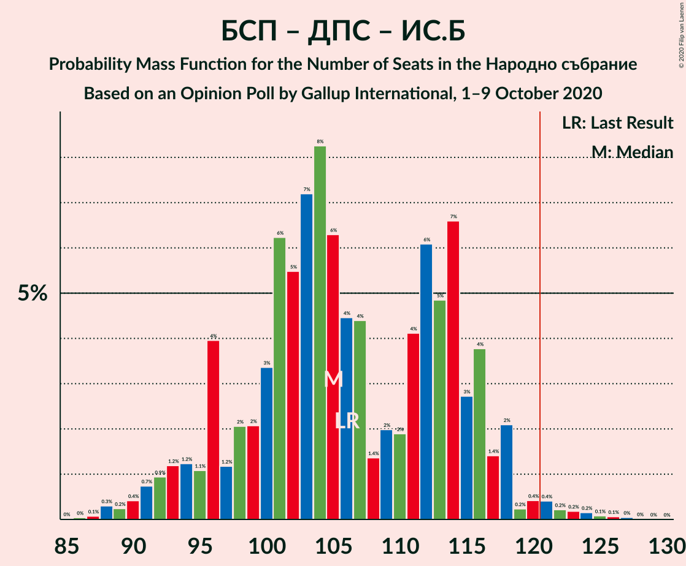

| Number of Seats | Probability | Accumulated | Special Marks |
|:---------------:|:-----------:|:-----------:|:-------------:|
| 87 | 0.2% | 100% |  |
| 88 | 0.1% | 99.7% |  |
| 89 | 0.6% | 99.7% |  |
| 90 | 0.4% | 99.0% |  |
| 91 | 0.4% | 98.7% |  |
| 92 | 0.2% | 98% |  |
| 93 | 0.2% | 98% |  |
| 94 | 1.2% | 98% |  |
| 95 | 1.1% | 97% |  |
| 96 | 4% | 96% |  |
| 97 | 0.4% | 92% |  |
| 98 | 0.9% | 92% |  |
| 99 | 4% | 91% |  |
| 100 | 8% | 87% |  |
| 101 | 6% | 79% |  |
| 102 | 4% | 73% | Median |
| 103 | 11% | 69% |  |
| 104 | 9% | 58% |  |
| 105 | 0.7% | 49% |  |
| 106 | 0.2% | 48% | Last Result |
| 107 | 2% | 48% |  |
| 108 | 0.6% | 46% |  |
| 109 | 3% | 45% |  |
| 110 | 7% | 42% |  |
| 111 | 8% | 35% |  |
| 112 | 21% | 27% |  |
| 113 | 0.9% | 7% |  |
| 114 | 0.5% | 6% |  |
| 115 | 0.3% | 5% |  |
| 116 | 2% | 5% |  |
| 117 | 0.7% | 3% |  |
| 118 | 0.2% | 2% |  |
| 119 | 0% | 2% |  |
| 120 | 0.6% | 2% |  |
| 121 | 0.3% | 1.3% | Majority |
| 122 | 0.3% | 1.0% |  |
| 123 | 0.5% | 0.8% |  |
| 124 | 0.1% | 0.2% |  |
| 125 | 0% | 0.1% |  |
| 126 | 0.1% | 0.1% |  |
| 127 | 0.1% | 0.1% |  |
| 128 | 0% | 0% |  |

### Българска социалистическа партия – Движение за права и свободи

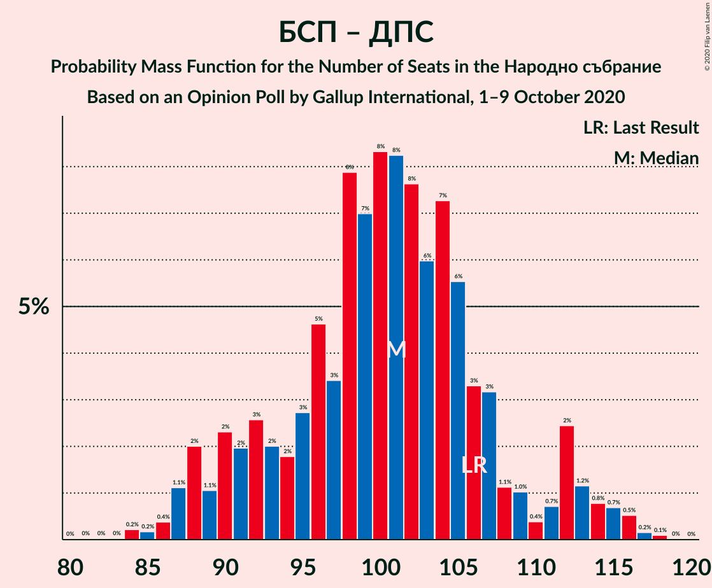

| Number of Seats | Probability | Accumulated | Special Marks |
|:---------------:|:-----------:|:-----------:|:-------------:|
| 82 | 0% | 100% |  |
| 83 | 0% | 99.9% |  |
| 84 | 1.2% | 99.9% |  |
| 85 | 0.1% | 98.8% |  |
| 86 | 0.3% | 98.7% |  |
| 87 | 1.4% | 98% |  |
| 88 | 1.3% | 97% |  |
| 89 | 0.7% | 96% |  |
| 90 | 3% | 95% |  |
| 91 | 0.8% | 92% |  |
| 92 | 0.4% | 91% |  |
| 93 | 0.6% | 91% |  |
| 94 | 2% | 90% |  |
| 95 | 9% | 87% |  |
| 96 | 4% | 78% |  |
| 97 | 2% | 74% |  |
| 98 | 12% | 73% |  |
| 99 | 4% | 61% |  |
| 100 | 8% | 57% |  |
| 101 | 6% | 49% |  |
| 102 | 3% | 43% | Median |
| 103 | 9% | 39% |  |
| 104 | 8% | 31% |  |
| 105 | 0.3% | 23% |  |
| 106 | 1.0% | 22% | Last Result |
| 107 | 2% | 21% |  |
| 108 | 0.8% | 20% |  |
| 109 | 1.0% | 19% |  |
| 110 | 1.0% | 18% |  |
| 111 | 2% | 17% |  |
| 112 | 15% | 15% |  |
| 113 | 0.1% | 0.5% |  |
| 114 | 0.1% | 0.4% |  |
| 115 | 0.1% | 0.3% |  |
| 116 | 0.2% | 0.2% |  |
| 117 | 0% | 0% |  |

### Граждани за европейско развитие на България – Обединени Патриоти

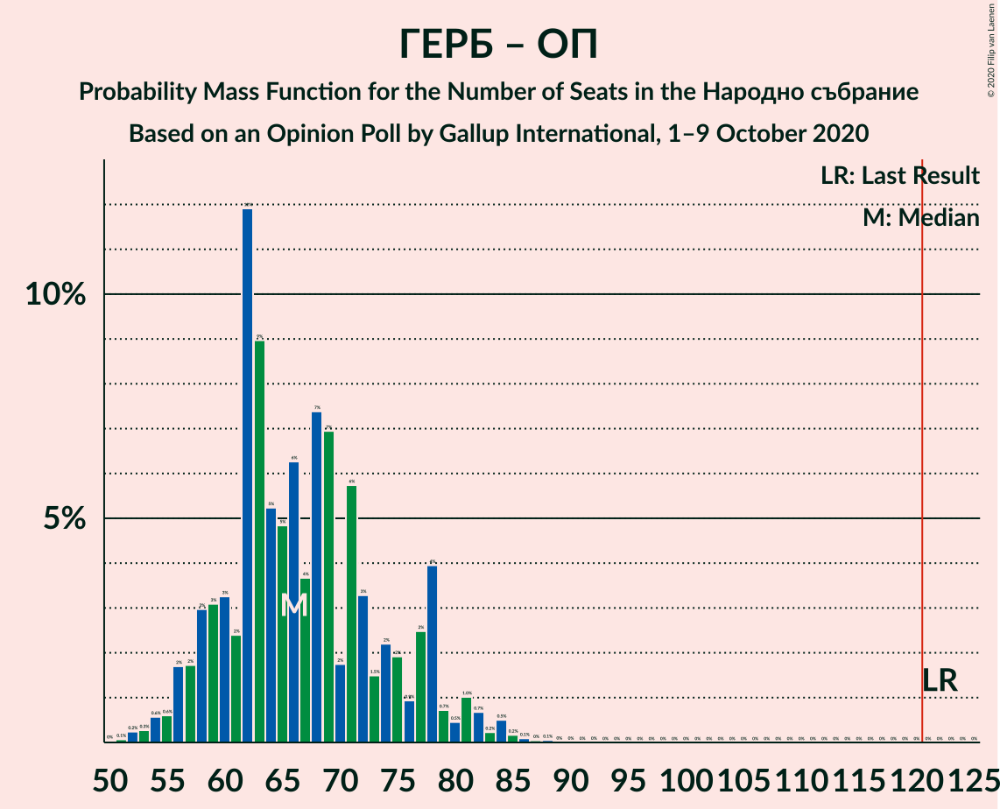

| Number of Seats | Probability | Accumulated | Special Marks |
|:---------------:|:-----------:|:-----------:|:-------------:|
| 49 | 0% | 100% |  |
| 50 | 0.1% | 99.9% |  |
| 51 | 0.2% | 99.8% |  |
| 52 | 0.1% | 99.6% |  |
| 53 | 0.3% | 99.5% |  |
| 54 | 0.4% | 99.3% |  |
| 55 | 0.7% | 98.8% |  |
| 56 | 2% | 98% |  |
| 57 | 2% | 96% |  |
| 58 | 0.3% | 94% |  |
| 59 | 0.8% | 94% |  |
| 60 | 3% | 93% |  |
| 61 | 1.4% | 90% |  |
| 62 | 6% | 89% |  |
| 63 | 14% | 83% |  |
| 64 | 1.3% | 68% |  |
| 65 | 7% | 67% | Median |
| 66 | 10% | 60% |  |
| 67 | 0.8% | 49% |  |
| 68 | 12% | 48% |  |
| 69 | 3% | 36% |  |
| 70 | 1.1% | 33% |  |
| 71 | 12% | 32% |  |
| 72 | 7% | 20% |  |
| 73 | 0.9% | 13% |  |
| 74 | 0.2% | 12% |  |
| 75 | 0.9% | 12% |  |
| 76 | 1.0% | 11% |  |
| 77 | 0.6% | 10% |  |
| 78 | 3% | 9% |  |
| 79 | 3% | 6% |  |
| 80 | 0.1% | 3% |  |
| 81 | 0.7% | 3% |  |
| 82 | 1.2% | 2% |  |
| 83 | 0.4% | 1.0% |  |
| 84 | 0.3% | 0.5% |  |
| 85 | 0.1% | 0.3% |  |
| 86 | 0.1% | 0.2% |  |
| 87 | 0% | 0.1% |  |
| 88 | 0.1% | 0.1% |  |
| 89 | 0% | 0% |  |
| 90 | 0% | 0% |  |
| 91 | 0% | 0% |  |
| 92 | 0% | 0% |  |
| 93 | 0% | 0% |  |
| 94 | 0% | 0% |  |
| 95 | 0% | 0% |  |
| 96 | 0% | 0% |  |
| 97 | 0% | 0% |  |
| 98 | 0% | 0% |  |
| 99 | 0% | 0% |  |
| 100 | 0% | 0% |  |
| 101 | 0% | 0% |  |
| 102 | 0% | 0% |  |
| 103 | 0% | 0% |  |
| 104 | 0% | 0% |  |
| 105 | 0% | 0% |  |
| 106 | 0% | 0% |  |
| 107 | 0% | 0% |  |
| 108 | 0% | 0% |  |
| 109 | 0% | 0% |  |
| 110 | 0% | 0% |  |
| 111 | 0% | 0% |  |
| 112 | 0% | 0% |  |
| 113 | 0% | 0% |  |
| 114 | 0% | 0% |  |
| 115 | 0% | 0% |  |
| 116 | 0% | 0% |  |
| 117 | 0% | 0% |  |
| 118 | 0% | 0% |  |
| 119 | 0% | 0% |  |
| 120 | 0% | 0% |  |
| 121 | 0% | 0% | Majority |
| 122 | 0% | 0% | Last Result |

## Technical Information

### Opinion Poll

+ **Polling firm:** Gallup International
+ **Commissioner(s):** —
+ **Fieldwork period:** 1–9 October 2020

### Calculations

+ **Sample size:** 803
+ **Simulations done:** 131,072
+ **Error estimate:** 2.64%

