# Opinion Poll by Тренд, 3–10 October 2020

<a href="#voting-intentions">Voting Intentions</a> | <a href="#seats">Seats</a> | <a href="#coalitions">Coalitions</a> | <a href="#technical-information">Technical Information</a>

## Voting Intentions

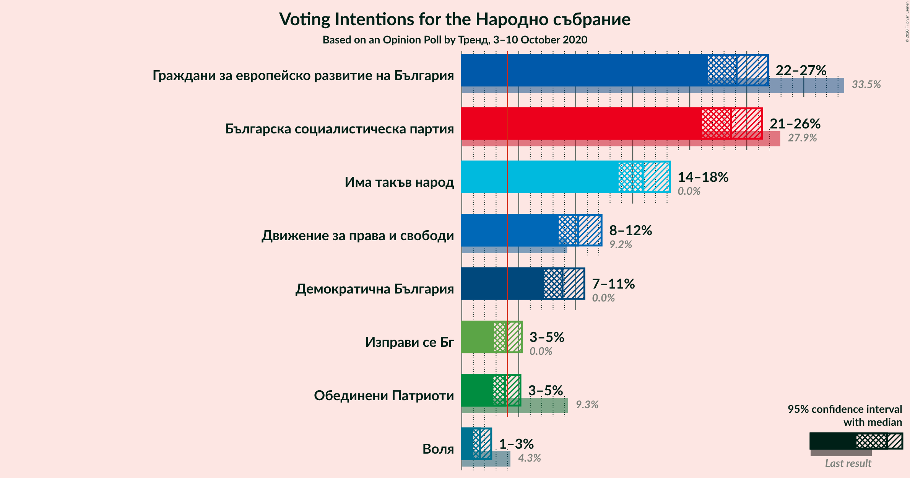

### Confidence Intervals

| Party | Last Result | Poll Result | 80% Confidence Interval | 90% Confidence Interval | 95% Confidence Interval | 99% Confidence Interval |
|:-----:|:-----------:|:-----------:|:-----------------------:|:-----------------------:|:-----------------------:|:-----------------------:|
| Граждани за европейско развитие на България | 33.5% | 24.1% | 22.4–25.9% |22.0–26.4% |21.6–26.9% |20.8–27.7% |
| Българска социалистическа партия | 27.9% | 23.6% | 21.9–25.4% |21.5–25.9% |21.1–26.3% |20.3–27.2% |
| Има такъв народ | 0.0% | 15.9% | 14.5–17.4% |14.1–17.9% |13.7–18.3% |13.1–19.0% |
| Движение за права и свободи | 9.2% | 10.2% | 9.1–11.5% |8.8–11.9% |8.5–12.3% |8.0–12.9% |
| Демократична България | 0.0% | 8.8% | 7.8–10.1% |7.5–10.4% |7.2–10.7% |6.8–11.4% |
| Изправи се Бг | 0.0% | 3.9% | 3.2–4.8% |3.0–5.0% |2.8–5.3% |2.5–5.7% |
| Обединени Патриоти | 9.3% | 3.8% | 3.1–4.7% |2.9–4.9% |2.8–5.1% |2.5–5.6% |
| Воля | 4.3% | 1.6% | 1.2–2.2% |1.1–2.4% |1.0–2.6% |0.8–2.9% |

*Note:* The poll result column reflects the actual value used in the calculations. Published results may vary slightly, and in addition be rounded to fewer digits.

## Seats

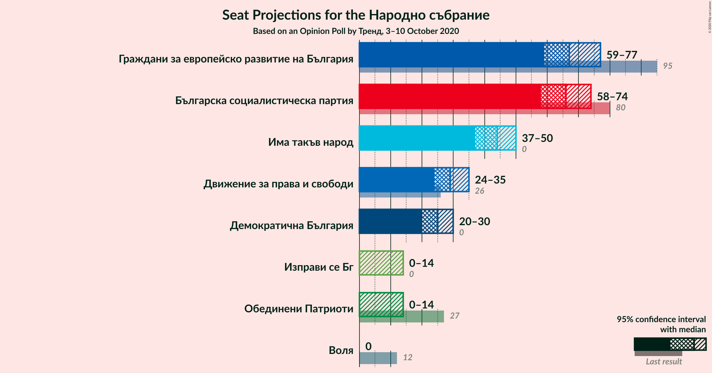

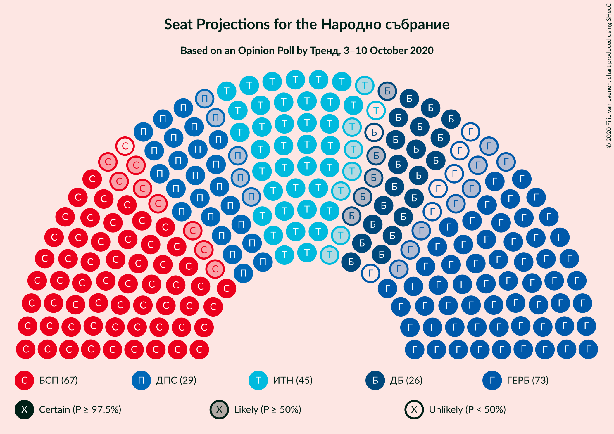

### Confidence Intervals

| Party | Last Result | Median | 80% Confidence Interval | 90% Confidence Interval | 95% Confidence Interval | 99% Confidence Interval |
|:-----:|:-----------:|:------:|:-----------------------:|:-----------------------:|:-----------------------:|:-----------------------:|
| <a href="#граждани-за-европейско-развитие-на-българия">Граждани за европейско развитие на България</a> | 95 | 67 | 61–73 |60–75 |59–77 |57–78 |
| <a href="#българска-социалистическа-партия">Българска социалистическа партия</a> | 80 | 66 | 60–71 |58–73 |58–74 |55–77 |
| <a href="#има-такъв-народ">Има такъв народ</a> | 0 | 44 | 39–48 |38–49 |37–50 |35–53 |
| <a href="#движение-за-права-и-свободи">Движение за права и свободи</a> | 26 | 29 | 25–33 |24–34 |24–35 |22–37 |
| <a href="#демократична-българия">Демократична България</a> | 0 | 25 | 22–28 |21–30 |20–30 |19–33 |
| <a href="#изправи-се-бг">Изправи се Бг</a> | 0 | 0 | 0–13 |0–14 |0–14 |0–16 |
| <a href="#обединени-патриоти">Обединени Патриоти</a> | 27 | 0 | 0–13 |0–14 |0–14 |0–15 |
| <a href="#воля">Воля</a> | 12 | 0 | 0 |0 |0 |0 |

### Граждани за европейско развитие на България

*For a full overview of the results for this party, see the [Граждани за европейско развитие на България](party-гражданизаевропейскоразвитиенабългария.html) page.*

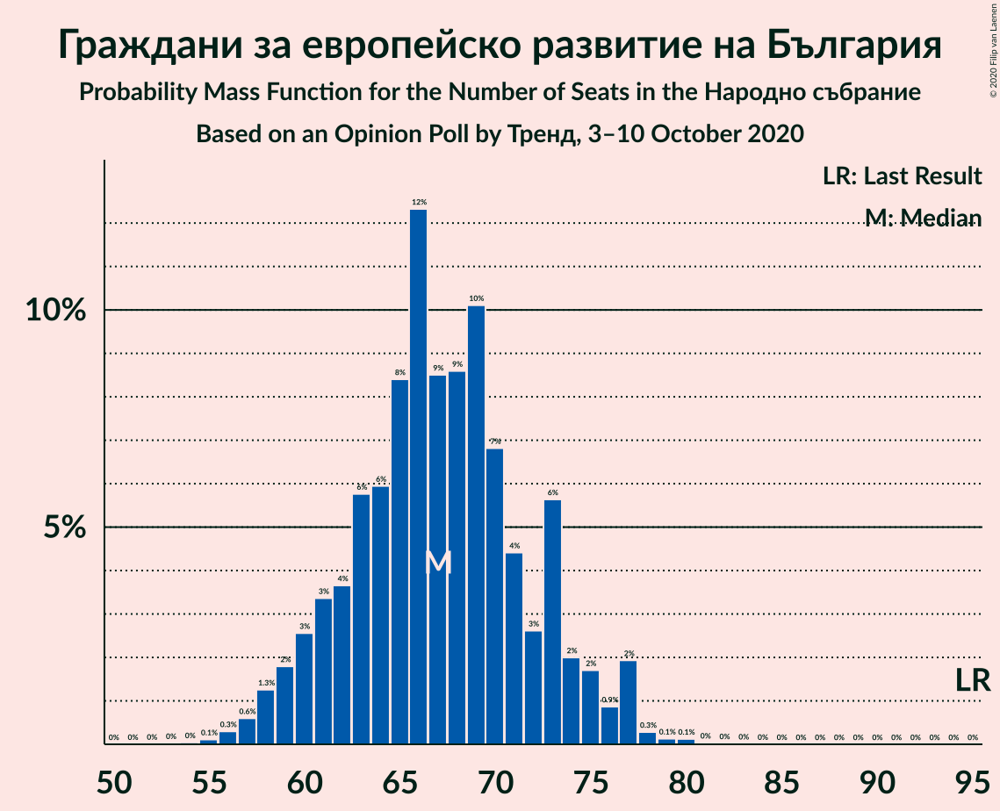

| Number of Seats | Probability | Accumulated | Special Marks |
|:---------------:|:-----------:|:-----------:|:-------------:|
| 54 | 0% | 100% |  |
| 55 | 0.1% | 99.9% |  |
| 56 | 0.3% | 99.8% |  |
| 57 | 0.6% | 99.5% |  |
| 58 | 1.3% | 98.9% |  |
| 59 | 2% | 98% |  |
| 60 | 3% | 96% |  |
| 61 | 3% | 93% |  |
| 62 | 4% | 90% |  |
| 63 | 6% | 86% |  |
| 64 | 6% | 81% |  |
| 65 | 8% | 75% |  |
| 66 | 12% | 66% |  |
| 67 | 9% | 54% | Median |
| 68 | 9% | 45% |  |
| 69 | 10% | 37% |  |
| 70 | 7% | 27% |  |
| 71 | 4% | 20% |  |
| 72 | 3% | 15% |  |
| 73 | 6% | 13% |  |
| 74 | 2% | 7% |  |
| 75 | 2% | 5% |  |
| 76 | 0.9% | 3% |  |
| 77 | 2% | 3% |  |
| 78 | 0.3% | 0.6% |  |
| 79 | 0.1% | 0.3% |  |
| 80 | 0.1% | 0.2% |  |
| 81 | 0% | 0.1% |  |
| 82 | 0% | 0% |  |
| 83 | 0% | 0% |  |
| 84 | 0% | 0% |  |
| 85 | 0% | 0% |  |
| 86 | 0% | 0% |  |
| 87 | 0% | 0% |  |
| 88 | 0% | 0% |  |
| 89 | 0% | 0% |  |
| 90 | 0% | 0% |  |
| 91 | 0% | 0% |  |
| 92 | 0% | 0% |  |
| 93 | 0% | 0% |  |
| 94 | 0% | 0% |  |
| 95 | 0% | 0% | Last Result |

### Българска социалистическа партия

*For a full overview of the results for this party, see the [Българска социалистическа партия](party-българскасоциалистическапартия.html) page.*

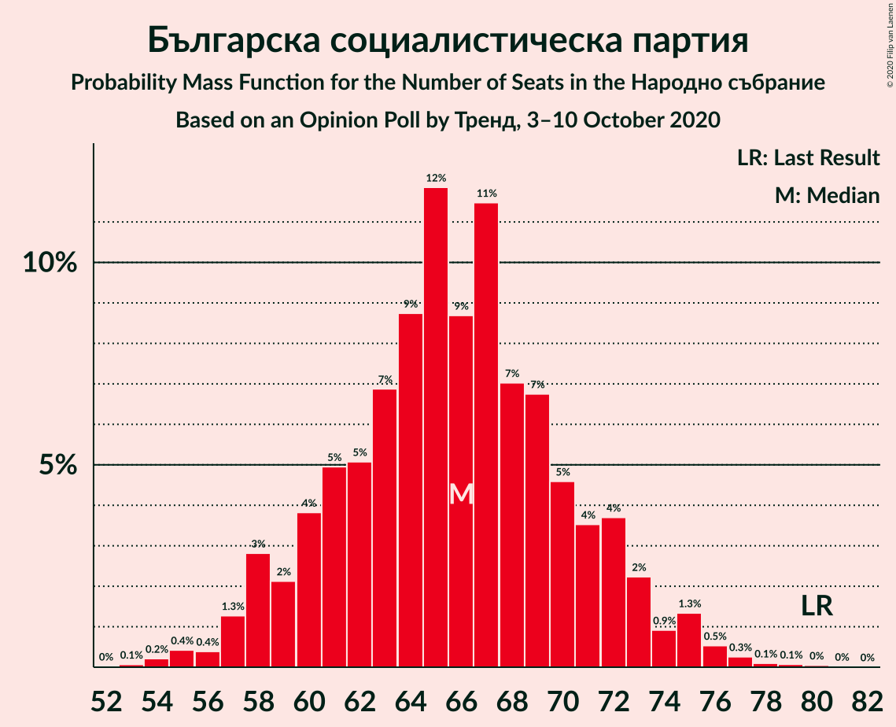

| Number of Seats | Probability | Accumulated | Special Marks |
|:---------------:|:-----------:|:-----------:|:-------------:|
| 53 | 0.1% | 100% |  |
| 54 | 0.2% | 99.9% |  |
| 55 | 0.4% | 99.7% |  |
| 56 | 0.4% | 99.3% |  |
| 57 | 1.3% | 98.9% |  |
| 58 | 3% | 98% |  |
| 59 | 2% | 95% |  |
| 60 | 4% | 93% |  |
| 61 | 5% | 89% |  |
| 62 | 5% | 84% |  |
| 63 | 7% | 79% |  |
| 64 | 9% | 72% |  |
| 65 | 12% | 63% |  |
| 66 | 9% | 51% | Median |
| 67 | 11% | 43% |  |
| 68 | 7% | 31% |  |
| 69 | 7% | 24% |  |
| 70 | 5% | 17% |  |
| 71 | 4% | 13% |  |
| 72 | 4% | 9% |  |
| 73 | 2% | 6% |  |
| 74 | 0.9% | 3% |  |
| 75 | 1.3% | 2% |  |
| 76 | 0.5% | 1.0% |  |
| 77 | 0.3% | 0.5% |  |
| 78 | 0.1% | 0.3% |  |
| 79 | 0.1% | 0.2% |  |
| 80 | 0% | 0.1% | Last Result |
| 81 | 0% | 0% |  |

### Има такъв народ

*For a full overview of the results for this party, see the [Има такъв народ](party-иматакъвнарод.html) page.*

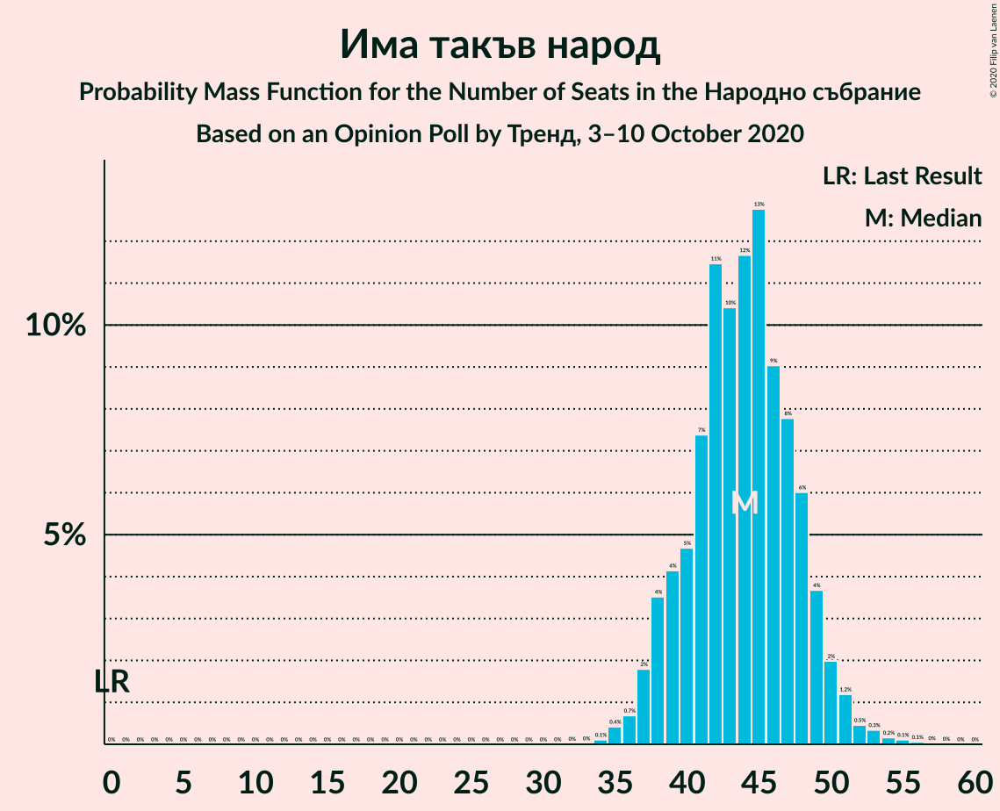

| Number of Seats | Probability | Accumulated | Special Marks |
|:---------------:|:-----------:|:-----------:|:-------------:|
| 0 | 0% | 100% | Last Result |
| 1 | 0% | 100% |  |
| 2 | 0% | 100% |  |
| 3 | 0% | 100% |  |
| 4 | 0% | 100% |  |
| 5 | 0% | 100% |  |
| 6 | 0% | 100% |  |
| 7 | 0% | 100% |  |
| 8 | 0% | 100% |  |
| 9 | 0% | 100% |  |
| 10 | 0% | 100% |  |
| 11 | 0% | 100% |  |
| 12 | 0% | 100% |  |
| 13 | 0% | 100% |  |
| 14 | 0% | 100% |  |
| 15 | 0% | 100% |  |
| 16 | 0% | 100% |  |
| 17 | 0% | 100% |  |
| 18 | 0% | 100% |  |
| 19 | 0% | 100% |  |
| 20 | 0% | 100% |  |
| 21 | 0% | 100% |  |
| 22 | 0% | 100% |  |
| 23 | 0% | 100% |  |
| 24 | 0% | 100% |  |
| 25 | 0% | 100% |  |
| 26 | 0% | 100% |  |
| 27 | 0% | 100% |  |
| 28 | 0% | 100% |  |
| 29 | 0% | 100% |  |
| 30 | 0% | 100% |  |
| 31 | 0% | 100% |  |
| 32 | 0% | 100% |  |
| 33 | 0% | 100% |  |
| 34 | 0.1% | 100% |  |
| 35 | 0.4% | 99.8% |  |
| 36 | 0.7% | 99.4% |  |
| 37 | 2% | 98.7% |  |
| 38 | 4% | 97% |  |
| 39 | 4% | 93% |  |
| 40 | 5% | 89% |  |
| 41 | 7% | 85% |  |
| 42 | 11% | 77% |  |
| 43 | 10% | 66% |  |
| 44 | 12% | 55% | Median |
| 45 | 13% | 44% |  |
| 46 | 9% | 31% |  |
| 47 | 8% | 22% |  |
| 48 | 6% | 14% |  |
| 49 | 4% | 8% |  |
| 50 | 2% | 4% |  |
| 51 | 1.2% | 2% |  |
| 52 | 0.5% | 1.2% |  |
| 53 | 0.3% | 0.7% |  |
| 54 | 0.2% | 0.4% |  |
| 55 | 0.1% | 0.2% |  |
| 56 | 0.1% | 0.1% |  |
| 57 | 0% | 0% |  |

### Движение за права и свободи

*For a full overview of the results for this party, see the [Движение за права и свободи](party-движениезаправаисвободи.html) page.*

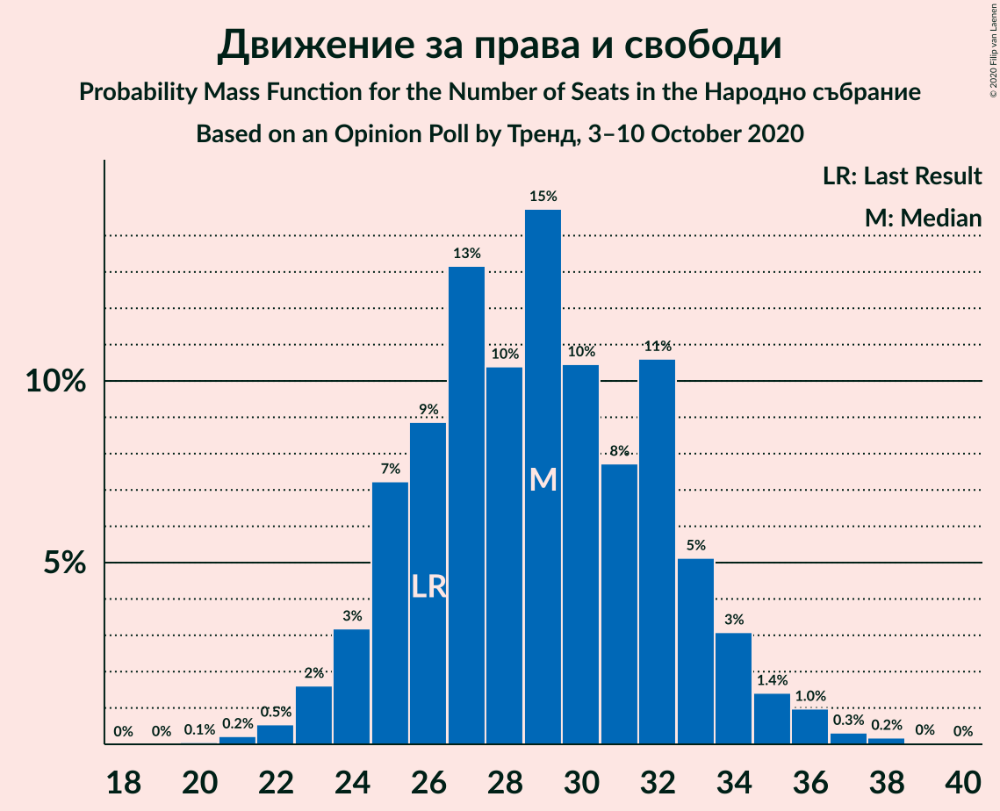

| Number of Seats | Probability | Accumulated | Special Marks |
|:---------------:|:-----------:|:-----------:|:-------------:|
| 20 | 0.1% | 100% |  |
| 21 | 0.2% | 99.9% |  |
| 22 | 0.5% | 99.7% |  |
| 23 | 2% | 99.2% |  |
| 24 | 3% | 98% |  |
| 25 | 7% | 94% |  |
| 26 | 9% | 87% | Last Result |
| 27 | 13% | 78% |  |
| 28 | 10% | 65% |  |
| 29 | 15% | 55% | Median |
| 30 | 10% | 40% |  |
| 31 | 8% | 30% |  |
| 32 | 11% | 22% |  |
| 33 | 5% | 11% |  |
| 34 | 3% | 6% |  |
| 35 | 1.4% | 3% |  |
| 36 | 1.0% | 2% |  |
| 37 | 0.3% | 0.6% |  |
| 38 | 0.2% | 0.2% |  |
| 39 | 0% | 0.1% |  |
| 40 | 0% | 0% |  |

### Демократична България

*For a full overview of the results for this party, see the [Демократична България](party-демократичнабългария.html) page.*

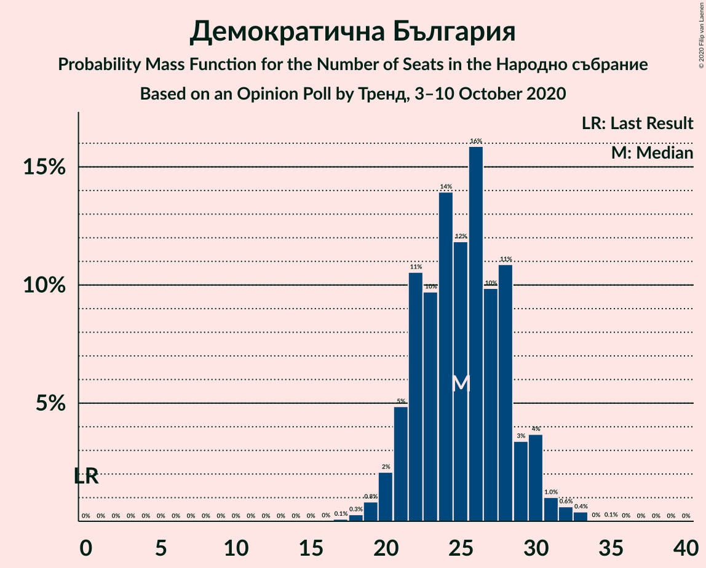

| Number of Seats | Probability | Accumulated | Special Marks |
|:---------------:|:-----------:|:-----------:|:-------------:|
| 0 | 0% | 100% | Last Result |
| 1 | 0% | 100% |  |
| 2 | 0% | 100% |  |
| 3 | 0% | 100% |  |
| 4 | 0% | 100% |  |
| 5 | 0% | 100% |  |
| 6 | 0% | 100% |  |
| 7 | 0% | 100% |  |
| 8 | 0% | 100% |  |
| 9 | 0% | 100% |  |
| 10 | 0% | 100% |  |
| 11 | 0% | 100% |  |
| 12 | 0% | 100% |  |
| 13 | 0% | 100% |  |
| 14 | 0% | 100% |  |
| 15 | 0% | 100% |  |
| 16 | 0% | 100% |  |
| 17 | 0.1% | 100% |  |
| 18 | 0.3% | 99.9% |  |
| 19 | 0.8% | 99.6% |  |
| 20 | 2% | 98.8% |  |
| 21 | 5% | 97% |  |
| 22 | 11% | 92% |  |
| 23 | 10% | 81% |  |
| 24 | 14% | 72% |  |
| 25 | 12% | 58% | Median |
| 26 | 16% | 46% |  |
| 27 | 10% | 30% |  |
| 28 | 11% | 20% |  |
| 29 | 3% | 9% |  |
| 30 | 4% | 6% |  |
| 31 | 1.0% | 2% |  |
| 32 | 0.6% | 1.1% |  |
| 33 | 0.4% | 0.5% |  |
| 34 | 0% | 0.1% |  |
| 35 | 0.1% | 0.1% |  |
| 36 | 0% | 0% |  |

### Изправи се Бг

*For a full overview of the results for this party, see the [Изправи се Бг](party-изправисебг.html) page.*

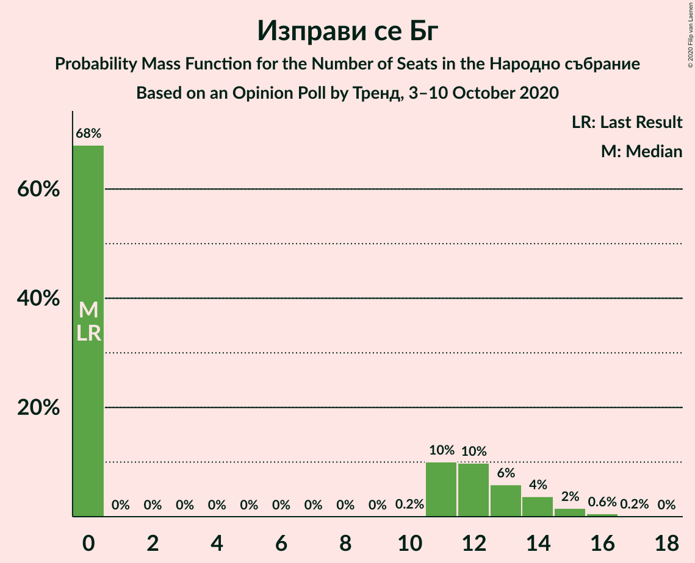

| Number of Seats | Probability | Accumulated | Special Marks |
|:---------------:|:-----------:|:-----------:|:-------------:|
| 0 | 68% | 100% | Last Result, Median |
| 1 | 0% | 32% |  |
| 2 | 0% | 32% |  |
| 3 | 0% | 32% |  |
| 4 | 0% | 32% |  |
| 5 | 0% | 32% |  |
| 6 | 0% | 32% |  |
| 7 | 0% | 32% |  |
| 8 | 0% | 32% |  |
| 9 | 0% | 32% |  |
| 10 | 0.2% | 32% |  |
| 11 | 10% | 32% |  |
| 12 | 10% | 22% |  |
| 13 | 6% | 12% |  |
| 14 | 4% | 6% |  |
| 15 | 2% | 2% |  |
| 16 | 0.6% | 0.8% |  |
| 17 | 0.2% | 0.2% |  |
| 18 | 0% | 0% |  |

### Обединени Патриоти

*For a full overview of the results for this party, see the [Обединени Патриоти](party-обединенипатриоти.html) page.*

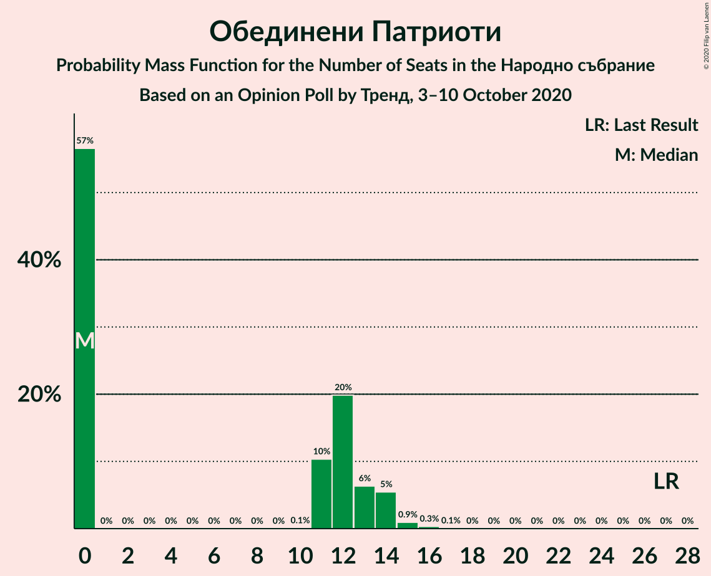

| Number of Seats | Probability | Accumulated | Special Marks |
|:---------------:|:-----------:|:-----------:|:-------------:|
| 0 | 57% | 100% | Median |
| 1 | 0% | 43% |  |
| 2 | 0% | 43% |  |
| 3 | 0% | 43% |  |
| 4 | 0% | 43% |  |
| 5 | 0% | 43% |  |
| 6 | 0% | 43% |  |
| 7 | 0% | 43% |  |
| 8 | 0% | 43% |  |
| 9 | 0% | 43% |  |
| 10 | 0.1% | 43% |  |
| 11 | 10% | 43% |  |
| 12 | 20% | 33% |  |
| 13 | 6% | 13% |  |
| 14 | 5% | 7% |  |
| 15 | 0.9% | 1.3% |  |
| 16 | 0.3% | 0.4% |  |
| 17 | 0.1% | 0.1% |  |
| 18 | 0% | 0% |  |
| 19 | 0% | 0% |  |
| 20 | 0% | 0% |  |
| 21 | 0% | 0% |  |
| 22 | 0% | 0% |  |
| 23 | 0% | 0% |  |
| 24 | 0% | 0% |  |
| 25 | 0% | 0% |  |
| 26 | 0% | 0% |  |
| 27 | 0% | 0% | Last Result |

### Воля

*For a full overview of the results for this party, see the [Воля](party-воля.html) page.*

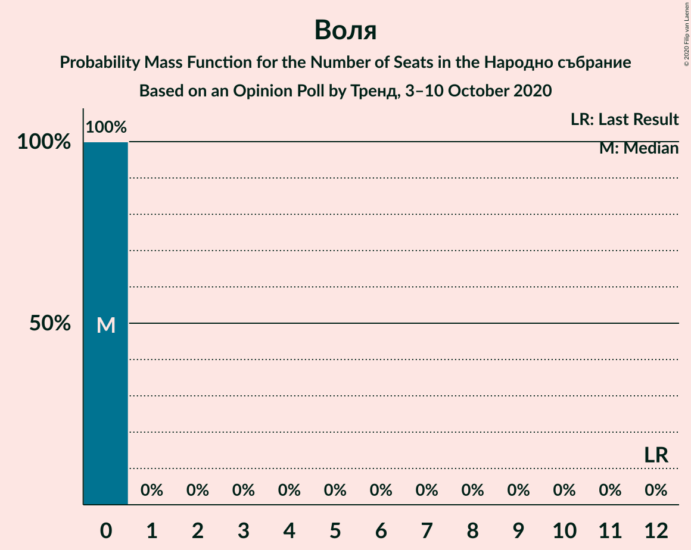

| Number of Seats | Probability | Accumulated | Special Marks |
|:---------------:|:-----------:|:-----------:|:-------------:|
| 0 | 100% | 100% | Median |
| 1 | 0% | 0% |  |
| 2 | 0% | 0% |  |
| 3 | 0% | 0% |  |
| 4 | 0% | 0% |  |
| 5 | 0% | 0% |  |
| 6 | 0% | 0% |  |
| 7 | 0% | 0% |  |
| 8 | 0% | 0% |  |
| 9 | 0% | 0% |  |
| 10 | 0% | 0% |  |
| 11 | 0% | 0% |  |
| 12 | 0% | 0% | Last Result |

## Coalitions

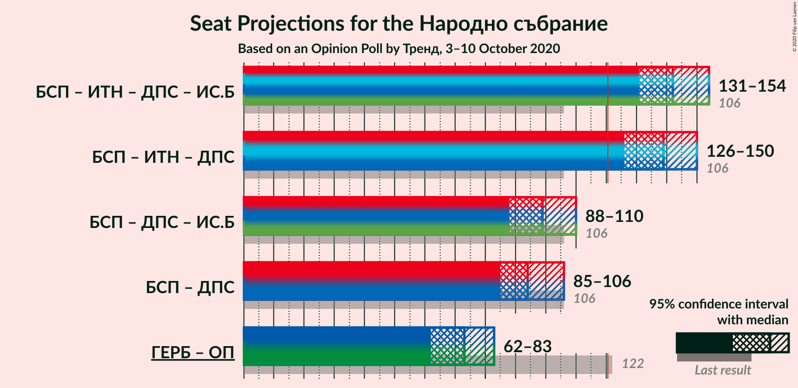

### Confidence Intervals

| Coalition | Last Result | Median | Majority? | 80% Confidence Interval | 90% Confidence Interval | 95% Confidence Interval | 99% Confidence Interval |
|:---------:|:-----------:|:------:|:---------:|:-----------------------:|:-----------------------:|:-----------------------:|:-----------------------:|
| Българска социалистическа партия – Има такъв народ – Движение за права и свободи – Изправи се Бг | 106 | 142 | 100% | 135–151 | 133–153 | 131–154 | 128–157 |
| Българска социалистическа партия – Има такъв народ – Движение за права и свободи | 106 | 139 | 99.9% | 130–146 | 128–149 | 126–150 | 123–153 |
| Българска социалистическа партия – Движение за права и свободи – Изправи се Бг | 106 | 99 | 0% | 91–106 | 89–108 | 88–110 | 86–114 |
| Българска социалистическа партия – Движение за права и свободи | 106 | 94 | 0% | 88–101 | 86–104 | 85–106 | 82–107 |
| Граждани за европейско развитие на България – Обединени Патриоти | 122 | 73 | 0% | 65–80 | 63–82 | 62–83 | 59–87 |

### Българска социалистическа партия – Има такъв народ – Движение за права и свободи – Изправи се Бг

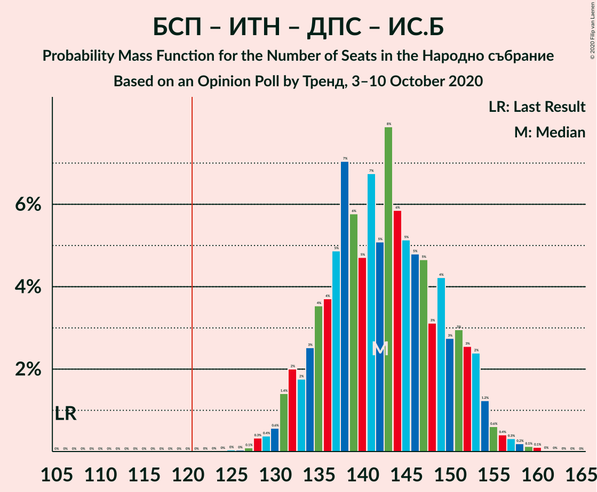

| Number of Seats | Probability | Accumulated | Special Marks |
|:---------------:|:-----------:|:-----------:|:-------------:|
| 106 | 0% | 100% | Last Result |
| 107 | 0% | 100% |  |
| 108 | 0% | 100% |  |
| 109 | 0% | 100% |  |
| 110 | 0% | 100% |  |
| 111 | 0% | 100% |  |
| 112 | 0% | 100% |  |
| 113 | 0% | 100% |  |
| 114 | 0% | 100% |  |
| 115 | 0% | 100% |  |
| 116 | 0% | 100% |  |
| 117 | 0% | 100% |  |
| 118 | 0% | 100% |  |
| 119 | 0% | 100% |  |
| 120 | 0% | 100% |  |
| 121 | 0% | 100% | Majority |
| 122 | 0% | 100% |  |
| 123 | 0% | 100% |  |
| 124 | 0% | 100% |  |
| 125 | 0% | 100% |  |
| 126 | 0% | 99.9% |  |
| 127 | 0.1% | 99.9% |  |
| 128 | 0.3% | 99.8% |  |
| 129 | 0.4% | 99.5% |  |
| 130 | 0.6% | 99.1% |  |
| 131 | 1.4% | 98.5% |  |
| 132 | 2% | 97% |  |
| 133 | 2% | 95% |  |
| 134 | 3% | 93% |  |
| 135 | 4% | 91% |  |
| 136 | 4% | 87% |  |
| 137 | 5% | 84% |  |
| 138 | 7% | 79% |  |
| 139 | 6% | 72% | Median |
| 140 | 5% | 66% |  |
| 141 | 7% | 61% |  |
| 142 | 5% | 54% |  |
| 143 | 8% | 49% |  |
| 144 | 6% | 41% |  |
| 145 | 5% | 36% |  |
| 146 | 5% | 30% |  |
| 147 | 5% | 26% |  |
| 148 | 3% | 21% |  |
| 149 | 4% | 18% |  |
| 150 | 3% | 14% |  |
| 151 | 3% | 11% |  |
| 152 | 3% | 8% |  |
| 153 | 2% | 5% |  |
| 154 | 1.2% | 3% |  |
| 155 | 0.6% | 2% |  |
| 156 | 0.4% | 1.2% |  |
| 157 | 0.3% | 0.8% |  |
| 158 | 0.2% | 0.5% |  |
| 159 | 0.1% | 0.3% |  |
| 160 | 0.1% | 0.2% |  |
| 161 | 0% | 0.1% |  |
| 162 | 0% | 0% |  |

### Българска социалистическа партия – Има такъв народ – Движение за права и свободи

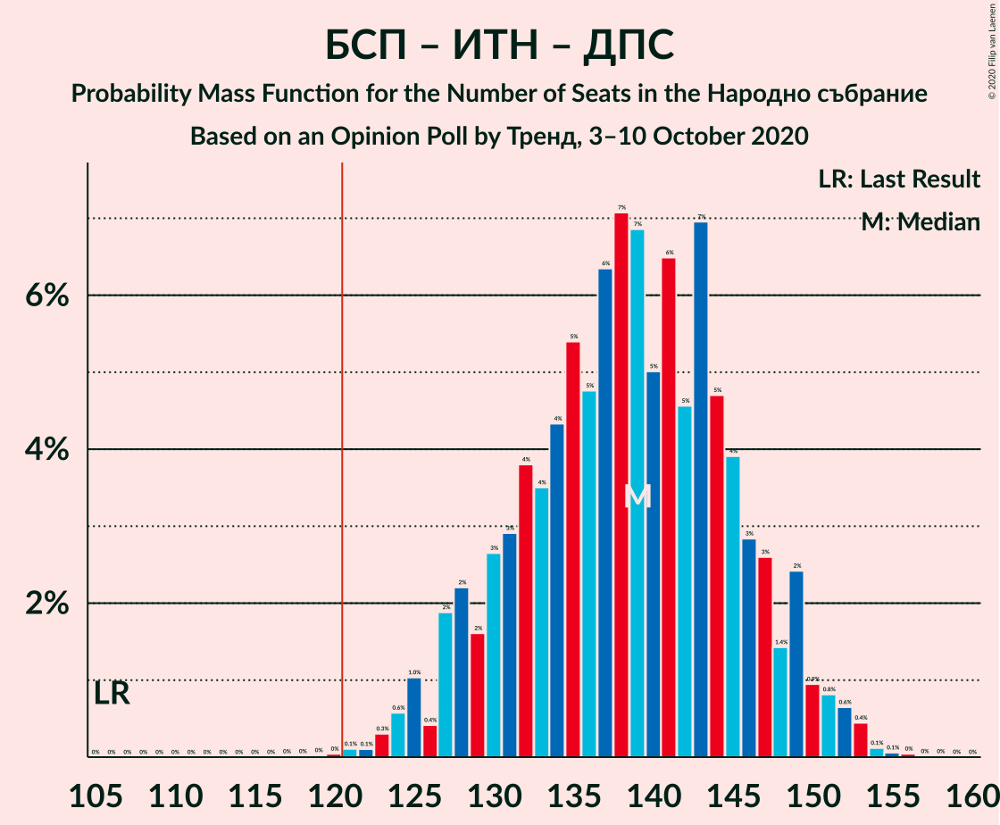

| Number of Seats | Probability | Accumulated | Special Marks |
|:---------------:|:-----------:|:-----------:|:-------------:|
| 106 | 0% | 100% | Last Result |
| 107 | 0% | 100% |  |
| 108 | 0% | 100% |  |
| 109 | 0% | 100% |  |
| 110 | 0% | 100% |  |
| 111 | 0% | 100% |  |
| 112 | 0% | 100% |  |
| 113 | 0% | 100% |  |
| 114 | 0% | 100% |  |
| 115 | 0% | 100% |  |
| 116 | 0% | 100% |  |
| 117 | 0% | 100% |  |
| 118 | 0% | 100% |  |
| 119 | 0% | 100% |  |
| 120 | 0% | 100% |  |
| 121 | 0.1% | 99.9% | Majority |
| 122 | 0.1% | 99.8% |  |
| 123 | 0.3% | 99.7% |  |
| 124 | 0.6% | 99.4% |  |
| 125 | 1.0% | 98.8% |  |
| 126 | 0.4% | 98% |  |
| 127 | 2% | 97% |  |
| 128 | 2% | 95% |  |
| 129 | 2% | 93% |  |
| 130 | 3% | 92% |  |
| 131 | 3% | 89% |  |
| 132 | 4% | 86% |  |
| 133 | 4% | 82% |  |
| 134 | 4% | 79% |  |
| 135 | 5% | 74% |  |
| 136 | 5% | 69% |  |
| 137 | 6% | 64% |  |
| 138 | 7% | 58% |  |
| 139 | 7% | 51% | Median |
| 140 | 5% | 44% |  |
| 141 | 6% | 39% |  |
| 142 | 5% | 33% |  |
| 143 | 7% | 28% |  |
| 144 | 5% | 21% |  |
| 145 | 4% | 16% |  |
| 146 | 3% | 12% |  |
| 147 | 3% | 10% |  |
| 148 | 1.4% | 7% |  |
| 149 | 2% | 6% |  |
| 150 | 0.9% | 3% |  |
| 151 | 0.8% | 2% |  |
| 152 | 0.6% | 1.3% |  |
| 153 | 0.4% | 0.7% |  |
| 154 | 0.1% | 0.2% |  |
| 155 | 0.1% | 0.1% |  |
| 156 | 0% | 0.1% |  |
| 157 | 0% | 0% |  |

### Българска социалистическа партия – Движение за права и свободи – Изправи се Бг

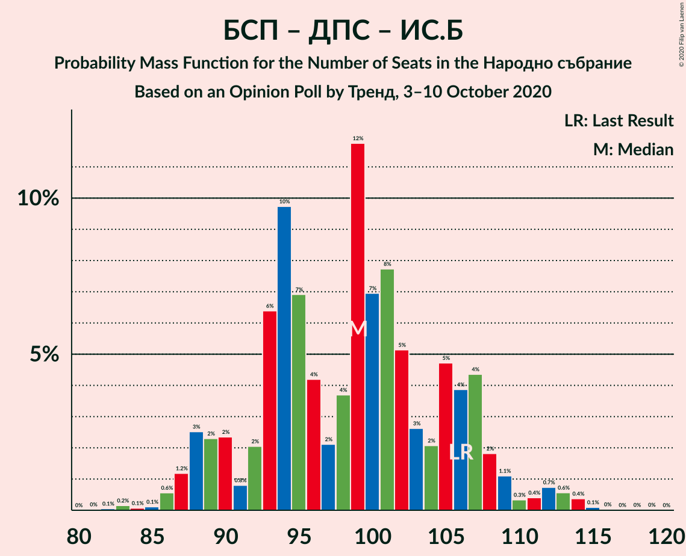

| Number of Seats | Probability | Accumulated | Special Marks |
|:---------------:|:-----------:|:-----------:|:-------------:|
| 82 | 0.1% | 100% |  |
| 83 | 0.2% | 99.9% |  |
| 84 | 0.1% | 99.8% |  |
| 85 | 0.1% | 99.7% |  |
| 86 | 0.6% | 99.6% |  |
| 87 | 1.2% | 99.0% |  |
| 88 | 3% | 98% |  |
| 89 | 2% | 95% |  |
| 90 | 2% | 93% |  |
| 91 | 0.8% | 91% |  |
| 92 | 2% | 90% |  |
| 93 | 6% | 88% |  |
| 94 | 10% | 81% |  |
| 95 | 7% | 72% | Median |
| 96 | 4% | 65% |  |
| 97 | 2% | 61% |  |
| 98 | 4% | 58% |  |
| 99 | 12% | 55% |  |
| 100 | 7% | 43% |  |
| 101 | 8% | 36% |  |
| 102 | 5% | 28% |  |
| 103 | 3% | 23% |  |
| 104 | 2% | 21% |  |
| 105 | 5% | 18% |  |
| 106 | 4% | 14% | Last Result |
| 107 | 4% | 10% |  |
| 108 | 2% | 6% |  |
| 109 | 1.1% | 4% |  |
| 110 | 0.3% | 3% |  |
| 111 | 0.4% | 2% |  |
| 112 | 0.7% | 2% |  |
| 113 | 0.6% | 1.1% |  |
| 114 | 0.4% | 0.5% |  |
| 115 | 0.1% | 0.2% |  |
| 116 | 0% | 0.1% |  |
| 117 | 0% | 0% |  |

### Българска социалистическа партия – Движение за права и свободи

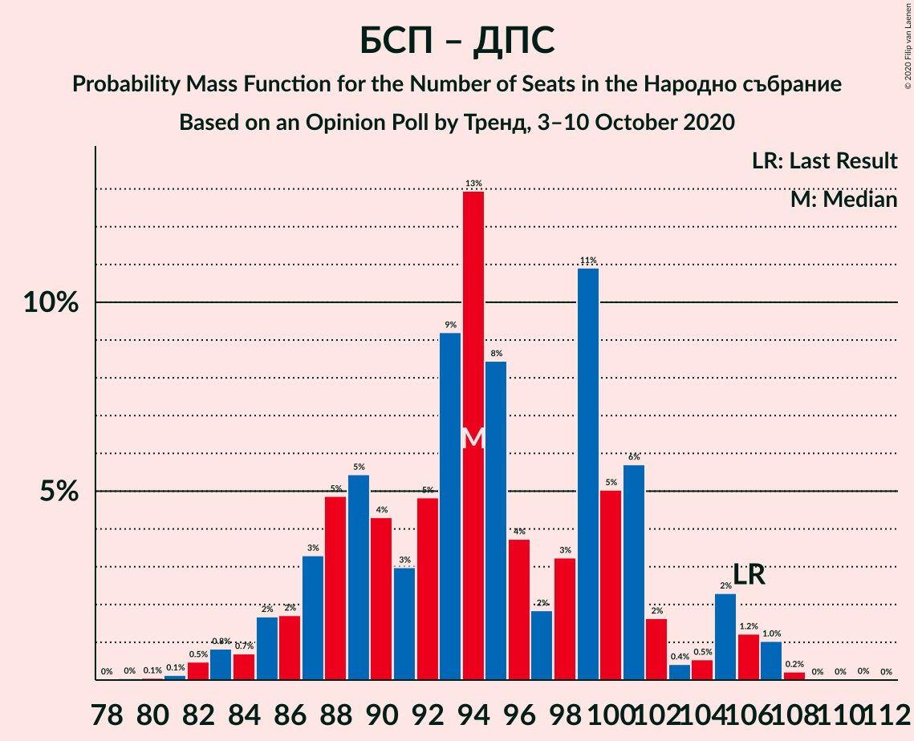

| Number of Seats | Probability | Accumulated | Special Marks |
|:---------------:|:-----------:|:-----------:|:-------------:|
| 79 | 0% | 100% |  |
| 80 | 0.1% | 99.9% |  |
| 81 | 0.1% | 99.8% |  |
| 82 | 0.5% | 99.7% |  |
| 83 | 0.8% | 99.2% |  |
| 84 | 0.7% | 98% |  |
| 85 | 2% | 98% |  |
| 86 | 2% | 96% |  |
| 87 | 3% | 94% |  |
| 88 | 5% | 91% |  |
| 89 | 5% | 86% |  |
| 90 | 4% | 81% |  |
| 91 | 3% | 76% |  |
| 92 | 5% | 73% |  |
| 93 | 9% | 69% |  |
| 94 | 13% | 59% |  |
| 95 | 8% | 46% | Median |
| 96 | 4% | 38% |  |
| 97 | 2% | 34% |  |
| 98 | 3% | 32% |  |
| 99 | 11% | 29% |  |
| 100 | 5% | 18% |  |
| 101 | 6% | 13% |  |
| 102 | 2% | 8% |  |
| 103 | 0.4% | 6% |  |
| 104 | 0.5% | 5% |  |
| 105 | 2% | 5% |  |
| 106 | 1.2% | 3% | Last Result |
| 107 | 1.0% | 1.4% |  |
| 108 | 0.2% | 0.3% |  |
| 109 | 0% | 0.1% |  |
| 110 | 0% | 0.1% |  |
| 111 | 0% | 0.1% |  |
| 112 | 0% | 0% |  |

### Граждани за европейско развитие на България – Обединени Патриоти

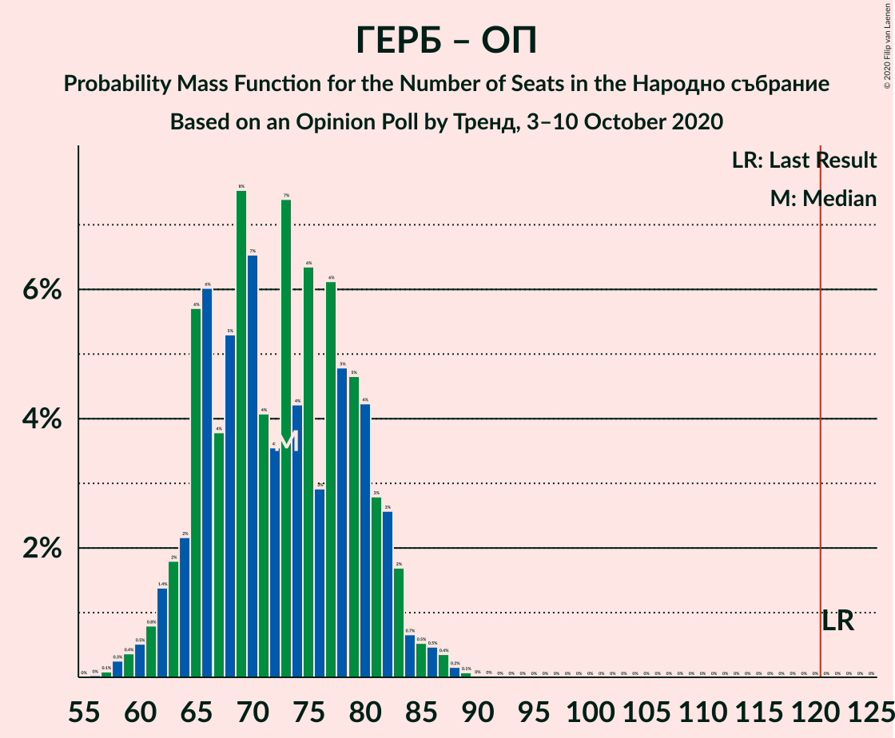

| Number of Seats | Probability | Accumulated | Special Marks |
|:---------------:|:-----------:|:-----------:|:-------------:|
| 57 | 0.1% | 100% |  |
| 58 | 0.3% | 99.9% |  |
| 59 | 0.4% | 99.6% |  |
| 60 | 0.5% | 99.2% |  |
| 61 | 0.8% | 98.7% |  |
| 62 | 1.4% | 98% |  |
| 63 | 2% | 97% |  |
| 64 | 2% | 95% |  |
| 65 | 6% | 93% |  |
| 66 | 6% | 87% |  |
| 67 | 4% | 81% | Median |
| 68 | 5% | 77% |  |
| 69 | 8% | 72% |  |
| 70 | 7% | 64% |  |
| 71 | 4% | 58% |  |
| 72 | 4% | 54% |  |
| 73 | 7% | 50% |  |
| 74 | 4% | 43% |  |
| 75 | 6% | 38% |  |
| 76 | 3% | 32% |  |
| 77 | 6% | 29% |  |
| 78 | 5% | 23% |  |
| 79 | 5% | 18% |  |
| 80 | 4% | 14% |  |
| 81 | 3% | 9% |  |
| 82 | 3% | 7% |  |
| 83 | 2% | 4% |  |
| 84 | 0.7% | 2% |  |
| 85 | 0.5% | 2% |  |
| 86 | 0.5% | 1.1% |  |
| 87 | 0.4% | 0.6% |  |
| 88 | 0.2% | 0.3% |  |
| 89 | 0.1% | 0.1% |  |
| 90 | 0% | 0% |  |
| 91 | 0% | 0% |  |
| 92 | 0% | 0% |  |
| 93 | 0% | 0% |  |
| 94 | 0% | 0% |  |
| 95 | 0% | 0% |  |
| 96 | 0% | 0% |  |
| 97 | 0% | 0% |  |
| 98 | 0% | 0% |  |
| 99 | 0% | 0% |  |
| 100 | 0% | 0% |  |
| 101 | 0% | 0% |  |
| 102 | 0% | 0% |  |
| 103 | 0% | 0% |  |
| 104 | 0% | 0% |  |
| 105 | 0% | 0% |  |
| 106 | 0% | 0% |  |
| 107 | 0% | 0% |  |
| 108 | 0% | 0% |  |
| 109 | 0% | 0% |  |
| 110 | 0% | 0% |  |
| 111 | 0% | 0% |  |
| 112 | 0% | 0% |  |
| 113 | 0% | 0% |  |
| 114 | 0% | 0% |  |
| 115 | 0% | 0% |  |
| 116 | 0% | 0% |  |
| 117 | 0% | 0% |  |
| 118 | 0% | 0% |  |
| 119 | 0% | 0% |  |
| 120 | 0% | 0% |  |
| 121 | 0% | 0% | Majority |
| 122 | 0% | 0% | Last Result |

## Technical Information

### Opinion Poll

+ **Polling firm:** Тренд
+ **Commissioner(s):** —
+ **Fieldwork period:** 3–10 October 2020

### Calculations

+ **Sample size:** 1008
+ **Simulations done:** 1,048,576
+ **Error estimate:** 0.56%

