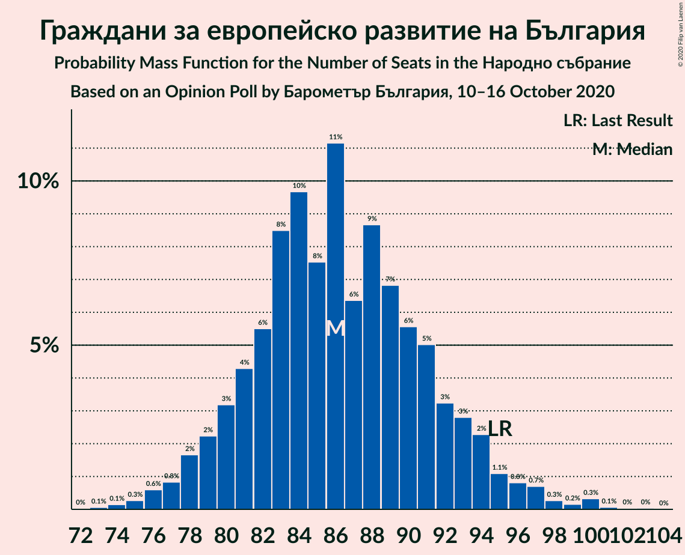
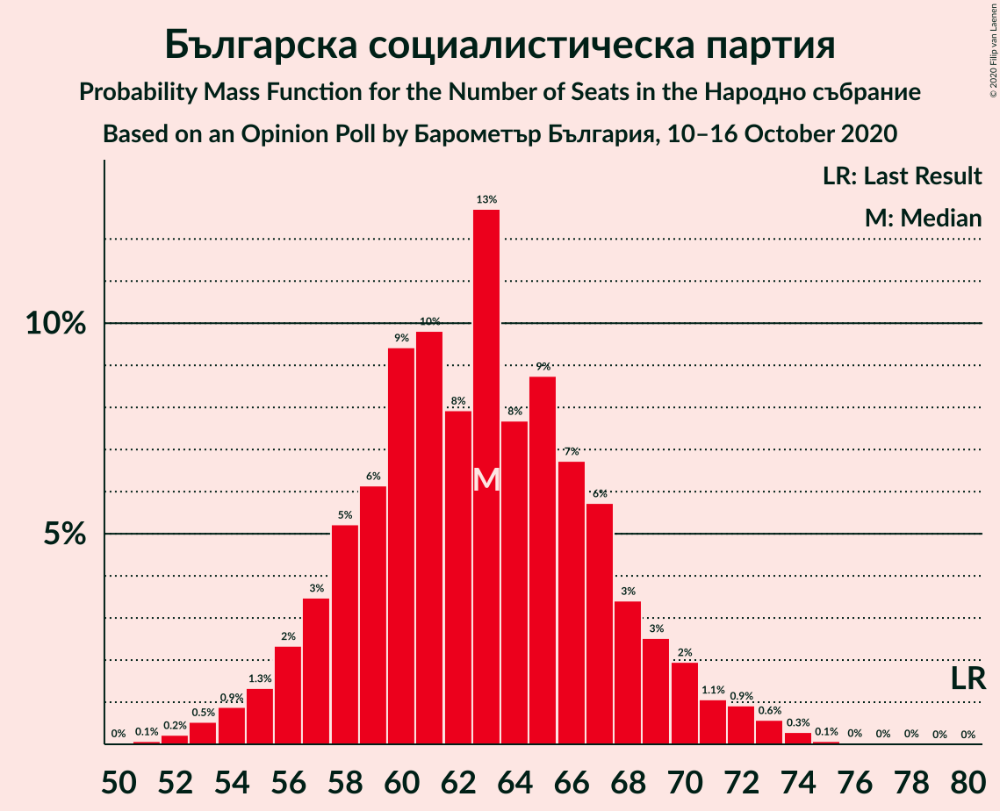
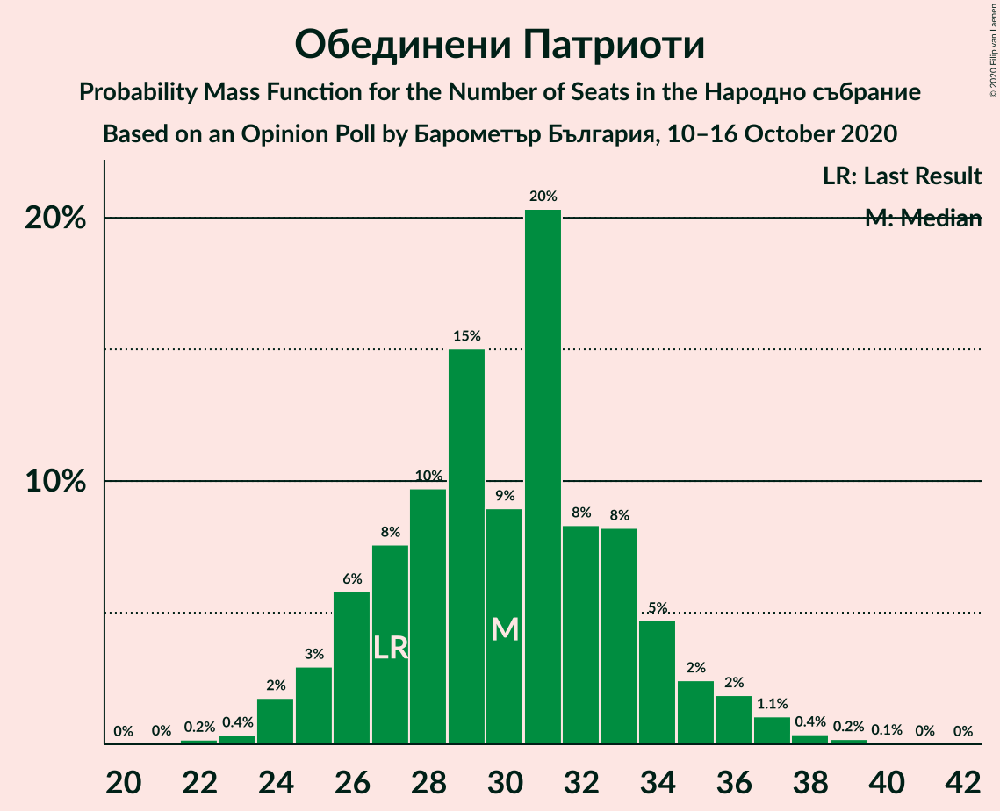
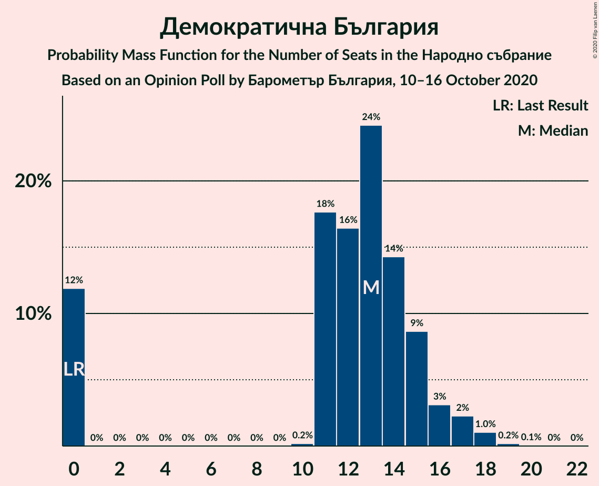
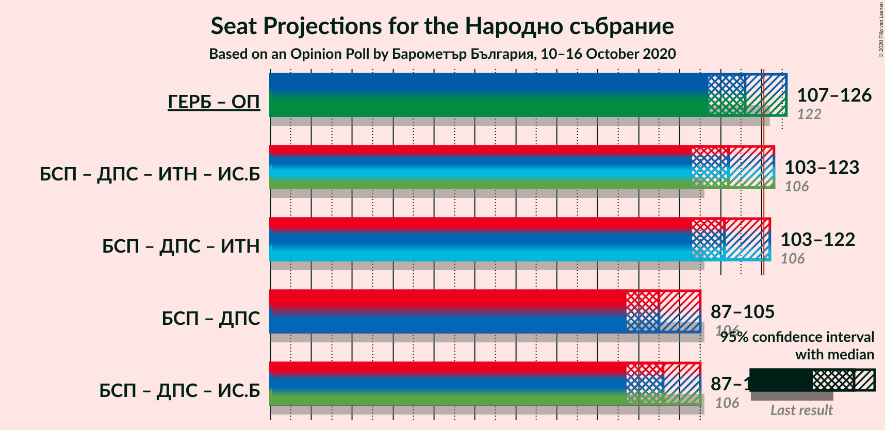
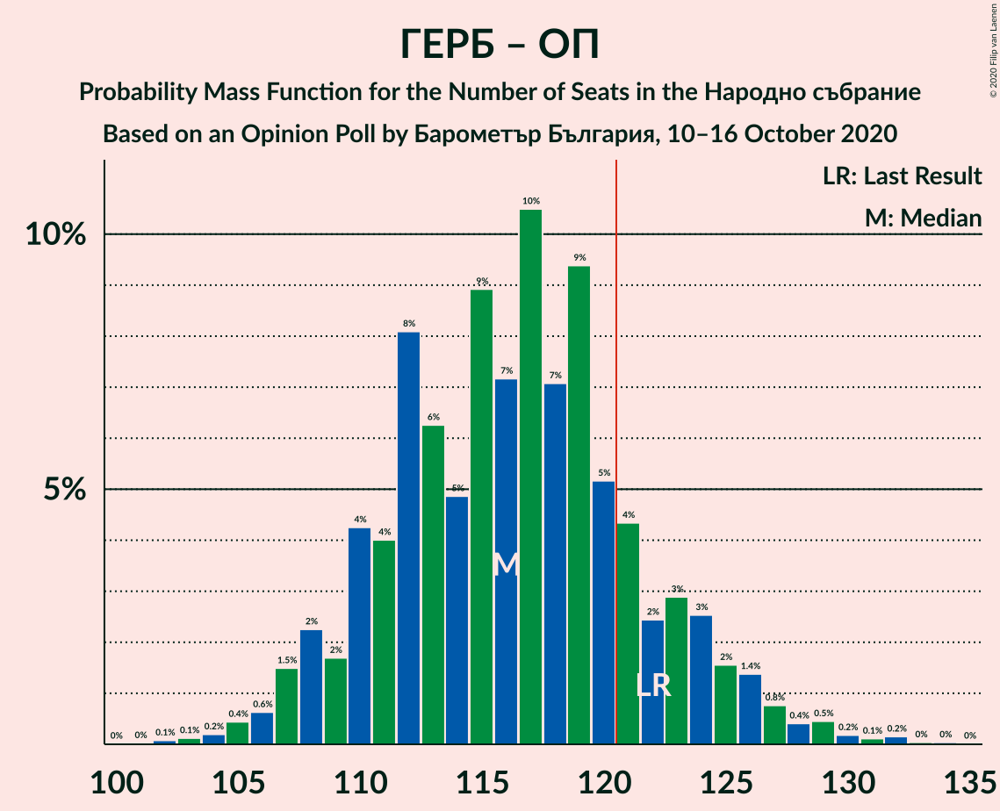
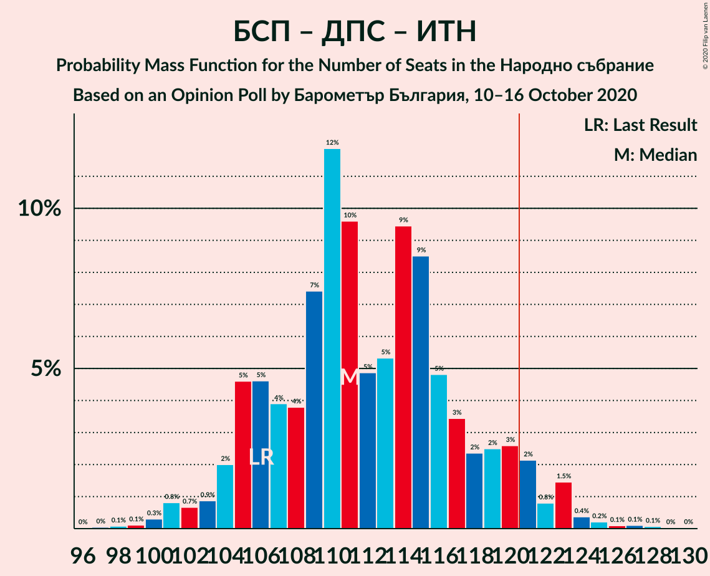
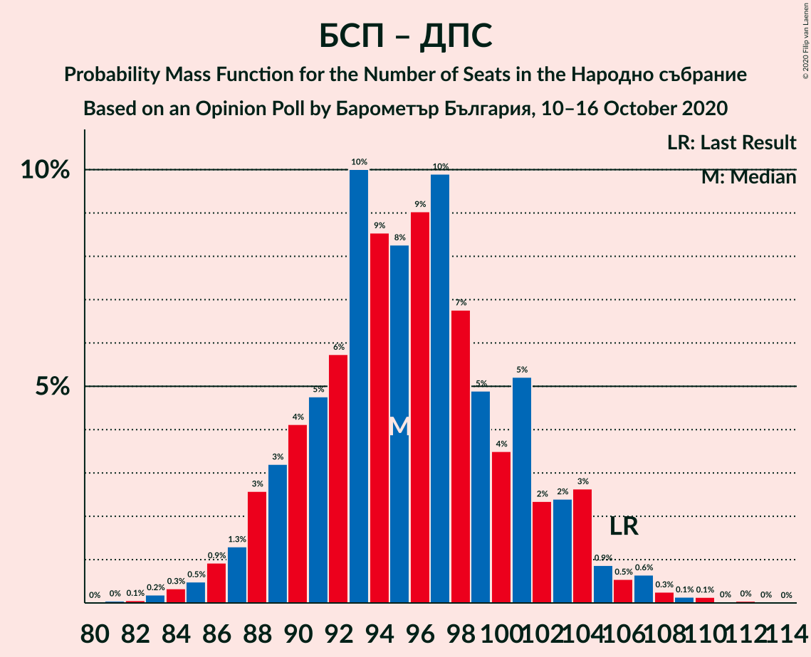

# Opinion Poll by Барометър България, 10–16 October 2020

<a href="#voting-intentions">Voting Intentions</a> | <a href="#seats">Seats</a> | <a href="#coalitions">Coalitions</a> | <a href="#technical-information">Technical Information</a>

## Voting Intentions

### Confidence Intervals

| Party | Last Result | Poll Result | 80% Confidence Interval | 90% Confidence Interval | 95% Confidence Interval | 99% Confidence Interval |
|:-----:|:-----------:|:-----------:|:-----------------------:|:-----------------------:|:-----------------------:|:-----------------------:|
| Граждани за европейско развитие на България | 33.5% | 32.7% | 30.7–34.8% |30.1–35.4% |29.6–35.9% |28.7–36.9% |
| Българска социалистическа партия | 27.9% | 23.7% | 21.9–25.6% |21.4–26.2% |21.0–26.6% |20.1–27.6% |
| Движение за права и свободи | 9.2% | 12.4% | 11.0–13.9% |10.6–14.3% |10.3–14.7% |9.7–15.5% |
| Обединени Патриоти | 9.3% | 11.3% | 10.0–12.8% |9.7–13.2% |9.4–13.6% |8.8–14.4% |
| Има такъв народ | 0.0% | 6.1% | 5.2–7.3% |4.9–7.6% |4.7–7.9% |4.3–8.5% |
| Демократична България | 0.0% | 4.7% | 3.9–5.8% |3.7–6.1% |3.5–6.4% |3.2–6.9% |
| Изправи се Бг | 0.0% | 2.7% | 2.1–3.5% |1.9–3.7% |1.8–4.0% |1.5–4.4% |
| Воля | 4.3% | 1.2% | 0.8–1.8% |0.7–2.0% |0.6–2.1% |0.5–2.5% |

*Note:* The poll result column reflects the actual value used in the calculations. Published results may vary slightly, and in addition be rounded to fewer digits.

## Seats

### Confidence Intervals

| Party | Last Result | Median | 80% Confidence Interval | 90% Confidence Interval | 95% Confidence Interval | 99% Confidence Interval |
|:-----:|:-----------:|:------:|:-----------------------:|:-----------------------:|:-----------------------:|:-----------------------:|
| <a href="#граждани-за-европейско-развитие-на-българия">Граждани за европейско развитие на България</a> | 95 | 86 | 81–92 |79–94 |78–95 |75–99 |
| <a href="#българска-социалистическа-партия">Българска социалистическа партия</a> | 80 | 63 | 58–68 |56–69 |55–71 |53–73 |
| <a href="#движение-за-права-и-свободи">Движение за права и свободи</a> | 26 | 33 | 29–37 |28–38 |27–39 |26–41 |
| <a href="#обединени-патриоти">Обединени Патриоти</a> | 27 | 30 | 26–34 |25–35 |25–36 |23–38 |
| <a href="#има-такъв-народ">Има такъв народ</a> | 0 | 16 | 14–19 |13–20 |12–21 |11–23 |
| <a href="#демократична-българия">Демократична България</a> | 0 | 13 | 0–15 |0–16 |0–17 |0–18 |
| <a href="#изправи-се-бг">Изправи се Бг</a> | 0 | 0 | 0 |0 |0 |0–11 |
| <a href="#воля">Воля</a> | 12 | 0 | 0 |0 |0 |0 |

### Граждани за европейско развитие на България

*For a full overview of the results for this party, see the [Граждани за европейско развитие на България](party-гражданизаевропейскоразвитиенабългария.html) page.*

| Number of Seats | Probability | Accumulated | Special Marks |
|:---------------:|:-----------:|:-----------:|:-------------:|
| 72 | 0% | 100% |  |
| 73 | 0.1% | 99.9% |  |
| 74 | 0.1% | 99.9% |  |
| 75 | 0.3% | 99.7% |  |
| 76 | 0.6% | 99.5% |  |
| 77 | 0.8% | 98.9% |  |
| 78 | 2% | 98% |  |
| 79 | 2% | 96% |  |
| 80 | 3% | 94% |  |
| 81 | 4% | 91% |  |
| 82 | 6% | 87% |  |
| 83 | 8% | 81% |  |
| 84 | 10% | 73% |  |
| 85 | 8% | 63% |  |
| 86 | 11% | 55% | Median |
| 87 | 6% | 44% |  |
| 88 | 9% | 38% |  |
| 89 | 7% | 29% |  |
| 90 | 6% | 22% |  |
| 91 | 5% | 17% |  |
| 92 | 3% | 12% |  |
| 93 | 3% | 9% |  |
| 94 | 2% | 6% |  |
| 95 | 1.1% | 4% | Last Result |
| 96 | 0.8% | 2% |  |
| 97 | 0.7% | 2% |  |
| 98 | 0.3% | 0.9% |  |
| 99 | 0.2% | 0.6% |  |
| 100 | 0.3% | 0.5% |  |
| 101 | 0.1% | 0.2% |  |
| 102 | 0% | 0.1% |  |
| 103 | 0% | 0.1% |  |
| 104 | 0% | 0% |  |

### Българска социалистическа партия

*For a full overview of the results for this party, see the [Българска социалистическа партия](party-българскасоциалистическапартия.html) page.*

| Number of Seats | Probability | Accumulated | Special Marks |
|:---------------:|:-----------:|:-----------:|:-------------:|
| 51 | 0.1% | 100% |  |
| 52 | 0.2% | 99.9% |  |
| 53 | 0.5% | 99.7% |  |
| 54 | 0.9% | 99.1% |  |
| 55 | 1.3% | 98% |  |
| 56 | 2% | 97% |  |
| 57 | 3% | 95% |  |
| 58 | 5% | 91% |  |
| 59 | 6% | 86% |  |
| 60 | 9% | 80% |  |
| 61 | 10% | 70% |  |
| 62 | 8% | 60% |  |
| 63 | 13% | 53% | Median |
| 64 | 8% | 40% |  |
| 65 | 9% | 32% |  |
| 66 | 7% | 23% |  |
| 67 | 6% | 17% |  |
| 68 | 3% | 11% |  |
| 69 | 3% | 8% |  |
| 70 | 2% | 5% |  |
| 71 | 1.1% | 3% |  |
| 72 | 0.9% | 2% |  |
| 73 | 0.6% | 1.0% |  |
| 74 | 0.3% | 0.5% |  |
| 75 | 0.1% | 0.2% |  |
| 76 | 0% | 0.1% |  |
| 77 | 0% | 0.1% |  |
| 78 | 0% | 0% |  |
| 79 | 0% | 0% |  |
| 80 | 0% | 0% | Last Result |

### Движение за права и свободи

*For a full overview of the results for this party, see the [Движение за права и свободи](party-движениезаправаисвободи.html) page.*

| Number of Seats | Probability | Accumulated | Special Marks |
|:---------------:|:-----------:|:-----------:|:-------------:|
| 24 | 0.1% | 100% |  |
| 25 | 0.3% | 99.9% |  |
| 26 | 0.9% | 99.6% | Last Result |
| 27 | 2% | 98.6% |  |
| 28 | 4% | 97% |  |
| 29 | 6% | 93% |  |
| 30 | 8% | 87% |  |
| 31 | 12% | 79% |  |
| 32 | 14% | 67% |  |
| 33 | 12% | 53% | Median |
| 34 | 15% | 41% |  |
| 35 | 8% | 26% |  |
| 36 | 7% | 18% |  |
| 37 | 4% | 11% |  |
| 38 | 4% | 7% |  |
| 39 | 2% | 4% |  |
| 40 | 0.9% | 2% |  |
| 41 | 0.4% | 0.7% |  |
| 42 | 0.2% | 0.3% |  |
| 43 | 0.1% | 0.1% |  |
| 44 | 0% | 0% |  |

### Обединени Патриоти

*For a full overview of the results for this party, see the [Обединени Патриоти](party-обединенипатриоти.html) page.*

| Number of Seats | Probability | Accumulated | Special Marks |
|:---------------:|:-----------:|:-----------:|:-------------:|
| 22 | 0.2% | 100% |  |
| 23 | 0.4% | 99.8% |  |
| 24 | 2% | 99.4% |  |
| 25 | 3% | 98% |  |
| 26 | 6% | 95% |  |
| 27 | 8% | 89% | Last Result |
| 28 | 10% | 81% |  |
| 29 | 15% | 72% |  |
| 30 | 9% | 57% | Median |
| 31 | 20% | 48% |  |
| 32 | 8% | 27% |  |
| 33 | 8% | 19% |  |
| 34 | 5% | 11% |  |
| 35 | 2% | 6% |  |
| 36 | 2% | 4% |  |
| 37 | 1.1% | 2% |  |
| 38 | 0.4% | 0.7% |  |
| 39 | 0.2% | 0.3% |  |
| 40 | 0.1% | 0.1% |  |
| 41 | 0% | 0% |  |

### Има такъв народ

*For a full overview of the results for this party, see the [Има такъв народ](party-иматакъвнарод.html) page.*

| Number of Seats | Probability | Accumulated | Special Marks |
|:---------------:|:-----------:|:-----------:|:-------------:|
| 0 | 0.1% | 100% | Last Result |
| 1 | 0% | 99.9% |  |
| 2 | 0% | 99.9% |  |
| 3 | 0% | 99.9% |  |
| 4 | 0% | 99.9% |  |
| 5 | 0% | 99.9% |  |
| 6 | 0% | 99.9% |  |
| 7 | 0% | 99.9% |  |
| 8 | 0% | 99.9% |  |
| 9 | 0% | 99.9% |  |
| 10 | 0% | 99.9% |  |
| 11 | 0.6% | 99.9% |  |
| 12 | 2% | 99.3% |  |
| 13 | 6% | 97% |  |
| 14 | 10% | 91% |  |
| 15 | 13% | 82% |  |
| 16 | 22% | 69% | Median |
| 17 | 18% | 47% |  |
| 18 | 14% | 29% |  |
| 19 | 7% | 15% |  |
| 20 | 4% | 8% |  |
| 21 | 2% | 4% |  |
| 22 | 1.0% | 1.5% |  |
| 23 | 0.4% | 0.5% |  |
| 24 | 0.1% | 0.1% |  |
| 25 | 0% | 0.1% |  |
| 26 | 0% | 0% |  |

### Демократична България

*For a full overview of the results for this party, see the [Демократична България](party-демократичнабългария.html) page.*

| Number of Seats | Probability | Accumulated | Special Marks |
|:---------------:|:-----------:|:-----------:|:-------------:|
| 0 | 12% | 100% | Last Result |
| 1 | 0% | 88% |  |
| 2 | 0% | 88% |  |
| 3 | 0% | 88% |  |
| 4 | 0% | 88% |  |
| 5 | 0% | 88% |  |
| 6 | 0% | 88% |  |
| 7 | 0% | 88% |  |
| 8 | 0% | 88% |  |
| 9 | 0% | 88% |  |
| 10 | 0.2% | 88% |  |
| 11 | 18% | 88% |  |
| 12 | 16% | 70% |  |
| 13 | 24% | 54% | Median |
| 14 | 14% | 30% |  |
| 15 | 9% | 15% |  |
| 16 | 3% | 7% |  |
| 17 | 2% | 4% |  |
| 18 | 1.0% | 1.3% |  |
| 19 | 0.2% | 0.3% |  |
| 20 | 0.1% | 0.1% |  |
| 21 | 0% | 0% |  |

### Изправи се Бг

*For a full overview of the results for this party, see the [Изправи се Бг](party-изправисебг.html) page.*

| Number of Seats | Probability | Accumulated | Special Marks |
|:---------------:|:-----------:|:-----------:|:-------------:|
| 0 | 98% | 100% | Last Result, Median |
| 1 | 0% | 2% |  |
| 2 | 0% | 2% |  |
| 3 | 0% | 2% |  |
| 4 | 0% | 2% |  |
| 5 | 0% | 2% |  |
| 6 | 0% | 2% |  |
| 7 | 0% | 2% |  |
| 8 | 0% | 2% |  |
| 9 | 0% | 2% |  |
| 10 | 0.3% | 2% |  |
| 11 | 1.3% | 2% |  |
| 12 | 0.3% | 0.4% |  |
| 13 | 0.1% | 0.1% |  |
| 14 | 0% | 0% |  |

### Воля

*For a full overview of the results for this party, see the [Воля](party-воля.html) page.*

| Number of Seats | Probability | Accumulated | Special Marks |
|:---------------:|:-----------:|:-----------:|:-------------:|
| 0 | 100% | 100% | Median |
| 1 | 0% | 0% |  |
| 2 | 0% | 0% |  |
| 3 | 0% | 0% |  |
| 4 | 0% | 0% |  |
| 5 | 0% | 0% |  |
| 6 | 0% | 0% |  |
| 7 | 0% | 0% |  |
| 8 | 0% | 0% |  |
| 9 | 0% | 0% |  |
| 10 | 0% | 0% |  |
| 11 | 0% | 0% |  |
| 12 | 0% | 0% | Last Result |

## Coalitions

### Confidence Intervals

| Coalition | Last Result | Median | Majority? | 80% Confidence Interval | 90% Confidence Interval | 95% Confidence Interval | 99% Confidence Interval |
|:---------:|:-----------:|:------:|:---------:|:-----------------------:|:-----------------------:|:-----------------------:|:-----------------------:|
| Граждани за европейско развитие на България – Обединени Патриоти | 122 | 116 | 17% | 110–123 | 108–125 | 107–126 | 105–130 |
| Българска социалистическа партия – Движение за права и свободи – Има такъв народ – Изправи се Бг | 106 | 112 | 6% | 106–119 | 105–121 | 103–123 | 101–125 |
| Българска социалистическа партия – Движение за права и свободи – Има такъв народ | 106 | 111 | 5% | 106–119 | 105–121 | 103–122 | 100–125 |
| Българска социалистическа партия – Движение за права и свободи | 106 | 95 | 0% | 90–102 | 88–104 | 87–105 | 84–108 |
| Българска социалистическа партия – Движение за права и свободи – Изправи се Бг | 106 | 96 | 0% | 90–102 | 88–104 | 87–105 | 84–109 |

### Граждани за европейско развитие на България – Обединени Патриоти

| Number of Seats | Probability | Accumulated | Special Marks |
|:---------------:|:-----------:|:-----------:|:-------------:|
| 102 | 0.1% | 100% |  |
| 103 | 0.1% | 99.9% |  |
| 104 | 0.2% | 99.7% |  |
| 105 | 0.4% | 99.6% |  |
| 106 | 0.6% | 99.1% |  |
| 107 | 1.5% | 98% |  |
| 108 | 2% | 97% |  |
| 109 | 2% | 95% |  |
| 110 | 4% | 93% |  |
| 111 | 4% | 89% |  |
| 112 | 8% | 85% |  |
| 113 | 6% | 77% |  |
| 114 | 5% | 70% |  |
| 115 | 9% | 66% |  |
| 116 | 7% | 57% | Median |
| 117 | 10% | 49% |  |
| 118 | 7% | 39% |  |
| 119 | 9% | 32% |  |
| 120 | 5% | 23% |  |
| 121 | 4% | 17% | Majority |
| 122 | 2% | 13% | Last Result |
| 123 | 3% | 11% |  |
| 124 | 3% | 8% |  |
| 125 | 2% | 5% |  |
| 126 | 1.4% | 4% |  |
| 127 | 0.8% | 2% |  |
| 128 | 0.4% | 1.4% |  |
| 129 | 0.5% | 1.0% |  |
| 130 | 0.2% | 0.6% |  |
| 131 | 0.1% | 0.4% |  |
| 132 | 0.2% | 0.3% |  |
| 133 | 0% | 0.1% |  |
| 134 | 0% | 0.1% |  |
| 135 | 0% | 0% |  |

### Българска социалистическа партия – Движение за права и свободи – Има такъв народ – Изправи се Бг

| Number of Seats | Probability | Accumulated | Special Marks |
|:---------------:|:-----------:|:-----------:|:-------------:|
| 97 | 0% | 100% |  |
| 98 | 0.1% | 99.9% |  |
| 99 | 0.1% | 99.9% |  |
| 100 | 0.3% | 99.8% |  |
| 101 | 0.8% | 99.5% |  |
| 102 | 0.6% | 98.8% |  |
| 103 | 0.8% | 98% |  |
| 104 | 2% | 97% |  |
| 105 | 4% | 96% |  |
| 106 | 4% | 91% | Last Result |
| 107 | 4% | 87% |  |
| 108 | 4% | 83% |  |
| 109 | 7% | 79% |  |
| 110 | 12% | 72% |  |
| 111 | 10% | 60% |  |
| 112 | 5% | 51% | Median |
| 113 | 5% | 46% |  |
| 114 | 10% | 41% |  |
| 115 | 9% | 31% |  |
| 116 | 5% | 23% |  |
| 117 | 4% | 17% |  |
| 118 | 2% | 14% |  |
| 119 | 3% | 11% |  |
| 120 | 3% | 9% |  |
| 121 | 3% | 6% | Majority |
| 122 | 0.8% | 3% |  |
| 123 | 2% | 3% |  |
| 124 | 0.4% | 1.1% |  |
| 125 | 0.3% | 0.7% |  |
| 126 | 0.1% | 0.5% |  |
| 127 | 0.1% | 0.3% |  |
| 128 | 0.1% | 0.2% |  |
| 129 | 0% | 0.1% |  |
| 130 | 0% | 0.1% |  |
| 131 | 0% | 0% |  |

### Българска социалистическа партия – Движение за права и свободи – Има такъв народ

| Number of Seats | Probability | Accumulated | Special Marks |
|:---------------:|:-----------:|:-----------:|:-------------:|
| 97 | 0% | 100% |  |
| 98 | 0.1% | 99.9% |  |
| 99 | 0.1% | 99.8% |  |
| 100 | 0.3% | 99.7% |  |
| 101 | 0.8% | 99.4% |  |
| 102 | 0.7% | 98.6% |  |
| 103 | 0.9% | 98% |  |
| 104 | 2% | 97% |  |
| 105 | 5% | 95% |  |
| 106 | 5% | 90% | Last Result |
| 107 | 4% | 86% |  |
| 108 | 4% | 82% |  |
| 109 | 7% | 78% |  |
| 110 | 12% | 71% |  |
| 111 | 10% | 59% |  |
| 112 | 5% | 49% | Median |
| 113 | 5% | 44% |  |
| 114 | 9% | 39% |  |
| 115 | 9% | 30% |  |
| 116 | 5% | 21% |  |
| 117 | 3% | 16% |  |
| 118 | 2% | 13% |  |
| 119 | 2% | 10% |  |
| 120 | 3% | 8% |  |
| 121 | 2% | 5% | Majority |
| 122 | 0.8% | 3% |  |
| 123 | 1.5% | 2% |  |
| 124 | 0.4% | 0.9% |  |
| 125 | 0.2% | 0.6% |  |
| 126 | 0.1% | 0.3% |  |
| 127 | 0.1% | 0.3% |  |
| 128 | 0.1% | 0.1% |  |
| 129 | 0% | 0.1% |  |
| 130 | 0% | 0% |  |

### Българска социалистическа партия – Движение за права и свободи

| Number of Seats | Probability | Accumulated | Special Marks |
|:---------------:|:-----------:|:-----------:|:-------------:|
| 81 | 0% | 100% |  |
| 82 | 0.1% | 99.9% |  |
| 83 | 0.2% | 99.9% |  |
| 84 | 0.3% | 99.7% |  |
| 85 | 0.5% | 99.3% |  |
| 86 | 0.9% | 98.9% |  |
| 87 | 1.3% | 98% |  |
| 88 | 3% | 97% |  |
| 89 | 3% | 94% |  |
| 90 | 4% | 91% |  |
| 91 | 5% | 87% |  |
| 92 | 6% | 82% |  |
| 93 | 10% | 76% |  |
| 94 | 9% | 66% |  |
| 95 | 8% | 58% |  |
| 96 | 9% | 49% | Median |
| 97 | 10% | 40% |  |
| 98 | 7% | 30% |  |
| 99 | 5% | 24% |  |
| 100 | 4% | 19% |  |
| 101 | 5% | 15% |  |
| 102 | 2% | 10% |  |
| 103 | 2% | 8% |  |
| 104 | 3% | 5% |  |
| 105 | 0.9% | 3% |  |
| 106 | 0.5% | 2% | Last Result |
| 107 | 0.6% | 1.3% |  |
| 108 | 0.3% | 0.6% |  |
| 109 | 0.1% | 0.4% |  |
| 110 | 0.1% | 0.2% |  |
| 111 | 0% | 0.1% |  |
| 112 | 0% | 0.1% |  |
| 113 | 0% | 0% |  |

### Българска социалистическа партия – Движение за права и свободи – Изправи се Бг

| Number of Seats | Probability | Accumulated | Special Marks |
|:---------------:|:-----------:|:-----------:|:-------------:|
| 82 | 0% | 100% |  |
| 83 | 0.2% | 99.9% |  |
| 84 | 0.3% | 99.7% |  |
| 85 | 0.4% | 99.4% |  |
| 86 | 0.9% | 99.0% |  |
| 87 | 1.2% | 98% |  |
| 88 | 2% | 97% |  |
| 89 | 3% | 95% |  |
| 90 | 4% | 92% |  |
| 91 | 5% | 88% |  |
| 92 | 6% | 83% |  |
| 93 | 10% | 77% |  |
| 94 | 8% | 68% |  |
| 95 | 8% | 59% |  |
| 96 | 9% | 51% | Median |
| 97 | 10% | 42% |  |
| 98 | 7% | 32% |  |
| 99 | 5% | 25% |  |
| 100 | 4% | 20% |  |
| 101 | 5% | 17% |  |
| 102 | 2% | 11% |  |
| 103 | 3% | 9% |  |
| 104 | 3% | 6% |  |
| 105 | 1.0% | 3% |  |
| 106 | 0.8% | 2% | Last Result |
| 107 | 0.7% | 2% |  |
| 108 | 0.3% | 0.8% |  |
| 109 | 0.2% | 0.5% |  |
| 110 | 0.2% | 0.4% |  |
| 111 | 0.1% | 0.2% |  |
| 112 | 0.1% | 0.1% |  |
| 113 | 0% | 0.1% |  |
| 114 | 0% | 0% |  |

## Technical Information

### Opinion Poll

+ **Polling firm:** Барометър България
+ **Commissioner(s):** —
+ **Fieldwork period:** 10–16 October 2020

### Calculations

+ **Sample size:** 866
+ **Simulations done:** 1,048,576
+ **Error estimate:** 1.65%

