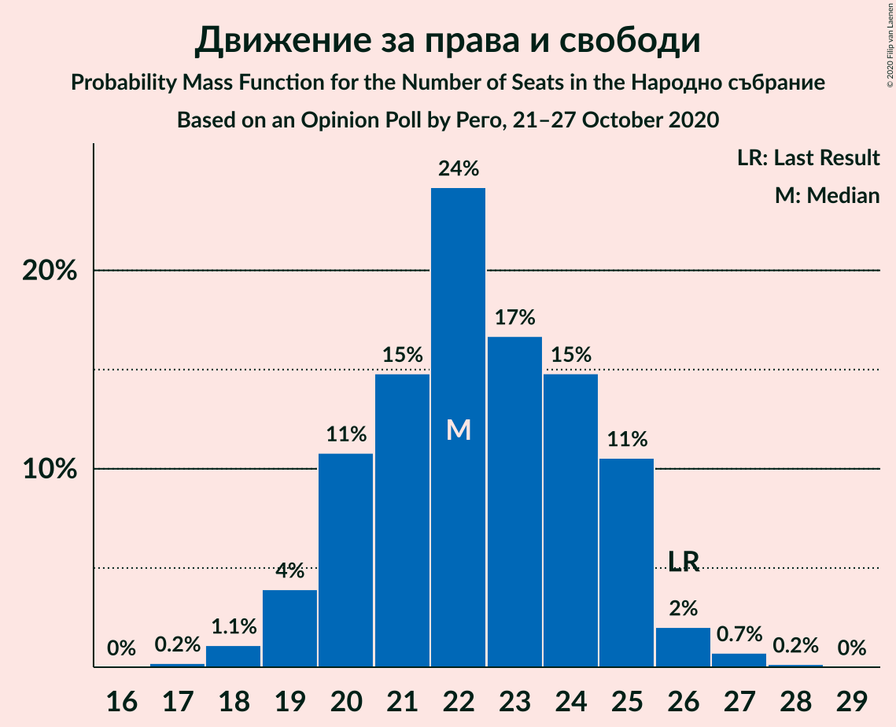
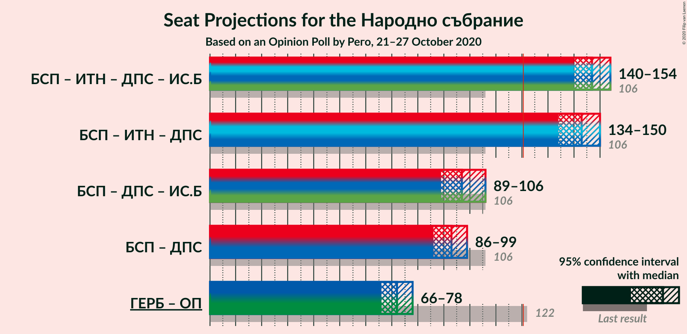

# Opinion Poll by Рего, 21–27 October 2020

<a href="#voting-intentions">Voting Intentions</a> | <a href="#seats">Seats</a> | <a href="#coalitions">Coalitions</a> | <a href="#technical-information">Technical Information</a>

## Voting Intentions

### Confidence Intervals

| Party | Last Result | Poll Result | 80% Confidence Interval | 90% Confidence Interval | 95% Confidence Interval | 99% Confidence Interval |
|:-----:|:-----------:|:-----------:|:-----------------------:|:-----------------------:|:-----------------------:|:-----------------------:|
| Граждани за европейско развитие на България | 33.5% | 27.1% | 25.8–28.4% |25.5–28.8% |25.2–29.1% |24.6–29.7% |
| Българска социалистическа партия | 27.9% | 26.3% | 25.1–27.6% |24.7–28.0% |24.4–28.3% |23.8–28.9% |
| Има такъв народ | 0.0% | 18.6% | 17.5–19.8% |17.2–20.1% |16.9–20.4% |16.4–20.9% |
| Движение за права и свободи | 9.2% | 8.3% | 7.5–9.1% |7.3–9.4% |7.2–9.6% |6.8–10.0% |
| Демократична България | 0.0% | 7.6% | 6.9–8.4% |6.7–8.6% |6.5–8.9% |6.2–9.3% |
| Изправи се Бг | 0.0% | 3.9% | 3.4–4.5% |3.2–4.7% |3.1–4.8% |2.9–5.2% |
| Обединени Патриоти | 9.3% | 2.8% | 2.4–3.3% |2.3–3.5% |2.2–3.6% |2.0–3.9% |
| Воля | 4.3% | 1.1% | 0.9–1.5% |0.8–1.6% |0.7–1.7% |0.6–1.9% |

*Note:* The poll result column reflects the actual value used in the calculations. Published results may vary slightly, and in addition be rounded to fewer digits.

## Seats

### Confidence Intervals

| Party | Last Result | Median | 80% Confidence Interval | 90% Confidence Interval | 95% Confidence Interval | 99% Confidence Interval |
|:-----:|:-----------:|:------:|:-----------------------:|:-----------------------:|:-----------------------:|:-----------------------:|
| <a href="#граждани-за-европейско-развитие-на-българия">Граждани за европейско развитие на България</a> | 95 | 72 | 68–76 |67–77 |66–78 |65–80 |
| <a href="#българска-социалистическа-партия">Българска социалистическа партия</a> | 80 | 70 | 66–75 |65–76 |64–76 |63–78 |
| <a href="#има-такъв-народ">Има такъв народ</a> | 0 | 50 | 46–53 |45–54 |44–55 |43–57 |
| <a href="#движение-за-права-и-свободи">Движение за права и свободи</a> | 26 | 22 | 20–25 |19–25 |19–26 |18–27 |
| <a href="#демократична-българия">Демократична България</a> | 0 | 21 | 18–23 |18–23 |17–24 |16–25 |
| <a href="#изправи-се-бг">Изправи се Бг</a> | 0 | 0 | 0–12 |0–12 |0–13 |0–13 |
| <a href="#обединени-патриоти">Обединени Патриоти</a> | 27 | 0 | 0 |0 |0 |0 |
| <a href="#воля">Воля</a> | 12 | 0 | 0 |0 |0 |0 |

### Граждани за европейско развитие на България

*For a full overview of the results for this party, see the [Граждани за европейско развитие на България](party-гражданизаевропейскоразвитиенабългария.html) page.*

| Number of Seats | Probability | Accumulated | Special Marks |
|:---------------:|:-----------:|:-----------:|:-------------:|
| 63 | 0.1% | 100% |  |
| 64 | 0.2% | 99.8% |  |
| 65 | 0.7% | 99.6% |  |
| 66 | 2% | 98.9% |  |
| 67 | 3% | 97% |  |
| 68 | 5% | 93% |  |
| 69 | 6% | 89% |  |
| 70 | 11% | 82% |  |
| 71 | 10% | 72% |  |
| 72 | 14% | 62% | Median |
| 73 | 12% | 48% |  |
| 74 | 12% | 37% |  |
| 75 | 8% | 24% |  |
| 76 | 8% | 16% |  |
| 77 | 3% | 8% |  |
| 78 | 3% | 5% |  |
| 79 | 1.1% | 2% |  |
| 80 | 0.5% | 0.9% |  |
| 81 | 0.2% | 0.4% |  |
| 82 | 0.1% | 0.2% |  |
| 83 | 0% | 0% |  |
| 84 | 0% | 0% |  |
| 85 | 0% | 0% |  |
| 86 | 0% | 0% |  |
| 87 | 0% | 0% |  |
| 88 | 0% | 0% |  |
| 89 | 0% | 0% |  |
| 90 | 0% | 0% |  |
| 91 | 0% | 0% |  |
| 92 | 0% | 0% |  |
| 93 | 0% | 0% |  |
| 94 | 0% | 0% |  |
| 95 | 0% | 0% | Last Result |

### Българска социалистическа партия

*For a full overview of the results for this party, see the [Българска социалистическа партия](party-българскасоциалистическапартия.html) page.*

| Number of Seats | Probability | Accumulated | Special Marks |
|:---------------:|:-----------:|:-----------:|:-------------:|
| 61 | 0.1% | 100% |  |
| 62 | 0.3% | 99.9% |  |
| 63 | 0.9% | 99.6% |  |
| 64 | 2% | 98.7% |  |
| 65 | 2% | 96% |  |
| 66 | 4% | 94% |  |
| 67 | 5% | 90% |  |
| 68 | 10% | 85% |  |
| 69 | 15% | 75% |  |
| 70 | 13% | 60% | Median |
| 71 | 17% | 47% |  |
| 72 | 8% | 31% |  |
| 73 | 5% | 22% |  |
| 74 | 7% | 17% |  |
| 75 | 4% | 10% |  |
| 76 | 4% | 6% |  |
| 77 | 2% | 2% |  |
| 78 | 0.4% | 0.6% |  |
| 79 | 0.2% | 0.3% |  |
| 80 | 0% | 0.1% | Last Result |
| 81 | 0% | 0% |  |

### Има такъв народ

*For a full overview of the results for this party, see the [Има такъв народ](party-иматакъвнарод.html) page.*

| Number of Seats | Probability | Accumulated | Special Marks |
|:---------------:|:-----------:|:-----------:|:-------------:|
| 0 | 0% | 100% | Last Result |
| 1 | 0% | 100% |  |
| 2 | 0% | 100% |  |
| 3 | 0% | 100% |  |
| 4 | 0% | 100% |  |
| 5 | 0% | 100% |  |
| 6 | 0% | 100% |  |
| 7 | 0% | 100% |  |
| 8 | 0% | 100% |  |
| 9 | 0% | 100% |  |
| 10 | 0% | 100% |  |
| 11 | 0% | 100% |  |
| 12 | 0% | 100% |  |
| 13 | 0% | 100% |  |
| 14 | 0% | 100% |  |
| 15 | 0% | 100% |  |
| 16 | 0% | 100% |  |
| 17 | 0% | 100% |  |
| 18 | 0% | 100% |  |
| 19 | 0% | 100% |  |
| 20 | 0% | 100% |  |
| 21 | 0% | 100% |  |
| 22 | 0% | 100% |  |
| 23 | 0% | 100% |  |
| 24 | 0% | 100% |  |
| 25 | 0% | 100% |  |
| 26 | 0% | 100% |  |
| 27 | 0% | 100% |  |
| 28 | 0% | 100% |  |
| 29 | 0% | 100% |  |
| 30 | 0% | 100% |  |
| 31 | 0% | 100% |  |
| 32 | 0% | 100% |  |
| 33 | 0% | 100% |  |
| 34 | 0% | 100% |  |
| 35 | 0% | 100% |  |
| 36 | 0% | 100% |  |
| 37 | 0% | 100% |  |
| 38 | 0% | 100% |  |
| 39 | 0% | 100% |  |
| 40 | 0% | 100% |  |
| 41 | 0% | 100% |  |
| 42 | 0.1% | 99.9% |  |
| 43 | 0.6% | 99.9% |  |
| 44 | 2% | 99.3% |  |
| 45 | 3% | 97% |  |
| 46 | 8% | 95% |  |
| 47 | 3% | 87% |  |
| 48 | 16% | 84% |  |
| 49 | 13% | 68% |  |
| 50 | 14% | 55% | Median |
| 51 | 18% | 41% |  |
| 52 | 7% | 23% |  |
| 53 | 9% | 16% |  |
| 54 | 4% | 7% |  |
| 55 | 2% | 3% |  |
| 56 | 0.8% | 1.3% |  |
| 57 | 0.3% | 0.5% |  |
| 58 | 0.2% | 0.2% |  |
| 59 | 0% | 0% |  |

### Движение за права и свободи

*For a full overview of the results for this party, see the [Движение за права и свободи](party-движениезаправаисвободи.html) page.*

| Number of Seats | Probability | Accumulated | Special Marks |
|:---------------:|:-----------:|:-----------:|:-------------:|
| 17 | 0.2% | 100% |  |
| 18 | 1.1% | 99.8% |  |
| 19 | 4% | 98.7% |  |
| 20 | 11% | 95% |  |
| 21 | 15% | 84% |  |
| 22 | 24% | 69% | Median |
| 23 | 17% | 45% |  |
| 24 | 15% | 28% |  |
| 25 | 11% | 13% |  |
| 26 | 2% | 3% | Last Result |
| 27 | 0.7% | 0.9% |  |
| 28 | 0.2% | 0.2% |  |
| 29 | 0% | 0% |  |

### Демократична България

*For a full overview of the results for this party, see the [Демократична България](party-демократичнабългария.html) page.*

| Number of Seats | Probability | Accumulated | Special Marks |
|:---------------:|:-----------:|:-----------:|:-------------:|
| 0 | 0% | 100% | Last Result |
| 1 | 0% | 100% |  |
| 2 | 0% | 100% |  |
| 3 | 0% | 100% |  |
| 4 | 0% | 100% |  |
| 5 | 0% | 100% |  |
| 6 | 0% | 100% |  |
| 7 | 0% | 100% |  |
| 8 | 0% | 100% |  |
| 9 | 0% | 100% |  |
| 10 | 0% | 100% |  |
| 11 | 0% | 100% |  |
| 12 | 0% | 100% |  |
| 13 | 0% | 100% |  |
| 14 | 0% | 100% |  |
| 15 | 0.1% | 100% |  |
| 16 | 0.4% | 99.9% |  |
| 17 | 3% | 99.4% |  |
| 18 | 8% | 96% |  |
| 19 | 19% | 89% |  |
| 20 | 19% | 69% |  |
| 21 | 21% | 51% | Median |
| 22 | 17% | 29% |  |
| 23 | 9% | 12% |  |
| 24 | 3% | 4% |  |
| 25 | 0.7% | 0.9% |  |
| 26 | 0.2% | 0.2% |  |
| 27 | 0% | 0% |  |

### Изправи се Бг

*For a full overview of the results for this party, see the [Изправи се Бг](party-изправисебг.html) page.*

| Number of Seats | Probability | Accumulated | Special Marks |
|:---------------:|:-----------:|:-----------:|:-------------:|
| 0 | 59% | 100% | Last Result, Median |
| 1 | 0% | 41% |  |
| 2 | 0% | 41% |  |
| 3 | 0% | 41% |  |
| 4 | 0% | 41% |  |
| 5 | 0% | 41% |  |
| 6 | 0% | 41% |  |
| 7 | 0% | 41% |  |
| 8 | 0% | 41% |  |
| 9 | 0% | 41% |  |
| 10 | 3% | 41% |  |
| 11 | 24% | 38% |  |
| 12 | 11% | 14% |  |
| 13 | 2% | 3% |  |
| 14 | 0.4% | 0.4% |  |
| 15 | 0% | 0% |  |

### Обединени Патриоти

*For a full overview of the results for this party, see the [Обединени Патриоти](party-обединенипатриоти.html) page.*

| Number of Seats | Probability | Accumulated | Special Marks |
|:---------------:|:-----------:|:-----------:|:-------------:|
| 0 | 99.7% | 100% | Median |
| 1 | 0% | 0.3% |  |
| 2 | 0% | 0.3% |  |
| 3 | 0% | 0.3% |  |
| 4 | 0% | 0.3% |  |
| 5 | 0% | 0.3% |  |
| 6 | 0% | 0.3% |  |
| 7 | 0% | 0.3% |  |
| 8 | 0% | 0.3% |  |
| 9 | 0% | 0.3% |  |
| 10 | 0.1% | 0.3% |  |
| 11 | 0.2% | 0.2% |  |
| 12 | 0% | 0% |  |
| 13 | 0% | 0% |  |
| 14 | 0% | 0% |  |
| 15 | 0% | 0% |  |
| 16 | 0% | 0% |  |
| 17 | 0% | 0% |  |
| 18 | 0% | 0% |  |
| 19 | 0% | 0% |  |
| 20 | 0% | 0% |  |
| 21 | 0% | 0% |  |
| 22 | 0% | 0% |  |
| 23 | 0% | 0% |  |
| 24 | 0% | 0% |  |
| 25 | 0% | 0% |  |
| 26 | 0% | 0% |  |
| 27 | 0% | 0% | Last Result |

### Воля

*For a full overview of the results for this party, see the [Воля](party-воля.html) page.*

| Number of Seats | Probability | Accumulated | Special Marks |
|:---------------:|:-----------:|:-----------:|:-------------:|
| 0 | 100% | 100% | Median |
| 1 | 0% | 0% |  |
| 2 | 0% | 0% |  |
| 3 | 0% | 0% |  |
| 4 | 0% | 0% |  |
| 5 | 0% | 0% |  |
| 6 | 0% | 0% |  |
| 7 | 0% | 0% |  |
| 8 | 0% | 0% |  |
| 9 | 0% | 0% |  |
| 10 | 0% | 0% |  |
| 11 | 0% | 0% |  |
| 12 | 0% | 0% | Last Result |

## Coalitions

### Confidence Intervals

| Coalition | Last Result | Median | Majority? | 80% Confidence Interval | 90% Confidence Interval | 95% Confidence Interval | 99% Confidence Interval |
|:---------:|:-----------:|:------:|:---------:|:-----------------------:|:-----------------------:|:-----------------------:|:-----------------------:|
| Българска социалистическа партия – Има такъв народ – Движение за права и свободи – Изправи се Бг | 106 | 147 | 100% | 143–151 | 141–153 | 140–154 | 138–156 |
| Българска социалистическа партия – Има такъв народ – Движение за права и свободи | 106 | 143 | 100% | 136–148 | 135–149 | 134–150 | 132–152 |
| Българска социалистическа партия – Движение за права и свободи – Изправи се Бг | 106 | 97 | 0% | 92–103 | 91–105 | 89–106 | 88–107 |
| Българска социалистическа партия – Движение за права и свободи | 106 | 93 | 0% | 88–97 | 87–99 | 86–99 | 84–101 |
| Граждани за европейско развитие на България – Обединени Патриоти | 122 | 72 | 0% | 68–76 | 67–77 | 66–78 | 65–80 |

### Българска социалистическа партия – Има такъв народ – Движение за права и свободи – Изправи се Бг

| Number of Seats | Probability | Accumulated | Special Marks |
|:---------------:|:-----------:|:-----------:|:-------------:|
| 106 | 0% | 100% | Last Result |
| 107 | 0% | 100% |  |
| 108 | 0% | 100% |  |
| 109 | 0% | 100% |  |
| 110 | 0% | 100% |  |
| 111 | 0% | 100% |  |
| 112 | 0% | 100% |  |
| 113 | 0% | 100% |  |
| 114 | 0% | 100% |  |
| 115 | 0% | 100% |  |
| 116 | 0% | 100% |  |
| 117 | 0% | 100% |  |
| 118 | 0% | 100% |  |
| 119 | 0% | 100% |  |
| 120 | 0% | 100% |  |
| 121 | 0% | 100% | Majority |
| 122 | 0% | 100% |  |
| 123 | 0% | 100% |  |
| 124 | 0% | 100% |  |
| 125 | 0% | 100% |  |
| 126 | 0% | 100% |  |
| 127 | 0% | 100% |  |
| 128 | 0% | 100% |  |
| 129 | 0% | 100% |  |
| 130 | 0% | 100% |  |
| 131 | 0% | 100% |  |
| 132 | 0% | 100% |  |
| 133 | 0% | 100% |  |
| 134 | 0% | 100% |  |
| 135 | 0% | 100% |  |
| 136 | 0.1% | 100% |  |
| 137 | 0.1% | 99.9% |  |
| 138 | 0.4% | 99.8% |  |
| 139 | 0.7% | 99.3% |  |
| 140 | 1.4% | 98.6% |  |
| 141 | 3% | 97% |  |
| 142 | 4% | 95% | Median |
| 143 | 6% | 90% |  |
| 144 | 8% | 84% |  |
| 145 | 9% | 76% |  |
| 146 | 10% | 68% |  |
| 147 | 13% | 58% |  |
| 148 | 10% | 44% |  |
| 149 | 7% | 34% |  |
| 150 | 8% | 27% |  |
| 151 | 9% | 19% |  |
| 152 | 4% | 10% |  |
| 153 | 2% | 6% |  |
| 154 | 2% | 3% |  |
| 155 | 1.2% | 2% |  |
| 156 | 0.4% | 0.6% |  |
| 157 | 0.1% | 0.2% |  |
| 158 | 0.1% | 0.1% |  |
| 159 | 0% | 0% |  |

### Българска социалистическа партия – Има такъв народ – Движение за права и свободи

| Number of Seats | Probability | Accumulated | Special Marks |
|:---------------:|:-----------:|:-----------:|:-------------:|
| 106 | 0% | 100% | Last Result |
| 107 | 0% | 100% |  |
| 108 | 0% | 100% |  |
| 109 | 0% | 100% |  |
| 110 | 0% | 100% |  |
| 111 | 0% | 100% |  |
| 112 | 0% | 100% |  |
| 113 | 0% | 100% |  |
| 114 | 0% | 100% |  |
| 115 | 0% | 100% |  |
| 116 | 0% | 100% |  |
| 117 | 0% | 100% |  |
| 118 | 0% | 100% |  |
| 119 | 0% | 100% |  |
| 120 | 0% | 100% |  |
| 121 | 0% | 100% | Majority |
| 122 | 0% | 100% |  |
| 123 | 0% | 100% |  |
| 124 | 0% | 100% |  |
| 125 | 0% | 100% |  |
| 126 | 0% | 100% |  |
| 127 | 0% | 100% |  |
| 128 | 0% | 100% |  |
| 129 | 0% | 100% |  |
| 130 | 0.1% | 100% |  |
| 131 | 0.1% | 99.9% |  |
| 132 | 0.4% | 99.7% |  |
| 133 | 0.9% | 99.3% |  |
| 134 | 2% | 98% |  |
| 135 | 2% | 96% |  |
| 136 | 5% | 94% |  |
| 137 | 5% | 90% |  |
| 138 | 6% | 85% |  |
| 139 | 7% | 79% |  |
| 140 | 7% | 72% |  |
| 141 | 6% | 65% |  |
| 142 | 6% | 59% | Median |
| 143 | 7% | 52% |  |
| 144 | 8% | 45% |  |
| 145 | 7% | 37% |  |
| 146 | 8% | 30% |  |
| 147 | 10% | 22% |  |
| 148 | 6% | 12% |  |
| 149 | 2% | 7% |  |
| 150 | 2% | 5% |  |
| 151 | 2% | 2% |  |
| 152 | 0.4% | 0.7% |  |
| 153 | 0.2% | 0.2% |  |
| 154 | 0% | 0.1% |  |
| 155 | 0% | 0% |  |

### Българска социалистическа партия – Движение за права и свободи – Изправи се Бг

| Number of Seats | Probability | Accumulated | Special Marks |
|:---------------:|:-----------:|:-----------:|:-------------:|
| 85 | 0% | 100% |  |
| 86 | 0.1% | 99.9% |  |
| 87 | 0.2% | 99.9% |  |
| 88 | 0.7% | 99.7% |  |
| 89 | 2% | 98.9% |  |
| 90 | 2% | 97% |  |
| 91 | 3% | 95% |  |
| 92 | 6% | 92% | Median |
| 93 | 9% | 87% |  |
| 94 | 8% | 78% |  |
| 95 | 8% | 70% |  |
| 96 | 9% | 63% |  |
| 97 | 8% | 53% |  |
| 98 | 5% | 46% |  |
| 99 | 8% | 40% |  |
| 100 | 6% | 33% |  |
| 101 | 5% | 27% |  |
| 102 | 7% | 22% |  |
| 103 | 5% | 14% |  |
| 104 | 3% | 9% |  |
| 105 | 3% | 6% |  |
| 106 | 2% | 3% | Last Result |
| 107 | 0.8% | 1.2% |  |
| 108 | 0.3% | 0.4% |  |
| 109 | 0.1% | 0.2% |  |
| 110 | 0% | 0.1% |  |
| 111 | 0% | 0% |  |

### Българска социалистическа партия – Движение за права и свободи

| Number of Seats | Probability | Accumulated | Special Marks |
|:---------------:|:-----------:|:-----------:|:-------------:|
| 82 | 0.1% | 100% |  |
| 83 | 0.2% | 99.9% |  |
| 84 | 0.4% | 99.7% |  |
| 85 | 1.3% | 99.2% |  |
| 86 | 2% | 98% |  |
| 87 | 3% | 96% |  |
| 88 | 5% | 92% |  |
| 89 | 7% | 87% |  |
| 90 | 7% | 80% |  |
| 91 | 9% | 73% |  |
| 92 | 10% | 64% | Median |
| 93 | 12% | 54% |  |
| 94 | 10% | 42% |  |
| 95 | 8% | 32% |  |
| 96 | 9% | 23% |  |
| 97 | 6% | 14% |  |
| 98 | 3% | 8% |  |
| 99 | 3% | 5% |  |
| 100 | 1.0% | 2% |  |
| 101 | 0.6% | 1.0% |  |
| 102 | 0.3% | 0.4% |  |
| 103 | 0.1% | 0.1% |  |
| 104 | 0% | 0% |  |
| 105 | 0% | 0% |  |
| 106 | 0% | 0% | Last Result |

### Граждани за европейско развитие на България – Обединени Патриоти

| Number of Seats | Probability | Accumulated | Special Marks |
|:---------------:|:-----------:|:-----------:|:-------------:|
| 63 | 0.1% | 100% |  |
| 64 | 0.2% | 99.8% |  |
| 65 | 0.7% | 99.6% |  |
| 66 | 2% | 98.9% |  |
| 67 | 3% | 97% |  |
| 68 | 4% | 93% |  |
| 69 | 6% | 89% |  |
| 70 | 11% | 83% |  |
| 71 | 10% | 72% |  |
| 72 | 14% | 62% | Median |
| 73 | 12% | 48% |  |
| 74 | 12% | 37% |  |
| 75 | 8% | 25% |  |
| 76 | 8% | 17% |  |
| 77 | 3% | 8% |  |
| 78 | 3% | 5% |  |
| 79 | 1.2% | 2% |  |
| 80 | 0.6% | 1.1% |  |
| 81 | 0.2% | 0.5% |  |
| 82 | 0.2% | 0.3% |  |
| 83 | 0.1% | 0.1% |  |
| 84 | 0% | 0% |  |
| 85 | 0% | 0% |  |
| 86 | 0% | 0% |  |
| 87 | 0% | 0% |  |
| 88 | 0% | 0% |  |
| 89 | 0% | 0% |  |
| 90 | 0% | 0% |  |
| 91 | 0% | 0% |  |
| 92 | 0% | 0% |  |
| 93 | 0% | 0% |  |
| 94 | 0% | 0% |  |
| 95 | 0% | 0% |  |
| 96 | 0% | 0% |  |
| 97 | 0% | 0% |  |
| 98 | 0% | 0% |  |
| 99 | 0% | 0% |  |
| 100 | 0% | 0% |  |
| 101 | 0% | 0% |  |
| 102 | 0% | 0% |  |
| 103 | 0% | 0% |  |
| 104 | 0% | 0% |  |
| 105 | 0% | 0% |  |
| 106 | 0% | 0% |  |
| 107 | 0% | 0% |  |
| 108 | 0% | 0% |  |
| 109 | 0% | 0% |  |
| 110 | 0% | 0% |  |
| 111 | 0% | 0% |  |
| 112 | 0% | 0% |  |
| 113 | 0% | 0% |  |
| 114 | 0% | 0% |  |
| 115 | 0% | 0% |  |
| 116 | 0% | 0% |  |
| 117 | 0% | 0% |  |
| 118 | 0% | 0% |  |
| 119 | 0% | 0% |  |
| 120 | 0% | 0% |  |
| 121 | 0% | 0% | Majority |
| 122 | 0% | 0% | Last Result |

## Technical Information

### Opinion Poll

+ **Polling firm:** Рего
+ **Commissioner(s):** —
+ **Fieldwork period:** 21–27 October 2020

### Calculations

+ **Sample size:** 2000
+ **Simulations done:** 1,048,576
+ **Error estimate:** 1.34%

