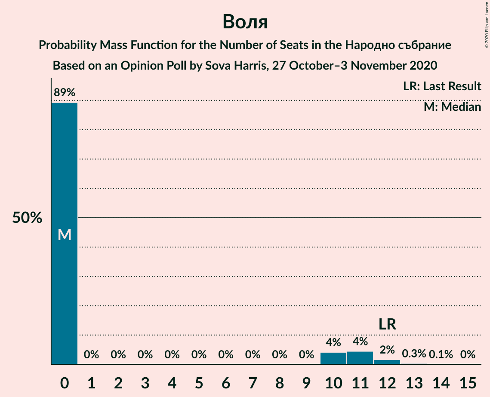
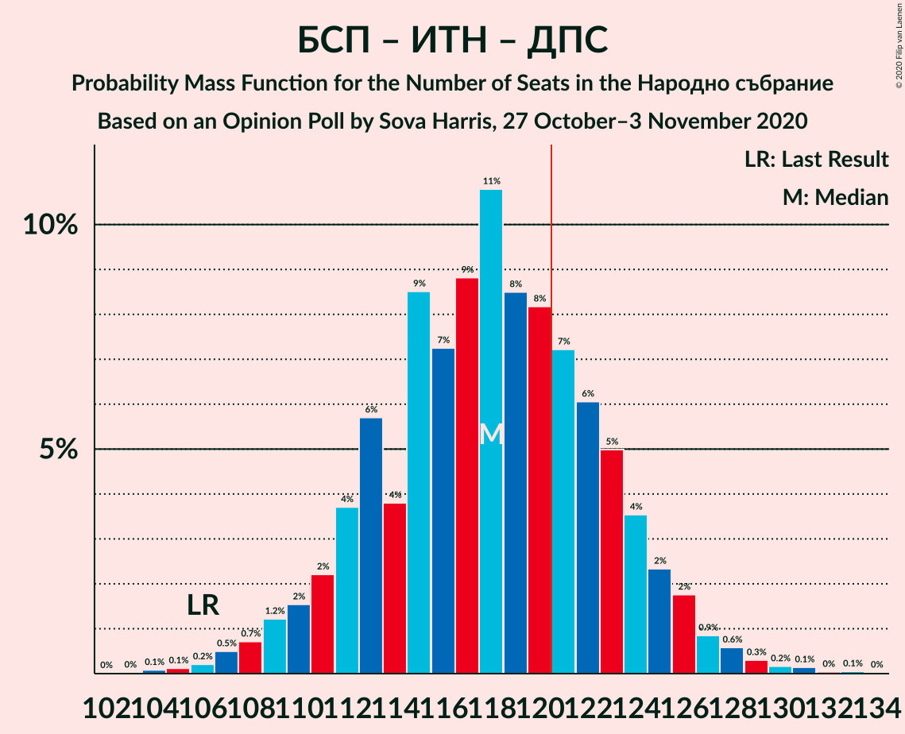

# Opinion Poll by Sova Harris, 27 October–3 November 2020

<a href="#voting-intentions">Voting Intentions</a> | <a href="#seats">Seats</a> | <a href="#coalitions">Coalitions</a> | <a href="#technical-information">Technical Information</a>

## Voting Intentions

### Confidence Intervals

| Party | Last Result | Poll Result | 80% Confidence Interval | 90% Confidence Interval | 95% Confidence Interval | 99% Confidence Interval |
|:-----:|:-----------:|:-----------:|:-----------------------:|:-----------------------:|:-----------------------:|:-----------------------:|
| Граждани за европейско развитие на България | 33.5% | 26.6% | 24.9–28.5% |24.4–29.0% |23.9–29.4% |23.1–30.3% |
| Българска социалистическа партия | 27.9% | 25.1% | 23.4–26.9% |22.9–27.4% |22.5–27.9% |21.7–28.8% |
| Има такъв народ | 0.0% | 11.4% | 10.2–12.8% |9.9–13.2% |9.6–13.5% |9.0–14.2% |
| Движение за права и свободи | 9.2% | 8.7% | 7.7–10.0% |7.3–10.3% |7.1–10.6% |6.6–11.2% |
| Демократична България | 0.0% | 8.4% | 7.4–9.6% |7.1–10.0% |6.8–10.3% |6.4–10.9% |
| Изправи се Бг | 0.0% | 5.7% | 4.9–6.8% |4.6–7.1% |4.4–7.3% |4.1–7.9% |
| Обединени Патриоти | 9.3% | 5.5% | 4.7–6.5% |4.4–6.8% |4.3–7.1% |3.9–7.6% |
| Воля | 4.3% | 3.2% | 2.6–4.0% |2.4–4.3% |2.3–4.5% |2.0–4.9% |

*Note:* The poll result column reflects the actual value used in the calculations. Published results may vary slightly, and in addition be rounded to fewer digits.

## Seats

### Confidence Intervals

| Party | Last Result | Median | 80% Confidence Interval | 90% Confidence Interval | 95% Confidence Interval | 99% Confidence Interval |
|:-----:|:-----------:|:------:|:-----------------------:|:-----------------------:|:-----------------------:|:-----------------------:|
| <a href="#граждани-за-европейско-развитие-на-българия">Граждани за европейско развитие на България</a> | 95 | 69 | 65–74 |63–76 |62–77 |60–79 |
| <a href="#българска-социалистическа-партия">Българска социалистическа партия</a> | 80 | 65 | 61–70 |59–72 |58–73 |56–75 |
| <a href="#има-такъв-народ">Има такъв народ</a> | 0 | 30 | 26–33 |26–34 |25–35 |24–37 |
| <a href="#движение-за-права-и-свободи">Движение за права и свободи</a> | 26 | 23 | 20–26 |19–27 |18–27 |18–29 |
| <a href="#демократична-българия">Демократична България</a> | 0 | 22 | 19–25 |18–26 |18–27 |17–28 |
| <a href="#изправи-се-бг">Изправи се Бг</a> | 0 | 15 | 12–18 |12–18 |12–19 |11–21 |
| <a href="#обединени-патриоти">Обединени Патриоти</a> | 27 | 14 | 12–17 |11–18 |11–18 |0–20 |
| <a href="#воля">Воля</a> | 12 | 0 | 0–10 |0–11 |0–11 |0–12 |

### Граждани за европейско развитие на България

*For a full overview of the results for this party, see the [Граждани за европейско развитие на България](party-гражданизаевропейскоразвитиенабългария.html) page.*

| Number of Seats | Probability | Accumulated | Special Marks |
|:---------------:|:-----------:|:-----------:|:-------------:|
| 57 | 0% | 100% |  |
| 58 | 0.1% | 99.9% |  |
| 59 | 0.2% | 99.9% |  |
| 60 | 0.5% | 99.6% |  |
| 61 | 0.7% | 99.1% |  |
| 62 | 2% | 98% |  |
| 63 | 2% | 97% |  |
| 64 | 4% | 94% |  |
| 65 | 6% | 90% |  |
| 66 | 7% | 84% |  |
| 67 | 9% | 77% |  |
| 68 | 10% | 68% |  |
| 69 | 10% | 58% | Median |
| 70 | 11% | 48% |  |
| 71 | 11% | 37% |  |
| 72 | 7% | 26% |  |
| 73 | 6% | 19% |  |
| 74 | 5% | 13% |  |
| 75 | 2% | 8% |  |
| 76 | 2% | 5% |  |
| 77 | 1.1% | 3% |  |
| 78 | 1.0% | 2% |  |
| 79 | 0.4% | 0.8% |  |
| 80 | 0.3% | 0.4% |  |
| 81 | 0.1% | 0.1% |  |
| 82 | 0% | 0.1% |  |
| 83 | 0% | 0% |  |
| 84 | 0% | 0% |  |
| 85 | 0% | 0% |  |
| 86 | 0% | 0% |  |
| 87 | 0% | 0% |  |
| 88 | 0% | 0% |  |
| 89 | 0% | 0% |  |
| 90 | 0% | 0% |  |
| 91 | 0% | 0% |  |
| 92 | 0% | 0% |  |
| 93 | 0% | 0% |  |
| 94 | 0% | 0% |  |
| 95 | 0% | 0% | Last Result |

### Българска социалистическа партия

*For a full overview of the results for this party, see the [Българска социалистическа партия](party-българскасоциалистическапартия.html) page.*

| Number of Seats | Probability | Accumulated | Special Marks |
|:---------------:|:-----------:|:-----------:|:-------------:|
| 54 | 0.1% | 100% |  |
| 55 | 0.2% | 99.9% |  |
| 56 | 0.3% | 99.7% |  |
| 57 | 0.9% | 99.4% |  |
| 58 | 1.5% | 98.5% |  |
| 59 | 3% | 97% |  |
| 60 | 3% | 94% |  |
| 61 | 5% | 91% |  |
| 62 | 8% | 86% |  |
| 63 | 8% | 78% |  |
| 64 | 9% | 70% |  |
| 65 | 13% | 61% | Median |
| 66 | 9% | 48% |  |
| 67 | 13% | 39% |  |
| 68 | 8% | 26% |  |
| 69 | 6% | 18% |  |
| 70 | 5% | 12% |  |
| 71 | 3% | 8% |  |
| 72 | 2% | 5% |  |
| 73 | 0.9% | 3% |  |
| 74 | 0.9% | 2% |  |
| 75 | 0.4% | 0.7% |  |
| 76 | 0.1% | 0.3% |  |
| 77 | 0.1% | 0.2% |  |
| 78 | 0% | 0.1% |  |
| 79 | 0% | 0% |  |
| 80 | 0% | 0% | Last Result |

### Има такъв народ

*For a full overview of the results for this party, see the [Има такъв народ](party-иматакъвнарод.html) page.*

| Number of Seats | Probability | Accumulated | Special Marks |
|:---------------:|:-----------:|:-----------:|:-------------:|
| 0 | 0% | 100% | Last Result |
| 1 | 0% | 100% |  |
| 2 | 0% | 100% |  |
| 3 | 0% | 100% |  |
| 4 | 0% | 100% |  |
| 5 | 0% | 100% |  |
| 6 | 0% | 100% |  |
| 7 | 0% | 100% |  |
| 8 | 0% | 100% |  |
| 9 | 0% | 100% |  |
| 10 | 0% | 100% |  |
| 11 | 0% | 100% |  |
| 12 | 0% | 100% |  |
| 13 | 0% | 100% |  |
| 14 | 0% | 100% |  |
| 15 | 0% | 100% |  |
| 16 | 0% | 100% |  |
| 17 | 0% | 100% |  |
| 18 | 0% | 100% |  |
| 19 | 0% | 100% |  |
| 20 | 0% | 100% |  |
| 21 | 0% | 100% |  |
| 22 | 0.1% | 100% |  |
| 23 | 0.4% | 99.9% |  |
| 24 | 1.1% | 99.5% |  |
| 25 | 3% | 98% |  |
| 26 | 6% | 95% |  |
| 27 | 10% | 89% |  |
| 28 | 14% | 80% |  |
| 29 | 14% | 66% |  |
| 30 | 14% | 52% | Median |
| 31 | 11% | 37% |  |
| 32 | 10% | 27% |  |
| 33 | 7% | 16% |  |
| 34 | 4% | 9% |  |
| 35 | 3% | 5% |  |
| 36 | 1.2% | 2% |  |
| 37 | 0.5% | 0.9% |  |
| 38 | 0.2% | 0.3% |  |
| 39 | 0.1% | 0.1% |  |
| 40 | 0% | 0% |  |

### Движение за права и свободи

*For a full overview of the results for this party, see the [Движение за права и свободи](party-движениезаправаисвободи.html) page.*

| Number of Seats | Probability | Accumulated | Special Marks |
|:---------------:|:-----------:|:-----------:|:-------------:|
| 16 | 0.1% | 100% |  |
| 17 | 0.3% | 99.8% |  |
| 18 | 3% | 99.5% |  |
| 19 | 3% | 97% |  |
| 20 | 10% | 94% |  |
| 21 | 12% | 84% |  |
| 22 | 19% | 72% |  |
| 23 | 18% | 53% | Median |
| 24 | 8% | 34% |  |
| 25 | 15% | 27% |  |
| 26 | 3% | 11% | Last Result |
| 27 | 6% | 8% |  |
| 28 | 0.4% | 2% |  |
| 29 | 1.0% | 1.3% |  |
| 30 | 0.2% | 0.3% |  |
| 31 | 0.1% | 0.1% |  |
| 32 | 0% | 0% |  |

### Демократична България

*For a full overview of the results for this party, see the [Демократична България](party-демократичнабългария.html) page.*

| Number of Seats | Probability | Accumulated | Special Marks |
|:---------------:|:-----------:|:-----------:|:-------------:|
| 0 | 0% | 100% | Last Result |
| 1 | 0% | 100% |  |
| 2 | 0% | 100% |  |
| 3 | 0% | 100% |  |
| 4 | 0% | 100% |  |
| 5 | 0% | 100% |  |
| 6 | 0% | 100% |  |
| 7 | 0% | 100% |  |
| 8 | 0% | 100% |  |
| 9 | 0% | 100% |  |
| 10 | 0% | 100% |  |
| 11 | 0% | 100% |  |
| 12 | 0% | 100% |  |
| 13 | 0% | 100% |  |
| 14 | 0% | 100% |  |
| 15 | 0.1% | 100% |  |
| 16 | 0.4% | 99.9% |  |
| 17 | 1.3% | 99.5% |  |
| 18 | 4% | 98% |  |
| 19 | 8% | 94% |  |
| 20 | 11% | 86% |  |
| 21 | 19% | 76% |  |
| 22 | 18% | 57% | Median |
| 23 | 12% | 39% |  |
| 24 | 12% | 27% |  |
| 25 | 7% | 14% |  |
| 26 | 4% | 7% |  |
| 27 | 2% | 3% |  |
| 28 | 0.8% | 1.2% |  |
| 29 | 0.2% | 0.4% |  |
| 30 | 0.1% | 0.2% |  |
| 31 | 0% | 0% |  |

### Изправи се Бг

*For a full overview of the results for this party, see the [Изправи се Бг](party-изправисебг.html) page.*

| Number of Seats | Probability | Accumulated | Special Marks |
|:---------------:|:-----------:|:-----------:|:-------------:|
| 0 | 0.4% | 100% | Last Result |
| 1 | 0% | 99.6% |  |
| 2 | 0% | 99.6% |  |
| 3 | 0% | 99.6% |  |
| 4 | 0% | 99.6% |  |
| 5 | 0% | 99.6% |  |
| 6 | 0% | 99.6% |  |
| 7 | 0% | 99.6% |  |
| 8 | 0% | 99.6% |  |
| 9 | 0% | 99.6% |  |
| 10 | 0% | 99.6% |  |
| 11 | 2% | 99.6% |  |
| 12 | 8% | 98% |  |
| 13 | 11% | 90% |  |
| 14 | 17% | 79% |  |
| 15 | 24% | 63% | Median |
| 16 | 15% | 38% |  |
| 17 | 12% | 24% |  |
| 18 | 8% | 12% |  |
| 19 | 2% | 3% |  |
| 20 | 1.0% | 2% |  |
| 21 | 0.4% | 0.5% |  |
| 22 | 0.1% | 0.1% |  |
| 23 | 0% | 0% |  |

### Обединени Патриоти

*For a full overview of the results for this party, see the [Обединени Патриоти](party-обединенипатриоти.html) page.*

| Number of Seats | Probability | Accumulated | Special Marks |
|:---------------:|:-----------:|:-----------:|:-------------:|
| 0 | 0.6% | 100% |  |
| 1 | 0% | 99.4% |  |
| 2 | 0% | 99.4% |  |
| 3 | 0% | 99.4% |  |
| 4 | 0% | 99.4% |  |
| 5 | 0% | 99.4% |  |
| 6 | 0% | 99.4% |  |
| 7 | 0% | 99.4% |  |
| 8 | 0% | 99.4% |  |
| 9 | 0% | 99.4% |  |
| 10 | 0.1% | 99.4% |  |
| 11 | 5% | 99.2% |  |
| 12 | 8% | 95% |  |
| 13 | 15% | 86% |  |
| 14 | 21% | 71% | Median |
| 15 | 18% | 50% |  |
| 16 | 18% | 32% |  |
| 17 | 8% | 15% |  |
| 18 | 5% | 7% |  |
| 19 | 1.2% | 2% |  |
| 20 | 0.6% | 0.8% |  |
| 21 | 0.1% | 0.2% |  |
| 22 | 0% | 0% |  |
| 23 | 0% | 0% |  |
| 24 | 0% | 0% |  |
| 25 | 0% | 0% |  |
| 26 | 0% | 0% |  |
| 27 | 0% | 0% | Last Result |

### Воля

*For a full overview of the results for this party, see the [Воля](party-воля.html) page.*

| Number of Seats | Probability | Accumulated | Special Marks |
|:---------------:|:-----------:|:-----------:|:-------------:|
| 0 | 89% | 100% | Median |
| 1 | 0% | 11% |  |
| 2 | 0% | 11% |  |
| 3 | 0% | 11% |  |
| 4 | 0% | 11% |  |
| 5 | 0% | 11% |  |
| 6 | 0% | 11% |  |
| 7 | 0% | 11% |  |
| 8 | 0% | 11% |  |
| 9 | 0% | 11% |  |
| 10 | 4% | 11% |  |
| 11 | 4% | 6% |  |
| 12 | 2% | 2% | Last Result |
| 13 | 0.3% | 0.4% |  |
| 14 | 0.1% | 0.1% |  |
| 15 | 0% | 0% |  |

## Coalitions

### Confidence Intervals

| Coalition | Last Result | Median | Majority? | 80% Confidence Interval | 90% Confidence Interval | 95% Confidence Interval | 99% Confidence Interval |
|:---------:|:-----------:|:------:|:---------:|:-----------------------:|:-----------------------:|:-----------------------:|:-----------------------:|
| Българска социалистическа партия – Има такъв народ – Движение за права и свободи – Изправи се Бг | 106 | 133 | 99.6% | 127–139 | 125–140 | 124–141 | 121–144 |
| Българска социалистическа партия – Има такъв народ – Движение за права и свободи | 106 | 118 | 28% | 112–123 | 111–125 | 109–126 | 107–129 |
| Българска социалистическа партия – Движение за права и свободи – Изправи се Бг | 106 | 103 | 0% | 98–109 | 96–110 | 94–112 | 92–114 |
| Българска социалистическа партия – Движение за права и свободи | 106 | 88 | 0% | 83–93 | 81–95 | 80–96 | 78–99 |
| Граждани за европейско развитие на България – Обединени Патриоти | 122 | 84 | 0% | 79–89 | 77–90 | 76–92 | 73–94 |

### Българска социалистическа партия – Има такъв народ – Движение за права и свободи – Изправи се Бг

| Number of Seats | Probability | Accumulated | Special Marks |
|:---------------:|:-----------:|:-----------:|:-------------:|
| 106 | 0% | 100% | Last Result |
| 107 | 0% | 100% |  |
| 108 | 0% | 100% |  |
| 109 | 0% | 100% |  |
| 110 | 0% | 100% |  |
| 111 | 0% | 100% |  |
| 112 | 0% | 100% |  |
| 113 | 0% | 100% |  |
| 114 | 0% | 100% |  |
| 115 | 0% | 100% |  |
| 116 | 0% | 100% |  |
| 117 | 0% | 100% |  |
| 118 | 0% | 100% |  |
| 119 | 0.1% | 99.9% |  |
| 120 | 0.2% | 99.8% |  |
| 121 | 0.5% | 99.6% | Majority |
| 122 | 0.4% | 99.1% |  |
| 123 | 1.0% | 98.8% |  |
| 124 | 1.3% | 98% |  |
| 125 | 2% | 96% |  |
| 126 | 2% | 95% |  |
| 127 | 3% | 93% |  |
| 128 | 4% | 89% |  |
| 129 | 6% | 86% |  |
| 130 | 7% | 80% |  |
| 131 | 7% | 73% |  |
| 132 | 9% | 65% |  |
| 133 | 9% | 56% | Median |
| 134 | 11% | 47% |  |
| 135 | 7% | 37% |  |
| 136 | 9% | 29% |  |
| 137 | 6% | 21% |  |
| 138 | 4% | 15% |  |
| 139 | 4% | 10% |  |
| 140 | 2% | 6% |  |
| 141 | 2% | 4% |  |
| 142 | 0.7% | 2% |  |
| 143 | 0.6% | 1.3% |  |
| 144 | 0.4% | 0.8% |  |
| 145 | 0.2% | 0.4% |  |
| 146 | 0.1% | 0.2% |  |
| 147 | 0.1% | 0.2% |  |
| 148 | 0% | 0.1% |  |
| 149 | 0% | 0% |  |

### Българска социалистическа партия – Има такъв народ – Движение за права и свободи

| Number of Seats | Probability | Accumulated | Special Marks |
|:---------------:|:-----------:|:-----------:|:-------------:|
| 104 | 0.1% | 100% |  |
| 105 | 0.1% | 99.9% |  |
| 106 | 0.2% | 99.7% | Last Result |
| 107 | 0.5% | 99.5% |  |
| 108 | 0.7% | 99.0% |  |
| 109 | 1.2% | 98% |  |
| 110 | 2% | 97% |  |
| 111 | 2% | 96% |  |
| 112 | 4% | 93% |  |
| 113 | 6% | 90% |  |
| 114 | 4% | 84% |  |
| 115 | 9% | 80% |  |
| 116 | 7% | 72% |  |
| 117 | 9% | 64% |  |
| 118 | 11% | 56% | Median |
| 119 | 8% | 45% |  |
| 120 | 8% | 36% |  |
| 121 | 7% | 28% | Majority |
| 122 | 6% | 21% |  |
| 123 | 5% | 15% |  |
| 124 | 4% | 10% |  |
| 125 | 2% | 6% |  |
| 126 | 2% | 4% |  |
| 127 | 0.9% | 2% |  |
| 128 | 0.6% | 1.3% |  |
| 129 | 0.3% | 0.7% |  |
| 130 | 0.2% | 0.4% |  |
| 131 | 0.1% | 0.3% |  |
| 132 | 0% | 0.1% |  |
| 133 | 0.1% | 0.1% |  |
| 134 | 0% | 0% |  |

### Българска социалистическа партия – Движение за права и свободи – Изправи се Бг

| Number of Seats | Probability | Accumulated | Special Marks |
|:---------------:|:-----------:|:-----------:|:-------------:|
| 88 | 0% | 100% |  |
| 89 | 0.1% | 99.9% |  |
| 90 | 0.2% | 99.9% |  |
| 91 | 0.2% | 99.7% |  |
| 92 | 0.2% | 99.6% |  |
| 93 | 0.6% | 99.4% |  |
| 94 | 2% | 98.8% |  |
| 95 | 1.1% | 97% |  |
| 96 | 2% | 96% |  |
| 97 | 3% | 94% |  |
| 98 | 4% | 91% |  |
| 99 | 5% | 87% |  |
| 100 | 7% | 83% |  |
| 101 | 9% | 76% |  |
| 102 | 11% | 67% |  |
| 103 | 8% | 56% | Median |
| 104 | 7% | 48% |  |
| 105 | 12% | 41% |  |
| 106 | 7% | 28% | Last Result |
| 107 | 5% | 21% |  |
| 108 | 6% | 17% |  |
| 109 | 4% | 11% |  |
| 110 | 2% | 6% |  |
| 111 | 2% | 4% |  |
| 112 | 1.0% | 3% |  |
| 113 | 0.7% | 1.5% |  |
| 114 | 0.4% | 0.7% |  |
| 115 | 0.2% | 0.4% |  |
| 116 | 0.1% | 0.2% |  |
| 117 | 0.1% | 0.1% |  |
| 118 | 0% | 0% |  |

### Българска социалистическа партия – Движение за права и свободи

| Number of Seats | Probability | Accumulated | Special Marks |
|:---------------:|:-----------:|:-----------:|:-------------:|
| 74 | 0% | 100% |  |
| 75 | 0% | 99.9% |  |
| 76 | 0.1% | 99.9% |  |
| 77 | 0.2% | 99.8% |  |
| 78 | 0.3% | 99.6% |  |
| 79 | 0.6% | 99.3% |  |
| 80 | 2% | 98.7% |  |
| 81 | 2% | 97% |  |
| 82 | 3% | 95% |  |
| 83 | 4% | 92% |  |
| 84 | 8% | 88% |  |
| 85 | 5% | 80% |  |
| 86 | 9% | 76% |  |
| 87 | 9% | 67% |  |
| 88 | 8% | 58% | Median |
| 89 | 10% | 50% |  |
| 90 | 12% | 39% |  |
| 91 | 6% | 27% |  |
| 92 | 8% | 21% |  |
| 93 | 5% | 13% |  |
| 94 | 3% | 8% |  |
| 95 | 2% | 6% |  |
| 96 | 2% | 4% |  |
| 97 | 0.6% | 2% |  |
| 98 | 0.5% | 1.2% |  |
| 99 | 0.5% | 0.8% |  |
| 100 | 0.2% | 0.3% |  |
| 101 | 0.1% | 0.2% |  |
| 102 | 0% | 0.1% |  |
| 103 | 0% | 0% |  |
| 104 | 0% | 0% |  |
| 105 | 0% | 0% |  |
| 106 | 0% | 0% | Last Result |

### Граждани за европейско развитие на България – Обединени Патриоти

| Number of Seats | Probability | Accumulated | Special Marks |
|:---------------:|:-----------:|:-----------:|:-------------:|
| 67 | 0% | 100% |  |
| 68 | 0% | 99.9% |  |
| 69 | 0% | 99.9% |  |
| 70 | 0.1% | 99.9% |  |
| 71 | 0.1% | 99.8% |  |
| 72 | 0.1% | 99.7% |  |
| 73 | 0.4% | 99.5% |  |
| 74 | 0.4% | 99.2% |  |
| 75 | 0.8% | 98.8% |  |
| 76 | 1.2% | 98% |  |
| 77 | 3% | 97% |  |
| 78 | 3% | 94% |  |
| 79 | 6% | 91% |  |
| 80 | 7% | 85% |  |
| 81 | 5% | 78% |  |
| 82 | 10% | 73% |  |
| 83 | 7% | 63% | Median |
| 84 | 9% | 55% |  |
| 85 | 15% | 47% |  |
| 86 | 6% | 32% |  |
| 87 | 9% | 25% |  |
| 88 | 5% | 16% |  |
| 89 | 3% | 11% |  |
| 90 | 3% | 8% |  |
| 91 | 2% | 5% |  |
| 92 | 1.0% | 3% |  |
| 93 | 1.1% | 2% |  |
| 94 | 0.3% | 0.7% |  |
| 95 | 0.2% | 0.3% |  |
| 96 | 0.1% | 0.2% |  |
| 97 | 0% | 0.1% |  |
| 98 | 0% | 0% |  |
| 99 | 0% | 0% |  |
| 100 | 0% | 0% |  |
| 101 | 0% | 0% |  |
| 102 | 0% | 0% |  |
| 103 | 0% | 0% |  |
| 104 | 0% | 0% |  |
| 105 | 0% | 0% |  |
| 106 | 0% | 0% |  |
| 107 | 0% | 0% |  |
| 108 | 0% | 0% |  |
| 109 | 0% | 0% |  |
| 110 | 0% | 0% |  |
| 111 | 0% | 0% |  |
| 112 | 0% | 0% |  |
| 113 | 0% | 0% |  |
| 114 | 0% | 0% |  |
| 115 | 0% | 0% |  |
| 116 | 0% | 0% |  |
| 117 | 0% | 0% |  |
| 118 | 0% | 0% |  |
| 119 | 0% | 0% |  |
| 120 | 0% | 0% |  |
| 121 | 0% | 0% | Majority |
| 122 | 0% | 0% | Last Result |

## Technical Information

### Opinion Poll

+ **Polling firm:** Sova Harris
+ **Commissioner(s):** —
+ **Fieldwork period:** 27 October–3 November 2020

### Calculations

+ **Sample size:** 1000
+ **Simulations done:** 1,048,576
+ **Error estimate:** 0.96%

