# Opinion Poll by Барометър България, 6–11 November 2020

<a href="#voting-intentions">Voting Intentions</a> | <a href="#seats">Seats</a> | <a href="#coalitions">Coalitions</a> | <a href="#technical-information">Technical Information</a>

## Voting Intentions

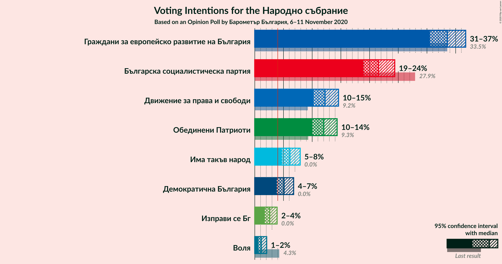

### Confidence Intervals

| Party | Last Result | Poll Result | 80% Confidence Interval | 90% Confidence Interval | 95% Confidence Interval | 99% Confidence Interval |
|:-----:|:-----------:|:-----------:|:-----------------------:|:-----------------------:|:-----------------------:|:-----------------------:|
| Граждани за европейско развитие на България | 33.5% | 33.6% | 31.6–35.7% |31.0–36.2% |30.5–36.7% |29.6–37.8% |
| Българска социалистическа партия | 27.9% | 21.5% | 19.8–23.4% |19.4–23.9% |18.9–24.4% |18.2–25.3% |
| Движение за права и свободи | 9.2% | 12.2% | 10.9–13.8% |10.5–14.2% |10.2–14.6% |9.6–15.3% |
| Обединени Патриоти | 9.3% | 12.0% | 10.7–13.5% |10.3–14.0% |10.0–14.3% |9.4–15.1% |
| Има такъв народ | 0.0% | 6.1% | 5.2–7.3% |4.9–7.6% |4.7–7.9% |4.3–8.5% |
| Демократична България | 0.0% | 5.1% | 4.3–6.2% |4.0–6.5% |3.8–6.8% |3.5–7.3% |
| Изправи се Бг | 0.0% | 2.6% | 2.0–3.4% |1.9–3.7% |1.7–3.9% |1.5–4.3% |
| Воля | 4.3% | 1.1% | 0.8–1.8% |0.7–1.9% |0.6–2.1% |0.5–2.4% |

*Note:* The poll result column reflects the actual value used in the calculations. Published results may vary slightly, and in addition be rounded to fewer digits.

## Seats

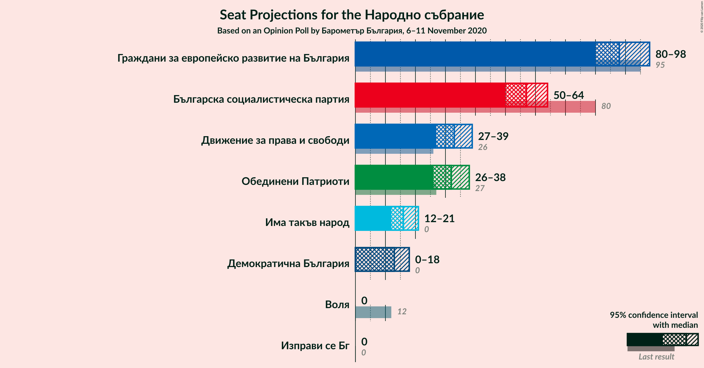

### Confidence Intervals

| Party | Last Result | Median | 80% Confidence Interval | 90% Confidence Interval | 95% Confidence Interval | 99% Confidence Interval |
|:-----:|:-----------:|:------:|:-----------------------:|:-----------------------:|:-----------------------:|:-----------------------:|
| <a href="#граждани-за-европейско-развитие-на-българия">Граждани за европейско развитие на България</a> | 95 | 88 | 83–94 |81–96 |80–98 |78–102 |
| <a href="#българска-социалистическа-партия">Българска социалистическа партия</a> | 80 | 57 | 52–62 |51–63 |50–64 |48–67 |
| <a href="#движение-за-права-и-свободи">Движение за права и свободи</a> | 26 | 33 | 29–36 |28–38 |27–39 |26–41 |
| <a href="#обединени-патриоти">Обединени Патриоти</a> | 27 | 32 | 28–36 |27–37 |26–38 |25–40 |
| <a href="#има-такъв-народ">Има такъв народ</a> | 0 | 16 | 14–20 |13–20 |12–21 |11–23 |
| <a href="#демократична-българия">Демократична България</a> | 0 | 13 | 11–16 |0–17 |0–18 |0–19 |
| <a href="#изправи-се-бг">Изправи се Бг</a> | 0 | 0 | 0 |0 |0 |0–11 |
| <a href="#воля">Воля</a> | 12 | 0 | 0 |0 |0 |0 |

### Граждани за европейско развитие на България

*For a full overview of the results for this party, see the [Граждани за европейско развитие на България](party-гражданизаевропейскоразвитиенабългария.html) page.*

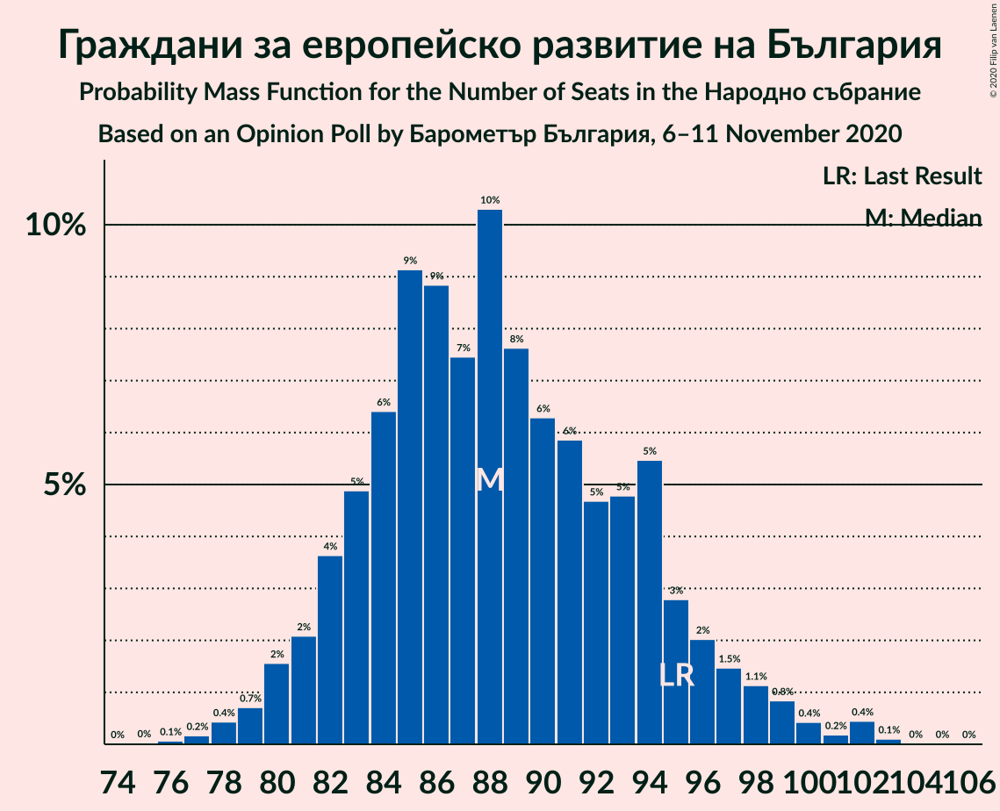

| Number of Seats | Probability | Accumulated | Special Marks |
|:---------------:|:-----------:|:-----------:|:-------------:|
| 75 | 0% | 100% |  |
| 76 | 0.1% | 99.9% |  |
| 77 | 0.2% | 99.9% |  |
| 78 | 0.4% | 99.7% |  |
| 79 | 0.7% | 99.3% |  |
| 80 | 2% | 98.6% |  |
| 81 | 2% | 97% |  |
| 82 | 4% | 95% |  |
| 83 | 5% | 91% |  |
| 84 | 6% | 86% |  |
| 85 | 9% | 80% |  |
| 86 | 9% | 71% |  |
| 87 | 7% | 62% |  |
| 88 | 10% | 55% | Median |
| 89 | 8% | 44% |  |
| 90 | 6% | 37% |  |
| 91 | 6% | 30% |  |
| 92 | 5% | 24% |  |
| 93 | 5% | 20% |  |
| 94 | 5% | 15% |  |
| 95 | 3% | 9% | Last Result |
| 96 | 2% | 7% |  |
| 97 | 1.5% | 5% |  |
| 98 | 1.1% | 3% |  |
| 99 | 0.8% | 2% |  |
| 100 | 0.4% | 1.2% |  |
| 101 | 0.2% | 0.8% |  |
| 102 | 0.4% | 0.6% |  |
| 103 | 0.1% | 0.2% |  |
| 104 | 0% | 0.1% |  |
| 105 | 0% | 0% |  |

### Българска социалистическа партия

*For a full overview of the results for this party, see the [Българска социалистическа партия](party-българскасоциалистическапартия.html) page.*

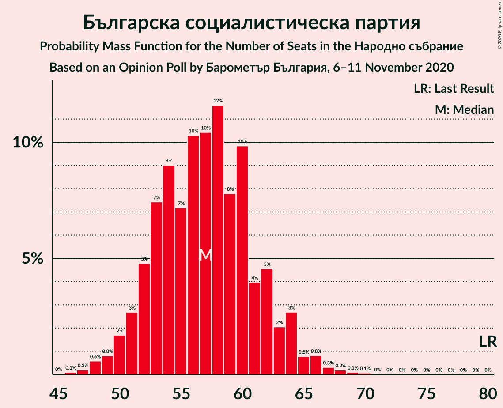

| Number of Seats | Probability | Accumulated | Special Marks |
|:---------------:|:-----------:|:-----------:|:-------------:|
| 46 | 0.1% | 100% |  |
| 47 | 0.2% | 99.9% |  |
| 48 | 0.6% | 99.7% |  |
| 49 | 0.8% | 99.1% |  |
| 50 | 2% | 98% |  |
| 51 | 3% | 97% |  |
| 52 | 5% | 94% |  |
| 53 | 7% | 89% |  |
| 54 | 9% | 82% |  |
| 55 | 7% | 73% |  |
| 56 | 10% | 65% |  |
| 57 | 10% | 55% | Median |
| 58 | 12% | 45% |  |
| 59 | 8% | 33% |  |
| 60 | 10% | 25% |  |
| 61 | 4% | 16% |  |
| 62 | 5% | 12% |  |
| 63 | 2% | 7% |  |
| 64 | 3% | 5% |  |
| 65 | 0.8% | 2% |  |
| 66 | 0.8% | 1.5% |  |
| 67 | 0.3% | 0.7% |  |
| 68 | 0.2% | 0.4% |  |
| 69 | 0.1% | 0.2% |  |
| 70 | 0.1% | 0.1% |  |
| 71 | 0% | 0% |  |
| 72 | 0% | 0% |  |
| 73 | 0% | 0% |  |
| 74 | 0% | 0% |  |
| 75 | 0% | 0% |  |
| 76 | 0% | 0% |  |
| 77 | 0% | 0% |  |
| 78 | 0% | 0% |  |
| 79 | 0% | 0% |  |
| 80 | 0% | 0% | Last Result |

### Движение за права и свободи

*For a full overview of the results for this party, see the [Движение за права и свободи](party-движениезаправаисвободи.html) page.*

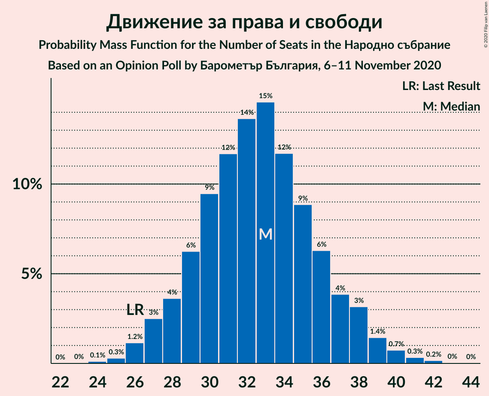

| Number of Seats | Probability | Accumulated | Special Marks |
|:---------------:|:-----------:|:-----------:|:-------------:|
| 24 | 0.1% | 100% |  |
| 25 | 0.3% | 99.8% |  |
| 26 | 1.2% | 99.5% | Last Result |
| 27 | 3% | 98% |  |
| 28 | 4% | 96% |  |
| 29 | 6% | 92% |  |
| 30 | 9% | 86% |  |
| 31 | 12% | 77% |  |
| 32 | 14% | 65% |  |
| 33 | 15% | 51% | Median |
| 34 | 12% | 37% |  |
| 35 | 9% | 25% |  |
| 36 | 6% | 16% |  |
| 37 | 4% | 10% |  |
| 38 | 3% | 6% |  |
| 39 | 1.4% | 3% |  |
| 40 | 0.7% | 1.3% |  |
| 41 | 0.3% | 0.6% |  |
| 42 | 0.2% | 0.3% |  |
| 43 | 0% | 0.1% |  |
| 44 | 0% | 0% |  |

### Обединени Патриоти

*For a full overview of the results for this party, see the [Обединени Патриоти](party-обединенипатриоти.html) page.*

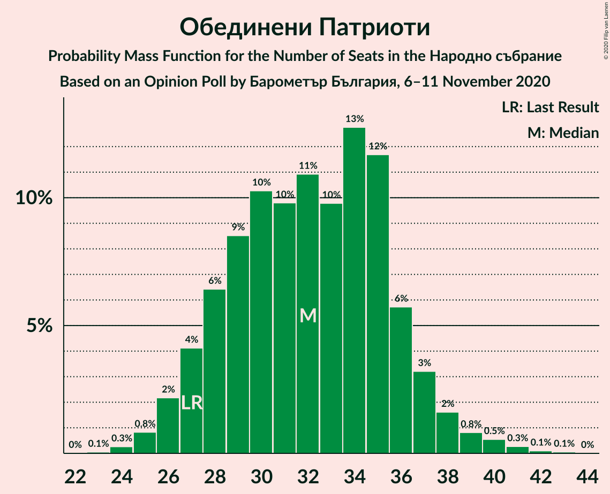

| Number of Seats | Probability | Accumulated | Special Marks |
|:---------------:|:-----------:|:-----------:|:-------------:|
| 23 | 0.1% | 100% |  |
| 24 | 0.3% | 99.9% |  |
| 25 | 0.8% | 99.7% |  |
| 26 | 2% | 98.8% |  |
| 27 | 4% | 97% | Last Result |
| 28 | 6% | 93% |  |
| 29 | 9% | 86% |  |
| 30 | 10% | 78% |  |
| 31 | 10% | 67% |  |
| 32 | 11% | 58% | Median |
| 33 | 10% | 47% |  |
| 34 | 13% | 37% |  |
| 35 | 12% | 24% |  |
| 36 | 6% | 12% |  |
| 37 | 3% | 7% |  |
| 38 | 2% | 3% |  |
| 39 | 0.8% | 2% |  |
| 40 | 0.5% | 1.0% |  |
| 41 | 0.3% | 0.4% |  |
| 42 | 0.1% | 0.2% |  |
| 43 | 0.1% | 0.1% |  |
| 44 | 0% | 0% |  |

### Има такъв народ

*For a full overview of the results for this party, see the [Има такъв народ](party-иматакъвнарод.html) page.*

| Number of Seats | Probability | Accumulated | Special Marks |
|:---------------:|:-----------:|:-----------:|:-------------:|
| 0 | 0.1% | 100% | Last Result |
| 1 | 0% | 99.9% |  |
| 2 | 0% | 99.9% |  |
| 3 | 0% | 99.9% |  |
| 4 | 0% | 99.9% |  |
| 5 | 0% | 99.9% |  |
| 6 | 0% | 99.9% |  |
| 7 | 0% | 99.9% |  |
| 8 | 0% | 99.9% |  |
| 9 | 0% | 99.9% |  |
| 10 | 0% | 99.9% |  |
| 11 | 0.5% | 99.9% |  |
| 12 | 2% | 99.4% |  |
| 13 | 5% | 97% |  |
| 14 | 10% | 92% |  |
| 15 | 16% | 82% |  |
| 16 | 17% | 66% | Median |
| 17 | 16% | 50% |  |
| 18 | 13% | 33% |  |
| 19 | 11% | 21% |  |
| 20 | 6% | 10% |  |
| 21 | 2% | 4% |  |
| 22 | 1.2% | 2% |  |
| 23 | 0.4% | 0.6% |  |
| 24 | 0.1% | 0.2% |  |
| 25 | 0% | 0% |  |

### Демократична България

*For a full overview of the results for this party, see the [Демократична България](party-демократичнабългария.html) page.*

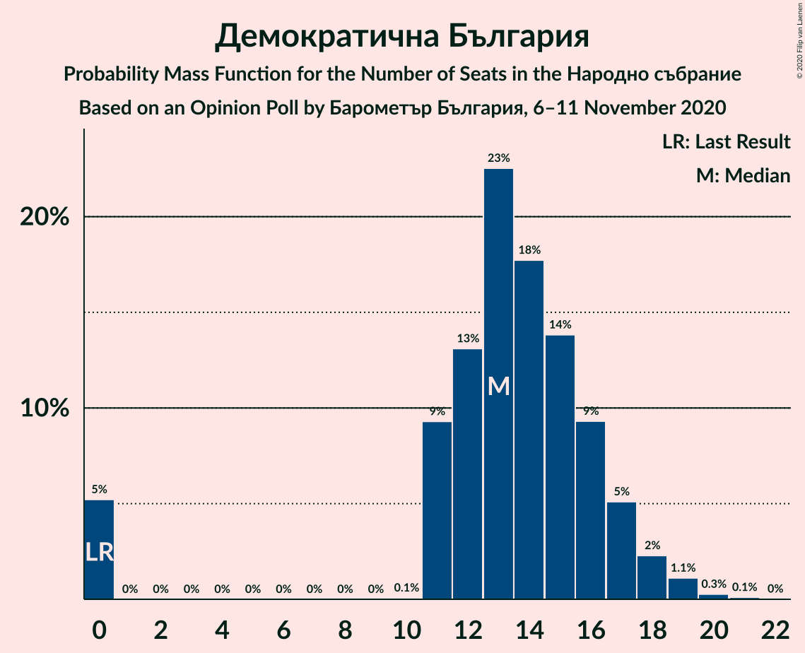

| Number of Seats | Probability | Accumulated | Special Marks |
|:---------------:|:-----------:|:-----------:|:-------------:|
| 0 | 5% | 100% | Last Result |
| 1 | 0% | 95% |  |
| 2 | 0% | 95% |  |
| 3 | 0% | 95% |  |
| 4 | 0% | 95% |  |
| 5 | 0% | 95% |  |
| 6 | 0% | 95% |  |
| 7 | 0% | 95% |  |
| 8 | 0% | 95% |  |
| 9 | 0% | 95% |  |
| 10 | 0.1% | 95% |  |
| 11 | 9% | 95% |  |
| 12 | 13% | 85% |  |
| 13 | 23% | 72% | Median |
| 14 | 18% | 50% |  |
| 15 | 14% | 32% |  |
| 16 | 9% | 18% |  |
| 17 | 5% | 9% |  |
| 18 | 2% | 4% |  |
| 19 | 1.1% | 2% |  |
| 20 | 0.3% | 0.4% |  |
| 21 | 0.1% | 0.1% |  |
| 22 | 0% | 0% |  |

### Изправи се Бг

*For a full overview of the results for this party, see the [Изправи се Бг](party-изправисебг.html) page.*

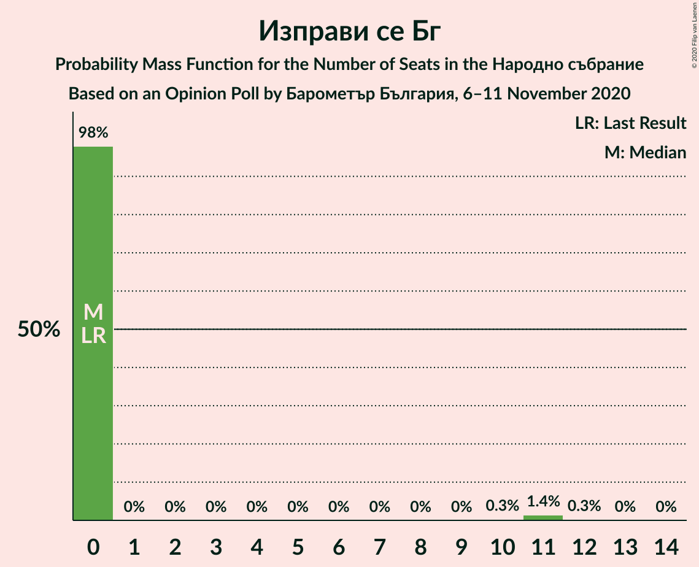

| Number of Seats | Probability | Accumulated | Special Marks |
|:---------------:|:-----------:|:-----------:|:-------------:|
| 0 | 98% | 100% | Last Result, Median |
| 1 | 0% | 2% |  |
| 2 | 0% | 2% |  |
| 3 | 0% | 2% |  |
| 4 | 0% | 2% |  |
| 5 | 0% | 2% |  |
| 6 | 0% | 2% |  |
| 7 | 0% | 2% |  |
| 8 | 0% | 2% |  |
| 9 | 0% | 2% |  |
| 10 | 0.3% | 2% |  |
| 11 | 1.4% | 2% |  |
| 12 | 0.3% | 0.3% |  |
| 13 | 0% | 0.1% |  |
| 14 | 0% | 0% |  |

### Воля

*For a full overview of the results for this party, see the [Воля](party-воля.html) page.*

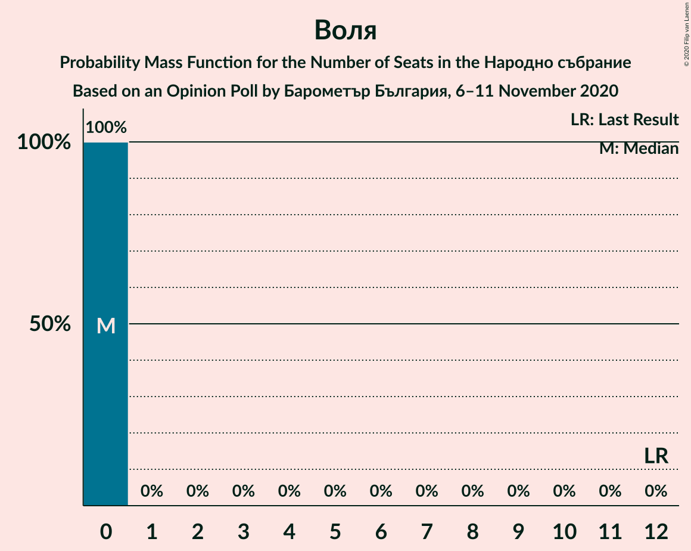

| Number of Seats | Probability | Accumulated | Special Marks |
|:---------------:|:-----------:|:-----------:|:-------------:|
| 0 | 100% | 100% | Median |
| 1 | 0% | 0% |  |
| 2 | 0% | 0% |  |
| 3 | 0% | 0% |  |
| 4 | 0% | 0% |  |
| 5 | 0% | 0% |  |
| 6 | 0% | 0% |  |
| 7 | 0% | 0% |  |
| 8 | 0% | 0% |  |
| 9 | 0% | 0% |  |
| 10 | 0% | 0% |  |
| 11 | 0% | 0% |  |
| 12 | 0% | 0% | Last Result |

## Coalitions

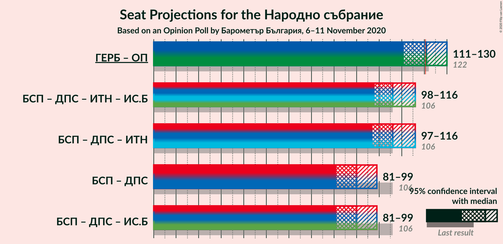

### Confidence Intervals

| Coalition | Last Result | Median | Majority? | 80% Confidence Interval | 90% Confidence Interval | 95% Confidence Interval | 99% Confidence Interval |
|:---------:|:-----------:|:------:|:---------:|:-----------------------:|:-----------------------:|:-----------------------:|:-----------------------:|
| Граждани за европейско развитие на България – Обединени Патриоти | 122 | 121 | 53% | 113–126 | 112–128 | 111–130 | 110–134 |
| Българска социалистическа партия – Движение за права и свободи – Има такъв народ – Изправи се Бг | 106 | 106 | 0.2% | 101–113 | 99–115 | 98–116 | 95–119 |
| Българска социалистическа партия – Движение за права и свободи – Има такъв народ | 106 | 106 | 0.1% | 100–113 | 99–114 | 97–116 | 95–118 |
| Българска социалистическа партия – Движение за права и свободи | 106 | 90 | 0% | 84–96 | 83–97 | 81–99 | 79–101 |
| Българска социалистическа партия – Движение за права и свободи – Изправи се Бг | 106 | 90 | 0% | 84–96 | 83–97 | 81–99 | 79–102 |

### Граждани за европейско развитие на България – Обединени Патриоти

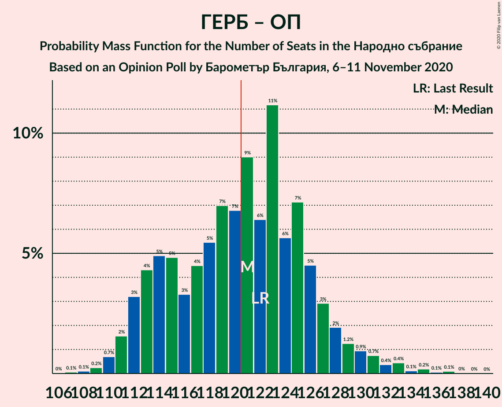

| Number of Seats | Probability | Accumulated | Special Marks |
|:---------------:|:-----------:|:-----------:|:-------------:|
| 106 | 0% | 100% |  |
| 107 | 0.1% | 99.9% |  |
| 108 | 0.1% | 99.9% |  |
| 109 | 0.2% | 99.8% |  |
| 110 | 0.7% | 99.5% |  |
| 111 | 2% | 98.8% |  |
| 112 | 3% | 97% |  |
| 113 | 4% | 94% |  |
| 114 | 5% | 90% |  |
| 115 | 5% | 85% |  |
| 116 | 3% | 80% |  |
| 117 | 4% | 77% |  |
| 118 | 5% | 72% |  |
| 119 | 7% | 67% |  |
| 120 | 7% | 60% | Median |
| 121 | 9% | 53% | Majority |
| 122 | 6% | 44% | Last Result |
| 123 | 11% | 38% |  |
| 124 | 6% | 26% |  |
| 125 | 7% | 21% |  |
| 126 | 5% | 14% |  |
| 127 | 3% | 9% |  |
| 128 | 2% | 6% |  |
| 129 | 1.2% | 4% |  |
| 130 | 0.9% | 3% |  |
| 131 | 0.7% | 2% |  |
| 132 | 0.4% | 1.3% |  |
| 133 | 0.4% | 1.0% |  |
| 134 | 0.1% | 0.5% |  |
| 135 | 0.2% | 0.4% |  |
| 136 | 0.1% | 0.2% |  |
| 137 | 0.1% | 0.2% |  |
| 138 | 0% | 0.1% |  |
| 139 | 0% | 0% |  |

### Българска социалистическа партия – Движение за права и свободи – Има такъв народ – Изправи се Бг

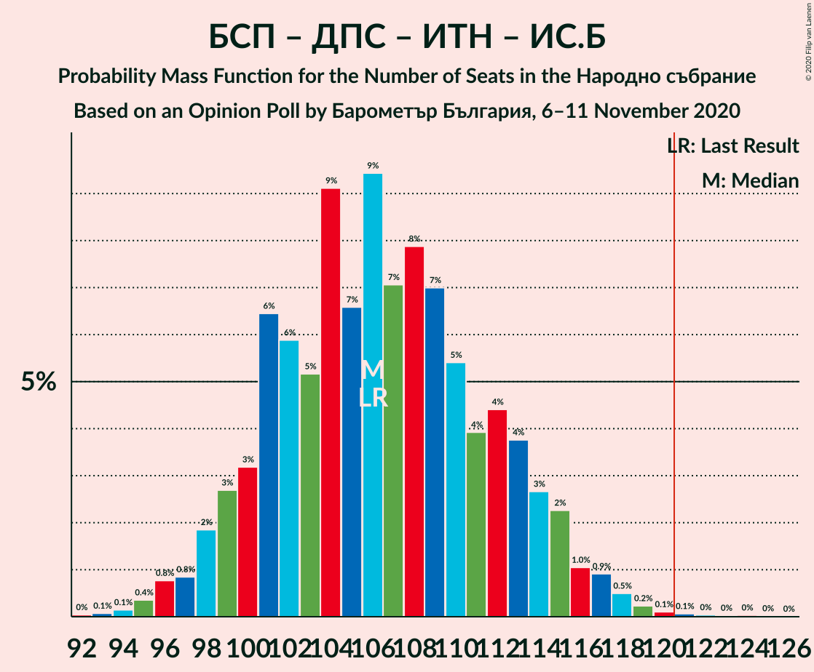

| Number of Seats | Probability | Accumulated | Special Marks |
|:---------------:|:-----------:|:-----------:|:-------------:|
| 92 | 0% | 100% |  |
| 93 | 0.1% | 99.9% |  |
| 94 | 0.1% | 99.8% |  |
| 95 | 0.4% | 99.7% |  |
| 96 | 0.8% | 99.3% |  |
| 97 | 0.8% | 98.6% |  |
| 98 | 2% | 98% |  |
| 99 | 3% | 96% |  |
| 100 | 3% | 93% |  |
| 101 | 6% | 90% |  |
| 102 | 6% | 84% |  |
| 103 | 5% | 78% |  |
| 104 | 9% | 72% |  |
| 105 | 7% | 63% |  |
| 106 | 9% | 57% | Last Result, Median |
| 107 | 7% | 47% |  |
| 108 | 8% | 40% |  |
| 109 | 7% | 32% |  |
| 110 | 5% | 25% |  |
| 111 | 4% | 20% |  |
| 112 | 4% | 16% |  |
| 113 | 4% | 12% |  |
| 114 | 3% | 8% |  |
| 115 | 2% | 5% |  |
| 116 | 1.0% | 3% |  |
| 117 | 0.9% | 2% |  |
| 118 | 0.5% | 1.0% |  |
| 119 | 0.2% | 0.5% |  |
| 120 | 0.1% | 0.3% |  |
| 121 | 0.1% | 0.2% | Majority |
| 122 | 0% | 0.1% |  |
| 123 | 0% | 0.1% |  |
| 124 | 0% | 0.1% |  |
| 125 | 0% | 0% |  |

### Българска социалистическа партия – Движение за права и свободи – Има такъв народ

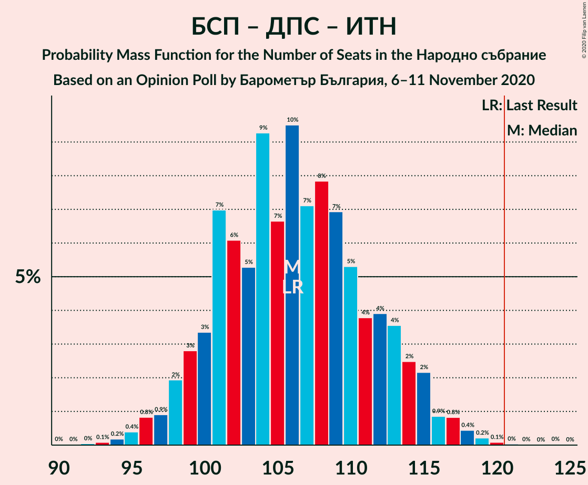

| Number of Seats | Probability | Accumulated | Special Marks |
|:---------------:|:-----------:|:-----------:|:-------------:|
| 91 | 0% | 100% |  |
| 92 | 0% | 99.9% |  |
| 93 | 0.1% | 99.9% |  |
| 94 | 0.2% | 99.8% |  |
| 95 | 0.4% | 99.6% |  |
| 96 | 0.8% | 99.2% |  |
| 97 | 0.9% | 98% |  |
| 98 | 2% | 97% |  |
| 99 | 3% | 96% |  |
| 100 | 3% | 93% |  |
| 101 | 7% | 89% |  |
| 102 | 6% | 82% |  |
| 103 | 5% | 76% |  |
| 104 | 9% | 71% |  |
| 105 | 7% | 62% |  |
| 106 | 10% | 55% | Last Result, Median |
| 107 | 7% | 46% |  |
| 108 | 8% | 39% |  |
| 109 | 7% | 31% |  |
| 110 | 5% | 24% |  |
| 111 | 4% | 18% |  |
| 112 | 4% | 15% |  |
| 113 | 4% | 11% |  |
| 114 | 2% | 7% |  |
| 115 | 2% | 5% |  |
| 116 | 0.9% | 3% |  |
| 117 | 0.8% | 2% |  |
| 118 | 0.4% | 0.9% |  |
| 119 | 0.2% | 0.4% |  |
| 120 | 0.1% | 0.2% |  |
| 121 | 0% | 0.1% | Majority |
| 122 | 0% | 0.1% |  |
| 123 | 0% | 0.1% |  |
| 124 | 0% | 0.1% |  |
| 125 | 0% | 0% |  |

### Българска социалистическа партия – Движение за права и свободи

| Number of Seats | Probability | Accumulated | Special Marks |
|:---------------:|:-----------:|:-----------:|:-------------:|
| 76 | 0% | 100% |  |
| 77 | 0.1% | 99.9% |  |
| 78 | 0.2% | 99.8% |  |
| 79 | 0.4% | 99.6% |  |
| 80 | 0.8% | 99.2% |  |
| 81 | 1.4% | 98% |  |
| 82 | 2% | 97% |  |
| 83 | 3% | 95% |  |
| 84 | 4% | 92% |  |
| 85 | 5% | 88% |  |
| 86 | 7% | 82% |  |
| 87 | 7% | 75% |  |
| 88 | 8% | 69% |  |
| 89 | 10% | 61% |  |
| 90 | 10% | 50% | Median |
| 91 | 8% | 40% |  |
| 92 | 7% | 33% |  |
| 93 | 8% | 26% |  |
| 94 | 5% | 18% |  |
| 95 | 2% | 13% |  |
| 96 | 4% | 10% |  |
| 97 | 2% | 6% |  |
| 98 | 1.3% | 4% |  |
| 99 | 0.8% | 3% |  |
| 100 | 0.8% | 2% |  |
| 101 | 0.5% | 1.0% |  |
| 102 | 0.2% | 0.4% |  |
| 103 | 0.2% | 0.3% |  |
| 104 | 0% | 0.1% |  |
| 105 | 0.1% | 0.1% |  |
| 106 | 0% | 0% | Last Result |

### Българска социалистическа партия – Движение за права и свободи – Изправи се Бг

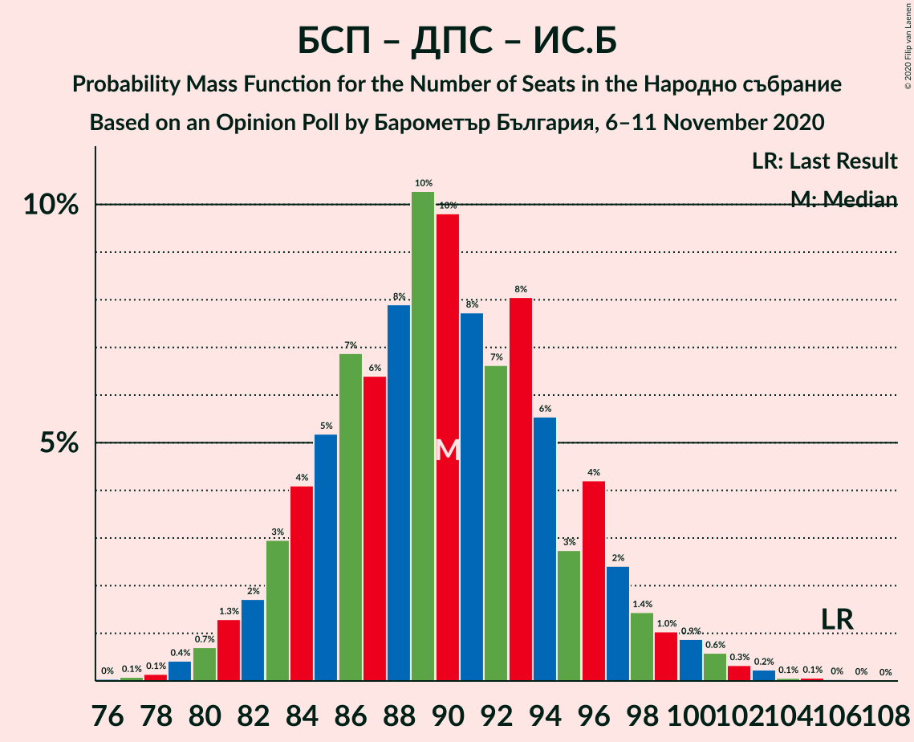

| Number of Seats | Probability | Accumulated | Special Marks |
|:---------------:|:-----------:|:-----------:|:-------------:|
| 76 | 0% | 100% |  |
| 77 | 0.1% | 99.9% |  |
| 78 | 0.1% | 99.9% |  |
| 79 | 0.4% | 99.7% |  |
| 80 | 0.7% | 99.3% |  |
| 81 | 1.3% | 98.6% |  |
| 82 | 2% | 97% |  |
| 83 | 3% | 96% |  |
| 84 | 4% | 93% |  |
| 85 | 5% | 89% |  |
| 86 | 7% | 83% |  |
| 87 | 6% | 76% |  |
| 88 | 8% | 70% |  |
| 89 | 10% | 62% |  |
| 90 | 10% | 52% | Median |
| 91 | 8% | 42% |  |
| 92 | 7% | 34% |  |
| 93 | 8% | 28% |  |
| 94 | 6% | 20% |  |
| 95 | 3% | 14% |  |
| 96 | 4% | 11% |  |
| 97 | 2% | 7% |  |
| 98 | 1.4% | 5% |  |
| 99 | 1.0% | 3% |  |
| 100 | 0.9% | 2% |  |
| 101 | 0.6% | 1.4% |  |
| 102 | 0.3% | 0.8% |  |
| 103 | 0.2% | 0.5% |  |
| 104 | 0.1% | 0.2% |  |
| 105 | 0.1% | 0.2% |  |
| 106 | 0% | 0.1% | Last Result |
| 107 | 0% | 0.1% |  |
| 108 | 0% | 0% |  |

## Technical Information

### Opinion Poll

+ **Polling firm:** Барометър България
+ **Commissioner(s):** —
+ **Fieldwork period:** 6–11 November 2020

### Calculations

+ **Sample size:** 882
+ **Simulations done:** 1,048,576
+ **Error estimate:** 2.06%

