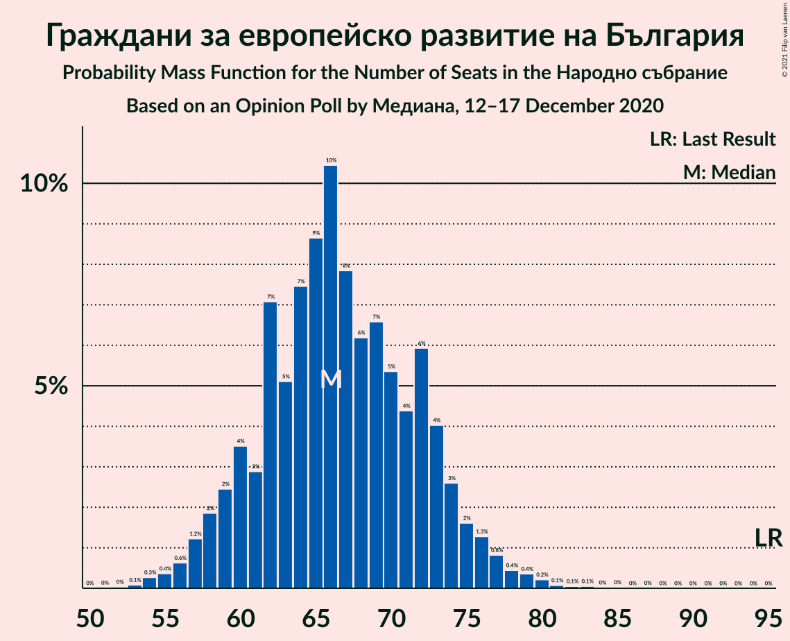
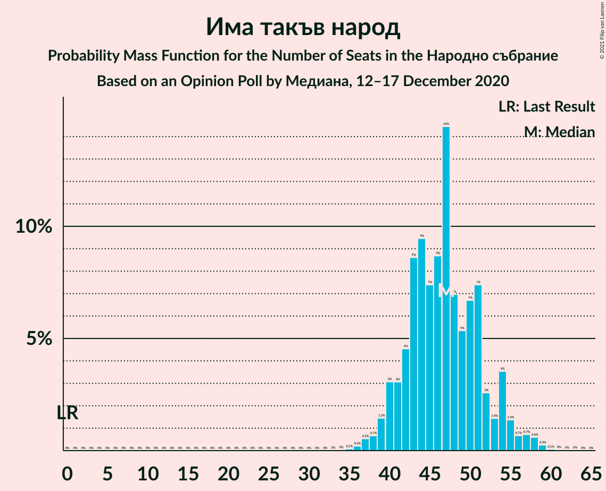
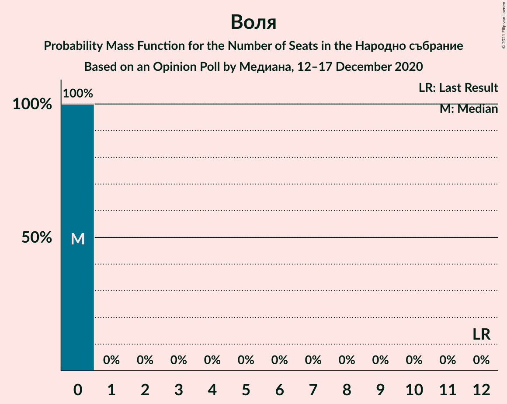
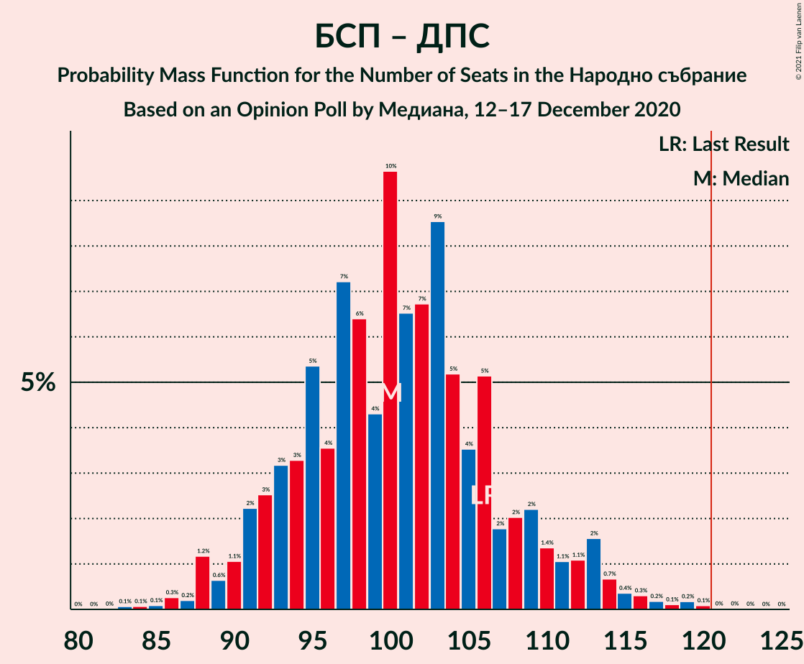
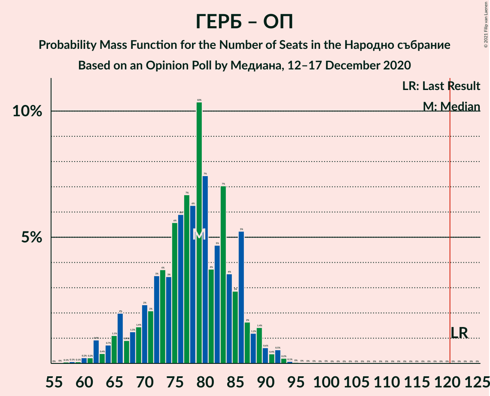

# Opinion Poll by Медиана, 12–17 December 2020

<a href="#voting-intentions">Voting Intentions</a> | <a href="#seats">Seats</a> | <a href="#coalitions">Coalitions</a> | <a href="#technical-information">Technical Information</a>

## Voting Intentions

### Confidence Intervals

| Party | Last Result | Poll Result | 80% Confidence Interval | 90% Confidence Interval | 95% Confidence Interval | 99% Confidence Interval |
|:-----:|:-----------:|:-----------:|:-----------------------:|:-----------------------:|:-----------------------:|:-----------------------:|
| Българска социалистическа партия | 27.9% | 25.7% | 23.7–27.9% |23.2–28.5% |22.7–29.0% |21.7–30.1% |
| Граждани за европейско развитие на България | 33.5% | 24.2% | 22.3–26.3% |21.7–26.9% |21.2–27.5% |20.3–28.5% |
| Има такъв народ | 0.0% | 17.0% | 15.3–18.9% |14.8–19.4% |14.4–19.9% |13.6–20.8% |
| Движение за права и свободи | 9.2% | 10.8% | 9.4–12.4% |9.1–12.9% |8.7–13.3% |8.1–14.1% |
| Изправи се Бг | 0.0% | 4.8% | 3.9–6.0% |3.7–6.3% |3.5–6.6% |3.1–7.2% |
| Обединени Патриоти | 9.3% | 4.7% | 3.8–5.8% |3.6–6.1% |3.3–6.4% |3.0–7.0% |
| Демократична България | 0.0% | 3.4% | 2.7–4.5% |2.5–4.7% |2.3–5.0% |2.0–5.5% |
| Воля | 4.3% | 1.6% | 1.2–2.4% |1.1–2.7% |0.9–2.9% |0.8–3.3% |

*Note:* The poll result column reflects the actual value used in the calculations. Published results may vary slightly, and in addition be rounded to fewer digits.

## Seats

### Confidence Intervals

| Party | Last Result | Median | 80% Confidence Interval | 90% Confidence Interval | 95% Confidence Interval | 99% Confidence Interval |
|:-----:|:-----------:|:------:|:-----------------------:|:-----------------------:|:-----------------------:|:-----------------------:|
| <a href="#българска-социалистическа-партия">Българска социалистическа партия</a> | 80 | 69 | 64–75 |63–77 |61–78 |59–82 |
| <a href="#граждани-за-европейско-развитие-на-българия">Граждани за европейско развитие на България</a> | 95 | 66 | 60–74 |58–75 |57–76 |55–80 |
| <a href="#има-такъв-народ">Има такъв народ</a> | 0 | 47 | 43–54 |41–54 |39–56 |37–58 |
| <a href="#движение-за-права-и-свободи">Движение за права и свободи</a> | 26 | 30 | 25–33 |24–35 |23–36 |21–38 |
| <a href="#изправи-се-бг">Изправи се Бг</a> | 0 | 14 | 0–17 |0–18 |0–18 |0–20 |
| <a href="#обединени-патриоти">Обединени Патриоти</a> | 27 | 13 | 0–16 |0–17 |0–18 |0–19 |
| <a href="#демократична-българия">Демократична България</a> | 0 | 0 | 0–12 |0–13 |0–13 |0–15 |
| <a href="#воля">Воля</a> | 12 | 0 | 0 |0 |0 |0 |

### Българска социалистическа партия

*For a full overview of the results for this party, see the [Българска социалистическа партия](party-българскасоциалистическапартия.html) page.*

| Number of Seats | Probability | Accumulated | Special Marks |
|:---------------:|:-----------:|:-----------:|:-------------:|
| 57 | 0.1% | 100% |  |
| 58 | 0.3% | 99.9% |  |
| 59 | 0.8% | 99.6% |  |
| 60 | 0.3% | 98.8% |  |
| 61 | 2% | 98.6% |  |
| 62 | 0.9% | 97% |  |
| 63 | 3% | 96% |  |
| 64 | 5% | 93% |  |
| 65 | 2% | 87% |  |
| 66 | 8% | 85% |  |
| 67 | 19% | 77% |  |
| 68 | 5% | 58% |  |
| 69 | 5% | 53% | Median |
| 70 | 4% | 49% |  |
| 71 | 13% | 45% |  |
| 72 | 4% | 32% |  |
| 73 | 9% | 28% |  |
| 74 | 9% | 19% |  |
| 75 | 4% | 11% |  |
| 76 | 1.4% | 7% |  |
| 77 | 3% | 5% |  |
| 78 | 0.5% | 3% |  |
| 79 | 0.8% | 2% |  |
| 80 | 0.3% | 1.4% | Last Result |
| 81 | 0.4% | 1.1% |  |
| 82 | 0.2% | 0.7% |  |
| 83 | 0.2% | 0.5% |  |
| 84 | 0.2% | 0.3% |  |
| 85 | 0.1% | 0.2% |  |
| 86 | 0% | 0.1% |  |
| 87 | 0.1% | 0.1% |  |
| 88 | 0% | 0% |  |

### Граждани за европейско развитие на България

*For a full overview of the results for this party, see the [Граждани за европейско развитие на България](party-гражданизаевропейскоразвитиенабългария.html) page.*

| Number of Seats | Probability | Accumulated | Special Marks |
|:---------------:|:-----------:|:-----------:|:-------------:|
| 52 | 0.1% | 100% |  |
| 53 | 0.1% | 99.9% |  |
| 54 | 0.3% | 99.8% |  |
| 55 | 0.2% | 99.5% |  |
| 56 | 0.8% | 99.4% |  |
| 57 | 3% | 98.5% |  |
| 58 | 1.3% | 96% |  |
| 59 | 3% | 94% |  |
| 60 | 4% | 91% |  |
| 61 | 5% | 87% |  |
| 62 | 4% | 82% |  |
| 63 | 5% | 78% |  |
| 64 | 3% | 73% |  |
| 65 | 15% | 71% |  |
| 66 | 13% | 56% | Median |
| 67 | 8% | 43% |  |
| 68 | 2% | 35% |  |
| 69 | 2% | 33% |  |
| 70 | 5% | 30% |  |
| 71 | 8% | 25% |  |
| 72 | 4% | 17% |  |
| 73 | 2% | 13% |  |
| 74 | 3% | 11% |  |
| 75 | 3% | 8% |  |
| 76 | 2% | 4% |  |
| 77 | 1.2% | 2% |  |
| 78 | 0.1% | 1.1% |  |
| 79 | 0.4% | 1.0% |  |
| 80 | 0.2% | 0.6% |  |
| 81 | 0.1% | 0.4% |  |
| 82 | 0.1% | 0.3% |  |
| 83 | 0% | 0.2% |  |
| 84 | 0.1% | 0.2% |  |
| 85 | 0.1% | 0.1% |  |
| 86 | 0% | 0% |  |
| 87 | 0% | 0% |  |
| 88 | 0% | 0% |  |
| 89 | 0% | 0% |  |
| 90 | 0% | 0% |  |
| 91 | 0% | 0% |  |
| 92 | 0% | 0% |  |
| 93 | 0% | 0% |  |
| 94 | 0% | 0% |  |
| 95 | 0% | 0% | Last Result |

### Има такъв народ

*For a full overview of the results for this party, see the [Има такъв народ](party-иматакъвнарод.html) page.*

| Number of Seats | Probability | Accumulated | Special Marks |
|:---------------:|:-----------:|:-----------:|:-------------:|
| 0 | 0% | 100% | Last Result |
| 1 | 0% | 100% |  |
| 2 | 0% | 100% |  |
| 3 | 0% | 100% |  |
| 4 | 0% | 100% |  |
| 5 | 0% | 100% |  |
| 6 | 0% | 100% |  |
| 7 | 0% | 100% |  |
| 8 | 0% | 100% |  |
| 9 | 0% | 100% |  |
| 10 | 0% | 100% |  |
| 11 | 0% | 100% |  |
| 12 | 0% | 100% |  |
| 13 | 0% | 100% |  |
| 14 | 0% | 100% |  |
| 15 | 0% | 100% |  |
| 16 | 0% | 100% |  |
| 17 | 0% | 100% |  |
| 18 | 0% | 100% |  |
| 19 | 0% | 100% |  |
| 20 | 0% | 100% |  |
| 21 | 0% | 100% |  |
| 22 | 0% | 100% |  |
| 23 | 0% | 100% |  |
| 24 | 0% | 100% |  |
| 25 | 0% | 100% |  |
| 26 | 0% | 100% |  |
| 27 | 0% | 100% |  |
| 28 | 0% | 100% |  |
| 29 | 0% | 100% |  |
| 30 | 0% | 100% |  |
| 31 | 0% | 100% |  |
| 32 | 0% | 100% |  |
| 33 | 0% | 100% |  |
| 34 | 0% | 100% |  |
| 35 | 0% | 100% |  |
| 36 | 0.1% | 99.9% |  |
| 37 | 0.4% | 99.8% |  |
| 38 | 0.5% | 99.5% |  |
| 39 | 3% | 99.0% |  |
| 40 | 0.8% | 96% |  |
| 41 | 2% | 95% |  |
| 42 | 3% | 93% |  |
| 43 | 6% | 90% |  |
| 44 | 12% | 84% |  |
| 45 | 4% | 72% |  |
| 46 | 4% | 68% |  |
| 47 | 15% | 64% | Median |
| 48 | 13% | 49% |  |
| 49 | 12% | 36% |  |
| 50 | 3% | 24% |  |
| 51 | 6% | 21% |  |
| 52 | 2% | 15% |  |
| 53 | 2% | 13% |  |
| 54 | 6% | 11% |  |
| 55 | 2% | 5% |  |
| 56 | 0.9% | 3% |  |
| 57 | 0.5% | 2% |  |
| 58 | 0.9% | 1.2% |  |
| 59 | 0.1% | 0.3% |  |
| 60 | 0.1% | 0.2% |  |
| 61 | 0% | 0.1% |  |
| 62 | 0% | 0.1% |  |
| 63 | 0.1% | 0.1% |  |
| 64 | 0% | 0% |  |

### Движение за права и свободи

*For a full overview of the results for this party, see the [Движение за права и свободи](party-движениезаправаисвободи.html) page.*

| Number of Seats | Probability | Accumulated | Special Marks |
|:---------------:|:-----------:|:-----------:|:-------------:|
| 20 | 0% | 100% |  |
| 21 | 0.6% | 99.9% |  |
| 22 | 0.4% | 99.3% |  |
| 23 | 2% | 98.9% |  |
| 24 | 3% | 97% |  |
| 25 | 6% | 94% |  |
| 26 | 3% | 88% | Last Result |
| 27 | 16% | 85% |  |
| 28 | 7% | 69% |  |
| 29 | 8% | 63% |  |
| 30 | 17% | 55% | Median |
| 31 | 11% | 38% |  |
| 32 | 4% | 27% |  |
| 33 | 15% | 23% |  |
| 34 | 3% | 9% |  |
| 35 | 2% | 5% |  |
| 36 | 2% | 3% |  |
| 37 | 1.0% | 2% |  |
| 38 | 0.3% | 0.5% |  |
| 39 | 0.1% | 0.3% |  |
| 40 | 0% | 0.2% |  |
| 41 | 0.1% | 0.1% |  |
| 42 | 0.1% | 0.1% |  |
| 43 | 0% | 0% |  |

### Изправи се Бг

*For a full overview of the results for this party, see the [Изправи се Бг](party-изправисебг.html) page.*

| Number of Seats | Probability | Accumulated | Special Marks |
|:---------------:|:-----------:|:-----------:|:-------------:|
| 0 | 12% | 100% | Last Result |
| 1 | 0% | 88% |  |
| 2 | 0% | 88% |  |
| 3 | 0% | 88% |  |
| 4 | 0% | 88% |  |
| 5 | 0% | 88% |  |
| 6 | 0% | 88% |  |
| 7 | 0% | 88% |  |
| 8 | 0% | 88% |  |
| 9 | 0% | 88% |  |
| 10 | 0% | 88% |  |
| 11 | 6% | 88% |  |
| 12 | 12% | 81% |  |
| 13 | 12% | 69% |  |
| 14 | 17% | 58% | Median |
| 15 | 19% | 40% |  |
| 16 | 11% | 21% |  |
| 17 | 5% | 11% |  |
| 18 | 3% | 5% |  |
| 19 | 1.4% | 2% |  |
| 20 | 0.4% | 0.7% |  |
| 21 | 0.2% | 0.3% |  |
| 22 | 0.1% | 0.1% |  |
| 23 | 0% | 0% |  |

### Обединени Патриоти

*For a full overview of the results for this party, see the [Обединени Патриоти](party-обединенипатриоти.html) page.*

| Number of Seats | Probability | Accumulated | Special Marks |
|:---------------:|:-----------:|:-----------:|:-------------:|
| 0 | 17% | 100% |  |
| 1 | 0% | 83% |  |
| 2 | 0% | 83% |  |
| 3 | 0% | 83% |  |
| 4 | 0% | 83% |  |
| 5 | 0% | 83% |  |
| 6 | 0% | 83% |  |
| 7 | 0% | 83% |  |
| 8 | 0% | 83% |  |
| 9 | 0% | 83% |  |
| 10 | 0.1% | 83% |  |
| 11 | 2% | 83% |  |
| 12 | 17% | 81% |  |
| 13 | 17% | 64% | Median |
| 14 | 25% | 46% |  |
| 15 | 9% | 22% |  |
| 16 | 6% | 12% |  |
| 17 | 4% | 7% |  |
| 18 | 2% | 3% |  |
| 19 | 0.4% | 0.8% |  |
| 20 | 0.3% | 0.4% |  |
| 21 | 0.1% | 0.1% |  |
| 22 | 0% | 0.1% |  |
| 23 | 0% | 0% |  |
| 24 | 0% | 0% |  |
| 25 | 0% | 0% |  |
| 26 | 0% | 0% |  |
| 27 | 0% | 0% | Last Result |

### Демократична България

*For a full overview of the results for this party, see the [Демократична България](party-демократичнабългария.html) page.*

| Number of Seats | Probability | Accumulated | Special Marks |
|:---------------:|:-----------:|:-----------:|:-------------:|
| 0 | 75% | 100% | Last Result, Median |
| 1 | 0% | 25% |  |
| 2 | 0% | 25% |  |
| 3 | 0% | 25% |  |
| 4 | 0% | 25% |  |
| 5 | 0% | 25% |  |
| 6 | 0% | 25% |  |
| 7 | 0% | 25% |  |
| 8 | 0% | 25% |  |
| 9 | 0% | 25% |  |
| 10 | 0.2% | 25% |  |
| 11 | 5% | 25% |  |
| 12 | 11% | 20% |  |
| 13 | 6% | 8% |  |
| 14 | 1.3% | 2% |  |
| 15 | 0.7% | 1.0% |  |
| 16 | 0.2% | 0.2% |  |
| 17 | 0% | 0% |  |

### Воля

*For a full overview of the results for this party, see the [Воля](party-воля.html) page.*

| Number of Seats | Probability | Accumulated | Special Marks |
|:---------------:|:-----------:|:-----------:|:-------------:|
| 0 | 100% | 100% | Median |
| 1 | 0% | 0% |  |
| 2 | 0% | 0% |  |
| 3 | 0% | 0% |  |
| 4 | 0% | 0% |  |
| 5 | 0% | 0% |  |
| 6 | 0% | 0% |  |
| 7 | 0% | 0% |  |
| 8 | 0% | 0% |  |
| 9 | 0% | 0% |  |
| 10 | 0% | 0% |  |
| 11 | 0% | 0% |  |
| 12 | 0% | 0% | Last Result |

## Coalitions

### Confidence Intervals

| Coalition | Last Result | Median | Majority? | 80% Confidence Interval | 90% Confidence Interval | 95% Confidence Interval | 99% Confidence Interval |
|:---------:|:-----------:|:------:|:---------:|:-----------------------:|:-----------------------:|:-----------------------:|:-----------------------:|
| Българска социалистическа партия – Има такъв народ – Движение за права и свободи – Изправи се Бг | 106 | 160 | 100% | 151–168 | 148–170 | 146–173 | 142–177 |
| Българска социалистическа партия – Има такъв народ – Движение за права и свободи | 106 | 146 | 100% | 138–155 | 136–157 | 134–161 | 131–164 |
| Българска социалистическа партия – Движение за права и свободи – Изправи се Бг | 106 | 112 | 6% | 102–119 | 100–121 | 99–122 | 96–129 |
| Българска социалистическа партия – Движение за права и свободи | 106 | 99 | 0.1% | 93–105 | 91–106 | 90–108 | 88–115 |
| Граждани за европейско развитие на България – Обединени Патриоти | 122 | 78 | 0% | 70–86 | 65–88 | 63–90 | 60–93 |

### Българска социалистическа партия – Има такъв народ – Движение за права и свободи – Изправи се Бг

| Number of Seats | Probability | Accumulated | Special Marks |
|:---------------:|:-----------:|:-----------:|:-------------:|
| 106 | 0% | 100% | Last Result |
| 107 | 0% | 100% |  |
| 108 | 0% | 100% |  |
| 109 | 0% | 100% |  |
| 110 | 0% | 100% |  |
| 111 | 0% | 100% |  |
| 112 | 0% | 100% |  |
| 113 | 0% | 100% |  |
| 114 | 0% | 100% |  |
| 115 | 0% | 100% |  |
| 116 | 0% | 100% |  |
| 117 | 0% | 100% |  |
| 118 | 0% | 100% |  |
| 119 | 0% | 100% |  |
| 120 | 0% | 100% |  |
| 121 | 0% | 100% | Majority |
| 122 | 0% | 100% |  |
| 123 | 0% | 100% |  |
| 124 | 0% | 100% |  |
| 125 | 0% | 100% |  |
| 126 | 0% | 100% |  |
| 127 | 0% | 100% |  |
| 128 | 0% | 100% |  |
| 129 | 0% | 100% |  |
| 130 | 0% | 100% |  |
| 131 | 0% | 100% |  |
| 132 | 0% | 100% |  |
| 133 | 0% | 100% |  |
| 134 | 0% | 100% |  |
| 135 | 0% | 100% |  |
| 136 | 0% | 100% |  |
| 137 | 0% | 100% |  |
| 138 | 0% | 100% |  |
| 139 | 0% | 99.9% |  |
| 140 | 0.2% | 99.9% |  |
| 141 | 0.1% | 99.7% |  |
| 142 | 0.2% | 99.7% |  |
| 143 | 0.1% | 99.4% |  |
| 144 | 0.7% | 99.4% |  |
| 145 | 0.6% | 98.7% |  |
| 146 | 1.1% | 98% |  |
| 147 | 1.2% | 97% |  |
| 148 | 3% | 96% |  |
| 149 | 0.8% | 93% |  |
| 150 | 1.1% | 92% |  |
| 151 | 5% | 91% |  |
| 152 | 4% | 86% |  |
| 153 | 6% | 83% |  |
| 154 | 5% | 77% |  |
| 155 | 7% | 72% |  |
| 156 | 1.3% | 65% |  |
| 157 | 4% | 64% |  |
| 158 | 4% | 59% |  |
| 159 | 5% | 55% |  |
| 160 | 10% | 51% | Median |
| 161 | 2% | 41% |  |
| 162 | 14% | 38% |  |
| 163 | 0.8% | 24% |  |
| 164 | 5% | 23% |  |
| 165 | 1.2% | 18% |  |
| 166 | 3% | 17% |  |
| 167 | 4% | 15% |  |
| 168 | 2% | 10% |  |
| 169 | 0.8% | 9% |  |
| 170 | 4% | 8% |  |
| 171 | 1.0% | 4% |  |
| 172 | 0.2% | 3% |  |
| 173 | 0.6% | 3% |  |
| 174 | 0.1% | 2% |  |
| 175 | 0.1% | 2% |  |
| 176 | 0.2% | 2% |  |
| 177 | 2% | 2% |  |
| 178 | 0% | 0.4% |  |
| 179 | 0.2% | 0.3% |  |
| 180 | 0.1% | 0.1% |  |
| 181 | 0% | 0% |  |

### Българска социалистическа партия – Има такъв народ – Движение за права и свободи

| Number of Seats | Probability | Accumulated | Special Marks |
|:---------------:|:-----------:|:-----------:|:-------------:|
| 106 | 0% | 100% | Last Result |
| 107 | 0% | 100% |  |
| 108 | 0% | 100% |  |
| 109 | 0% | 100% |  |
| 110 | 0% | 100% |  |
| 111 | 0% | 100% |  |
| 112 | 0% | 100% |  |
| 113 | 0% | 100% |  |
| 114 | 0% | 100% |  |
| 115 | 0% | 100% |  |
| 116 | 0% | 100% |  |
| 117 | 0% | 100% |  |
| 118 | 0% | 100% |  |
| 119 | 0% | 100% |  |
| 120 | 0% | 100% |  |
| 121 | 0% | 100% | Majority |
| 122 | 0% | 100% |  |
| 123 | 0% | 100% |  |
| 124 | 0% | 100% |  |
| 125 | 0% | 100% |  |
| 126 | 0% | 100% |  |
| 127 | 0% | 100% |  |
| 128 | 0.1% | 99.9% |  |
| 129 | 0% | 99.9% |  |
| 130 | 0% | 99.8% |  |
| 131 | 0.8% | 99.8% |  |
| 132 | 0.4% | 99.0% |  |
| 133 | 1.0% | 98.6% |  |
| 134 | 0.7% | 98% |  |
| 135 | 0.9% | 97% |  |
| 136 | 1.4% | 96% |  |
| 137 | 3% | 95% |  |
| 138 | 4% | 92% |  |
| 139 | 1.1% | 88% |  |
| 140 | 4% | 87% |  |
| 141 | 8% | 83% |  |
| 142 | 3% | 75% |  |
| 143 | 7% | 72% |  |
| 144 | 2% | 66% |  |
| 145 | 5% | 64% |  |
| 146 | 10% | 59% | Median |
| 147 | 15% | 49% |  |
| 148 | 3% | 34% |  |
| 149 | 2% | 31% |  |
| 150 | 3% | 29% |  |
| 151 | 4% | 26% |  |
| 152 | 2% | 22% |  |
| 153 | 3% | 20% |  |
| 154 | 2% | 18% |  |
| 155 | 6% | 15% |  |
| 156 | 4% | 9% |  |
| 157 | 0.8% | 5% |  |
| 158 | 0.3% | 4% |  |
| 159 | 0.2% | 4% |  |
| 160 | 0.6% | 4% |  |
| 161 | 2% | 3% |  |
| 162 | 0.4% | 1.1% |  |
| 163 | 0.2% | 0.7% |  |
| 164 | 0% | 0.5% |  |
| 165 | 0.2% | 0.5% |  |
| 166 | 0% | 0.3% |  |
| 167 | 0% | 0.3% |  |
| 168 | 0% | 0.3% |  |
| 169 | 0.2% | 0.2% |  |
| 170 | 0% | 0.1% |  |
| 171 | 0% | 0.1% |  |
| 172 | 0% | 0% |  |

### Българска социалистическа партия – Движение за права и свободи – Изправи се Бг

| Number of Seats | Probability | Accumulated | Special Marks |
|:---------------:|:-----------:|:-----------:|:-------------:|
| 90 | 0.1% | 100% |  |
| 91 | 0% | 99.9% |  |
| 92 | 0% | 99.9% |  |
| 93 | 0% | 99.9% |  |
| 94 | 0% | 99.9% |  |
| 95 | 0.1% | 99.8% |  |
| 96 | 0.4% | 99.8% |  |
| 97 | 0.3% | 99.4% |  |
| 98 | 0.3% | 99.1% |  |
| 99 | 2% | 98.8% |  |
| 100 | 2% | 97% |  |
| 101 | 4% | 95% |  |
| 102 | 1.5% | 90% |  |
| 103 | 2% | 89% |  |
| 104 | 2% | 87% |  |
| 105 | 6% | 85% |  |
| 106 | 5% | 79% | Last Result |
| 107 | 2% | 75% |  |
| 108 | 2% | 73% |  |
| 109 | 3% | 71% |  |
| 110 | 3% | 67% |  |
| 111 | 12% | 65% |  |
| 112 | 3% | 52% |  |
| 113 | 3% | 50% | Median |
| 114 | 6% | 47% |  |
| 115 | 14% | 40% |  |
| 116 | 4% | 26% |  |
| 117 | 6% | 22% |  |
| 118 | 4% | 16% |  |
| 119 | 4% | 12% |  |
| 120 | 2% | 8% |  |
| 121 | 2% | 6% | Majority |
| 122 | 2% | 4% |  |
| 123 | 0.4% | 2% |  |
| 124 | 0.8% | 2% |  |
| 125 | 0.3% | 1.2% |  |
| 126 | 0.2% | 0.9% |  |
| 127 | 0.1% | 0.7% |  |
| 128 | 0.1% | 0.6% |  |
| 129 | 0.2% | 0.5% |  |
| 130 | 0.1% | 0.3% |  |
| 131 | 0.1% | 0.2% |  |
| 132 | 0% | 0.1% |  |
| 133 | 0% | 0% |  |

### Българска социалистическа партия – Движение за права и свободи

| Number of Seats | Probability | Accumulated | Special Marks |
|:---------------:|:-----------:|:-----------:|:-------------:|
| 85 | 0% | 100% |  |
| 86 | 0% | 99.9% |  |
| 87 | 0% | 99.9% |  |
| 88 | 0.7% | 99.9% |  |
| 89 | 1.0% | 99.2% |  |
| 90 | 2% | 98% |  |
| 91 | 1.4% | 96% |  |
| 92 | 0.7% | 95% |  |
| 93 | 9% | 94% |  |
| 94 | 2% | 85% |  |
| 95 | 6% | 83% |  |
| 96 | 3% | 78% |  |
| 97 | 12% | 75% |  |
| 98 | 4% | 63% |  |
| 99 | 8% | 58% | Median |
| 100 | 17% | 50% |  |
| 101 | 9% | 33% |  |
| 102 | 3% | 24% |  |
| 103 | 3% | 20% |  |
| 104 | 4% | 17% |  |
| 105 | 4% | 13% |  |
| 106 | 5% | 9% | Last Result |
| 107 | 0.6% | 4% |  |
| 108 | 0.5% | 3% |  |
| 109 | 0.7% | 2% |  |
| 110 | 0.1% | 2% |  |
| 111 | 0.2% | 2% |  |
| 112 | 0.5% | 1.5% |  |
| 113 | 0.1% | 0.9% |  |
| 114 | 0.2% | 0.8% |  |
| 115 | 0.2% | 0.6% |  |
| 116 | 0% | 0.4% |  |
| 117 | 0.1% | 0.4% |  |
| 118 | 0.1% | 0.2% |  |
| 119 | 0% | 0.1% |  |
| 120 | 0% | 0.1% |  |
| 121 | 0% | 0.1% | Majority |
| 122 | 0% | 0% |  |

### Граждани за европейско развитие на България – Обединени Патриоти

| Number of Seats | Probability | Accumulated | Special Marks |
|:---------------:|:-----------:|:-----------:|:-------------:|
| 56 | 0.1% | 100% |  |
| 57 | 0% | 99.9% |  |
| 58 | 0% | 99.9% |  |
| 59 | 0% | 99.9% |  |
| 60 | 0.6% | 99.8% |  |
| 61 | 0.4% | 99.2% |  |
| 62 | 0.9% | 98.8% |  |
| 63 | 2% | 98% |  |
| 64 | 0.3% | 96% |  |
| 65 | 2% | 96% |  |
| 66 | 0.4% | 94% |  |
| 67 | 0.7% | 94% |  |
| 68 | 0.7% | 93% |  |
| 69 | 1.3% | 92% |  |
| 70 | 7% | 91% |  |
| 71 | 1.0% | 84% |  |
| 72 | 2% | 83% |  |
| 73 | 5% | 81% |  |
| 74 | 3% | 76% |  |
| 75 | 3% | 73% |  |
| 76 | 6% | 70% |  |
| 77 | 4% | 64% |  |
| 78 | 14% | 60% |  |
| 79 | 4% | 46% | Median |
| 80 | 11% | 42% |  |
| 81 | 5% | 32% |  |
| 82 | 2% | 27% |  |
| 83 | 4% | 25% |  |
| 84 | 2% | 21% |  |
| 85 | 6% | 19% |  |
| 86 | 4% | 13% |  |
| 87 | 3% | 9% |  |
| 88 | 2% | 6% |  |
| 89 | 0.3% | 3% |  |
| 90 | 0.6% | 3% |  |
| 91 | 0.1% | 2% |  |
| 92 | 2% | 2% |  |
| 93 | 0.5% | 0.7% |  |
| 94 | 0.2% | 0.3% |  |
| 95 | 0.1% | 0.1% |  |
| 96 | 0% | 0% |  |
| 97 | 0% | 0% |  |
| 98 | 0% | 0% |  |
| 99 | 0% | 0% |  |
| 100 | 0% | 0% |  |
| 101 | 0% | 0% |  |
| 102 | 0% | 0% |  |
| 103 | 0% | 0% |  |
| 104 | 0% | 0% |  |
| 105 | 0% | 0% |  |
| 106 | 0% | 0% |  |
| 107 | 0% | 0% |  |
| 108 | 0% | 0% |  |
| 109 | 0% | 0% |  |
| 110 | 0% | 0% |  |
| 111 | 0% | 0% |  |
| 112 | 0% | 0% |  |
| 113 | 0% | 0% |  |
| 114 | 0% | 0% |  |
| 115 | 0% | 0% |  |
| 116 | 0% | 0% |  |
| 117 | 0% | 0% |  |
| 118 | 0% | 0% |  |
| 119 | 0% | 0% |  |
| 120 | 0% | 0% |  |
| 121 | 0% | 0% | Majority |
| 122 | 0% | 0% | Last Result |

## Technical Information

### Opinion Poll

+ **Polling firm:** Медиана
+ **Commissioner(s):** —
+ **Fieldwork period:** 12–17 December 2020

### Calculations

+ **Sample size:** 731
+ **Simulations done:** 131,072
+ **Error estimate:** 1.28%

