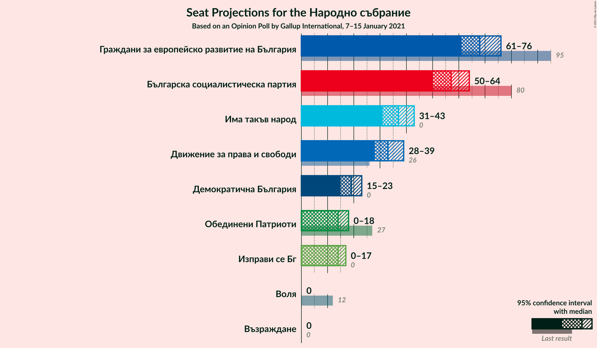
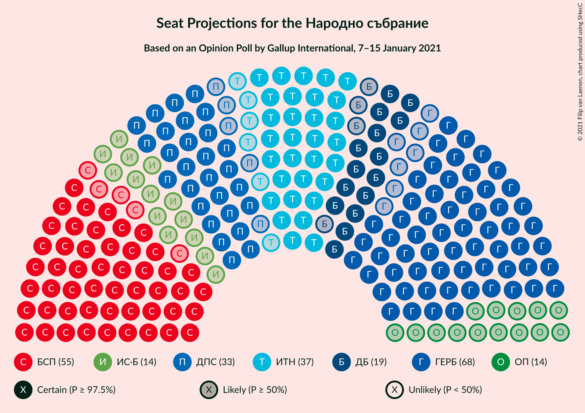
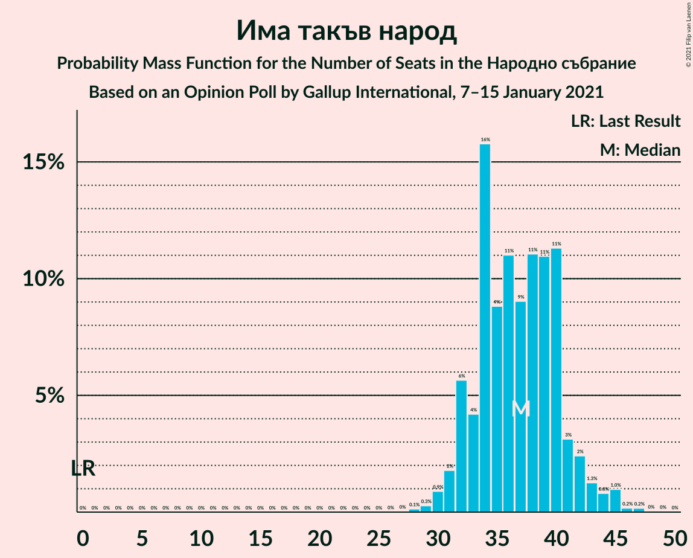
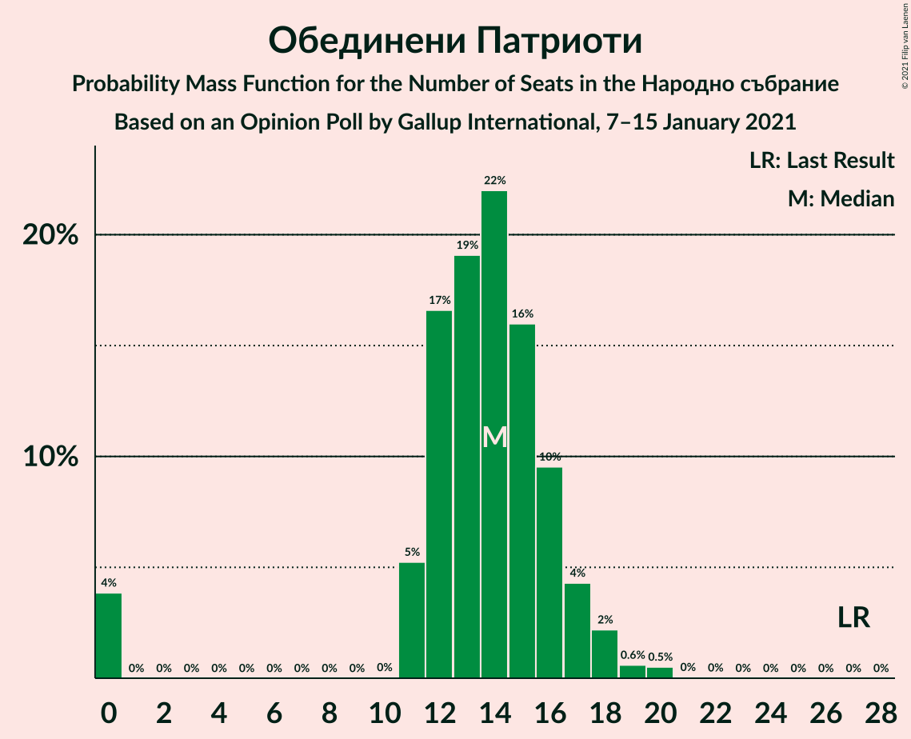
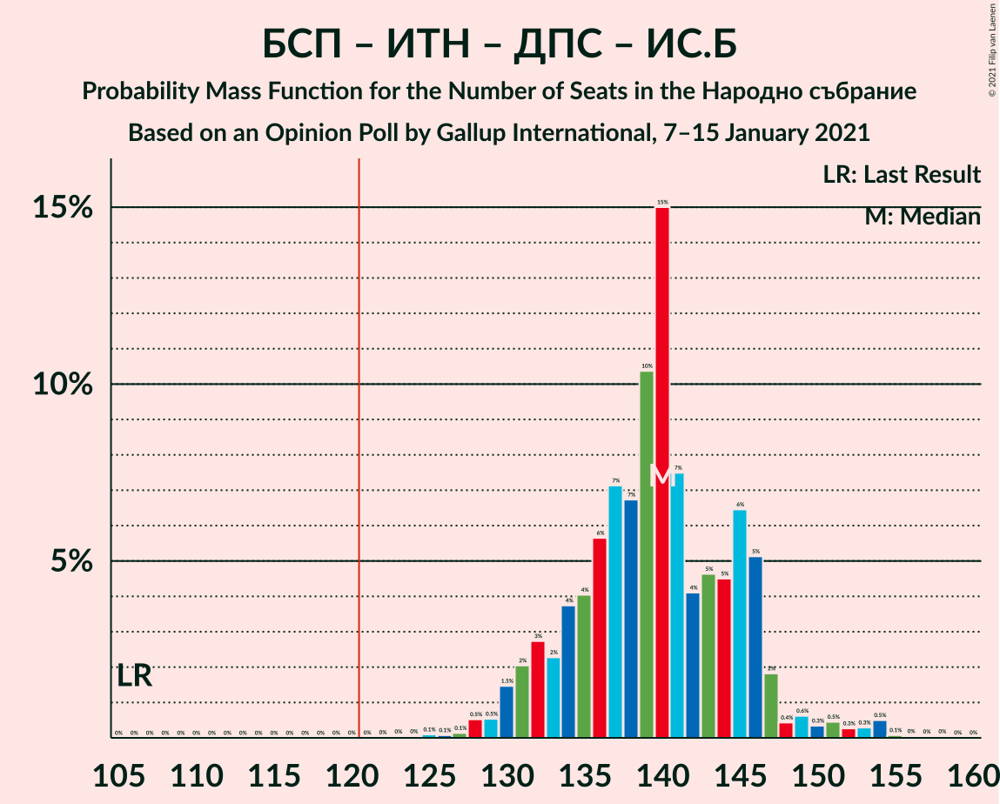
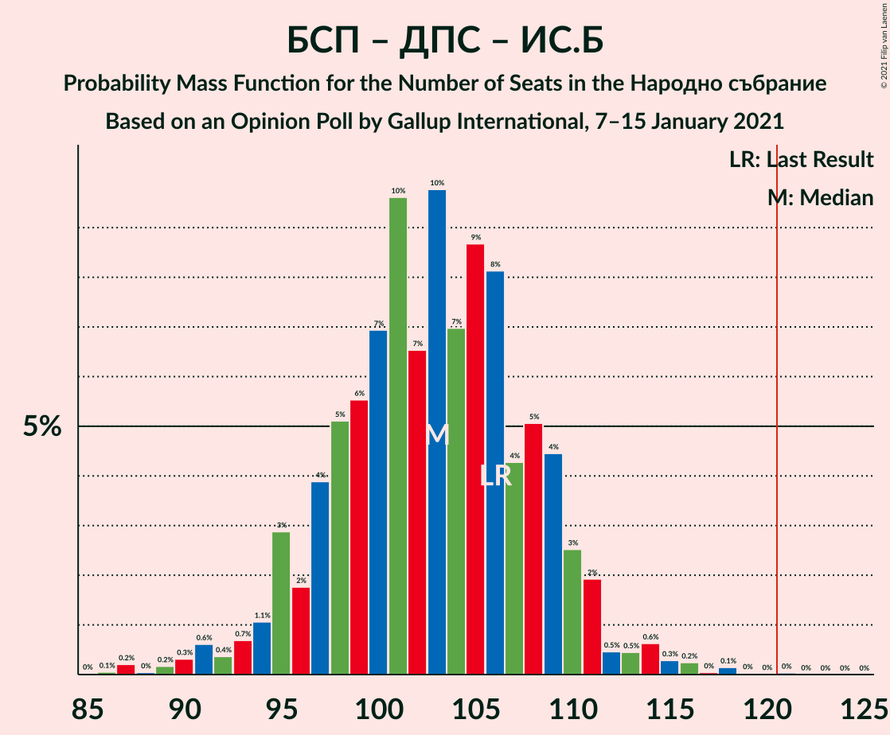
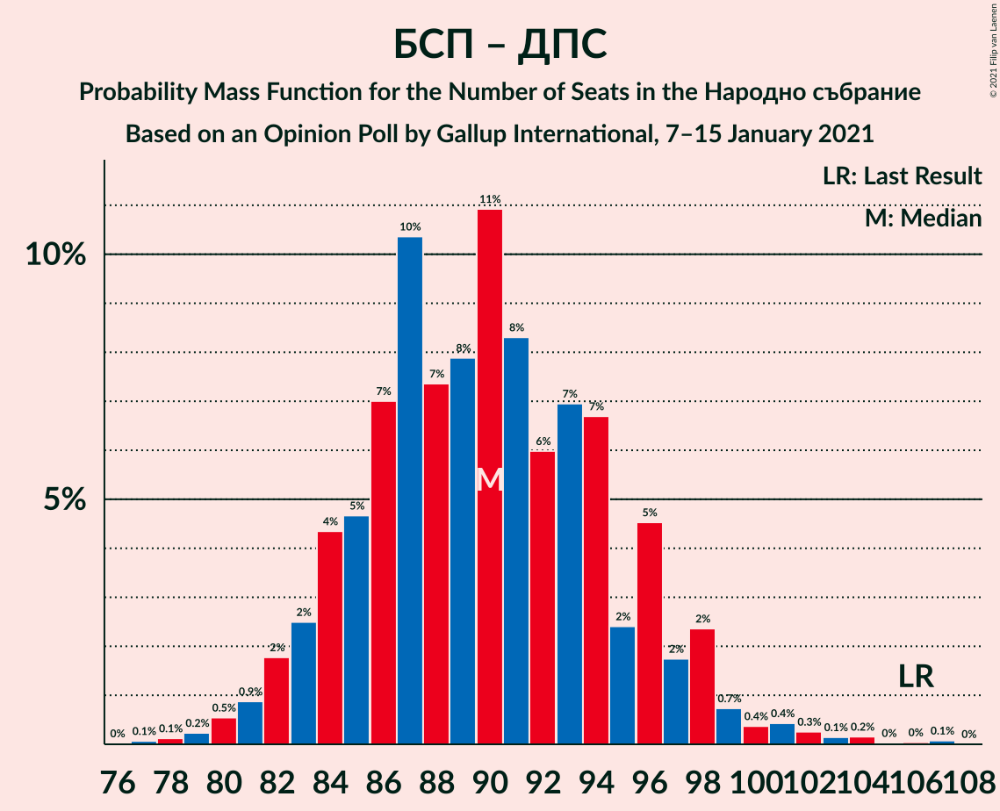

# Opinion Poll by Gallup International, 7–15 January 2021

<a href="#voting-intentions">Voting Intentions</a> | <a href="#seats">Seats</a> | <a href="#coalitions">Coalitions</a> | <a href="#technical-information">Technical Information</a>

## Voting Intentions

### Confidence Intervals

| Party | Last Result | Poll Result | 80% Confidence Interval | 90% Confidence Interval | 95% Confidence Interval | 99% Confidence Interval |
|:-----:|:-----------:|:-----------:|:-----------------------:|:-----------------------:|:-----------------------:|:-----------------------:|
| Граждани за европейско развитие на България | 33.5% | 25.6% | 23.8–27.6% |23.3–28.1% |22.9–28.6% |22.1–29.5% |
| Българска социалистическа партия | 27.9% | 21.4% | 19.8–23.3% |19.3–23.8% |18.9–24.2% |18.1–25.1% |
| Има такъв народ | 0.0% | 13.8% | 12.4–15.4% |12.0–15.8% |11.7–16.2% |11.1–17.0% |
| Движение за права и свободи | 9.2% | 12.2% | 10.9–13.7% |10.5–14.1% |10.2–14.4% |9.6–15.2% |
| Демократична България | 0.0% | 6.9% | 5.9–8.0% |5.6–8.4% |5.4–8.7% |4.9–9.3% |
| Обединени Патриоти | 9.3% | 5.1% | 4.3–6.2% |4.0–6.4% |3.8–6.7% |3.5–7.3% |
| Изправи се Бг | 0.0% | 5.0% | 4.2–6.0% |3.9–6.3% |3.7–6.6% |3.4–7.1% |
| Воля | 4.3% | 2.3% | 1.8–3.1% |1.6–3.3% |1.5–3.5% |1.3–3.9% |
| Възраждане | 0.0% | 1.5% | 1.1–2.2% |1.0–2.4% |0.9–2.6% |0.8–2.9% |

*Note:* The poll result column reflects the actual value used in the calculations. Published results may vary slightly, and in addition be rounded to fewer digits.

## Seats

### Confidence Intervals

| Party | Last Result | Median | 80% Confidence Interval | 90% Confidence Interval | 95% Confidence Interval | 99% Confidence Interval |
|:-----:|:-----------:|:------:|:-----------------------:|:-----------------------:|:-----------------------:|:-----------------------:|
| <a href="#граждани-за-европейско-развитие-на-българия">Граждани за европейско развитие на България</a> | 95 | 69 | 63–74 |62–76 |61–77 |58–80 |
| <a href="#българска-социалистическа-партия">Българска социалистическа партия</a> | 80 | 57 | 53–62 |52–63 |50–65 |48–68 |
| <a href="#има-такъв-народ">Има такъв народ</a> | 0 | 37 | 33–41 |32–43 |31–44 |29–46 |
| <a href="#движение-за-права-и-свободи">Движение за права и свободи</a> | 26 | 32 | 29–37 |27–38 |27–39 |25–41 |
| <a href="#демократична-българия">Демократична България</a> | 0 | 18 | 16–22 |15–22 |14–23 |13–25 |
| <a href="#обединени-патриоти">Обединени Патриоти</a> | 27 | 14 | 11–16 |11–17 |0–18 |0–20 |
| <a href="#изправи-се-бг">Изправи се Бг</a> | 0 | 13 | 11–16 |0–17 |0–18 |0–19 |
| <a href="#воля">Воля</a> | 12 | 0 | 0 |0 |0 |0 |
| <a href="#възраждане">Възраждане</a> | 0 | 0 | 0 |0 |0 |0 |

### Граждани за европейско развитие на България

*For a full overview of the results for this party, see the [Граждани за европейско развитие на България](party-гражданизаевропейскоразвитиенабългария.html) page.*

| Number of Seats | Probability | Accumulated | Special Marks |
|:---------------:|:-----------:|:-----------:|:-------------:|
| 56 | 0.1% | 100% |  |
| 57 | 0.1% | 99.9% |  |
| 58 | 0.4% | 99.8% |  |
| 59 | 0.7% | 99.4% |  |
| 60 | 1.0% | 98.8% |  |
| 61 | 1.4% | 98% |  |
| 62 | 3% | 96% |  |
| 63 | 4% | 93% |  |
| 64 | 10% | 89% |  |
| 65 | 6% | 79% |  |
| 66 | 8% | 73% |  |
| 67 | 7% | 66% |  |
| 68 | 6% | 59% |  |
| 69 | 11% | 53% | Median |
| 70 | 10% | 42% |  |
| 71 | 10% | 32% |  |
| 72 | 5% | 22% |  |
| 73 | 6% | 17% |  |
| 74 | 4% | 11% |  |
| 75 | 2% | 7% |  |
| 76 | 2% | 5% |  |
| 77 | 1.2% | 3% |  |
| 78 | 0.7% | 2% |  |
| 79 | 0.4% | 1.1% |  |
| 80 | 0.3% | 0.7% |  |
| 81 | 0.1% | 0.4% |  |
| 82 | 0.2% | 0.2% |  |
| 83 | 0% | 0.1% |  |
| 84 | 0% | 0% |  |
| 85 | 0% | 0% |  |
| 86 | 0% | 0% |  |
| 87 | 0% | 0% |  |
| 88 | 0% | 0% |  |
| 89 | 0% | 0% |  |
| 90 | 0% | 0% |  |
| 91 | 0% | 0% |  |
| 92 | 0% | 0% |  |
| 93 | 0% | 0% |  |
| 94 | 0% | 0% |  |
| 95 | 0% | 0% | Last Result |

### Българска социалистическа партия

*For a full overview of the results for this party, see the [Българска социалистическа партия](party-българскасоциалистическапартия.html) page.*

| Number of Seats | Probability | Accumulated | Special Marks |
|:---------------:|:-----------:|:-----------:|:-------------:|
| 46 | 0.1% | 100% |  |
| 47 | 0.2% | 99.9% |  |
| 48 | 0.4% | 99.7% |  |
| 49 | 0.9% | 99.3% |  |
| 50 | 1.2% | 98% |  |
| 51 | 2% | 97% |  |
| 52 | 5% | 95% |  |
| 53 | 7% | 91% |  |
| 54 | 7% | 84% |  |
| 55 | 11% | 77% |  |
| 56 | 9% | 66% |  |
| 57 | 12% | 57% | Median |
| 58 | 7% | 45% |  |
| 59 | 13% | 38% |  |
| 60 | 5% | 26% |  |
| 61 | 5% | 21% |  |
| 62 | 8% | 16% |  |
| 63 | 3% | 8% |  |
| 64 | 1.4% | 5% |  |
| 65 | 1.4% | 3% |  |
| 66 | 0.8% | 2% |  |
| 67 | 0.5% | 1.1% |  |
| 68 | 0.3% | 0.6% |  |
| 69 | 0.1% | 0.3% |  |
| 70 | 0.1% | 0.2% |  |
| 71 | 0% | 0.1% |  |
| 72 | 0% | 0% |  |
| 73 | 0% | 0% |  |
| 74 | 0% | 0% |  |
| 75 | 0% | 0% |  |
| 76 | 0% | 0% |  |
| 77 | 0% | 0% |  |
| 78 | 0% | 0% |  |
| 79 | 0% | 0% |  |
| 80 | 0% | 0% | Last Result |

### Има такъв народ

*For a full overview of the results for this party, see the [Има такъв народ](party-иматакъвнарод.html) page.*

| Number of Seats | Probability | Accumulated | Special Marks |
|:---------------:|:-----------:|:-----------:|:-------------:|
| 0 | 0% | 100% | Last Result |
| 1 | 0% | 100% |  |
| 2 | 0% | 100% |  |
| 3 | 0% | 100% |  |
| 4 | 0% | 100% |  |
| 5 | 0% | 100% |  |
| 6 | 0% | 100% |  |
| 7 | 0% | 100% |  |
| 8 | 0% | 100% |  |
| 9 | 0% | 100% |  |
| 10 | 0% | 100% |  |
| 11 | 0% | 100% |  |
| 12 | 0% | 100% |  |
| 13 | 0% | 100% |  |
| 14 | 0% | 100% |  |
| 15 | 0% | 100% |  |
| 16 | 0% | 100% |  |
| 17 | 0% | 100% |  |
| 18 | 0% | 100% |  |
| 19 | 0% | 100% |  |
| 20 | 0% | 100% |  |
| 21 | 0% | 100% |  |
| 22 | 0% | 100% |  |
| 23 | 0% | 100% |  |
| 24 | 0% | 100% |  |
| 25 | 0% | 100% |  |
| 26 | 0% | 100% |  |
| 27 | 0.1% | 100% |  |
| 28 | 0.1% | 99.9% |  |
| 29 | 0.4% | 99.8% |  |
| 30 | 0.7% | 99.4% |  |
| 31 | 3% | 98.6% |  |
| 32 | 4% | 96% |  |
| 33 | 8% | 92% |  |
| 34 | 7% | 84% |  |
| 35 | 14% | 78% |  |
| 36 | 8% | 64% |  |
| 37 | 12% | 55% | Median |
| 38 | 9% | 43% |  |
| 39 | 9% | 34% |  |
| 40 | 8% | 25% |  |
| 41 | 7% | 17% |  |
| 42 | 4% | 10% |  |
| 43 | 3% | 6% |  |
| 44 | 1.4% | 3% |  |
| 45 | 0.6% | 1.2% |  |
| 46 | 0.3% | 0.6% |  |
| 47 | 0.2% | 0.3% |  |
| 48 | 0.1% | 0.1% |  |
| 49 | 0% | 0% |  |

### Движение за права и свободи

*For a full overview of the results for this party, see the [Движение за права и свободи](party-движениезаправаисвободи.html) page.*

| Number of Seats | Probability | Accumulated | Special Marks |
|:---------------:|:-----------:|:-----------:|:-------------:|
| 24 | 0.1% | 100% |  |
| 25 | 0.5% | 99.8% |  |
| 26 | 0.8% | 99.4% | Last Result |
| 27 | 4% | 98.5% |  |
| 28 | 4% | 94% |  |
| 29 | 8% | 90% |  |
| 30 | 9% | 82% |  |
| 31 | 10% | 74% |  |
| 32 | 15% | 64% | Median |
| 33 | 8% | 49% |  |
| 34 | 9% | 41% |  |
| 35 | 10% | 32% |  |
| 36 | 9% | 23% |  |
| 37 | 7% | 14% |  |
| 38 | 2% | 7% |  |
| 39 | 3% | 5% |  |
| 40 | 0.8% | 1.4% |  |
| 41 | 0.4% | 0.6% |  |
| 42 | 0.1% | 0.2% |  |
| 43 | 0.1% | 0.1% |  |
| 44 | 0% | 0% |  |

### Демократична България

*For a full overview of the results for this party, see the [Демократична България](party-демократичнабългария.html) page.*

| Number of Seats | Probability | Accumulated | Special Marks |
|:---------------:|:-----------:|:-----------:|:-------------:|
| 0 | 0% | 100% | Last Result |
| 1 | 0% | 100% |  |
| 2 | 0% | 100% |  |
| 3 | 0% | 100% |  |
| 4 | 0% | 100% |  |
| 5 | 0% | 100% |  |
| 6 | 0% | 100% |  |
| 7 | 0% | 100% |  |
| 8 | 0% | 100% |  |
| 9 | 0% | 100% |  |
| 10 | 0% | 100% |  |
| 11 | 0% | 100% |  |
| 12 | 0.2% | 100% |  |
| 13 | 0.6% | 99.8% |  |
| 14 | 2% | 99.2% |  |
| 15 | 6% | 97% |  |
| 16 | 10% | 91% |  |
| 17 | 18% | 81% |  |
| 18 | 17% | 63% | Median |
| 19 | 14% | 46% |  |
| 20 | 12% | 32% |  |
| 21 | 8% | 20% |  |
| 22 | 7% | 11% |  |
| 23 | 3% | 5% |  |
| 24 | 1.2% | 2% |  |
| 25 | 0.5% | 0.9% |  |
| 26 | 0.3% | 0.4% |  |
| 27 | 0% | 0.1% |  |
| 28 | 0% | 0% |  |

### Обединени Патриоти

*For a full overview of the results for this party, see the [Обединени Патриоти](party-обединенипатриоти.html) page.*

| Number of Seats | Probability | Accumulated | Special Marks |
|:---------------:|:-----------:|:-----------:|:-------------:|
| 0 | 4% | 100% |  |
| 1 | 0% | 96% |  |
| 2 | 0% | 96% |  |
| 3 | 0% | 96% |  |
| 4 | 0% | 96% |  |
| 5 | 0% | 96% |  |
| 6 | 0% | 96% |  |
| 7 | 0% | 96% |  |
| 8 | 0% | 96% |  |
| 9 | 0% | 96% |  |
| 10 | 0.1% | 96% |  |
| 11 | 6% | 96% |  |
| 12 | 21% | 90% |  |
| 13 | 17% | 69% |  |
| 14 | 18% | 52% | Median |
| 15 | 16% | 34% |  |
| 16 | 8% | 18% |  |
| 17 | 5% | 10% |  |
| 18 | 3% | 5% |  |
| 19 | 1.4% | 2% |  |
| 20 | 0.4% | 0.5% |  |
| 21 | 0.1% | 0.1% |  |
| 22 | 0% | 0% |  |
| 23 | 0% | 0% |  |
| 24 | 0% | 0% |  |
| 25 | 0% | 0% |  |
| 26 | 0% | 0% |  |
| 27 | 0% | 0% | Last Result |

### Изправи се Бг

*For a full overview of the results for this party, see the [Изправи се Бг](party-изправисебг.html) page.*

| Number of Seats | Probability | Accumulated | Special Marks |
|:---------------:|:-----------:|:-----------:|:-------------:|
| 0 | 8% | 100% | Last Result |
| 1 | 0% | 92% |  |
| 2 | 0% | 92% |  |
| 3 | 0% | 92% |  |
| 4 | 0% | 92% |  |
| 5 | 0% | 92% |  |
| 6 | 0% | 92% |  |
| 7 | 0% | 92% |  |
| 8 | 0% | 92% |  |
| 9 | 0% | 92% |  |
| 10 | 0% | 92% |  |
| 11 | 9% | 92% |  |
| 12 | 21% | 83% |  |
| 13 | 15% | 63% | Median |
| 14 | 17% | 47% |  |
| 15 | 14% | 30% |  |
| 16 | 8% | 16% |  |
| 17 | 4% | 7% |  |
| 18 | 2% | 3% |  |
| 19 | 0.7% | 1.0% |  |
| 20 | 0.2% | 0.3% |  |
| 21 | 0.1% | 0.1% |  |
| 22 | 0% | 0% |  |

### Воля

*For a full overview of the results for this party, see the [Воля](party-воля.html) page.*

| Number of Seats | Probability | Accumulated | Special Marks |
|:---------------:|:-----------:|:-----------:|:-------------:|
| 0 | 99.6% | 100% | Median |
| 1 | 0% | 0.4% |  |
| 2 | 0% | 0.4% |  |
| 3 | 0% | 0.4% |  |
| 4 | 0% | 0.4% |  |
| 5 | 0% | 0.4% |  |
| 6 | 0% | 0.4% |  |
| 7 | 0% | 0.4% |  |
| 8 | 0% | 0.4% |  |
| 9 | 0% | 0.4% |  |
| 10 | 0% | 0.4% |  |
| 11 | 0.3% | 0.4% |  |
| 12 | 0.1% | 0.1% | Last Result |
| 13 | 0% | 0% |  |

### Възраждане

*For a full overview of the results for this party, see the [Възраждане](party-възраждане.html) page.*

| Number of Seats | Probability | Accumulated | Special Marks |
|:---------------:|:-----------:|:-----------:|:-------------:|
| 0 | 100% | 100% | Last Result, Median |

## Coalitions

### Confidence Intervals

| Coalition | Last Result | Median | Majority? | 80% Confidence Interval | 90% Confidence Interval | 95% Confidence Interval | 99% Confidence Interval |
|:---------:|:-----------:|:------:|:---------:|:-----------------------:|:-----------------------:|:-----------------------:|:-----------------------:|
| Българска социалистическа партия – Има такъв народ – Движение за права и свободи – Изправи се Бг | 106 | 139 | 100% | 134–146 | 131–147 | 130–149 | 127–154 |
| Българска социалистическа партия – Има такъв народ – Движение за права и свободи | 106 | 126 | 92% | 121–134 | 119–136 | 118–138 | 115–143 |
| Българска социалистическа партия – Движение за права и свободи – Изправи се Бг | 106 | 103 | 0% | 96–108 | 94–110 | 92–112 | 88–115 |
| Българска социалистическа партия – Движение за права и свободи | 106 | 90 | 0% | 84–96 | 83–98 | 81–99 | 79–102 |
| Граждани за европейско развитие на България – Обединени Патриоти | 122 | 83 | 0% | 76–88 | 74–89 | 72–91 | 67–93 |

### Българска социалистическа партия – Има такъв народ – Движение за права и свободи – Изправи се Бг

| Number of Seats | Probability | Accumulated | Special Marks |
|:---------------:|:-----------:|:-----------:|:-------------:|
| 106 | 0% | 100% | Last Result |
| 107 | 0% | 100% |  |
| 108 | 0% | 100% |  |
| 109 | 0% | 100% |  |
| 110 | 0% | 100% |  |
| 111 | 0% | 100% |  |
| 112 | 0% | 100% |  |
| 113 | 0% | 100% |  |
| 114 | 0% | 100% |  |
| 115 | 0% | 100% |  |
| 116 | 0% | 100% |  |
| 117 | 0% | 100% |  |
| 118 | 0% | 100% |  |
| 119 | 0% | 100% |  |
| 120 | 0% | 100% |  |
| 121 | 0% | 100% | Majority |
| 122 | 0% | 100% |  |
| 123 | 0% | 99.9% |  |
| 124 | 0.1% | 99.9% |  |
| 125 | 0.1% | 99.9% |  |
| 126 | 0.3% | 99.8% |  |
| 127 | 0.1% | 99.5% |  |
| 128 | 0.5% | 99.4% |  |
| 129 | 0.6% | 98.9% |  |
| 130 | 1.3% | 98% |  |
| 131 | 2% | 97% |  |
| 132 | 2% | 95% |  |
| 133 | 3% | 93% |  |
| 134 | 6% | 91% |  |
| 135 | 3% | 85% |  |
| 136 | 4% | 82% |  |
| 137 | 6% | 78% |  |
| 138 | 16% | 72% |  |
| 139 | 7% | 56% | Median |
| 140 | 10% | 49% |  |
| 141 | 5% | 39% |  |
| 142 | 6% | 34% |  |
| 143 | 4% | 28% |  |
| 144 | 7% | 25% |  |
| 145 | 6% | 17% |  |
| 146 | 4% | 11% |  |
| 147 | 2% | 7% |  |
| 148 | 1.1% | 5% |  |
| 149 | 1.4% | 4% |  |
| 150 | 0.6% | 2% |  |
| 151 | 0.4% | 1.5% |  |
| 152 | 0.4% | 1.1% |  |
| 153 | 0.2% | 0.7% |  |
| 154 | 0.3% | 0.5% |  |
| 155 | 0.1% | 0.2% |  |
| 156 | 0.1% | 0.1% |  |
| 157 | 0% | 0.1% |  |
| 158 | 0% | 0.1% |  |
| 159 | 0% | 0% |  |

### Българска социалистическа партия – Има такъв народ – Движение за права и свободи

| Number of Seats | Probability | Accumulated | Special Marks |
|:---------------:|:-----------:|:-----------:|:-------------:|
| 106 | 0% | 100% | Last Result |
| 107 | 0% | 100% |  |
| 108 | 0% | 100% |  |
| 109 | 0% | 100% |  |
| 110 | 0% | 100% |  |
| 111 | 0% | 100% |  |
| 112 | 0% | 100% |  |
| 113 | 0.1% | 99.9% |  |
| 114 | 0.1% | 99.9% |  |
| 115 | 0.3% | 99.7% |  |
| 116 | 0.6% | 99.4% |  |
| 117 | 1.2% | 98.8% |  |
| 118 | 2% | 98% |  |
| 119 | 1.1% | 96% |  |
| 120 | 3% | 94% |  |
| 121 | 4% | 92% | Majority |
| 122 | 5% | 88% |  |
| 123 | 9% | 83% |  |
| 124 | 6% | 74% |  |
| 125 | 7% | 67% |  |
| 126 | 11% | 61% | Median |
| 127 | 9% | 49% |  |
| 128 | 6% | 41% |  |
| 129 | 4% | 35% |  |
| 130 | 4% | 31% |  |
| 131 | 5% | 27% |  |
| 132 | 6% | 23% |  |
| 133 | 6% | 16% |  |
| 134 | 3% | 10% |  |
| 135 | 1.5% | 7% |  |
| 136 | 0.9% | 6% |  |
| 137 | 1.3% | 5% |  |
| 138 | 2% | 4% |  |
| 139 | 0.7% | 2% |  |
| 140 | 0.4% | 1.3% |  |
| 141 | 0.2% | 0.9% |  |
| 142 | 0.2% | 0.7% |  |
| 143 | 0.2% | 0.6% |  |
| 144 | 0.2% | 0.3% |  |
| 145 | 0.1% | 0.2% |  |
| 146 | 0% | 0.1% |  |
| 147 | 0% | 0.1% |  |
| 148 | 0% | 0% |  |

### Българска социалистическа партия – Движение за права и свободи – Изправи се Бг

| Number of Seats | Probability | Accumulated | Special Marks |
|:---------------:|:-----------:|:-----------:|:-------------:|
| 84 | 0% | 100% |  |
| 85 | 0% | 99.9% |  |
| 86 | 0.2% | 99.9% |  |
| 87 | 0.1% | 99.7% |  |
| 88 | 0.1% | 99.6% |  |
| 89 | 0.2% | 99.4% |  |
| 90 | 0.4% | 99.2% |  |
| 91 | 1.1% | 98.8% |  |
| 92 | 0.5% | 98% |  |
| 93 | 0.8% | 97% |  |
| 94 | 2% | 96% |  |
| 95 | 2% | 95% |  |
| 96 | 3% | 92% |  |
| 97 | 5% | 90% |  |
| 98 | 6% | 85% |  |
| 99 | 4% | 79% |  |
| 100 | 6% | 75% |  |
| 101 | 10% | 69% |  |
| 102 | 6% | 59% | Median |
| 103 | 10% | 54% |  |
| 104 | 5% | 43% |  |
| 105 | 8% | 38% |  |
| 106 | 8% | 29% | Last Result |
| 107 | 6% | 21% |  |
| 108 | 6% | 15% |  |
| 109 | 2% | 9% |  |
| 110 | 3% | 7% |  |
| 111 | 1.3% | 5% |  |
| 112 | 1.1% | 3% |  |
| 113 | 0.8% | 2% |  |
| 114 | 0.3% | 1.4% |  |
| 115 | 0.7% | 1.1% |  |
| 116 | 0.1% | 0.5% |  |
| 117 | 0.2% | 0.3% |  |
| 118 | 0.1% | 0.1% |  |
| 119 | 0% | 0.1% |  |
| 120 | 0% | 0% |  |

### Българска социалистическа партия – Движение за права и свободи

| Number of Seats | Probability | Accumulated | Special Marks |
|:---------------:|:-----------:|:-----------:|:-------------:|
| 76 | 0% | 100% |  |
| 77 | 0.2% | 99.9% |  |
| 78 | 0.2% | 99.8% |  |
| 79 | 0.3% | 99.6% |  |
| 80 | 0.5% | 99.3% |  |
| 81 | 1.4% | 98.7% |  |
| 82 | 2% | 97% |  |
| 83 | 4% | 96% |  |
| 84 | 4% | 92% |  |
| 85 | 7% | 88% |  |
| 86 | 4% | 81% |  |
| 87 | 6% | 77% |  |
| 88 | 9% | 71% |  |
| 89 | 6% | 62% | Median |
| 90 | 10% | 56% |  |
| 91 | 10% | 46% |  |
| 92 | 7% | 36% |  |
| 93 | 4% | 29% |  |
| 94 | 10% | 25% |  |
| 95 | 3% | 15% |  |
| 96 | 5% | 12% |  |
| 97 | 2% | 8% |  |
| 98 | 2% | 6% |  |
| 99 | 1.0% | 3% |  |
| 100 | 0.6% | 2% |  |
| 101 | 0.8% | 2% |  |
| 102 | 0.5% | 1.0% |  |
| 103 | 0.2% | 0.5% |  |
| 104 | 0.2% | 0.3% |  |
| 105 | 0.1% | 0.1% |  |
| 106 | 0% | 0.1% | Last Result |
| 107 | 0% | 0.1% |  |
| 108 | 0% | 0% |  |

### Граждани за европейско развитие на България – Обединени Патриоти

| Number of Seats | Probability | Accumulated | Special Marks |
|:---------------:|:-----------:|:-----------:|:-------------:|
| 63 | 0% | 100% |  |
| 64 | 0% | 99.9% |  |
| 65 | 0.1% | 99.9% |  |
| 66 | 0.1% | 99.9% |  |
| 67 | 0.3% | 99.8% |  |
| 68 | 0.4% | 99.5% |  |
| 69 | 0.3% | 99.1% |  |
| 70 | 0.3% | 98.9% |  |
| 71 | 0.7% | 98.6% |  |
| 72 | 0.6% | 98% |  |
| 73 | 2% | 97% |  |
| 74 | 1.4% | 96% |  |
| 75 | 3% | 94% |  |
| 76 | 6% | 91% |  |
| 77 | 4% | 86% |  |
| 78 | 8% | 81% |  |
| 79 | 7% | 73% |  |
| 80 | 4% | 66% |  |
| 81 | 7% | 62% |  |
| 82 | 5% | 55% |  |
| 83 | 10% | 50% | Median |
| 84 | 12% | 40% |  |
| 85 | 9% | 28% |  |
| 86 | 5% | 19% |  |
| 87 | 4% | 14% |  |
| 88 | 2% | 10% |  |
| 89 | 3% | 8% |  |
| 90 | 2% | 5% |  |
| 91 | 2% | 3% |  |
| 92 | 0.4% | 2% |  |
| 93 | 0.7% | 1.1% |  |
| 94 | 0.2% | 0.5% |  |
| 95 | 0.1% | 0.2% |  |
| 96 | 0.1% | 0.1% |  |
| 97 | 0% | 0.1% |  |
| 98 | 0% | 0% |  |
| 99 | 0% | 0% |  |
| 100 | 0% | 0% |  |
| 101 | 0% | 0% |  |
| 102 | 0% | 0% |  |
| 103 | 0% | 0% |  |
| 104 | 0% | 0% |  |
| 105 | 0% | 0% |  |
| 106 | 0% | 0% |  |
| 107 | 0% | 0% |  |
| 108 | 0% | 0% |  |
| 109 | 0% | 0% |  |
| 110 | 0% | 0% |  |
| 111 | 0% | 0% |  |
| 112 | 0% | 0% |  |
| 113 | 0% | 0% |  |
| 114 | 0% | 0% |  |
| 115 | 0% | 0% |  |
| 116 | 0% | 0% |  |
| 117 | 0% | 0% |  |
| 118 | 0% | 0% |  |
| 119 | 0% | 0% |  |
| 120 | 0% | 0% |  |
| 121 | 0% | 0% | Majority |
| 122 | 0% | 0% | Last Result |

## Technical Information

### Opinion Poll

+ **Polling firm:** Gallup International
+ **Commissioner(s):** —
+ **Fieldwork period:** 7–15 January 2021

### Calculations

+ **Sample size:** 905
+ **Simulations done:** 1,048,576
+ **Error estimate:** 2.51%

