# Opinion Poll by Тренд for 24 часа, 12–19 January 2021

<a href="#voting-intentions">Voting Intentions</a> | <a href="#seats">Seats</a> | <a href="#coalitions">Coalitions</a> | <a href="#technical-information">Technical Information</a>

## Voting Intentions

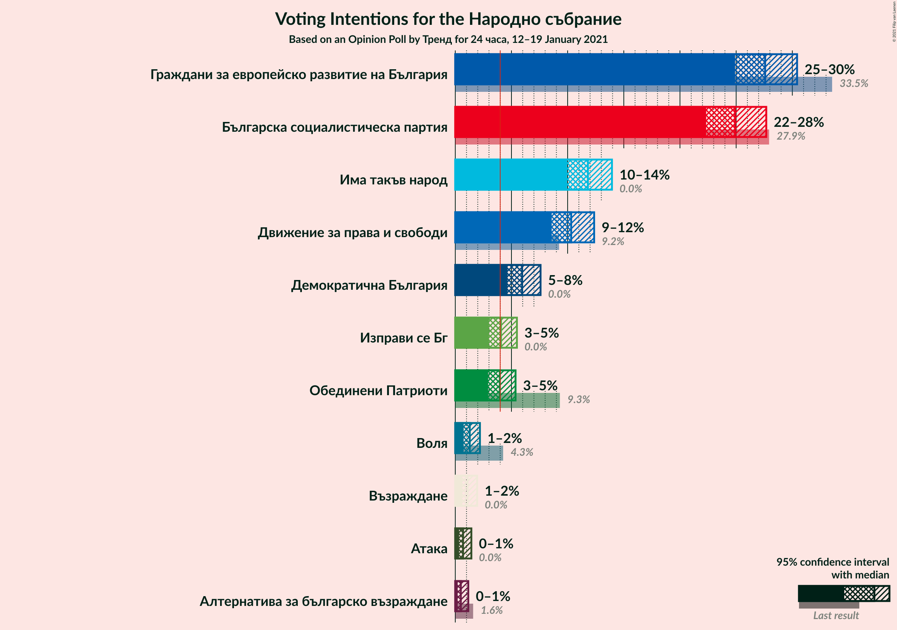

### Confidence Intervals

| Party | Last Result | Poll Result | 80% Confidence Interval | 90% Confidence Interval | 95% Confidence Interval | 99% Confidence Interval |
|:-----:|:-----------:|:-----------:|:-----------------------:|:-----------------------:|:-----------------------:|:-----------------------:|
| Граждани за европейско развитие на България | 33.5% | 27.6% | 25.8–29.4% |25.3–30.0% |24.9–30.4% |24.1–31.3% |
| Българска социалистическа партия | 27.9% | 24.9% | 23.2–26.7% |22.7–27.2% |22.3–27.7% |21.5–28.5% |
| Има такъв народ | 0.0% | 11.8% | 10.6–13.2% |10.2–13.6% |10.0–13.9% |9.4–14.6% |
| Движение за права и свободи | 9.2% | 10.3% | 9.2–11.6% |8.9–12.0% |8.6–12.4% |8.1–13.0% |
| Демократична България | 0.0% | 6.0% | 5.1–7.0% |4.8–7.3% |4.6–7.6% |4.3–8.1% |
| Изправи се Бг | 0.0% | 4.1% | 3.4–5.0% |3.2–5.2% |3.0–5.5% |2.7–5.9% |
| Обединени Патриоти | 9.3% | 4.0% | 3.3–4.9% |3.1–5.1% |2.9–5.4% |2.6–5.8% |
| Воля | 4.3% | 1.3% | 0.9–1.9% |0.8–2.0% |0.7–2.2% |0.6–2.5% |
| Възраждане | 0.0% | 1.1% | 0.8–1.6% |0.7–1.8% |0.6–2.0% |0.5–2.3% |
| Атака | 0.0% | 0.7% | 0.5–1.2% |0.4–1.3% |0.3–1.4% |0.2–1.7% |
| Алтернатива за българско възраждане | 1.6% | 0.5% | 0.3–0.9% |0.3–1.1% |0.2–1.2% |0.2–1.4% |

*Note:* The poll result column reflects the actual value used in the calculations. Published results may vary slightly, and in addition be rounded to fewer digits.

## Seats

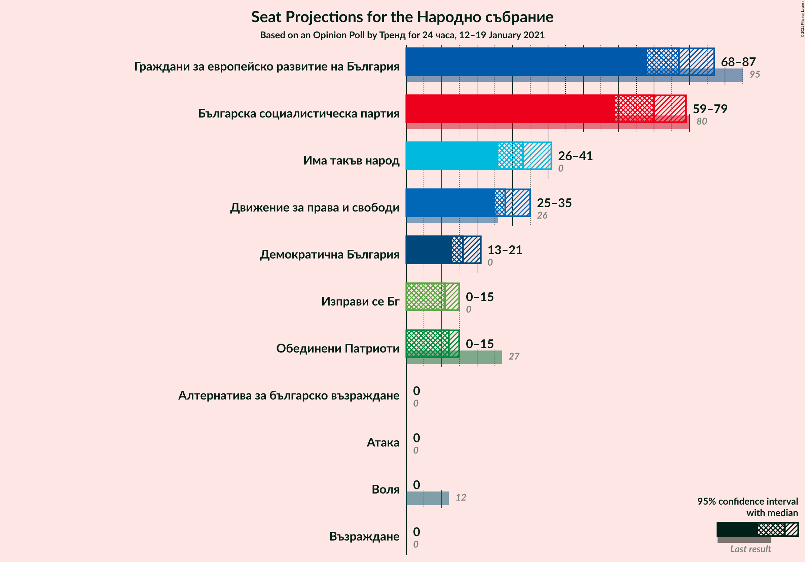

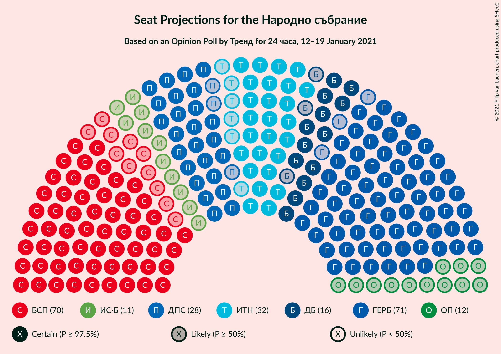

### Confidence Intervals

| Party | Last Result | Median | 80% Confidence Interval | 90% Confidence Interval | 95% Confidence Interval | 99% Confidence Interval |
|:-----:|:-----------:|:------:|:-----------------------:|:-----------------------:|:-----------------------:|:-----------------------:|
| <a href="#граждани-за-европейско-развитие-на-българия">Граждани за европейско развитие на България</a> | 95 | 77 | 71–82 |69–84 |68–87 |65–90 |
| <a href="#българска-социалистическа-партия">Българска социалистическа партия</a> | 80 | 70 | 64–77 |59–79 |59–79 |59–84 |
| <a href="#има-такъв-народ">Има такъв народ</a> | 0 | 33 | 29–37 |28–39 |26–41 |26–42 |
| <a href="#движение-за-права-и-свободи">Движение за права и свободи</a> | 26 | 28 | 26–32 |25–33 |25–35 |22–36 |
| <a href="#демократична-българия">Демократична България</a> | 0 | 16 | 14–20 |14–21 |13–21 |11–22 |
| <a href="#изправи-се-бг">Изправи се Бг</a> | 0 | 11 | 0–14 |0–15 |0–15 |0–16 |
| <a href="#обединени-патриоти">Обединени Патриоти</a> | 27 | 12 | 0–14 |0–15 |0–15 |0–16 |
| <a href="#воля">Воля</a> | 12 | 0 | 0 |0 |0 |0 |
| <a href="#възраждане">Възраждане</a> | 0 | 0 | 0 |0 |0 |0 |
| <a href="#атака">Атака</a> | 0 | 0 | 0 |0 |0 |0 |
| <a href="#алтернатива-за-българско-възраждане">Алтернатива за българско възраждане</a> | 0 | 0 | 0 |0 |0 |0 |

### Граждани за европейско развитие на България

*For a full overview of the results for this party, see the [Граждани за европейско развитие на България](party-гражданизаевропейскоразвитиенабългария.html) page.*

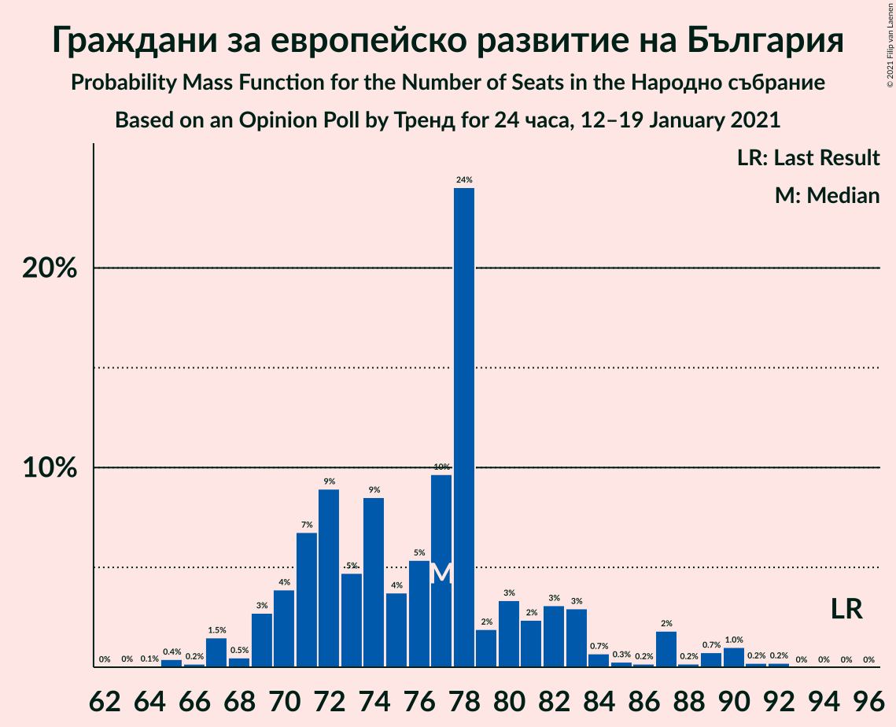

| Number of Seats | Probability | Accumulated | Special Marks |
|:---------------:|:-----------:|:-----------:|:-------------:|
| 63 | 0% | 100% |  |
| 64 | 0.1% | 99.9% |  |
| 65 | 0.4% | 99.9% |  |
| 66 | 0.2% | 99.5% |  |
| 67 | 1.5% | 99.3% |  |
| 68 | 0.5% | 98% |  |
| 69 | 3% | 97% |  |
| 70 | 4% | 95% |  |
| 71 | 7% | 91% |  |
| 72 | 9% | 84% |  |
| 73 | 5% | 75% |  |
| 74 | 9% | 70% |  |
| 75 | 4% | 62% |  |
| 76 | 5% | 58% |  |
| 77 | 10% | 53% | Median |
| 78 | 24% | 43% |  |
| 79 | 2% | 19% |  |
| 80 | 3% | 17% |  |
| 81 | 2% | 14% |  |
| 82 | 3% | 11% |  |
| 83 | 3% | 8% |  |
| 84 | 0.7% | 5% |  |
| 85 | 0.3% | 5% |  |
| 86 | 0.2% | 4% |  |
| 87 | 2% | 4% |  |
| 88 | 0.2% | 2% |  |
| 89 | 0.7% | 2% |  |
| 90 | 1.0% | 1.4% |  |
| 91 | 0.2% | 0.4% |  |
| 92 | 0.2% | 0.2% |  |
| 93 | 0% | 0% |  |
| 94 | 0% | 0% |  |
| 95 | 0% | 0% | Last Result |

### Българска социалистическа партия

*For a full overview of the results for this party, see the [Българска социалистическа партия](party-българскасоциалистическапартия.html) page.*

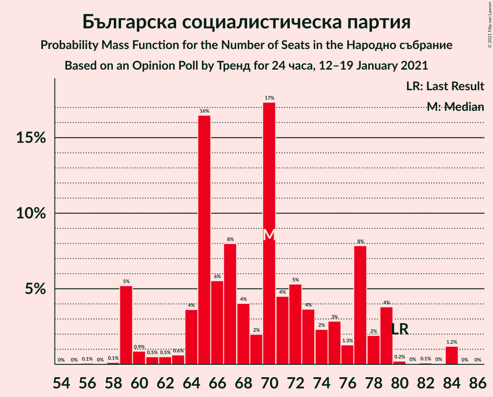

| Number of Seats | Probability | Accumulated | Special Marks |
|:---------------:|:-----------:|:-----------:|:-------------:|
| 56 | 0.1% | 100% |  |
| 57 | 0% | 99.9% |  |
| 58 | 0.1% | 99.9% |  |
| 59 | 5% | 99.8% |  |
| 60 | 0.9% | 95% |  |
| 61 | 0.5% | 94% |  |
| 62 | 0.5% | 93% |  |
| 63 | 0.6% | 93% |  |
| 64 | 4% | 92% |  |
| 65 | 16% | 88% |  |
| 66 | 6% | 72% |  |
| 67 | 8% | 66% |  |
| 68 | 4% | 58% |  |
| 69 | 2% | 54% |  |
| 70 | 17% | 52% | Median |
| 71 | 4% | 35% |  |
| 72 | 5% | 31% |  |
| 73 | 4% | 25% |  |
| 74 | 2% | 22% |  |
| 75 | 3% | 19% |  |
| 76 | 1.3% | 16% |  |
| 77 | 8% | 15% |  |
| 78 | 2% | 7% |  |
| 79 | 4% | 5% |  |
| 80 | 0.2% | 2% | Last Result |
| 81 | 0% | 1.4% |  |
| 82 | 0.1% | 1.4% |  |
| 83 | 0% | 1.3% |  |
| 84 | 1.2% | 1.2% |  |
| 85 | 0% | 0% |  |

### Има такъв народ

*For a full overview of the results for this party, see the [Има такъв народ](party-иматакъвнарод.html) page.*

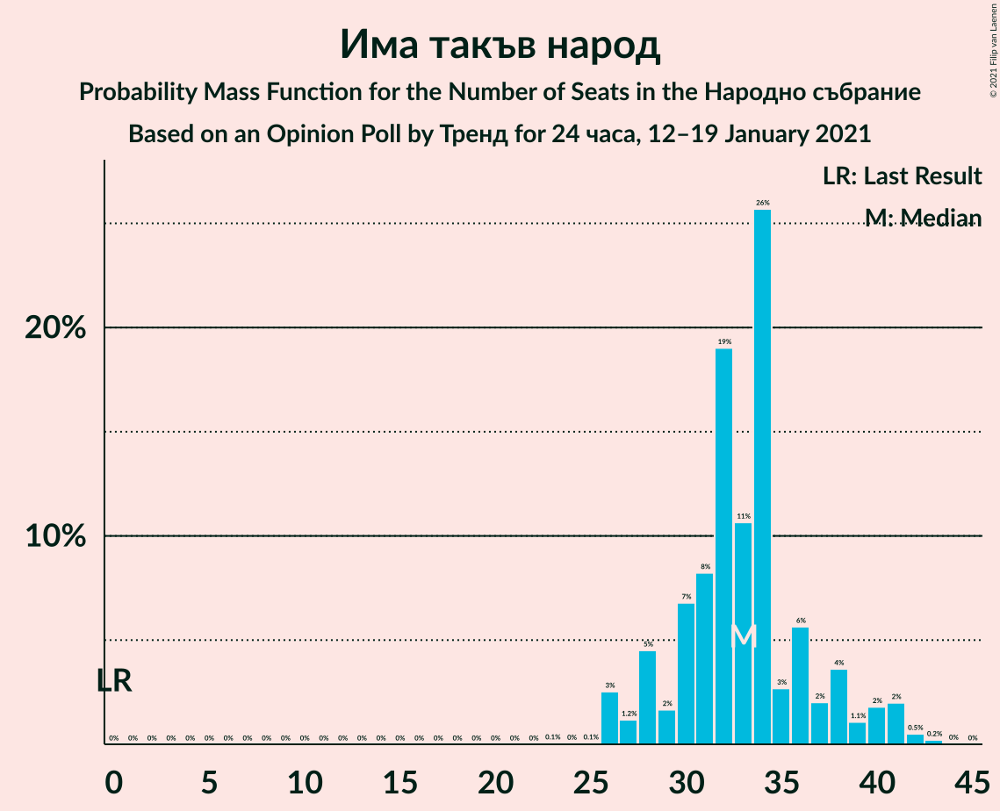

| Number of Seats | Probability | Accumulated | Special Marks |
|:---------------:|:-----------:|:-----------:|:-------------:|
| 0 | 0% | 100% | Last Result |
| 1 | 0% | 100% |  |
| 2 | 0% | 100% |  |
| 3 | 0% | 100% |  |
| 4 | 0% | 100% |  |
| 5 | 0% | 100% |  |
| 6 | 0% | 100% |  |
| 7 | 0% | 100% |  |
| 8 | 0% | 100% |  |
| 9 | 0% | 100% |  |
| 10 | 0% | 100% |  |
| 11 | 0% | 100% |  |
| 12 | 0% | 100% |  |
| 13 | 0% | 100% |  |
| 14 | 0% | 100% |  |
| 15 | 0% | 100% |  |
| 16 | 0% | 100% |  |
| 17 | 0% | 100% |  |
| 18 | 0% | 100% |  |
| 19 | 0% | 100% |  |
| 20 | 0% | 100% |  |
| 21 | 0% | 100% |  |
| 22 | 0% | 100% |  |
| 23 | 0.1% | 100% |  |
| 24 | 0% | 99.9% |  |
| 25 | 0.1% | 99.9% |  |
| 26 | 3% | 99.9% |  |
| 27 | 1.2% | 97% |  |
| 28 | 5% | 96% |  |
| 29 | 2% | 92% |  |
| 30 | 7% | 90% |  |
| 31 | 8% | 83% |  |
| 32 | 19% | 75% |  |
| 33 | 11% | 56% | Median |
| 34 | 26% | 45% |  |
| 35 | 3% | 20% |  |
| 36 | 6% | 17% |  |
| 37 | 2% | 11% |  |
| 38 | 4% | 9% |  |
| 39 | 1.1% | 6% |  |
| 40 | 2% | 5% |  |
| 41 | 2% | 3% |  |
| 42 | 0.5% | 0.8% |  |
| 43 | 0.2% | 0.3% |  |
| 44 | 0% | 0.1% |  |
| 45 | 0% | 0% |  |

### Движение за права и свободи

*For a full overview of the results for this party, see the [Движение за права и свободи](party-движениезаправаисвободи.html) page.*

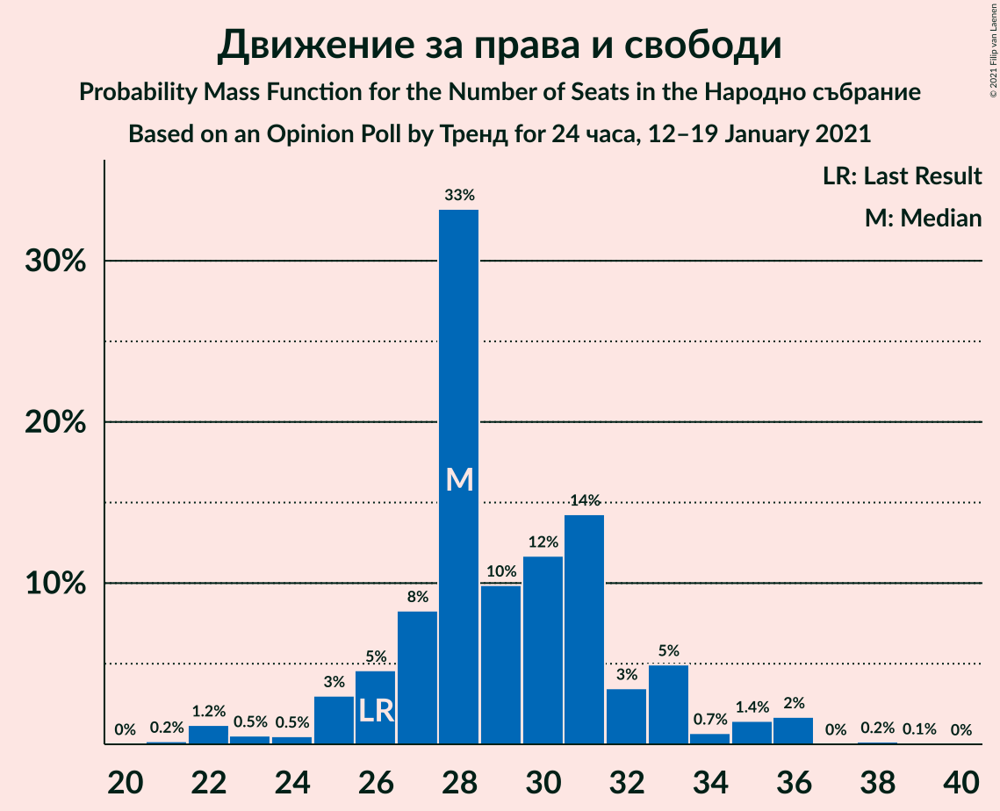

| Number of Seats | Probability | Accumulated | Special Marks |
|:---------------:|:-----------:|:-----------:|:-------------:|
| 20 | 0% | 100% |  |
| 21 | 0.2% | 99.9% |  |
| 22 | 1.2% | 99.8% |  |
| 23 | 0.5% | 98.6% |  |
| 24 | 0.5% | 98% |  |
| 25 | 3% | 98% |  |
| 26 | 5% | 95% | Last Result |
| 27 | 8% | 90% |  |
| 28 | 33% | 82% | Median |
| 29 | 10% | 48% |  |
| 30 | 12% | 39% |  |
| 31 | 14% | 27% |  |
| 32 | 3% | 13% |  |
| 33 | 5% | 9% |  |
| 34 | 0.7% | 4% |  |
| 35 | 1.4% | 3% |  |
| 36 | 2% | 2% |  |
| 37 | 0% | 0.3% |  |
| 38 | 0.2% | 0.3% |  |
| 39 | 0.1% | 0.1% |  |
| 40 | 0% | 0% |  |

### Демократична България

*For a full overview of the results for this party, see the [Демократична България](party-демократичнабългария.html) page.*

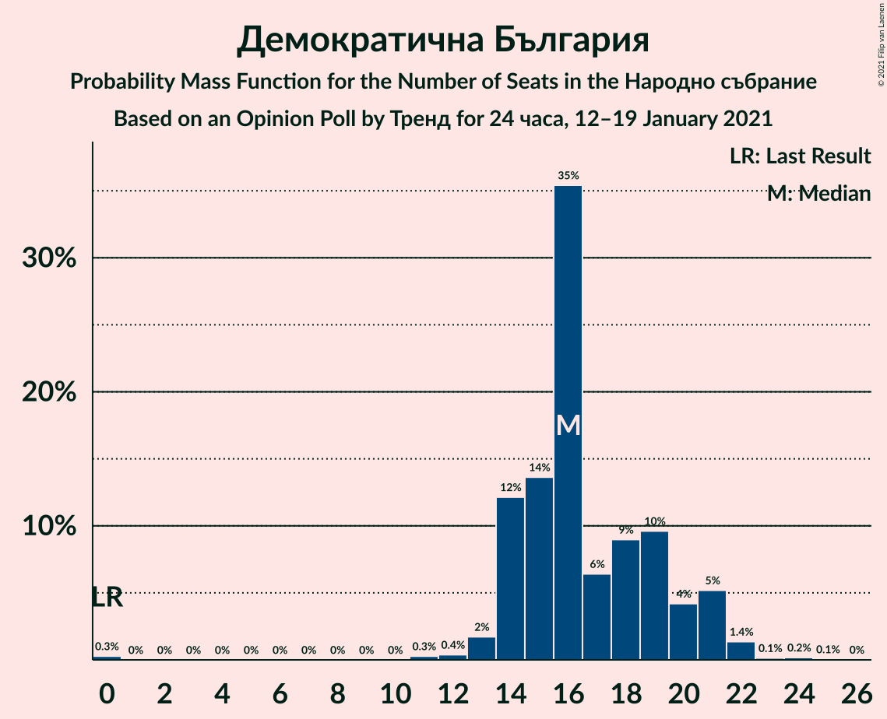

| Number of Seats | Probability | Accumulated | Special Marks |
|:---------------:|:-----------:|:-----------:|:-------------:|
| 0 | 0.3% | 100% | Last Result |
| 1 | 0% | 99.7% |  |
| 2 | 0% | 99.7% |  |
| 3 | 0% | 99.7% |  |
| 4 | 0% | 99.7% |  |
| 5 | 0% | 99.7% |  |
| 6 | 0% | 99.7% |  |
| 7 | 0% | 99.7% |  |
| 8 | 0% | 99.7% |  |
| 9 | 0% | 99.7% |  |
| 10 | 0% | 99.7% |  |
| 11 | 0.3% | 99.7% |  |
| 12 | 0.4% | 99.4% |  |
| 13 | 2% | 99.1% |  |
| 14 | 12% | 97% |  |
| 15 | 14% | 85% |  |
| 16 | 35% | 72% | Median |
| 17 | 6% | 36% |  |
| 18 | 9% | 30% |  |
| 19 | 10% | 21% |  |
| 20 | 4% | 11% |  |
| 21 | 5% | 7% |  |
| 22 | 1.4% | 2% |  |
| 23 | 0.1% | 0.4% |  |
| 24 | 0.2% | 0.3% |  |
| 25 | 0.1% | 0.1% |  |
| 26 | 0% | 0% |  |

### Изправи се Бг

*For a full overview of the results for this party, see the [Изправи се Бг](party-изправисебг.html) page.*

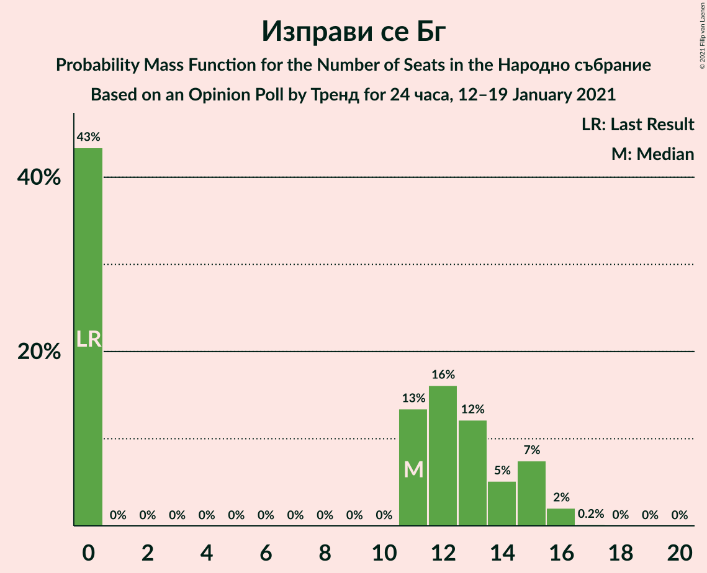

| Number of Seats | Probability | Accumulated | Special Marks |
|:---------------:|:-----------:|:-----------:|:-------------:|
| 0 | 43% | 100% | Last Result |
| 1 | 0% | 57% |  |
| 2 | 0% | 57% |  |
| 3 | 0% | 57% |  |
| 4 | 0% | 57% |  |
| 5 | 0% | 57% |  |
| 6 | 0% | 57% |  |
| 7 | 0% | 57% |  |
| 8 | 0% | 57% |  |
| 9 | 0% | 57% |  |
| 10 | 0% | 57% |  |
| 11 | 13% | 57% | Median |
| 12 | 16% | 43% |  |
| 13 | 12% | 27% |  |
| 14 | 5% | 15% |  |
| 15 | 7% | 10% |  |
| 16 | 2% | 2% |  |
| 17 | 0.2% | 0.2% |  |
| 18 | 0% | 0.1% |  |
| 19 | 0% | 0% |  |

### Обединени Патриоти

*For a full overview of the results for this party, see the [Обединени Патриоти](party-обединенипатриоти.html) page.*

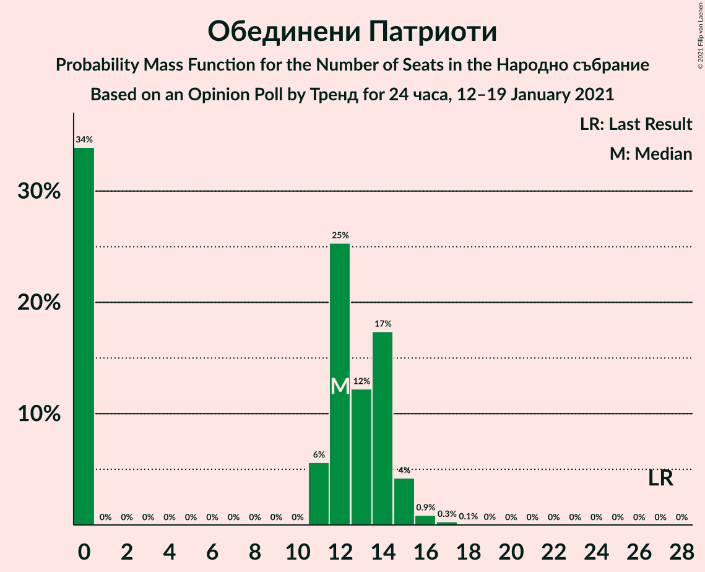

| Number of Seats | Probability | Accumulated | Special Marks |
|:---------------:|:-----------:|:-----------:|:-------------:|
| 0 | 34% | 100% |  |
| 1 | 0% | 66% |  |
| 2 | 0% | 66% |  |
| 3 | 0% | 66% |  |
| 4 | 0% | 66% |  |
| 5 | 0% | 66% |  |
| 6 | 0% | 66% |  |
| 7 | 0% | 66% |  |
| 8 | 0% | 66% |  |
| 9 | 0% | 66% |  |
| 10 | 0% | 66% |  |
| 11 | 6% | 66% |  |
| 12 | 25% | 60% | Median |
| 13 | 12% | 35% |  |
| 14 | 17% | 23% |  |
| 15 | 4% | 6% |  |
| 16 | 0.9% | 1.3% |  |
| 17 | 0.3% | 0.4% |  |
| 18 | 0.1% | 0.1% |  |
| 19 | 0% | 0% |  |
| 20 | 0% | 0% |  |
| 21 | 0% | 0% |  |
| 22 | 0% | 0% |  |
| 23 | 0% | 0% |  |
| 24 | 0% | 0% |  |
| 25 | 0% | 0% |  |
| 26 | 0% | 0% |  |
| 27 | 0% | 0% | Last Result |

### Воля

*For a full overview of the results for this party, see the [Воля](party-воля.html) page.*

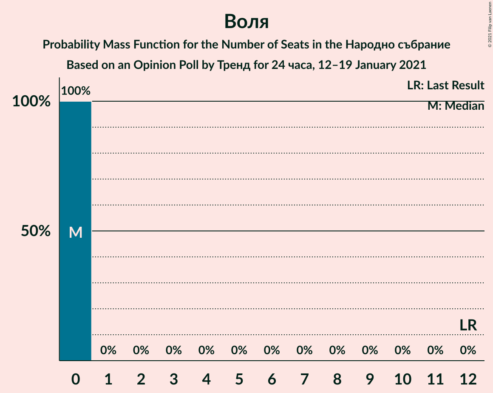

| Number of Seats | Probability | Accumulated | Special Marks |
|:---------------:|:-----------:|:-----------:|:-------------:|
| 0 | 100% | 100% | Median |
| 1 | 0% | 0% |  |
| 2 | 0% | 0% |  |
| 3 | 0% | 0% |  |
| 4 | 0% | 0% |  |
| 5 | 0% | 0% |  |
| 6 | 0% | 0% |  |
| 7 | 0% | 0% |  |
| 8 | 0% | 0% |  |
| 9 | 0% | 0% |  |
| 10 | 0% | 0% |  |
| 11 | 0% | 0% |  |
| 12 | 0% | 0% | Last Result |

### Възраждане

*For a full overview of the results for this party, see the [Възраждане](party-възраждане.html) page.*

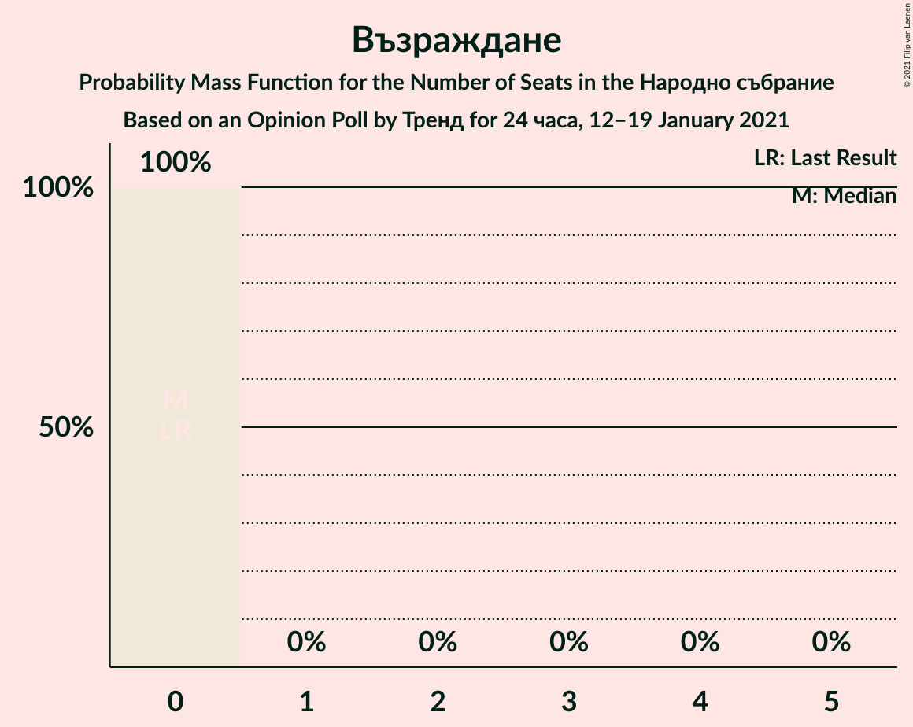

| Number of Seats | Probability | Accumulated | Special Marks |
|:---------------:|:-----------:|:-----------:|:-------------:|
| 0 | 100% | 100% | Last Result, Median |

### Атака

*For a full overview of the results for this party, see the [Атака](party-атака.html) page.*

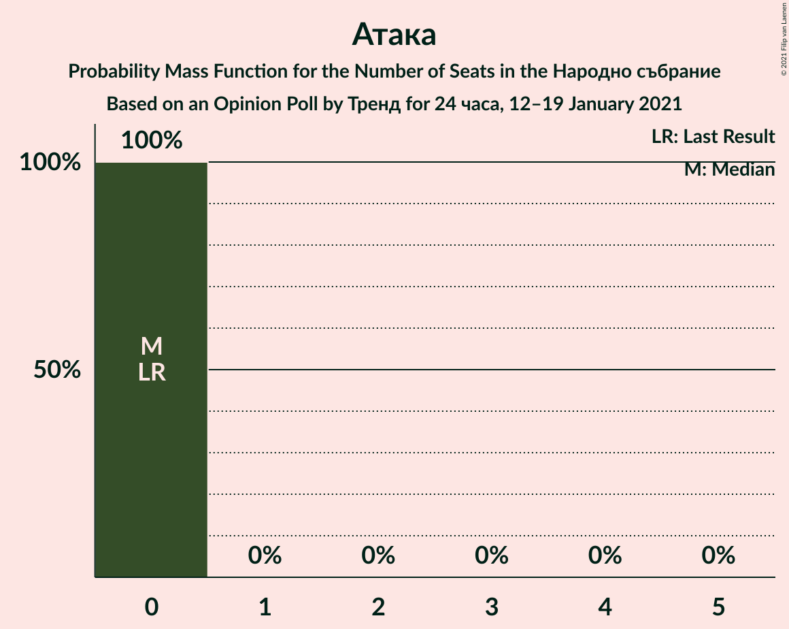

| Number of Seats | Probability | Accumulated | Special Marks |
|:---------------:|:-----------:|:-----------:|:-------------:|
| 0 | 100% | 100% | Last Result, Median |

### Алтернатива за българско възраждане

*For a full overview of the results for this party, see the [Алтернатива за българско възраждане](party-алтернативазабългарсковъзраждане.html) page.*

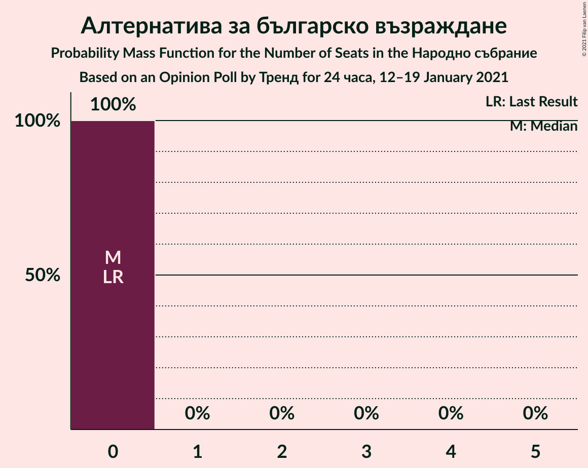

| Number of Seats | Probability | Accumulated | Special Marks |
|:---------------:|:-----------:|:-----------:|:-------------:|
| 0 | 100% | 100% | Last Result, Median |

## Coalitions

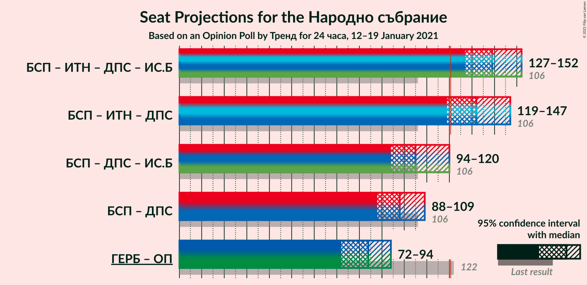

### Confidence Intervals

| Coalition | Last Result | Median | Majority? | 80% Confidence Interval | 90% Confidence Interval | 95% Confidence Interval | 99% Confidence Interval |
|:---------:|:-----------:|:------:|:---------:|:-----------------------:|:-----------------------:|:-----------------------:|:-----------------------:|
| Българска социалистическа партия – Има такъв народ – Движение за права и свободи – Изправи се Бг | 106 | 139 | 100% | 132–148 | 130–151 | 127–152 | 123–153 |
| Българска социалистическа партия – Има такъв народ – Движение за права и свободи | 106 | 132 | 97% | 123–139 | 122–143 | 119–147 | 117–151 |
| Българска социалистическа партия – Движение за права и свободи – Изправи се Бг | 106 | 105 | 2% | 98–115 | 96–117 | 94–120 | 94–121 |
| Българска социалистическа партия – Движение за права и свободи | 106 | 98 | 0% | 93–106 | 88–108 | 88–109 | 87–115 |
| Граждани за европейско развитие на България – Обединени Патриоти | 122 | 84 | 0% | 74–92 | 74–92 | 72–94 | 70–98 |

### Българска социалистическа партия – Има такъв народ – Движение за права и свободи – Изправи се Бг

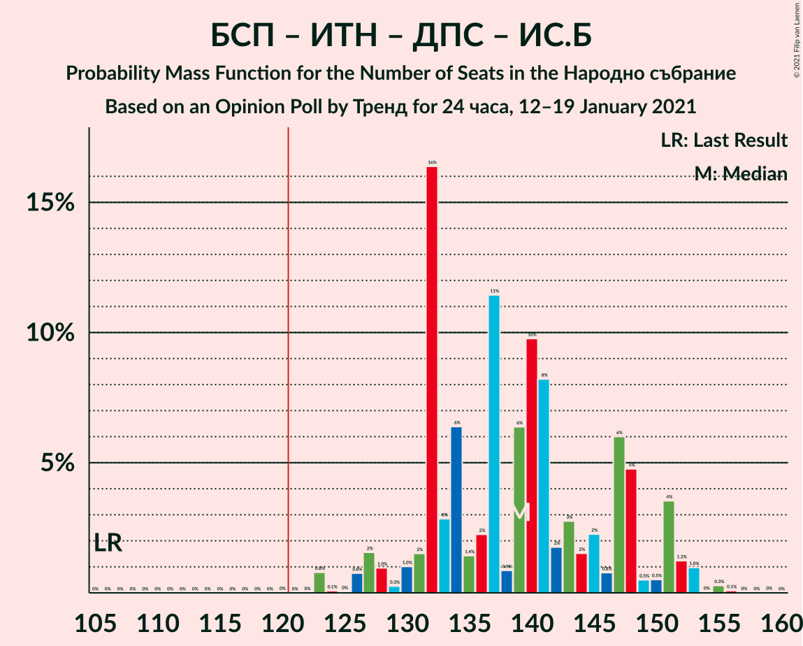

| Number of Seats | Probability | Accumulated | Special Marks |
|:---------------:|:-----------:|:-----------:|:-------------:|
| 106 | 0% | 100% | Last Result |
| 107 | 0% | 100% |  |
| 108 | 0% | 100% |  |
| 109 | 0% | 100% |  |
| 110 | 0% | 100% |  |
| 111 | 0% | 100% |  |
| 112 | 0% | 100% |  |
| 113 | 0% | 100% |  |
| 114 | 0% | 100% |  |
| 115 | 0% | 100% |  |
| 116 | 0% | 100% |  |
| 117 | 0% | 100% |  |
| 118 | 0% | 100% |  |
| 119 | 0% | 100% |  |
| 120 | 0% | 100% |  |
| 121 | 0% | 100% | Majority |
| 122 | 0% | 100% |  |
| 123 | 0.8% | 100% |  |
| 124 | 0.1% | 99.2% |  |
| 125 | 0% | 99.1% |  |
| 126 | 0.8% | 99.1% |  |
| 127 | 2% | 98% |  |
| 128 | 1.0% | 97% |  |
| 129 | 0.3% | 96% |  |
| 130 | 1.0% | 96% |  |
| 131 | 2% | 95% |  |
| 132 | 16% | 93% |  |
| 133 | 3% | 77% |  |
| 134 | 6% | 74% |  |
| 135 | 1.4% | 67% |  |
| 136 | 2% | 66% |  |
| 137 | 11% | 64% |  |
| 138 | 0.9% | 52% |  |
| 139 | 6% | 51% |  |
| 140 | 10% | 45% |  |
| 141 | 8% | 35% |  |
| 142 | 2% | 27% | Median |
| 143 | 3% | 25% |  |
| 144 | 2% | 23% |  |
| 145 | 2% | 21% |  |
| 146 | 0.8% | 19% |  |
| 147 | 6% | 18% |  |
| 148 | 5% | 12% |  |
| 149 | 0.5% | 7% |  |
| 150 | 0.5% | 7% |  |
| 151 | 4% | 6% |  |
| 152 | 1.2% | 3% |  |
| 153 | 1.0% | 1.4% |  |
| 154 | 0% | 0.5% |  |
| 155 | 0.3% | 0.4% |  |
| 156 | 0.1% | 0.1% |  |
| 157 | 0% | 0.1% |  |
| 158 | 0% | 0% |  |

### Българска социалистическа партия – Има такъв народ – Движение за права и свободи

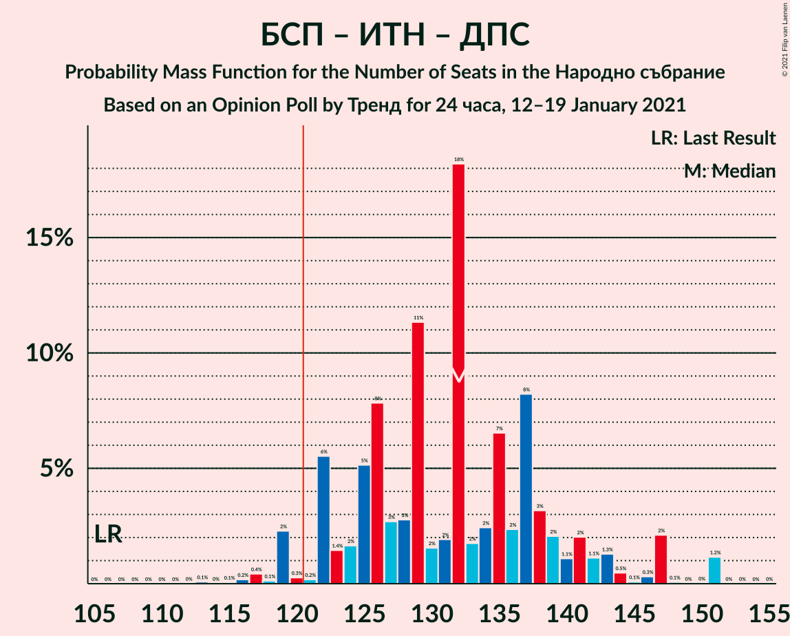

| Number of Seats | Probability | Accumulated | Special Marks |
|:---------------:|:-----------:|:-----------:|:-------------:|
| 106 | 0% | 100% | Last Result |
| 107 | 0% | 100% |  |
| 108 | 0% | 100% |  |
| 109 | 0% | 100% |  |
| 110 | 0% | 100% |  |
| 111 | 0% | 100% |  |
| 112 | 0% | 100% |  |
| 113 | 0.1% | 100% |  |
| 114 | 0% | 99.9% |  |
| 115 | 0.1% | 99.9% |  |
| 116 | 0.2% | 99.8% |  |
| 117 | 0.4% | 99.7% |  |
| 118 | 0.1% | 99.2% |  |
| 119 | 2% | 99.1% |  |
| 120 | 0.3% | 97% |  |
| 121 | 0.2% | 97% | Majority |
| 122 | 6% | 96% |  |
| 123 | 1.4% | 91% |  |
| 124 | 2% | 89% |  |
| 125 | 5% | 88% |  |
| 126 | 8% | 83% |  |
| 127 | 3% | 75% |  |
| 128 | 3% | 72% |  |
| 129 | 11% | 69% |  |
| 130 | 2% | 58% |  |
| 131 | 2% | 56% | Median |
| 132 | 18% | 54% |  |
| 133 | 2% | 36% |  |
| 134 | 2% | 35% |  |
| 135 | 7% | 32% |  |
| 136 | 2% | 26% |  |
| 137 | 8% | 23% |  |
| 138 | 3% | 15% |  |
| 139 | 2% | 12% |  |
| 140 | 1.1% | 10% |  |
| 141 | 2% | 9% |  |
| 142 | 1.1% | 7% |  |
| 143 | 1.3% | 6% |  |
| 144 | 0.5% | 4% |  |
| 145 | 0.1% | 4% |  |
| 146 | 0.3% | 4% |  |
| 147 | 2% | 3% |  |
| 148 | 0.1% | 1.3% |  |
| 149 | 0% | 1.2% |  |
| 150 | 0% | 1.2% |  |
| 151 | 1.2% | 1.2% |  |
| 152 | 0% | 0% |  |

### Българска социалистическа партия – Движение за права и свободи – Изправи се Бг

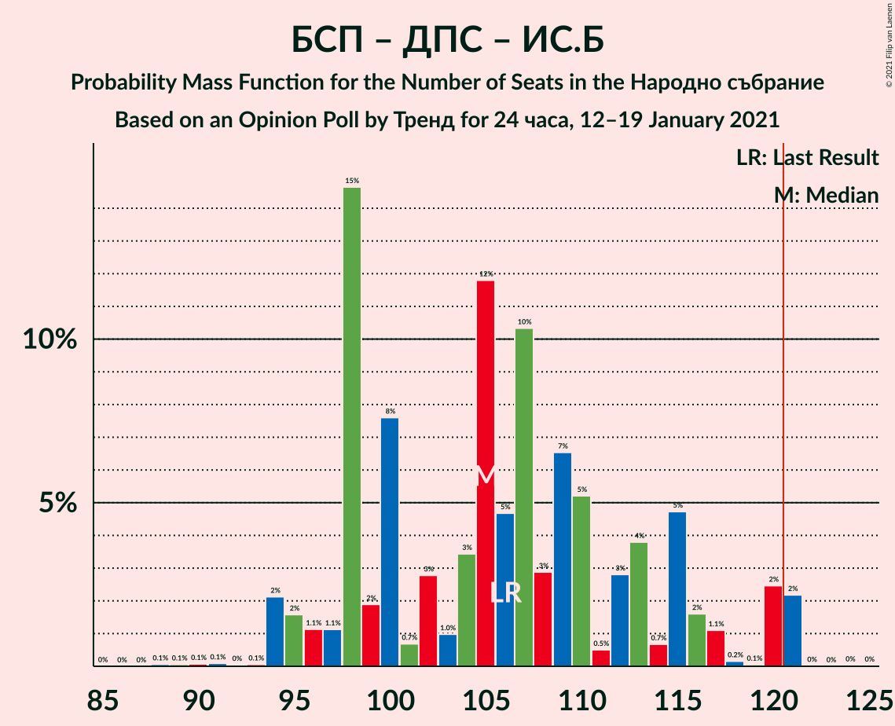

| Number of Seats | Probability | Accumulated | Special Marks |
|:---------------:|:-----------:|:-----------:|:-------------:|
| 88 | 0.1% | 100% |  |
| 89 | 0.1% | 99.9% |  |
| 90 | 0.1% | 99.9% |  |
| 91 | 0.1% | 99.8% |  |
| 92 | 0% | 99.7% |  |
| 93 | 0.1% | 99.7% |  |
| 94 | 2% | 99.6% |  |
| 95 | 2% | 97% |  |
| 96 | 1.1% | 96% |  |
| 97 | 1.1% | 95% |  |
| 98 | 15% | 94% |  |
| 99 | 2% | 79% |  |
| 100 | 8% | 77% |  |
| 101 | 0.7% | 69% |  |
| 102 | 3% | 69% |  |
| 103 | 1.0% | 66% |  |
| 104 | 3% | 65% |  |
| 105 | 12% | 62% |  |
| 106 | 5% | 50% | Last Result |
| 107 | 10% | 45% |  |
| 108 | 3% | 35% |  |
| 109 | 7% | 32% | Median |
| 110 | 5% | 25% |  |
| 111 | 0.5% | 20% |  |
| 112 | 3% | 20% |  |
| 113 | 4% | 17% |  |
| 114 | 0.7% | 13% |  |
| 115 | 5% | 12% |  |
| 116 | 2% | 8% |  |
| 117 | 1.1% | 6% |  |
| 118 | 0.2% | 5% |  |
| 119 | 0.1% | 5% |  |
| 120 | 2% | 5% |  |
| 121 | 2% | 2% | Majority |
| 122 | 0% | 0.1% |  |
| 123 | 0% | 0.1% |  |
| 124 | 0% | 0.1% |  |
| 125 | 0% | 0% |  |

### Българска социалистическа партия – Движение за права и свободи

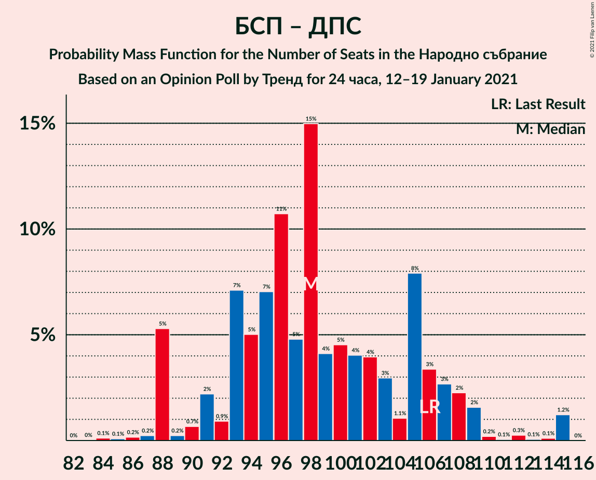

| Number of Seats | Probability | Accumulated | Special Marks |
|:---------------:|:-----------:|:-----------:|:-------------:|
| 84 | 0.1% | 100% |  |
| 85 | 0.1% | 99.8% |  |
| 86 | 0.2% | 99.8% |  |
| 87 | 0.2% | 99.6% |  |
| 88 | 5% | 99.4% |  |
| 89 | 0.2% | 94% |  |
| 90 | 0.7% | 94% |  |
| 91 | 2% | 93% |  |
| 92 | 0.9% | 91% |  |
| 93 | 7% | 90% |  |
| 94 | 5% | 83% |  |
| 95 | 7% | 78% |  |
| 96 | 11% | 71% |  |
| 97 | 5% | 60% |  |
| 98 | 15% | 55% | Median |
| 99 | 4% | 40% |  |
| 100 | 5% | 36% |  |
| 101 | 4% | 32% |  |
| 102 | 4% | 28% |  |
| 103 | 3% | 24% |  |
| 104 | 1.1% | 21% |  |
| 105 | 8% | 20% |  |
| 106 | 3% | 12% | Last Result |
| 107 | 3% | 8% |  |
| 108 | 2% | 6% |  |
| 109 | 2% | 3% |  |
| 110 | 0.2% | 2% |  |
| 111 | 0.1% | 2% |  |
| 112 | 0.3% | 2% |  |
| 113 | 0.1% | 1.4% |  |
| 114 | 0.1% | 1.4% |  |
| 115 | 1.2% | 1.3% |  |
| 116 | 0% | 0% |  |

### Граждани за европейско развитие на България – Обединени Патриоти

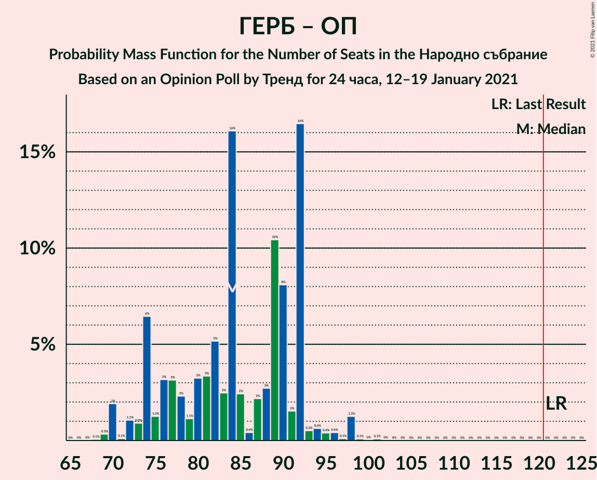

| Number of Seats | Probability | Accumulated | Special Marks |
|:---------------:|:-----------:|:-----------:|:-------------:|
| 68 | 0.1% | 100% |  |
| 69 | 0.3% | 99.9% |  |
| 70 | 2% | 99.6% |  |
| 71 | 0.1% | 98% |  |
| 72 | 1.1% | 98% |  |
| 73 | 0.9% | 96% |  |
| 74 | 6% | 96% |  |
| 75 | 1.3% | 89% |  |
| 76 | 3% | 88% |  |
| 77 | 3% | 85% |  |
| 78 | 2% | 82% |  |
| 79 | 1.1% | 79% |  |
| 80 | 3% | 78% |  |
| 81 | 3% | 75% |  |
| 82 | 5% | 72% |  |
| 83 | 2% | 66% |  |
| 84 | 16% | 64% |  |
| 85 | 2% | 48% |  |
| 86 | 0.4% | 45% |  |
| 87 | 2% | 45% |  |
| 88 | 3% | 43% |  |
| 89 | 10% | 40% | Median |
| 90 | 8% | 30% |  |
| 91 | 2% | 22% |  |
| 92 | 16% | 20% |  |
| 93 | 0.5% | 4% |  |
| 94 | 0.6% | 3% |  |
| 95 | 0.4% | 2% |  |
| 96 | 0.4% | 2% |  |
| 97 | 0.1% | 2% |  |
| 98 | 1.3% | 1.5% |  |
| 99 | 0.1% | 0.2% |  |
| 100 | 0% | 0.1% |  |
| 101 | 0.1% | 0.1% |  |
| 102 | 0% | 0% |  |
| 103 | 0% | 0% |  |
| 104 | 0% | 0% |  |
| 105 | 0% | 0% |  |
| 106 | 0% | 0% |  |
| 107 | 0% | 0% |  |
| 108 | 0% | 0% |  |
| 109 | 0% | 0% |  |
| 110 | 0% | 0% |  |
| 111 | 0% | 0% |  |
| 112 | 0% | 0% |  |
| 113 | 0% | 0% |  |
| 114 | 0% | 0% |  |
| 115 | 0% | 0% |  |
| 116 | 0% | 0% |  |
| 117 | 0% | 0% |  |
| 118 | 0% | 0% |  |
| 119 | 0% | 0% |  |
| 120 | 0% | 0% |  |
| 121 | 0% | 0% | Majority |
| 122 | 0% | 0% | Last Result |

## Technical Information

### Opinion Poll

+ **Polling firm:** Тренд
+ **Commissioner(s):** 24 часа
+ **Fieldwork period:** 12–19 January 2021

### Calculations

+ **Sample size:** 1008
+ **Simulations done:** 1,048,576
+ **Error estimate:** 1.43%

