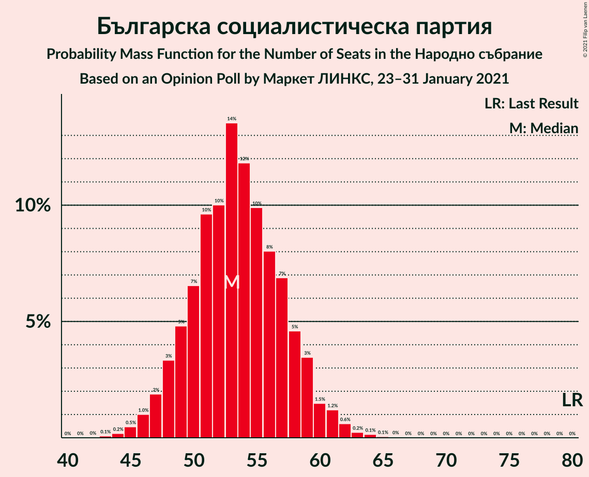
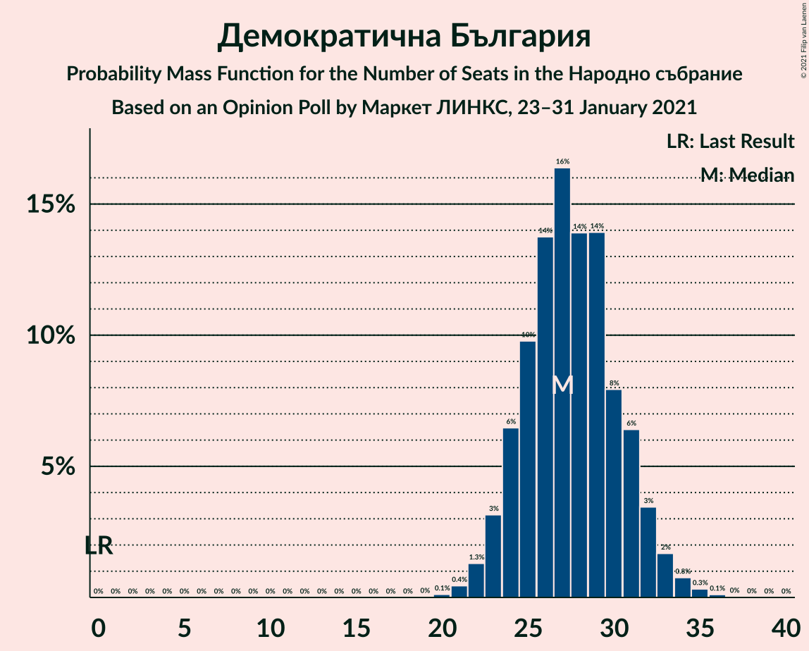
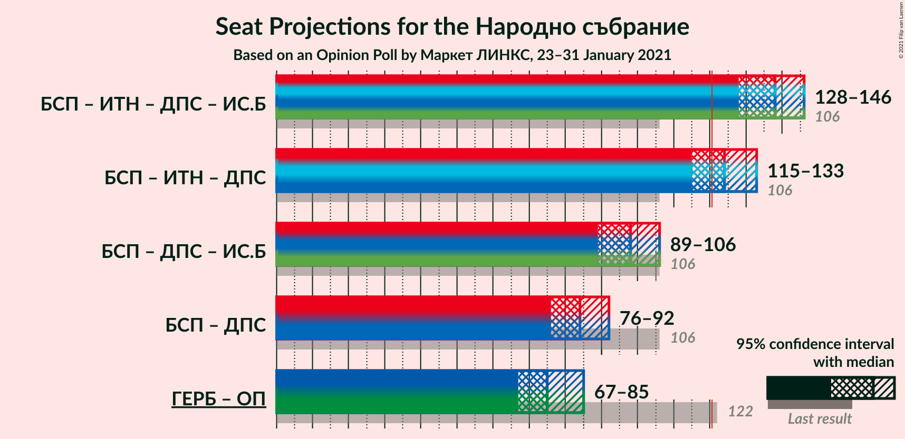

# Opinion Poll by Маркет ЛИНКС, 23–31 January 2021

<a href="#voting-intentions">Voting Intentions</a> | <a href="#seats">Seats</a> | <a href="#coalitions">Coalitions</a> | <a href="#technical-information">Technical Information</a>

## Voting Intentions

### Confidence Intervals

| Party | Last Result | Poll Result | 80% Confidence Interval | 90% Confidence Interval | 95% Confidence Interval | 99% Confidence Interval |
|:-----:|:-----------:|:-----------:|:-----------------------:|:-----------------------:|:-----------------------:|:-----------------------:|
| Граждани за европейско развитие на България | 33.5% | 28.6% | 26.1–31.3% |25.4–32.1% |24.8–32.7% |23.7–34.0% |
| Българска социалистическа партия | 27.9% | 20.8% | 18.6–23.3% |18.0–24.0% |17.5–24.6% |16.5–25.8% |
| Има такъв народ | 0.0% | 15.4% | 13.5–17.6% |13.0–18.3% |12.5–18.8% |11.6–20.0% |
| Движение за права и свободи | 9.2% | 11.8% | 10.1–13.8% |9.6–14.4% |9.3–14.9% |8.5–16.0% |
| Демократична България | 0.0% | 10.6% | 9.0–12.6% |8.6–13.1% |8.2–13.6% |7.5–14.6% |
| Изправи се Бг | 0.0% | 5.2% | 4.1–6.7% |3.8–7.1% |3.6–7.5% |3.1–8.3% |
| Обединени Патриоти | 9.3% | 3.4% | 2.6–4.7% |2.3–5.1% |2.1–5.4% |1.8–6.1% |

*Note:* The poll result column reflects the actual value used in the calculations. Published results may vary slightly, and in addition be rounded to fewer digits.

## Seats

### Confidence Intervals

| Party | Last Result | Median | 80% Confidence Interval | 90% Confidence Interval | 95% Confidence Interval | 99% Confidence Interval |
|:-----:|:-----------:|:------:|:-----------------------:|:-----------------------:|:-----------------------:|:-----------------------:|
| <a href="#граждани-за-европейско-развитие-на-българия">Граждани за европейско развитие на България</a> | 95 | 73 | 67–80 |64–82 |63–84 |59–88 |
| <a href="#българска-социалистическа-партия">Българска социалистическа партия</a> | 80 | 53 | 48–60 |46–62 |45–63 |42–67 |
| <a href="#има-такъв-народ">Има такъв народ</a> | 0 | 40 | 34–46 |32–47 |31–49 |29–52 |
| <a href="#движение-за-права-и-свободи">Движение за права и свободи</a> | 26 | 30 | 26–36 |24–37 |23–38 |22–41 |
| <a href="#демократична-българия">Демократична България</a> | 0 | 27 | 23–32 |21–33 |21–35 |19–38 |
| <a href="#изправи-се-бг">Изправи се Бг</a> | 0 | 14 | 0–17 |0–18 |0–19 |0–22 |
| <a href="#обединени-патриоти">Обединени Патриоти</a> | 27 | 0 | 0–12 |0–13 |0–14 |0–15 |

### Граждани за европейско развитие на България

*For a full overview of the results for this party, see the [Граждани за европейско развитие на България](party-гражданизаевропейскоразвитиенабългария.html) page.*

| Number of Seats | Probability | Accumulated | Special Marks |
|:---------------:|:-----------:|:-----------:|:-------------:|
| 56 | 0% | 100% |  |
| 57 | 0.1% | 99.9% |  |
| 58 | 0.1% | 99.9% |  |
| 59 | 0.3% | 99.8% |  |
| 60 | 0.3% | 99.5% |  |
| 61 | 0.8% | 99.2% |  |
| 62 | 0.7% | 98% |  |
| 63 | 1.1% | 98% |  |
| 64 | 2% | 96% |  |
| 65 | 3% | 95% |  |
| 66 | 1.1% | 92% |  |
| 67 | 2% | 90% |  |
| 68 | 7% | 89% |  |
| 69 | 6% | 82% |  |
| 70 | 10% | 76% |  |
| 71 | 6% | 66% |  |
| 72 | 9% | 60% |  |
| 73 | 11% | 51% | Median |
| 74 | 5% | 40% |  |
| 75 | 7% | 35% |  |
| 76 | 6% | 28% |  |
| 77 | 2% | 21% |  |
| 78 | 4% | 20% |  |
| 79 | 3% | 16% |  |
| 80 | 4% | 13% |  |
| 81 | 2% | 9% |  |
| 82 | 3% | 8% |  |
| 83 | 1.0% | 4% |  |
| 84 | 1.3% | 3% |  |
| 85 | 0.7% | 2% |  |
| 86 | 0.5% | 2% |  |
| 87 | 0.4% | 1.0% |  |
| 88 | 0.4% | 0.7% |  |
| 89 | 0.1% | 0.3% |  |
| 90 | 0.1% | 0.2% |  |
| 91 | 0.1% | 0.1% |  |
| 92 | 0% | 0% |  |
| 93 | 0% | 0% |  |
| 94 | 0% | 0% |  |
| 95 | 0% | 0% | Last Result |

### Българска социалистическа партия

*For a full overview of the results for this party, see the [Българска социалистическа партия](party-българскасоциалистическапартия.html) page.*

| Number of Seats | Probability | Accumulated | Special Marks |
|:---------------:|:-----------:|:-----------:|:-------------:|
| 39 | 0.1% | 100% |  |
| 40 | 0.2% | 99.9% |  |
| 41 | 0.2% | 99.7% |  |
| 42 | 0.3% | 99.5% |  |
| 43 | 0.6% | 99.2% |  |
| 44 | 1.1% | 98.6% |  |
| 45 | 2% | 98% |  |
| 46 | 3% | 96% |  |
| 47 | 3% | 93% |  |
| 48 | 8% | 90% |  |
| 49 | 8% | 82% |  |
| 50 | 5% | 74% |  |
| 51 | 3% | 69% |  |
| 52 | 6% | 65% |  |
| 53 | 14% | 59% | Median |
| 54 | 6% | 45% |  |
| 55 | 7% | 39% |  |
| 56 | 9% | 33% |  |
| 57 | 6% | 23% |  |
| 58 | 3% | 17% |  |
| 59 | 3% | 14% |  |
| 60 | 1.4% | 11% |  |
| 61 | 4% | 9% |  |
| 62 | 3% | 6% |  |
| 63 | 0.9% | 3% |  |
| 64 | 0.5% | 2% |  |
| 65 | 0.5% | 2% |  |
| 66 | 0.8% | 1.3% |  |
| 67 | 0.3% | 0.5% |  |
| 68 | 0% | 0.3% |  |
| 69 | 0.1% | 0.2% |  |
| 70 | 0.1% | 0.1% |  |
| 71 | 0% | 0% |  |
| 72 | 0% | 0% |  |
| 73 | 0% | 0% |  |
| 74 | 0% | 0% |  |
| 75 | 0% | 0% |  |
| 76 | 0% | 0% |  |
| 77 | 0% | 0% |  |
| 78 | 0% | 0% |  |
| 79 | 0% | 0% |  |
| 80 | 0% | 0% | Last Result |

### Има такъв народ

*For a full overview of the results for this party, see the [Има такъв народ](party-иматакъвнарод.html) page.*

| Number of Seats | Probability | Accumulated | Special Marks |
|:---------------:|:-----------:|:-----------:|:-------------:|
| 0 | 0% | 100% | Last Result |
| 1 | 0% | 100% |  |
| 2 | 0% | 100% |  |
| 3 | 0% | 100% |  |
| 4 | 0% | 100% |  |
| 5 | 0% | 100% |  |
| 6 | 0% | 100% |  |
| 7 | 0% | 100% |  |
| 8 | 0% | 100% |  |
| 9 | 0% | 100% |  |
| 10 | 0% | 100% |  |
| 11 | 0% | 100% |  |
| 12 | 0% | 100% |  |
| 13 | 0% | 100% |  |
| 14 | 0% | 100% |  |
| 15 | 0% | 100% |  |
| 16 | 0% | 100% |  |
| 17 | 0% | 100% |  |
| 18 | 0% | 100% |  |
| 19 | 0% | 100% |  |
| 20 | 0% | 100% |  |
| 21 | 0% | 100% |  |
| 22 | 0% | 100% |  |
| 23 | 0% | 100% |  |
| 24 | 0% | 100% |  |
| 25 | 0% | 100% |  |
| 26 | 0% | 100% |  |
| 27 | 0% | 100% |  |
| 28 | 0.1% | 99.9% |  |
| 29 | 0.4% | 99.8% |  |
| 30 | 0.7% | 99.4% |  |
| 31 | 2% | 98.7% |  |
| 32 | 2% | 97% |  |
| 33 | 4% | 95% |  |
| 34 | 3% | 91% |  |
| 35 | 7% | 88% |  |
| 36 | 4% | 81% |  |
| 37 | 12% | 77% |  |
| 38 | 5% | 65% |  |
| 39 | 5% | 60% |  |
| 40 | 9% | 54% | Median |
| 41 | 8% | 46% |  |
| 42 | 10% | 37% |  |
| 43 | 8% | 27% |  |
| 44 | 6% | 19% |  |
| 45 | 2% | 13% |  |
| 46 | 5% | 11% |  |
| 47 | 2% | 5% |  |
| 48 | 1.0% | 4% |  |
| 49 | 0.6% | 3% |  |
| 50 | 1.1% | 2% |  |
| 51 | 0.2% | 0.8% |  |
| 52 | 0.3% | 0.6% |  |
| 53 | 0.1% | 0.3% |  |
| 54 | 0.1% | 0.2% |  |
| 55 | 0.1% | 0.1% |  |
| 56 | 0% | 0% |  |

### Движение за права и свободи

*For a full overview of the results for this party, see the [Движение за права и свободи](party-движениезаправаисвободи.html) page.*

| Number of Seats | Probability | Accumulated | Special Marks |
|:---------------:|:-----------:|:-----------:|:-------------:|
| 19 | 0% | 100% |  |
| 20 | 0.1% | 99.9% |  |
| 21 | 0.2% | 99.8% |  |
| 22 | 0.8% | 99.6% |  |
| 23 | 2% | 98.9% |  |
| 24 | 3% | 97% |  |
| 25 | 3% | 94% |  |
| 26 | 7% | 90% | Last Result |
| 27 | 10% | 83% |  |
| 28 | 10% | 73% |  |
| 29 | 7% | 63% |  |
| 30 | 9% | 56% | Median |
| 31 | 7% | 47% |  |
| 32 | 9% | 40% |  |
| 33 | 8% | 31% |  |
| 34 | 7% | 23% |  |
| 35 | 5% | 16% |  |
| 36 | 5% | 11% |  |
| 37 | 2% | 5% |  |
| 38 | 1.1% | 3% |  |
| 39 | 1.4% | 2% |  |
| 40 | 0.3% | 0.9% |  |
| 41 | 0.3% | 0.6% |  |
| 42 | 0.1% | 0.3% |  |
| 43 | 0.1% | 0.2% |  |
| 44 | 0.1% | 0.1% |  |
| 45 | 0% | 0.1% |  |
| 46 | 0% | 0% |  |

### Демократична България

*For a full overview of the results for this party, see the [Демократична България](party-демократичнабългария.html) page.*

| Number of Seats | Probability | Accumulated | Special Marks |
|:---------------:|:-----------:|:-----------:|:-------------:|
| 0 | 0% | 100% | Last Result |
| 1 | 0% | 100% |  |
| 2 | 0% | 100% |  |
| 3 | 0% | 100% |  |
| 4 | 0% | 100% |  |
| 5 | 0% | 100% |  |
| 6 | 0% | 100% |  |
| 7 | 0% | 100% |  |
| 8 | 0% | 100% |  |
| 9 | 0% | 100% |  |
| 10 | 0% | 100% |  |
| 11 | 0% | 100% |  |
| 12 | 0% | 100% |  |
| 13 | 0% | 100% |  |
| 14 | 0% | 100% |  |
| 15 | 0% | 100% |  |
| 16 | 0% | 100% |  |
| 17 | 0.1% | 100% |  |
| 18 | 0.1% | 99.9% |  |
| 19 | 0.5% | 99.7% |  |
| 20 | 2% | 99.3% |  |
| 21 | 3% | 98% |  |
| 22 | 4% | 95% |  |
| 23 | 6% | 91% |  |
| 24 | 8% | 85% |  |
| 25 | 7% | 78% |  |
| 26 | 12% | 71% |  |
| 27 | 11% | 59% | Median |
| 28 | 12% | 48% |  |
| 29 | 9% | 35% |  |
| 30 | 8% | 26% |  |
| 31 | 5% | 18% |  |
| 32 | 4% | 13% |  |
| 33 | 4% | 9% |  |
| 34 | 2% | 5% |  |
| 35 | 1.1% | 3% |  |
| 36 | 0.7% | 2% |  |
| 37 | 0.4% | 1.0% |  |
| 38 | 0.3% | 0.6% |  |
| 39 | 0.1% | 0.3% |  |
| 40 | 0.1% | 0.2% |  |
| 41 | 0% | 0% |  |

### Изправи се Бг

*For a full overview of the results for this party, see the [Изправи се Бг](party-изправисебг.html) page.*

| Number of Seats | Probability | Accumulated | Special Marks |
|:---------------:|:-----------:|:-----------:|:-------------:|
| 0 | 10% | 100% | Last Result |
| 1 | 0% | 90% |  |
| 2 | 0% | 90% |  |
| 3 | 0% | 90% |  |
| 4 | 0% | 90% |  |
| 5 | 0% | 90% |  |
| 6 | 0% | 90% |  |
| 7 | 0% | 90% |  |
| 8 | 0% | 90% |  |
| 9 | 0% | 90% |  |
| 10 | 2% | 90% |  |
| 11 | 8% | 88% |  |
| 12 | 12% | 80% |  |
| 13 | 15% | 68% |  |
| 14 | 14% | 53% | Median |
| 15 | 16% | 39% |  |
| 16 | 8% | 22% |  |
| 17 | 6% | 15% |  |
| 18 | 3% | 8% |  |
| 19 | 3% | 5% |  |
| 20 | 1.0% | 2% |  |
| 21 | 0.5% | 1.0% |  |
| 22 | 0.4% | 0.6% |  |
| 23 | 0.1% | 0.2% |  |
| 24 | 0% | 0.1% |  |
| 25 | 0% | 0% |  |

### Обединени Патриоти

*For a full overview of the results for this party, see the [Обединени Патриоти](party-обединенипатриоти.html) page.*

| Number of Seats | Probability | Accumulated | Special Marks |
|:---------------:|:-----------:|:-----------:|:-------------:|
| 0 | 69% | 100% | Median |
| 1 | 0% | 31% |  |
| 2 | 0% | 31% |  |
| 3 | 0% | 31% |  |
| 4 | 0% | 31% |  |
| 5 | 0% | 31% |  |
| 6 | 0% | 31% |  |
| 7 | 0% | 31% |  |
| 8 | 0% | 31% |  |
| 9 | 0% | 31% |  |
| 10 | 9% | 31% |  |
| 11 | 9% | 22% |  |
| 12 | 7% | 13% |  |
| 13 | 3% | 5% |  |
| 14 | 2% | 3% |  |
| 15 | 0.5% | 1.0% |  |
| 16 | 0.3% | 0.4% |  |
| 17 | 0.1% | 0.1% |  |
| 18 | 0% | 0% |  |
| 19 | 0% | 0% |  |
| 20 | 0% | 0% |  |
| 21 | 0% | 0% |  |
| 22 | 0% | 0% |  |
| 23 | 0% | 0% |  |
| 24 | 0% | 0% |  |
| 25 | 0% | 0% |  |
| 26 | 0% | 0% |  |
| 27 | 0% | 0% | Last Result |

## Coalitions

### Confidence Intervals

| Coalition | Last Result | Median | Majority? | 80% Confidence Interval | 90% Confidence Interval | 95% Confidence Interval | 99% Confidence Interval |
|:---------:|:-----------:|:------:|:---------:|:-----------------------:|:-----------------------:|:-----------------------:|:-----------------------:|
| Българска социалистическа партия – Има такъв народ – Движение за права и свободи – Изправи се Бг | 106 | 136 | 99.3% | 127–144 | 125–146 | 124–149 | 118–152 |
| Българска социалистическа партия – Има такъв народ – Движение за права и свободи | 106 | 123 | 66% | 115–133 | 113–135 | 111–136 | 108–143 |
| Българска социалистическа партия – Движение за права и свободи – Изправи се Бг | 106 | 96 | 0% | 89–105 | 86–107 | 84–108 | 80–112 |
| Българска социалистическа партия – Движение за права и свободи | 106 | 83 | 0% | 76–91 | 74–94 | 73–96 | 69–99 |
| Граждани за европейско развитие на България – Обединени Патриоти | 122 | 76 | 0% | 69–84 | 67–87 | 65–89 | 61–93 |

### Българска социалистическа партия – Има такъв народ – Движение за права и свободи – Изправи се Бг

| Number of Seats | Probability | Accumulated | Special Marks |
|:---------------:|:-----------:|:-----------:|:-------------:|
| 106 | 0% | 100% | Last Result |
| 107 | 0% | 100% |  |
| 108 | 0% | 100% |  |
| 109 | 0% | 100% |  |
| 110 | 0% | 100% |  |
| 111 | 0% | 100% |  |
| 112 | 0% | 100% |  |
| 113 | 0% | 100% |  |
| 114 | 0% | 99.9% |  |
| 115 | 0.1% | 99.9% |  |
| 116 | 0.1% | 99.8% |  |
| 117 | 0.1% | 99.8% |  |
| 118 | 0.2% | 99.6% |  |
| 119 | 0.1% | 99.4% |  |
| 120 | 0.1% | 99.3% |  |
| 121 | 0.3% | 99.3% | Majority |
| 122 | 0.4% | 99.0% |  |
| 123 | 0.9% | 98.5% |  |
| 124 | 1.4% | 98% |  |
| 125 | 2% | 96% |  |
| 126 | 0.9% | 94% |  |
| 127 | 4% | 94% |  |
| 128 | 2% | 89% |  |
| 129 | 3% | 88% |  |
| 130 | 3% | 85% |  |
| 131 | 6% | 82% |  |
| 132 | 5% | 76% |  |
| 133 | 5% | 71% |  |
| 134 | 10% | 66% |  |
| 135 | 6% | 56% |  |
| 136 | 6% | 50% |  |
| 137 | 3% | 45% | Median |
| 138 | 2% | 42% |  |
| 139 | 5% | 40% |  |
| 140 | 5% | 35% |  |
| 141 | 5% | 30% |  |
| 142 | 8% | 25% |  |
| 143 | 3% | 17% |  |
| 144 | 5% | 14% |  |
| 145 | 3% | 9% |  |
| 146 | 2% | 6% |  |
| 147 | 0.4% | 4% |  |
| 148 | 0.8% | 3% |  |
| 149 | 0.8% | 3% |  |
| 150 | 0.7% | 2% |  |
| 151 | 0.4% | 1.2% |  |
| 152 | 0.4% | 0.8% |  |
| 153 | 0.1% | 0.4% |  |
| 154 | 0.2% | 0.3% |  |
| 155 | 0% | 0.1% |  |
| 156 | 0% | 0.1% |  |
| 157 | 0% | 0% |  |

### Българска социалистическа партия – Има такъв народ – Движение за права и свободи

| Number of Seats | Probability | Accumulated | Special Marks |
|:---------------:|:-----------:|:-----------:|:-------------:|
| 103 | 0% | 100% |  |
| 104 | 0% | 99.9% |  |
| 105 | 0.1% | 99.9% |  |
| 106 | 0% | 99.8% | Last Result |
| 107 | 0.2% | 99.8% |  |
| 108 | 0.1% | 99.5% |  |
| 109 | 0.2% | 99.4% |  |
| 110 | 0.8% | 99.2% |  |
| 111 | 1.0% | 98% |  |
| 112 | 1.0% | 97% |  |
| 113 | 4% | 96% |  |
| 114 | 2% | 93% |  |
| 115 | 4% | 91% |  |
| 116 | 5% | 87% |  |
| 117 | 5% | 82% |  |
| 118 | 3% | 77% |  |
| 119 | 6% | 74% |  |
| 120 | 2% | 68% |  |
| 121 | 7% | 66% | Majority |
| 122 | 8% | 59% |  |
| 123 | 4% | 51% | Median |
| 124 | 7% | 48% |  |
| 125 | 4% | 41% |  |
| 126 | 3% | 37% |  |
| 127 | 5% | 34% |  |
| 128 | 4% | 29% |  |
| 129 | 4% | 24% |  |
| 130 | 2% | 20% |  |
| 131 | 5% | 18% |  |
| 132 | 2% | 13% |  |
| 133 | 2% | 11% |  |
| 134 | 3% | 9% |  |
| 135 | 2% | 5% |  |
| 136 | 0.8% | 3% |  |
| 137 | 0.4% | 2% |  |
| 138 | 0.2% | 2% |  |
| 139 | 0.2% | 2% |  |
| 140 | 0.7% | 2% |  |
| 141 | 0.1% | 0.8% |  |
| 142 | 0% | 0.7% |  |
| 143 | 0.4% | 0.6% |  |
| 144 | 0.2% | 0.2% |  |
| 145 | 0% | 0.1% |  |
| 146 | 0% | 0% |  |

### Българска социалистическа партия – Движение за права и свободи – Изправи се Бг

| Number of Seats | Probability | Accumulated | Special Marks |
|:---------------:|:-----------:|:-----------:|:-------------:|
| 75 | 0.1% | 100% |  |
| 76 | 0% | 99.9% |  |
| 77 | 0.1% | 99.9% |  |
| 78 | 0.1% | 99.8% |  |
| 79 | 0.1% | 99.8% |  |
| 80 | 0.5% | 99.6% |  |
| 81 | 0.2% | 99.2% |  |
| 82 | 0.7% | 98.9% |  |
| 83 | 0.3% | 98% |  |
| 84 | 0.7% | 98% |  |
| 85 | 2% | 97% |  |
| 86 | 1.2% | 95% |  |
| 87 | 2% | 94% |  |
| 88 | 2% | 92% |  |
| 89 | 2% | 91% |  |
| 90 | 6% | 89% |  |
| 91 | 4% | 83% |  |
| 92 | 6% | 79% |  |
| 93 | 5% | 73% |  |
| 94 | 6% | 68% |  |
| 95 | 7% | 62% |  |
| 96 | 6% | 55% |  |
| 97 | 6% | 49% | Median |
| 98 | 4% | 42% |  |
| 99 | 8% | 39% |  |
| 100 | 5% | 30% |  |
| 101 | 7% | 25% |  |
| 102 | 2% | 18% |  |
| 103 | 2% | 16% |  |
| 104 | 2% | 14% |  |
| 105 | 4% | 12% |  |
| 106 | 2% | 8% | Last Result |
| 107 | 0.9% | 6% |  |
| 108 | 2% | 5% |  |
| 109 | 0.4% | 2% |  |
| 110 | 0.6% | 2% |  |
| 111 | 0.5% | 1.4% |  |
| 112 | 0.5% | 0.9% |  |
| 113 | 0.1% | 0.4% |  |
| 114 | 0.2% | 0.3% |  |
| 115 | 0.1% | 0.1% |  |
| 116 | 0% | 0.1% |  |
| 117 | 0% | 0% |  |

### Българска социалистическа партия – Движение за права и свободи

| Number of Seats | Probability | Accumulated | Special Marks |
|:---------------:|:-----------:|:-----------:|:-------------:|
| 66 | 0% | 100% |  |
| 67 | 0.1% | 99.9% |  |
| 68 | 0.1% | 99.9% |  |
| 69 | 0.3% | 99.7% |  |
| 70 | 0.3% | 99.5% |  |
| 71 | 0.4% | 99.2% |  |
| 72 | 0.3% | 98.7% |  |
| 73 | 1.4% | 98% |  |
| 74 | 3% | 97% |  |
| 75 | 2% | 94% |  |
| 76 | 4% | 92% |  |
| 77 | 2% | 87% |  |
| 78 | 2% | 85% |  |
| 79 | 8% | 83% |  |
| 80 | 9% | 75% |  |
| 81 | 6% | 66% |  |
| 82 | 5% | 61% |  |
| 83 | 6% | 56% | Median |
| 84 | 5% | 50% |  |
| 85 | 9% | 44% |  |
| 86 | 6% | 36% |  |
| 87 | 4% | 29% |  |
| 88 | 5% | 26% |  |
| 89 | 3% | 21% |  |
| 90 | 5% | 18% |  |
| 91 | 4% | 13% |  |
| 92 | 0.9% | 9% |  |
| 93 | 0.7% | 8% |  |
| 94 | 3% | 8% |  |
| 95 | 0.9% | 5% |  |
| 96 | 2% | 4% |  |
| 97 | 1.1% | 2% |  |
| 98 | 0.5% | 1.1% |  |
| 99 | 0.3% | 0.6% |  |
| 100 | 0.1% | 0.4% |  |
| 101 | 0.1% | 0.3% |  |
| 102 | 0.2% | 0.2% |  |
| 103 | 0% | 0.1% |  |
| 104 | 0% | 0% |  |
| 105 | 0% | 0% |  |
| 106 | 0% | 0% | Last Result |

### Граждани за европейско развитие на България – Обединени Патриоти

| Number of Seats | Probability | Accumulated | Special Marks |
|:---------------:|:-----------:|:-----------:|:-------------:|
| 58 | 0% | 100% |  |
| 59 | 0.1% | 99.9% |  |
| 60 | 0.2% | 99.8% |  |
| 61 | 0.3% | 99.7% |  |
| 62 | 0.3% | 99.3% |  |
| 63 | 0.7% | 99.0% |  |
| 64 | 0.5% | 98% |  |
| 65 | 2% | 98% |  |
| 66 | 0.6% | 96% |  |
| 67 | 0.8% | 95% |  |
| 68 | 4% | 94% |  |
| 69 | 4% | 90% |  |
| 70 | 8% | 87% |  |
| 71 | 3% | 79% |  |
| 72 | 6% | 76% |  |
| 73 | 7% | 71% | Median |
| 74 | 4% | 64% |  |
| 75 | 6% | 60% |  |
| 76 | 7% | 54% |  |
| 77 | 3% | 47% |  |
| 78 | 5% | 44% |  |
| 79 | 5% | 39% |  |
| 80 | 5% | 34% |  |
| 81 | 4% | 30% |  |
| 82 | 7% | 25% |  |
| 83 | 3% | 18% |  |
| 84 | 6% | 16% |  |
| 85 | 2% | 9% |  |
| 86 | 2% | 7% |  |
| 87 | 2% | 6% |  |
| 88 | 0.8% | 3% |  |
| 89 | 0.8% | 3% |  |
| 90 | 0.6% | 2% |  |
| 91 | 0.4% | 1.2% |  |
| 92 | 0.2% | 0.8% |  |
| 93 | 0.1% | 0.6% |  |
| 94 | 0.2% | 0.5% |  |
| 95 | 0.1% | 0.3% |  |
| 96 | 0% | 0.2% |  |
| 97 | 0.1% | 0.2% |  |
| 98 | 0% | 0.1% |  |
| 99 | 0% | 0.1% |  |
| 100 | 0% | 0% |  |
| 101 | 0% | 0% |  |
| 102 | 0% | 0% |  |
| 103 | 0% | 0% |  |
| 104 | 0% | 0% |  |
| 105 | 0% | 0% |  |
| 106 | 0% | 0% |  |
| 107 | 0% | 0% |  |
| 108 | 0% | 0% |  |
| 109 | 0% | 0% |  |
| 110 | 0% | 0% |  |
| 111 | 0% | 0% |  |
| 112 | 0% | 0% |  |
| 113 | 0% | 0% |  |
| 114 | 0% | 0% |  |
| 115 | 0% | 0% |  |
| 116 | 0% | 0% |  |
| 117 | 0% | 0% |  |
| 118 | 0% | 0% |  |
| 119 | 0% | 0% |  |
| 120 | 0% | 0% |  |
| 121 | 0% | 0% | Majority |
| 122 | 0% | 0% | Last Result |

## Technical Information

### Opinion Poll

+ **Polling firm:** Маркет ЛИНКС
+ **Commissioner(s):** —
+ **Fieldwork period:** 23–31 January 2021

### Calculations

+ **Sample size:** 500
+ **Simulations done:** 131,072
+ **Error estimate:** 1.42%

