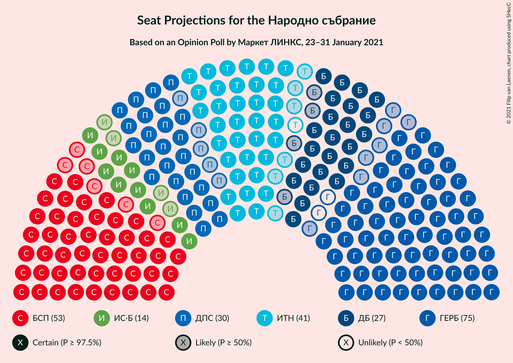
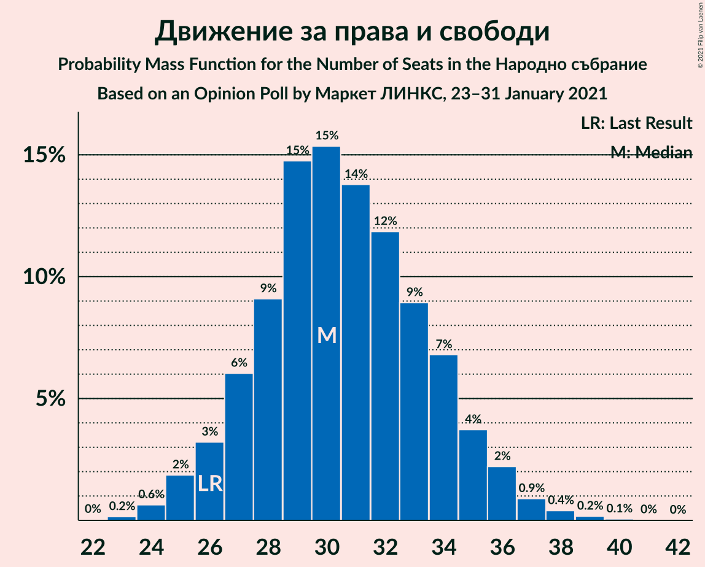
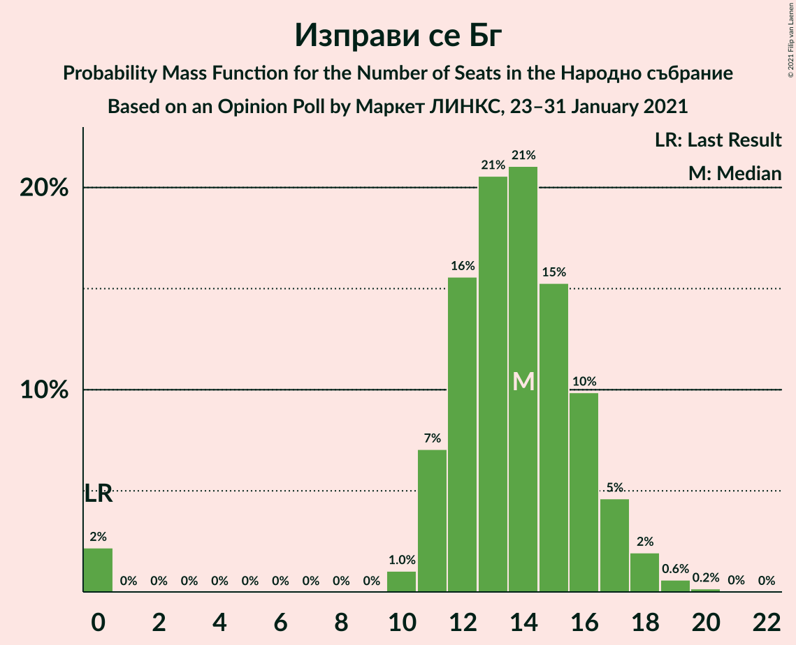
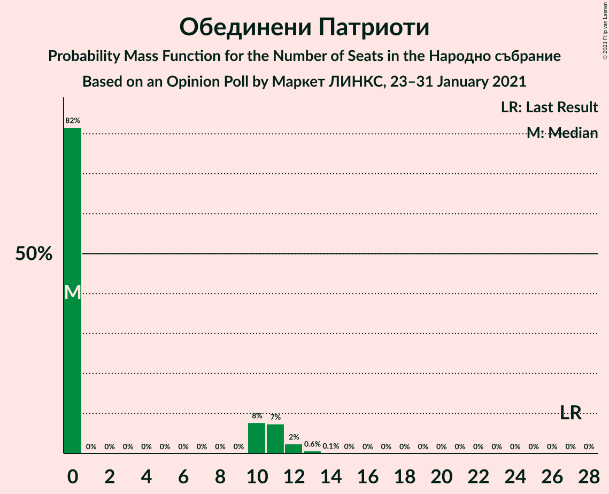

# Opinion Poll by Маркет ЛИНКС, 23–31 January 2021

<a href="#voting-intentions">Voting Intentions</a> | <a href="#seats">Seats</a> | <a href="#coalitions">Coalitions</a> | <a href="#technical-information">Technical Information</a>

## Voting Intentions

### Confidence Intervals

| Party | Last Result | Poll Result | 80% Confidence Interval | 90% Confidence Interval | 95% Confidence Interval | 99% Confidence Interval |
|:-----:|:-----------:|:-----------:|:-----------------------:|:-----------------------:|:-----------------------:|:-----------------------:|
| Граждани за европейско развитие на България | 33.5% | 28.6% | 26.1–31.3% |25.4–32.1% |24.8–32.7% |23.7–34.0% |
| Българска социалистическа партия | 27.9% | 20.8% | 18.6–23.3% |18.0–24.0% |17.5–24.6% |16.5–25.8% |
| Има такъв народ | 0.0% | 15.4% | 13.5–17.6% |13.0–18.3% |12.5–18.8% |11.6–20.0% |
| Движение за права и свободи | 9.2% | 11.8% | 10.1–13.8% |9.6–14.4% |9.3–14.9% |8.5–16.0% |
| Демократична България | 0.0% | 10.6% | 9.0–12.6% |8.6–13.1% |8.2–13.6% |7.5–14.6% |
| Изправи се Бг | 0.0% | 5.2% | 4.1–6.7% |3.8–7.1% |3.6–7.5% |3.1–8.3% |
| Обединени Патриоти | 9.3% | 3.4% | 2.6–4.7% |2.3–5.1% |2.1–5.4% |1.8–6.1% |

*Note:* The poll result column reflects the actual value used in the calculations. Published results may vary slightly, and in addition be rounded to fewer digits.

## Seats

### Confidence Intervals

| Party | Last Result | Median | 80% Confidence Interval | 90% Confidence Interval | 95% Confidence Interval | 99% Confidence Interval |
|:-----:|:-----------:|:------:|:-----------------------:|:-----------------------:|:-----------------------:|:-----------------------:|
| <a href="#граждани-за-европейско-развитие-на-българия">Граждани за европейско развитие на България</a> | 95 | 73 | 66–80 |64–82 |63–84 |60–88 |
| <a href="#българска-социалистическа-партия">Българска социалистическа партия</a> | 80 | 53 | 47–60 |45–62 |44–63 |42–66 |
| <a href="#има-такъв-народ">Има такъв народ</a> | 0 | 39 | 34–45 |33–47 |32–48 |29–51 |
| <a href="#движение-за-права-и-свободи">Движение за права и свободи</a> | 26 | 31 | 26–36 |25–37 |23–38 |22–41 |
| <a href="#демократична-българия">Демократична България</a> | 0 | 27 | 23–32 |22–34 |21–35 |19–37 |
| <a href="#изправи-се-бг">Изправи се Бг</a> | 0 | 14 | 10–17 |0–18 |0–19 |0–21 |
| <a href="#обединени-патриоти">Обединени Патриоти</a> | 27 | 0 | 0–12 |0–13 |0–13 |0–15 |

### Граждани за европейско развитие на България

*For a full overview of the results for this party, see the [Граждани за европейско развитие на България](party-гражданизаевропейскоразвитиенабългария.html) page.*

| Number of Seats | Probability | Accumulated | Special Marks |
|:---------------:|:-----------:|:-----------:|:-------------:|
| 56 | 0% | 100% |  |
| 57 | 0.1% | 99.9% |  |
| 58 | 0.1% | 99.9% |  |
| 59 | 0.2% | 99.8% |  |
| 60 | 0.3% | 99.6% |  |
| 61 | 0.5% | 99.2% |  |
| 62 | 0.9% | 98.7% |  |
| 63 | 1.4% | 98% |  |
| 64 | 2% | 96% |  |
| 65 | 2% | 95% |  |
| 66 | 3% | 93% |  |
| 67 | 4% | 89% |  |
| 68 | 5% | 85% |  |
| 69 | 5% | 80% |  |
| 70 | 7% | 75% |  |
| 71 | 7% | 67% |  |
| 72 | 6% | 61% |  |
| 73 | 7% | 54% | Median |
| 74 | 8% | 47% |  |
| 75 | 7% | 39% |  |
| 76 | 5% | 32% |  |
| 77 | 5% | 26% |  |
| 78 | 5% | 21% |  |
| 79 | 4% | 16% |  |
| 80 | 3% | 12% |  |
| 81 | 2% | 9% |  |
| 82 | 2% | 7% |  |
| 83 | 1.5% | 4% |  |
| 84 | 1.0% | 3% |  |
| 85 | 0.6% | 2% |  |
| 86 | 0.4% | 1.4% |  |
| 87 | 0.3% | 1.0% |  |
| 88 | 0.3% | 0.7% |  |
| 89 | 0.2% | 0.4% |  |
| 90 | 0.1% | 0.2% |  |
| 91 | 0% | 0.1% |  |
| 92 | 0% | 0.1% |  |
| 93 | 0% | 0% |  |
| 94 | 0% | 0% |  |
| 95 | 0% | 0% | Last Result |

### Българска социалистическа партия

*For a full overview of the results for this party, see the [Българска социалистическа партия](party-българскасоциалистическапартия.html) page.*

| Number of Seats | Probability | Accumulated | Special Marks |
|:---------------:|:-----------:|:-----------:|:-------------:|
| 39 | 0.1% | 100% |  |
| 40 | 0.1% | 99.9% |  |
| 41 | 0.2% | 99.8% |  |
| 42 | 0.3% | 99.6% |  |
| 43 | 0.7% | 99.3% |  |
| 44 | 1.5% | 98.6% |  |
| 45 | 2% | 97% |  |
| 46 | 2% | 95% |  |
| 47 | 3% | 92% |  |
| 48 | 5% | 89% |  |
| 49 | 7% | 85% |  |
| 50 | 6% | 78% |  |
| 51 | 5% | 72% |  |
| 52 | 8% | 67% |  |
| 53 | 12% | 59% | Median |
| 54 | 9% | 47% |  |
| 55 | 7% | 38% |  |
| 56 | 6% | 31% |  |
| 57 | 6% | 25% |  |
| 58 | 5% | 19% |  |
| 59 | 3% | 13% |  |
| 60 | 2% | 10% |  |
| 61 | 2% | 8% |  |
| 62 | 2% | 6% |  |
| 63 | 1.3% | 3% |  |
| 64 | 0.6% | 2% |  |
| 65 | 0.5% | 1.3% |  |
| 66 | 0.4% | 0.8% |  |
| 67 | 0.2% | 0.4% |  |
| 68 | 0.1% | 0.2% |  |
| 69 | 0.1% | 0.2% |  |
| 70 | 0% | 0.1% |  |
| 71 | 0% | 0% |  |
| 72 | 0% | 0% |  |
| 73 | 0% | 0% |  |
| 74 | 0% | 0% |  |
| 75 | 0% | 0% |  |
| 76 | 0% | 0% |  |
| 77 | 0% | 0% |  |
| 78 | 0% | 0% |  |
| 79 | 0% | 0% |  |
| 80 | 0% | 0% | Last Result |

### Има такъв народ

*For a full overview of the results for this party, see the [Има такъв народ](party-иматакъвнарод.html) page.*

| Number of Seats | Probability | Accumulated | Special Marks |
|:---------------:|:-----------:|:-----------:|:-------------:|
| 0 | 0% | 100% | Last Result |
| 1 | 0% | 100% |  |
| 2 | 0% | 100% |  |
| 3 | 0% | 100% |  |
| 4 | 0% | 100% |  |
| 5 | 0% | 100% |  |
| 6 | 0% | 100% |  |
| 7 | 0% | 100% |  |
| 8 | 0% | 100% |  |
| 9 | 0% | 100% |  |
| 10 | 0% | 100% |  |
| 11 | 0% | 100% |  |
| 12 | 0% | 100% |  |
| 13 | 0% | 100% |  |
| 14 | 0% | 100% |  |
| 15 | 0% | 100% |  |
| 16 | 0% | 100% |  |
| 17 | 0% | 100% |  |
| 18 | 0% | 100% |  |
| 19 | 0% | 100% |  |
| 20 | 0% | 100% |  |
| 21 | 0% | 100% |  |
| 22 | 0% | 100% |  |
| 23 | 0% | 100% |  |
| 24 | 0% | 100% |  |
| 25 | 0% | 100% |  |
| 26 | 0% | 100% |  |
| 27 | 0.1% | 100% |  |
| 28 | 0.1% | 99.9% |  |
| 29 | 0.3% | 99.8% |  |
| 30 | 0.5% | 99.5% |  |
| 31 | 1.2% | 98.9% |  |
| 32 | 2% | 98% |  |
| 33 | 2% | 96% |  |
| 34 | 5% | 93% |  |
| 35 | 6% | 89% |  |
| 36 | 5% | 83% |  |
| 37 | 8% | 77% |  |
| 38 | 10% | 69% |  |
| 39 | 10% | 59% | Median |
| 40 | 7% | 49% |  |
| 41 | 9% | 43% |  |
| 42 | 9% | 33% |  |
| 43 | 6% | 24% |  |
| 44 | 5% | 18% |  |
| 45 | 4% | 13% |  |
| 46 | 3% | 9% |  |
| 47 | 2% | 6% |  |
| 48 | 2% | 4% |  |
| 49 | 0.8% | 2% |  |
| 50 | 0.5% | 1.3% |  |
| 51 | 0.3% | 0.7% |  |
| 52 | 0.2% | 0.5% |  |
| 53 | 0.1% | 0.2% |  |
| 54 | 0.1% | 0.1% |  |
| 55 | 0% | 0.1% |  |
| 56 | 0% | 0% |  |

### Движение за права и свободи

*For a full overview of the results for this party, see the [Движение за права и свободи](party-движениезаправаисвободи.html) page.*

| Number of Seats | Probability | Accumulated | Special Marks |
|:---------------:|:-----------:|:-----------:|:-------------:|
| 19 | 0% | 100% |  |
| 20 | 0.1% | 99.9% |  |
| 21 | 0.3% | 99.8% |  |
| 22 | 0.8% | 99.6% |  |
| 23 | 2% | 98.8% |  |
| 24 | 2% | 97% |  |
| 25 | 3% | 95% |  |
| 26 | 6% | 92% | Last Result |
| 27 | 9% | 86% |  |
| 28 | 9% | 77% |  |
| 29 | 9% | 68% |  |
| 30 | 9% | 59% |  |
| 31 | 13% | 50% | Median |
| 32 | 10% | 38% |  |
| 33 | 7% | 27% |  |
| 34 | 6% | 20% |  |
| 35 | 5% | 15% |  |
| 36 | 4% | 10% |  |
| 37 | 2% | 6% |  |
| 38 | 1.1% | 3% |  |
| 39 | 0.9% | 2% |  |
| 40 | 0.6% | 1.2% |  |
| 41 | 0.3% | 0.7% |  |
| 42 | 0.1% | 0.3% |  |
| 43 | 0.1% | 0.2% |  |
| 44 | 0.1% | 0.1% |  |
| 45 | 0% | 0% |  |

### Демократична България

*For a full overview of the results for this party, see the [Демократична България](party-демократичнабългария.html) page.*

| Number of Seats | Probability | Accumulated | Special Marks |
|:---------------:|:-----------:|:-----------:|:-------------:|
| 0 | 0% | 100% | Last Result |
| 1 | 0% | 100% |  |
| 2 | 0% | 100% |  |
| 3 | 0% | 100% |  |
| 4 | 0% | 100% |  |
| 5 | 0% | 100% |  |
| 6 | 0% | 100% |  |
| 7 | 0% | 100% |  |
| 8 | 0% | 100% |  |
| 9 | 0% | 100% |  |
| 10 | 0% | 100% |  |
| 11 | 0% | 100% |  |
| 12 | 0% | 100% |  |
| 13 | 0% | 100% |  |
| 14 | 0% | 100% |  |
| 15 | 0% | 100% |  |
| 16 | 0% | 100% |  |
| 17 | 0.1% | 100% |  |
| 18 | 0.2% | 99.9% |  |
| 19 | 0.5% | 99.7% |  |
| 20 | 1.4% | 99.3% |  |
| 21 | 3% | 98% |  |
| 22 | 3% | 95% |  |
| 23 | 5% | 92% |  |
| 24 | 8% | 87% |  |
| 25 | 10% | 79% |  |
| 26 | 12% | 69% |  |
| 27 | 9% | 56% | Median |
| 28 | 11% | 47% |  |
| 29 | 9% | 36% |  |
| 30 | 9% | 27% |  |
| 31 | 7% | 18% |  |
| 32 | 4% | 12% |  |
| 33 | 3% | 8% |  |
| 34 | 2% | 5% |  |
| 35 | 1.5% | 3% |  |
| 36 | 0.8% | 2% |  |
| 37 | 0.4% | 0.9% |  |
| 38 | 0.2% | 0.5% |  |
| 39 | 0.1% | 0.3% |  |
| 40 | 0.1% | 0.1% |  |
| 41 | 0% | 0.1% |  |
| 42 | 0% | 0% |  |

### Изправи се Бг

*For a full overview of the results for this party, see the [Изправи се Бг](party-изправисебг.html) page.*

| Number of Seats | Probability | Accumulated | Special Marks |
|:---------------:|:-----------:|:-----------:|:-------------:|
| 0 | 8% | 100% | Last Result |
| 1 | 0% | 92% |  |
| 2 | 0% | 92% |  |
| 3 | 0% | 92% |  |
| 4 | 0% | 92% |  |
| 5 | 0% | 92% |  |
| 6 | 0% | 92% |  |
| 7 | 0% | 92% |  |
| 8 | 0% | 92% |  |
| 9 | 0% | 92% |  |
| 10 | 2% | 92% |  |
| 11 | 9% | 90% |  |
| 12 | 13% | 81% |  |
| 13 | 17% | 68% |  |
| 14 | 15% | 51% | Median |
| 15 | 13% | 35% |  |
| 16 | 9% | 22% |  |
| 17 | 6% | 14% |  |
| 18 | 4% | 8% |  |
| 19 | 2% | 4% |  |
| 20 | 1.0% | 2% |  |
| 21 | 0.5% | 0.9% |  |
| 22 | 0.2% | 0.4% |  |
| 23 | 0.1% | 0.2% |  |
| 24 | 0% | 0.1% |  |
| 25 | 0% | 0% |  |

### Обединени Патриоти

*For a full overview of the results for this party, see the [Обединени Патриоти](party-обединенипатриоти.html) page.*

| Number of Seats | Probability | Accumulated | Special Marks |
|:---------------:|:-----------:|:-----------:|:-------------:|
| 0 | 73% | 100% | Median |
| 1 | 0% | 27% |  |
| 2 | 0% | 27% |  |
| 3 | 0% | 27% |  |
| 4 | 0% | 27% |  |
| 5 | 0% | 27% |  |
| 6 | 0% | 27% |  |
| 7 | 0% | 27% |  |
| 8 | 0% | 27% |  |
| 9 | 0% | 27% |  |
| 10 | 5% | 27% |  |
| 11 | 10% | 21% |  |
| 12 | 6% | 11% |  |
| 13 | 3% | 5% |  |
| 14 | 1.4% | 2% |  |
| 15 | 0.5% | 0.9% |  |
| 16 | 0.2% | 0.3% |  |
| 17 | 0.1% | 0.1% |  |
| 18 | 0% | 0% |  |
| 19 | 0% | 0% |  |
| 20 | 0% | 0% |  |
| 21 | 0% | 0% |  |
| 22 | 0% | 0% |  |
| 23 | 0% | 0% |  |
| 24 | 0% | 0% |  |
| 25 | 0% | 0% |  |
| 26 | 0% | 0% |  |
| 27 | 0% | 0% | Last Result |

## Coalitions

### Confidence Intervals

| Coalition | Last Result | Median | Majority? | 80% Confidence Interval | 90% Confidence Interval | 95% Confidence Interval | 99% Confidence Interval |
|:---------:|:-----------:|:------:|:---------:|:-----------------------:|:-----------------------:|:-----------------------:|:-----------------------:|
| Българска социалистическа партия – Има такъв народ – Движение за права и свободи – Изправи се Бг | 106 | 137 | 99.1% | 128–144 | 125–146 | 123–148 | 119–152 |
| Българска социалистическа партия – Има такъв народ – Движение за права и свободи | 106 | 123 | 68% | 115–132 | 113–134 | 111–136 | 107–141 |
| Българска социалистическа партия – Движение за права и свободи – Изправи се Бг | 106 | 97 | 0% | 89–105 | 86–107 | 84–108 | 79–112 |
| Българска социалистическа партия – Движение за права и свободи | 106 | 84 | 0% | 77–91 | 75–94 | 73–95 | 70–99 |
| Граждани за европейско развитие на България – Обединени Патриоти | 122 | 76 | 0% | 69–85 | 66–87 | 65–89 | 62–93 |

### Българска социалистическа партия – Има такъв народ – Движение за права и свободи – Изправи се Бг

| Number of Seats | Probability | Accumulated | Special Marks |
|:---------------:|:-----------:|:-----------:|:-------------:|
| 106 | 0% | 100% | Last Result |
| 107 | 0% | 100% |  |
| 108 | 0% | 100% |  |
| 109 | 0% | 100% |  |
| 110 | 0% | 100% |  |
| 111 | 0% | 100% |  |
| 112 | 0% | 100% |  |
| 113 | 0% | 100% |  |
| 114 | 0% | 100% |  |
| 115 | 0.1% | 99.9% |  |
| 116 | 0.1% | 99.9% |  |
| 117 | 0.1% | 99.8% |  |
| 118 | 0.2% | 99.7% |  |
| 119 | 0.2% | 99.5% |  |
| 120 | 0.2% | 99.3% |  |
| 121 | 0.4% | 99.1% | Majority |
| 122 | 0.4% | 98.7% |  |
| 123 | 0.9% | 98% |  |
| 124 | 1.0% | 97% |  |
| 125 | 2% | 96% |  |
| 126 | 1.5% | 95% |  |
| 127 | 3% | 93% |  |
| 128 | 2% | 91% |  |
| 129 | 3% | 89% |  |
| 130 | 3% | 86% |  |
| 131 | 5% | 83% |  |
| 132 | 5% | 78% |  |
| 133 | 5% | 74% |  |
| 134 | 6% | 69% |  |
| 135 | 6% | 63% |  |
| 136 | 6% | 56% |  |
| 137 | 6% | 51% | Median |
| 138 | 6% | 44% |  |
| 139 | 5% | 39% |  |
| 140 | 6% | 33% |  |
| 141 | 6% | 28% |  |
| 142 | 5% | 22% |  |
| 143 | 4% | 17% |  |
| 144 | 3% | 13% |  |
| 145 | 3% | 10% |  |
| 146 | 2% | 7% |  |
| 147 | 1.3% | 5% |  |
| 148 | 1.0% | 3% |  |
| 149 | 0.9% | 2% |  |
| 150 | 0.7% | 2% |  |
| 151 | 0.3% | 0.9% |  |
| 152 | 0.3% | 0.6% |  |
| 153 | 0.1% | 0.3% |  |
| 154 | 0.1% | 0.2% |  |
| 155 | 0% | 0.1% |  |
| 156 | 0% | 0.1% |  |
| 157 | 0% | 0% |  |

### Българска социалистическа партия – Има такъв народ – Движение за права и свободи

| Number of Seats | Probability | Accumulated | Special Marks |
|:---------------:|:-----------:|:-----------:|:-------------:|
| 103 | 0% | 100% |  |
| 104 | 0.1% | 99.9% |  |
| 105 | 0.1% | 99.9% |  |
| 106 | 0.2% | 99.8% | Last Result |
| 107 | 0.2% | 99.6% |  |
| 108 | 0.3% | 99.4% |  |
| 109 | 0.4% | 99.1% |  |
| 110 | 0.7% | 98.7% |  |
| 111 | 1.0% | 98% |  |
| 112 | 1.0% | 97% |  |
| 113 | 2% | 96% |  |
| 114 | 2% | 94% |  |
| 115 | 3% | 92% |  |
| 116 | 3% | 89% |  |
| 117 | 4% | 86% |  |
| 118 | 4% | 82% |  |
| 119 | 5% | 78% |  |
| 120 | 6% | 74% |  |
| 121 | 6% | 68% | Majority |
| 122 | 5% | 62% |  |
| 123 | 6% | 56% | Median |
| 124 | 7% | 50% |  |
| 125 | 6% | 43% |  |
| 126 | 6% | 38% |  |
| 127 | 6% | 32% |  |
| 128 | 5% | 26% |  |
| 129 | 4% | 21% |  |
| 130 | 3% | 17% |  |
| 131 | 4% | 14% |  |
| 132 | 2% | 10% |  |
| 133 | 2% | 8% |  |
| 134 | 2% | 6% |  |
| 135 | 1.3% | 4% |  |
| 136 | 0.8% | 3% |  |
| 137 | 0.5% | 2% |  |
| 138 | 0.6% | 2% |  |
| 139 | 0.3% | 1.1% |  |
| 140 | 0.3% | 0.8% |  |
| 141 | 0.2% | 0.5% |  |
| 142 | 0.1% | 0.4% |  |
| 143 | 0.1% | 0.3% |  |
| 144 | 0% | 0.1% |  |
| 145 | 0% | 0.1% |  |
| 146 | 0% | 0.1% |  |
| 147 | 0% | 0% |  |

### Българска социалистическа партия – Движение за права и свободи – Изправи се Бг

| Number of Seats | Probability | Accumulated | Special Marks |
|:---------------:|:-----------:|:-----------:|:-------------:|
| 74 | 0% | 100% |  |
| 75 | 0% | 99.9% |  |
| 76 | 0.1% | 99.9% |  |
| 77 | 0.1% | 99.8% |  |
| 78 | 0.1% | 99.8% |  |
| 79 | 0.2% | 99.7% |  |
| 80 | 0.2% | 99.5% |  |
| 81 | 0.4% | 99.3% |  |
| 82 | 0.5% | 98.9% |  |
| 83 | 0.8% | 98% |  |
| 84 | 0.6% | 98% |  |
| 85 | 1.1% | 97% |  |
| 86 | 1.3% | 96% |  |
| 87 | 2% | 95% |  |
| 88 | 2% | 93% |  |
| 89 | 3% | 91% |  |
| 90 | 3% | 88% |  |
| 91 | 4% | 85% |  |
| 92 | 5% | 81% |  |
| 93 | 5% | 76% |  |
| 94 | 5% | 71% |  |
| 95 | 6% | 66% |  |
| 96 | 6% | 60% |  |
| 97 | 6% | 54% |  |
| 98 | 8% | 47% | Median |
| 99 | 7% | 39% |  |
| 100 | 6% | 33% |  |
| 101 | 5% | 27% |  |
| 102 | 4% | 22% |  |
| 103 | 3% | 17% |  |
| 104 | 4% | 14% |  |
| 105 | 3% | 10% |  |
| 106 | 2% | 8% | Last Result |
| 107 | 2% | 5% |  |
| 108 | 2% | 4% |  |
| 109 | 0.7% | 2% |  |
| 110 | 0.5% | 2% |  |
| 111 | 0.4% | 1.1% |  |
| 112 | 0.2% | 0.7% |  |
| 113 | 0.2% | 0.4% |  |
| 114 | 0.1% | 0.2% |  |
| 115 | 0% | 0.1% |  |
| 116 | 0% | 0.1% |  |
| 117 | 0% | 0% |  |

### Българска социалистическа партия – Движение за права и свободи

| Number of Seats | Probability | Accumulated | Special Marks |
|:---------------:|:-----------:|:-----------:|:-------------:|
| 66 | 0% | 100% |  |
| 67 | 0.1% | 99.9% |  |
| 68 | 0.1% | 99.9% |  |
| 69 | 0.2% | 99.7% |  |
| 70 | 0.3% | 99.5% |  |
| 71 | 0.6% | 99.2% |  |
| 72 | 0.8% | 98.7% |  |
| 73 | 1.2% | 98% |  |
| 74 | 2% | 97% |  |
| 75 | 2% | 95% |  |
| 76 | 2% | 93% |  |
| 77 | 4% | 91% |  |
| 78 | 4% | 87% |  |
| 79 | 6% | 83% |  |
| 80 | 6% | 77% |  |
| 81 | 6% | 71% |  |
| 82 | 6% | 65% |  |
| 83 | 7% | 59% |  |
| 84 | 6% | 52% | Median |
| 85 | 10% | 46% |  |
| 86 | 5% | 36% |  |
| 87 | 6% | 31% |  |
| 88 | 5% | 25% |  |
| 89 | 4% | 20% |  |
| 90 | 4% | 16% |  |
| 91 | 3% | 12% |  |
| 92 | 2% | 9% |  |
| 93 | 1.4% | 7% |  |
| 94 | 2% | 5% |  |
| 95 | 1.1% | 4% |  |
| 96 | 0.9% | 2% |  |
| 97 | 0.6% | 2% |  |
| 98 | 0.4% | 1.0% |  |
| 99 | 0.2% | 0.6% |  |
| 100 | 0.2% | 0.4% |  |
| 101 | 0.1% | 0.2% |  |
| 102 | 0.1% | 0.2% |  |
| 103 | 0% | 0.1% |  |
| 104 | 0% | 0.1% |  |
| 105 | 0% | 0% |  |
| 106 | 0% | 0% | Last Result |

### Граждани за европейско развитие на България – Обединени Патриоти

| Number of Seats | Probability | Accumulated | Special Marks |
|:---------------:|:-----------:|:-----------:|:-------------:|
| 58 | 0% | 100% |  |
| 59 | 0.1% | 99.9% |  |
| 60 | 0.1% | 99.9% |  |
| 61 | 0.2% | 99.8% |  |
| 62 | 0.4% | 99.5% |  |
| 63 | 0.6% | 99.2% |  |
| 64 | 0.7% | 98.6% |  |
| 65 | 1.1% | 98% |  |
| 66 | 2% | 97% |  |
| 67 | 2% | 95% |  |
| 68 | 3% | 93% |  |
| 69 | 3% | 90% |  |
| 70 | 5% | 87% |  |
| 71 | 5% | 81% |  |
| 72 | 5% | 76% |  |
| 73 | 6% | 71% | Median |
| 74 | 7% | 65% |  |
| 75 | 7% | 59% |  |
| 76 | 6% | 52% |  |
| 77 | 6% | 46% |  |
| 78 | 6% | 41% |  |
| 79 | 6% | 35% |  |
| 80 | 4% | 29% |  |
| 81 | 4% | 25% |  |
| 82 | 4% | 20% |  |
| 83 | 3% | 16% |  |
| 84 | 3% | 13% |  |
| 85 | 2% | 10% |  |
| 86 | 2% | 8% |  |
| 87 | 1.4% | 6% |  |
| 88 | 1.5% | 5% |  |
| 89 | 1.1% | 3% |  |
| 90 | 0.6% | 2% |  |
| 91 | 0.5% | 2% |  |
| 92 | 0.4% | 1.1% |  |
| 93 | 0.2% | 0.7% |  |
| 94 | 0.2% | 0.5% |  |
| 95 | 0.1% | 0.3% |  |
| 96 | 0.1% | 0.2% |  |
| 97 | 0% | 0.1% |  |
| 98 | 0% | 0.1% |  |
| 99 | 0% | 0% |  |
| 100 | 0% | 0% |  |
| 101 | 0% | 0% |  |
| 102 | 0% | 0% |  |
| 103 | 0% | 0% |  |
| 104 | 0% | 0% |  |
| 105 | 0% | 0% |  |
| 106 | 0% | 0% |  |
| 107 | 0% | 0% |  |
| 108 | 0% | 0% |  |
| 109 | 0% | 0% |  |
| 110 | 0% | 0% |  |
| 111 | 0% | 0% |  |
| 112 | 0% | 0% |  |
| 113 | 0% | 0% |  |
| 114 | 0% | 0% |  |
| 115 | 0% | 0% |  |
| 116 | 0% | 0% |  |
| 117 | 0% | 0% |  |
| 118 | 0% | 0% |  |
| 119 | 0% | 0% |  |
| 120 | 0% | 0% |  |
| 121 | 0% | 0% | Majority |
| 122 | 0% | 0% | Last Result |

## Technical Information

### Opinion Poll

+ **Polling firm:** Маркет ЛИНКС
+ **Commissioner(s):** —
+ **Fieldwork period:** 23–31 January 2021

### Calculations

+ **Sample size:** 500
+ **Simulations done:** 1,048,576
+ **Error estimate:** 1.51%

