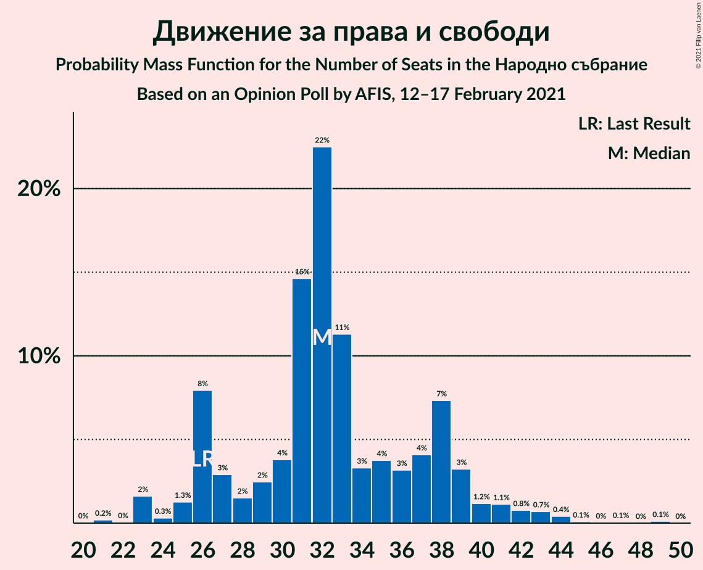
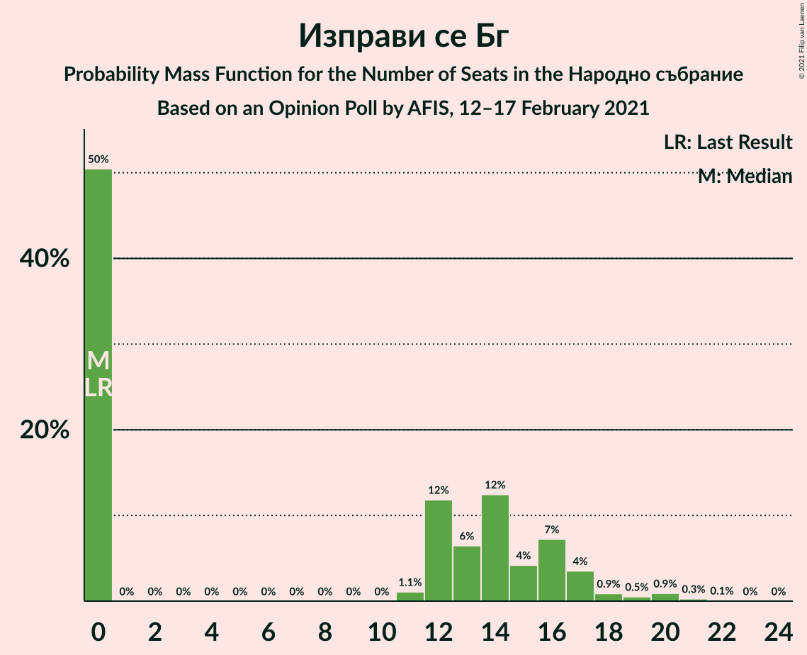
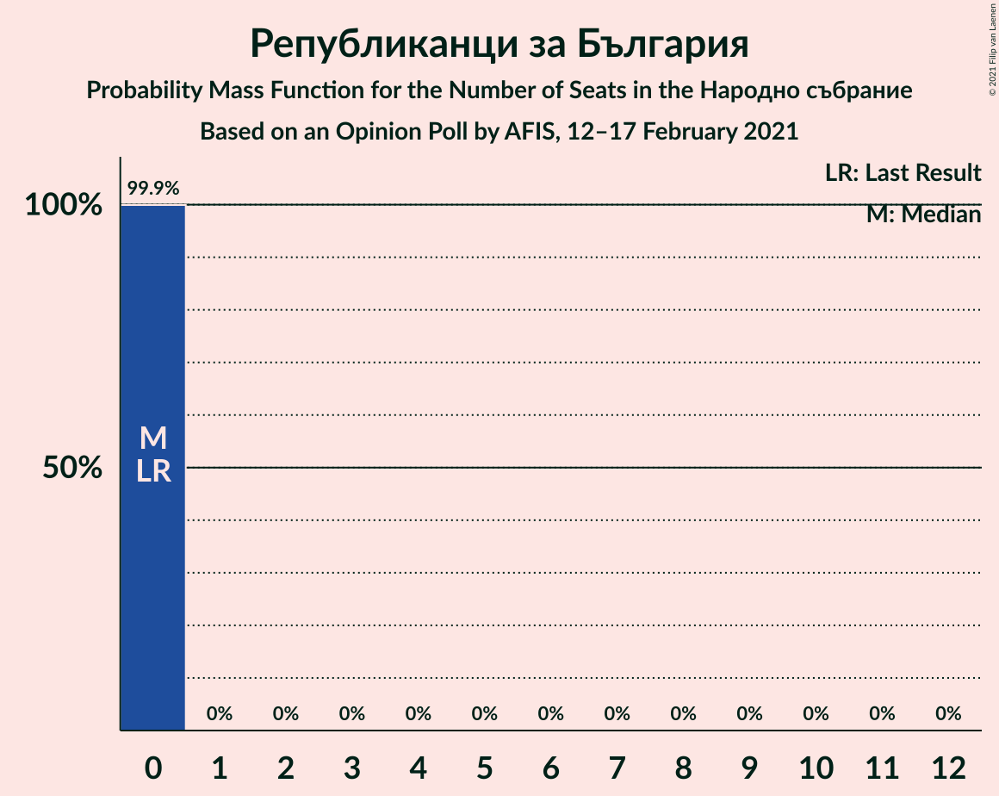
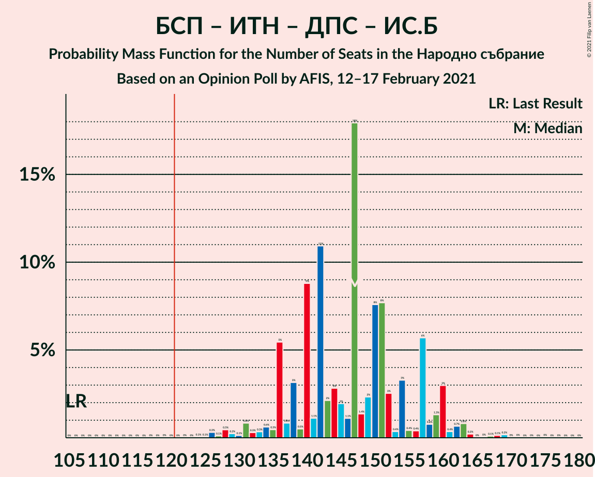
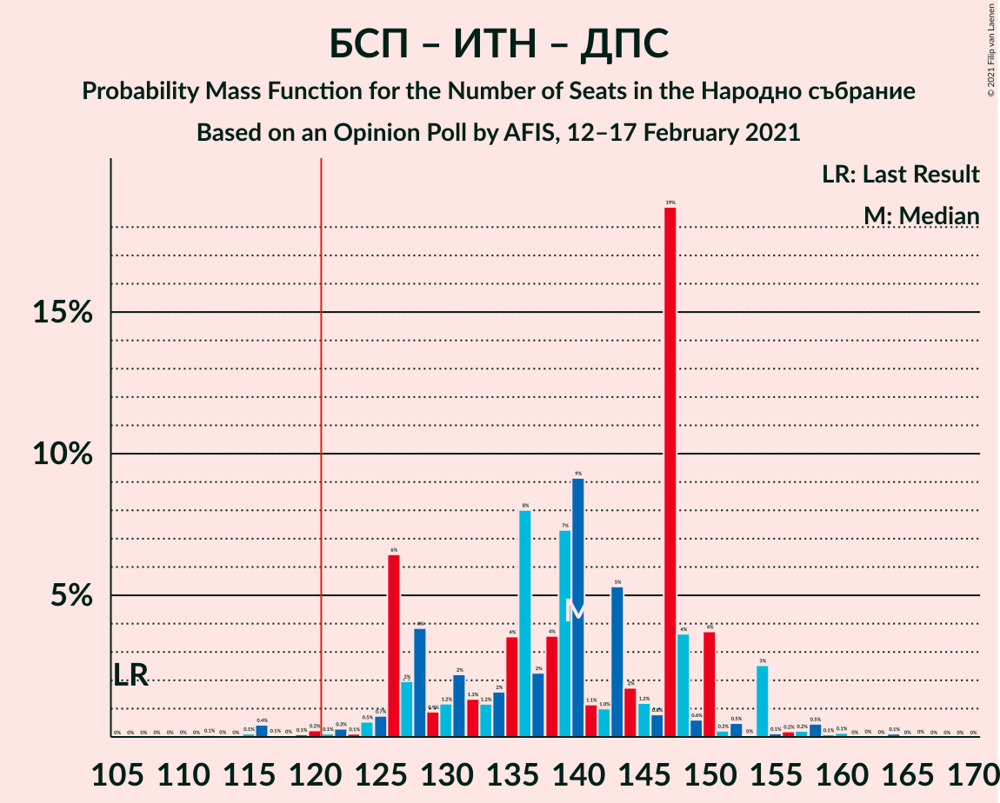
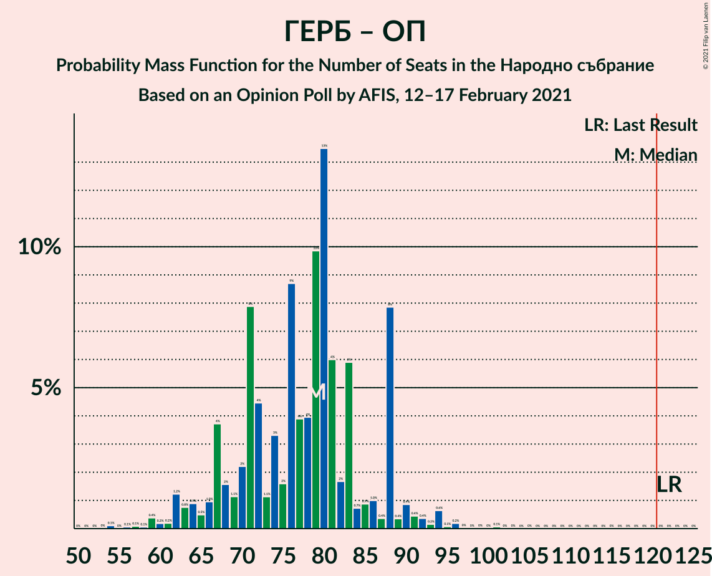

# Opinion Poll by AFIS, 12–17 February 2021

<a href="#voting-intentions">Voting Intentions</a> | <a href="#seats">Seats</a> | <a href="#coalitions">Coalitions</a> | <a href="#technical-information">Technical Information</a>

## Voting Intentions

### Confidence Intervals

| Party | Last Result | Poll Result | 80% Confidence Interval | 90% Confidence Interval | 95% Confidence Interval | 99% Confidence Interval |
|:-----:|:-----------:|:-----------:|:-----------------------:|:-----------------------:|:-----------------------:|:-----------------------:|
| Граждани за европейско развитие на България | 33.5% | 25.3% | 22.8–28.1% |22.1–28.9% |21.4–29.6% |20.3–30.9% |
| Българска социалистическа партия | 27.9% | 22.6% | 20.1–25.3% |19.5–26.0% |18.9–26.7% |17.8–28.0% |
| Има такъв народ | 0.0% | 14.1% | 12.2–16.5% |11.6–17.1% |11.2–17.7% |10.3–18.9% |
| Движение за права и свободи | 9.2% | 11.4% | 9.6–13.5% |9.2–14.2% |8.7–14.7% |8.0–15.8% |
| Демократична България | 0.0% | 5.7% | 4.5–7.4% |4.2–7.8% |3.9–8.3% |3.4–9.2% |
| Изправи се Бг | 0.0% | 4.1% | 3.1–5.6% |2.8–6.0% |2.6–6.4% |2.2–7.2% |
| Обединени Патриоти | 9.3% | 3.2% | 2.3–4.6% |2.1–4.9% |1.9–5.3% |1.6–6.0% |
| Възраждане | 0.0% | 2.3% | 1.6–3.5% |1.4–3.8% |1.2–4.1% |1.0–4.8% |
| Воля–Национален фронт за спасение на България | 4.3% | 2.1% | 1.4–3.2% |1.2–3.6% |1.1–3.9% |0.8–4.5% |
| Атака | 0.0% | 1.6% | 1.1–2.7% |0.9–3.0% |0.8–3.3% |0.6–3.9% |
| Алтернатива за българско възраждане | 1.6% | 1.6% | 1.1–2.7% |0.9–3.0% |0.8–3.3% |0.6–3.9% |
| Републиканци за България | 0.0% | 1.4% | 0.9–2.4% |0.7–2.7% |0.6–3.0% |0.5–3.5% |

*Note:* The poll result column reflects the actual value used in the calculations. Published results may vary slightly, and in addition be rounded to fewer digits.

## Seats

### Confidence Intervals

| Party | Last Result | Median | 80% Confidence Interval | 90% Confidence Interval | 95% Confidence Interval | 99% Confidence Interval |
|:-----:|:-----------:|:------:|:-----------------------:|:-----------------------:|:-----------------------:|:-----------------------:|
| <a href="#граждани-за-европейско-развитие-на-българия">Граждани за европейско развитие на България</a> | 95 | 76 | 66–84 |63–88 |62–88 |57–91 |
| <a href="#българска-социалистическа-партия">Българска социалистическа партия</a> | 80 | 65 | 57–74 |54–78 |52–78 |50–80 |
| <a href="#има-такъв-народ">Има такъв народ</a> | 0 | 42 | 35–48 |34–50 |32–51 |30–54 |
| <a href="#движение-за-права-и-свободи">Движение за права и свободи</a> | 26 | 32 | 26–38 |26–39 |25–41 |23–44 |
| <a href="#демократична-българия">Демократична България</a> | 0 | 17 | 12–22 |0–23 |0–25 |0–26 |
| <a href="#изправи-се-бг">Изправи се Бг</a> | 0 | 0 | 0–16 |0–17 |0–18 |0–20 |
| <a href="#обединени-патриоти">Обединени Патриоти</a> | 27 | 0 | 0–12 |0–14 |0–15 |0–17 |
| <a href="#възраждане">Възраждане</a> | 0 | 0 | 0 |0 |0–12 |0–14 |
| <a href="#воля–национален-фронт-за-спасение-на-българия">Воля–Национален фронт за спасение на България</a> | 12 | 0 | 0 |0 |0 |0–12 |
| <a href="#атака">Атака</a> | 0 | 0 | 0 |0 |0 |0 |
| <a href="#алтернатива-за-българско-възраждане">Алтернатива за българско възраждане</a> | 0 | 0 | 0 |0 |0 |0 |
| <a href="#републиканци-за-българия">Републиканци за България</a> | 0 | 0 | 0 |0 |0 |0 |

### Граждани за европейско развитие на България

*For a full overview of the results for this party, see the [Граждани за европейско развитие на България](party-гражданизаевропейскоразвитиенабългария.html) page.*

| Number of Seats | Probability | Accumulated | Special Marks |
|:---------------:|:-----------:|:-----------:|:-------------:|
| 53 | 0% | 100% |  |
| 54 | 0.1% | 99.9% |  |
| 55 | 0% | 99.8% |  |
| 56 | 0.1% | 99.8% |  |
| 57 | 0.2% | 99.7% |  |
| 58 | 0.1% | 99.4% |  |
| 59 | 0.5% | 99.3% |  |
| 60 | 0.5% | 98.8% |  |
| 61 | 0.6% | 98% |  |
| 62 | 2% | 98% |  |
| 63 | 1.0% | 96% |  |
| 64 | 1.2% | 95% |  |
| 65 | 2% | 94% |  |
| 66 | 3% | 92% |  |
| 67 | 4% | 89% |  |
| 68 | 5% | 85% |  |
| 69 | 2% | 80% |  |
| 70 | 2% | 79% |  |
| 71 | 8% | 76% |  |
| 72 | 5% | 68% |  |
| 73 | 1.0% | 63% |  |
| 74 | 4% | 62% |  |
| 75 | 1.3% | 58% |  |
| 76 | 9% | 57% | Median |
| 77 | 4% | 48% |  |
| 78 | 2% | 44% |  |
| 79 | 10% | 43% |  |
| 80 | 10% | 33% |  |
| 81 | 5% | 23% |  |
| 82 | 2% | 17% |  |
| 83 | 6% | 16% |  |
| 84 | 0.3% | 10% |  |
| 85 | 0.4% | 10% |  |
| 86 | 0.8% | 9% |  |
| 87 | 0.2% | 9% |  |
| 88 | 8% | 8% |  |
| 89 | 0.2% | 0.8% |  |
| 90 | 0% | 0.6% |  |
| 91 | 0.3% | 0.6% |  |
| 92 | 0.1% | 0.2% |  |
| 93 | 0.1% | 0.1% |  |
| 94 | 0% | 0.1% |  |
| 95 | 0% | 0% | Last Result |

### Българска социалистическа партия

*For a full overview of the results for this party, see the [Българска социалистическа партия](party-българскасоциалистическапартия.html) page.*

| Number of Seats | Probability | Accumulated | Special Marks |
|:---------------:|:-----------:|:-----------:|:-------------:|
| 44 | 0.1% | 100% |  |
| 45 | 0% | 99.9% |  |
| 46 | 0.1% | 99.9% |  |
| 47 | 0% | 99.9% |  |
| 48 | 0% | 99.9% |  |
| 49 | 0% | 99.8% |  |
| 50 | 0.3% | 99.8% |  |
| 51 | 0.4% | 99.5% |  |
| 52 | 2% | 99.0% |  |
| 53 | 2% | 97% |  |
| 54 | 0.6% | 95% |  |
| 55 | 1.2% | 95% |  |
| 56 | 3% | 93% |  |
| 57 | 2% | 91% |  |
| 58 | 4% | 88% |  |
| 59 | 0.9% | 84% |  |
| 60 | 2% | 83% |  |
| 61 | 9% | 82% |  |
| 62 | 3% | 73% |  |
| 63 | 2% | 71% |  |
| 64 | 5% | 69% |  |
| 65 | 18% | 64% | Median |
| 66 | 2% | 46% |  |
| 67 | 5% | 44% |  |
| 68 | 14% | 39% |  |
| 69 | 2% | 24% |  |
| 70 | 5% | 22% |  |
| 71 | 3% | 17% |  |
| 72 | 1.2% | 14% |  |
| 73 | 0.7% | 12% |  |
| 74 | 2% | 12% |  |
| 75 | 0.7% | 10% |  |
| 76 | 0.3% | 9% |  |
| 77 | 2% | 9% |  |
| 78 | 6% | 7% |  |
| 79 | 0.1% | 0.7% |  |
| 80 | 0.3% | 0.6% | Last Result |
| 81 | 0.1% | 0.3% |  |
| 82 | 0% | 0.2% |  |
| 83 | 0% | 0.1% |  |
| 84 | 0% | 0.1% |  |
| 85 | 0% | 0.1% |  |
| 86 | 0% | 0.1% |  |
| 87 | 0% | 0.1% |  |
| 88 | 0% | 0% |  |

### Има такъв народ

*For a full overview of the results for this party, see the [Има такъв народ](party-иматакъвнарод.html) page.*

| Number of Seats | Probability | Accumulated | Special Marks |
|:---------------:|:-----------:|:-----------:|:-------------:|
| 0 | 0% | 100% | Last Result |
| 1 | 0% | 100% |  |
| 2 | 0% | 100% |  |
| 3 | 0% | 100% |  |
| 4 | 0% | 100% |  |
| 5 | 0% | 100% |  |
| 6 | 0% | 100% |  |
| 7 | 0% | 100% |  |
| 8 | 0% | 100% |  |
| 9 | 0% | 100% |  |
| 10 | 0% | 100% |  |
| 11 | 0% | 100% |  |
| 12 | 0% | 100% |  |
| 13 | 0% | 100% |  |
| 14 | 0% | 100% |  |
| 15 | 0% | 100% |  |
| 16 | 0% | 100% |  |
| 17 | 0% | 100% |  |
| 18 | 0% | 100% |  |
| 19 | 0% | 100% |  |
| 20 | 0% | 100% |  |
| 21 | 0% | 100% |  |
| 22 | 0% | 100% |  |
| 23 | 0% | 100% |  |
| 24 | 0% | 100% |  |
| 25 | 0% | 100% |  |
| 26 | 0% | 100% |  |
| 27 | 0.1% | 99.9% |  |
| 28 | 0.1% | 99.9% |  |
| 29 | 0.2% | 99.8% |  |
| 30 | 1.1% | 99.6% |  |
| 31 | 0.8% | 98% |  |
| 32 | 0.6% | 98% |  |
| 33 | 1.1% | 97% |  |
| 34 | 3% | 96% |  |
| 35 | 11% | 93% |  |
| 36 | 2% | 82% |  |
| 37 | 10% | 81% |  |
| 38 | 5% | 71% |  |
| 39 | 3% | 66% |  |
| 40 | 5% | 63% |  |
| 41 | 5% | 58% |  |
| 42 | 9% | 53% | Median |
| 43 | 8% | 43% |  |
| 44 | 5% | 35% |  |
| 45 | 2% | 31% |  |
| 46 | 1.1% | 29% |  |
| 47 | 11% | 27% |  |
| 48 | 10% | 17% |  |
| 49 | 1.1% | 6% |  |
| 50 | 2% | 5% |  |
| 51 | 0.7% | 3% |  |
| 52 | 0.6% | 2% |  |
| 53 | 1.3% | 2% |  |
| 54 | 0.1% | 0.5% |  |
| 55 | 0% | 0.4% |  |
| 56 | 0.1% | 0.4% |  |
| 57 | 0.2% | 0.3% |  |
| 58 | 0.1% | 0.1% |  |
| 59 | 0% | 0% |  |

### Движение за права и свободи

*For a full overview of the results for this party, see the [Движение за права и свободи](party-движениезаправаисвободи.html) page.*

| Number of Seats | Probability | Accumulated | Special Marks |
|:---------------:|:-----------:|:-----------:|:-------------:|
| 20 | 0% | 100% |  |
| 21 | 0.2% | 99.9% |  |
| 22 | 0% | 99.8% |  |
| 23 | 2% | 99.7% |  |
| 24 | 0.3% | 98% |  |
| 25 | 1.3% | 98% |  |
| 26 | 8% | 97% | Last Result |
| 27 | 3% | 89% |  |
| 28 | 2% | 86% |  |
| 29 | 2% | 84% |  |
| 30 | 4% | 82% |  |
| 31 | 15% | 78% |  |
| 32 | 22% | 63% | Median |
| 33 | 11% | 41% |  |
| 34 | 3% | 29% |  |
| 35 | 4% | 26% |  |
| 36 | 3% | 22% |  |
| 37 | 4% | 19% |  |
| 38 | 7% | 15% |  |
| 39 | 3% | 8% |  |
| 40 | 1.2% | 5% |  |
| 41 | 1.1% | 3% |  |
| 42 | 0.8% | 2% |  |
| 43 | 0.7% | 1.4% |  |
| 44 | 0.4% | 0.7% |  |
| 45 | 0.1% | 0.3% |  |
| 46 | 0% | 0.2% |  |
| 47 | 0.1% | 0.2% |  |
| 48 | 0% | 0.2% |  |
| 49 | 0.1% | 0.2% |  |
| 50 | 0% | 0% |  |

### Демократична България

*For a full overview of the results for this party, see the [Демократична България](party-демократичнабългария.html) page.*

| Number of Seats | Probability | Accumulated | Special Marks |
|:---------------:|:-----------:|:-----------:|:-------------:|
| 0 | 9% | 100% | Last Result |
| 1 | 0% | 91% |  |
| 2 | 0% | 91% |  |
| 3 | 0% | 91% |  |
| 4 | 0% | 91% |  |
| 5 | 0% | 91% |  |
| 6 | 0% | 91% |  |
| 7 | 0% | 91% |  |
| 8 | 0% | 91% |  |
| 9 | 0% | 91% |  |
| 10 | 0% | 91% |  |
| 11 | 0.1% | 91% |  |
| 12 | 11% | 91% |  |
| 13 | 13% | 80% |  |
| 14 | 4% | 67% |  |
| 15 | 4% | 63% |  |
| 16 | 8% | 59% |  |
| 17 | 11% | 51% | Median |
| 18 | 14% | 41% |  |
| 19 | 10% | 27% |  |
| 20 | 3% | 17% |  |
| 21 | 2% | 14% |  |
| 22 | 3% | 13% |  |
| 23 | 5% | 10% |  |
| 24 | 0.6% | 4% |  |
| 25 | 3% | 4% |  |
| 26 | 0.5% | 0.9% |  |
| 27 | 0.2% | 0.3% |  |
| 28 | 0% | 0.1% |  |
| 29 | 0.1% | 0.1% |  |
| 30 | 0% | 0% |  |

### Изправи се Бг

*For a full overview of the results for this party, see the [Изправи се Бг](party-изправисебг.html) page.*

| Number of Seats | Probability | Accumulated | Special Marks |
|:---------------:|:-----------:|:-----------:|:-------------:|
| 0 | 50% | 100% | Last Result, Median |
| 1 | 0% | 50% |  |
| 2 | 0% | 50% |  |
| 3 | 0% | 50% |  |
| 4 | 0% | 50% |  |
| 5 | 0% | 50% |  |
| 6 | 0% | 50% |  |
| 7 | 0% | 50% |  |
| 8 | 0% | 50% |  |
| 9 | 0% | 50% |  |
| 10 | 0% | 50% |  |
| 11 | 1.1% | 50% |  |
| 12 | 12% | 48% |  |
| 13 | 6% | 37% |  |
| 14 | 12% | 30% |  |
| 15 | 4% | 18% |  |
| 16 | 7% | 13% |  |
| 17 | 4% | 6% |  |
| 18 | 0.9% | 3% |  |
| 19 | 0.5% | 2% |  |
| 20 | 0.9% | 1.3% |  |
| 21 | 0.3% | 0.4% |  |
| 22 | 0.1% | 0.1% |  |
| 23 | 0% | 0% |  |

### Обединени Патриоти

*For a full overview of the results for this party, see the [Обединени Патриоти](party-обединенипатриоти.html) page.*

| Number of Seats | Probability | Accumulated | Special Marks |
|:---------------:|:-----------:|:-----------:|:-------------:|
| 0 | 86% | 100% | Median |
| 1 | 0% | 14% |  |
| 2 | 0% | 14% |  |
| 3 | 0% | 14% |  |
| 4 | 0% | 14% |  |
| 5 | 0% | 14% |  |
| 6 | 0% | 14% |  |
| 7 | 0% | 14% |  |
| 8 | 0% | 14% |  |
| 9 | 0% | 14% |  |
| 10 | 0% | 14% |  |
| 11 | 0.2% | 14% |  |
| 12 | 6% | 14% |  |
| 13 | 2% | 7% |  |
| 14 | 2% | 5% |  |
| 15 | 2% | 4% |  |
| 16 | 1.1% | 2% |  |
| 17 | 0.7% | 0.9% |  |
| 18 | 0.1% | 0.2% |  |
| 19 | 0.1% | 0.1% |  |
| 20 | 0% | 0% |  |
| 21 | 0% | 0% |  |
| 22 | 0% | 0% |  |
| 23 | 0% | 0% |  |
| 24 | 0% | 0% |  |
| 25 | 0% | 0% |  |
| 26 | 0% | 0% |  |
| 27 | 0% | 0% | Last Result |

### Възраждане

*For a full overview of the results for this party, see the [Възраждане](party-възраждане.html) page.*

| Number of Seats | Probability | Accumulated | Special Marks |
|:---------------:|:-----------:|:-----------:|:-------------:|
| 0 | 97% | 100% | Last Result, Median |
| 1 | 0% | 3% |  |
| 2 | 0% | 3% |  |
| 3 | 0% | 3% |  |
| 4 | 0% | 3% |  |
| 5 | 0% | 3% |  |
| 6 | 0% | 3% |  |
| 7 | 0% | 3% |  |
| 8 | 0% | 3% |  |
| 9 | 0% | 3% |  |
| 10 | 0% | 3% |  |
| 11 | 0.2% | 3% |  |
| 12 | 0.3% | 3% |  |
| 13 | 1.4% | 2% |  |
| 14 | 0.6% | 0.8% |  |
| 15 | 0.1% | 0.2% |  |
| 16 | 0.1% | 0.1% |  |
| 17 | 0% | 0% |  |

### Воля–Национален фронт за спасение на България

*For a full overview of the results for this party, see the [Воля–Национален фронт за спасение на България](party-воля–националенфронтзаспасениенабългария.html) page.*

| Number of Seats | Probability | Accumulated | Special Marks |
|:---------------:|:-----------:|:-----------:|:-------------:|
| 0 | 99.0% | 100% | Median |
| 1 | 0% | 1.0% |  |
| 2 | 0% | 1.0% |  |
| 3 | 0% | 1.0% |  |
| 4 | 0% | 1.0% |  |
| 5 | 0% | 1.0% |  |
| 6 | 0% | 1.0% |  |
| 7 | 0% | 1.0% |  |
| 8 | 0% | 1.0% |  |
| 9 | 0% | 1.0% |  |
| 10 | 0% | 1.0% |  |
| 11 | 0% | 1.0% |  |
| 12 | 0.6% | 1.0% | Last Result |
| 13 | 0.2% | 0.5% |  |
| 14 | 0.2% | 0.3% |  |
| 15 | 0.1% | 0.1% |  |
| 16 | 0% | 0% |  |

### Атака

*For a full overview of the results for this party, see the [Атака](party-атака.html) page.*

| Number of Seats | Probability | Accumulated | Special Marks |
|:---------------:|:-----------:|:-----------:|:-------------:|
| 0 | 99.9% | 100% | Last Result, Median |
| 1 | 0% | 0.1% |  |
| 2 | 0% | 0.1% |  |
| 3 | 0% | 0.1% |  |
| 4 | 0% | 0.1% |  |
| 5 | 0% | 0.1% |  |
| 6 | 0% | 0.1% |  |
| 7 | 0% | 0.1% |  |
| 8 | 0% | 0.1% |  |
| 9 | 0% | 0.1% |  |
| 10 | 0% | 0.1% |  |
| 11 | 0% | 0.1% |  |
| 12 | 0% | 0.1% |  |
| 13 | 0.1% | 0.1% |  |
| 14 | 0% | 0% |  |

### Алтернатива за българско възраждане

*For a full overview of the results for this party, see the [Алтернатива за българско възраждане](party-алтернативазабългарсковъзраждане.html) page.*

| Number of Seats | Probability | Accumulated | Special Marks |
|:---------------:|:-----------:|:-----------:|:-------------:|
| 0 | 99.8% | 100% | Last Result, Median |
| 1 | 0% | 0.2% |  |
| 2 | 0% | 0.2% |  |
| 3 | 0% | 0.2% |  |
| 4 | 0% | 0.2% |  |
| 5 | 0% | 0.2% |  |
| 6 | 0% | 0.2% |  |
| 7 | 0% | 0.2% |  |
| 8 | 0% | 0.2% |  |
| 9 | 0% | 0.2% |  |
| 10 | 0% | 0.2% |  |
| 11 | 0% | 0.2% |  |
| 12 | 0.1% | 0.2% |  |
| 13 | 0.2% | 0.2% |  |
| 14 | 0% | 0% |  |

### Републиканци за България

*For a full overview of the results for this party, see the [Републиканци за България](party-републиканцизабългария.html) page.*

| Number of Seats | Probability | Accumulated | Special Marks |
|:---------------:|:-----------:|:-----------:|:-------------:|
| 0 | 99.9% | 100% | Last Result, Median |
| 1 | 0% | 0.1% |  |
| 2 | 0% | 0.1% |  |
| 3 | 0% | 0.1% |  |
| 4 | 0% | 0.1% |  |
| 5 | 0% | 0.1% |  |
| 6 | 0% | 0.1% |  |
| 7 | 0% | 0.1% |  |
| 8 | 0% | 0.1% |  |
| 9 | 0% | 0.1% |  |
| 10 | 0% | 0.1% |  |
| 11 | 0% | 0.1% |  |
| 12 | 0% | 0% |  |

## Coalitions

### Confidence Intervals

| Coalition | Last Result | Median | Majority? | 80% Confidence Interval | 90% Confidence Interval | 95% Confidence Interval | 99% Confidence Interval |
|:---------:|:-----------:|:------:|:---------:|:-----------------------:|:-----------------------:|:-----------------------:|:-----------------------:|
| Българска социалистическа партия – Има такъв народ – Движение за права и свободи – Изправи се Бг | 106 | 147 | 100% | 137–157 | 136–160 | 132–161 | 127–167 |
| Българска социалистическа партия – Има такъв народ – Движение за права и свободи | 106 | 140 | 98.9% | 127–148 | 126–150 | 125–154 | 116–158 |
| Българска социалистическа партия – Движение за права и свободи – Изправи се Бг | 106 | 106 | 1.4% | 93–115 | 93–117 | 92–120 | 86–124 |
| Българска социалистическа партия – Движение за права и свободи | 106 | 99 | 0.1% | 90–109 | 87–110 | 86–111 | 80–117 |
| Граждани за европейско развитие на България – Обединени Патриоти | 122 | 79 | 0% | 68–88 | 66–88 | 63–90 | 59–94 |

### Българска социалистическа партия – Има такъв народ – Движение за права и свободи – Изправи се Бг

| Number of Seats | Probability | Accumulated | Special Marks |
|:---------------:|:-----------:|:-----------:|:-------------:|
| 106 | 0% | 100% | Last Result |
| 107 | 0% | 100% |  |
| 108 | 0% | 100% |  |
| 109 | 0% | 100% |  |
| 110 | 0% | 100% |  |
| 111 | 0% | 100% |  |
| 112 | 0% | 100% |  |
| 113 | 0% | 100% |  |
| 114 | 0% | 100% |  |
| 115 | 0% | 100% |  |
| 116 | 0% | 100% |  |
| 117 | 0% | 100% |  |
| 118 | 0% | 100% |  |
| 119 | 0% | 100% |  |
| 120 | 0% | 100% |  |
| 121 | 0% | 100% | Majority |
| 122 | 0% | 100% |  |
| 123 | 0% | 99.9% |  |
| 124 | 0.1% | 99.9% |  |
| 125 | 0.1% | 99.9% |  |
| 126 | 0.3% | 99.8% |  |
| 127 | 0.1% | 99.5% |  |
| 128 | 0.5% | 99.4% |  |
| 129 | 0.2% | 98.9% |  |
| 130 | 0.1% | 98.7% |  |
| 131 | 0.8% | 98.6% |  |
| 132 | 0.3% | 98% |  |
| 133 | 0.3% | 97% |  |
| 134 | 0.6% | 97% |  |
| 135 | 0.5% | 96% |  |
| 136 | 5% | 96% |  |
| 137 | 0.8% | 91% |  |
| 138 | 3% | 90% |  |
| 139 | 0.5% | 87% | Median |
| 140 | 9% | 86% |  |
| 141 | 1.1% | 77% |  |
| 142 | 11% | 76% |  |
| 143 | 2% | 65% |  |
| 144 | 3% | 63% |  |
| 145 | 2% | 60% |  |
| 146 | 1.1% | 58% |  |
| 147 | 18% | 57% |  |
| 148 | 1.4% | 39% |  |
| 149 | 2% | 38% |  |
| 150 | 8% | 36% |  |
| 151 | 8% | 28% |  |
| 152 | 3% | 20% |  |
| 153 | 0.4% | 18% |  |
| 154 | 3% | 17% |  |
| 155 | 0.4% | 14% |  |
| 156 | 0.4% | 14% |  |
| 157 | 6% | 13% |  |
| 158 | 0.8% | 8% |  |
| 159 | 1.3% | 7% |  |
| 160 | 3% | 6% |  |
| 161 | 0.4% | 3% |  |
| 162 | 0.7% | 2% |  |
| 163 | 0.8% | 2% |  |
| 164 | 0.2% | 0.8% |  |
| 165 | 0% | 0.6% |  |
| 166 | 0% | 0.6% |  |
| 167 | 0.1% | 0.5% |  |
| 168 | 0.1% | 0.4% |  |
| 169 | 0.2% | 0.3% |  |
| 170 | 0% | 0.1% |  |
| 171 | 0% | 0.1% |  |
| 172 | 0% | 0.1% |  |
| 173 | 0% | 0.1% |  |
| 174 | 0% | 0.1% |  |
| 175 | 0% | 0.1% |  |
| 176 | 0% | 0% |  |

### Българска социалистическа партия – Има такъв народ – Движение за права и свободи

| Number of Seats | Probability | Accumulated | Special Marks |
|:---------------:|:-----------:|:-----------:|:-------------:|
| 106 | 0% | 100% | Last Result |
| 107 | 0% | 100% |  |
| 108 | 0% | 100% |  |
| 109 | 0% | 100% |  |
| 110 | 0% | 100% |  |
| 111 | 0% | 100% |  |
| 112 | 0.1% | 100% |  |
| 113 | 0% | 99.9% |  |
| 114 | 0% | 99.9% |  |
| 115 | 0.1% | 99.9% |  |
| 116 | 0.4% | 99.8% |  |
| 117 | 0.1% | 99.4% |  |
| 118 | 0% | 99.3% |  |
| 119 | 0.1% | 99.3% |  |
| 120 | 0.2% | 99.2% |  |
| 121 | 0.1% | 98.9% | Majority |
| 122 | 0.3% | 98.8% |  |
| 123 | 0.1% | 98.5% |  |
| 124 | 0.5% | 98% |  |
| 125 | 0.7% | 98% |  |
| 126 | 6% | 97% |  |
| 127 | 2% | 91% |  |
| 128 | 4% | 89% |  |
| 129 | 0.9% | 85% |  |
| 130 | 1.2% | 84% |  |
| 131 | 2% | 83% |  |
| 132 | 1.3% | 81% |  |
| 133 | 1.2% | 79% |  |
| 134 | 2% | 78% |  |
| 135 | 4% | 76% |  |
| 136 | 8% | 73% |  |
| 137 | 2% | 65% |  |
| 138 | 4% | 63% |  |
| 139 | 7% | 59% | Median |
| 140 | 9% | 52% |  |
| 141 | 1.1% | 43% |  |
| 142 | 1.0% | 41% |  |
| 143 | 5% | 40% |  |
| 144 | 2% | 35% |  |
| 145 | 1.2% | 33% |  |
| 146 | 0.8% | 32% |  |
| 147 | 19% | 31% |  |
| 148 | 4% | 13% |  |
| 149 | 0.6% | 9% |  |
| 150 | 4% | 8% |  |
| 151 | 0.2% | 5% |  |
| 152 | 0.5% | 5% |  |
| 153 | 0% | 4% |  |
| 154 | 3% | 4% |  |
| 155 | 0.1% | 1.5% |  |
| 156 | 0.2% | 1.3% |  |
| 157 | 0.2% | 1.1% |  |
| 158 | 0.5% | 0.9% |  |
| 159 | 0.1% | 0.5% |  |
| 160 | 0.1% | 0.4% |  |
| 161 | 0% | 0.2% |  |
| 162 | 0% | 0.2% |  |
| 163 | 0% | 0.2% |  |
| 164 | 0.1% | 0.2% |  |
| 165 | 0% | 0.1% |  |
| 166 | 0% | 0.1% |  |
| 167 | 0% | 0% |  |

### Българска социалистическа партия – Движение за права и свободи – Изправи се Бг

| Number of Seats | Probability | Accumulated | Special Marks |
|:---------------:|:-----------:|:-----------:|:-------------:|
| 82 | 0.2% | 100% |  |
| 83 | 0% | 99.7% |  |
| 84 | 0.1% | 99.7% |  |
| 85 | 0.1% | 99.6% |  |
| 86 | 0.1% | 99.5% |  |
| 87 | 0.2% | 99.4% |  |
| 88 | 0.4% | 99.2% |  |
| 89 | 0.1% | 98.9% |  |
| 90 | 0.6% | 98.8% |  |
| 91 | 0.6% | 98% |  |
| 92 | 0.6% | 98% |  |
| 93 | 8% | 97% |  |
| 94 | 0.1% | 89% |  |
| 95 | 3% | 89% |  |
| 96 | 0.5% | 85% |  |
| 97 | 3% | 85% | Median |
| 98 | 2% | 82% |  |
| 99 | 10% | 80% |  |
| 100 | 0.7% | 70% |  |
| 101 | 8% | 69% |  |
| 102 | 3% | 61% |  |
| 103 | 3% | 58% |  |
| 104 | 2% | 55% |  |
| 105 | 2% | 53% |  |
| 106 | 2% | 51% | Last Result |
| 107 | 7% | 49% |  |
| 108 | 3% | 42% |  |
| 109 | 8% | 39% |  |
| 110 | 8% | 31% |  |
| 111 | 0.9% | 23% |  |
| 112 | 2% | 23% |  |
| 113 | 5% | 20% |  |
| 114 | 5% | 16% |  |
| 115 | 0.6% | 11% |  |
| 116 | 4% | 10% |  |
| 117 | 0.6% | 6% |  |
| 118 | 1.2% | 5% |  |
| 119 | 1.0% | 4% |  |
| 120 | 1.5% | 3% |  |
| 121 | 0.2% | 1.4% | Majority |
| 122 | 0.2% | 1.1% |  |
| 123 | 0.1% | 0.9% |  |
| 124 | 0.5% | 0.8% |  |
| 125 | 0% | 0.3% |  |
| 126 | 0.1% | 0.3% |  |
| 127 | 0% | 0.2% |  |
| 128 | 0% | 0.1% |  |
| 129 | 0% | 0.1% |  |
| 130 | 0% | 0.1% |  |
| 131 | 0% | 0% |  |

### Българска социалистическа партия – Движение за права и свободи

| Number of Seats | Probability | Accumulated | Special Marks |
|:---------------:|:-----------:|:-----------:|:-------------:|
| 75 | 0.1% | 100% |  |
| 76 | 0.1% | 99.9% |  |
| 77 | 0% | 99.7% |  |
| 78 | 0% | 99.7% |  |
| 79 | 0.1% | 99.7% |  |
| 80 | 0.4% | 99.6% |  |
| 81 | 0.2% | 99.2% |  |
| 82 | 0.4% | 99.0% |  |
| 83 | 0.2% | 98.6% |  |
| 84 | 0.4% | 98% |  |
| 85 | 0.3% | 98% |  |
| 86 | 0.9% | 98% |  |
| 87 | 4% | 97% |  |
| 88 | 2% | 93% |  |
| 89 | 0.8% | 91% |  |
| 90 | 2% | 90% |  |
| 91 | 8% | 89% |  |
| 92 | 1.3% | 81% |  |
| 93 | 10% | 80% |  |
| 94 | 0.6% | 70% |  |
| 95 | 4% | 69% |  |
| 96 | 0.8% | 65% |  |
| 97 | 12% | 64% | Median |
| 98 | 2% | 52% |  |
| 99 | 13% | 50% |  |
| 100 | 6% | 37% |  |
| 101 | 7% | 31% |  |
| 102 | 1.3% | 25% |  |
| 103 | 4% | 23% |  |
| 104 | 4% | 19% |  |
| 105 | 2% | 15% |  |
| 106 | 1.1% | 13% | Last Result |
| 107 | 1.5% | 12% |  |
| 108 | 0.2% | 10% |  |
| 109 | 0.8% | 10% |  |
| 110 | 7% | 9% |  |
| 111 | 0.2% | 3% |  |
| 112 | 0.2% | 2% |  |
| 113 | 1.5% | 2% |  |
| 114 | 0% | 0.6% |  |
| 115 | 0.1% | 0.6% |  |
| 116 | 0.1% | 0.6% |  |
| 117 | 0.1% | 0.5% |  |
| 118 | 0.1% | 0.4% |  |
| 119 | 0.2% | 0.3% |  |
| 120 | 0% | 0.1% |  |
| 121 | 0% | 0.1% | Majority |
| 122 | 0% | 0.1% |  |
| 123 | 0% | 0.1% |  |
| 124 | 0% | 0.1% |  |
| 125 | 0% | 0% |  |

### Граждани за европейско развитие на България – Обединени Патриоти

| Number of Seats | Probability | Accumulated | Special Marks |
|:---------------:|:-----------:|:-----------:|:-------------:|
| 54 | 0.1% | 100% |  |
| 55 | 0% | 99.9% |  |
| 56 | 0.1% | 99.9% |  |
| 57 | 0.1% | 99.8% |  |
| 58 | 0.1% | 99.7% |  |
| 59 | 0.4% | 99.7% |  |
| 60 | 0.2% | 99.3% |  |
| 61 | 0.2% | 99.1% |  |
| 62 | 1.2% | 98.9% |  |
| 63 | 0.8% | 98% |  |
| 64 | 0.9% | 97% |  |
| 65 | 0.5% | 96% |  |
| 66 | 1.0% | 96% |  |
| 67 | 4% | 95% |  |
| 68 | 2% | 91% |  |
| 69 | 1.1% | 89% |  |
| 70 | 2% | 88% |  |
| 71 | 8% | 86% |  |
| 72 | 4% | 78% |  |
| 73 | 1.1% | 74% |  |
| 74 | 3% | 72% |  |
| 75 | 2% | 69% |  |
| 76 | 9% | 68% | Median |
| 77 | 4% | 59% |  |
| 78 | 4% | 55% |  |
| 79 | 10% | 51% |  |
| 80 | 13% | 41% |  |
| 81 | 6% | 28% |  |
| 82 | 2% | 22% |  |
| 83 | 6% | 20% |  |
| 84 | 0.7% | 14% |  |
| 85 | 0.9% | 13% |  |
| 86 | 1.0% | 12% |  |
| 87 | 0.4% | 11% |  |
| 88 | 8% | 11% |  |
| 89 | 0.4% | 3% |  |
| 90 | 0.9% | 3% |  |
| 91 | 0.4% | 2% |  |
| 92 | 0.4% | 2% |  |
| 93 | 0.2% | 1.2% |  |
| 94 | 0.6% | 1.1% |  |
| 95 | 0.1% | 0.4% |  |
| 96 | 0.2% | 0.4% |  |
| 97 | 0% | 0.2% |  |
| 98 | 0% | 0.1% |  |
| 99 | 0% | 0.1% |  |
| 100 | 0% | 0.1% |  |
| 101 | 0.1% | 0.1% |  |
| 102 | 0% | 0% |  |
| 103 | 0% | 0% |  |
| 104 | 0% | 0% |  |
| 105 | 0% | 0% |  |
| 106 | 0% | 0% |  |
| 107 | 0% | 0% |  |
| 108 | 0% | 0% |  |
| 109 | 0% | 0% |  |
| 110 | 0% | 0% |  |
| 111 | 0% | 0% |  |
| 112 | 0% | 0% |  |
| 113 | 0% | 0% |  |
| 114 | 0% | 0% |  |
| 115 | 0% | 0% |  |
| 116 | 0% | 0% |  |
| 117 | 0% | 0% |  |
| 118 | 0% | 0% |  |
| 119 | 0% | 0% |  |
| 120 | 0% | 0% |  |
| 121 | 0% | 0% | Majority |
| 122 | 0% | 0% | Last Result |

## Technical Information

### Opinion Poll

+ **Polling firm:** AFIS
+ **Commissioner(s):** —
+ **Fieldwork period:** 12–17 February 2021

### Calculations

+ **Sample size:** 439
+ **Simulations done:** 1,048,576
+ **Error estimate:** 3.29%

