# Opinion Poll by Тренд for 24 часа/BNT, 12–19 February 2021

<a href="#voting-intentions">Voting Intentions</a> | <a href="#seats">Seats</a> | <a href="#coalitions">Coalitions</a> | <a href="#technical-information">Technical Information</a>

## Voting Intentions

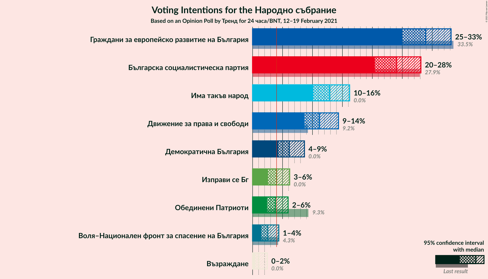

### Confidence Intervals

| Party | Last Result | Poll Result | 80% Confidence Interval | 90% Confidence Interval | 95% Confidence Interval | 99% Confidence Interval |
|:-----:|:-----------:|:-----------:|:-----------------------:|:-----------------------:|:-----------------------:|:-----------------------:|
| Граждани за европейско развитие на България | 33.5% | 28.9% | 26.3–31.7% |25.6–32.5% |25.0–33.2% |23.8–34.5% |
| Българска социалистическа партия | 27.9% | 24.1% | 21.7–26.7% |21.0–27.5% |20.4–28.1% |19.3–29.4% |
| Има такъв народ | 0.0% | 12.9% | 11.1–15.0% |10.6–15.7% |10.2–16.2% |9.3–17.3% |
| Движение за права и свободи | 9.2% | 11.2% | 9.5–13.2% |9.0–13.8% |8.6–14.3% |7.9–15.4% |
| Демократична България | 0.0% | 6.1% | 4.9–7.8% |4.6–8.2% |4.3–8.7% |3.8–9.5% |
| Изправи се Бг | 0.0% | 4.0% | 3.1–5.4% |2.8–5.8% |2.6–6.2% |2.2–6.9% |
| Обединени Патриоти | 9.3% | 3.8% | 2.9–5.2% |2.6–5.6% |2.4–5.9% |2.0–6.7% |
| Воля–Национален фронт за спасение на България | 4.3% | 2.5% | 1.8–3.7% |1.6–4.1% |1.5–4.4% |1.2–5.0% |
| Възраждане | 0.0% | 1.1% | 0.7–2.0% |0.5–2.2% |0.5–2.5% |0.3–3.0% |

*Note:* The poll result column reflects the actual value used in the calculations. Published results may vary slightly, and in addition be rounded to fewer digits.

## Seats

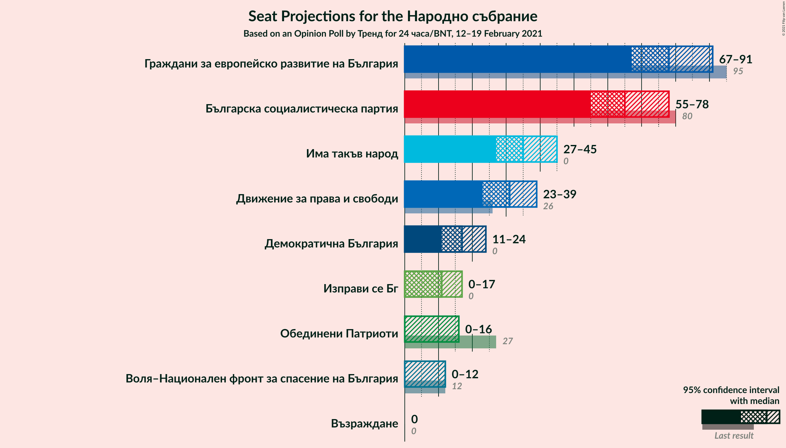

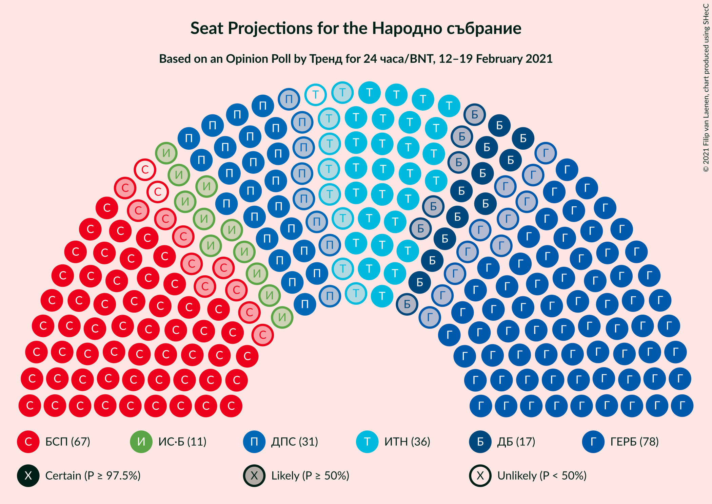

### Confidence Intervals

| Party | Last Result | Median | 80% Confidence Interval | 90% Confidence Interval | 95% Confidence Interval | 99% Confidence Interval |
|:-----:|:-----------:|:------:|:-----------------------:|:-----------------------:|:-----------------------:|:-----------------------:|
| <a href="#граждани-за-европейско-развитие-на-българия">Граждани за европейско развитие на България</a> | 95 | 78 | 71–88 |69–89 |67–91 |64–96 |
| <a href="#българска-социалистическа-партия">Българска социалистическа партия</a> | 80 | 65 | 58–73 |56–77 |55–78 |52–81 |
| <a href="#има-такъв-народ">Има такъв народ</a> | 0 | 35 | 30–41 |28–42 |27–45 |25–46 |
| <a href="#движение-за-права-и-свободи">Движение за права и свободи</a> | 26 | 31 | 25–36 |24–38 |23–39 |21–42 |
| <a href="#демократична-българия">Демократична България</a> | 0 | 17 | 13–21 |12–22 |11–24 |0–26 |
| <a href="#изправи-се-бг">Изправи се Бг</a> | 0 | 11 | 0–15 |0–16 |0–17 |0–18 |
| <a href="#обединени-патриоти">Обединени Патриоти</a> | 27 | 0 | 0–14 |0–15 |0–16 |0–18 |
| <a href="#воля–национален-фронт-за-спасение-на-българия">Воля–Национален фронт за спасение на България</a> | 12 | 0 | 0 |0 |0–12 |0–13 |
| <a href="#възраждане">Възраждане</a> | 0 | 0 | 0 |0 |0 |0 |

### Граждани за европейско развитие на България

*For a full overview of the results for this party, see the [Граждани за европейско развитие на България](party-гражданизаевропейскоразвитиенабългария.html) page.*

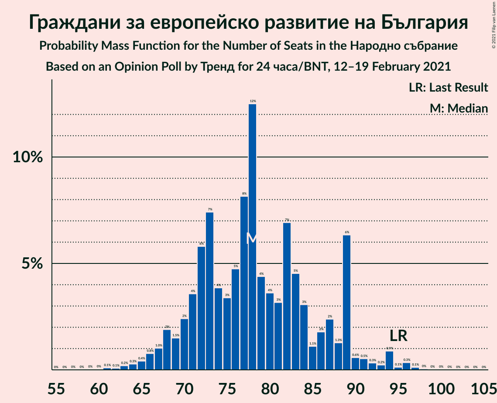

| Number of Seats | Probability | Accumulated | Special Marks |
|:---------------:|:-----------:|:-----------:|:-------------:|
| 59 | 0% | 100% |  |
| 60 | 0% | 99.9% |  |
| 61 | 0.1% | 99.9% |  |
| 62 | 0.1% | 99.8% |  |
| 63 | 0.2% | 99.7% |  |
| 64 | 0.3% | 99.5% |  |
| 65 | 0.4% | 99.3% |  |
| 66 | 0.8% | 98.9% |  |
| 67 | 1.0% | 98% |  |
| 68 | 2% | 97% |  |
| 69 | 1.5% | 95% |  |
| 70 | 2% | 94% |  |
| 71 | 4% | 91% |  |
| 72 | 6% | 88% |  |
| 73 | 7% | 82% |  |
| 74 | 4% | 74% |  |
| 75 | 3% | 71% |  |
| 76 | 5% | 67% |  |
| 77 | 8% | 62% |  |
| 78 | 12% | 54% | Median |
| 79 | 4% | 42% |  |
| 80 | 4% | 37% |  |
| 81 | 3% | 34% |  |
| 82 | 7% | 31% |  |
| 83 | 5% | 24% |  |
| 84 | 3% | 19% |  |
| 85 | 1.1% | 16% |  |
| 86 | 2% | 15% |  |
| 87 | 2% | 13% |  |
| 88 | 1.3% | 11% |  |
| 89 | 6% | 10% |  |
| 90 | 0.6% | 3% |  |
| 91 | 0.5% | 3% |  |
| 92 | 0.3% | 2% |  |
| 93 | 0.2% | 2% |  |
| 94 | 0.9% | 2% |  |
| 95 | 0.1% | 0.7% | Last Result |
| 96 | 0.3% | 0.6% |  |
| 97 | 0.1% | 0.2% |  |
| 98 | 0% | 0.1% |  |
| 99 | 0% | 0.1% |  |
| 100 | 0% | 0.1% |  |
| 101 | 0% | 0% |  |

### Българска социалистическа партия

*For a full overview of the results for this party, see the [Българска социалистическа партия](party-българскасоциалистическапартия.html) page.*

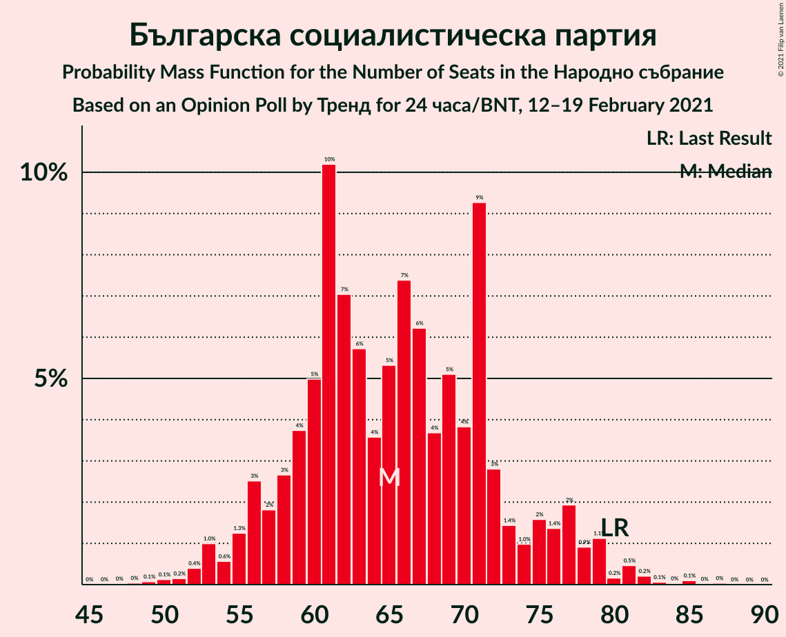

| Number of Seats | Probability | Accumulated | Special Marks |
|:---------------:|:-----------:|:-----------:|:-------------:|
| 48 | 0% | 100% |  |
| 49 | 0.1% | 99.9% |  |
| 50 | 0.1% | 99.8% |  |
| 51 | 0.2% | 99.7% |  |
| 52 | 0.4% | 99.6% |  |
| 53 | 1.0% | 99.2% |  |
| 54 | 0.6% | 98% |  |
| 55 | 1.3% | 98% |  |
| 56 | 3% | 96% |  |
| 57 | 2% | 94% |  |
| 58 | 3% | 92% |  |
| 59 | 4% | 89% |  |
| 60 | 5% | 86% |  |
| 61 | 10% | 81% |  |
| 62 | 7% | 70% |  |
| 63 | 6% | 63% |  |
| 64 | 4% | 58% |  |
| 65 | 5% | 54% | Median |
| 66 | 7% | 49% |  |
| 67 | 6% | 41% |  |
| 68 | 4% | 35% |  |
| 69 | 5% | 31% |  |
| 70 | 4% | 26% |  |
| 71 | 9% | 23% |  |
| 72 | 3% | 13% |  |
| 73 | 1.4% | 10% |  |
| 74 | 1.0% | 9% |  |
| 75 | 2% | 8% |  |
| 76 | 1.4% | 6% |  |
| 77 | 2% | 5% |  |
| 78 | 0.9% | 3% |  |
| 79 | 1.1% | 2% |  |
| 80 | 0.2% | 1.1% | Last Result |
| 81 | 0.5% | 0.9% |  |
| 82 | 0.2% | 0.5% |  |
| 83 | 0.1% | 0.3% |  |
| 84 | 0% | 0.2% |  |
| 85 | 0.1% | 0.2% |  |
| 86 | 0% | 0.1% |  |
| 87 | 0% | 0% |  |

### Има такъв народ

*For a full overview of the results for this party, see the [Има такъв народ](party-иматакъвнарод.html) page.*

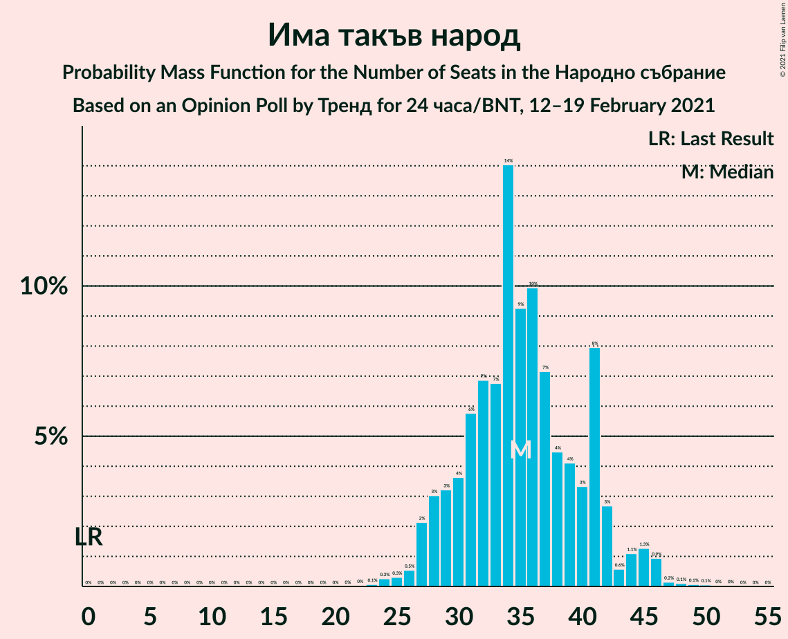

| Number of Seats | Probability | Accumulated | Special Marks |
|:---------------:|:-----------:|:-----------:|:-------------:|
| 0 | 0% | 100% | Last Result |
| 1 | 0% | 100% |  |
| 2 | 0% | 100% |  |
| 3 | 0% | 100% |  |
| 4 | 0% | 100% |  |
| 5 | 0% | 100% |  |
| 6 | 0% | 100% |  |
| 7 | 0% | 100% |  |
| 8 | 0% | 100% |  |
| 9 | 0% | 100% |  |
| 10 | 0% | 100% |  |
| 11 | 0% | 100% |  |
| 12 | 0% | 100% |  |
| 13 | 0% | 100% |  |
| 14 | 0% | 100% |  |
| 15 | 0% | 100% |  |
| 16 | 0% | 100% |  |
| 17 | 0% | 100% |  |
| 18 | 0% | 100% |  |
| 19 | 0% | 100% |  |
| 20 | 0% | 100% |  |
| 21 | 0% | 100% |  |
| 22 | 0% | 100% |  |
| 23 | 0.1% | 100% |  |
| 24 | 0.3% | 99.9% |  |
| 25 | 0.3% | 99.6% |  |
| 26 | 0.5% | 99.3% |  |
| 27 | 2% | 98.8% |  |
| 28 | 3% | 97% |  |
| 29 | 3% | 94% |  |
| 30 | 4% | 90% |  |
| 31 | 6% | 87% |  |
| 32 | 7% | 81% |  |
| 33 | 7% | 74% |  |
| 34 | 14% | 67% |  |
| 35 | 9% | 53% | Median |
| 36 | 10% | 44% |  |
| 37 | 7% | 34% |  |
| 38 | 4% | 27% |  |
| 39 | 4% | 22% |  |
| 40 | 3% | 18% |  |
| 41 | 8% | 15% |  |
| 42 | 3% | 7% |  |
| 43 | 0.6% | 4% |  |
| 44 | 1.1% | 4% |  |
| 45 | 1.3% | 3% |  |
| 46 | 0.9% | 1.4% |  |
| 47 | 0.2% | 0.5% |  |
| 48 | 0.1% | 0.3% |  |
| 49 | 0.1% | 0.2% |  |
| 50 | 0.1% | 0.1% |  |
| 51 | 0% | 0.1% |  |
| 52 | 0% | 0% |  |

### Движение за права и свободи

*For a full overview of the results for this party, see the [Движение за права и свободи](party-движениезаправаисвободи.html) page.*

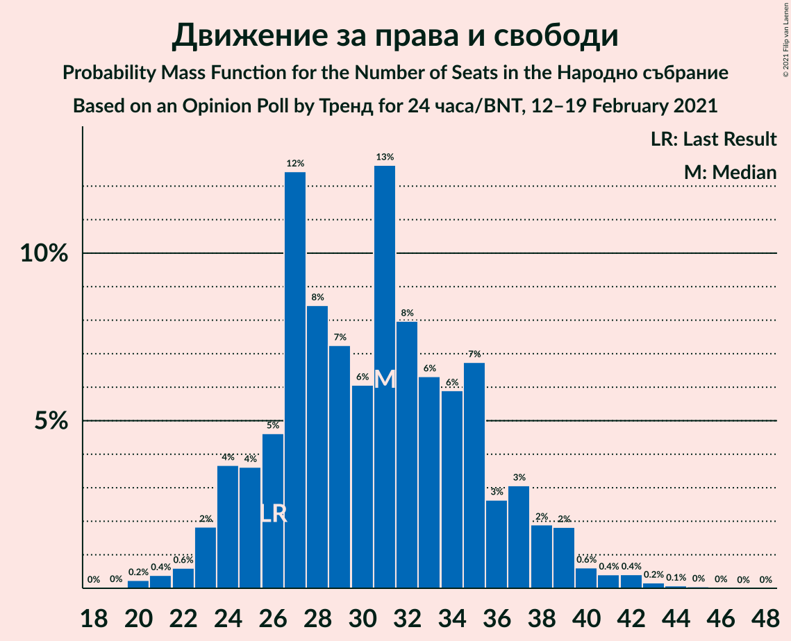

| Number of Seats | Probability | Accumulated | Special Marks |
|:---------------:|:-----------:|:-----------:|:-------------:|
| 19 | 0% | 100% |  |
| 20 | 0.2% | 99.9% |  |
| 21 | 0.4% | 99.7% |  |
| 22 | 0.6% | 99.3% |  |
| 23 | 2% | 98.7% |  |
| 24 | 4% | 97% |  |
| 25 | 4% | 93% |  |
| 26 | 5% | 90% | Last Result |
| 27 | 12% | 85% |  |
| 28 | 8% | 73% |  |
| 29 | 7% | 64% |  |
| 30 | 6% | 57% |  |
| 31 | 13% | 51% | Median |
| 32 | 8% | 38% |  |
| 33 | 6% | 30% |  |
| 34 | 6% | 24% |  |
| 35 | 7% | 18% |  |
| 36 | 3% | 11% |  |
| 37 | 3% | 9% |  |
| 38 | 2% | 5% |  |
| 39 | 2% | 4% |  |
| 40 | 0.6% | 2% |  |
| 41 | 0.4% | 1.2% |  |
| 42 | 0.4% | 0.8% |  |
| 43 | 0.2% | 0.3% |  |
| 44 | 0.1% | 0.2% |  |
| 45 | 0% | 0.1% |  |
| 46 | 0% | 0.1% |  |
| 47 | 0% | 0% |  |

### Демократична България

*For a full overview of the results for this party, see the [Демократична България](party-демократичнабългария.html) page.*

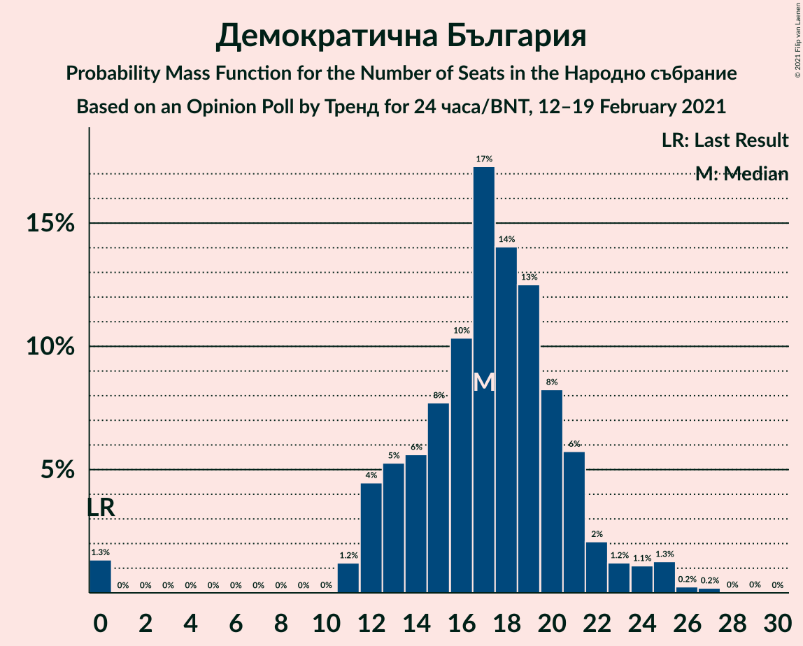

| Number of Seats | Probability | Accumulated | Special Marks |
|:---------------:|:-----------:|:-----------:|:-------------:|
| 0 | 1.3% | 100% | Last Result |
| 1 | 0% | 98.7% |  |
| 2 | 0% | 98.7% |  |
| 3 | 0% | 98.7% |  |
| 4 | 0% | 98.7% |  |
| 5 | 0% | 98.7% |  |
| 6 | 0% | 98.7% |  |
| 7 | 0% | 98.7% |  |
| 8 | 0% | 98.7% |  |
| 9 | 0% | 98.7% |  |
| 10 | 0% | 98.7% |  |
| 11 | 1.2% | 98.6% |  |
| 12 | 4% | 97% |  |
| 13 | 5% | 93% |  |
| 14 | 6% | 88% |  |
| 15 | 8% | 82% |  |
| 16 | 10% | 74% |  |
| 17 | 17% | 64% | Median |
| 18 | 14% | 47% |  |
| 19 | 13% | 33% |  |
| 20 | 8% | 20% |  |
| 21 | 6% | 12% |  |
| 22 | 2% | 6% |  |
| 23 | 1.2% | 4% |  |
| 24 | 1.1% | 3% |  |
| 25 | 1.3% | 2% |  |
| 26 | 0.2% | 0.5% |  |
| 27 | 0.2% | 0.3% |  |
| 28 | 0% | 0.1% |  |
| 29 | 0% | 0.1% |  |
| 30 | 0% | 0% |  |

### Изправи се Бг

*For a full overview of the results for this party, see the [Изправи се Бг](party-изправисебг.html) page.*

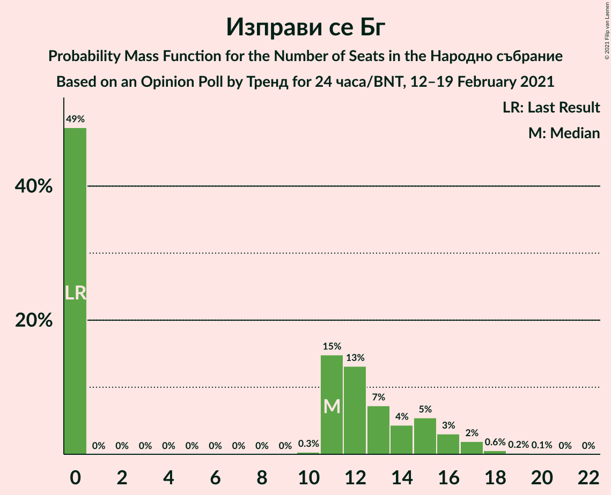

| Number of Seats | Probability | Accumulated | Special Marks |
|:---------------:|:-----------:|:-----------:|:-------------:|
| 0 | 49% | 100% | Last Result |
| 1 | 0% | 51% |  |
| 2 | 0% | 51% |  |
| 3 | 0% | 51% |  |
| 4 | 0% | 51% |  |
| 5 | 0% | 51% |  |
| 6 | 0% | 51% |  |
| 7 | 0% | 51% |  |
| 8 | 0% | 51% |  |
| 9 | 0% | 51% |  |
| 10 | 0.3% | 51% |  |
| 11 | 15% | 51% | Median |
| 12 | 13% | 36% |  |
| 13 | 7% | 23% |  |
| 14 | 4% | 16% |  |
| 15 | 5% | 11% |  |
| 16 | 3% | 6% |  |
| 17 | 2% | 3% |  |
| 18 | 0.6% | 0.9% |  |
| 19 | 0.2% | 0.3% |  |
| 20 | 0.1% | 0.2% |  |
| 21 | 0% | 0% |  |

### Обединени Патриоти

*For a full overview of the results for this party, see the [Обединени Патриоти](party-обединенипатриоти.html) page.*

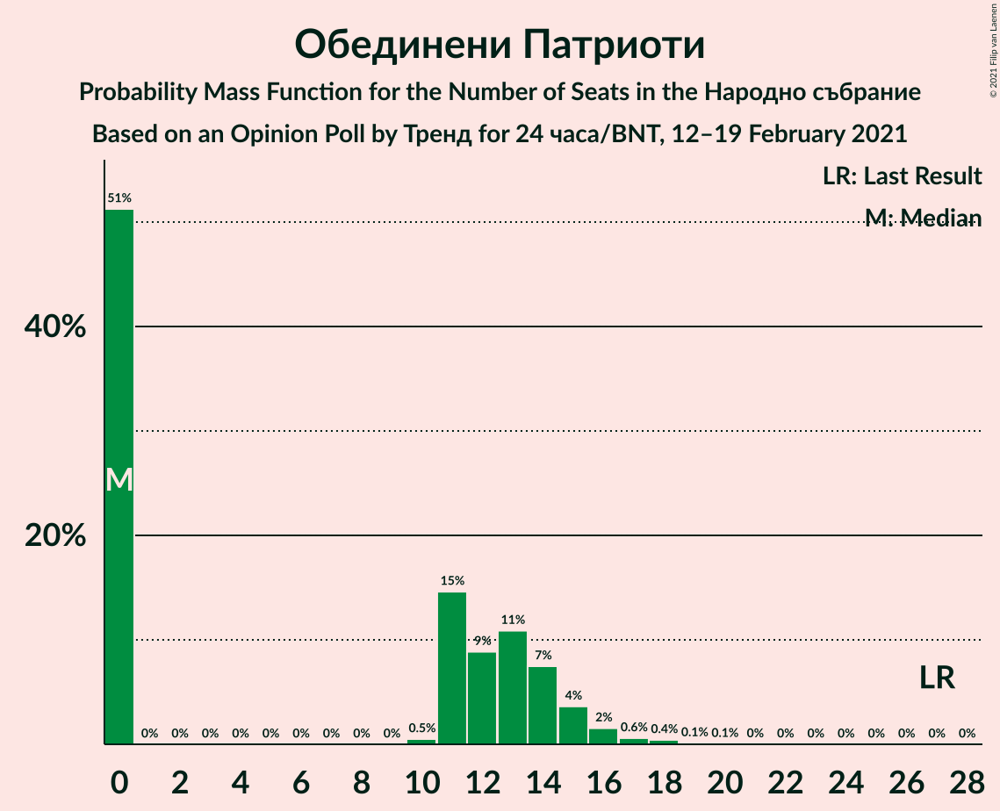

| Number of Seats | Probability | Accumulated | Special Marks |
|:---------------:|:-----------:|:-----------:|:-------------:|
| 0 | 51% | 100% | Median |
| 1 | 0% | 49% |  |
| 2 | 0% | 49% |  |
| 3 | 0% | 49% |  |
| 4 | 0% | 49% |  |
| 5 | 0% | 49% |  |
| 6 | 0% | 49% |  |
| 7 | 0% | 49% |  |
| 8 | 0% | 49% |  |
| 9 | 0% | 49% |  |
| 10 | 0.5% | 49% |  |
| 11 | 15% | 48% |  |
| 12 | 9% | 34% |  |
| 13 | 11% | 25% |  |
| 14 | 7% | 14% |  |
| 15 | 4% | 6% |  |
| 16 | 2% | 3% |  |
| 17 | 0.6% | 1.2% |  |
| 18 | 0.4% | 0.6% |  |
| 19 | 0.1% | 0.2% |  |
| 20 | 0.1% | 0.1% |  |
| 21 | 0% | 0% |  |
| 22 | 0% | 0% |  |
| 23 | 0% | 0% |  |
| 24 | 0% | 0% |  |
| 25 | 0% | 0% |  |
| 26 | 0% | 0% |  |
| 27 | 0% | 0% | Last Result |

### Воля–Национален фронт за спасение на България

*For a full overview of the results for this party, see the [Воля–Национален фронт за спасение на България](party-воля–националенфронтзаспасениенабългария.html) page.*

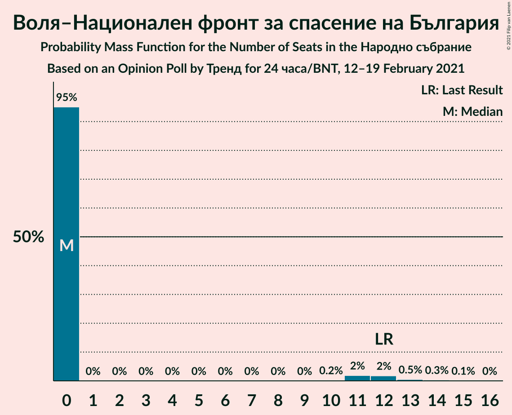

| Number of Seats | Probability | Accumulated | Special Marks |
|:---------------:|:-----------:|:-----------:|:-------------:|
| 0 | 95% | 100% | Median |
| 1 | 0% | 5% |  |
| 2 | 0% | 5% |  |
| 3 | 0% | 5% |  |
| 4 | 0% | 5% |  |
| 5 | 0% | 5% |  |
| 6 | 0% | 5% |  |
| 7 | 0% | 5% |  |
| 8 | 0% | 5% |  |
| 9 | 0% | 5% |  |
| 10 | 0.2% | 5% |  |
| 11 | 2% | 5% |  |
| 12 | 2% | 3% | Last Result |
| 13 | 0.5% | 1.0% |  |
| 14 | 0.3% | 0.5% |  |
| 15 | 0.1% | 0.1% |  |
| 16 | 0% | 0% |  |

### Възраждане

*For a full overview of the results for this party, see the [Възраждане](party-възраждане.html) page.*

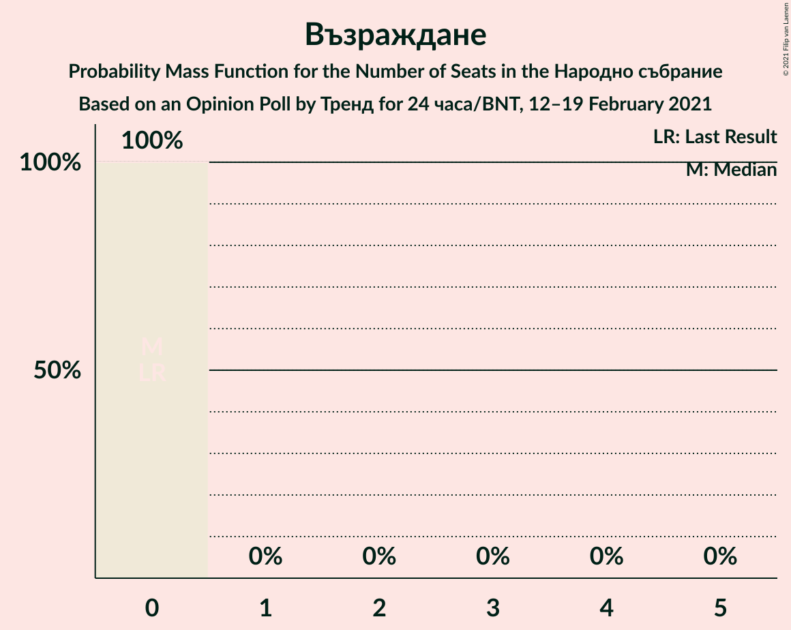

| Number of Seats | Probability | Accumulated | Special Marks |
|:---------------:|:-----------:|:-----------:|:-------------:|
| 0 | 100% | 100% | Last Result, Median |

## Coalitions

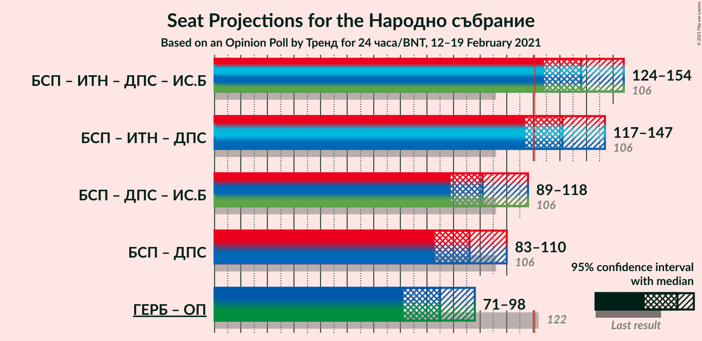

### Confidence Intervals

| Coalition | Last Result | Median | Majority? | 80% Confidence Interval | 90% Confidence Interval | 95% Confidence Interval | 99% Confidence Interval |
|:---------:|:-----------:|:------:|:---------:|:-----------------------:|:-----------------------:|:-----------------------:|:-----------------------:|
| Българска социалистическа партия – Има такъв народ – Движение за права и свободи – Изправи се Бг | 106 | 138 | 99.0% | 129–147 | 126–151 | 124–154 | 118–158 |
| Българска социалистическа партия – Има такъв народ – Движение за права и свободи | 106 | 131 | 92% | 121–141 | 119–145 | 117–147 | 113–151 |
| Българска социалистическа партия – Движение за права и свободи – Изправи се Бг | 106 | 101 | 1.1% | 93–113 | 91–115 | 89–118 | 84–122 |
| Българска социалистическа партия – Движение за права и свободи | 106 | 96 | 0% | 87–105 | 85–109 | 83–110 | 79–113 |
| Граждани за европейско развитие на България – Обединени Патриоти | 122 | 85 | 0% | 73–94 | 72–96 | 71–98 | 67–103 |

### Българска социалистическа партия – Има такъв народ – Движение за права и свободи – Изправи се Бг

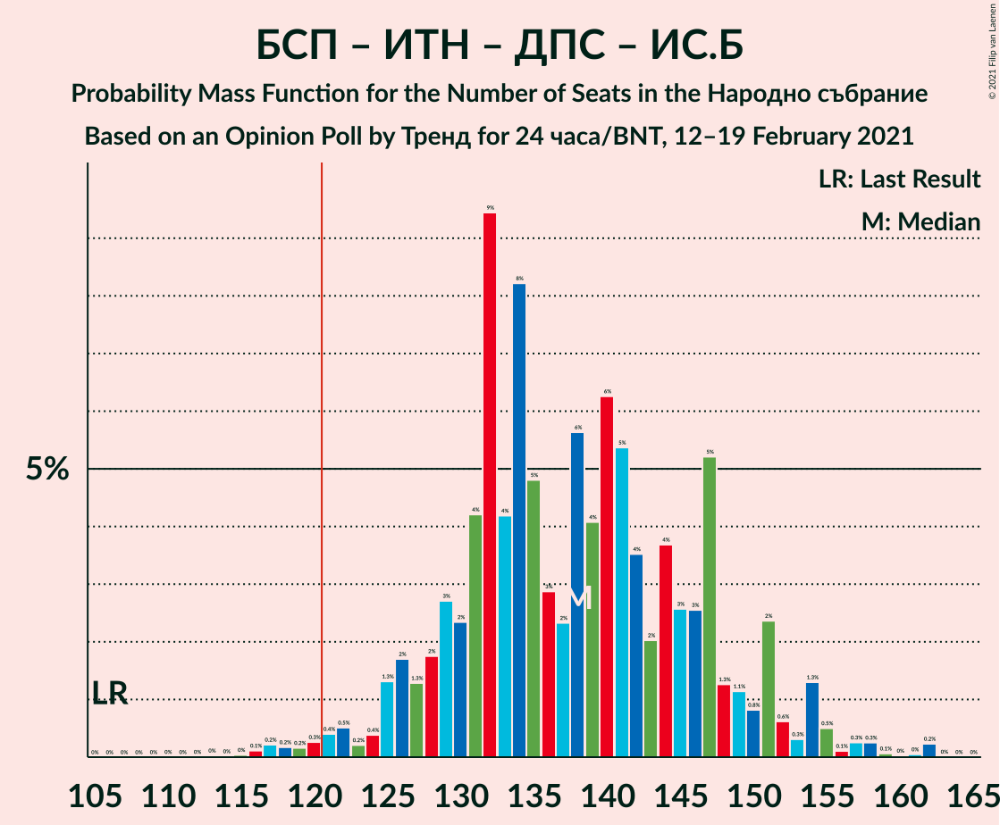

| Number of Seats | Probability | Accumulated | Special Marks |
|:---------------:|:-----------:|:-----------:|:-------------:|
| 106 | 0% | 100% | Last Result |
| 107 | 0% | 100% |  |
| 108 | 0% | 100% |  |
| 109 | 0% | 100% |  |
| 110 | 0% | 100% |  |
| 111 | 0% | 100% |  |
| 112 | 0% | 100% |  |
| 113 | 0% | 100% |  |
| 114 | 0% | 100% |  |
| 115 | 0% | 99.9% |  |
| 116 | 0.1% | 99.9% |  |
| 117 | 0.2% | 99.8% |  |
| 118 | 0.2% | 99.6% |  |
| 119 | 0.2% | 99.4% |  |
| 120 | 0.3% | 99.2% |  |
| 121 | 0.4% | 99.0% | Majority |
| 122 | 0.5% | 98.6% |  |
| 123 | 0.2% | 98% |  |
| 124 | 0.4% | 98% |  |
| 125 | 1.3% | 97% |  |
| 126 | 2% | 96% |  |
| 127 | 1.3% | 94% |  |
| 128 | 2% | 93% |  |
| 129 | 3% | 91% |  |
| 130 | 2% | 89% |  |
| 131 | 4% | 86% |  |
| 132 | 9% | 82% |  |
| 133 | 4% | 73% |  |
| 134 | 8% | 69% |  |
| 135 | 5% | 60% |  |
| 136 | 3% | 55% |  |
| 137 | 2% | 53% |  |
| 138 | 6% | 50% |  |
| 139 | 4% | 45% |  |
| 140 | 6% | 41% |  |
| 141 | 5% | 34% |  |
| 142 | 4% | 29% | Median |
| 143 | 2% | 25% |  |
| 144 | 4% | 23% |  |
| 145 | 3% | 20% |  |
| 146 | 3% | 17% |  |
| 147 | 5% | 15% |  |
| 148 | 1.3% | 9% |  |
| 149 | 1.1% | 8% |  |
| 150 | 0.8% | 7% |  |
| 151 | 2% | 6% |  |
| 152 | 0.6% | 4% |  |
| 153 | 0.3% | 3% |  |
| 154 | 1.3% | 3% |  |
| 155 | 0.5% | 2% |  |
| 156 | 0.1% | 1.0% |  |
| 157 | 0.3% | 0.9% |  |
| 158 | 0.3% | 0.7% |  |
| 159 | 0.1% | 0.4% |  |
| 160 | 0% | 0.3% |  |
| 161 | 0% | 0.3% |  |
| 162 | 0.2% | 0.3% |  |
| 163 | 0% | 0% |  |

### Българска социалистическа партия – Има такъв народ – Движение за права и свободи

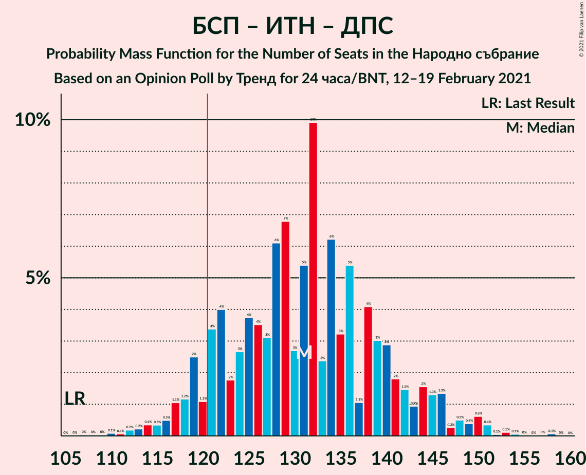

| Number of Seats | Probability | Accumulated | Special Marks |
|:---------------:|:-----------:|:-----------:|:-------------:|
| 106 | 0% | 100% | Last Result |
| 107 | 0% | 100% |  |
| 108 | 0% | 99.9% |  |
| 109 | 0% | 99.9% |  |
| 110 | 0.1% | 99.9% |  |
| 111 | 0.1% | 99.8% |  |
| 112 | 0.2% | 99.7% |  |
| 113 | 0.2% | 99.5% |  |
| 114 | 0.4% | 99.3% |  |
| 115 | 0.3% | 98.9% |  |
| 116 | 0.5% | 98.6% |  |
| 117 | 1.1% | 98% |  |
| 118 | 1.2% | 97% |  |
| 119 | 2% | 96% |  |
| 120 | 1.1% | 93% |  |
| 121 | 3% | 92% | Majority |
| 122 | 4% | 89% |  |
| 123 | 2% | 85% |  |
| 124 | 3% | 83% |  |
| 125 | 4% | 80% |  |
| 126 | 4% | 77% |  |
| 127 | 3% | 73% |  |
| 128 | 6% | 70% |  |
| 129 | 7% | 64% |  |
| 130 | 3% | 57% |  |
| 131 | 5% | 55% | Median |
| 132 | 10% | 49% |  |
| 133 | 2% | 39% |  |
| 134 | 6% | 37% |  |
| 135 | 3% | 31% |  |
| 136 | 5% | 27% |  |
| 137 | 1.1% | 22% |  |
| 138 | 4% | 21% |  |
| 139 | 3% | 17% |  |
| 140 | 3% | 14% |  |
| 141 | 2% | 11% |  |
| 142 | 1.5% | 9% |  |
| 143 | 0.9% | 8% |  |
| 144 | 2% | 7% |  |
| 145 | 1.3% | 5% |  |
| 146 | 1.3% | 4% |  |
| 147 | 0.3% | 3% |  |
| 148 | 0.5% | 2% |  |
| 149 | 0.4% | 2% |  |
| 150 | 0.6% | 1.3% |  |
| 151 | 0.4% | 0.7% |  |
| 152 | 0.1% | 0.4% |  |
| 153 | 0.1% | 0.3% |  |
| 154 | 0.1% | 0.2% |  |
| 155 | 0% | 0.1% |  |
| 156 | 0% | 0.1% |  |
| 157 | 0% | 0.1% |  |
| 158 | 0.1% | 0.1% |  |
| 159 | 0% | 0% |  |

### Българска социалистическа партия – Движение за права и свободи – Изправи се Бг

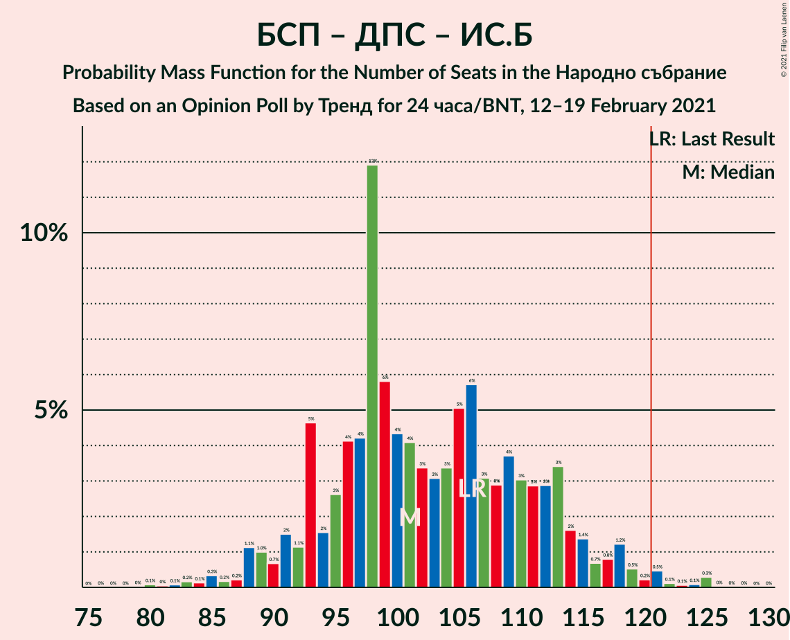

| Number of Seats | Probability | Accumulated | Special Marks |
|:---------------:|:-----------:|:-----------:|:-------------:|
| 80 | 0.1% | 100% |  |
| 81 | 0% | 99.9% |  |
| 82 | 0.1% | 99.8% |  |
| 83 | 0.2% | 99.8% |  |
| 84 | 0.1% | 99.6% |  |
| 85 | 0.3% | 99.5% |  |
| 86 | 0.2% | 99.1% |  |
| 87 | 0.2% | 99.0% |  |
| 88 | 1.1% | 98.7% |  |
| 89 | 1.0% | 98% |  |
| 90 | 0.7% | 97% |  |
| 91 | 2% | 96% |  |
| 92 | 1.1% | 94% |  |
| 93 | 5% | 93% |  |
| 94 | 2% | 89% |  |
| 95 | 3% | 87% |  |
| 96 | 4% | 84% |  |
| 97 | 4% | 80% |  |
| 98 | 12% | 76% |  |
| 99 | 6% | 64% |  |
| 100 | 4% | 58% |  |
| 101 | 4% | 54% |  |
| 102 | 3% | 50% |  |
| 103 | 3% | 47% |  |
| 104 | 3% | 44% |  |
| 105 | 5% | 40% |  |
| 106 | 6% | 35% | Last Result |
| 107 | 3% | 29% | Median |
| 108 | 3% | 26% |  |
| 109 | 4% | 23% |  |
| 110 | 3% | 20% |  |
| 111 | 3% | 17% |  |
| 112 | 3% | 14% |  |
| 113 | 3% | 11% |  |
| 114 | 2% | 8% |  |
| 115 | 1.4% | 6% |  |
| 116 | 0.7% | 5% |  |
| 117 | 0.8% | 4% |  |
| 118 | 1.2% | 3% |  |
| 119 | 0.5% | 2% |  |
| 120 | 0.2% | 1.3% |  |
| 121 | 0.5% | 1.1% | Majority |
| 122 | 0.1% | 0.6% |  |
| 123 | 0.1% | 0.5% |  |
| 124 | 0.1% | 0.4% |  |
| 125 | 0.3% | 0.4% |  |
| 126 | 0% | 0.1% |  |
| 127 | 0% | 0% |  |

### Българска социалистическа партия – Движение за права и свободи

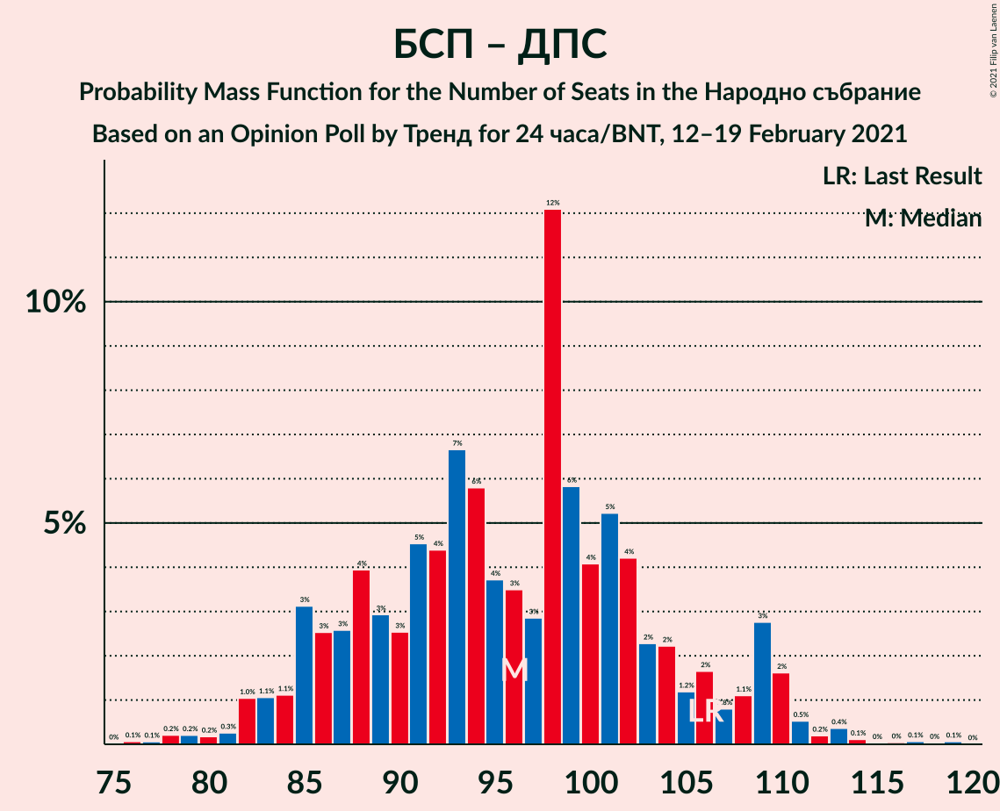

| Number of Seats | Probability | Accumulated | Special Marks |
|:---------------:|:-----------:|:-----------:|:-------------:|
| 75 | 0% | 100% |  |
| 76 | 0.1% | 99.9% |  |
| 77 | 0.1% | 99.9% |  |
| 78 | 0.2% | 99.8% |  |
| 79 | 0.2% | 99.6% |  |
| 80 | 0.2% | 99.4% |  |
| 81 | 0.3% | 99.2% |  |
| 82 | 1.0% | 98.9% |  |
| 83 | 1.1% | 98% |  |
| 84 | 1.1% | 97% |  |
| 85 | 3% | 96% |  |
| 86 | 3% | 93% |  |
| 87 | 3% | 90% |  |
| 88 | 4% | 87% |  |
| 89 | 3% | 84% |  |
| 90 | 3% | 81% |  |
| 91 | 5% | 78% |  |
| 92 | 4% | 74% |  |
| 93 | 7% | 69% |  |
| 94 | 6% | 62% |  |
| 95 | 4% | 57% |  |
| 96 | 3% | 53% | Median |
| 97 | 3% | 49% |  |
| 98 | 12% | 47% |  |
| 99 | 6% | 34% |  |
| 100 | 4% | 29% |  |
| 101 | 5% | 25% |  |
| 102 | 4% | 19% |  |
| 103 | 2% | 15% |  |
| 104 | 2% | 13% |  |
| 105 | 1.2% | 11% |  |
| 106 | 2% | 9% | Last Result |
| 107 | 0.8% | 8% |  |
| 108 | 1.1% | 7% |  |
| 109 | 3% | 6% |  |
| 110 | 2% | 3% |  |
| 111 | 0.5% | 1.5% |  |
| 112 | 0.2% | 0.9% |  |
| 113 | 0.4% | 0.8% |  |
| 114 | 0.1% | 0.4% |  |
| 115 | 0% | 0.3% |  |
| 116 | 0% | 0.2% |  |
| 117 | 0.1% | 0.2% |  |
| 118 | 0% | 0.1% |  |
| 119 | 0.1% | 0.1% |  |
| 120 | 0% | 0% |  |

### Граждани за европейско развитие на България – Обединени Патриоти

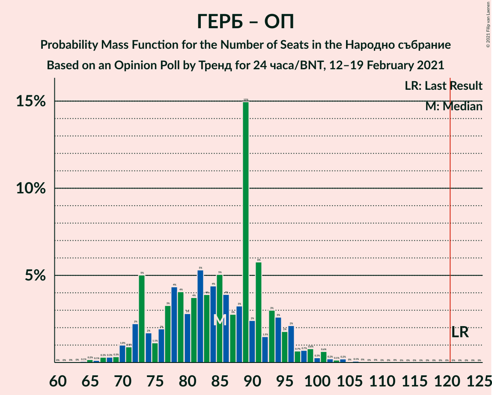

| Number of Seats | Probability | Accumulated | Special Marks |
|:---------------:|:-----------:|:-----------:|:-------------:|
| 63 | 0% | 100% |  |
| 64 | 0.1% | 99.9% |  |
| 65 | 0.2% | 99.9% |  |
| 66 | 0.1% | 99.7% |  |
| 67 | 0.3% | 99.6% |  |
| 68 | 0.3% | 99.3% |  |
| 69 | 0.3% | 99.0% |  |
| 70 | 1.0% | 98.6% |  |
| 71 | 0.9% | 98% |  |
| 72 | 2% | 97% |  |
| 73 | 5% | 95% |  |
| 74 | 2% | 89% |  |
| 75 | 1.1% | 88% |  |
| 76 | 2% | 87% |  |
| 77 | 3% | 85% |  |
| 78 | 4% | 81% | Median |
| 79 | 4% | 77% |  |
| 80 | 3% | 73% |  |
| 81 | 4% | 70% |  |
| 82 | 5% | 67% |  |
| 83 | 4% | 61% |  |
| 84 | 4% | 57% |  |
| 85 | 5% | 53% |  |
| 86 | 4% | 48% |  |
| 87 | 3% | 44% |  |
| 88 | 3% | 41% |  |
| 89 | 15% | 38% |  |
| 90 | 2% | 23% |  |
| 91 | 6% | 21% |  |
| 92 | 1.5% | 15% |  |
| 93 | 3% | 13% |  |
| 94 | 3% | 10% |  |
| 95 | 2% | 8% |  |
| 96 | 2% | 6% |  |
| 97 | 0.7% | 4% |  |
| 98 | 0.7% | 3% |  |
| 99 | 0.8% | 2% |  |
| 100 | 0.3% | 2% |  |
| 101 | 0.6% | 1.4% |  |
| 102 | 0.2% | 0.8% |  |
| 103 | 0.1% | 0.6% |  |
| 104 | 0.2% | 0.4% |  |
| 105 | 0% | 0.2% |  |
| 106 | 0.1% | 0.2% |  |
| 107 | 0% | 0.1% |  |
| 108 | 0% | 0.1% |  |
| 109 | 0% | 0.1% |  |
| 110 | 0% | 0% |  |
| 111 | 0% | 0% |  |
| 112 | 0% | 0% |  |
| 113 | 0% | 0% |  |
| 114 | 0% | 0% |  |
| 115 | 0% | 0% |  |
| 116 | 0% | 0% |  |
| 117 | 0% | 0% |  |
| 118 | 0% | 0% |  |
| 119 | 0% | 0% |  |
| 120 | 0% | 0% |  |
| 121 | 0% | 0% | Majority |
| 122 | 0% | 0% | Last Result |

## Technical Information

### Opinion Poll

+ **Polling firm:** Тренд
+ **Commissioner(s):** 24 часа/BNT
+ **Fieldwork period:** 12–19 February 2021

### Calculations

+ **Sample size:** 474
+ **Simulations done:** 1,048,576
+ **Error estimate:** 0.93%

