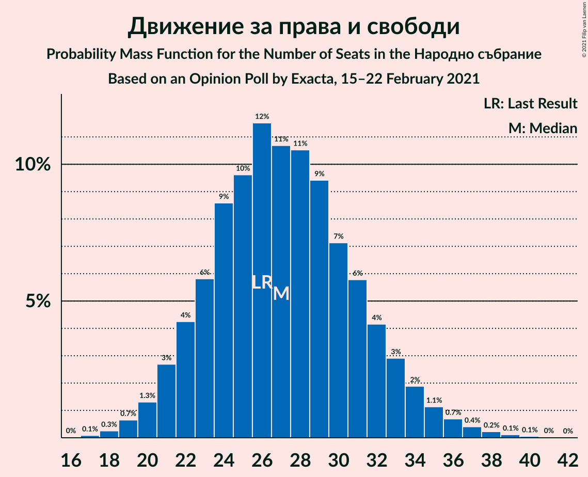
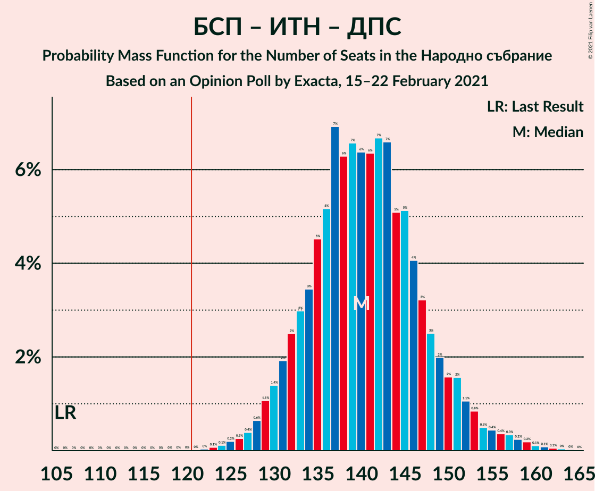
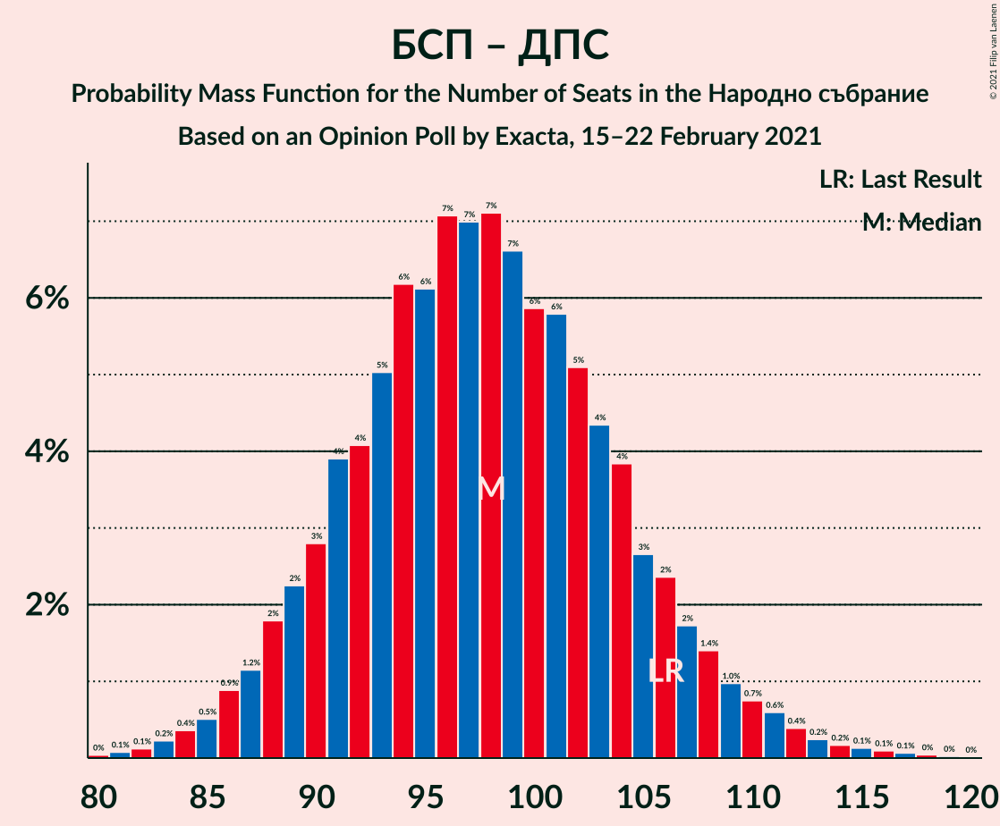

# Opinion Poll by Exacta, 15–22 February 2021

<a href="#voting-intentions">Voting Intentions</a> | <a href="#seats">Seats</a> | <a href="#coalitions">Coalitions</a> | <a href="#technical-information">Technical Information</a>

## Voting Intentions

### Confidence Intervals

| Party | Last Result | Poll Result | 80% Confidence Interval | 90% Confidence Interval | 95% Confidence Interval | 99% Confidence Interval |
|:-----:|:-----------:|:-----------:|:-----------------------:|:-----------------------:|:-----------------------:|:-----------------------:|
| Граждани за европейско развитие на България | 33.5% | 26.4% | 24.2–28.8% |23.5–29.4% |23.0–30.0% |22.0–31.2% |
| Българска социалистическа партия | 27.9% | 22.2% | 20.2–24.5% |19.6–25.1% |19.1–25.7% |18.1–26.8% |
| Има такъв народ | 0.0% | 13.4% | 11.8–15.4% |11.3–15.9% |10.9–16.4% |10.2–17.4% |
| Движение за права и свободи | 9.2% | 8.5% | 7.2–10.1% |6.8–10.5% |6.5–11.0% |5.9–11.8% |
| Демократична България | 0.0% | 5.1% | 4.1–6.5% |3.9–6.9% |3.6–7.2% |3.2–7.9% |

*Note:* The poll result column reflects the actual value used in the calculations. Published results may vary slightly, and in addition be rounded to fewer digits.

## Seats

### Confidence Intervals

| Party | Last Result | Median | 80% Confidence Interval | 90% Confidence Interval | 95% Confidence Interval | 99% Confidence Interval |
|:-----:|:-----------:|:------:|:-----------------------:|:-----------------------:|:-----------------------:|:-----------------------:|
| <a href="#граждани-за-европейско-развитие-на-българия">Граждани за европейско развитие на България</a> | 95 | 84 | 77–91 |75–94 |73–95 |70–99 |
| <a href="#българска-социалистическа-партия">Българска социалистическа партия</a> | 80 | 70 | 64–77 |62–80 |61–81 |58–85 |
| <a href="#има-такъв-народ">Има такъв народ</a> | 0 | 43 | 38–49 |36–50 |34–52 |32–55 |
| <a href="#движение-за-права-и-свободи">Движение за права и свободи</a> | 26 | 27 | 22–32 |21–33 |20–35 |19–37 |
| <a href="#демократична-българия">Демократична България</a> | 0 | 16 | 13–21 |0–22 |0–23 |0–25 |

### Граждани за европейско развитие на България

*For a full overview of the results for this party, see the [Граждани за европейско развитие на България](party-гражданизаевропейскоразвитиенабългария.html) page.*

| Number of Seats | Probability | Accumulated | Special Marks |
|:---------------:|:-----------:|:-----------:|:-------------:|
| 66 | 0% | 100% |  |
| 67 | 0.1% | 99.9% |  |
| 68 | 0.1% | 99.9% |  |
| 69 | 0.2% | 99.8% |  |
| 70 | 0.3% | 99.6% |  |
| 71 | 0.5% | 99.3% |  |
| 72 | 0.9% | 98.8% |  |
| 73 | 1.1% | 98% |  |
| 74 | 2% | 97% |  |
| 75 | 2% | 95% |  |
| 76 | 3% | 93% |  |
| 77 | 3% | 90% |  |
| 78 | 5% | 87% |  |
| 79 | 7% | 82% |  |
| 80 | 6% | 75% |  |
| 81 | 6% | 69% |  |
| 82 | 6% | 62% |  |
| 83 | 6% | 57% |  |
| 84 | 7% | 51% | Median |
| 85 | 7% | 44% |  |
| 86 | 6% | 37% |  |
| 87 | 6% | 31% |  |
| 88 | 4% | 25% |  |
| 89 | 5% | 21% |  |
| 90 | 3% | 16% |  |
| 91 | 3% | 13% |  |
| 92 | 2% | 10% |  |
| 93 | 2% | 7% |  |
| 94 | 2% | 5% |  |
| 95 | 1.0% | 3% | Last Result |
| 96 | 0.7% | 2% |  |
| 97 | 0.4% | 1.4% |  |
| 98 | 0.3% | 1.0% |  |
| 99 | 0.2% | 0.7% |  |
| 100 | 0.1% | 0.5% |  |
| 101 | 0.1% | 0.4% |  |
| 102 | 0.1% | 0.2% |  |
| 103 | 0% | 0.2% |  |
| 104 | 0.1% | 0.1% |  |
| 105 | 0% | 0% |  |

### Българска социалистическа партия

*For a full overview of the results for this party, see the [Българска социалистическа партия](party-българскасоциалистическапартия.html) page.*

| Number of Seats | Probability | Accumulated | Special Marks |
|:---------------:|:-----------:|:-----------:|:-------------:|
| 54 | 0% | 100% |  |
| 55 | 0% | 99.9% |  |
| 56 | 0.1% | 99.9% |  |
| 57 | 0.3% | 99.8% |  |
| 58 | 0.6% | 99.5% |  |
| 59 | 0.4% | 98.9% |  |
| 60 | 0.5% | 98% |  |
| 61 | 2% | 98% |  |
| 62 | 4% | 96% |  |
| 63 | 2% | 93% |  |
| 64 | 2% | 91% |  |
| 65 | 7% | 88% |  |
| 66 | 7% | 81% |  |
| 67 | 3% | 74% |  |
| 68 | 6% | 72% |  |
| 69 | 10% | 65% |  |
| 70 | 11% | 56% | Median |
| 71 | 3% | 45% |  |
| 72 | 7% | 41% |  |
| 73 | 11% | 35% |  |
| 74 | 3% | 24% |  |
| 75 | 3% | 21% |  |
| 76 | 4% | 18% |  |
| 77 | 5% | 14% |  |
| 78 | 4% | 10% |  |
| 79 | 0.8% | 6% |  |
| 80 | 2% | 5% | Last Result |
| 81 | 2% | 4% |  |
| 82 | 0.9% | 2% |  |
| 83 | 0.4% | 1.3% |  |
| 84 | 0.4% | 0.9% |  |
| 85 | 0.3% | 0.6% |  |
| 86 | 0.1% | 0.3% |  |
| 87 | 0% | 0.2% |  |
| 88 | 0.1% | 0.2% |  |
| 89 | 0.1% | 0.1% |  |
| 90 | 0% | 0.1% |  |
| 91 | 0% | 0% |  |

### Има такъв народ

*For a full overview of the results for this party, see the [Има такъв народ](party-иматакъвнарод.html) page.*

| Number of Seats | Probability | Accumulated | Special Marks |
|:---------------:|:-----------:|:-----------:|:-------------:|
| 0 | 0% | 100% | Last Result |
| 1 | 0% | 100% |  |
| 2 | 0% | 100% |  |
| 3 | 0% | 100% |  |
| 4 | 0% | 100% |  |
| 5 | 0% | 100% |  |
| 6 | 0% | 100% |  |
| 7 | 0% | 100% |  |
| 8 | 0% | 100% |  |
| 9 | 0% | 100% |  |
| 10 | 0% | 100% |  |
| 11 | 0% | 100% |  |
| 12 | 0% | 100% |  |
| 13 | 0% | 100% |  |
| 14 | 0% | 100% |  |
| 15 | 0% | 100% |  |
| 16 | 0% | 100% |  |
| 17 | 0% | 100% |  |
| 18 | 0% | 100% |  |
| 19 | 0% | 100% |  |
| 20 | 0% | 100% |  |
| 21 | 0% | 100% |  |
| 22 | 0% | 100% |  |
| 23 | 0% | 100% |  |
| 24 | 0% | 100% |  |
| 25 | 0% | 100% |  |
| 26 | 0% | 100% |  |
| 27 | 0% | 100% |  |
| 28 | 0% | 100% |  |
| 29 | 0% | 100% |  |
| 30 | 0.1% | 100% |  |
| 31 | 0.2% | 99.9% |  |
| 32 | 0.6% | 99.7% |  |
| 33 | 0.4% | 99.2% |  |
| 34 | 2% | 98.8% |  |
| 35 | 1.1% | 96% |  |
| 36 | 2% | 95% |  |
| 37 | 2% | 94% |  |
| 38 | 11% | 92% |  |
| 39 | 4% | 80% |  |
| 40 | 4% | 76% |  |
| 41 | 12% | 72% |  |
| 42 | 8% | 60% |  |
| 43 | 4% | 52% | Median |
| 44 | 14% | 48% |  |
| 45 | 11% | 34% |  |
| 46 | 2% | 23% |  |
| 47 | 3% | 21% |  |
| 48 | 5% | 18% |  |
| 49 | 6% | 13% |  |
| 50 | 2% | 7% |  |
| 51 | 2% | 5% |  |
| 52 | 1.2% | 3% |  |
| 53 | 0.4% | 1.4% |  |
| 54 | 0.4% | 1.1% |  |
| 55 | 0.4% | 0.7% |  |
| 56 | 0.1% | 0.3% |  |
| 57 | 0% | 0.2% |  |
| 58 | 0.1% | 0.1% |  |
| 59 | 0% | 0.1% |  |
| 60 | 0% | 0% |  |

### Движение за права и свободи

*For a full overview of the results for this party, see the [Движение за права и свободи](party-движениезаправаисвободи.html) page.*

| Number of Seats | Probability | Accumulated | Special Marks |
|:---------------:|:-----------:|:-----------:|:-------------:|
| 17 | 0.1% | 100% |  |
| 18 | 0.3% | 99.9% |  |
| 19 | 0.7% | 99.6% |  |
| 20 | 1.5% | 98.9% |  |
| 21 | 3% | 97% |  |
| 22 | 6% | 94% |  |
| 23 | 5% | 89% |  |
| 24 | 9% | 84% |  |
| 25 | 8% | 75% |  |
| 26 | 12% | 67% | Last Result |
| 27 | 11% | 55% | Median |
| 28 | 7% | 44% |  |
| 29 | 9% | 37% |  |
| 30 | 7% | 27% |  |
| 31 | 7% | 20% |  |
| 32 | 5% | 13% |  |
| 33 | 4% | 9% |  |
| 34 | 2% | 5% |  |
| 35 | 1.4% | 3% |  |
| 36 | 0.6% | 1.4% |  |
| 37 | 0.3% | 0.8% |  |
| 38 | 0.3% | 0.5% |  |
| 39 | 0.1% | 0.2% |  |
| 40 | 0% | 0.1% |  |
| 41 | 0% | 0% |  |

### Демократична България

*For a full overview of the results for this party, see the [Демократична България](party-демократичнабългария.html) page.*

| Number of Seats | Probability | Accumulated | Special Marks |
|:---------------:|:-----------:|:-----------:|:-------------:|
| 0 | 8% | 100% | Last Result |
| 1 | 0% | 92% |  |
| 2 | 0% | 92% |  |
| 3 | 0% | 92% |  |
| 4 | 0% | 92% |  |
| 5 | 0% | 92% |  |
| 6 | 0% | 92% |  |
| 7 | 0% | 92% |  |
| 8 | 0% | 92% |  |
| 9 | 0% | 92% |  |
| 10 | 0% | 92% |  |
| 11 | 0% | 92% |  |
| 12 | 0.1% | 92% |  |
| 13 | 5% | 92% |  |
| 14 | 11% | 87% |  |
| 15 | 13% | 76% |  |
| 16 | 15% | 63% | Median |
| 17 | 9% | 48% |  |
| 18 | 13% | 39% |  |
| 19 | 10% | 26% |  |
| 20 | 5% | 15% |  |
| 21 | 4% | 10% |  |
| 22 | 3% | 6% |  |
| 23 | 2% | 3% |  |
| 24 | 0.9% | 2% |  |
| 25 | 0.4% | 0.7% |  |
| 26 | 0.1% | 0.3% |  |
| 27 | 0.1% | 0.1% |  |
| 28 | 0% | 0.1% |  |
| 29 | 0% | 0% |  |

## Coalitions

### Confidence Intervals

| Coalition | Last Result | Median | Majority? | 80% Confidence Interval | 90% Confidence Interval | 95% Confidence Interval | 99% Confidence Interval |
|:---------:|:-----------:|:------:|:---------:|:-----------------------:|:-----------------------:|:-----------------------:|:-----------------------:|
| Българска социалистическа партия – Има такъв народ – Движение за права и свободи | 106 | 140 | 100% | 133–148 | 131–151 | 129–153 | 125–159 |
| Българска социалистическа партия – Движение за права и свободи | 106 | 98 | 0% | 91–106 | 88–107 | 87–110 | 84–115 |

### Българска социалистическа партия – Има такъв народ – Движение за права и свободи

| Number of Seats | Probability | Accumulated | Special Marks |
|:---------------:|:-----------:|:-----------:|:-------------:|
| 106 | 0% | 100% | Last Result |
| 107 | 0% | 100% |  |
| 108 | 0% | 100% |  |
| 109 | 0% | 100% |  |
| 110 | 0% | 100% |  |
| 111 | 0% | 100% |  |
| 112 | 0% | 100% |  |
| 113 | 0% | 100% |  |
| 114 | 0% | 100% |  |
| 115 | 0% | 100% |  |
| 116 | 0% | 100% |  |
| 117 | 0% | 100% |  |
| 118 | 0% | 100% |  |
| 119 | 0% | 100% |  |
| 120 | 0% | 100% |  |
| 121 | 0% | 100% | Majority |
| 122 | 0% | 100% |  |
| 123 | 0.1% | 99.9% |  |
| 124 | 0.1% | 99.8% |  |
| 125 | 0.2% | 99.7% |  |
| 126 | 0.3% | 99.5% |  |
| 127 | 0.6% | 99.1% |  |
| 128 | 0.2% | 98.6% |  |
| 129 | 1.0% | 98% |  |
| 130 | 2% | 97% |  |
| 131 | 2% | 96% |  |
| 132 | 3% | 94% |  |
| 133 | 5% | 91% |  |
| 134 | 2% | 86% |  |
| 135 | 2% | 84% |  |
| 136 | 5% | 82% |  |
| 137 | 9% | 77% |  |
| 138 | 7% | 68% |  |
| 139 | 6% | 60% |  |
| 140 | 8% | 54% | Median |
| 141 | 3% | 46% |  |
| 142 | 6% | 43% |  |
| 143 | 7% | 38% |  |
| 144 | 6% | 31% |  |
| 145 | 5% | 25% |  |
| 146 | 5% | 20% |  |
| 147 | 4% | 15% |  |
| 148 | 2% | 11% |  |
| 149 | 1.5% | 9% |  |
| 150 | 2% | 8% |  |
| 151 | 2% | 6% |  |
| 152 | 1.2% | 4% |  |
| 153 | 0.8% | 3% |  |
| 154 | 0.5% | 2% |  |
| 155 | 0.3% | 2% |  |
| 156 | 0.2% | 1.4% |  |
| 157 | 0.2% | 1.3% |  |
| 158 | 0.3% | 1.0% |  |
| 159 | 0.3% | 0.8% |  |
| 160 | 0.2% | 0.5% |  |
| 161 | 0.1% | 0.3% |  |
| 162 | 0.1% | 0.2% |  |
| 163 | 0% | 0.1% |  |
| 164 | 0% | 0% |  |

### Българска социалистическа партия – Движение за права и свободи

| Number of Seats | Probability | Accumulated | Special Marks |
|:---------------:|:-----------:|:-----------:|:-------------:|
| 80 | 0.1% | 100% |  |
| 81 | 0.1% | 99.9% |  |
| 82 | 0.1% | 99.8% |  |
| 83 | 0.1% | 99.7% |  |
| 84 | 0.6% | 99.6% |  |
| 85 | 0.3% | 99.1% |  |
| 86 | 1.2% | 98.7% |  |
| 87 | 2% | 98% |  |
| 88 | 2% | 95% |  |
| 89 | 0.9% | 93% |  |
| 90 | 2% | 92% |  |
| 91 | 3% | 91% |  |
| 92 | 6% | 87% |  |
| 93 | 7% | 82% |  |
| 94 | 9% | 75% |  |
| 95 | 6% | 66% |  |
| 96 | 5% | 60% |  |
| 97 | 4% | 55% | Median |
| 98 | 5% | 51% |  |
| 99 | 9% | 46% |  |
| 100 | 8% | 38% |  |
| 101 | 6% | 30% |  |
| 102 | 5% | 24% |  |
| 103 | 3% | 19% |  |
| 104 | 3% | 16% |  |
| 105 | 2% | 12% |  |
| 106 | 3% | 10% | Last Result |
| 107 | 3% | 8% |  |
| 108 | 1.5% | 5% |  |
| 109 | 0.8% | 3% |  |
| 110 | 0.4% | 3% |  |
| 111 | 0.8% | 2% |  |
| 112 | 0.4% | 1.4% |  |
| 113 | 0.2% | 1.0% |  |
| 114 | 0.2% | 0.7% |  |
| 115 | 0.2% | 0.5% |  |
| 116 | 0.1% | 0.3% |  |
| 117 | 0% | 0.2% |  |
| 118 | 0% | 0.1% |  |
| 119 | 0% | 0.1% |  |
| 120 | 0% | 0% |  |

## Technical Information

### Opinion Poll

+ **Polling firm:** Exacta
+ **Commissioner(s):** —
+ **Fieldwork period:** 15–22 February 2021

### Calculations

+ **Sample size:** 603
+ **Simulations done:** 131,072
+ **Error estimate:** 1.05%

