# Opinion Poll by Маркет ЛИНКС for bTV, 17–24 February 2021

<a href="#voting-intentions">Voting Intentions</a> | <a href="#seats">Seats</a> | <a href="#coalitions">Coalitions</a> | <a href="#technical-information">Technical Information</a>

## Voting Intentions

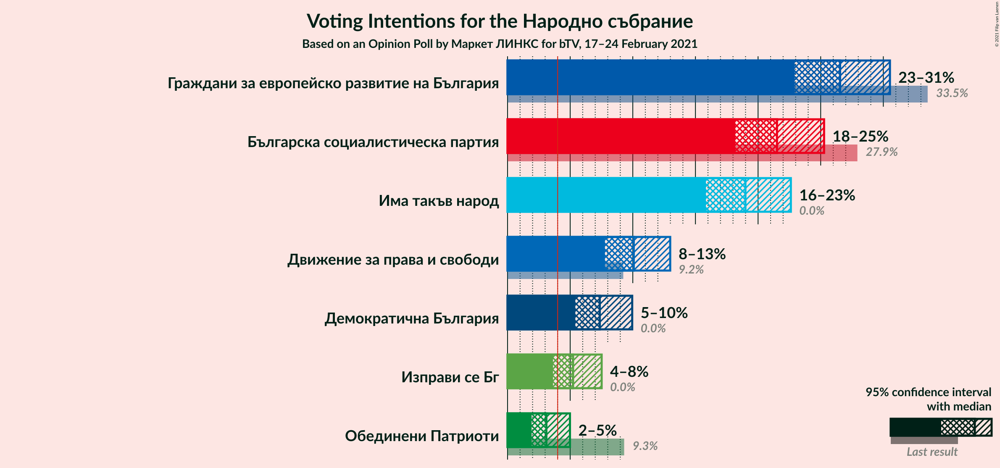

### Confidence Intervals

| Party | Last Result | Poll Result | 80% Confidence Interval | 90% Confidence Interval | 95% Confidence Interval | 99% Confidence Interval |
|:-----:|:-----------:|:-----------:|:-----------------------:|:-----------------------:|:-----------------------:|:-----------------------:|
| Граждани за европейско развитие на България | 33.5% | 26.6% | 24.2–29.2% |23.5–29.9% |22.9–30.5% |21.8–31.8% |
| Българска социалистическа партия | 27.9% | 21.5% | 19.3–24.0% |18.7–24.7% |18.2–25.3% |17.2–26.5% |
| Има такъв народ | 0.0% | 19.0% | 16.9–21.4% |16.3–22.0% |15.8–22.6% |14.9–23.8% |
| Движение за права и свободи | 9.2% | 10.1% | 8.6–12.0% |8.1–12.5% |7.8–13.0% |7.1–13.9% |
| Демократична България | 0.0% | 7.4% | 6.1–9.1% |5.7–9.5% |5.4–10.0% |4.8–10.8% |
| Изправи се Бг | 0.0% | 5.2% | 4.2–6.7% |3.9–7.1% |3.6–7.5% |3.2–8.3% |
| Обединени Патриоти | 9.3% | 3.1% | 2.3–4.3% |2.1–4.7% |1.9–5.0% |1.6–5.6% |

*Note:* The poll result column reflects the actual value used in the calculations. Published results may vary slightly, and in addition be rounded to fewer digits.

## Seats

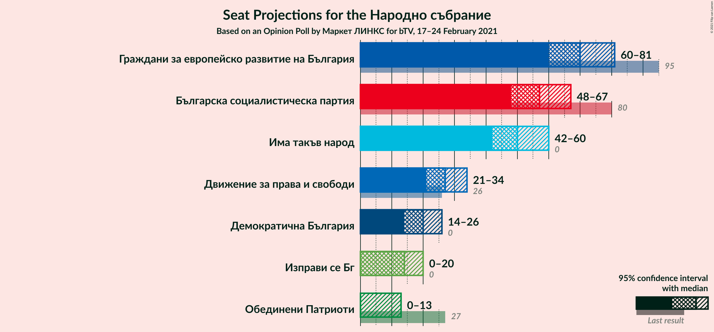

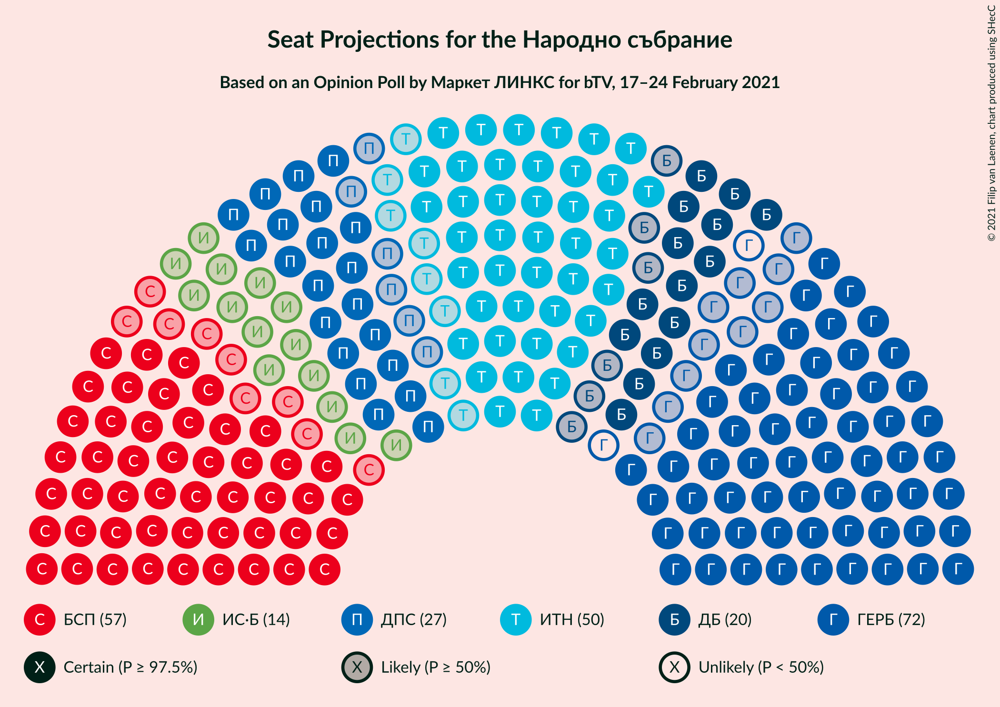

### Confidence Intervals

| Party | Last Result | Median | 80% Confidence Interval | 90% Confidence Interval | 95% Confidence Interval | 99% Confidence Interval |
|:-----:|:-----------:|:------:|:-----------------------:|:-----------------------:|:-----------------------:|:-----------------------:|
| <a href="#граждани-за-европейско-развитие-на-българия">Граждани за европейско развитие на България</a> | 95 | 70 | 64–77 |62–79 |60–81 |57–84 |
| <a href="#българска-социалистическа-партия">Българска социалистическа партия</a> | 80 | 57 | 51–63 |49–65 |48–67 |45–70 |
| <a href="#има-такъв-народ">Има такъв народ</a> | 0 | 50 | 45–56 |43–58 |42–60 |39–63 |
| <a href="#движение-за-права-и-свободи">Движение за права и свободи</a> | 26 | 27 | 23–32 |21–33 |21–34 |19–37 |
| <a href="#демократична-българия">Демократична България</a> | 0 | 20 | 16–24 |15–25 |14–26 |13–29 |
| <a href="#изправи-се-бг">Изправи се Бг</a> | 0 | 14 | 11–18 |0–19 |0–20 |0–22 |
| <a href="#обединени-патриоти">Обединени Патриоти</a> | 27 | 0 | 0–11 |0–12 |0–13 |0–14 |

### Граждани за европейско развитие на България

*For a full overview of the results for this party, see the [Граждани за европейско развитие на България](party-гражданизаевропейскоразвитиенабългария.html) page.*

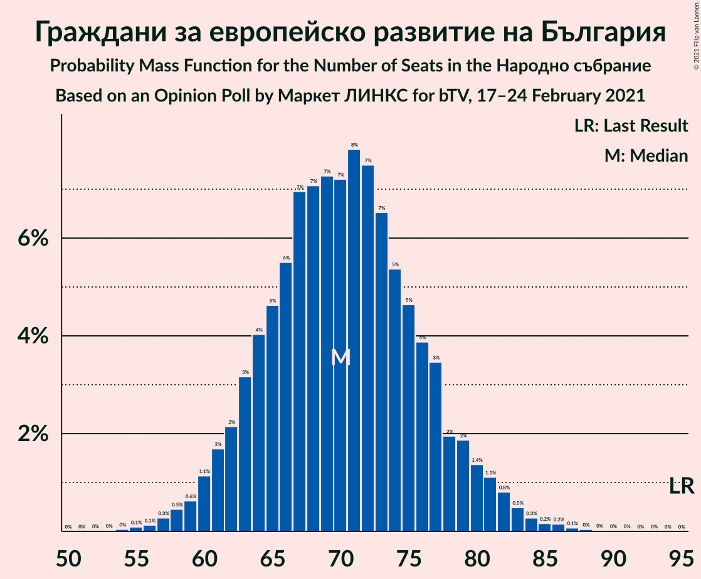

| Number of Seats | Probability | Accumulated | Special Marks |
|:---------------:|:-----------:|:-----------:|:-------------:|
| 54 | 0% | 100% |  |
| 55 | 0.1% | 99.9% |  |
| 56 | 0.1% | 99.8% |  |
| 57 | 0.3% | 99.7% |  |
| 58 | 0.5% | 99.4% |  |
| 59 | 0.6% | 99.0% |  |
| 60 | 1.1% | 98% |  |
| 61 | 2% | 97% |  |
| 62 | 2% | 96% |  |
| 63 | 3% | 93% |  |
| 64 | 4% | 90% |  |
| 65 | 5% | 86% |  |
| 66 | 6% | 82% |  |
| 67 | 7% | 76% |  |
| 68 | 7% | 69% |  |
| 69 | 7% | 62% |  |
| 70 | 7% | 55% | Median |
| 71 | 8% | 48% |  |
| 72 | 7% | 40% |  |
| 73 | 7% | 32% |  |
| 74 | 5% | 26% |  |
| 75 | 5% | 20% |  |
| 76 | 4% | 16% |  |
| 77 | 3% | 12% |  |
| 78 | 2% | 8% |  |
| 79 | 2% | 6% |  |
| 80 | 1.4% | 5% |  |
| 81 | 1.1% | 3% |  |
| 82 | 0.8% | 2% |  |
| 83 | 0.5% | 1.2% |  |
| 84 | 0.3% | 0.8% |  |
| 85 | 0.2% | 0.5% |  |
| 86 | 0.2% | 0.3% |  |
| 87 | 0.1% | 0.2% |  |
| 88 | 0% | 0.1% |  |
| 89 | 0% | 0.1% |  |
| 90 | 0% | 0% |  |
| 91 | 0% | 0% |  |
| 92 | 0% | 0% |  |
| 93 | 0% | 0% |  |
| 94 | 0% | 0% |  |
| 95 | 0% | 0% | Last Result |

### Българска социалистическа партия

*For a full overview of the results for this party, see the [Българска социалистическа партия](party-българскасоциалистическапартия.html) page.*

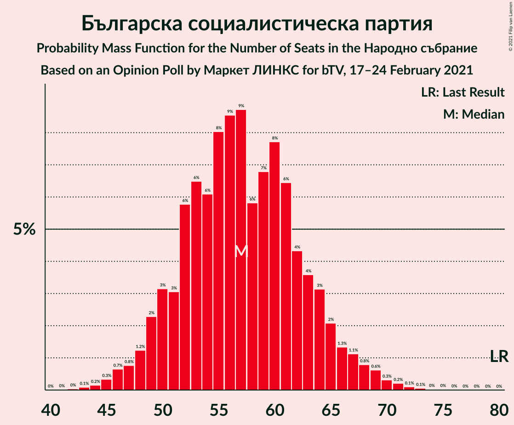

| Number of Seats | Probability | Accumulated | Special Marks |
|:---------------:|:-----------:|:-----------:|:-------------:|
| 42 | 0% | 100% |  |
| 43 | 0.1% | 99.9% |  |
| 44 | 0.2% | 99.8% |  |
| 45 | 0.3% | 99.7% |  |
| 46 | 0.7% | 99.4% |  |
| 47 | 0.8% | 98.7% |  |
| 48 | 1.2% | 98% |  |
| 49 | 2% | 97% |  |
| 50 | 3% | 94% |  |
| 51 | 3% | 91% |  |
| 52 | 6% | 88% |  |
| 53 | 6% | 82% |  |
| 54 | 6% | 76% |  |
| 55 | 8% | 70% |  |
| 56 | 9% | 62% |  |
| 57 | 9% | 53% | Median |
| 58 | 6% | 45% |  |
| 59 | 7% | 39% |  |
| 60 | 8% | 32% |  |
| 61 | 6% | 24% |  |
| 62 | 4% | 18% |  |
| 63 | 4% | 13% |  |
| 64 | 3% | 10% |  |
| 65 | 2% | 7% |  |
| 66 | 1.3% | 5% |  |
| 67 | 1.1% | 3% |  |
| 68 | 0.8% | 2% |  |
| 69 | 0.6% | 1.4% |  |
| 70 | 0.3% | 0.8% |  |
| 71 | 0.2% | 0.4% |  |
| 72 | 0.1% | 0.2% |  |
| 73 | 0.1% | 0.1% |  |
| 74 | 0% | 0.1% |  |
| 75 | 0% | 0% |  |
| 76 | 0% | 0% |  |
| 77 | 0% | 0% |  |
| 78 | 0% | 0% |  |
| 79 | 0% | 0% |  |
| 80 | 0% | 0% | Last Result |

### Има такъв народ

*For a full overview of the results for this party, see the [Има такъв народ](party-иматакъвнарод.html) page.*

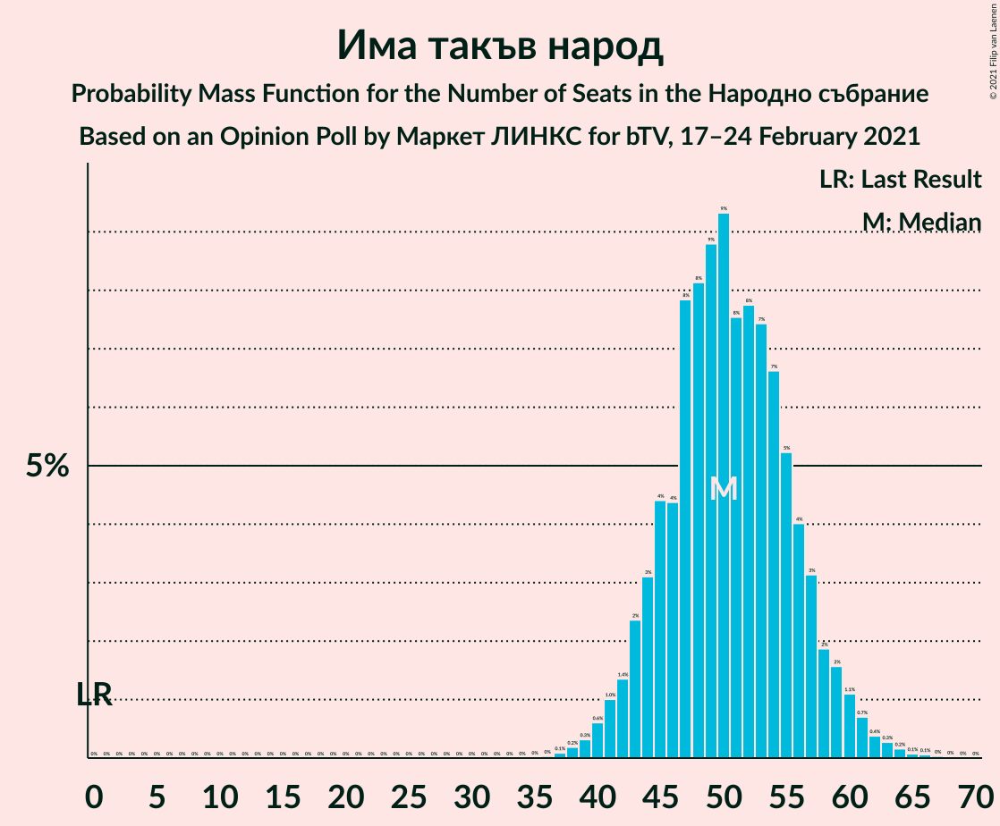

| Number of Seats | Probability | Accumulated | Special Marks |
|:---------------:|:-----------:|:-----------:|:-------------:|
| 0 | 0% | 100% | Last Result |
| 1 | 0% | 100% |  |
| 2 | 0% | 100% |  |
| 3 | 0% | 100% |  |
| 4 | 0% | 100% |  |
| 5 | 0% | 100% |  |
| 6 | 0% | 100% |  |
| 7 | 0% | 100% |  |
| 8 | 0% | 100% |  |
| 9 | 0% | 100% |  |
| 10 | 0% | 100% |  |
| 11 | 0% | 100% |  |
| 12 | 0% | 100% |  |
| 13 | 0% | 100% |  |
| 14 | 0% | 100% |  |
| 15 | 0% | 100% |  |
| 16 | 0% | 100% |  |
| 17 | 0% | 100% |  |
| 18 | 0% | 100% |  |
| 19 | 0% | 100% |  |
| 20 | 0% | 100% |  |
| 21 | 0% | 100% |  |
| 22 | 0% | 100% |  |
| 23 | 0% | 100% |  |
| 24 | 0% | 100% |  |
| 25 | 0% | 100% |  |
| 26 | 0% | 100% |  |
| 27 | 0% | 100% |  |
| 28 | 0% | 100% |  |
| 29 | 0% | 100% |  |
| 30 | 0% | 100% |  |
| 31 | 0% | 100% |  |
| 32 | 0% | 100% |  |
| 33 | 0% | 100% |  |
| 34 | 0% | 100% |  |
| 35 | 0% | 100% |  |
| 36 | 0% | 100% |  |
| 37 | 0.1% | 99.9% |  |
| 38 | 0.2% | 99.9% |  |
| 39 | 0.3% | 99.7% |  |
| 40 | 0.6% | 99.3% |  |
| 41 | 1.0% | 98.7% |  |
| 42 | 1.4% | 98% |  |
| 43 | 2% | 96% |  |
| 44 | 3% | 94% |  |
| 45 | 4% | 91% |  |
| 46 | 4% | 86% |  |
| 47 | 8% | 82% |  |
| 48 | 8% | 74% |  |
| 49 | 9% | 66% |  |
| 50 | 9% | 57% | Median |
| 51 | 8% | 48% |  |
| 52 | 8% | 40% |  |
| 53 | 7% | 33% |  |
| 54 | 7% | 25% |  |
| 55 | 5% | 19% |  |
| 56 | 4% | 13% |  |
| 57 | 3% | 9% |  |
| 58 | 2% | 6% |  |
| 59 | 2% | 4% |  |
| 60 | 1.1% | 3% |  |
| 61 | 0.7% | 2% |  |
| 62 | 0.4% | 1.0% |  |
| 63 | 0.3% | 0.6% |  |
| 64 | 0.2% | 0.4% |  |
| 65 | 0.1% | 0.2% |  |
| 66 | 0.1% | 0.1% |  |
| 67 | 0% | 0.1% |  |
| 68 | 0% | 0% |  |

### Движение за права и свободи

*For a full overview of the results for this party, see the [Движение за права и свободи](party-движениезаправаисвободи.html) page.*

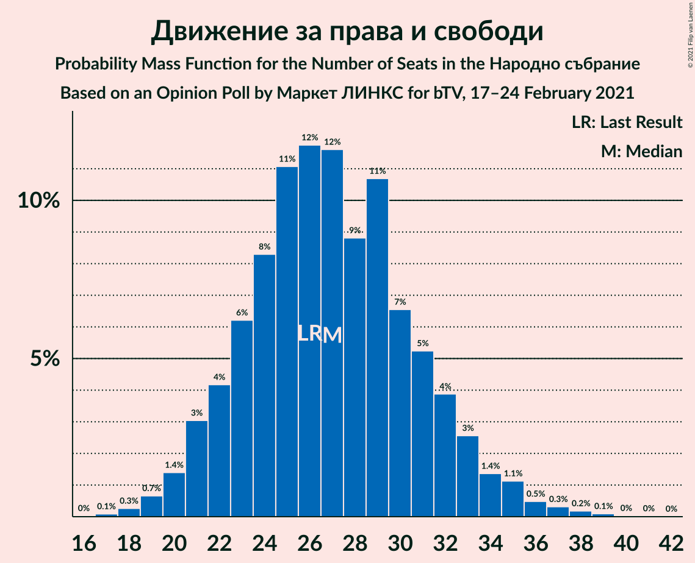

| Number of Seats | Probability | Accumulated | Special Marks |
|:---------------:|:-----------:|:-----------:|:-------------:|
| 17 | 0.1% | 100% |  |
| 18 | 0.3% | 99.9% |  |
| 19 | 0.7% | 99.6% |  |
| 20 | 1.4% | 99.0% |  |
| 21 | 3% | 98% |  |
| 22 | 4% | 95% |  |
| 23 | 6% | 90% |  |
| 24 | 8% | 84% |  |
| 25 | 11% | 76% |  |
| 26 | 12% | 65% | Last Result |
| 27 | 12% | 53% | Median |
| 28 | 9% | 41% |  |
| 29 | 11% | 33% |  |
| 30 | 7% | 22% |  |
| 31 | 5% | 15% |  |
| 32 | 4% | 10% |  |
| 33 | 3% | 6% |  |
| 34 | 1.4% | 4% |  |
| 35 | 1.1% | 2% |  |
| 36 | 0.5% | 1.2% |  |
| 37 | 0.3% | 0.7% |  |
| 38 | 0.2% | 0.4% |  |
| 39 | 0.1% | 0.2% |  |
| 40 | 0% | 0.1% |  |
| 41 | 0% | 0% |  |

### Демократична България

*For a full overview of the results for this party, see the [Демократична България](party-демократичнабългария.html) page.*

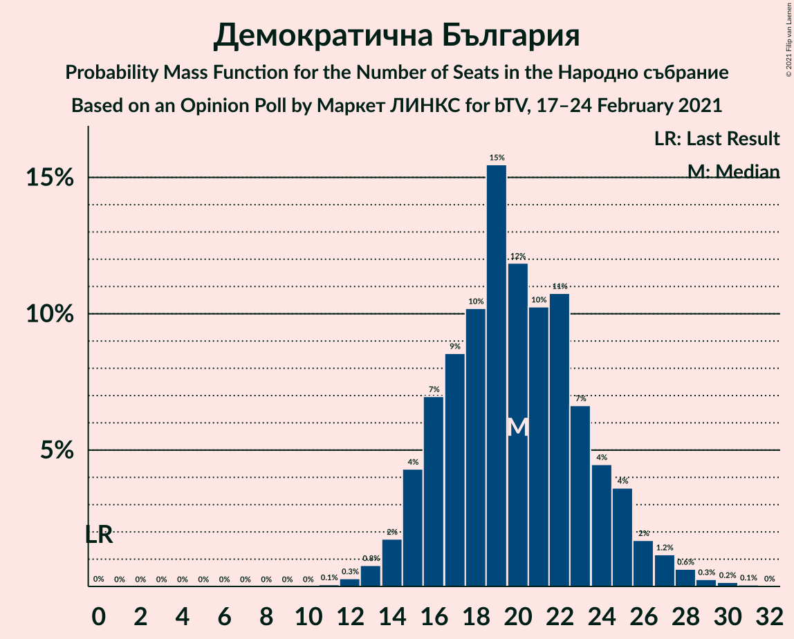

| Number of Seats | Probability | Accumulated | Special Marks |
|:---------------:|:-----------:|:-----------:|:-------------:|
| 0 | 0% | 100% | Last Result |
| 1 | 0% | 100% |  |
| 2 | 0% | 100% |  |
| 3 | 0% | 100% |  |
| 4 | 0% | 100% |  |
| 5 | 0% | 100% |  |
| 6 | 0% | 100% |  |
| 7 | 0% | 100% |  |
| 8 | 0% | 100% |  |
| 9 | 0% | 100% |  |
| 10 | 0% | 100% |  |
| 11 | 0.1% | 100% |  |
| 12 | 0.3% | 99.9% |  |
| 13 | 0.8% | 99.6% |  |
| 14 | 2% | 98.8% |  |
| 15 | 4% | 97% |  |
| 16 | 7% | 93% |  |
| 17 | 9% | 86% |  |
| 18 | 10% | 77% |  |
| 19 | 15% | 67% |  |
| 20 | 12% | 52% | Median |
| 21 | 10% | 40% |  |
| 22 | 11% | 29% |  |
| 23 | 7% | 19% |  |
| 24 | 4% | 12% |  |
| 25 | 4% | 8% |  |
| 26 | 2% | 4% |  |
| 27 | 1.2% | 2% |  |
| 28 | 0.6% | 1.2% |  |
| 29 | 0.3% | 0.5% |  |
| 30 | 0.2% | 0.3% |  |
| 31 | 0.1% | 0.1% |  |
| 32 | 0% | 0% |  |

### Изправи се Бг

*For a full overview of the results for this party, see the [Изправи се Бг](party-изправисебг.html) page.*

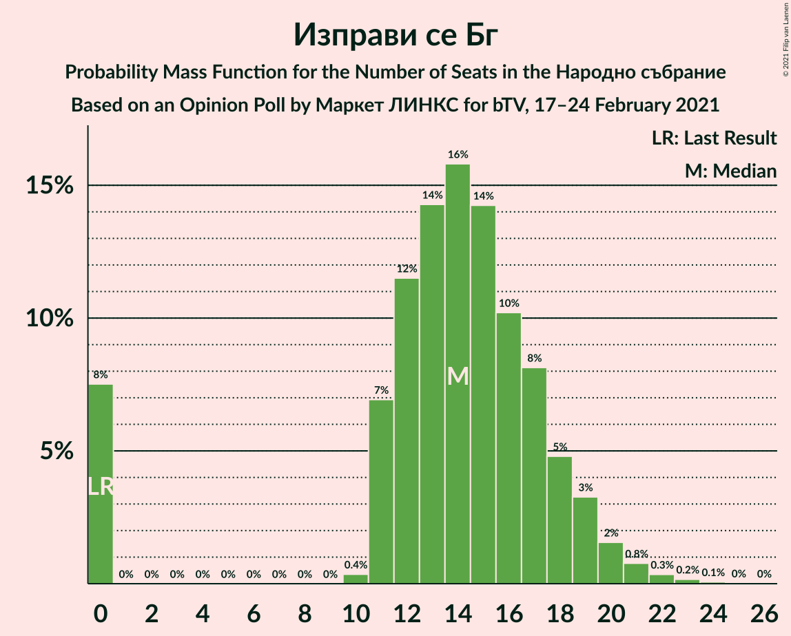

| Number of Seats | Probability | Accumulated | Special Marks |
|:---------------:|:-----------:|:-----------:|:-------------:|
| 0 | 8% | 100% | Last Result |
| 1 | 0% | 92% |  |
| 2 | 0% | 92% |  |
| 3 | 0% | 92% |  |
| 4 | 0% | 92% |  |
| 5 | 0% | 92% |  |
| 6 | 0% | 92% |  |
| 7 | 0% | 92% |  |
| 8 | 0% | 92% |  |
| 9 | 0% | 92% |  |
| 10 | 0.4% | 92% |  |
| 11 | 7% | 92% |  |
| 12 | 12% | 85% |  |
| 13 | 14% | 74% |  |
| 14 | 16% | 59% | Median |
| 15 | 14% | 44% |  |
| 16 | 10% | 29% |  |
| 17 | 8% | 19% |  |
| 18 | 5% | 11% |  |
| 19 | 3% | 6% |  |
| 20 | 2% | 3% |  |
| 21 | 0.8% | 1.4% |  |
| 22 | 0.3% | 0.6% |  |
| 23 | 0.2% | 0.3% |  |
| 24 | 0.1% | 0.1% |  |
| 25 | 0% | 0% |  |

### Обединени Патриоти

*For a full overview of the results for this party, see the [Обединени Патриоти](party-обединенипатриоти.html) page.*

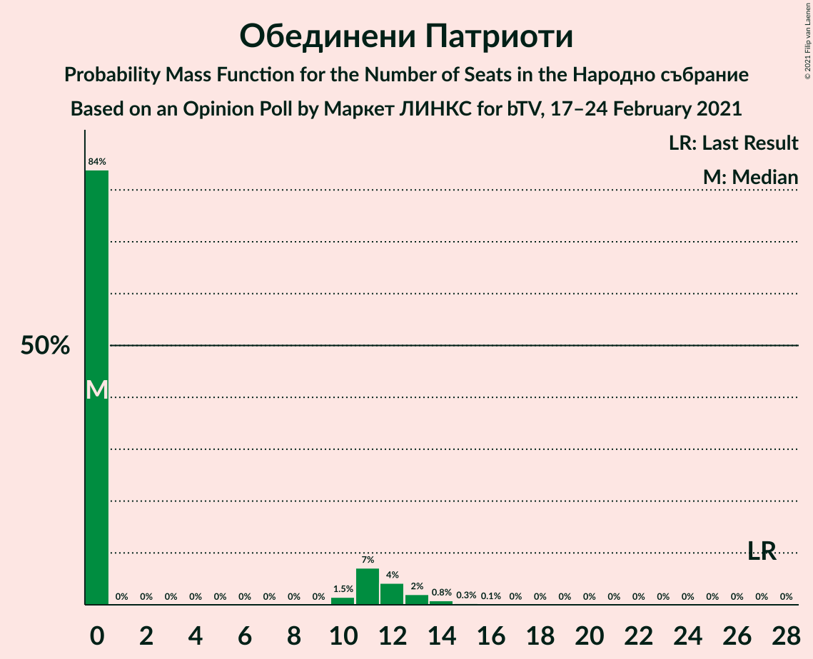

| Number of Seats | Probability | Accumulated | Special Marks |
|:---------------:|:-----------:|:-----------:|:-------------:|
| 0 | 84% | 100% | Median |
| 1 | 0% | 16% |  |
| 2 | 0% | 16% |  |
| 3 | 0% | 16% |  |
| 4 | 0% | 16% |  |
| 5 | 0% | 16% |  |
| 6 | 0% | 16% |  |
| 7 | 0% | 16% |  |
| 8 | 0% | 16% |  |
| 9 | 0% | 16% |  |
| 10 | 1.5% | 16% |  |
| 11 | 7% | 15% |  |
| 12 | 4% | 8% |  |
| 13 | 2% | 3% |  |
| 14 | 0.8% | 1.3% |  |
| 15 | 0.3% | 0.5% |  |
| 16 | 0.1% | 0.2% |  |
| 17 | 0% | 0.1% |  |
| 18 | 0% | 0% |  |
| 19 | 0% | 0% |  |
| 20 | 0% | 0% |  |
| 21 | 0% | 0% |  |
| 22 | 0% | 0% |  |
| 23 | 0% | 0% |  |
| 24 | 0% | 0% |  |
| 25 | 0% | 0% |  |
| 26 | 0% | 0% |  |
| 27 | 0% | 0% | Last Result |

## Coalitions

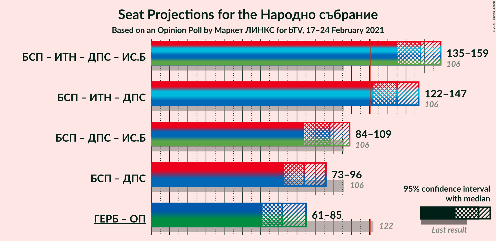

### Confidence Intervals

| Coalition | Last Result | Median | Majority? | 80% Confidence Interval | 90% Confidence Interval | 95% Confidence Interval | 99% Confidence Interval |
|:---------:|:-----------:|:------:|:---------:|:-----------------------:|:-----------------------:|:-----------------------:|:-----------------------:|
| Българска социалистическа партия – Има такъв народ – Движение за права и свободи – Изправи се Бг | 106 | 148 | 100% | 140–156 | 137–158 | 135–159 | 131–163 |
| Българска социалистическа партия – Има такъв народ – Движение за права и свободи | 106 | 135 | 98.7% | 127–142 | 124–145 | 122–147 | 118–152 |
| Българска социалистическа партия – Движение за права и свободи – Изправи се Бг | 106 | 98 | 0% | 90–105 | 87–107 | 84–109 | 80–113 |
| Българска социалистическа партия – Движение за права и свободи | 106 | 84 | 0% | 77–92 | 75–94 | 73–96 | 70–99 |
| Граждани за европейско развитие на България – Обединени Патриоти | 122 | 72 | 0% | 65–80 | 63–83 | 61–85 | 59–89 |

### Българска социалистическа партия – Има такъв народ – Движение за права и свободи – Изправи се Бг

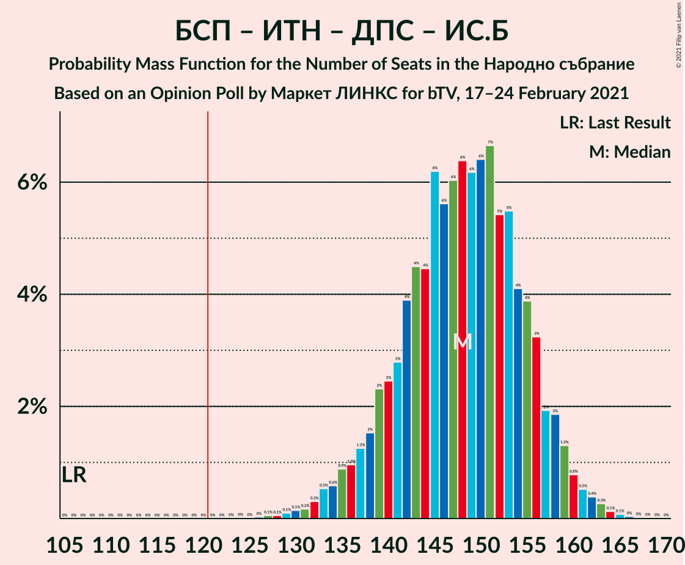

| Number of Seats | Probability | Accumulated | Special Marks |
|:---------------:|:-----------:|:-----------:|:-------------:|
| 106 | 0% | 100% | Last Result |
| 107 | 0% | 100% |  |
| 108 | 0% | 100% |  |
| 109 | 0% | 100% |  |
| 110 | 0% | 100% |  |
| 111 | 0% | 100% |  |
| 112 | 0% | 100% |  |
| 113 | 0% | 100% |  |
| 114 | 0% | 100% |  |
| 115 | 0% | 100% |  |
| 116 | 0% | 100% |  |
| 117 | 0% | 100% |  |
| 118 | 0% | 100% |  |
| 119 | 0% | 100% |  |
| 120 | 0% | 100% |  |
| 121 | 0% | 100% | Majority |
| 122 | 0% | 100% |  |
| 123 | 0% | 100% |  |
| 124 | 0% | 100% |  |
| 125 | 0% | 100% |  |
| 126 | 0% | 100% |  |
| 127 | 0.1% | 99.9% |  |
| 128 | 0.1% | 99.9% |  |
| 129 | 0.1% | 99.8% |  |
| 130 | 0.1% | 99.7% |  |
| 131 | 0.2% | 99.6% |  |
| 132 | 0.3% | 99.4% |  |
| 133 | 0.5% | 99.1% |  |
| 134 | 0.6% | 98.6% |  |
| 135 | 0.9% | 98% |  |
| 136 | 1.0% | 97% |  |
| 137 | 1.3% | 96% |  |
| 138 | 2% | 95% |  |
| 139 | 2% | 93% |  |
| 140 | 2% | 91% |  |
| 141 | 3% | 89% |  |
| 142 | 4% | 86% |  |
| 143 | 4% | 82% |  |
| 144 | 4% | 77% |  |
| 145 | 6% | 73% |  |
| 146 | 6% | 67% |  |
| 147 | 6% | 61% |  |
| 148 | 6% | 55% | Median |
| 149 | 6% | 49% |  |
| 150 | 6% | 43% |  |
| 151 | 7% | 36% |  |
| 152 | 5% | 29% |  |
| 153 | 5% | 24% |  |
| 154 | 4% | 19% |  |
| 155 | 4% | 14% |  |
| 156 | 3% | 11% |  |
| 157 | 2% | 7% |  |
| 158 | 2% | 5% |  |
| 159 | 1.3% | 4% |  |
| 160 | 0.8% | 2% |  |
| 161 | 0.5% | 1.5% |  |
| 162 | 0.4% | 0.9% |  |
| 163 | 0.3% | 0.6% |  |
| 164 | 0.1% | 0.3% |  |
| 165 | 0.1% | 0.2% |  |
| 166 | 0% | 0.1% |  |
| 167 | 0% | 0% |  |

### Българска социалистическа партия – Има такъв народ – Движение за права и свободи

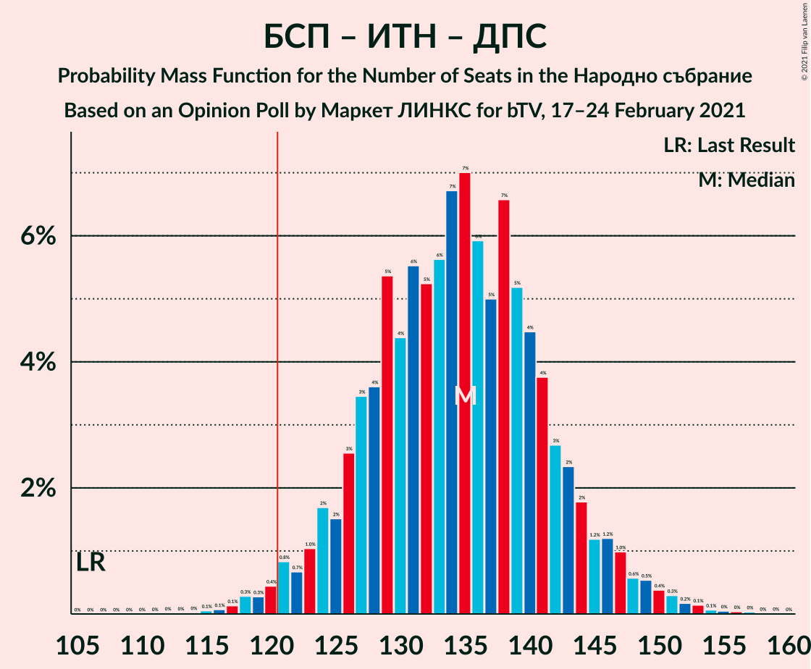

| Number of Seats | Probability | Accumulated | Special Marks |
|:---------------:|:-----------:|:-----------:|:-------------:|
| 106 | 0% | 100% | Last Result |
| 107 | 0% | 100% |  |
| 108 | 0% | 100% |  |
| 109 | 0% | 100% |  |
| 110 | 0% | 100% |  |
| 111 | 0% | 100% |  |
| 112 | 0% | 100% |  |
| 113 | 0% | 100% |  |
| 114 | 0% | 100% |  |
| 115 | 0.1% | 99.9% |  |
| 116 | 0.1% | 99.9% |  |
| 117 | 0.1% | 99.8% |  |
| 118 | 0.3% | 99.7% |  |
| 119 | 0.3% | 99.4% |  |
| 120 | 0.4% | 99.1% |  |
| 121 | 0.8% | 98.7% | Majority |
| 122 | 0.7% | 98% |  |
| 123 | 1.0% | 97% |  |
| 124 | 2% | 96% |  |
| 125 | 2% | 94% |  |
| 126 | 3% | 93% |  |
| 127 | 3% | 90% |  |
| 128 | 4% | 87% |  |
| 129 | 5% | 83% |  |
| 130 | 4% | 78% |  |
| 131 | 6% | 74% |  |
| 132 | 5% | 68% |  |
| 133 | 6% | 63% |  |
| 134 | 7% | 57% | Median |
| 135 | 7% | 50% |  |
| 136 | 6% | 43% |  |
| 137 | 5% | 38% |  |
| 138 | 7% | 33% |  |
| 139 | 5% | 26% |  |
| 140 | 4% | 21% |  |
| 141 | 4% | 16% |  |
| 142 | 3% | 13% |  |
| 143 | 2% | 10% |  |
| 144 | 2% | 7% |  |
| 145 | 1.2% | 6% |  |
| 146 | 1.2% | 5% |  |
| 147 | 1.0% | 3% |  |
| 148 | 0.6% | 2% |  |
| 149 | 0.5% | 2% |  |
| 150 | 0.4% | 1.2% |  |
| 151 | 0.3% | 0.8% |  |
| 152 | 0.2% | 0.5% |  |
| 153 | 0.1% | 0.4% |  |
| 154 | 0.1% | 0.2% |  |
| 155 | 0% | 0.2% |  |
| 156 | 0% | 0.1% |  |
| 157 | 0% | 0.1% |  |
| 158 | 0% | 0% |  |

### Българска социалистическа партия – Движение за права и свободи – Изправи се Бг

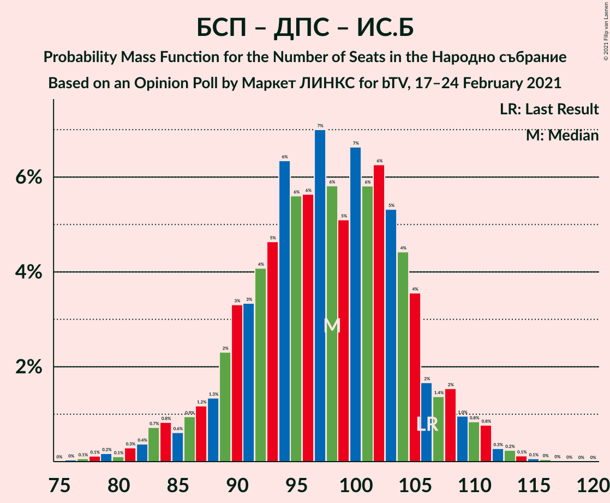

| Number of Seats | Probability | Accumulated | Special Marks |
|:---------------:|:-----------:|:-----------:|:-------------:|
| 75 | 0% | 100% |  |
| 76 | 0% | 99.9% |  |
| 77 | 0.1% | 99.9% |  |
| 78 | 0.1% | 99.8% |  |
| 79 | 0.2% | 99.7% |  |
| 80 | 0.1% | 99.6% |  |
| 81 | 0.3% | 99.4% |  |
| 82 | 0.4% | 99.2% |  |
| 83 | 0.7% | 98.8% |  |
| 84 | 0.8% | 98% |  |
| 85 | 0.6% | 97% |  |
| 86 | 0.9% | 97% |  |
| 87 | 1.2% | 96% |  |
| 88 | 1.3% | 94% |  |
| 89 | 2% | 93% |  |
| 90 | 3% | 91% |  |
| 91 | 3% | 88% |  |
| 92 | 4% | 84% |  |
| 93 | 5% | 80% |  |
| 94 | 6% | 75% |  |
| 95 | 6% | 69% |  |
| 96 | 6% | 64% |  |
| 97 | 7% | 58% |  |
| 98 | 6% | 51% | Median |
| 99 | 5% | 45% |  |
| 100 | 7% | 40% |  |
| 101 | 6% | 33% |  |
| 102 | 6% | 28% |  |
| 103 | 5% | 21% |  |
| 104 | 4% | 16% |  |
| 105 | 4% | 12% |  |
| 106 | 2% | 8% | Last Result |
| 107 | 1.4% | 6% |  |
| 108 | 2% | 5% |  |
| 109 | 1.0% | 3% |  |
| 110 | 0.8% | 2% |  |
| 111 | 0.8% | 2% |  |
| 112 | 0.3% | 0.8% |  |
| 113 | 0.2% | 0.5% |  |
| 114 | 0.1% | 0.3% |  |
| 115 | 0.1% | 0.2% |  |
| 116 | 0% | 0.1% |  |
| 117 | 0% | 0.1% |  |
| 118 | 0% | 0% |  |

### Българска социалистическа партия – Движение за права и свободи

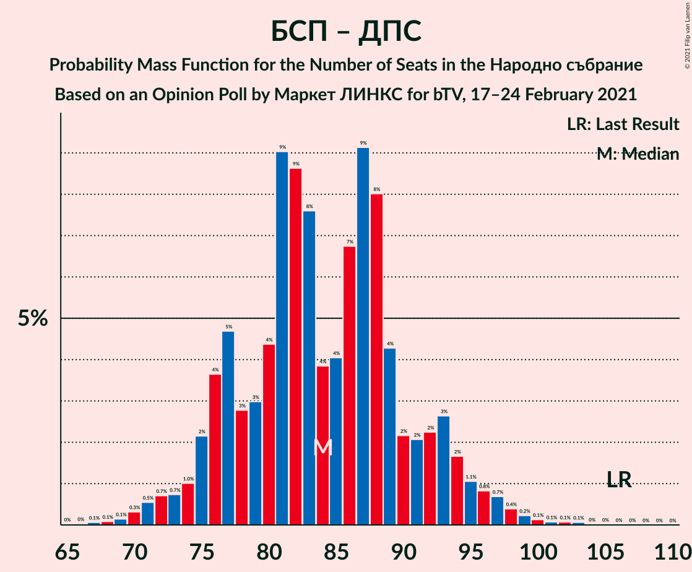

| Number of Seats | Probability | Accumulated | Special Marks |
|:---------------:|:-----------:|:-----------:|:-------------:|
| 66 | 0% | 100% |  |
| 67 | 0.1% | 99.9% |  |
| 68 | 0.1% | 99.9% |  |
| 69 | 0.1% | 99.8% |  |
| 70 | 0.3% | 99.6% |  |
| 71 | 0.5% | 99.3% |  |
| 72 | 0.7% | 98.8% |  |
| 73 | 0.7% | 98% |  |
| 74 | 1.0% | 97% |  |
| 75 | 2% | 96% |  |
| 76 | 4% | 94% |  |
| 77 | 5% | 91% |  |
| 78 | 3% | 86% |  |
| 79 | 3% | 83% |  |
| 80 | 4% | 80% |  |
| 81 | 9% | 76% |  |
| 82 | 9% | 67% |  |
| 83 | 8% | 58% |  |
| 84 | 4% | 50% | Median |
| 85 | 4% | 47% |  |
| 86 | 7% | 43% |  |
| 87 | 9% | 36% |  |
| 88 | 8% | 27% |  |
| 89 | 4% | 19% |  |
| 90 | 2% | 14% |  |
| 91 | 2% | 12% |  |
| 92 | 2% | 10% |  |
| 93 | 3% | 8% |  |
| 94 | 2% | 5% |  |
| 95 | 1.1% | 4% |  |
| 96 | 0.8% | 3% |  |
| 97 | 0.7% | 2% |  |
| 98 | 0.4% | 1.0% |  |
| 99 | 0.2% | 0.6% |  |
| 100 | 0.1% | 0.4% |  |
| 101 | 0.1% | 0.3% |  |
| 102 | 0.1% | 0.2% |  |
| 103 | 0.1% | 0.1% |  |
| 104 | 0% | 0.1% |  |
| 105 | 0% | 0% |  |
| 106 | 0% | 0% | Last Result |

### Граждани за европейско развитие на България – Обединени Патриоти

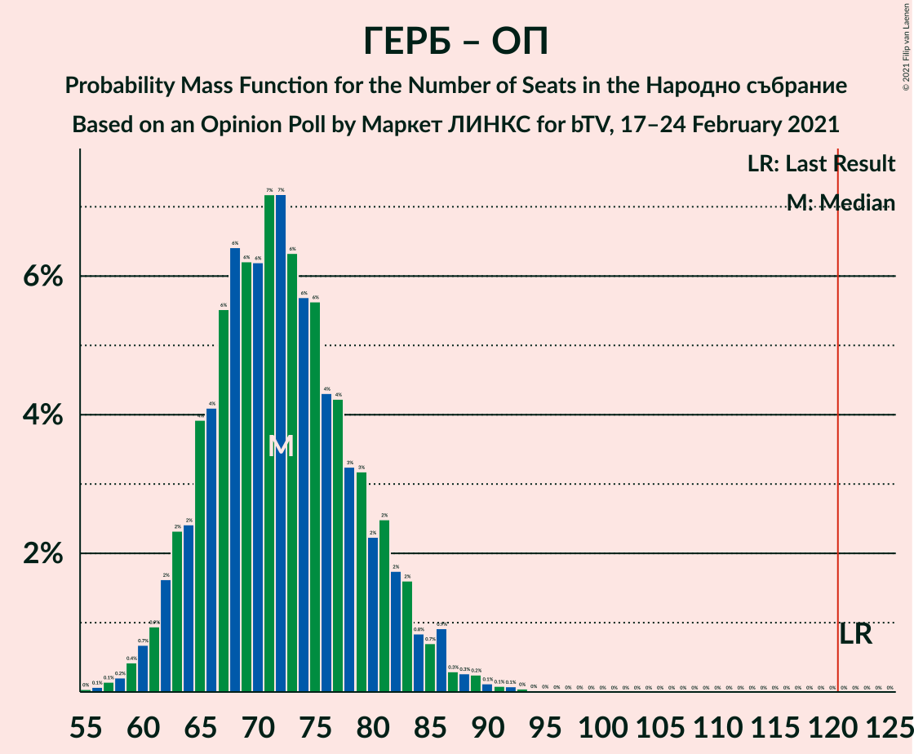

| Number of Seats | Probability | Accumulated | Special Marks |
|:---------------:|:-----------:|:-----------:|:-------------:|
| 55 | 0% | 100% |  |
| 56 | 0.1% | 99.9% |  |
| 57 | 0.1% | 99.9% |  |
| 58 | 0.2% | 99.7% |  |
| 59 | 0.4% | 99.5% |  |
| 60 | 0.7% | 99.1% |  |
| 61 | 0.9% | 98% |  |
| 62 | 2% | 97% |  |
| 63 | 2% | 96% |  |
| 64 | 2% | 94% |  |
| 65 | 4% | 91% |  |
| 66 | 4% | 87% |  |
| 67 | 6% | 83% |  |
| 68 | 6% | 78% |  |
| 69 | 6% | 71% |  |
| 70 | 6% | 65% | Median |
| 71 | 7% | 59% |  |
| 72 | 7% | 52% |  |
| 73 | 6% | 44% |  |
| 74 | 6% | 38% |  |
| 75 | 6% | 32% |  |
| 76 | 4% | 27% |  |
| 77 | 4% | 22% |  |
| 78 | 3% | 18% |  |
| 79 | 3% | 15% |  |
| 80 | 2% | 12% |  |
| 81 | 2% | 10% |  |
| 82 | 2% | 7% |  |
| 83 | 2% | 5% |  |
| 84 | 0.8% | 4% |  |
| 85 | 0.7% | 3% |  |
| 86 | 0.9% | 2% |  |
| 87 | 0.3% | 1.2% |  |
| 88 | 0.3% | 0.9% |  |
| 89 | 0.2% | 0.6% |  |
| 90 | 0.1% | 0.4% |  |
| 91 | 0.1% | 0.3% |  |
| 92 | 0.1% | 0.2% |  |
| 93 | 0% | 0.1% |  |
| 94 | 0% | 0.1% |  |
| 95 | 0% | 0% |  |
| 96 | 0% | 0% |  |
| 97 | 0% | 0% |  |
| 98 | 0% | 0% |  |
| 99 | 0% | 0% |  |
| 100 | 0% | 0% |  |
| 101 | 0% | 0% |  |
| 102 | 0% | 0% |  |
| 103 | 0% | 0% |  |
| 104 | 0% | 0% |  |
| 105 | 0% | 0% |  |
| 106 | 0% | 0% |  |
| 107 | 0% | 0% |  |
| 108 | 0% | 0% |  |
| 109 | 0% | 0% |  |
| 110 | 0% | 0% |  |
| 111 | 0% | 0% |  |
| 112 | 0% | 0% |  |
| 113 | 0% | 0% |  |
| 114 | 0% | 0% |  |
| 115 | 0% | 0% |  |
| 116 | 0% | 0% |  |
| 117 | 0% | 0% |  |
| 118 | 0% | 0% |  |
| 119 | 0% | 0% |  |
| 120 | 0% | 0% |  |
| 121 | 0% | 0% | Majority |
| 122 | 0% | 0% | Last Result |

## Technical Information

### Opinion Poll

+ **Polling firm:** Маркет ЛИНКС
+ **Commissioner(s):** bTV
+ **Fieldwork period:** 17–24 February 2021

### Calculations

+ **Sample size:** 516
+ **Simulations done:** 1,048,576
+ **Error estimate:** 1.71%

