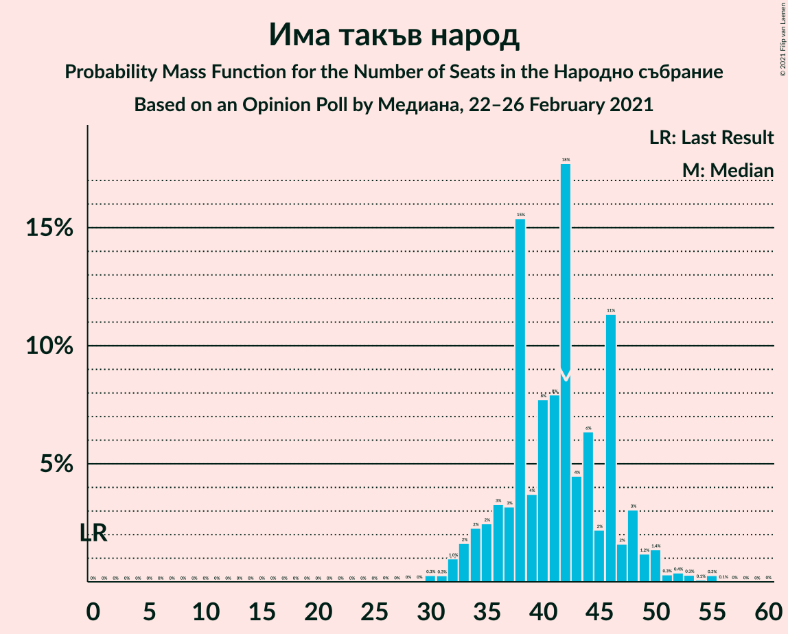
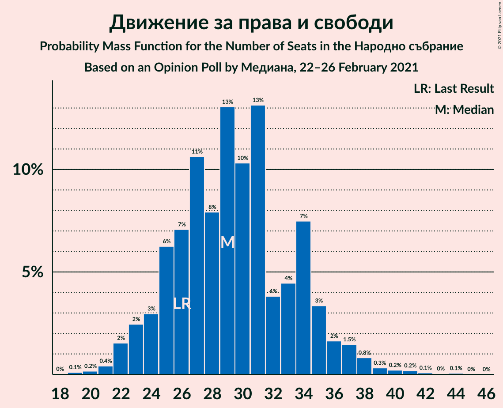
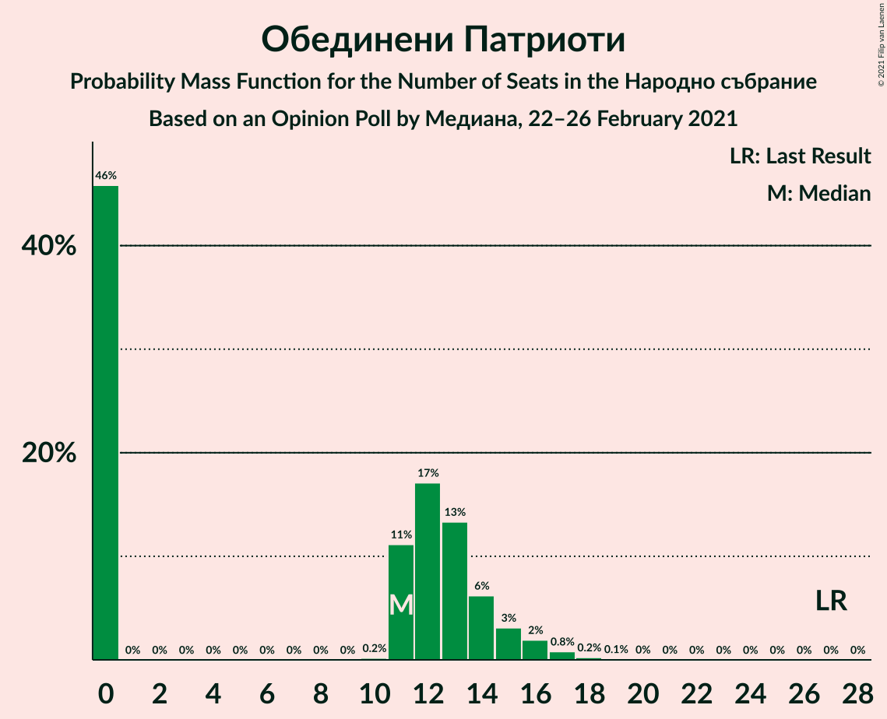
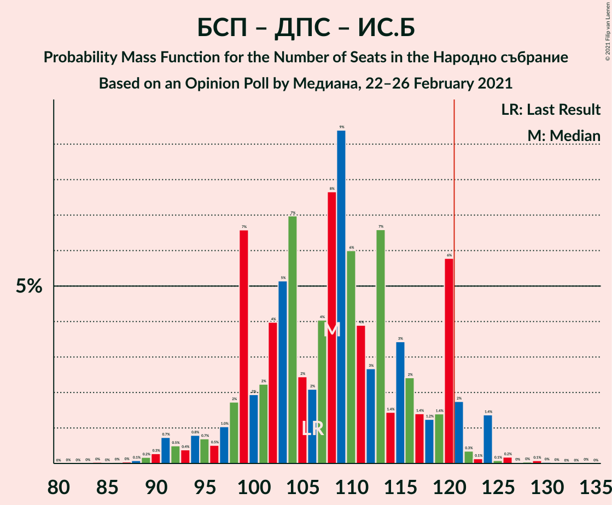

# Opinion Poll by Медиана, 22–26 February 2021

<a href="#voting-intentions">Voting Intentions</a> | <a href="#seats">Seats</a> | <a href="#coalitions">Coalitions</a> | <a href="#technical-information">Technical Information</a>

## Voting Intentions

### Confidence Intervals

| Party | Last Result | Poll Result | 80% Confidence Interval | 90% Confidence Interval | 95% Confidence Interval | 99% Confidence Interval |
|:-----:|:-----------:|:-----------:|:-----------------------:|:-----------------------:|:-----------------------:|:-----------------------:|
| Граждани за европейско развитие на България | 33.5% | 27.5% | 25.2–30.0% |24.5–30.7% |24.0–31.3% |22.9–32.5% |
| Българска социалистическа партия | 27.9% | 24.2% | 22.0–26.6% |21.4–27.3% |20.9–27.8% |19.8–29.0% |
| Има такъв народ | 0.0% | 15.1% | 13.4–17.2% |12.8–17.8% |12.4–18.3% |11.6–19.3% |
| Движение за права и свободи | 9.2% | 10.8% | 9.3–12.6% |8.9–13.1% |8.5–13.6% |7.8–14.5% |
| Изправи се Бг | 0.0% | 5.0% | 4.0–6.4% |3.8–6.8% |3.5–7.2% |3.1–7.9% |
| Демократична България | 0.0% | 4.2% | 3.3–5.5% |3.0–5.8% |2.8–6.1% |2.4–6.8% |
| Обединени Патриоти | 9.3% | 4.0% | 3.1–5.3% |2.9–5.6% |2.7–5.9% |2.3–6.6% |
| Воля–Национален фронт за спасение на България | 4.3% | 3.1% | 2.4–4.3% |2.2–4.6% |2.0–4.9% |1.7–5.5% |
| Алтернатива за българско възраждане | 1.6% | 1.4% | 0.9–2.3% |0.8–2.5% |0.7–2.7% |0.5–3.2% |

*Note:* The poll result column reflects the actual value used in the calculations. Published results may vary slightly, and in addition be rounded to fewer digits.

## Seats

### Confidence Intervals

| Party | Last Result | Median | 80% Confidence Interval | 90% Confidence Interval | 95% Confidence Interval | 99% Confidence Interval |
|:-----:|:-----------:|:------:|:-----------------------:|:-----------------------:|:-----------------------:|:-----------------------:|
| <a href="#граждани-за-европейско-развитие-на-българия">Граждани за европейско развитие на България</a> | 95 | 73 | 67–81 |65–84 |64–86 |61–90 |
| <a href="#българска-социалистическа-партия">Българска социалистическа партия</a> | 80 | 65 | 59–72 |56–75 |56–77 |53–79 |
| <a href="#има-такъв-народ">Има такъв народ</a> | 0 | 42 | 36–46 |34–48 |33–50 |31–53 |
| <a href="#движение-за-права-и-свободи">Движение за права и свободи</a> | 26 | 29 | 25–34 |24–35 |23–37 |21–40 |
| <a href="#изправи-се-бг">Изправи се Бг</a> | 0 | 14 | 11–17 |0–18 |0–19 |0–22 |
| <a href="#демократична-българия">Демократична България</a> | 0 | 11 | 0–14 |0–16 |0–16 |0–18 |
| <a href="#обединени-патриоти">Обединени Патриоти</a> | 27 | 11 | 0–14 |0–15 |0–16 |0–17 |
| <a href="#воля–национален-фронт-за-спасение-на-българия">Воля–Национален фронт за спасение на България</a> | 12 | 0 | 0–11 |0–12 |0–13 |0–14 |
| <a href="#алтернатива-за-българско-възраждане">Алтернатива за българско възраждане</a> | 0 | 0 | 0 |0 |0 |0 |

### Граждани за европейско развитие на България

*For a full overview of the results for this party, see the [Граждани за европейско развитие на България](party-гражданизаевропейскоразвитиенабългария.html) page.*

| Number of Seats | Probability | Accumulated | Special Marks |
|:---------------:|:-----------:|:-----------:|:-------------:|
| 57 | 0% | 100% |  |
| 58 | 0.1% | 99.9% |  |
| 59 | 0.1% | 99.9% |  |
| 60 | 0.2% | 99.7% |  |
| 61 | 0.4% | 99.5% |  |
| 62 | 0.5% | 99.2% |  |
| 63 | 0.7% | 98.7% |  |
| 64 | 1.0% | 98% |  |
| 65 | 2% | 97% |  |
| 66 | 2% | 95% |  |
| 67 | 3% | 93% |  |
| 68 | 2% | 90% |  |
| 69 | 4% | 88% |  |
| 70 | 6% | 84% |  |
| 71 | 13% | 78% |  |
| 72 | 6% | 65% |  |
| 73 | 9% | 59% | Median |
| 74 | 4% | 50% |  |
| 75 | 5% | 46% |  |
| 76 | 7% | 41% |  |
| 77 | 11% | 34% |  |
| 78 | 4% | 24% |  |
| 79 | 7% | 20% |  |
| 80 | 2% | 13% |  |
| 81 | 2% | 11% |  |
| 82 | 0.8% | 9% |  |
| 83 | 1.0% | 8% |  |
| 84 | 2% | 7% |  |
| 85 | 1.0% | 5% |  |
| 86 | 2% | 4% |  |
| 87 | 0.6% | 2% |  |
| 88 | 0.2% | 1.0% |  |
| 89 | 0.1% | 0.8% |  |
| 90 | 0.2% | 0.6% |  |
| 91 | 0.2% | 0.5% |  |
| 92 | 0.1% | 0.3% |  |
| 93 | 0.1% | 0.2% |  |
| 94 | 0% | 0.1% |  |
| 95 | 0% | 0.1% | Last Result |
| 96 | 0% | 0% |  |

### Българска социалистическа партия

*For a full overview of the results for this party, see the [Българска социалистическа партия](party-българскасоциалистическапартия.html) page.*

| Number of Seats | Probability | Accumulated | Special Marks |
|:---------------:|:-----------:|:-----------:|:-------------:|
| 50 | 0.1% | 100% |  |
| 51 | 0.1% | 99.8% |  |
| 52 | 0.1% | 99.7% |  |
| 53 | 0.1% | 99.6% |  |
| 54 | 0.7% | 99.5% |  |
| 55 | 1.2% | 98.8% |  |
| 56 | 4% | 98% |  |
| 57 | 1.3% | 94% |  |
| 58 | 1.0% | 93% |  |
| 59 | 3% | 92% |  |
| 60 | 8% | 88% |  |
| 61 | 4% | 80% |  |
| 62 | 3% | 76% |  |
| 63 | 9% | 72% |  |
| 64 | 9% | 64% |  |
| 65 | 6% | 55% | Median |
| 66 | 5% | 49% |  |
| 67 | 8% | 44% |  |
| 68 | 3% | 36% |  |
| 69 | 4% | 33% |  |
| 70 | 10% | 29% |  |
| 71 | 4% | 19% |  |
| 72 | 6% | 15% |  |
| 73 | 2% | 10% |  |
| 74 | 2% | 8% |  |
| 75 | 2% | 6% |  |
| 76 | 0.5% | 3% |  |
| 77 | 0.7% | 3% |  |
| 78 | 0.4% | 2% |  |
| 79 | 1.4% | 2% |  |
| 80 | 0.2% | 0.5% | Last Result |
| 81 | 0.1% | 0.2% |  |
| 82 | 0% | 0.2% |  |
| 83 | 0% | 0.1% |  |
| 84 | 0% | 0.1% |  |
| 85 | 0% | 0.1% |  |
| 86 | 0% | 0.1% |  |
| 87 | 0% | 0% |  |

### Има такъв народ

*For a full overview of the results for this party, see the [Има такъв народ](party-иматакъвнарод.html) page.*

| Number of Seats | Probability | Accumulated | Special Marks |
|:---------------:|:-----------:|:-----------:|:-------------:|
| 0 | 0% | 100% | Last Result |
| 1 | 0% | 100% |  |
| 2 | 0% | 100% |  |
| 3 | 0% | 100% |  |
| 4 | 0% | 100% |  |
| 5 | 0% | 100% |  |
| 6 | 0% | 100% |  |
| 7 | 0% | 100% |  |
| 8 | 0% | 100% |  |
| 9 | 0% | 100% |  |
| 10 | 0% | 100% |  |
| 11 | 0% | 100% |  |
| 12 | 0% | 100% |  |
| 13 | 0% | 100% |  |
| 14 | 0% | 100% |  |
| 15 | 0% | 100% |  |
| 16 | 0% | 100% |  |
| 17 | 0% | 100% |  |
| 18 | 0% | 100% |  |
| 19 | 0% | 100% |  |
| 20 | 0% | 100% |  |
| 21 | 0% | 100% |  |
| 22 | 0% | 100% |  |
| 23 | 0% | 100% |  |
| 24 | 0% | 100% |  |
| 25 | 0% | 100% |  |
| 26 | 0% | 100% |  |
| 27 | 0% | 100% |  |
| 28 | 0% | 100% |  |
| 29 | 0% | 99.9% |  |
| 30 | 0.3% | 99.9% |  |
| 31 | 0.3% | 99.6% |  |
| 32 | 1.0% | 99.3% |  |
| 33 | 2% | 98% |  |
| 34 | 2% | 97% |  |
| 35 | 2% | 94% |  |
| 36 | 3% | 92% |  |
| 37 | 3% | 89% |  |
| 38 | 15% | 86% |  |
| 39 | 4% | 70% |  |
| 40 | 8% | 66% |  |
| 41 | 8% | 59% |  |
| 42 | 18% | 51% | Median |
| 43 | 4% | 33% |  |
| 44 | 6% | 29% |  |
| 45 | 2% | 22% |  |
| 46 | 11% | 20% |  |
| 47 | 2% | 9% |  |
| 48 | 3% | 7% |  |
| 49 | 1.2% | 4% |  |
| 50 | 1.4% | 3% |  |
| 51 | 0.3% | 1.5% |  |
| 52 | 0.4% | 1.2% |  |
| 53 | 0.3% | 0.8% |  |
| 54 | 0.1% | 0.5% |  |
| 55 | 0.3% | 0.4% |  |
| 56 | 0.1% | 0.1% |  |
| 57 | 0% | 0.1% |  |
| 58 | 0% | 0.1% |  |
| 59 | 0% | 0% |  |

### Движение за права и свободи

*For a full overview of the results for this party, see the [Движение за права и свободи](party-движениезаправаисвободи.html) page.*

| Number of Seats | Probability | Accumulated | Special Marks |
|:---------------:|:-----------:|:-----------:|:-------------:|
| 19 | 0.1% | 100% |  |
| 20 | 0.2% | 99.9% |  |
| 21 | 0.4% | 99.7% |  |
| 22 | 2% | 99.3% |  |
| 23 | 2% | 98% |  |
| 24 | 3% | 95% |  |
| 25 | 6% | 92% |  |
| 26 | 7% | 86% | Last Result |
| 27 | 11% | 79% |  |
| 28 | 8% | 68% |  |
| 29 | 13% | 60% | Median |
| 30 | 10% | 47% |  |
| 31 | 13% | 37% |  |
| 32 | 4% | 24% |  |
| 33 | 4% | 20% |  |
| 34 | 7% | 16% |  |
| 35 | 3% | 8% |  |
| 36 | 2% | 5% |  |
| 37 | 1.5% | 3% |  |
| 38 | 0.8% | 2% |  |
| 39 | 0.3% | 0.9% |  |
| 40 | 0.2% | 0.6% |  |
| 41 | 0.2% | 0.4% |  |
| 42 | 0.1% | 0.2% |  |
| 43 | 0% | 0.1% |  |
| 44 | 0.1% | 0.1% |  |
| 45 | 0% | 0% |  |

### Изправи се Бг

*For a full overview of the results for this party, see the [Изправи се Бг](party-изправисебг.html) page.*

| Number of Seats | Probability | Accumulated | Special Marks |
|:---------------:|:-----------:|:-----------:|:-------------:|
| 0 | 9% | 100% | Last Result |
| 1 | 0% | 91% |  |
| 2 | 0% | 91% |  |
| 3 | 0% | 91% |  |
| 4 | 0% | 91% |  |
| 5 | 0% | 91% |  |
| 6 | 0% | 91% |  |
| 7 | 0% | 91% |  |
| 8 | 0% | 91% |  |
| 9 | 0% | 91% |  |
| 10 | 0.6% | 91% |  |
| 11 | 8% | 91% |  |
| 12 | 14% | 83% |  |
| 13 | 12% | 69% |  |
| 14 | 12% | 57% | Median |
| 15 | 20% | 46% |  |
| 16 | 11% | 25% |  |
| 17 | 8% | 14% |  |
| 18 | 3% | 6% |  |
| 19 | 2% | 3% |  |
| 20 | 0.8% | 2% |  |
| 21 | 0.3% | 0.8% |  |
| 22 | 0.3% | 0.5% |  |
| 23 | 0.1% | 0.2% |  |
| 24 | 0% | 0.1% |  |
| 25 | 0% | 0% |  |

### Демократична България

*For a full overview of the results for this party, see the [Демократична България](party-демократичнабългария.html) page.*

| Number of Seats | Probability | Accumulated | Special Marks |
|:---------------:|:-----------:|:-----------:|:-------------:|
| 0 | 39% | 100% | Last Result |
| 1 | 0% | 61% |  |
| 2 | 0% | 61% |  |
| 3 | 0% | 61% |  |
| 4 | 0% | 61% |  |
| 5 | 0% | 61% |  |
| 6 | 0% | 61% |  |
| 7 | 0% | 61% |  |
| 8 | 0% | 61% |  |
| 9 | 0% | 61% |  |
| 10 | 0.6% | 61% |  |
| 11 | 16% | 60% | Median |
| 12 | 18% | 44% |  |
| 13 | 9% | 26% |  |
| 14 | 8% | 17% |  |
| 15 | 3% | 9% |  |
| 16 | 4% | 6% |  |
| 17 | 1.0% | 2% |  |
| 18 | 0.4% | 0.7% |  |
| 19 | 0.2% | 0.3% |  |
| 20 | 0% | 0.1% |  |
| 21 | 0.1% | 0.1% |  |
| 22 | 0% | 0% |  |

### Обединени Патриоти

*For a full overview of the results for this party, see the [Обединени Патриоти](party-обединенипатриоти.html) page.*

| Number of Seats | Probability | Accumulated | Special Marks |
|:---------------:|:-----------:|:-----------:|:-------------:|
| 0 | 46% | 100% |  |
| 1 | 0% | 54% |  |
| 2 | 0% | 54% |  |
| 3 | 0% | 54% |  |
| 4 | 0% | 54% |  |
| 5 | 0% | 54% |  |
| 6 | 0% | 54% |  |
| 7 | 0% | 54% |  |
| 8 | 0% | 54% |  |
| 9 | 0% | 54% |  |
| 10 | 0.2% | 54% |  |
| 11 | 11% | 54% | Median |
| 12 | 17% | 43% |  |
| 13 | 13% | 26% |  |
| 14 | 6% | 12% |  |
| 15 | 3% | 6% |  |
| 16 | 2% | 3% |  |
| 17 | 0.8% | 1.2% |  |
| 18 | 0.2% | 0.4% |  |
| 19 | 0.1% | 0.1% |  |
| 20 | 0% | 0.1% |  |
| 21 | 0% | 0% |  |
| 22 | 0% | 0% |  |
| 23 | 0% | 0% |  |
| 24 | 0% | 0% |  |
| 25 | 0% | 0% |  |
| 26 | 0% | 0% |  |
| 27 | 0% | 0% | Last Result |

### Воля–Национален фронт за спасение на България

*For a full overview of the results for this party, see the [Воля–Национален фронт за спасение на България](party-воля–националенфронтзаспасениенабългария.html) page.*

| Number of Seats | Probability | Accumulated | Special Marks |
|:---------------:|:-----------:|:-----------:|:-------------:|
| 0 | 86% | 100% | Median |
| 1 | 0% | 14% |  |
| 2 | 0% | 14% |  |
| 3 | 0% | 14% |  |
| 4 | 0% | 14% |  |
| 5 | 0% | 14% |  |
| 6 | 0% | 14% |  |
| 7 | 0% | 14% |  |
| 8 | 0% | 14% |  |
| 9 | 0% | 14% |  |
| 10 | 0.5% | 14% |  |
| 11 | 6% | 14% |  |
| 12 | 4% | 7% | Last Result |
| 13 | 3% | 4% |  |
| 14 | 0.7% | 1.1% |  |
| 15 | 0.2% | 0.4% |  |
| 16 | 0.1% | 0.2% |  |
| 17 | 0% | 0% |  |

### Алтернатива за българско възраждане

*For a full overview of the results for this party, see the [Алтернатива за българско възраждане](party-алтернативазабългарсковъзраждане.html) page.*

| Number of Seats | Probability | Accumulated | Special Marks |
|:---------------:|:-----------:|:-----------:|:-------------:|
| 0 | 100% | 100% | Last Result, Median |

## Coalitions

### Confidence Intervals

| Coalition | Last Result | Median | Majority? | 80% Confidence Interval | 90% Confidence Interval | 95% Confidence Interval | 99% Confidence Interval |
|:---------:|:-----------:|:------:|:---------:|:-----------------------:|:-----------------------:|:-----------------------:|:-----------------------:|
| Българска социалистическа партия – Има такъв народ – Движение за права и свободи – Изправи се Бг | 106 | 150 | 100% | 139–161 | 136–163 | 133–165 | 129–169 |
| Българска социалистическа партия – Има такъв народ – Движение за права и свободи | 106 | 137 | 98% | 126–146 | 123–149 | 121–154 | 117–157 |
| Българска социалистическа партия – Движение за права и свободи – Изправи се Бг | 106 | 108 | 4% | 99–119 | 97–120 | 94–121 | 90–125 |
| Българска социалистическа партия – Движение за права и свободи | 106 | 94 | 0% | 86–104 | 84–107 | 83–109 | 80–111 |
| Граждани за европейско развитие на България – Обединени Патриоти | 122 | 82 | 0% | 73–90 | 70–91 | 68–93 | 64–100 |

### Българска социалистическа партия – Има такъв народ – Движение за права и свободи – Изправи се Бг

| Number of Seats | Probability | Accumulated | Special Marks |
|:---------------:|:-----------:|:-----------:|:-------------:|
| 106 | 0% | 100% | Last Result |
| 107 | 0% | 100% |  |
| 108 | 0% | 100% |  |
| 109 | 0% | 100% |  |
| 110 | 0% | 100% |  |
| 111 | 0% | 100% |  |
| 112 | 0% | 100% |  |
| 113 | 0% | 100% |  |
| 114 | 0% | 100% |  |
| 115 | 0% | 100% |  |
| 116 | 0% | 100% |  |
| 117 | 0% | 100% |  |
| 118 | 0% | 100% |  |
| 119 | 0% | 100% |  |
| 120 | 0% | 100% |  |
| 121 | 0% | 100% | Majority |
| 122 | 0% | 100% |  |
| 123 | 0% | 100% |  |
| 124 | 0.1% | 99.9% |  |
| 125 | 0% | 99.8% |  |
| 126 | 0% | 99.8% |  |
| 127 | 0.1% | 99.8% |  |
| 128 | 0.1% | 99.7% |  |
| 129 | 0.1% | 99.6% |  |
| 130 | 0.1% | 99.5% |  |
| 131 | 0.2% | 99.4% |  |
| 132 | 1.1% | 99.2% |  |
| 133 | 0.7% | 98% |  |
| 134 | 0.4% | 97% |  |
| 135 | 0.8% | 97% |  |
| 136 | 2% | 96% |  |
| 137 | 3% | 95% |  |
| 138 | 1.2% | 92% |  |
| 139 | 3% | 91% |  |
| 140 | 2% | 88% |  |
| 141 | 2% | 86% |  |
| 142 | 4% | 84% |  |
| 143 | 2% | 80% |  |
| 144 | 3% | 78% |  |
| 145 | 7% | 75% |  |
| 146 | 8% | 68% |  |
| 147 | 3% | 60% |  |
| 148 | 2% | 57% |  |
| 149 | 4% | 54% |  |
| 150 | 4% | 51% | Median |
| 151 | 6% | 47% |  |
| 152 | 2% | 41% |  |
| 153 | 4% | 39% |  |
| 154 | 7% | 35% |  |
| 155 | 7% | 28% |  |
| 156 | 3% | 21% |  |
| 157 | 2% | 18% |  |
| 158 | 1.2% | 16% |  |
| 159 | 2% | 15% |  |
| 160 | 0.8% | 13% |  |
| 161 | 5% | 12% |  |
| 162 | 0.7% | 7% |  |
| 163 | 3% | 6% |  |
| 164 | 0.6% | 3% |  |
| 165 | 0.4% | 3% |  |
| 166 | 0.1% | 2% |  |
| 167 | 0.2% | 2% |  |
| 168 | 1.2% | 2% |  |
| 169 | 0.5% | 0.9% |  |
| 170 | 0.2% | 0.5% |  |
| 171 | 0% | 0.2% |  |
| 172 | 0.1% | 0.2% |  |
| 173 | 0% | 0.1% |  |
| 174 | 0% | 0.1% |  |
| 175 | 0% | 0% |  |

### Българска социалистическа партия – Има такъв народ – Движение за права и свободи

| Number of Seats | Probability | Accumulated | Special Marks |
|:---------------:|:-----------:|:-----------:|:-------------:|
| 106 | 0% | 100% | Last Result |
| 107 | 0% | 100% |  |
| 108 | 0% | 100% |  |
| 109 | 0% | 100% |  |
| 110 | 0% | 100% |  |
| 111 | 0% | 100% |  |
| 112 | 0% | 100% |  |
| 113 | 0% | 100% |  |
| 114 | 0% | 100% |  |
| 115 | 0% | 99.9% |  |
| 116 | 0% | 99.9% |  |
| 117 | 0.9% | 99.9% |  |
| 118 | 0.1% | 98.9% |  |
| 119 | 0.4% | 98.8% |  |
| 120 | 0.7% | 98% |  |
| 121 | 0.3% | 98% | Majority |
| 122 | 2% | 97% |  |
| 123 | 1.3% | 95% |  |
| 124 | 0.9% | 94% |  |
| 125 | 2% | 93% |  |
| 126 | 3% | 91% |  |
| 127 | 2% | 89% |  |
| 128 | 3% | 87% |  |
| 129 | 2% | 84% |  |
| 130 | 4% | 82% |  |
| 131 | 8% | 79% |  |
| 132 | 3% | 71% |  |
| 133 | 6% | 69% |  |
| 134 | 5% | 63% |  |
| 135 | 2% | 58% |  |
| 136 | 6% | 56% | Median |
| 137 | 4% | 50% |  |
| 138 | 3% | 46% |  |
| 139 | 8% | 42% |  |
| 140 | 8% | 34% |  |
| 141 | 2% | 26% |  |
| 142 | 2% | 24% |  |
| 143 | 4% | 22% |  |
| 144 | 1.0% | 18% |  |
| 145 | 4% | 17% |  |
| 146 | 3% | 13% |  |
| 147 | 0.6% | 9% |  |
| 148 | 2% | 9% |  |
| 149 | 2% | 7% |  |
| 150 | 0.8% | 5% |  |
| 151 | 0.7% | 4% |  |
| 152 | 0.3% | 3% |  |
| 153 | 0.4% | 3% |  |
| 154 | 1.3% | 3% |  |
| 155 | 0.2% | 1.2% |  |
| 156 | 0.1% | 1.0% |  |
| 157 | 0.5% | 0.9% |  |
| 158 | 0.1% | 0.4% |  |
| 159 | 0.1% | 0.3% |  |
| 160 | 0% | 0.2% |  |
| 161 | 0% | 0.1% |  |
| 162 | 0% | 0.1% |  |
| 163 | 0% | 0.1% |  |
| 164 | 0% | 0.1% |  |
| 165 | 0% | 0.1% |  |
| 166 | 0% | 0% |  |

### Българска социалистическа партия – Движение за права и свободи – Изправи се Бг

| Number of Seats | Probability | Accumulated | Special Marks |
|:---------------:|:-----------:|:-----------:|:-------------:|
| 84 | 0% | 100% |  |
| 85 | 0% | 99.9% |  |
| 86 | 0% | 99.9% |  |
| 87 | 0% | 99.9% |  |
| 88 | 0.1% | 99.8% |  |
| 89 | 0.2% | 99.8% |  |
| 90 | 0.3% | 99.6% |  |
| 91 | 0.7% | 99.3% |  |
| 92 | 0.5% | 98.6% |  |
| 93 | 0.4% | 98% |  |
| 94 | 0.8% | 98% |  |
| 95 | 0.7% | 97% |  |
| 96 | 0.5% | 96% |  |
| 97 | 1.0% | 96% |  |
| 98 | 2% | 95% |  |
| 99 | 7% | 93% |  |
| 100 | 2% | 86% |  |
| 101 | 2% | 84% |  |
| 102 | 4% | 82% |  |
| 103 | 5% | 78% |  |
| 104 | 7% | 73% |  |
| 105 | 2% | 66% |  |
| 106 | 2% | 64% | Last Result |
| 107 | 4% | 61% |  |
| 108 | 8% | 57% | Median |
| 109 | 9% | 50% |  |
| 110 | 6% | 40% |  |
| 111 | 4% | 34% |  |
| 112 | 3% | 31% |  |
| 113 | 7% | 28% |  |
| 114 | 1.4% | 21% |  |
| 115 | 3% | 20% |  |
| 116 | 2% | 16% |  |
| 117 | 1.4% | 14% |  |
| 118 | 1.2% | 13% |  |
| 119 | 1.4% | 11% |  |
| 120 | 6% | 10% |  |
| 121 | 2% | 4% | Majority |
| 122 | 0.3% | 2% |  |
| 123 | 0.1% | 2% |  |
| 124 | 1.4% | 2% |  |
| 125 | 0.1% | 0.5% |  |
| 126 | 0.2% | 0.4% |  |
| 127 | 0% | 0.2% |  |
| 128 | 0% | 0.2% |  |
| 129 | 0.1% | 0.2% |  |
| 130 | 0% | 0.1% |  |
| 131 | 0% | 0.1% |  |
| 132 | 0% | 0% |  |

### Българска социалистическа партия – Движение за права и свободи

| Number of Seats | Probability | Accumulated | Special Marks |
|:---------------:|:-----------:|:-----------:|:-------------:|
| 75 | 0% | 100% |  |
| 76 | 0% | 99.9% |  |
| 77 | 0.1% | 99.9% |  |
| 78 | 0.1% | 99.8% |  |
| 79 | 0.2% | 99.7% |  |
| 80 | 0.4% | 99.5% |  |
| 81 | 0.5% | 99.1% |  |
| 82 | 0.5% | 98.6% |  |
| 83 | 0.9% | 98% |  |
| 84 | 3% | 97% |  |
| 85 | 2% | 94% |  |
| 86 | 3% | 92% |  |
| 87 | 2% | 89% |  |
| 88 | 2% | 87% |  |
| 89 | 7% | 85% |  |
| 90 | 4% | 78% |  |
| 91 | 5% | 74% |  |
| 92 | 5% | 70% |  |
| 93 | 3% | 64% |  |
| 94 | 12% | 61% | Median |
| 95 | 9% | 50% |  |
| 96 | 2% | 41% |  |
| 97 | 3% | 39% |  |
| 98 | 4% | 36% |  |
| 99 | 3% | 31% |  |
| 100 | 5% | 28% |  |
| 101 | 7% | 23% |  |
| 102 | 1.3% | 17% |  |
| 103 | 1.1% | 15% |  |
| 104 | 7% | 14% |  |
| 105 | 2% | 8% |  |
| 106 | 0.5% | 6% | Last Result |
| 107 | 2% | 5% |  |
| 108 | 0.2% | 3% |  |
| 109 | 0.5% | 3% |  |
| 110 | 1.4% | 2% |  |
| 111 | 0.6% | 1.0% |  |
| 112 | 0.1% | 0.5% |  |
| 113 | 0.2% | 0.4% |  |
| 114 | 0.1% | 0.2% |  |
| 115 | 0% | 0.2% |  |
| 116 | 0% | 0.1% |  |
| 117 | 0% | 0.1% |  |
| 118 | 0% | 0.1% |  |
| 119 | 0% | 0.1% |  |
| 120 | 0% | 0% |  |

### Граждани за европейско развитие на България – Обединени Патриоти

| Number of Seats | Probability | Accumulated | Special Marks |
|:---------------:|:-----------:|:-----------:|:-------------:|
| 60 | 0% | 100% |  |
| 61 | 0% | 99.9% |  |
| 62 | 0.1% | 99.9% |  |
| 63 | 0.1% | 99.8% |  |
| 64 | 0.3% | 99.7% |  |
| 65 | 0.3% | 99.4% |  |
| 66 | 0.5% | 99.2% |  |
| 67 | 1.1% | 98.7% |  |
| 68 | 0.8% | 98% |  |
| 69 | 1.0% | 97% |  |
| 70 | 1.3% | 96% |  |
| 71 | 1.3% | 94% |  |
| 72 | 2% | 93% |  |
| 73 | 0.9% | 91% |  |
| 74 | 3% | 90% |  |
| 75 | 4% | 87% |  |
| 76 | 7% | 84% |  |
| 77 | 9% | 77% |  |
| 78 | 2% | 68% |  |
| 79 | 8% | 66% |  |
| 80 | 4% | 58% |  |
| 81 | 4% | 55% |  |
| 82 | 7% | 51% |  |
| 83 | 4% | 44% |  |
| 84 | 9% | 39% | Median |
| 85 | 10% | 31% |  |
| 86 | 6% | 21% |  |
| 87 | 1.4% | 14% |  |
| 88 | 2% | 13% |  |
| 89 | 0.8% | 11% |  |
| 90 | 3% | 10% |  |
| 91 | 3% | 7% |  |
| 92 | 1.0% | 4% |  |
| 93 | 0.9% | 3% |  |
| 94 | 0.9% | 2% |  |
| 95 | 0.1% | 1.2% |  |
| 96 | 0.2% | 1.1% |  |
| 97 | 0.1% | 0.9% |  |
| 98 | 0.2% | 0.8% |  |
| 99 | 0% | 0.6% |  |
| 100 | 0.2% | 0.5% |  |
| 101 | 0.1% | 0.3% |  |
| 102 | 0% | 0.2% |  |
| 103 | 0.1% | 0.2% |  |
| 104 | 0.1% | 0.1% |  |
| 105 | 0% | 0% |  |
| 106 | 0% | 0% |  |
| 107 | 0% | 0% |  |
| 108 | 0% | 0% |  |
| 109 | 0% | 0% |  |
| 110 | 0% | 0% |  |
| 111 | 0% | 0% |  |
| 112 | 0% | 0% |  |
| 113 | 0% | 0% |  |
| 114 | 0% | 0% |  |
| 115 | 0% | 0% |  |
| 116 | 0% | 0% |  |
| 117 | 0% | 0% |  |
| 118 | 0% | 0% |  |
| 119 | 0% | 0% |  |
| 120 | 0% | 0% |  |
| 121 | 0% | 0% | Majority |
| 122 | 0% | 0% | Last Result |

## Technical Information

### Opinion Poll

+ **Polling firm:** Медиана
+ **Commissioner(s):** —
+ **Fieldwork period:** 22–26 February 2021

### Calculations

+ **Sample size:** 575
+ **Simulations done:** 1,048,576
+ **Error estimate:** 3.19%

