# Opinion Poll by Алфа рисърч for bTV, 26 February–1 March 2021

<a href="#voting-intentions">Voting Intentions</a> | <a href="#seats">Seats</a> | <a href="#coalitions">Coalitions</a> | <a href="#technical-information">Technical Information</a>

## Voting Intentions

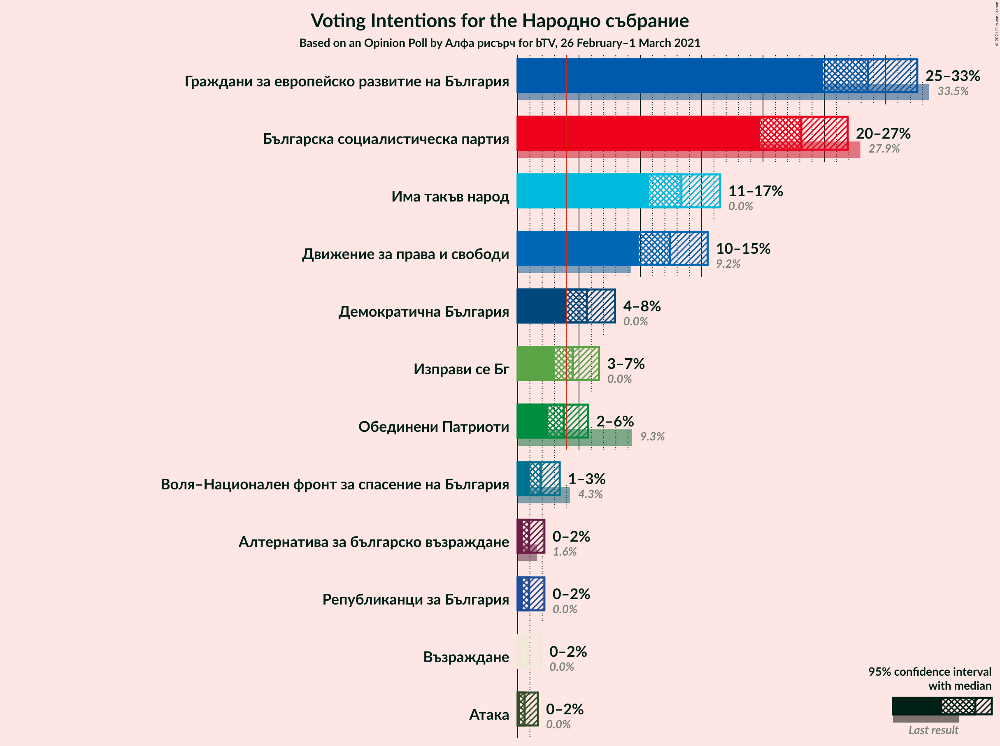

### Confidence Intervals

| Party | Last Result | Poll Result | 80% Confidence Interval | 90% Confidence Interval | 95% Confidence Interval | 99% Confidence Interval |
|:-----:|:-----------:|:-----------:|:-----------------------:|:-----------------------:|:-----------------------:|:-----------------------:|
| Граждани за европейско развитие на България | 33.5% | 28.6% | 26.2–31.2% |25.5–31.9% |24.9–32.6% |23.8–33.8% |
| Българска социалистическа партия | 27.9% | 23.1% | 20.9–25.6% |20.3–26.3% |19.7–26.9% |18.7–28.1% |
| Има такъв народ | 0.0% | 13.3% | 11.6–15.4% |11.1–16.0% |10.7–16.5% |9.9–17.5% |
| Движение за права и свободи | 9.2% | 12.4% | 10.7–14.4% |10.3–15.0% |9.9–15.5% |9.1–16.5% |
| Демократична България | 0.0% | 5.6% | 4.5–7.1% |4.2–7.6% |4.0–7.9% |3.5–8.7% |
| Изправи се Бг | 0.0% | 4.5% | 3.6–5.9% |3.3–6.3% |3.0–6.6% |2.6–7.3% |
| Обединени Патриоти | 9.3% | 3.8% | 2.9–5.0% |2.7–5.4% |2.5–5.7% |2.1–6.4% |
| Воля–Национален фронт за спасение на България | 4.3% | 1.9% | 1.3–2.9% |1.2–3.2% |1.0–3.4% |0.8–4.0% |
| Алтернатива за българско възраждане | 1.6% | 0.9% | 0.6–1.7% |0.5–2.0% |0.4–2.2% |0.3–2.6% |
| Републиканци за България | 0.0% | 0.9% | 0.6–1.7% |0.5–2.0% |0.4–2.2% |0.3–2.6% |
| Възраждане | 0.0% | 0.8% | 0.4–1.5% |0.4–1.7% |0.3–1.9% |0.2–2.3% |
| Атака | 0.0% | 0.6% | 0.3–1.2% |0.2–1.5% |0.2–1.6% |0.1–2.1% |

*Note:* The poll result column reflects the actual value used in the calculations. Published results may vary slightly, and in addition be rounded to fewer digits.

## Seats

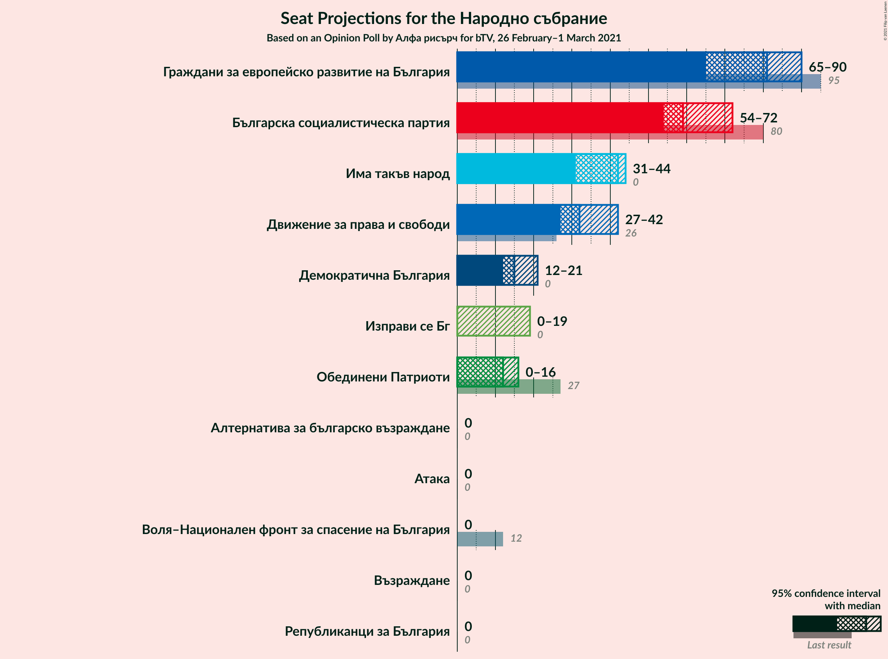

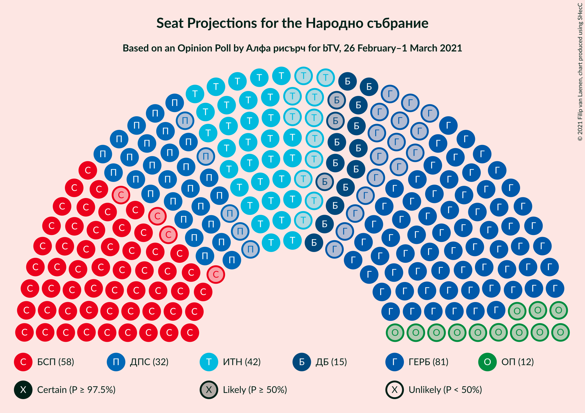

### Confidence Intervals

| Party | Last Result | Median | 80% Confidence Interval | 90% Confidence Interval | 95% Confidence Interval | 99% Confidence Interval |
|:-----:|:-----------:|:------:|:-----------------------:|:-----------------------:|:-----------------------:|:-----------------------:|
| <a href="#граждани-за-европейско-развитие-на-българия">Граждани за европейско развитие на България</a> | 95 | 81 | 71–87 |66–89 |65–90 |60–90 |
| <a href="#българска-социалистическа-партия">Българска социалистическа партия</a> | 80 | 59 | 57–72 |56–72 |54–72 |51–73 |
| <a href="#има-такъв-народ">Има такъв народ</a> | 0 | 42 | 33–42 |32–42 |31–44 |28–47 |
| <a href="#движение-за-права-и-свободи">Движение за права и свободи</a> | 26 | 32 | 31–38 |28–39 |27–42 |25–45 |
| <a href="#демократична-българия">Демократична България</a> | 0 | 15 | 13–18 |12–20 |12–21 |0–23 |
| <a href="#изправи-се-бг">Изправи се Бг</a> | 0 | 0 | 0–15 |0–16 |0–19 |0–21 |
| <a href="#обединени-патриоти">Обединени Патриоти</a> | 27 | 12 | 0–13 |0–14 |0–16 |0–17 |
| <a href="#воля–национален-фронт-за-спасение-на-българия">Воля–Национален фронт за спасение на България</a> | 12 | 0 | 0 |0 |0 |0 |
| <a href="#алтернатива-за-българско-възраждане">Алтернатива за българско възраждане</a> | 0 | 0 | 0 |0 |0 |0 |
| <a href="#републиканци-за-българия">Републиканци за България</a> | 0 | 0 | 0 |0 |0 |0 |
| <a href="#възраждане">Възраждане</a> | 0 | 0 | 0 |0 |0 |0 |
| <a href="#атака">Атака</a> | 0 | 0 | 0 |0 |0 |0 |

### Граждани за европейско развитие на България

*For a full overview of the results for this party, see the [Граждани за европейско развитие на България](party-гражданизаевропейскоразвитиенабългария.html) page.*

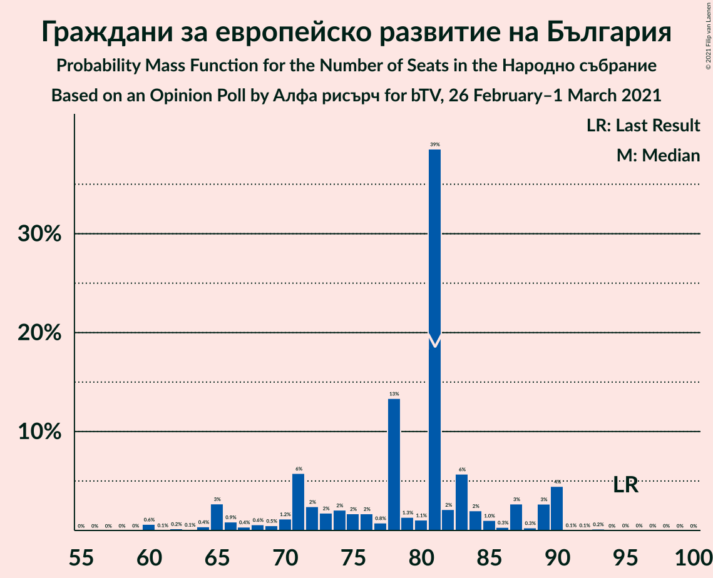

| Number of Seats | Probability | Accumulated | Special Marks |
|:---------------:|:-----------:|:-----------:|:-------------:|
| 60 | 0.6% | 100% |  |
| 61 | 0.1% | 99.3% |  |
| 62 | 0.2% | 99.3% |  |
| 63 | 0.1% | 99.1% |  |
| 64 | 0.4% | 99.0% |  |
| 65 | 3% | 98.6% |  |
| 66 | 0.9% | 96% |  |
| 67 | 0.4% | 95% |  |
| 68 | 0.6% | 95% |  |
| 69 | 0.5% | 94% |  |
| 70 | 1.2% | 94% |  |
| 71 | 6% | 92% |  |
| 72 | 2% | 87% |  |
| 73 | 2% | 84% |  |
| 74 | 2% | 82% |  |
| 75 | 2% | 80% |  |
| 76 | 2% | 79% |  |
| 77 | 0.8% | 77% |  |
| 78 | 13% | 76% |  |
| 79 | 1.3% | 63% |  |
| 80 | 1.1% | 61% |  |
| 81 | 39% | 60% | Median |
| 82 | 2% | 22% |  |
| 83 | 6% | 20% |  |
| 84 | 2% | 14% |  |
| 85 | 1.0% | 12% |  |
| 86 | 0.3% | 11% |  |
| 87 | 3% | 11% |  |
| 88 | 0.3% | 8% |  |
| 89 | 3% | 8% |  |
| 90 | 4% | 5% |  |
| 91 | 0.1% | 0.4% |  |
| 92 | 0.1% | 0.3% |  |
| 93 | 0.2% | 0.3% |  |
| 94 | 0% | 0.1% |  |
| 95 | 0% | 0.1% | Last Result |
| 96 | 0% | 0.1% |  |
| 97 | 0% | 0% |  |

### Българска социалистическа партия

*For a full overview of the results for this party, see the [Българска социалистическа партия](party-българскасоциалистическапартия.html) page.*

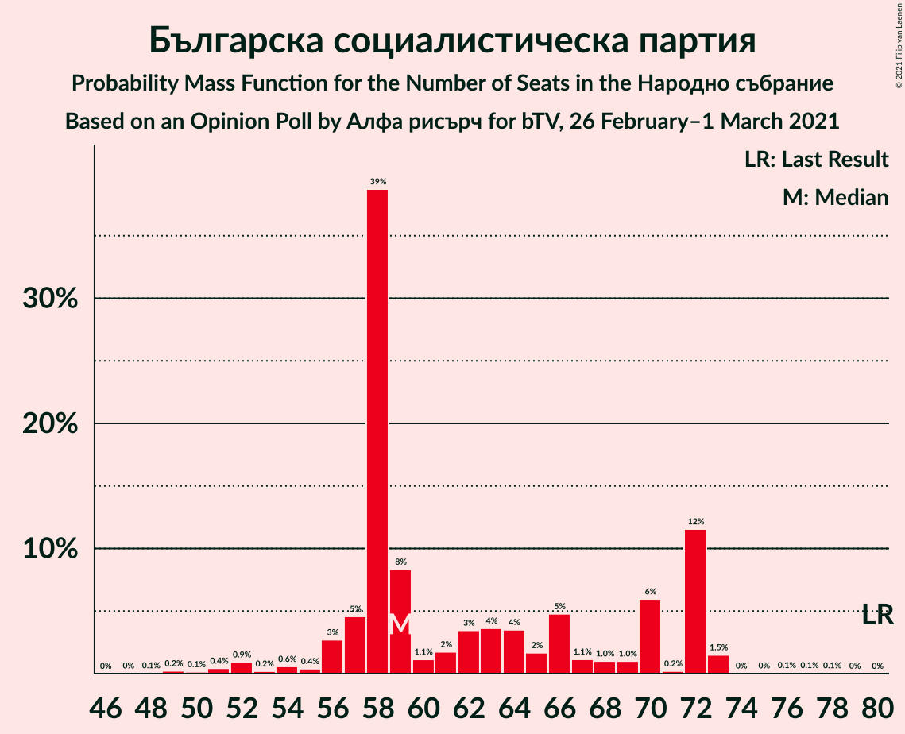

| Number of Seats | Probability | Accumulated | Special Marks |
|:---------------:|:-----------:|:-----------:|:-------------:|
| 47 | 0% | 100% |  |
| 48 | 0.1% | 99.9% |  |
| 49 | 0.2% | 99.9% |  |
| 50 | 0.1% | 99.7% |  |
| 51 | 0.4% | 99.5% |  |
| 52 | 0.9% | 99.1% |  |
| 53 | 0.2% | 98% |  |
| 54 | 0.6% | 98% |  |
| 55 | 0.4% | 97% |  |
| 56 | 3% | 97% |  |
| 57 | 5% | 94% |  |
| 58 | 39% | 90% |  |
| 59 | 8% | 51% | Median |
| 60 | 1.1% | 43% |  |
| 61 | 2% | 42% |  |
| 62 | 3% | 40% |  |
| 63 | 4% | 36% |  |
| 64 | 4% | 33% |  |
| 65 | 2% | 29% |  |
| 66 | 5% | 28% |  |
| 67 | 1.1% | 23% |  |
| 68 | 1.0% | 22% |  |
| 69 | 1.0% | 21% |  |
| 70 | 6% | 20% |  |
| 71 | 0.2% | 14% |  |
| 72 | 12% | 13% |  |
| 73 | 1.5% | 2% |  |
| 74 | 0% | 0.3% |  |
| 75 | 0% | 0.3% |  |
| 76 | 0.1% | 0.3% |  |
| 77 | 0.1% | 0.2% |  |
| 78 | 0.1% | 0.1% |  |
| 79 | 0% | 0.1% |  |
| 80 | 0% | 0% | Last Result |

### Има такъв народ

*For a full overview of the results for this party, see the [Има такъв народ](party-иматакъвнарод.html) page.*

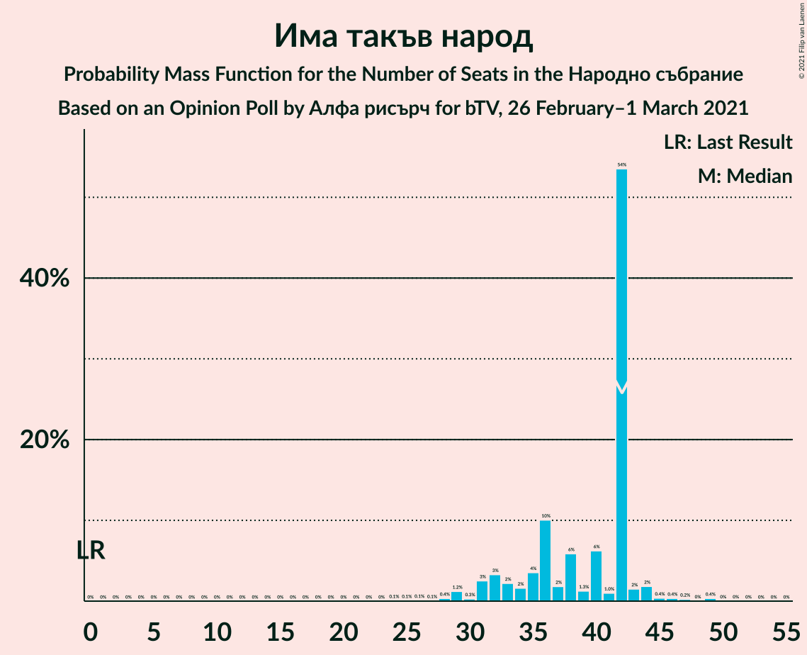

| Number of Seats | Probability | Accumulated | Special Marks |
|:---------------:|:-----------:|:-----------:|:-------------:|
| 0 | 0% | 100% | Last Result |
| 1 | 0% | 100% |  |
| 2 | 0% | 100% |  |
| 3 | 0% | 100% |  |
| 4 | 0% | 100% |  |
| 5 | 0% | 100% |  |
| 6 | 0% | 100% |  |
| 7 | 0% | 100% |  |
| 8 | 0% | 100% |  |
| 9 | 0% | 100% |  |
| 10 | 0% | 100% |  |
| 11 | 0% | 100% |  |
| 12 | 0% | 100% |  |
| 13 | 0% | 100% |  |
| 14 | 0% | 100% |  |
| 15 | 0% | 100% |  |
| 16 | 0% | 100% |  |
| 17 | 0% | 100% |  |
| 18 | 0% | 100% |  |
| 19 | 0% | 100% |  |
| 20 | 0% | 100% |  |
| 21 | 0% | 100% |  |
| 22 | 0% | 100% |  |
| 23 | 0% | 100% |  |
| 24 | 0.1% | 100% |  |
| 25 | 0.1% | 99.9% |  |
| 26 | 0.1% | 99.8% |  |
| 27 | 0.1% | 99.7% |  |
| 28 | 0.4% | 99.7% |  |
| 29 | 1.2% | 99.3% |  |
| 30 | 0.3% | 98% |  |
| 31 | 3% | 98% |  |
| 32 | 3% | 95% |  |
| 33 | 2% | 92% |  |
| 34 | 2% | 90% |  |
| 35 | 4% | 88% |  |
| 36 | 10% | 85% |  |
| 37 | 2% | 75% |  |
| 38 | 6% | 73% |  |
| 39 | 1.3% | 67% |  |
| 40 | 6% | 66% |  |
| 41 | 1.0% | 59% |  |
| 42 | 54% | 58% | Median |
| 43 | 2% | 5% |  |
| 44 | 2% | 3% |  |
| 45 | 0.4% | 1.4% |  |
| 46 | 0.4% | 1.1% |  |
| 47 | 0.2% | 0.7% |  |
| 48 | 0% | 0.5% |  |
| 49 | 0.4% | 0.4% |  |
| 50 | 0% | 0.1% |  |
| 51 | 0% | 0% |  |

### Движение за права и свободи

*For a full overview of the results for this party, see the [Движение за права и свободи](party-движениезаправаисвободи.html) page.*

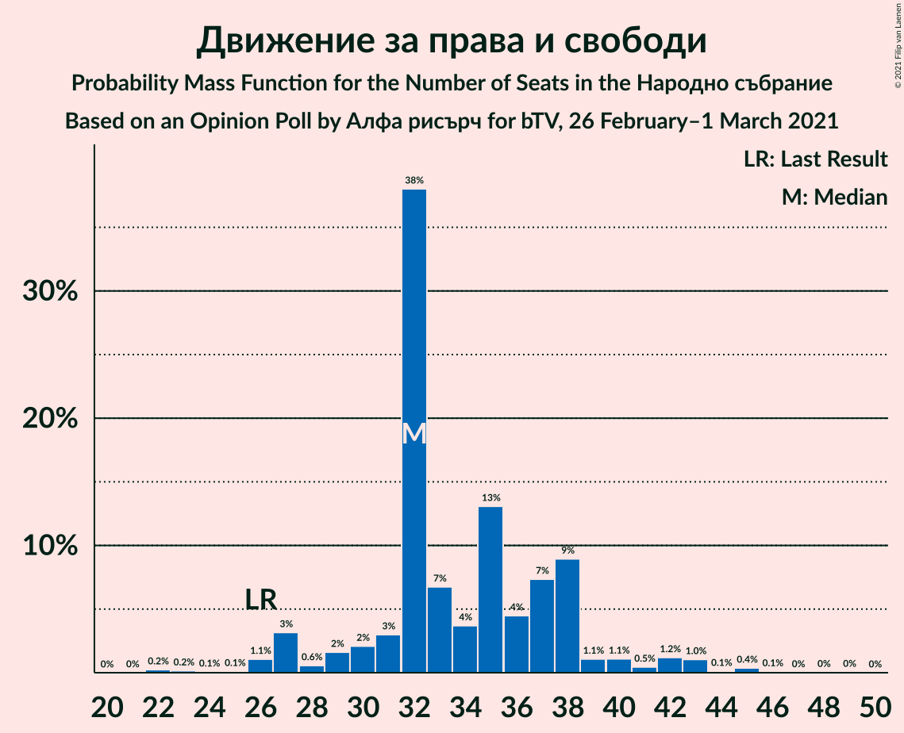

| Number of Seats | Probability | Accumulated | Special Marks |
|:---------------:|:-----------:|:-----------:|:-------------:|
| 22 | 0.2% | 100% |  |
| 23 | 0.2% | 99.7% |  |
| 24 | 0.1% | 99.6% |  |
| 25 | 0.1% | 99.5% |  |
| 26 | 1.1% | 99.4% | Last Result |
| 27 | 3% | 98% |  |
| 28 | 0.6% | 95% |  |
| 29 | 2% | 95% |  |
| 30 | 2% | 93% |  |
| 31 | 3% | 91% |  |
| 32 | 38% | 88% | Median |
| 33 | 7% | 50% |  |
| 34 | 4% | 43% |  |
| 35 | 13% | 39% |  |
| 36 | 4% | 26% |  |
| 37 | 7% | 22% |  |
| 38 | 9% | 15% |  |
| 39 | 1.1% | 6% |  |
| 40 | 1.1% | 4% |  |
| 41 | 0.5% | 3% |  |
| 42 | 1.2% | 3% |  |
| 43 | 1.0% | 2% |  |
| 44 | 0.1% | 0.7% |  |
| 45 | 0.4% | 0.6% |  |
| 46 | 0.1% | 0.2% |  |
| 47 | 0% | 0.1% |  |
| 48 | 0% | 0.1% |  |
| 49 | 0% | 0.1% |  |
| 50 | 0% | 0% |  |

### Демократична България

*For a full overview of the results for this party, see the [Демократична България](party-демократичнабългария.html) page.*

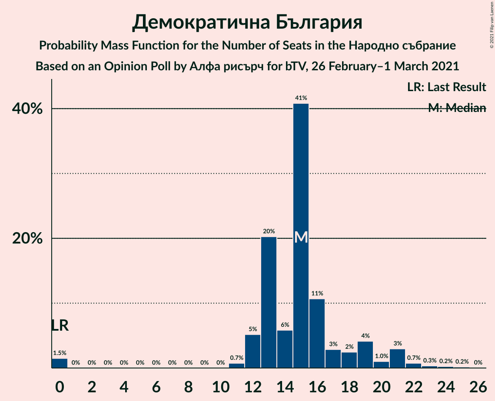

| Number of Seats | Probability | Accumulated | Special Marks |
|:---------------:|:-----------:|:-----------:|:-------------:|
| 0 | 1.5% | 100% | Last Result |
| 1 | 0% | 98.5% |  |
| 2 | 0% | 98.5% |  |
| 3 | 0% | 98.5% |  |
| 4 | 0% | 98.5% |  |
| 5 | 0% | 98.5% |  |
| 6 | 0% | 98.5% |  |
| 7 | 0% | 98.5% |  |
| 8 | 0% | 98.5% |  |
| 9 | 0% | 98.5% |  |
| 10 | 0% | 98.5% |  |
| 11 | 0.7% | 98.5% |  |
| 12 | 5% | 98% |  |
| 13 | 20% | 93% |  |
| 14 | 6% | 72% |  |
| 15 | 41% | 66% | Median |
| 16 | 11% | 26% |  |
| 17 | 3% | 15% |  |
| 18 | 2% | 12% |  |
| 19 | 4% | 10% |  |
| 20 | 1.0% | 6% |  |
| 21 | 3% | 5% |  |
| 22 | 0.7% | 2% |  |
| 23 | 0.3% | 0.8% |  |
| 24 | 0.2% | 0.5% |  |
| 25 | 0.2% | 0.2% |  |
| 26 | 0% | 0% |  |

### Изправи се Бг

*For a full overview of the results for this party, see the [Изправи се Бг](party-изправисебг.html) page.*

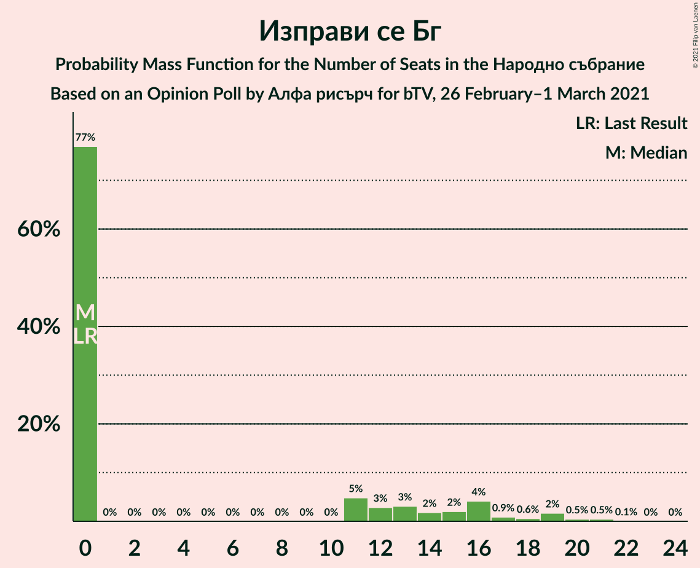

| Number of Seats | Probability | Accumulated | Special Marks |
|:---------------:|:-----------:|:-----------:|:-------------:|
| 0 | 77% | 100% | Last Result, Median |
| 1 | 0% | 23% |  |
| 2 | 0% | 23% |  |
| 3 | 0% | 23% |  |
| 4 | 0% | 23% |  |
| 5 | 0% | 23% |  |
| 6 | 0% | 23% |  |
| 7 | 0% | 23% |  |
| 8 | 0% | 23% |  |
| 9 | 0% | 23% |  |
| 10 | 0% | 23% |  |
| 11 | 5% | 23% |  |
| 12 | 3% | 18% |  |
| 13 | 3% | 15% |  |
| 14 | 2% | 12% |  |
| 15 | 2% | 10% |  |
| 16 | 4% | 8% |  |
| 17 | 0.9% | 4% |  |
| 18 | 0.6% | 3% |  |
| 19 | 2% | 3% |  |
| 20 | 0.5% | 1.0% |  |
| 21 | 0.5% | 0.5% |  |
| 22 | 0.1% | 0.1% |  |
| 23 | 0% | 0% |  |

### Обединени Патриоти

*For a full overview of the results for this party, see the [Обединени Патриоти](party-обединенипатриоти.html) page.*

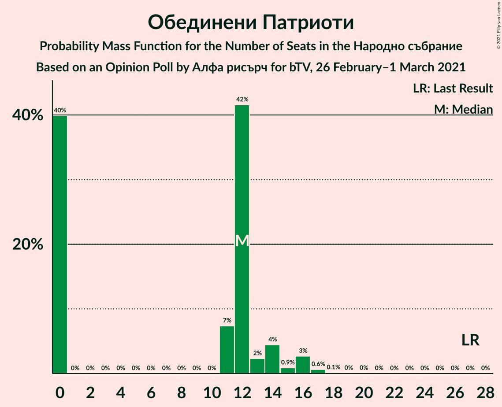

| Number of Seats | Probability | Accumulated | Special Marks |
|:---------------:|:-----------:|:-----------:|:-------------:|
| 0 | 40% | 100% |  |
| 1 | 0% | 60% |  |
| 2 | 0% | 60% |  |
| 3 | 0% | 60% |  |
| 4 | 0% | 60% |  |
| 5 | 0% | 60% |  |
| 6 | 0% | 60% |  |
| 7 | 0% | 60% |  |
| 8 | 0% | 60% |  |
| 9 | 0% | 60% |  |
| 10 | 0% | 60% |  |
| 11 | 7% | 60% |  |
| 12 | 42% | 53% | Median |
| 13 | 2% | 11% |  |
| 14 | 4% | 9% |  |
| 15 | 0.9% | 4% |  |
| 16 | 3% | 4% |  |
| 17 | 0.6% | 0.9% |  |
| 18 | 0.1% | 0.2% |  |
| 19 | 0% | 0.1% |  |
| 20 | 0% | 0.1% |  |
| 21 | 0% | 0% |  |
| 22 | 0% | 0% |  |
| 23 | 0% | 0% |  |
| 24 | 0% | 0% |  |
| 25 | 0% | 0% |  |
| 26 | 0% | 0% |  |
| 27 | 0% | 0% | Last Result |

### Воля–Национален фронт за спасение на България

*For a full overview of the results for this party, see the [Воля–Национален фронт за спасение на България](party-воля–националенфронтзаспасениенабългария.html) page.*

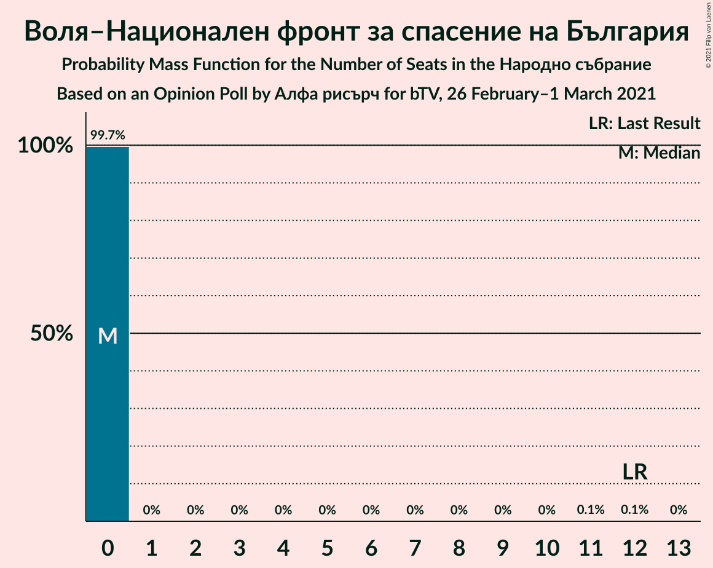

| Number of Seats | Probability | Accumulated | Special Marks |
|:---------------:|:-----------:|:-----------:|:-------------:|
| 0 | 99.7% | 100% | Median |
| 1 | 0% | 0.3% |  |
| 2 | 0% | 0.3% |  |
| 3 | 0% | 0.3% |  |
| 4 | 0% | 0.3% |  |
| 5 | 0% | 0.3% |  |
| 6 | 0% | 0.3% |  |
| 7 | 0% | 0.3% |  |
| 8 | 0% | 0.3% |  |
| 9 | 0% | 0.3% |  |
| 10 | 0% | 0.3% |  |
| 11 | 0.1% | 0.3% |  |
| 12 | 0.1% | 0.2% | Last Result |
| 13 | 0% | 0% |  |

### Алтернатива за българско възраждане

*For a full overview of the results for this party, see the [Алтернатива за българско възраждане](party-алтернативазабългарсковъзраждане.html) page.*

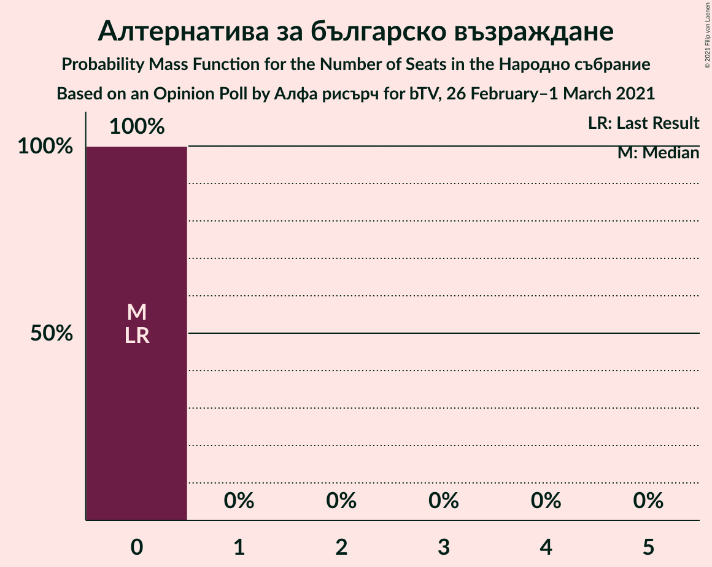

| Number of Seats | Probability | Accumulated | Special Marks |
|:---------------:|:-----------:|:-----------:|:-------------:|
| 0 | 100% | 100% | Last Result, Median |

### Републиканци за България

*For a full overview of the results for this party, see the [Републиканци за България](party-републиканцизабългария.html) page.*

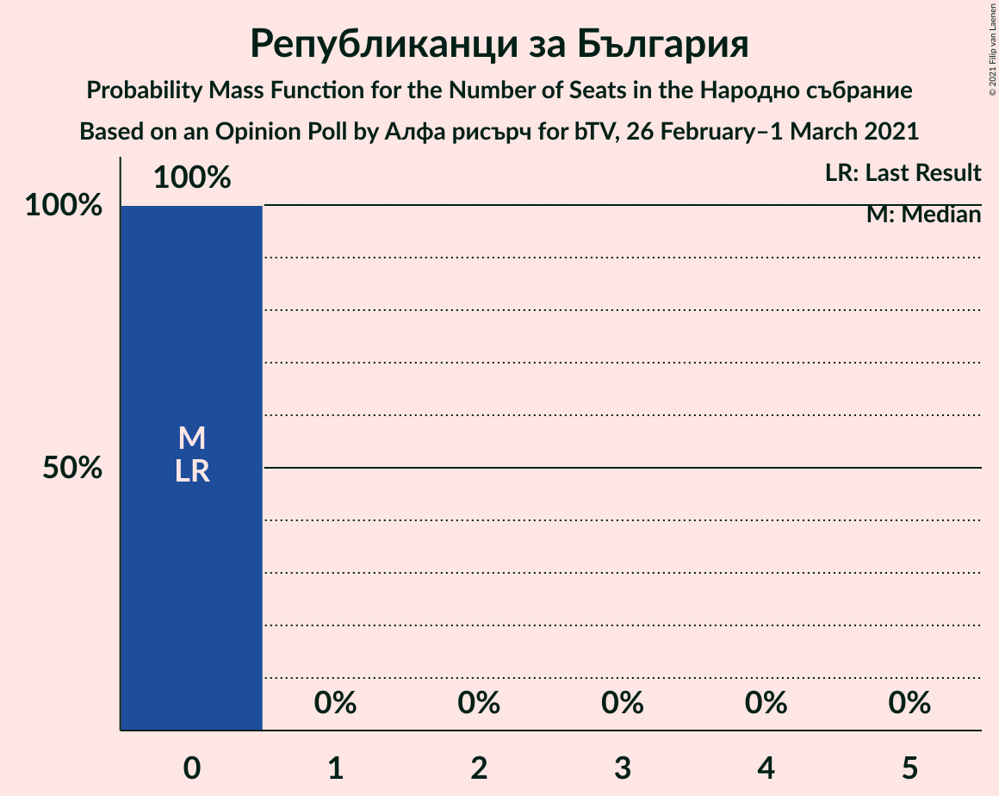

| Number of Seats | Probability | Accumulated | Special Marks |
|:---------------:|:-----------:|:-----------:|:-------------:|
| 0 | 100% | 100% | Last Result, Median |

### Възраждане

*For a full overview of the results for this party, see the [Възраждане](party-възраждане.html) page.*

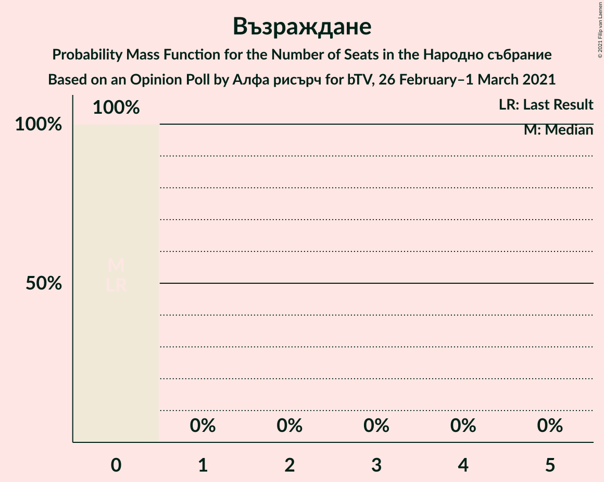

| Number of Seats | Probability | Accumulated | Special Marks |
|:---------------:|:-----------:|:-----------:|:-------------:|
| 0 | 100% | 100% | Last Result, Median |

### Атака

*For a full overview of the results for this party, see the [Атака](party-атака.html) page.*

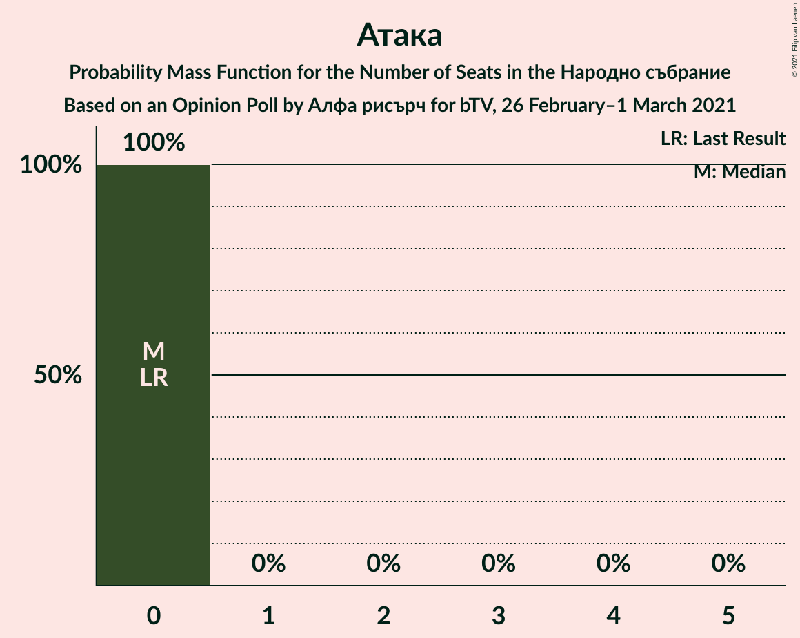

| Number of Seats | Probability | Accumulated | Special Marks |
|:---------------:|:-----------:|:-----------:|:-------------:|
| 0 | 100% | 100% | Last Result, Median |

## Coalitions

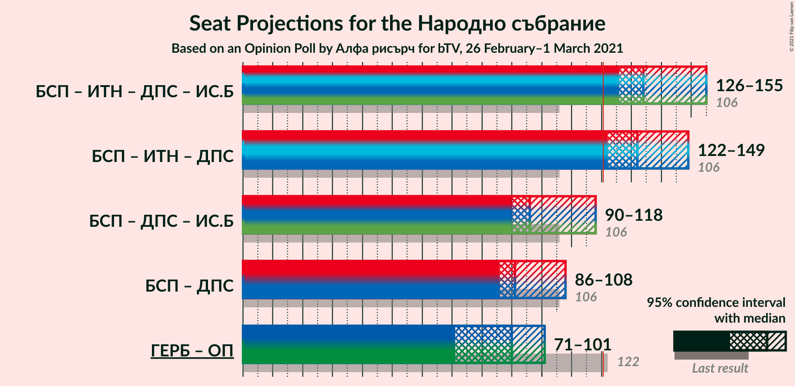

### Confidence Intervals

| Coalition | Last Result | Median | Majority? | 80% Confidence Interval | 90% Confidence Interval | 95% Confidence Interval | 99% Confidence Interval |
|:---------:|:-----------:|:------:|:---------:|:-----------------------:|:-----------------------:|:-----------------------:|:-----------------------:|
| Българска социалистическа партия – Има такъв народ – Движение за права и свободи – Изправи се Бг | 106 | 134 | 99.9% | 132–149 | 127–153 | 126–155 | 126–160 |
| Българска социалистическа партия – Има такъв народ – Движение за права и свободи | 106 | 132 | 98.9% | 126–149 | 123–149 | 122–149 | 117–149 |
| Българска социалистическа партия – Движение за права и свободи – Изправи се Бг | 106 | 96 | 0.8% | 90–110 | 90–113 | 90–118 | 85–124 |
| Българска социалистическа партия – Движение за права и свободи | 106 | 91 | 0% | 90–107 | 88–108 | 86–108 | 82–112 |
| Граждани за европейско развитие на България – Обединени Патриоти | 122 | 90 | 0% | 76–93 | 72–98 | 71–101 | 65–101 |

### Българска социалистическа партия – Има такъв народ – Движение за права и свободи – Изправи се Бг

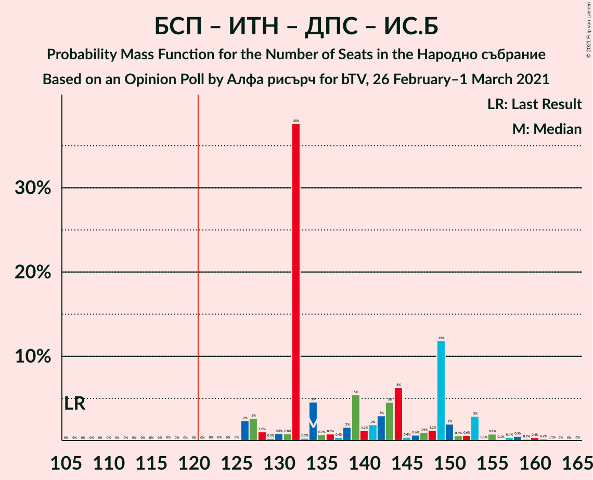

| Number of Seats | Probability | Accumulated | Special Marks |
|:---------------:|:-----------:|:-----------:|:-------------:|
| 106 | 0% | 100% | Last Result |
| 107 | 0% | 100% |  |
| 108 | 0% | 100% |  |
| 109 | 0% | 100% |  |
| 110 | 0% | 100% |  |
| 111 | 0% | 100% |  |
| 112 | 0% | 100% |  |
| 113 | 0% | 100% |  |
| 114 | 0% | 100% |  |
| 115 | 0% | 100% |  |
| 116 | 0% | 100% |  |
| 117 | 0% | 100% |  |
| 118 | 0% | 100% |  |
| 119 | 0% | 100% |  |
| 120 | 0% | 100% |  |
| 121 | 0% | 99.9% | Majority |
| 122 | 0% | 99.9% |  |
| 123 | 0% | 99.9% |  |
| 124 | 0% | 99.8% |  |
| 125 | 0% | 99.8% |  |
| 126 | 2% | 99.8% |  |
| 127 | 3% | 97% |  |
| 128 | 1.0% | 95% |  |
| 129 | 0.3% | 94% |  |
| 130 | 0.8% | 93% |  |
| 131 | 0.8% | 93% |  |
| 132 | 38% | 92% |  |
| 133 | 0.3% | 54% | Median |
| 134 | 5% | 54% |  |
| 135 | 0.7% | 49% |  |
| 136 | 0.8% | 49% |  |
| 137 | 0.4% | 48% |  |
| 138 | 2% | 48% |  |
| 139 | 5% | 46% |  |
| 140 | 1.2% | 41% |  |
| 141 | 2% | 39% |  |
| 142 | 3% | 38% |  |
| 143 | 5% | 35% |  |
| 144 | 6% | 30% |  |
| 145 | 0.4% | 24% |  |
| 146 | 0.6% | 23% |  |
| 147 | 0.9% | 23% |  |
| 148 | 1.2% | 22% |  |
| 149 | 12% | 21% |  |
| 150 | 2% | 9% |  |
| 151 | 0.6% | 7% |  |
| 152 | 0.6% | 6% |  |
| 153 | 3% | 6% |  |
| 154 | 0.1% | 3% |  |
| 155 | 0.8% | 3% |  |
| 156 | 0.1% | 2% |  |
| 157 | 0.4% | 2% |  |
| 158 | 0.5% | 1.3% |  |
| 159 | 0.2% | 0.8% |  |
| 160 | 0.4% | 0.7% |  |
| 161 | 0.2% | 0.3% |  |
| 162 | 0.1% | 0.1% |  |
| 163 | 0% | 0.1% |  |
| 164 | 0% | 0% |  |

### Българска социалистическа партия – Има такъв народ – Движение за права и свободи

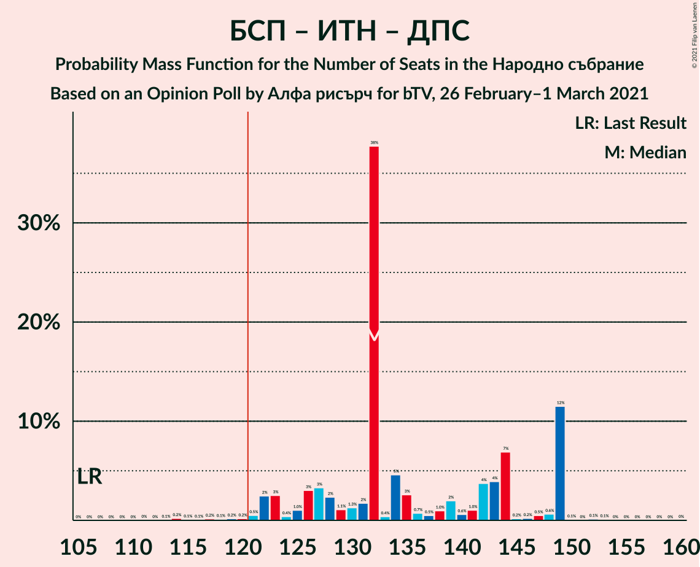

| Number of Seats | Probability | Accumulated | Special Marks |
|:---------------:|:-----------:|:-----------:|:-------------:|
| 106 | 0% | 100% | Last Result |
| 107 | 0% | 100% |  |
| 108 | 0% | 100% |  |
| 109 | 0% | 100% |  |
| 110 | 0% | 100% |  |
| 111 | 0% | 100% |  |
| 112 | 0% | 99.9% |  |
| 113 | 0.1% | 99.9% |  |
| 114 | 0.2% | 99.9% |  |
| 115 | 0.1% | 99.7% |  |
| 116 | 0.1% | 99.6% |  |
| 117 | 0.2% | 99.5% |  |
| 118 | 0.1% | 99.4% |  |
| 119 | 0.2% | 99.2% |  |
| 120 | 0.2% | 99.1% |  |
| 121 | 0.5% | 98.9% | Majority |
| 122 | 2% | 98% |  |
| 123 | 3% | 96% |  |
| 124 | 0.4% | 93% |  |
| 125 | 1.0% | 93% |  |
| 126 | 3% | 92% |  |
| 127 | 3% | 89% |  |
| 128 | 2% | 86% |  |
| 129 | 1.1% | 83% |  |
| 130 | 1.3% | 82% |  |
| 131 | 2% | 81% |  |
| 132 | 38% | 79% |  |
| 133 | 0.4% | 41% | Median |
| 134 | 5% | 41% |  |
| 135 | 3% | 36% |  |
| 136 | 0.7% | 34% |  |
| 137 | 0.5% | 33% |  |
| 138 | 1.0% | 33% |  |
| 139 | 2% | 32% |  |
| 140 | 0.6% | 30% |  |
| 141 | 1.0% | 29% |  |
| 142 | 4% | 28% |  |
| 143 | 4% | 24% |  |
| 144 | 7% | 20% |  |
| 145 | 0.2% | 13% |  |
| 146 | 0.2% | 13% |  |
| 147 | 0.5% | 13% |  |
| 148 | 0.6% | 13% |  |
| 149 | 12% | 12% |  |
| 150 | 0.1% | 0.4% |  |
| 151 | 0% | 0.3% |  |
| 152 | 0.1% | 0.3% |  |
| 153 | 0.1% | 0.2% |  |
| 154 | 0% | 0.1% |  |
| 155 | 0% | 0.1% |  |
| 156 | 0% | 0.1% |  |
| 157 | 0% | 0.1% |  |
| 158 | 0% | 0.1% |  |
| 159 | 0% | 0% |  |

### Българска социалистическа партия – Движение за права и свободи – Изправи се Бг

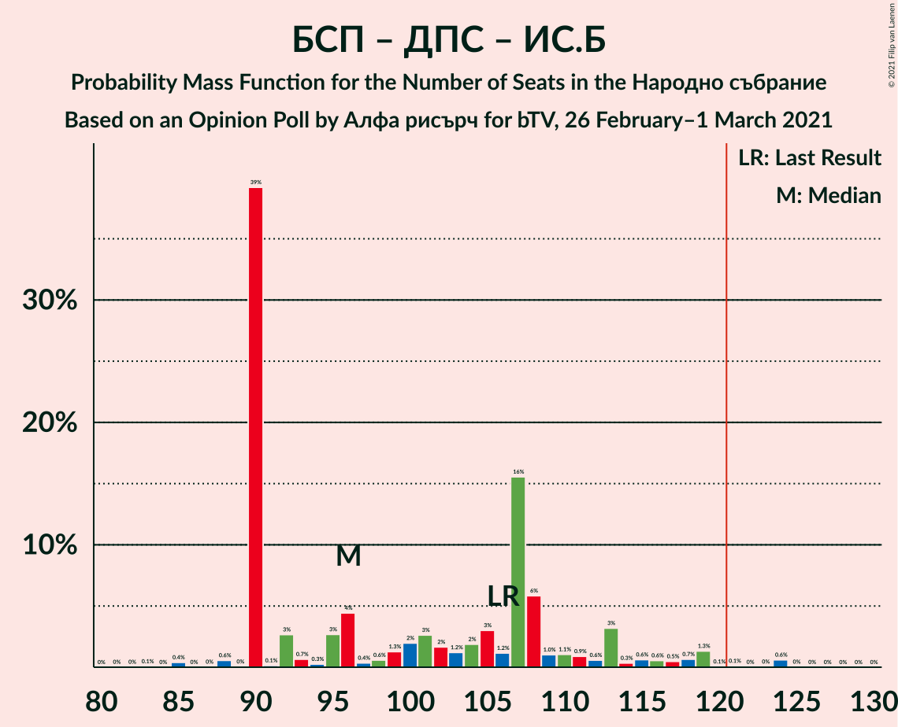

| Number of Seats | Probability | Accumulated | Special Marks |
|:---------------:|:-----------:|:-----------:|:-------------:|
| 82 | 0% | 100% |  |
| 83 | 0.1% | 99.9% |  |
| 84 | 0% | 99.9% |  |
| 85 | 0.4% | 99.9% |  |
| 86 | 0% | 99.5% |  |
| 87 | 0% | 99.5% |  |
| 88 | 0.6% | 99.4% |  |
| 89 | 0% | 98.9% |  |
| 90 | 39% | 98.8% |  |
| 91 | 0.1% | 60% | Median |
| 92 | 3% | 59% |  |
| 93 | 0.7% | 57% |  |
| 94 | 0.3% | 56% |  |
| 95 | 3% | 56% |  |
| 96 | 4% | 53% |  |
| 97 | 0.4% | 49% |  |
| 98 | 0.6% | 48% |  |
| 99 | 1.3% | 48% |  |
| 100 | 2% | 47% |  |
| 101 | 3% | 45% |  |
| 102 | 2% | 42% |  |
| 103 | 1.2% | 40% |  |
| 104 | 2% | 39% |  |
| 105 | 3% | 37% |  |
| 106 | 1.2% | 34% | Last Result |
| 107 | 16% | 33% |  |
| 108 | 6% | 17% |  |
| 109 | 1.0% | 12% |  |
| 110 | 1.1% | 11% |  |
| 111 | 0.9% | 10% |  |
| 112 | 0.6% | 9% |  |
| 113 | 3% | 8% |  |
| 114 | 0.3% | 5% |  |
| 115 | 0.6% | 5% |  |
| 116 | 0.6% | 4% |  |
| 117 | 0.5% | 3% |  |
| 118 | 0.7% | 3% |  |
| 119 | 1.3% | 2% |  |
| 120 | 0.1% | 0.9% |  |
| 121 | 0.1% | 0.8% | Majority |
| 122 | 0% | 0.7% |  |
| 123 | 0% | 0.7% |  |
| 124 | 0.6% | 0.7% |  |
| 125 | 0% | 0.1% |  |
| 126 | 0% | 0% |  |

### Българска социалистическа партия – Движение за права и свободи

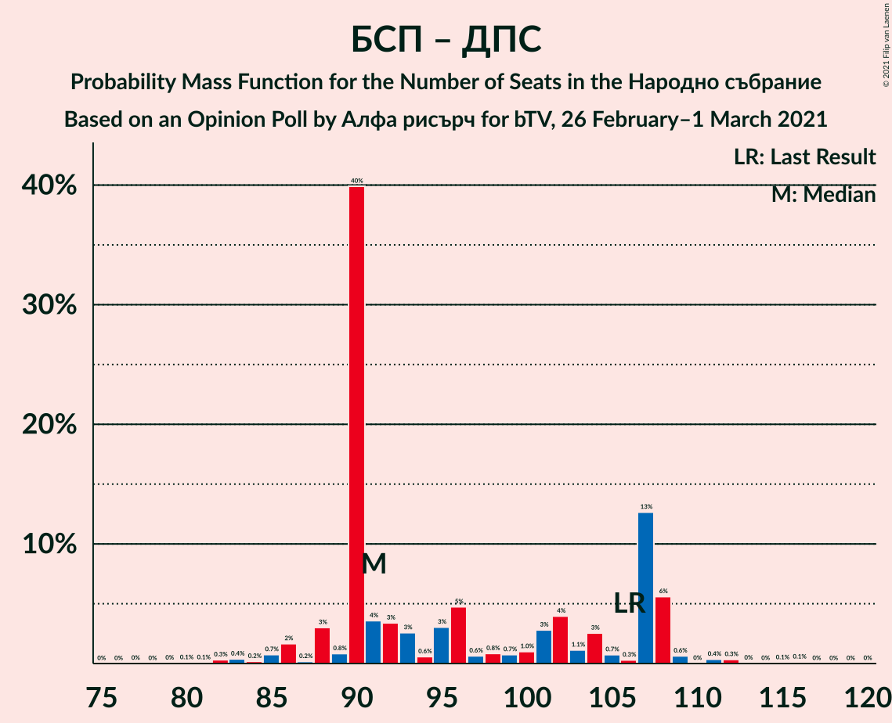

| Number of Seats | Probability | Accumulated | Special Marks |
|:---------------:|:-----------:|:-----------:|:-------------:|
| 79 | 0% | 100% |  |
| 80 | 0.1% | 99.9% |  |
| 81 | 0.1% | 99.8% |  |
| 82 | 0.3% | 99.8% |  |
| 83 | 0.4% | 99.4% |  |
| 84 | 0.2% | 99.1% |  |
| 85 | 0.7% | 98.9% |  |
| 86 | 2% | 98% |  |
| 87 | 0.2% | 96% |  |
| 88 | 3% | 96% |  |
| 89 | 0.8% | 93% |  |
| 90 | 40% | 92% |  |
| 91 | 4% | 53% | Median |
| 92 | 3% | 49% |  |
| 93 | 3% | 46% |  |
| 94 | 0.6% | 43% |  |
| 95 | 3% | 42% |  |
| 96 | 5% | 39% |  |
| 97 | 0.6% | 35% |  |
| 98 | 0.8% | 34% |  |
| 99 | 0.7% | 33% |  |
| 100 | 1.0% | 32% |  |
| 101 | 3% | 31% |  |
| 102 | 4% | 29% |  |
| 103 | 1.1% | 25% |  |
| 104 | 3% | 23% |  |
| 105 | 0.7% | 21% |  |
| 106 | 0.3% | 20% | Last Result |
| 107 | 13% | 20% |  |
| 108 | 6% | 7% |  |
| 109 | 0.6% | 2% |  |
| 110 | 0% | 1.0% |  |
| 111 | 0.4% | 1.0% |  |
| 112 | 0.3% | 0.6% |  |
| 113 | 0% | 0.3% |  |
| 114 | 0% | 0.3% |  |
| 115 | 0.1% | 0.2% |  |
| 116 | 0.1% | 0.2% |  |
| 117 | 0% | 0% |  |

### Граждани за европейско развитие на България – Обединени Патриоти

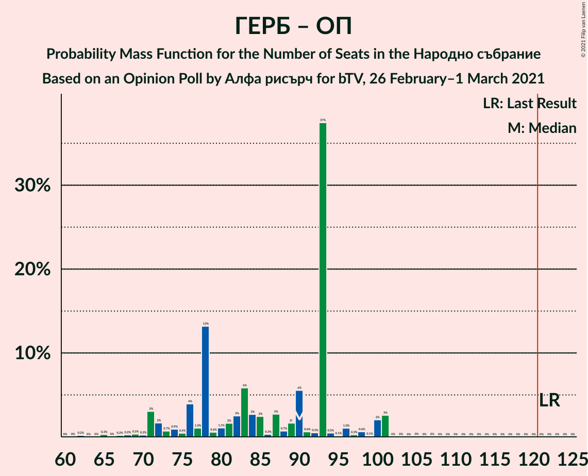

| Number of Seats | Probability | Accumulated | Special Marks |
|:---------------:|:-----------:|:-----------:|:-------------:|
| 62 | 0.2% | 100% |  |
| 63 | 0% | 99.8% |  |
| 64 | 0% | 99.8% |  |
| 65 | 0.3% | 99.7% |  |
| 66 | 0% | 99.5% |  |
| 67 | 0.2% | 99.4% |  |
| 68 | 0.2% | 99.3% |  |
| 69 | 0.3% | 99.0% |  |
| 70 | 0.2% | 98.7% |  |
| 71 | 3% | 98% |  |
| 72 | 2% | 95% |  |
| 73 | 0.7% | 94% |  |
| 74 | 0.9% | 93% |  |
| 75 | 0.4% | 92% |  |
| 76 | 4% | 92% |  |
| 77 | 1.0% | 88% |  |
| 78 | 13% | 87% |  |
| 79 | 0.6% | 74% |  |
| 80 | 1.1% | 73% |  |
| 81 | 2% | 72% |  |
| 82 | 3% | 70% |  |
| 83 | 6% | 68% |  |
| 84 | 3% | 62% |  |
| 85 | 2% | 59% |  |
| 86 | 0.3% | 57% |  |
| 87 | 3% | 56% |  |
| 88 | 0.7% | 54% |  |
| 89 | 2% | 53% |  |
| 90 | 6% | 51% |  |
| 91 | 0.6% | 46% |  |
| 92 | 0.5% | 45% |  |
| 93 | 37% | 45% | Median |
| 94 | 0.5% | 7% |  |
| 95 | 0.1% | 7% |  |
| 96 | 1.0% | 7% |  |
| 97 | 0.3% | 6% |  |
| 98 | 0.6% | 5% |  |
| 99 | 0.1% | 5% |  |
| 100 | 2% | 5% |  |
| 101 | 3% | 3% |  |
| 102 | 0% | 0.1% |  |
| 103 | 0% | 0.1% |  |
| 104 | 0% | 0.1% |  |
| 105 | 0% | 0.1% |  |
| 106 | 0% | 0% |  |
| 107 | 0% | 0% |  |
| 108 | 0% | 0% |  |
| 109 | 0% | 0% |  |
| 110 | 0% | 0% |  |
| 111 | 0% | 0% |  |
| 112 | 0% | 0% |  |
| 113 | 0% | 0% |  |
| 114 | 0% | 0% |  |
| 115 | 0% | 0% |  |
| 116 | 0% | 0% |  |
| 117 | 0% | 0% |  |
| 118 | 0% | 0% |  |
| 119 | 0% | 0% |  |
| 120 | 0% | 0% |  |
| 121 | 0% | 0% | Majority |
| 122 | 0% | 0% | Last Result |

## Technical Information

### Opinion Poll

+ **Polling firm:** Алфа рисърч
+ **Commissioner(s):** bTV
+ **Fieldwork period:** 26 February–1 March 2021

### Calculations

+ **Sample size:** 532
+ **Simulations done:** 1,048,576
+ **Error estimate:** 3.78%

