# Opinion Poll by Тренд for 24 часа, 9–14 March 2021

<a href="#voting-intentions">Voting Intentions</a> | <a href="#seats">Seats</a> | <a href="#coalitions">Coalitions</a> | <a href="#technical-information">Technical Information</a>

## Voting Intentions

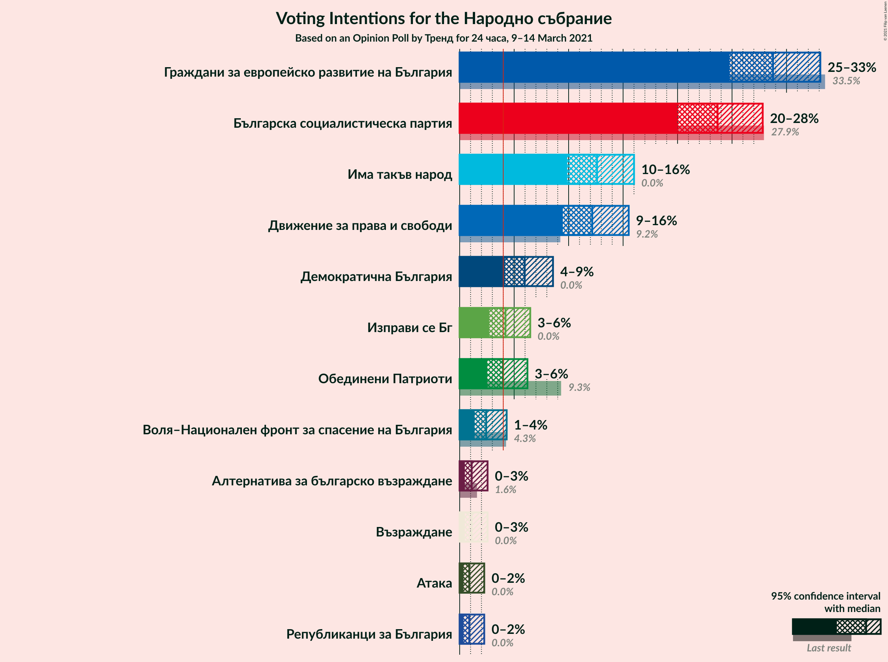

### Confidence Intervals

| Party | Last Result | Poll Result | 80% Confidence Interval | 90% Confidence Interval | 95% Confidence Interval | 99% Confidence Interval |
|:-----:|:-----------:|:-----------:|:-----------------------:|:-----------------------:|:-----------------------:|:-----------------------:|
| Граждани за европейско развитие на България | 33.5% | 28.8% | 26.1–31.6% |25.4–32.4% |24.8–33.1% |23.6–34.5% |
| Българска социалистическа партия | 27.9% | 23.7% | 21.2–26.4% |20.6–27.1% |20.0–27.8% |18.9–29.1% |
| Има такъв народ | 0.0% | 12.6% | 10.8–14.8% |10.3–15.4% |9.9–16.0% |9.1–17.1% |
| Движение за права и свободи | 9.2% | 12.2% | 10.4–14.4% |9.9–15.0% |9.5–15.5% |8.7–16.6% |
| Демократична България | 0.0% | 6.0% | 4.8–7.7% |4.4–8.1% |4.1–8.6% |3.6–9.4% |
| Изправи се Бг | 0.0% | 4.2% | 3.2–5.7% |2.9–6.1% |2.7–6.5% |2.3–7.3% |
| Обединени Патриоти | 9.3% | 4.0% | 3.0–5.4% |2.8–5.8% |2.5–6.2% |2.1–7.0% |
| Воля–Национален фронт за спасение на България | 4.3% | 2.4% | 1.7–3.6% |1.5–4.0% |1.4–4.3% |1.1–5.0% |
| Алтернатива за българско възраждане | 1.6% | 1.1% | 0.7–2.0% |0.6–2.3% |0.5–2.6% |0.3–3.1% |
| Възраждане | 0.0% | 1.1% | 0.7–2.0% |0.6–2.3% |0.5–2.6% |0.3–3.1% |
| Атака | 0.0% | 0.9% | 0.5–1.8% |0.4–2.0% |0.4–2.3% |0.2–2.8% |
| Републиканци за България | 0.0% | 0.9% | 0.5–1.8% |0.4–2.0% |0.4–2.3% |0.2–2.8% |

*Note:* The poll result column reflects the actual value used in the calculations. Published results may vary slightly, and in addition be rounded to fewer digits.

## Seats

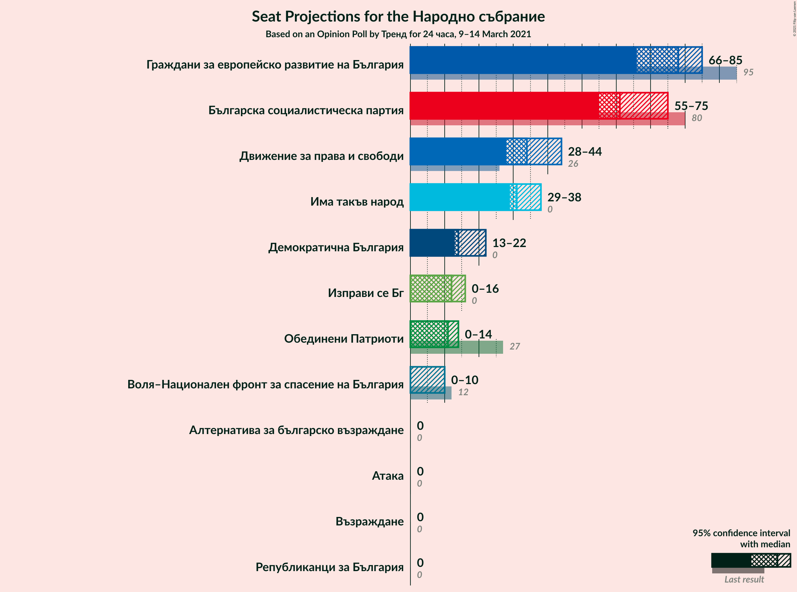

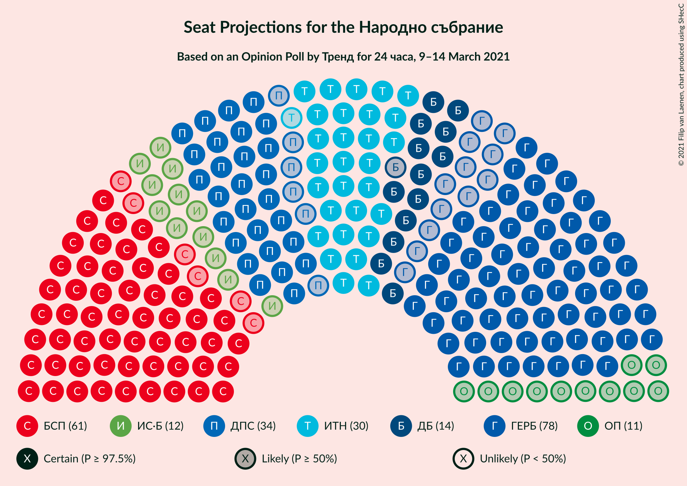

### Confidence Intervals

| Party | Last Result | Median | 80% Confidence Interval | 90% Confidence Interval | 95% Confidence Interval | 99% Confidence Interval |
|:-----:|:-----------:|:------:|:-----------------------:|:-----------------------:|:-----------------------:|:-----------------------:|
| <a href="#граждани-за-европейско-развитие-на-българия">Граждани за европейско развитие на България</a> | 95 | 78 | 69–80 |66–82 |66–85 |64–93 |
| <a href="#българска-социалистическа-партия">Българска социалистическа партия</a> | 80 | 61 | 55–75 |55–75 |55–75 |52–76 |
| <a href="#има-такъв-народ">Има такъв народ</a> | 0 | 31 | 30–36 |30–37 |29–38 |27–44 |
| <a href="#движение-за-права-и-свободи">Движение за права и свободи</a> | 26 | 34 | 31–35 |31–36 |28–44 |24–46 |
| <a href="#демократична-българия">Демократична България</a> | 0 | 14 | 13–18 |13–19 |13–22 |11–24 |
| <a href="#изправи-се-бг">Изправи се Бг</a> | 0 | 12 | 0–13 |0–16 |0–16 |0–18 |
| <a href="#обединени-патриоти">Обединени Патриоти</a> | 27 | 11 | 0–13 |0–13 |0–14 |0–17 |
| <a href="#воля–национален-фронт-за-спасение-на-българия">Воля–Национален фронт за спасение на България</a> | 12 | 0 | 0 |0–10 |0–10 |0–11 |
| <a href="#алтернатива-за-българско-възраждане">Алтернатива за българско възраждане</a> | 0 | 0 | 0 |0 |0 |0 |
| <a href="#възраждане">Възраждане</a> | 0 | 0 | 0 |0 |0 |0 |
| <a href="#атака">Атака</a> | 0 | 0 | 0 |0 |0 |0 |
| <a href="#републиканци-за-българия">Републиканци за България</a> | 0 | 0 | 0 |0 |0 |0 |

### Граждани за европейско развитие на България

*For a full overview of the results for this party, see the [Граждани за европейско развитие на България](party-гражданизаевропейскоразвитиенабългария.html) page.*

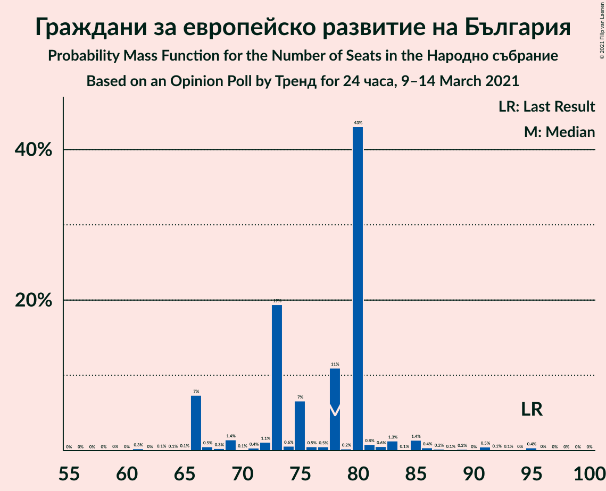

| Number of Seats | Probability | Accumulated | Special Marks |
|:---------------:|:-----------:|:-----------:|:-------------:|
| 59 | 0% | 100% |  |
| 60 | 0% | 99.9% |  |
| 61 | 0.3% | 99.9% |  |
| 62 | 0% | 99.7% |  |
| 63 | 0.1% | 99.6% |  |
| 64 | 0.1% | 99.5% |  |
| 65 | 0.1% | 99.5% |  |
| 66 | 7% | 99.3% |  |
| 67 | 0.5% | 92% |  |
| 68 | 0.3% | 91% |  |
| 69 | 1.4% | 91% |  |
| 70 | 0.1% | 90% |  |
| 71 | 0.4% | 90% |  |
| 72 | 1.1% | 89% |  |
| 73 | 19% | 88% |  |
| 74 | 0.6% | 69% |  |
| 75 | 7% | 68% |  |
| 76 | 0.5% | 61% |  |
| 77 | 0.5% | 61% |  |
| 78 | 11% | 60% | Median |
| 79 | 0.2% | 49% |  |
| 80 | 43% | 49% |  |
| 81 | 0.8% | 6% |  |
| 82 | 0.6% | 5% |  |
| 83 | 1.3% | 5% |  |
| 84 | 0.1% | 3% |  |
| 85 | 1.4% | 3% |  |
| 86 | 0.4% | 2% |  |
| 87 | 0.2% | 2% |  |
| 88 | 0.1% | 1.4% |  |
| 89 | 0.2% | 1.3% |  |
| 90 | 0% | 1.2% |  |
| 91 | 0.5% | 1.1% |  |
| 92 | 0.1% | 0.6% |  |
| 93 | 0.1% | 0.6% |  |
| 94 | 0% | 0.5% |  |
| 95 | 0.4% | 0.4% | Last Result |
| 96 | 0% | 0.1% |  |
| 97 | 0% | 0% |  |

### Българска социалистическа партия

*For a full overview of the results for this party, see the [Българска социалистическа партия](party-българскасоциалистическапартия.html) page.*

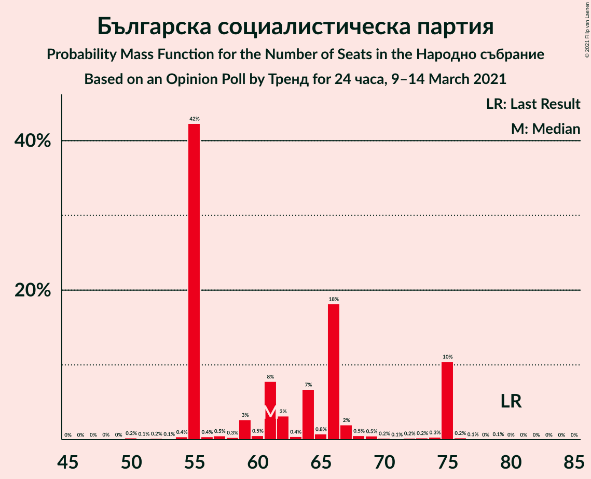

| Number of Seats | Probability | Accumulated | Special Marks |
|:---------------:|:-----------:|:-----------:|:-------------:|
| 48 | 0% | 100% |  |
| 49 | 0% | 99.9% |  |
| 50 | 0.2% | 99.9% |  |
| 51 | 0.1% | 99.7% |  |
| 52 | 0.2% | 99.5% |  |
| 53 | 0.1% | 99.4% |  |
| 54 | 0.4% | 99.2% |  |
| 55 | 42% | 98.9% |  |
| 56 | 0.4% | 57% |  |
| 57 | 0.5% | 56% |  |
| 58 | 0.3% | 56% |  |
| 59 | 3% | 55% |  |
| 60 | 0.5% | 53% |  |
| 61 | 8% | 52% | Median |
| 62 | 3% | 44% |  |
| 63 | 0.4% | 41% |  |
| 64 | 7% | 41% |  |
| 65 | 0.8% | 34% |  |
| 66 | 18% | 33% |  |
| 67 | 2% | 15% |  |
| 68 | 0.5% | 13% |  |
| 69 | 0.5% | 13% |  |
| 70 | 0.2% | 12% |  |
| 71 | 0.1% | 12% |  |
| 72 | 0.2% | 12% |  |
| 73 | 0.2% | 12% |  |
| 74 | 0.3% | 11% |  |
| 75 | 10% | 11% |  |
| 76 | 0.2% | 0.5% |  |
| 77 | 0.1% | 0.3% |  |
| 78 | 0% | 0.2% |  |
| 79 | 0.1% | 0.2% |  |
| 80 | 0% | 0.1% | Last Result |
| 81 | 0% | 0.1% |  |
| 82 | 0% | 0% |  |

### Има такъв народ

*For a full overview of the results for this party, see the [Има такъв народ](party-иматакъвнарод.html) page.*

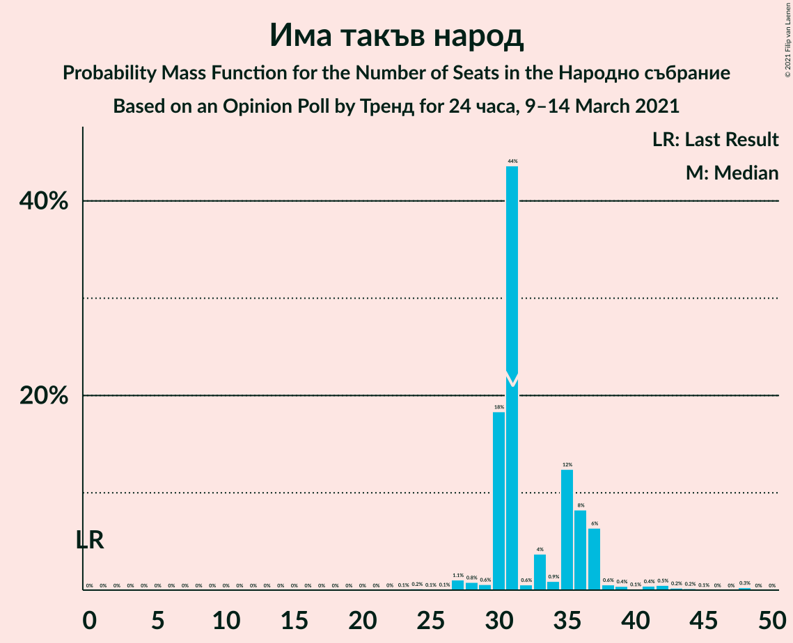

| Number of Seats | Probability | Accumulated | Special Marks |
|:---------------:|:-----------:|:-----------:|:-------------:|
| 0 | 0% | 100% | Last Result |
| 1 | 0% | 100% |  |
| 2 | 0% | 100% |  |
| 3 | 0% | 100% |  |
| 4 | 0% | 100% |  |
| 5 | 0% | 100% |  |
| 6 | 0% | 100% |  |
| 7 | 0% | 100% |  |
| 8 | 0% | 100% |  |
| 9 | 0% | 100% |  |
| 10 | 0% | 100% |  |
| 11 | 0% | 100% |  |
| 12 | 0% | 100% |  |
| 13 | 0% | 100% |  |
| 14 | 0% | 100% |  |
| 15 | 0% | 100% |  |
| 16 | 0% | 100% |  |
| 17 | 0% | 100% |  |
| 18 | 0% | 100% |  |
| 19 | 0% | 100% |  |
| 20 | 0% | 100% |  |
| 21 | 0% | 100% |  |
| 22 | 0% | 100% |  |
| 23 | 0.1% | 100% |  |
| 24 | 0.2% | 99.9% |  |
| 25 | 0.1% | 99.7% |  |
| 26 | 0.1% | 99.7% |  |
| 27 | 1.1% | 99.6% |  |
| 28 | 0.8% | 98.5% |  |
| 29 | 0.6% | 98% |  |
| 30 | 18% | 97% |  |
| 31 | 44% | 79% | Median |
| 32 | 0.6% | 35% |  |
| 33 | 4% | 35% |  |
| 34 | 0.9% | 31% |  |
| 35 | 12% | 30% |  |
| 36 | 8% | 17% |  |
| 37 | 6% | 9% |  |
| 38 | 0.6% | 3% |  |
| 39 | 0.4% | 2% |  |
| 40 | 0.1% | 2% |  |
| 41 | 0.4% | 2% |  |
| 42 | 0.5% | 1.3% |  |
| 43 | 0.2% | 0.8% |  |
| 44 | 0.2% | 0.5% |  |
| 45 | 0.1% | 0.4% |  |
| 46 | 0% | 0.3% |  |
| 47 | 0% | 0.3% |  |
| 48 | 0.3% | 0.3% |  |
| 49 | 0% | 0% |  |

### Движение за права и свободи

*For a full overview of the results for this party, see the [Движение за права и свободи](party-движениезаправаисвободи.html) page.*

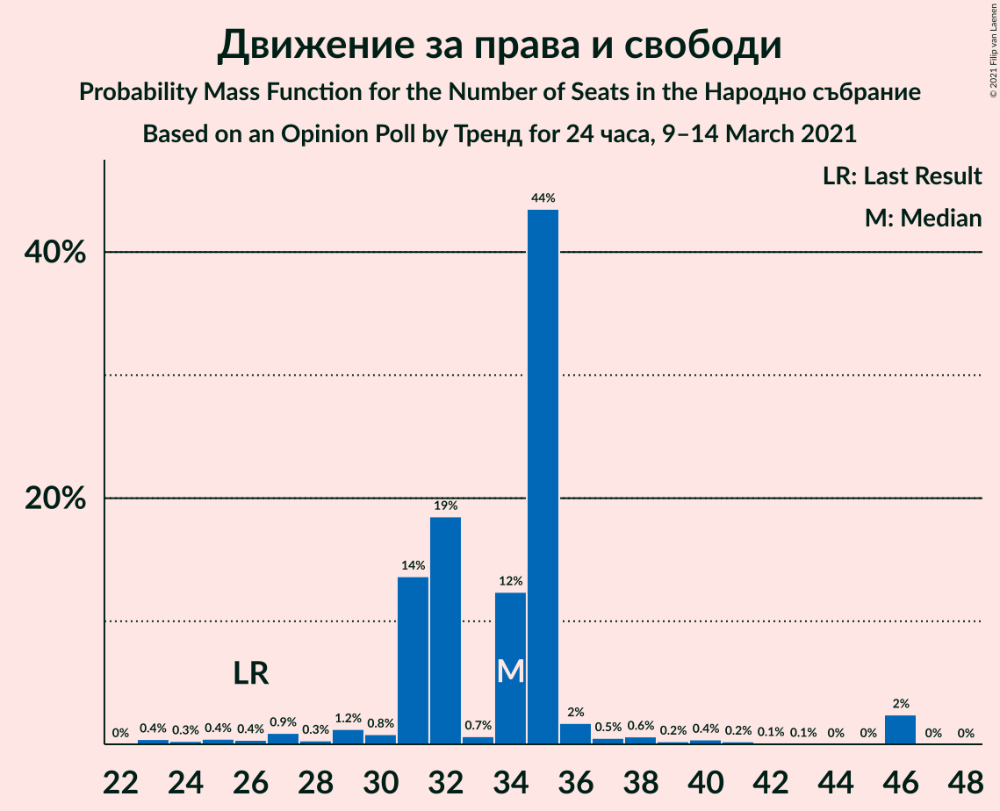

| Number of Seats | Probability | Accumulated | Special Marks |
|:---------------:|:-----------:|:-----------:|:-------------:|
| 22 | 0% | 100% |  |
| 23 | 0.4% | 99.9% |  |
| 24 | 0.3% | 99.5% |  |
| 25 | 0.4% | 99.2% |  |
| 26 | 0.4% | 98.8% | Last Result |
| 27 | 0.9% | 98% |  |
| 28 | 0.3% | 98% |  |
| 29 | 1.2% | 97% |  |
| 30 | 0.8% | 96% |  |
| 31 | 14% | 95% |  |
| 32 | 19% | 81% |  |
| 33 | 0.7% | 63% |  |
| 34 | 12% | 62% | Median |
| 35 | 44% | 50% |  |
| 36 | 2% | 6% |  |
| 37 | 0.5% | 5% |  |
| 38 | 0.6% | 4% |  |
| 39 | 0.2% | 4% |  |
| 40 | 0.4% | 3% |  |
| 41 | 0.2% | 3% |  |
| 42 | 0.1% | 3% |  |
| 43 | 0.1% | 3% |  |
| 44 | 0% | 3% |  |
| 45 | 0% | 2% |  |
| 46 | 2% | 2% |  |
| 47 | 0% | 0% |  |

### Демократична България

*For a full overview of the results for this party, see the [Демократична България](party-демократичнабългария.html) page.*

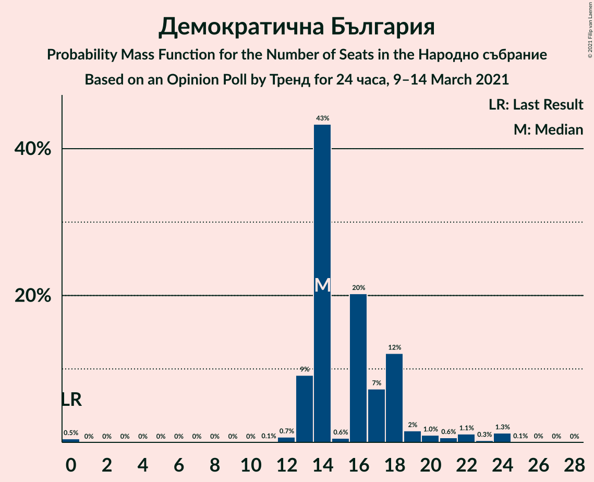

| Number of Seats | Probability | Accumulated | Special Marks |
|:---------------:|:-----------:|:-----------:|:-------------:|
| 0 | 0.5% | 100% | Last Result |
| 1 | 0% | 99.5% |  |
| 2 | 0% | 99.5% |  |
| 3 | 0% | 99.5% |  |
| 4 | 0% | 99.5% |  |
| 5 | 0% | 99.5% |  |
| 6 | 0% | 99.5% |  |
| 7 | 0% | 99.5% |  |
| 8 | 0% | 99.5% |  |
| 9 | 0% | 99.5% |  |
| 10 | 0% | 99.5% |  |
| 11 | 0.1% | 99.5% |  |
| 12 | 0.7% | 99.5% |  |
| 13 | 9% | 98.7% |  |
| 14 | 43% | 90% | Median |
| 15 | 0.6% | 46% |  |
| 16 | 20% | 46% |  |
| 17 | 7% | 25% |  |
| 18 | 12% | 18% |  |
| 19 | 2% | 6% |  |
| 20 | 1.0% | 4% |  |
| 21 | 0.6% | 3% |  |
| 22 | 1.1% | 3% |  |
| 23 | 0.3% | 2% |  |
| 24 | 1.3% | 1.4% |  |
| 25 | 0.1% | 0.1% |  |
| 26 | 0% | 0.1% |  |
| 27 | 0% | 0% |  |

### Изправи се Бг

*For a full overview of the results for this party, see the [Изправи се Бг](party-изправисебг.html) page.*

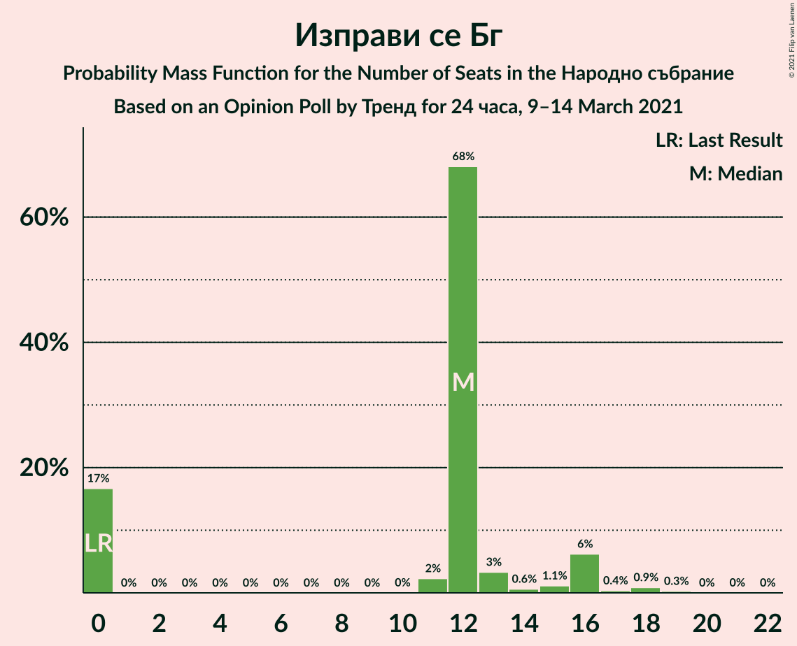

| Number of Seats | Probability | Accumulated | Special Marks |
|:---------------:|:-----------:|:-----------:|:-------------:|
| 0 | 17% | 100% | Last Result |
| 1 | 0% | 83% |  |
| 2 | 0% | 83% |  |
| 3 | 0% | 83% |  |
| 4 | 0% | 83% |  |
| 5 | 0% | 83% |  |
| 6 | 0% | 83% |  |
| 7 | 0% | 83% |  |
| 8 | 0% | 83% |  |
| 9 | 0% | 83% |  |
| 10 | 0% | 83% |  |
| 11 | 2% | 83% |  |
| 12 | 68% | 81% | Median |
| 13 | 3% | 13% |  |
| 14 | 0.6% | 10% |  |
| 15 | 1.1% | 9% |  |
| 16 | 6% | 8% |  |
| 17 | 0.4% | 2% |  |
| 18 | 0.9% | 1.2% |  |
| 19 | 0.3% | 0.3% |  |
| 20 | 0% | 0.1% |  |
| 21 | 0% | 0% |  |

### Обединени Патриоти

*For a full overview of the results for this party, see the [Обединени Патриоти](party-обединенипатриоти.html) page.*

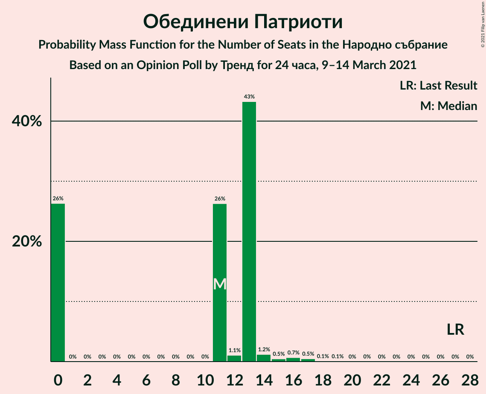

| Number of Seats | Probability | Accumulated | Special Marks |
|:---------------:|:-----------:|:-----------:|:-------------:|
| 0 | 26% | 100% |  |
| 1 | 0% | 74% |  |
| 2 | 0% | 74% |  |
| 3 | 0% | 74% |  |
| 4 | 0% | 74% |  |
| 5 | 0% | 74% |  |
| 6 | 0% | 74% |  |
| 7 | 0% | 74% |  |
| 8 | 0% | 74% |  |
| 9 | 0% | 74% |  |
| 10 | 0% | 74% |  |
| 11 | 26% | 74% | Median |
| 12 | 1.1% | 47% |  |
| 13 | 43% | 46% |  |
| 14 | 1.2% | 3% |  |
| 15 | 0.5% | 2% |  |
| 16 | 0.7% | 1.3% |  |
| 17 | 0.5% | 0.7% |  |
| 18 | 0.1% | 0.2% |  |
| 19 | 0.1% | 0.1% |  |
| 20 | 0% | 0% |  |
| 21 | 0% | 0% |  |
| 22 | 0% | 0% |  |
| 23 | 0% | 0% |  |
| 24 | 0% | 0% |  |
| 25 | 0% | 0% |  |
| 26 | 0% | 0% |  |
| 27 | 0% | 0% | Last Result |

### Воля–Национален фронт за спасение на България

*For a full overview of the results for this party, see the [Воля–Национален фронт за спасение на България](party-воля–националенфронтзаспасениенабългария.html) page.*

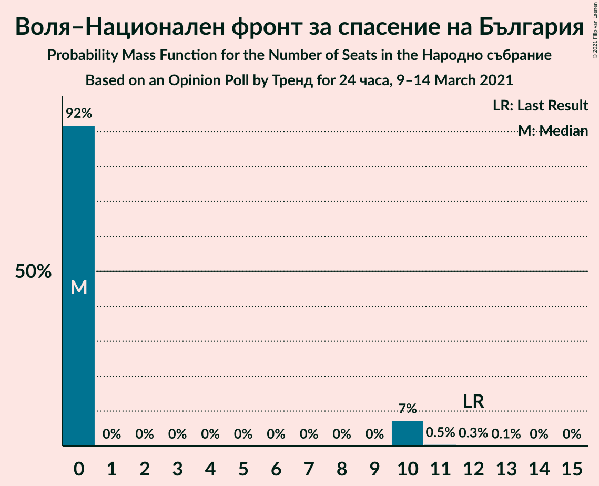

| Number of Seats | Probability | Accumulated | Special Marks |
|:---------------:|:-----------:|:-----------:|:-------------:|
| 0 | 92% | 100% | Median |
| 1 | 0% | 8% |  |
| 2 | 0% | 8% |  |
| 3 | 0% | 8% |  |
| 4 | 0% | 8% |  |
| 5 | 0% | 8% |  |
| 6 | 0% | 8% |  |
| 7 | 0% | 8% |  |
| 8 | 0% | 8% |  |
| 9 | 0% | 8% |  |
| 10 | 7% | 8% |  |
| 11 | 0.5% | 0.9% |  |
| 12 | 0.3% | 0.5% | Last Result |
| 13 | 0.1% | 0.1% |  |
| 14 | 0% | 0.1% |  |
| 15 | 0% | 0% |  |

### Алтернатива за българско възраждане

*For a full overview of the results for this party, see the [Алтернатива за българско възраждане](party-алтернативазабългарсковъзраждане.html) page.*

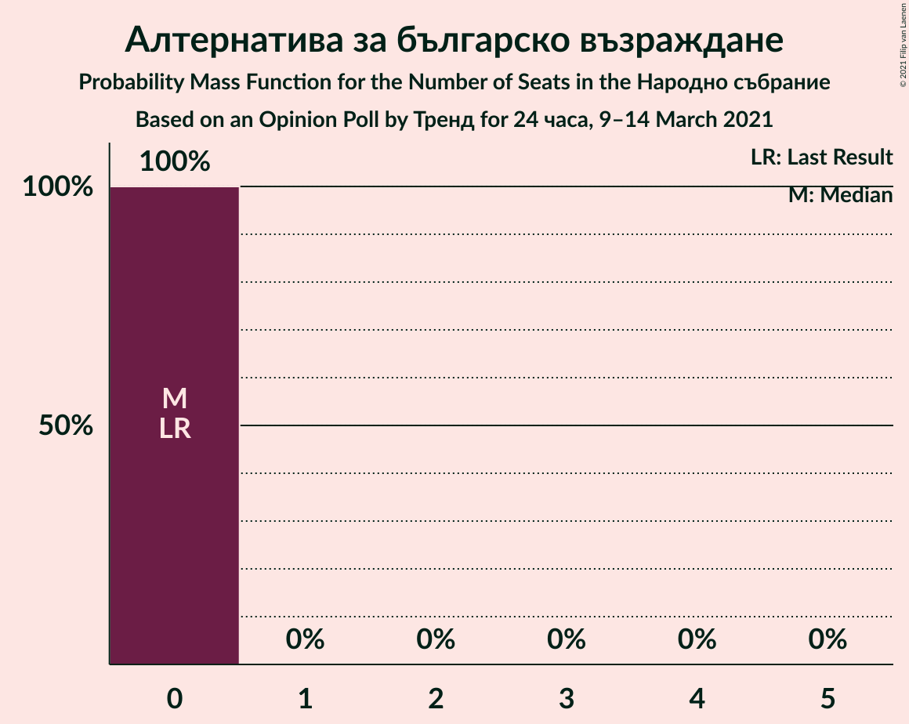

| Number of Seats | Probability | Accumulated | Special Marks |
|:---------------:|:-----------:|:-----------:|:-------------:|
| 0 | 100% | 100% | Last Result, Median |

### Възраждане

*For a full overview of the results for this party, see the [Възраждане](party-възраждане.html) page.*

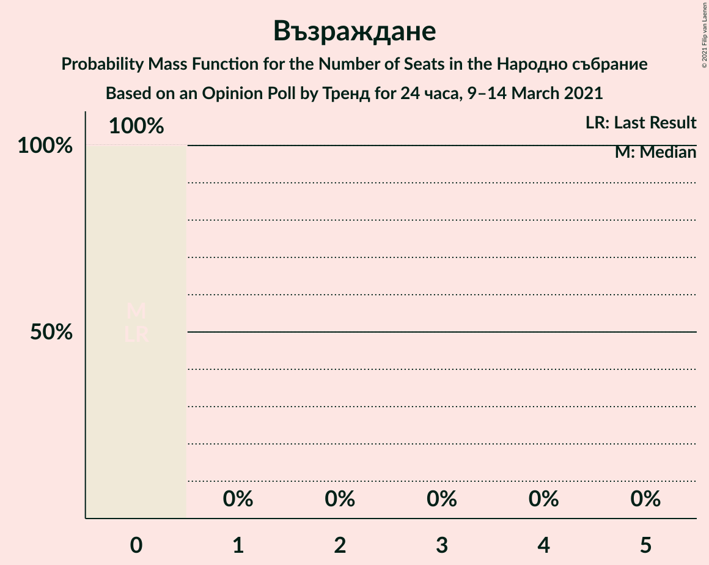

| Number of Seats | Probability | Accumulated | Special Marks |
|:---------------:|:-----------:|:-----------:|:-------------:|
| 0 | 100% | 100% | Last Result, Median |

### Атака

*For a full overview of the results for this party, see the [Атака](party-атака.html) page.*

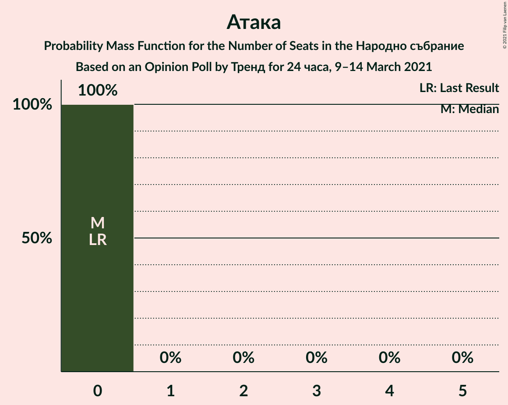

| Number of Seats | Probability | Accumulated | Special Marks |
|:---------------:|:-----------:|:-----------:|:-------------:|
| 0 | 100% | 100% | Last Result, Median |

### Републиканци за България

*For a full overview of the results for this party, see the [Републиканци за България](party-републиканцизабългария.html) page.*

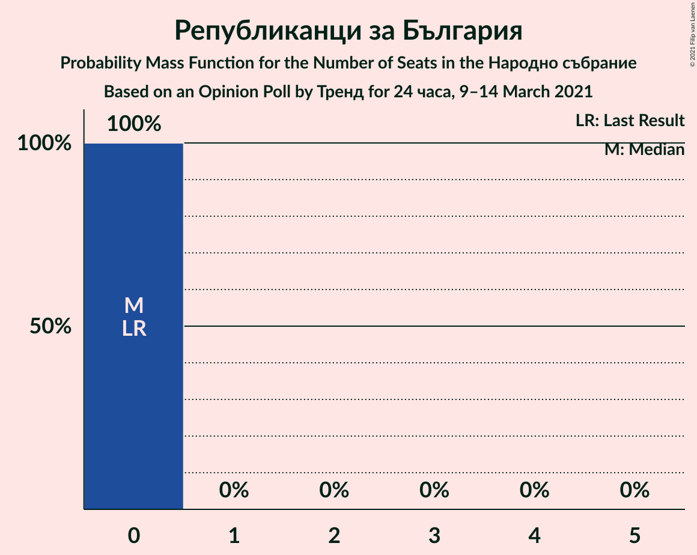

| Number of Seats | Probability | Accumulated | Special Marks |
|:---------------:|:-----------:|:-----------:|:-------------:|
| 0 | 100% | 100% | Last Result, Median |

## Coalitions

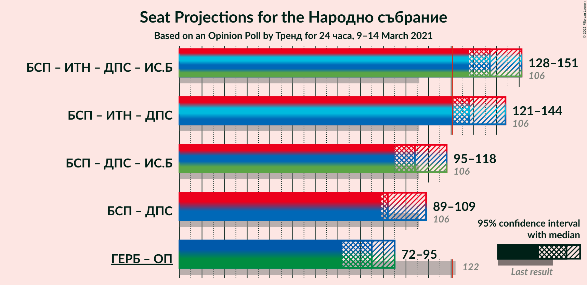

### Confidence Intervals

| Coalition | Last Result | Median | Majority? | 80% Confidence Interval | 90% Confidence Interval | 95% Confidence Interval | 99% Confidence Interval |
|:---------:|:-----------:|:------:|:---------:|:-----------------------:|:-----------------------:|:-----------------------:|:-----------------------:|
| Българска социалистическа партия – Има такъв народ – Движение за права и свободи – Изправи се Бг | 106 | 137 | 99.8% | 133–147 | 133–148 | 128–151 | 125–154 |
| Българска социалистическа партия – Има такъв народ – Движение за права и свободи | 106 | 128 | 98% | 121–144 | 121–144 | 121–144 | 116–145 |
| Българска социалистическа партия – Движение за права и свободи – Изправи се Бг | 106 | 104 | 0.5% | 102–111 | 100–112 | 95–118 | 91–120 |
| Българска социалистическа партия – Движение за права и свободи | 106 | 92 | 0% | 90–109 | 90–109 | 89–109 | 82–112 |
| Граждани за европейско развитие на България – Обединени Патриоти | 122 | 85 | 0% | 75–93 | 74–93 | 72–95 | 69–97 |

### Българска социалистическа партия – Има такъв народ – Движение за права и свободи – Изправи се Бг

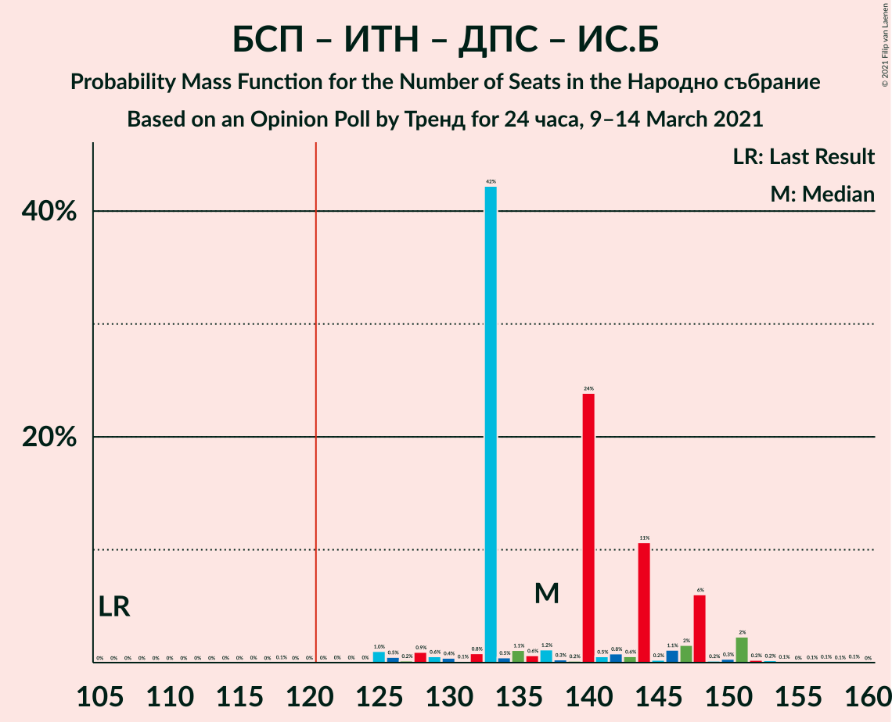

| Number of Seats | Probability | Accumulated | Special Marks |
|:---------------:|:-----------:|:-----------:|:-------------:|
| 106 | 0% | 100% | Last Result |
| 107 | 0% | 100% |  |
| 108 | 0% | 100% |  |
| 109 | 0% | 100% |  |
| 110 | 0% | 100% |  |
| 111 | 0% | 100% |  |
| 112 | 0% | 100% |  |
| 113 | 0% | 100% |  |
| 114 | 0% | 100% |  |
| 115 | 0% | 100% |  |
| 116 | 0% | 100% |  |
| 117 | 0% | 99.9% |  |
| 118 | 0.1% | 99.9% |  |
| 119 | 0% | 99.9% |  |
| 120 | 0% | 99.9% |  |
| 121 | 0% | 99.8% | Majority |
| 122 | 0% | 99.8% |  |
| 123 | 0% | 99.8% |  |
| 124 | 0% | 99.7% |  |
| 125 | 1.0% | 99.7% |  |
| 126 | 0.5% | 98.7% |  |
| 127 | 0.2% | 98% |  |
| 128 | 0.9% | 98% |  |
| 129 | 0.6% | 97% |  |
| 130 | 0.4% | 96% |  |
| 131 | 0.1% | 96% |  |
| 132 | 0.8% | 96% |  |
| 133 | 42% | 95% |  |
| 134 | 0.5% | 53% |  |
| 135 | 1.1% | 52% |  |
| 136 | 0.6% | 51% |  |
| 137 | 1.2% | 51% |  |
| 138 | 0.3% | 50% | Median |
| 139 | 0.2% | 49% |  |
| 140 | 24% | 49% |  |
| 141 | 0.5% | 25% |  |
| 142 | 0.8% | 25% |  |
| 143 | 0.6% | 24% |  |
| 144 | 11% | 23% |  |
| 145 | 0.2% | 13% |  |
| 146 | 1.1% | 12% |  |
| 147 | 2% | 11% |  |
| 148 | 6% | 10% |  |
| 149 | 0.2% | 4% |  |
| 150 | 0.3% | 4% |  |
| 151 | 2% | 3% |  |
| 152 | 0.2% | 1.0% |  |
| 153 | 0.2% | 0.7% |  |
| 154 | 0.1% | 0.5% |  |
| 155 | 0% | 0.4% |  |
| 156 | 0.1% | 0.4% |  |
| 157 | 0.1% | 0.3% |  |
| 158 | 0.1% | 0.2% |  |
| 159 | 0.1% | 0.2% |  |
| 160 | 0% | 0% |  |

### Българска социалистическа партия – Има такъв народ – Движение за права и свободи

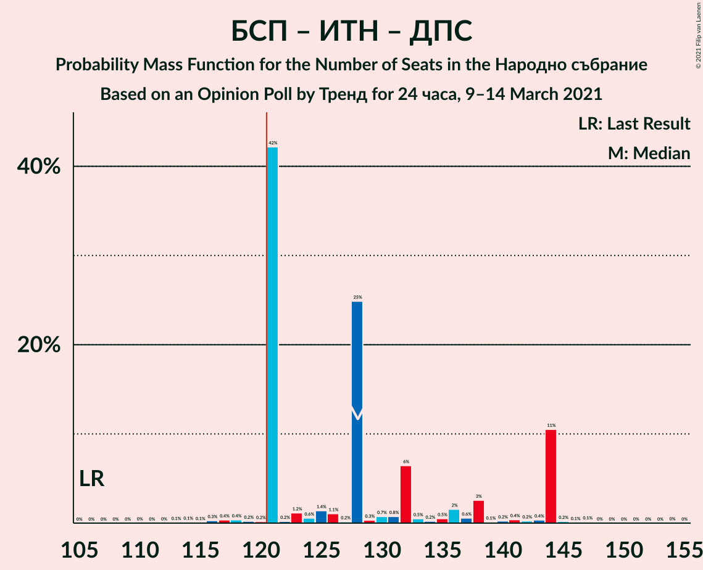

| Number of Seats | Probability | Accumulated | Special Marks |
|:---------------:|:-----------:|:-----------:|:-------------:|
| 106 | 0% | 100% | Last Result |
| 107 | 0% | 100% |  |
| 108 | 0% | 100% |  |
| 109 | 0% | 100% |  |
| 110 | 0% | 100% |  |
| 111 | 0% | 100% |  |
| 112 | 0% | 99.9% |  |
| 113 | 0.1% | 99.9% |  |
| 114 | 0.1% | 99.8% |  |
| 115 | 0.1% | 99.7% |  |
| 116 | 0.3% | 99.7% |  |
| 117 | 0.4% | 99.4% |  |
| 118 | 0.4% | 99.0% |  |
| 119 | 0.2% | 98.7% |  |
| 120 | 0.2% | 98% |  |
| 121 | 42% | 98% | Majority |
| 122 | 0.2% | 56% |  |
| 123 | 1.2% | 56% |  |
| 124 | 0.6% | 55% |  |
| 125 | 1.4% | 54% |  |
| 126 | 1.1% | 53% | Median |
| 127 | 0.2% | 52% |  |
| 128 | 25% | 52% |  |
| 129 | 0.3% | 27% |  |
| 130 | 0.7% | 26% |  |
| 131 | 0.8% | 26% |  |
| 132 | 6% | 25% |  |
| 133 | 0.5% | 18% |  |
| 134 | 0.2% | 18% |  |
| 135 | 0.5% | 18% |  |
| 136 | 2% | 17% |  |
| 137 | 0.6% | 16% |  |
| 138 | 3% | 15% |  |
| 139 | 0.1% | 12% |  |
| 140 | 0.2% | 12% |  |
| 141 | 0.4% | 12% |  |
| 142 | 0.2% | 12% |  |
| 143 | 0.4% | 11% |  |
| 144 | 11% | 11% |  |
| 145 | 0.2% | 0.5% |  |
| 146 | 0.1% | 0.3% |  |
| 147 | 0.1% | 0.3% |  |
| 148 | 0% | 0.1% |  |
| 149 | 0% | 0.1% |  |
| 150 | 0% | 0.1% |  |
| 151 | 0% | 0.1% |  |
| 152 | 0% | 0.1% |  |
| 153 | 0% | 0.1% |  |
| 154 | 0% | 0.1% |  |
| 155 | 0% | 0% |  |

### Българска социалистическа партия – Движение за права и свободи – Изправи се Бг

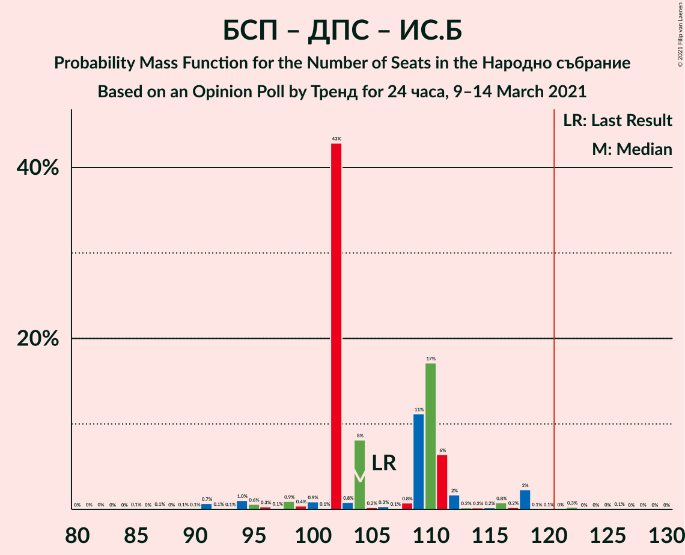

| Number of Seats | Probability | Accumulated | Special Marks |
|:---------------:|:-----------:|:-----------:|:-------------:|
| 81 | 0% | 100% |  |
| 82 | 0% | 99.9% |  |
| 83 | 0% | 99.9% |  |
| 84 | 0% | 99.9% |  |
| 85 | 0.1% | 99.9% |  |
| 86 | 0% | 99.8% |  |
| 87 | 0.1% | 99.8% |  |
| 88 | 0% | 99.7% |  |
| 89 | 0.1% | 99.6% |  |
| 90 | 0.1% | 99.6% |  |
| 91 | 0.7% | 99.5% |  |
| 92 | 0.1% | 98.8% |  |
| 93 | 0.1% | 98.7% |  |
| 94 | 1.0% | 98.7% |  |
| 95 | 0.6% | 98% |  |
| 96 | 0.3% | 97% |  |
| 97 | 0.1% | 97% |  |
| 98 | 0.9% | 97% |  |
| 99 | 0.4% | 96% |  |
| 100 | 0.9% | 95% |  |
| 101 | 0.1% | 94% |  |
| 102 | 43% | 94% |  |
| 103 | 0.8% | 51% |  |
| 104 | 8% | 50% |  |
| 105 | 0.2% | 42% |  |
| 106 | 0.3% | 42% | Last Result |
| 107 | 0.1% | 42% | Median |
| 108 | 0.8% | 42% |  |
| 109 | 11% | 41% |  |
| 110 | 17% | 30% |  |
| 111 | 6% | 13% |  |
| 112 | 2% | 6% |  |
| 113 | 0.2% | 4% |  |
| 114 | 0.2% | 4% |  |
| 115 | 0.2% | 4% |  |
| 116 | 0.8% | 4% |  |
| 117 | 0.2% | 3% |  |
| 118 | 2% | 3% |  |
| 119 | 0.1% | 0.6% |  |
| 120 | 0.1% | 0.5% |  |
| 121 | 0% | 0.5% | Majority |
| 122 | 0.3% | 0.4% |  |
| 123 | 0% | 0.2% |  |
| 124 | 0% | 0.2% |  |
| 125 | 0% | 0.2% |  |
| 126 | 0.1% | 0.1% |  |
| 127 | 0% | 0% |  |

### Българска социалистическа партия – Движение за права и свободи

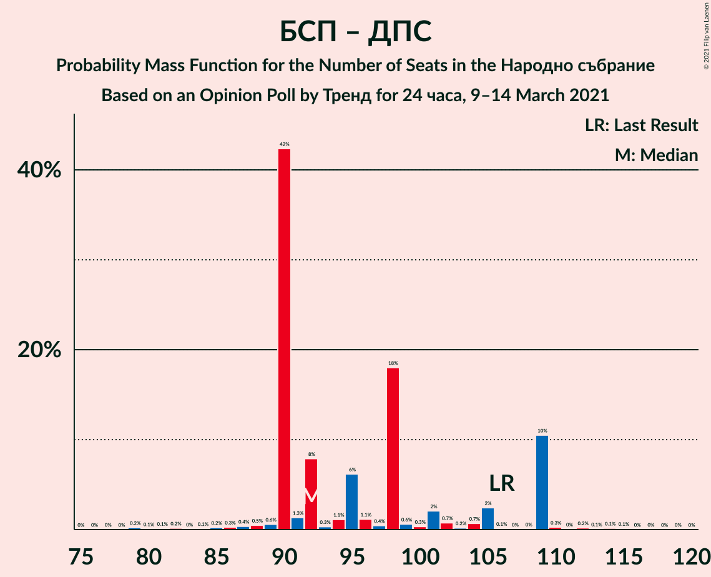

| Number of Seats | Probability | Accumulated | Special Marks |
|:---------------:|:-----------:|:-----------:|:-------------:|
| 79 | 0.2% | 100% |  |
| 80 | 0.1% | 99.8% |  |
| 81 | 0.1% | 99.7% |  |
| 82 | 0.2% | 99.6% |  |
| 83 | 0% | 99.4% |  |
| 84 | 0.1% | 99.4% |  |
| 85 | 0.2% | 99.3% |  |
| 86 | 0.3% | 99.0% |  |
| 87 | 0.4% | 98.8% |  |
| 88 | 0.5% | 98% |  |
| 89 | 0.6% | 98% |  |
| 90 | 42% | 97% |  |
| 91 | 1.3% | 55% |  |
| 92 | 8% | 54% |  |
| 93 | 0.3% | 46% |  |
| 94 | 1.1% | 45% |  |
| 95 | 6% | 44% | Median |
| 96 | 1.1% | 38% |  |
| 97 | 0.4% | 37% |  |
| 98 | 18% | 37% |  |
| 99 | 0.6% | 19% |  |
| 100 | 0.3% | 18% |  |
| 101 | 2% | 18% |  |
| 102 | 0.7% | 16% |  |
| 103 | 0.2% | 15% |  |
| 104 | 0.7% | 15% |  |
| 105 | 2% | 14% |  |
| 106 | 0.1% | 12% | Last Result |
| 107 | 0% | 11% |  |
| 108 | 0% | 11% |  |
| 109 | 10% | 11% |  |
| 110 | 0.3% | 0.9% |  |
| 111 | 0% | 0.6% |  |
| 112 | 0.2% | 0.6% |  |
| 113 | 0.1% | 0.4% |  |
| 114 | 0.1% | 0.3% |  |
| 115 | 0.1% | 0.2% |  |
| 116 | 0% | 0.1% |  |
| 117 | 0% | 0% |  |

### Граждани за европейско развитие на България – Обединени Патриоти

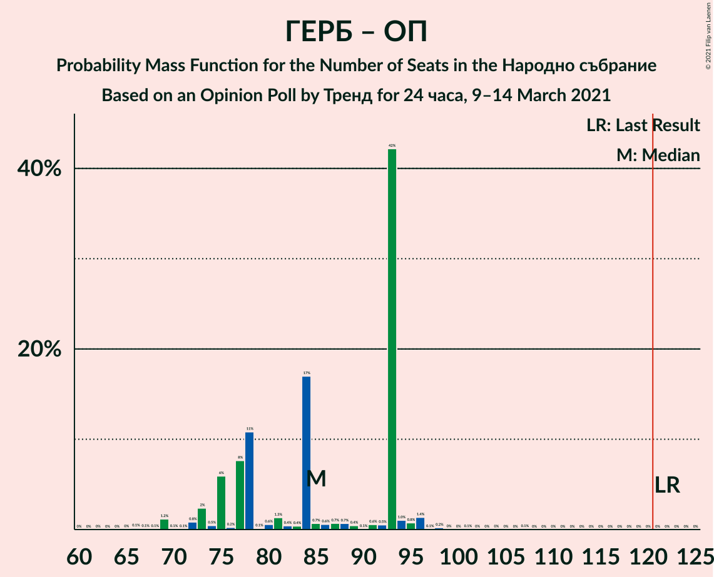

| Number of Seats | Probability | Accumulated | Special Marks |
|:---------------:|:-----------:|:-----------:|:-------------:|
| 64 | 0% | 100% |  |
| 65 | 0% | 99.9% |  |
| 66 | 0.1% | 99.9% |  |
| 67 | 0.1% | 99.8% |  |
| 68 | 0.1% | 99.7% |  |
| 69 | 1.2% | 99.6% |  |
| 70 | 0.1% | 98% |  |
| 71 | 0.1% | 98% |  |
| 72 | 0.8% | 98% |  |
| 73 | 2% | 97% |  |
| 74 | 0.5% | 95% |  |
| 75 | 6% | 95% |  |
| 76 | 0.2% | 89% |  |
| 77 | 8% | 88% |  |
| 78 | 11% | 81% |  |
| 79 | 0.1% | 70% |  |
| 80 | 0.6% | 70% |  |
| 81 | 1.3% | 69% |  |
| 82 | 0.4% | 68% |  |
| 83 | 0.4% | 68% |  |
| 84 | 17% | 67% |  |
| 85 | 0.7% | 50% |  |
| 86 | 0.6% | 49% |  |
| 87 | 0.7% | 49% |  |
| 88 | 0.7% | 48% |  |
| 89 | 0.4% | 47% | Median |
| 90 | 0.1% | 47% |  |
| 91 | 0.6% | 47% |  |
| 92 | 0.5% | 46% |  |
| 93 | 42% | 46% |  |
| 94 | 1.0% | 4% |  |
| 95 | 0.8% | 3% |  |
| 96 | 1.4% | 2% |  |
| 97 | 0.1% | 0.5% |  |
| 98 | 0.2% | 0.5% |  |
| 99 | 0% | 0.2% |  |
| 100 | 0% | 0.2% |  |
| 101 | 0.1% | 0.2% |  |
| 102 | 0% | 0.1% |  |
| 103 | 0% | 0.1% |  |
| 104 | 0% | 0.1% |  |
| 105 | 0% | 0.1% |  |
| 106 | 0% | 0.1% |  |
| 107 | 0.1% | 0.1% |  |
| 108 | 0% | 0% |  |
| 109 | 0% | 0% |  |
| 110 | 0% | 0% |  |
| 111 | 0% | 0% |  |
| 112 | 0% | 0% |  |
| 113 | 0% | 0% |  |
| 114 | 0% | 0% |  |
| 115 | 0% | 0% |  |
| 116 | 0% | 0% |  |
| 117 | 0% | 0% |  |
| 118 | 0% | 0% |  |
| 119 | 0% | 0% |  |
| 120 | 0% | 0% |  |
| 121 | 0% | 0% | Majority |
| 122 | 0% | 0% | Last Result |

## Technical Information

### Opinion Poll

+ **Polling firm:** Тренд
+ **Commissioner(s):** 24 часа
+ **Fieldwork period:** 9–14 March 2021

### Calculations

+ **Sample size:** 452
+ **Simulations done:** 1,048,576
+ **Error estimate:** 3.46%

