# Opinion Poll by Медиана, 16–23 March 2021

<a href="#voting-intentions">Voting Intentions</a> | <a href="#seats">Seats</a> | <a href="#coalitions">Coalitions</a> | <a href="#technical-information">Technical Information</a>

## Voting Intentions

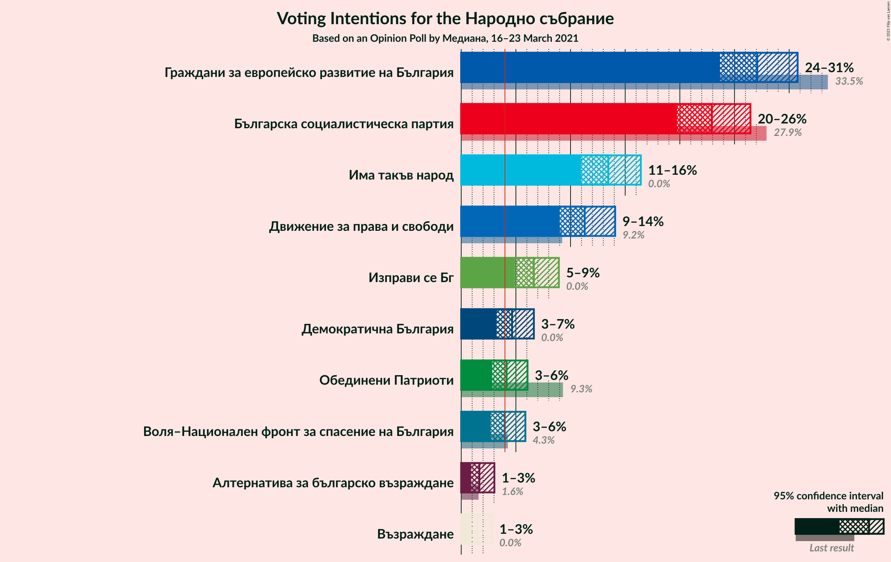

### Confidence Intervals

| Party | Last Result | Poll Result | 80% Confidence Interval | 90% Confidence Interval | 95% Confidence Interval | 99% Confidence Interval |
|:-----:|:-----------:|:-----------:|:-----------------------:|:-----------------------:|:-----------------------:|:-----------------------:|
| Граждани за европейско развитие на България | 33.5% | 27.1% | 24.8–29.5% |24.2–30.2% |23.7–30.8% |22.6–31.9% |
| Българска социалистическа партия | 27.9% | 22.9% | 20.8–25.2% |20.2–25.9% |19.7–26.5% |18.8–27.6% |
| Има такъв народ | 0.0% | 13.5% | 11.8–15.4% |11.4–15.9% |11.0–16.4% |10.2–17.4% |
| Движение за права и свободи | 9.2% | 11.3% | 9.8–13.1% |9.4–13.6% |9.0–14.1% |8.3–15.0% |
| Изправи се Бг | 0.0% | 6.6% | 5.5–8.1% |5.2–8.6% |4.9–8.9% |4.4–9.7% |
| Демократична България | 0.0% | 4.7% | 3.7–5.9% |3.5–6.3% |3.2–6.6% |2.8–7.3% |
| Обединени Патриоти | 9.3% | 4.2% | 3.3–5.4% |3.0–5.7% |2.8–6.1% |2.5–6.7% |
| Воля–Национален фронт за спасение на България | 4.3% | 4.0% | 3.1–5.2% |2.9–5.6% |2.7–5.9% |2.3–6.5% |
| Алтернатива за българско възраждане | 1.6% | 1.7% | 1.2–2.5% |1.0–2.8% |0.9–3.0% |0.7–3.5% |
| Възраждане | 0.0% | 1.5% | 1.0–2.3% |0.9–2.6% |0.8–2.8% |0.6–3.3% |

*Note:* The poll result column reflects the actual value used in the calculations. Published results may vary slightly, and in addition be rounded to fewer digits.

## Seats

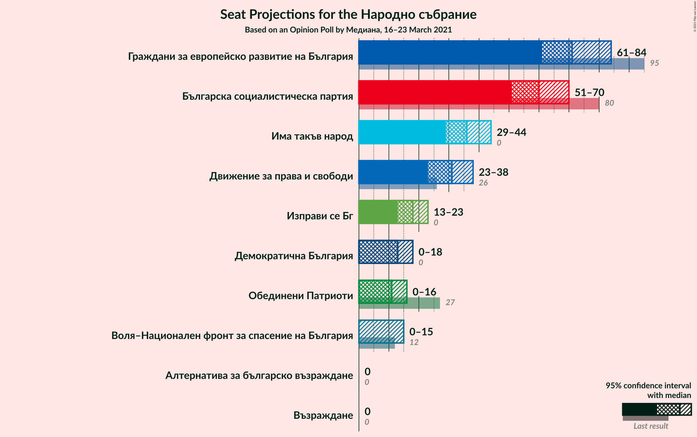

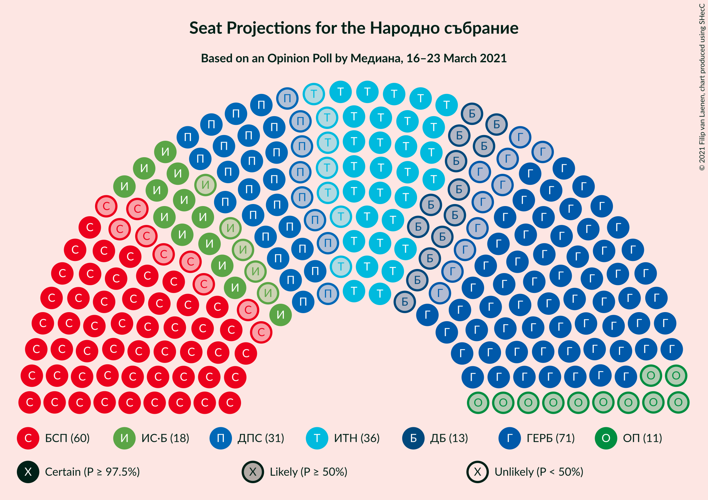

### Confidence Intervals

| Party | Last Result | Median | 80% Confidence Interval | 90% Confidence Interval | 95% Confidence Interval | 99% Confidence Interval |
|:-----:|:-----------:|:------:|:-----------------------:|:-----------------------:|:-----------------------:|:-----------------------:|
| <a href="#граждани-за-европейско-развитие-на-българия">Граждани за европейско развитие на България</a> | 95 | 71 | 64–78 |61–81 |61–84 |58–89 |
| <a href="#българска-социалистическа-партия">Българска социалистическа партия</a> | 80 | 60 | 54–66 |53–68 |51–70 |48–75 |
| <a href="#има-такъв-народ">Има такъв народ</a> | 0 | 36 | 31–41 |29–43 |29–44 |27–47 |
| <a href="#движение-за-права-и-свободи">Движение за права и свободи</a> | 26 | 31 | 26–35 |25–36 |23–38 |22–41 |
| <a href="#изправи-се-бг">Изправи се Бг</a> | 0 | 18 | 14–21 |13–22 |13–23 |11–26 |
| <a href="#демократична-българия">Демократична България</a> | 0 | 13 | 0–16 |0–17 |0–18 |0–19 |
| <a href="#обединени-патриоти">Обединени Патриоти</a> | 27 | 11 | 0–14 |0–16 |0–16 |0–17 |
| <a href="#воля–национален-фронт-за-спасение-на-българия">Воля–Национален фронт за спасение на България</a> | 12 | 0 | 0–13 |0–14 |0–15 |0–17 |
| <a href="#алтернатива-за-българско-възраждане">Алтернатива за българско възраждане</a> | 0 | 0 | 0 |0 |0 |0 |
| <a href="#възраждане">Възраждане</a> | 0 | 0 | 0 |0 |0 |0 |

### Граждани за европейско развитие на България

*For a full overview of the results for this party, see the [Граждани за европейско развитие на България](party-гражданизаевропейскоразвитиенабългария.html) page.*

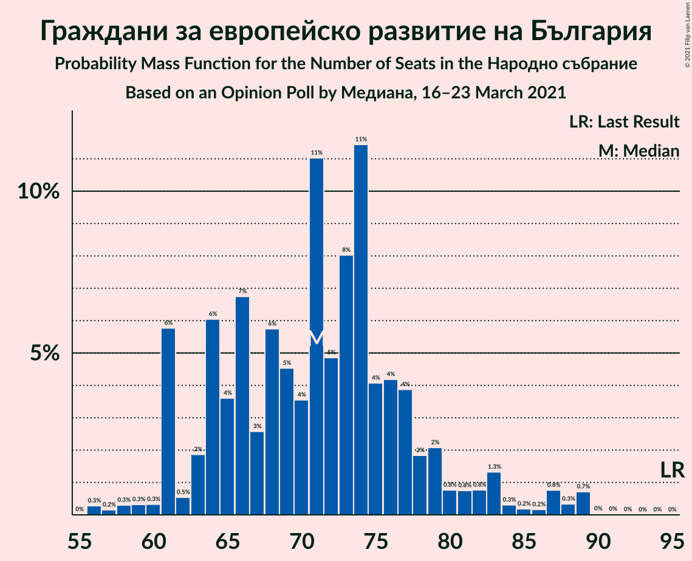

| Number of Seats | Probability | Accumulated | Special Marks |
|:---------------:|:-----------:|:-----------:|:-------------:|
| 55 | 0% | 100% |  |
| 56 | 0.3% | 99.9% |  |
| 57 | 0.2% | 99.7% |  |
| 58 | 0.3% | 99.5% |  |
| 59 | 0.3% | 99.2% |  |
| 60 | 0.3% | 98.9% |  |
| 61 | 6% | 98.6% |  |
| 62 | 0.5% | 93% |  |
| 63 | 2% | 92% |  |
| 64 | 6% | 90% |  |
| 65 | 4% | 84% |  |
| 66 | 7% | 81% |  |
| 67 | 3% | 74% |  |
| 68 | 6% | 71% |  |
| 69 | 5% | 66% |  |
| 70 | 4% | 61% |  |
| 71 | 11% | 58% | Median |
| 72 | 5% | 47% |  |
| 73 | 8% | 42% |  |
| 74 | 11% | 34% |  |
| 75 | 4% | 22% |  |
| 76 | 4% | 18% |  |
| 77 | 4% | 14% |  |
| 78 | 2% | 10% |  |
| 79 | 2% | 8% |  |
| 80 | 0.8% | 6% |  |
| 81 | 0.8% | 5% |  |
| 82 | 0.8% | 5% |  |
| 83 | 1.3% | 4% |  |
| 84 | 0.3% | 3% |  |
| 85 | 0.2% | 2% |  |
| 86 | 0.2% | 2% |  |
| 87 | 0.8% | 2% |  |
| 88 | 0.3% | 1.1% |  |
| 89 | 0.7% | 0.8% |  |
| 90 | 0% | 0.1% |  |
| 91 | 0% | 0% |  |
| 92 | 0% | 0% |  |
| 93 | 0% | 0% |  |
| 94 | 0% | 0% |  |
| 95 | 0% | 0% | Last Result |

### Българска социалистическа партия

*For a full overview of the results for this party, see the [Българска социалистическа партия](party-българскасоциалистическапартия.html) page.*

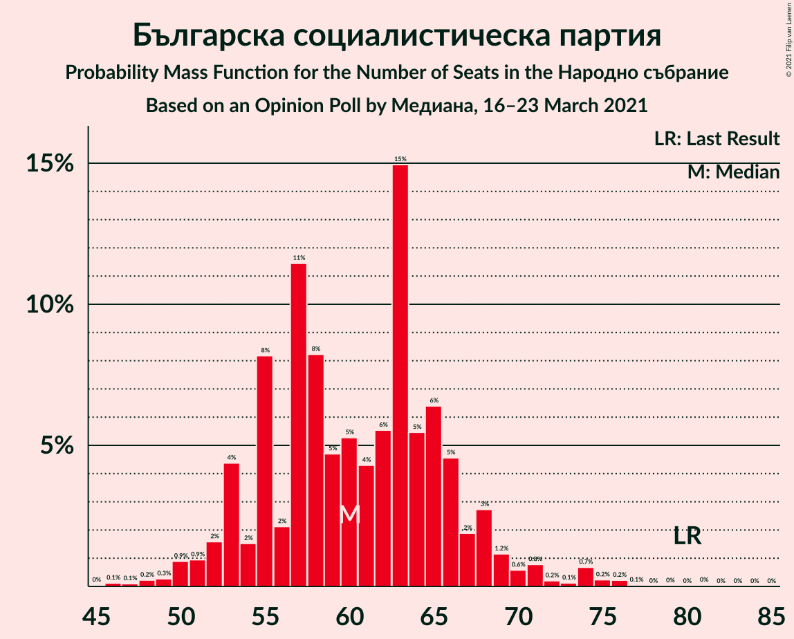

| Number of Seats | Probability | Accumulated | Special Marks |
|:---------------:|:-----------:|:-----------:|:-------------:|
| 45 | 0% | 100% |  |
| 46 | 0.1% | 99.9% |  |
| 47 | 0.1% | 99.8% |  |
| 48 | 0.2% | 99.7% |  |
| 49 | 0.3% | 99.5% |  |
| 50 | 0.9% | 99.2% |  |
| 51 | 0.9% | 98% |  |
| 52 | 2% | 97% |  |
| 53 | 4% | 96% |  |
| 54 | 2% | 91% |  |
| 55 | 8% | 90% |  |
| 56 | 2% | 82% |  |
| 57 | 11% | 80% |  |
| 58 | 8% | 68% |  |
| 59 | 5% | 60% |  |
| 60 | 5% | 55% | Median |
| 61 | 4% | 50% |  |
| 62 | 6% | 46% |  |
| 63 | 15% | 40% |  |
| 64 | 5% | 25% |  |
| 65 | 6% | 20% |  |
| 66 | 5% | 13% |  |
| 67 | 2% | 9% |  |
| 68 | 3% | 7% |  |
| 69 | 1.2% | 4% |  |
| 70 | 0.6% | 3% |  |
| 71 | 0.8% | 2% |  |
| 72 | 0.2% | 2% |  |
| 73 | 0.1% | 1.4% |  |
| 74 | 0.7% | 1.3% |  |
| 75 | 0.2% | 0.6% |  |
| 76 | 0.2% | 0.4% |  |
| 77 | 0.1% | 0.1% |  |
| 78 | 0% | 0.1% |  |
| 79 | 0% | 0.1% |  |
| 80 | 0% | 0.1% | Last Result |
| 81 | 0% | 0.1% |  |
| 82 | 0% | 0% |  |

### Има такъв народ

*For a full overview of the results for this party, see the [Има такъв народ](party-иматакъвнарод.html) page.*

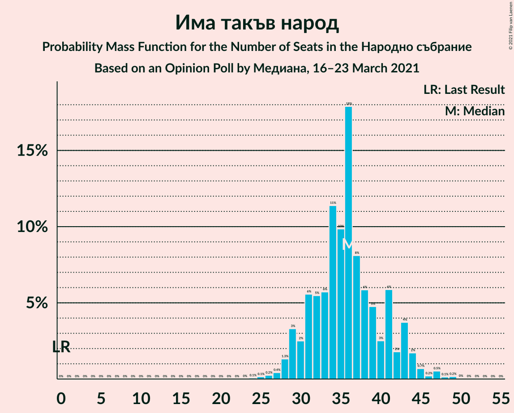

| Number of Seats | Probability | Accumulated | Special Marks |
|:---------------:|:-----------:|:-----------:|:-------------:|
| 0 | 0% | 100% | Last Result |
| 1 | 0% | 100% |  |
| 2 | 0% | 100% |  |
| 3 | 0% | 100% |  |
| 4 | 0% | 100% |  |
| 5 | 0% | 100% |  |
| 6 | 0% | 100% |  |
| 7 | 0% | 100% |  |
| 8 | 0% | 100% |  |
| 9 | 0% | 100% |  |
| 10 | 0% | 100% |  |
| 11 | 0% | 100% |  |
| 12 | 0% | 100% |  |
| 13 | 0% | 100% |  |
| 14 | 0% | 100% |  |
| 15 | 0% | 100% |  |
| 16 | 0% | 100% |  |
| 17 | 0% | 100% |  |
| 18 | 0% | 100% |  |
| 19 | 0% | 100% |  |
| 20 | 0% | 100% |  |
| 21 | 0% | 100% |  |
| 22 | 0% | 100% |  |
| 23 | 0% | 100% |  |
| 24 | 0.1% | 100% |  |
| 25 | 0.1% | 99.9% |  |
| 26 | 0.2% | 99.8% |  |
| 27 | 0.4% | 99.5% |  |
| 28 | 1.3% | 99.1% |  |
| 29 | 3% | 98% |  |
| 30 | 2% | 94% |  |
| 31 | 6% | 92% |  |
| 32 | 5% | 86% |  |
| 33 | 6% | 81% |  |
| 34 | 11% | 75% |  |
| 35 | 10% | 64% |  |
| 36 | 18% | 54% | Median |
| 37 | 8% | 36% |  |
| 38 | 6% | 28% |  |
| 39 | 5% | 22% |  |
| 40 | 3% | 17% |  |
| 41 | 6% | 15% |  |
| 42 | 2% | 9% |  |
| 43 | 4% | 7% |  |
| 44 | 2% | 3% |  |
| 45 | 0.7% | 2% |  |
| 46 | 0.2% | 1.1% |  |
| 47 | 0.5% | 0.9% |  |
| 48 | 0.1% | 0.4% |  |
| 49 | 0.2% | 0.2% |  |
| 50 | 0% | 0.1% |  |
| 51 | 0% | 0% |  |

### Движение за права и свободи

*For a full overview of the results for this party, see the [Движение за права и свободи](party-движениезаправаисвободи.html) page.*

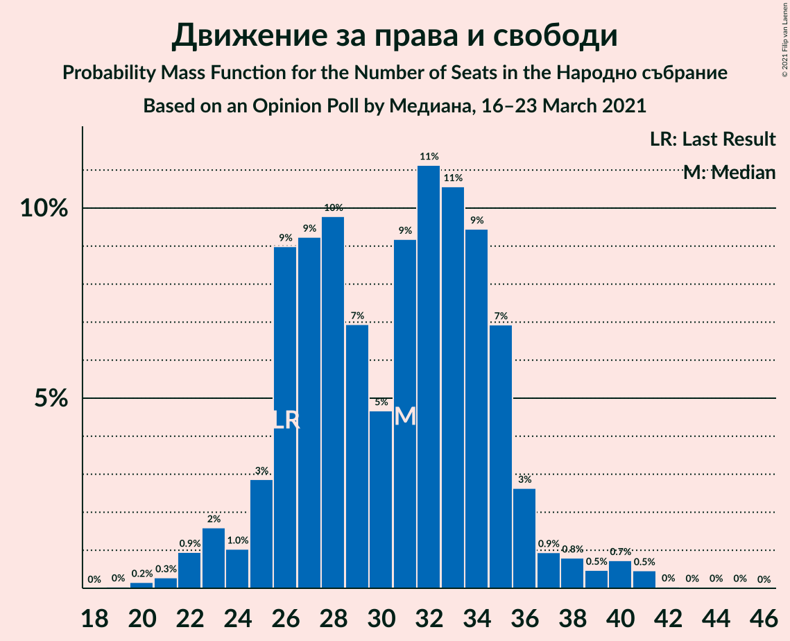

| Number of Seats | Probability | Accumulated | Special Marks |
|:---------------:|:-----------:|:-----------:|:-------------:|
| 20 | 0.2% | 100% |  |
| 21 | 0.3% | 99.8% |  |
| 22 | 0.9% | 99.5% |  |
| 23 | 2% | 98.6% |  |
| 24 | 1.0% | 97% |  |
| 25 | 3% | 96% |  |
| 26 | 9% | 93% | Last Result |
| 27 | 9% | 84% |  |
| 28 | 10% | 75% |  |
| 29 | 7% | 65% |  |
| 30 | 5% | 58% |  |
| 31 | 9% | 53% | Median |
| 32 | 11% | 44% |  |
| 33 | 11% | 33% |  |
| 34 | 9% | 23% |  |
| 35 | 7% | 13% |  |
| 36 | 3% | 6% |  |
| 37 | 0.9% | 4% |  |
| 38 | 0.8% | 3% |  |
| 39 | 0.5% | 2% |  |
| 40 | 0.7% | 1.3% |  |
| 41 | 0.5% | 0.6% |  |
| 42 | 0% | 0.1% |  |
| 43 | 0% | 0.1% |  |
| 44 | 0% | 0.1% |  |
| 45 | 0% | 0% |  |

### Изправи се Бг

*For a full overview of the results for this party, see the [Изправи се Бг](party-изправисебг.html) page.*

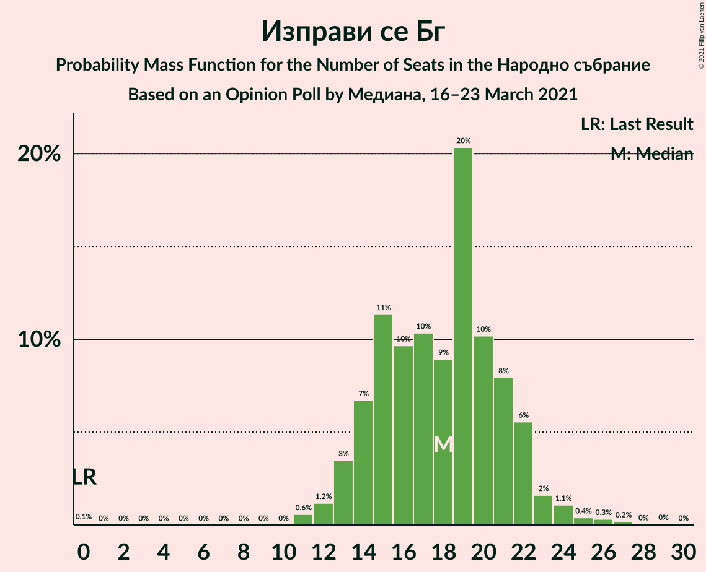

| Number of Seats | Probability | Accumulated | Special Marks |
|:---------------:|:-----------:|:-----------:|:-------------:|
| 0 | 0.1% | 100% | Last Result |
| 1 | 0% | 99.9% |  |
| 2 | 0% | 99.9% |  |
| 3 | 0% | 99.9% |  |
| 4 | 0% | 99.9% |  |
| 5 | 0% | 99.9% |  |
| 6 | 0% | 99.9% |  |
| 7 | 0% | 99.9% |  |
| 8 | 0% | 99.9% |  |
| 9 | 0% | 99.9% |  |
| 10 | 0% | 99.9% |  |
| 11 | 0.6% | 99.9% |  |
| 12 | 1.2% | 99.3% |  |
| 13 | 3% | 98% |  |
| 14 | 7% | 95% |  |
| 15 | 11% | 88% |  |
| 16 | 10% | 77% |  |
| 17 | 10% | 67% |  |
| 18 | 9% | 57% | Median |
| 19 | 20% | 48% |  |
| 20 | 10% | 27% |  |
| 21 | 8% | 17% |  |
| 22 | 6% | 9% |  |
| 23 | 2% | 4% |  |
| 24 | 1.1% | 2% |  |
| 25 | 0.4% | 1.0% |  |
| 26 | 0.3% | 0.6% |  |
| 27 | 0.2% | 0.3% |  |
| 28 | 0% | 0.1% |  |
| 29 | 0% | 0.1% |  |
| 30 | 0% | 0% |  |

### Демократична България

*For a full overview of the results for this party, see the [Демократична България](party-демократичнабългария.html) page.*

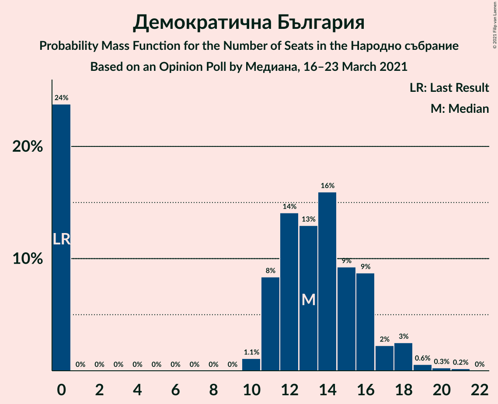

| Number of Seats | Probability | Accumulated | Special Marks |
|:---------------:|:-----------:|:-----------:|:-------------:|
| 0 | 24% | 100% | Last Result |
| 1 | 0% | 76% |  |
| 2 | 0% | 76% |  |
| 3 | 0% | 76% |  |
| 4 | 0% | 76% |  |
| 5 | 0% | 76% |  |
| 6 | 0% | 76% |  |
| 7 | 0% | 76% |  |
| 8 | 0% | 76% |  |
| 9 | 0% | 76% |  |
| 10 | 1.1% | 76% |  |
| 11 | 8% | 75% |  |
| 12 | 14% | 67% |  |
| 13 | 13% | 53% | Median |
| 14 | 16% | 40% |  |
| 15 | 9% | 24% |  |
| 16 | 9% | 15% |  |
| 17 | 2% | 6% |  |
| 18 | 3% | 4% |  |
| 19 | 0.6% | 1.1% |  |
| 20 | 0.3% | 0.5% |  |
| 21 | 0.2% | 0.2% |  |
| 22 | 0% | 0% |  |

### Обединени Патриоти

*For a full overview of the results for this party, see the [Обединени Патриоти](party-обединенипатриоти.html) page.*

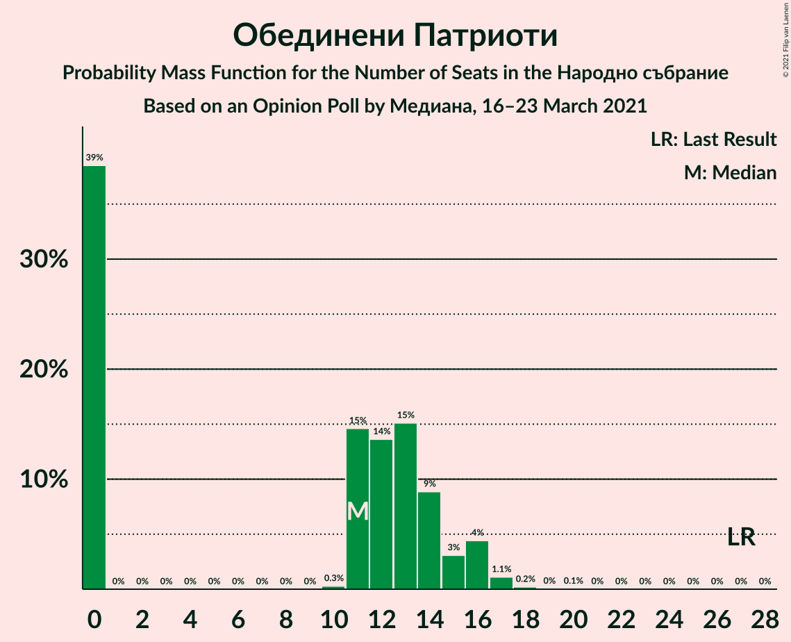

| Number of Seats | Probability | Accumulated | Special Marks |
|:---------------:|:-----------:|:-----------:|:-------------:|
| 0 | 39% | 100% |  |
| 1 | 0% | 61% |  |
| 2 | 0% | 61% |  |
| 3 | 0% | 61% |  |
| 4 | 0% | 61% |  |
| 5 | 0% | 61% |  |
| 6 | 0% | 61% |  |
| 7 | 0% | 61% |  |
| 8 | 0% | 61% |  |
| 9 | 0% | 61% |  |
| 10 | 0.3% | 61% |  |
| 11 | 15% | 61% | Median |
| 12 | 14% | 47% |  |
| 13 | 15% | 33% |  |
| 14 | 9% | 18% |  |
| 15 | 3% | 9% |  |
| 16 | 4% | 6% |  |
| 17 | 1.1% | 1.4% |  |
| 18 | 0.2% | 0.3% |  |
| 19 | 0% | 0.1% |  |
| 20 | 0.1% | 0.1% |  |
| 21 | 0% | 0% |  |
| 22 | 0% | 0% |  |
| 23 | 0% | 0% |  |
| 24 | 0% | 0% |  |
| 25 | 0% | 0% |  |
| 26 | 0% | 0% |  |
| 27 | 0% | 0% | Last Result |

### Воля–Национален фронт за спасение на България

*For a full overview of the results for this party, see the [Воля–Национален фронт за спасение на България](party-воля–националенфронтзаспасениенабългария.html) page.*

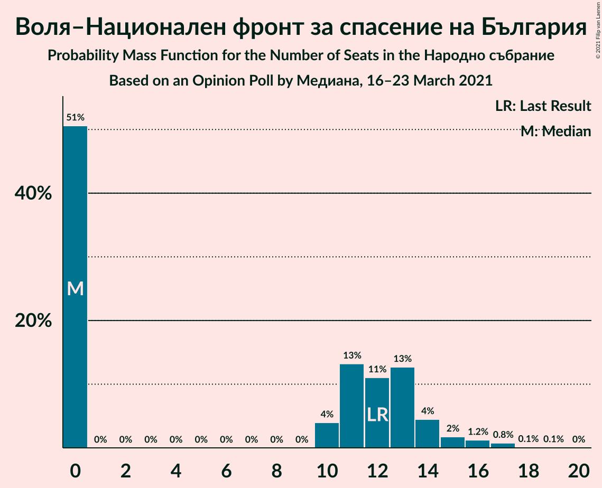

| Number of Seats | Probability | Accumulated | Special Marks |
|:---------------:|:-----------:|:-----------:|:-------------:|
| 0 | 51% | 100% | Median |
| 1 | 0% | 49% |  |
| 2 | 0% | 49% |  |
| 3 | 0% | 49% |  |
| 4 | 0% | 49% |  |
| 5 | 0% | 49% |  |
| 6 | 0% | 49% |  |
| 7 | 0% | 49% |  |
| 8 | 0% | 49% |  |
| 9 | 0% | 49% |  |
| 10 | 4% | 49% |  |
| 11 | 13% | 45% |  |
| 12 | 11% | 32% | Last Result |
| 13 | 13% | 21% |  |
| 14 | 4% | 8% |  |
| 15 | 2% | 4% |  |
| 16 | 1.2% | 2% |  |
| 17 | 0.8% | 1.0% |  |
| 18 | 0.1% | 0.2% |  |
| 19 | 0.1% | 0.1% |  |
| 20 | 0% | 0% |  |

### Алтернатива за българско възраждане

*For a full overview of the results for this party, see the [Алтернатива за българско възраждане](party-алтернативазабългарсковъзраждане.html) page.*

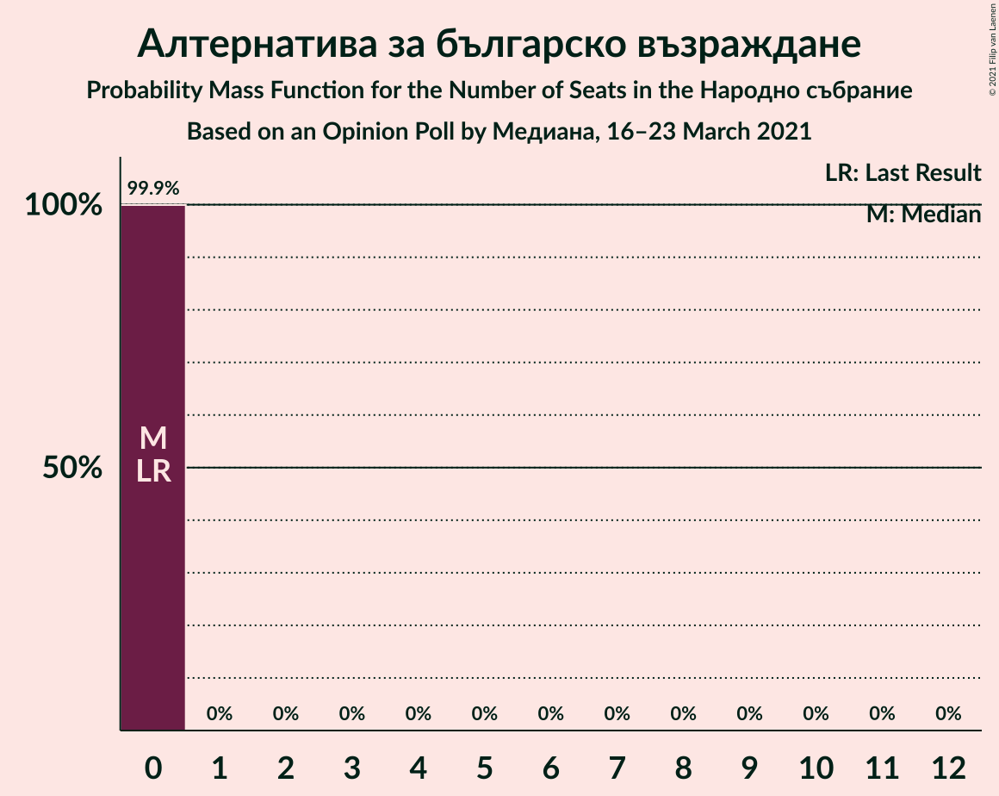

| Number of Seats | Probability | Accumulated | Special Marks |
|:---------------:|:-----------:|:-----------:|:-------------:|
| 0 | 99.9% | 100% | Last Result, Median |
| 1 | 0% | 0.1% |  |
| 2 | 0% | 0.1% |  |
| 3 | 0% | 0.1% |  |
| 4 | 0% | 0.1% |  |
| 5 | 0% | 0.1% |  |
| 6 | 0% | 0.1% |  |
| 7 | 0% | 0.1% |  |
| 8 | 0% | 0.1% |  |
| 9 | 0% | 0.1% |  |
| 10 | 0% | 0.1% |  |
| 11 | 0% | 0.1% |  |
| 12 | 0% | 0% |  |

### Възраждане

*For a full overview of the results for this party, see the [Възраждане](party-възраждане.html) page.*

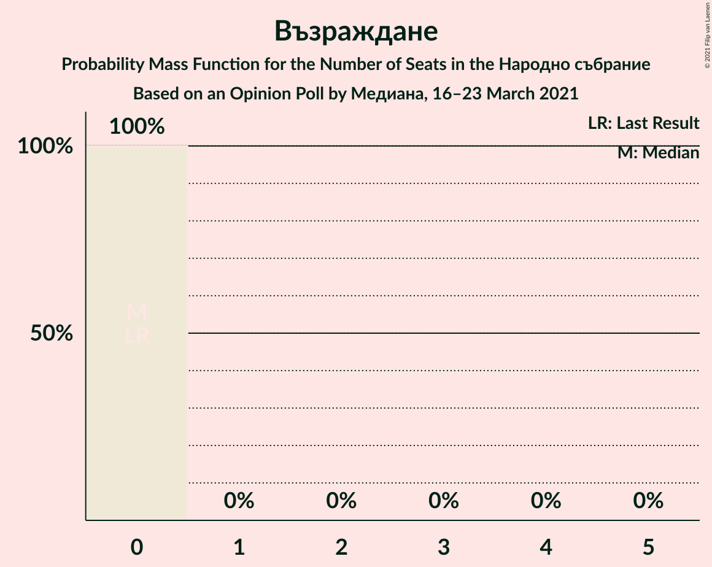

| Number of Seats | Probability | Accumulated | Special Marks |
|:---------------:|:-----------:|:-----------:|:-------------:|
| 0 | 100% | 100% | Last Result, Median |

## Coalitions

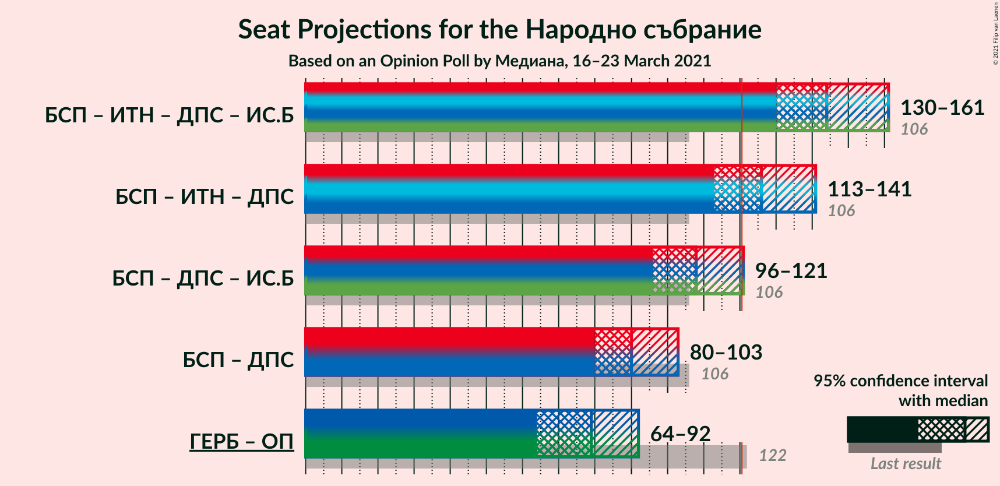

### Confidence Intervals

| Coalition | Last Result | Median | Majority? | 80% Confidence Interval | 90% Confidence Interval | 95% Confidence Interval | 99% Confidence Interval |
|:---------:|:-----------:|:------:|:---------:|:-----------------------:|:-----------------------:|:-----------------------:|:-----------------------:|
| Българска социалистическа партия – Има такъв народ – Движение за права и свободи – Изправи се Бг | 106 | 144 | 100% | 135–154 | 132–158 | 130–161 | 126–164 |
| Българска социалистическа партия – Има такъв народ – Движение за права и свободи | 106 | 126 | 79% | 118–135 | 115–139 | 113–141 | 110–146 |
| Българска социалистическа партия – Движение за права и свободи – Изправи се Бг | 106 | 108 | 4% | 101–118 | 99–120 | 96–121 | 93–125 |
| Българска социалистическа партия – Движение за права и свободи | 106 | 90 | 0% | 83–99 | 82–100 | 80–103 | 76–107 |
| Граждани за европейско развитие на България – Обединени Патриоти | 122 | 79 | 0% | 69–89 | 66–89 | 64–92 | 62–96 |

### Българска социалистическа партия – Има такъв народ – Движение за права и свободи – Изправи се Бг

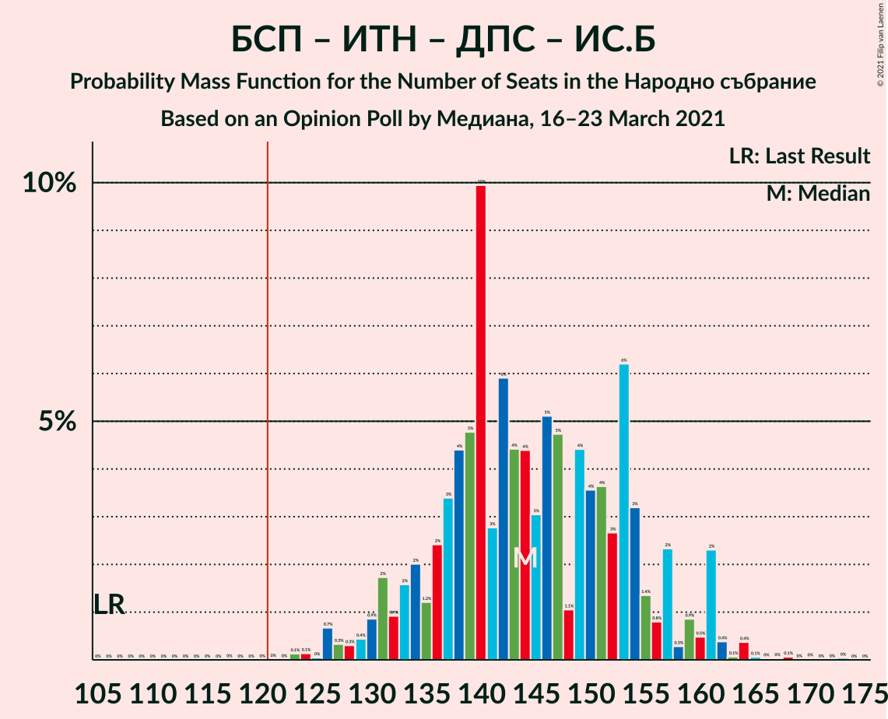

| Number of Seats | Probability | Accumulated | Special Marks |
|:---------------:|:-----------:|:-----------:|:-------------:|
| 106 | 0% | 100% | Last Result |
| 107 | 0% | 100% |  |
| 108 | 0% | 100% |  |
| 109 | 0% | 100% |  |
| 110 | 0% | 100% |  |
| 111 | 0% | 100% |  |
| 112 | 0% | 100% |  |
| 113 | 0% | 100% |  |
| 114 | 0% | 100% |  |
| 115 | 0% | 100% |  |
| 116 | 0% | 100% |  |
| 117 | 0% | 100% |  |
| 118 | 0% | 100% |  |
| 119 | 0% | 100% |  |
| 120 | 0% | 100% |  |
| 121 | 0% | 100% | Majority |
| 122 | 0% | 100% |  |
| 123 | 0.1% | 100% |  |
| 124 | 0.1% | 99.8% |  |
| 125 | 0% | 99.7% |  |
| 126 | 0.7% | 99.6% |  |
| 127 | 0.3% | 99.0% |  |
| 128 | 0.3% | 98.6% |  |
| 129 | 0.4% | 98% |  |
| 130 | 0.9% | 98% |  |
| 131 | 2% | 97% |  |
| 132 | 0.9% | 95% |  |
| 133 | 2% | 94% |  |
| 134 | 2% | 93% |  |
| 135 | 1.2% | 91% |  |
| 136 | 2% | 90% |  |
| 137 | 3% | 87% |  |
| 138 | 4% | 84% |  |
| 139 | 5% | 79% |  |
| 140 | 10% | 75% |  |
| 141 | 3% | 65% |  |
| 142 | 6% | 62% |  |
| 143 | 4% | 56% |  |
| 144 | 4% | 52% |  |
| 145 | 3% | 47% | Median |
| 146 | 5% | 44% |  |
| 147 | 5% | 39% |  |
| 148 | 1.1% | 34% |  |
| 149 | 4% | 33% |  |
| 150 | 4% | 29% |  |
| 151 | 4% | 25% |  |
| 152 | 3% | 22% |  |
| 153 | 6% | 19% |  |
| 154 | 3% | 13% |  |
| 155 | 1.4% | 10% |  |
| 156 | 0.8% | 8% |  |
| 157 | 2% | 7% |  |
| 158 | 0.3% | 5% |  |
| 159 | 0.9% | 5% |  |
| 160 | 0.5% | 4% |  |
| 161 | 2% | 3% |  |
| 162 | 0.4% | 1.1% |  |
| 163 | 0.1% | 0.7% |  |
| 164 | 0.4% | 0.7% |  |
| 165 | 0.1% | 0.3% |  |
| 166 | 0% | 0.2% |  |
| 167 | 0% | 0.2% |  |
| 168 | 0.1% | 0.2% |  |
| 169 | 0% | 0.1% |  |
| 170 | 0% | 0.1% |  |
| 171 | 0% | 0.1% |  |
| 172 | 0% | 0.1% |  |
| 173 | 0% | 0% |  |

### Българска социалистическа партия – Има такъв народ – Движение за права и свободи

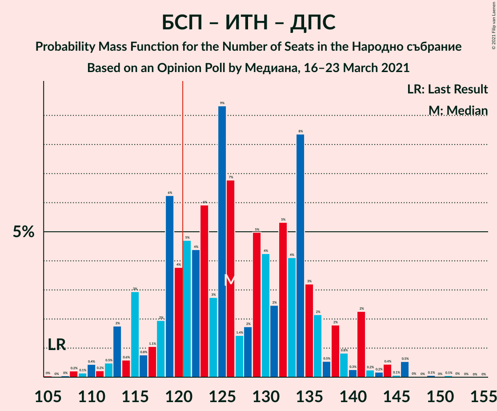

| Number of Seats | Probability | Accumulated | Special Marks |
|:---------------:|:-----------:|:-----------:|:-------------:|
| 105 | 0% | 100% |  |
| 106 | 0% | 99.9% | Last Result |
| 107 | 0% | 99.9% |  |
| 108 | 0.2% | 99.9% |  |
| 109 | 0.1% | 99.6% |  |
| 110 | 0.4% | 99.5% |  |
| 111 | 0.2% | 99.1% |  |
| 112 | 0.5% | 98.8% |  |
| 113 | 2% | 98% |  |
| 114 | 0.6% | 97% |  |
| 115 | 3% | 96% |  |
| 116 | 0.8% | 93% |  |
| 117 | 1.1% | 92% |  |
| 118 | 2% | 91% |  |
| 119 | 6% | 89% |  |
| 120 | 4% | 83% |  |
| 121 | 5% | 79% | Majority |
| 122 | 4% | 75% |  |
| 123 | 6% | 70% |  |
| 124 | 3% | 64% |  |
| 125 | 9% | 62% |  |
| 126 | 7% | 52% |  |
| 127 | 1.4% | 45% | Median |
| 128 | 2% | 44% |  |
| 129 | 5% | 42% |  |
| 130 | 4% | 37% |  |
| 131 | 2% | 33% |  |
| 132 | 5% | 31% |  |
| 133 | 4% | 25% |  |
| 134 | 8% | 21% |  |
| 135 | 3% | 13% |  |
| 136 | 2% | 10% |  |
| 137 | 0.5% | 7% |  |
| 138 | 2% | 7% |  |
| 139 | 0.8% | 5% |  |
| 140 | 0.3% | 4% |  |
| 141 | 2% | 4% |  |
| 142 | 0.2% | 2% |  |
| 143 | 0.2% | 1.4% |  |
| 144 | 0.4% | 1.3% |  |
| 145 | 0.1% | 0.8% |  |
| 146 | 0.5% | 0.8% |  |
| 147 | 0% | 0.2% |  |
| 148 | 0% | 0.2% |  |
| 149 | 0.1% | 0.2% |  |
| 150 | 0% | 0.1% |  |
| 151 | 0.1% | 0.1% |  |
| 152 | 0% | 0% |  |

### Българска социалистическа партия – Движение за права и свободи – Изправи се Бг

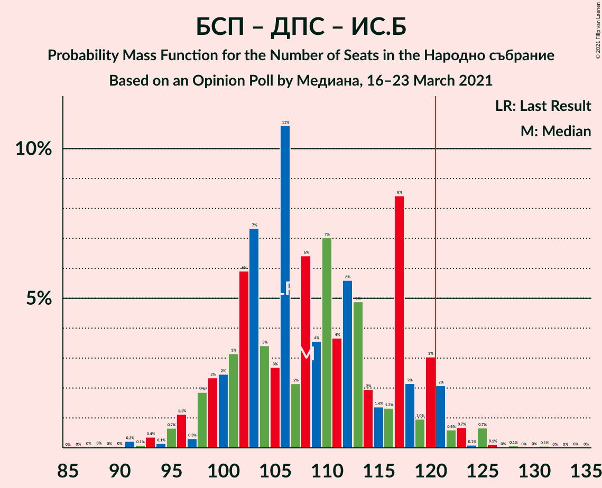

| Number of Seats | Probability | Accumulated | Special Marks |
|:---------------:|:-----------:|:-----------:|:-------------:|
| 88 | 0% | 100% |  |
| 89 | 0% | 99.9% |  |
| 90 | 0% | 99.9% |  |
| 91 | 0.2% | 99.8% |  |
| 92 | 0.1% | 99.6% |  |
| 93 | 0.4% | 99.5% |  |
| 94 | 0.1% | 99.2% |  |
| 95 | 0.7% | 99.0% |  |
| 96 | 1.1% | 98% |  |
| 97 | 0.3% | 97% |  |
| 98 | 2% | 97% |  |
| 99 | 2% | 95% |  |
| 100 | 2% | 93% |  |
| 101 | 3% | 90% |  |
| 102 | 6% | 87% |  |
| 103 | 7% | 81% |  |
| 104 | 3% | 74% |  |
| 105 | 3% | 70% |  |
| 106 | 11% | 68% | Last Result |
| 107 | 2% | 57% |  |
| 108 | 6% | 55% |  |
| 109 | 4% | 48% | Median |
| 110 | 7% | 45% |  |
| 111 | 4% | 38% |  |
| 112 | 6% | 34% |  |
| 113 | 5% | 29% |  |
| 114 | 2% | 24% |  |
| 115 | 1.4% | 22% |  |
| 116 | 1.3% | 20% |  |
| 117 | 8% | 19% |  |
| 118 | 2% | 11% |  |
| 119 | 1.0% | 8% |  |
| 120 | 3% | 7% |  |
| 121 | 2% | 4% | Majority |
| 122 | 0.6% | 2% |  |
| 123 | 0.7% | 2% |  |
| 124 | 0.1% | 1.1% |  |
| 125 | 0.7% | 1.0% |  |
| 126 | 0.1% | 0.3% |  |
| 127 | 0% | 0.2% |  |
| 128 | 0.1% | 0.2% |  |
| 129 | 0% | 0.1% |  |
| 130 | 0% | 0.1% |  |
| 131 | 0.1% | 0.1% |  |
| 132 | 0% | 0% |  |

### Българска социалистическа партия – Движение за права и свободи

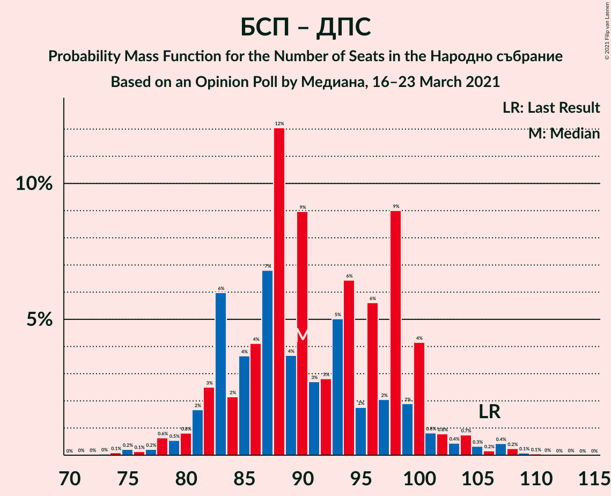

| Number of Seats | Probability | Accumulated | Special Marks |
|:---------------:|:-----------:|:-----------:|:-------------:|
| 72 | 0% | 100% |  |
| 73 | 0% | 99.9% |  |
| 74 | 0.1% | 99.9% |  |
| 75 | 0.2% | 99.8% |  |
| 76 | 0.1% | 99.6% |  |
| 77 | 0.2% | 99.4% |  |
| 78 | 0.6% | 99.2% |  |
| 79 | 0.5% | 98.6% |  |
| 80 | 0.8% | 98% |  |
| 81 | 2% | 97% |  |
| 82 | 3% | 96% |  |
| 83 | 6% | 93% |  |
| 84 | 2% | 87% |  |
| 85 | 4% | 85% |  |
| 86 | 4% | 81% |  |
| 87 | 7% | 77% |  |
| 88 | 12% | 70% |  |
| 89 | 4% | 58% |  |
| 90 | 9% | 55% |  |
| 91 | 3% | 46% | Median |
| 92 | 3% | 43% |  |
| 93 | 5% | 40% |  |
| 94 | 6% | 35% |  |
| 95 | 2% | 29% |  |
| 96 | 6% | 27% |  |
| 97 | 2% | 21% |  |
| 98 | 9% | 19% |  |
| 99 | 2% | 10% |  |
| 100 | 4% | 8% |  |
| 101 | 0.8% | 4% |  |
| 102 | 0.8% | 3% |  |
| 103 | 0.4% | 3% |  |
| 104 | 0.7% | 2% |  |
| 105 | 0.3% | 1.4% |  |
| 106 | 0.2% | 1.0% | Last Result |
| 107 | 0.4% | 0.9% |  |
| 108 | 0.2% | 0.4% |  |
| 109 | 0.1% | 0.2% |  |
| 110 | 0.1% | 0.1% |  |
| 111 | 0% | 0.1% |  |
| 112 | 0% | 0% |  |

### Граждани за европейско развитие на България – Обединени Патриоти

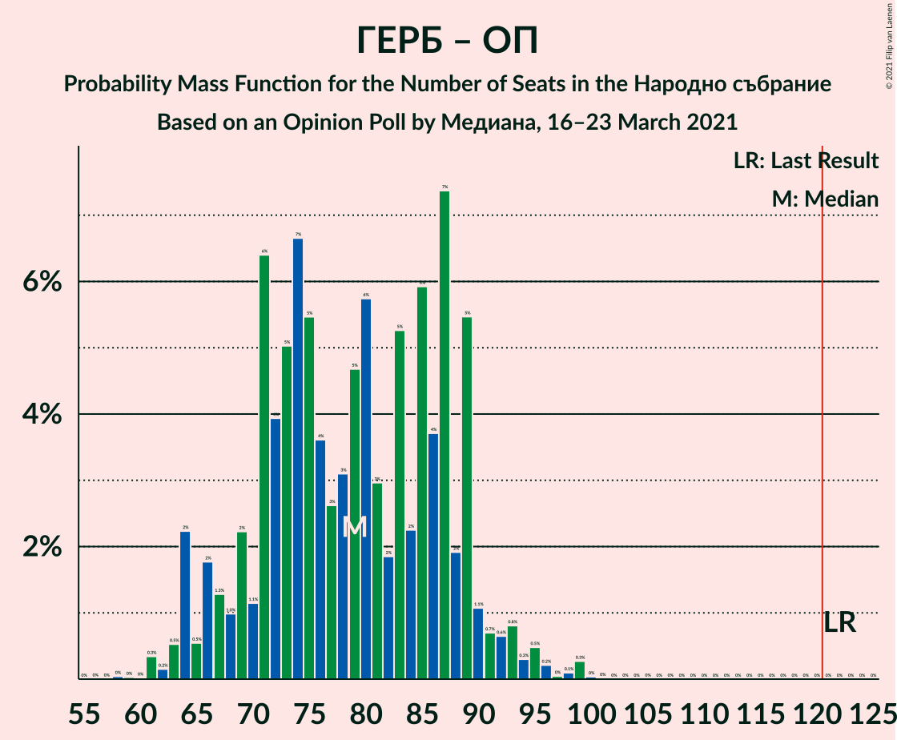

| Number of Seats | Probability | Accumulated | Special Marks |
|:---------------:|:-----------:|:-----------:|:-------------:|
| 58 | 0% | 100% |  |
| 59 | 0% | 99.9% |  |
| 60 | 0% | 99.9% |  |
| 61 | 0.3% | 99.9% |  |
| 62 | 0.2% | 99.6% |  |
| 63 | 0.5% | 99.4% |  |
| 64 | 2% | 98.9% |  |
| 65 | 0.5% | 97% |  |
| 66 | 2% | 96% |  |
| 67 | 1.3% | 94% |  |
| 68 | 1.0% | 93% |  |
| 69 | 2% | 92% |  |
| 70 | 1.1% | 90% |  |
| 71 | 6% | 89% |  |
| 72 | 4% | 82% |  |
| 73 | 5% | 78% |  |
| 74 | 7% | 73% |  |
| 75 | 5% | 67% |  |
| 76 | 4% | 61% |  |
| 77 | 3% | 58% |  |
| 78 | 3% | 55% |  |
| 79 | 5% | 52% |  |
| 80 | 6% | 47% |  |
| 81 | 3% | 41% |  |
| 82 | 2% | 38% | Median |
| 83 | 5% | 37% |  |
| 84 | 2% | 31% |  |
| 85 | 6% | 29% |  |
| 86 | 4% | 23% |  |
| 87 | 7% | 19% |  |
| 88 | 2% | 12% |  |
| 89 | 5% | 10% |  |
| 90 | 1.1% | 5% |  |
| 91 | 0.7% | 4% |  |
| 92 | 0.6% | 3% |  |
| 93 | 0.8% | 2% |  |
| 94 | 0.3% | 1.5% |  |
| 95 | 0.5% | 1.2% |  |
| 96 | 0.2% | 0.7% |  |
| 97 | 0% | 0.5% |  |
| 98 | 0.1% | 0.4% |  |
| 99 | 0.3% | 0.3% |  |
| 100 | 0% | 0.1% |  |
| 101 | 0% | 0% |  |
| 102 | 0% | 0% |  |
| 103 | 0% | 0% |  |
| 104 | 0% | 0% |  |
| 105 | 0% | 0% |  |
| 106 | 0% | 0% |  |
| 107 | 0% | 0% |  |
| 108 | 0% | 0% |  |
| 109 | 0% | 0% |  |
| 110 | 0% | 0% |  |
| 111 | 0% | 0% |  |
| 112 | 0% | 0% |  |
| 113 | 0% | 0% |  |
| 114 | 0% | 0% |  |
| 115 | 0% | 0% |  |
| 116 | 0% | 0% |  |
| 117 | 0% | 0% |  |
| 118 | 0% | 0% |  |
| 119 | 0% | 0% |  |
| 120 | 0% | 0% |  |
| 121 | 0% | 0% | Majority |
| 122 | 0% | 0% | Last Result |

## Technical Information

### Opinion Poll

+ **Polling firm:** Медиана
+ **Commissioner(s):** —
+ **Fieldwork period:** 16–23 March 2021

### Calculations

+ **Sample size:** 602
+ **Simulations done:** 1,048,576
+ **Error estimate:** 1.75%

