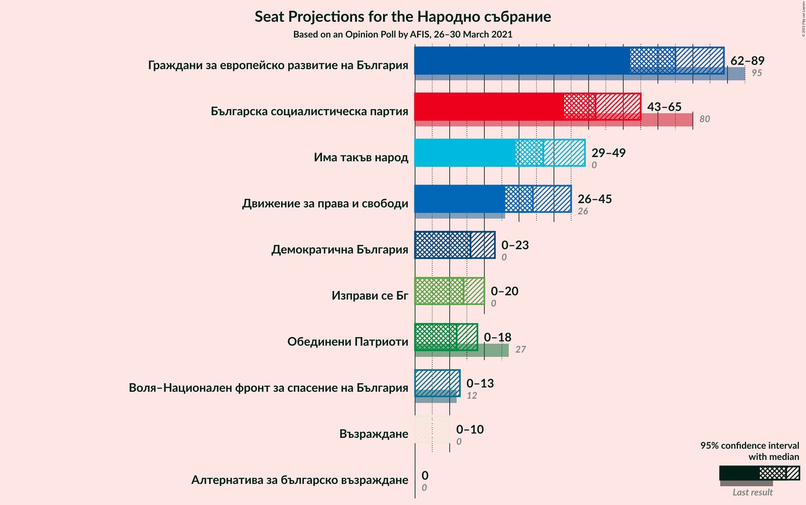
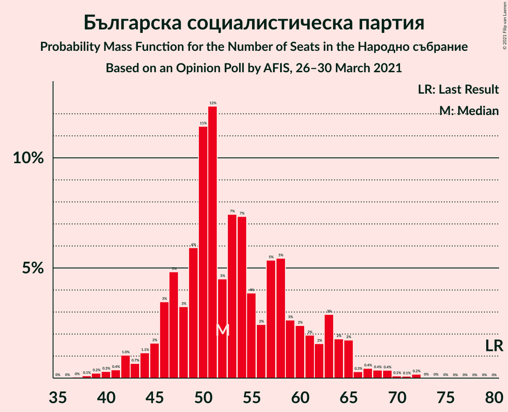
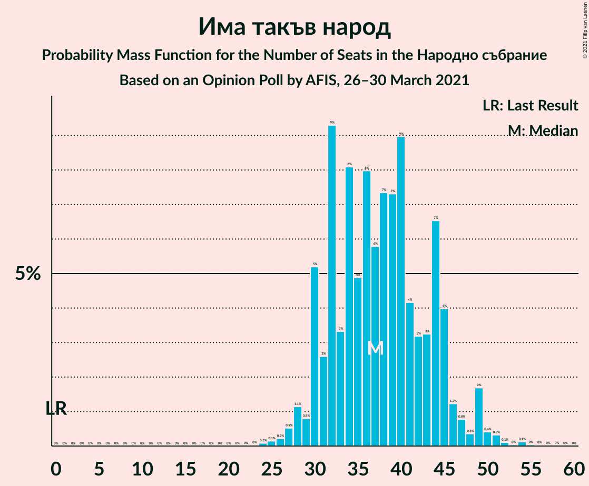
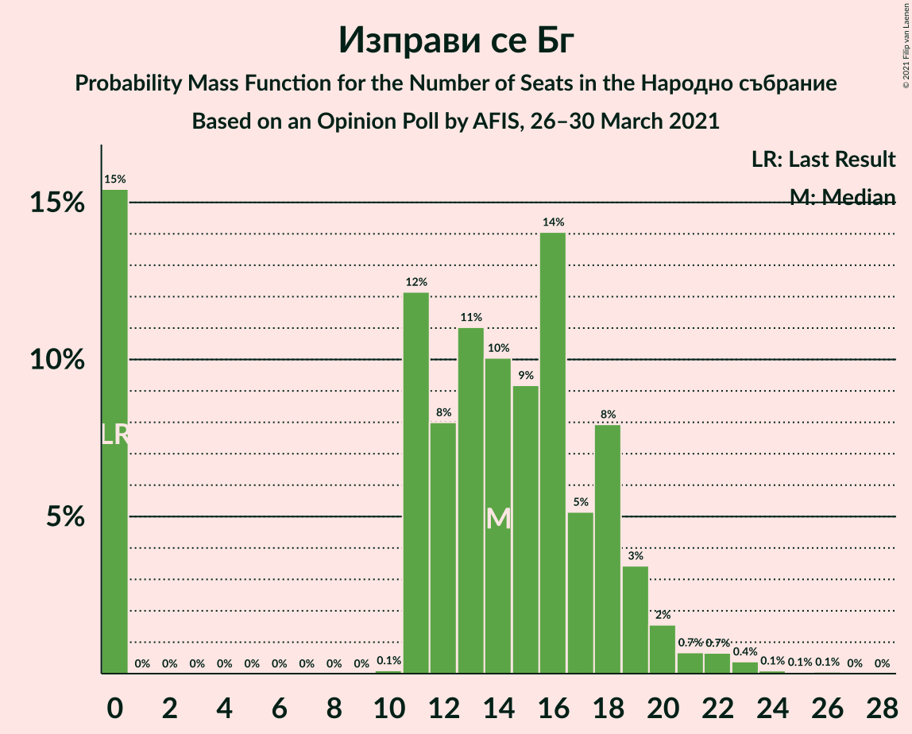
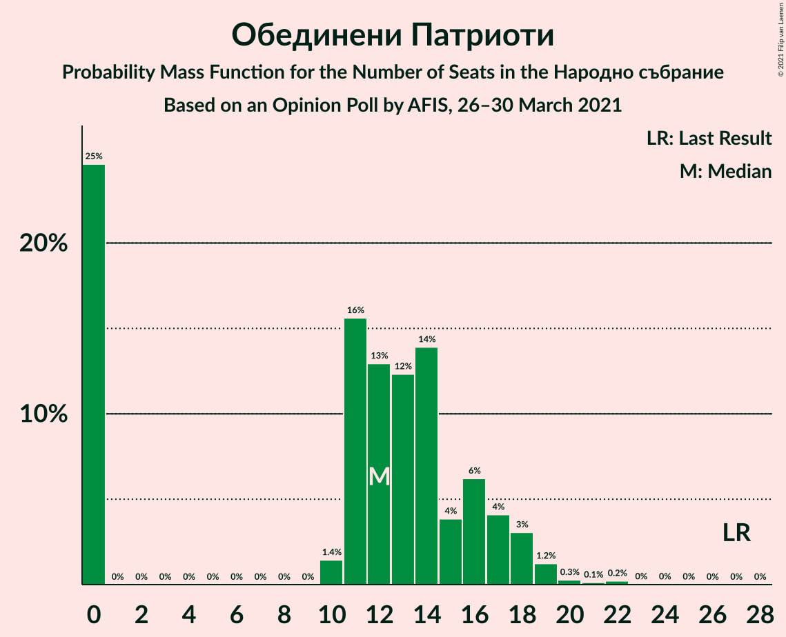
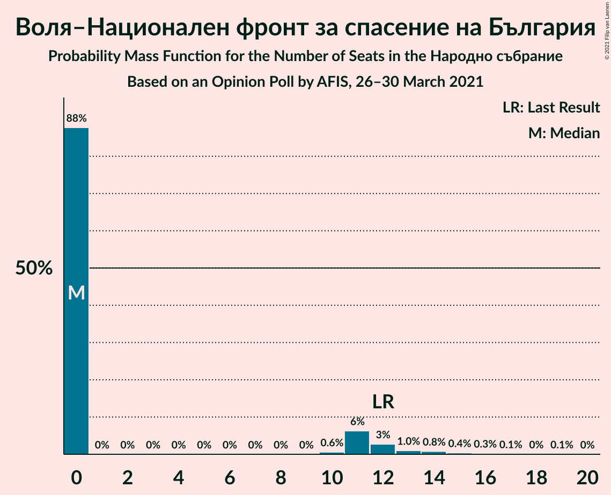
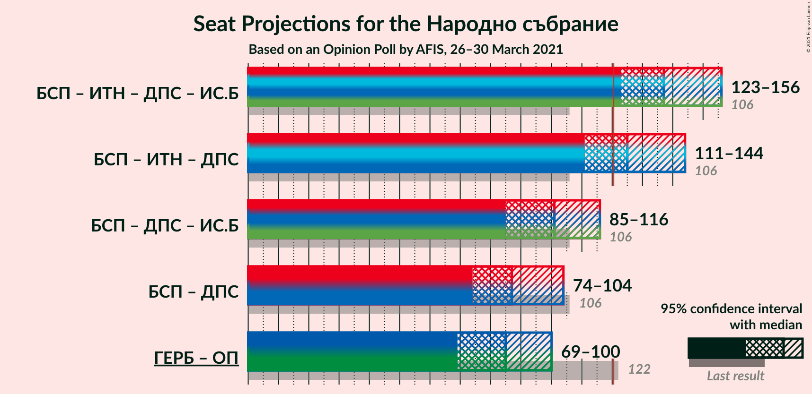
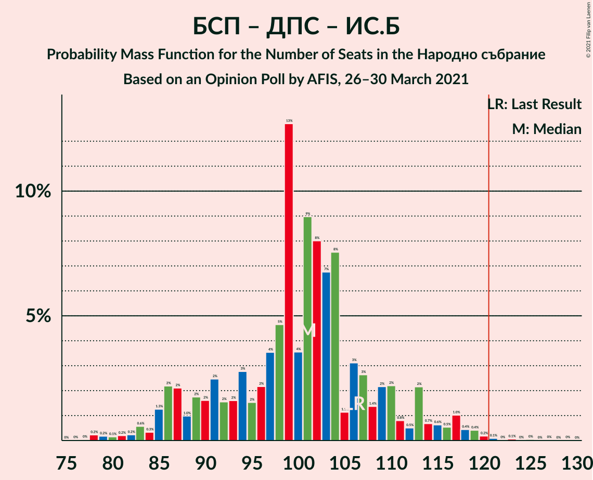

# Opinion Poll by AFIS, 26–30 March 2021

<a href="#voting-intentions">Voting Intentions</a> | <a href="#seats">Seats</a> | <a href="#coalitions">Coalitions</a> | <a href="#technical-information">Technical Information</a>

## Voting Intentions

### Confidence Intervals

| Party | Last Result | Poll Result | 80% Confidence Interval | 90% Confidence Interval | 95% Confidence Interval | 99% Confidence Interval |
|:-----:|:-----------:|:-----------:|:-----------------------:|:-----------------------:|:-----------------------:|:-----------------------:|
| Граждани за европейско развитие на България | 33.5% | 28.2% | 25.3–31.3% |24.5–32.1% |23.9–32.9% |22.6–34.4% |
| Българска социалистическа партия | 27.9% | 20.3% | 17.8–23.1% |17.1–23.9% |16.5–24.6% |15.4–26.0% |
| Има такъв народ | 0.0% | 14.2% | 12.1–16.7% |11.6–17.5% |11.1–18.1% |10.1–19.4% |
| Движение за права и свободи | 9.2% | 12.9% | 10.9–15.3% |10.4–16.0% |9.9–16.7% |9.0–17.9% |
| Демократична България | 0.0% | 6.1% | 4.7–7.9% |4.4–8.5% |4.1–8.9% |3.5–9.9% |
| Изправи се Бг | 0.0% | 5.0% | 3.8–6.7% |3.5–7.2% |3.2–7.7% |2.7–8.6% |
| Обединени Патриоти | 9.3% | 4.5% | 3.4–6.1% |3.1–6.6% |2.8–7.1% |2.4–7.9% |
| Воля–Национален фронт за спасение на България | 4.3% | 2.9% | 2.1–4.3% |1.8–4.7% |1.6–5.1% |1.3–5.9% |
| Възраждане | 0.0% | 2.1% | 1.4–3.4% |1.2–3.8% |1.1–4.1% |0.8–4.8% |
| Алтернатива за българско възраждане | 1.6% | 1.3% | 0.8–2.4% |0.7–2.7% |0.6–3.0% |0.4–3.7% |

*Note:* The poll result column reflects the actual value used in the calculations. Published results may vary slightly, and in addition be rounded to fewer digits.

## Seats

### Confidence Intervals

| Party | Last Result | Median | 80% Confidence Interval | 90% Confidence Interval | 95% Confidence Interval | 99% Confidence Interval |
|:-----:|:-----------:|:------:|:-----------------------:|:-----------------------:|:-----------------------:|:-----------------------:|
| <a href="#граждани-за-европейско-развитие-на-българия">Граждани за европейско развитие на България</a> | 95 | 75 | 66–83 |65–87 |62–88 |58–92 |
| <a href="#българска-социалистическа-партия">Българска социалистическа партия</a> | 80 | 51 | 47–62 |45–64 |43–65 |39–68 |
| <a href="#има-такъв-народ">Има такъв народ</a> | 0 | 37 | 31–44 |30–46 |30–49 |27–51 |
| <a href="#движение-за-права-и-свободи">Движение за права и свободи</a> | 26 | 34 | 28–42 |27–43 |26–45 |23–48 |
| <a href="#демократична-българия">Демократична България</a> | 0 | 17 | 12–20 |0–21 |0–23 |0–25 |
| <a href="#изправи-се-бг">Изправи се Бг</a> | 0 | 14 | 0–18 |0–19 |0–21 |0–23 |
| <a href="#обединени-патриоти">Обединени Патриоти</a> | 27 | 12 | 0–17 |0–18 |0–18 |0–21 |
| <a href="#воля–национален-фронт-за-спасение-на-българия">Воля–Национален фронт за спасение на България</a> | 12 | 0 | 0–11 |0–11 |0–12 |0–15 |
| <a href="#възраждане">Възраждане</a> | 0 | 0 | 0 |0 |0 |0–12 |
| <a href="#алтернатива-за-българско-възраждане">Алтернатива за българско възраждане</a> | 0 | 0 | 0 |0 |0 |0 |

### Граждани за европейско развитие на България

*For a full overview of the results for this party, see the [Граждани за европейско развитие на България](party-гражданизаевропейскоразвитиенабългария.html) page.*

| Number of Seats | Probability | Accumulated | Special Marks |
|:---------------:|:-----------:|:-----------:|:-------------:|
| 54 | 0% | 100% |  |
| 55 | 0.1% | 99.9% |  |
| 56 | 0.1% | 99.8% |  |
| 57 | 0.2% | 99.7% |  |
| 58 | 0.3% | 99.6% |  |
| 59 | 0.4% | 99.2% |  |
| 60 | 0.2% | 98.8% |  |
| 61 | 0.3% | 98.6% |  |
| 62 | 1.3% | 98% |  |
| 63 | 0.7% | 97% |  |
| 64 | 1.2% | 96% |  |
| 65 | 2% | 95% |  |
| 66 | 5% | 93% |  |
| 67 | 3% | 88% |  |
| 68 | 4% | 85% |  |
| 69 | 8% | 81% |  |
| 70 | 2% | 73% |  |
| 71 | 2% | 71% |  |
| 72 | 4% | 70% |  |
| 73 | 7% | 66% |  |
| 74 | 3% | 59% |  |
| 75 | 8% | 56% | Median |
| 76 | 6% | 48% |  |
| 77 | 3% | 42% |  |
| 78 | 18% | 39% |  |
| 79 | 3% | 21% |  |
| 80 | 2% | 18% |  |
| 81 | 5% | 16% |  |
| 82 | 1.2% | 11% |  |
| 83 | 2% | 10% |  |
| 84 | 0.9% | 8% |  |
| 85 | 1.1% | 7% |  |
| 86 | 0.6% | 6% |  |
| 87 | 1.3% | 5% |  |
| 88 | 2% | 4% |  |
| 89 | 0.2% | 2% |  |
| 90 | 2% | 2% |  |
| 91 | 0.1% | 0.7% |  |
| 92 | 0.1% | 0.6% |  |
| 93 | 0.1% | 0.5% |  |
| 94 | 0.2% | 0.4% |  |
| 95 | 0% | 0.2% | Last Result |
| 96 | 0% | 0.2% |  |
| 97 | 0% | 0.2% |  |
| 98 | 0% | 0.1% |  |
| 99 | 0% | 0.1% |  |
| 100 | 0% | 0.1% |  |
| 101 | 0.1% | 0.1% |  |
| 102 | 0% | 0% |  |

### Българска социалистическа партия

*For a full overview of the results for this party, see the [Българска социалистическа партия](party-българскасоциалистическапартия.html) page.*

| Number of Seats | Probability | Accumulated | Special Marks |
|:---------------:|:-----------:|:-----------:|:-------------:|
| 37 | 0.1% | 100% |  |
| 38 | 0.1% | 99.9% |  |
| 39 | 0.4% | 99.8% |  |
| 40 | 0.1% | 99.4% |  |
| 41 | 0.6% | 99.3% |  |
| 42 | 1.2% | 98.7% |  |
| 43 | 0.9% | 98% |  |
| 44 | 1.0% | 97% |  |
| 45 | 2% | 96% |  |
| 46 | 3% | 94% |  |
| 47 | 7% | 91% |  |
| 48 | 3% | 84% |  |
| 49 | 10% | 81% |  |
| 50 | 9% | 71% |  |
| 51 | 20% | 62% | Median |
| 52 | 4% | 42% |  |
| 53 | 3% | 38% |  |
| 54 | 3% | 35% |  |
| 55 | 4% | 32% |  |
| 56 | 2% | 27% |  |
| 57 | 4% | 25% |  |
| 58 | 3% | 22% |  |
| 59 | 2% | 19% |  |
| 60 | 3% | 17% |  |
| 61 | 2% | 14% |  |
| 62 | 3% | 12% |  |
| 63 | 3% | 9% |  |
| 64 | 2% | 6% |  |
| 65 | 3% | 4% |  |
| 66 | 0.3% | 1.3% |  |
| 67 | 0.2% | 1.0% |  |
| 68 | 0.4% | 0.8% |  |
| 69 | 0.1% | 0.4% |  |
| 70 | 0.1% | 0.3% |  |
| 71 | 0.1% | 0.2% |  |
| 72 | 0% | 0.1% |  |
| 73 | 0% | 0.1% |  |
| 74 | 0% | 0.1% |  |
| 75 | 0% | 0% |  |
| 76 | 0% | 0% |  |
| 77 | 0% | 0% |  |
| 78 | 0% | 0% |  |
| 79 | 0% | 0% |  |
| 80 | 0% | 0% | Last Result |

### Има такъв народ

*For a full overview of the results for this party, see the [Има такъв народ](party-иматакъвнарод.html) page.*

| Number of Seats | Probability | Accumulated | Special Marks |
|:---------------:|:-----------:|:-----------:|:-------------:|
| 0 | 0% | 100% | Last Result |
| 1 | 0% | 100% |  |
| 2 | 0% | 100% |  |
| 3 | 0% | 100% |  |
| 4 | 0% | 100% |  |
| 5 | 0% | 100% |  |
| 6 | 0% | 100% |  |
| 7 | 0% | 100% |  |
| 8 | 0% | 100% |  |
| 9 | 0% | 100% |  |
| 10 | 0% | 100% |  |
| 11 | 0% | 100% |  |
| 12 | 0% | 100% |  |
| 13 | 0% | 100% |  |
| 14 | 0% | 100% |  |
| 15 | 0% | 100% |  |
| 16 | 0% | 100% |  |
| 17 | 0% | 100% |  |
| 18 | 0% | 100% |  |
| 19 | 0% | 100% |  |
| 20 | 0% | 100% |  |
| 21 | 0% | 100% |  |
| 22 | 0% | 100% |  |
| 23 | 0% | 100% |  |
| 24 | 0.1% | 100% |  |
| 25 | 0.1% | 99.9% |  |
| 26 | 0.2% | 99.8% |  |
| 27 | 0.2% | 99.5% |  |
| 28 | 0.7% | 99.3% |  |
| 29 | 1.0% | 98.6% |  |
| 30 | 7% | 98% |  |
| 31 | 1.4% | 90% |  |
| 32 | 16% | 89% |  |
| 33 | 4% | 73% |  |
| 34 | 4% | 68% |  |
| 35 | 5% | 65% |  |
| 36 | 7% | 60% |  |
| 37 | 7% | 52% | Median |
| 38 | 9% | 46% |  |
| 39 | 7% | 37% |  |
| 40 | 6% | 30% |  |
| 41 | 2% | 24% |  |
| 42 | 4% | 22% |  |
| 43 | 2% | 18% |  |
| 44 | 6% | 15% |  |
| 45 | 4% | 10% |  |
| 46 | 1.4% | 5% |  |
| 47 | 0.5% | 4% |  |
| 48 | 0.3% | 3% |  |
| 49 | 2% | 3% |  |
| 50 | 0.7% | 1.2% |  |
| 51 | 0.2% | 0.6% |  |
| 52 | 0.1% | 0.4% |  |
| 53 | 0.1% | 0.4% |  |
| 54 | 0.1% | 0.3% |  |
| 55 | 0.1% | 0.1% |  |
| 56 | 0% | 0.1% |  |
| 57 | 0% | 0% |  |

### Движение за права и свободи

*For a full overview of the results for this party, see the [Движение за права и свободи](party-движениезаправаисвободи.html) page.*

| Number of Seats | Probability | Accumulated | Special Marks |
|:---------------:|:-----------:|:-----------:|:-------------:|
| 20 | 0.1% | 100% |  |
| 21 | 0.1% | 99.9% |  |
| 22 | 0.1% | 99.9% |  |
| 23 | 0.6% | 99.8% |  |
| 24 | 0.2% | 99.2% |  |
| 25 | 0.7% | 99.0% |  |
| 26 | 2% | 98% | Last Result |
| 27 | 3% | 96% |  |
| 28 | 7% | 93% |  |
| 29 | 2% | 86% |  |
| 30 | 4% | 85% |  |
| 31 | 4% | 80% |  |
| 32 | 16% | 76% |  |
| 33 | 8% | 60% |  |
| 34 | 7% | 52% | Median |
| 35 | 5% | 45% |  |
| 36 | 5% | 39% |  |
| 37 | 3% | 35% |  |
| 38 | 6% | 31% |  |
| 39 | 5% | 25% |  |
| 40 | 5% | 20% |  |
| 41 | 3% | 15% |  |
| 42 | 3% | 12% |  |
| 43 | 4% | 9% |  |
| 44 | 1.0% | 5% |  |
| 45 | 2% | 4% |  |
| 46 | 0.4% | 2% |  |
| 47 | 0.5% | 1.2% |  |
| 48 | 0.4% | 0.7% |  |
| 49 | 0% | 0.3% |  |
| 50 | 0.1% | 0.2% |  |
| 51 | 0% | 0.2% |  |
| 52 | 0.1% | 0.1% |  |
| 53 | 0% | 0% |  |

### Демократична България

*For a full overview of the results for this party, see the [Демократична България](party-демократичнабългария.html) page.*

| Number of Seats | Probability | Accumulated | Special Marks |
|:---------------:|:-----------:|:-----------:|:-------------:|
| 0 | 5% | 100% | Last Result |
| 1 | 0% | 95% |  |
| 2 | 0% | 95% |  |
| 3 | 0% | 95% |  |
| 4 | 0% | 95% |  |
| 5 | 0% | 95% |  |
| 6 | 0% | 95% |  |
| 7 | 0% | 95% |  |
| 8 | 0% | 95% |  |
| 9 | 0% | 95% |  |
| 10 | 0.1% | 95% |  |
| 11 | 2% | 95% |  |
| 12 | 5% | 92% |  |
| 13 | 11% | 88% |  |
| 14 | 7% | 76% |  |
| 15 | 8% | 70% |  |
| 16 | 8% | 62% |  |
| 17 | 16% | 54% | Median |
| 18 | 4% | 38% |  |
| 19 | 4% | 34% |  |
| 20 | 23% | 30% |  |
| 21 | 4% | 7% |  |
| 22 | 0.9% | 4% |  |
| 23 | 1.2% | 3% |  |
| 24 | 0.8% | 2% |  |
| 25 | 0.3% | 0.8% |  |
| 26 | 0.2% | 0.5% |  |
| 27 | 0.1% | 0.3% |  |
| 28 | 0.1% | 0.2% |  |
| 29 | 0% | 0.1% |  |
| 30 | 0% | 0.1% |  |
| 31 | 0% | 0% |  |

### Изправи се Бг

*For a full overview of the results for this party, see the [Изправи се Бг](party-изправисебг.html) page.*

| Number of Seats | Probability | Accumulated | Special Marks |
|:---------------:|:-----------:|:-----------:|:-------------:|
| 0 | 18% | 100% | Last Result |
| 1 | 0% | 82% |  |
| 2 | 0% | 82% |  |
| 3 | 0% | 82% |  |
| 4 | 0% | 82% |  |
| 5 | 0% | 82% |  |
| 6 | 0% | 82% |  |
| 7 | 0% | 82% |  |
| 8 | 0% | 82% |  |
| 9 | 0% | 82% |  |
| 10 | 0.1% | 82% |  |
| 11 | 14% | 82% |  |
| 12 | 6% | 68% |  |
| 13 | 9% | 62% |  |
| 14 | 11% | 53% | Median |
| 15 | 6% | 42% |  |
| 16 | 20% | 36% |  |
| 17 | 4% | 17% |  |
| 18 | 5% | 13% |  |
| 19 | 3% | 8% |  |
| 20 | 2% | 4% |  |
| 21 | 0.9% | 3% |  |
| 22 | 0.8% | 2% |  |
| 23 | 0.7% | 0.9% |  |
| 24 | 0.1% | 0.2% |  |
| 25 | 0.1% | 0.1% |  |
| 26 | 0% | 0.1% |  |
| 27 | 0% | 0% |  |

### Обединени Патриоти

*For a full overview of the results for this party, see the [Обединени Патриоти](party-обединенипатриоти.html) page.*

| Number of Seats | Probability | Accumulated | Special Marks |
|:---------------:|:-----------:|:-----------:|:-------------:|
| 0 | 20% | 100% |  |
| 1 | 0% | 80% |  |
| 2 | 0% | 80% |  |
| 3 | 0% | 80% |  |
| 4 | 0% | 80% |  |
| 5 | 0% | 80% |  |
| 6 | 0% | 80% |  |
| 7 | 0% | 80% |  |
| 8 | 0% | 80% |  |
| 9 | 0% | 80% |  |
| 10 | 3% | 80% |  |
| 11 | 22% | 77% |  |
| 12 | 11% | 55% | Median |
| 13 | 9% | 45% |  |
| 14 | 13% | 36% |  |
| 15 | 4% | 23% |  |
| 16 | 5% | 19% |  |
| 17 | 6% | 14% |  |
| 18 | 6% | 8% |  |
| 19 | 1.4% | 2% |  |
| 20 | 0.2% | 0.8% |  |
| 21 | 0.2% | 0.5% |  |
| 22 | 0.3% | 0.4% |  |
| 23 | 0% | 0.1% |  |
| 24 | 0% | 0% |  |
| 25 | 0% | 0% |  |
| 26 | 0% | 0% |  |
| 27 | 0% | 0% | Last Result |

### Воля–Национален фронт за спасение на България

*For a full overview of the results for this party, see the [Воля–Национален фронт за спасение на България](party-воля–националенфронтзаспасениенабългария.html) page.*

| Number of Seats | Probability | Accumulated | Special Marks |
|:---------------:|:-----------:|:-----------:|:-------------:|
| 0 | 87% | 100% | Median |
| 1 | 0% | 13% |  |
| 2 | 0% | 13% |  |
| 3 | 0% | 13% |  |
| 4 | 0% | 13% |  |
| 5 | 0% | 13% |  |
| 6 | 0% | 13% |  |
| 7 | 0% | 13% |  |
| 8 | 0% | 13% |  |
| 9 | 0% | 13% |  |
| 10 | 0.6% | 13% |  |
| 11 | 8% | 13% |  |
| 12 | 2% | 5% | Last Result |
| 13 | 0.8% | 2% |  |
| 14 | 0.7% | 2% |  |
| 15 | 0.4% | 0.8% |  |
| 16 | 0.2% | 0.4% |  |
| 17 | 0.1% | 0.2% |  |
| 18 | 0.1% | 0.1% |  |
| 19 | 0.1% | 0.1% |  |
| 20 | 0% | 0% |  |

### Възраждане

*For a full overview of the results for this party, see the [Възраждане](party-възраждане.html) page.*

| Number of Seats | Probability | Accumulated | Special Marks |
|:---------------:|:-----------:|:-----------:|:-------------:|
| 0 | 98% | 100% | Last Result, Median |
| 1 | 0% | 2% |  |
| 2 | 0% | 2% |  |
| 3 | 0% | 2% |  |
| 4 | 0% | 2% |  |
| 5 | 0% | 2% |  |
| 6 | 0% | 2% |  |
| 7 | 0% | 2% |  |
| 8 | 0% | 2% |  |
| 9 | 0% | 2% |  |
| 10 | 0.1% | 2% |  |
| 11 | 0.9% | 2% |  |
| 12 | 0.9% | 1.2% |  |
| 13 | 0.2% | 0.3% |  |
| 14 | 0.1% | 0.1% |  |
| 15 | 0% | 0% |  |

### Алтернатива за българско възраждане

*For a full overview of the results for this party, see the [Алтернатива за българско възраждане](party-алтернативазабългарсковъзраждане.html) page.*

| Number of Seats | Probability | Accumulated | Special Marks |
|:---------------:|:-----------:|:-----------:|:-------------:|
| 0 | 99.8% | 100% | Last Result, Median |
| 1 | 0% | 0.2% |  |
| 2 | 0% | 0.2% |  |
| 3 | 0% | 0.2% |  |
| 4 | 0% | 0.2% |  |
| 5 | 0% | 0.2% |  |
| 6 | 0% | 0.2% |  |
| 7 | 0% | 0.2% |  |
| 8 | 0% | 0.2% |  |
| 9 | 0% | 0.2% |  |
| 10 | 0% | 0.2% |  |
| 11 | 0.1% | 0.2% |  |
| 12 | 0% | 0.1% |  |
| 13 | 0% | 0% |  |

## Coalitions

### Confidence Intervals

| Coalition | Last Result | Median | Majority? | 80% Confidence Interval | 90% Confidence Interval | 95% Confidence Interval | 99% Confidence Interval |
|:---------:|:-----------:|:------:|:---------:|:-----------------------:|:-----------------------:|:-----------------------:|:-----------------------:|
| Българска социалистическа партия – Има такъв народ – Движение за права и свободи – Изправи се Бг | 106 | 135 | 98% | 127–148 | 124–151 | 122–153 | 118–162 |
| Българска социалистическа партия – Има такъв народ – Движение за права и свободи | 106 | 124 | 64% | 115–137 | 112–141 | 110–148 | 107–152 |
| Българска социалистическа партия – Движение за права и свободи – Изправи се Бг | 106 | 99 | 0.3% | 89–110 | 86–113 | 84–117 | 80–120 |
| Българска социалистическа партия – Движение за права и свободи | 106 | 86 | 0% | 79–100 | 77–102 | 76–106 | 71–107 |
| Граждани за европейско развитие на България – Обединени Патриоти | 122 | 87 | 0% | 75–94 | 71–99 | 69–101 | 64–105 |

### Българска социалистическа партия – Има такъв народ – Движение за права и свободи – Изправи се Бг

| Number of Seats | Probability | Accumulated | Special Marks |
|:---------------:|:-----------:|:-----------:|:-------------:|
| 106 | 0% | 100% | Last Result |
| 107 | 0% | 100% |  |
| 108 | 0% | 100% |  |
| 109 | 0% | 100% |  |
| 110 | 0% | 100% |  |
| 111 | 0% | 100% |  |
| 112 | 0% | 100% |  |
| 113 | 0% | 100% |  |
| 114 | 0% | 99.9% |  |
| 115 | 0.1% | 99.9% |  |
| 116 | 0.2% | 99.9% |  |
| 117 | 0.1% | 99.6% |  |
| 118 | 0.5% | 99.6% |  |
| 119 | 0.3% | 99.1% |  |
| 120 | 0.4% | 98.7% |  |
| 121 | 0.2% | 98% | Majority |
| 122 | 0.8% | 98% |  |
| 123 | 1.0% | 97% |  |
| 124 | 3% | 96% |  |
| 125 | 0.8% | 94% |  |
| 126 | 3% | 93% |  |
| 127 | 2% | 90% |  |
| 128 | 0.7% | 88% |  |
| 129 | 0.9% | 87% |  |
| 130 | 2% | 86% |  |
| 131 | 18% | 85% |  |
| 132 | 1.2% | 66% |  |
| 133 | 5% | 65% |  |
| 134 | 6% | 61% |  |
| 135 | 5% | 55% |  |
| 136 | 7% | 49% | Median |
| 137 | 2% | 43% |  |
| 138 | 4% | 41% |  |
| 139 | 3% | 37% |  |
| 140 | 4% | 34% |  |
| 141 | 2% | 30% |  |
| 142 | 3% | 28% |  |
| 143 | 3% | 24% |  |
| 144 | 2% | 21% |  |
| 145 | 3% | 19% |  |
| 146 | 1.0% | 16% |  |
| 147 | 2% | 14% |  |
| 148 | 3% | 12% |  |
| 149 | 1.2% | 9% |  |
| 150 | 3% | 8% |  |
| 151 | 0.5% | 5% |  |
| 152 | 2% | 5% |  |
| 153 | 0.2% | 3% |  |
| 154 | 0.3% | 2% |  |
| 155 | 0.1% | 2% |  |
| 156 | 0.9% | 2% |  |
| 157 | 0.1% | 1.1% |  |
| 158 | 0.1% | 1.0% |  |
| 159 | 0.3% | 0.9% |  |
| 160 | 0.1% | 0.6% |  |
| 161 | 0% | 0.5% |  |
| 162 | 0.3% | 0.5% |  |
| 163 | 0% | 0.3% |  |
| 164 | 0.2% | 0.3% |  |
| 165 | 0% | 0.1% |  |
| 166 | 0% | 0.1% |  |
| 167 | 0% | 0.1% |  |
| 168 | 0% | 0% |  |

### Българска социалистическа партия – Има такъв народ – Движение за права и свободи

| Number of Seats | Probability | Accumulated | Special Marks |
|:---------------:|:-----------:|:-----------:|:-------------:|
| 102 | 0% | 100% |  |
| 103 | 0% | 99.9% |  |
| 104 | 0% | 99.9% |  |
| 105 | 0.1% | 99.8% |  |
| 106 | 0% | 99.7% | Last Result |
| 107 | 0.4% | 99.7% |  |
| 108 | 0.1% | 99.3% |  |
| 109 | 0.9% | 99.2% |  |
| 110 | 1.0% | 98% |  |
| 111 | 0.4% | 97% |  |
| 112 | 4% | 97% |  |
| 113 | 0.6% | 93% |  |
| 114 | 2% | 93% |  |
| 115 | 17% | 91% |  |
| 116 | 2% | 74% |  |
| 117 | 2% | 72% |  |
| 118 | 2% | 70% |  |
| 119 | 2% | 68% |  |
| 120 | 2% | 66% |  |
| 121 | 5% | 64% | Majority |
| 122 | 4% | 59% | Median |
| 123 | 5% | 55% |  |
| 124 | 3% | 51% |  |
| 125 | 8% | 48% |  |
| 126 | 2% | 40% |  |
| 127 | 4% | 38% |  |
| 128 | 1.3% | 34% |  |
| 129 | 0.8% | 33% |  |
| 130 | 1.5% | 32% |  |
| 131 | 8% | 30% |  |
| 132 | 4% | 23% |  |
| 133 | 1.3% | 19% |  |
| 134 | 2% | 17% |  |
| 135 | 2% | 15% |  |
| 136 | 2% | 13% |  |
| 137 | 4% | 11% |  |
| 138 | 1.1% | 7% |  |
| 139 | 0.2% | 6% |  |
| 140 | 0.3% | 5% |  |
| 141 | 1.2% | 5% |  |
| 142 | 0.5% | 4% |  |
| 143 | 0.4% | 4% |  |
| 144 | 0.1% | 3% |  |
| 145 | 0.1% | 3% |  |
| 146 | 0.3% | 3% |  |
| 147 | 0.1% | 3% |  |
| 148 | 0.2% | 3% |  |
| 149 | 0.2% | 2% |  |
| 150 | 0% | 2% |  |
| 151 | 0.1% | 2% |  |
| 152 | 2% | 2% |  |
| 153 | 0% | 0.1% |  |
| 154 | 0% | 0.1% |  |
| 155 | 0% | 0% |  |

### Българска социалистическа партия – Движение за права и свободи – Изправи се Бг

| Number of Seats | Probability | Accumulated | Special Marks |
|:---------------:|:-----------:|:-----------:|:-------------:|
| 77 | 0% | 100% |  |
| 78 | 0% | 99.9% |  |
| 79 | 0.3% | 99.9% |  |
| 80 | 0.1% | 99.6% |  |
| 81 | 0.1% | 99.5% |  |
| 82 | 0.3% | 99.3% |  |
| 83 | 1.0% | 99.1% |  |
| 84 | 0.5% | 98% |  |
| 85 | 0.9% | 97% |  |
| 86 | 2% | 97% |  |
| 87 | 3% | 95% |  |
| 88 | 0.8% | 91% |  |
| 89 | 2% | 91% |  |
| 90 | 0.6% | 88% |  |
| 91 | 1.3% | 88% |  |
| 92 | 1.1% | 87% |  |
| 93 | 1.5% | 85% |  |
| 94 | 1.5% | 84% |  |
| 95 | 2% | 82% |  |
| 96 | 4% | 80% |  |
| 97 | 7% | 76% |  |
| 98 | 8% | 70% |  |
| 99 | 21% | 62% | Median |
| 100 | 4% | 41% |  |
| 101 | 7% | 38% |  |
| 102 | 4% | 30% |  |
| 103 | 3% | 26% |  |
| 104 | 1.4% | 24% |  |
| 105 | 2% | 22% |  |
| 106 | 5% | 21% | Last Result |
| 107 | 3% | 15% |  |
| 108 | 1.3% | 12% |  |
| 109 | 0.5% | 11% |  |
| 110 | 3% | 10% |  |
| 111 | 0.6% | 7% |  |
| 112 | 0.7% | 6% |  |
| 113 | 2% | 6% |  |
| 114 | 0.4% | 4% |  |
| 115 | 1.0% | 4% |  |
| 116 | 0.2% | 3% |  |
| 117 | 0.6% | 3% |  |
| 118 | 0.5% | 2% |  |
| 119 | 0.9% | 1.5% |  |
| 120 | 0.3% | 0.6% |  |
| 121 | 0.1% | 0.3% | Majority |
| 122 | 0% | 0.2% |  |
| 123 | 0.1% | 0.2% |  |
| 124 | 0% | 0.1% |  |
| 125 | 0% | 0.1% |  |
| 126 | 0% | 0.1% |  |
| 127 | 0% | 0% |  |

### Българска социалистическа партия – Движение за права и свободи

| Number of Seats | Probability | Accumulated | Special Marks |
|:---------------:|:-----------:|:-----------:|:-------------:|
| 66 | 0% | 100% |  |
| 67 | 0% | 99.9% |  |
| 68 | 0% | 99.9% |  |
| 69 | 0.1% | 99.9% |  |
| 70 | 0.3% | 99.8% |  |
| 71 | 0.3% | 99.5% |  |
| 72 | 0.4% | 99.3% |  |
| 73 | 0.1% | 98.9% |  |
| 74 | 0.6% | 98.8% |  |
| 75 | 0.5% | 98% |  |
| 76 | 2% | 98% |  |
| 77 | 2% | 96% |  |
| 78 | 1.0% | 93% |  |
| 79 | 6% | 92% |  |
| 80 | 2% | 86% |  |
| 81 | 0.8% | 84% |  |
| 82 | 4% | 83% |  |
| 83 | 19% | 79% |  |
| 84 | 3% | 60% |  |
| 85 | 2% | 57% | Median |
| 86 | 6% | 54% |  |
| 87 | 10% | 49% |  |
| 88 | 4% | 38% |  |
| 89 | 4% | 34% |  |
| 90 | 2% | 30% |  |
| 91 | 2% | 28% |  |
| 92 | 2% | 26% |  |
| 93 | 4% | 24% |  |
| 94 | 1.0% | 21% |  |
| 95 | 4% | 19% |  |
| 96 | 0.9% | 16% |  |
| 97 | 3% | 15% |  |
| 98 | 0.4% | 12% |  |
| 99 | 0.9% | 11% |  |
| 100 | 1.1% | 10% |  |
| 101 | 3% | 9% |  |
| 102 | 2% | 6% |  |
| 103 | 0.4% | 4% |  |
| 104 | 0.9% | 4% |  |
| 105 | 0.4% | 3% |  |
| 106 | 0.3% | 3% | Last Result |
| 107 | 2% | 2% |  |
| 108 | 0.1% | 0.3% |  |
| 109 | 0.1% | 0.2% |  |
| 110 | 0.1% | 0.1% |  |
| 111 | 0% | 0.1% |  |
| 112 | 0% | 0.1% |  |
| 113 | 0% | 0.1% |  |
| 114 | 0% | 0% |  |

### Граждани за европейско развитие на България – Обединени Патриоти

| Number of Seats | Probability | Accumulated | Special Marks |
|:---------------:|:-----------:|:-----------:|:-------------:|
| 59 | 0% | 100% |  |
| 60 | 0% | 99.9% |  |
| 61 | 0.1% | 99.9% |  |
| 62 | 0.2% | 99.8% |  |
| 63 | 0.1% | 99.6% |  |
| 64 | 0.4% | 99.6% |  |
| 65 | 0.1% | 99.2% |  |
| 66 | 0.4% | 99.0% |  |
| 67 | 0.3% | 98.6% |  |
| 68 | 0.2% | 98% |  |
| 69 | 2% | 98% |  |
| 70 | 0.7% | 97% |  |
| 71 | 1.2% | 96% |  |
| 72 | 0.3% | 95% |  |
| 73 | 0.9% | 94% |  |
| 74 | 0.3% | 93% |  |
| 75 | 4% | 93% |  |
| 76 | 1.0% | 89% |  |
| 77 | 3% | 88% |  |
| 78 | 2% | 85% |  |
| 79 | 1.4% | 82% |  |
| 80 | 5% | 81% |  |
| 81 | 6% | 76% |  |
| 82 | 4% | 71% |  |
| 83 | 5% | 67% |  |
| 84 | 3% | 61% |  |
| 85 | 2% | 58% |  |
| 86 | 3% | 56% |  |
| 87 | 8% | 53% | Median |
| 88 | 2% | 45% |  |
| 89 | 16% | 43% |  |
| 90 | 8% | 27% |  |
| 91 | 4% | 19% |  |
| 92 | 4% | 16% |  |
| 93 | 0.5% | 12% |  |
| 94 | 2% | 11% |  |
| 95 | 2% | 9% |  |
| 96 | 2% | 7% |  |
| 97 | 0.2% | 6% |  |
| 98 | 0.1% | 6% |  |
| 99 | 2% | 5% |  |
| 100 | 0.2% | 4% |  |
| 101 | 3% | 4% |  |
| 102 | 0.2% | 1.2% |  |
| 103 | 0.2% | 1.0% |  |
| 104 | 0.1% | 0.9% |  |
| 105 | 0.4% | 0.7% |  |
| 106 | 0% | 0.3% |  |
| 107 | 0.1% | 0.3% |  |
| 108 | 0% | 0.2% |  |
| 109 | 0.1% | 0.2% |  |
| 110 | 0% | 0.1% |  |
| 111 | 0% | 0.1% |  |
| 112 | 0% | 0.1% |  |
| 113 | 0% | 0.1% |  |
| 114 | 0.1% | 0.1% |  |
| 115 | 0% | 0% |  |
| 116 | 0% | 0% |  |
| 117 | 0% | 0% |  |
| 118 | 0% | 0% |  |
| 119 | 0% | 0% |  |
| 120 | 0% | 0% |  |
| 121 | 0% | 0% | Majority |
| 122 | 0% | 0% | Last Result |

## Technical Information

### Opinion Poll

+ **Polling firm:** AFIS
+ **Commissioner(s):** —
+ **Fieldwork period:** 26–30 March 2021

### Calculations

+ **Sample size:** 380
+ **Simulations done:** 524,288
+ **Error estimate:** 2.85%

