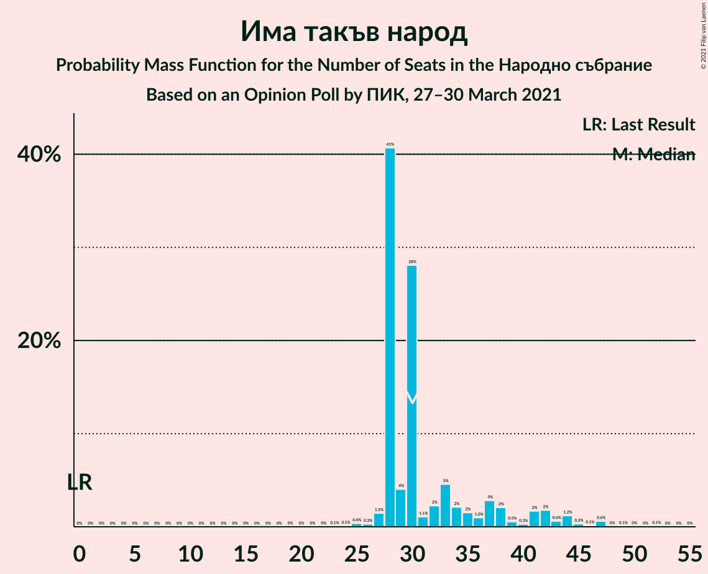
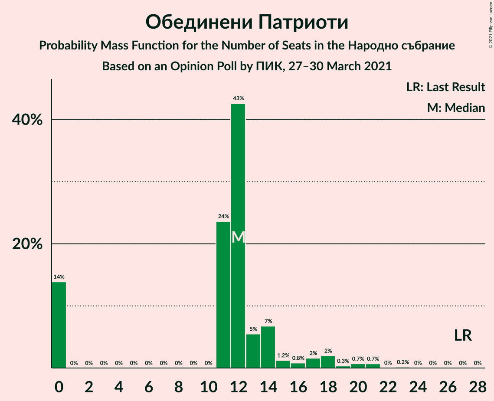
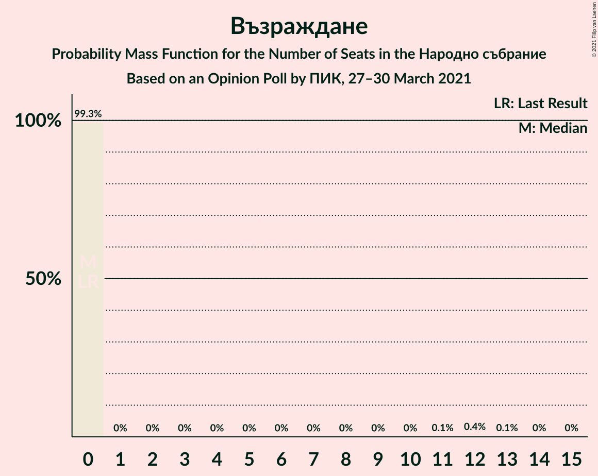
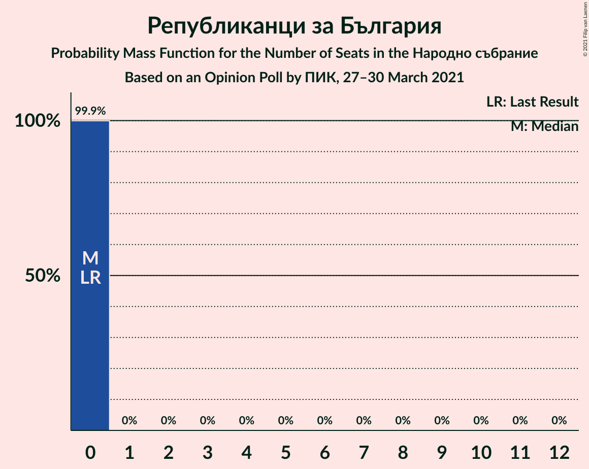
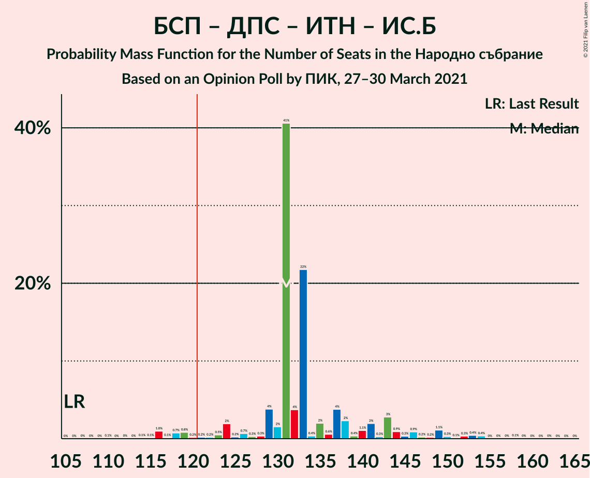
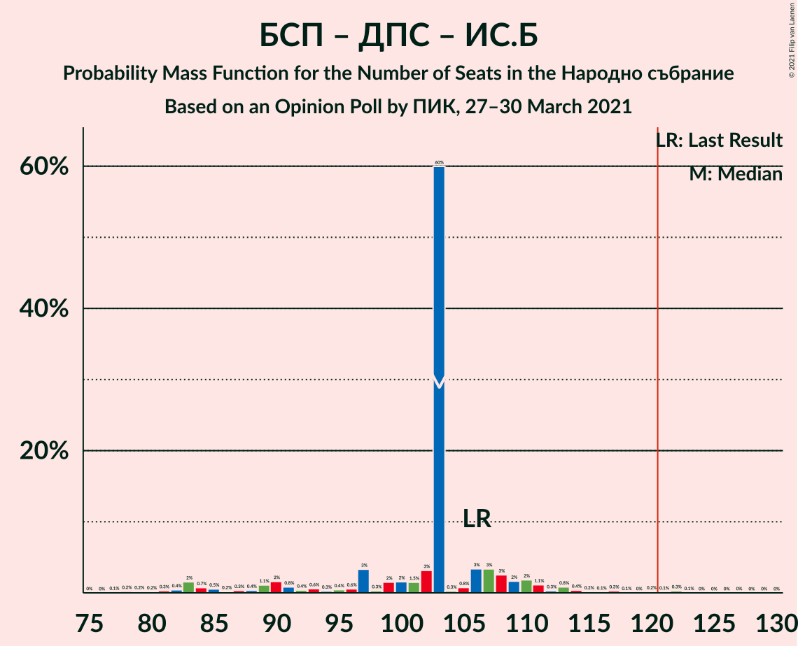

# Opinion Poll by ПИК, 27–30 March 2021

<a href="#voting-intentions">Voting Intentions</a> | <a href="#seats">Seats</a> | <a href="#coalitions">Coalitions</a> | <a href="#technical-information">Technical Information</a>

## Voting Intentions

### Confidence Intervals

| Party | Last Result | Poll Result | 80% Confidence Interval | 90% Confidence Interval | 95% Confidence Interval | 99% Confidence Interval |
|:-----:|:-----------:|:-----------:|:-----------------------:|:-----------------------:|:-----------------------:|:-----------------------:|
| Граждани за европейско развитие на България | 33.5% | 28.6% | 25.6–32.0% |24.7–32.9% |24.0–33.8% |22.6–35.4% |
| Българска социалистическа партия | 27.9% | 19.7% | 17.1–22.8% |16.4–23.6% |15.7–24.4% |14.6–25.9% |
| Движение за права и свободи | 9.2% | 13.2% | 11.1–15.9% |10.5–16.7% |10.0–17.4% |9.0–18.7% |
| Има такъв народ | 0.0% | 12.6% | 10.5–15.3% |9.9–16.0% |9.4–16.7% |8.5–18.0% |
| Демократична България | 0.0% | 6.2% | 4.7–8.2% |4.3–8.8% |4.0–9.3% |3.4–10.4% |
| Изправи се Бг | 0.0% | 4.6% | 3.4–6.5% |3.1–7.0% |2.8–7.5% |2.3–8.5% |
| Обединени Патриоти | 9.3% | 4.3% | 3.2–6.1% |2.9–6.6% |2.6–7.1% |2.1–8.1% |
| Воля–Национален фронт за спасение на България | 4.3% | 2.5% | 1.7–4.0% |1.4–4.4% |1.3–4.8% |1.0–5.6% |
| Възраждане | 0.0% | 1.8% | 1.2–3.2% |1.0–3.6% |0.9–4.0% |0.6–4.7% |
| Атака | 0.0% | 1.2% | 0.7–2.4% |0.6–2.8% |0.5–3.1% |0.3–3.8% |
| Алтернатива за българско възраждане | 1.6% | 1.2% | 0.7–2.4% |0.6–2.8% |0.5–3.1% |0.3–3.8% |
| Републиканци за България | 0.0% | 0.9% | 0.5–2.0% |0.4–2.4% |0.3–2.7% |0.2–3.3% |

*Note:* The poll result column reflects the actual value used in the calculations. Published results may vary slightly, and in addition be rounded to fewer digits.

## Seats

### Confidence Intervals

| Party | Last Result | Median | 80% Confidence Interval | 90% Confidence Interval | 95% Confidence Interval | 99% Confidence Interval |
|:-----:|:-----------:|:------:|:-----------------------:|:-----------------------:|:-----------------------:|:-----------------------:|
| <a href="#граждани-за-европейско-развитие-на-българия">Граждани за европейско развитие на България</a> | 95 | 78 | 74–83 |72–87 |68–89 |61–95 |
| <a href="#българска-социалистическа-партия">Българска социалистическа партия</a> | 80 | 52 | 47–59 |46–61 |45–65 |40–70 |
| <a href="#движение-за-права-и-свободи">Движение за права и свободи</a> | 26 | 38 | 32–43 |30–46 |28–47 |24–51 |
| <a href="#има-такъв-народ">Има такъв народ</a> | 0 | 30 | 28–37 |28–41 |28–44 |25–47 |
| <a href="#демократична-българия">Демократична България</a> | 0 | 18 | 14–20 |12–22 |12–24 |0–26 |
| <a href="#изправи-се-бг">Изправи се Бг</a> | 0 | 13 | 0–16 |0–18 |0–19 |0–21 |
| <a href="#обединени-патриоти">Обединени Патриоти</a> | 27 | 12 | 0–14 |0–17 |0–18 |0–21 |
| <a href="#воля–национален-фронт-за-спасение-на-българия">Воля–Национален фронт за спасение на България</a> | 12 | 0 | 0 |0 |0 |0–13 |
| <a href="#възраждане">Възраждане</a> | 0 | 0 | 0 |0 |0 |0–12 |
| <a href="#атака">Атака</a> | 0 | 0 | 0 |0 |0 |0 |
| <a href="#алтернатива-за-българско-възраждане">Алтернатива за българско възраждане</a> | 0 | 0 | 0 |0 |0 |0 |
| <a href="#републиканци-за-българия">Републиканци за България</a> | 0 | 0 | 0 |0 |0 |0 |

### Граждани за европейско развитие на България

*For a full overview of the results for this party, see the [Граждани за европейско развитие на България](party-гражданизаевропейскоразвитиенабългария.html) page.*

| Number of Seats | Probability | Accumulated | Special Marks |
|:---------------:|:-----------:|:-----------:|:-------------:|
| 58 | 0.1% | 100% |  |
| 59 | 0.2% | 99.9% |  |
| 60 | 0.1% | 99.7% |  |
| 61 | 0.2% | 99.6% |  |
| 62 | 0.1% | 99.4% |  |
| 63 | 0.2% | 99.4% |  |
| 64 | 0.3% | 99.1% |  |
| 65 | 0.3% | 98.9% |  |
| 66 | 0.3% | 98.5% |  |
| 67 | 0.2% | 98% |  |
| 68 | 1.2% | 98% |  |
| 69 | 0.5% | 97% |  |
| 70 | 0.7% | 96% |  |
| 71 | 0.2% | 96% |  |
| 72 | 1.0% | 95% |  |
| 73 | 2% | 94% |  |
| 74 | 3% | 93% |  |
| 75 | 3% | 90% |  |
| 76 | 2% | 87% |  |
| 77 | 5% | 85% |  |
| 78 | 38% | 80% | Median |
| 79 | 3% | 42% |  |
| 80 | 24% | 39% |  |
| 81 | 3% | 15% |  |
| 82 | 0.3% | 12% |  |
| 83 | 2% | 12% |  |
| 84 | 0.3% | 10% |  |
| 85 | 2% | 10% |  |
| 86 | 0.4% | 7% |  |
| 87 | 2% | 7% |  |
| 88 | 2% | 5% |  |
| 89 | 0.2% | 3% |  |
| 90 | 0.2% | 2% |  |
| 91 | 0.3% | 2% |  |
| 92 | 0.3% | 2% |  |
| 93 | 0.1% | 2% |  |
| 94 | 0.8% | 2% |  |
| 95 | 0.2% | 0.7% | Last Result |
| 96 | 0% | 0.5% |  |
| 97 | 0.4% | 0.4% |  |
| 98 | 0% | 0.1% |  |
| 99 | 0% | 0.1% |  |
| 100 | 0% | 0% |  |

### Българска социалистическа партия

*For a full overview of the results for this party, see the [Българска социалистическа партия](party-българскасоциалистическапартия.html) page.*

| Number of Seats | Probability | Accumulated | Special Marks |
|:---------------:|:-----------:|:-----------:|:-------------:|
| 37 | 0.1% | 100% |  |
| 38 | 0.1% | 99.9% |  |
| 39 | 0.1% | 99.8% |  |
| 40 | 0.3% | 99.7% |  |
| 41 | 0.1% | 99.4% |  |
| 42 | 0.1% | 99.3% |  |
| 43 | 0.1% | 99.2% |  |
| 44 | 1.0% | 99.1% |  |
| 45 | 3% | 98% |  |
| 46 | 4% | 96% |  |
| 47 | 3% | 92% |  |
| 48 | 0.8% | 89% |  |
| 49 | 0.2% | 88% |  |
| 50 | 0.7% | 88% |  |
| 51 | 0.7% | 87% |  |
| 52 | 42% | 87% | Median |
| 53 | 5% | 44% |  |
| 54 | 3% | 40% |  |
| 55 | 0.3% | 36% |  |
| 56 | 0.3% | 36% |  |
| 57 | 22% | 36% |  |
| 58 | 1.4% | 14% |  |
| 59 | 3% | 13% |  |
| 60 | 0.4% | 9% |  |
| 61 | 4% | 9% |  |
| 62 | 0.4% | 5% |  |
| 63 | 1.5% | 5% |  |
| 64 | 0.5% | 3% |  |
| 65 | 0.2% | 3% |  |
| 66 | 0.3% | 2% |  |
| 67 | 2% | 2% |  |
| 68 | 0% | 0.6% |  |
| 69 | 0.1% | 0.6% |  |
| 70 | 0.1% | 0.5% |  |
| 71 | 0.3% | 0.4% |  |
| 72 | 0% | 0.1% |  |
| 73 | 0% | 0.1% |  |
| 74 | 0% | 0% |  |
| 75 | 0% | 0% |  |
| 76 | 0% | 0% |  |
| 77 | 0% | 0% |  |
| 78 | 0% | 0% |  |
| 79 | 0% | 0% |  |
| 80 | 0% | 0% | Last Result |

### Движение за права и свободи

*For a full overview of the results for this party, see the [Движение за права и свободи](party-движениезаправаисвободи.html) page.*

| Number of Seats | Probability | Accumulated | Special Marks |
|:---------------:|:-----------:|:-----------:|:-------------:|
| 23 | 0% | 100% |  |
| 24 | 0.7% | 99.9% |  |
| 25 | 0.3% | 99.3% |  |
| 26 | 0.4% | 98.9% | Last Result |
| 27 | 0.6% | 98% |  |
| 28 | 0.4% | 98% |  |
| 29 | 2% | 97% |  |
| 30 | 3% | 96% |  |
| 31 | 3% | 93% |  |
| 32 | 1.4% | 90% |  |
| 33 | 22% | 89% |  |
| 34 | 3% | 67% |  |
| 35 | 2% | 64% |  |
| 36 | 1.5% | 62% |  |
| 37 | 3% | 60% |  |
| 38 | 39% | 58% | Median |
| 39 | 5% | 19% |  |
| 40 | 0.9% | 14% |  |
| 41 | 0.5% | 13% |  |
| 42 | 2% | 12% |  |
| 43 | 2% | 11% |  |
| 44 | 0.3% | 9% |  |
| 45 | 2% | 8% |  |
| 46 | 4% | 6% |  |
| 47 | 0.1% | 3% |  |
| 48 | 2% | 2% |  |
| 49 | 0.3% | 0.9% |  |
| 50 | 0.1% | 0.7% |  |
| 51 | 0.1% | 0.5% |  |
| 52 | 0.1% | 0.5% |  |
| 53 | 0.2% | 0.4% |  |
| 54 | 0% | 0.2% |  |
| 55 | 0% | 0.2% |  |
| 56 | 0.1% | 0.1% |  |
| 57 | 0% | 0% |  |

### Има такъв народ

*For a full overview of the results for this party, see the [Има такъв народ](party-иматакъвнарод.html) page.*

| Number of Seats | Probability | Accumulated | Special Marks |
|:---------------:|:-----------:|:-----------:|:-------------:|
| 0 | 0% | 100% | Last Result |
| 1 | 0% | 100% |  |
| 2 | 0% | 100% |  |
| 3 | 0% | 100% |  |
| 4 | 0% | 100% |  |
| 5 | 0% | 100% |  |
| 6 | 0% | 100% |  |
| 7 | 0% | 100% |  |
| 8 | 0% | 100% |  |
| 9 | 0% | 100% |  |
| 10 | 0% | 100% |  |
| 11 | 0% | 100% |  |
| 12 | 0% | 100% |  |
| 13 | 0% | 100% |  |
| 14 | 0% | 100% |  |
| 15 | 0% | 100% |  |
| 16 | 0% | 100% |  |
| 17 | 0% | 100% |  |
| 18 | 0% | 100% |  |
| 19 | 0% | 100% |  |
| 20 | 0% | 100% |  |
| 21 | 0% | 100% |  |
| 22 | 0% | 100% |  |
| 23 | 0.1% | 99.9% |  |
| 24 | 0.1% | 99.9% |  |
| 25 | 0.4% | 99.8% |  |
| 26 | 0.3% | 99.4% |  |
| 27 | 1.5% | 99.1% |  |
| 28 | 41% | 98% |  |
| 29 | 4% | 57% |  |
| 30 | 28% | 53% | Median |
| 31 | 1.1% | 25% |  |
| 32 | 2% | 24% |  |
| 33 | 5% | 22% |  |
| 34 | 2% | 17% |  |
| 35 | 2% | 15% |  |
| 36 | 1.0% | 13% |  |
| 37 | 3% | 12% |  |
| 38 | 2% | 10% |  |
| 39 | 0.5% | 7% |  |
| 40 | 0.3% | 7% |  |
| 41 | 2% | 7% |  |
| 42 | 2% | 5% |  |
| 43 | 0.6% | 3% |  |
| 44 | 1.2% | 3% |  |
| 45 | 0.3% | 1.3% |  |
| 46 | 0.1% | 1.0% |  |
| 47 | 0.6% | 0.9% |  |
| 48 | 0% | 0.3% |  |
| 49 | 0.1% | 0.2% |  |
| 50 | 0% | 0.2% |  |
| 51 | 0% | 0.1% |  |
| 52 | 0.1% | 0.1% |  |
| 53 | 0% | 0% |  |

### Демократична България

*For a full overview of the results for this party, see the [Демократична България](party-демократичнабългария.html) page.*

| Number of Seats | Probability | Accumulated | Special Marks |
|:---------------:|:-----------:|:-----------:|:-------------:|
| 0 | 2% | 100% | Last Result |
| 1 | 0% | 98% |  |
| 2 | 0% | 98% |  |
| 3 | 0% | 98% |  |
| 4 | 0% | 98% |  |
| 5 | 0% | 98% |  |
| 6 | 0% | 98% |  |
| 7 | 0% | 98% |  |
| 8 | 0% | 98% |  |
| 9 | 0% | 98% |  |
| 10 | 0% | 98% |  |
| 11 | 0.2% | 98% |  |
| 12 | 4% | 98% |  |
| 13 | 2% | 94% |  |
| 14 | 5% | 92% |  |
| 15 | 4% | 87% |  |
| 16 | 22% | 83% |  |
| 17 | 6% | 61% |  |
| 18 | 6% | 55% | Median |
| 19 | 39% | 49% |  |
| 20 | 3% | 10% |  |
| 21 | 0.9% | 8% |  |
| 22 | 3% | 7% |  |
| 23 | 0.4% | 3% |  |
| 24 | 1.1% | 3% |  |
| 25 | 0.1% | 2% |  |
| 26 | 1.3% | 2% |  |
| 27 | 0.1% | 0.3% |  |
| 28 | 0.1% | 0.2% |  |
| 29 | 0% | 0.2% |  |
| 30 | 0% | 0.1% |  |
| 31 | 0% | 0.1% |  |
| 32 | 0% | 0.1% |  |
| 33 | 0% | 0.1% |  |
| 34 | 0.1% | 0.1% |  |
| 35 | 0% | 0% |  |

### Изправи се Бг

*For a full overview of the results for this party, see the [Изправи се Бг](party-изправисебг.html) page.*

| Number of Seats | Probability | Accumulated | Special Marks |
|:---------------:|:-----------:|:-----------:|:-------------:|
| 0 | 16% | 100% | Last Result |
| 1 | 0% | 84% |  |
| 2 | 0% | 84% |  |
| 3 | 0% | 84% |  |
| 4 | 0% | 84% |  |
| 5 | 0% | 84% |  |
| 6 | 0% | 84% |  |
| 7 | 0% | 84% |  |
| 8 | 0% | 84% |  |
| 9 | 0% | 84% |  |
| 10 | 0% | 84% |  |
| 11 | 0.2% | 84% |  |
| 12 | 6% | 84% |  |
| 13 | 63% | 78% | Median |
| 14 | 3% | 15% |  |
| 15 | 2% | 12% |  |
| 16 | 2% | 10% |  |
| 17 | 2% | 9% |  |
| 18 | 3% | 7% |  |
| 19 | 1.2% | 4% |  |
| 20 | 2% | 2% |  |
| 21 | 0.1% | 0.5% |  |
| 22 | 0.2% | 0.4% |  |
| 23 | 0.1% | 0.2% |  |
| 24 | 0% | 0.1% |  |
| 25 | 0.1% | 0.1% |  |
| 26 | 0% | 0% |  |

### Обединени Патриоти

*For a full overview of the results for this party, see the [Обединени Патриоти](party-обединенипатриоти.html) page.*

| Number of Seats | Probability | Accumulated | Special Marks |
|:---------------:|:-----------:|:-----------:|:-------------:|
| 0 | 14% | 100% |  |
| 1 | 0% | 86% |  |
| 2 | 0% | 86% |  |
| 3 | 0% | 86% |  |
| 4 | 0% | 86% |  |
| 5 | 0% | 86% |  |
| 6 | 0% | 86% |  |
| 7 | 0% | 86% |  |
| 8 | 0% | 86% |  |
| 9 | 0% | 86% |  |
| 10 | 0% | 86% |  |
| 11 | 24% | 86% |  |
| 12 | 43% | 62% | Median |
| 13 | 5% | 20% |  |
| 14 | 7% | 14% |  |
| 15 | 1.2% | 8% |  |
| 16 | 0.8% | 6% |  |
| 17 | 2% | 6% |  |
| 18 | 2% | 4% |  |
| 19 | 0.3% | 2% |  |
| 20 | 0.7% | 2% |  |
| 21 | 0.7% | 0.9% |  |
| 22 | 0% | 0.3% |  |
| 23 | 0.2% | 0.2% |  |
| 24 | 0% | 0.1% |  |
| 25 | 0% | 0% |  |
| 26 | 0% | 0% |  |
| 27 | 0% | 0% | Last Result |

### Воля–Национален фронт за спасение на България

*For a full overview of the results for this party, see the [Воля–Национален фронт за спасение на България](party-воля–националенфронтзаспасениенабългария.html) page.*

| Number of Seats | Probability | Accumulated | Special Marks |
|:---------------:|:-----------:|:-----------:|:-------------:|
| 0 | 98% | 100% | Median |
| 1 | 0% | 2% |  |
| 2 | 0% | 2% |  |
| 3 | 0% | 2% |  |
| 4 | 0% | 2% |  |
| 5 | 0% | 2% |  |
| 6 | 0% | 2% |  |
| 7 | 0% | 2% |  |
| 8 | 0% | 2% |  |
| 9 | 0% | 2% |  |
| 10 | 0% | 2% |  |
| 11 | 0.4% | 2% |  |
| 12 | 1.0% | 2% | Last Result |
| 13 | 0.2% | 0.7% |  |
| 14 | 0.2% | 0.5% |  |
| 15 | 0.1% | 0.3% |  |
| 16 | 0.1% | 0.1% |  |
| 17 | 0% | 0% |  |

### Възраждане

*For a full overview of the results for this party, see the [Възраждане](party-възраждане.html) page.*

| Number of Seats | Probability | Accumulated | Special Marks |
|:---------------:|:-----------:|:-----------:|:-------------:|
| 0 | 99.3% | 100% | Last Result, Median |
| 1 | 0% | 0.7% |  |
| 2 | 0% | 0.7% |  |
| 3 | 0% | 0.7% |  |
| 4 | 0% | 0.7% |  |
| 5 | 0% | 0.7% |  |
| 6 | 0% | 0.7% |  |
| 7 | 0% | 0.7% |  |
| 8 | 0% | 0.7% |  |
| 9 | 0% | 0.7% |  |
| 10 | 0% | 0.7% |  |
| 11 | 0.1% | 0.7% |  |
| 12 | 0.4% | 0.6% |  |
| 13 | 0.1% | 0.2% |  |
| 14 | 0% | 0.1% |  |
| 15 | 0% | 0% |  |

### Атака

*For a full overview of the results for this party, see the [Атака](party-атака.html) page.*

| Number of Seats | Probability | Accumulated | Special Marks |
|:---------------:|:-----------:|:-----------:|:-------------:|
| 0 | 99.9% | 100% | Last Result, Median |
| 1 | 0% | 0.1% |  |
| 2 | 0% | 0.1% |  |
| 3 | 0% | 0.1% |  |
| 4 | 0% | 0.1% |  |
| 5 | 0% | 0.1% |  |
| 6 | 0% | 0.1% |  |
| 7 | 0% | 0.1% |  |
| 8 | 0% | 0.1% |  |
| 9 | 0% | 0.1% |  |
| 10 | 0% | 0.1% |  |
| 11 | 0% | 0.1% |  |
| 12 | 0.1% | 0.1% |  |
| 13 | 0% | 0% |  |

### Алтернатива за българско възраждане

*For a full overview of the results for this party, see the [Алтернатива за българско възраждане](party-алтернативазабългарсковъзраждане.html) page.*

| Number of Seats | Probability | Accumulated | Special Marks |
|:---------------:|:-----------:|:-----------:|:-------------:|
| 0 | 99.9% | 100% | Last Result, Median |
| 1 | 0% | 0.1% |  |
| 2 | 0% | 0.1% |  |
| 3 | 0% | 0.1% |  |
| 4 | 0% | 0.1% |  |
| 5 | 0% | 0.1% |  |
| 6 | 0% | 0.1% |  |
| 7 | 0% | 0.1% |  |
| 8 | 0% | 0.1% |  |
| 9 | 0% | 0.1% |  |
| 10 | 0% | 0.1% |  |
| 11 | 0.1% | 0.1% |  |
| 12 | 0% | 0.1% |  |
| 13 | 0% | 0% |  |

### Републиканци за България

*For a full overview of the results for this party, see the [Републиканци за България](party-републиканцизабългария.html) page.*

| Number of Seats | Probability | Accumulated | Special Marks |
|:---------------:|:-----------:|:-----------:|:-------------:|
| 0 | 99.9% | 100% | Last Result, Median |
| 1 | 0% | 0.1% |  |
| 2 | 0% | 0.1% |  |
| 3 | 0% | 0.1% |  |
| 4 | 0% | 0.1% |  |
| 5 | 0% | 0.1% |  |
| 6 | 0% | 0.1% |  |
| 7 | 0% | 0.1% |  |
| 8 | 0% | 0.1% |  |
| 9 | 0% | 0.1% |  |
| 10 | 0% | 0.1% |  |
| 11 | 0% | 0.1% |  |
| 12 | 0% | 0% |  |

## Coalitions

### Confidence Intervals

| Coalition | Last Result | Median | Majority? | 80% Confidence Interval | 90% Confidence Interval | 95% Confidence Interval | 99% Confidence Interval |
|:---------:|:-----------:|:------:|:---------:|:-----------------------:|:-----------------------:|:-----------------------:|:-----------------------:|
| Българска социалистическа партия – Движение за права и свободи – Има такъв народ – Изправи се Бг | 106 | 131 | 97% | 129–141 | 124–144 | 119–149 | 116–154 |
| Българска социалистическа партия – Движение за права и свободи – Има такъв народ | 106 | 119 | 26% | 118–130 | 114–137 | 112–141 | 105–149 |
| Българска социалистическа партия – Движение за права и свободи – Изправи се Бг | 106 | 103 | 0.5% | 95–107 | 88–110 | 83–113 | 79–121 |
| Българска социалистическа партия – Движение за права и свободи | 106 | 90 | 0% | 84–97 | 80–106 | 77–107 | 73–111 |
| Граждани за европейско развитие на България – Обединени Патриоти | 122 | 90 | 0% | 84–94 | 75–98 | 73–102 | 68–108 |

### Българска социалистическа партия – Движение за права и свободи – Има такъв народ – Изправи се Бг

| Number of Seats | Probability | Accumulated | Special Marks |
|:---------------:|:-----------:|:-----------:|:-------------:|
| 106 | 0% | 100% | Last Result |
| 107 | 0% | 100% |  |
| 108 | 0% | 100% |  |
| 109 | 0% | 99.9% |  |
| 110 | 0.1% | 99.9% |  |
| 111 | 0% | 99.9% |  |
| 112 | 0% | 99.8% |  |
| 113 | 0% | 99.8% |  |
| 114 | 0.1% | 99.8% |  |
| 115 | 0.1% | 99.7% |  |
| 116 | 1.0% | 99.5% |  |
| 117 | 0.1% | 98.6% |  |
| 118 | 0.7% | 98% |  |
| 119 | 0.8% | 98% |  |
| 120 | 0.2% | 97% |  |
| 121 | 0.2% | 97% | Majority |
| 122 | 0.2% | 97% |  |
| 123 | 0.5% | 96% |  |
| 124 | 2% | 96% |  |
| 125 | 0.2% | 94% |  |
| 126 | 0.7% | 94% |  |
| 127 | 0.3% | 93% |  |
| 128 | 0.3% | 93% |  |
| 129 | 4% | 92% |  |
| 130 | 2% | 89% |  |
| 131 | 41% | 87% |  |
| 132 | 4% | 46% |  |
| 133 | 22% | 43% | Median |
| 134 | 0.4% | 21% |  |
| 135 | 2% | 21% |  |
| 136 | 0.6% | 19% |  |
| 137 | 4% | 18% |  |
| 138 | 2% | 14% |  |
| 139 | 0.4% | 12% |  |
| 140 | 1.1% | 11% |  |
| 141 | 2% | 10% |  |
| 142 | 0.3% | 8% |  |
| 143 | 3% | 8% |  |
| 144 | 0.9% | 5% |  |
| 145 | 0.3% | 4% |  |
| 146 | 0.9% | 4% |  |
| 147 | 0.2% | 3% |  |
| 148 | 0.2% | 3% |  |
| 149 | 1.1% | 3% |  |
| 150 | 0.3% | 2% |  |
| 151 | 0.1% | 1.5% |  |
| 152 | 0.3% | 1.4% |  |
| 153 | 0.4% | 1.0% |  |
| 154 | 0.4% | 0.6% |  |
| 155 | 0% | 0.2% |  |
| 156 | 0% | 0.2% |  |
| 157 | 0% | 0.2% |  |
| 158 | 0.1% | 0.2% |  |
| 159 | 0% | 0.1% |  |
| 160 | 0% | 0.1% |  |
| 161 | 0% | 0.1% |  |
| 162 | 0% | 0.1% |  |
| 163 | 0% | 0% |  |

### Българска социалистическа партия – Движение за права и свободи – Има такъв народ

| Number of Seats | Probability | Accumulated | Special Marks |
|:---------------:|:-----------:|:-----------:|:-------------:|
| 99 | 0.1% | 100% |  |
| 100 | 0% | 99.9% |  |
| 101 | 0% | 99.9% |  |
| 102 | 0% | 99.9% |  |
| 103 | 0% | 99.8% |  |
| 104 | 0.1% | 99.8% |  |
| 105 | 0.8% | 99.7% |  |
| 106 | 0% | 98.9% | Last Result |
| 107 | 0.1% | 98.9% |  |
| 108 | 0.3% | 98.8% |  |
| 109 | 0.2% | 98% |  |
| 110 | 0.1% | 98% |  |
| 111 | 0.2% | 98% |  |
| 112 | 2% | 98% |  |
| 113 | 0.2% | 96% |  |
| 114 | 2% | 96% |  |
| 115 | 0.2% | 94% |  |
| 116 | 2% | 94% |  |
| 117 | 1.0% | 92% |  |
| 118 | 38% | 91% |  |
| 119 | 6% | 53% |  |
| 120 | 21% | 47% | Median |
| 121 | 2% | 26% | Majority |
| 122 | 0.8% | 24% |  |
| 123 | 0.6% | 23% |  |
| 124 | 3% | 22% |  |
| 125 | 0.5% | 19% |  |
| 126 | 2% | 19% |  |
| 127 | 0.4% | 17% |  |
| 128 | 0.2% | 17% |  |
| 129 | 3% | 17% |  |
| 130 | 4% | 13% |  |
| 131 | 0.3% | 10% |  |
| 132 | 1.1% | 9% |  |
| 133 | 0.4% | 8% |  |
| 134 | 0.2% | 8% |  |
| 135 | 0.3% | 7% |  |
| 136 | 0.4% | 7% |  |
| 137 | 3% | 7% |  |
| 138 | 0.3% | 4% |  |
| 139 | 0.5% | 3% |  |
| 140 | 0.1% | 3% |  |
| 141 | 0.1% | 3% |  |
| 142 | 0.1% | 2% |  |
| 143 | 0.1% | 2% |  |
| 144 | 0.6% | 2% |  |
| 145 | 0.2% | 2% |  |
| 146 | 0.1% | 1.4% |  |
| 147 | 0.1% | 1.4% |  |
| 148 | 0% | 1.3% |  |
| 149 | 1.0% | 1.3% |  |
| 150 | 0% | 0.2% |  |
| 151 | 0% | 0.2% |  |
| 152 | 0.2% | 0.2% |  |
| 153 | 0% | 0% |  |

### Българска социалистическа партия – Движение за права и свободи – Изправи се Бг

| Number of Seats | Probability | Accumulated | Special Marks |
|:---------------:|:-----------:|:-----------:|:-------------:|
| 75 | 0% | 100% |  |
| 76 | 0% | 99.9% |  |
| 77 | 0.1% | 99.9% |  |
| 78 | 0.2% | 99.9% |  |
| 79 | 0.2% | 99.6% |  |
| 80 | 0.2% | 99.5% |  |
| 81 | 0.3% | 99.3% |  |
| 82 | 0.4% | 99.0% |  |
| 83 | 2% | 98.6% |  |
| 84 | 0.7% | 97% |  |
| 85 | 0.5% | 96% |  |
| 86 | 0.2% | 96% |  |
| 87 | 0.3% | 96% |  |
| 88 | 0.4% | 95% |  |
| 89 | 1.1% | 95% |  |
| 90 | 2% | 94% |  |
| 91 | 0.8% | 92% |  |
| 92 | 0.4% | 91% |  |
| 93 | 0.6% | 91% |  |
| 94 | 0.3% | 90% |  |
| 95 | 0.4% | 90% |  |
| 96 | 0.6% | 90% |  |
| 97 | 3% | 89% |  |
| 98 | 0.3% | 86% |  |
| 99 | 2% | 85% |  |
| 100 | 2% | 84% |  |
| 101 | 1.5% | 82% |  |
| 102 | 3% | 81% |  |
| 103 | 60% | 78% | Median |
| 104 | 0.3% | 18% |  |
| 105 | 0.8% | 17% |  |
| 106 | 3% | 17% | Last Result |
| 107 | 3% | 13% |  |
| 108 | 3% | 10% |  |
| 109 | 2% | 7% |  |
| 110 | 2% | 6% |  |
| 111 | 1.1% | 4% |  |
| 112 | 0.3% | 3% |  |
| 113 | 0.8% | 3% |  |
| 114 | 0.4% | 2% |  |
| 115 | 0.2% | 1.3% |  |
| 116 | 0.1% | 1.2% |  |
| 117 | 0.3% | 1.1% |  |
| 118 | 0.1% | 0.8% |  |
| 119 | 0% | 0.7% |  |
| 120 | 0.2% | 0.7% |  |
| 121 | 0.1% | 0.5% | Majority |
| 122 | 0.3% | 0.4% |  |
| 123 | 0.1% | 0.1% |  |
| 124 | 0% | 0.1% |  |
| 125 | 0% | 0.1% |  |
| 126 | 0% | 0.1% |  |
| 127 | 0% | 0% |  |

### Българска социалистическа партия – Движение за права и свободи

| Number of Seats | Probability | Accumulated | Special Marks |
|:---------------:|:-----------:|:-----------:|:-------------:|
| 67 | 0% | 100% |  |
| 68 | 0% | 99.9% |  |
| 69 | 0% | 99.9% |  |
| 70 | 0% | 99.9% |  |
| 71 | 0% | 99.8% |  |
| 72 | 0% | 99.8% |  |
| 73 | 0.5% | 99.8% |  |
| 74 | 0.1% | 99.3% |  |
| 75 | 0.2% | 99.2% |  |
| 76 | 0.8% | 99.0% |  |
| 77 | 2% | 98% |  |
| 78 | 0.4% | 96% |  |
| 79 | 0.3% | 96% |  |
| 80 | 0.5% | 95% |  |
| 81 | 0.5% | 95% |  |
| 82 | 2% | 94% |  |
| 83 | 2% | 93% |  |
| 84 | 4% | 91% |  |
| 85 | 0.9% | 87% |  |
| 86 | 0.8% | 86% |  |
| 87 | 0.8% | 85% |  |
| 88 | 2% | 84% |  |
| 89 | 2% | 82% |  |
| 90 | 58% | 80% | Median |
| 91 | 2% | 22% |  |
| 92 | 0.4% | 19% |  |
| 93 | 4% | 19% |  |
| 94 | 0.3% | 16% |  |
| 95 | 0.9% | 15% |  |
| 96 | 1.5% | 14% |  |
| 97 | 4% | 13% |  |
| 98 | 0.2% | 9% |  |
| 99 | 0.8% | 8% |  |
| 100 | 0.9% | 8% |  |
| 101 | 0.2% | 7% |  |
| 102 | 0.5% | 6% |  |
| 103 | 0.2% | 6% |  |
| 104 | 0.1% | 6% |  |
| 105 | 0.5% | 6% |  |
| 106 | 0.4% | 5% | Last Result |
| 107 | 3% | 5% |  |
| 108 | 0% | 2% |  |
| 109 | 0% | 2% |  |
| 110 | 0.1% | 1.5% |  |
| 111 | 1.0% | 1.4% |  |
| 112 | 0.1% | 0.3% |  |
| 113 | 0% | 0.3% |  |
| 114 | 0% | 0.2% |  |
| 115 | 0% | 0.2% |  |
| 116 | 0% | 0.2% |  |
| 117 | 0.2% | 0.2% |  |
| 118 | 0% | 0% |  |

### Граждани за европейско развитие на България – Обединени Патриоти

| Number of Seats | Probability | Accumulated | Special Marks |
|:---------------:|:-----------:|:-----------:|:-------------:|
| 63 | 0.1% | 100% |  |
| 64 | 0% | 99.9% |  |
| 65 | 0% | 99.9% |  |
| 66 | 0.1% | 99.8% |  |
| 67 | 0% | 99.7% |  |
| 68 | 1.0% | 99.7% |  |
| 69 | 0.4% | 98.7% |  |
| 70 | 0.1% | 98% |  |
| 71 | 0.1% | 98% |  |
| 72 | 0.5% | 98% |  |
| 73 | 1.3% | 98% |  |
| 74 | 0.2% | 96% |  |
| 75 | 3% | 96% |  |
| 76 | 0.1% | 93% |  |
| 77 | 0.4% | 93% |  |
| 78 | 0.3% | 93% |  |
| 79 | 0.4% | 92% |  |
| 80 | 0.6% | 92% |  |
| 81 | 0.4% | 91% |  |
| 82 | 0.3% | 91% |  |
| 83 | 0.2% | 91% |  |
| 84 | 0.7% | 91% |  |
| 85 | 2% | 90% |  |
| 86 | 0.6% | 88% |  |
| 87 | 4% | 88% |  |
| 88 | 2% | 84% |  |
| 89 | 1.4% | 82% |  |
| 90 | 40% | 80% | Median |
| 91 | 27% | 40% |  |
| 92 | 3% | 14% |  |
| 93 | 0.2% | 11% |  |
| 94 | 1.5% | 11% |  |
| 95 | 2% | 9% |  |
| 96 | 0.6% | 8% |  |
| 97 | 1.5% | 7% |  |
| 98 | 2% | 6% |  |
| 99 | 0.1% | 3% |  |
| 100 | 0.6% | 3% |  |
| 101 | 0.2% | 3% |  |
| 102 | 0.9% | 3% |  |
| 103 | 0.2% | 2% |  |
| 104 | 0.1% | 2% |  |
| 105 | 0.2% | 2% |  |
| 106 | 0% | 1.3% |  |
| 107 | 0% | 1.3% |  |
| 108 | 0.9% | 1.3% |  |
| 109 | 0.1% | 0.3% |  |
| 110 | 0% | 0.3% |  |
| 111 | 0% | 0.3% |  |
| 112 | 0.2% | 0.3% |  |
| 113 | 0% | 0% |  |
| 114 | 0% | 0% |  |
| 115 | 0% | 0% |  |
| 116 | 0% | 0% |  |
| 117 | 0% | 0% |  |
| 118 | 0% | 0% |  |
| 119 | 0% | 0% |  |
| 120 | 0% | 0% |  |
| 121 | 0% | 0% | Majority |
| 122 | 0% | 0% | Last Result |

## Technical Information

### Opinion Poll

+ **Polling firm:** ПИК
+ **Commissioner(s):** —
+ **Fieldwork period:** 27–30 March 2021

### Calculations

+ **Sample size:** 325
+ **Simulations done:** 1,048,576
+ **Error estimate:** 1.46%

