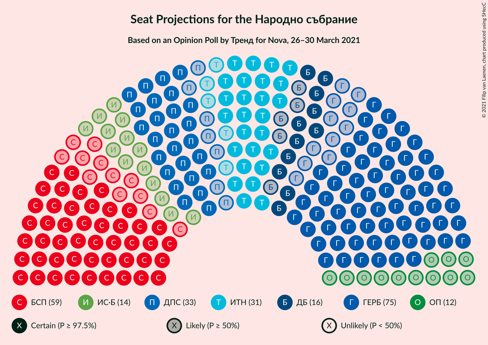
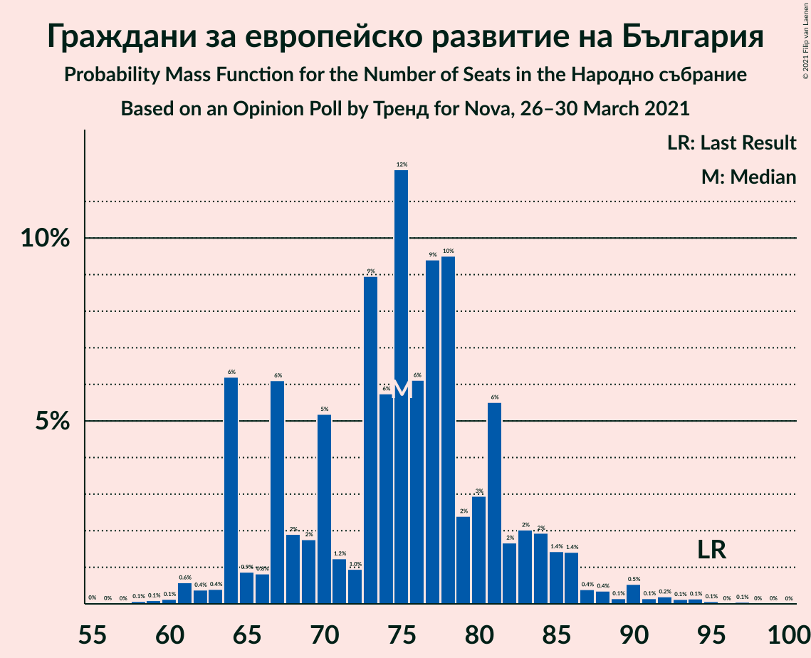
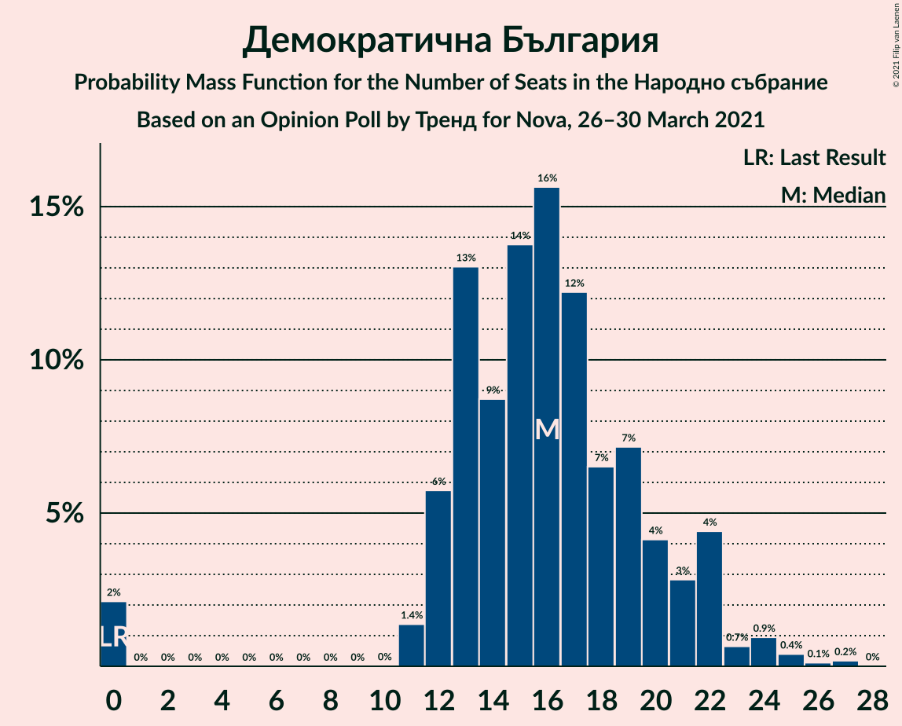
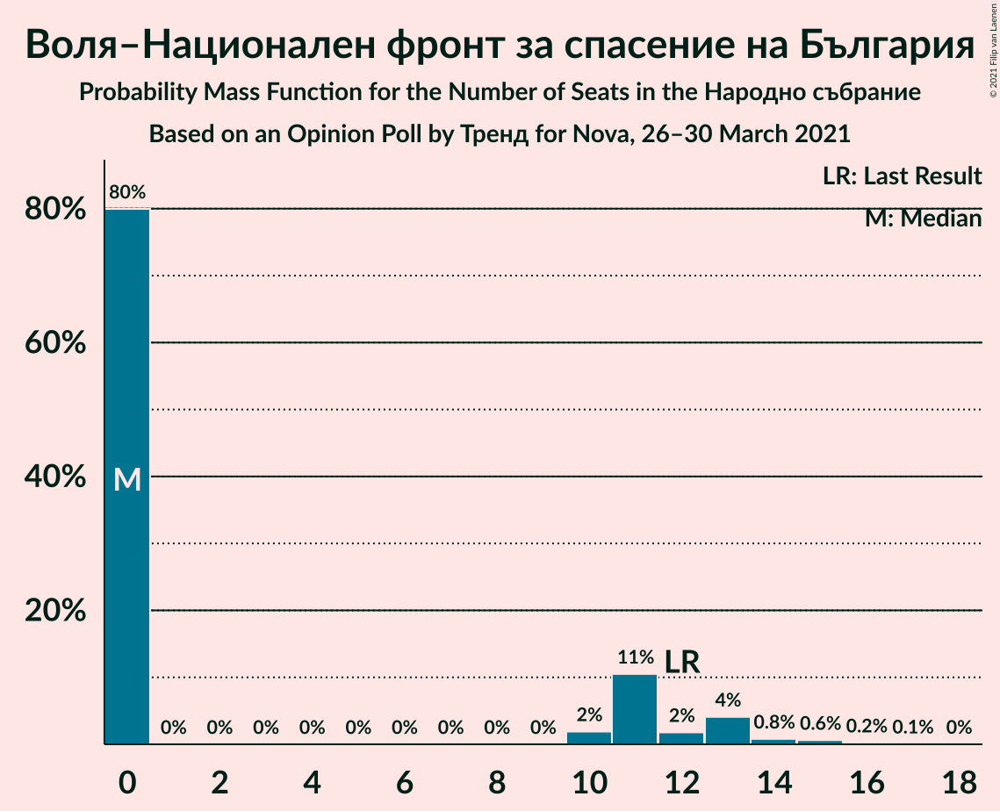
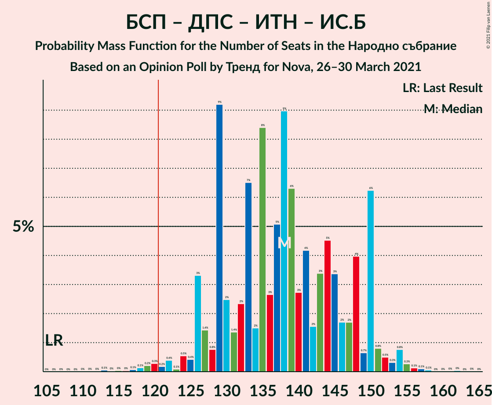
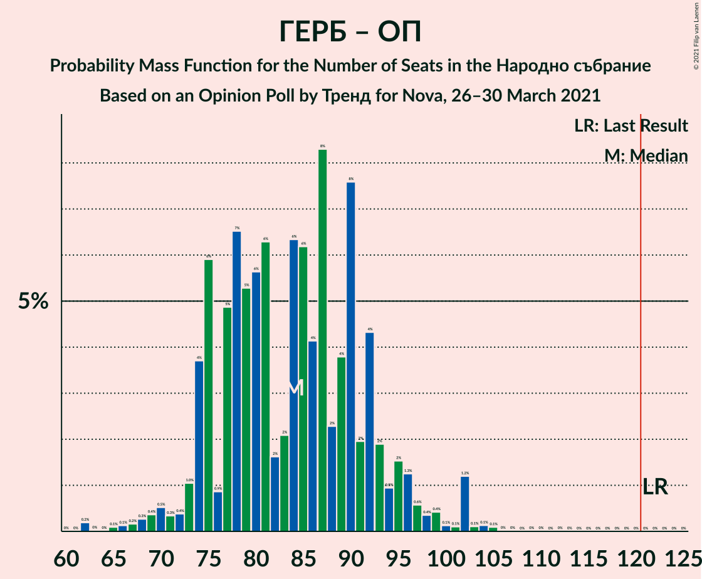

# Opinion Poll by Тренд for Nova, 26–30 March 2021

<a href="#voting-intentions">Voting Intentions</a> | <a href="#seats">Seats</a> | <a href="#coalitions">Coalitions</a> | <a href="#technical-information">Technical Information</a>

## Voting Intentions

### Confidence Intervals

| Party | Last Result | Poll Result | 80% Confidence Interval | 90% Confidence Interval | 95% Confidence Interval | 99% Confidence Interval |
|:-----:|:-----------:|:-----------:|:-----------------------:|:-----------------------:|:-----------------------:|:-----------------------:|
| Граждани за европейско развитие на България | 33.5% | 28.6% | 26.0–31.4% |25.3–32.2% |24.7–32.8% |23.5–34.2% |
| Българска социалистическа партия | 27.9% | 21.8% | 19.5–24.4% |18.9–25.1% |18.3–25.8% |17.3–27.1% |
| Движение за права и свободи | 9.2% | 12.5% | 10.7–14.6% |10.2–15.3% |9.8–15.8% |9.0–16.9% |
| Има такъв народ | 0.0% | 12.5% | 10.7–14.6% |10.2–15.3% |9.8–15.8% |9.0–16.9% |
| Демократична България | 0.0% | 5.9% | 4.7–7.6% |4.4–8.0% |4.1–8.4% |3.6–9.3% |
| Изправи се Бг | 0.0% | 4.9% | 3.8–6.4% |3.5–6.8% |3.3–7.2% |2.8–8.0% |
| Обединени Патриоти | 9.3% | 4.2% | 3.3–5.7% |3.0–6.1% |2.8–6.5% |2.4–7.2% |
| Воля–Национален фронт за спасение на България | 4.3% | 3.2% | 2.4–4.5% |2.1–4.8% |1.9–5.2% |1.6–5.9% |
| Възраждане | 0.0% | 1.7% | 1.1–2.7% |1.0–3.0% |0.9–3.3% |0.7–3.9% |
| Алтернатива за българско възраждане | 1.6% | 1.1% | 0.7–2.0% |0.5–2.2% |0.5–2.5% |0.3–3.0% |
| Републиканци за България | 0.0% | 1.1% | 0.7–2.0% |0.5–2.2% |0.5–2.5% |0.3–3.0% |

*Note:* The poll result column reflects the actual value used in the calculations. Published results may vary slightly, and in addition be rounded to fewer digits.

## Seats

### Confidence Intervals

| Party | Last Result | Median | 80% Confidence Interval | 90% Confidence Interval | 95% Confidence Interval | 99% Confidence Interval |
|:-----:|:-----------:|:------:|:-----------------------:|:-----------------------:|:-----------------------:|:-----------------------:|
| <a href="#граждани-за-европейско-развитие-на-българия">Граждани за европейско развитие на България</a> | 95 | 75 | 72–83 |65–84 |61–86 |60–92 |
| <a href="#българска-социалистическа-партия">Българска социалистическа партия</a> | 80 | 60 | 50–63 |47–66 |46–66 |44–71 |
| <a href="#движение-за-права-и-свободи">Движение за права и свободи</a> | 26 | 35 | 31–38 |27–39 |26–42 |24–44 |
| <a href="#има-такъв-народ">Има такъв народ</a> | 0 | 31 | 27–38 |26–39 |26–40 |24–45 |
| <a href="#демократична-българия">Демократична България</a> | 0 | 17 | 13–21 |12–21 |12–22 |0–23 |
| <a href="#изправи-се-бг">Изправи се Бг</a> | 0 | 11 | 0–16 |0–18 |0–18 |0–21 |
| <a href="#обединени-патриоти">Обединени Патриоти</a> | 27 | 12 | 0–17 |0–17 |0–17 |0–18 |
| <a href="#воля–национален-фронт-за-спасение-на-българия">Воля–Национален фронт за спасение на България</a> | 12 | 0 | 0–11 |0–13 |0–13 |0–15 |
| <a href="#възраждане">Възраждане</a> | 0 | 0 | 0 |0 |0 |0 |
| <a href="#алтернатива-за-българско-възраждане">Алтернатива за българско възраждане</a> | 0 | 0 | 0 |0 |0 |0 |
| <a href="#републиканци-за-българия">Републиканци за България</a> | 0 | 0 | 0 |0 |0 |0 |

### Граждани за европейско развитие на България

*For a full overview of the results for this party, see the [Граждани за европейско развитие на България](party-гражданизаевропейскоразвитиенабългария.html) page.*

| Number of Seats | Probability | Accumulated | Special Marks |
|:---------------:|:-----------:|:-----------:|:-------------:|
| 55 | 0.1% | 100% |  |
| 56 | 0.1% | 99.9% |  |
| 57 | 0% | 99.9% |  |
| 58 | 0% | 99.8% |  |
| 59 | 0.1% | 99.8% |  |
| 60 | 0.4% | 99.7% |  |
| 61 | 2% | 99.3% |  |
| 62 | 0.6% | 97% |  |
| 63 | 0.6% | 96% |  |
| 64 | 0.1% | 96% |  |
| 65 | 1.1% | 96% |  |
| 66 | 0% | 94% |  |
| 67 | 0.8% | 94% |  |
| 68 | 2% | 94% |  |
| 69 | 0.5% | 92% |  |
| 70 | 0.4% | 91% |  |
| 71 | 0.3% | 91% |  |
| 72 | 1.0% | 91% |  |
| 73 | 4% | 90% |  |
| 74 | 4% | 86% |  |
| 75 | 37% | 82% | Median |
| 76 | 5% | 45% |  |
| 77 | 10% | 40% |  |
| 78 | 15% | 30% |  |
| 79 | 0.5% | 15% |  |
| 80 | 0.4% | 15% |  |
| 81 | 1.1% | 14% |  |
| 82 | 2% | 13% |  |
| 83 | 1.5% | 11% |  |
| 84 | 5% | 9% |  |
| 85 | 2% | 5% |  |
| 86 | 0.3% | 3% |  |
| 87 | 0.1% | 2% |  |
| 88 | 0.5% | 2% |  |
| 89 | 0% | 2% |  |
| 90 | 0.7% | 2% |  |
| 91 | 0.3% | 1.0% |  |
| 92 | 0.5% | 0.7% |  |
| 93 | 0.1% | 0.2% |  |
| 94 | 0% | 0.1% |  |
| 95 | 0% | 0.1% | Last Result |
| 96 | 0% | 0.1% |  |
| 97 | 0% | 0.1% |  |
| 98 | 0% | 0.1% |  |
| 99 | 0% | 0.1% |  |
| 100 | 0% | 0.1% |  |
| 101 | 0% | 0% |  |

### Българска социалистическа партия

*For a full overview of the results for this party, see the [Българска социалистическа партия](party-българскасоциалистическапартия.html) page.*

| Number of Seats | Probability | Accumulated | Special Marks |
|:---------------:|:-----------:|:-----------:|:-------------:|
| 42 | 0% | 100% |  |
| 43 | 0% | 99.9% |  |
| 44 | 0.5% | 99.9% |  |
| 45 | 0.8% | 99.4% |  |
| 46 | 2% | 98.6% |  |
| 47 | 3% | 97% |  |
| 48 | 0.2% | 94% |  |
| 49 | 0.4% | 93% |  |
| 50 | 7% | 93% |  |
| 51 | 2% | 86% |  |
| 52 | 0.2% | 84% |  |
| 53 | 3% | 84% |  |
| 54 | 5% | 81% |  |
| 55 | 8% | 76% |  |
| 56 | 3% | 67% |  |
| 57 | 2% | 65% |  |
| 58 | 0.8% | 63% |  |
| 59 | 2% | 62% |  |
| 60 | 10% | 60% | Median |
| 61 | 11% | 50% |  |
| 62 | 0.8% | 39% |  |
| 63 | 29% | 38% |  |
| 64 | 2% | 8% |  |
| 65 | 0.3% | 6% |  |
| 66 | 4% | 6% |  |
| 67 | 0.6% | 2% |  |
| 68 | 0.5% | 2% |  |
| 69 | 0.4% | 1.4% |  |
| 70 | 0.5% | 1.0% |  |
| 71 | 0.2% | 0.5% |  |
| 72 | 0.1% | 0.3% |  |
| 73 | 0% | 0.2% |  |
| 74 | 0% | 0.2% |  |
| 75 | 0% | 0.1% |  |
| 76 | 0.1% | 0.1% |  |
| 77 | 0% | 0.1% |  |
| 78 | 0% | 0% |  |
| 79 | 0% | 0% |  |
| 80 | 0% | 0% | Last Result |

### Движение за права и свободи

*For a full overview of the results for this party, see the [Движение за права и свободи](party-движениезаправаисвободи.html) page.*

| Number of Seats | Probability | Accumulated | Special Marks |
|:---------------:|:-----------:|:-----------:|:-------------:|
| 23 | 0.2% | 100% |  |
| 24 | 0.3% | 99.8% |  |
| 25 | 0.2% | 99.5% |  |
| 26 | 3% | 99.2% | Last Result |
| 27 | 1.0% | 96% |  |
| 28 | 2% | 95% |  |
| 29 | 1.2% | 93% |  |
| 30 | 0.6% | 92% |  |
| 31 | 3% | 91% |  |
| 32 | 2% | 88% |  |
| 33 | 21% | 87% |  |
| 34 | 2% | 66% |  |
| 35 | 33% | 64% | Median |
| 36 | 6% | 31% |  |
| 37 | 9% | 26% |  |
| 38 | 12% | 17% |  |
| 39 | 0.2% | 5% |  |
| 40 | 2% | 5% |  |
| 41 | 0.5% | 3% |  |
| 42 | 2% | 3% |  |
| 43 | 0.5% | 1.1% |  |
| 44 | 0.4% | 0.6% |  |
| 45 | 0.1% | 0.2% |  |
| 46 | 0.1% | 0.1% |  |
| 47 | 0% | 0% |  |

### Има такъв народ

*For a full overview of the results for this party, see the [Има такъв народ](party-иматакъвнарод.html) page.*

| Number of Seats | Probability | Accumulated | Special Marks |
|:---------------:|:-----------:|:-----------:|:-------------:|
| 0 | 0% | 100% | Last Result |
| 1 | 0% | 100% |  |
| 2 | 0% | 100% |  |
| 3 | 0% | 100% |  |
| 4 | 0% | 100% |  |
| 5 | 0% | 100% |  |
| 6 | 0% | 100% |  |
| 7 | 0% | 100% |  |
| 8 | 0% | 100% |  |
| 9 | 0% | 100% |  |
| 10 | 0% | 100% |  |
| 11 | 0% | 100% |  |
| 12 | 0% | 100% |  |
| 13 | 0% | 100% |  |
| 14 | 0% | 100% |  |
| 15 | 0% | 100% |  |
| 16 | 0% | 100% |  |
| 17 | 0% | 100% |  |
| 18 | 0% | 100% |  |
| 19 | 0% | 100% |  |
| 20 | 0.1% | 100% |  |
| 21 | 0% | 99.9% |  |
| 22 | 0% | 99.9% |  |
| 23 | 0.2% | 99.9% |  |
| 24 | 0.5% | 99.7% |  |
| 25 | 0.4% | 99.2% |  |
| 26 | 4% | 98.8% |  |
| 27 | 5% | 95% |  |
| 28 | 2% | 90% |  |
| 29 | 4% | 88% |  |
| 30 | 3% | 84% |  |
| 31 | 31% | 81% | Median |
| 32 | 6% | 50% |  |
| 33 | 20% | 43% |  |
| 34 | 1.4% | 23% |  |
| 35 | 2% | 22% |  |
| 36 | 6% | 20% |  |
| 37 | 0.5% | 14% |  |
| 38 | 4% | 13% |  |
| 39 | 4% | 9% |  |
| 40 | 2% | 4% |  |
| 41 | 0.8% | 2% |  |
| 42 | 0.2% | 1.3% |  |
| 43 | 0.2% | 1.2% |  |
| 44 | 0.2% | 0.9% |  |
| 45 | 0.6% | 0.7% |  |
| 46 | 0% | 0.2% |  |
| 47 | 0% | 0.2% |  |
| 48 | 0% | 0.1% |  |
| 49 | 0% | 0.1% |  |
| 50 | 0.1% | 0.1% |  |
| 51 | 0% | 0% |  |

### Демократична България

*For a full overview of the results for this party, see the [Демократична България](party-демократичнабългария.html) page.*

| Number of Seats | Probability | Accumulated | Special Marks |
|:---------------:|:-----------:|:-----------:|:-------------:|
| 0 | 2% | 100% | Last Result |
| 1 | 0% | 98% |  |
| 2 | 0% | 98% |  |
| 3 | 0% | 98% |  |
| 4 | 0% | 98% |  |
| 5 | 0% | 98% |  |
| 6 | 0% | 98% |  |
| 7 | 0% | 98% |  |
| 8 | 0% | 98% |  |
| 9 | 0% | 98% |  |
| 10 | 0% | 98% |  |
| 11 | 0.3% | 98% |  |
| 12 | 5% | 98% |  |
| 13 | 9% | 93% |  |
| 14 | 4% | 84% |  |
| 15 | 19% | 80% |  |
| 16 | 5% | 61% |  |
| 17 | 6% | 56% | Median |
| 18 | 2% | 49% |  |
| 19 | 32% | 47% |  |
| 20 | 3% | 15% |  |
| 21 | 9% | 12% |  |
| 22 | 2% | 3% |  |
| 23 | 0.7% | 1.1% |  |
| 24 | 0.1% | 0.4% |  |
| 25 | 0.1% | 0.3% |  |
| 26 | 0.2% | 0.2% |  |
| 27 | 0% | 0% |  |

### Изправи се Бг

*For a full overview of the results for this party, see the [Изправи се Бг](party-изправисебг.html) page.*

| Number of Seats | Probability | Accumulated | Special Marks |
|:---------------:|:-----------:|:-----------:|:-------------:|
| 0 | 43% | 100% | Last Result |
| 1 | 0% | 57% |  |
| 2 | 0% | 57% |  |
| 3 | 0% | 57% |  |
| 4 | 0% | 57% |  |
| 5 | 0% | 57% |  |
| 6 | 0% | 57% |  |
| 7 | 0% | 57% |  |
| 8 | 0% | 57% |  |
| 9 | 0% | 57% |  |
| 10 | 0% | 57% |  |
| 11 | 12% | 57% | Median |
| 12 | 5% | 44% |  |
| 13 | 9% | 39% |  |
| 14 | 10% | 30% |  |
| 15 | 7% | 20% |  |
| 16 | 7% | 13% |  |
| 17 | 1.1% | 6% |  |
| 18 | 3% | 5% |  |
| 19 | 0.8% | 2% |  |
| 20 | 0.4% | 1.2% |  |
| 21 | 0.7% | 0.9% |  |
| 22 | 0.1% | 0.2% |  |
| 23 | 0% | 0.1% |  |
| 24 | 0% | 0% |  |

### Обединени Патриоти

*For a full overview of the results for this party, see the [Обединени Патриоти](party-обединенипатриоти.html) page.*

| Number of Seats | Probability | Accumulated | Special Marks |
|:---------------:|:-----------:|:-----------:|:-------------:|
| 0 | 23% | 100% |  |
| 1 | 0% | 77% |  |
| 2 | 0% | 77% |  |
| 3 | 0% | 77% |  |
| 4 | 0% | 77% |  |
| 5 | 0% | 77% |  |
| 6 | 0% | 77% |  |
| 7 | 0% | 77% |  |
| 8 | 0% | 77% |  |
| 9 | 0% | 77% |  |
| 10 | 0.1% | 77% |  |
| 11 | 2% | 77% |  |
| 12 | 25% | 75% | Median |
| 13 | 4% | 49% |  |
| 14 | 6% | 45% |  |
| 15 | 10% | 38% |  |
| 16 | 2% | 28% |  |
| 17 | 26% | 26% |  |
| 18 | 0.4% | 0.6% |  |
| 19 | 0.2% | 0.2% |  |
| 20 | 0% | 0.1% |  |
| 21 | 0% | 0% |  |
| 22 | 0% | 0% |  |
| 23 | 0% | 0% |  |
| 24 | 0% | 0% |  |
| 25 | 0% | 0% |  |
| 26 | 0% | 0% |  |
| 27 | 0% | 0% | Last Result |

### Воля–Национален фронт за спасение на България

*For a full overview of the results for this party, see the [Воля–Национален фронт за спасение на България](party-воля–националенфронтзаспасениенабългария.html) page.*

| Number of Seats | Probability | Accumulated | Special Marks |
|:---------------:|:-----------:|:-----------:|:-------------:|
| 0 | 77% | 100% | Median |
| 1 | 0% | 23% |  |
| 2 | 0% | 23% |  |
| 3 | 0% | 23% |  |
| 4 | 0% | 23% |  |
| 5 | 0% | 23% |  |
| 6 | 0% | 23% |  |
| 7 | 0% | 23% |  |
| 8 | 0% | 23% |  |
| 9 | 0% | 23% |  |
| 10 | 8% | 23% |  |
| 11 | 7% | 15% |  |
| 12 | 2% | 8% | Last Result |
| 13 | 3% | 5% |  |
| 14 | 1.1% | 2% |  |
| 15 | 0.6% | 1.0% |  |
| 16 | 0.2% | 0.5% |  |
| 17 | 0.2% | 0.2% |  |
| 18 | 0% | 0.1% |  |
| 19 | 0% | 0% |  |

### Възраждане

*For a full overview of the results for this party, see the [Възраждане](party-възраждане.html) page.*

| Number of Seats | Probability | Accumulated | Special Marks |
|:---------------:|:-----------:|:-----------:|:-------------:|
| 0 | 99.8% | 100% | Last Result, Median |
| 1 | 0% | 0.2% |  |
| 2 | 0% | 0.2% |  |
| 3 | 0% | 0.2% |  |
| 4 | 0% | 0.2% |  |
| 5 | 0% | 0.2% |  |
| 6 | 0% | 0.2% |  |
| 7 | 0% | 0.2% |  |
| 8 | 0% | 0.2% |  |
| 9 | 0% | 0.2% |  |
| 10 | 0% | 0.2% |  |
| 11 | 0.1% | 0.1% |  |
| 12 | 0.1% | 0.1% |  |
| 13 | 0% | 0% |  |

### Алтернатива за българско възраждане

*For a full overview of the results for this party, see the [Алтернатива за българско възраждане](party-алтернативазабългарсковъзраждане.html) page.*

| Number of Seats | Probability | Accumulated | Special Marks |
|:---------------:|:-----------:|:-----------:|:-------------:|
| 0 | 100% | 100% | Last Result, Median |

### Републиканци за България

*For a full overview of the results for this party, see the [Републиканци за България](party-републиканцизабългария.html) page.*

| Number of Seats | Probability | Accumulated | Special Marks |
|:---------------:|:-----------:|:-----------:|:-------------:|
| 0 | 100% | 100% | Last Result, Median |

## Coalitions

### Confidence Intervals

| Coalition | Last Result | Median | Majority? | 80% Confidence Interval | 90% Confidence Interval | 95% Confidence Interval | 99% Confidence Interval |
|:---------:|:-----------:|:------:|:---------:|:-----------------------:|:-----------------------:|:-----------------------:|:-----------------------:|
| Българска социалистическа партия – Движение за права и свободи – Има такъв народ – Изправи се Бг | 106 | 131 | 98% | 126–141 | 126–147 | 122–151 | 118–157 |
| Българска социалистическа партия – Движение за права и свободи – Има такъв народ | 106 | 127 | 82% | 117–130 | 113–135 | 113–137 | 104–142 |
| Българска социалистическа партия – Движение за права и свободи – Изправи се Бг | 106 | 100 | 0.4% | 93–109 | 91–114 | 88–115 | 86–120 |
| Българска социалистическа партия – Движение за права и свободи | 106 | 94 | 0% | 86–98 | 82–101 | 81–102 | 72–106 |
| Граждани за европейско развитие на България – Обединени Патриоти | 122 | 89 | 0% | 76–93 | 74–93 | 73–95 | 67–98 |

### Българска социалистическа партия – Движение за права и свободи – Има такъв народ – Изправи се Бг

| Number of Seats | Probability | Accumulated | Special Marks |
|:---------------:|:-----------:|:-----------:|:-------------:|
| 106 | 0% | 100% | Last Result |
| 107 | 0% | 100% |  |
| 108 | 0% | 100% |  |
| 109 | 0% | 100% |  |
| 110 | 0% | 100% |  |
| 111 | 0% | 100% |  |
| 112 | 0% | 99.9% |  |
| 113 | 0% | 99.9% |  |
| 114 | 0.1% | 99.9% |  |
| 115 | 0% | 99.8% |  |
| 116 | 0% | 99.8% |  |
| 117 | 0.2% | 99.8% |  |
| 118 | 0.2% | 99.5% |  |
| 119 | 0.8% | 99.3% |  |
| 120 | 0.2% | 98% |  |
| 121 | 0.6% | 98% | Majority |
| 122 | 0.4% | 98% |  |
| 123 | 0% | 97% |  |
| 124 | 0.3% | 97% |  |
| 125 | 0.1% | 97% |  |
| 126 | 9% | 97% |  |
| 127 | 0.4% | 87% |  |
| 128 | 1.1% | 87% |  |
| 129 | 32% | 86% |  |
| 130 | 3% | 54% |  |
| 131 | 3% | 52% |  |
| 132 | 2% | 49% |  |
| 133 | 5% | 47% |  |
| 134 | 2% | 42% |  |
| 135 | 3% | 41% |  |
| 136 | 3% | 38% |  |
| 137 | 0.9% | 35% | Median |
| 138 | 15% | 34% |  |
| 139 | 5% | 19% |  |
| 140 | 0.8% | 14% |  |
| 141 | 5% | 14% |  |
| 142 | 1.3% | 9% |  |
| 143 | 0.2% | 7% |  |
| 144 | 0.6% | 7% |  |
| 145 | 0.6% | 7% |  |
| 146 | 0.2% | 6% |  |
| 147 | 0.8% | 6% |  |
| 148 | 0.7% | 5% |  |
| 149 | 0.2% | 4% |  |
| 150 | 0.1% | 4% |  |
| 151 | 3% | 4% |  |
| 152 | 0.1% | 1.2% |  |
| 153 | 0.2% | 1.1% |  |
| 154 | 0% | 0.8% |  |
| 155 | 0.3% | 0.8% |  |
| 156 | 0% | 0.6% |  |
| 157 | 0.2% | 0.6% |  |
| 158 | 0.3% | 0.3% |  |
| 159 | 0% | 0% |  |

### Българска социалистическа партия – Движение за права и свободи – Има такъв народ

| Number of Seats | Probability | Accumulated | Special Marks |
|:---------------:|:-----------:|:-----------:|:-------------:|
| 102 | 0.1% | 100% |  |
| 103 | 0.2% | 99.9% |  |
| 104 | 0.7% | 99.6% |  |
| 105 | 0.5% | 98.9% |  |
| 106 | 0% | 98% | Last Result |
| 107 | 0.1% | 98% |  |
| 108 | 0.1% | 98% |  |
| 109 | 0.1% | 98% |  |
| 110 | 0.2% | 98% |  |
| 111 | 0% | 98% |  |
| 112 | 0.2% | 98% |  |
| 113 | 3% | 98% |  |
| 114 | 0.3% | 95% |  |
| 115 | 0.6% | 94% |  |
| 116 | 0.3% | 94% |  |
| 117 | 5% | 93% |  |
| 118 | 2% | 89% |  |
| 119 | 4% | 86% |  |
| 120 | 0.2% | 82% |  |
| 121 | 0.8% | 82% | Majority |
| 122 | 2% | 81% |  |
| 123 | 6% | 78% |  |
| 124 | 0.3% | 72% |  |
| 125 | 10% | 72% |  |
| 126 | 9% | 62% | Median |
| 127 | 13% | 53% |  |
| 128 | 1.0% | 39% |  |
| 129 | 28% | 38% |  |
| 130 | 2% | 11% |  |
| 131 | 0.2% | 9% |  |
| 132 | 0.6% | 9% |  |
| 133 | 1.1% | 8% |  |
| 134 | 1.3% | 7% |  |
| 135 | 0.5% | 5% |  |
| 136 | 0.1% | 5% |  |
| 137 | 3% | 5% |  |
| 138 | 0.5% | 2% |  |
| 139 | 0.5% | 1.5% |  |
| 140 | 0.2% | 1.0% |  |
| 141 | 0.1% | 0.8% |  |
| 142 | 0.3% | 0.7% |  |
| 143 | 0% | 0.4% |  |
| 144 | 0% | 0.3% |  |
| 145 | 0.1% | 0.3% |  |
| 146 | 0.1% | 0.2% |  |
| 147 | 0% | 0.2% |  |
| 148 | 0% | 0.2% |  |
| 149 | 0% | 0.1% |  |
| 150 | 0% | 0.1% |  |
| 151 | 0% | 0.1% |  |
| 152 | 0% | 0.1% |  |
| 153 | 0% | 0.1% |  |
| 154 | 0% | 0% |  |

### Българска социалистическа партия – Движение за права и свободи – Изправи се Бг

| Number of Seats | Probability | Accumulated | Special Marks |
|:---------------:|:-----------:|:-----------:|:-------------:|
| 79 | 0.1% | 100% |  |
| 80 | 0% | 99.9% |  |
| 81 | 0% | 99.9% |  |
| 82 | 0% | 99.8% |  |
| 83 | 0% | 99.8% |  |
| 84 | 0.1% | 99.8% |  |
| 85 | 0% | 99.7% |  |
| 86 | 2% | 99.7% |  |
| 87 | 0.3% | 98% |  |
| 88 | 1.3% | 98% |  |
| 89 | 1.0% | 96% |  |
| 90 | 0.1% | 95% |  |
| 91 | 2% | 95% |  |
| 92 | 0.8% | 93% |  |
| 93 | 8% | 92% |  |
| 94 | 1.4% | 85% |  |
| 95 | 0.8% | 83% |  |
| 96 | 0.5% | 82% |  |
| 97 | 0.2% | 82% |  |
| 98 | 28% | 82% |  |
| 99 | 1.0% | 54% |  |
| 100 | 11% | 53% |  |
| 101 | 1.2% | 42% |  |
| 102 | 0.3% | 41% |  |
| 103 | 5% | 41% |  |
| 104 | 0.8% | 36% |  |
| 105 | 12% | 35% |  |
| 106 | 3% | 22% | Last Result, Median |
| 107 | 0.8% | 19% |  |
| 108 | 2% | 18% |  |
| 109 | 8% | 17% |  |
| 110 | 1.1% | 8% |  |
| 111 | 0.3% | 7% |  |
| 112 | 0.3% | 7% |  |
| 113 | 0.5% | 6% |  |
| 114 | 1.1% | 6% |  |
| 115 | 3% | 5% |  |
| 116 | 0.1% | 2% |  |
| 117 | 0.3% | 2% |  |
| 118 | 0.6% | 1.4% |  |
| 119 | 0.1% | 0.8% |  |
| 120 | 0.2% | 0.7% |  |
| 121 | 0% | 0.4% | Majority |
| 122 | 0.3% | 0.4% |  |
| 123 | 0% | 0.1% |  |
| 124 | 0% | 0.1% |  |
| 125 | 0% | 0.1% |  |
| 126 | 0% | 0.1% |  |
| 127 | 0.1% | 0.1% |  |
| 128 | 0% | 0% |  |

### Българска социалистическа партия – Движение за права и свободи

| Number of Seats | Probability | Accumulated | Special Marks |
|:---------------:|:-----------:|:-----------:|:-------------:|
| 72 | 0.5% | 100% |  |
| 73 | 0.8% | 99.5% |  |
| 74 | 0.1% | 98.7% |  |
| 75 | 0.3% | 98.7% |  |
| 76 | 0% | 98% |  |
| 77 | 0% | 98% |  |
| 78 | 0.1% | 98% |  |
| 79 | 0.3% | 98% |  |
| 80 | 0.2% | 98% |  |
| 81 | 2% | 98% |  |
| 82 | 4% | 96% |  |
| 83 | 0.2% | 92% |  |
| 84 | 0.4% | 92% |  |
| 85 | 0.3% | 91% |  |
| 86 | 6% | 91% |  |
| 87 | 4% | 85% |  |
| 88 | 2% | 82% |  |
| 89 | 1.4% | 79% |  |
| 90 | 0.5% | 78% |  |
| 91 | 7% | 78% |  |
| 92 | 4% | 71% |  |
| 93 | 13% | 67% |  |
| 94 | 15% | 54% |  |
| 95 | 2% | 39% | Median |
| 96 | 1.2% | 37% |  |
| 97 | 0.6% | 36% |  |
| 98 | 27% | 35% |  |
| 99 | 2% | 8% |  |
| 100 | 0.3% | 6% |  |
| 101 | 3% | 6% |  |
| 102 | 0.6% | 3% |  |
| 103 | 0.6% | 2% |  |
| 104 | 0.6% | 1.3% |  |
| 105 | 0.1% | 0.7% |  |
| 106 | 0.1% | 0.6% | Last Result |
| 107 | 0% | 0.5% |  |
| 108 | 0.2% | 0.5% |  |
| 109 | 0.1% | 0.3% |  |
| 110 | 0% | 0.2% |  |
| 111 | 0.1% | 0.2% |  |
| 112 | 0% | 0.1% |  |
| 113 | 0% | 0.1% |  |
| 114 | 0% | 0.1% |  |
| 115 | 0% | 0% |  |

### Граждани за европейско развитие на България – Обединени Патриоти

| Number of Seats | Probability | Accumulated | Special Marks |
|:---------------:|:-----------:|:-----------:|:-------------:|
| 65 | 0.1% | 100% |  |
| 66 | 0% | 99.9% |  |
| 67 | 0.8% | 99.9% |  |
| 68 | 0.5% | 99.1% |  |
| 69 | 0% | 98.6% |  |
| 70 | 0.4% | 98.6% |  |
| 71 | 0.1% | 98% |  |
| 72 | 0.5% | 98% |  |
| 73 | 3% | 98% |  |
| 74 | 4% | 95% |  |
| 75 | 0.3% | 91% |  |
| 76 | 1.3% | 91% |  |
| 77 | 0.3% | 90% |  |
| 78 | 5% | 89% |  |
| 79 | 0.2% | 84% |  |
| 80 | 1.0% | 84% |  |
| 81 | 0.7% | 83% |  |
| 82 | 0.8% | 82% |  |
| 83 | 1.5% | 81% |  |
| 84 | 7% | 80% |  |
| 85 | 3% | 73% |  |
| 86 | 0.8% | 70% |  |
| 87 | 13% | 70% | Median |
| 88 | 1.1% | 56% |  |
| 89 | 10% | 55% |  |
| 90 | 4% | 45% |  |
| 91 | 2% | 42% |  |
| 92 | 27% | 39% |  |
| 93 | 9% | 12% |  |
| 94 | 0.4% | 3% |  |
| 95 | 2% | 3% |  |
| 96 | 0.1% | 1.3% |  |
| 97 | 0.5% | 1.3% |  |
| 98 | 0.3% | 0.8% |  |
| 99 | 0% | 0.5% |  |
| 100 | 0% | 0.4% |  |
| 101 | 0% | 0.4% |  |
| 102 | 0% | 0.4% |  |
| 103 | 0% | 0.4% |  |
| 104 | 0.3% | 0.3% |  |
| 105 | 0% | 0.1% |  |
| 106 | 0% | 0.1% |  |
| 107 | 0% | 0.1% |  |
| 108 | 0% | 0.1% |  |
| 109 | 0% | 0.1% |  |
| 110 | 0% | 0.1% |  |
| 111 | 0% | 0.1% |  |
| 112 | 0% | 0% |  |
| 113 | 0% | 0% |  |
| 114 | 0% | 0% |  |
| 115 | 0% | 0% |  |
| 116 | 0% | 0% |  |
| 117 | 0% | 0% |  |
| 118 | 0% | 0% |  |
| 119 | 0% | 0% |  |
| 120 | 0% | 0% |  |
| 121 | 0% | 0% | Majority |
| 122 | 0% | 0% | Last Result |

## Technical Information

### Opinion Poll

+ **Polling firm:** Тренд
+ **Commissioner(s):** Nova
+ **Fieldwork period:** 26–30 March 2021

### Calculations

+ **Sample size:** 472
+ **Simulations done:** 131,072
+ **Error estimate:** 2.68%

