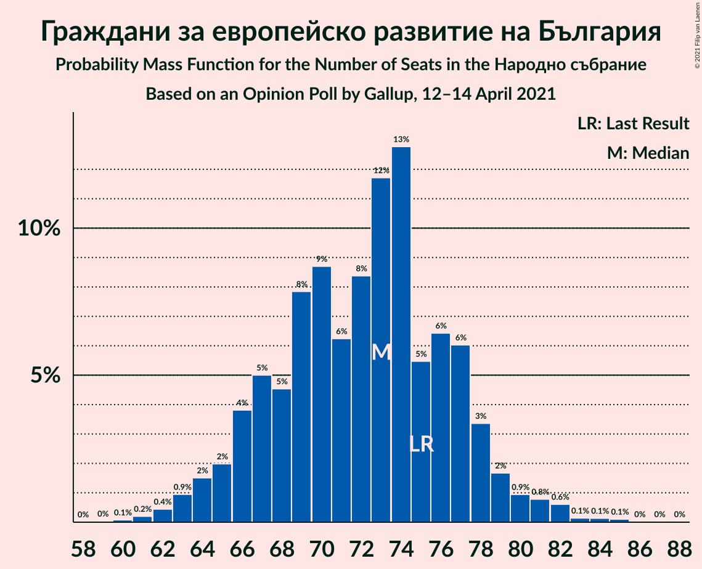
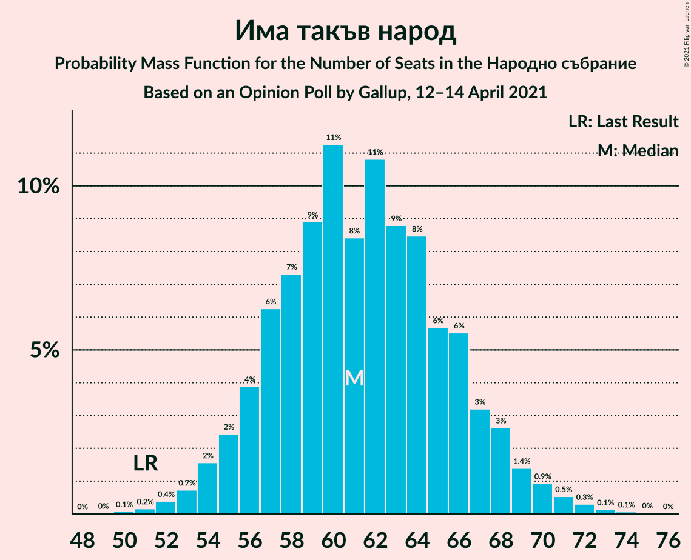
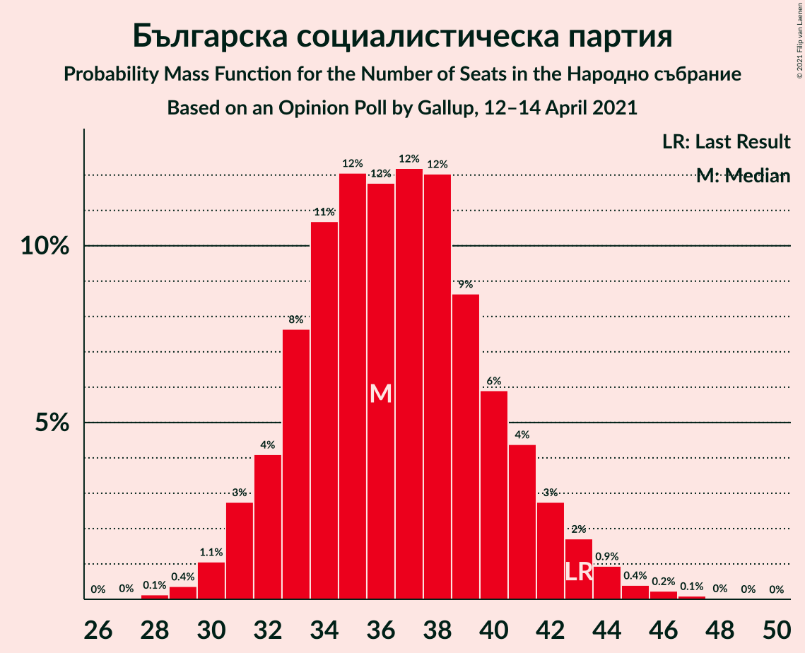
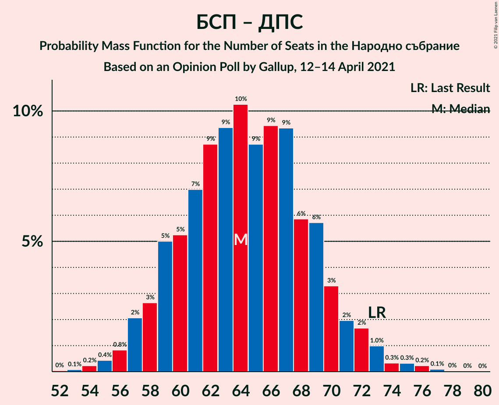

# Opinion Poll by Gallup, 12–14 April 2021

<a href="#voting-intentions">Voting Intentions</a> | <a href="#seats">Seats</a> | <a href="#coalitions">Coalitions</a> | <a href="#technical-information">Technical Information</a>

## Voting Intentions

### Confidence Intervals

| Party | Last Result | Poll Result | 80% Confidence Interval | 90% Confidence Interval | 95% Confidence Interval | 99% Confidence Interval |
|:-----:|:-----------:|:-----------:|:-----------------------:|:-----------------------:|:-----------------------:|:-----------------------:|
| Граждани за европейско развитие на България | 25.8% | 29.8% | 27.9–31.9% |27.3–32.5% |26.8–33.0% |25.9–34.1% |
| Има такъв народ | 17.4% | 25.5% | 23.6–27.5% |23.1–28.1% |22.7–28.6% |21.8–29.6% |
| Българска социалистическа партия | 14.8% | 15.2% | 13.7–16.9% |13.2–17.3% |12.9–17.8% |12.2–18.6% |
| Демократична България | 9.3% | 13.2% | 11.8–14.9% |11.4–15.3% |11.1–15.7% |10.5–16.5% |
| Движение за права и свободи | 10.4% | 11.4% | 10.1–13.0% |9.8–13.4% |9.4–13.8% |8.8–14.6% |
| Изправи се Бг | 4.6% | 4.7% | 3.9–5.8% |3.6–6.1% |3.4–6.4% |3.1–6.9% |

*Note:* The poll result column reflects the actual value used in the calculations. Published results may vary slightly, and in addition be rounded to fewer digits.

## Seats

### Confidence Intervals

| Party | Last Result | Median | 80% Confidence Interval | 90% Confidence Interval | 95% Confidence Interval | 99% Confidence Interval |
|:-----:|:-----------:|:------:|:-----------------------:|:-----------------------:|:-----------------------:|:-----------------------:|
| <a href="#граждани-за-европейско-развитие-на-българия">Граждани за европейско развитие на България</a> | 75 | 73 | 67–77 |65–78 |64–79 |62–82 |
| <a href="#има-такъв-народ">Има такъв народ</a> | 51 | 61 | 57–66 |56–68 |54–69 |52–72 |
| <a href="#българска-социалистическа-партия">Българска социалистическа партия</a> | 43 | 36 | 33–40 |32–42 |31–43 |29–45 |
| <a href="#демократична-българия">Демократична България</a> | 27 | 32 | 30–35 |28–37 |27–39 |25–40 |
| <a href="#движение-за-права-и-свободи">Движение за права и свободи</a> | 30 | 29 | 24–31 |24–32 |23–33 |21–35 |
| <a href="#изправи-се-бг">Изправи се Бг</a> | 14 | 11 | 0–13 |0–14 |0–15 |0–16 |

### Граждани за европейско развитие на България

*For a full overview of the results for this party, see the [Граждани за европейско развитие на България](party-гражданизаевропейскоразвитиенабългария.html) page.*

| Number of Seats | Probability | Accumulated | Special Marks |
|:---------------:|:-----------:|:-----------:|:-------------:|
| 60 | 0.1% | 100% |  |
| 61 | 0.3% | 99.9% |  |
| 62 | 0.4% | 99.6% |  |
| 63 | 1.1% | 99.3% |  |
| 64 | 1.4% | 98% |  |
| 65 | 3% | 97% |  |
| 66 | 3% | 94% |  |
| 67 | 5% | 91% |  |
| 68 | 3% | 86% |  |
| 69 | 6% | 83% |  |
| 70 | 11% | 77% |  |
| 71 | 4% | 66% |  |
| 72 | 6% | 62% |  |
| 73 | 12% | 56% | Median |
| 74 | 13% | 44% |  |
| 75 | 6% | 31% | Last Result |
| 76 | 9% | 25% |  |
| 77 | 8% | 16% |  |
| 78 | 5% | 9% |  |
| 79 | 2% | 4% |  |
| 80 | 0.8% | 2% |  |
| 81 | 0.4% | 1.2% |  |
| 82 | 0.4% | 0.7% |  |
| 83 | 0.1% | 0.3% |  |
| 84 | 0.1% | 0.2% |  |
| 85 | 0.1% | 0.1% |  |
| 86 | 0% | 0.1% |  |
| 87 | 0% | 0% |  |

### Има такъв народ

*For a full overview of the results for this party, see the [Има такъв народ](party-иматакъвнарод.html) page.*

| Number of Seats | Probability | Accumulated | Special Marks |
|:---------------:|:-----------:|:-----------:|:-------------:|
| 50 | 0.1% | 100% |  |
| 51 | 0.2% | 99.9% | Last Result |
| 52 | 0.3% | 99.7% |  |
| 53 | 0.9% | 99.4% |  |
| 54 | 1.4% | 98% |  |
| 55 | 2% | 97% |  |
| 56 | 3% | 95% |  |
| 57 | 8% | 92% |  |
| 58 | 4% | 84% |  |
| 59 | 8% | 79% |  |
| 60 | 15% | 72% |  |
| 61 | 10% | 57% | Median |
| 62 | 7% | 46% |  |
| 63 | 13% | 39% |  |
| 64 | 9% | 26% |  |
| 65 | 4% | 17% |  |
| 66 | 5% | 14% |  |
| 67 | 3% | 9% |  |
| 68 | 3% | 6% |  |
| 69 | 2% | 3% |  |
| 70 | 0.4% | 1.4% |  |
| 71 | 0.4% | 1.0% |  |
| 72 | 0.4% | 0.6% |  |
| 73 | 0.1% | 0.2% |  |
| 74 | 0.1% | 0.1% |  |
| 75 | 0% | 0% |  |

### Българска социалистическа партия

*For a full overview of the results for this party, see the [Българска социалистическа партия](party-българскасоциалистическапартия.html) page.*

| Number of Seats | Probability | Accumulated | Special Marks |
|:---------------:|:-----------:|:-----------:|:-------------:|
| 27 | 0% | 100% |  |
| 28 | 0.1% | 99.9% |  |
| 29 | 0.3% | 99.8% |  |
| 30 | 0.7% | 99.5% |  |
| 31 | 3% | 98.7% |  |
| 32 | 5% | 96% |  |
| 33 | 8% | 91% |  |
| 34 | 9% | 83% |  |
| 35 | 19% | 74% |  |
| 36 | 7% | 55% | Median |
| 37 | 11% | 48% |  |
| 38 | 13% | 37% |  |
| 39 | 8% | 24% |  |
| 40 | 7% | 16% |  |
| 41 | 3% | 8% |  |
| 42 | 3% | 6% |  |
| 43 | 2% | 3% | Last Result |
| 44 | 0.7% | 1.4% |  |
| 45 | 0.4% | 0.7% |  |
| 46 | 0.2% | 0.3% |  |
| 47 | 0% | 0.1% |  |
| 48 | 0% | 0.1% |  |
| 49 | 0% | 0% |  |

### Демократична България

*For a full overview of the results for this party, see the [Демократична България](party-демократичнабългария.html) page.*

| Number of Seats | Probability | Accumulated | Special Marks |
|:---------------:|:-----------:|:-----------:|:-------------:|
| 23 | 0.1% | 100% |  |
| 24 | 0.1% | 99.9% |  |
| 25 | 0.4% | 99.8% |  |
| 26 | 1.3% | 99.4% |  |
| 27 | 3% | 98% | Last Result |
| 28 | 2% | 95% |  |
| 29 | 2% | 93% |  |
| 30 | 9% | 91% |  |
| 31 | 29% | 82% |  |
| 32 | 17% | 53% | Median |
| 33 | 12% | 36% |  |
| 34 | 12% | 24% |  |
| 35 | 4% | 11% |  |
| 36 | 1.2% | 7% |  |
| 37 | 1.4% | 6% |  |
| 38 | 2% | 5% |  |
| 39 | 2% | 3% |  |
| 40 | 0.9% | 1.2% |  |
| 41 | 0.1% | 0.4% |  |
| 42 | 0.3% | 0.3% |  |
| 43 | 0% | 0% |  |

### Движение за права и свободи

*For a full overview of the results for this party, see the [Движение за права и свободи](party-движениезаправаисвободи.html) page.*

| Number of Seats | Probability | Accumulated | Special Marks |
|:---------------:|:-----------:|:-----------:|:-------------:|
| 19 | 0% | 100% |  |
| 20 | 0.1% | 99.9% |  |
| 21 | 0.5% | 99.8% |  |
| 22 | 1.0% | 99.3% |  |
| 23 | 1.3% | 98% |  |
| 24 | 12% | 97% |  |
| 25 | 4% | 85% |  |
| 26 | 14% | 81% |  |
| 27 | 10% | 67% |  |
| 28 | 7% | 58% |  |
| 29 | 26% | 50% | Median |
| 30 | 9% | 25% | Last Result |
| 31 | 8% | 16% |  |
| 32 | 5% | 8% |  |
| 33 | 0.7% | 3% |  |
| 34 | 2% | 2% |  |
| 35 | 0.3% | 0.6% |  |
| 36 | 0.2% | 0.3% |  |
| 37 | 0.1% | 0.1% |  |
| 38 | 0% | 0% |  |

### Изправи се Бг

*For a full overview of the results for this party, see the [Изправи се Бг](party-изправисебг.html) page.*

| Number of Seats | Probability | Accumulated | Special Marks |
|:---------------:|:-----------:|:-----------:|:-------------:|
| 0 | 17% | 100% |  |
| 1 | 0% | 83% |  |
| 2 | 0% | 83% |  |
| 3 | 0% | 83% |  |
| 4 | 0% | 83% |  |
| 5 | 0% | 83% |  |
| 6 | 0% | 83% |  |
| 7 | 0% | 83% |  |
| 8 | 0% | 83% |  |
| 9 | 0% | 83% |  |
| 10 | 15% | 83% |  |
| 11 | 22% | 68% | Median |
| 12 | 23% | 46% |  |
| 13 | 13% | 23% |  |
| 14 | 5% | 10% | Last Result |
| 15 | 3% | 4% |  |
| 16 | 1.1% | 2% |  |
| 17 | 0.3% | 0.4% |  |
| 18 | 0.1% | 0.1% |  |
| 19 | 0% | 0% |  |

## Coalitions

### Confidence Intervals

| Coalition | Last Result | Median | Majority? | 80% Confidence Interval | 90% Confidence Interval | 95% Confidence Interval | 99% Confidence Interval |
|:---------:|:-----------:|:------:|:---------:|:-----------------------:|:-----------------------:|:-----------------------:|:-----------------------:|
| Има такъв народ – Българска социалистическа партия – Движение за права и свободи – Изправи се Бг | 138 | 135 | 100% | 130–141 | 129–143 | 128–144 | 124–147 |
| Има такъв народ – Българска социалистическа партия – Движение за права и свободи | 124 | 125 | 85% | 120–132 | 119–134 | 117–135 | 115–138 |
| Българска социалистическа партия – Движение за права и свободи – Изправи се Бг | 87 | 76 | 0% | 67–79 | 64–81 | 62–83 | 60–86 |
| Българска социалистическа партия – Движение за права и свободи | 73 | 64 | 0% | 59–69 | 57–72 | 57–72 | 55–74 |

### Има такъв народ – Българска социалистическа партия – Движение за права и свободи – Изправи се Бг

| Number of Seats | Probability | Accumulated | Special Marks |
|:---------------:|:-----------:|:-----------:|:-------------:|
| 121 | 0% | 100% | Majority |
| 122 | 0.2% | 99.9% |  |
| 123 | 0.2% | 99.8% |  |
| 124 | 0.1% | 99.6% |  |
| 125 | 0.6% | 99.5% |  |
| 126 | 0.3% | 98.9% |  |
| 127 | 0.4% | 98.6% |  |
| 128 | 2% | 98% |  |
| 129 | 3% | 96% |  |
| 130 | 9% | 93% |  |
| 131 | 3% | 84% |  |
| 132 | 7% | 81% |  |
| 133 | 5% | 74% |  |
| 134 | 2% | 69% |  |
| 135 | 17% | 67% |  |
| 136 | 13% | 50% |  |
| 137 | 3% | 37% | Median |
| 138 | 10% | 34% | Last Result |
| 139 | 7% | 24% |  |
| 140 | 5% | 17% |  |
| 141 | 5% | 12% |  |
| 142 | 2% | 7% |  |
| 143 | 2% | 5% |  |
| 144 | 1.0% | 3% |  |
| 145 | 1.0% | 2% |  |
| 146 | 0.5% | 1.0% |  |
| 147 | 0.3% | 0.5% |  |
| 148 | 0.1% | 0.2% |  |
| 149 | 0.1% | 0.1% |  |
| 150 | 0% | 0.1% |  |
| 151 | 0% | 0% |  |

### Има такъв народ – Българска социалистическа партия – Движение за права и свободи

| Number of Seats | Probability | Accumulated | Special Marks |
|:---------------:|:-----------:|:-----------:|:-------------:|
| 112 | 0.1% | 100% |  |
| 113 | 0.1% | 99.9% |  |
| 114 | 0.1% | 99.8% |  |
| 115 | 0.7% | 99.6% |  |
| 116 | 1.1% | 99.0% |  |
| 117 | 0.5% | 98% |  |
| 118 | 0.4% | 97% |  |
| 119 | 4% | 97% |  |
| 120 | 8% | 93% |  |
| 121 | 7% | 85% | Majority |
| 122 | 2% | 78% |  |
| 123 | 3% | 76% |  |
| 124 | 21% | 74% | Last Result |
| 125 | 7% | 53% |  |
| 126 | 3% | 46% | Median |
| 127 | 6% | 43% |  |
| 128 | 10% | 37% |  |
| 129 | 8% | 27% |  |
| 130 | 6% | 20% |  |
| 131 | 3% | 13% |  |
| 132 | 3% | 10% |  |
| 133 | 2% | 7% |  |
| 134 | 0.6% | 5% |  |
| 135 | 3% | 5% |  |
| 136 | 0.9% | 2% |  |
| 137 | 0.3% | 1.0% |  |
| 138 | 0.2% | 0.7% |  |
| 139 | 0.2% | 0.4% |  |
| 140 | 0.1% | 0.3% |  |
| 141 | 0.1% | 0.2% |  |
| 142 | 0% | 0.1% |  |
| 143 | 0% | 0% |  |

### Българска социалистическа партия – Движение за права и свободи – Изправи се Бг

| Number of Seats | Probability | Accumulated | Special Marks |
|:---------------:|:-----------:|:-----------:|:-------------:|
| 58 | 0% | 100% |  |
| 59 | 0.1% | 99.9% |  |
| 60 | 0.9% | 99.8% |  |
| 61 | 0.1% | 99.0% |  |
| 62 | 2% | 98.8% |  |
| 63 | 0.1% | 97% |  |
| 64 | 4% | 97% |  |
| 65 | 0.5% | 93% |  |
| 66 | 2% | 92% |  |
| 67 | 2% | 91% |  |
| 68 | 2% | 89% |  |
| 69 | 5% | 87% |  |
| 70 | 4% | 82% |  |
| 71 | 4% | 78% |  |
| 72 | 5% | 74% |  |
| 73 | 6% | 69% |  |
| 74 | 4% | 63% |  |
| 75 | 10% | 60% |  |
| 76 | 18% | 50% | Median |
| 77 | 9% | 32% |  |
| 78 | 11% | 23% |  |
| 79 | 3% | 12% |  |
| 80 | 3% | 9% |  |
| 81 | 2% | 6% |  |
| 82 | 1.1% | 4% |  |
| 83 | 1.5% | 3% |  |
| 84 | 0.9% | 2% |  |
| 85 | 0.3% | 0.8% |  |
| 86 | 0.3% | 0.6% |  |
| 87 | 0.2% | 0.2% | Last Result |
| 88 | 0.1% | 0.1% |  |
| 89 | 0% | 0% |  |

### Българска социалистическа партия – Движение за права и свободи

| Number of Seats | Probability | Accumulated | Special Marks |
|:---------------:|:-----------:|:-----------:|:-------------:|
| 52 | 0% | 100% |  |
| 53 | 0.1% | 99.9% |  |
| 54 | 0.2% | 99.9% |  |
| 55 | 0.7% | 99.6% |  |
| 56 | 0.6% | 98.9% |  |
| 57 | 4% | 98% |  |
| 58 | 1.0% | 95% |  |
| 59 | 6% | 94% |  |
| 60 | 3% | 88% |  |
| 61 | 7% | 85% |  |
| 62 | 9% | 78% |  |
| 63 | 6% | 68% |  |
| 64 | 19% | 62% |  |
| 65 | 6% | 44% | Median |
| 66 | 6% | 37% |  |
| 67 | 14% | 31% |  |
| 68 | 4% | 17% |  |
| 69 | 4% | 13% |  |
| 70 | 1.4% | 9% |  |
| 71 | 2% | 8% |  |
| 72 | 4% | 5% |  |
| 73 | 1.1% | 2% | Last Result |
| 74 | 0.3% | 0.7% |  |
| 75 | 0.1% | 0.4% |  |
| 76 | 0.1% | 0.2% |  |
| 77 | 0% | 0.1% |  |
| 78 | 0% | 0.1% |  |
| 79 | 0% | 0% |  |

## Technical Information

### Opinion Poll

+ **Polling firm:** Gallup
+ **Commissioner(s):** —
+ **Fieldwork period:** 12–14 April 2021

### Calculations

+ **Sample size:** 831
+ **Simulations done:** 131,072
+ **Error estimate:** 2.00%

