# Opinion Poll by Маркет ЛИНКС for bTV, 16–23 April 2021

<a href="#voting-intentions">Voting Intentions</a> | <a href="#seats">Seats</a> | <a href="#coalitions">Coalitions</a> | <a href="#technical-information">Technical Information</a>

## Voting Intentions

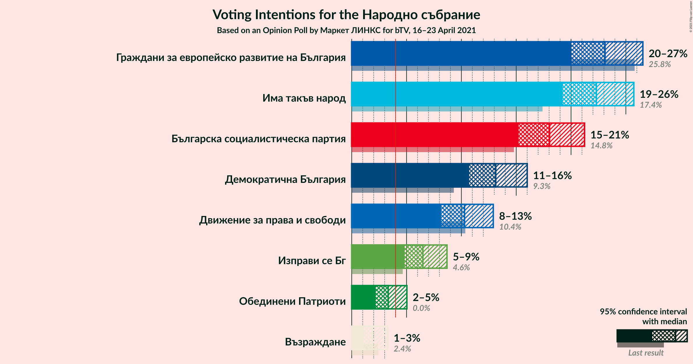

### Confidence Intervals

| Party | Last Result | Poll Result | 80% Confidence Interval | 90% Confidence Interval | 95% Confidence Interval | 99% Confidence Interval |
|:-----:|:-----------:|:-----------:|:-----------------------:|:-----------------------:|:-----------------------:|:-----------------------:|
| Граждани за европейско развитие на България | 25.8% | 23.1% | 21.0–25.4% |20.5–26.0% |20.0–26.6% |19.0–27.7% |
| Има такъв народ | 17.4% | 22.3% | 20.3–24.5% |19.7–25.2% |19.2–25.7% |18.3–26.8% |
| Българска социалистическа партия | 14.8% | 18.0% | 16.2–20.1% |15.7–20.7% |15.2–21.2% |14.4–22.3% |
| Демократична България | 9.3% | 13.1% | 11.5–15.0% |11.1–15.5% |10.7–16.0% |10.0–16.9% |
| Движение за права и свободи | 10.4% | 10.3% | 8.9–12.0% |8.5–12.5% |8.2–12.9% |7.5–13.8% |
| Изправи се Бг | 4.6% | 6.5% | 5.4–7.9% |5.1–8.3% |4.8–8.7% |4.3–9.4% |
| Обединени Патриоти | 0.0% | 3.3% | 2.6–4.4% |2.4–4.8% |2.2–5.0% |1.9–5.6% |
| Възраждане | 2.4% | 1.9% | 1.4–2.8% |1.2–3.1% |1.1–3.3% |0.9–3.8% |

*Note:* The poll result column reflects the actual value used in the calculations. Published results may vary slightly, and in addition be rounded to fewer digits.

## Seats

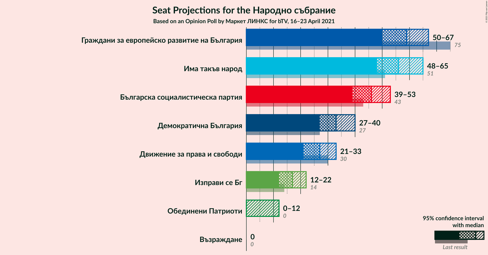

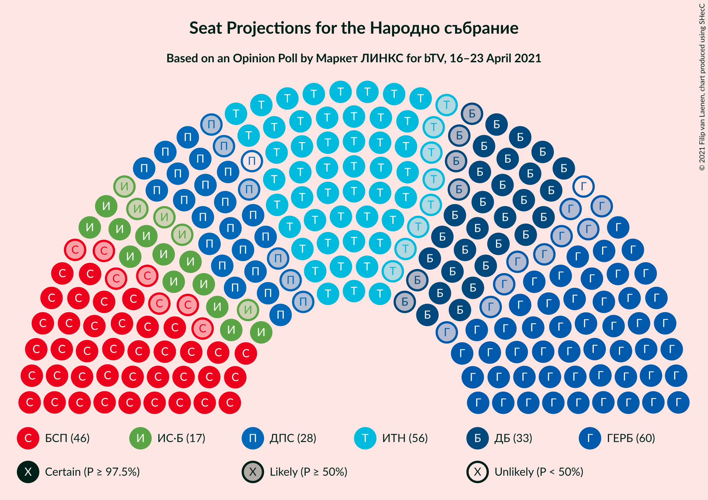

### Confidence Intervals

| Party | Last Result | Median | 80% Confidence Interval | 90% Confidence Interval | 95% Confidence Interval | 99% Confidence Interval |
|:-----:|:-----------:|:------:|:-----------------------:|:-----------------------:|:-----------------------:|:-----------------------:|
| <a href="#граждани-за-европейско-развитие-на-българия">Граждани за европейско развитие на България</a> | 75 | 59 | 53–64 |52–66 |50–67 |48–70 |
| <a href="#има-такъв-народ">Има такъв народ</a> | 51 | 56 | 51–62 |50–64 |48–65 |46–68 |
| <a href="#българска-социалистическа-партия">Българска социалистическа партия</a> | 43 | 46 | 41–51 |40–53 |39–53 |37–57 |
| <a href="#демократична-българия">Демократична България</a> | 27 | 33 | 29–37 |28–38 |27–40 |25–43 |
| <a href="#движение-за-права-и-свободи">Движение за права и свободи</a> | 30 | 27 | 22–30 |22–31 |21–33 |19–35 |
| <a href="#изправи-се-бг">Изправи се Бг</a> | 14 | 17 | 14–20 |13–21 |12–22 |11–24 |
| <a href="#обединени-патриоти">Обединени Патриоти</a> | 0 | 0 | 0–11 |0–11 |0–12 |0–13 |
| <a href="#възраждане">Възраждане</a> | 0 | 0 | 0 |0 |0 |0 |

### Граждани за европейско развитие на България

*For a full overview of the results for this party, see the [Граждани за европейско развитие на България](party-гражданизаевропейскоразвитиенабългария.html) page.*

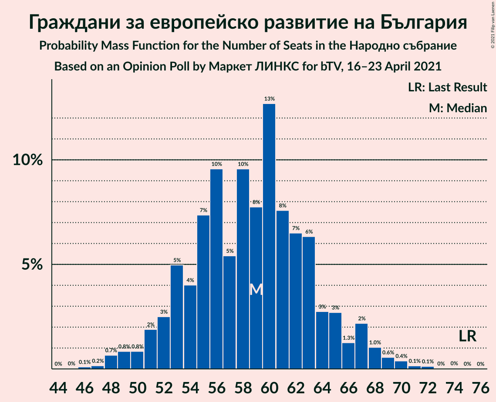

| Number of Seats | Probability | Accumulated | Special Marks |
|:---------------:|:-----------:|:-----------:|:-------------:|
| 46 | 0.1% | 100% |  |
| 47 | 0.2% | 99.9% |  |
| 48 | 0.7% | 99.7% |  |
| 49 | 0.8% | 99.0% |  |
| 50 | 0.8% | 98% |  |
| 51 | 2% | 97% |  |
| 52 | 3% | 95% |  |
| 53 | 5% | 93% |  |
| 54 | 4% | 88% |  |
| 55 | 7% | 84% |  |
| 56 | 10% | 77% |  |
| 57 | 5% | 67% |  |
| 58 | 10% | 62% |  |
| 59 | 8% | 52% | Median |
| 60 | 13% | 44% |  |
| 61 | 8% | 32% |  |
| 62 | 7% | 24% |  |
| 63 | 6% | 18% |  |
| 64 | 3% | 11% |  |
| 65 | 3% | 8% |  |
| 66 | 1.3% | 6% |  |
| 67 | 2% | 5% |  |
| 68 | 1.0% | 2% |  |
| 69 | 0.6% | 1.3% |  |
| 70 | 0.4% | 0.7% |  |
| 71 | 0.1% | 0.4% |  |
| 72 | 0.1% | 0.2% |  |
| 73 | 0% | 0.1% |  |
| 74 | 0% | 0.1% |  |
| 75 | 0% | 0% | Last Result |

### Има такъв народ

*For a full overview of the results for this party, see the [Има такъв народ](party-иматакъвнарод.html) page.*

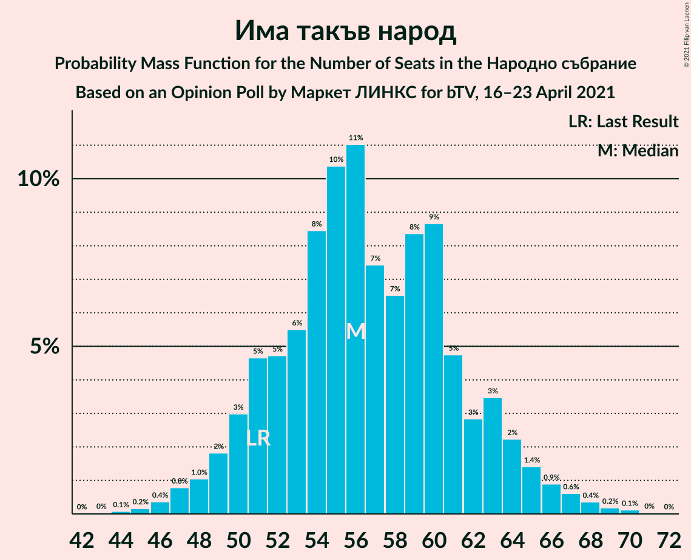

| Number of Seats | Probability | Accumulated | Special Marks |
|:---------------:|:-----------:|:-----------:|:-------------:|
| 43 | 0% | 100% |  |
| 44 | 0.1% | 99.9% |  |
| 45 | 0.2% | 99.9% |  |
| 46 | 0.4% | 99.7% |  |
| 47 | 0.8% | 99.3% |  |
| 48 | 1.0% | 98.5% |  |
| 49 | 2% | 97% |  |
| 50 | 3% | 96% |  |
| 51 | 5% | 93% | Last Result |
| 52 | 5% | 88% |  |
| 53 | 6% | 83% |  |
| 54 | 8% | 78% |  |
| 55 | 10% | 69% |  |
| 56 | 11% | 59% | Median |
| 57 | 7% | 48% |  |
| 58 | 7% | 41% |  |
| 59 | 8% | 34% |  |
| 60 | 9% | 26% |  |
| 61 | 5% | 17% |  |
| 62 | 3% | 12% |  |
| 63 | 3% | 9% |  |
| 64 | 2% | 6% |  |
| 65 | 1.4% | 4% |  |
| 66 | 0.9% | 2% |  |
| 67 | 0.6% | 1.4% |  |
| 68 | 0.4% | 0.7% |  |
| 69 | 0.2% | 0.4% |  |
| 70 | 0.1% | 0.2% |  |
| 71 | 0% | 0.1% |  |
| 72 | 0% | 0% |  |

### Българска социалистическа партия

*For a full overview of the results for this party, see the [Българска социалистическа партия](party-българскасоциалистическапартия.html) page.*

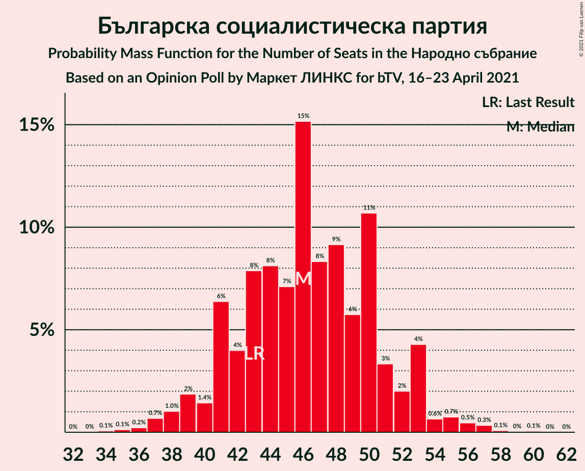

| Number of Seats | Probability | Accumulated | Special Marks |
|:---------------:|:-----------:|:-----------:|:-------------:|
| 34 | 0.1% | 100% |  |
| 35 | 0.1% | 99.9% |  |
| 36 | 0.2% | 99.8% |  |
| 37 | 0.7% | 99.6% |  |
| 38 | 1.0% | 98.9% |  |
| 39 | 2% | 98% |  |
| 40 | 1.4% | 96% |  |
| 41 | 6% | 95% |  |
| 42 | 4% | 88% |  |
| 43 | 8% | 84% | Last Result |
| 44 | 8% | 76% |  |
| 45 | 7% | 68% |  |
| 46 | 15% | 61% | Median |
| 47 | 8% | 46% |  |
| 48 | 9% | 38% |  |
| 49 | 6% | 28% |  |
| 50 | 11% | 23% |  |
| 51 | 3% | 12% |  |
| 52 | 2% | 9% |  |
| 53 | 4% | 7% |  |
| 54 | 0.6% | 2% |  |
| 55 | 0.7% | 2% |  |
| 56 | 0.5% | 1.0% |  |
| 57 | 0.3% | 0.5% |  |
| 58 | 0.1% | 0.2% |  |
| 59 | 0% | 0.1% |  |
| 60 | 0.1% | 0.1% |  |
| 61 | 0% | 0% |  |

### Демократична България

*For a full overview of the results for this party, see the [Демократична България](party-демократичнабългария.html) page.*

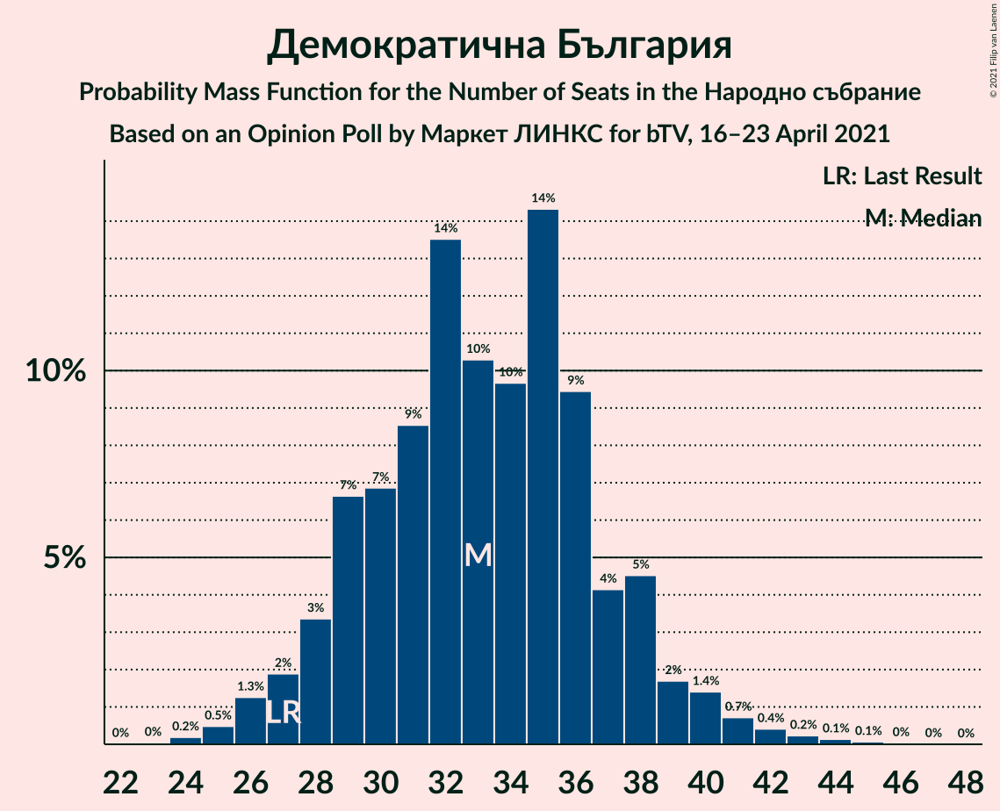

| Number of Seats | Probability | Accumulated | Special Marks |
|:---------------:|:-----------:|:-----------:|:-------------:|
| 23 | 0% | 100% |  |
| 24 | 0.2% | 99.9% |  |
| 25 | 0.5% | 99.7% |  |
| 26 | 1.3% | 99.3% |  |
| 27 | 2% | 98% | Last Result |
| 28 | 3% | 96% |  |
| 29 | 7% | 93% |  |
| 30 | 7% | 86% |  |
| 31 | 9% | 79% |  |
| 32 | 14% | 71% |  |
| 33 | 10% | 57% | Median |
| 34 | 10% | 47% |  |
| 35 | 14% | 37% |  |
| 36 | 9% | 23% |  |
| 37 | 4% | 13% |  |
| 38 | 5% | 9% |  |
| 39 | 2% | 5% |  |
| 40 | 1.4% | 3% |  |
| 41 | 0.7% | 2% |  |
| 42 | 0.4% | 0.9% |  |
| 43 | 0.2% | 0.5% |  |
| 44 | 0.1% | 0.3% |  |
| 45 | 0.1% | 0.1% |  |
| 46 | 0% | 0.1% |  |
| 47 | 0% | 0% |  |

### Движение за права и свободи

*For a full overview of the results for this party, see the [Движение за права и свободи](party-движениезаправаисвободи.html) page.*

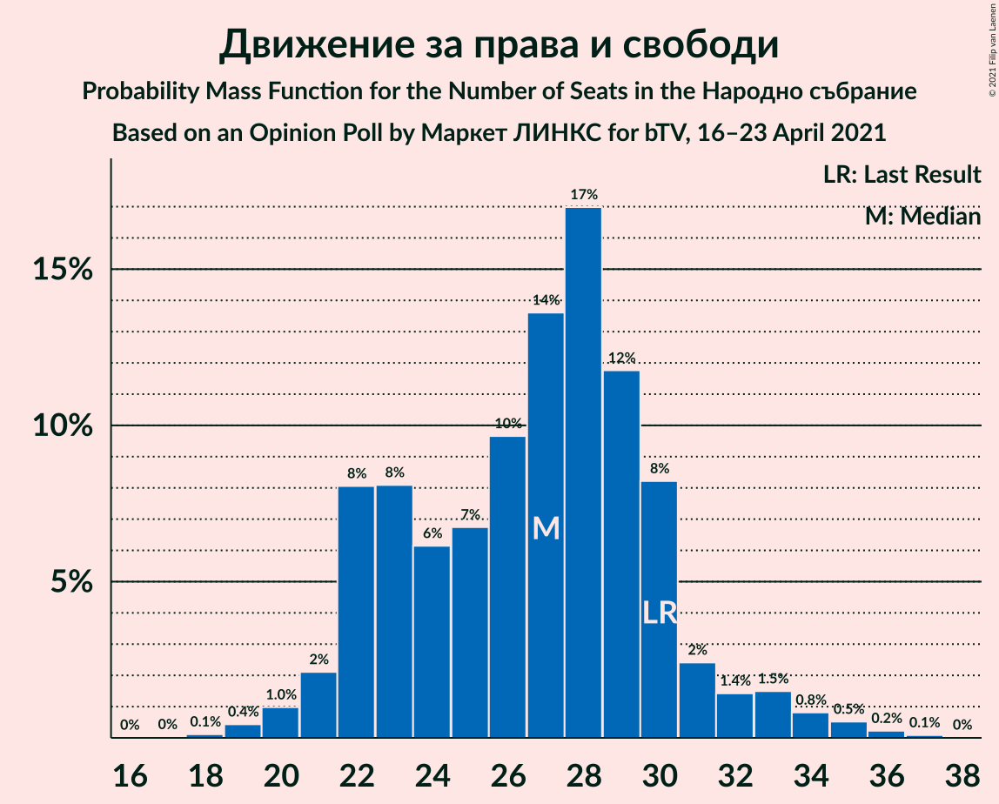

| Number of Seats | Probability | Accumulated | Special Marks |
|:---------------:|:-----------:|:-----------:|:-------------:|
| 18 | 0.1% | 100% |  |
| 19 | 0.4% | 99.8% |  |
| 20 | 1.0% | 99.4% |  |
| 21 | 2% | 98% |  |
| 22 | 8% | 96% |  |
| 23 | 8% | 88% |  |
| 24 | 6% | 80% |  |
| 25 | 7% | 74% |  |
| 26 | 10% | 67% |  |
| 27 | 14% | 58% | Median |
| 28 | 17% | 44% |  |
| 29 | 12% | 27% |  |
| 30 | 8% | 15% | Last Result |
| 31 | 2% | 7% |  |
| 32 | 1.4% | 5% |  |
| 33 | 1.5% | 3% |  |
| 34 | 0.8% | 2% |  |
| 35 | 0.5% | 0.9% |  |
| 36 | 0.2% | 0.3% |  |
| 37 | 0.1% | 0.1% |  |
| 38 | 0% | 0% |  |

### Изправи се Бг

*For a full overview of the results for this party, see the [Изправи се Бг](party-изправисебг.html) page.*

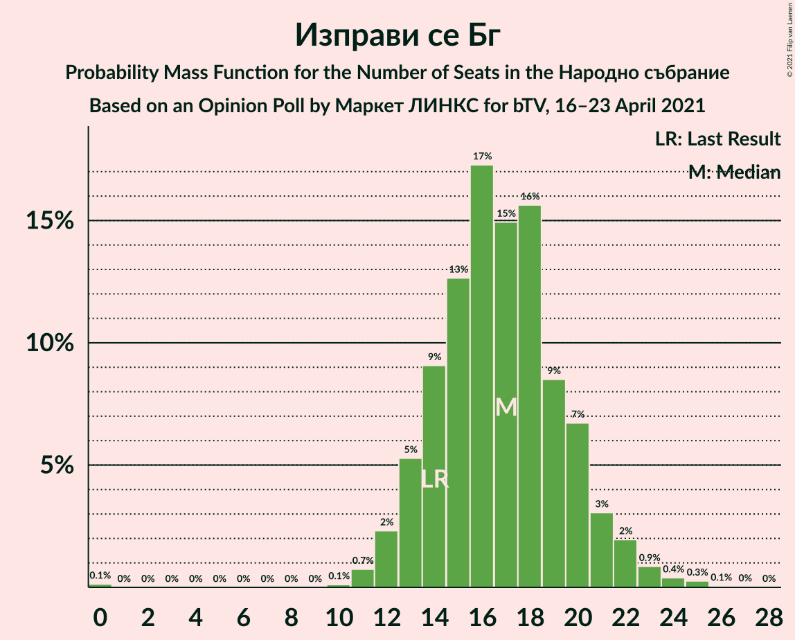

| Number of Seats | Probability | Accumulated | Special Marks |
|:---------------:|:-----------:|:-----------:|:-------------:|
| 0 | 0.1% | 100% |  |
| 1 | 0% | 99.9% |  |
| 2 | 0% | 99.9% |  |
| 3 | 0% | 99.9% |  |
| 4 | 0% | 99.9% |  |
| 5 | 0% | 99.9% |  |
| 6 | 0% | 99.9% |  |
| 7 | 0% | 99.9% |  |
| 8 | 0% | 99.9% |  |
| 9 | 0% | 99.9% |  |
| 10 | 0.1% | 99.9% |  |
| 11 | 0.7% | 99.8% |  |
| 12 | 2% | 99.0% |  |
| 13 | 5% | 97% |  |
| 14 | 9% | 91% | Last Result |
| 15 | 13% | 82% |  |
| 16 | 17% | 70% |  |
| 17 | 15% | 52% | Median |
| 18 | 16% | 37% |  |
| 19 | 9% | 22% |  |
| 20 | 7% | 13% |  |
| 21 | 3% | 7% |  |
| 22 | 2% | 4% |  |
| 23 | 0.9% | 2% |  |
| 24 | 0.4% | 0.7% |  |
| 25 | 0.3% | 0.4% |  |
| 26 | 0.1% | 0.1% |  |
| 27 | 0% | 0% |  |

### Обединени Патриоти

*For a full overview of the results for this party, see the [Обединени Патриоти](party-обединенипатриоти.html) page.*

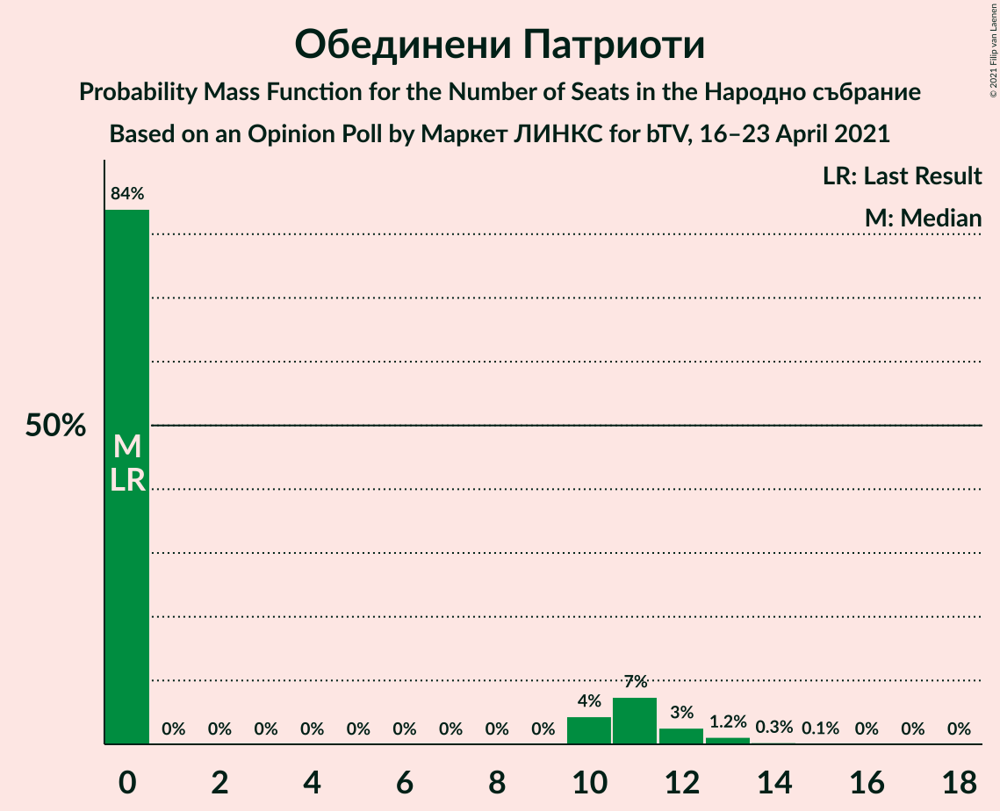

| Number of Seats | Probability | Accumulated | Special Marks |
|:---------------:|:-----------:|:-----------:|:-------------:|
| 0 | 84% | 100% | Last Result, Median |
| 1 | 0% | 16% |  |
| 2 | 0% | 16% |  |
| 3 | 0% | 16% |  |
| 4 | 0% | 16% |  |
| 5 | 0% | 16% |  |
| 6 | 0% | 16% |  |
| 7 | 0% | 16% |  |
| 8 | 0% | 16% |  |
| 9 | 0% | 16% |  |
| 10 | 4% | 16% |  |
| 11 | 7% | 12% |  |
| 12 | 3% | 4% |  |
| 13 | 1.2% | 2% |  |
| 14 | 0.3% | 0.5% |  |
| 15 | 0.1% | 0.2% |  |
| 16 | 0% | 0.1% |  |
| 17 | 0% | 0% |  |

### Възраждане

*For a full overview of the results for this party, see the [Възраждане](party-възраждане.html) page.*

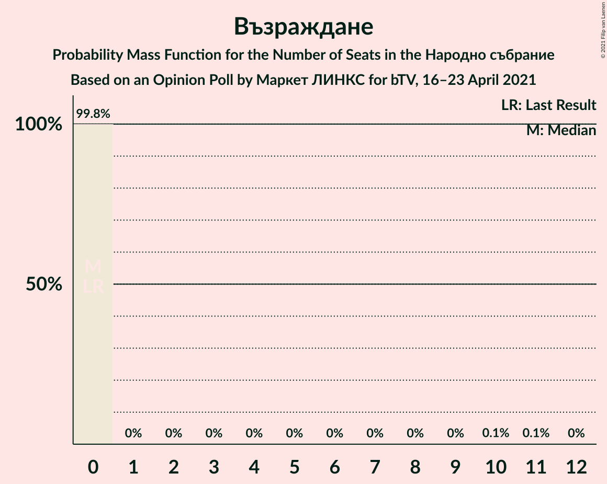

| Number of Seats | Probability | Accumulated | Special Marks |
|:---------------:|:-----------:|:-----------:|:-------------:|
| 0 | 99.8% | 100% | Last Result, Median |
| 1 | 0% | 0.2% |  |
| 2 | 0% | 0.2% |  |
| 3 | 0% | 0.2% |  |
| 4 | 0% | 0.2% |  |
| 5 | 0% | 0.2% |  |
| 6 | 0% | 0.2% |  |
| 7 | 0% | 0.2% |  |
| 8 | 0% | 0.2% |  |
| 9 | 0% | 0.2% |  |
| 10 | 0.1% | 0.2% |  |
| 11 | 0.1% | 0.1% |  |
| 12 | 0% | 0% |  |

## Coalitions

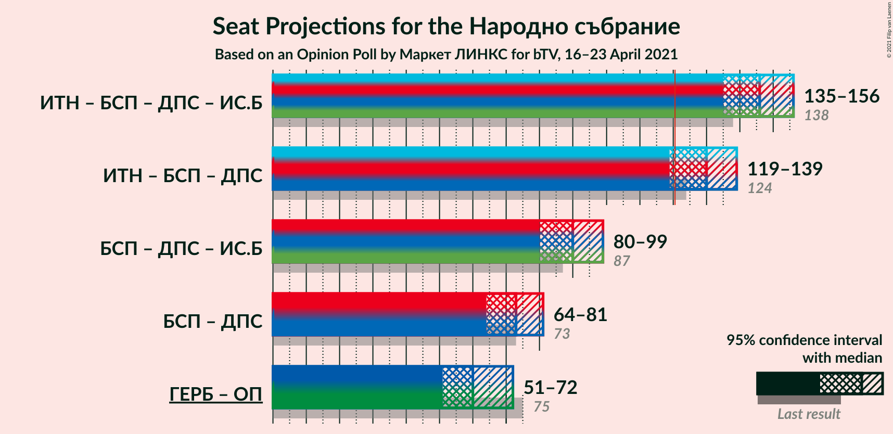

### Confidence Intervals

| Coalition | Last Result | Median | Majority? | 80% Confidence Interval | 90% Confidence Interval | 95% Confidence Interval | 99% Confidence Interval |
|:---------:|:-----------:|:------:|:---------:|:-----------------------:|:-----------------------:|:-----------------------:|:-----------------------:|
| Има такъв народ – Българска социалистическа партия – Движение за права и свободи – Изправи се Бг | 138 | 146 | 100% | 139–153 | 138–154 | 135–156 | 131–159 |
| Има такъв народ – Българска социалистическа партия – Движение за права и свободи | 124 | 130 | 95% | 123–136 | 121–138 | 119–139 | 115–142 |
| Българска социалистическа партия – Движение за права и свободи – Изправи се Бг | 87 | 90 | 0% | 84–96 | 81–97 | 80–99 | 76–102 |
| Българска социалистическа партия – Движение за права и свободи | 73 | 73 | 0% | 67–78 | 65–79 | 64–81 | 61–84 |
| Граждани за европейско развитие на България – Обединени Патриоти | 75 | 60 | 0% | 54–67 | 53–70 | 51–72 | 49–75 |

### Има такъв народ – Българска социалистическа партия – Движение за права и свободи – Изправи се Бг

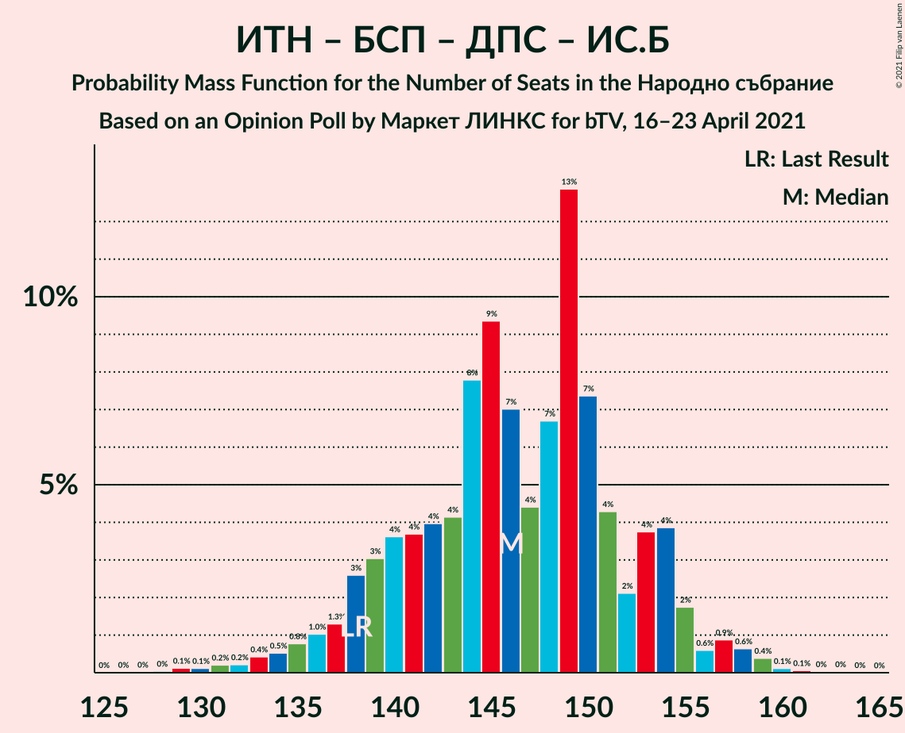

| Number of Seats | Probability | Accumulated | Special Marks |
|:---------------:|:-----------:|:-----------:|:-------------:|
| 127 | 0% | 100% |  |
| 128 | 0% | 99.9% |  |
| 129 | 0.1% | 99.9% |  |
| 130 | 0.1% | 99.8% |  |
| 131 | 0.2% | 99.6% |  |
| 132 | 0.2% | 99.4% |  |
| 133 | 0.4% | 99.2% |  |
| 134 | 0.5% | 98.8% |  |
| 135 | 0.8% | 98% |  |
| 136 | 1.0% | 97% |  |
| 137 | 1.3% | 96% |  |
| 138 | 3% | 95% | Last Result |
| 139 | 3% | 93% |  |
| 140 | 4% | 90% |  |
| 141 | 4% | 86% |  |
| 142 | 4% | 82% |  |
| 143 | 4% | 78% |  |
| 144 | 8% | 74% |  |
| 145 | 9% | 66% |  |
| 146 | 7% | 57% | Median |
| 147 | 4% | 50% |  |
| 148 | 7% | 45% |  |
| 149 | 13% | 39% |  |
| 150 | 7% | 26% |  |
| 151 | 4% | 19% |  |
| 152 | 2% | 14% |  |
| 153 | 4% | 12% |  |
| 154 | 4% | 8% |  |
| 155 | 2% | 5% |  |
| 156 | 0.6% | 3% |  |
| 157 | 0.9% | 2% |  |
| 158 | 0.6% | 1.3% |  |
| 159 | 0.4% | 0.7% |  |
| 160 | 0.1% | 0.3% |  |
| 161 | 0.1% | 0.1% |  |
| 162 | 0% | 0.1% |  |
| 163 | 0% | 0% |  |

### Има такъв народ – Българска социалистическа партия – Движение за права и свободи

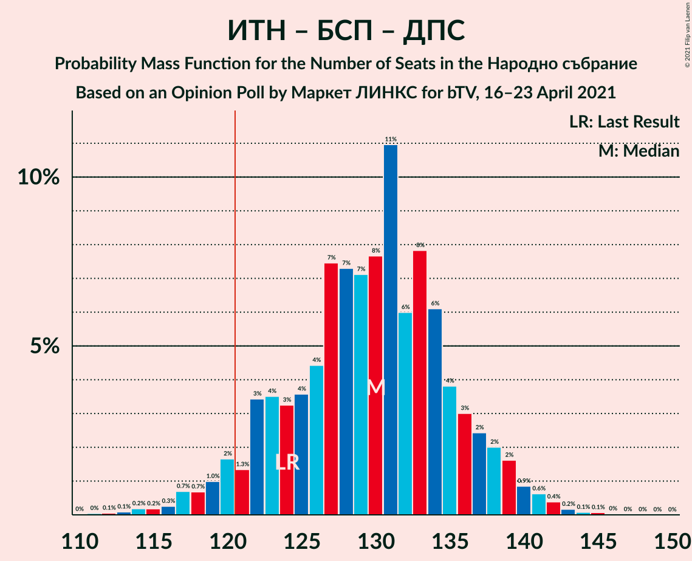

| Number of Seats | Probability | Accumulated | Special Marks |
|:---------------:|:-----------:|:-----------:|:-------------:|
| 111 | 0% | 100% |  |
| 112 | 0.1% | 99.9% |  |
| 113 | 0.1% | 99.9% |  |
| 114 | 0.2% | 99.8% |  |
| 115 | 0.2% | 99.6% |  |
| 116 | 0.3% | 99.4% |  |
| 117 | 0.7% | 99.1% |  |
| 118 | 0.7% | 98% |  |
| 119 | 1.0% | 98% |  |
| 120 | 2% | 97% |  |
| 121 | 1.3% | 95% | Majority |
| 122 | 3% | 94% |  |
| 123 | 4% | 90% |  |
| 124 | 3% | 87% | Last Result |
| 125 | 4% | 84% |  |
| 126 | 4% | 80% |  |
| 127 | 7% | 76% |  |
| 128 | 7% | 68% |  |
| 129 | 7% | 61% | Median |
| 130 | 8% | 54% |  |
| 131 | 11% | 46% |  |
| 132 | 6% | 35% |  |
| 133 | 8% | 29% |  |
| 134 | 6% | 21% |  |
| 135 | 4% | 15% |  |
| 136 | 3% | 11% |  |
| 137 | 2% | 8% |  |
| 138 | 2% | 6% |  |
| 139 | 2% | 4% |  |
| 140 | 0.9% | 2% |  |
| 141 | 0.6% | 1.4% |  |
| 142 | 0.4% | 0.8% |  |
| 143 | 0.2% | 0.4% |  |
| 144 | 0.1% | 0.2% |  |
| 145 | 0.1% | 0.1% |  |
| 146 | 0% | 0.1% |  |
| 147 | 0% | 0% |  |

### Българска социалистическа партия – Движение за права и свободи – Изправи се Бг

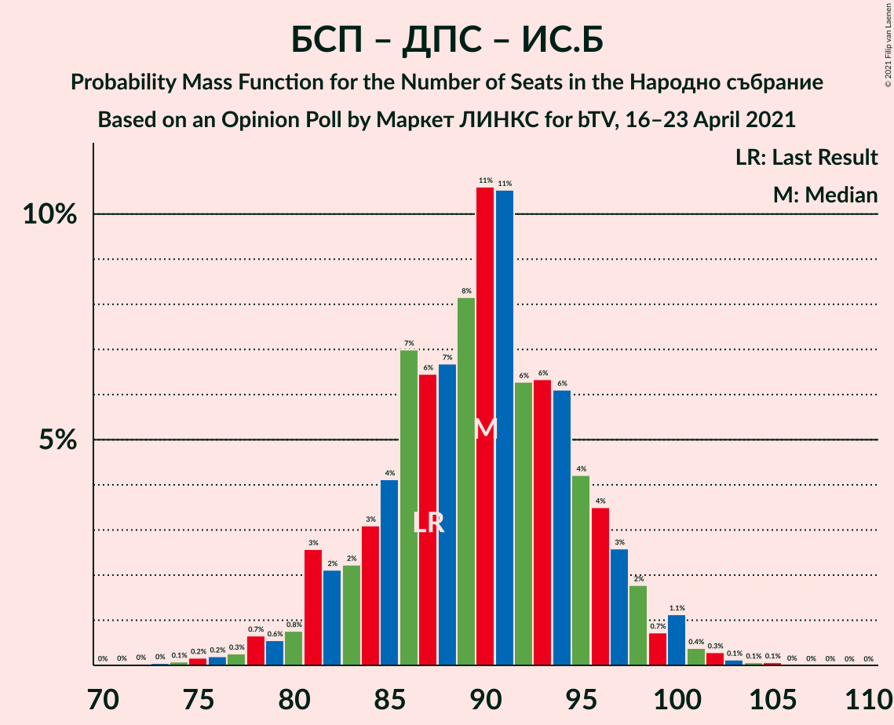

| Number of Seats | Probability | Accumulated | Special Marks |
|:---------------:|:-----------:|:-----------:|:-------------:|
| 72 | 0% | 100% |  |
| 73 | 0% | 99.9% |  |
| 74 | 0.1% | 99.9% |  |
| 75 | 0.2% | 99.8% |  |
| 76 | 0.2% | 99.6% |  |
| 77 | 0.3% | 99.4% |  |
| 78 | 0.7% | 99.2% |  |
| 79 | 0.6% | 98.5% |  |
| 80 | 0.8% | 98% |  |
| 81 | 3% | 97% |  |
| 82 | 2% | 95% |  |
| 83 | 2% | 93% |  |
| 84 | 3% | 90% |  |
| 85 | 4% | 87% |  |
| 86 | 7% | 83% |  |
| 87 | 6% | 76% | Last Result |
| 88 | 7% | 70% |  |
| 89 | 8% | 63% |  |
| 90 | 11% | 55% | Median |
| 91 | 11% | 44% |  |
| 92 | 6% | 34% |  |
| 93 | 6% | 27% |  |
| 94 | 6% | 21% |  |
| 95 | 4% | 15% |  |
| 96 | 4% | 11% |  |
| 97 | 3% | 7% |  |
| 98 | 2% | 5% |  |
| 99 | 0.7% | 3% |  |
| 100 | 1.1% | 2% |  |
| 101 | 0.4% | 1.0% |  |
| 102 | 0.3% | 0.6% |  |
| 103 | 0.1% | 0.3% |  |
| 104 | 0.1% | 0.2% |  |
| 105 | 0.1% | 0.1% |  |
| 106 | 0% | 0% |  |

### Българска социалистическа партия – Движение за права и свободи

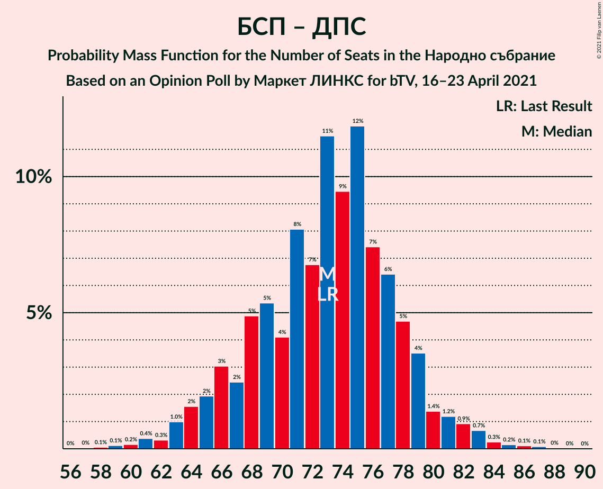

| Number of Seats | Probability | Accumulated | Special Marks |
|:---------------:|:-----------:|:-----------:|:-------------:|
| 57 | 0% | 100% |  |
| 58 | 0.1% | 99.9% |  |
| 59 | 0.1% | 99.9% |  |
| 60 | 0.2% | 99.7% |  |
| 61 | 0.4% | 99.6% |  |
| 62 | 0.3% | 99.2% |  |
| 63 | 1.0% | 98.9% |  |
| 64 | 2% | 98% |  |
| 65 | 2% | 96% |  |
| 66 | 3% | 94% |  |
| 67 | 2% | 91% |  |
| 68 | 5% | 89% |  |
| 69 | 5% | 84% |  |
| 70 | 4% | 79% |  |
| 71 | 8% | 75% |  |
| 72 | 7% | 66% |  |
| 73 | 11% | 60% | Last Result, Median |
| 74 | 9% | 48% |  |
| 75 | 12% | 39% |  |
| 76 | 7% | 27% |  |
| 77 | 6% | 19% |  |
| 78 | 5% | 13% |  |
| 79 | 4% | 8% |  |
| 80 | 1.4% | 5% |  |
| 81 | 1.2% | 3% |  |
| 82 | 0.9% | 2% |  |
| 83 | 0.7% | 1.3% |  |
| 84 | 0.3% | 0.7% |  |
| 85 | 0.2% | 0.4% |  |
| 86 | 0.1% | 0.3% |  |
| 87 | 0.1% | 0.1% |  |
| 88 | 0% | 0.1% |  |
| 89 | 0% | 0% |  |

### Граждани за европейско развитие на България – Обединени Патриоти

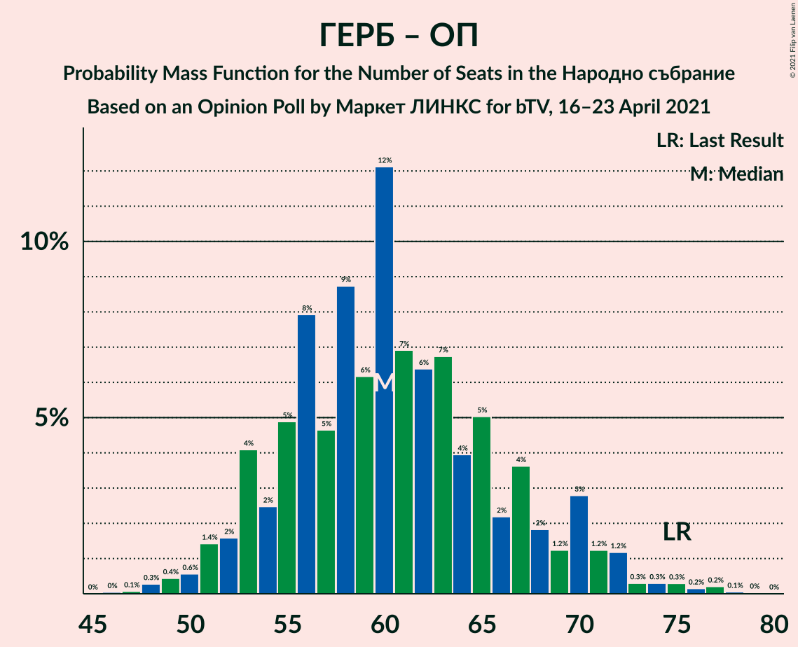

| Number of Seats | Probability | Accumulated | Special Marks |
|:---------------:|:-----------:|:-----------:|:-------------:|
| 46 | 0% | 100% |  |
| 47 | 0.1% | 99.9% |  |
| 48 | 0.3% | 99.9% |  |
| 49 | 0.4% | 99.6% |  |
| 50 | 0.6% | 99.1% |  |
| 51 | 1.4% | 98.6% |  |
| 52 | 2% | 97% |  |
| 53 | 4% | 96% |  |
| 54 | 2% | 91% |  |
| 55 | 5% | 89% |  |
| 56 | 8% | 84% |  |
| 57 | 5% | 76% |  |
| 58 | 9% | 72% |  |
| 59 | 6% | 63% | Median |
| 60 | 12% | 57% |  |
| 61 | 7% | 44% |  |
| 62 | 6% | 38% |  |
| 63 | 7% | 31% |  |
| 64 | 4% | 24% |  |
| 65 | 5% | 21% |  |
| 66 | 2% | 15% |  |
| 67 | 4% | 13% |  |
| 68 | 2% | 10% |  |
| 69 | 1.2% | 8% |  |
| 70 | 3% | 7% |  |
| 71 | 1.2% | 4% |  |
| 72 | 1.2% | 3% |  |
| 73 | 0.3% | 1.4% |  |
| 74 | 0.3% | 1.1% |  |
| 75 | 0.3% | 0.8% | Last Result |
| 76 | 0.2% | 0.5% |  |
| 77 | 0.2% | 0.3% |  |
| 78 | 0.1% | 0.1% |  |
| 79 | 0% | 0.1% |  |
| 80 | 0% | 0% |  |

## Technical Information

### Opinion Poll

+ **Polling firm:** Маркет ЛИНКС
+ **Commissioner(s):** bTV
+ **Fieldwork period:** 16–23 April 2021

### Calculations

+ **Sample size:** 632
+ **Simulations done:** 1,048,576
+ **Error estimate:** 1.45%

