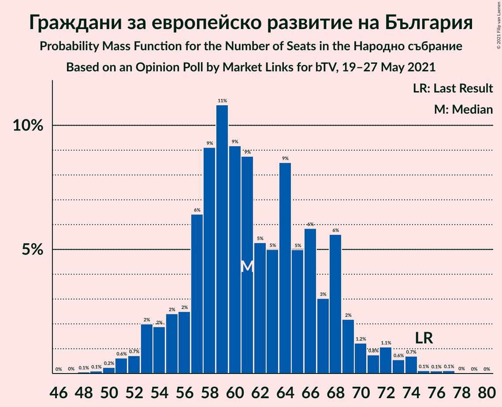
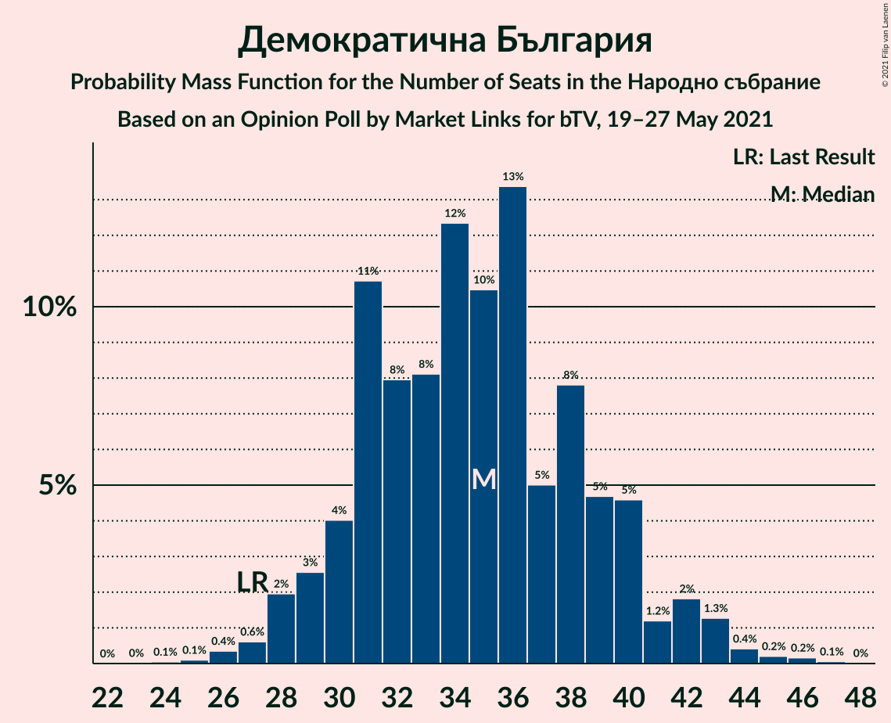
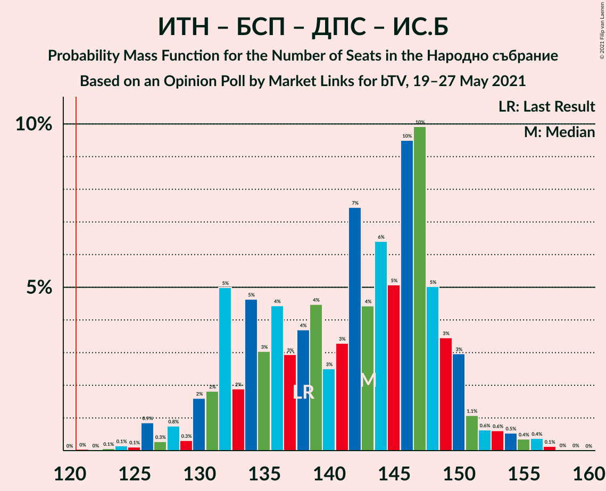
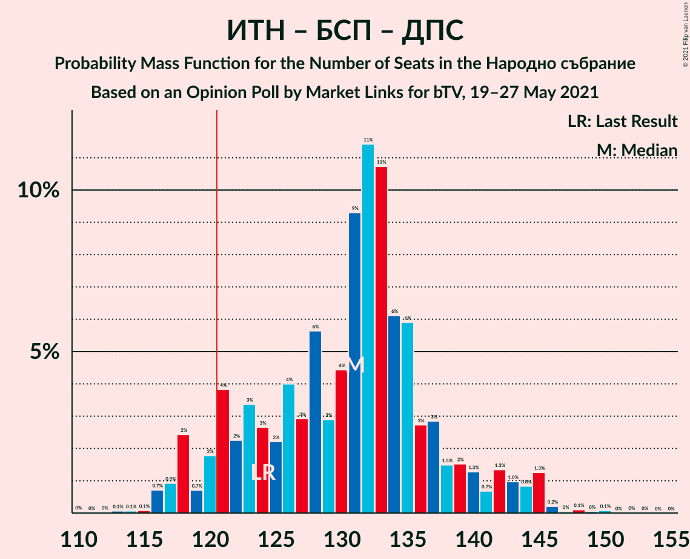
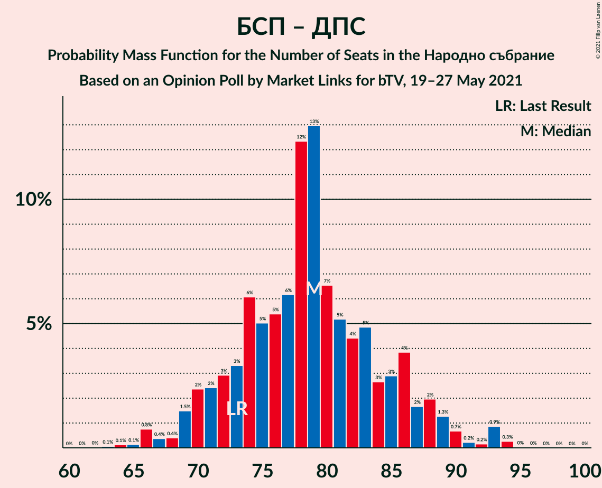

# Opinion Poll by Market Links for bTV, 19–27 May 2021

<a href="#voting-intentions">Voting Intentions</a> | <a href="#seats">Seats</a> | <a href="#coalitions">Coalitions</a> | <a href="#technical-information">Technical Information</a>

## Voting Intentions

### Confidence Intervals

| Party | Last Result | Poll Result | 80% Confidence Interval | 90% Confidence Interval | 95% Confidence Interval | 99% Confidence Interval |
|:-----:|:-----------:|:-----------:|:-----------------------:|:-----------------------:|:-----------------------:|:-----------------------:|
| Граждани за европейско развитие на България | 25.8% | 23.7% | 21.6–25.9% |21.1–26.5% |20.6–27.0% |19.7–28.1% |
| Има такъв народ | 17.4% | 19.8% | 17.9–21.9% |17.4–22.5% |16.9–23.0% |16.1–24.0% |
| Българска социалистическа партия | 14.8% | 19.3% | 17.5–21.4% |17.0–22.0% |16.5–22.5% |15.7–23.5% |
| Демократична България | 9.3% | 13.2% | 11.7–15.1% |11.2–15.6% |10.9–16.0% |10.2–16.9% |
| Движение за права и свободи | 10.4% | 10.6% | 9.2–12.2% |8.8–12.7% |8.5–13.1% |7.8–14.0% |
| Изправи се Бг | 4.6% | 4.8% | 3.9–6.0% |3.6–6.3% |3.4–6.7% |3.0–7.3% |
| Обединени Патриоти | 0.0% | 3.3% | 2.5–4.3% |2.3–4.6% |2.2–4.9% |1.9–5.5% |
| Възраждане | 2.4% | 1.9% | 1.4–2.8% |1.2–3.1% |1.1–3.3% |0.9–3.8% |
| Воля–Национален фронт за спасение на България | 2.3% | 1.3% | 0.9–2.1% |0.8–2.3% |0.7–2.5% |0.5–3.0% |

*Note:* The poll result column reflects the actual value used in the calculations. Published results may vary slightly, and in addition be rounded to fewer digits.

## Seats

### Confidence Intervals

| Party | Last Result | Median | 80% Confidence Interval | 90% Confidence Interval | 95% Confidence Interval | 99% Confidence Interval |
|:-----:|:-----------:|:------:|:-----------------------:|:-----------------------:|:-----------------------:|:-----------------------:|
| <a href="#граждани-за-европейско-развитие-на-българия">Граждани за европейско развитие на България</a> | 75 | 61 | 55–67 |53–71 |53–73 |52–73 |
| <a href="#има-такъв-народ">Има такъв народ</a> | 51 | 52 | 48–57 |47–59 |45–60 |41–63 |
| <a href="#българска-социалистическа-партия">Българска социалистическа партия</a> | 43 | 52 | 46–56 |45–58 |43–58 |41–62 |
| <a href="#демократична-българия">Демократична България</a> | 27 | 33 | 30–39 |30–41 |29–43 |27–44 |
| <a href="#движение-за-права-и-свободи">Движение за права и свободи</a> | 30 | 28 | 25–33 |24–33 |22–33 |21–37 |
| <a href="#изправи-се-бг">Изправи се Бг</a> | 14 | 13 | 0–15 |0–16 |0–17 |0–18 |
| <a href="#обединени-патриоти">Обединени Патриоти</a> | 0 | 0 | 0–10 |0–12 |0–12 |0–13 |
| <a href="#възраждане">Възраждане</a> | 0 | 0 | 0 |0 |0 |0 |
| <a href="#воля–национален-фронт-за-спасение-на-българия">Воля–Национален фронт за спасение на България</a> | 0 | 0 | 0 |0 |0 |0 |

### Граждани за европейско развитие на България

*For a full overview of the results for this party, see the [Граждани за европейско развитие на България](party-гражданизаевропейскоразвитиенабългария.html) page.*

| Number of Seats | Probability | Accumulated | Special Marks |
|:---------------:|:-----------:|:-----------:|:-------------:|
| 49 | 0% | 100% |  |
| 50 | 0.2% | 99.9% |  |
| 51 | 0.2% | 99.8% |  |
| 52 | 0.6% | 99.6% |  |
| 53 | 7% | 99.0% |  |
| 54 | 0.8% | 92% |  |
| 55 | 5% | 91% |  |
| 56 | 4% | 86% |  |
| 57 | 13% | 83% |  |
| 58 | 2% | 69% |  |
| 59 | 4% | 68% |  |
| 60 | 12% | 64% |  |
| 61 | 15% | 52% | Median |
| 62 | 2% | 37% |  |
| 63 | 3% | 35% |  |
| 64 | 5% | 33% |  |
| 65 | 4% | 27% |  |
| 66 | 12% | 24% |  |
| 67 | 4% | 12% |  |
| 68 | 1.2% | 8% |  |
| 69 | 0.2% | 7% |  |
| 70 | 0.8% | 7% |  |
| 71 | 2% | 6% |  |
| 72 | 0.7% | 4% |  |
| 73 | 2% | 3% |  |
| 74 | 0.2% | 0.4% |  |
| 75 | 0% | 0.2% | Last Result |
| 76 | 0% | 0.1% |  |
| 77 | 0% | 0.1% |  |
| 78 | 0% | 0.1% |  |
| 79 | 0.1% | 0.1% |  |
| 80 | 0% | 0% |  |

### Има такъв народ

*For a full overview of the results for this party, see the [Има такъв народ](party-иматакъвнарод.html) page.*

| Number of Seats | Probability | Accumulated | Special Marks |
|:---------------:|:-----------:|:-----------:|:-------------:|
| 40 | 0.1% | 100% |  |
| 41 | 0.4% | 99.9% |  |
| 42 | 0.3% | 99.4% |  |
| 43 | 0.7% | 99.2% |  |
| 44 | 0.6% | 98% |  |
| 45 | 1.1% | 98% |  |
| 46 | 1.4% | 97% |  |
| 47 | 2% | 95% |  |
| 48 | 9% | 93% |  |
| 49 | 15% | 85% |  |
| 50 | 4% | 69% |  |
| 51 | 8% | 65% | Last Result |
| 52 | 13% | 58% | Median |
| 53 | 4% | 44% |  |
| 54 | 6% | 41% |  |
| 55 | 8% | 34% |  |
| 56 | 4% | 26% |  |
| 57 | 16% | 23% |  |
| 58 | 2% | 7% |  |
| 59 | 0.2% | 5% |  |
| 60 | 4% | 5% |  |
| 61 | 0.2% | 1.1% |  |
| 62 | 0.2% | 0.9% |  |
| 63 | 0.5% | 0.6% |  |
| 64 | 0% | 0.1% |  |
| 65 | 0% | 0.1% |  |
| 66 | 0% | 0.1% |  |
| 67 | 0% | 0% |  |

### Българска социалистическа партия

*For a full overview of the results for this party, see the [Българска социалистическа партия](party-българскасоциалистическапартия.html) page.*

| Number of Seats | Probability | Accumulated | Special Marks |
|:---------------:|:-----------:|:-----------:|:-------------:|
| 38 | 0.1% | 100% |  |
| 39 | 0% | 99.9% |  |
| 40 | 0.1% | 99.8% |  |
| 41 | 0.4% | 99.7% |  |
| 42 | 2% | 99.3% |  |
| 43 | 0.4% | 98% | Last Result |
| 44 | 0.8% | 97% |  |
| 45 | 2% | 96% |  |
| 46 | 8% | 95% |  |
| 47 | 5% | 87% |  |
| 48 | 3% | 82% |  |
| 49 | 12% | 79% |  |
| 50 | 13% | 67% |  |
| 51 | 0.6% | 54% |  |
| 52 | 10% | 53% | Median |
| 53 | 15% | 43% |  |
| 54 | 7% | 28% |  |
| 55 | 10% | 21% |  |
| 56 | 6% | 11% |  |
| 57 | 0.7% | 6% |  |
| 58 | 3% | 5% |  |
| 59 | 0.3% | 2% |  |
| 60 | 0.2% | 1.3% |  |
| 61 | 0.1% | 1.0% |  |
| 62 | 0.9% | 1.0% |  |
| 63 | 0% | 0.1% |  |
| 64 | 0% | 0.1% |  |
| 65 | 0% | 0.1% |  |
| 66 | 0% | 0% |  |

### Демократична България

*For a full overview of the results for this party, see the [Демократична България](party-демократичнабългария.html) page.*

| Number of Seats | Probability | Accumulated | Special Marks |
|:---------------:|:-----------:|:-----------:|:-------------:|
| 24 | 0% | 100% |  |
| 25 | 0.1% | 99.9% |  |
| 26 | 0.2% | 99.9% |  |
| 27 | 0.5% | 99.7% | Last Result |
| 28 | 1.4% | 99.2% |  |
| 29 | 2% | 98% |  |
| 30 | 10% | 96% |  |
| 31 | 21% | 85% |  |
| 32 | 8% | 64% |  |
| 33 | 6% | 56% | Median |
| 34 | 3% | 49% |  |
| 35 | 9% | 46% |  |
| 36 | 12% | 37% |  |
| 37 | 1.4% | 25% |  |
| 38 | 8% | 24% |  |
| 39 | 8% | 16% |  |
| 40 | 3% | 8% |  |
| 41 | 0.6% | 5% |  |
| 42 | 0.3% | 4% |  |
| 43 | 2% | 4% |  |
| 44 | 1.4% | 2% |  |
| 45 | 0.1% | 0.3% |  |
| 46 | 0% | 0.1% |  |
| 47 | 0% | 0.1% |  |
| 48 | 0% | 0% |  |

### Движение за права и свободи

*For a full overview of the results for this party, see the [Движение за права и свободи](party-движениезаправаисвободи.html) page.*

| Number of Seats | Probability | Accumulated | Special Marks |
|:---------------:|:-----------:|:-----------:|:-------------:|
| 19 | 0.1% | 100% |  |
| 20 | 0.2% | 99.9% |  |
| 21 | 0.4% | 99.7% |  |
| 22 | 2% | 99.3% |  |
| 23 | 2% | 97% |  |
| 24 | 4% | 95% |  |
| 25 | 19% | 91% |  |
| 26 | 5% | 72% |  |
| 27 | 15% | 67% |  |
| 28 | 7% | 52% | Median |
| 29 | 6% | 45% |  |
| 30 | 2% | 39% | Last Result |
| 31 | 10% | 37% |  |
| 32 | 3% | 27% |  |
| 33 | 22% | 24% |  |
| 34 | 0.4% | 2% |  |
| 35 | 0.6% | 2% |  |
| 36 | 0.3% | 1.0% |  |
| 37 | 0.5% | 0.7% |  |
| 38 | 0.1% | 0.1% |  |
| 39 | 0% | 0% |  |

### Изправи се Бг

*For a full overview of the results for this party, see the [Изправи се Бг](party-изправисебг.html) page.*

| Number of Seats | Probability | Accumulated | Special Marks |
|:---------------:|:-----------:|:-----------:|:-------------:|
| 0 | 16% | 100% |  |
| 1 | 0% | 84% |  |
| 2 | 0% | 84% |  |
| 3 | 0% | 84% |  |
| 4 | 0% | 84% |  |
| 5 | 0% | 84% |  |
| 6 | 0% | 84% |  |
| 7 | 0% | 84% |  |
| 8 | 0% | 84% |  |
| 9 | 0% | 84% |  |
| 10 | 0.3% | 84% |  |
| 11 | 9% | 83% |  |
| 12 | 10% | 74% |  |
| 13 | 35% | 64% | Median |
| 14 | 3% | 29% | Last Result |
| 15 | 20% | 26% |  |
| 16 | 2% | 6% |  |
| 17 | 3% | 4% |  |
| 18 | 0.6% | 1.0% |  |
| 19 | 0.2% | 0.4% |  |
| 20 | 0.2% | 0.2% |  |
| 21 | 0% | 0% |  |

### Обединени Патриоти

*For a full overview of the results for this party, see the [Обединени Патриоти](party-обединенипатриоти.html) page.*

| Number of Seats | Probability | Accumulated | Special Marks |
|:---------------:|:-----------:|:-----------:|:-------------:|
| 0 | 89% | 100% | Last Result, Median |
| 1 | 0% | 11% |  |
| 2 | 0% | 11% |  |
| 3 | 0% | 11% |  |
| 4 | 0% | 11% |  |
| 5 | 0% | 11% |  |
| 6 | 0% | 11% |  |
| 7 | 0% | 11% |  |
| 8 | 0% | 11% |  |
| 9 | 0% | 11% |  |
| 10 | 1.2% | 11% |  |
| 11 | 3% | 10% |  |
| 12 | 6% | 7% |  |
| 13 | 0.6% | 1.1% |  |
| 14 | 0.4% | 0.5% |  |
| 15 | 0.1% | 0.1% |  |
| 16 | 0% | 0% |  |

### Възраждане

*For a full overview of the results for this party, see the [Възраждане](party-възраждане.html) page.*

| Number of Seats | Probability | Accumulated | Special Marks |
|:---------------:|:-----------:|:-----------:|:-------------:|
| 0 | 99.9% | 100% | Last Result, Median |
| 1 | 0% | 0.1% |  |
| 2 | 0% | 0.1% |  |
| 3 | 0% | 0.1% |  |
| 4 | 0% | 0.1% |  |
| 5 | 0% | 0.1% |  |
| 6 | 0% | 0.1% |  |
| 7 | 0% | 0.1% |  |
| 8 | 0% | 0.1% |  |
| 9 | 0% | 0.1% |  |
| 10 | 0.1% | 0.1% |  |
| 11 | 0% | 0.1% |  |
| 12 | 0% | 0% |  |

### Воля–Национален фронт за спасение на България

*For a full overview of the results for this party, see the [Воля–Национален фронт за спасение на България](party-воля–националенфронтзаспасениенабългария.html) page.*

| Number of Seats | Probability | Accumulated | Special Marks |
|:---------------:|:-----------:|:-----------:|:-------------:|
| 0 | 100% | 100% | Last Result, Median |

## Coalitions

### Confidence Intervals

| Coalition | Last Result | Median | Majority? | 80% Confidence Interval | 90% Confidence Interval | 95% Confidence Interval | 99% Confidence Interval |
|:---------:|:-----------:|:------:|:---------:|:-----------------------:|:-----------------------:|:-----------------------:|:-----------------------:|
| Има такъв народ – Българска социалистическа партия – Движение за права и свободи – Изправи се Бг | 138 | 146 | 100% | 134–150 | 131–150 | 127–151 | 126–154 |
| Има такъв народ – Българска социалистическа партия – Движение за права и свободи | 124 | 134 | 97% | 122–140 | 121–142 | 119–143 | 117–145 |
| Българска социалистическа партия – Движение за права и свободи – Изправи се Бг | 87 | 92 | 0% | 84–99 | 81–99 | 74–99 | 71–102 |
| Българска социалистическа партия – Движение за права и свободи | 73 | 80 | 0% | 74–86 | 71–87 | 70–89 | 66–91 |
| Граждани за европейско развитие на България – Обединени Патриоти | 75 | 61 | 0% | 55–71 | 53–73 | 53–75 | 53–78 |

### Има такъв народ – Българска социалистическа партия – Движение за права и свободи – Изправи се Бг

| Number of Seats | Probability | Accumulated | Special Marks |
|:---------------:|:-----------:|:-----------:|:-------------:|
| 123 | 0% | 100% |  |
| 124 | 0% | 99.9% |  |
| 125 | 0% | 99.9% |  |
| 126 | 2% | 99.8% |  |
| 127 | 0.1% | 98% |  |
| 128 | 0.2% | 97% |  |
| 129 | 0.2% | 97% |  |
| 130 | 0.8% | 97% |  |
| 131 | 2% | 96% |  |
| 132 | 2% | 95% |  |
| 133 | 0.7% | 92% |  |
| 134 | 3% | 92% |  |
| 135 | 8% | 89% |  |
| 136 | 3% | 81% |  |
| 137 | 0.7% | 78% |  |
| 138 | 4% | 78% | Last Result |
| 139 | 2% | 74% |  |
| 140 | 1.2% | 72% |  |
| 141 | 3% | 71% |  |
| 142 | 6% | 68% |  |
| 143 | 2% | 62% |  |
| 144 | 1.4% | 61% |  |
| 145 | 9% | 59% | Median |
| 146 | 1.3% | 51% |  |
| 147 | 8% | 49% |  |
| 148 | 16% | 41% |  |
| 149 | 10% | 25% |  |
| 150 | 11% | 15% |  |
| 151 | 3% | 5% |  |
| 152 | 0.4% | 2% |  |
| 153 | 0.2% | 1.5% |  |
| 154 | 1.0% | 1.3% |  |
| 155 | 0% | 0.3% |  |
| 156 | 0.2% | 0.2% |  |
| 157 | 0% | 0.1% |  |
| 158 | 0% | 0% |  |

### Има такъв народ – Българска социалистическа партия – Движение за права и свободи

| Number of Seats | Probability | Accumulated | Special Marks |
|:---------------:|:-----------:|:-----------:|:-------------:|
| 111 | 0% | 100% |  |
| 112 | 0% | 99.9% |  |
| 113 | 0% | 99.9% |  |
| 114 | 0.1% | 99.9% |  |
| 115 | 0.1% | 99.8% |  |
| 116 | 0.2% | 99.8% |  |
| 117 | 0.5% | 99.6% |  |
| 118 | 0.2% | 99.1% |  |
| 119 | 2% | 98.9% |  |
| 120 | 0.1% | 97% |  |
| 121 | 4% | 97% | Majority |
| 122 | 6% | 93% |  |
| 123 | 1.1% | 87% |  |
| 124 | 2% | 86% | Last Result |
| 125 | 4% | 83% |  |
| 126 | 4% | 79% |  |
| 127 | 1.2% | 75% |  |
| 128 | 2% | 74% |  |
| 129 | 0.5% | 72% |  |
| 130 | 5% | 71% |  |
| 131 | 3% | 66% |  |
| 132 | 2% | 64% | Median |
| 133 | 1.1% | 62% |  |
| 134 | 11% | 61% |  |
| 135 | 25% | 50% |  |
| 136 | 1.4% | 25% |  |
| 137 | 11% | 24% |  |
| 138 | 0.3% | 13% |  |
| 139 | 0.7% | 13% |  |
| 140 | 2% | 12% |  |
| 141 | 2% | 10% |  |
| 142 | 5% | 7% |  |
| 143 | 1.0% | 3% |  |
| 144 | 0.6% | 2% |  |
| 145 | 1.1% | 1.3% |  |
| 146 | 0% | 0.2% |  |
| 147 | 0.1% | 0.2% |  |
| 148 | 0% | 0.1% |  |
| 149 | 0% | 0.1% |  |
| 150 | 0% | 0% |  |

### Българска социалистическа партия – Движение за права и свободи – Изправи се Бг

| Number of Seats | Probability | Accumulated | Special Marks |
|:---------------:|:-----------:|:-----------:|:-------------:|
| 71 | 0.8% | 100% |  |
| 72 | 0% | 99.2% |  |
| 73 | 0% | 99.2% |  |
| 74 | 2% | 99.2% |  |
| 75 | 0.3% | 97% |  |
| 76 | 0% | 97% |  |
| 77 | 0.1% | 97% |  |
| 78 | 0.9% | 96% |  |
| 79 | 0.2% | 96% |  |
| 80 | 0.2% | 95% |  |
| 81 | 0.7% | 95% |  |
| 82 | 1.1% | 94% |  |
| 83 | 3% | 93% |  |
| 84 | 2% | 91% |  |
| 85 | 8% | 88% |  |
| 86 | 1.5% | 80% |  |
| 87 | 11% | 78% | Last Result |
| 88 | 3% | 68% |  |
| 89 | 3% | 64% |  |
| 90 | 2% | 61% |  |
| 91 | 6% | 59% |  |
| 92 | 6% | 54% |  |
| 93 | 8% | 48% | Median |
| 94 | 7% | 39% |  |
| 95 | 10% | 32% |  |
| 96 | 2% | 22% |  |
| 97 | 2% | 20% |  |
| 98 | 0.6% | 18% |  |
| 99 | 17% | 18% |  |
| 100 | 0.5% | 1.2% |  |
| 101 | 0.2% | 0.7% |  |
| 102 | 0.1% | 0.6% |  |
| 103 | 0.2% | 0.5% |  |
| 104 | 0.1% | 0.3% |  |
| 105 | 0.2% | 0.2% |  |
| 106 | 0% | 0.1% |  |
| 107 | 0% | 0% |  |

### Българска социалистическа партия – Движение за права и свободи

| Number of Seats | Probability | Accumulated | Special Marks |
|:---------------:|:-----------:|:-----------:|:-------------:|
| 63 | 0% | 100% |  |
| 64 | 0.3% | 99.9% |  |
| 65 | 0% | 99.6% |  |
| 66 | 0.2% | 99.6% |  |
| 67 | 0.1% | 99.4% |  |
| 68 | 0.5% | 99.3% |  |
| 69 | 0.7% | 98.8% |  |
| 70 | 1.0% | 98% |  |
| 71 | 3% | 97% |  |
| 72 | 3% | 94% |  |
| 73 | 0.9% | 91% | Last Result |
| 74 | 12% | 90% |  |
| 75 | 1.3% | 78% |  |
| 76 | 7% | 77% |  |
| 77 | 7% | 70% |  |
| 78 | 3% | 63% |  |
| 79 | 10% | 60% |  |
| 80 | 9% | 51% | Median |
| 81 | 1.3% | 42% |  |
| 82 | 1.4% | 41% |  |
| 83 | 9% | 39% |  |
| 84 | 5% | 30% |  |
| 85 | 6% | 25% |  |
| 86 | 14% | 19% |  |
| 87 | 2% | 5% |  |
| 88 | 0.3% | 3% |  |
| 89 | 2% | 3% |  |
| 90 | 0.6% | 1.2% |  |
| 91 | 0.2% | 0.6% |  |
| 92 | 0.1% | 0.4% |  |
| 93 | 0% | 0.3% |  |
| 94 | 0.2% | 0.3% |  |
| 95 | 0% | 0% |  |

### Граждани за европейско развитие на България – Обединени Патриоти

| Number of Seats | Probability | Accumulated | Special Marks |
|:---------------:|:-----------:|:-----------:|:-------------:|
| 50 | 0.1% | 100% |  |
| 51 | 0.1% | 99.9% |  |
| 52 | 0.1% | 99.8% |  |
| 53 | 7% | 99.8% |  |
| 54 | 0.7% | 93% |  |
| 55 | 4% | 92% |  |
| 56 | 2% | 88% |  |
| 57 | 13% | 86% |  |
| 58 | 1.3% | 73% |  |
| 59 | 2% | 72% |  |
| 60 | 12% | 70% |  |
| 61 | 14% | 59% | Median |
| 62 | 2% | 44% |  |
| 63 | 0.8% | 43% |  |
| 64 | 5% | 42% |  |
| 65 | 4% | 37% |  |
| 66 | 12% | 33% |  |
| 67 | 4% | 21% |  |
| 68 | 2% | 16% |  |
| 69 | 0.5% | 14% |  |
| 70 | 2% | 14% |  |
| 71 | 4% | 12% |  |
| 72 | 0.8% | 8% |  |
| 73 | 3% | 7% |  |
| 74 | 0.9% | 4% |  |
| 75 | 2% | 3% | Last Result |
| 76 | 0.4% | 1.4% |  |
| 77 | 0.4% | 1.0% |  |
| 78 | 0.4% | 0.6% |  |
| 79 | 0.1% | 0.2% |  |
| 80 | 0% | 0.1% |  |
| 81 | 0% | 0.1% |  |
| 82 | 0.1% | 0.1% |  |
| 83 | 0% | 0% |  |

## Technical Information

### Opinion Poll

+ **Polling firm:** Market Links
+ **Commissioner(s):** bTV
+ **Fieldwork period:** 19–27 May 2021

### Calculations

+ **Sample size:** 672
+ **Simulations done:** 131,072
+ **Error estimate:** 1.92%

