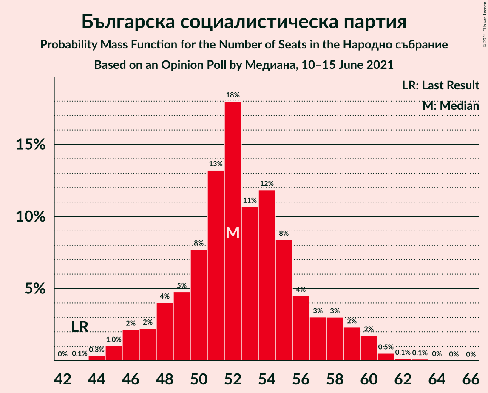
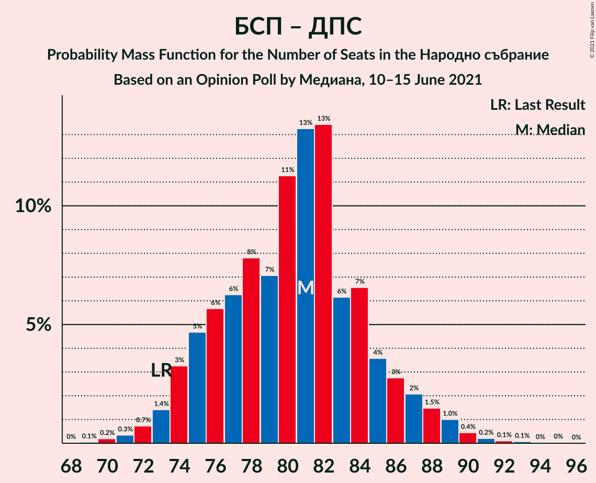

# Opinion Poll by Медиана, 10–15 June 2021

<a href="#voting-intentions">Voting Intentions</a> | <a href="#seats">Seats</a> | <a href="#coalitions">Coalitions</a> | <a href="#technical-information">Technical Information</a>

## Voting Intentions

### Confidence Intervals

| Party | Last Result | Poll Result | 80% Confidence Interval | 90% Confidence Interval | 95% Confidence Interval | 99% Confidence Interval |
|:-----:|:-----------:|:-----------:|:-----------------------:|:-----------------------:|:-----------------------:|:-----------------------:|
| Има такъв народ | 17.4% | 24.0% | 22.3–25.8% |21.9–26.3% |21.5–26.7% |20.7–27.6% |
| Граждани за европейско развитие на България | 25.8% | 21.4% | 19.8–23.2% |19.4–23.7% |19.0–24.1% |18.3–24.9% |
| Българска социалистическа партия | 14.8% | 21.3% | 19.7–23.1% |19.3–23.5% |18.9–24.0% |18.2–24.8% |
| Движение за права и свободи | 10.4% | 11.2% | 10.0–12.6% |9.7–13.0% |9.4–13.3% |8.9–14.0% |
| Демократична България | 9.3% | 7.2% | 6.3–8.4% |6.0–8.7% |5.8–9.0% |5.4–9.6% |
| Изправи се Бг | 4.6% | 6.9% | 6.0–8.1% |5.7–8.4% |5.5–8.7% |5.1–9.3% |
| Българските патриоти | 0.0% | 5.1% | 4.3–6.1% |4.1–6.3% |3.9–6.6% |3.5–7.1% |
| Възраждане | 2.4% | 1.5% | 1.1–2.1% |1.0–2.3% |0.9–2.5% |0.7–2.8% |

*Note:* The poll result column reflects the actual value used in the calculations. Published results may vary slightly, and in addition be rounded to fewer digits.

## Seats

### Confidence Intervals

| Party | Last Result | Median | 80% Confidence Interval | 90% Confidence Interval | 95% Confidence Interval | 99% Confidence Interval |
|:-----:|:-----------:|:------:|:-----------------------:|:-----------------------:|:-----------------------:|:-----------------------:|
| <a href="#има-такъв-народ">Има такъв народ</a> | 51 | 59 | 55–63 |54–65 |53–66 |51–68 |
| <a href="#граждани-за-европейско-развитие-на-българия">Граждани за европейско развитие на България</a> | 75 | 53 | 49–57 |48–58 |47–59 |45–62 |
| <a href="#българска-социалистическа-партия">Българска социалистическа партия</a> | 43 | 52 | 49–57 |47–58 |46–60 |45–61 |
| <a href="#движение-за-права-и-свободи">Движение за права и свободи</a> | 30 | 28 | 24–31 |24–32 |23–33 |22–35 |
| <a href="#демократична-българия">Демократична България</a> | 27 | 18 | 15–21 |15–22 |14–22 |13–24 |
| <a href="#изправи-се-бг">Изправи се Бг</a> | 14 | 17 | 15–20 |14–21 |14–21 |13–23 |
| <a href="#българските-патриоти">Българските патриоти</a> | 0 | 13 | 11–15 |10–16 |0–16 |0–18 |
| <a href="#възраждане">Възраждане</a> | 0 | 0 | 0 |0 |0 |0 |

### Има такъв народ

*For a full overview of the results for this party, see the [Има такъв народ](party-иматакъвнарод.html) page.*

| Number of Seats | Probability | Accumulated | Special Marks |
|:---------------:|:-----------:|:-----------:|:-------------:|
| 49 | 0.1% | 100% |  |
| 50 | 0.2% | 99.9% |  |
| 51 | 0.8% | 99.6% | Last Result |
| 52 | 1.2% | 98.8% |  |
| 53 | 2% | 98% |  |
| 54 | 4% | 96% |  |
| 55 | 6% | 93% |  |
| 56 | 7% | 86% |  |
| 57 | 12% | 79% |  |
| 58 | 9% | 68% |  |
| 59 | 10% | 58% | Median |
| 60 | 9% | 48% |  |
| 61 | 14% | 39% |  |
| 62 | 9% | 25% |  |
| 63 | 6% | 15% |  |
| 64 | 3% | 10% |  |
| 65 | 3% | 7% |  |
| 66 | 2% | 4% |  |
| 67 | 1.2% | 2% |  |
| 68 | 0.3% | 0.7% |  |
| 69 | 0.2% | 0.4% |  |
| 70 | 0.2% | 0.2% |  |
| 71 | 0% | 0.1% |  |
| 72 | 0% | 0% |  |

### Граждани за европейско развитие на България

*For a full overview of the results for this party, see the [Граждани за европейско развитие на България](party-гражданизаевропейскоразвитиенабългария.html) page.*

| Number of Seats | Probability | Accumulated | Special Marks |
|:---------------:|:-----------:|:-----------:|:-------------:|
| 43 | 0.1% | 100% |  |
| 44 | 0.3% | 99.9% |  |
| 45 | 0.6% | 99.6% |  |
| 46 | 1.1% | 99.1% |  |
| 47 | 2% | 98% |  |
| 48 | 4% | 95% |  |
| 49 | 9% | 91% |  |
| 50 | 7% | 83% |  |
| 51 | 11% | 76% |  |
| 52 | 11% | 65% |  |
| 53 | 13% | 54% | Median |
| 54 | 12% | 41% |  |
| 55 | 8% | 30% |  |
| 56 | 8% | 22% |  |
| 57 | 6% | 14% |  |
| 58 | 4% | 8% |  |
| 59 | 3% | 5% |  |
| 60 | 1.0% | 2% |  |
| 61 | 0.6% | 1.1% |  |
| 62 | 0.3% | 0.5% |  |
| 63 | 0.1% | 0.2% |  |
| 64 | 0.1% | 0.1% |  |
| 65 | 0% | 0.1% |  |
| 66 | 0% | 0% |  |
| 67 | 0% | 0% |  |
| 68 | 0% | 0% |  |
| 69 | 0% | 0% |  |
| 70 | 0% | 0% |  |
| 71 | 0% | 0% |  |
| 72 | 0% | 0% |  |
| 73 | 0% | 0% |  |
| 74 | 0% | 0% |  |
| 75 | 0% | 0% | Last Result |

### Българска социалистическа партия

*For a full overview of the results for this party, see the [Българска социалистическа партия](party-българскасоциалистическапартия.html) page.*

| Number of Seats | Probability | Accumulated | Special Marks |
|:---------------:|:-----------:|:-----------:|:-------------:|
| 43 | 0.1% | 100% | Last Result |
| 44 | 0.3% | 99.9% |  |
| 45 | 1.0% | 99.6% |  |
| 46 | 2% | 98.5% |  |
| 47 | 2% | 96% |  |
| 48 | 4% | 94% |  |
| 49 | 5% | 90% |  |
| 50 | 8% | 85% |  |
| 51 | 13% | 78% |  |
| 52 | 18% | 64% | Median |
| 53 | 11% | 46% |  |
| 54 | 12% | 36% |  |
| 55 | 8% | 24% |  |
| 56 | 4% | 15% |  |
| 57 | 3% | 11% |  |
| 58 | 3% | 8% |  |
| 59 | 2% | 5% |  |
| 60 | 2% | 3% |  |
| 61 | 0.5% | 0.8% |  |
| 62 | 0.1% | 0.3% |  |
| 63 | 0.1% | 0.2% |  |
| 64 | 0% | 0.1% |  |
| 65 | 0% | 0% |  |

### Движение за права и свободи

*For a full overview of the results for this party, see the [Движение за права и свободи](party-движениезаправаисвободи.html) page.*

| Number of Seats | Probability | Accumulated | Special Marks |
|:---------------:|:-----------:|:-----------:|:-------------:|
| 20 | 0.1% | 100% |  |
| 21 | 0.2% | 99.9% |  |
| 22 | 0.8% | 99.7% |  |
| 23 | 3% | 98.9% |  |
| 24 | 7% | 96% |  |
| 25 | 8% | 90% |  |
| 26 | 10% | 82% |  |
| 27 | 13% | 71% |  |
| 28 | 19% | 58% | Median |
| 29 | 17% | 39% |  |
| 30 | 10% | 22% | Last Result |
| 31 | 5% | 12% |  |
| 32 | 3% | 6% |  |
| 33 | 2% | 3% |  |
| 34 | 0.8% | 1.3% |  |
| 35 | 0.4% | 0.6% |  |
| 36 | 0.1% | 0.2% |  |
| 37 | 0% | 0.1% |  |
| 38 | 0% | 0% |  |

### Демократична България

*For a full overview of the results for this party, see the [Демократична България](party-демократичнабългария.html) page.*

| Number of Seats | Probability | Accumulated | Special Marks |
|:---------------:|:-----------:|:-----------:|:-------------:|
| 12 | 0.1% | 100% |  |
| 13 | 0.7% | 99.9% |  |
| 14 | 3% | 99.2% |  |
| 15 | 8% | 97% |  |
| 16 | 13% | 88% |  |
| 17 | 18% | 75% |  |
| 18 | 16% | 57% | Median |
| 19 | 18% | 41% |  |
| 20 | 11% | 23% |  |
| 21 | 7% | 12% |  |
| 22 | 3% | 5% |  |
| 23 | 1.2% | 2% |  |
| 24 | 0.4% | 0.6% |  |
| 25 | 0.1% | 0.2% |  |
| 26 | 0% | 0% |  |
| 27 | 0% | 0% | Last Result |

### Изправи се Бг

*For a full overview of the results for this party, see the [Изправи се Бг](party-изправисебг.html) page.*

| Number of Seats | Probability | Accumulated | Special Marks |
|:---------------:|:-----------:|:-----------:|:-------------:|
| 11 | 0.1% | 100% |  |
| 12 | 0.3% | 99.9% |  |
| 13 | 2% | 99.6% |  |
| 14 | 5% | 98% | Last Result |
| 15 | 12% | 93% |  |
| 16 | 19% | 81% |  |
| 17 | 20% | 62% | Median |
| 18 | 15% | 42% |  |
| 19 | 13% | 27% |  |
| 20 | 8% | 14% |  |
| 21 | 4% | 6% |  |
| 22 | 1.3% | 2% |  |
| 23 | 0.7% | 0.8% |  |
| 24 | 0.1% | 0.2% |  |
| 25 | 0% | 0.1% |  |
| 26 | 0% | 0% |  |

### Българските патриоти

*For a full overview of the results for this party, see the [Българските патриоти](party-българскитепатриоти.html) page.*

| Number of Seats | Probability | Accumulated | Special Marks |
|:---------------:|:-----------:|:-----------:|:-------------:|
| 0 | 4% | 100% | Last Result |
| 1 | 0% | 96% |  |
| 2 | 0% | 96% |  |
| 3 | 0% | 96% |  |
| 4 | 0% | 96% |  |
| 5 | 0% | 96% |  |
| 6 | 0% | 96% |  |
| 7 | 0% | 96% |  |
| 8 | 0% | 96% |  |
| 9 | 0% | 96% |  |
| 10 | 4% | 96% |  |
| 11 | 17% | 91% |  |
| 12 | 25% | 75% |  |
| 13 | 21% | 50% | Median |
| 14 | 15% | 29% |  |
| 15 | 8% | 14% |  |
| 16 | 4% | 6% |  |
| 17 | 1.4% | 2% |  |
| 18 | 0.5% | 0.6% |  |
| 19 | 0.1% | 0.1% |  |
| 20 | 0% | 0% |  |

### Възраждане

*For a full overview of the results for this party, see the [Възраждане](party-възраждане.html) page.*

| Number of Seats | Probability | Accumulated | Special Marks |
|:---------------:|:-----------:|:-----------:|:-------------:|
| 0 | 100% | 100% | Last Result, Median |

## Coalitions

### Confidence Intervals

| Coalition | Last Result | Median | Majority? | 80% Confidence Interval | 90% Confidence Interval | 95% Confidence Interval | 99% Confidence Interval |
|:---------:|:-----------:|:------:|:---------:|:-----------------------:|:-----------------------:|:-----------------------:|:-----------------------:|
| Има такъв народ – Българска социалистическа партия – Движение за права и свободи – Изправи се Бг | 138 | 157 | 100% | 152–162 | 151–164 | 149–165 | 147–171 |
| Има такъв народ – Българска социалистическа партия – Движение за права и свободи | 124 | 139 | 100% | 134–145 | 133–146 | 132–148 | 129–152 |
| Българска социалистическа партия – Движение за права и свободи – Изправи се Бг | 87 | 97 | 0% | 93–103 | 91–104 | 90–106 | 88–108 |
| Българска социалистическа партия – Движение за права и свободи | 73 | 81 | 0% | 75–85 | 74–87 | 73–88 | 71–90 |

### Има такъв народ – Българска социалистическа партия – Движение за права и свободи – Изправи се Бг

| Number of Seats | Probability | Accumulated | Special Marks |
|:---------------:|:-----------:|:-----------:|:-------------:|
| 138 | 0% | 100% | Last Result |
| 139 | 0% | 100% |  |
| 140 | 0% | 100% |  |
| 141 | 0% | 100% |  |
| 142 | 0% | 100% |  |
| 143 | 0% | 100% |  |
| 144 | 0% | 100% |  |
| 145 | 0.1% | 99.9% |  |
| 146 | 0.3% | 99.8% |  |
| 147 | 0.3% | 99.6% |  |
| 148 | 0.8% | 99.3% |  |
| 149 | 1.2% | 98% |  |
| 150 | 2% | 97% |  |
| 151 | 3% | 95% |  |
| 152 | 6% | 92% |  |
| 153 | 6% | 87% |  |
| 154 | 10% | 81% |  |
| 155 | 10% | 71% |  |
| 156 | 8% | 61% | Median |
| 157 | 8% | 53% |  |
| 158 | 12% | 45% |  |
| 159 | 9% | 33% |  |
| 160 | 8% | 24% |  |
| 161 | 5% | 16% |  |
| 162 | 3% | 11% |  |
| 163 | 2% | 8% |  |
| 164 | 2% | 5% |  |
| 165 | 1.4% | 4% |  |
| 166 | 0.5% | 2% |  |
| 167 | 0.4% | 2% |  |
| 168 | 0.3% | 1.4% |  |
| 169 | 0.4% | 1.1% |  |
| 170 | 0.2% | 0.7% |  |
| 171 | 0.3% | 0.5% |  |
| 172 | 0% | 0.2% |  |
| 173 | 0.1% | 0.1% |  |
| 174 | 0% | 0.1% |  |
| 175 | 0% | 0% |  |

### Има такъв народ – Българска социалистическа партия – Движение за права и свободи

| Number of Seats | Probability | Accumulated | Special Marks |
|:---------------:|:-----------:|:-----------:|:-------------:|
| 124 | 0% | 100% | Last Result |
| 125 | 0% | 100% |  |
| 126 | 0% | 100% |  |
| 127 | 0.1% | 100% |  |
| 128 | 0.2% | 99.9% |  |
| 129 | 0.3% | 99.7% |  |
| 130 | 0.4% | 99.5% |  |
| 131 | 0.9% | 99.1% |  |
| 132 | 1.4% | 98% |  |
| 133 | 3% | 97% |  |
| 134 | 4% | 93% |  |
| 135 | 6% | 90% |  |
| 136 | 6% | 83% |  |
| 137 | 7% | 77% |  |
| 138 | 10% | 70% |  |
| 139 | 10% | 60% | Median |
| 140 | 10% | 50% |  |
| 141 | 8% | 40% |  |
| 142 | 7% | 32% |  |
| 143 | 7% | 24% |  |
| 144 | 6% | 17% |  |
| 145 | 3% | 11% |  |
| 146 | 3% | 8% |  |
| 147 | 1.4% | 5% |  |
| 148 | 1.4% | 3% |  |
| 149 | 0.6% | 2% |  |
| 150 | 0.4% | 1.4% |  |
| 151 | 0.5% | 1.1% |  |
| 152 | 0.3% | 0.6% |  |
| 153 | 0% | 0.2% |  |
| 154 | 0.1% | 0.2% |  |
| 155 | 0.1% | 0.1% |  |
| 156 | 0% | 0.1% |  |
| 157 | 0.1% | 0.1% |  |
| 158 | 0% | 0% |  |

### Българска социалистическа партия – Движение за права и свободи – Изправи се Бг

| Number of Seats | Probability | Accumulated | Special Marks |
|:---------------:|:-----------:|:-----------:|:-------------:|
| 85 | 0% | 100% |  |
| 86 | 0.1% | 99.9% |  |
| 87 | 0.2% | 99.8% | Last Result |
| 88 | 0.4% | 99.6% |  |
| 89 | 1.2% | 99.2% |  |
| 90 | 0.6% | 98% |  |
| 91 | 3% | 97% |  |
| 92 | 3% | 94% |  |
| 93 | 6% | 91% |  |
| 94 | 4% | 85% |  |
| 95 | 8% | 81% |  |
| 96 | 11% | 73% |  |
| 97 | 13% | 62% | Median |
| 98 | 9% | 49% |  |
| 99 | 12% | 40% |  |
| 100 | 6% | 28% |  |
| 101 | 8% | 22% |  |
| 102 | 3% | 14% |  |
| 103 | 4% | 11% |  |
| 104 | 3% | 7% |  |
| 105 | 2% | 4% |  |
| 106 | 0.9% | 3% |  |
| 107 | 1.0% | 2% |  |
| 108 | 0.4% | 0.8% |  |
| 109 | 0.2% | 0.5% |  |
| 110 | 0.1% | 0.3% |  |
| 111 | 0.1% | 0.2% |  |
| 112 | 0.1% | 0.1% |  |
| 113 | 0% | 0.1% |  |
| 114 | 0% | 0% |  |

### Българска социалистическа партия – Движение за права и свободи

| Number of Seats | Probability | Accumulated | Special Marks |
|:---------------:|:-----------:|:-----------:|:-------------:|
| 69 | 0.1% | 100% |  |
| 70 | 0.2% | 99.9% |  |
| 71 | 0.3% | 99.7% |  |
| 72 | 0.7% | 99.4% |  |
| 73 | 1.4% | 98.6% | Last Result |
| 74 | 3% | 97% |  |
| 75 | 5% | 94% |  |
| 76 | 6% | 89% |  |
| 77 | 6% | 84% |  |
| 78 | 8% | 77% |  |
| 79 | 7% | 70% |  |
| 80 | 11% | 62% | Median |
| 81 | 13% | 51% |  |
| 82 | 13% | 38% |  |
| 83 | 6% | 25% |  |
| 84 | 7% | 18% |  |
| 85 | 4% | 12% |  |
| 86 | 3% | 8% |  |
| 87 | 2% | 5% |  |
| 88 | 1.5% | 3% |  |
| 89 | 1.0% | 2% |  |
| 90 | 0.4% | 0.9% |  |
| 91 | 0.2% | 0.5% |  |
| 92 | 0.1% | 0.2% |  |
| 93 | 0.1% | 0.1% |  |
| 94 | 0% | 0.1% |  |
| 95 | 0% | 0% |  |

## Technical Information

### Opinion Poll

+ **Polling firm:** Медиана
+ **Commissioner(s):** —
+ **Fieldwork period:** 10–15 June 2021

### Calculations

+ **Sample size:** 1008
+ **Simulations done:** 1,048,576
+ **Error estimate:** 2.33%

