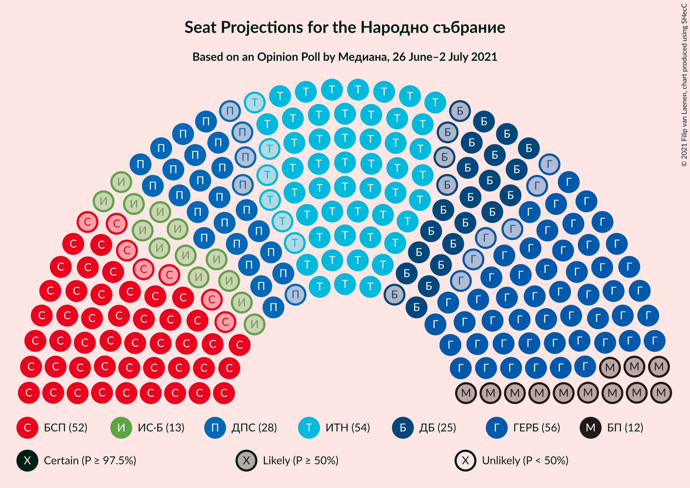
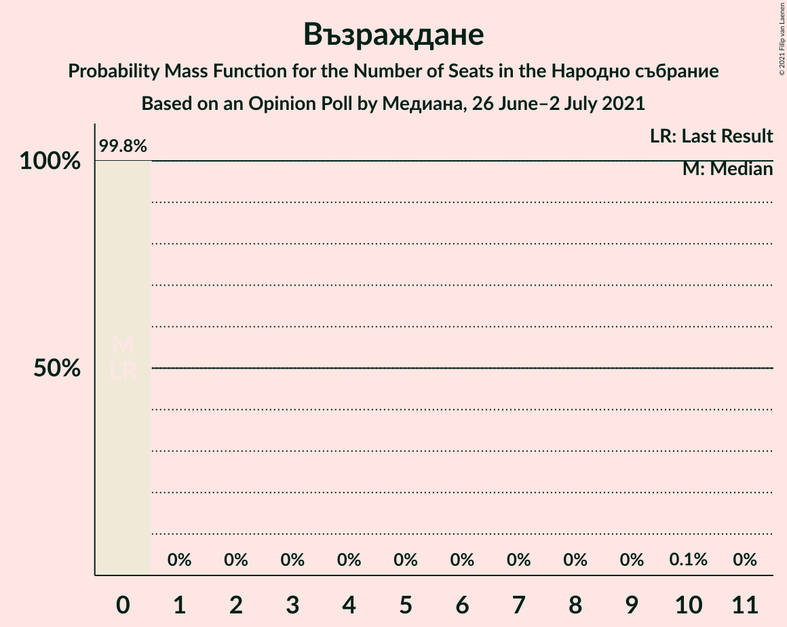

# Opinion Poll by Медиана, 26 June–2 July 2021

<a href="#voting-intentions">Voting Intentions</a> | <a href="#seats">Seats</a> | <a href="#coalitions">Coalitions</a> | <a href="#technical-information">Technical Information</a>

## Voting Intentions

### Confidence Intervals

| Party | Last Result | Poll Result | 80% Confidence Interval | 90% Confidence Interval | 95% Confidence Interval | 99% Confidence Interval |
|:-----:|:-----------:|:-----------:|:-----------------------:|:-----------------------:|:-----------------------:|:-----------------------:|
| Граждани за европейско развитие на България | 25.8% | 22.5% | 20.8–24.3% |20.3–24.9% |19.9–25.3% |19.1–26.2% |
| Има такъв народ | 17.4% | 21.7% | 20.1–23.6% |19.6–24.1% |19.2–24.5% |18.4–25.4% |
| Българска социалистическа партия | 14.8% | 20.7% | 19.0–22.5% |18.5–23.0% |18.2–23.4% |17.4–24.3% |
| Движение за права и свободи | 10.4% | 11.1% | 9.9–12.5% |9.5–12.9% |9.2–13.3% |8.7–14.0% |
| Демократична България | 9.3% | 10.0% | 8.8–11.4% |8.5–11.8% |8.2–12.1% |7.7–12.8% |
| Изправи се Бг | 4.6% | 5.1% | 4.3–6.2% |4.1–6.5% |3.9–6.7% |3.5–7.3% |
| Българските патриоти | 0.0% | 4.8% | 4.0–5.8% |3.8–6.1% |3.6–6.4% |3.2–6.9% |
| Възраждане | 2.4% | 2.2% | 1.7–2.9% |1.5–3.1% |1.4–3.3% |1.2–3.7% |

*Note:* The poll result column reflects the actual value used in the calculations. Published results may vary slightly, and in addition be rounded to fewer digits.

## Seats

### Confidence Intervals

| Party | Last Result | Median | 80% Confidence Interval | 90% Confidence Interval | 95% Confidence Interval | 99% Confidence Interval |
|:-----:|:-----------:|:------:|:-----------------------:|:-----------------------:|:-----------------------:|:-----------------------:|
| <a href="#граждани-за-европейско-развитие-на-българия">Граждани за европейско развитие на България</a> | 75 | 56 | 52–61 |51–63 |50–64 |48–66 |
| <a href="#има-такъв-народ">Има такъв народ</a> | 51 | 54 | 50–59 |49–61 |48–62 |46–64 |
| <a href="#българска-социалистическа-партия">Българска социалистическа партия</a> | 43 | 52 | 47–56 |46–57 |45–59 |43–61 |
| <a href="#движение-за-права-и-свободи">Движение за права и свободи</a> | 30 | 28 | 25–31 |24–33 |23–33 |22–35 |
| <a href="#демократична-българия">Демократична България</a> | 27 | 25 | 22–29 |21–30 |20–30 |19–32 |
| <a href="#изправи-се-бг">Изправи се Бг</a> | 14 | 13 | 11–15 |0–16 |0–17 |0–18 |
| <a href="#българските-патриоти">Българските патриоти</a> | 0 | 12 | 0–15 |0–15 |0–16 |0–17 |
| <a href="#възраждане">Възраждане</a> | 0 | 0 | 0 |0 |0 |0 |

### Граждани за европейско развитие на България

*For a full overview of the results for this party, see the [Граждани за европейско развитие на България](party-гражданизаевропейскоразвитиенабългария.html) page.*

| Number of Seats | Probability | Accumulated | Special Marks |
|:---------------:|:-----------:|:-----------:|:-------------:|
| 46 | 0.1% | 100% |  |
| 47 | 0.3% | 99.8% |  |
| 48 | 0.4% | 99.6% |  |
| 49 | 1.2% | 99.2% |  |
| 50 | 2% | 98% |  |
| 51 | 4% | 96% |  |
| 52 | 8% | 92% |  |
| 53 | 6% | 84% |  |
| 54 | 8% | 78% |  |
| 55 | 10% | 70% |  |
| 56 | 12% | 61% | Median |
| 57 | 10% | 48% |  |
| 58 | 10% | 39% |  |
| 59 | 10% | 29% |  |
| 60 | 4% | 18% |  |
| 61 | 5% | 14% |  |
| 62 | 3% | 9% |  |
| 63 | 2% | 5% |  |
| 64 | 2% | 3% |  |
| 65 | 0.8% | 2% |  |
| 66 | 0.3% | 0.7% |  |
| 67 | 0.2% | 0.4% |  |
| 68 | 0.1% | 0.3% |  |
| 69 | 0.1% | 0.1% |  |
| 70 | 0% | 0.1% |  |
| 71 | 0% | 0% |  |
| 72 | 0% | 0% |  |
| 73 | 0% | 0% |  |
| 74 | 0% | 0% |  |
| 75 | 0% | 0% | Last Result |

### Има такъв народ

*For a full overview of the results for this party, see the [Има такъв народ](party-иматакъвнарод.html) page.*

| Number of Seats | Probability | Accumulated | Special Marks |
|:---------------:|:-----------:|:-----------:|:-------------:|
| 44 | 0.1% | 100% |  |
| 45 | 0.2% | 99.9% |  |
| 46 | 0.6% | 99.7% |  |
| 47 | 1.0% | 99.2% |  |
| 48 | 2% | 98% |  |
| 49 | 3% | 96% |  |
| 50 | 7% | 93% |  |
| 51 | 6% | 86% | Last Result |
| 52 | 9% | 80% |  |
| 53 | 9% | 71% |  |
| 54 | 13% | 61% | Median |
| 55 | 10% | 49% |  |
| 56 | 7% | 39% |  |
| 57 | 10% | 32% |  |
| 58 | 7% | 22% |  |
| 59 | 6% | 15% |  |
| 60 | 3% | 9% |  |
| 61 | 3% | 6% |  |
| 62 | 1.1% | 3% |  |
| 63 | 0.7% | 2% |  |
| 64 | 0.5% | 0.9% |  |
| 65 | 0.2% | 0.4% |  |
| 66 | 0.1% | 0.2% |  |
| 67 | 0.1% | 0.1% |  |
| 68 | 0% | 0% |  |

### Българска социалистическа партия

*For a full overview of the results for this party, see the [Българска социалистическа партия](party-българскасоциалистическапартия.html) page.*

| Number of Seats | Probability | Accumulated | Special Marks |
|:---------------:|:-----------:|:-----------:|:-------------:|
| 41 | 0% | 100% |  |
| 42 | 0.2% | 99.9% |  |
| 43 | 0.3% | 99.8% | Last Result |
| 44 | 0.6% | 99.5% |  |
| 45 | 2% | 98.9% |  |
| 46 | 3% | 97% |  |
| 47 | 6% | 94% |  |
| 48 | 6% | 89% |  |
| 49 | 6% | 82% |  |
| 50 | 13% | 76% |  |
| 51 | 11% | 63% |  |
| 52 | 11% | 53% | Median |
| 53 | 7% | 41% |  |
| 54 | 9% | 34% |  |
| 55 | 11% | 26% |  |
| 56 | 7% | 15% |  |
| 57 | 4% | 8% |  |
| 58 | 2% | 5% |  |
| 59 | 1.0% | 3% |  |
| 60 | 1.0% | 2% |  |
| 61 | 0.6% | 1.0% |  |
| 62 | 0.2% | 0.5% |  |
| 63 | 0.1% | 0.2% |  |
| 64 | 0% | 0.1% |  |
| 65 | 0% | 0.1% |  |
| 66 | 0% | 0% |  |

### Движение за права и свободи

*For a full overview of the results for this party, see the [Движение за права и свободи](party-движениезаправаисвободи.html) page.*

| Number of Seats | Probability | Accumulated | Special Marks |
|:---------------:|:-----------:|:-----------:|:-------------:|
| 20 | 0.1% | 100% |  |
| 21 | 0.4% | 99.9% |  |
| 22 | 1.0% | 99.5% |  |
| 23 | 2% | 98.6% |  |
| 24 | 5% | 96% |  |
| 25 | 9% | 91% |  |
| 26 | 10% | 83% |  |
| 27 | 19% | 72% |  |
| 28 | 10% | 53% | Median |
| 29 | 16% | 44% |  |
| 30 | 11% | 27% | Last Result |
| 31 | 6% | 16% |  |
| 32 | 4% | 10% |  |
| 33 | 4% | 6% |  |
| 34 | 1.0% | 2% |  |
| 35 | 0.6% | 1.0% |  |
| 36 | 0.3% | 0.4% |  |
| 37 | 0.1% | 0.1% |  |
| 38 | 0% | 0% |  |

### Демократична България

*For a full overview of the results for this party, see the [Демократична България](party-демократичнабългария.html) page.*

| Number of Seats | Probability | Accumulated | Special Marks |
|:---------------:|:-----------:|:-----------:|:-------------:|
| 18 | 0.1% | 100% |  |
| 19 | 0.5% | 99.8% |  |
| 20 | 2% | 99.4% |  |
| 21 | 3% | 97% |  |
| 22 | 7% | 95% |  |
| 23 | 12% | 87% |  |
| 24 | 13% | 76% |  |
| 25 | 15% | 63% | Median |
| 26 | 18% | 48% |  |
| 27 | 11% | 30% | Last Result |
| 28 | 9% | 19% |  |
| 29 | 5% | 10% |  |
| 30 | 3% | 5% |  |
| 31 | 1.3% | 2% |  |
| 32 | 0.7% | 1.1% |  |
| 33 | 0.3% | 0.4% |  |
| 34 | 0.1% | 0.1% |  |
| 35 | 0% | 0% |  |

### Изправи се Бг

*For a full overview of the results for this party, see the [Изправи се Бг](party-изправисебг.html) page.*

| Number of Seats | Probability | Accumulated | Special Marks |
|:---------------:|:-----------:|:-----------:|:-------------:|
| 0 | 5% | 100% |  |
| 1 | 0% | 95% |  |
| 2 | 0% | 95% |  |
| 3 | 0% | 95% |  |
| 4 | 0% | 95% |  |
| 5 | 0% | 95% |  |
| 6 | 0% | 95% |  |
| 7 | 0% | 95% |  |
| 8 | 0% | 95% |  |
| 9 | 0% | 95% |  |
| 10 | 3% | 95% |  |
| 11 | 12% | 92% |  |
| 12 | 23% | 81% |  |
| 13 | 20% | 58% | Median |
| 14 | 17% | 38% | Last Result |
| 15 | 11% | 21% |  |
| 16 | 6% | 10% |  |
| 17 | 2% | 4% |  |
| 18 | 1.0% | 1.3% |  |
| 19 | 0.2% | 0.3% |  |
| 20 | 0.1% | 0.1% |  |
| 21 | 0% | 0% |  |

### Българските патриоти

*For a full overview of the results for this party, see the [Българските патриоти](party-българскитепатриоти.html) page.*

| Number of Seats | Probability | Accumulated | Special Marks |
|:---------------:|:-----------:|:-----------:|:-------------:|
| 0 | 12% | 100% | Last Result |
| 1 | 0% | 88% |  |
| 2 | 0% | 88% |  |
| 3 | 0% | 88% |  |
| 4 | 0% | 88% |  |
| 5 | 0% | 88% |  |
| 6 | 0% | 88% |  |
| 7 | 0% | 88% |  |
| 8 | 0% | 88% |  |
| 9 | 0% | 88% |  |
| 10 | 6% | 88% |  |
| 11 | 17% | 82% |  |
| 12 | 23% | 66% | Median |
| 13 | 19% | 43% |  |
| 14 | 13% | 24% |  |
| 15 | 7% | 10% |  |
| 16 | 2% | 4% |  |
| 17 | 0.9% | 1.2% |  |
| 18 | 0.2% | 0.3% |  |
| 19 | 0.1% | 0.1% |  |
| 20 | 0% | 0% |  |

### Възраждане

*For a full overview of the results for this party, see the [Възраждане](party-възраждане.html) page.*

| Number of Seats | Probability | Accumulated | Special Marks |
|:---------------:|:-----------:|:-----------:|:-------------:|
| 0 | 99.8% | 100% | Last Result, Median |
| 1 | 0% | 0.2% |  |
| 2 | 0% | 0.2% |  |
| 3 | 0% | 0.2% |  |
| 4 | 0% | 0.2% |  |
| 5 | 0% | 0.2% |  |
| 6 | 0% | 0.2% |  |
| 7 | 0% | 0.2% |  |
| 8 | 0% | 0.2% |  |
| 9 | 0% | 0.2% |  |
| 10 | 0.1% | 0.2% |  |
| 11 | 0% | 0% |  |

## Coalitions

### Confidence Intervals

| Coalition | Last Result | Median | Majority? | 80% Confidence Interval | 90% Confidence Interval | 95% Confidence Interval | 99% Confidence Interval |
|:---------:|:-----------:|:------:|:---------:|:-----------------------:|:-----------------------:|:-----------------------:|:-----------------------:|
| Има такъв народ – Българска социалистическа партия – Движение за права и свободи – Изправи се Бг | 138 | 147 | 100% | 141–153 | 140–156 | 138–158 | 135–161 |
| Има такъв народ – Българска социалистическа партия – Движение за права и свободи | 124 | 134 | 99.9% | 129–141 | 127–144 | 126–147 | 123–149 |
| Българска социалистическа партия – Движение за права и свободи – Изправи се Бг | 87 | 92 | 0% | 87–98 | 85–100 | 83–101 | 79–104 |
| Българска социалистическа партия – Движение за права и свободи | 73 | 80 | 0% | 75–85 | 74–87 | 72–88 | 70–92 |

### Има такъв народ – Българска социалистическа партия – Движение за права и свободи – Изправи се Бг

| Number of Seats | Probability | Accumulated | Special Marks |
|:---------------:|:-----------:|:-----------:|:-------------:|
| 132 | 0% | 100% |  |
| 133 | 0.1% | 99.9% |  |
| 134 | 0.1% | 99.8% |  |
| 135 | 0.3% | 99.7% |  |
| 136 | 0.4% | 99.4% |  |
| 137 | 0.8% | 99.0% |  |
| 138 | 1.3% | 98% | Last Result |
| 139 | 2% | 97% |  |
| 140 | 3% | 95% |  |
| 141 | 4% | 93% |  |
| 142 | 5% | 88% |  |
| 143 | 5% | 84% |  |
| 144 | 8% | 78% |  |
| 145 | 10% | 70% |  |
| 146 | 6% | 60% |  |
| 147 | 9% | 54% | Median |
| 148 | 9% | 45% |  |
| 149 | 9% | 35% |  |
| 150 | 5% | 27% |  |
| 151 | 5% | 22% |  |
| 152 | 3% | 17% |  |
| 153 | 4% | 13% |  |
| 154 | 3% | 10% |  |
| 155 | 1.2% | 7% |  |
| 156 | 1.3% | 5% |  |
| 157 | 0.7% | 4% |  |
| 158 | 1.4% | 4% |  |
| 159 | 1.1% | 2% |  |
| 160 | 0.2% | 1.0% |  |
| 161 | 0.4% | 0.8% |  |
| 162 | 0.2% | 0.3% |  |
| 163 | 0.1% | 0.2% |  |
| 164 | 0.1% | 0.1% |  |
| 165 | 0% | 0% |  |

### Има такъв народ – Българска социалистическа партия – Движение за права и свободи

| Number of Seats | Probability | Accumulated | Special Marks |
|:---------------:|:-----------:|:-----------:|:-------------:|
| 120 | 0% | 100% |  |
| 121 | 0.1% | 99.9% | Majority |
| 122 | 0.2% | 99.9% |  |
| 123 | 0.3% | 99.7% |  |
| 124 | 0.6% | 99.4% | Last Result |
| 125 | 0.9% | 98.8% |  |
| 126 | 1.4% | 98% |  |
| 127 | 3% | 96% |  |
| 128 | 3% | 94% |  |
| 129 | 6% | 91% |  |
| 130 | 5% | 85% |  |
| 131 | 7% | 80% |  |
| 132 | 8% | 73% |  |
| 133 | 11% | 65% |  |
| 134 | 7% | 54% | Median |
| 135 | 8% | 47% |  |
| 136 | 10% | 39% |  |
| 137 | 6% | 29% |  |
| 138 | 4% | 23% |  |
| 139 | 4% | 19% |  |
| 140 | 3% | 15% |  |
| 141 | 2% | 12% |  |
| 142 | 2% | 10% |  |
| 143 | 2% | 7% |  |
| 144 | 2% | 6% |  |
| 145 | 0.7% | 4% |  |
| 146 | 0.6% | 3% |  |
| 147 | 1.2% | 3% |  |
| 148 | 0.6% | 1.3% |  |
| 149 | 0.3% | 0.7% |  |
| 150 | 0.2% | 0.4% |  |
| 151 | 0% | 0.2% |  |
| 152 | 0.1% | 0.2% |  |
| 153 | 0% | 0.1% |  |
| 154 | 0% | 0% |  |

### Българска социалистическа партия – Движение за права и свободи – Изправи се Бг

| Number of Seats | Probability | Accumulated | Special Marks |
|:---------------:|:-----------:|:-----------:|:-------------:|
| 75 | 0% | 100% |  |
| 76 | 0.1% | 99.9% |  |
| 77 | 0% | 99.9% |  |
| 78 | 0.2% | 99.8% |  |
| 79 | 0.2% | 99.6% |  |
| 80 | 0.2% | 99.4% |  |
| 81 | 0.6% | 99.2% |  |
| 82 | 0.6% | 98.6% |  |
| 83 | 0.6% | 98% |  |
| 84 | 2% | 97% |  |
| 85 | 2% | 96% |  |
| 86 | 3% | 94% |  |
| 87 | 5% | 90% | Last Result |
| 88 | 5% | 86% |  |
| 89 | 7% | 81% |  |
| 90 | 6% | 74% |  |
| 91 | 9% | 68% |  |
| 92 | 10% | 59% |  |
| 93 | 7% | 49% | Median |
| 94 | 8% | 42% |  |
| 95 | 8% | 34% |  |
| 96 | 7% | 26% |  |
| 97 | 6% | 18% |  |
| 98 | 5% | 13% |  |
| 99 | 2% | 8% |  |
| 100 | 2% | 6% |  |
| 101 | 2% | 4% |  |
| 102 | 0.6% | 2% |  |
| 103 | 1.0% | 2% |  |
| 104 | 0.2% | 0.7% |  |
| 105 | 0.2% | 0.4% |  |
| 106 | 0.1% | 0.2% |  |
| 107 | 0.1% | 0.1% |  |
| 108 | 0% | 0.1% |  |
| 109 | 0% | 0% |  |

### Българска социалистическа партия – Движение за права и свободи

| Number of Seats | Probability | Accumulated | Special Marks |
|:---------------:|:-----------:|:-----------:|:-------------:|
| 67 | 0% | 100% |  |
| 68 | 0.1% | 99.9% |  |
| 69 | 0.2% | 99.8% |  |
| 70 | 0.5% | 99.7% |  |
| 71 | 0.7% | 99.2% |  |
| 72 | 2% | 98.5% |  |
| 73 | 2% | 97% | Last Result |
| 74 | 5% | 95% |  |
| 75 | 5% | 90% |  |
| 76 | 7% | 85% |  |
| 77 | 9% | 78% |  |
| 78 | 7% | 69% |  |
| 79 | 10% | 62% |  |
| 80 | 8% | 53% | Median |
| 81 | 10% | 45% |  |
| 82 | 7% | 35% |  |
| 83 | 10% | 28% |  |
| 84 | 4% | 18% |  |
| 85 | 5% | 14% |  |
| 86 | 3% | 9% |  |
| 87 | 1.4% | 5% |  |
| 88 | 2% | 4% |  |
| 89 | 0.9% | 2% |  |
| 90 | 0.7% | 2% |  |
| 91 | 0.3% | 0.9% |  |
| 92 | 0.2% | 0.5% |  |
| 93 | 0.1% | 0.3% |  |
| 94 | 0.1% | 0.2% |  |
| 95 | 0% | 0.1% |  |
| 96 | 0% | 0% |  |

## Technical Information

### Opinion Poll

+ **Polling firm:** Медиана
+ **Commissioner(s):** —
+ **Fieldwork period:** 26 June–2 July 2021

### Calculations

+ **Sample size:** 920
+ **Simulations done:** 1,048,576
+ **Error estimate:** 1.43%

