# Opinion Poll by Gallup for BNR, 30 June–7 July 2021

<a href="#voting-intentions">Voting Intentions</a> | <a href="#seats">Seats</a> | <a href="#coalitions">Coalitions</a> | <a href="#technical-information">Technical Information</a>

## Voting Intentions

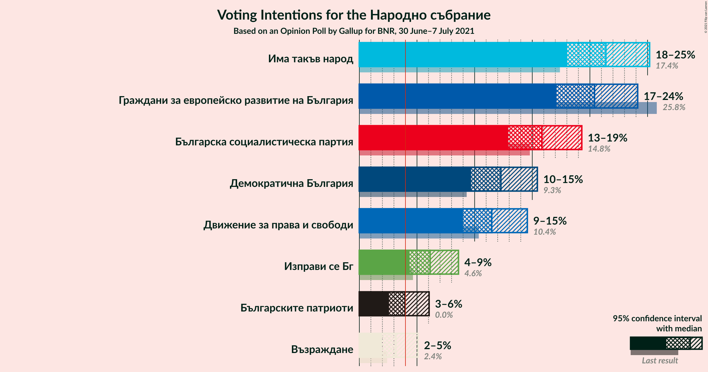

### Confidence Intervals

| Party | Last Result | Poll Result | 80% Confidence Interval | 90% Confidence Interval | 95% Confidence Interval | 99% Confidence Interval |
|:-----:|:-----------:|:-----------:|:-----------------------:|:-----------------------:|:-----------------------:|:-----------------------:|
| Има такъв народ | 17.4% | 21.4% | 19.2–23.9% |18.6–24.6% |18.0–25.2% |17.0–26.4% |
| Граждани за европейско развитие на България | 25.8% | 20.4% | 18.2–22.8% |17.6–23.5% |17.1–24.1% |16.1–25.3% |
| Българска социалистическа партия | 14.8% | 15.8% | 13.9–18.1% |13.4–18.7% |12.9–19.3% |12.0–20.4% |
| Демократична България | 9.3% | 12.3% | 10.6–14.3% |10.1–14.9% |9.7–15.4% |8.9–16.5% |
| Движение за права и свободи | 10.4% | 11.5% | 9.8–13.5% |9.4–14.1% |9.0–14.6% |8.3–15.6% |
| Изправи се Бг | 4.6% | 6.1% | 5.0–7.7% |4.6–8.2% |4.4–8.6% |3.9–9.4% |
| Българските патриоти | 0.0% | 4.0% | 3.0–5.3% |2.8–5.7% |2.6–6.1% |2.2–6.8% |
| Възраждане | 2.4% | 3.2% | 2.4–4.4% |2.1–4.8% |2.0–5.1% |1.6–5.8% |

*Note:* The poll result column reflects the actual value used in the calculations. Published results may vary slightly, and in addition be rounded to fewer digits.

## Seats

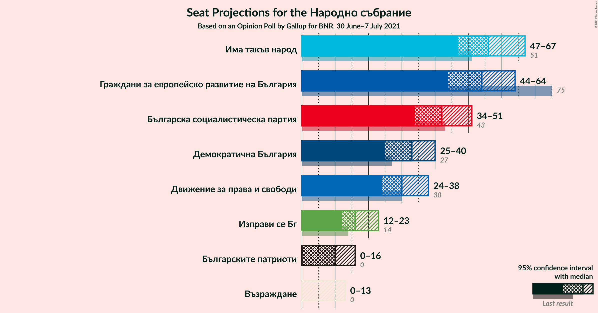

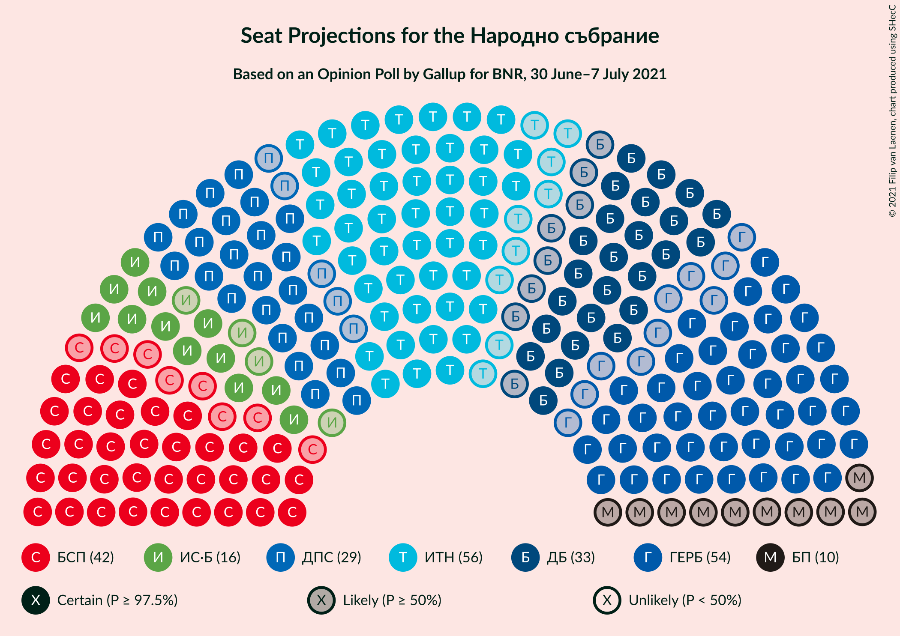

### Confidence Intervals

| Party | Last Result | Median | 80% Confidence Interval | 90% Confidence Interval | 95% Confidence Interval | 99% Confidence Interval |
|:-----:|:-----------:|:------:|:-----------------------:|:-----------------------:|:-----------------------:|:-----------------------:|
| <a href="#има-такъв-народ">Има такъв народ</a> | 51 | 56 | 50–63 |48–65 |47–67 |44–70 |
| <a href="#граждани-за-европейско-развитие-на-българия">Граждани за европейско развитие на България</a> | 75 | 54 | 48–60 |46–63 |44–64 |42–68 |
| <a href="#българска-социалистическа-партия">Българска социалистическа партия</a> | 43 | 42 | 36–48 |35–49 |34–51 |31–54 |
| <a href="#демократична-българия">Демократична България</a> | 27 | 33 | 28–38 |26–39 |25–40 |23–44 |
| <a href="#движение-за-права-и-свободи">Движение за права и свободи</a> | 30 | 30 | 26–35 |24–37 |24–38 |21–41 |
| <a href="#изправи-се-бг">Изправи се Бг</a> | 14 | 16 | 13–20 |12–21 |12–23 |0–25 |
| <a href="#българските-патриоти">Българските патриоти</a> | 0 | 10 | 0–14 |0–15 |0–16 |0–17 |
| <a href="#възраждане">Възраждане</a> | 0 | 0 | 0–11 |0–12 |0–13 |0–15 |

### Има такъв народ

*For a full overview of the results for this party, see the [Има такъв народ](party-иматакъвнарод.html) page.*

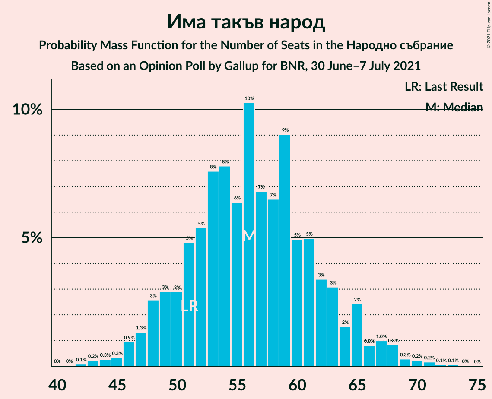

| Number of Seats | Probability | Accumulated | Special Marks |
|:---------------:|:-----------:|:-----------:|:-------------:|
| 41 | 0% | 100% |  |
| 42 | 0.1% | 99.9% |  |
| 43 | 0.2% | 99.9% |  |
| 44 | 0.3% | 99.6% |  |
| 45 | 0.3% | 99.4% |  |
| 46 | 0.9% | 99.0% |  |
| 47 | 1.3% | 98% |  |
| 48 | 3% | 97% |  |
| 49 | 3% | 94% |  |
| 50 | 3% | 91% |  |
| 51 | 5% | 88% | Last Result |
| 52 | 5% | 84% |  |
| 53 | 8% | 78% |  |
| 54 | 8% | 71% |  |
| 55 | 6% | 63% |  |
| 56 | 10% | 56% | Median |
| 57 | 7% | 46% |  |
| 58 | 7% | 39% |  |
| 59 | 9% | 33% |  |
| 60 | 5% | 24% |  |
| 61 | 5% | 19% |  |
| 62 | 3% | 14% |  |
| 63 | 3% | 10% |  |
| 64 | 2% | 7% |  |
| 65 | 2% | 6% |  |
| 66 | 0.8% | 3% |  |
| 67 | 1.0% | 3% |  |
| 68 | 0.8% | 2% |  |
| 69 | 0.3% | 0.8% |  |
| 70 | 0.2% | 0.5% |  |
| 71 | 0.2% | 0.3% |  |
| 72 | 0.1% | 0.2% |  |
| 73 | 0.1% | 0.1% |  |
| 74 | 0% | 0.1% |  |
| 75 | 0% | 0% |  |

### Граждани за европейско развитие на България

*For a full overview of the results for this party, see the [Граждани за европейско развитие на България](party-гражданизаевропейскоразвитиенабългария.html) page.*

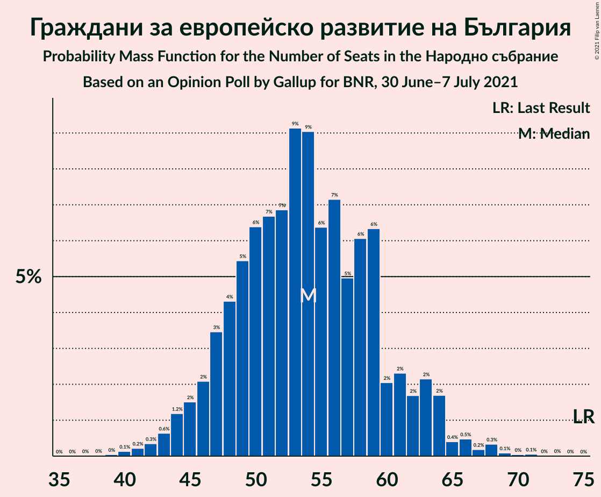

| Number of Seats | Probability | Accumulated | Special Marks |
|:---------------:|:-----------:|:-----------:|:-------------:|
| 39 | 0% | 100% |  |
| 40 | 0.1% | 99.9% |  |
| 41 | 0.2% | 99.8% |  |
| 42 | 0.3% | 99.6% |  |
| 43 | 0.6% | 99.2% |  |
| 44 | 1.2% | 98.6% |  |
| 45 | 2% | 97% |  |
| 46 | 2% | 96% |  |
| 47 | 3% | 94% |  |
| 48 | 4% | 90% |  |
| 49 | 5% | 86% |  |
| 50 | 6% | 81% |  |
| 51 | 7% | 74% |  |
| 52 | 7% | 67% |  |
| 53 | 9% | 61% |  |
| 54 | 9% | 51% | Median |
| 55 | 6% | 42% |  |
| 56 | 7% | 36% |  |
| 57 | 5% | 29% |  |
| 58 | 6% | 24% |  |
| 59 | 6% | 18% |  |
| 60 | 2% | 12% |  |
| 61 | 2% | 9% |  |
| 62 | 2% | 7% |  |
| 63 | 2% | 5% |  |
| 64 | 2% | 3% |  |
| 65 | 0.4% | 2% |  |
| 66 | 0.5% | 1.2% |  |
| 67 | 0.2% | 0.8% |  |
| 68 | 0.3% | 0.6% |  |
| 69 | 0.1% | 0.2% |  |
| 70 | 0% | 0.1% |  |
| 71 | 0.1% | 0.1% |  |
| 72 | 0% | 0% |  |
| 73 | 0% | 0% |  |
| 74 | 0% | 0% |  |
| 75 | 0% | 0% | Last Result |

### Българска социалистическа партия

*For a full overview of the results for this party, see the [Българска социалистическа партия](party-българскасоциалистическапартия.html) page.*

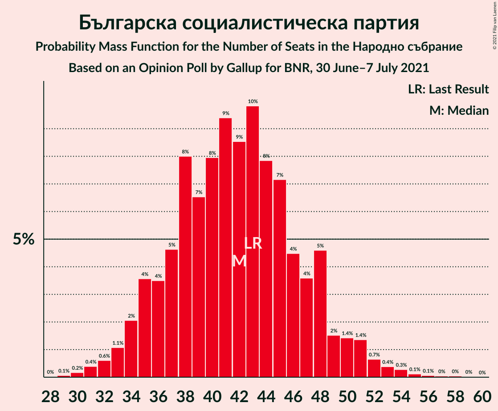

| Number of Seats | Probability | Accumulated | Special Marks |
|:---------------:|:-----------:|:-----------:|:-------------:|
| 29 | 0.1% | 100% |  |
| 30 | 0.2% | 99.9% |  |
| 31 | 0.4% | 99.7% |  |
| 32 | 0.6% | 99.3% |  |
| 33 | 1.1% | 98.7% |  |
| 34 | 2% | 98% |  |
| 35 | 4% | 96% |  |
| 36 | 4% | 92% |  |
| 37 | 5% | 89% |  |
| 38 | 8% | 84% |  |
| 39 | 7% | 76% |  |
| 40 | 8% | 69% |  |
| 41 | 9% | 61% |  |
| 42 | 9% | 52% | Median |
| 43 | 10% | 43% | Last Result |
| 44 | 8% | 34% |  |
| 45 | 7% | 26% |  |
| 46 | 4% | 19% |  |
| 47 | 4% | 14% |  |
| 48 | 5% | 11% |  |
| 49 | 2% | 6% |  |
| 50 | 1.4% | 4% |  |
| 51 | 1.4% | 3% |  |
| 52 | 0.7% | 2% |  |
| 53 | 0.4% | 1.0% |  |
| 54 | 0.3% | 0.6% |  |
| 55 | 0.1% | 0.3% |  |
| 56 | 0.1% | 0.2% |  |
| 57 | 0% | 0.1% |  |
| 58 | 0% | 0.1% |  |
| 59 | 0% | 0% |  |

### Демократична България

*For a full overview of the results for this party, see the [Демократична България](party-демократичнабългария.html) page.*

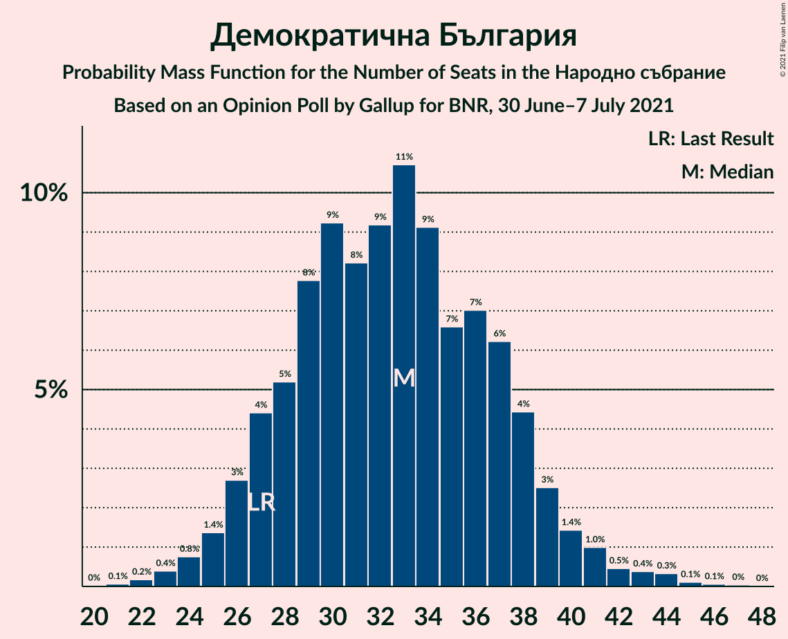

| Number of Seats | Probability | Accumulated | Special Marks |
|:---------------:|:-----------:|:-----------:|:-------------:|
| 21 | 0.1% | 100% |  |
| 22 | 0.2% | 99.9% |  |
| 23 | 0.4% | 99.7% |  |
| 24 | 0.8% | 99.3% |  |
| 25 | 1.4% | 98.6% |  |
| 26 | 3% | 97% |  |
| 27 | 4% | 95% | Last Result |
| 28 | 5% | 90% |  |
| 29 | 8% | 85% |  |
| 30 | 9% | 77% |  |
| 31 | 8% | 68% |  |
| 32 | 9% | 60% |  |
| 33 | 11% | 50% | Median |
| 34 | 9% | 40% |  |
| 35 | 7% | 31% |  |
| 36 | 7% | 24% |  |
| 37 | 6% | 17% |  |
| 38 | 4% | 11% |  |
| 39 | 3% | 6% |  |
| 40 | 1.4% | 4% |  |
| 41 | 1.0% | 2% |  |
| 42 | 0.5% | 1.4% |  |
| 43 | 0.4% | 1.0% |  |
| 44 | 0.3% | 0.6% |  |
| 45 | 0.1% | 0.2% |  |
| 46 | 0.1% | 0.1% |  |
| 47 | 0% | 0.1% |  |
| 48 | 0% | 0% |  |

### Движение за права и свободи

*For a full overview of the results for this party, see the [Движение за права и свободи](party-движениезаправаисвободи.html) page.*

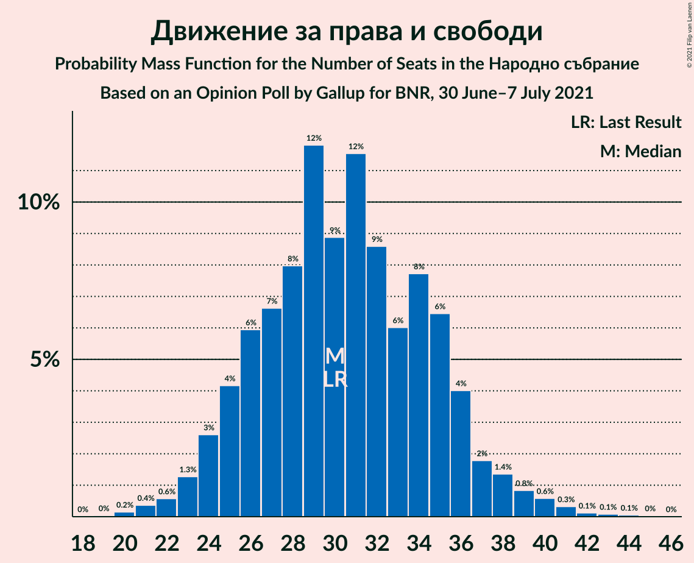

| Number of Seats | Probability | Accumulated | Special Marks |
|:---------------:|:-----------:|:-----------:|:-------------:|
| 19 | 0% | 100% |  |
| 20 | 0.2% | 99.9% |  |
| 21 | 0.4% | 99.8% |  |
| 22 | 0.6% | 99.4% |  |
| 23 | 1.3% | 98.9% |  |
| 24 | 3% | 98% |  |
| 25 | 4% | 95% |  |
| 26 | 6% | 91% |  |
| 27 | 7% | 85% |  |
| 28 | 8% | 78% |  |
| 29 | 12% | 70% |  |
| 30 | 9% | 58% | Last Result, Median |
| 31 | 12% | 50% |  |
| 32 | 9% | 38% |  |
| 33 | 6% | 29% |  |
| 34 | 8% | 23% |  |
| 35 | 6% | 16% |  |
| 36 | 4% | 9% |  |
| 37 | 2% | 5% |  |
| 38 | 1.4% | 3% |  |
| 39 | 0.8% | 2% |  |
| 40 | 0.6% | 1.2% |  |
| 41 | 0.3% | 0.6% |  |
| 42 | 0.1% | 0.3% |  |
| 43 | 0.1% | 0.2% |  |
| 44 | 0.1% | 0.1% |  |
| 45 | 0% | 0.1% |  |
| 46 | 0% | 0% |  |

### Изправи се Бг

*For a full overview of the results for this party, see the [Изправи се Бг](party-изправисебг.html) page.*

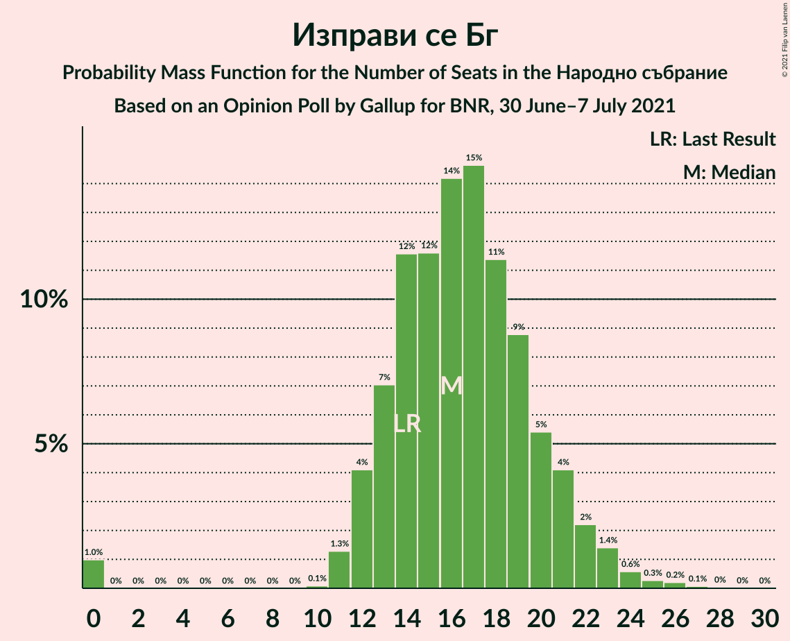

| Number of Seats | Probability | Accumulated | Special Marks |
|:---------------:|:-----------:|:-----------:|:-------------:|
| 0 | 1.0% | 100% |  |
| 1 | 0% | 99.0% |  |
| 2 | 0% | 99.0% |  |
| 3 | 0% | 99.0% |  |
| 4 | 0% | 99.0% |  |
| 5 | 0% | 99.0% |  |
| 6 | 0% | 99.0% |  |
| 7 | 0% | 99.0% |  |
| 8 | 0% | 99.0% |  |
| 9 | 0% | 99.0% |  |
| 10 | 0.1% | 99.0% |  |
| 11 | 1.3% | 98.9% |  |
| 12 | 4% | 98% |  |
| 13 | 7% | 94% |  |
| 14 | 12% | 86% | Last Result |
| 15 | 12% | 75% |  |
| 16 | 14% | 63% | Median |
| 17 | 15% | 49% |  |
| 18 | 11% | 34% |  |
| 19 | 9% | 23% |  |
| 20 | 5% | 14% |  |
| 21 | 4% | 9% |  |
| 22 | 2% | 5% |  |
| 23 | 1.4% | 3% |  |
| 24 | 0.6% | 1.2% |  |
| 25 | 0.3% | 0.6% |  |
| 26 | 0.2% | 0.3% |  |
| 27 | 0.1% | 0.1% |  |
| 28 | 0% | 0.1% |  |
| 29 | 0% | 0% |  |

### Българските патриоти

*For a full overview of the results for this party, see the [Българските патриоти](party-българскитепатриоти.html) page.*

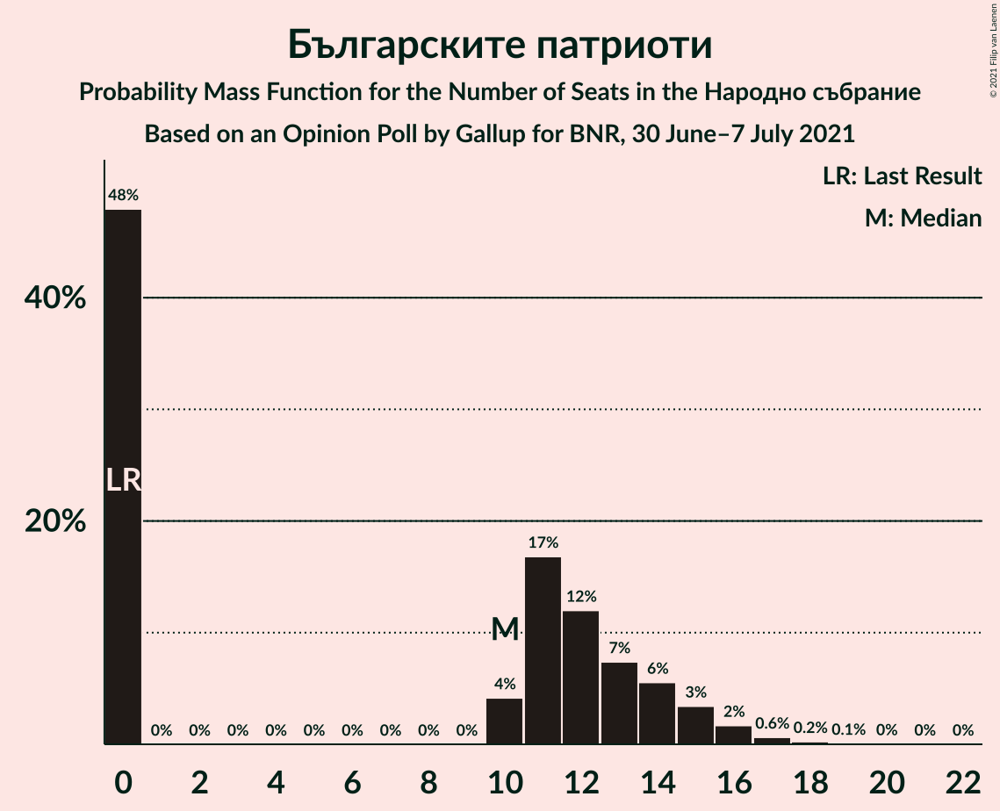

| Number of Seats | Probability | Accumulated | Special Marks |
|:---------------:|:-----------:|:-----------:|:-------------:|
| 0 | 48% | 100% | Last Result |
| 1 | 0% | 52% |  |
| 2 | 0% | 52% |  |
| 3 | 0% | 52% |  |
| 4 | 0% | 52% |  |
| 5 | 0% | 52% |  |
| 6 | 0% | 52% |  |
| 7 | 0% | 52% |  |
| 8 | 0% | 52% |  |
| 9 | 0% | 52% |  |
| 10 | 4% | 52% | Median |
| 11 | 17% | 48% |  |
| 12 | 12% | 31% |  |
| 13 | 7% | 19% |  |
| 14 | 6% | 12% |  |
| 15 | 3% | 6% |  |
| 16 | 2% | 3% |  |
| 17 | 0.6% | 1.0% |  |
| 18 | 0.2% | 0.4% |  |
| 19 | 0.1% | 0.1% |  |
| 20 | 0% | 0.1% |  |
| 21 | 0% | 0% |  |

### Възраждане

*For a full overview of the results for this party, see the [Възраждане](party-възраждане.html) page.*

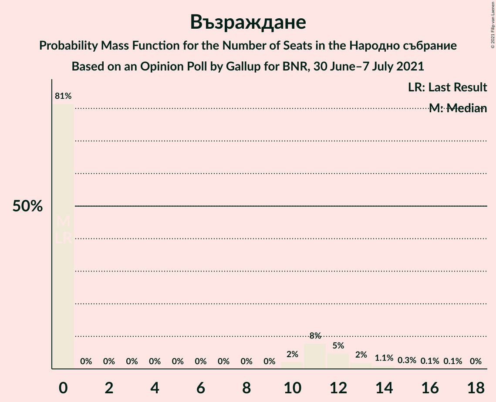

| Number of Seats | Probability | Accumulated | Special Marks |
|:---------------:|:-----------:|:-----------:|:-------------:|
| 0 | 81% | 100% | Last Result, Median |
| 1 | 0% | 19% |  |
| 2 | 0% | 19% |  |
| 3 | 0% | 19% |  |
| 4 | 0% | 19% |  |
| 5 | 0% | 19% |  |
| 6 | 0% | 19% |  |
| 7 | 0% | 19% |  |
| 8 | 0% | 19% |  |
| 9 | 0% | 19% |  |
| 10 | 2% | 19% |  |
| 11 | 8% | 16% |  |
| 12 | 5% | 8% |  |
| 13 | 2% | 4% |  |
| 14 | 1.1% | 2% |  |
| 15 | 0.3% | 0.5% |  |
| 16 | 0.1% | 0.2% |  |
| 17 | 0.1% | 0.1% |  |
| 18 | 0% | 0% |  |

## Coalitions

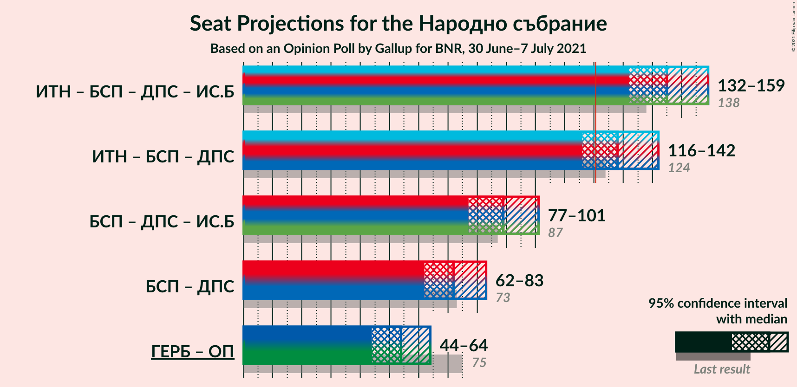

### Confidence Intervals

| Coalition | Last Result | Median | Majority? | 80% Confidence Interval | 90% Confidence Interval | 95% Confidence Interval | 99% Confidence Interval |
|:---------:|:-----------:|:------:|:---------:|:-----------------------:|:-----------------------:|:-----------------------:|:-----------------------:|
| Има такъв народ – Българска социалистическа партия – Движение за права и свободи – Изправи се Бг | 138 | 145 | 100% | 136–155 | 133–157 | 132–159 | 127–163 |
| Има такъв народ – Българска социалистическа партия – Движение за права и свободи | 124 | 128 | 89% | 120–138 | 118–140 | 116–142 | 112–146 |
| Българска социалистическа партия – Движение за права и свободи – Изправи се Бг | 87 | 89 | 0% | 81–96 | 79–99 | 77–101 | 73–104 |
| Българска социалистическа партия – Движение за права и свободи | 73 | 72 | 0% | 65–79 | 64–82 | 62–83 | 58–87 |

### Има такъв народ – Българска социалистическа партия – Движение за права и свободи – Изправи се Бг

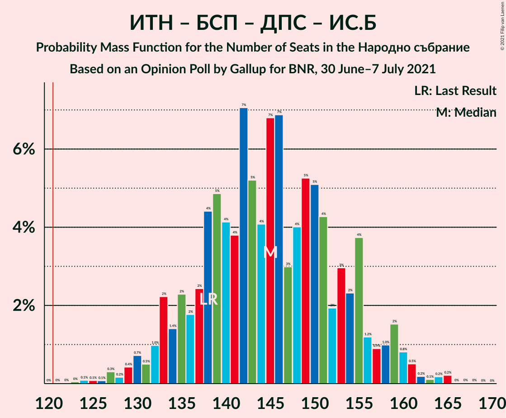

| Number of Seats | Probability | Accumulated | Special Marks |
|:---------------:|:-----------:|:-----------:|:-------------:|
| 122 | 0% | 100% |  |
| 123 | 0% | 99.9% |  |
| 124 | 0.1% | 99.9% |  |
| 125 | 0.1% | 99.8% |  |
| 126 | 0.1% | 99.7% |  |
| 127 | 0.3% | 99.7% |  |
| 128 | 0.2% | 99.4% |  |
| 129 | 0.4% | 99.2% |  |
| 130 | 0.7% | 98.8% |  |
| 131 | 0.5% | 98% |  |
| 132 | 1.0% | 98% |  |
| 133 | 2% | 97% |  |
| 134 | 1.4% | 94% |  |
| 135 | 2% | 93% |  |
| 136 | 2% | 91% |  |
| 137 | 2% | 89% |  |
| 138 | 4% | 86% | Last Result |
| 139 | 5% | 82% |  |
| 140 | 4% | 77% |  |
| 141 | 4% | 73% |  |
| 142 | 7% | 69% |  |
| 143 | 5% | 62% |  |
| 144 | 4% | 57% | Median |
| 145 | 7% | 53% |  |
| 146 | 7% | 46% |  |
| 147 | 3% | 39% |  |
| 148 | 4% | 36% |  |
| 149 | 5% | 32% |  |
| 150 | 5% | 27% |  |
| 151 | 4% | 22% |  |
| 152 | 2% | 18% |  |
| 153 | 3% | 16% |  |
| 154 | 2% | 13% |  |
| 155 | 4% | 10% |  |
| 156 | 1.2% | 7% |  |
| 157 | 0.9% | 5% |  |
| 158 | 1.0% | 5% |  |
| 159 | 2% | 4% |  |
| 160 | 0.8% | 2% |  |
| 161 | 0.5% | 1.2% |  |
| 162 | 0.2% | 0.7% |  |
| 163 | 0.1% | 0.6% |  |
| 164 | 0.2% | 0.5% |  |
| 165 | 0.2% | 0.3% |  |
| 166 | 0% | 0.1% |  |
| 167 | 0% | 0% |  |

### Има такъв народ – Българска социалистическа партия – Движение за права и свободи

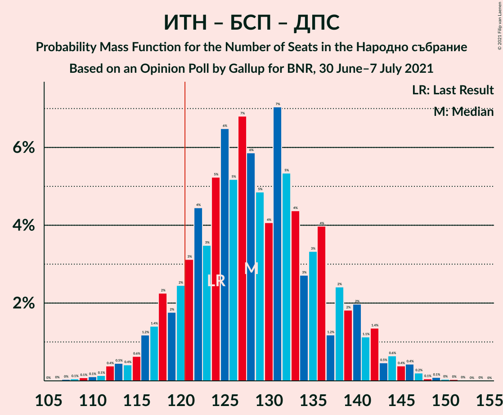

| Number of Seats | Probability | Accumulated | Special Marks |
|:---------------:|:-----------:|:-----------:|:-------------:|
| 107 | 0% | 100% |  |
| 108 | 0.1% | 99.9% |  |
| 109 | 0.1% | 99.9% |  |
| 110 | 0.1% | 99.8% |  |
| 111 | 0.1% | 99.7% |  |
| 112 | 0.4% | 99.5% |  |
| 113 | 0.5% | 99.2% |  |
| 114 | 0.4% | 98.7% |  |
| 115 | 0.6% | 98% |  |
| 116 | 1.2% | 98% |  |
| 117 | 1.4% | 96% |  |
| 118 | 2% | 95% |  |
| 119 | 2% | 93% |  |
| 120 | 2% | 91% |  |
| 121 | 3% | 89% | Majority |
| 122 | 4% | 85% |  |
| 123 | 3% | 81% |  |
| 124 | 5% | 78% | Last Result |
| 125 | 6% | 72% |  |
| 126 | 5% | 66% |  |
| 127 | 7% | 61% |  |
| 128 | 6% | 54% | Median |
| 129 | 5% | 48% |  |
| 130 | 4% | 43% |  |
| 131 | 7% | 39% |  |
| 132 | 5% | 32% |  |
| 133 | 4% | 27% |  |
| 134 | 3% | 22% |  |
| 135 | 3% | 20% |  |
| 136 | 4% | 16% |  |
| 137 | 1.2% | 12% |  |
| 138 | 2% | 11% |  |
| 139 | 2% | 9% |  |
| 140 | 2% | 7% |  |
| 141 | 1.1% | 5% |  |
| 142 | 1.4% | 4% |  |
| 143 | 0.5% | 2% |  |
| 144 | 0.6% | 2% |  |
| 145 | 0.4% | 1.3% |  |
| 146 | 0.4% | 0.9% |  |
| 147 | 0.2% | 0.5% |  |
| 148 | 0.1% | 0.3% |  |
| 149 | 0.1% | 0.2% |  |
| 150 | 0% | 0.1% |  |
| 151 | 0% | 0.1% |  |
| 152 | 0% | 0% |  |

### Българска социалистическа партия – Движение за права и свободи – Изправи се Бг

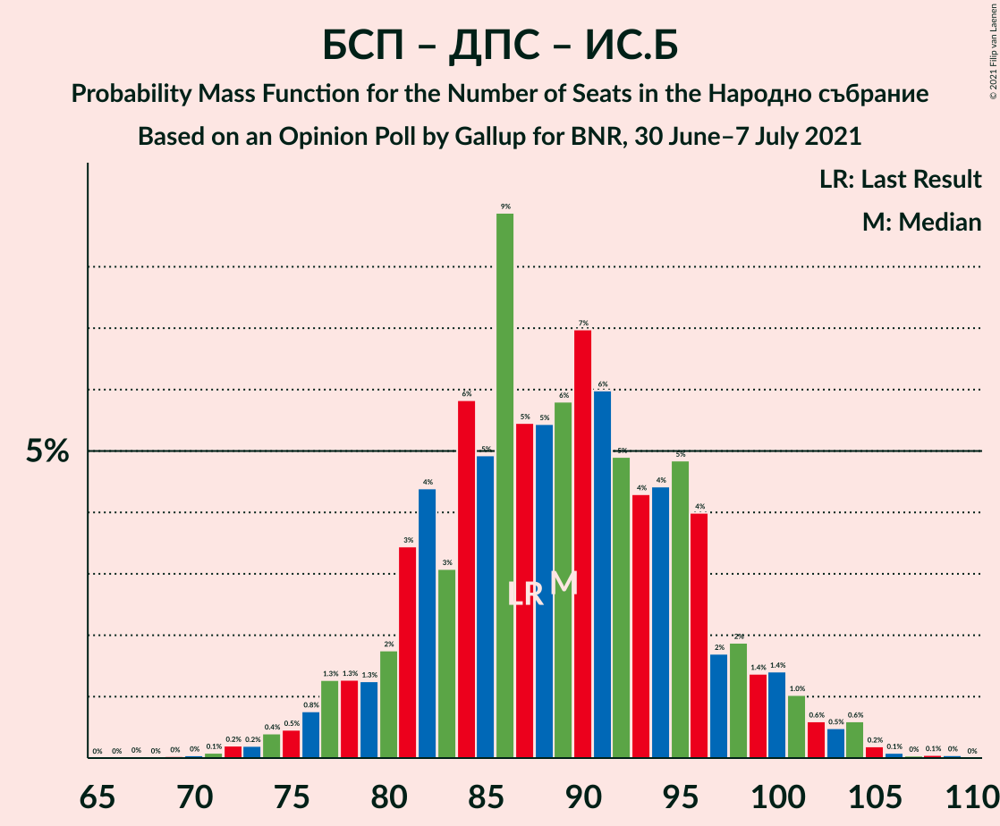

| Number of Seats | Probability | Accumulated | Special Marks |
|:---------------:|:-----------:|:-----------:|:-------------:|
| 67 | 0% | 100% |  |
| 68 | 0% | 99.9% |  |
| 69 | 0% | 99.9% |  |
| 70 | 0% | 99.9% |  |
| 71 | 0.1% | 99.9% |  |
| 72 | 0.2% | 99.8% |  |
| 73 | 0.2% | 99.6% |  |
| 74 | 0.4% | 99.4% |  |
| 75 | 0.5% | 99.0% |  |
| 76 | 0.8% | 98.5% |  |
| 77 | 1.3% | 98% |  |
| 78 | 1.3% | 96% |  |
| 79 | 1.3% | 95% |  |
| 80 | 2% | 94% |  |
| 81 | 3% | 92% |  |
| 82 | 4% | 89% |  |
| 83 | 3% | 84% |  |
| 84 | 6% | 81% |  |
| 85 | 5% | 75% |  |
| 86 | 9% | 71% |  |
| 87 | 5% | 62% | Last Result |
| 88 | 5% | 56% | Median |
| 89 | 6% | 51% |  |
| 90 | 7% | 45% |  |
| 91 | 6% | 38% |  |
| 92 | 5% | 32% |  |
| 93 | 4% | 27% |  |
| 94 | 4% | 23% |  |
| 95 | 5% | 18% |  |
| 96 | 4% | 14% |  |
| 97 | 2% | 10% |  |
| 98 | 2% | 8% |  |
| 99 | 1.4% | 6% |  |
| 100 | 1.4% | 5% |  |
| 101 | 1.0% | 3% |  |
| 102 | 0.6% | 2% |  |
| 103 | 0.5% | 2% |  |
| 104 | 0.6% | 1.0% |  |
| 105 | 0.2% | 0.4% |  |
| 106 | 0.1% | 0.3% |  |
| 107 | 0% | 0.2% |  |
| 108 | 0.1% | 0.1% |  |
| 109 | 0% | 0.1% |  |
| 110 | 0% | 0% |  |

### Българска социалистическа партия – Движение за права и свободи

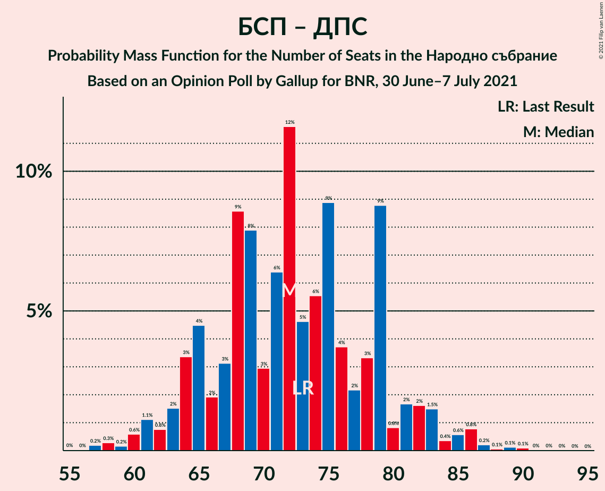

| Number of Seats | Probability | Accumulated | Special Marks |
|:---------------:|:-----------:|:-----------:|:-------------:|
| 55 | 0% | 100% |  |
| 56 | 0% | 99.9% |  |
| 57 | 0.2% | 99.9% |  |
| 58 | 0.3% | 99.7% |  |
| 59 | 0.2% | 99.4% |  |
| 60 | 0.6% | 99.3% |  |
| 61 | 1.1% | 98.7% |  |
| 62 | 0.8% | 98% |  |
| 63 | 2% | 97% |  |
| 64 | 3% | 95% |  |
| 65 | 4% | 92% |  |
| 66 | 2% | 87% |  |
| 67 | 3% | 86% |  |
| 68 | 9% | 82% |  |
| 69 | 8% | 74% |  |
| 70 | 3% | 66% |  |
| 71 | 6% | 63% |  |
| 72 | 12% | 57% | Median |
| 73 | 5% | 45% | Last Result |
| 74 | 6% | 40% |  |
| 75 | 9% | 35% |  |
| 76 | 4% | 26% |  |
| 77 | 2% | 22% |  |
| 78 | 3% | 20% |  |
| 79 | 9% | 17% |  |
| 80 | 0.8% | 8% |  |
| 81 | 2% | 7% |  |
| 82 | 2% | 5% |  |
| 83 | 1.5% | 4% |  |
| 84 | 0.4% | 2% |  |
| 85 | 0.6% | 2% |  |
| 86 | 0.8% | 1.4% |  |
| 87 | 0.2% | 0.6% |  |
| 88 | 0.1% | 0.4% |  |
| 89 | 0.1% | 0.3% |  |
| 90 | 0.1% | 0.2% |  |
| 91 | 0% | 0.1% |  |
| 92 | 0% | 0.1% |  |
| 93 | 0% | 0% |  |

## Technical Information

### Opinion Poll

+ **Polling firm:** Gallup
+ **Commissioner(s):** BNR
+ **Fieldwork period:** 30 June–7 July 2021

### Calculations

+ **Sample size:** 505
+ **Simulations done:** 1,048,576
+ **Error estimate:** 1.86%

