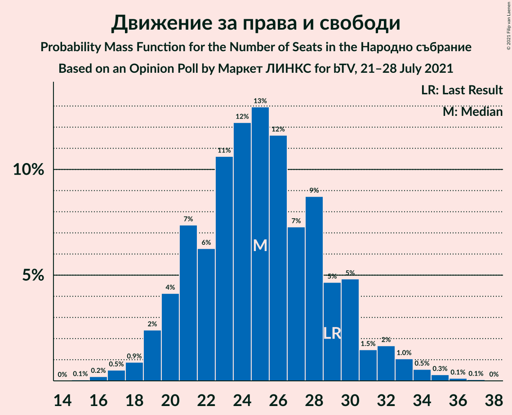
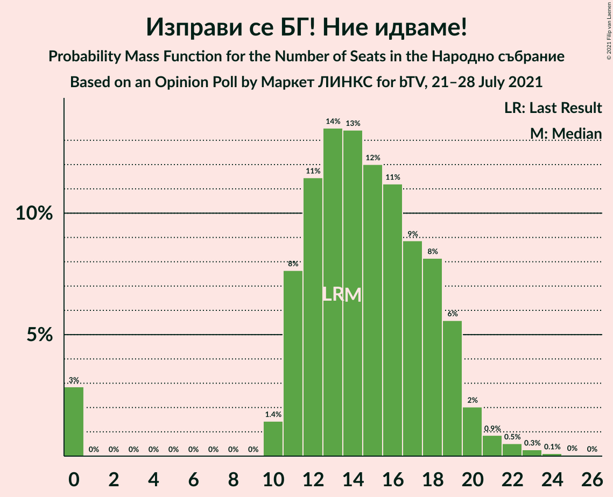
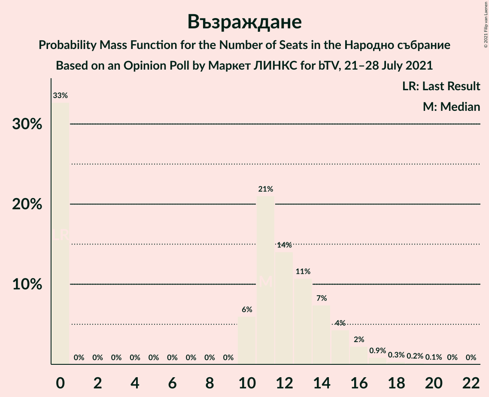
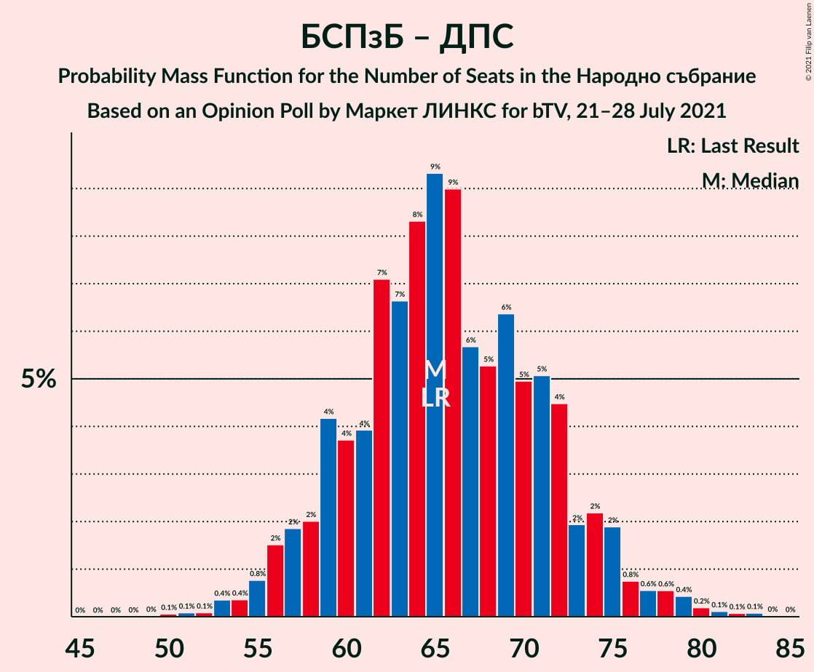

# Opinion Poll by Маркет ЛИНКС for bTV, 21–28 July 2021

<a href="#voting-intentions">Voting Intentions</a> | <a href="#seats">Seats</a> | <a href="#coalitions">Coalitions</a> | <a href="#technical-information">Technical Information</a>

## Voting Intentions

### Confidence Intervals

| Party | Last Result | Poll Result | 80% Confidence Interval | 90% Confidence Interval | 95% Confidence Interval | 99% Confidence Interval |
|:-----:|:-----------:|:-----------:|:-----------------------:|:-----------------------:|:-----------------------:|:-----------------------:|
| Има такъв народ | 23.8% | 25.2% | 22.8–27.8% |22.2–28.5% |21.6–29.2% |20.5–30.4% |
| Граждани за европейско развитие на България | 23.2% | 19.7% | 17.6–22.1% |17.0–22.8% |16.5–23.4% |15.5–24.6% |
| БСП за България | 13.2% | 16.1% | 14.2–18.4% |13.7–19.0% |13.2–19.6% |12.3–20.7% |
| Демократична България | 12.5% | 15.2% | 13.3–17.4% |12.7–18.0% |12.3–18.5% |11.4–19.6% |
| Движение за права и свободи | 10.6% | 9.8% | 8.3–11.7% |7.9–12.3% |7.5–12.8% |6.9–13.7% |
| Изправи се БГ! Ние идваме! | 5.0% | 5.7% | 4.6–7.3% |4.3–7.7% |4.0–8.1% |3.5–8.9% |
| Възраждане | 3.0% | 4.3% | 3.4–5.7% |3.1–6.1% |2.9–6.5% |2.5–7.2% |
| Българските патриоти | 3.1% | 2.2% | 1.5–3.2% |1.4–3.6% |1.2–3.8% |1.0–4.4% |

*Note:* The poll result column reflects the actual value used in the calculations. Published results may vary slightly, and in addition be rounded to fewer digits.

## Seats

### Confidence Intervals

| Party | Last Result | Median | 80% Confidence Interval | 90% Confidence Interval | 95% Confidence Interval | 99% Confidence Interval |
|:-----:|:-----------:|:------:|:-----------------------:|:-----------------------:|:-----------------------:|:-----------------------:|
| <a href="#има-такъв-народ">Има такъв народ</a> | 65 | 64 | 58–71 |54–73 |53–73 |52–76 |
| <a href="#граждани-за-европейско-развитие-на-българия">Граждани за европейско развитие на България</a> | 63 | 51 | 44–56 |42–59 |41–61 |39–62 |
| <a href="#бсп-за-българия">БСП за България</a> | 36 | 41 | 36–46 |34–48 |32–49 |30–53 |
| <a href="#демократична-българия">Демократична България</a> | 34 | 37 | 33–43 |32–45 |30–47 |28–49 |
| <a href="#движение-за-права-и-свободи">Движение за права и свободи</a> | 29 | 25 | 20–30 |19–30 |19–33 |17–34 |
| <a href="#изправи-се-бг!-ние-идваме!">Изправи се БГ! Ние идваме!</a> | 13 | 14 | 11–18 |10–19 |10–20 |0–23 |
| <a href="#възраждане">Възраждане</a> | 0 | 11 | 0–14 |0–15 |0–16 |0–18 |
| <a href="#българските-патриоти">Българските патриоти</a> | 0 | 0 | 0 |0 |0 |0–11 |

### Има такъв народ

*For a full overview of the results for this party, see the [Има такъв народ](party-иматакъвнарод.html) page.*

| Number of Seats | Probability | Accumulated | Special Marks |
|:---------------:|:-----------:|:-----------:|:-------------:|
| 48 | 0% | 100% |  |
| 49 | 0.1% | 99.9% |  |
| 50 | 0.1% | 99.9% |  |
| 51 | 0.2% | 99.8% |  |
| 52 | 1.0% | 99.6% |  |
| 53 | 1.3% | 98.6% |  |
| 54 | 2% | 97% |  |
| 55 | 0.9% | 95% |  |
| 56 | 2% | 94% |  |
| 57 | 2% | 92% |  |
| 58 | 3% | 91% |  |
| 59 | 2% | 87% |  |
| 60 | 10% | 85% |  |
| 61 | 7% | 75% |  |
| 62 | 14% | 68% |  |
| 63 | 4% | 54% |  |
| 64 | 16% | 50% | Median |
| 65 | 8% | 34% | Last Result |
| 66 | 4% | 26% |  |
| 67 | 3% | 21% |  |
| 68 | 0.6% | 18% |  |
| 69 | 0.7% | 18% |  |
| 70 | 6% | 17% |  |
| 71 | 1.4% | 10% |  |
| 72 | 4% | 9% |  |
| 73 | 4% | 5% |  |
| 74 | 0.5% | 1.4% |  |
| 75 | 0.3% | 0.9% |  |
| 76 | 0.2% | 0.6% |  |
| 77 | 0% | 0.3% |  |
| 78 | 0% | 0.3% |  |
| 79 | 0.1% | 0.3% |  |
| 80 | 0% | 0.2% |  |
| 81 | 0.1% | 0.2% |  |
| 82 | 0.1% | 0.1% |  |
| 83 | 0% | 0% |  |

### Граждани за европейско развитие на България

*For a full overview of the results for this party, see the [Граждани за европейско развитие на България](party-гражданизаевропейскоразвитиенабългария.html) page.*

| Number of Seats | Probability | Accumulated | Special Marks |
|:---------------:|:-----------:|:-----------:|:-------------:|
| 36 | 0.1% | 100% |  |
| 37 | 0.1% | 99.8% |  |
| 38 | 0.1% | 99.7% |  |
| 39 | 0.2% | 99.6% |  |
| 40 | 0.8% | 99.4% |  |
| 41 | 2% | 98.6% |  |
| 42 | 2% | 97% |  |
| 43 | 3% | 94% |  |
| 44 | 5% | 91% |  |
| 45 | 2% | 86% |  |
| 46 | 8% | 84% |  |
| 47 | 4% | 75% |  |
| 48 | 9% | 71% |  |
| 49 | 5% | 63% |  |
| 50 | 4% | 58% |  |
| 51 | 10% | 54% | Median |
| 52 | 15% | 44% |  |
| 53 | 13% | 29% |  |
| 54 | 4% | 16% |  |
| 55 | 2% | 12% |  |
| 56 | 2% | 10% |  |
| 57 | 2% | 8% |  |
| 58 | 0.8% | 7% |  |
| 59 | 2% | 6% |  |
| 60 | 0.9% | 4% |  |
| 61 | 0.2% | 3% |  |
| 62 | 2% | 2% |  |
| 63 | 0.1% | 0.5% | Last Result |
| 64 | 0% | 0.4% |  |
| 65 | 0.3% | 0.4% |  |
| 66 | 0% | 0% |  |

### БСП за България

*For a full overview of the results for this party, see the [БСП за България](party-бспзабългария.html) page.*

| Number of Seats | Probability | Accumulated | Special Marks |
|:---------------:|:-----------:|:-----------:|:-------------:|
| 29 | 0.2% | 100% |  |
| 30 | 0.4% | 99.8% |  |
| 31 | 1.0% | 99.4% |  |
| 32 | 1.0% | 98% |  |
| 33 | 2% | 97% |  |
| 34 | 2% | 96% |  |
| 35 | 3% | 93% |  |
| 36 | 6% | 90% | Last Result |
| 37 | 3% | 84% |  |
| 38 | 10% | 81% |  |
| 39 | 9% | 71% |  |
| 40 | 11% | 62% |  |
| 41 | 14% | 51% | Median |
| 42 | 8% | 37% |  |
| 43 | 8% | 29% |  |
| 44 | 6% | 21% |  |
| 45 | 2% | 15% |  |
| 46 | 4% | 13% |  |
| 47 | 0.8% | 9% |  |
| 48 | 4% | 8% |  |
| 49 | 2% | 4% |  |
| 50 | 0.5% | 2% |  |
| 51 | 0.3% | 1.1% |  |
| 52 | 0.2% | 0.9% |  |
| 53 | 0.4% | 0.7% |  |
| 54 | 0.2% | 0.3% |  |
| 55 | 0.1% | 0.1% |  |
| 56 | 0% | 0.1% |  |
| 57 | 0% | 0% |  |

### Демократична България

*For a full overview of the results for this party, see the [Демократична България](party-демократичнабългария.html) page.*

| Number of Seats | Probability | Accumulated | Special Marks |
|:---------------:|:-----------:|:-----------:|:-------------:|
| 26 | 0% | 100% |  |
| 27 | 0.1% | 99.9% |  |
| 28 | 0.9% | 99.8% |  |
| 29 | 0.4% | 98.9% |  |
| 30 | 1.1% | 98% |  |
| 31 | 1.1% | 97% |  |
| 32 | 4% | 96% |  |
| 33 | 6% | 93% |  |
| 34 | 6% | 86% | Last Result |
| 35 | 9% | 80% |  |
| 36 | 8% | 71% |  |
| 37 | 15% | 63% | Median |
| 38 | 8% | 48% |  |
| 39 | 4% | 40% |  |
| 40 | 12% | 36% |  |
| 41 | 8% | 24% |  |
| 42 | 4% | 16% |  |
| 43 | 3% | 12% |  |
| 44 | 1.3% | 8% |  |
| 45 | 3% | 7% |  |
| 46 | 1.1% | 4% |  |
| 47 | 0.8% | 3% |  |
| 48 | 2% | 2% |  |
| 49 | 0.2% | 0.6% |  |
| 50 | 0.1% | 0.4% |  |
| 51 | 0.2% | 0.3% |  |
| 52 | 0% | 0.1% |  |
| 53 | 0% | 0.1% |  |
| 54 | 0.1% | 0.1% |  |
| 55 | 0% | 0% |  |

### Движение за права и свободи

*For a full overview of the results for this party, see the [Движение за права и свободи](party-движениезаправаисвободи.html) page.*

| Number of Seats | Probability | Accumulated | Special Marks |
|:---------------:|:-----------:|:-----------:|:-------------:|
| 16 | 0.3% | 100% |  |
| 17 | 0.8% | 99.6% |  |
| 18 | 0.8% | 98.8% |  |
| 19 | 5% | 98% |  |
| 20 | 4% | 93% |  |
| 21 | 13% | 89% |  |
| 22 | 3% | 76% |  |
| 23 | 5% | 74% |  |
| 24 | 8% | 68% |  |
| 25 | 15% | 60% | Median |
| 26 | 9% | 45% |  |
| 27 | 6% | 36% |  |
| 28 | 8% | 30% |  |
| 29 | 8% | 22% | Last Result |
| 30 | 10% | 14% |  |
| 31 | 0.6% | 4% |  |
| 32 | 1.2% | 4% |  |
| 33 | 1.4% | 3% |  |
| 34 | 0.9% | 1.1% |  |
| 35 | 0.1% | 0.3% |  |
| 36 | 0% | 0.2% |  |
| 37 | 0% | 0.1% |  |
| 38 | 0% | 0.1% |  |
| 39 | 0% | 0% |  |

### Изправи се БГ! Ние идваме!

*For a full overview of the results for this party, see the [Изправи се БГ! Ние идваме!](party-изправисебгниеидваме.html) page.*

| Number of Seats | Probability | Accumulated | Special Marks |
|:---------------:|:-----------:|:-----------:|:-------------:|
| 0 | 2% | 100% |  |
| 1 | 0% | 98% |  |
| 2 | 0% | 98% |  |
| 3 | 0% | 98% |  |
| 4 | 0% | 98% |  |
| 5 | 0% | 98% |  |
| 6 | 0% | 98% |  |
| 7 | 0% | 98% |  |
| 8 | 0% | 98% |  |
| 9 | 0% | 98% |  |
| 10 | 4% | 98% |  |
| 11 | 6% | 94% |  |
| 12 | 19% | 88% |  |
| 13 | 6% | 69% | Last Result |
| 14 | 22% | 63% | Median |
| 15 | 17% | 41% |  |
| 16 | 8% | 24% |  |
| 17 | 5% | 16% |  |
| 18 | 3% | 11% |  |
| 19 | 5% | 8% |  |
| 20 | 0.7% | 3% |  |
| 21 | 1.1% | 2% |  |
| 22 | 0.5% | 1.2% |  |
| 23 | 0.5% | 0.7% |  |
| 24 | 0.1% | 0.2% |  |
| 25 | 0% | 0.1% |  |
| 26 | 0% | 0% |  |

### Възраждане

*For a full overview of the results for this party, see the [Възраждане](party-възраждане.html) page.*

| Number of Seats | Probability | Accumulated | Special Marks |
|:---------------:|:-----------:|:-----------:|:-------------:|
| 0 | 31% | 100% | Last Result |
| 1 | 0% | 69% |  |
| 2 | 0% | 69% |  |
| 3 | 0% | 69% |  |
| 4 | 0% | 69% |  |
| 5 | 0% | 69% |  |
| 6 | 0% | 69% |  |
| 7 | 0% | 69% |  |
| 8 | 0% | 69% |  |
| 9 | 0% | 69% |  |
| 10 | 11% | 69% |  |
| 11 | 14% | 58% | Median |
| 12 | 17% | 44% |  |
| 13 | 9% | 28% |  |
| 14 | 9% | 18% |  |
| 15 | 6% | 9% |  |
| 16 | 1.5% | 3% |  |
| 17 | 0.8% | 1.4% |  |
| 18 | 0.3% | 0.6% |  |
| 19 | 0.2% | 0.3% |  |
| 20 | 0% | 0.1% |  |
| 21 | 0% | 0.1% |  |
| 22 | 0% | 0% |  |

### Българските патриоти

*For a full overview of the results for this party, see the [Българските патриоти](party-българскитепатриоти.html) page.*

| Number of Seats | Probability | Accumulated | Special Marks |
|:---------------:|:-----------:|:-----------:|:-------------:|
| 0 | 98% | 100% | Last Result, Median |
| 1 | 0% | 2% |  |
| 2 | 0% | 2% |  |
| 3 | 0% | 2% |  |
| 4 | 0% | 2% |  |
| 5 | 0% | 2% |  |
| 6 | 0% | 2% |  |
| 7 | 0% | 2% |  |
| 8 | 0% | 2% |  |
| 9 | 0% | 2% |  |
| 10 | 0.4% | 2% |  |
| 11 | 0.9% | 1.2% |  |
| 12 | 0.3% | 0.3% |  |
| 13 | 0% | 0% |  |

## Coalitions

### Confidence Intervals

| Coalition | Last Result | Median | Majority? | 80% Confidence Interval | 90% Confidence Interval | 95% Confidence Interval | 99% Confidence Interval |
|:---------:|:-----------:|:------:|:---------:|:-----------------------:|:-----------------------:|:-----------------------:|:-----------------------:|
| Има такъв народ – БСП за България – Движение за права и свободи – Изправи се БГ! Ние идваме! | 143 | 143 | 100% | 136–150 | 134–153 | 130–157 | 127–159 |
| Има такъв народ – БСП за България – Движение за права и свободи | 130 | 129 | 92% | 122–138 | 119–139 | 116–142 | 114–144 |
| БСП за България – Движение за права и свободи – Изправи се БГ! Ние идваме! | 78 | 80 | 0% | 74–86 | 71–88 | 70–90 | 65–98 |
| БСП за България – Движение за права и свободи | 65 | 67 | 0% | 59–71 | 58–74 | 56–76 | 53–79 |

### Има такъв народ – БСП за България – Движение за права и свободи – Изправи се БГ! Ние идваме!

| Number of Seats | Probability | Accumulated | Special Marks |
|:---------------:|:-----------:|:-----------:|:-------------:|
| 124 | 0% | 100% |  |
| 125 | 0% | 99.9% |  |
| 126 | 0.3% | 99.9% |  |
| 127 | 0.7% | 99.6% |  |
| 128 | 0.7% | 98.9% |  |
| 129 | 0.6% | 98% |  |
| 130 | 0.1% | 98% |  |
| 131 | 0.7% | 97% |  |
| 132 | 1.2% | 97% |  |
| 133 | 0.4% | 96% |  |
| 134 | 1.4% | 95% |  |
| 135 | 2% | 94% |  |
| 136 | 2% | 92% |  |
| 137 | 2% | 90% |  |
| 138 | 8% | 87% |  |
| 139 | 3% | 79% |  |
| 140 | 9% | 76% |  |
| 141 | 8% | 67% |  |
| 142 | 4% | 59% |  |
| 143 | 6% | 55% | Last Result |
| 144 | 4% | 49% | Median |
| 145 | 9% | 45% |  |
| 146 | 5% | 37% |  |
| 147 | 9% | 31% |  |
| 148 | 4% | 22% |  |
| 149 | 2% | 17% |  |
| 150 | 6% | 16% |  |
| 151 | 2% | 9% |  |
| 152 | 1.1% | 7% |  |
| 153 | 1.1% | 6% |  |
| 154 | 0.4% | 5% |  |
| 155 | 2% | 5% |  |
| 156 | 0.2% | 3% |  |
| 157 | 1.2% | 3% |  |
| 158 | 0.8% | 1.3% |  |
| 159 | 0.2% | 0.5% |  |
| 160 | 0.1% | 0.3% |  |
| 161 | 0% | 0.3% |  |
| 162 | 0.1% | 0.2% |  |
| 163 | 0.1% | 0.2% |  |
| 164 | 0% | 0.1% |  |
| 165 | 0% | 0.1% |  |
| 166 | 0% | 0.1% |  |
| 167 | 0% | 0.1% |  |
| 168 | 0% | 0% |  |

### Има такъв народ – БСП за България – Движение за права и свободи

| Number of Seats | Probability | Accumulated | Special Marks |
|:---------------:|:-----------:|:-----------:|:-------------:|
| 110 | 0% | 100% |  |
| 111 | 0% | 99.9% |  |
| 112 | 0.1% | 99.9% |  |
| 113 | 0.2% | 99.9% |  |
| 114 | 1.4% | 99.6% |  |
| 115 | 0.6% | 98% |  |
| 116 | 0.2% | 98% |  |
| 117 | 0.2% | 97% |  |
| 118 | 0.4% | 97% |  |
| 119 | 2% | 97% |  |
| 120 | 3% | 95% |  |
| 121 | 2% | 92% | Majority |
| 122 | 2% | 91% |  |
| 123 | 8% | 89% |  |
| 124 | 4% | 80% |  |
| 125 | 3% | 76% |  |
| 126 | 3% | 73% |  |
| 127 | 4% | 70% |  |
| 128 | 2% | 65% |  |
| 129 | 18% | 63% |  |
| 130 | 5% | 45% | Last Result, Median |
| 131 | 4% | 39% |  |
| 132 | 2% | 35% |  |
| 133 | 11% | 33% |  |
| 134 | 6% | 22% |  |
| 135 | 2% | 16% |  |
| 136 | 3% | 15% |  |
| 137 | 2% | 12% |  |
| 138 | 5% | 11% |  |
| 139 | 0.8% | 5% |  |
| 140 | 1.0% | 4% |  |
| 141 | 0.6% | 3% |  |
| 142 | 0.9% | 3% |  |
| 143 | 1.3% | 2% |  |
| 144 | 0.2% | 0.6% |  |
| 145 | 0.1% | 0.4% |  |
| 146 | 0% | 0.3% |  |
| 147 | 0.1% | 0.3% |  |
| 148 | 0.1% | 0.2% |  |
| 149 | 0% | 0.2% |  |
| 150 | 0% | 0.1% |  |
| 151 | 0% | 0.1% |  |
| 152 | 0% | 0.1% |  |
| 153 | 0% | 0% |  |

### БСП за България – Движение за права и свободи – Изправи се БГ! Ние идваме!

| Number of Seats | Probability | Accumulated | Special Marks |
|:---------------:|:-----------:|:-----------:|:-------------:|
| 60 | 0% | 100% |  |
| 61 | 0.2% | 99.9% |  |
| 62 | 0% | 99.7% |  |
| 63 | 0% | 99.7% |  |
| 64 | 0.2% | 99.7% |  |
| 65 | 0.1% | 99.5% |  |
| 66 | 0.1% | 99.4% |  |
| 67 | 0.3% | 99.4% |  |
| 68 | 0.3% | 99.1% |  |
| 69 | 0.5% | 98.8% |  |
| 70 | 2% | 98% |  |
| 71 | 0.9% | 96% |  |
| 72 | 1.2% | 95% |  |
| 73 | 2% | 94% |  |
| 74 | 12% | 92% |  |
| 75 | 3% | 80% |  |
| 76 | 5% | 77% |  |
| 77 | 3% | 72% |  |
| 78 | 4% | 69% | Last Result |
| 79 | 9% | 65% |  |
| 80 | 12% | 56% | Median |
| 81 | 14% | 44% |  |
| 82 | 2% | 30% |  |
| 83 | 1.4% | 28% |  |
| 84 | 2% | 27% |  |
| 85 | 13% | 25% |  |
| 86 | 5% | 12% |  |
| 87 | 2% | 7% |  |
| 88 | 0.9% | 5% |  |
| 89 | 0.9% | 5% |  |
| 90 | 1.3% | 4% |  |
| 91 | 0.8% | 2% |  |
| 92 | 0.1% | 2% |  |
| 93 | 0.3% | 1.5% |  |
| 94 | 0.3% | 1.2% |  |
| 95 | 0.1% | 0.9% |  |
| 96 | 0.1% | 0.7% |  |
| 97 | 0.1% | 0.7% |  |
| 98 | 0.5% | 0.6% |  |
| 99 | 0.1% | 0.1% |  |
| 100 | 0% | 0% |  |

### БСП за България – Движение за права и свободи

| Number of Seats | Probability | Accumulated | Special Marks |
|:---------------:|:-----------:|:-----------:|:-------------:|
| 51 | 0.1% | 100% |  |
| 52 | 0.2% | 99.8% |  |
| 53 | 0.2% | 99.6% |  |
| 54 | 0.3% | 99.3% |  |
| 55 | 1.5% | 99.0% |  |
| 56 | 1.4% | 98% |  |
| 57 | 1.1% | 96% |  |
| 58 | 0.9% | 95% |  |
| 59 | 7% | 94% |  |
| 60 | 6% | 87% |  |
| 61 | 3% | 82% |  |
| 62 | 8% | 79% |  |
| 63 | 4% | 71% |  |
| 64 | 9% | 67% |  |
| 65 | 4% | 59% | Last Result |
| 66 | 3% | 55% | Median |
| 67 | 7% | 52% |  |
| 68 | 7% | 44% |  |
| 69 | 16% | 38% |  |
| 70 | 6% | 22% |  |
| 71 | 10% | 16% |  |
| 72 | 0.9% | 6% |  |
| 73 | 0.3% | 5% |  |
| 74 | 2% | 5% |  |
| 75 | 0.5% | 3% |  |
| 76 | 0.4% | 3% |  |
| 77 | 0.9% | 2% |  |
| 78 | 0.5% | 1.4% |  |
| 79 | 0.6% | 0.9% |  |
| 80 | 0.1% | 0.3% |  |
| 81 | 0.1% | 0.3% |  |
| 82 | 0% | 0.2% |  |
| 83 | 0.1% | 0.1% |  |
| 84 | 0% | 0% |  |

## Technical Information

### Opinion Poll

+ **Polling firm:** Маркет ЛИНКС
+ **Commissioner(s):** bTV
+ **Fieldwork period:** 21–28 July 2021

### Calculations

+ **Sample size:** 508
+ **Simulations done:** 131,072
+ **Error estimate:** 1.45%

