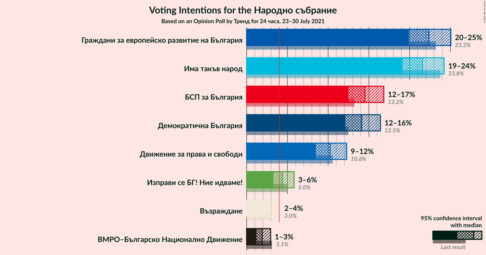
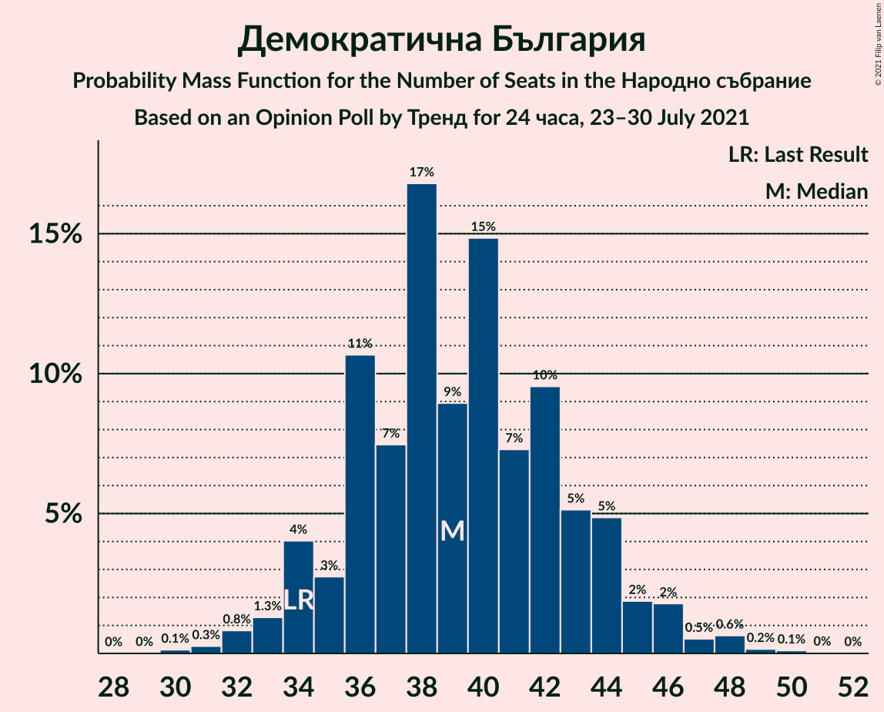

# Opinion Poll by Тренд for 24 часа, 23–30 July 2021

<a href="#voting-intentions">Voting Intentions</a> | <a href="#seats">Seats</a> | <a href="#coalitions">Coalitions</a> | <a href="#technical-information">Technical Information</a>

## Voting Intentions

### Confidence Intervals

| Party | Last Result | Poll Result | 80% Confidence Interval | 90% Confidence Interval | 95% Confidence Interval | 99% Confidence Interval |
|:-----:|:-----------:|:-----------:|:-----------------------:|:-----------------------:|:-----------------------:|:-----------------------:|
| Граждани за европейско развитие на България | 23.2% | 22.4% | 20.7–24.1% |20.3–24.6% |19.9–25.1% |19.1–25.9% |
| Има такъв народ | 23.8% | 21.6% | 20.0–23.3% |19.5–23.8% |19.1–24.2% |18.4–25.1% |
| БСП за България | 13.2% | 14.5% | 13.2–16.0% |12.8–16.5% |12.5–16.8% |11.8–17.6% |
| Демократична България | 12.5% | 14.1% | 12.8–15.6% |12.4–16.0% |12.1–16.4% |11.5–17.1% |
| Движение за права и свободи | 10.6% | 10.2% | 9.1–11.6% |8.8–11.9% |8.5–12.3% |8.0–12.9% |
| Изправи се БГ! Ние идваме! | 5.0% | 4.4% | 3.6–5.3% |3.4–5.6% |3.3–5.8% |3.0–6.3% |
| Възраждане | 3.0% | 2.9% | 2.3–3.7% |2.1–3.9% |2.0–4.1% |1.8–4.5% |
| ВМРО–Българско Национално Движение | 3.1% | 1.9% | 1.4–2.6% |1.3–2.8% |1.2–2.9% |1.0–3.3% |

*Note:* The poll result column reflects the actual value used in the calculations. Published results may vary slightly, and in addition be rounded to fewer digits.

## Seats

### Confidence Intervals

| Party | Last Result | Median | 80% Confidence Interval | 90% Confidence Interval | 95% Confidence Interval | 99% Confidence Interval |
|:-----:|:-----------:|:------:|:-----------------------:|:-----------------------:|:-----------------------:|:-----------------------:|
| <a href="#граждани-за-европейско-развитие-на-българия">Граждани за европейско развитие на България</a> | 63 | 62 | 57–68 |55–68 |54–69 |53–73 |
| <a href="#има-такъв-народ">Има такъв народ</a> | 65 | 60 | 56–65 |55–66 |54–67 |51–69 |
| <a href="#бсп-за-българия">БСП за България</a> | 36 | 41 | 37–44 |35–45 |34–46 |32–48 |
| <a href="#демократична-българия">Демократична България</a> | 34 | 40 | 36–44 |34–44 |33–46 |32–47 |
| <a href="#движение-за-права-и-свободи">Движение за права и свободи</a> | 29 | 28 | 26–33 |25–33 |24–33 |22–35 |
| <a href="#изправи-се-бг!-ние-идваме!">Изправи се БГ! Ние идваме!</a> | 13 | 12 | 0–14 |0–15 |0–16 |0–17 |
| <a href="#възраждане">Възраждане</a> | 0 | 0 | 0 |0 |0–11 |0–12 |
| <a href="#вмро–българско-национално-движение">ВМРО–Българско Национално Движение</a> | 0 | 0 | 0 |0 |0 |0 |

### Граждани за европейско развитие на България

*For a full overview of the results for this party, see the [Граждани за европейско развитие на България](party-гражданизаевропейскоразвитиенабългария.html) page.*

| Number of Seats | Probability | Accumulated | Special Marks |
|:---------------:|:-----------:|:-----------:|:-------------:|
| 50 | 0.1% | 100% |  |
| 51 | 0.1% | 99.9% |  |
| 52 | 0.1% | 99.8% |  |
| 53 | 0.2% | 99.7% |  |
| 54 | 3% | 99.5% |  |
| 55 | 3% | 97% |  |
| 56 | 1.4% | 94% |  |
| 57 | 3% | 92% |  |
| 58 | 7% | 90% |  |
| 59 | 3% | 83% |  |
| 60 | 8% | 80% |  |
| 61 | 19% | 72% |  |
| 62 | 15% | 52% | Median |
| 63 | 7% | 37% | Last Result |
| 64 | 2% | 30% |  |
| 65 | 10% | 28% |  |
| 66 | 3% | 18% |  |
| 67 | 2% | 15% |  |
| 68 | 10% | 13% |  |
| 69 | 1.4% | 3% |  |
| 70 | 0.9% | 2% |  |
| 71 | 0.3% | 1.2% |  |
| 72 | 0.1% | 0.9% |  |
| 73 | 0.6% | 0.8% |  |
| 74 | 0% | 0.2% |  |
| 75 | 0.1% | 0.2% |  |
| 76 | 0% | 0% |  |

### Има такъв народ

*For a full overview of the results for this party, see the [Има такъв народ](party-иматакъвнарод.html) page.*

| Number of Seats | Probability | Accumulated | Special Marks |
|:---------------:|:-----------:|:-----------:|:-------------:|
| 48 | 0.1% | 100% |  |
| 49 | 0% | 99.9% |  |
| 50 | 0.3% | 99.9% |  |
| 51 | 0.2% | 99.5% |  |
| 52 | 0.5% | 99.3% |  |
| 53 | 0.9% | 98.8% |  |
| 54 | 1.2% | 98% |  |
| 55 | 6% | 97% |  |
| 56 | 5% | 91% |  |
| 57 | 13% | 86% |  |
| 58 | 3% | 73% |  |
| 59 | 10% | 69% |  |
| 60 | 10% | 59% | Median |
| 61 | 11% | 49% |  |
| 62 | 14% | 38% |  |
| 63 | 4% | 25% |  |
| 64 | 4% | 20% |  |
| 65 | 11% | 16% | Last Result |
| 66 | 1.2% | 5% |  |
| 67 | 2% | 4% |  |
| 68 | 0.9% | 2% |  |
| 69 | 1.0% | 1.2% |  |
| 70 | 0% | 0.2% |  |
| 71 | 0.1% | 0.2% |  |
| 72 | 0.1% | 0.1% |  |
| 73 | 0% | 0% |  |

### БСП за България

*For a full overview of the results for this party, see the [БСП за България](party-бспзабългария.html) page.*

| Number of Seats | Probability | Accumulated | Special Marks |
|:---------------:|:-----------:|:-----------:|:-------------:|
| 31 | 0.1% | 100% |  |
| 32 | 0.4% | 99.8% |  |
| 33 | 2% | 99.4% |  |
| 34 | 1.0% | 98% |  |
| 35 | 2% | 97% |  |
| 36 | 3% | 94% | Last Result |
| 37 | 4% | 91% |  |
| 38 | 2% | 88% |  |
| 39 | 21% | 86% |  |
| 40 | 6% | 65% |  |
| 41 | 20% | 59% | Median |
| 42 | 16% | 38% |  |
| 43 | 12% | 23% |  |
| 44 | 2% | 10% |  |
| 45 | 5% | 8% |  |
| 46 | 1.2% | 3% |  |
| 47 | 1.1% | 2% |  |
| 48 | 0.3% | 0.6% |  |
| 49 | 0.1% | 0.3% |  |
| 50 | 0.2% | 0.3% |  |
| 51 | 0% | 0.1% |  |
| 52 | 0% | 0.1% |  |
| 53 | 0% | 0.1% |  |
| 54 | 0% | 0% |  |

### Демократична България

*For a full overview of the results for this party, see the [Демократична България](party-демократичнабългария.html) page.*

| Number of Seats | Probability | Accumulated | Special Marks |
|:---------------:|:-----------:|:-----------:|:-------------:|
| 30 | 0.1% | 100% |  |
| 31 | 0.2% | 99.9% |  |
| 32 | 0.9% | 99.7% |  |
| 33 | 2% | 98.8% |  |
| 34 | 3% | 97% | Last Result |
| 35 | 1.4% | 94% |  |
| 36 | 13% | 93% |  |
| 37 | 6% | 80% |  |
| 38 | 10% | 75% |  |
| 39 | 5% | 65% |  |
| 40 | 23% | 60% | Median |
| 41 | 12% | 36% |  |
| 42 | 5% | 25% |  |
| 43 | 9% | 19% |  |
| 44 | 6% | 10% |  |
| 45 | 2% | 4% |  |
| 46 | 1.2% | 3% |  |
| 47 | 0.9% | 1.4% |  |
| 48 | 0.2% | 0.5% |  |
| 49 | 0.1% | 0.3% |  |
| 50 | 0.1% | 0.2% |  |
| 51 | 0% | 0.1% |  |
| 52 | 0% | 0% |  |

### Движение за права и свободи

*For a full overview of the results for this party, see the [Движение за права и свободи](party-движениезаправаисвободи.html) page.*

| Number of Seats | Probability | Accumulated | Special Marks |
|:---------------:|:-----------:|:-----------:|:-------------:|
| 21 | 0.2% | 100% |  |
| 22 | 0.6% | 99.7% |  |
| 23 | 2% | 99.1% |  |
| 24 | 1.0% | 98% |  |
| 25 | 2% | 97% |  |
| 26 | 12% | 94% |  |
| 27 | 18% | 83% |  |
| 28 | 33% | 65% | Median |
| 29 | 3% | 32% | Last Result |
| 30 | 6% | 29% |  |
| 31 | 5% | 23% |  |
| 32 | 8% | 18% |  |
| 33 | 9% | 10% |  |
| 34 | 0.6% | 1.5% |  |
| 35 | 0.5% | 0.9% |  |
| 36 | 0.1% | 0.4% |  |
| 37 | 0.1% | 0.3% |  |
| 38 | 0.1% | 0.1% |  |
| 39 | 0.1% | 0.1% |  |
| 40 | 0% | 0% |  |

### Изправи се БГ! Ние идваме!

*For a full overview of the results for this party, see the [Изправи се БГ! Ние идваме!](party-изправисебгниеидваме.html) page.*

| Number of Seats | Probability | Accumulated | Special Marks |
|:---------------:|:-----------:|:-----------:|:-------------:|
| 0 | 35% | 100% |  |
| 1 | 0% | 65% |  |
| 2 | 0% | 65% |  |
| 3 | 0% | 65% |  |
| 4 | 0% | 65% |  |
| 5 | 0% | 65% |  |
| 6 | 0% | 65% |  |
| 7 | 0% | 65% |  |
| 8 | 0% | 65% |  |
| 9 | 0% | 65% |  |
| 10 | 0% | 65% |  |
| 11 | 8% | 65% |  |
| 12 | 18% | 56% | Median |
| 13 | 12% | 38% | Last Result |
| 14 | 21% | 26% |  |
| 15 | 3% | 6% |  |
| 16 | 1.0% | 3% |  |
| 17 | 2% | 2% |  |
| 18 | 0.1% | 0.2% |  |
| 19 | 0% | 0.1% |  |
| 20 | 0% | 0% |  |

### Възраждане

*For a full overview of the results for this party, see the [Възраждане](party-възраждане.html) page.*

| Number of Seats | Probability | Accumulated | Special Marks |
|:---------------:|:-----------:|:-----------:|:-------------:|
| 0 | 96% | 100% | Last Result, Median |
| 1 | 0% | 4% |  |
| 2 | 0% | 4% |  |
| 3 | 0% | 4% |  |
| 4 | 0% | 4% |  |
| 5 | 0% | 4% |  |
| 6 | 0% | 4% |  |
| 7 | 0% | 4% |  |
| 8 | 0% | 4% |  |
| 9 | 0% | 4% |  |
| 10 | 0% | 4% |  |
| 11 | 3% | 4% |  |
| 12 | 0.7% | 1.0% |  |
| 13 | 0.2% | 0.2% |  |
| 14 | 0% | 0.1% |  |
| 15 | 0% | 0% |  |

### ВМРО–Българско Национално Движение

*For a full overview of the results for this party, see the [ВМРО–Българско Национално Движение](party-вмро–българсконационалнодвижение.html) page.*

| Number of Seats | Probability | Accumulated | Special Marks |
|:---------------:|:-----------:|:-----------:|:-------------:|
| 0 | 100% | 100% | Last Result, Median |

## Coalitions

### Confidence Intervals

| Coalition | Last Result | Median | Majority? | 80% Confidence Interval | 90% Confidence Interval | 95% Confidence Interval | 99% Confidence Interval |
|:---------:|:-----------:|:------:|:---------:|:-----------------------:|:-----------------------:|:-----------------------:|:-----------------------:|
| Има такъв народ – БСП за България – Движение за права и свободи – Изправи се БГ! Ние идваме! | 143 | 138 | 100% | 131–144 | 131–146 | 129–147 | 126–149 |
| Има такъв народ – БСП за България – Движение за права и свободи | 130 | 130 | 97% | 123–136 | 121–138 | 119–138 | 117–144 |
| БСП за България – Движение за права и свободи – Изправи се БГ! Ние идваме! | 78 | 79 | 0% | 69–84 | 69–86 | 67–88 | 65–90 |
| БСП за България – Движение за права и свободи | 65 | 69 | 0% | 65–75 | 63–75 | 62–76 | 59–78 |

### Има такъв народ – БСП за България – Движение за права и свободи – Изправи се БГ! Ние идваме!

| Number of Seats | Probability | Accumulated | Special Marks |
|:---------------:|:-----------:|:-----------:|:-------------:|
| 122 | 0.1% | 100% |  |
| 123 | 0.1% | 99.9% |  |
| 124 | 0.1% | 99.8% |  |
| 125 | 0.1% | 99.7% |  |
| 126 | 0.6% | 99.6% |  |
| 127 | 0.8% | 99.0% |  |
| 128 | 0.3% | 98% |  |
| 129 | 1.1% | 98% |  |
| 130 | 1.1% | 97% |  |
| 131 | 10% | 96% |  |
| 132 | 1.1% | 86% |  |
| 133 | 2% | 85% |  |
| 134 | 3% | 82% |  |
| 135 | 10% | 79% |  |
| 136 | 11% | 69% |  |
| 137 | 2% | 58% |  |
| 138 | 17% | 55% |  |
| 139 | 2% | 39% |  |
| 140 | 6% | 37% |  |
| 141 | 8% | 32% | Median |
| 142 | 3% | 23% |  |
| 143 | 6% | 20% | Last Result |
| 144 | 6% | 14% |  |
| 145 | 3% | 8% |  |
| 146 | 2% | 5% |  |
| 147 | 1.0% | 3% |  |
| 148 | 0.7% | 2% |  |
| 149 | 0.8% | 1.2% |  |
| 150 | 0.1% | 0.4% |  |
| 151 | 0% | 0.3% |  |
| 152 | 0.2% | 0.2% |  |
| 153 | 0% | 0.1% |  |
| 154 | 0% | 0% |  |

### Има такъв народ – БСП за България – Движение за права и свободи

| Number of Seats | Probability | Accumulated | Special Marks |
|:---------------:|:-----------:|:-----------:|:-------------:|
| 113 | 0% | 100% |  |
| 114 | 0.1% | 99.9% |  |
| 115 | 0% | 99.8% |  |
| 116 | 0.1% | 99.8% |  |
| 117 | 0.3% | 99.7% |  |
| 118 | 1.2% | 99.4% |  |
| 119 | 1.0% | 98% |  |
| 120 | 0.5% | 97% |  |
| 121 | 2% | 97% | Majority |
| 122 | 2% | 95% |  |
| 123 | 4% | 93% |  |
| 124 | 13% | 88% |  |
| 125 | 5% | 76% |  |
| 126 | 2% | 70% |  |
| 127 | 7% | 69% |  |
| 128 | 2% | 62% |  |
| 129 | 9% | 60% | Median |
| 130 | 5% | 51% | Last Result |
| 131 | 15% | 46% |  |
| 132 | 0.6% | 31% |  |
| 133 | 4% | 30% |  |
| 134 | 3% | 26% |  |
| 135 | 7% | 23% |  |
| 136 | 8% | 15% |  |
| 137 | 2% | 8% |  |
| 138 | 4% | 6% |  |
| 139 | 0.3% | 2% |  |
| 140 | 0.5% | 2% |  |
| 141 | 0.3% | 1.3% |  |
| 142 | 0.3% | 1.0% |  |
| 143 | 0% | 0.6% |  |
| 144 | 0.5% | 0.6% |  |
| 145 | 0% | 0.1% |  |
| 146 | 0% | 0.1% |  |
| 147 | 0.1% | 0.1% |  |
| 148 | 0% | 0% |  |

### БСП за България – Движение за права и свободи – Изправи се БГ! Ние идваме!

| Number of Seats | Probability | Accumulated | Special Marks |
|:---------------:|:-----------:|:-----------:|:-------------:|
| 61 | 0.1% | 100% |  |
| 62 | 0% | 99.9% |  |
| 63 | 0.2% | 99.9% |  |
| 64 | 0.1% | 99.7% |  |
| 65 | 0.3% | 99.6% |  |
| 66 | 0.8% | 99.3% |  |
| 67 | 1.3% | 98% |  |
| 68 | 0.7% | 97% |  |
| 69 | 10% | 96% |  |
| 70 | 0.6% | 86% |  |
| 71 | 9% | 86% |  |
| 72 | 0.3% | 77% |  |
| 73 | 5% | 76% |  |
| 74 | 0.3% | 71% |  |
| 75 | 8% | 71% |  |
| 76 | 1.5% | 63% |  |
| 77 | 4% | 61% |  |
| 78 | 2% | 57% | Last Result |
| 79 | 6% | 55% |  |
| 80 | 11% | 48% |  |
| 81 | 16% | 37% | Median |
| 82 | 4% | 21% |  |
| 83 | 3% | 17% |  |
| 84 | 5% | 14% |  |
| 85 | 4% | 10% |  |
| 86 | 0.9% | 5% |  |
| 87 | 1.3% | 5% |  |
| 88 | 2% | 3% |  |
| 89 | 0.4% | 1.1% |  |
| 90 | 0.4% | 0.7% |  |
| 91 | 0.1% | 0.2% |  |
| 92 | 0.1% | 0.1% |  |
| 93 | 0% | 0.1% |  |
| 94 | 0% | 0% |  |

### БСП за България – Движение за права и свободи

| Number of Seats | Probability | Accumulated | Special Marks |
|:---------------:|:-----------:|:-----------:|:-------------:|
| 57 | 0.1% | 100% |  |
| 58 | 0.4% | 99.9% |  |
| 59 | 0.3% | 99.5% |  |
| 60 | 0.5% | 99.2% |  |
| 61 | 0.8% | 98.7% |  |
| 62 | 2% | 98% |  |
| 63 | 2% | 96% |  |
| 64 | 1.2% | 93% |  |
| 65 | 5% | 92% | Last Result |
| 66 | 6% | 88% |  |
| 67 | 17% | 81% |  |
| 68 | 10% | 64% |  |
| 69 | 17% | 54% | Median |
| 70 | 1.2% | 37% |  |
| 71 | 10% | 36% |  |
| 72 | 6% | 25% |  |
| 73 | 5% | 20% |  |
| 74 | 4% | 14% |  |
| 75 | 7% | 10% |  |
| 76 | 1.5% | 3% |  |
| 77 | 1.0% | 2% |  |
| 78 | 0.4% | 0.9% |  |
| 79 | 0.2% | 0.5% |  |
| 80 | 0.2% | 0.3% |  |
| 81 | 0% | 0.1% |  |
| 82 | 0% | 0.1% |  |
| 83 | 0% | 0% |  |

## Technical Information

### Opinion Poll

+ **Polling firm:** Тренд
+ **Commissioner(s):** 24 часа
+ **Fieldwork period:** 23–30 July 2021

### Calculations

+ **Sample size:** 1006
+ **Simulations done:** 131,072
+ **Error estimate:** 1.17%

