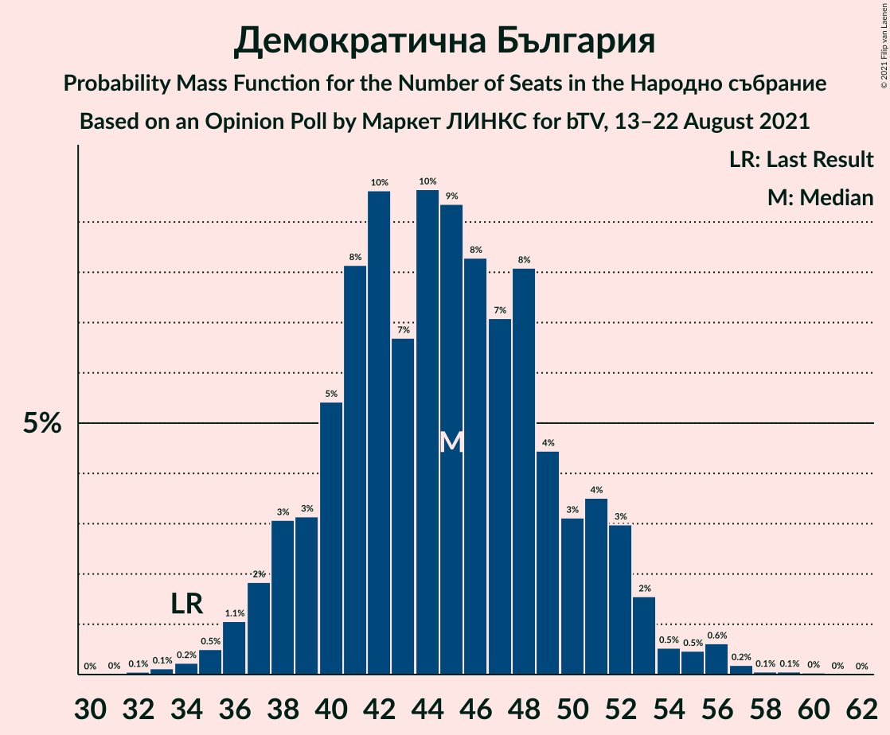
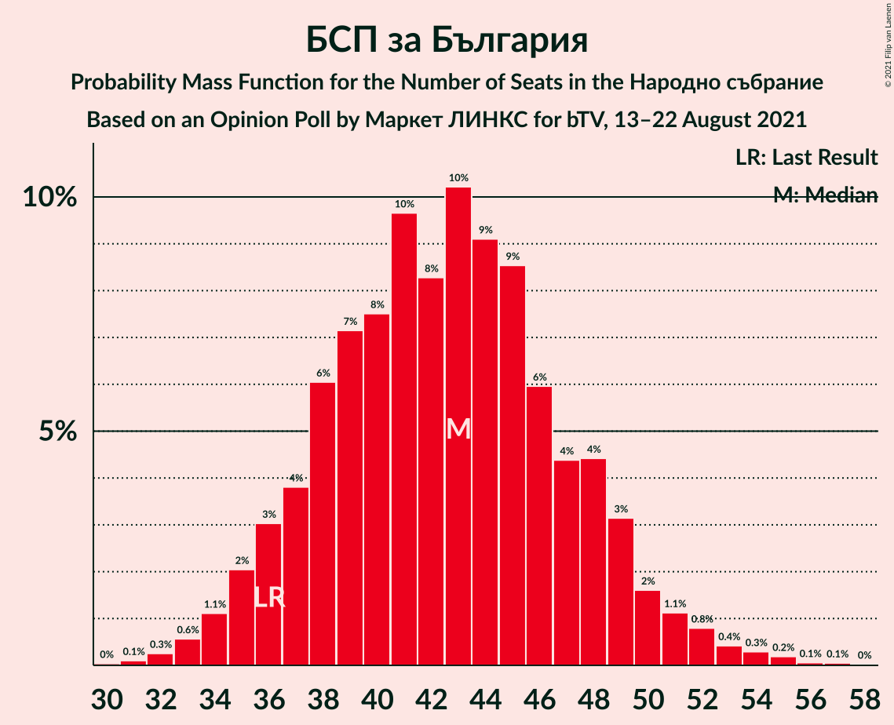

# Opinion Poll by Маркет ЛИНКС for bTV, 13–22 August 2021

<a href="#voting-intentions">Voting Intentions</a> | <a href="#seats">Seats</a> | <a href="#coalitions">Coalitions</a> | <a href="#technical-information">Technical Information</a>

## Voting Intentions

### Confidence Intervals

| Party | Last Result | Poll Result | 80% Confidence Interval | 90% Confidence Interval | 95% Confidence Interval | 99% Confidence Interval |
|:-----:|:-----------:|:-----------:|:-----------------------:|:-----------------------:|:-----------------------:|:-----------------------:|
| Граждани за европейско развитие на България | 23.2% | 23.7% | 21.5–26.1% |20.8–26.8% |20.3–27.4% |19.3–28.6% |
| Демократична България | 12.5% | 18.0% | 16.1–20.3% |15.5–20.9% |15.0–21.5% |14.1–22.6% |
| БСП за България | 13.2% | 17.1% | 15.2–19.3% |14.7–20.0% |14.2–20.5% |13.3–21.6% |
| Има такъв народ | 23.8% | 17.1% | 15.2–19.3% |14.7–20.0% |14.2–20.5% |13.3–21.6% |
| Движение за права и свободи | 10.6% | 12.0% | 10.4–14.0% |9.9–14.5% |9.6–15.0% |8.8–16.0% |
| Изправи се БГ! Ние идваме! | 5.0% | 4.9% | 3.9–6.3% |3.6–6.7% |3.4–7.1% |3.0–7.8% |
| Възраждане | 3.0% | 4.7% | 3.7–6.1% |3.5–6.5% |3.2–6.9% |2.8–7.6% |

*Note:* The poll result column reflects the actual value used in the calculations. Published results may vary slightly, and in addition be rounded to fewer digits.

## Seats

### Confidence Intervals

| Party | Last Result | Median | 80% Confidence Interval | 90% Confidence Interval | 95% Confidence Interval | 99% Confidence Interval |
|:-----:|:-----------:|:------:|:-----------------------:|:-----------------------:|:-----------------------:|:-----------------------:|
| <a href="#граждани-за-европейско-развитие-на-българия">Граждани за европейско развитие на България</a> | 63 | 58 | 53–65 |51–66 |49–68 |48–72 |
| <a href="#демократична-българия">Демократична България</a> | 34 | 45 | 39–50 |38–51 |36–53 |34–56 |
| <a href="#бсп-за-българия">БСП за България</a> | 36 | 43 | 37–48 |36–49 |35–51 |33–54 |
| <a href="#има-такъв-народ">Има такъв народ</a> | 65 | 42 | 38–48 |37–49 |35–51 |33–54 |
| <a href="#движение-за-права-и-свободи">Движение за права и свободи</a> | 29 | 29 | 25–35 |24–36 |24–37 |22–40 |
| <a href="#изправи-се-бг!-ние-идваме!">Изправи се БГ! Ние идваме!</a> | 13 | 12 | 0–16 |0–16 |0–17 |0–19 |
| <a href="#възраждане">Възраждане</a> | 0 | 12 | 0–15 |0–16 |0–17 |0–19 |

### Граждани за европейско развитие на България

*For a full overview of the results for this party, see the [Граждани за европейско развитие на България](party-гражданизаевропейскоразвитиенабългария.html) page.*

| Number of Seats | Probability | Accumulated | Special Marks |
|:---------------:|:-----------:|:-----------:|:-------------:|
| 44 | 0.1% | 100% |  |
| 45 | 0% | 99.9% |  |
| 46 | 0.1% | 99.9% |  |
| 47 | 0.2% | 99.8% |  |
| 48 | 0.5% | 99.5% |  |
| 49 | 2% | 99.0% |  |
| 50 | 1.1% | 97% |  |
| 51 | 2% | 96% |  |
| 52 | 2% | 94% |  |
| 53 | 5% | 92% |  |
| 54 | 7% | 87% |  |
| 55 | 14% | 80% |  |
| 56 | 4% | 66% |  |
| 57 | 7% | 62% |  |
| 58 | 7% | 55% | Median |
| 59 | 13% | 48% |  |
| 60 | 7% | 35% |  |
| 61 | 6% | 28% |  |
| 62 | 6% | 22% |  |
| 63 | 4% | 17% | Last Result |
| 64 | 3% | 13% |  |
| 65 | 3% | 10% |  |
| 66 | 3% | 7% |  |
| 67 | 0.5% | 3% |  |
| 68 | 0.6% | 3% |  |
| 69 | 0.5% | 2% |  |
| 70 | 0.3% | 1.4% |  |
| 71 | 0.4% | 1.1% |  |
| 72 | 0.3% | 0.8% |  |
| 73 | 0.3% | 0.5% |  |
| 74 | 0.1% | 0.1% |  |
| 75 | 0% | 0.1% |  |
| 76 | 0% | 0.1% |  |
| 77 | 0% | 0.1% |  |
| 78 | 0% | 0% |  |

### Демократична България

*For a full overview of the results for this party, see the [Демократична България](party-демократичнабългария.html) page.*

| Number of Seats | Probability | Accumulated | Special Marks |
|:---------------:|:-----------:|:-----------:|:-------------:|
| 32 | 0% | 100% |  |
| 33 | 0.1% | 99.9% |  |
| 34 | 0.4% | 99.8% | Last Result |
| 35 | 0.6% | 99.5% |  |
| 36 | 1.5% | 98.9% |  |
| 37 | 0.8% | 97% |  |
| 38 | 2% | 97% |  |
| 39 | 5% | 95% |  |
| 40 | 8% | 90% |  |
| 41 | 4% | 82% |  |
| 42 | 4% | 78% |  |
| 43 | 6% | 74% |  |
| 44 | 15% | 68% |  |
| 45 | 14% | 53% | Median |
| 46 | 7% | 40% |  |
| 47 | 7% | 32% |  |
| 48 | 8% | 25% |  |
| 49 | 3% | 17% |  |
| 50 | 4% | 14% |  |
| 51 | 5% | 10% |  |
| 52 | 2% | 5% |  |
| 53 | 0.8% | 3% |  |
| 54 | 0.4% | 2% |  |
| 55 | 0.4% | 2% |  |
| 56 | 0.9% | 1.2% |  |
| 57 | 0.2% | 0.4% |  |
| 58 | 0.1% | 0.2% |  |
| 59 | 0.1% | 0.1% |  |
| 60 | 0% | 0% |  |

### БСП за България

*For a full overview of the results for this party, see the [БСП за България](party-бспзабългария.html) page.*

| Number of Seats | Probability | Accumulated | Special Marks |
|:---------------:|:-----------:|:-----------:|:-------------:|
| 30 | 0% | 100% |  |
| 31 | 0.1% | 99.9% |  |
| 32 | 0.4% | 99.9% |  |
| 33 | 0.5% | 99.5% |  |
| 34 | 1.1% | 99.0% |  |
| 35 | 2% | 98% |  |
| 36 | 3% | 96% | Last Result |
| 37 | 5% | 93% |  |
| 38 | 8% | 87% |  |
| 39 | 7% | 79% |  |
| 40 | 5% | 72% |  |
| 41 | 4% | 67% |  |
| 42 | 5% | 63% |  |
| 43 | 9% | 58% | Median |
| 44 | 12% | 48% |  |
| 45 | 12% | 36% |  |
| 46 | 5% | 24% |  |
| 47 | 8% | 19% |  |
| 48 | 4% | 11% |  |
| 49 | 2% | 7% |  |
| 50 | 2% | 5% |  |
| 51 | 2% | 3% |  |
| 52 | 0.5% | 2% |  |
| 53 | 0.3% | 1.0% |  |
| 54 | 0.5% | 0.7% |  |
| 55 | 0.2% | 0.3% |  |
| 56 | 0% | 0.1% |  |
| 57 | 0% | 0.1% |  |
| 58 | 0% | 0% |  |

### Има такъв народ

*For a full overview of the results for this party, see the [Има такъв народ](party-иматакъвнарод.html) page.*

| Number of Seats | Probability | Accumulated | Special Marks |
|:---------------:|:-----------:|:-----------:|:-------------:|
| 30 | 0% | 100% |  |
| 31 | 0.1% | 99.9% |  |
| 32 | 0.2% | 99.9% |  |
| 33 | 0.3% | 99.7% |  |
| 34 | 0.9% | 99.4% |  |
| 35 | 2% | 98.5% |  |
| 36 | 1.0% | 97% |  |
| 37 | 3% | 96% |  |
| 38 | 3% | 93% |  |
| 39 | 9% | 90% |  |
| 40 | 7% | 81% |  |
| 41 | 15% | 74% |  |
| 42 | 9% | 58% | Median |
| 43 | 9% | 49% |  |
| 44 | 14% | 40% |  |
| 45 | 6% | 26% |  |
| 46 | 5% | 20% |  |
| 47 | 4% | 15% |  |
| 48 | 3% | 10% |  |
| 49 | 2% | 7% |  |
| 50 | 1.5% | 5% |  |
| 51 | 2% | 3% |  |
| 52 | 0.5% | 2% |  |
| 53 | 0.3% | 1.0% |  |
| 54 | 0.5% | 0.7% |  |
| 55 | 0.1% | 0.2% |  |
| 56 | 0.1% | 0.1% |  |
| 57 | 0% | 0.1% |  |
| 58 | 0% | 0% |  |
| 59 | 0% | 0% |  |
| 60 | 0% | 0% |  |
| 61 | 0% | 0% |  |
| 62 | 0% | 0% |  |
| 63 | 0% | 0% |  |
| 64 | 0% | 0% |  |
| 65 | 0% | 0% | Last Result |

### Движение за права и свободи

*For a full overview of the results for this party, see the [Движение за права и свободи](party-движениезаправаисвободи.html) page.*

| Number of Seats | Probability | Accumulated | Special Marks |
|:---------------:|:-----------:|:-----------:|:-------------:|
| 20 | 0.1% | 100% |  |
| 21 | 0.3% | 99.9% |  |
| 22 | 0.7% | 99.6% |  |
| 23 | 1.1% | 98.9% |  |
| 24 | 3% | 98% |  |
| 25 | 8% | 95% |  |
| 26 | 5% | 87% |  |
| 27 | 11% | 82% |  |
| 28 | 6% | 71% |  |
| 29 | 18% | 65% | Last Result, Median |
| 30 | 7% | 47% |  |
| 31 | 8% | 40% |  |
| 32 | 8% | 32% |  |
| 33 | 8% | 24% |  |
| 34 | 5% | 16% |  |
| 35 | 2% | 10% |  |
| 36 | 4% | 8% |  |
| 37 | 2% | 4% |  |
| 38 | 0.7% | 2% |  |
| 39 | 0.4% | 1.1% |  |
| 40 | 0.5% | 0.7% |  |
| 41 | 0.1% | 0.3% |  |
| 42 | 0.1% | 0.1% |  |
| 43 | 0% | 0.1% |  |
| 44 | 0% | 0% |  |

### Изправи се БГ! Ние идваме!

*For a full overview of the results for this party, see the [Изправи се БГ! Ние идваме!](party-изправисебгниеидваме.html) page.*

| Number of Seats | Probability | Accumulated | Special Marks |
|:---------------:|:-----------:|:-----------:|:-------------:|
| 0 | 13% | 100% |  |
| 1 | 0% | 87% |  |
| 2 | 0% | 87% |  |
| 3 | 0% | 87% |  |
| 4 | 0% | 87% |  |
| 5 | 0% | 87% |  |
| 6 | 0% | 87% |  |
| 7 | 0% | 87% |  |
| 8 | 0% | 87% |  |
| 9 | 0% | 87% |  |
| 10 | 9% | 87% |  |
| 11 | 11% | 78% |  |
| 12 | 20% | 68% | Median |
| 13 | 9% | 48% | Last Result |
| 14 | 20% | 39% |  |
| 15 | 9% | 19% |  |
| 16 | 6% | 10% |  |
| 17 | 2% | 4% |  |
| 18 | 2% | 2% |  |
| 19 | 0.4% | 0.7% |  |
| 20 | 0.2% | 0.3% |  |
| 21 | 0.1% | 0.1% |  |
| 22 | 0% | 0% |  |

### Възраждане

*For a full overview of the results for this party, see the [Възраждане](party-възраждане.html) page.*

| Number of Seats | Probability | Accumulated | Special Marks |
|:---------------:|:-----------:|:-----------:|:-------------:|
| 0 | 18% | 100% | Last Result |
| 1 | 0% | 82% |  |
| 2 | 0% | 82% |  |
| 3 | 0% | 82% |  |
| 4 | 0% | 82% |  |
| 5 | 0% | 82% |  |
| 6 | 0% | 82% |  |
| 7 | 0% | 82% |  |
| 8 | 0% | 82% |  |
| 9 | 0% | 82% |  |
| 10 | 5% | 82% |  |
| 11 | 19% | 77% |  |
| 12 | 21% | 58% | Median |
| 13 | 15% | 37% |  |
| 14 | 8% | 22% |  |
| 15 | 7% | 14% |  |
| 16 | 4% | 7% |  |
| 17 | 2% | 3% |  |
| 18 | 0.7% | 1.3% |  |
| 19 | 0.4% | 0.6% |  |
| 20 | 0.1% | 0.2% |  |
| 21 | 0% | 0.1% |  |
| 22 | 0% | 0% |  |

## Coalitions

### Confidence Intervals

| Coalition | Last Result | Median | Majority? | 80% Confidence Interval | 90% Confidence Interval | 95% Confidence Interval | 99% Confidence Interval |
|:---------:|:-----------:|:------:|:---------:|:-----------------------:|:-----------------------:|:-----------------------:|:-----------------------:|
| БСП за България – Има такъв народ – Движение за права и свободи – Изправи се БГ! Ние идваме! | 143 | 127 | 83% | 120–134 | 117–138 | 114–140 | 112–142 |
| БСП за България – Има такъв народ – Движение за права и свободи | 130 | 115 | 15% | 108–123 | 106–126 | 104–128 | 101–135 |
| БСП за България – Движение за права и свободи – Изправи се БГ! Ние идваме! | 78 | 85 | 0% | 75–91 | 74–93 | 72–95 | 68–98 |
| БСП за България – Движение за права и свободи | 65 | 73 | 0% | 66–79 | 63–81 | 63–83 | 60–87 |

### БСП за България – Има такъв народ – Движение за права и свободи – Изправи се БГ! Ние идваме!

| Number of Seats | Probability | Accumulated | Special Marks |
|:---------------:|:-----------:|:-----------:|:-------------:|
| 105 | 0% | 100% |  |
| 106 | 0% | 99.9% |  |
| 107 | 0.1% | 99.9% |  |
| 108 | 0% | 99.9% |  |
| 109 | 0.1% | 99.9% |  |
| 110 | 0.1% | 99.7% |  |
| 111 | 0.1% | 99.7% |  |
| 112 | 1.2% | 99.6% |  |
| 113 | 0.5% | 98% |  |
| 114 | 0.8% | 98% |  |
| 115 | 0.4% | 97% |  |
| 116 | 1.5% | 97% |  |
| 117 | 2% | 95% |  |
| 118 | 1.4% | 93% |  |
| 119 | 2% | 92% |  |
| 120 | 7% | 90% |  |
| 121 | 3% | 83% | Majority |
| 122 | 5% | 81% |  |
| 123 | 5% | 76% |  |
| 124 | 4% | 71% |  |
| 125 | 8% | 67% |  |
| 126 | 6% | 59% | Median |
| 127 | 5% | 52% |  |
| 128 | 11% | 47% |  |
| 129 | 13% | 37% |  |
| 130 | 7% | 24% |  |
| 131 | 3% | 17% |  |
| 132 | 2% | 14% |  |
| 133 | 1.4% | 12% |  |
| 134 | 1.2% | 11% |  |
| 135 | 2% | 10% |  |
| 136 | 0.7% | 8% |  |
| 137 | 2% | 7% |  |
| 138 | 1.0% | 5% |  |
| 139 | 0.5% | 4% |  |
| 140 | 1.3% | 3% |  |
| 141 | 1.2% | 2% |  |
| 142 | 0.7% | 0.9% |  |
| 143 | 0.1% | 0.3% | Last Result |
| 144 | 0% | 0.2% |  |
| 145 | 0% | 0.1% |  |
| 146 | 0% | 0.1% |  |
| 147 | 0% | 0.1% |  |
| 148 | 0% | 0% |  |

### БСП за България – Има такъв народ – Движение за права и свободи

| Number of Seats | Probability | Accumulated | Special Marks |
|:---------------:|:-----------:|:-----------:|:-------------:|
| 97 | 0% | 100% |  |
| 98 | 0.1% | 99.9% |  |
| 99 | 0.1% | 99.9% |  |
| 100 | 0.1% | 99.8% |  |
| 101 | 0.2% | 99.6% |  |
| 102 | 0.6% | 99.4% |  |
| 103 | 0.4% | 98.8% |  |
| 104 | 1.1% | 98% |  |
| 105 | 2% | 97% |  |
| 106 | 3% | 95% |  |
| 107 | 1.1% | 92% |  |
| 108 | 2% | 91% |  |
| 109 | 2% | 89% |  |
| 110 | 5% | 87% |  |
| 111 | 5% | 82% |  |
| 112 | 6% | 78% |  |
| 113 | 14% | 71% |  |
| 114 | 5% | 57% | Median |
| 115 | 12% | 53% |  |
| 116 | 7% | 41% |  |
| 117 | 4% | 33% |  |
| 118 | 7% | 29% |  |
| 119 | 2% | 23% |  |
| 120 | 6% | 21% |  |
| 121 | 3% | 15% | Majority |
| 122 | 1.1% | 13% |  |
| 123 | 3% | 11% |  |
| 124 | 2% | 9% |  |
| 125 | 1.3% | 7% |  |
| 126 | 2% | 6% |  |
| 127 | 1.2% | 4% |  |
| 128 | 1.0% | 3% |  |
| 129 | 0.5% | 2% |  |
| 130 | 0.2% | 1.3% | Last Result |
| 131 | 0.1% | 1.1% |  |
| 132 | 0.2% | 1.0% |  |
| 133 | 0% | 0.8% |  |
| 134 | 0.2% | 0.8% |  |
| 135 | 0.5% | 0.6% |  |
| 136 | 0% | 0.1% |  |
| 137 | 0.1% | 0.1% |  |
| 138 | 0% | 0% |  |

### БСП за България – Движение за права и свободи – Изправи се БГ! Ние идваме!

| Number of Seats | Probability | Accumulated | Special Marks |
|:---------------:|:-----------:|:-----------:|:-------------:|
| 63 | 0% | 100% |  |
| 64 | 0% | 99.9% |  |
| 65 | 0% | 99.9% |  |
| 66 | 0.2% | 99.9% |  |
| 67 | 0.1% | 99.7% |  |
| 68 | 0.6% | 99.7% |  |
| 69 | 0.5% | 99.1% |  |
| 70 | 0.8% | 98.6% |  |
| 71 | 0.1% | 98% |  |
| 72 | 0.2% | 98% |  |
| 73 | 1.3% | 97% |  |
| 74 | 3% | 96% |  |
| 75 | 4% | 93% |  |
| 76 | 3% | 90% |  |
| 77 | 2% | 87% |  |
| 78 | 1.5% | 85% | Last Result |
| 79 | 5% | 83% |  |
| 80 | 0.7% | 78% |  |
| 81 | 13% | 77% |  |
| 82 | 3% | 64% |  |
| 83 | 9% | 61% |  |
| 84 | 2% | 52% | Median |
| 85 | 7% | 50% |  |
| 86 | 5% | 43% |  |
| 87 | 4% | 38% |  |
| 88 | 15% | 34% |  |
| 89 | 6% | 18% |  |
| 90 | 2% | 13% |  |
| 91 | 3% | 11% |  |
| 92 | 2% | 8% |  |
| 93 | 1.0% | 6% |  |
| 94 | 2% | 5% |  |
| 95 | 0.7% | 3% |  |
| 96 | 0.6% | 2% |  |
| 97 | 0.9% | 1.5% |  |
| 98 | 0.2% | 0.6% |  |
| 99 | 0.1% | 0.4% |  |
| 100 | 0.1% | 0.3% |  |
| 101 | 0.1% | 0.2% |  |
| 102 | 0% | 0.1% |  |
| 103 | 0.1% | 0.1% |  |
| 104 | 0% | 0.1% |  |
| 105 | 0% | 0% |  |

### БСП за България – Движение за права и свободи

| Number of Seats | Probability | Accumulated | Special Marks |
|:---------------:|:-----------:|:-----------:|:-------------:|
| 57 | 0% | 100% |  |
| 58 | 0.1% | 99.9% |  |
| 59 | 0.2% | 99.8% |  |
| 60 | 0.5% | 99.6% |  |
| 61 | 0.4% | 99.1% |  |
| 62 | 0.9% | 98.7% |  |
| 63 | 3% | 98% |  |
| 64 | 1.1% | 94% |  |
| 65 | 2% | 93% | Last Result |
| 66 | 2% | 91% |  |
| 67 | 4% | 89% |  |
| 68 | 6% | 84% |  |
| 69 | 8% | 78% |  |
| 70 | 5% | 71% |  |
| 71 | 8% | 66% |  |
| 72 | 7% | 58% | Median |
| 73 | 6% | 51% |  |
| 74 | 13% | 45% |  |
| 75 | 4% | 31% |  |
| 76 | 8% | 27% |  |
| 77 | 4% | 20% |  |
| 78 | 4% | 16% |  |
| 79 | 3% | 12% |  |
| 80 | 3% | 9% |  |
| 81 | 1.0% | 6% |  |
| 82 | 2% | 5% |  |
| 83 | 1.4% | 3% |  |
| 84 | 0.4% | 2% |  |
| 85 | 0.6% | 2% |  |
| 86 | 0.3% | 0.9% |  |
| 87 | 0.2% | 0.5% |  |
| 88 | 0.2% | 0.3% |  |
| 89 | 0.1% | 0.2% |  |
| 90 | 0% | 0.1% |  |
| 91 | 0% | 0.1% |  |
| 92 | 0% | 0% |  |

## Technical Information

### Opinion Poll

+ **Polling firm:** Маркет ЛИНКС
+ **Commissioner(s):** bTV
+ **Fieldwork period:** 13–22 August 2021

### Calculations

+ **Sample size:** 549
+ **Simulations done:** 131,072
+ **Error estimate:** 2.67%

