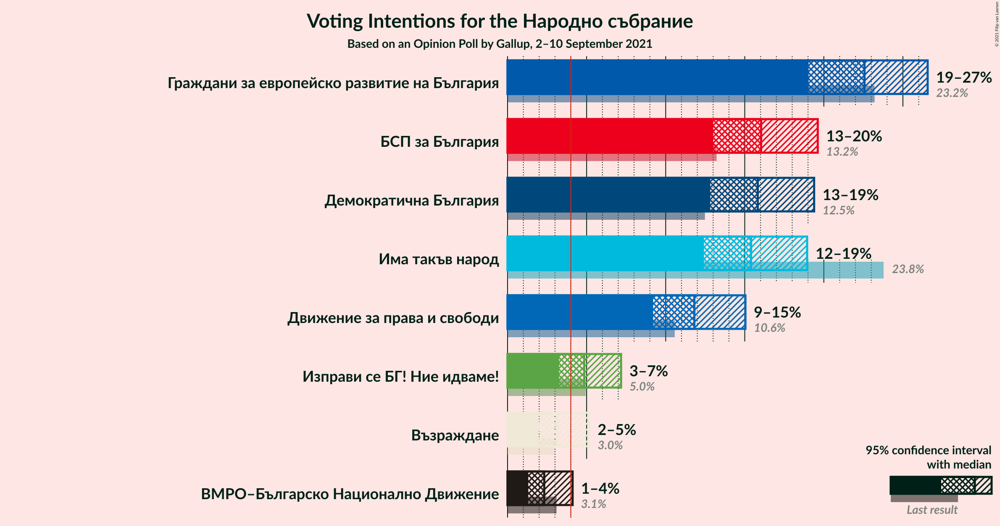
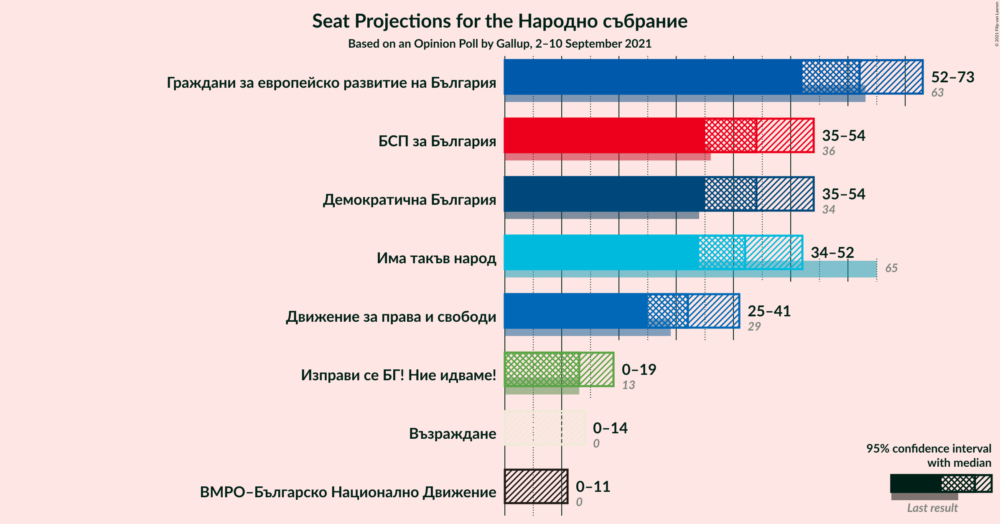
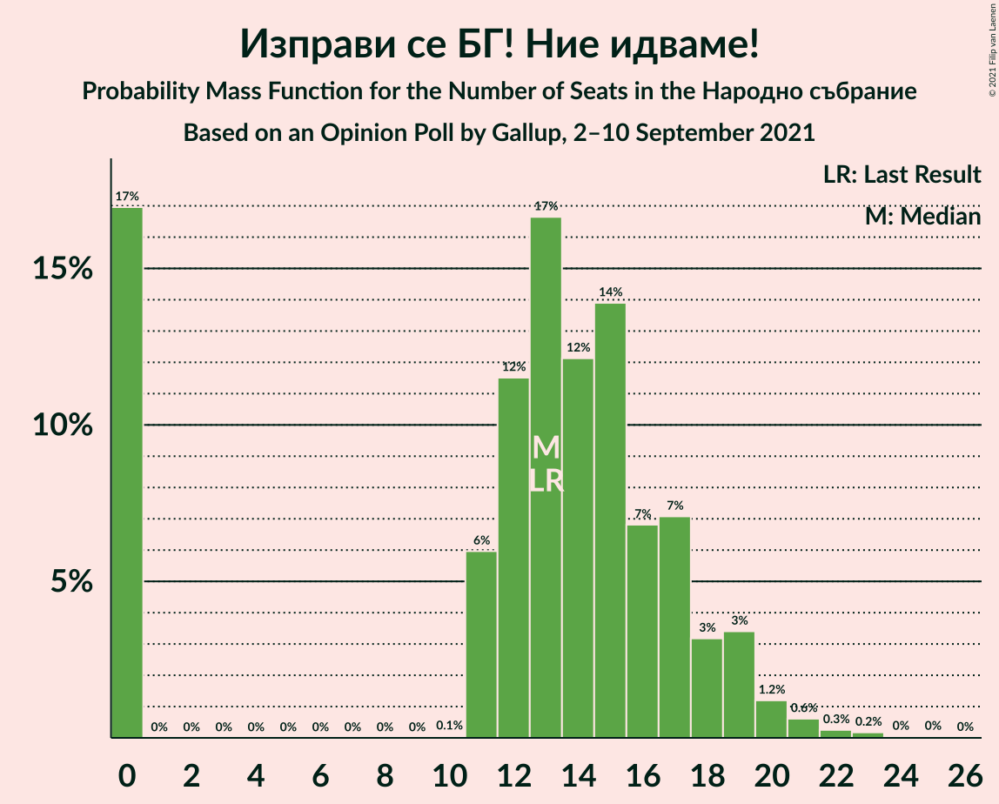
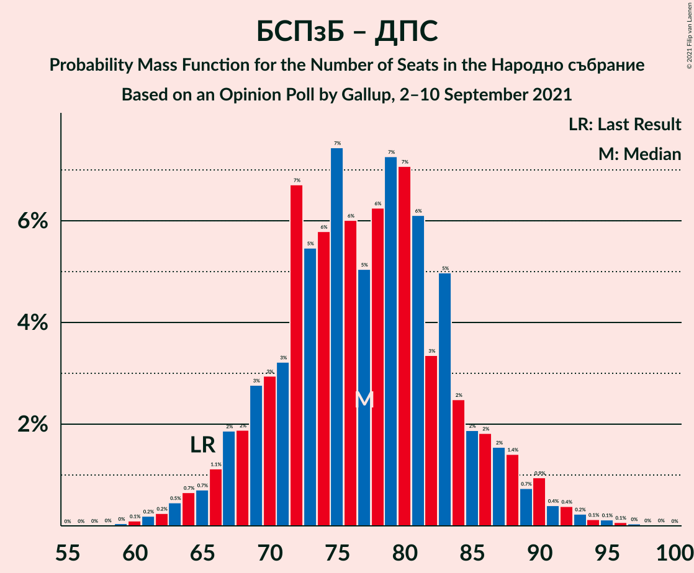

# Opinion Poll by Gallup, 2–10 September 2021

<a href="#voting-intentions">Voting Intentions</a> | <a href="#seats">Seats</a> | <a href="#coalitions">Coalitions</a> | <a href="#technical-information">Technical Information</a>

## Voting Intentions

### Confidence Intervals

| Party | Last Result | Poll Result | 80% Confidence Interval | 90% Confidence Interval | 95% Confidence Interval | 99% Confidence Interval |
|:-----:|:-----------:|:-----------:|:-----------------------:|:-----------------------:|:-----------------------:|:-----------------------:|
| Граждани за европейско развитие на България | 23.2% | 22.6% | 20.2–25.2% |19.6–25.9% |19.0–26.6% |18.0–27.8% |
| БСП за България | 13.2% | 16.0% | 14.0–18.4% |13.5–19.0% |13.0–19.6% |12.1–20.8% |
| Демократична България | 12.5% | 15.8% | 13.8–18.2% |13.3–18.8% |12.8–19.4% |11.9–20.5% |
| Има такъв народ | 23.8% | 15.4% | 13.4–17.7% |12.9–18.4% |12.4–18.9% |11.5–20.1% |
| Движение за права и свободи | 10.6% | 11.8% | 10.1–13.9% |9.6–14.5% |9.2–15.0% |8.4–16.1% |
| Изправи се БГ! Ние идваме! | 5.0% | 4.9% | 3.8–6.4% |3.5–6.8% |3.3–7.2% |2.8–8.0% |
| Възраждане | 3.0% | 3.2% | 2.3–4.5% |2.1–4.8% |1.9–5.2% |1.6–5.9% |
| ВМРО–Българско Национално Движение | 3.1% | 2.3% | 1.6–3.5% |1.5–3.8% |1.3–4.1% |1.0–4.7% |

*Note:* The poll result column reflects the actual value used in the calculations. Published results may vary slightly, and in addition be rounded to fewer digits.

## Seats

### Confidence Intervals

| Party | Last Result | Median | 80% Confidence Interval | 90% Confidence Interval | 95% Confidence Interval | 99% Confidence Interval |
|:-----:|:-----------:|:------:|:-----------------------:|:-----------------------:|:-----------------------:|:-----------------------:|
| <a href="#граждани-за-европейско-развитие-на-българия">Граждани за европейско развитие на България</a> | 63 | 62 | 55–69 |53–70 |52–72 |49–76 |
| <a href="#бсп-за-българия">БСП за България</a> | 36 | 43 | 39–50 |37–54 |35–55 |33–57 |
| <a href="#демократична-българия">Демократична България</a> | 34 | 46 | 37–49 |37–52 |35–53 |32–55 |
| <a href="#има-такъв-народ">Има такъв народ</a> | 65 | 44 | 37–48 |35–50 |34–52 |31–55 |
| <a href="#движение-за-права-и-свободи">Движение за права и свободи</a> | 29 | 31 | 28–38 |27–39 |25–41 |22–44 |
| <a href="#изправи-се-бг!-ние-идваме!">Изправи се БГ! Ние идваме!</a> | 13 | 14 | 0–17 |0–18 |0–19 |0–22 |
| <a href="#възраждане">Възраждане</a> | 0 | 0 | 0–12 |0–13 |0–13 |0–15 |
| <a href="#вмро–българско-национално-движение">ВМРО–Българско Национално Движение</a> | 0 | 0 | 0 |0 |0 |0–12 |

### Граждани за европейско развитие на България

*For a full overview of the results for this party, see the [Граждани за европейско развитие на България](party-гражданизаевропейскоразвитиенабългария.html) page.*

| Number of Seats | Probability | Accumulated | Special Marks |
|:---------------:|:-----------:|:-----------:|:-------------:|
| 46 | 0.1% | 100% |  |
| 47 | 0% | 99.9% |  |
| 48 | 0.2% | 99.9% |  |
| 49 | 0.5% | 99.7% |  |
| 50 | 0.3% | 99.1% |  |
| 51 | 0.9% | 98.9% |  |
| 52 | 2% | 98% |  |
| 53 | 2% | 96% |  |
| 54 | 0.9% | 94% |  |
| 55 | 4% | 93% |  |
| 56 | 4% | 89% |  |
| 57 | 1.0% | 85% |  |
| 58 | 9% | 84% |  |
| 59 | 5% | 75% |  |
| 60 | 6% | 70% |  |
| 61 | 3% | 64% |  |
| 62 | 24% | 61% | Median |
| 63 | 1.3% | 37% | Last Result |
| 64 | 6% | 36% |  |
| 65 | 4% | 30% |  |
| 66 | 2% | 26% |  |
| 67 | 6% | 24% |  |
| 68 | 2% | 18% |  |
| 69 | 9% | 16% |  |
| 70 | 3% | 7% |  |
| 71 | 1.0% | 4% |  |
| 72 | 0.7% | 3% |  |
| 73 | 1.1% | 2% |  |
| 74 | 0.2% | 0.9% |  |
| 75 | 0.1% | 0.7% |  |
| 76 | 0.2% | 0.6% |  |
| 77 | 0.1% | 0.5% |  |
| 78 | 0.1% | 0.4% |  |
| 79 | 0% | 0.3% |  |
| 80 | 0% | 0.3% |  |
| 81 | 0.2% | 0.3% |  |
| 82 | 0% | 0% |  |

### БСП за България

*For a full overview of the results for this party, see the [БСП за България](party-бспзабългария.html) page.*

| Number of Seats | Probability | Accumulated | Special Marks |
|:---------------:|:-----------:|:-----------:|:-------------:|
| 31 | 0.1% | 100% |  |
| 32 | 0.2% | 99.9% |  |
| 33 | 0.9% | 99.7% |  |
| 34 | 0.9% | 98.8% |  |
| 35 | 2% | 98% |  |
| 36 | 0.4% | 96% | Last Result |
| 37 | 1.3% | 96% |  |
| 38 | 4% | 94% |  |
| 39 | 6% | 90% |  |
| 40 | 4% | 84% |  |
| 41 | 24% | 81% |  |
| 42 | 5% | 57% |  |
| 43 | 4% | 52% | Median |
| 44 | 3% | 48% |  |
| 45 | 8% | 45% |  |
| 46 | 2% | 37% |  |
| 47 | 8% | 35% |  |
| 48 | 5% | 27% |  |
| 49 | 11% | 22% |  |
| 50 | 2% | 11% |  |
| 51 | 0.3% | 9% |  |
| 52 | 2% | 8% |  |
| 53 | 1.0% | 6% |  |
| 54 | 3% | 6% |  |
| 55 | 0.2% | 3% |  |
| 56 | 0.4% | 2% |  |
| 57 | 2% | 2% |  |
| 58 | 0.1% | 0.2% |  |
| 59 | 0.1% | 0.1% |  |
| 60 | 0% | 0.1% |  |
| 61 | 0% | 0% |  |

### Демократична България

*For a full overview of the results for this party, see the [Демократична България](party-демократичнабългария.html) page.*

| Number of Seats | Probability | Accumulated | Special Marks |
|:---------------:|:-----------:|:-----------:|:-------------:|
| 30 | 0.1% | 100% |  |
| 31 | 0.3% | 99.9% |  |
| 32 | 0.2% | 99.6% |  |
| 33 | 0.7% | 99.4% |  |
| 34 | 1.2% | 98.7% | Last Result |
| 35 | 0.8% | 98% |  |
| 36 | 1.3% | 97% |  |
| 37 | 6% | 95% |  |
| 38 | 1.3% | 90% |  |
| 39 | 6% | 89% |  |
| 40 | 3% | 83% |  |
| 41 | 2% | 80% |  |
| 42 | 4% | 78% |  |
| 43 | 9% | 74% |  |
| 44 | 2% | 65% |  |
| 45 | 11% | 63% |  |
| 46 | 25% | 52% | Median |
| 47 | 11% | 28% |  |
| 48 | 6% | 16% |  |
| 49 | 3% | 10% |  |
| 50 | 1.3% | 7% |  |
| 51 | 0.2% | 6% |  |
| 52 | 2% | 6% |  |
| 53 | 3% | 4% |  |
| 54 | 0.5% | 1.1% |  |
| 55 | 0.2% | 0.6% |  |
| 56 | 0.1% | 0.4% |  |
| 57 | 0.1% | 0.4% |  |
| 58 | 0.1% | 0.2% |  |
| 59 | 0.1% | 0.2% |  |
| 60 | 0% | 0.1% |  |
| 61 | 0.1% | 0.1% |  |
| 62 | 0% | 0% |  |

### Има такъв народ

*For a full overview of the results for this party, see the [Има такъв народ](party-иматакъвнарод.html) page.*

| Number of Seats | Probability | Accumulated | Special Marks |
|:---------------:|:-----------:|:-----------:|:-------------:|
| 29 | 0% | 100% |  |
| 30 | 0.1% | 99.9% |  |
| 31 | 0.4% | 99.8% |  |
| 32 | 0.8% | 99.4% |  |
| 33 | 1.0% | 98.6% |  |
| 34 | 2% | 98% |  |
| 35 | 1.1% | 96% |  |
| 36 | 2% | 95% |  |
| 37 | 5% | 93% |  |
| 38 | 7% | 88% |  |
| 39 | 6% | 81% |  |
| 40 | 9% | 75% |  |
| 41 | 4% | 66% |  |
| 42 | 4% | 62% |  |
| 43 | 7% | 58% |  |
| 44 | 5% | 51% | Median |
| 45 | 22% | 45% |  |
| 46 | 9% | 23% |  |
| 47 | 4% | 14% |  |
| 48 | 4% | 10% |  |
| 49 | 1.2% | 7% |  |
| 50 | 0.8% | 5% |  |
| 51 | 0.4% | 5% |  |
| 52 | 2% | 4% |  |
| 53 | 0.3% | 2% |  |
| 54 | 1.4% | 2% |  |
| 55 | 0.3% | 0.5% |  |
| 56 | 0.1% | 0.3% |  |
| 57 | 0.1% | 0.2% |  |
| 58 | 0.1% | 0.1% |  |
| 59 | 0% | 0% |  |
| 60 | 0% | 0% |  |
| 61 | 0% | 0% |  |
| 62 | 0% | 0% |  |
| 63 | 0% | 0% |  |
| 64 | 0% | 0% |  |
| 65 | 0% | 0% | Last Result |

### Движение за права и свободи

*For a full overview of the results for this party, see the [Движение за права и свободи](party-движениезаправаисвободи.html) page.*

| Number of Seats | Probability | Accumulated | Special Marks |
|:---------------:|:-----------:|:-----------:|:-------------:|
| 21 | 0.1% | 100% |  |
| 22 | 0.6% | 99.9% |  |
| 23 | 0.1% | 99.3% |  |
| 24 | 0.8% | 99.1% |  |
| 25 | 2% | 98% |  |
| 26 | 1.0% | 96% |  |
| 27 | 4% | 95% |  |
| 28 | 4% | 91% |  |
| 29 | 6% | 88% | Last Result |
| 30 | 7% | 81% |  |
| 31 | 25% | 74% | Median |
| 32 | 2% | 50% |  |
| 33 | 12% | 47% |  |
| 34 | 3% | 36% |  |
| 35 | 6% | 33% |  |
| 36 | 3% | 26% |  |
| 37 | 12% | 23% |  |
| 38 | 2% | 11% |  |
| 39 | 5% | 9% |  |
| 40 | 0.6% | 3% |  |
| 41 | 1.4% | 3% |  |
| 42 | 0% | 2% |  |
| 43 | 0.6% | 2% |  |
| 44 | 0.5% | 0.9% |  |
| 45 | 0.2% | 0.4% |  |
| 46 | 0% | 0.3% |  |
| 47 | 0.2% | 0.2% |  |
| 48 | 0% | 0% |  |

### Изправи се БГ! Ние идваме!

*For a full overview of the results for this party, see the [Изправи се БГ! Ние идваме!](party-изправисебгниеидваме.html) page.*

| Number of Seats | Probability | Accumulated | Special Marks |
|:---------------:|:-----------:|:-----------:|:-------------:|
| 0 | 21% | 100% |  |
| 1 | 0% | 79% |  |
| 2 | 0% | 79% |  |
| 3 | 0% | 79% |  |
| 4 | 0% | 79% |  |
| 5 | 0% | 79% |  |
| 6 | 0% | 79% |  |
| 7 | 0% | 79% |  |
| 8 | 0% | 79% |  |
| 9 | 0% | 79% |  |
| 10 | 0% | 79% |  |
| 11 | 7% | 79% |  |
| 12 | 9% | 72% |  |
| 13 | 10% | 63% | Last Result |
| 14 | 6% | 53% | Median |
| 15 | 29% | 48% |  |
| 16 | 2% | 19% |  |
| 17 | 7% | 17% |  |
| 18 | 6% | 9% |  |
| 19 | 0.8% | 3% |  |
| 20 | 0.7% | 2% |  |
| 21 | 0.9% | 1.4% |  |
| 22 | 0.1% | 0.5% |  |
| 23 | 0.2% | 0.4% |  |
| 24 | 0.1% | 0.2% |  |
| 25 | 0.1% | 0.1% |  |
| 26 | 0% | 0% |  |

### Възраждане

*For a full overview of the results for this party, see the [Възраждане](party-възраждане.html) page.*

| Number of Seats | Probability | Accumulated | Special Marks |
|:---------------:|:-----------:|:-----------:|:-------------:|
| 0 | 82% | 100% | Last Result, Median |
| 1 | 0% | 18% |  |
| 2 | 0% | 18% |  |
| 3 | 0% | 18% |  |
| 4 | 0% | 18% |  |
| 5 | 0% | 18% |  |
| 6 | 0% | 18% |  |
| 7 | 0% | 18% |  |
| 8 | 0% | 18% |  |
| 9 | 0% | 18% |  |
| 10 | 0% | 18% |  |
| 11 | 7% | 18% |  |
| 12 | 5% | 11% |  |
| 13 | 4% | 6% |  |
| 14 | 0.7% | 2% |  |
| 15 | 0.6% | 1.1% |  |
| 16 | 0.2% | 0.5% |  |
| 17 | 0.2% | 0.3% |  |
| 18 | 0% | 0.1% |  |
| 19 | 0% | 0% |  |

### ВМРО–Българско Национално Движение

*For a full overview of the results for this party, see the [ВМРО–Българско Национално Движение](party-вмро–българсконационалнодвижение.html) page.*

| Number of Seats | Probability | Accumulated | Special Marks |
|:---------------:|:-----------:|:-----------:|:-------------:|
| 0 | 98% | 100% | Last Result, Median |
| 1 | 0% | 2% |  |
| 2 | 0% | 2% |  |
| 3 | 0% | 2% |  |
| 4 | 0% | 2% |  |
| 5 | 0% | 2% |  |
| 6 | 0% | 2% |  |
| 7 | 0% | 2% |  |
| 8 | 0% | 2% |  |
| 9 | 0% | 2% |  |
| 10 | 0.1% | 2% |  |
| 11 | 1.0% | 2% |  |
| 12 | 0.6% | 1.0% |  |
| 13 | 0.3% | 0.5% |  |
| 14 | 0.1% | 0.2% |  |
| 15 | 0.1% | 0.1% |  |
| 16 | 0% | 0% |  |

## Coalitions

### Confidence Intervals

| Coalition | Last Result | Median | Majority? | 80% Confidence Interval | 90% Confidence Interval | 95% Confidence Interval | 99% Confidence Interval |
|:---------:|:-----------:|:------:|:---------:|:-----------------------:|:-----------------------:|:-----------------------:|:-----------------------:|
| БСП за България – Има такъв народ – Движение за права и свободи – Изправи се БГ! Ние идваме! | 143 | 132 | 94% | 123–139 | 120–143 | 118–144 | 112–148 |
| БСП за България – Има такъв народ – Движение за права и свободи | 130 | 119 | 40% | 111–128 | 108–131 | 107–135 | 103–138 |
| БСП за България – Движение за права и свободи – Изправи се БГ! Ние идваме! | 78 | 88 | 0% | 78–98 | 78–99 | 76–102 | 71–105 |
| БСП за България – Движение за права и свободи | 65 | 76 | 0% | 70–87 | 68–88 | 67–91 | 61–93 |

### БСП за България – Има такъв народ – Движение за права и свободи – Изправи се БГ! Ние идваме!

| Number of Seats | Probability | Accumulated | Special Marks |
|:---------------:|:-----------:|:-----------:|:-------------:|
| 105 | 0% | 100% |  |
| 106 | 0% | 99.9% |  |
| 107 | 0% | 99.9% |  |
| 108 | 0% | 99.9% |  |
| 109 | 0% | 99.9% |  |
| 110 | 0.1% | 99.9% |  |
| 111 | 0.3% | 99.8% |  |
| 112 | 0.4% | 99.5% |  |
| 113 | 0.1% | 99.2% |  |
| 114 | 0.5% | 99.1% |  |
| 115 | 0.4% | 98.6% |  |
| 116 | 0.3% | 98% |  |
| 117 | 0.1% | 98% |  |
| 118 | 0.7% | 98% |  |
| 119 | 1.5% | 97% |  |
| 120 | 1.4% | 96% |  |
| 121 | 0.9% | 94% | Majority |
| 122 | 2% | 93% |  |
| 123 | 3% | 92% |  |
| 124 | 7% | 89% |  |
| 125 | 0.8% | 82% |  |
| 126 | 0.8% | 81% |  |
| 127 | 2% | 80% |  |
| 128 | 13% | 78% |  |
| 129 | 3% | 65% |  |
| 130 | 1.5% | 62% |  |
| 131 | 2% | 60% |  |
| 132 | 26% | 58% | Median |
| 133 | 5% | 32% |  |
| 134 | 2% | 26% |  |
| 135 | 3% | 25% |  |
| 136 | 1.4% | 22% |  |
| 137 | 2% | 21% |  |
| 138 | 6% | 19% |  |
| 139 | 3% | 13% |  |
| 140 | 2% | 10% |  |
| 141 | 2% | 8% |  |
| 142 | 0.4% | 6% |  |
| 143 | 2% | 5% | Last Result |
| 144 | 1.3% | 3% |  |
| 145 | 1.1% | 2% |  |
| 146 | 0.3% | 1.1% |  |
| 147 | 0.2% | 0.8% |  |
| 148 | 0.2% | 0.6% |  |
| 149 | 0.2% | 0.4% |  |
| 150 | 0.1% | 0.2% |  |
| 151 | 0% | 0.1% |  |
| 152 | 0% | 0% |  |

### БСП за България – Има такъв народ – Движение за права и свободи

| Number of Seats | Probability | Accumulated | Special Marks |
|:---------------:|:-----------:|:-----------:|:-------------:|
| 97 | 0% | 100% |  |
| 98 | 0.2% | 99.9% |  |
| 99 | 0% | 99.8% |  |
| 100 | 0% | 99.8% |  |
| 101 | 0.1% | 99.7% |  |
| 102 | 0.1% | 99.6% |  |
| 103 | 0.6% | 99.6% |  |
| 104 | 0.3% | 99.0% |  |
| 105 | 0.4% | 98.7% |  |
| 106 | 0.8% | 98% |  |
| 107 | 2% | 98% |  |
| 108 | 1.0% | 96% |  |
| 109 | 0.7% | 95% |  |
| 110 | 2% | 94% |  |
| 111 | 4% | 92% |  |
| 112 | 3% | 89% |  |
| 113 | 2% | 85% |  |
| 114 | 3% | 83% |  |
| 115 | 5% | 80% |  |
| 116 | 3% | 76% |  |
| 117 | 21% | 73% |  |
| 118 | 2% | 52% | Median |
| 119 | 5% | 50% |  |
| 120 | 5% | 45% |  |
| 121 | 2% | 40% | Majority |
| 122 | 4% | 38% |  |
| 123 | 5% | 34% |  |
| 124 | 7% | 29% |  |
| 125 | 3% | 22% |  |
| 126 | 2% | 20% |  |
| 127 | 2% | 17% |  |
| 128 | 8% | 15% |  |
| 129 | 1.2% | 8% |  |
| 130 | 1.3% | 6% | Last Result |
| 131 | 0.5% | 5% |  |
| 132 | 1.0% | 4% |  |
| 133 | 0.7% | 3% |  |
| 134 | 0.1% | 3% |  |
| 135 | 2% | 3% |  |
| 136 | 0.1% | 1.2% |  |
| 137 | 0.5% | 1.1% |  |
| 138 | 0% | 0.5% |  |
| 139 | 0.1% | 0.5% |  |
| 140 | 0.3% | 0.4% |  |
| 141 | 0.1% | 0.1% |  |
| 142 | 0% | 0.1% |  |
| 143 | 0% | 0% |  |

### БСП за България – Движение за права и свободи – Изправи се БГ! Ние идваме!

| Number of Seats | Probability | Accumulated | Special Marks |
|:---------------:|:-----------:|:-----------:|:-------------:|
| 65 | 0% | 100% |  |
| 66 | 0.1% | 99.9% |  |
| 67 | 0% | 99.9% |  |
| 68 | 0% | 99.8% |  |
| 69 | 0.1% | 99.8% |  |
| 70 | 0.2% | 99.7% |  |
| 71 | 0.1% | 99.5% |  |
| 72 | 0.6% | 99.5% |  |
| 73 | 0.3% | 98.9% |  |
| 74 | 0.2% | 98.6% |  |
| 75 | 0.5% | 98% |  |
| 76 | 0.5% | 98% |  |
| 77 | 1.1% | 97% |  |
| 78 | 6% | 96% | Last Result |
| 79 | 2% | 90% |  |
| 80 | 3% | 88% |  |
| 81 | 3% | 86% |  |
| 82 | 1.0% | 83% |  |
| 83 | 4% | 82% |  |
| 84 | 0.9% | 78% |  |
| 85 | 1.4% | 77% |  |
| 86 | 1.0% | 76% |  |
| 87 | 24% | 75% |  |
| 88 | 9% | 51% | Median |
| 89 | 5% | 42% |  |
| 90 | 8% | 38% |  |
| 91 | 4% | 30% |  |
| 92 | 2% | 26% |  |
| 93 | 2% | 24% |  |
| 94 | 1.2% | 22% |  |
| 95 | 7% | 21% |  |
| 96 | 1.0% | 13% |  |
| 97 | 2% | 12% |  |
| 98 | 4% | 11% |  |
| 99 | 3% | 6% |  |
| 100 | 0% | 4% |  |
| 101 | 0.7% | 4% |  |
| 102 | 2% | 3% |  |
| 103 | 0.2% | 1.3% |  |
| 104 | 0.2% | 1.2% |  |
| 105 | 0.4% | 0.9% |  |
| 106 | 0% | 0.5% |  |
| 107 | 0.3% | 0.4% |  |
| 108 | 0% | 0.2% |  |
| 109 | 0% | 0.2% |  |
| 110 | 0.1% | 0.1% |  |
| 111 | 0% | 0% |  |

### БСП за България – Движение за права и свободи

| Number of Seats | Probability | Accumulated | Special Marks |
|:---------------:|:-----------:|:-----------:|:-------------:|
| 59 | 0% | 100% |  |
| 60 | 0.4% | 99.9% |  |
| 61 | 0.3% | 99.6% |  |
| 62 | 0.3% | 99.3% |  |
| 63 | 0.1% | 99.0% |  |
| 64 | 0.2% | 98.9% |  |
| 65 | 0.4% | 98.7% | Last Result |
| 66 | 0.8% | 98% |  |
| 67 | 2% | 98% |  |
| 68 | 1.3% | 95% |  |
| 69 | 2% | 94% |  |
| 70 | 2% | 92% |  |
| 71 | 3% | 90% |  |
| 72 | 23% | 87% |  |
| 73 | 4% | 64% |  |
| 74 | 2% | 60% | Median |
| 75 | 7% | 59% |  |
| 76 | 6% | 52% |  |
| 77 | 5% | 46% |  |
| 78 | 11% | 40% |  |
| 79 | 2% | 30% |  |
| 80 | 2% | 27% |  |
| 81 | 2% | 26% |  |
| 82 | 3% | 23% |  |
| 83 | 3% | 21% |  |
| 84 | 4% | 17% |  |
| 85 | 0.5% | 14% |  |
| 86 | 0.5% | 13% |  |
| 87 | 3% | 13% |  |
| 88 | 5% | 9% |  |
| 89 | 1.2% | 4% |  |
| 90 | 0.4% | 3% |  |
| 91 | 0.2% | 3% |  |
| 92 | 2% | 2% |  |
| 93 | 0.4% | 0.7% |  |
| 94 | 0.2% | 0.3% |  |
| 95 | 0.1% | 0.1% |  |
| 96 | 0% | 0% |  |

## Technical Information

### Opinion Poll

+ **Polling firm:** Gallup
+ **Commissioner(s):** —
+ **Fieldwork period:** 2–10 September 2021

### Calculations

+ **Sample size:** 474
+ **Simulations done:** 131,072
+ **Error estimate:** 2.29%

