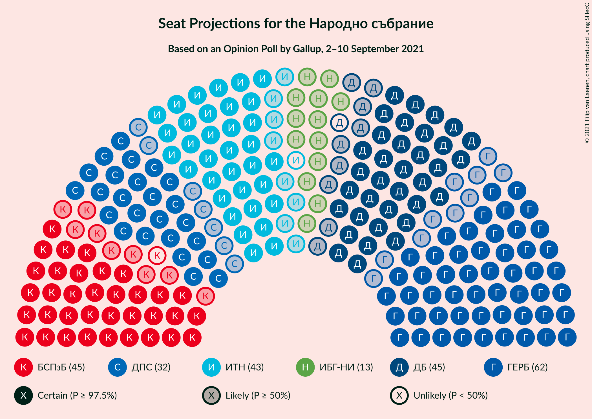
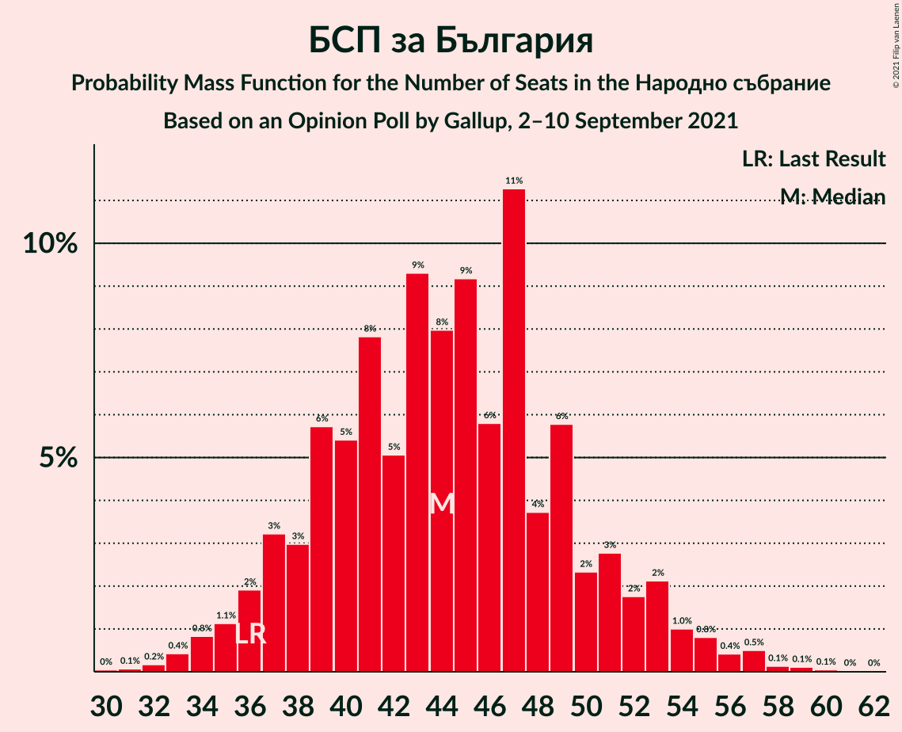
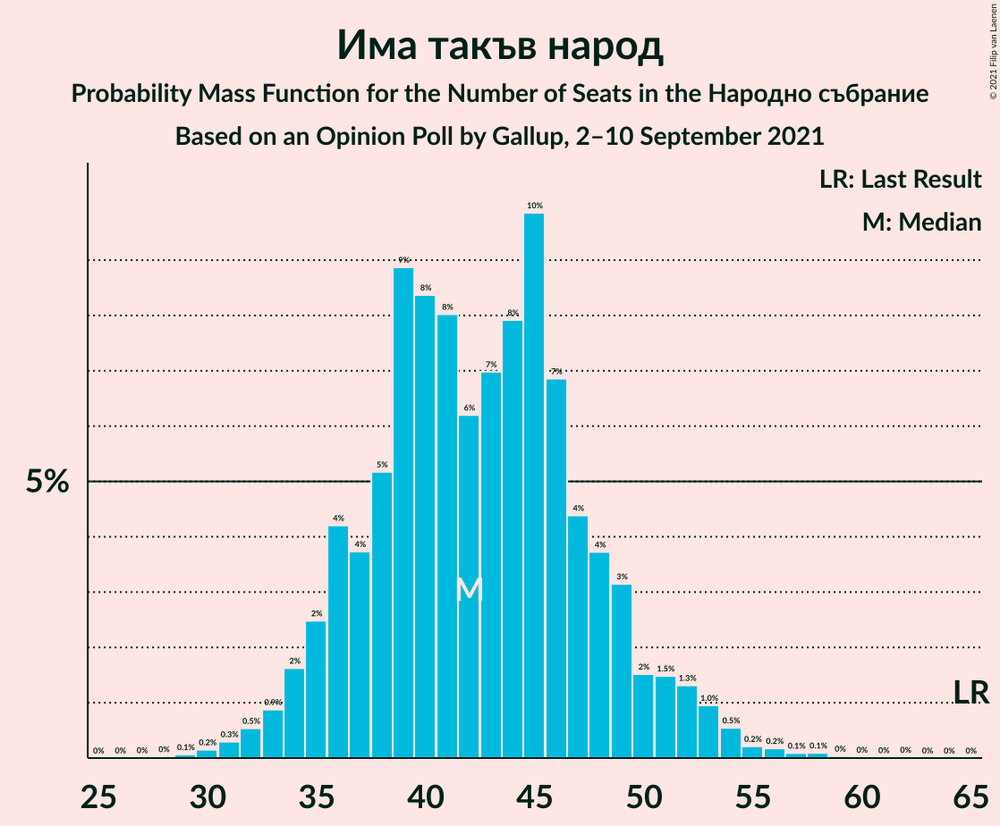
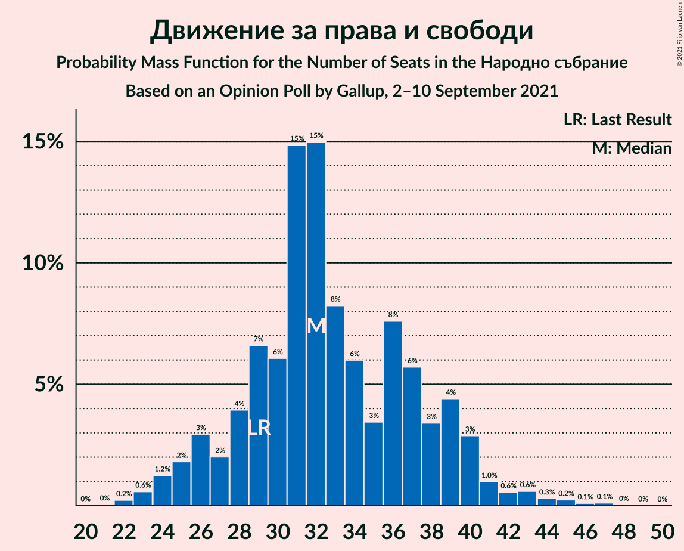

# Opinion Poll by Gallup, 2–10 September 2021

<a href="#voting-intentions">Voting Intentions</a> | <a href="#seats">Seats</a> | <a href="#coalitions">Coalitions</a> | <a href="#technical-information">Technical Information</a>

## Voting Intentions

### Confidence Intervals

| Party | Last Result | Poll Result | 80% Confidence Interval | 90% Confidence Interval | 95% Confidence Interval | 99% Confidence Interval |
|:-----:|:-----------:|:-----------:|:-----------------------:|:-----------------------:|:-----------------------:|:-----------------------:|
| Граждани за европейско развитие на България | 23.2% | 22.6% | 20.2–25.2% |19.6–25.9% |19.0–26.6% |18.0–27.8% |
| БСП за България | 13.2% | 16.0% | 14.0–18.4% |13.5–19.0% |13.0–19.6% |12.1–20.8% |
| Демократична България | 12.5% | 15.8% | 13.8–18.2% |13.3–18.8% |12.8–19.4% |11.9–20.5% |
| Има такъв народ | 23.8% | 15.4% | 13.4–17.7% |12.9–18.4% |12.4–18.9% |11.5–20.1% |
| Движение за права и свободи | 10.6% | 11.8% | 10.1–13.9% |9.6–14.5% |9.2–15.0% |8.4–16.1% |
| Изправи се БГ! Ние идваме! | 5.0% | 4.9% | 3.8–6.4% |3.5–6.8% |3.3–7.2% |2.8–8.0% |
| Възраждане | 3.0% | 3.2% | 2.3–4.5% |2.1–4.8% |1.9–5.2% |1.6–5.9% |
| ВМРО–Българско Национално Движение | 3.1% | 2.3% | 1.6–3.5% |1.5–3.8% |1.3–4.1% |1.0–4.7% |

*Note:* The poll result column reflects the actual value used in the calculations. Published results may vary slightly, and in addition be rounded to fewer digits.

## Seats

### Confidence Intervals

| Party | Last Result | Median | 80% Confidence Interval | 90% Confidence Interval | 95% Confidence Interval | 99% Confidence Interval |
|:-----:|:-----------:|:------:|:-----------------------:|:-----------------------:|:-----------------------:|:-----------------------:|
| <a href="#граждани-за-европейско-развитие-на-българия">Граждани за европейско развитие на България</a> | 63 | 62 | 55–69 |53–71 |52–73 |49–77 |
| <a href="#бсп-за-българия">БСП за България</a> | 36 | 44 | 38–50 |37–53 |35–54 |33–57 |
| <a href="#демократична-българия">Демократична България</a> | 34 | 44 | 38–50 |36–52 |35–54 |32–56 |
| <a href="#има-такъв-народ">Има такъв народ</a> | 65 | 42 | 36–48 |35–50 |34–52 |31–55 |
| <a href="#движение-за-права-и-свободи">Движение за права и свободи</a> | 29 | 32 | 28–39 |26–40 |25–41 |23–45 |
| <a href="#изправи-се-бг!-ние-идваме!">Изправи се БГ! Ние идваме!</a> | 13 | 13 | 0–17 |0–19 |0–19 |0–22 |
| <a href="#възраждане">Възраждане</a> | 0 | 0 | 0–12 |0–13 |0–14 |0–15 |
| <a href="#вмро–българско-национално-движение">ВМРО–Българско Национално Движение</a> | 0 | 0 | 0 |0 |0–11 |0–13 |

### Граждани за европейско развитие на България

*For a full overview of the results for this party, see the [Граждани за европейско развитие на България](party-гражданизаевропейскоразвитиенабългария.html) page.*

| Number of Seats | Probability | Accumulated | Special Marks |
|:---------------:|:-----------:|:-----------:|:-------------:|
| 45 | 0% | 100% |  |
| 46 | 0.1% | 99.9% |  |
| 47 | 0.1% | 99.9% |  |
| 48 | 0.2% | 99.8% |  |
| 49 | 0.5% | 99.6% |  |
| 50 | 0.4% | 99.1% |  |
| 51 | 0.8% | 98.7% |  |
| 52 | 1.4% | 98% |  |
| 53 | 2% | 97% |  |
| 54 | 2% | 94% |  |
| 55 | 3% | 92% |  |
| 56 | 7% | 89% |  |
| 57 | 3% | 82% |  |
| 58 | 3% | 79% |  |
| 59 | 8% | 76% |  |
| 60 | 8% | 68% |  |
| 61 | 5% | 60% |  |
| 62 | 9% | 56% | Median |
| 63 | 5% | 46% | Last Result |
| 64 | 9% | 41% |  |
| 65 | 4% | 32% |  |
| 66 | 7% | 28% |  |
| 67 | 7% | 21% |  |
| 68 | 2% | 14% |  |
| 69 | 3% | 12% |  |
| 70 | 3% | 9% |  |
| 71 | 1.0% | 5% |  |
| 72 | 1.2% | 4% |  |
| 73 | 1.4% | 3% |  |
| 74 | 0.7% | 2% |  |
| 75 | 0.2% | 1.1% |  |
| 76 | 0.3% | 0.9% |  |
| 77 | 0.2% | 0.6% |  |
| 78 | 0.2% | 0.4% |  |
| 79 | 0% | 0.2% |  |
| 80 | 0.1% | 0.2% |  |
| 81 | 0.1% | 0.1% |  |
| 82 | 0% | 0% |  |

### БСП за България

*For a full overview of the results for this party, see the [БСП за България](party-бспзабългария.html) page.*

| Number of Seats | Probability | Accumulated | Special Marks |
|:---------------:|:-----------:|:-----------:|:-------------:|
| 30 | 0% | 100% |  |
| 31 | 0.1% | 99.9% |  |
| 32 | 0.2% | 99.9% |  |
| 33 | 0.4% | 99.7% |  |
| 34 | 0.8% | 99.3% |  |
| 35 | 1.1% | 98% |  |
| 36 | 2% | 97% | Last Result |
| 37 | 3% | 95% |  |
| 38 | 3% | 92% |  |
| 39 | 6% | 89% |  |
| 40 | 5% | 83% |  |
| 41 | 8% | 78% |  |
| 42 | 5% | 70% |  |
| 43 | 9% | 65% |  |
| 44 | 8% | 56% | Median |
| 45 | 9% | 48% |  |
| 46 | 6% | 39% |  |
| 47 | 11% | 33% |  |
| 48 | 4% | 22% |  |
| 49 | 6% | 18% |  |
| 50 | 2% | 12% |  |
| 51 | 3% | 10% |  |
| 52 | 2% | 7% |  |
| 53 | 2% | 5% |  |
| 54 | 1.0% | 3% |  |
| 55 | 0.8% | 2% |  |
| 56 | 0.4% | 1.3% |  |
| 57 | 0.5% | 0.9% |  |
| 58 | 0.1% | 0.4% |  |
| 59 | 0.1% | 0.2% |  |
| 60 | 0.1% | 0.1% |  |
| 61 | 0% | 0.1% |  |
| 62 | 0% | 0% |  |

### Демократична България

*For a full overview of the results for this party, see the [Демократична България](party-демократичнабългария.html) page.*

| Number of Seats | Probability | Accumulated | Special Marks |
|:---------------:|:-----------:|:-----------:|:-------------:|
| 30 | 0.1% | 100% |  |
| 31 | 0.1% | 99.9% |  |
| 32 | 0.3% | 99.7% |  |
| 33 | 0.6% | 99.5% |  |
| 34 | 0.8% | 98.9% | Last Result |
| 35 | 1.3% | 98% |  |
| 36 | 2% | 97% |  |
| 37 | 3% | 95% |  |
| 38 | 7% | 92% |  |
| 39 | 5% | 85% |  |
| 40 | 5% | 80% |  |
| 41 | 6% | 75% |  |
| 42 | 7% | 69% |  |
| 43 | 10% | 63% |  |
| 44 | 8% | 53% | Median |
| 45 | 13% | 45% |  |
| 46 | 6% | 32% |  |
| 47 | 6% | 25% |  |
| 48 | 4% | 19% |  |
| 49 | 4% | 15% |  |
| 50 | 2% | 10% |  |
| 51 | 2% | 8% |  |
| 52 | 2% | 6% |  |
| 53 | 1.1% | 4% |  |
| 54 | 1.0% | 3% |  |
| 55 | 0.8% | 2% |  |
| 56 | 0.4% | 0.8% |  |
| 57 | 0.2% | 0.5% |  |
| 58 | 0.1% | 0.3% |  |
| 59 | 0.1% | 0.2% |  |
| 60 | 0% | 0.1% |  |
| 61 | 0% | 0% |  |

### Има такъв народ

*For a full overview of the results for this party, see the [Има такъв народ](party-иматакъвнарод.html) page.*

| Number of Seats | Probability | Accumulated | Special Marks |
|:---------------:|:-----------:|:-----------:|:-------------:|
| 29 | 0.1% | 100% |  |
| 30 | 0.2% | 99.9% |  |
| 31 | 0.3% | 99.7% |  |
| 32 | 0.5% | 99.4% |  |
| 33 | 0.9% | 98.9% |  |
| 34 | 2% | 98% |  |
| 35 | 2% | 96% |  |
| 36 | 4% | 94% |  |
| 37 | 4% | 90% |  |
| 38 | 5% | 86% |  |
| 39 | 9% | 81% |  |
| 40 | 8% | 72% |  |
| 41 | 8% | 64% |  |
| 42 | 6% | 56% | Median |
| 43 | 7% | 49% |  |
| 44 | 8% | 42% |  |
| 45 | 10% | 34% |  |
| 46 | 7% | 25% |  |
| 47 | 4% | 18% |  |
| 48 | 4% | 13% |  |
| 49 | 3% | 10% |  |
| 50 | 2% | 6% |  |
| 51 | 1.5% | 5% |  |
| 52 | 1.3% | 3% |  |
| 53 | 1.0% | 2% |  |
| 54 | 0.5% | 1.2% |  |
| 55 | 0.2% | 0.7% |  |
| 56 | 0.2% | 0.4% |  |
| 57 | 0.1% | 0.3% |  |
| 58 | 0.1% | 0.2% |  |
| 59 | 0% | 0.1% |  |
| 60 | 0% | 0% |  |
| 61 | 0% | 0% |  |
| 62 | 0% | 0% |  |
| 63 | 0% | 0% |  |
| 64 | 0% | 0% |  |
| 65 | 0% | 0% | Last Result |

### Движение за права и свободи

*For a full overview of the results for this party, see the [Движение за права и свободи](party-движениезаправаисвободи.html) page.*

| Number of Seats | Probability | Accumulated | Special Marks |
|:---------------:|:-----------:|:-----------:|:-------------:|
| 21 | 0% | 100% |  |
| 22 | 0.2% | 99.9% |  |
| 23 | 0.6% | 99.7% |  |
| 24 | 1.2% | 99.1% |  |
| 25 | 2% | 98% |  |
| 26 | 3% | 96% |  |
| 27 | 2% | 93% |  |
| 28 | 4% | 91% |  |
| 29 | 7% | 87% | Last Result |
| 30 | 6% | 81% |  |
| 31 | 15% | 74% |  |
| 32 | 15% | 60% | Median |
| 33 | 8% | 45% |  |
| 34 | 6% | 36% |  |
| 35 | 3% | 30% |  |
| 36 | 8% | 27% |  |
| 37 | 6% | 19% |  |
| 38 | 3% | 14% |  |
| 39 | 4% | 10% |  |
| 40 | 3% | 6% |  |
| 41 | 1.0% | 3% |  |
| 42 | 0.6% | 2% |  |
| 43 | 0.6% | 1.4% |  |
| 44 | 0.3% | 0.8% |  |
| 45 | 0.2% | 0.5% |  |
| 46 | 0.1% | 0.3% |  |
| 47 | 0.1% | 0.2% |  |
| 48 | 0% | 0.1% |  |
| 49 | 0% | 0% |  |

### Изправи се БГ! Ние идваме!

*For a full overview of the results for this party, see the [Изправи се БГ! Ние идваме!](party-изправисебгниеидваме.html) page.*

| Number of Seats | Probability | Accumulated | Special Marks |
|:---------------:|:-----------:|:-----------:|:-------------:|
| 0 | 17% | 100% |  |
| 1 | 0% | 83% |  |
| 2 | 0% | 83% |  |
| 3 | 0% | 83% |  |
| 4 | 0% | 83% |  |
| 5 | 0% | 83% |  |
| 6 | 0% | 83% |  |
| 7 | 0% | 83% |  |
| 8 | 0% | 83% |  |
| 9 | 0% | 83% |  |
| 10 | 0.1% | 83% |  |
| 11 | 6% | 83% |  |
| 12 | 12% | 77% |  |
| 13 | 17% | 66% | Last Result, Median |
| 14 | 12% | 49% |  |
| 15 | 14% | 37% |  |
| 16 | 7% | 23% |  |
| 17 | 7% | 16% |  |
| 18 | 3% | 9% |  |
| 19 | 3% | 6% |  |
| 20 | 1.2% | 2% |  |
| 21 | 0.6% | 1.2% |  |
| 22 | 0.3% | 0.5% |  |
| 23 | 0.2% | 0.3% |  |
| 24 | 0% | 0.1% |  |
| 25 | 0% | 0.1% |  |
| 26 | 0% | 0% |  |

### Възраждане

*For a full overview of the results for this party, see the [Възраждане](party-възраждане.html) page.*

| Number of Seats | Probability | Accumulated | Special Marks |
|:---------------:|:-----------:|:-----------:|:-------------:|
| 0 | 80% | 100% | Last Result, Median |
| 1 | 0% | 20% |  |
| 2 | 0% | 20% |  |
| 3 | 0% | 20% |  |
| 4 | 0% | 20% |  |
| 5 | 0% | 20% |  |
| 6 | 0% | 20% |  |
| 7 | 0% | 20% |  |
| 8 | 0% | 20% |  |
| 9 | 0% | 20% |  |
| 10 | 0.2% | 20% |  |
| 11 | 8% | 20% |  |
| 12 | 6% | 12% |  |
| 13 | 3% | 6% |  |
| 14 | 2% | 3% |  |
| 15 | 0.7% | 1.2% |  |
| 16 | 0.3% | 0.5% |  |
| 17 | 0.1% | 0.2% |  |
| 18 | 0% | 0.1% |  |
| 19 | 0% | 0% |  |

### ВМРО–Българско Национално Движение

*For a full overview of the results for this party, see the [ВМРО–Българско Национално Движение](party-вмро–българсконационалнодвижение.html) page.*

| Number of Seats | Probability | Accumulated | Special Marks |
|:---------------:|:-----------:|:-----------:|:-------------:|
| 0 | 97% | 100% | Last Result, Median |
| 1 | 0% | 3% |  |
| 2 | 0% | 3% |  |
| 3 | 0% | 3% |  |
| 4 | 0% | 3% |  |
| 5 | 0% | 3% |  |
| 6 | 0% | 3% |  |
| 7 | 0% | 3% |  |
| 8 | 0% | 3% |  |
| 9 | 0% | 3% |  |
| 10 | 0.1% | 3% |  |
| 11 | 1.1% | 3% |  |
| 12 | 0.9% | 1.5% |  |
| 13 | 0.3% | 0.5% |  |
| 14 | 0.2% | 0.2% |  |
| 15 | 0% | 0.1% |  |
| 16 | 0% | 0% |  |

## Coalitions

### Confidence Intervals

| Coalition | Last Result | Median | Majority? | 80% Confidence Interval | 90% Confidence Interval | 95% Confidence Interval | 99% Confidence Interval |
|:---------:|:-----------:|:------:|:---------:|:-----------------------:|:-----------------------:|:-----------------------:|:-----------------------:|
| БСП за България – Има такъв народ – Движение за права и свободи – Изправи се БГ! Ние идваме! | 143 | 132 | 94% | 123–140 | 119–142 | 117–145 | 113–148 |
| БСП за България – Има такъв народ – Движение за права и свободи | 130 | 119 | 43% | 111–128 | 108–130 | 106–132 | 102–138 |
| БСП за България – Движение за права и свободи – Изправи се БГ! Ние идваме! | 78 | 90 | 0% | 79–97 | 77–100 | 75–102 | 71–105 |
| БСП за България – Движение за права и свободи | 65 | 77 | 0% | 69–84 | 67–87 | 66–89 | 62–93 |

### БСП за България – Има такъв народ – Движение за права и свободи – Изправи се БГ! Ние идваме!

| Number of Seats | Probability | Accumulated | Special Marks |
|:---------------:|:-----------:|:-----------:|:-------------:|
| 107 | 0% | 100% |  |
| 108 | 0% | 99.9% |  |
| 109 | 0.1% | 99.9% |  |
| 110 | 0.1% | 99.8% |  |
| 111 | 0.1% | 99.8% |  |
| 112 | 0.1% | 99.7% |  |
| 113 | 0.3% | 99.5% |  |
| 114 | 0.2% | 99.2% |  |
| 115 | 0.4% | 99.1% |  |
| 116 | 0.4% | 98.7% |  |
| 117 | 0.9% | 98% |  |
| 118 | 1.4% | 97% |  |
| 119 | 1.0% | 96% |  |
| 120 | 1.1% | 95% |  |
| 121 | 2% | 94% | Majority |
| 122 | 2% | 92% |  |
| 123 | 2% | 90% |  |
| 124 | 4% | 88% |  |
| 125 | 5% | 84% |  |
| 126 | 3% | 78% |  |
| 127 | 2% | 76% |  |
| 128 | 4% | 73% |  |
| 129 | 5% | 69% |  |
| 130 | 6% | 64% |  |
| 131 | 6% | 58% | Median |
| 132 | 7% | 52% |  |
| 133 | 5% | 45% |  |
| 134 | 7% | 40% |  |
| 135 | 6% | 33% |  |
| 136 | 4% | 27% |  |
| 137 | 3% | 23% |  |
| 138 | 4% | 20% |  |
| 139 | 5% | 17% |  |
| 140 | 2% | 11% |  |
| 141 | 4% | 9% |  |
| 142 | 1.1% | 6% |  |
| 143 | 1.0% | 4% | Last Result |
| 144 | 0.8% | 3% |  |
| 145 | 1.1% | 3% |  |
| 146 | 0.5% | 1.4% |  |
| 147 | 0.4% | 0.9% |  |
| 148 | 0.2% | 0.6% |  |
| 149 | 0.1% | 0.4% |  |
| 150 | 0.1% | 0.3% |  |
| 151 | 0.1% | 0.2% |  |
| 152 | 0% | 0.1% |  |
| 153 | 0% | 0% |  |

### БСП за България – Има такъв народ – Движение за права и свободи

| Number of Seats | Probability | Accumulated | Special Marks |
|:---------------:|:-----------:|:-----------:|:-------------:|
| 98 | 0.1% | 100% |  |
| 99 | 0% | 99.9% |  |
| 100 | 0.1% | 99.9% |  |
| 101 | 0.1% | 99.8% |  |
| 102 | 0.3% | 99.7% |  |
| 103 | 0.2% | 99.4% |  |
| 104 | 0.4% | 99.1% |  |
| 105 | 0.6% | 98.7% |  |
| 106 | 0.8% | 98% |  |
| 107 | 1.3% | 97% |  |
| 108 | 1.3% | 96% |  |
| 109 | 2% | 95% |  |
| 110 | 2% | 92% |  |
| 111 | 4% | 90% |  |
| 112 | 3% | 86% |  |
| 113 | 3% | 84% |  |
| 114 | 3% | 81% |  |
| 115 | 5% | 78% |  |
| 116 | 5% | 73% |  |
| 117 | 7% | 68% |  |
| 118 | 8% | 61% | Median |
| 119 | 5% | 53% |  |
| 120 | 5% | 48% |  |
| 121 | 5% | 43% | Majority |
| 122 | 5% | 38% |  |
| 123 | 5% | 33% |  |
| 124 | 5% | 28% |  |
| 125 | 5% | 24% |  |
| 126 | 4% | 18% |  |
| 127 | 2% | 15% |  |
| 128 | 3% | 12% |  |
| 129 | 1.3% | 9% |  |
| 130 | 4% | 8% | Last Result |
| 131 | 0.6% | 4% |  |
| 132 | 2% | 4% |  |
| 133 | 0.4% | 2% |  |
| 134 | 0.3% | 2% |  |
| 135 | 0.6% | 2% |  |
| 136 | 0.2% | 1.0% |  |
| 137 | 0.3% | 0.9% |  |
| 138 | 0.1% | 0.5% |  |
| 139 | 0.1% | 0.5% |  |
| 140 | 0.2% | 0.4% |  |
| 141 | 0.1% | 0.2% |  |
| 142 | 0.1% | 0.1% |  |
| 143 | 0% | 0.1% |  |
| 144 | 0% | 0.1% |  |
| 145 | 0% | 0% |  |

### БСП за България – Движение за права и свободи – Изправи се БГ! Ние идваме!

| Number of Seats | Probability | Accumulated | Special Marks |
|:---------------:|:-----------:|:-----------:|:-------------:|
| 65 | 0% | 100% |  |
| 66 | 0.1% | 99.9% |  |
| 67 | 0.1% | 99.9% |  |
| 68 | 0.1% | 99.8% |  |
| 69 | 0.1% | 99.7% |  |
| 70 | 0.1% | 99.6% |  |
| 71 | 0.3% | 99.5% |  |
| 72 | 0.3% | 99.2% |  |
| 73 | 0.8% | 98.9% |  |
| 74 | 0.4% | 98% |  |
| 75 | 1.1% | 98% |  |
| 76 | 0.9% | 97% |  |
| 77 | 0.7% | 96% |  |
| 78 | 2% | 95% | Last Result |
| 79 | 3% | 93% |  |
| 80 | 3% | 90% |  |
| 81 | 3% | 87% |  |
| 82 | 2% | 84% |  |
| 83 | 2% | 81% |  |
| 84 | 2% | 79% |  |
| 85 | 4% | 77% |  |
| 86 | 6% | 73% |  |
| 87 | 6% | 68% |  |
| 88 | 5% | 61% |  |
| 89 | 5% | 56% | Median |
| 90 | 10% | 51% |  |
| 91 | 3% | 41% |  |
| 92 | 7% | 38% |  |
| 93 | 6% | 31% |  |
| 94 | 6% | 26% |  |
| 95 | 3% | 20% |  |
| 96 | 3% | 17% |  |
| 97 | 4% | 14% |  |
| 98 | 3% | 10% |  |
| 99 | 1.2% | 7% |  |
| 100 | 2% | 6% |  |
| 101 | 1.3% | 4% |  |
| 102 | 0.8% | 3% |  |
| 103 | 0.5% | 2% |  |
| 104 | 0.5% | 1.3% |  |
| 105 | 0.3% | 0.8% |  |
| 106 | 0.1% | 0.4% |  |
| 107 | 0.1% | 0.3% |  |
| 108 | 0.1% | 0.2% |  |
| 109 | 0.1% | 0.1% |  |
| 110 | 0% | 0.1% |  |
| 111 | 0% | 0% |  |

### БСП за България – Движение за права и свободи

| Number of Seats | Probability | Accumulated | Special Marks |
|:---------------:|:-----------:|:-----------:|:-------------:|
| 59 | 0% | 100% |  |
| 60 | 0.1% | 99.9% |  |
| 61 | 0.2% | 99.8% |  |
| 62 | 0.2% | 99.6% |  |
| 63 | 0.5% | 99.4% |  |
| 64 | 0.7% | 98.9% |  |
| 65 | 0.7% | 98% | Last Result |
| 66 | 1.1% | 98% |  |
| 67 | 2% | 96% |  |
| 68 | 2% | 95% |  |
| 69 | 3% | 93% |  |
| 70 | 3% | 90% |  |
| 71 | 3% | 87% |  |
| 72 | 7% | 84% |  |
| 73 | 5% | 77% |  |
| 74 | 6% | 72% |  |
| 75 | 7% | 66% |  |
| 76 | 6% | 58% | Median |
| 77 | 5% | 52% |  |
| 78 | 6% | 47% |  |
| 79 | 7% | 41% |  |
| 80 | 7% | 34% |  |
| 81 | 6% | 27% |  |
| 82 | 3% | 21% |  |
| 83 | 5% | 17% |  |
| 84 | 2% | 12% |  |
| 85 | 2% | 10% |  |
| 86 | 2% | 8% |  |
| 87 | 2% | 6% |  |
| 88 | 1.4% | 5% |  |
| 89 | 0.7% | 3% |  |
| 90 | 0.9% | 2% |  |
| 91 | 0.4% | 1.4% |  |
| 92 | 0.4% | 1.0% |  |
| 93 | 0.2% | 0.6% |  |
| 94 | 0.1% | 0.4% |  |
| 95 | 0.1% | 0.3% |  |
| 96 | 0.1% | 0.2% |  |
| 97 | 0% | 0.1% |  |
| 98 | 0% | 0% |  |

## Technical Information

### Opinion Poll

+ **Polling firm:** Gallup
+ **Commissioner(s):** —
+ **Fieldwork period:** 2–10 September 2021

### Calculations

+ **Sample size:** 474
+ **Simulations done:** 1,048,576
+ **Error estimate:** 2.55%

