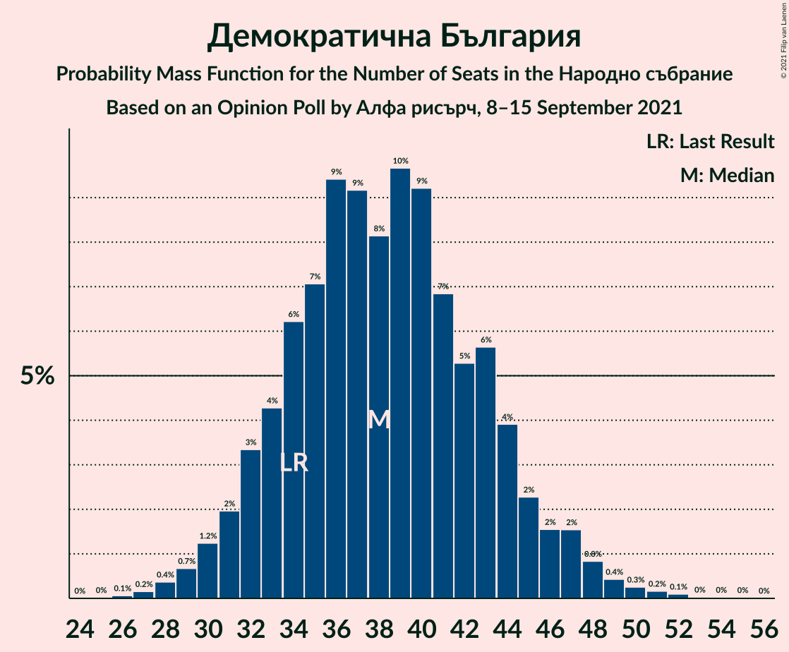
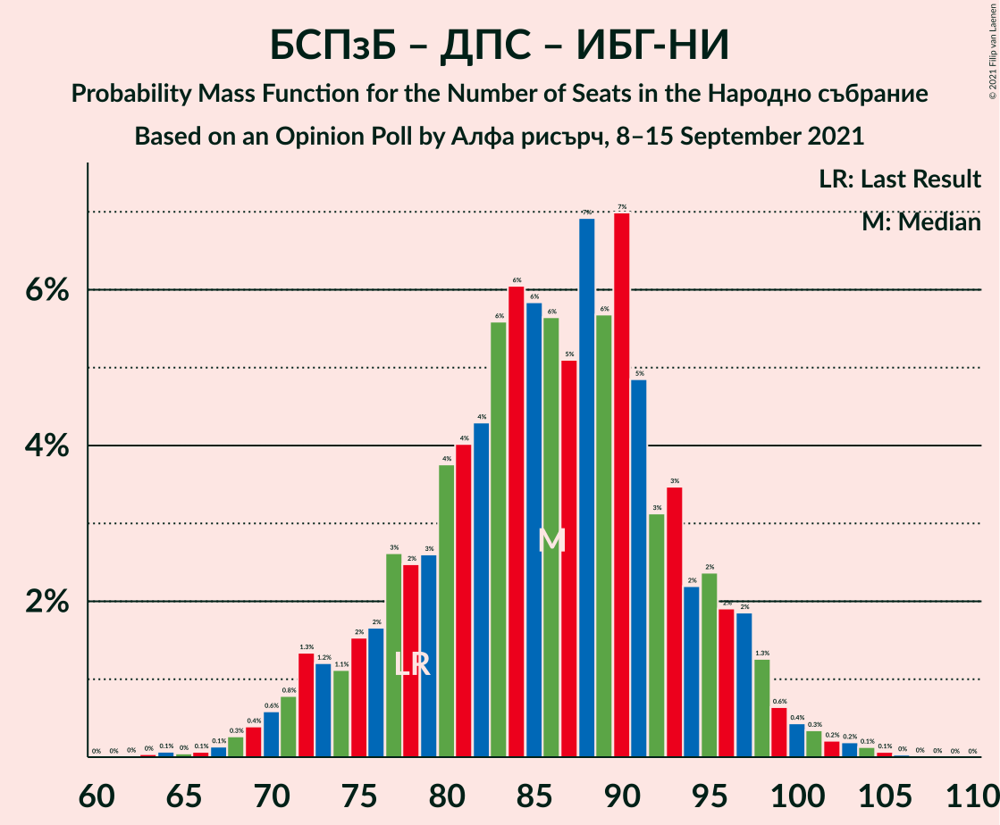

# Opinion Poll by Алфа рисърч, 8–15 September 2021

<a href="#voting-intentions">Voting Intentions</a> | <a href="#seats">Seats</a> | <a href="#coalitions">Coalitions</a> | <a href="#technical-information">Technical Information</a>

## Voting Intentions

### Confidence Intervals

| Party | Last Result | Poll Result | 80% Confidence Interval | 90% Confidence Interval | 95% Confidence Interval | 99% Confidence Interval |
|:-----:|:-----------:|:-----------:|:-----------------------:|:-----------------------:|:-----------------------:|:-----------------------:|
| Граждани за европейско развитие на България | 23.2% | 23.2% | 21.0–25.7% |20.3–26.4% |19.8–27.0% |18.7–28.2% |
| Има такъв народ | 23.8% | 18.6% | 16.6–21.0% |16.0–21.6% |15.5–22.2% |14.6–23.4% |
| БСП за България | 13.2% | 18.1% | 16.0–20.4% |15.5–21.0% |15.0–21.6% |14.1–22.7% |
| Демократична България | 12.5% | 14.4% | 12.6–16.6% |12.1–17.2% |11.7–17.7% |10.9–18.8% |
| Движение за права и свободи | 10.6% | 10.5% | 8.9–12.4% |8.5–12.9% |8.1–13.4% |7.4–14.3% |
| Изправи се БГ! Ние идваме! | 5.0% | 4.6% | 3.6–6.0% |3.3–6.4% |3.1–6.7% |2.7–7.4% |
| Възраждане | 3.0% | 3.8% | 2.9–5.1% |2.7–5.5% |2.5–5.8% |2.1–6.5% |

*Note:* The poll result column reflects the actual value used in the calculations. Published results may vary slightly, and in addition be rounded to fewer digits.

## Seats

### Confidence Intervals

| Party | Last Result | Median | 80% Confidence Interval | 90% Confidence Interval | 95% Confidence Interval | 99% Confidence Interval |
|:-----:|:-----------:|:------:|:-----------------------:|:-----------------------:|:-----------------------:|:-----------------------:|
| <a href="#граждани-за-европейско-развитие-на-българия">Граждани за европейско развитие на България</a> | 63 | 61 | 54–68 |53–70 |51–72 |48–75 |
| <a href="#има-такъв-народ">Има такъв народ</a> | 65 | 49 | 43–55 |42–57 |40–59 |38–62 |
| <a href="#бсп-за-българия">БСП за България</a> | 36 | 48 | 42–54 |40–56 |39–57 |37–60 |
| <a href="#демократична-българия">Демократична България</a> | 34 | 38 | 33–44 |32–45 |30–47 |28–50 |
| <a href="#движение-за-права-и-свободи">Движение за права и свободи</a> | 29 | 28 | 23–33 |22–34 |21–35 |19–38 |
| <a href="#изправи-се-бг!-ние-идваме!">Изправи се БГ! Ние идваме!</a> | 13 | 12 | 0–16 |0–17 |0–18 |0–19 |
| <a href="#възраждане">Възраждане</a> | 0 | 0 | 0–13 |0–14 |0–15 |0–17 |

### Граждани за европейско развитие на България

*For a full overview of the results for this party, see the [Граждани за европейско развитие на България](party-гражданизаевропейскоразвитиенабългария.html) page.*

| Number of Seats | Probability | Accumulated | Special Marks |
|:---------------:|:-----------:|:-----------:|:-------------:|
| 45 | 0% | 100% |  |
| 46 | 0.1% | 99.9% |  |
| 47 | 0.1% | 99.9% |  |
| 48 | 0.3% | 99.8% |  |
| 49 | 0.4% | 99.5% |  |
| 50 | 0.6% | 99.1% |  |
| 51 | 1.2% | 98% |  |
| 52 | 1.4% | 97% |  |
| 53 | 3% | 96% |  |
| 54 | 4% | 93% |  |
| 55 | 3% | 90% |  |
| 56 | 5% | 86% |  |
| 57 | 6% | 81% |  |
| 58 | 7% | 75% |  |
| 59 | 8% | 69% |  |
| 60 | 6% | 61% |  |
| 61 | 8% | 54% | Median |
| 62 | 8% | 46% |  |
| 63 | 7% | 39% | Last Result |
| 64 | 5% | 32% |  |
| 65 | 6% | 27% |  |
| 66 | 5% | 21% |  |
| 67 | 5% | 16% |  |
| 68 | 3% | 11% |  |
| 69 | 2% | 8% |  |
| 70 | 2% | 6% |  |
| 71 | 1.2% | 4% |  |
| 72 | 1.4% | 3% |  |
| 73 | 0.7% | 2% |  |
| 74 | 0.5% | 1.2% |  |
| 75 | 0.3% | 0.8% |  |
| 76 | 0.2% | 0.5% |  |
| 77 | 0.1% | 0.3% |  |
| 78 | 0.1% | 0.2% |  |
| 79 | 0.1% | 0.1% |  |
| 80 | 0% | 0.1% |  |
| 81 | 0% | 0% |  |

### Има такъв народ

*For a full overview of the results for this party, see the [Има такъв народ](party-иматакъвнарод.html) page.*

| Number of Seats | Probability | Accumulated | Special Marks |
|:---------------:|:-----------:|:-----------:|:-------------:|
| 35 | 0% | 100% |  |
| 36 | 0.1% | 99.9% |  |
| 37 | 0.2% | 99.8% |  |
| 38 | 0.4% | 99.6% |  |
| 39 | 0.7% | 99.2% |  |
| 40 | 1.1% | 98% |  |
| 41 | 2% | 97% |  |
| 42 | 3% | 95% |  |
| 43 | 3% | 93% |  |
| 44 | 5% | 90% |  |
| 45 | 7% | 84% |  |
| 46 | 7% | 77% |  |
| 47 | 7% | 70% |  |
| 48 | 9% | 64% |  |
| 49 | 8% | 54% | Median |
| 50 | 8% | 46% |  |
| 51 | 9% | 38% |  |
| 52 | 5% | 29% |  |
| 53 | 5% | 24% |  |
| 54 | 5% | 19% |  |
| 55 | 4% | 13% |  |
| 56 | 3% | 10% |  |
| 57 | 2% | 7% |  |
| 58 | 2% | 5% |  |
| 59 | 0.8% | 3% |  |
| 60 | 1.0% | 2% |  |
| 61 | 0.5% | 1.3% |  |
| 62 | 0.4% | 0.8% |  |
| 63 | 0.2% | 0.5% |  |
| 64 | 0.1% | 0.3% |  |
| 65 | 0.1% | 0.2% | Last Result |
| 66 | 0% | 0.1% |  |
| 67 | 0% | 0% |  |

### БСП за България

*For a full overview of the results for this party, see the [БСП за България](party-бспзабългария.html) page.*

| Number of Seats | Probability | Accumulated | Special Marks |
|:---------------:|:-----------:|:-----------:|:-------------:|
| 34 | 0% | 100% |  |
| 35 | 0.1% | 99.9% |  |
| 36 | 0.3% | 99.8% | Last Result |
| 37 | 0.6% | 99.6% |  |
| 38 | 0.8% | 99.0% |  |
| 39 | 2% | 98% |  |
| 40 | 3% | 97% |  |
| 41 | 3% | 94% |  |
| 42 | 3% | 91% |  |
| 43 | 6% | 87% |  |
| 44 | 5% | 81% |  |
| 45 | 7% | 76% |  |
| 46 | 7% | 69% |  |
| 47 | 9% | 62% |  |
| 48 | 9% | 53% | Median |
| 49 | 11% | 44% |  |
| 50 | 7% | 33% |  |
| 51 | 6% | 26% |  |
| 52 | 5% | 20% |  |
| 53 | 4% | 15% |  |
| 54 | 3% | 11% |  |
| 55 | 3% | 8% |  |
| 56 | 2% | 6% |  |
| 57 | 2% | 4% |  |
| 58 | 1.0% | 2% |  |
| 59 | 0.5% | 1.3% |  |
| 60 | 0.4% | 0.8% |  |
| 61 | 0.2% | 0.4% |  |
| 62 | 0.1% | 0.2% |  |
| 63 | 0.1% | 0.2% |  |
| 64 | 0% | 0.1% |  |
| 65 | 0% | 0.1% |  |
| 66 | 0% | 0% |  |

### Демократична България

*For a full overview of the results for this party, see the [Демократична България](party-демократичнабългария.html) page.*

| Number of Seats | Probability | Accumulated | Special Marks |
|:---------------:|:-----------:|:-----------:|:-------------:|
| 26 | 0.1% | 100% |  |
| 27 | 0.2% | 99.9% |  |
| 28 | 0.4% | 99.7% |  |
| 29 | 0.7% | 99.4% |  |
| 30 | 1.2% | 98.7% |  |
| 31 | 2% | 97% |  |
| 32 | 3% | 95% |  |
| 33 | 4% | 92% |  |
| 34 | 6% | 88% | Last Result |
| 35 | 7% | 82% |  |
| 36 | 9% | 75% |  |
| 37 | 9% | 65% |  |
| 38 | 8% | 56% | Median |
| 39 | 10% | 48% |  |
| 40 | 9% | 38% |  |
| 41 | 7% | 29% |  |
| 42 | 5% | 22% |  |
| 43 | 6% | 17% |  |
| 44 | 4% | 11% |  |
| 45 | 2% | 7% |  |
| 46 | 2% | 5% |  |
| 47 | 2% | 3% |  |
| 48 | 0.8% | 2% |  |
| 49 | 0.4% | 1.0% |  |
| 50 | 0.3% | 0.6% |  |
| 51 | 0.2% | 0.4% |  |
| 52 | 0.1% | 0.2% |  |
| 53 | 0% | 0.1% |  |
| 54 | 0% | 0.1% |  |
| 55 | 0% | 0% |  |

### Движение за права и свободи

*For a full overview of the results for this party, see the [Движение за права и свободи](party-движениезаправаисвободи.html) page.*

| Number of Seats | Probability | Accumulated | Special Marks |
|:---------------:|:-----------:|:-----------:|:-------------:|
| 17 | 0% | 100% |  |
| 18 | 0.1% | 99.9% |  |
| 19 | 0.5% | 99.8% |  |
| 20 | 0.7% | 99.3% |  |
| 21 | 1.4% | 98.7% |  |
| 22 | 3% | 97% |  |
| 23 | 5% | 95% |  |
| 24 | 7% | 89% |  |
| 25 | 9% | 82% |  |
| 26 | 14% | 73% |  |
| 27 | 9% | 60% |  |
| 28 | 12% | 51% | Median |
| 29 | 9% | 39% | Last Result |
| 30 | 7% | 30% |  |
| 31 | 7% | 22% |  |
| 32 | 4% | 15% |  |
| 33 | 4% | 11% |  |
| 34 | 3% | 7% |  |
| 35 | 2% | 5% |  |
| 36 | 1.1% | 2% |  |
| 37 | 0.5% | 1.2% |  |
| 38 | 0.2% | 0.7% |  |
| 39 | 0.3% | 0.5% |  |
| 40 | 0.1% | 0.2% |  |
| 41 | 0.1% | 0.1% |  |
| 42 | 0% | 0% |  |

### Изправи се БГ! Ние идваме!

*For a full overview of the results for this party, see the [Изправи се БГ! Ние идваме!](party-изправисебгниеидваме.html) page.*

| Number of Seats | Probability | Accumulated | Special Marks |
|:---------------:|:-----------:|:-----------:|:-------------:|
| 0 | 23% | 100% |  |
| 1 | 0% | 77% |  |
| 2 | 0% | 77% |  |
| 3 | 0% | 77% |  |
| 4 | 0% | 77% |  |
| 5 | 0% | 77% |  |
| 6 | 0% | 77% |  |
| 7 | 0% | 77% |  |
| 8 | 0% | 77% |  |
| 9 | 0% | 77% |  |
| 10 | 1.0% | 77% |  |
| 11 | 14% | 76% |  |
| 12 | 16% | 62% | Median |
| 13 | 17% | 46% | Last Result |
| 14 | 11% | 29% |  |
| 15 | 8% | 19% |  |
| 16 | 6% | 11% |  |
| 17 | 2% | 5% |  |
| 18 | 2% | 3% |  |
| 19 | 0.6% | 1.0% |  |
| 20 | 0.3% | 0.5% |  |
| 21 | 0.1% | 0.2% |  |
| 22 | 0% | 0.1% |  |
| 23 | 0% | 0% |  |

### Възраждане

*For a full overview of the results for this party, see the [Възраждане](party-възраждане.html) page.*

| Number of Seats | Probability | Accumulated | Special Marks |
|:---------------:|:-----------:|:-----------:|:-------------:|
| 0 | 55% | 100% | Last Result, Median |
| 1 | 0% | 45% |  |
| 2 | 0% | 45% |  |
| 3 | 0% | 45% |  |
| 4 | 0% | 45% |  |
| 5 | 0% | 45% |  |
| 6 | 0% | 45% |  |
| 7 | 0% | 45% |  |
| 8 | 0% | 45% |  |
| 9 | 0% | 45% |  |
| 10 | 3% | 45% |  |
| 11 | 15% | 42% |  |
| 12 | 11% | 27% |  |
| 13 | 8% | 16% |  |
| 14 | 4% | 8% |  |
| 15 | 2% | 4% |  |
| 16 | 0.9% | 2% |  |
| 17 | 0.4% | 0.6% |  |
| 18 | 0.2% | 0.2% |  |
| 19 | 0.1% | 0.1% |  |
| 20 | 0% | 0% |  |

## Coalitions

### Confidence Intervals

| Coalition | Last Result | Median | Majority? | 80% Confidence Interval | 90% Confidence Interval | 95% Confidence Interval | 99% Confidence Interval |
|:---------:|:-----------:|:------:|:---------:|:-----------------------:|:-----------------------:|:-----------------------:|:-----------------------:|
| Има такъв народ – БСП за България – Движение за права и свободи – Изправи се БГ! Ние идваме! | 143 | 135 | 98% | 126–143 | 124–146 | 121–148 | 117–152 |
| Има такъв народ – БСП за България – Движение за права и свободи | 130 | 125 | 73% | 116–134 | 114–137 | 112–139 | 109–143 |
| БСП за България – Движение за права и свободи – Изправи се БГ! Ние идваме! | 78 | 86 | 0% | 77–94 | 74–97 | 72–98 | 68–102 |
| БСП за България – Движение за права и свободи | 65 | 75 | 0% | 69–83 | 67–85 | 65–87 | 62–91 |

### Има такъв народ – БСП за България – Движение за права и свободи – Изправи се БГ! Ние идваме!

| Number of Seats | Probability | Accumulated | Special Marks |
|:---------------:|:-----------:|:-----------:|:-------------:|
| 112 | 0% | 100% |  |
| 113 | 0% | 99.9% |  |
| 114 | 0.1% | 99.9% |  |
| 115 | 0.1% | 99.9% |  |
| 116 | 0.2% | 99.8% |  |
| 117 | 0.2% | 99.6% |  |
| 118 | 0.3% | 99.4% |  |
| 119 | 0.6% | 99.1% |  |
| 120 | 0.5% | 98.5% |  |
| 121 | 0.6% | 98% | Majority |
| 122 | 0.9% | 97% |  |
| 123 | 1.3% | 97% |  |
| 124 | 2% | 95% |  |
| 125 | 2% | 93% |  |
| 126 | 2% | 92% |  |
| 127 | 4% | 89% |  |
| 128 | 3% | 86% |  |
| 129 | 4% | 83% |  |
| 130 | 5% | 79% |  |
| 131 | 4% | 73% |  |
| 132 | 5% | 70% |  |
| 133 | 4% | 65% |  |
| 134 | 7% | 61% |  |
| 135 | 5% | 54% |  |
| 136 | 5% | 49% |  |
| 137 | 7% | 43% | Median |
| 138 | 6% | 37% |  |
| 139 | 5% | 31% |  |
| 140 | 5% | 26% |  |
| 141 | 5% | 21% |  |
| 142 | 3% | 16% |  |
| 143 | 3% | 13% | Last Result |
| 144 | 2% | 10% |  |
| 145 | 2% | 8% |  |
| 146 | 2% | 6% |  |
| 147 | 2% | 5% |  |
| 148 | 1.1% | 3% |  |
| 149 | 0.6% | 2% |  |
| 150 | 0.5% | 1.4% |  |
| 151 | 0.4% | 0.9% |  |
| 152 | 0.3% | 0.6% |  |
| 153 | 0.1% | 0.3% |  |
| 154 | 0.1% | 0.2% |  |
| 155 | 0% | 0.1% |  |
| 156 | 0% | 0.1% |  |
| 157 | 0% | 0% |  |

### Има такъв народ – БСП за България – Движение за права и свободи

| Number of Seats | Probability | Accumulated | Special Marks |
|:---------------:|:-----------:|:-----------:|:-------------:|
| 104 | 0% | 100% |  |
| 105 | 0.1% | 99.9% |  |
| 106 | 0.1% | 99.9% |  |
| 107 | 0.1% | 99.8% |  |
| 108 | 0.2% | 99.7% |  |
| 109 | 0.4% | 99.5% |  |
| 110 | 0.9% | 99.1% |  |
| 111 | 0.5% | 98% |  |
| 112 | 0.8% | 98% |  |
| 113 | 2% | 97% |  |
| 114 | 1.5% | 95% |  |
| 115 | 2% | 94% |  |
| 116 | 2% | 92% |  |
| 117 | 4% | 90% |  |
| 118 | 4% | 86% |  |
| 119 | 5% | 82% |  |
| 120 | 4% | 77% |  |
| 121 | 5% | 73% | Majority |
| 122 | 6% | 69% |  |
| 123 | 7% | 62% |  |
| 124 | 5% | 55% |  |
| 125 | 6% | 50% | Median |
| 126 | 4% | 45% |  |
| 127 | 9% | 40% |  |
| 128 | 5% | 32% |  |
| 129 | 4% | 27% |  |
| 130 | 3% | 23% | Last Result |
| 131 | 5% | 20% |  |
| 132 | 2% | 15% |  |
| 133 | 2% | 13% |  |
| 134 | 2% | 11% |  |
| 135 | 2% | 9% |  |
| 136 | 1.3% | 7% |  |
| 137 | 2% | 6% |  |
| 138 | 0.7% | 4% |  |
| 139 | 1.0% | 3% |  |
| 140 | 0.5% | 2% |  |
| 141 | 0.6% | 2% |  |
| 142 | 0.5% | 1.2% |  |
| 143 | 0.2% | 0.6% |  |
| 144 | 0.1% | 0.5% |  |
| 145 | 0.1% | 0.3% |  |
| 146 | 0.1% | 0.2% |  |
| 147 | 0% | 0.1% |  |
| 148 | 0% | 0.1% |  |
| 149 | 0% | 0.1% |  |
| 150 | 0% | 0% |  |

### БСП за България – Движение за права и свободи – Изправи се БГ! Ние идваме!

| Number of Seats | Probability | Accumulated | Special Marks |
|:---------------:|:-----------:|:-----------:|:-------------:|
| 63 | 0% | 100% |  |
| 64 | 0.1% | 99.9% |  |
| 65 | 0% | 99.9% |  |
| 66 | 0.1% | 99.8% |  |
| 67 | 0.1% | 99.7% |  |
| 68 | 0.3% | 99.6% |  |
| 69 | 0.4% | 99.3% |  |
| 70 | 0.6% | 99.0% |  |
| 71 | 0.8% | 98% |  |
| 72 | 1.3% | 98% |  |
| 73 | 1.2% | 96% |  |
| 74 | 1.1% | 95% |  |
| 75 | 2% | 94% |  |
| 76 | 2% | 92% |  |
| 77 | 3% | 91% |  |
| 78 | 2% | 88% | Last Result |
| 79 | 3% | 86% |  |
| 80 | 4% | 83% |  |
| 81 | 4% | 79% |  |
| 82 | 4% | 75% |  |
| 83 | 6% | 71% |  |
| 84 | 6% | 65% |  |
| 85 | 6% | 59% |  |
| 86 | 6% | 53% |  |
| 87 | 5% | 48% |  |
| 88 | 7% | 43% | Median |
| 89 | 6% | 36% |  |
| 90 | 7% | 30% |  |
| 91 | 5% | 23% |  |
| 92 | 3% | 18% |  |
| 93 | 3% | 15% |  |
| 94 | 2% | 12% |  |
| 95 | 2% | 9% |  |
| 96 | 2% | 7% |  |
| 97 | 2% | 5% |  |
| 98 | 1.3% | 3% |  |
| 99 | 0.6% | 2% |  |
| 100 | 0.4% | 1.4% |  |
| 101 | 0.3% | 1.0% |  |
| 102 | 0.2% | 0.7% |  |
| 103 | 0.2% | 0.5% |  |
| 104 | 0.1% | 0.3% |  |
| 105 | 0.1% | 0.1% |  |
| 106 | 0% | 0.1% |  |
| 107 | 0% | 0% |  |

### БСП за България – Движение за права и свободи

| Number of Seats | Probability | Accumulated | Special Marks |
|:---------------:|:-----------:|:-----------:|:-------------:|
| 58 | 0% | 100% |  |
| 59 | 0% | 99.9% |  |
| 60 | 0.1% | 99.9% |  |
| 61 | 0.2% | 99.8% |  |
| 62 | 0.3% | 99.6% |  |
| 63 | 0.4% | 99.3% |  |
| 64 | 0.7% | 98.8% |  |
| 65 | 1.2% | 98% | Last Result |
| 66 | 2% | 97% |  |
| 67 | 2% | 95% |  |
| 68 | 3% | 93% |  |
| 69 | 4% | 90% |  |
| 70 | 4% | 87% |  |
| 71 | 5% | 83% |  |
| 72 | 8% | 77% |  |
| 73 | 7% | 70% |  |
| 74 | 7% | 62% |  |
| 75 | 6% | 55% |  |
| 76 | 7% | 49% | Median |
| 77 | 8% | 42% |  |
| 78 | 6% | 34% |  |
| 79 | 5% | 29% |  |
| 80 | 4% | 23% |  |
| 81 | 4% | 19% |  |
| 82 | 3% | 15% |  |
| 83 | 3% | 12% |  |
| 84 | 2% | 9% |  |
| 85 | 2% | 6% |  |
| 86 | 1.4% | 5% |  |
| 87 | 0.9% | 3% |  |
| 88 | 0.4% | 2% |  |
| 89 | 0.7% | 2% |  |
| 90 | 0.6% | 1.3% |  |
| 91 | 0.3% | 0.7% |  |
| 92 | 0.2% | 0.4% |  |
| 93 | 0.1% | 0.2% |  |
| 94 | 0% | 0.1% |  |
| 95 | 0% | 0.1% |  |
| 96 | 0% | 0% |  |

## Technical Information

### Opinion Poll

+ **Polling firm:** Алфа рисърч
+ **Commissioner(s):** —
+ **Fieldwork period:** 8–15 September 2021

### Calculations

+ **Sample size:** 526
+ **Simulations done:** 1,048,576
+ **Error estimate:** 1.68%

