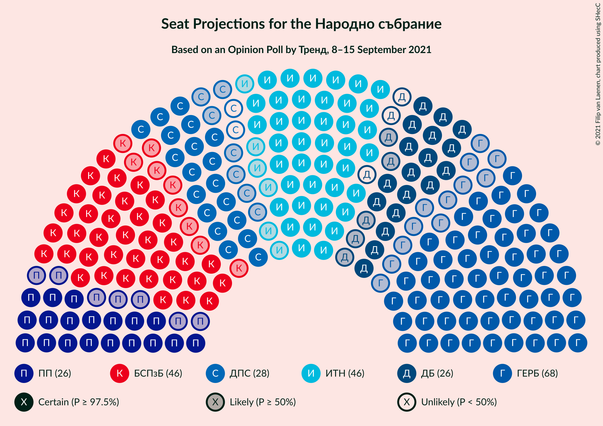
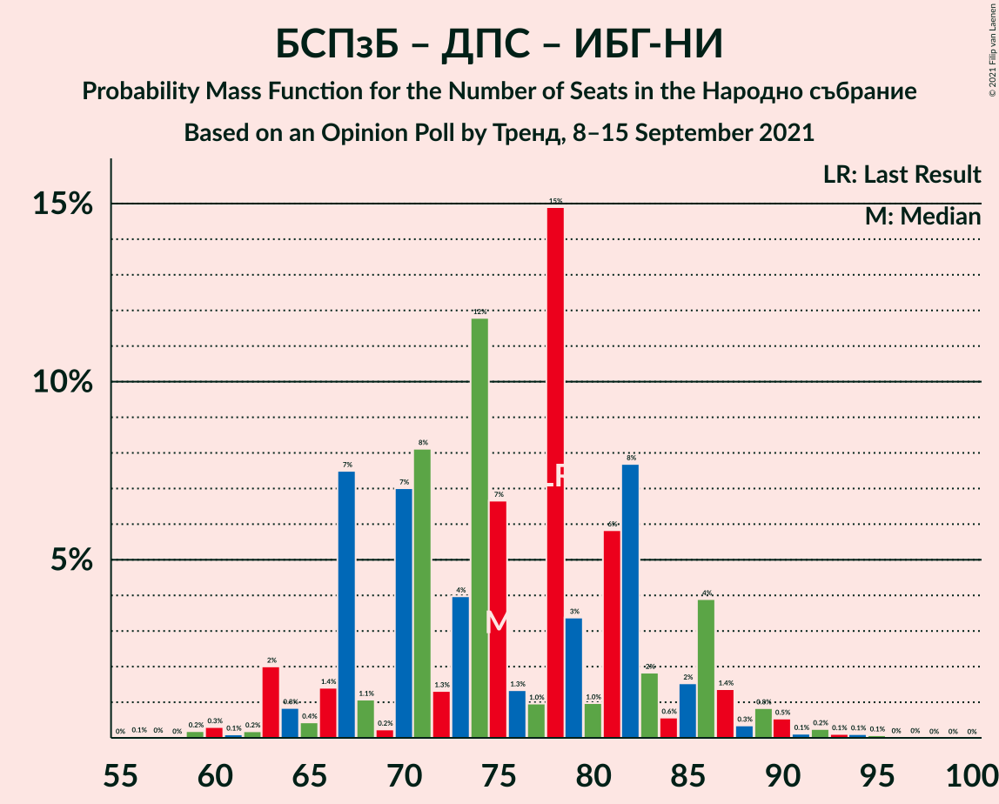

# Opinion Poll by Тренд, 8–15 September 2021

<a href="#voting-intentions">Voting Intentions</a> | <a href="#seats">Seats</a> | <a href="#coalitions">Coalitions</a> | <a href="#technical-information">Technical Information</a>

## Voting Intentions

### Confidence Intervals

| Party | Last Result | Poll Result | 80% Confidence Interval | 90% Confidence Interval | 95% Confidence Interval | 99% Confidence Interval |
|:-----:|:-----------:|:-----------:|:-----------------------:|:-----------------------:|:-----------------------:|:-----------------------:|
| Граждани за европейско развитие на България | 23.2% | 24.4% | 22.2–26.9% |21.5–27.6% |21.0–28.3% |19.9–29.5% |
| Има такъв народ | 23.8% | 17.5% | 15.6–19.8% |15.0–20.4% |14.6–21.0% |13.7–22.1% |
| БСП за България | 13.2% | 16.6% | 14.7–18.8% |14.1–19.4% |13.7–20.0% |12.8–21.1% |
| Движение за права и свободи | 10.6% | 9.3% | 7.9–11.1% |7.5–11.6% |7.1–12.1% |6.5–13.0% |
| Продължаваме промяната | 0.0% | 9.1% | 7.7–10.9% |7.3–11.4% |7.0–11.9% |6.4–12.8% |
| Демократична България | 12.5% | 8.6% | 7.2–10.3% |6.8–10.8% |6.5–11.3% |5.9–12.2% |
| Изправи се БГ! Ние идваме! | 5.0% | 3.7% | 2.9–5.0% |2.6–5.4% |2.4–5.7% |2.1–6.4% |
| Възраждане | 3.0% | 3.0% | 2.2–4.2% |2.0–4.5% |1.8–4.8% |1.5–5.4% |
| ВМРО–Българско Национално Движение | 3.1% | 2.2% | 1.6–3.3% |1.4–3.6% |1.3–3.9% |1.0–4.5% |

*Note:* The poll result column reflects the actual value used in the calculations. Published results may vary slightly, and in addition be rounded to fewer digits.

## Seats

### Confidence Intervals

| Party | Last Result | Median | 80% Confidence Interval | 90% Confidence Interval | 95% Confidence Interval | 99% Confidence Interval |
|:-----:|:-----------:|:------:|:-----------------------:|:-----------------------:|:-----------------------:|:-----------------------:|
| <a href="#граждани-за-европейско-развитие-на-българия">Граждани за европейско развитие на България</a> | 63 | 69 | 61–71 |58–73 |56–76 |54–77 |
| <a href="#има-такъв-народ">Има такъв народ</a> | 65 | 45 | 42–54 |41–56 |41–56 |37–60 |
| <a href="#бсп-за-българия">БСП за България</a> | 36 | 48 | 43–51 |41–53 |40–55 |37–56 |
| <a href="#движение-за-права-и-свободи">Движение за права и свободи</a> | 29 | 27 | 22–29 |19–30 |19–32 |17–36 |
| <a href="#продължаваме-промяната">Продължаваме промяната</a> | 0 | 23 | 21–26 |20–28 |19–28 |17–30 |
| <a href="#демократична-българия">Демократична България</a> | 34 | 23 | 20–26 |19–27 |18–29 |16–29 |
| <a href="#изправи-се-бг!-ние-идваме!">Изправи се БГ! Ние идваме!</a> | 13 | 0 | 0–13 |0–15 |0–16 |0–17 |
| <a href="#възраждане">Възраждане</a> | 0 | 0 | 0 |0–11 |0–12 |0–14 |
| <a href="#вмро–българско-национално-движение">ВМРО–Българско Национално Движение</a> | 0 | 0 | 0 |0 |0 |0–12 |

### Граждани за европейско развитие на България

*For a full overview of the results for this party, see the [Граждани за европейско развитие на България](party-гражданизаевропейскоразвитиенабългария.html) page.*

| Number of Seats | Probability | Accumulated | Special Marks |
|:---------------:|:-----------:|:-----------:|:-------------:|
| 50 | 0% | 100% |  |
| 51 | 0.1% | 99.9% |  |
| 52 | 0.3% | 99.8% |  |
| 53 | 0.1% | 99.6% |  |
| 54 | 0.4% | 99.5% |  |
| 55 | 1.4% | 99.1% |  |
| 56 | 0.5% | 98% |  |
| 57 | 1.0% | 97% |  |
| 58 | 3% | 96% |  |
| 59 | 1.1% | 93% |  |
| 60 | 1.3% | 92% |  |
| 61 | 3% | 91% |  |
| 62 | 2% | 88% |  |
| 63 | 5% | 87% | Last Result |
| 64 | 1.4% | 82% |  |
| 65 | 0.8% | 80% |  |
| 66 | 3% | 79% |  |
| 67 | 4% | 76% |  |
| 68 | 21% | 73% |  |
| 69 | 9% | 52% | Median |
| 70 | 14% | 43% |  |
| 71 | 22% | 29% |  |
| 72 | 1.3% | 8% |  |
| 73 | 1.4% | 6% |  |
| 74 | 0.2% | 5% |  |
| 75 | 0.8% | 5% |  |
| 76 | 2% | 4% |  |
| 77 | 2% | 2% |  |
| 78 | 0% | 0.2% |  |
| 79 | 0.1% | 0.2% |  |
| 80 | 0% | 0.1% |  |
| 81 | 0% | 0.1% |  |
| 82 | 0% | 0.1% |  |
| 83 | 0% | 0.1% |  |
| 84 | 0% | 0% |  |

### Има такъв народ

*For a full overview of the results for this party, see the [Има такъв народ](party-иматакъвнарод.html) page.*

| Number of Seats | Probability | Accumulated | Special Marks |
|:---------------:|:-----------:|:-----------:|:-------------:|
| 33 | 0.1% | 100% |  |
| 34 | 0% | 99.9% |  |
| 35 | 0.1% | 99.9% |  |
| 36 | 0.1% | 99.8% |  |
| 37 | 0.4% | 99.7% |  |
| 38 | 0.1% | 99.2% |  |
| 39 | 0.4% | 99.1% |  |
| 40 | 0.4% | 98.7% |  |
| 41 | 5% | 98% |  |
| 42 | 10% | 94% |  |
| 43 | 14% | 83% |  |
| 44 | 5% | 70% |  |
| 45 | 23% | 64% | Median |
| 46 | 17% | 42% |  |
| 47 | 1.1% | 24% |  |
| 48 | 3% | 23% |  |
| 49 | 2% | 20% |  |
| 50 | 2% | 19% |  |
| 51 | 3% | 16% |  |
| 52 | 2% | 13% |  |
| 53 | 0.8% | 11% |  |
| 54 | 4% | 11% |  |
| 55 | 2% | 7% |  |
| 56 | 3% | 5% |  |
| 57 | 0.4% | 2% |  |
| 58 | 0.2% | 2% |  |
| 59 | 0.2% | 2% |  |
| 60 | 1.0% | 1.5% |  |
| 61 | 0.2% | 0.5% |  |
| 62 | 0.3% | 0.3% |  |
| 63 | 0% | 0% |  |
| 64 | 0% | 0% |  |
| 65 | 0% | 0% | Last Result |

### БСП за България

*For a full overview of the results for this party, see the [БСП за България](party-бспзабългария.html) page.*

| Number of Seats | Probability | Accumulated | Special Marks |
|:---------------:|:-----------:|:-----------:|:-------------:|
| 34 | 0% | 100% |  |
| 35 | 0.1% | 99.9% |  |
| 36 | 0.3% | 99.8% | Last Result |
| 37 | 0.7% | 99.5% |  |
| 38 | 0.5% | 98.8% |  |
| 39 | 0.4% | 98% |  |
| 40 | 2% | 98% |  |
| 41 | 3% | 95% |  |
| 42 | 1.4% | 92% |  |
| 43 | 2% | 91% |  |
| 44 | 4% | 88% |  |
| 45 | 3% | 84% |  |
| 46 | 22% | 81% |  |
| 47 | 6% | 59% |  |
| 48 | 18% | 53% | Median |
| 49 | 3% | 35% |  |
| 50 | 21% | 32% |  |
| 51 | 3% | 12% |  |
| 52 | 2% | 9% |  |
| 53 | 3% | 7% |  |
| 54 | 1.1% | 4% |  |
| 55 | 0.9% | 3% |  |
| 56 | 2% | 2% |  |
| 57 | 0.1% | 0.3% |  |
| 58 | 0% | 0.2% |  |
| 59 | 0.1% | 0.2% |  |
| 60 | 0% | 0.1% |  |
| 61 | 0% | 0% |  |

### Движение за права и свободи

*For a full overview of the results for this party, see the [Движение за права и свободи](party-движениезаправаисвободи.html) page.*

| Number of Seats | Probability | Accumulated | Special Marks |
|:---------------:|:-----------:|:-----------:|:-------------:|
| 16 | 0.3% | 100% |  |
| 17 | 0.2% | 99.7% |  |
| 18 | 0.9% | 99.5% |  |
| 19 | 4% | 98.6% |  |
| 20 | 2% | 94% |  |
| 21 | 1.2% | 92% |  |
| 22 | 8% | 91% |  |
| 23 | 3% | 83% |  |
| 24 | 2% | 80% |  |
| 25 | 23% | 78% |  |
| 26 | 4% | 55% |  |
| 27 | 15% | 51% | Median |
| 28 | 24% | 36% |  |
| 29 | 4% | 12% | Last Result |
| 30 | 3% | 7% |  |
| 31 | 1.3% | 4% |  |
| 32 | 1.2% | 3% |  |
| 33 | 0.3% | 2% |  |
| 34 | 0.2% | 1.3% |  |
| 35 | 0.1% | 1.1% |  |
| 36 | 0.8% | 1.1% |  |
| 37 | 0.1% | 0.3% |  |
| 38 | 0.1% | 0.2% |  |
| 39 | 0.1% | 0.1% |  |
| 40 | 0% | 0% |  |

### Продължаваме промяната

*For a full overview of the results for this party, see the [Продължаваме промяната](party-продължавамепромяната.html) page.*

| Number of Seats | Probability | Accumulated | Special Marks |
|:---------------:|:-----------:|:-----------:|:-------------:|
| 0 | 0% | 100% | Last Result |
| 1 | 0% | 100% |  |
| 2 | 0% | 100% |  |
| 3 | 0% | 100% |  |
| 4 | 0% | 100% |  |
| 5 | 0% | 100% |  |
| 6 | 0% | 100% |  |
| 7 | 0% | 100% |  |
| 8 | 0% | 100% |  |
| 9 | 0% | 100% |  |
| 10 | 0% | 100% |  |
| 11 | 0% | 100% |  |
| 12 | 0% | 100% |  |
| 13 | 0% | 100% |  |
| 14 | 0% | 100% |  |
| 15 | 0% | 100% |  |
| 16 | 0.3% | 100% |  |
| 17 | 0.4% | 99.7% |  |
| 18 | 1.0% | 99.3% |  |
| 19 | 2% | 98% |  |
| 20 | 4% | 97% |  |
| 21 | 8% | 93% |  |
| 22 | 19% | 85% |  |
| 23 | 21% | 66% | Median |
| 24 | 6% | 46% |  |
| 25 | 9% | 40% |  |
| 26 | 23% | 31% |  |
| 27 | 1.2% | 8% |  |
| 28 | 5% | 7% |  |
| 29 | 0.4% | 1.3% |  |
| 30 | 0.6% | 0.9% |  |
| 31 | 0.1% | 0.4% |  |
| 32 | 0.2% | 0.3% |  |
| 33 | 0% | 0.1% |  |
| 34 | 0% | 0.1% |  |
| 35 | 0% | 0% |  |

### Демократична България

*For a full overview of the results for this party, see the [Демократична България](party-демократичнабългария.html) page.*

| Number of Seats | Probability | Accumulated | Special Marks |
|:---------------:|:-----------:|:-----------:|:-------------:|
| 14 | 0.1% | 100% |  |
| 15 | 0.3% | 99.9% |  |
| 16 | 1.4% | 99.6% |  |
| 17 | 0.7% | 98% |  |
| 18 | 1.2% | 98% |  |
| 19 | 5% | 96% |  |
| 20 | 7% | 91% |  |
| 21 | 5% | 84% |  |
| 22 | 23% | 79% |  |
| 23 | 23% | 56% | Median |
| 24 | 3% | 33% |  |
| 25 | 6% | 30% |  |
| 26 | 17% | 24% |  |
| 27 | 3% | 6% |  |
| 28 | 0.7% | 4% |  |
| 29 | 3% | 3% |  |
| 30 | 0.1% | 0.2% |  |
| 31 | 0% | 0.1% |  |
| 32 | 0% | 0.1% |  |
| 33 | 0% | 0% |  |
| 34 | 0% | 0% | Last Result |

### Изправи се БГ! Ние идваме!

*For a full overview of the results for this party, see the [Изправи се БГ! Ние идваме!](party-изправисебгниеидваме.html) page.*

| Number of Seats | Probability | Accumulated | Special Marks |
|:---------------:|:-----------:|:-----------:|:-------------:|
| 0 | 59% | 100% | Median |
| 1 | 0% | 41% |  |
| 2 | 0% | 41% |  |
| 3 | 0% | 41% |  |
| 4 | 0% | 41% |  |
| 5 | 0% | 41% |  |
| 6 | 0% | 41% |  |
| 7 | 0% | 41% |  |
| 8 | 0% | 41% |  |
| 9 | 0% | 41% |  |
| 10 | 0% | 41% |  |
| 11 | 22% | 41% |  |
| 12 | 8% | 19% |  |
| 13 | 2% | 12% | Last Result |
| 14 | 3% | 10% |  |
| 15 | 2% | 6% |  |
| 16 | 2% | 4% |  |
| 17 | 1.4% | 1.5% |  |
| 18 | 0.1% | 0.1% |  |
| 19 | 0% | 0% |  |

### Възраждане

*For a full overview of the results for this party, see the [Възраждане](party-възраждане.html) page.*

| Number of Seats | Probability | Accumulated | Special Marks |
|:---------------:|:-----------:|:-----------:|:-------------:|
| 0 | 93% | 100% | Last Result, Median |
| 1 | 0% | 7% |  |
| 2 | 0% | 7% |  |
| 3 | 0% | 7% |  |
| 4 | 0% | 7% |  |
| 5 | 0% | 7% |  |
| 6 | 0% | 7% |  |
| 7 | 0% | 7% |  |
| 8 | 0% | 7% |  |
| 9 | 0% | 7% |  |
| 10 | 0% | 7% |  |
| 11 | 4% | 7% |  |
| 12 | 2% | 3% |  |
| 13 | 0.4% | 1.1% |  |
| 14 | 0.5% | 0.8% |  |
| 15 | 0.1% | 0.2% |  |
| 16 | 0.1% | 0.1% |  |
| 17 | 0% | 0% |  |

### ВМРО–Българско Национално Движение

*For a full overview of the results for this party, see the [ВМРО–Българско Национално Движение](party-вмро–българсконационалнодвижение.html) page.*

| Number of Seats | Probability | Accumulated | Special Marks |
|:---------------:|:-----------:|:-----------:|:-------------:|
| 0 | 98.5% | 100% | Last Result, Median |
| 1 | 0% | 1.5% |  |
| 2 | 0% | 1.5% |  |
| 3 | 0% | 1.5% |  |
| 4 | 0% | 1.5% |  |
| 5 | 0% | 1.5% |  |
| 6 | 0% | 1.5% |  |
| 7 | 0% | 1.5% |  |
| 8 | 0% | 1.5% |  |
| 9 | 0% | 1.5% |  |
| 10 | 0.2% | 1.5% |  |
| 11 | 0.6% | 1.3% |  |
| 12 | 0.5% | 0.7% |  |
| 13 | 0.1% | 0.1% |  |
| 14 | 0% | 0.1% |  |
| 15 | 0% | 0% |  |

## Coalitions

### Confidence Intervals

| Coalition | Last Result | Median | Majority? | 80% Confidence Interval | 90% Confidence Interval | 95% Confidence Interval | 99% Confidence Interval |
|:---------:|:-----------:|:------:|:---------:|:-----------------------:|:-----------------------:|:-----------------------:|:-----------------------:|
| Има такъв народ – БСП за България – Движение за права и свободи – Изправи се БГ! Ние идваме! | 143 | 124 | 94% | 121–130 | 120–131 | 117–134 | 111–138 |
| Има такъв народ – БСП за България – Движение за права и свободи | 130 | 121 | 59% | 111–127 | 109–129 | 105–131 | 103–135 |
| БСП за България – Движение за права и свободи – Изправи се БГ! Ние идваме! | 78 | 78 | 0% | 74–83 | 71–87 | 70–88 | 67–89 |
| БСП за България – Движение за права и свободи | 65 | 75 | 0% | 67–78 | 64–78 | 63–82 | 60–86 |

### Има такъв народ – БСП за България – Движение за права и свободи – Изправи се БГ! Ние идваме!

| Number of Seats | Probability | Accumulated | Special Marks |
|:---------------:|:-----------:|:-----------:|:-------------:|
| 108 | 0% | 100% |  |
| 109 | 0% | 99.9% |  |
| 110 | 0% | 99.9% |  |
| 111 | 0.5% | 99.9% |  |
| 112 | 0.1% | 99.3% |  |
| 113 | 0.1% | 99.2% |  |
| 114 | 0.3% | 99.1% |  |
| 115 | 0.3% | 98.8% |  |
| 116 | 0.1% | 98% |  |
| 117 | 2% | 98% |  |
| 118 | 0.2% | 96% |  |
| 119 | 0.7% | 96% |  |
| 120 | 0.9% | 95% | Median |
| 121 | 18% | 94% | Majority |
| 122 | 3% | 76% |  |
| 123 | 22% | 74% |  |
| 124 | 9% | 52% |  |
| 125 | 14% | 43% |  |
| 126 | 6% | 28% |  |
| 127 | 3% | 22% |  |
| 128 | 2% | 19% |  |
| 129 | 5% | 17% |  |
| 130 | 2% | 12% |  |
| 131 | 4% | 9% |  |
| 132 | 1.5% | 5% |  |
| 133 | 0.6% | 3% |  |
| 134 | 0.3% | 3% |  |
| 135 | 0.8% | 2% |  |
| 136 | 0.7% | 2% |  |
| 137 | 0.1% | 1.0% |  |
| 138 | 0.4% | 0.9% |  |
| 139 | 0.2% | 0.5% |  |
| 140 | 0.2% | 0.3% |  |
| 141 | 0% | 0.1% |  |
| 142 | 0% | 0.1% |  |
| 143 | 0% | 0.1% | Last Result |
| 144 | 0% | 0% |  |

### Има такъв народ – БСП за България – Движение за права и свободи

| Number of Seats | Probability | Accumulated | Special Marks |
|:---------------:|:-----------:|:-----------:|:-------------:|
| 99 | 0.1% | 100% |  |
| 100 | 0% | 99.9% |  |
| 101 | 0.1% | 99.8% |  |
| 102 | 0.1% | 99.7% |  |
| 103 | 0.2% | 99.6% |  |
| 104 | 0.1% | 99.4% |  |
| 105 | 2% | 99.3% |  |
| 106 | 0.5% | 97% |  |
| 107 | 1.1% | 97% |  |
| 108 | 0.4% | 96% |  |
| 109 | 3% | 95% |  |
| 110 | 1.0% | 92% |  |
| 111 | 2% | 92% |  |
| 112 | 2% | 90% |  |
| 113 | 7% | 88% |  |
| 114 | 15% | 81% |  |
| 115 | 0.6% | 66% |  |
| 116 | 0.9% | 66% |  |
| 117 | 4% | 65% |  |
| 118 | 0.7% | 61% |  |
| 119 | 0.9% | 60% |  |
| 120 | 0.7% | 59% | Median |
| 121 | 17% | 59% | Majority |
| 122 | 1.4% | 42% |  |
| 123 | 21% | 40% |  |
| 124 | 2% | 19% |  |
| 125 | 0.6% | 18% |  |
| 126 | 5% | 17% |  |
| 127 | 3% | 12% |  |
| 128 | 1.3% | 9% |  |
| 129 | 3% | 8% |  |
| 130 | 1.0% | 4% | Last Result |
| 131 | 2% | 3% |  |
| 132 | 0.5% | 2% |  |
| 133 | 0.3% | 1.1% |  |
| 134 | 0% | 0.8% |  |
| 135 | 0.5% | 0.8% |  |
| 136 | 0.2% | 0.3% |  |
| 137 | 0% | 0.1% |  |
| 138 | 0% | 0.1% |  |
| 139 | 0.1% | 0.1% |  |
| 140 | 0% | 0% |  |

### БСП за България – Движение за права и свободи – Изправи се БГ! Ние идваме!

| Number of Seats | Probability | Accumulated | Special Marks |
|:---------------:|:-----------:|:-----------:|:-------------:|
| 61 | 0% | 100% |  |
| 62 | 0% | 99.9% |  |
| 63 | 0.1% | 99.9% |  |
| 64 | 0.1% | 99.8% |  |
| 65 | 0% | 99.7% |  |
| 66 | 0% | 99.7% |  |
| 67 | 2% | 99.6% |  |
| 68 | 0.4% | 98% |  |
| 69 | 0% | 98% |  |
| 70 | 0.2% | 98% |  |
| 71 | 4% | 97% |  |
| 72 | 2% | 94% |  |
| 73 | 0.3% | 91% |  |
| 74 | 2% | 91% |  |
| 75 | 22% | 89% | Median |
| 76 | 1.2% | 67% |  |
| 77 | 0.8% | 66% |  |
| 78 | 25% | 65% | Last Result |
| 79 | 3% | 40% |  |
| 80 | 0.5% | 37% |  |
| 81 | 4% | 36% |  |
| 82 | 21% | 32% |  |
| 83 | 3% | 11% |  |
| 84 | 0.4% | 8% |  |
| 85 | 1.1% | 8% |  |
| 86 | 0.8% | 7% |  |
| 87 | 3% | 6% |  |
| 88 | 2% | 3% |  |
| 89 | 0.7% | 1.2% |  |
| 90 | 0.1% | 0.4% |  |
| 91 | 0.1% | 0.3% |  |
| 92 | 0% | 0.2% |  |
| 93 | 0% | 0.2% |  |
| 94 | 0% | 0.1% |  |
| 95 | 0% | 0.1% |  |
| 96 | 0% | 0.1% |  |
| 97 | 0.1% | 0.1% |  |
| 98 | 0% | 0% |  |

### БСП за България – Движение за права и свободи

| Number of Seats | Probability | Accumulated | Special Marks |
|:---------------:|:-----------:|:-----------:|:-------------:|
| 56 | 0% | 100% |  |
| 57 | 0.1% | 99.9% |  |
| 58 | 0.2% | 99.9% |  |
| 59 | 0.2% | 99.7% |  |
| 60 | 0.3% | 99.5% |  |
| 61 | 1.2% | 99.2% |  |
| 62 | 0.3% | 98% |  |
| 63 | 2% | 98% |  |
| 64 | 0.8% | 95% |  |
| 65 | 2% | 95% | Last Result |
| 66 | 1.3% | 93% |  |
| 67 | 4% | 92% |  |
| 68 | 2% | 87% |  |
| 69 | 1.3% | 85% |  |
| 70 | 3% | 84% |  |
| 71 | 22% | 81% |  |
| 72 | 4% | 59% |  |
| 73 | 3% | 55% |  |
| 74 | 2% | 53% |  |
| 75 | 20% | 51% | Median |
| 76 | 0.7% | 30% |  |
| 77 | 0.2% | 30% |  |
| 78 | 25% | 29% |  |
| 79 | 0.3% | 5% |  |
| 80 | 0.1% | 4% |  |
| 81 | 0.3% | 4% |  |
| 82 | 2% | 4% |  |
| 83 | 0.9% | 2% |  |
| 84 | 0.1% | 0.8% |  |
| 85 | 0.1% | 0.7% |  |
| 86 | 0.4% | 0.6% |  |
| 87 | 0% | 0.2% |  |
| 88 | 0% | 0.2% |  |
| 89 | 0.2% | 0.2% |  |
| 90 | 0% | 0% |  |

## Technical Information

### Opinion Poll

+ **Polling firm:** Тренд
+ **Commissioner(s):** —
+ **Fieldwork period:** 8–15 September 2021

### Calculations

+ **Sample size:** 536
+ **Simulations done:** 131,072
+ **Error estimate:** 2.12%

