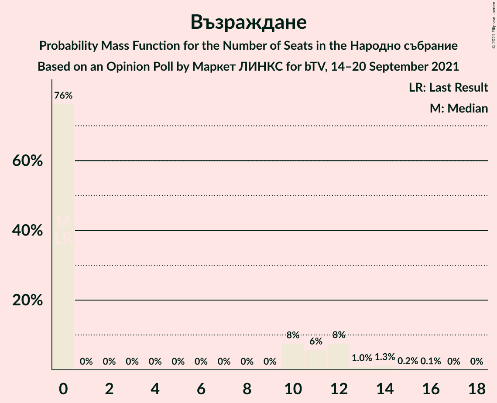
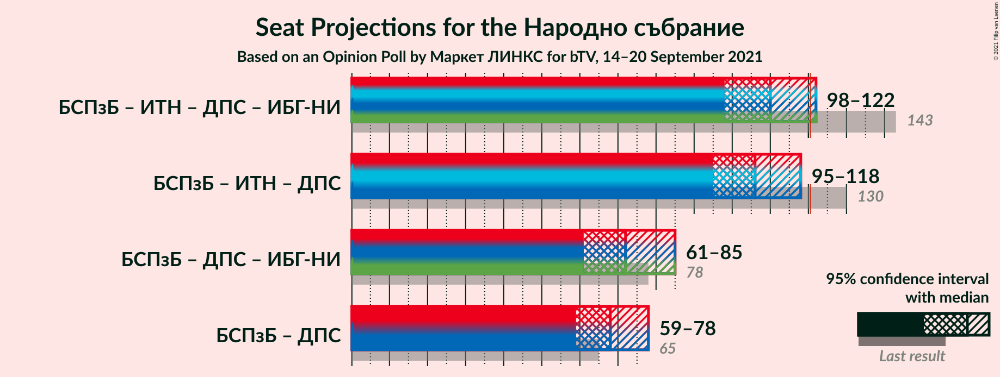

# Opinion Poll by Маркет ЛИНКС for bTV, 14–20 September 2021

<a href="#voting-intentions">Voting Intentions</a> | <a href="#seats">Seats</a> | <a href="#coalitions">Coalitions</a> | <a href="#technical-information">Technical Information</a>

## Voting Intentions

### Confidence Intervals

| Party | Last Result | Poll Result | 80% Confidence Interval | 90% Confidence Interval | 95% Confidence Interval | 99% Confidence Interval |
|:-----:|:-----------:|:-----------:|:-----------------------:|:-----------------------:|:-----------------------:|:-----------------------:|
| Граждани за европейско развитие на България | 23.2% | 25.0% | 22.8–27.3% |22.2–28.0% |21.7–28.5% |20.7–29.7% |
| БСП за България | 13.2% | 16.0% | 14.2–18.0% |13.7–18.6% |13.3–19.1% |12.5–20.1% |
| Има такъв народ | 23.8% | 14.8% | 13.1–16.8% |12.7–17.4% |12.2–17.9% |11.5–18.9% |
| Демократична България | 12.5% | 13.1% | 11.4–15.0% |11.0–15.5% |10.6–16.0% |9.9–16.9% |
| Продължаваме промяната | 0.0% | 11.9% | 10.4–13.7% |9.9–14.3% |9.6–14.7% |8.9–15.6% |
| Движение за права и свободи | 10.6% | 10.8% | 9.3–12.5% |8.9–13.0% |8.6–13.5% |7.9–14.4% |
| Изправи се БГ! Ние идваме! | 5.0% | 3.6% | 2.8–4.8% |2.6–5.1% |2.4–5.4% |2.0–6.0% |
| Възраждане | 3.0% | 3.4% | 2.7–4.6% |2.4–4.9% |2.3–5.2% |1.9–5.8% |

*Note:* The poll result column reflects the actual value used in the calculations. Published results may vary slightly, and in addition be rounded to fewer digits.

## Seats

### Confidence Intervals

| Party | Last Result | Median | 80% Confidence Interval | 90% Confidence Interval | 95% Confidence Interval | 99% Confidence Interval |
|:-----:|:-----------:|:------:|:-----------------------:|:-----------------------:|:-----------------------:|:-----------------------:|
| <a href="#граждани-за-европейско-развитие-на-българия">Граждани за европейско развитие на България</a> | 63 | 64 | 58–68 |56–72 |54–73 |52–77 |
| <a href="#бсп-за-българия">БСП за България</a> | 36 | 39 | 36–46 |35–47 |34–51 |32–52 |
| <a href="#има-такъв-народ">Има такъв народ</a> | 65 | 37 | 32–42 |32–44 |31–47 |28–48 |
| <a href="#демократична-българия">Демократична България</a> | 34 | 33 | 28–38 |28–39 |27–41 |24–43 |
| <a href="#продължаваме-промяната">Продължаваме промяната</a> | 0 | 31 | 26–36 |25–37 |24–37 |22–41 |
| <a href="#движение-за-права-и-свободи">Движение за права и свободи</a> | 29 | 28 | 23–33 |22–33 |22–35 |19–37 |
| <a href="#изправи-се-бг!-ние-идваме!">Изправи се БГ! Ние идваме!</a> | 13 | 0 | 0–12 |0–12 |0–13 |0–15 |
| <a href="#възраждане">Възраждане</a> | 0 | 0 | 0–12 |0–12 |0–13 |0–14 |

### Граждани за европейско развитие на България

*For a full overview of the results for this party, see the [Граждани за европейско развитие на България](party-гражданизаевропейскоразвитиенабългария.html) page.*

| Number of Seats | Probability | Accumulated | Special Marks |
|:---------------:|:-----------:|:-----------:|:-------------:|
| 48 | 0% | 100% |  |
| 49 | 0.1% | 99.9% |  |
| 50 | 0.1% | 99.9% |  |
| 51 | 0.1% | 99.7% |  |
| 52 | 1.0% | 99.6% |  |
| 53 | 1.1% | 98.6% |  |
| 54 | 0.8% | 98% |  |
| 55 | 0.4% | 97% |  |
| 56 | 3% | 96% |  |
| 57 | 2% | 93% |  |
| 58 | 5% | 91% |  |
| 59 | 3% | 86% |  |
| 60 | 9% | 84% |  |
| 61 | 6% | 75% |  |
| 62 | 7% | 69% |  |
| 63 | 7% | 62% | Last Result |
| 64 | 19% | 55% | Median |
| 65 | 14% | 36% |  |
| 66 | 5% | 22% |  |
| 67 | 3% | 17% |  |
| 68 | 5% | 14% |  |
| 69 | 2% | 9% |  |
| 70 | 0.6% | 7% |  |
| 71 | 0.9% | 6% |  |
| 72 | 2% | 5% |  |
| 73 | 1.3% | 3% |  |
| 74 | 0.9% | 2% |  |
| 75 | 0.3% | 1.2% |  |
| 76 | 0% | 0.9% |  |
| 77 | 0.5% | 0.8% |  |
| 78 | 0.2% | 0.3% |  |
| 79 | 0% | 0.1% |  |
| 80 | 0% | 0% |  |

### БСП за България

*For a full overview of the results for this party, see the [БСП за България](party-бспзабългария.html) page.*

| Number of Seats | Probability | Accumulated | Special Marks |
|:---------------:|:-----------:|:-----------:|:-------------:|
| 29 | 0% | 100% |  |
| 30 | 0.1% | 99.9% |  |
| 31 | 0.2% | 99.8% |  |
| 32 | 0.5% | 99.6% |  |
| 33 | 0.9% | 99.1% |  |
| 34 | 3% | 98% |  |
| 35 | 3% | 95% |  |
| 36 | 16% | 92% | Last Result |
| 37 | 10% | 76% |  |
| 38 | 10% | 66% |  |
| 39 | 6% | 56% | Median |
| 40 | 5% | 50% |  |
| 41 | 13% | 44% |  |
| 42 | 7% | 32% |  |
| 43 | 3% | 25% |  |
| 44 | 4% | 22% |  |
| 45 | 4% | 18% |  |
| 46 | 6% | 14% |  |
| 47 | 3% | 8% |  |
| 48 | 1.3% | 5% |  |
| 49 | 0.6% | 3% |  |
| 50 | 0.1% | 3% |  |
| 51 | 2% | 3% |  |
| 52 | 0.4% | 0.7% |  |
| 53 | 0.1% | 0.2% |  |
| 54 | 0.1% | 0.1% |  |
| 55 | 0% | 0% |  |

### Има такъв народ

*For a full overview of the results for this party, see the [Има такъв народ](party-иматакъвнарод.html) page.*

| Number of Seats | Probability | Accumulated | Special Marks |
|:---------------:|:-----------:|:-----------:|:-------------:|
| 27 | 0.1% | 100% |  |
| 28 | 0.7% | 99.8% |  |
| 29 | 0.4% | 99.2% |  |
| 30 | 0.5% | 98.7% |  |
| 31 | 1.2% | 98% |  |
| 32 | 7% | 97% |  |
| 33 | 11% | 90% |  |
| 34 | 10% | 79% |  |
| 35 | 10% | 69% |  |
| 36 | 3% | 59% |  |
| 37 | 9% | 56% | Median |
| 38 | 2% | 47% |  |
| 39 | 14% | 46% |  |
| 40 | 11% | 31% |  |
| 41 | 9% | 20% |  |
| 42 | 3% | 11% |  |
| 43 | 2% | 8% |  |
| 44 | 1.0% | 6% |  |
| 45 | 0.6% | 5% |  |
| 46 | 0.3% | 4% |  |
| 47 | 2% | 4% |  |
| 48 | 2% | 2% |  |
| 49 | 0.1% | 0.3% |  |
| 50 | 0.1% | 0.2% |  |
| 51 | 0% | 0.1% |  |
| 52 | 0% | 0.1% |  |
| 53 | 0% | 0% |  |
| 54 | 0% | 0% |  |
| 55 | 0% | 0% |  |
| 56 | 0% | 0% |  |
| 57 | 0% | 0% |  |
| 58 | 0% | 0% |  |
| 59 | 0% | 0% |  |
| 60 | 0% | 0% |  |
| 61 | 0% | 0% |  |
| 62 | 0% | 0% |  |
| 63 | 0% | 0% |  |
| 64 | 0% | 0% |  |
| 65 | 0% | 0% | Last Result |

### Демократична България

*For a full overview of the results for this party, see the [Демократична България](party-демократичнабългария.html) page.*

| Number of Seats | Probability | Accumulated | Special Marks |
|:---------------:|:-----------:|:-----------:|:-------------:|
| 22 | 0% | 100% |  |
| 23 | 0.2% | 99.9% |  |
| 24 | 0.3% | 99.8% |  |
| 25 | 0.4% | 99.4% |  |
| 26 | 2% | 99.1% |  |
| 27 | 2% | 98% |  |
| 28 | 8% | 95% |  |
| 29 | 8% | 88% |  |
| 30 | 5% | 80% |  |
| 31 | 10% | 74% |  |
| 32 | 11% | 64% |  |
| 33 | 13% | 53% | Median |
| 34 | 6% | 40% | Last Result |
| 35 | 5% | 34% |  |
| 36 | 8% | 29% |  |
| 37 | 6% | 21% |  |
| 38 | 6% | 15% |  |
| 39 | 4% | 8% |  |
| 40 | 2% | 4% |  |
| 41 | 1.0% | 3% |  |
| 42 | 0.9% | 2% |  |
| 43 | 0.5% | 0.7% |  |
| 44 | 0.1% | 0.2% |  |
| 45 | 0% | 0.1% |  |
| 46 | 0.1% | 0.1% |  |
| 47 | 0% | 0% |  |

### Продължаваме промяната

*For a full overview of the results for this party, see the [Продължаваме промяната](party-продължавамепромяната.html) page.*

| Number of Seats | Probability | Accumulated | Special Marks |
|:---------------:|:-----------:|:-----------:|:-------------:|
| 0 | 0% | 100% | Last Result |
| 1 | 0% | 100% |  |
| 2 | 0% | 100% |  |
| 3 | 0% | 100% |  |
| 4 | 0% | 100% |  |
| 5 | 0% | 100% |  |
| 6 | 0% | 100% |  |
| 7 | 0% | 100% |  |
| 8 | 0% | 100% |  |
| 9 | 0% | 100% |  |
| 10 | 0% | 100% |  |
| 11 | 0% | 100% |  |
| 12 | 0% | 100% |  |
| 13 | 0% | 100% |  |
| 14 | 0% | 100% |  |
| 15 | 0% | 100% |  |
| 16 | 0% | 100% |  |
| 17 | 0% | 100% |  |
| 18 | 0% | 100% |  |
| 19 | 0% | 100% |  |
| 20 | 0.1% | 100% |  |
| 21 | 0.3% | 99.9% |  |
| 22 | 0.3% | 99.6% |  |
| 23 | 0.7% | 99.4% |  |
| 24 | 2% | 98.6% |  |
| 25 | 6% | 97% |  |
| 26 | 3% | 91% |  |
| 27 | 7% | 88% |  |
| 28 | 10% | 81% |  |
| 29 | 5% | 71% |  |
| 30 | 8% | 66% |  |
| 31 | 23% | 58% | Median |
| 32 | 6% | 35% |  |
| 33 | 2% | 28% |  |
| 34 | 9% | 27% |  |
| 35 | 6% | 18% |  |
| 36 | 3% | 12% |  |
| 37 | 7% | 9% |  |
| 38 | 0.2% | 1.5% |  |
| 39 | 0.5% | 1.2% |  |
| 40 | 0.2% | 0.7% |  |
| 41 | 0.2% | 0.6% |  |
| 42 | 0.3% | 0.4% |  |
| 43 | 0.1% | 0.1% |  |
| 44 | 0% | 0% |  |

### Движение за права и свободи

*For a full overview of the results for this party, see the [Движение за права и свободи](party-движениезаправаисвободи.html) page.*

| Number of Seats | Probability | Accumulated | Special Marks |
|:---------------:|:-----------:|:-----------:|:-------------:|
| 18 | 0.1% | 100% |  |
| 19 | 0.7% | 99.9% |  |
| 20 | 0.5% | 99.3% |  |
| 21 | 0.9% | 98.7% |  |
| 22 | 4% | 98% |  |
| 23 | 6% | 94% |  |
| 24 | 5% | 88% |  |
| 25 | 5% | 83% |  |
| 26 | 8% | 79% |  |
| 27 | 11% | 71% |  |
| 28 | 12% | 60% | Median |
| 29 | 16% | 49% | Last Result |
| 30 | 6% | 33% |  |
| 31 | 6% | 27% |  |
| 32 | 8% | 21% |  |
| 33 | 10% | 13% |  |
| 34 | 0.8% | 3% |  |
| 35 | 0.7% | 3% |  |
| 36 | 0.5% | 2% |  |
| 37 | 1.2% | 1.4% |  |
| 38 | 0% | 0.1% |  |
| 39 | 0% | 0.1% |  |
| 40 | 0% | 0% |  |

### Изправи се БГ! Ние идваме!

*For a full overview of the results for this party, see the [Изправи се БГ! Ние идваме!](party-изправисебгниеидваме.html) page.*

| Number of Seats | Probability | Accumulated | Special Marks |
|:---------------:|:-----------:|:-----------:|:-------------:|
| 0 | 57% | 100% | Median |
| 1 | 0% | 43% |  |
| 2 | 0% | 43% |  |
| 3 | 0% | 43% |  |
| 4 | 0% | 43% |  |
| 5 | 0% | 43% |  |
| 6 | 0% | 43% |  |
| 7 | 0% | 43% |  |
| 8 | 0% | 43% |  |
| 9 | 0% | 43% |  |
| 10 | 17% | 43% |  |
| 11 | 12% | 26% |  |
| 12 | 9% | 14% |  |
| 13 | 2% | 4% | Last Result |
| 14 | 0.9% | 2% |  |
| 15 | 0.5% | 0.8% |  |
| 16 | 0.3% | 0.3% |  |
| 17 | 0% | 0% |  |

### Възраждане

*For a full overview of the results for this party, see the [Възраждане](party-възраждане.html) page.*

| Number of Seats | Probability | Accumulated | Special Marks |
|:---------------:|:-----------:|:-----------:|:-------------:|
| 0 | 79% | 100% | Last Result, Median |
| 1 | 0% | 21% |  |
| 2 | 0% | 21% |  |
| 3 | 0% | 21% |  |
| 4 | 0% | 21% |  |
| 5 | 0% | 21% |  |
| 6 | 0% | 21% |  |
| 7 | 0% | 21% |  |
| 8 | 0% | 21% |  |
| 9 | 0% | 21% |  |
| 10 | 3% | 21% |  |
| 11 | 7% | 18% |  |
| 12 | 9% | 12% |  |
| 13 | 2% | 3% |  |
| 14 | 0.6% | 0.9% |  |
| 15 | 0.2% | 0.3% |  |
| 16 | 0.1% | 0.1% |  |
| 17 | 0% | 0% |  |

## Coalitions

### Confidence Intervals

| Coalition | Last Result | Median | Majority? | 80% Confidence Interval | 90% Confidence Interval | 95% Confidence Interval | 99% Confidence Interval |
|:---------:|:-----------:|:------:|:---------:|:-----------------------:|:-----------------------:|:-----------------------:|:-----------------------:|
| БСП за България – Има такъв народ – Движение за права и свободи – Изправи се БГ! Ние идваме! | 143 | 111 | 4% | 101–118 | 98–120 | 98–122 | 95–125 |
| БСП за България – Има такъв народ – Движение за права и свободи | 130 | 105 | 0.6% | 98–114 | 96–117 | 95–118 | 90–121 |
| БСП за България – Движение за права и свободи – Изправи се БГ! Ние идваме! | 78 | 73 | 0% | 65–81 | 63–82 | 62–84 | 59–87 |
| БСП за България – Движение за права и свободи | 65 | 68 | 0% | 62–75 | 61–77 | 60–79 | 56–81 |

### БСП за България – Има такъв народ – Движение за права и свободи – Изправи се БГ! Ние идваме!

| Number of Seats | Probability | Accumulated | Special Marks |
|:---------------:|:-----------:|:-----------:|:-------------:|
| 90 | 0% | 100% |  |
| 91 | 0% | 99.9% |  |
| 92 | 0.1% | 99.9% |  |
| 93 | 0% | 99.8% |  |
| 94 | 0.1% | 99.8% |  |
| 95 | 0.8% | 99.8% |  |
| 96 | 0.9% | 99.0% |  |
| 97 | 0.1% | 98% |  |
| 98 | 4% | 98% |  |
| 99 | 0.6% | 94% |  |
| 100 | 2% | 93% |  |
| 101 | 3% | 91% |  |
| 102 | 0.4% | 88% |  |
| 103 | 4% | 88% |  |
| 104 | 5% | 84% | Median |
| 105 | 2% | 79% |  |
| 106 | 2% | 77% |  |
| 107 | 2% | 75% |  |
| 108 | 11% | 73% |  |
| 109 | 2% | 62% |  |
| 110 | 8% | 60% |  |
| 111 | 9% | 52% |  |
| 112 | 5% | 43% |  |
| 113 | 3% | 38% |  |
| 114 | 2% | 35% |  |
| 115 | 8% | 33% |  |
| 116 | 8% | 25% |  |
| 117 | 4% | 17% |  |
| 118 | 6% | 13% |  |
| 119 | 1.2% | 6% |  |
| 120 | 2% | 5% |  |
| 121 | 0.9% | 4% | Majority |
| 122 | 1.2% | 3% |  |
| 123 | 0.3% | 2% |  |
| 124 | 0.6% | 1.3% |  |
| 125 | 0.3% | 0.7% |  |
| 126 | 0.2% | 0.4% |  |
| 127 | 0.1% | 0.3% |  |
| 128 | 0.1% | 0.2% |  |
| 129 | 0% | 0.1% |  |
| 130 | 0% | 0% |  |
| 131 | 0% | 0% |  |
| 132 | 0% | 0% |  |
| 133 | 0% | 0% |  |
| 134 | 0% | 0% |  |
| 135 | 0% | 0% |  |
| 136 | 0% | 0% |  |
| 137 | 0% | 0% |  |
| 138 | 0% | 0% |  |
| 139 | 0% | 0% |  |
| 140 | 0% | 0% |  |
| 141 | 0% | 0% |  |
| 142 | 0% | 0% |  |
| 143 | 0% | 0% | Last Result |

### БСП за България – Има такъв народ – Движение за права и свободи

| Number of Seats | Probability | Accumulated | Special Marks |
|:---------------:|:-----------:|:-----------:|:-------------:|
| 87 | 0.1% | 100% |  |
| 88 | 0% | 99.9% |  |
| 89 | 0.2% | 99.9% |  |
| 90 | 0.2% | 99.7% |  |
| 91 | 0.1% | 99.5% |  |
| 92 | 1.5% | 99.4% |  |
| 93 | 0.1% | 98% |  |
| 94 | 0.3% | 98% |  |
| 95 | 1.1% | 98% |  |
| 96 | 2% | 96% |  |
| 97 | 0.5% | 94% |  |
| 98 | 11% | 94% |  |
| 99 | 0.8% | 83% |  |
| 100 | 2% | 82% |  |
| 101 | 9% | 80% |  |
| 102 | 1.4% | 71% |  |
| 103 | 9% | 70% |  |
| 104 | 4% | 60% | Median |
| 105 | 9% | 56% |  |
| 106 | 2% | 47% |  |
| 107 | 5% | 45% |  |
| 108 | 9% | 40% |  |
| 109 | 1.2% | 31% |  |
| 110 | 7% | 30% |  |
| 111 | 7% | 23% |  |
| 112 | 3% | 15% |  |
| 113 | 2% | 12% |  |
| 114 | 2% | 11% |  |
| 115 | 3% | 9% |  |
| 116 | 0.5% | 6% |  |
| 117 | 2% | 6% |  |
| 118 | 1.3% | 4% |  |
| 119 | 0.5% | 2% |  |
| 120 | 1.2% | 2% |  |
| 121 | 0.5% | 0.6% | Majority |
| 122 | 0% | 0.2% |  |
| 123 | 0.1% | 0.2% |  |
| 124 | 0% | 0.1% |  |
| 125 | 0% | 0.1% |  |
| 126 | 0% | 0.1% |  |
| 127 | 0% | 0% |  |
| 128 | 0% | 0% |  |
| 129 | 0% | 0% |  |
| 130 | 0% | 0% | Last Result |

### БСП за България – Движение за права и свободи – Изправи се БГ! Ние идваме!

| Number of Seats | Probability | Accumulated | Special Marks |
|:---------------:|:-----------:|:-----------:|:-------------:|
| 56 | 0.1% | 100% |  |
| 57 | 0.1% | 99.9% |  |
| 58 | 0.2% | 99.7% |  |
| 59 | 0.2% | 99.6% |  |
| 60 | 0.2% | 99.3% |  |
| 61 | 1.3% | 99.2% |  |
| 62 | 0.8% | 98% |  |
| 63 | 6% | 97% |  |
| 64 | 1.4% | 91% |  |
| 65 | 3% | 90% |  |
| 66 | 1.1% | 87% |  |
| 67 | 6% | 86% | Median |
| 68 | 2% | 81% |  |
| 69 | 6% | 79% |  |
| 70 | 7% | 73% |  |
| 71 | 5% | 66% |  |
| 72 | 4% | 62% |  |
| 73 | 11% | 58% |  |
| 74 | 2% | 47% |  |
| 75 | 5% | 45% |  |
| 76 | 13% | 40% |  |
| 77 | 4% | 27% |  |
| 78 | 5% | 23% | Last Result |
| 79 | 6% | 18% |  |
| 80 | 0.8% | 12% |  |
| 81 | 2% | 11% |  |
| 82 | 7% | 9% |  |
| 83 | 0.3% | 3% |  |
| 84 | 0.2% | 3% |  |
| 85 | 1.5% | 2% |  |
| 86 | 0.1% | 0.8% |  |
| 87 | 0.3% | 0.8% |  |
| 88 | 0.2% | 0.5% |  |
| 89 | 0% | 0.2% |  |
| 90 | 0% | 0.2% |  |
| 91 | 0.1% | 0.2% |  |
| 92 | 0% | 0.1% |  |
| 93 | 0% | 0% |  |

### БСП за България – Движение за права и свободи

| Number of Seats | Probability | Accumulated | Special Marks |
|:---------------:|:-----------:|:-----------:|:-------------:|
| 53 | 0.2% | 100% |  |
| 54 | 0.1% | 99.8% |  |
| 55 | 0.1% | 99.7% |  |
| 56 | 0.2% | 99.6% |  |
| 57 | 0.5% | 99.5% |  |
| 58 | 0.5% | 98.9% |  |
| 59 | 0.5% | 98% |  |
| 60 | 3% | 98% |  |
| 61 | 3% | 95% |  |
| 62 | 3% | 93% |  |
| 63 | 7% | 90% |  |
| 64 | 2% | 82% |  |
| 65 | 10% | 80% | Last Result |
| 66 | 6% | 70% |  |
| 67 | 9% | 64% | Median |
| 68 | 5% | 55% |  |
| 69 | 9% | 50% |  |
| 70 | 12% | 40% |  |
| 71 | 4% | 29% |  |
| 72 | 3% | 24% |  |
| 73 | 8% | 21% |  |
| 74 | 2% | 13% |  |
| 75 | 5% | 11% |  |
| 76 | 0.9% | 6% |  |
| 77 | 0.5% | 5% |  |
| 78 | 2% | 5% |  |
| 79 | 1.1% | 3% |  |
| 80 | 0.1% | 2% |  |
| 81 | 1.3% | 2% |  |
| 82 | 0.1% | 0.2% |  |
| 83 | 0% | 0.1% |  |
| 84 | 0% | 0.1% |  |
| 85 | 0% | 0.1% |  |
| 86 | 0% | 0% |  |

## Technical Information

### Opinion Poll

+ **Polling firm:** Маркет ЛИНКС
+ **Commissioner(s):** bTV
+ **Fieldwork period:** 14–20 September 2021

### Calculations

+ **Sample size:** 613
+ **Simulations done:** 131,072
+ **Error estimate:** 1.72%

