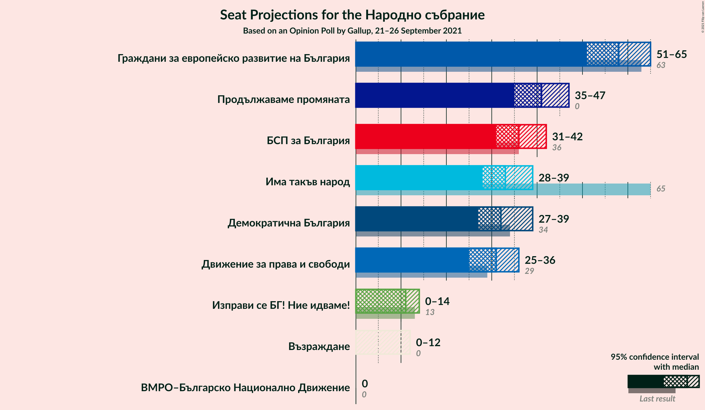
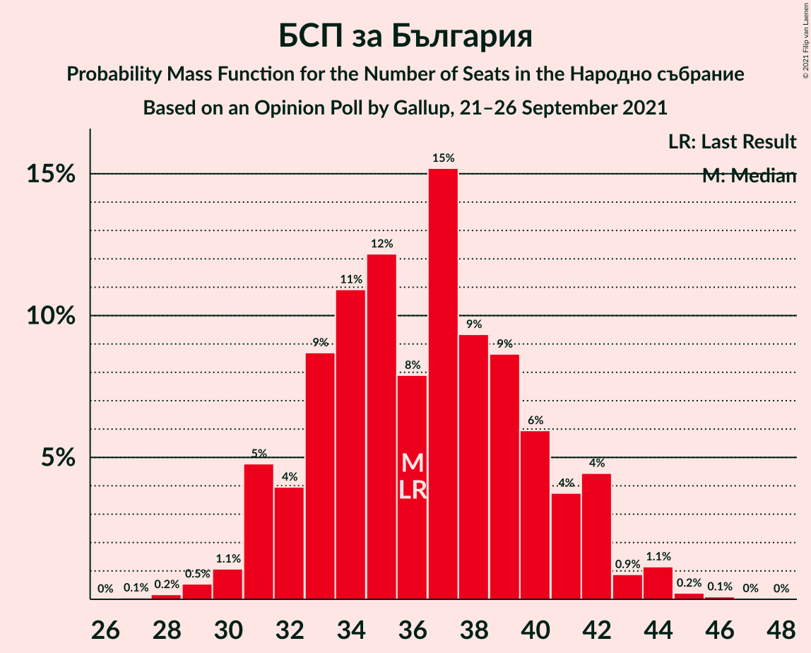
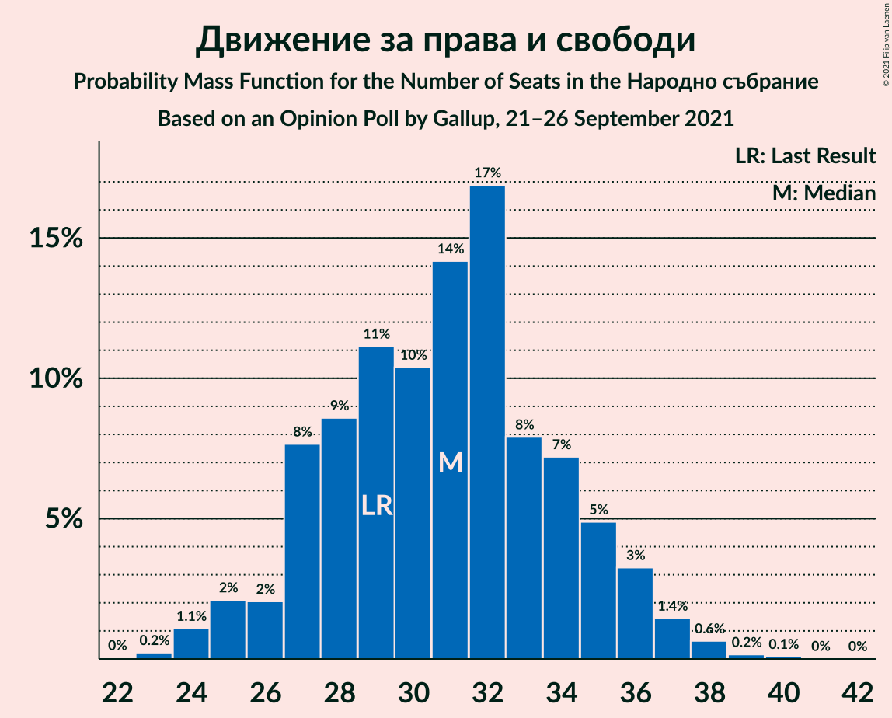
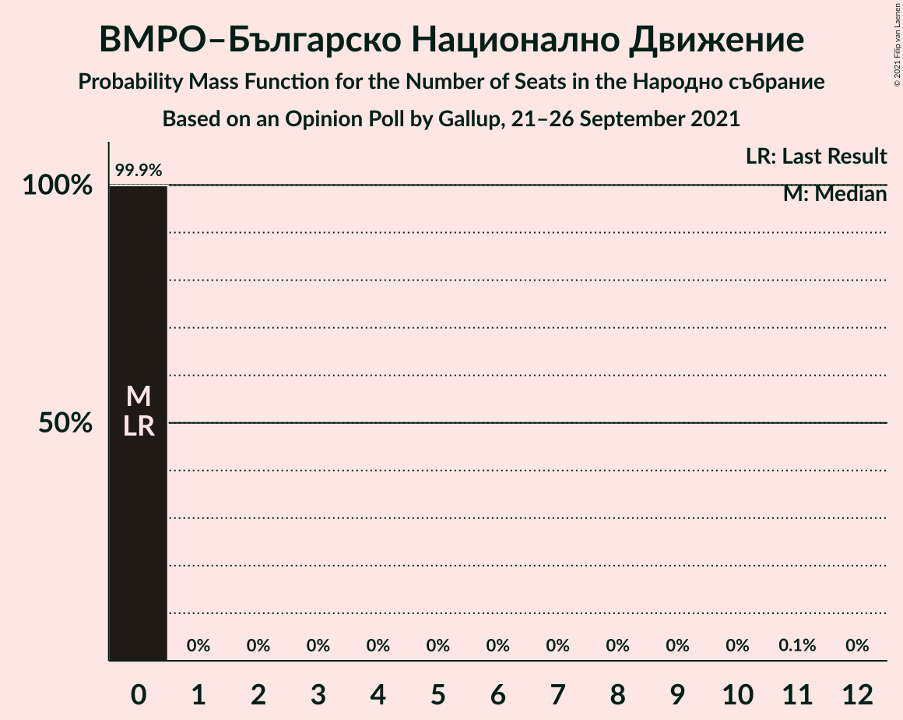
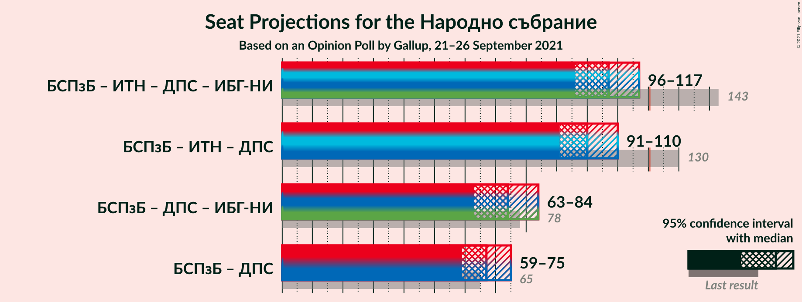
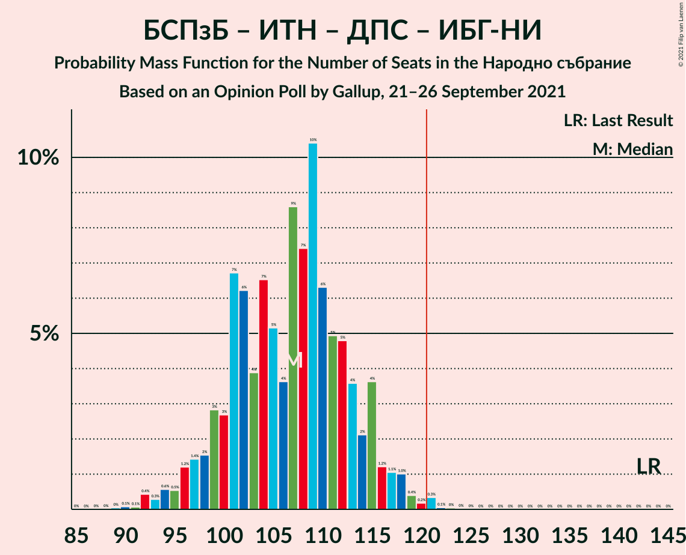
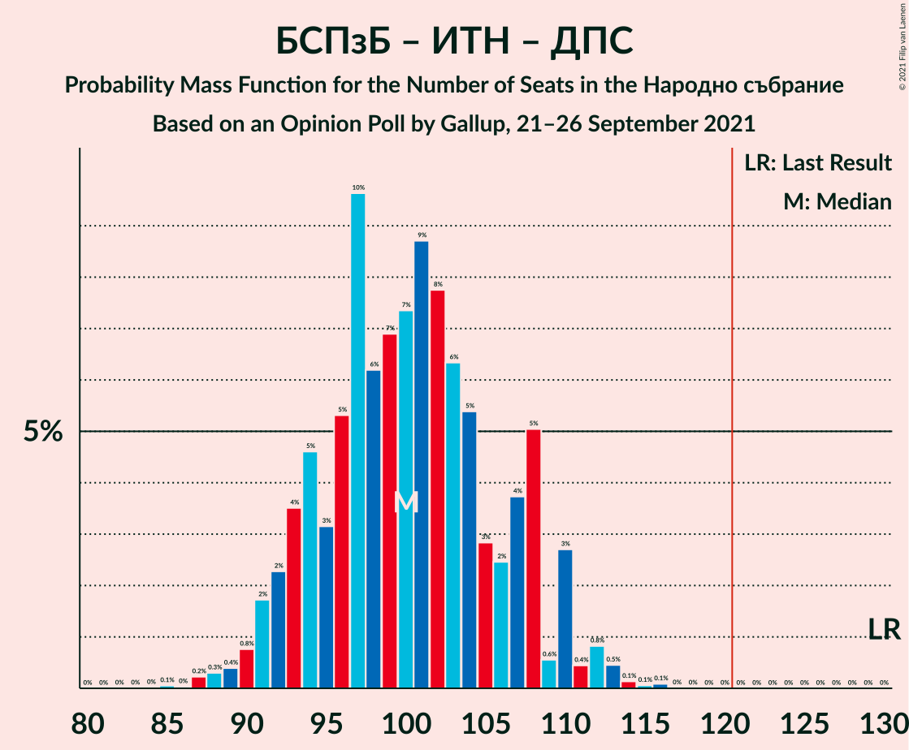
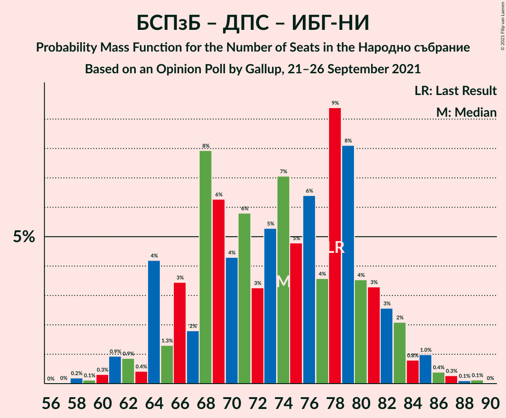

# Opinion Poll by Gallup, 21–26 September 2021

<a href="#voting-intentions">Voting Intentions</a> | <a href="#seats">Seats</a> | <a href="#coalitions">Coalitions</a> | <a href="#technical-information">Technical Information</a>

## Voting Intentions

### Confidence Intervals

| Party | Last Result | Poll Result | 80% Confidence Interval | 90% Confidence Interval | 95% Confidence Interval | 99% Confidence Interval |
|:-----:|:-----------:|:-----------:|:-----------------------:|:-----------------------:|:-----------------------:|:-----------------------:|
| Граждани за европейско развитие на България | 23.2% | 21.4% | 19.8–23.2% |19.4–23.7% |19.0–24.1% |18.3–24.9% |
| Продължаваме промяната | 0.0% | 15.2% | 13.8–16.8% |13.5–17.2% |13.1–17.6% |12.5–18.3% |
| БСП за България | 13.2% | 13.4% | 12.1–14.9% |11.8–15.3% |11.5–15.7% |10.9–16.4% |
| Има такъв народ | 23.8% | 12.3% | 11.0–13.7% |10.7–14.1% |10.4–14.4% |9.8–15.1% |
| Демократична България | 12.5% | 12.1% | 10.8–13.5% |10.5–13.9% |10.2–14.2% |9.6–14.9% |
| Движение за права и свободи | 10.6% | 11.4% | 10.2–12.7% |9.8–13.1% |9.5–13.5% |9.0–14.2% |
| Изправи се БГ! Ние идваме! | 5.0% | 4.1% | 3.4–5.0% |3.2–5.2% |3.0–5.5% |2.7–5.9% |
| Възраждане | 3.0% | 3.3% | 2.6–4.1% |2.5–4.3% |2.3–4.6% |2.1–5.0% |
| ВМРО–Българско Национално Движение | 3.1% | 2.2% | 1.7–2.9% |1.6–3.1% |1.4–3.3% |1.2–3.7% |

*Note:* The poll result column reflects the actual value used in the calculations. Published results may vary slightly, and in addition be rounded to fewer digits.

## Seats

### Confidence Intervals

| Party | Last Result | Median | 80% Confidence Interval | 90% Confidence Interval | 95% Confidence Interval | 99% Confidence Interval |
|:-----:|:-----------:|:------:|:-----------------------:|:-----------------------:|:-----------------------:|:-----------------------:|
| <a href="#граждани-за-европейско-развитие-на-българия">Граждани за европейско развитие на България</a> | 63 | 58 | 52–64 |51–64 |51–66 |49–69 |
| <a href="#продължаваме-промяната">Продължаваме промяната</a> | 0 | 41 | 39–45 |36–46 |35–48 |34–50 |
| <a href="#бсп-за-българия">БСП за България</a> | 36 | 35 | 32–39 |31–41 |31–42 |29–44 |
| <a href="#има-такъв-народ">Има такъв народ</a> | 65 | 33 | 29–36 |28–37 |27–38 |25–40 |
| <a href="#демократична-българия">Демократична България</a> | 34 | 33 | 29–36 |28–37 |27–39 |25–41 |
| <a href="#движение-за-права-и-свободи">Движение за права и свободи</a> | 29 | 31 | 29–35 |27–36 |26–37 |24–38 |
| <a href="#изправи-се-бг!-ние-идваме!">Изправи се БГ! Ние идваме!</a> | 13 | 0 | 0–13 |0–13 |0–14 |0–16 |
| <a href="#възраждане">Възраждане</a> | 0 | 0 | 0–12 |0–12 |0–12 |0–13 |
| <a href="#вмро–българско-национално-движение">ВМРО–Българско Национално Движение</a> | 0 | 0 | 0 |0 |0 |0 |

### Граждани за европейско развитие на България

*For a full overview of the results for this party, see the [Граждани за европейско развитие на България](party-гражданизаевропейскоразвитиенабългария.html) page.*

| Number of Seats | Probability | Accumulated | Special Marks |
|:---------------:|:-----------:|:-----------:|:-------------:|
| 46 | 0.2% | 100% |  |
| 47 | 0% | 99.8% |  |
| 48 | 0.2% | 99.8% |  |
| 49 | 0.7% | 99.6% |  |
| 50 | 0.5% | 98.9% |  |
| 51 | 3% | 98% |  |
| 52 | 11% | 95% |  |
| 53 | 5% | 84% |  |
| 54 | 4% | 79% |  |
| 55 | 14% | 75% |  |
| 56 | 7% | 62% |  |
| 57 | 3% | 55% |  |
| 58 | 14% | 51% | Median |
| 59 | 9% | 37% |  |
| 60 | 4% | 28% |  |
| 61 | 5% | 24% |  |
| 62 | 3% | 19% |  |
| 63 | 0.6% | 15% | Last Result |
| 64 | 12% | 15% |  |
| 65 | 0.4% | 3% |  |
| 66 | 1.3% | 3% |  |
| 67 | 0.1% | 1.2% |  |
| 68 | 0.4% | 1.1% |  |
| 69 | 0.3% | 0.7% |  |
| 70 | 0.1% | 0.3% |  |
| 71 | 0.3% | 0.3% |  |
| 72 | 0% | 0% |  |

### Продължаваме промяната

*For a full overview of the results for this party, see the [Продължаваме промяната](party-продължавамепромяната.html) page.*

| Number of Seats | Probability | Accumulated | Special Marks |
|:---------------:|:-----------:|:-----------:|:-------------:|
| 0 | 0% | 100% | Last Result |
| 1 | 0% | 100% |  |
| 2 | 0% | 100% |  |
| 3 | 0% | 100% |  |
| 4 | 0% | 100% |  |
| 5 | 0% | 100% |  |
| 6 | 0% | 100% |  |
| 7 | 0% | 100% |  |
| 8 | 0% | 100% |  |
| 9 | 0% | 100% |  |
| 10 | 0% | 100% |  |
| 11 | 0% | 100% |  |
| 12 | 0% | 100% |  |
| 13 | 0% | 100% |  |
| 14 | 0% | 100% |  |
| 15 | 0% | 100% |  |
| 16 | 0% | 100% |  |
| 17 | 0% | 100% |  |
| 18 | 0% | 100% |  |
| 19 | 0% | 100% |  |
| 20 | 0% | 100% |  |
| 21 | 0% | 100% |  |
| 22 | 0% | 100% |  |
| 23 | 0% | 100% |  |
| 24 | 0% | 100% |  |
| 25 | 0% | 100% |  |
| 26 | 0% | 100% |  |
| 27 | 0% | 100% |  |
| 28 | 0% | 100% |  |
| 29 | 0% | 100% |  |
| 30 | 0% | 100% |  |
| 31 | 0.1% | 100% |  |
| 32 | 0.1% | 99.9% |  |
| 33 | 0.2% | 99.8% |  |
| 34 | 1.3% | 99.6% |  |
| 35 | 2% | 98% |  |
| 36 | 2% | 96% |  |
| 37 | 2% | 94% |  |
| 38 | 2% | 92% |  |
| 39 | 19% | 90% |  |
| 40 | 21% | 72% |  |
| 41 | 9% | 50% | Median |
| 42 | 2% | 41% |  |
| 43 | 5% | 39% |  |
| 44 | 21% | 34% |  |
| 45 | 7% | 13% |  |
| 46 | 2% | 6% |  |
| 47 | 0.6% | 4% |  |
| 48 | 0.8% | 3% |  |
| 49 | 1.2% | 2% |  |
| 50 | 1.0% | 1.2% |  |
| 51 | 0.2% | 0.2% |  |
| 52 | 0% | 0% |  |

### БСП за България

*For a full overview of the results for this party, see the [БСП за България](party-бспзабългария.html) page.*

| Number of Seats | Probability | Accumulated | Special Marks |
|:---------------:|:-----------:|:-----------:|:-------------:|
| 27 | 0.1% | 100% |  |
| 28 | 0.1% | 99.9% |  |
| 29 | 1.3% | 99.8% |  |
| 30 | 0.7% | 98.5% |  |
| 31 | 6% | 98% |  |
| 32 | 3% | 92% |  |
| 33 | 24% | 89% |  |
| 34 | 2% | 65% |  |
| 35 | 17% | 64% | Median |
| 36 | 9% | 47% | Last Result |
| 37 | 13% | 38% |  |
| 38 | 14% | 25% |  |
| 39 | 4% | 12% |  |
| 40 | 3% | 8% |  |
| 41 | 0.8% | 5% |  |
| 42 | 2% | 4% |  |
| 43 | 0.5% | 2% |  |
| 44 | 0.9% | 1.4% |  |
| 45 | 0.1% | 0.4% |  |
| 46 | 0.3% | 0.4% |  |
| 47 | 0% | 0% |  |

### Има такъв народ

*For a full overview of the results for this party, see the [Има такъв народ](party-иматакъвнарод.html) page.*

| Number of Seats | Probability | Accumulated | Special Marks |
|:---------------:|:-----------:|:-----------:|:-------------:|
| 24 | 0.1% | 100% |  |
| 25 | 0.5% | 99.9% |  |
| 26 | 1.1% | 99.4% |  |
| 27 | 1.1% | 98% |  |
| 28 | 6% | 97% |  |
| 29 | 7% | 91% |  |
| 30 | 5% | 85% |  |
| 31 | 6% | 80% |  |
| 32 | 15% | 74% |  |
| 33 | 23% | 59% | Median |
| 34 | 10% | 36% |  |
| 35 | 13% | 25% |  |
| 36 | 6% | 13% |  |
| 37 | 4% | 7% |  |
| 38 | 2% | 3% |  |
| 39 | 0.7% | 1.4% |  |
| 40 | 0.4% | 0.7% |  |
| 41 | 0.2% | 0.3% |  |
| 42 | 0.1% | 0.1% |  |
| 43 | 0% | 0.1% |  |
| 44 | 0% | 0% |  |
| 45 | 0% | 0% |  |
| 46 | 0% | 0% |  |
| 47 | 0% | 0% |  |
| 48 | 0% | 0% |  |
| 49 | 0% | 0% |  |
| 50 | 0% | 0% |  |
| 51 | 0% | 0% |  |
| 52 | 0% | 0% |  |
| 53 | 0% | 0% |  |
| 54 | 0% | 0% |  |
| 55 | 0% | 0% |  |
| 56 | 0% | 0% |  |
| 57 | 0% | 0% |  |
| 58 | 0% | 0% |  |
| 59 | 0% | 0% |  |
| 60 | 0% | 0% |  |
| 61 | 0% | 0% |  |
| 62 | 0% | 0% |  |
| 63 | 0% | 0% |  |
| 64 | 0% | 0% |  |
| 65 | 0% | 0% | Last Result |

### Демократична България

*For a full overview of the results for this party, see the [Демократична България](party-демократичнабългария.html) page.*

| Number of Seats | Probability | Accumulated | Special Marks |
|:---------------:|:-----------:|:-----------:|:-------------:|
| 24 | 0.3% | 100% |  |
| 25 | 0.4% | 99.7% |  |
| 26 | 0.6% | 99.3% |  |
| 27 | 1.4% | 98.8% |  |
| 28 | 4% | 97% |  |
| 29 | 5% | 93% |  |
| 30 | 7% | 89% |  |
| 31 | 5% | 82% |  |
| 32 | 6% | 76% |  |
| 33 | 22% | 70% | Median |
| 34 | 13% | 48% | Last Result |
| 35 | 19% | 35% |  |
| 36 | 10% | 17% |  |
| 37 | 2% | 7% |  |
| 38 | 1.5% | 5% |  |
| 39 | 3% | 3% |  |
| 40 | 0.1% | 0.7% |  |
| 41 | 0.4% | 0.6% |  |
| 42 | 0.1% | 0.2% |  |
| 43 | 0% | 0.1% |  |
| 44 | 0% | 0.1% |  |
| 45 | 0% | 0% |  |

### Движение за права и свободи

*For a full overview of the results for this party, see the [Движение за права и свободи](party-движениезаправаисвободи.html) page.*

| Number of Seats | Probability | Accumulated | Special Marks |
|:---------------:|:-----------:|:-----------:|:-------------:|
| 22 | 0.1% | 100% |  |
| 23 | 0.1% | 99.9% |  |
| 24 | 0.5% | 99.8% |  |
| 25 | 2% | 99.3% |  |
| 26 | 1.4% | 98% |  |
| 27 | 2% | 96% |  |
| 28 | 2% | 94% |  |
| 29 | 4% | 91% | Last Result |
| 30 | 12% | 87% |  |
| 31 | 25% | 75% | Median |
| 32 | 6% | 50% |  |
| 33 | 14% | 44% |  |
| 34 | 5% | 30% |  |
| 35 | 16% | 24% |  |
| 36 | 5% | 8% |  |
| 37 | 3% | 4% |  |
| 38 | 0.3% | 0.5% |  |
| 39 | 0.1% | 0.2% |  |
| 40 | 0.1% | 0.1% |  |
| 41 | 0% | 0% |  |

### Изправи се БГ! Ние идваме!

*For a full overview of the results for this party, see the [Изправи се БГ! Ние идваме!](party-изправисебгниеидваме.html) page.*

| Number of Seats | Probability | Accumulated | Special Marks |
|:---------------:|:-----------:|:-----------:|:-------------:|
| 0 | 55% | 100% | Median |
| 1 | 0% | 45% |  |
| 2 | 0% | 45% |  |
| 3 | 0% | 45% |  |
| 4 | 0% | 45% |  |
| 5 | 0% | 45% |  |
| 6 | 0% | 45% |  |
| 7 | 0% | 45% |  |
| 8 | 0% | 45% |  |
| 9 | 0% | 45% |  |
| 10 | 0.9% | 45% |  |
| 11 | 11% | 44% |  |
| 12 | 18% | 33% |  |
| 13 | 10% | 15% | Last Result |
| 14 | 2% | 4% |  |
| 15 | 2% | 2% |  |
| 16 | 0.4% | 0.6% |  |
| 17 | 0.1% | 0.2% |  |
| 18 | 0% | 0% |  |

### Възраждане

*For a full overview of the results for this party, see the [Възраждане](party-възраждане.html) page.*

| Number of Seats | Probability | Accumulated | Special Marks |
|:---------------:|:-----------:|:-----------:|:-------------:|
| 0 | 81% | 100% | Last Result, Median |
| 1 | 0% | 19% |  |
| 2 | 0% | 19% |  |
| 3 | 0% | 19% |  |
| 4 | 0% | 19% |  |
| 5 | 0% | 19% |  |
| 6 | 0% | 19% |  |
| 7 | 0% | 19% |  |
| 8 | 0% | 19% |  |
| 9 | 0% | 19% |  |
| 10 | 0.2% | 19% |  |
| 11 | 2% | 19% |  |
| 12 | 14% | 17% |  |
| 13 | 2% | 2% |  |
| 14 | 0.2% | 0.3% |  |
| 15 | 0% | 0% |  |

### ВМРО–Българско Национално Движение

*For a full overview of the results for this party, see the [ВМРО–Българско Национално Движение](party-вмро–българсконационалнодвижение.html) page.*

| Number of Seats | Probability | Accumulated | Special Marks |
|:---------------:|:-----------:|:-----------:|:-------------:|
| 0 | 100% | 100% | Last Result, Median |

## Coalitions

### Confidence Intervals

| Coalition | Last Result | Median | Majority? | 80% Confidence Interval | 90% Confidence Interval | 95% Confidence Interval | 99% Confidence Interval |
|:---------:|:-----------:|:------:|:---------:|:-----------------------:|:-----------------------:|:-----------------------:|:-----------------------:|
| БСП за България – Има такъв народ – Движение за права и свободи – Изправи се БГ! Ние идваме! | 143 | 105 | 0.4% | 97–114 | 97–118 | 93–118 | 92–119 |
| БСП за България – Има такъв народ – Движение за права и свободи | 130 | 101 | 0% | 93–106 | 93–107 | 92–110 | 88–113 |
| БСП за България – Движение за права и свободи – Изправи се БГ! Ние идваме! | 78 | 71 | 0% | 64–83 | 64–85 | 61–85 | 61–87 |
| БСП за България – Движение за права и свободи | 65 | 68 | 0% | 63–72 | 61–73 | 60–75 | 57–79 |

### БСП за България – Има такъв народ – Движение за права и свободи – Изправи се БГ! Ние идваме!

| Number of Seats | Probability | Accumulated | Special Marks |
|:---------------:|:-----------:|:-----------:|:-------------:|
| 90 | 0% | 100% |  |
| 91 | 0.2% | 99.9% |  |
| 92 | 2% | 99.7% |  |
| 93 | 0.3% | 98% |  |
| 94 | 0.1% | 97% |  |
| 95 | 0.2% | 97% |  |
| 96 | 1.1% | 97% |  |
| 97 | 10% | 96% |  |
| 98 | 0.5% | 86% |  |
| 99 | 2% | 85% | Median |
| 100 | 3% | 83% |  |
| 101 | 9% | 80% |  |
| 102 | 1.2% | 70% |  |
| 103 | 11% | 69% |  |
| 104 | 3% | 58% |  |
| 105 | 7% | 56% |  |
| 106 | 7% | 48% |  |
| 107 | 6% | 41% |  |
| 108 | 1.0% | 36% |  |
| 109 | 7% | 35% |  |
| 110 | 2% | 27% |  |
| 111 | 9% | 25% |  |
| 112 | 0.6% | 16% |  |
| 113 | 3% | 15% |  |
| 114 | 3% | 13% |  |
| 115 | 0.8% | 10% |  |
| 116 | 0.4% | 9% |  |
| 117 | 2% | 9% |  |
| 118 | 6% | 7% |  |
| 119 | 0.3% | 0.7% |  |
| 120 | 0.1% | 0.4% |  |
| 121 | 0.2% | 0.4% | Majority |
| 122 | 0.1% | 0.2% |  |
| 123 | 0.1% | 0.1% |  |
| 124 | 0% | 0% |  |
| 125 | 0% | 0% |  |
| 126 | 0% | 0% |  |
| 127 | 0% | 0% |  |
| 128 | 0% | 0% |  |
| 129 | 0% | 0% |  |
| 130 | 0% | 0% |  |
| 131 | 0% | 0% |  |
| 132 | 0% | 0% |  |
| 133 | 0% | 0% |  |
| 134 | 0% | 0% |  |
| 135 | 0% | 0% |  |
| 136 | 0% | 0% |  |
| 137 | 0% | 0% |  |
| 138 | 0% | 0% |  |
| 139 | 0% | 0% |  |
| 140 | 0% | 0% |  |
| 141 | 0% | 0% |  |
| 142 | 0% | 0% |  |
| 143 | 0% | 0% | Last Result |

### БСП за България – Има такъв народ – Движение за права и свободи

| Number of Seats | Probability | Accumulated | Special Marks |
|:---------------:|:-----------:|:-----------:|:-------------:|
| 84 | 0.1% | 100% |  |
| 85 | 0% | 99.9% |  |
| 86 | 0% | 99.9% |  |
| 87 | 0% | 99.8% |  |
| 88 | 0.3% | 99.8% |  |
| 89 | 0.6% | 99.5% |  |
| 90 | 0.4% | 98.9% |  |
| 91 | 0.4% | 98% |  |
| 92 | 3% | 98% |  |
| 93 | 6% | 95% |  |
| 94 | 3% | 89% |  |
| 95 | 1.5% | 86% |  |
| 96 | 3% | 85% |  |
| 97 | 12% | 82% |  |
| 98 | 6% | 70% |  |
| 99 | 9% | 63% | Median |
| 100 | 4% | 54% |  |
| 101 | 9% | 50% |  |
| 102 | 6% | 41% |  |
| 103 | 12% | 35% |  |
| 104 | 3% | 23% |  |
| 105 | 8% | 20% |  |
| 106 | 4% | 12% |  |
| 107 | 5% | 8% |  |
| 108 | 0.8% | 4% |  |
| 109 | 0.2% | 3% |  |
| 110 | 0.4% | 3% |  |
| 111 | 1.3% | 2% |  |
| 112 | 0.2% | 0.8% |  |
| 113 | 0.2% | 0.6% |  |
| 114 | 0% | 0.4% |  |
| 115 | 0.3% | 0.4% |  |
| 116 | 0.1% | 0.1% |  |
| 117 | 0% | 0% |  |
| 118 | 0% | 0% |  |
| 119 | 0% | 0% |  |
| 120 | 0% | 0% |  |
| 121 | 0% | 0% | Majority |
| 122 | 0% | 0% |  |
| 123 | 0% | 0% |  |
| 124 | 0% | 0% |  |
| 125 | 0% | 0% |  |
| 126 | 0% | 0% |  |
| 127 | 0% | 0% |  |
| 128 | 0% | 0% |  |
| 129 | 0% | 0% |  |
| 130 | 0% | 0% | Last Result |

### БСП за България – Движение за права и свободи – Изправи се БГ! Ние идваме!

| Number of Seats | Probability | Accumulated | Special Marks |
|:---------------:|:-----------:|:-----------:|:-------------:|
| 56 | 0.1% | 100% |  |
| 57 | 0% | 99.9% |  |
| 58 | 0.1% | 99.9% |  |
| 59 | 0% | 99.8% |  |
| 60 | 0% | 99.8% |  |
| 61 | 2% | 99.8% |  |
| 62 | 0.2% | 97% |  |
| 63 | 0% | 97% |  |
| 64 | 11% | 97% |  |
| 65 | 2% | 86% |  |
| 66 | 2% | 84% | Median |
| 67 | 2% | 82% |  |
| 68 | 18% | 80% |  |
| 69 | 1.1% | 62% |  |
| 70 | 4% | 61% |  |
| 71 | 9% | 56% |  |
| 72 | 2% | 47% |  |
| 73 | 2% | 45% |  |
| 74 | 1.0% | 43% |  |
| 75 | 2% | 42% |  |
| 76 | 2% | 40% |  |
| 77 | 2% | 37% |  |
| 78 | 6% | 35% | Last Result |
| 79 | 9% | 29% |  |
| 80 | 6% | 20% |  |
| 81 | 2% | 14% |  |
| 82 | 0.4% | 12% |  |
| 83 | 3% | 12% |  |
| 84 | 3% | 9% |  |
| 85 | 4% | 5% |  |
| 86 | 0.4% | 2% |  |
| 87 | 1.0% | 1.4% |  |
| 88 | 0.3% | 0.4% |  |
| 89 | 0.1% | 0.1% |  |
| 90 | 0% | 0% |  |

### БСП за България – Движение за права и свободи

| Number of Seats | Probability | Accumulated | Special Marks |
|:---------------:|:-----------:|:-----------:|:-------------:|
| 55 | 0.2% | 100% |  |
| 56 | 0.1% | 99.8% |  |
| 57 | 0.4% | 99.7% |  |
| 58 | 0.5% | 99.3% |  |
| 59 | 0.6% | 98.8% |  |
| 60 | 0.8% | 98% |  |
| 61 | 5% | 97% |  |
| 62 | 2% | 93% |  |
| 63 | 2% | 91% |  |
| 64 | 12% | 89% |  |
| 65 | 8% | 76% | Last Result |
| 66 | 5% | 69% | Median |
| 67 | 10% | 64% |  |
| 68 | 20% | 55% |  |
| 69 | 6% | 35% |  |
| 70 | 7% | 28% |  |
| 71 | 9% | 21% |  |
| 72 | 4% | 12% |  |
| 73 | 4% | 8% |  |
| 74 | 1.3% | 4% |  |
| 75 | 0.9% | 3% |  |
| 76 | 0.4% | 2% |  |
| 77 | 0.2% | 2% |  |
| 78 | 0.3% | 2% |  |
| 79 | 1.2% | 1.5% |  |
| 80 | 0.2% | 0.3% |  |
| 81 | 0% | 0% |  |

## Technical Information

### Opinion Poll

+ **Polling firm:** Gallup
+ **Commissioner(s):** —
+ **Fieldwork period:** 21–26 September 2021

### Calculations

+ **Sample size:** 1012
+ **Simulations done:** 131,072
+ **Error estimate:** 0.84%

