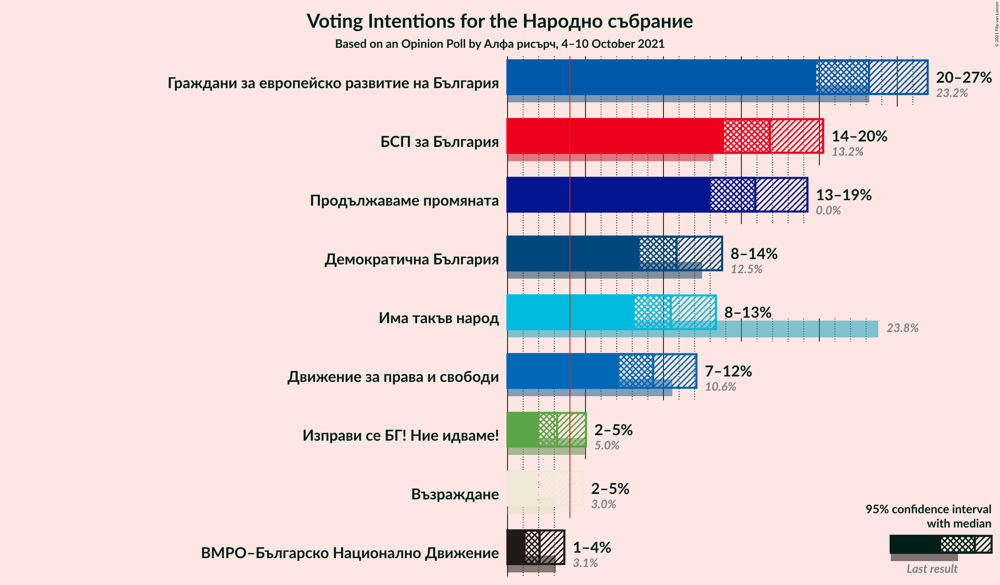
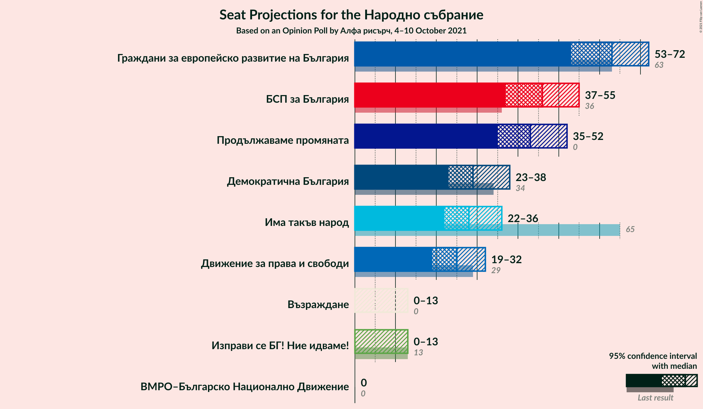
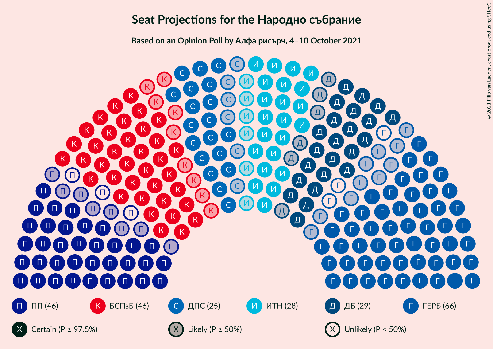
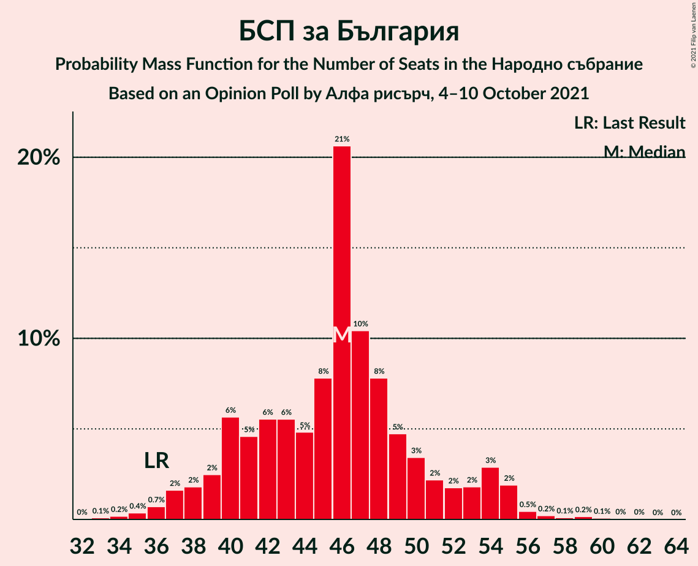
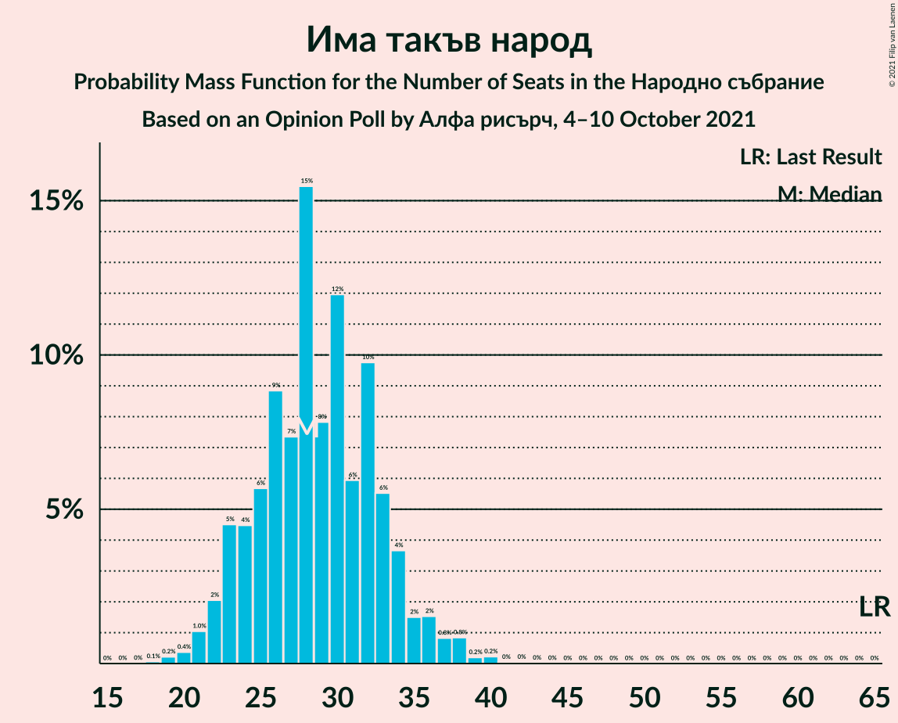
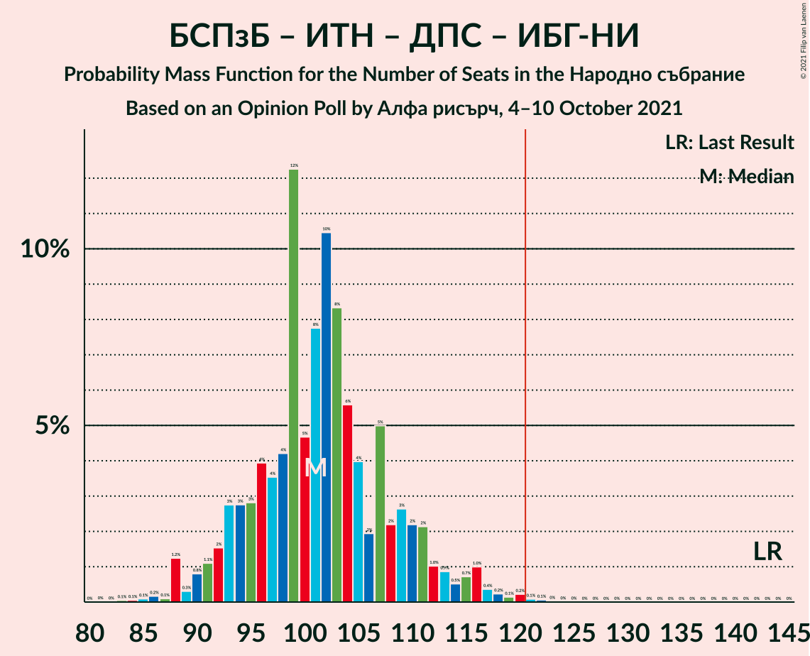
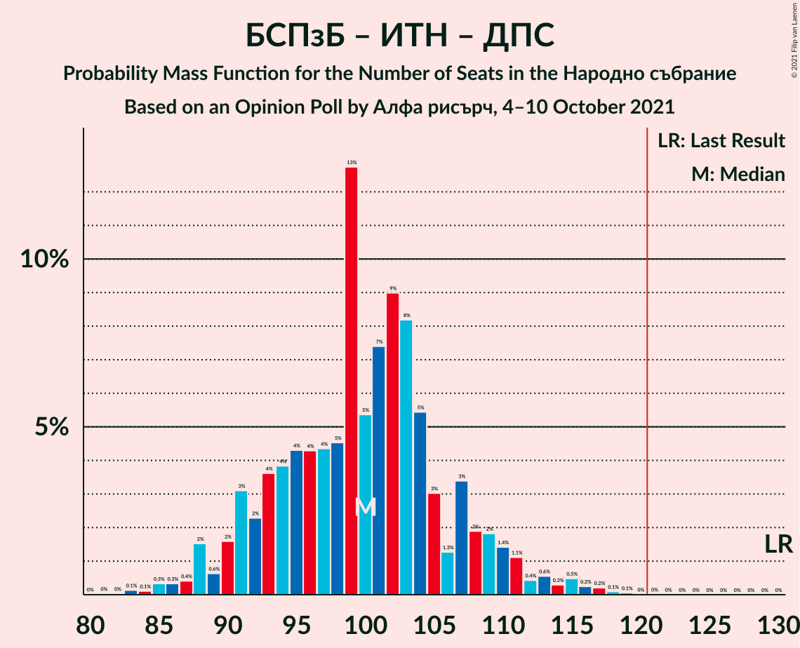

# Opinion Poll by Алфа рисърч, 4–10 October 2021

<a href="#voting-intentions">Voting Intentions</a> | <a href="#seats">Seats</a> | <a href="#coalitions">Coalitions</a> | <a href="#technical-information">Technical Information</a>

## Voting Intentions

### Confidence Intervals

| Party | Last Result | Poll Result | 80% Confidence Interval | 90% Confidence Interval | 95% Confidence Interval | 99% Confidence Interval |
|:-----:|:-----------:|:-----------:|:-----------------------:|:-----------------------:|:-----------------------:|:-----------------------:|
| Граждани за европейско развитие на България | 23.2% | 23.2% | 21.0–25.6% |20.3–26.3% |19.8–26.9% |18.8–28.2% |
| БСП за България | 13.2% | 16.8% | 14.9–19.1% |14.3–19.7% |13.9–20.2% |13.0–21.3% |
| Продължаваме промяната | 0.0% | 15.9% | 14.0–18.1% |13.5–18.7% |13.0–19.2% |12.2–20.3% |
| Демократична България | 12.5% | 10.8% | 9.3–12.8% |8.8–13.3% |8.5–13.8% |7.8–14.7% |
| Има такъв народ | 23.8% | 10.5% | 8.9–12.3% |8.5–12.9% |8.2–13.4% |7.5–14.3% |
| Движение за права и свободи | 10.6% | 9.3% | 7.9–11.2% |7.5–11.7% |7.2–12.1% |6.5–13.0% |
| Изправи се БГ! Ние идваме! | 5.0% | 3.2% | 2.4–4.4% |2.2–4.7% |2.0–5.0% |1.7–5.7% |
| Възраждане | 3.0% | 3.0% | 2.2–4.2% |2.0–4.5% |1.8–4.8% |1.5–5.4% |
| ВМРО–Българско Национално Движение | 3.1% | 2.1% | 1.5–3.1% |1.3–3.4% |1.2–3.6% |0.9–4.2% |

*Note:* The poll result column reflects the actual value used in the calculations. Published results may vary slightly, and in addition be rounded to fewer digits.

## Seats

### Confidence Intervals

| Party | Last Result | Median | 80% Confidence Interval | 90% Confidence Interval | 95% Confidence Interval | 99% Confidence Interval |
|:-----:|:-----------:|:------:|:-----------------------:|:-----------------------:|:-----------------------:|:-----------------------:|
| <a href="#граждани-за-европейско-развитие-на-българия">Граждани за европейско развитие на България</a> | 63 | 63 | 57–69 |55–70 |53–72 |50–75 |
| <a href="#бсп-за-българия">БСП за България</a> | 36 | 46 | 40–51 |39–54 |37–55 |35–57 |
| <a href="#продължаваме-промяната">Продължаваме промяната</a> | 0 | 43 | 38–48 |36–50 |35–52 |33–55 |
| <a href="#демократична-българия">Демократична България</a> | 34 | 29 | 25–35 |24–36 |23–38 |21–40 |
| <a href="#има-такъв-народ">Има такъв народ</a> | 65 | 28 | 24–33 |23–35 |22–36 |20–39 |
| <a href="#движение-за-права-и-свободи">Движение за права и свободи</a> | 29 | 25 | 22–30 |20–31 |19–32 |18–35 |
| <a href="#изправи-се-бг!-ние-идваме!">Изправи се БГ! Ние идваме!</a> | 13 | 0 | 0–11 |0–12 |0–13 |0–15 |
| <a href="#възраждане">Възраждане</a> | 0 | 0 | 0–11 |0–12 |0–13 |0–14 |
| <a href="#вмро–българско-национално-движение">ВМРО–Българско Национално Движение</a> | 0 | 0 | 0 |0 |0 |0–11 |

### Граждани за европейско развитие на България

*For a full overview of the results for this party, see the [Граждани за европейско развитие на България](party-гражданизаевропейскоразвитиенабългария.html) page.*

| Number of Seats | Probability | Accumulated | Special Marks |
|:---------------:|:-----------:|:-----------:|:-------------:|
| 47 | 0.1% | 100% |  |
| 48 | 0% | 99.9% |  |
| 49 | 0.2% | 99.9% |  |
| 50 | 0.5% | 99.7% |  |
| 51 | 0.5% | 99.2% |  |
| 52 | 0.6% | 98.8% |  |
| 53 | 1.2% | 98% |  |
| 54 | 2% | 97% |  |
| 55 | 2% | 95% |  |
| 56 | 3% | 94% |  |
| 57 | 3% | 91% |  |
| 58 | 6% | 88% |  |
| 59 | 4% | 82% |  |
| 60 | 3% | 78% |  |
| 61 | 4% | 75% |  |
| 62 | 18% | 71% |  |
| 63 | 4% | 54% | Last Result, Median |
| 64 | 3% | 50% |  |
| 65 | 5% | 46% |  |
| 66 | 21% | 41% |  |
| 67 | 4% | 20% |  |
| 68 | 2% | 16% |  |
| 69 | 8% | 15% |  |
| 70 | 2% | 7% |  |
| 71 | 2% | 5% |  |
| 72 | 0.3% | 3% |  |
| 73 | 1.0% | 2% |  |
| 74 | 0.4% | 1.4% |  |
| 75 | 0.6% | 1.0% |  |
| 76 | 0.1% | 0.4% |  |
| 77 | 0.1% | 0.3% |  |
| 78 | 0.1% | 0.2% |  |
| 79 | 0.1% | 0.1% |  |
| 80 | 0% | 0.1% |  |
| 81 | 0% | 0% |  |

### БСП за България

*For a full overview of the results for this party, see the [БСП за България](party-бспзабългария.html) page.*

| Number of Seats | Probability | Accumulated | Special Marks |
|:---------------:|:-----------:|:-----------:|:-------------:|
| 32 | 0% | 100% |  |
| 33 | 0.1% | 99.9% |  |
| 34 | 0.2% | 99.9% |  |
| 35 | 0.4% | 99.7% |  |
| 36 | 0.7% | 99.3% | Last Result |
| 37 | 2% | 98.6% |  |
| 38 | 2% | 97% |  |
| 39 | 2% | 95% |  |
| 40 | 6% | 93% |  |
| 41 | 5% | 87% |  |
| 42 | 6% | 82% |  |
| 43 | 6% | 77% |  |
| 44 | 5% | 71% |  |
| 45 | 8% | 67% |  |
| 46 | 21% | 59% | Median |
| 47 | 10% | 38% |  |
| 48 | 8% | 28% |  |
| 49 | 5% | 20% |  |
| 50 | 3% | 15% |  |
| 51 | 2% | 12% |  |
| 52 | 2% | 9% |  |
| 53 | 2% | 8% |  |
| 54 | 3% | 6% |  |
| 55 | 2% | 3% |  |
| 56 | 0.5% | 1.1% |  |
| 57 | 0.2% | 0.7% |  |
| 58 | 0.1% | 0.4% |  |
| 59 | 0.2% | 0.3% |  |
| 60 | 0.1% | 0.2% |  |
| 61 | 0% | 0.1% |  |
| 62 | 0% | 0.1% |  |
| 63 | 0% | 0% |  |

### Продължаваме промяната

*For a full overview of the results for this party, see the [Продължаваме промяната](party-продължавамепромяната.html) page.*

| Number of Seats | Probability | Accumulated | Special Marks |
|:---------------:|:-----------:|:-----------:|:-------------:|
| 0 | 0% | 100% | Last Result |
| 1 | 0% | 100% |  |
| 2 | 0% | 100% |  |
| 3 | 0% | 100% |  |
| 4 | 0% | 100% |  |
| 5 | 0% | 100% |  |
| 6 | 0% | 100% |  |
| 7 | 0% | 100% |  |
| 8 | 0% | 100% |  |
| 9 | 0% | 100% |  |
| 10 | 0% | 100% |  |
| 11 | 0% | 100% |  |
| 12 | 0% | 100% |  |
| 13 | 0% | 100% |  |
| 14 | 0% | 100% |  |
| 15 | 0% | 100% |  |
| 16 | 0% | 100% |  |
| 17 | 0% | 100% |  |
| 18 | 0% | 100% |  |
| 19 | 0% | 100% |  |
| 20 | 0% | 100% |  |
| 21 | 0% | 100% |  |
| 22 | 0% | 100% |  |
| 23 | 0% | 100% |  |
| 24 | 0% | 100% |  |
| 25 | 0% | 100% |  |
| 26 | 0% | 100% |  |
| 27 | 0% | 100% |  |
| 28 | 0% | 100% |  |
| 29 | 0% | 100% |  |
| 30 | 0% | 100% |  |
| 31 | 0.1% | 99.9% |  |
| 32 | 0.2% | 99.8% |  |
| 33 | 0.3% | 99.6% |  |
| 34 | 0.7% | 99.3% |  |
| 35 | 2% | 98.6% |  |
| 36 | 2% | 97% |  |
| 37 | 3% | 94% |  |
| 38 | 3% | 91% |  |
| 39 | 6% | 88% |  |
| 40 | 7% | 82% |  |
| 41 | 8% | 75% |  |
| 42 | 9% | 67% |  |
| 43 | 8% | 58% | Median |
| 44 | 9% | 50% |  |
| 45 | 9% | 41% |  |
| 46 | 14% | 32% |  |
| 47 | 4% | 18% |  |
| 48 | 5% | 14% |  |
| 49 | 3% | 10% |  |
| 50 | 2% | 7% |  |
| 51 | 1.5% | 5% |  |
| 52 | 1.5% | 4% |  |
| 53 | 1.1% | 2% |  |
| 54 | 0.3% | 1.0% |  |
| 55 | 0.2% | 0.7% |  |
| 56 | 0.3% | 0.5% |  |
| 57 | 0.1% | 0.2% |  |
| 58 | 0.1% | 0.1% |  |
| 59 | 0% | 0% |  |

### Демократична България

*For a full overview of the results for this party, see the [Демократична България](party-демократичнабългария.html) page.*

| Number of Seats | Probability | Accumulated | Special Marks |
|:---------------:|:-----------:|:-----------:|:-------------:|
| 19 | 0.1% | 100% |  |
| 20 | 0.3% | 99.9% |  |
| 21 | 0.6% | 99.6% |  |
| 22 | 1.1% | 99.1% |  |
| 23 | 2% | 98% |  |
| 24 | 3% | 96% |  |
| 25 | 5% | 93% |  |
| 26 | 7% | 88% |  |
| 27 | 9% | 81% |  |
| 28 | 9% | 72% |  |
| 29 | 14% | 63% | Median |
| 30 | 10% | 49% |  |
| 31 | 7% | 39% |  |
| 32 | 9% | 31% |  |
| 33 | 4% | 22% |  |
| 34 | 5% | 18% | Last Result |
| 35 | 6% | 13% |  |
| 36 | 2% | 6% |  |
| 37 | 2% | 5% |  |
| 38 | 2% | 3% |  |
| 39 | 0.6% | 1.3% |  |
| 40 | 0.3% | 0.7% |  |
| 41 | 0.2% | 0.4% |  |
| 42 | 0.1% | 0.2% |  |
| 43 | 0% | 0.1% |  |
| 44 | 0% | 0% |  |

### Има такъв народ

*For a full overview of the results for this party, see the [Има такъв народ](party-иматакъвнарод.html) page.*

| Number of Seats | Probability | Accumulated | Special Marks |
|:---------------:|:-----------:|:-----------:|:-------------:|
| 18 | 0.1% | 100% |  |
| 19 | 0.2% | 99.9% |  |
| 20 | 0.4% | 99.7% |  |
| 21 | 1.0% | 99.3% |  |
| 22 | 2% | 98% |  |
| 23 | 5% | 96% |  |
| 24 | 4% | 92% |  |
| 25 | 6% | 87% |  |
| 26 | 9% | 82% |  |
| 27 | 7% | 73% |  |
| 28 | 15% | 65% | Median |
| 29 | 8% | 50% |  |
| 30 | 12% | 42% |  |
| 31 | 6% | 30% |  |
| 32 | 10% | 24% |  |
| 33 | 6% | 14% |  |
| 34 | 4% | 9% |  |
| 35 | 2% | 5% |  |
| 36 | 2% | 4% |  |
| 37 | 0.8% | 2% |  |
| 38 | 0.8% | 1.4% |  |
| 39 | 0.2% | 0.5% |  |
| 40 | 0.2% | 0.3% |  |
| 41 | 0% | 0.1% |  |
| 42 | 0% | 0.1% |  |
| 43 | 0% | 0% |  |
| 44 | 0% | 0% |  |
| 45 | 0% | 0% |  |
| 46 | 0% | 0% |  |
| 47 | 0% | 0% |  |
| 48 | 0% | 0% |  |
| 49 | 0% | 0% |  |
| 50 | 0% | 0% |  |
| 51 | 0% | 0% |  |
| 52 | 0% | 0% |  |
| 53 | 0% | 0% |  |
| 54 | 0% | 0% |  |
| 55 | 0% | 0% |  |
| 56 | 0% | 0% |  |
| 57 | 0% | 0% |  |
| 58 | 0% | 0% |  |
| 59 | 0% | 0% |  |
| 60 | 0% | 0% |  |
| 61 | 0% | 0% |  |
| 62 | 0% | 0% |  |
| 63 | 0% | 0% |  |
| 64 | 0% | 0% |  |
| 65 | 0% | 0% | Last Result |

### Движение за права и свободи

*For a full overview of the results for this party, see the [Движение за права и свободи](party-движениезаправаисвободи.html) page.*

| Number of Seats | Probability | Accumulated | Special Marks |
|:---------------:|:-----------:|:-----------:|:-------------:|
| 16 | 0.1% | 100% |  |
| 17 | 0.3% | 99.8% |  |
| 18 | 1.0% | 99.6% |  |
| 19 | 2% | 98.6% |  |
| 20 | 2% | 96% |  |
| 21 | 4% | 94% |  |
| 22 | 9% | 90% |  |
| 23 | 9% | 81% |  |
| 24 | 12% | 71% |  |
| 25 | 12% | 59% | Median |
| 26 | 16% | 47% |  |
| 27 | 8% | 32% |  |
| 28 | 4% | 23% |  |
| 29 | 6% | 19% | Last Result |
| 30 | 7% | 13% |  |
| 31 | 2% | 6% |  |
| 32 | 2% | 4% |  |
| 33 | 0.7% | 2% |  |
| 34 | 0.5% | 1.5% |  |
| 35 | 0.7% | 1.0% |  |
| 36 | 0.1% | 0.3% |  |
| 37 | 0.1% | 0.2% |  |
| 38 | 0% | 0.1% |  |
| 39 | 0% | 0% |  |

### Изправи се БГ! Ние идваме!

*For a full overview of the results for this party, see the [Изправи се БГ! Ние идваме!](party-изправисебгниеидваме.html) page.*

| Number of Seats | Probability | Accumulated | Special Marks |
|:---------------:|:-----------:|:-----------:|:-------------:|
| 0 | 86% | 100% | Median |
| 1 | 0% | 14% |  |
| 2 | 0% | 14% |  |
| 3 | 0% | 14% |  |
| 4 | 0% | 14% |  |
| 5 | 0% | 14% |  |
| 6 | 0% | 14% |  |
| 7 | 0% | 14% |  |
| 8 | 0% | 14% |  |
| 9 | 0% | 14% |  |
| 10 | 0.1% | 14% |  |
| 11 | 6% | 14% |  |
| 12 | 4% | 9% |  |
| 13 | 3% | 5% | Last Result |
| 14 | 1.1% | 2% |  |
| 15 | 0.4% | 0.7% |  |
| 16 | 0.2% | 0.3% |  |
| 17 | 0.1% | 0.1% |  |
| 18 | 0% | 0% |  |

### Възраждане

*For a full overview of the results for this party, see the [Възраждане](party-възраждане.html) page.*

| Number of Seats | Probability | Accumulated | Special Marks |
|:---------------:|:-----------:|:-----------:|:-------------:|
| 0 | 84% | 100% | Last Result, Median |
| 1 | 0% | 16% |  |
| 2 | 0% | 16% |  |
| 3 | 0% | 16% |  |
| 4 | 0% | 16% |  |
| 5 | 0% | 16% |  |
| 6 | 0% | 16% |  |
| 7 | 0% | 16% |  |
| 8 | 0% | 16% |  |
| 9 | 0% | 16% |  |
| 10 | 0.2% | 16% |  |
| 11 | 7% | 16% |  |
| 12 | 5% | 9% |  |
| 13 | 2% | 4% |  |
| 14 | 1.0% | 1.4% |  |
| 15 | 0.3% | 0.4% |  |
| 16 | 0.1% | 0.1% |  |
| 17 | 0% | 0% |  |

### ВМРО–Българско Национално Движение

*For a full overview of the results for this party, see the [ВМРО–Българско Национално Движение](party-вмро–българсконационалнодвижение.html) page.*

| Number of Seats | Probability | Accumulated | Special Marks |
|:---------------:|:-----------:|:-----------:|:-------------:|
| 0 | 99.1% | 100% | Last Result, Median |
| 1 | 0% | 0.9% |  |
| 2 | 0% | 0.9% |  |
| 3 | 0% | 0.9% |  |
| 4 | 0% | 0.9% |  |
| 5 | 0% | 0.9% |  |
| 6 | 0% | 0.9% |  |
| 7 | 0% | 0.9% |  |
| 8 | 0% | 0.9% |  |
| 9 | 0% | 0.9% |  |
| 10 | 0% | 0.9% |  |
| 11 | 0.5% | 0.8% |  |
| 12 | 0.3% | 0.4% |  |
| 13 | 0.1% | 0.1% |  |
| 14 | 0% | 0% |  |

## Coalitions

### Confidence Intervals

| Coalition | Last Result | Median | Majority? | 80% Confidence Interval | 90% Confidence Interval | 95% Confidence Interval | 99% Confidence Interval |
|:---------:|:-----------:|:------:|:---------:|:-----------------------:|:-----------------------:|:-----------------------:|:-----------------------:|
| БСП за България – Има такъв народ – Движение за права и свободи – Изправи се БГ! Ние идваме! | 143 | 101 | 0.2% | 94–109 | 92–112 | 90–115 | 87–119 |
| БСП за България – Има такъв народ – Движение за права и свободи | 130 | 100 | 0% | 92–107 | 90–109 | 88–111 | 85–116 |
| БСП за България – Движение за права и свободи – Изправи се БГ! Ние идваме! | 78 | 72 | 0% | 66–81 | 64–84 | 62–86 | 60–90 |
| БСП за България – Движение за права и свободи | 65 | 71 | 0% | 64–78 | 63–80 | 61–82 | 59–86 |

### БСП за България – Има такъв народ – Движение за права и свободи – Изправи се БГ! Ние идваме!

| Number of Seats | Probability | Accumulated | Special Marks |
|:---------------:|:-----------:|:-----------:|:-------------:|
| 83 | 0.1% | 100% |  |
| 84 | 0.1% | 99.9% |  |
| 85 | 0.1% | 99.9% |  |
| 86 | 0.2% | 99.8% |  |
| 87 | 0.1% | 99.6% |  |
| 88 | 1.2% | 99.5% |  |
| 89 | 0.3% | 98% |  |
| 90 | 0.8% | 98% |  |
| 91 | 1.1% | 97% |  |
| 92 | 2% | 96% |  |
| 93 | 3% | 94% |  |
| 94 | 3% | 92% |  |
| 95 | 3% | 89% |  |
| 96 | 4% | 86% |  |
| 97 | 4% | 82% |  |
| 98 | 4% | 79% |  |
| 99 | 12% | 74% | Median |
| 100 | 5% | 62% |  |
| 101 | 8% | 58% |  |
| 102 | 10% | 50% |  |
| 103 | 8% | 39% |  |
| 104 | 6% | 31% |  |
| 105 | 4% | 25% |  |
| 106 | 2% | 21% |  |
| 107 | 5% | 19% |  |
| 108 | 2% | 14% |  |
| 109 | 3% | 12% |  |
| 110 | 2% | 10% |  |
| 111 | 2% | 7% |  |
| 112 | 1.0% | 5% |  |
| 113 | 0.9% | 4% |  |
| 114 | 0.5% | 3% |  |
| 115 | 0.7% | 3% |  |
| 116 | 1.0% | 2% |  |
| 117 | 0.4% | 1.2% |  |
| 118 | 0.2% | 0.8% |  |
| 119 | 0.1% | 0.6% |  |
| 120 | 0.2% | 0.4% |  |
| 121 | 0.1% | 0.2% | Majority |
| 122 | 0.1% | 0.1% |  |
| 123 | 0% | 0.1% |  |
| 124 | 0% | 0% |  |
| 125 | 0% | 0% |  |
| 126 | 0% | 0% |  |
| 127 | 0% | 0% |  |
| 128 | 0% | 0% |  |
| 129 | 0% | 0% |  |
| 130 | 0% | 0% |  |
| 131 | 0% | 0% |  |
| 132 | 0% | 0% |  |
| 133 | 0% | 0% |  |
| 134 | 0% | 0% |  |
| 135 | 0% | 0% |  |
| 136 | 0% | 0% |  |
| 137 | 0% | 0% |  |
| 138 | 0% | 0% |  |
| 139 | 0% | 0% |  |
| 140 | 0% | 0% |  |
| 141 | 0% | 0% |  |
| 142 | 0% | 0% |  |
| 143 | 0% | 0% | Last Result |

### БСП за България – Има такъв народ – Движение за права и свободи

| Number of Seats | Probability | Accumulated | Special Marks |
|:---------------:|:-----------:|:-----------:|:-------------:|
| 81 | 0% | 100% |  |
| 82 | 0% | 99.9% |  |
| 83 | 0.1% | 99.9% |  |
| 84 | 0.1% | 99.7% |  |
| 85 | 0.3% | 99.6% |  |
| 86 | 0.3% | 99.3% |  |
| 87 | 0.4% | 99.0% |  |
| 88 | 2% | 98.6% |  |
| 89 | 0.6% | 97% |  |
| 90 | 2% | 96% |  |
| 91 | 3% | 95% |  |
| 92 | 2% | 92% |  |
| 93 | 4% | 89% |  |
| 94 | 4% | 86% |  |
| 95 | 4% | 82% |  |
| 96 | 4% | 78% |  |
| 97 | 4% | 73% |  |
| 98 | 5% | 69% |  |
| 99 | 13% | 64% | Median |
| 100 | 5% | 52% |  |
| 101 | 7% | 46% |  |
| 102 | 9% | 39% |  |
| 103 | 8% | 30% |  |
| 104 | 5% | 22% |  |
| 105 | 3% | 16% |  |
| 106 | 1.3% | 13% |  |
| 107 | 3% | 12% |  |
| 108 | 2% | 9% |  |
| 109 | 2% | 7% |  |
| 110 | 1.4% | 5% |  |
| 111 | 1.1% | 4% |  |
| 112 | 0.4% | 2% |  |
| 113 | 0.6% | 2% |  |
| 114 | 0.3% | 1.4% |  |
| 115 | 0.5% | 1.1% |  |
| 116 | 0.2% | 0.6% |  |
| 117 | 0.2% | 0.4% |  |
| 118 | 0.1% | 0.2% |  |
| 119 | 0.1% | 0.1% |  |
| 120 | 0% | 0% |  |
| 121 | 0% | 0% | Majority |
| 122 | 0% | 0% |  |
| 123 | 0% | 0% |  |
| 124 | 0% | 0% |  |
| 125 | 0% | 0% |  |
| 126 | 0% | 0% |  |
| 127 | 0% | 0% |  |
| 128 | 0% | 0% |  |
| 129 | 0% | 0% |  |
| 130 | 0% | 0% | Last Result |

### БСП за България – Движение за права и свободи – Изправи се БГ! Ние идваме!

| Number of Seats | Probability | Accumulated | Special Marks |
|:---------------:|:-----------:|:-----------:|:-------------:|
| 55 | 0.1% | 100% |  |
| 56 | 0% | 99.9% |  |
| 57 | 0% | 99.9% |  |
| 58 | 0.1% | 99.9% |  |
| 59 | 0.1% | 99.7% |  |
| 60 | 0.3% | 99.6% |  |
| 61 | 1.3% | 99.3% |  |
| 62 | 1.0% | 98% |  |
| 63 | 2% | 97% |  |
| 64 | 2% | 95% |  |
| 65 | 2% | 94% |  |
| 66 | 3% | 92% |  |
| 67 | 4% | 88% |  |
| 68 | 5% | 85% |  |
| 69 | 8% | 79% |  |
| 70 | 10% | 71% |  |
| 71 | 11% | 61% | Median |
| 72 | 4% | 50% |  |
| 73 | 4% | 46% |  |
| 74 | 6% | 42% |  |
| 75 | 7% | 36% |  |
| 76 | 6% | 29% |  |
| 77 | 3% | 23% |  |
| 78 | 4% | 20% | Last Result |
| 79 | 2% | 16% |  |
| 80 | 3% | 14% |  |
| 81 | 2% | 12% |  |
| 82 | 2% | 10% |  |
| 83 | 2% | 7% |  |
| 84 | 2% | 5% |  |
| 85 | 0.9% | 4% |  |
| 86 | 0.6% | 3% |  |
| 87 | 0.6% | 2% |  |
| 88 | 0.6% | 1.4% |  |
| 89 | 0.3% | 0.8% |  |
| 90 | 0.1% | 0.5% |  |
| 91 | 0.1% | 0.4% |  |
| 92 | 0.1% | 0.3% |  |
| 93 | 0.1% | 0.2% |  |
| 94 | 0.1% | 0.1% |  |
| 95 | 0% | 0.1% |  |
| 96 | 0% | 0% |  |

### БСП за България – Движение за права и свободи

| Number of Seats | Probability | Accumulated | Special Marks |
|:---------------:|:-----------:|:-----------:|:-------------:|
| 55 | 0.1% | 100% |  |
| 56 | 0.1% | 99.9% |  |
| 57 | 0.1% | 99.8% |  |
| 58 | 0.2% | 99.7% |  |
| 59 | 0.4% | 99.5% |  |
| 60 | 0.4% | 99.1% |  |
| 61 | 2% | 98.7% |  |
| 62 | 2% | 97% |  |
| 63 | 2% | 95% |  |
| 64 | 3% | 93% |  |
| 65 | 2% | 90% | Last Result |
| 66 | 5% | 87% |  |
| 67 | 5% | 83% |  |
| 68 | 6% | 78% |  |
| 69 | 9% | 72% |  |
| 70 | 11% | 63% |  |
| 71 | 13% | 52% | Median |
| 72 | 5% | 40% |  |
| 73 | 5% | 35% |  |
| 74 | 6% | 30% |  |
| 75 | 6% | 24% |  |
| 76 | 5% | 18% |  |
| 77 | 3% | 13% |  |
| 78 | 3% | 11% |  |
| 79 | 1.4% | 8% |  |
| 80 | 2% | 6% |  |
| 81 | 0.9% | 4% |  |
| 82 | 1.4% | 3% |  |
| 83 | 0.9% | 2% |  |
| 84 | 0.3% | 1.1% |  |
| 85 | 0.2% | 0.8% |  |
| 86 | 0.3% | 0.6% |  |
| 87 | 0.1% | 0.3% |  |
| 88 | 0.1% | 0.2% |  |
| 89 | 0% | 0.1% |  |
| 90 | 0% | 0% |  |

## Technical Information

### Opinion Poll

+ **Polling firm:** Алфа рисърч
+ **Commissioner(s):** —
+ **Fieldwork period:** 4–10 October 2021

### Calculations

+ **Sample size:** 535
+ **Simulations done:** 1,048,576
+ **Error estimate:** 2.30%

