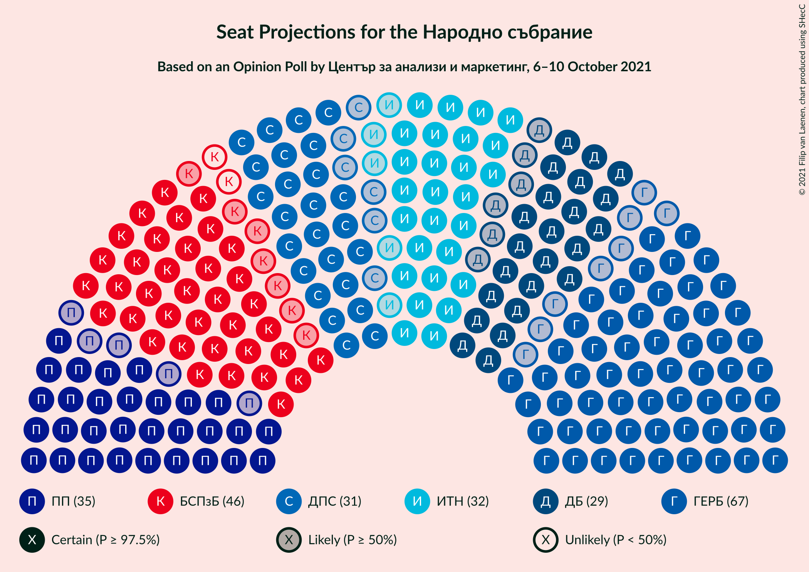
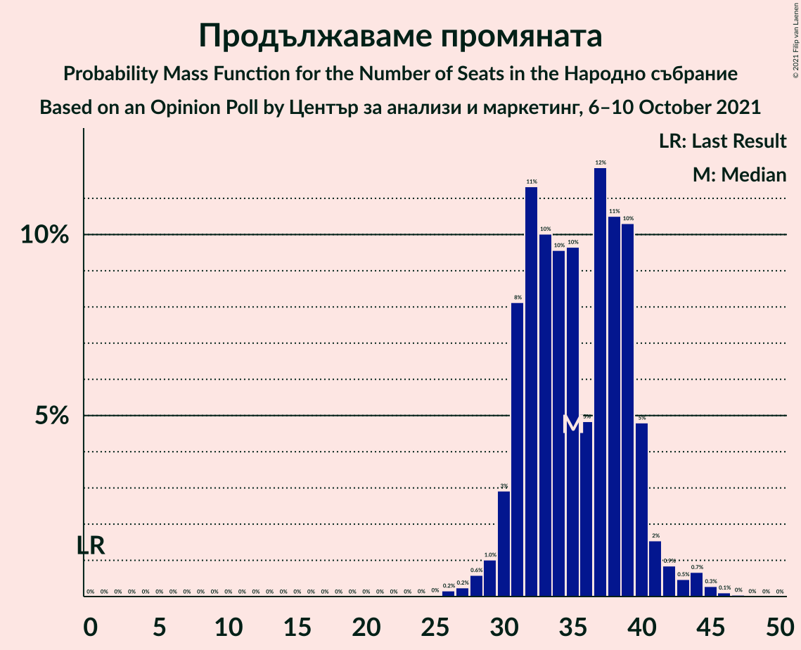
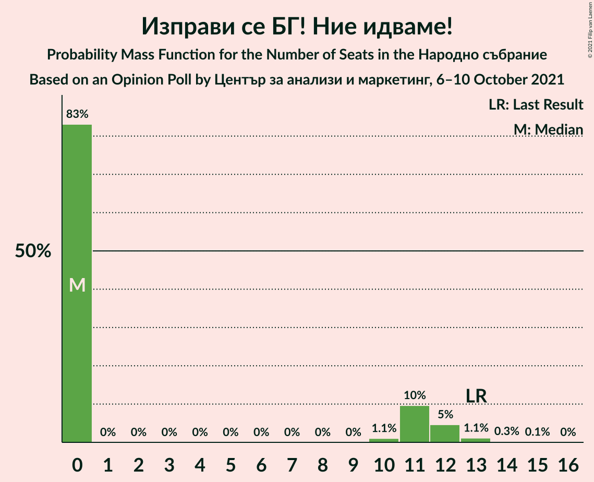

# Opinion Poll by Център за анализи и маркетинг, 6–10 October 2021

<a href="#voting-intentions">Voting Intentions</a> | <a href="#seats">Seats</a> | <a href="#coalitions">Coalitions</a> | <a href="#technical-information">Technical Information</a>

## Voting Intentions

### Confidence Intervals

| Party | Last Result | Poll Result | 80% Confidence Interval | 90% Confidence Interval | 95% Confidence Interval | 99% Confidence Interval |
|:-----:|:-----------:|:-----------:|:-----------------------:|:-----------------------:|:-----------------------:|:-----------------------:|
| Граждани за европейско развитие на България | 23.2% | 25.5% | 23.6–27.5% |23.1–28.1% |22.6–28.6% |21.7–29.6% |
| БСП за България | 13.2% | 16.6% | 15.0–18.4% |14.6–18.9% |14.2–19.4% |13.5–20.2% |
| Продължаваме промяната | 0.0% | 13.4% | 12.0–15.1% |11.6–15.5% |11.2–16.0% |10.6–16.8% |
| Има такъв народ | 23.8% | 12.3% | 10.9–13.9% |10.6–14.4% |10.2–14.8% |9.6–15.6% |
| Движение за права и свободи | 10.6% | 11.6% | 10.2–13.1% |9.9–13.6% |9.6–14.0% |8.9–14.8% |
| Демократична България | 12.5% | 10.8% | 9.5–12.4% |9.2–12.8% |8.9–13.2% |8.3–13.9% |
| Изправи се БГ! Ние идваме! | 5.0% | 3.3% | 2.6–4.3% |2.5–4.6% |2.3–4.8% |2.0–5.3% |
| Възраждане | 3.0% | 1.7% | 1.3–2.5% |1.1–2.7% |1.0–2.9% |0.8–3.3% |
| ВМРО–Българско Национално Движение | 3.1% | 0.7% | 0.5–1.3% |0.4–1.5% |0.3–1.6% |0.2–1.9% |

*Note:* The poll result column reflects the actual value used in the calculations. Published results may vary slightly, and in addition be rounded to fewer digits.

## Seats

### Confidence Intervals

| Party | Last Result | Median | 80% Confidence Interval | 90% Confidence Interval | 95% Confidence Interval | 99% Confidence Interval |
|:-----:|:-----------:|:------:|:-----------------------:|:-----------------------:|:-----------------------:|:-----------------------:|
| <a href="#граждани-за-европейско-развитие-на-българия">Граждани за европейско развитие на България</a> | 63 | 67 | 64–74 |61–74 |59–75 |58–76 |
| <a href="#бсп-за-българия">БСП за България</a> | 36 | 44 | 40–48 |40–49 |38–51 |36–53 |
| <a href="#продължаваме-промяната">Продължаваме промяната</a> | 0 | 37 | 32–40 |31–40 |30–41 |28–43 |
| <a href="#има-такъв-народ">Има такъв народ</a> | 65 | 32 | 29–36 |28–36 |28–37 |26–42 |
| <a href="#движение-за-права-и-свободи">Движение за права и свободи</a> | 29 | 30 | 26–35 |25–37 |25–37 |23–39 |
| <a href="#демократична-българия">Демократична България</a> | 34 | 28 | 24–32 |23–33 |22–33 |20–36 |
| <a href="#изправи-се-бг!-ние-идваме!">Изправи се БГ! Ние идваме!</a> | 13 | 0 | 0–11 |0–12 |0–12 |0–14 |
| <a href="#възраждане">Възраждане</a> | 0 | 0 | 0 |0 |0 |0 |
| <a href="#вмро–българско-национално-движение">ВМРО–Българско Национално Движение</a> | 0 | 0 | 0 |0 |0 |0 |

### Граждани за европейско развитие на България

*For a full overview of the results for this party, see the [Граждани за европейско развитие на България](party-гражданизаевропейскоразвитиенабългария.html) page.*

| Number of Seats | Probability | Accumulated | Special Marks |
|:---------------:|:-----------:|:-----------:|:-------------:|
| 55 | 0.1% | 100% |  |
| 56 | 0.1% | 99.9% |  |
| 57 | 0.2% | 99.8% |  |
| 58 | 0.4% | 99.6% |  |
| 59 | 3% | 99.2% |  |
| 60 | 0.6% | 96% |  |
| 61 | 2% | 96% |  |
| 62 | 1.2% | 94% |  |
| 63 | 2% | 92% | Last Result |
| 64 | 12% | 90% |  |
| 65 | 7% | 78% |  |
| 66 | 19% | 71% |  |
| 67 | 8% | 52% | Median |
| 68 | 10% | 44% |  |
| 69 | 5% | 35% |  |
| 70 | 5% | 30% |  |
| 71 | 4% | 25% |  |
| 72 | 8% | 21% |  |
| 73 | 3% | 13% |  |
| 74 | 7% | 10% |  |
| 75 | 1.5% | 3% |  |
| 76 | 1.0% | 1.4% |  |
| 77 | 0.2% | 0.5% |  |
| 78 | 0.2% | 0.3% |  |
| 79 | 0.1% | 0.1% |  |
| 80 | 0% | 0% |  |

### БСП за България

*For a full overview of the results for this party, see the [БСП за България](party-бспзабългария.html) page.*

| Number of Seats | Probability | Accumulated | Special Marks |
|:---------------:|:-----------:|:-----------:|:-------------:|
| 33 | 0% | 100% |  |
| 34 | 0.1% | 99.9% |  |
| 35 | 0.3% | 99.9% |  |
| 36 | 0.6% | 99.6% | Last Result |
| 37 | 1.0% | 99.0% |  |
| 38 | 1.2% | 98% |  |
| 39 | 2% | 97% |  |
| 40 | 9% | 95% |  |
| 41 | 6% | 86% |  |
| 42 | 10% | 80% |  |
| 43 | 17% | 70% |  |
| 44 | 5% | 53% | Median |
| 45 | 15% | 48% |  |
| 46 | 8% | 33% |  |
| 47 | 9% | 25% |  |
| 48 | 9% | 16% |  |
| 49 | 3% | 7% |  |
| 50 | 2% | 5% |  |
| 51 | 2% | 3% |  |
| 52 | 0.6% | 1.2% |  |
| 53 | 0.4% | 0.6% |  |
| 54 | 0.1% | 0.2% |  |
| 55 | 0.1% | 0.1% |  |
| 56 | 0% | 0.1% |  |
| 57 | 0% | 0% |  |

### Продължаваме промяната

*For a full overview of the results for this party, see the [Продължаваме промяната](party-продължавамепромяната.html) page.*

| Number of Seats | Probability | Accumulated | Special Marks |
|:---------------:|:-----------:|:-----------:|:-------------:|
| 0 | 0% | 100% | Last Result |
| 1 | 0% | 100% |  |
| 2 | 0% | 100% |  |
| 3 | 0% | 100% |  |
| 4 | 0% | 100% |  |
| 5 | 0% | 100% |  |
| 6 | 0% | 100% |  |
| 7 | 0% | 100% |  |
| 8 | 0% | 100% |  |
| 9 | 0% | 100% |  |
| 10 | 0% | 100% |  |
| 11 | 0% | 100% |  |
| 12 | 0% | 100% |  |
| 13 | 0% | 100% |  |
| 14 | 0% | 100% |  |
| 15 | 0% | 100% |  |
| 16 | 0% | 100% |  |
| 17 | 0% | 100% |  |
| 18 | 0% | 100% |  |
| 19 | 0% | 100% |  |
| 20 | 0% | 100% |  |
| 21 | 0% | 100% |  |
| 22 | 0% | 100% |  |
| 23 | 0% | 100% |  |
| 24 | 0% | 100% |  |
| 25 | 0% | 100% |  |
| 26 | 0.1% | 100% |  |
| 27 | 0.1% | 99.8% |  |
| 28 | 0.5% | 99.7% |  |
| 29 | 0.4% | 99.2% |  |
| 30 | 3% | 98.8% |  |
| 31 | 2% | 96% |  |
| 32 | 6% | 94% |  |
| 33 | 15% | 88% |  |
| 34 | 5% | 73% |  |
| 35 | 6% | 68% |  |
| 36 | 8% | 62% |  |
| 37 | 15% | 54% | Median |
| 38 | 15% | 39% |  |
| 39 | 11% | 24% |  |
| 40 | 10% | 12% |  |
| 41 | 1.2% | 3% |  |
| 42 | 0.7% | 2% |  |
| 43 | 0.8% | 0.9% |  |
| 44 | 0% | 0.2% |  |
| 45 | 0.1% | 0.1% |  |
| 46 | 0% | 0% |  |

### Има такъв народ

*For a full overview of the results for this party, see the [Има такъв народ](party-иматакъвнарод.html) page.*

| Number of Seats | Probability | Accumulated | Special Marks |
|:---------------:|:-----------:|:-----------:|:-------------:|
| 24 | 0% | 100% |  |
| 25 | 0.1% | 99.9% |  |
| 26 | 1.3% | 99.8% |  |
| 27 | 0.8% | 98.6% |  |
| 28 | 3% | 98% |  |
| 29 | 6% | 95% |  |
| 30 | 24% | 89% |  |
| 31 | 2% | 65% |  |
| 32 | 20% | 63% | Median |
| 33 | 24% | 44% |  |
| 34 | 5% | 20% |  |
| 35 | 4% | 15% |  |
| 36 | 8% | 11% |  |
| 37 | 1.1% | 3% |  |
| 38 | 0.3% | 2% |  |
| 39 | 0.3% | 2% |  |
| 40 | 0.3% | 1.3% |  |
| 41 | 0.3% | 1.1% |  |
| 42 | 0.3% | 0.8% |  |
| 43 | 0% | 0.5% |  |
| 44 | 0.4% | 0.4% |  |
| 45 | 0% | 0% |  |
| 46 | 0% | 0% |  |
| 47 | 0% | 0% |  |
| 48 | 0% | 0% |  |
| 49 | 0% | 0% |  |
| 50 | 0% | 0% |  |
| 51 | 0% | 0% |  |
| 52 | 0% | 0% |  |
| 53 | 0% | 0% |  |
| 54 | 0% | 0% |  |
| 55 | 0% | 0% |  |
| 56 | 0% | 0% |  |
| 57 | 0% | 0% |  |
| 58 | 0% | 0% |  |
| 59 | 0% | 0% |  |
| 60 | 0% | 0% |  |
| 61 | 0% | 0% |  |
| 62 | 0% | 0% |  |
| 63 | 0% | 0% |  |
| 64 | 0% | 0% |  |
| 65 | 0% | 0% | Last Result |

### Движение за права и свободи

*For a full overview of the results for this party, see the [Движение за права и свободи](party-движениезаправаисвободи.html) page.*

| Number of Seats | Probability | Accumulated | Special Marks |
|:---------------:|:-----------:|:-----------:|:-------------:|
| 22 | 0.2% | 100% |  |
| 23 | 0.3% | 99.8% |  |
| 24 | 1.1% | 99.4% |  |
| 25 | 6% | 98% |  |
| 26 | 7% | 92% |  |
| 27 | 8% | 85% |  |
| 28 | 9% | 77% |  |
| 29 | 13% | 68% | Last Result |
| 30 | 7% | 55% | Median |
| 31 | 4% | 48% |  |
| 32 | 10% | 45% |  |
| 33 | 7% | 35% |  |
| 34 | 6% | 27% |  |
| 35 | 12% | 21% |  |
| 36 | 3% | 9% |  |
| 37 | 5% | 6% |  |
| 38 | 0.8% | 2% |  |
| 39 | 0.6% | 0.7% |  |
| 40 | 0% | 0.1% |  |
| 41 | 0% | 0% |  |

### Демократична България

*For a full overview of the results for this party, see the [Демократична България](party-демократичнабългария.html) page.*

| Number of Seats | Probability | Accumulated | Special Marks |
|:---------------:|:-----------:|:-----------:|:-------------:|
| 19 | 0% | 100% |  |
| 20 | 0.5% | 99.9% |  |
| 21 | 0.1% | 99.4% |  |
| 22 | 3% | 99.3% |  |
| 23 | 2% | 96% |  |
| 24 | 5% | 94% |  |
| 25 | 9% | 90% |  |
| 26 | 12% | 80% |  |
| 27 | 12% | 68% |  |
| 28 | 7% | 56% | Median |
| 29 | 17% | 49% |  |
| 30 | 6% | 32% |  |
| 31 | 14% | 26% |  |
| 32 | 4% | 12% |  |
| 33 | 6% | 8% |  |
| 34 | 0.9% | 2% | Last Result |
| 35 | 0.6% | 2% |  |
| 36 | 0.7% | 1.0% |  |
| 37 | 0.1% | 0.3% |  |
| 38 | 0.1% | 0.2% |  |
| 39 | 0% | 0.1% |  |
| 40 | 0% | 0.1% |  |
| 41 | 0% | 0% |  |

### Изправи се БГ! Ние идваме!

*For a full overview of the results for this party, see the [Изправи се БГ! Ние идваме!](party-изправисебгниеидваме.html) page.*

| Number of Seats | Probability | Accumulated | Special Marks |
|:---------------:|:-----------:|:-----------:|:-------------:|
| 0 | 89% | 100% | Median |
| 1 | 0% | 11% |  |
| 2 | 0% | 11% |  |
| 3 | 0% | 11% |  |
| 4 | 0% | 11% |  |
| 5 | 0% | 11% |  |
| 6 | 0% | 11% |  |
| 7 | 0% | 11% |  |
| 8 | 0% | 11% |  |
| 9 | 0% | 11% |  |
| 10 | 0.2% | 11% |  |
| 11 | 4% | 11% |  |
| 12 | 5% | 6% |  |
| 13 | 0.6% | 1.1% | Last Result |
| 14 | 0.4% | 0.5% |  |
| 15 | 0.1% | 0.1% |  |
| 16 | 0% | 0% |  |

### Възраждане

*For a full overview of the results for this party, see the [Възраждане](party-възраждане.html) page.*

| Number of Seats | Probability | Accumulated | Special Marks |
|:---------------:|:-----------:|:-----------:|:-------------:|
| 0 | 100% | 100% | Last Result, Median |

### ВМРО–Българско Национално Движение

*For a full overview of the results for this party, see the [ВМРО–Българско Национално Движение](party-вмро–българсконационалнодвижение.html) page.*

| Number of Seats | Probability | Accumulated | Special Marks |
|:---------------:|:-----------:|:-----------:|:-------------:|
| 0 | 100% | 100% | Last Result, Median |

## Coalitions

### Confidence Intervals

| Coalition | Last Result | Median | Majority? | 80% Confidence Interval | 90% Confidence Interval | 95% Confidence Interval | 99% Confidence Interval |
|:---------:|:-----------:|:------:|:---------:|:-----------------------:|:-----------------------:|:-----------------------:|:-----------------------:|
| БСП за България – Има такъв народ – Движение за права и свободи – Изправи се БГ! Ние идваме! | 143 | 108 | 0.9% | 102–115 | 100–117 | 100–118 | 97–121 |
| БСП за България – Има такъв народ – Движение за права и свободи | 130 | 107 | 0.1% | 102–113 | 100–114 | 100–115 | 96–118 |
| БСП за България – Движение за права и свободи – Изправи се БГ! Ние идваме! | 78 | 76 | 0% | 68–84 | 66–87 | 66–88 | 64–91 |
| БСП за България – Движение за права и свободи | 65 | 75 | 0% | 68–80 | 66–83 | 66–86 | 63–86 |

### БСП за България – Има такъв народ – Движение за права и свободи – Изправи се БГ! Ние идваме!

| Number of Seats | Probability | Accumulated | Special Marks |
|:---------------:|:-----------:|:-----------:|:-------------:|
| 95 | 0% | 100% |  |
| 96 | 0.3% | 99.9% |  |
| 97 | 0.1% | 99.6% |  |
| 98 | 0.8% | 99.5% |  |
| 99 | 0.4% | 98.7% |  |
| 100 | 6% | 98% |  |
| 101 | 0.5% | 92% |  |
| 102 | 6% | 92% |  |
| 103 | 6% | 86% |  |
| 104 | 7% | 80% |  |
| 105 | 9% | 73% |  |
| 106 | 3% | 64% | Median |
| 107 | 7% | 61% |  |
| 108 | 6% | 54% |  |
| 109 | 2% | 48% |  |
| 110 | 14% | 46% |  |
| 111 | 5% | 32% |  |
| 112 | 7% | 27% |  |
| 113 | 3% | 20% |  |
| 114 | 6% | 17% |  |
| 115 | 2% | 11% |  |
| 116 | 1.0% | 9% |  |
| 117 | 4% | 8% |  |
| 118 | 2% | 4% |  |
| 119 | 0.4% | 1.5% |  |
| 120 | 0.2% | 1.1% |  |
| 121 | 0.5% | 0.9% | Majority |
| 122 | 0.3% | 0.5% |  |
| 123 | 0% | 0.1% |  |
| 124 | 0% | 0.1% |  |
| 125 | 0% | 0% |  |
| 126 | 0% | 0% |  |
| 127 | 0% | 0% |  |
| 128 | 0% | 0% |  |
| 129 | 0% | 0% |  |
| 130 | 0% | 0% |  |
| 131 | 0% | 0% |  |
| 132 | 0% | 0% |  |
| 133 | 0% | 0% |  |
| 134 | 0% | 0% |  |
| 135 | 0% | 0% |  |
| 136 | 0% | 0% |  |
| 137 | 0% | 0% |  |
| 138 | 0% | 0% |  |
| 139 | 0% | 0% |  |
| 140 | 0% | 0% |  |
| 141 | 0% | 0% |  |
| 142 | 0% | 0% |  |
| 143 | 0% | 0% | Last Result |

### БСП за България – Има такъв народ – Движение за права и свободи

| Number of Seats | Probability | Accumulated | Special Marks |
|:---------------:|:-----------:|:-----------:|:-------------:|
| 93 | 0% | 100% |  |
| 94 | 0.1% | 99.9% |  |
| 95 | 0.1% | 99.9% |  |
| 96 | 0.4% | 99.8% |  |
| 97 | 0.2% | 99.4% |  |
| 98 | 0.9% | 99.2% |  |
| 99 | 0.6% | 98% |  |
| 100 | 7% | 98% |  |
| 101 | 0.5% | 91% |  |
| 102 | 6% | 90% |  |
| 103 | 9% | 85% |  |
| 104 | 8% | 75% |  |
| 105 | 12% | 67% |  |
| 106 | 5% | 56% | Median |
| 107 | 7% | 51% |  |
| 108 | 6% | 44% |  |
| 109 | 2% | 38% |  |
| 110 | 14% | 36% |  |
| 111 | 5% | 21% |  |
| 112 | 7% | 17% |  |
| 113 | 3% | 10% |  |
| 114 | 3% | 7% |  |
| 115 | 2% | 5% |  |
| 116 | 0.9% | 2% |  |
| 117 | 1.0% | 2% |  |
| 118 | 0.2% | 0.6% |  |
| 119 | 0.3% | 0.4% |  |
| 120 | 0.1% | 0.1% |  |
| 121 | 0% | 0.1% | Majority |
| 122 | 0% | 0% |  |
| 123 | 0% | 0% |  |
| 124 | 0% | 0% |  |
| 125 | 0% | 0% |  |
| 126 | 0% | 0% |  |
| 127 | 0% | 0% |  |
| 128 | 0% | 0% |  |
| 129 | 0% | 0% |  |
| 130 | 0% | 0% | Last Result |

### БСП за България – Движение за права и свободи – Изправи се БГ! Ние идваме!

| Number of Seats | Probability | Accumulated | Special Marks |
|:---------------:|:-----------:|:-----------:|:-------------:|
| 60 | 0.1% | 100% |  |
| 61 | 0% | 99.9% |  |
| 62 | 0% | 99.9% |  |
| 63 | 0.4% | 99.9% |  |
| 64 | 0.1% | 99.5% |  |
| 65 | 0.3% | 99.4% |  |
| 66 | 5% | 99.2% |  |
| 67 | 0.3% | 94% |  |
| 68 | 6% | 94% |  |
| 69 | 2% | 88% |  |
| 70 | 2% | 85% |  |
| 71 | 1.4% | 83% |  |
| 72 | 13% | 82% |  |
| 73 | 2% | 69% |  |
| 74 | 7% | 67% | Median |
| 75 | 8% | 59% |  |
| 76 | 3% | 51% |  |
| 77 | 5% | 48% |  |
| 78 | 6% | 43% | Last Result |
| 79 | 7% | 37% |  |
| 80 | 10% | 30% |  |
| 81 | 5% | 20% |  |
| 82 | 2% | 14% |  |
| 83 | 2% | 12% |  |
| 84 | 1.5% | 10% |  |
| 85 | 0.3% | 9% |  |
| 86 | 2% | 8% |  |
| 87 | 3% | 6% |  |
| 88 | 2% | 3% |  |
| 89 | 0% | 0.8% |  |
| 90 | 0.2% | 0.7% |  |
| 91 | 0.1% | 0.6% |  |
| 92 | 0.4% | 0.5% |  |
| 93 | 0% | 0.1% |  |
| 94 | 0% | 0.1% |  |
| 95 | 0% | 0.1% |  |
| 96 | 0% | 0% |  |

### БСП за България – Движение за права и свободи

| Number of Seats | Probability | Accumulated | Special Marks |
|:---------------:|:-----------:|:-----------:|:-------------:|
| 60 | 0.1% | 100% |  |
| 61 | 0% | 99.9% |  |
| 62 | 0.1% | 99.9% |  |
| 63 | 0.4% | 99.9% |  |
| 64 | 0.2% | 99.5% |  |
| 65 | 0.3% | 99.3% | Last Result |
| 66 | 5% | 99.0% |  |
| 67 | 0.5% | 94% |  |
| 68 | 7% | 94% |  |
| 69 | 3% | 87% |  |
| 70 | 5% | 84% |  |
| 71 | 2% | 79% |  |
| 72 | 14% | 78% |  |
| 73 | 2% | 64% |  |
| 74 | 8% | 61% | Median |
| 75 | 11% | 54% |  |
| 76 | 5% | 43% |  |
| 77 | 5% | 38% |  |
| 78 | 6% | 33% |  |
| 79 | 7% | 27% |  |
| 80 | 10% | 20% |  |
| 81 | 2% | 10% |  |
| 82 | 2% | 8% |  |
| 83 | 2% | 5% |  |
| 84 | 1.0% | 4% |  |
| 85 | 0.1% | 3% |  |
| 86 | 2% | 3% |  |
| 87 | 0.1% | 0.2% |  |
| 88 | 0.1% | 0.1% |  |
| 89 | 0% | 0% |  |

## Technical Information

### Opinion Poll

+ **Polling firm:** Център за анализи и маркетинг
+ **Commissioner(s):** —
+ **Fieldwork period:** 6–10 October 2021

### Calculations

+ **Sample size:** 812
+ **Simulations done:** 131,072
+ **Error estimate:** 3.63%

