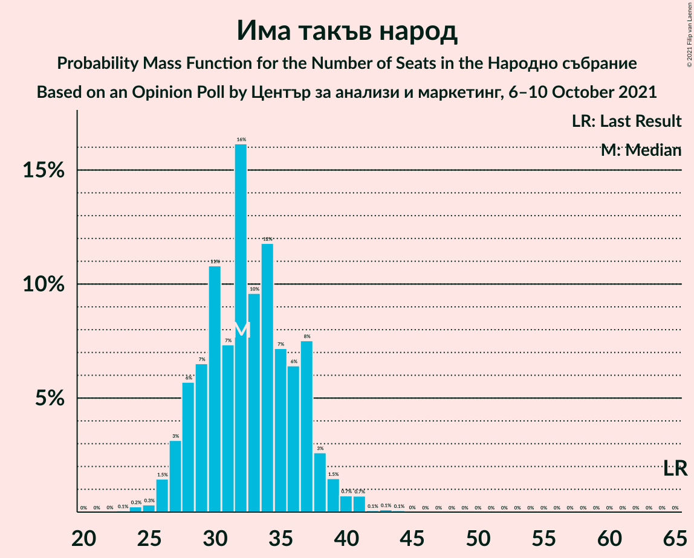
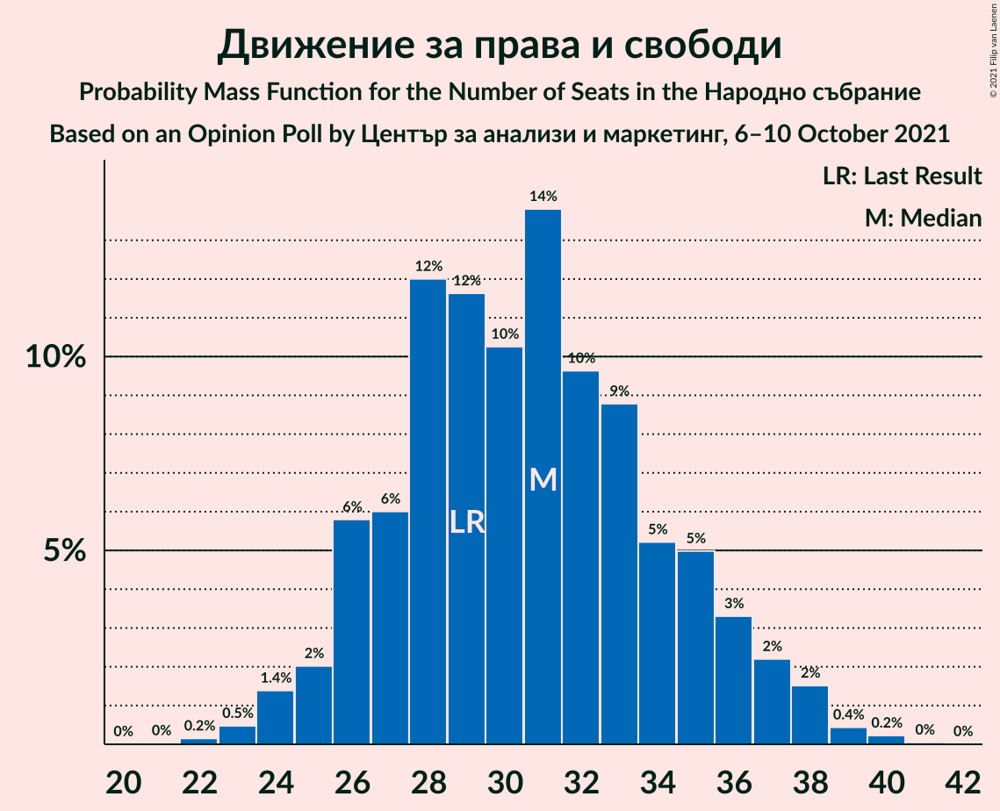

# Opinion Poll by Център за анализи и маркетинг, 6–10 October 2021

<a href="#voting-intentions">Voting Intentions</a> | <a href="#seats">Seats</a> | <a href="#coalitions">Coalitions</a> | <a href="#technical-information">Technical Information</a>

## Voting Intentions

### Confidence Intervals

| Party | Last Result | Poll Result | 80% Confidence Interval | 90% Confidence Interval | 95% Confidence Interval | 99% Confidence Interval |
|:-----:|:-----------:|:-----------:|:-----------------------:|:-----------------------:|:-----------------------:|:-----------------------:|
| Граждани за европейско развитие на България | 23.2% | 25.5% | 23.6–27.5% |23.1–28.1% |22.6–28.6% |21.7–29.6% |
| БСП за България | 13.2% | 16.6% | 15.0–18.4% |14.6–18.9% |14.2–19.4% |13.5–20.2% |
| Продължаваме промяната | 0.0% | 13.4% | 12.0–15.1% |11.6–15.5% |11.2–16.0% |10.6–16.8% |
| Има такъв народ | 23.8% | 12.3% | 10.9–13.9% |10.6–14.4% |10.2–14.8% |9.6–15.6% |
| Движение за права и свободи | 10.6% | 11.6% | 10.2–13.1% |9.9–13.6% |9.6–14.0% |8.9–14.8% |
| Демократична България | 12.5% | 10.8% | 9.5–12.4% |9.2–12.8% |8.9–13.2% |8.3–13.9% |
| Изправи се БГ! Ние идваме! | 5.0% | 3.3% | 2.6–4.3% |2.5–4.6% |2.3–4.8% |2.0–5.3% |
| Възраждане | 3.0% | 1.7% | 1.3–2.5% |1.1–2.7% |1.0–2.9% |0.8–3.3% |
| ВМРО–Българско Национално Движение | 3.1% | 0.7% | 0.5–1.3% |0.4–1.5% |0.3–1.6% |0.2–1.9% |

*Note:* The poll result column reflects the actual value used in the calculations. Published results may vary slightly, and in addition be rounded to fewer digits.

## Seats

### Confidence Intervals

| Party | Last Result | Median | 80% Confidence Interval | 90% Confidence Interval | 95% Confidence Interval | 99% Confidence Interval |
|:-----:|:-----------:|:------:|:-----------------------:|:-----------------------:|:-----------------------:|:-----------------------:|
| <a href="#граждани-за-европейско-развитие-на-българия">Граждани за европейско развитие на България</a> | 63 | 67 | 62–72 |60–74 |59–75 |57–77 |
| <a href="#бсп-за-българия">БСП за България</a> | 36 | 44 | 39–49 |39–49 |37–50 |35–53 |
| <a href="#продължаваме-промяната">Продължаваме промяната</a> | 0 | 35 | 31–39 |31–40 |30–41 |28–44 |
| <a href="#има-такъв-народ">Има такъв народ</a> | 65 | 32 | 28–37 |27–38 |27–39 |25–41 |
| <a href="#движение-за-права-и-свободи">Движение за права и свободи</a> | 29 | 31 | 27–35 |26–36 |25–37 |23–39 |
| <a href="#демократична-българия">Демократична България</a> | 34 | 29 | 25–32 |24–34 |23–35 |22–37 |
| <a href="#изправи-се-бг!-ние-идваме!">Изправи се БГ! Ние идваме!</a> | 13 | 0 | 0–11 |0–12 |0–12 |0–13 |
| <a href="#възраждане">Възраждане</a> | 0 | 0 | 0 |0 |0 |0 |
| <a href="#вмро–българско-национално-движение">ВМРО–Българско Национално Движение</a> | 0 | 0 | 0 |0 |0 |0 |

### Граждани за европейско развитие на България

*For a full overview of the results for this party, see the [Граждани за европейско развитие на България](party-гражданизаевропейскоразвитиенабългария.html) page.*

| Number of Seats | Probability | Accumulated | Special Marks |
|:---------------:|:-----------:|:-----------:|:-------------:|
| 53 | 0.1% | 100% |  |
| 54 | 0% | 99.9% |  |
| 55 | 0.1% | 99.9% |  |
| 56 | 0.2% | 99.8% |  |
| 57 | 0.5% | 99.6% |  |
| 58 | 0.8% | 99.1% |  |
| 59 | 2% | 98% |  |
| 60 | 4% | 97% |  |
| 61 | 2% | 93% |  |
| 62 | 4% | 90% |  |
| 63 | 4% | 86% | Last Result |
| 64 | 7% | 82% |  |
| 65 | 9% | 75% |  |
| 66 | 10% | 66% |  |
| 67 | 11% | 56% | Median |
| 68 | 14% | 45% |  |
| 69 | 10% | 31% |  |
| 70 | 5% | 21% |  |
| 71 | 4% | 16% |  |
| 72 | 4% | 12% |  |
| 73 | 2% | 8% |  |
| 74 | 3% | 6% |  |
| 75 | 1.4% | 4% |  |
| 76 | 1.4% | 2% |  |
| 77 | 0.4% | 0.9% |  |
| 78 | 0.2% | 0.5% |  |
| 79 | 0.2% | 0.3% |  |
| 80 | 0.1% | 0.1% |  |
| 81 | 0% | 0.1% |  |
| 82 | 0% | 0% |  |

### БСП за България

*For a full overview of the results for this party, see the [БСП за България](party-бспзабългария.html) page.*

| Number of Seats | Probability | Accumulated | Special Marks |
|:---------------:|:-----------:|:-----------:|:-------------:|
| 33 | 0.1% | 100% |  |
| 34 | 0.1% | 99.9% |  |
| 35 | 0.3% | 99.8% |  |
| 36 | 1.2% | 99.4% | Last Result |
| 37 | 1.1% | 98% |  |
| 38 | 2% | 97% |  |
| 39 | 6% | 95% |  |
| 40 | 6% | 90% |  |
| 41 | 8% | 84% |  |
| 42 | 9% | 76% |  |
| 43 | 12% | 67% |  |
| 44 | 9% | 55% | Median |
| 45 | 9% | 46% |  |
| 46 | 14% | 37% |  |
| 47 | 7% | 22% |  |
| 48 | 5% | 15% |  |
| 49 | 6% | 11% |  |
| 50 | 2% | 5% |  |
| 51 | 1.1% | 2% |  |
| 52 | 0.6% | 1.3% |  |
| 53 | 0.4% | 0.8% |  |
| 54 | 0.2% | 0.4% |  |
| 55 | 0.1% | 0.1% |  |
| 56 | 0% | 0.1% |  |
| 57 | 0% | 0% |  |

### Продължаваме промяната

*For a full overview of the results for this party, see the [Продължаваме промяната](party-продължавамепромяната.html) page.*

| Number of Seats | Probability | Accumulated | Special Marks |
|:---------------:|:-----------:|:-----------:|:-------------:|
| 0 | 0% | 100% | Last Result |
| 1 | 0% | 100% |  |
| 2 | 0% | 100% |  |
| 3 | 0% | 100% |  |
| 4 | 0% | 100% |  |
| 5 | 0% | 100% |  |
| 6 | 0% | 100% |  |
| 7 | 0% | 100% |  |
| 8 | 0% | 100% |  |
| 9 | 0% | 100% |  |
| 10 | 0% | 100% |  |
| 11 | 0% | 100% |  |
| 12 | 0% | 100% |  |
| 13 | 0% | 100% |  |
| 14 | 0% | 100% |  |
| 15 | 0% | 100% |  |
| 16 | 0% | 100% |  |
| 17 | 0% | 100% |  |
| 18 | 0% | 100% |  |
| 19 | 0% | 100% |  |
| 20 | 0% | 100% |  |
| 21 | 0% | 100% |  |
| 22 | 0% | 100% |  |
| 23 | 0% | 100% |  |
| 24 | 0% | 100% |  |
| 25 | 0% | 100% |  |
| 26 | 0.2% | 100% |  |
| 27 | 0.2% | 99.8% |  |
| 28 | 0.6% | 99.5% |  |
| 29 | 1.0% | 99.0% |  |
| 30 | 3% | 98% |  |
| 31 | 8% | 95% |  |
| 32 | 11% | 87% |  |
| 33 | 10% | 76% |  |
| 34 | 10% | 66% |  |
| 35 | 10% | 56% | Median |
| 36 | 5% | 46% |  |
| 37 | 12% | 41% |  |
| 38 | 11% | 30% |  |
| 39 | 10% | 19% |  |
| 40 | 5% | 9% |  |
| 41 | 2% | 4% |  |
| 42 | 0.9% | 2% |  |
| 43 | 0.5% | 2% |  |
| 44 | 0.7% | 1.1% |  |
| 45 | 0.3% | 0.5% |  |
| 46 | 0.1% | 0.2% |  |
| 47 | 0% | 0.1% |  |
| 48 | 0% | 0% |  |

### Има такъв народ

*For a full overview of the results for this party, see the [Има такъв народ](party-иматакъвнарод.html) page.*

| Number of Seats | Probability | Accumulated | Special Marks |
|:---------------:|:-----------:|:-----------:|:-------------:|
| 23 | 0.1% | 100% |  |
| 24 | 0.2% | 99.9% |  |
| 25 | 0.3% | 99.7% |  |
| 26 | 1.5% | 99.4% |  |
| 27 | 3% | 98% |  |
| 28 | 6% | 95% |  |
| 29 | 7% | 89% |  |
| 30 | 11% | 83% |  |
| 31 | 7% | 72% |  |
| 32 | 16% | 64% | Median |
| 33 | 10% | 48% |  |
| 34 | 12% | 39% |  |
| 35 | 7% | 27% |  |
| 36 | 6% | 20% |  |
| 37 | 8% | 13% |  |
| 38 | 3% | 6% |  |
| 39 | 1.5% | 3% |  |
| 40 | 0.7% | 2% |  |
| 41 | 0.7% | 1.0% |  |
| 42 | 0.1% | 0.3% |  |
| 43 | 0.1% | 0.2% |  |
| 44 | 0.1% | 0.1% |  |
| 45 | 0% | 0% |  |
| 46 | 0% | 0% |  |
| 47 | 0% | 0% |  |
| 48 | 0% | 0% |  |
| 49 | 0% | 0% |  |
| 50 | 0% | 0% |  |
| 51 | 0% | 0% |  |
| 52 | 0% | 0% |  |
| 53 | 0% | 0% |  |
| 54 | 0% | 0% |  |
| 55 | 0% | 0% |  |
| 56 | 0% | 0% |  |
| 57 | 0% | 0% |  |
| 58 | 0% | 0% |  |
| 59 | 0% | 0% |  |
| 60 | 0% | 0% |  |
| 61 | 0% | 0% |  |
| 62 | 0% | 0% |  |
| 63 | 0% | 0% |  |
| 64 | 0% | 0% |  |
| 65 | 0% | 0% | Last Result |

### Движение за права и свободи

*For a full overview of the results for this party, see the [Движение за права и свободи](party-движениезаправаисвободи.html) page.*

| Number of Seats | Probability | Accumulated | Special Marks |
|:---------------:|:-----------:|:-----------:|:-------------:|
| 22 | 0.2% | 100% |  |
| 23 | 0.5% | 99.8% |  |
| 24 | 1.4% | 99.3% |  |
| 25 | 2% | 98% |  |
| 26 | 6% | 96% |  |
| 27 | 6% | 90% |  |
| 28 | 12% | 84% |  |
| 29 | 12% | 72% | Last Result |
| 30 | 10% | 60% |  |
| 31 | 14% | 50% | Median |
| 32 | 10% | 36% |  |
| 33 | 9% | 27% |  |
| 34 | 5% | 18% |  |
| 35 | 5% | 13% |  |
| 36 | 3% | 8% |  |
| 37 | 2% | 4% |  |
| 38 | 2% | 2% |  |
| 39 | 0.4% | 0.7% |  |
| 40 | 0.2% | 0.3% |  |
| 41 | 0% | 0.1% |  |
| 42 | 0% | 0% |  |

### Демократична България

*For a full overview of the results for this party, see the [Демократична България](party-демократичнабългария.html) page.*

| Number of Seats | Probability | Accumulated | Special Marks |
|:---------------:|:-----------:|:-----------:|:-------------:|
| 20 | 0.1% | 100% |  |
| 21 | 0.3% | 99.8% |  |
| 22 | 1.0% | 99.6% |  |
| 23 | 2% | 98.6% |  |
| 24 | 4% | 97% |  |
| 25 | 7% | 93% |  |
| 26 | 11% | 86% |  |
| 27 | 13% | 75% |  |
| 28 | 11% | 62% |  |
| 29 | 11% | 51% | Median |
| 30 | 12% | 40% |  |
| 31 | 12% | 28% |  |
| 32 | 7% | 17% |  |
| 33 | 4% | 10% |  |
| 34 | 3% | 6% | Last Result |
| 35 | 1.5% | 3% |  |
| 36 | 0.7% | 1.3% |  |
| 37 | 0.4% | 0.6% |  |
| 38 | 0.1% | 0.2% |  |
| 39 | 0.1% | 0.1% |  |
| 40 | 0% | 0% |  |

### Изправи се БГ! Ние идваме!

*For a full overview of the results for this party, see the [Изправи се БГ! Ние идваме!](party-изправисебгниеидваме.html) page.*

| Number of Seats | Probability | Accumulated | Special Marks |
|:---------------:|:-----------:|:-----------:|:-------------:|
| 0 | 83% | 100% | Median |
| 1 | 0% | 17% |  |
| 2 | 0% | 17% |  |
| 3 | 0% | 17% |  |
| 4 | 0% | 17% |  |
| 5 | 0% | 17% |  |
| 6 | 0% | 17% |  |
| 7 | 0% | 17% |  |
| 8 | 0% | 17% |  |
| 9 | 0% | 17% |  |
| 10 | 1.1% | 17% |  |
| 11 | 10% | 16% |  |
| 12 | 5% | 6% |  |
| 13 | 1.1% | 2% | Last Result |
| 14 | 0.3% | 0.4% |  |
| 15 | 0.1% | 0.1% |  |
| 16 | 0% | 0% |  |

### Възраждане

*For a full overview of the results for this party, see the [Възраждане](party-възраждане.html) page.*

| Number of Seats | Probability | Accumulated | Special Marks |
|:---------------:|:-----------:|:-----------:|:-------------:|
| 0 | 100% | 100% | Last Result, Median |

### ВМРО–Българско Национално Движение

*For a full overview of the results for this party, see the [ВМРО–Българско Национално Движение](party-вмро–българсконационалнодвижение.html) page.*

| Number of Seats | Probability | Accumulated | Special Marks |
|:---------------:|:-----------:|:-----------:|:-------------:|
| 0 | 100% | 100% | Last Result, Median |

## Coalitions

### Confidence Intervals

| Coalition | Last Result | Median | Majority? | 80% Confidence Interval | 90% Confidence Interval | 95% Confidence Interval | 99% Confidence Interval |
|:---------:|:-----------:|:------:|:---------:|:-----------------------:|:-----------------------:|:-----------------------:|:-----------------------:|
| БСП за България – Има такъв народ – Движение за права и свободи – Изправи се БГ! Ние идваме! | 143 | 109 | 1.1% | 103–115 | 101–117 | 100–118 | 97–122 |
| БСП за България – Има такъв народ – Движение за права и свободи | 130 | 108 | 0.2% | 101–114 | 100–115 | 98–116 | 94–120 |
| БСП за България – Движение за права и свободи – Изправи се БГ! Ние идваме! | 78 | 77 | 0% | 70–83 | 68–85 | 67–87 | 65–91 |
| БСП за България – Движение за права и свободи | 65 | 75 | 0% | 69–80 | 67–82 | 66–83 | 63–86 |

### БСП за България – Има такъв народ – Движение за права и свободи – Изправи се БГ! Ние идваме!

| Number of Seats | Probability | Accumulated | Special Marks |
|:---------------:|:-----------:|:-----------:|:-------------:|
| 94 | 0% | 100% |  |
| 95 | 0.1% | 99.9% |  |
| 96 | 0.2% | 99.8% |  |
| 97 | 0.6% | 99.6% |  |
| 98 | 0.6% | 99.0% |  |
| 99 | 0.5% | 98% |  |
| 100 | 1.4% | 98% |  |
| 101 | 3% | 96% |  |
| 102 | 3% | 93% |  |
| 103 | 7% | 90% |  |
| 104 | 4% | 83% |  |
| 105 | 4% | 80% |  |
| 106 | 4% | 76% |  |
| 107 | 5% | 72% | Median |
| 108 | 8% | 67% |  |
| 109 | 15% | 59% |  |
| 110 | 9% | 45% |  |
| 111 | 4% | 35% |  |
| 112 | 6% | 31% |  |
| 113 | 4% | 25% |  |
| 114 | 5% | 21% |  |
| 115 | 7% | 16% |  |
| 116 | 2% | 10% |  |
| 117 | 4% | 8% |  |
| 118 | 2% | 4% |  |
| 119 | 0.6% | 2% |  |
| 120 | 0.6% | 2% |  |
| 121 | 0.5% | 1.1% | Majority |
| 122 | 0.3% | 0.6% |  |
| 123 | 0.2% | 0.4% |  |
| 124 | 0.1% | 0.2% |  |
| 125 | 0% | 0.1% |  |
| 126 | 0% | 0.1% |  |
| 127 | 0% | 0% |  |
| 128 | 0% | 0% |  |
| 129 | 0% | 0% |  |
| 130 | 0% | 0% |  |
| 131 | 0% | 0% |  |
| 132 | 0% | 0% |  |
| 133 | 0% | 0% |  |
| 134 | 0% | 0% |  |
| 135 | 0% | 0% |  |
| 136 | 0% | 0% |  |
| 137 | 0% | 0% |  |
| 138 | 0% | 0% |  |
| 139 | 0% | 0% |  |
| 140 | 0% | 0% |  |
| 141 | 0% | 0% |  |
| 142 | 0% | 0% |  |
| 143 | 0% | 0% | Last Result |

### БСП за България – Има такъв народ – Движение за права и свободи

| Number of Seats | Probability | Accumulated | Special Marks |
|:---------------:|:-----------:|:-----------:|:-------------:|
| 91 | 0% | 100% |  |
| 92 | 0% | 99.9% |  |
| 93 | 0% | 99.9% |  |
| 94 | 0.6% | 99.9% |  |
| 95 | 0.5% | 99.3% |  |
| 96 | 0.3% | 98.8% |  |
| 97 | 0.7% | 98% |  |
| 98 | 1.1% | 98% |  |
| 99 | 0.8% | 97% |  |
| 100 | 4% | 96% |  |
| 101 | 7% | 91% |  |
| 102 | 3% | 85% |  |
| 103 | 7% | 81% |  |
| 104 | 5% | 74% |  |
| 105 | 4% | 69% |  |
| 106 | 8% | 65% |  |
| 107 | 5% | 57% | Median |
| 108 | 8% | 52% |  |
| 109 | 14% | 44% |  |
| 110 | 9% | 30% |  |
| 111 | 2% | 21% |  |
| 112 | 4% | 19% |  |
| 113 | 2% | 15% |  |
| 114 | 4% | 13% |  |
| 115 | 6% | 9% |  |
| 116 | 1.2% | 3% |  |
| 117 | 0.9% | 2% |  |
| 118 | 0.4% | 1.2% |  |
| 119 | 0.2% | 0.8% |  |
| 120 | 0.3% | 0.6% |  |
| 121 | 0.1% | 0.2% | Majority |
| 122 | 0% | 0.1% |  |
| 123 | 0% | 0% |  |
| 124 | 0% | 0% |  |
| 125 | 0% | 0% |  |
| 126 | 0% | 0% |  |
| 127 | 0% | 0% |  |
| 128 | 0% | 0% |  |
| 129 | 0% | 0% |  |
| 130 | 0% | 0% | Last Result |

### БСП за България – Движение за права и свободи – Изправи се БГ! Ние идваме!

| Number of Seats | Probability | Accumulated | Special Marks |
|:---------------:|:-----------:|:-----------:|:-------------:|
| 62 | 0% | 100% |  |
| 63 | 0.1% | 99.9% |  |
| 64 | 0.1% | 99.8% |  |
| 65 | 0.3% | 99.7% |  |
| 66 | 1.2% | 99.3% |  |
| 67 | 0.9% | 98% |  |
| 68 | 3% | 97% |  |
| 69 | 2% | 95% |  |
| 70 | 3% | 93% |  |
| 71 | 5% | 90% |  |
| 72 | 6% | 85% |  |
| 73 | 9% | 79% |  |
| 74 | 5% | 70% |  |
| 75 | 10% | 65% | Median |
| 76 | 4% | 55% |  |
| 77 | 9% | 50% |  |
| 78 | 8% | 42% | Last Result |
| 79 | 9% | 34% |  |
| 80 | 5% | 25% |  |
| 81 | 5% | 20% |  |
| 82 | 2% | 16% |  |
| 83 | 5% | 14% |  |
| 84 | 2% | 9% |  |
| 85 | 2% | 7% |  |
| 86 | 1.5% | 5% |  |
| 87 | 1.0% | 3% |  |
| 88 | 0.8% | 2% |  |
| 89 | 0.5% | 1.3% |  |
| 90 | 0.2% | 0.7% |  |
| 91 | 0.3% | 0.5% |  |
| 92 | 0.1% | 0.3% |  |
| 93 | 0.1% | 0.1% |  |
| 94 | 0% | 0.1% |  |
| 95 | 0% | 0% |  |

### БСП за България – Движение за права и свободи

| Number of Seats | Probability | Accumulated | Special Marks |
|:---------------:|:-----------:|:-----------:|:-------------:|
| 60 | 0% | 100% |  |
| 61 | 0.1% | 99.9% |  |
| 62 | 0.1% | 99.9% |  |
| 63 | 0.4% | 99.8% |  |
| 64 | 0.3% | 99.4% |  |
| 65 | 0.6% | 99.1% | Last Result |
| 66 | 2% | 98% |  |
| 67 | 3% | 97% |  |
| 68 | 3% | 94% |  |
| 69 | 3% | 90% |  |
| 70 | 4% | 87% |  |
| 71 | 7% | 83% |  |
| 72 | 8% | 76% |  |
| 73 | 10% | 68% |  |
| 74 | 6% | 58% |  |
| 75 | 11% | 52% | Median |
| 76 | 5% | 41% |  |
| 77 | 9% | 36% |  |
| 78 | 6% | 27% |  |
| 79 | 8% | 21% |  |
| 80 | 4% | 13% |  |
| 81 | 3% | 8% |  |
| 82 | 2% | 5% |  |
| 83 | 1.0% | 3% |  |
| 84 | 1.4% | 2% |  |
| 85 | 0.2% | 1.0% |  |
| 86 | 0.5% | 0.8% |  |
| 87 | 0.1% | 0.2% |  |
| 88 | 0% | 0.1% |  |
| 89 | 0% | 0.1% |  |
| 90 | 0% | 0% |  |

## Technical Information

### Opinion Poll

+ **Polling firm:** Център за анализи и маркетинг
+ **Commissioner(s):** —
+ **Fieldwork period:** 6–10 October 2021

### Calculations

+ **Sample size:** 812
+ **Simulations done:** 1,048,576
+ **Error estimate:** 1.98%

