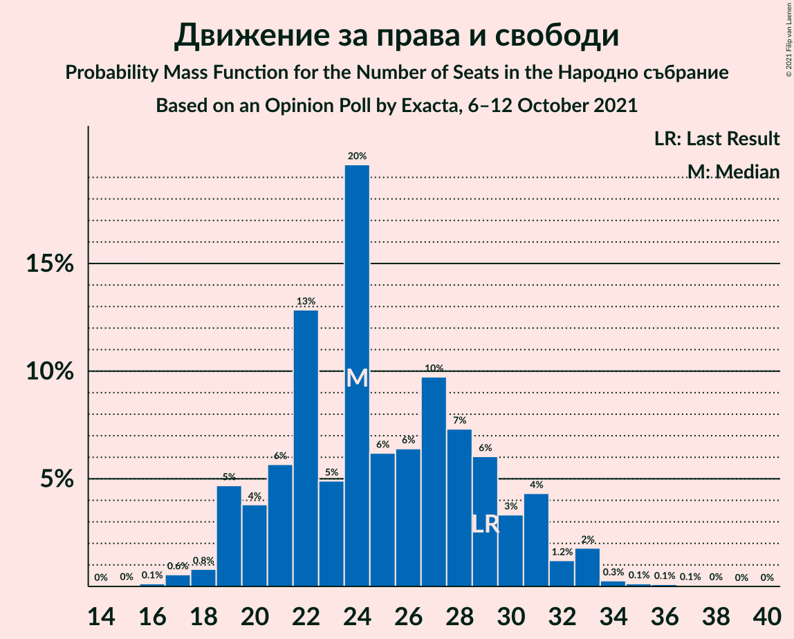
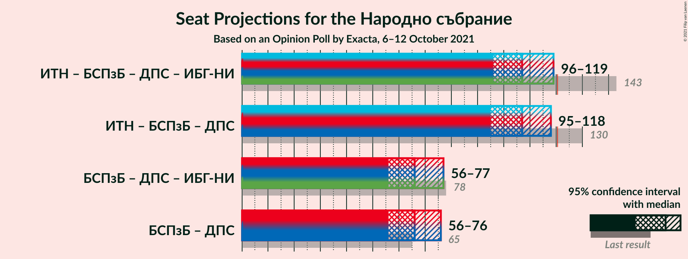
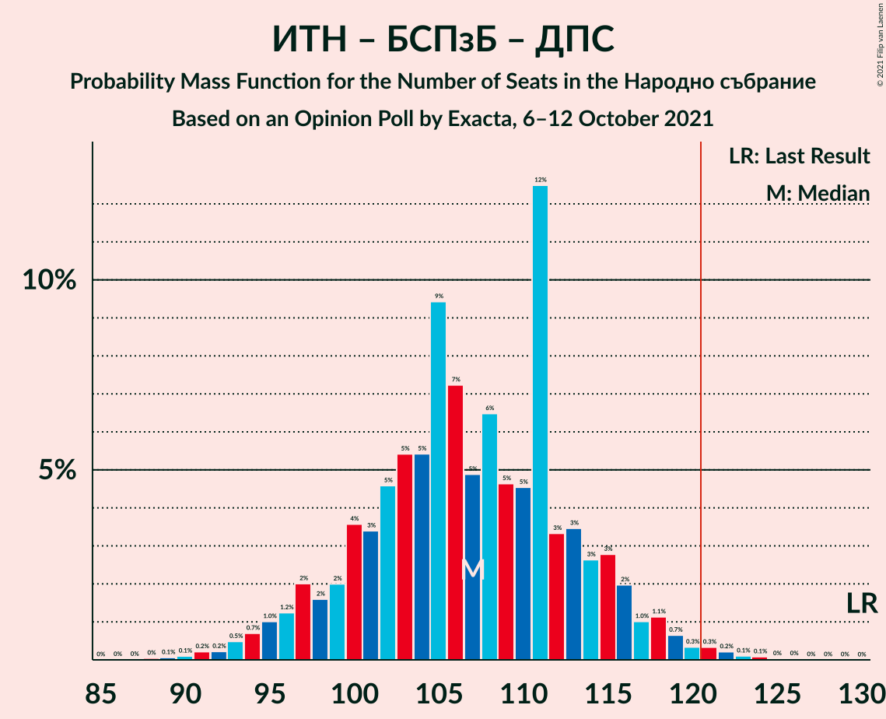
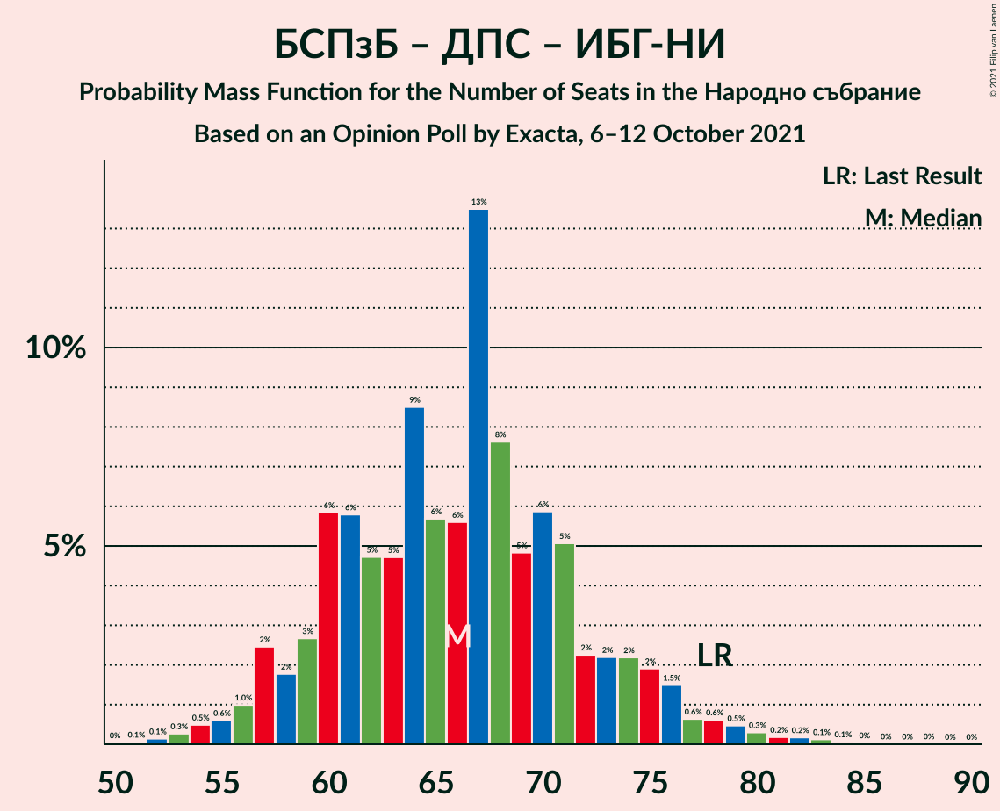
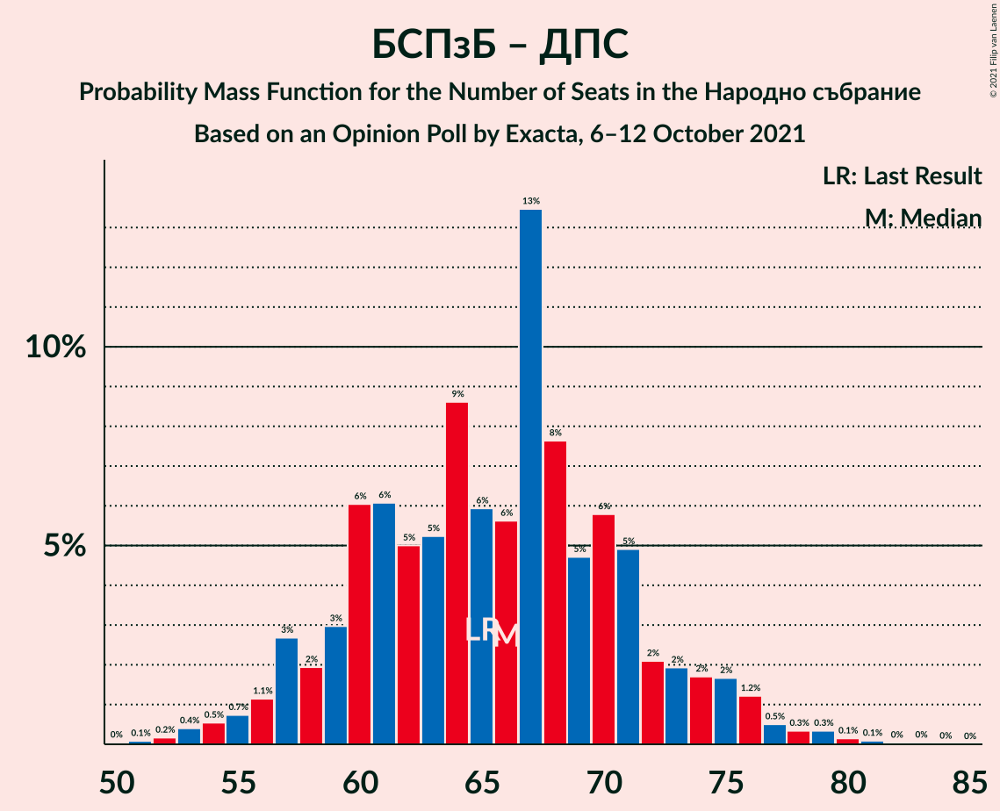

# Opinion Poll by Exacta, 6–12 October 2021

<a href="#voting-intentions">Voting Intentions</a> | <a href="#seats">Seats</a> | <a href="#coalitions">Coalitions</a> | <a href="#technical-information">Technical Information</a>

## Voting Intentions

### Confidence Intervals

| Party | Last Result | Poll Result | 80% Confidence Interval | 90% Confidence Interval | 95% Confidence Interval | 99% Confidence Interval |
|:-----:|:-----------:|:-----------:|:-----------------------:|:-----------------------:|:-----------------------:|:-----------------------:|
| Граждани за европейско развитие на България | 23.2% | 23.3% | 21.0–25.9% |20.4–26.6% |19.8–27.2% |18.8–28.5% |
| Продължаваме промяната | 0.0% | 15.3% | 13.4–17.6% |12.9–18.2% |12.5–18.8% |11.6–19.9% |
| Има такъв народ | 23.8% | 15.1% | 13.2–17.4% |12.7–18.0% |12.3–18.5% |11.4–19.7% |
| БСП за България | 13.2% | 14.9% | 13.1–17.2% |12.5–17.8% |12.1–18.3% |11.2–19.4% |
| Демократична България | 12.5% | 10.2% | 8.6–12.1% |8.2–12.6% |7.8–13.1% |7.1–14.1% |
| Движение за права и свободи | 10.6% | 9.2% | 7.7–11.0% |7.3–11.6% |6.9–12.0% |6.3–13.0% |
| Изправи се БГ! Ние идваме! | 5.0% | 2.6% | 1.9–3.7% |1.7–4.1% |1.5–4.4% |1.2–5.0% |
| ВМРО–Българско Национално Движение | 3.1% | 2.4% | 1.7–3.5% |1.5–3.8% |1.4–4.1% |1.1–4.8% |
| Възраждане | 3.0% | 1.8% | 1.2–2.8% |1.1–3.1% |0.9–3.4% |0.7–3.9% |

*Note:* The poll result column reflects the actual value used in the calculations. Published results may vary slightly, and in addition be rounded to fewer digits.

## Seats

### Confidence Intervals

| Party | Last Result | Median | 80% Confidence Interval | 90% Confidence Interval | 95% Confidence Interval | 99% Confidence Interval |
|:-----:|:-----------:|:------:|:-----------------------:|:-----------------------:|:-----------------------:|:-----------------------:|
| <a href="#граждани-за-европейско-развитие-на-българия">Граждани за европейско развитие на България</a> | 63 | 64 | 58–70 |56–71 |55–72 |51–75 |
| <a href="#продължаваме-промяната">Продължаваме промяната</a> | 0 | 38 | 36–44 |35–46 |33–47 |32–52 |
| <a href="#има-такъв-народ">Има такъв народ</a> | 65 | 44 | 37–44 |35–46 |34–48 |32–53 |
| <a href="#бсп-за-българия">БСП за България</a> | 36 | 43 | 37–44 |36–47 |35–49 |32–54 |
| <a href="#демократична-българия">Демократична България</a> | 34 | 27 | 25–30 |24–33 |22–36 |20–37 |
| <a href="#движение-за-права-и-свободи">Движение за права и свободи</a> | 29 | 24 | 24–28 |21–29 |21–31 |19–31 |
| <a href="#изправи-се-бг!-ние-идваме!">Изправи се БГ! Ние идваме!</a> | 13 | 0 | 0 |0 |0 |0–12 |
| <a href="#вмро–българско-национално-движение">ВМРО–Българско Национално Движение</a> | 0 | 0 | 0 |0 |0 |0–11 |
| <a href="#възраждане">Възраждане</a> | 0 | 0 | 0 |0 |0 |0 |

### Граждани за европейско развитие на България

*For a full overview of the results for this party, see the [Граждани за европейско развитие на България](party-гражданизаевропейскоразвитиенабългария.html) page.*

| Number of Seats | Probability | Accumulated | Special Marks |
|:---------------:|:-----------:|:-----------:|:-------------:|
| 49 | 0.1% | 100% |  |
| 50 | 0.1% | 99.9% |  |
| 51 | 0.6% | 99.9% |  |
| 52 | 0.1% | 99.2% |  |
| 53 | 0.9% | 99.1% |  |
| 54 | 0.7% | 98% |  |
| 55 | 0.5% | 98% |  |
| 56 | 3% | 97% |  |
| 57 | 0.4% | 94% |  |
| 58 | 6% | 94% |  |
| 59 | 1.4% | 88% |  |
| 60 | 4% | 87% |  |
| 61 | 3% | 82% |  |
| 62 | 1.3% | 79% |  |
| 63 | 5% | 78% | Last Result |
| 64 | 37% | 72% | Median |
| 65 | 6% | 36% |  |
| 66 | 0.8% | 30% |  |
| 67 | 2% | 29% |  |
| 68 | 13% | 27% |  |
| 69 | 3% | 14% |  |
| 70 | 0.9% | 10% |  |
| 71 | 6% | 10% |  |
| 72 | 3% | 4% |  |
| 73 | 0% | 1.0% |  |
| 74 | 0.2% | 1.0% |  |
| 75 | 0.5% | 0.8% |  |
| 76 | 0.2% | 0.3% |  |
| 77 | 0% | 0.1% |  |
| 78 | 0.1% | 0.1% |  |
| 79 | 0% | 0% |  |

### Продължаваме промяната

*For a full overview of the results for this party, see the [Продължаваме промяната](party-продължавамепромяната.html) page.*

| Number of Seats | Probability | Accumulated | Special Marks |
|:---------------:|:-----------:|:-----------:|:-------------:|
| 0 | 0% | 100% | Last Result |
| 1 | 0% | 100% |  |
| 2 | 0% | 100% |  |
| 3 | 0% | 100% |  |
| 4 | 0% | 100% |  |
| 5 | 0% | 100% |  |
| 6 | 0% | 100% |  |
| 7 | 0% | 100% |  |
| 8 | 0% | 100% |  |
| 9 | 0% | 100% |  |
| 10 | 0% | 100% |  |
| 11 | 0% | 100% |  |
| 12 | 0% | 100% |  |
| 13 | 0% | 100% |  |
| 14 | 0% | 100% |  |
| 15 | 0% | 100% |  |
| 16 | 0% | 100% |  |
| 17 | 0% | 100% |  |
| 18 | 0% | 100% |  |
| 19 | 0% | 100% |  |
| 20 | 0% | 100% |  |
| 21 | 0% | 100% |  |
| 22 | 0% | 100% |  |
| 23 | 0% | 100% |  |
| 24 | 0% | 100% |  |
| 25 | 0% | 100% |  |
| 26 | 0% | 100% |  |
| 27 | 0% | 100% |  |
| 28 | 0% | 100% |  |
| 29 | 0% | 100% |  |
| 30 | 0.2% | 100% |  |
| 31 | 0.1% | 99.8% |  |
| 32 | 0.8% | 99.7% |  |
| 33 | 3% | 98.8% |  |
| 34 | 0.2% | 96% |  |
| 35 | 5% | 96% |  |
| 36 | 1.2% | 91% |  |
| 37 | 8% | 90% |  |
| 38 | 36% | 82% | Median |
| 39 | 19% | 45% |  |
| 40 | 2% | 27% |  |
| 41 | 3% | 25% |  |
| 42 | 3% | 22% |  |
| 43 | 7% | 19% |  |
| 44 | 4% | 11% |  |
| 45 | 2% | 7% |  |
| 46 | 1.2% | 5% |  |
| 47 | 2% | 4% |  |
| 48 | 0.9% | 2% |  |
| 49 | 0.3% | 1.4% |  |
| 50 | 0.4% | 1.2% |  |
| 51 | 0.3% | 0.8% |  |
| 52 | 0.2% | 0.5% |  |
| 53 | 0.1% | 0.3% |  |
| 54 | 0.2% | 0.2% |  |
| 55 | 0% | 0.1% |  |
| 56 | 0% | 0% |  |

### Има такъв народ

*For a full overview of the results for this party, see the [Има такъв народ](party-иматакъвнарод.html) page.*

| Number of Seats | Probability | Accumulated | Special Marks |
|:---------------:|:-----------:|:-----------:|:-------------:|
| 28 | 0% | 100% |  |
| 29 | 0.1% | 99.9% |  |
| 30 | 0.1% | 99.9% |  |
| 31 | 0.1% | 99.8% |  |
| 32 | 0.9% | 99.7% |  |
| 33 | 0.6% | 98.8% |  |
| 34 | 2% | 98% |  |
| 35 | 2% | 96% |  |
| 36 | 2% | 94% |  |
| 37 | 10% | 92% |  |
| 38 | 2% | 82% |  |
| 39 | 5% | 80% |  |
| 40 | 5% | 75% |  |
| 41 | 1.1% | 70% |  |
| 42 | 14% | 69% |  |
| 43 | 4% | 55% |  |
| 44 | 44% | 52% | Median |
| 45 | 2% | 8% |  |
| 46 | 2% | 6% |  |
| 47 | 0.7% | 4% |  |
| 48 | 1.0% | 3% |  |
| 49 | 0.2% | 2% |  |
| 50 | 0.5% | 2% |  |
| 51 | 0.8% | 2% |  |
| 52 | 0.2% | 0.8% |  |
| 53 | 0.1% | 0.6% |  |
| 54 | 0% | 0.5% |  |
| 55 | 0.4% | 0.4% |  |
| 56 | 0% | 0% |  |
| 57 | 0% | 0% |  |
| 58 | 0% | 0% |  |
| 59 | 0% | 0% |  |
| 60 | 0% | 0% |  |
| 61 | 0% | 0% |  |
| 62 | 0% | 0% |  |
| 63 | 0% | 0% |  |
| 64 | 0% | 0% |  |
| 65 | 0% | 0% | Last Result |

### БСП за България

*For a full overview of the results for this party, see the [БСП за България](party-бспзабългария.html) page.*

| Number of Seats | Probability | Accumulated | Special Marks |
|:---------------:|:-----------:|:-----------:|:-------------:|
| 29 | 0.1% | 100% |  |
| 30 | 0.2% | 99.9% |  |
| 31 | 0.2% | 99.7% |  |
| 32 | 0.4% | 99.5% |  |
| 33 | 0.6% | 99.1% |  |
| 34 | 0.2% | 98.5% |  |
| 35 | 1.4% | 98% |  |
| 36 | 3% | 97% | Last Result |
| 37 | 7% | 94% |  |
| 38 | 2% | 87% |  |
| 39 | 3% | 84% |  |
| 40 | 20% | 82% |  |
| 41 | 0.5% | 62% |  |
| 42 | 4% | 62% |  |
| 43 | 45% | 57% | Median |
| 44 | 3% | 12% |  |
| 45 | 0.9% | 9% |  |
| 46 | 0.4% | 8% |  |
| 47 | 4% | 8% |  |
| 48 | 0.4% | 4% |  |
| 49 | 3% | 4% |  |
| 50 | 0.3% | 1.3% |  |
| 51 | 0.2% | 1.0% |  |
| 52 | 0.1% | 0.7% |  |
| 53 | 0.1% | 0.7% |  |
| 54 | 0.5% | 0.6% |  |
| 55 | 0% | 0.1% |  |
| 56 | 0% | 0% |  |

### Демократична България

*For a full overview of the results for this party, see the [Демократична България](party-демократичнабългария.html) page.*

| Number of Seats | Probability | Accumulated | Special Marks |
|:---------------:|:-----------:|:-----------:|:-------------:|
| 17 | 0% | 100% |  |
| 18 | 0.2% | 99.9% |  |
| 19 | 0.2% | 99.8% |  |
| 20 | 0.8% | 99.5% |  |
| 21 | 0.4% | 98.7% |  |
| 22 | 1.1% | 98% |  |
| 23 | 2% | 97% |  |
| 24 | 0.9% | 95% |  |
| 25 | 9% | 94% |  |
| 26 | 4% | 85% |  |
| 27 | 50% | 82% | Median |
| 28 | 10% | 32% |  |
| 29 | 7% | 22% |  |
| 30 | 5% | 15% |  |
| 31 | 4% | 10% |  |
| 32 | 0.4% | 6% |  |
| 33 | 1.0% | 6% |  |
| 34 | 1.4% | 5% | Last Result |
| 35 | 0.3% | 3% |  |
| 36 | 2% | 3% |  |
| 37 | 0.8% | 1.2% |  |
| 38 | 0.1% | 0.3% |  |
| 39 | 0.2% | 0.2% |  |
| 40 | 0% | 0.1% |  |
| 41 | 0% | 0% |  |

### Движение за права и свободи

*For a full overview of the results for this party, see the [Движение за права и свободи](party-движениезаправаисвободи.html) page.*

| Number of Seats | Probability | Accumulated | Special Marks |
|:---------------:|:-----------:|:-----------:|:-------------:|
| 16 | 0% | 100% |  |
| 17 | 0.2% | 99.9% |  |
| 18 | 0.1% | 99.7% |  |
| 19 | 0.6% | 99.6% |  |
| 20 | 0.8% | 99.0% |  |
| 21 | 4% | 98% |  |
| 22 | 3% | 94% |  |
| 23 | 1.0% | 91% |  |
| 24 | 52% | 90% | Median |
| 25 | 9% | 39% |  |
| 26 | 3% | 30% |  |
| 27 | 8% | 27% |  |
| 28 | 13% | 19% |  |
| 29 | 2% | 6% | Last Result |
| 30 | 1.1% | 4% |  |
| 31 | 3% | 3% |  |
| 32 | 0.2% | 0.5% |  |
| 33 | 0.1% | 0.3% |  |
| 34 | 0.1% | 0.2% |  |
| 35 | 0% | 0.1% |  |
| 36 | 0% | 0% |  |

### Изправи се БГ! Ние идваме!

*For a full overview of the results for this party, see the [Изправи се БГ! Ние идваме!](party-изправисебгниеидваме.html) page.*

| Number of Seats | Probability | Accumulated | Special Marks |
|:---------------:|:-----------:|:-----------:|:-------------:|
| 0 | 98% | 100% | Median |
| 1 | 0% | 2% |  |
| 2 | 0% | 2% |  |
| 3 | 0% | 2% |  |
| 4 | 0% | 2% |  |
| 5 | 0% | 2% |  |
| 6 | 0% | 2% |  |
| 7 | 0% | 2% |  |
| 8 | 0% | 2% |  |
| 9 | 0% | 2% |  |
| 10 | 0% | 2% |  |
| 11 | 0.6% | 2% |  |
| 12 | 0.5% | 0.9% |  |
| 13 | 0.4% | 0.4% | Last Result |
| 14 | 0% | 0.1% |  |
| 15 | 0% | 0% |  |

### ВМРО–Българско Национално Движение

*For a full overview of the results for this party, see the [ВМРО–Българско Национално Движение](party-вмро–българсконационалнодвижение.html) page.*

| Number of Seats | Probability | Accumulated | Special Marks |
|:---------------:|:-----------:|:-----------:|:-------------:|
| 0 | 99.2% | 100% | Last Result, Median |
| 1 | 0% | 0.8% |  |
| 2 | 0% | 0.8% |  |
| 3 | 0% | 0.8% |  |
| 4 | 0% | 0.8% |  |
| 5 | 0% | 0.8% |  |
| 6 | 0% | 0.8% |  |
| 7 | 0% | 0.8% |  |
| 8 | 0% | 0.8% |  |
| 9 | 0% | 0.8% |  |
| 10 | 0% | 0.8% |  |
| 11 | 0.5% | 0.8% |  |
| 12 | 0.2% | 0.3% |  |
| 13 | 0.1% | 0.1% |  |
| 14 | 0% | 0.1% |  |
| 15 | 0% | 0% |  |

### Възраждане

*For a full overview of the results for this party, see the [Възраждане](party-възраждане.html) page.*

| Number of Seats | Probability | Accumulated | Special Marks |
|:---------------:|:-----------:|:-----------:|:-------------:|
| 0 | 99.9% | 100% | Last Result, Median |
| 1 | 0% | 0.1% |  |
| 2 | 0% | 0.1% |  |
| 3 | 0% | 0.1% |  |
| 4 | 0% | 0.1% |  |
| 5 | 0% | 0.1% |  |
| 6 | 0% | 0.1% |  |
| 7 | 0% | 0.1% |  |
| 8 | 0% | 0.1% |  |
| 9 | 0% | 0.1% |  |
| 10 | 0% | 0.1% |  |
| 11 | 0.1% | 0.1% |  |
| 12 | 0.1% | 0.1% |  |
| 13 | 0% | 0% |  |

## Coalitions

### Confidence Intervals

| Coalition | Last Result | Median | Majority? | 80% Confidence Interval | 90% Confidence Interval | 95% Confidence Interval | 99% Confidence Interval |
|:---------:|:-----------:|:------:|:---------:|:-----------------------:|:-----------------------:|:-----------------------:|:-----------------------:|
| Има такъв народ – БСП за България – Движение за права и свободи – Изправи се БГ! Ние идваме! | 143 | 111 | 1.0% | 105–112 | 101–115 | 98–117 | 95–121 |
| Има такъв народ – БСП за България – Движение за права и свободи | 130 | 111 | 0.8% | 103–112 | 100–115 | 98–117 | 94–121 |
| БСП за България – Движение за права и свободи – Изправи се БГ! Ние идваме! | 78 | 67 | 0% | 64–71 | 62–73 | 60–75 | 55–80 |
| БСП за България – Движение за права и свободи | 65 | 67 | 0% | 64–71 | 61–71 | 60–74 | 53–77 |

### Има такъв народ – БСП за България – Движение за права и свободи – Изправи се БГ! Ние идваме!

| Number of Seats | Probability | Accumulated | Special Marks |
|:---------------:|:-----------:|:-----------:|:-------------:|
| 90 | 0% | 100% |  |
| 91 | 0% | 99.9% |  |
| 92 | 0.1% | 99.9% |  |
| 93 | 0% | 99.8% |  |
| 94 | 0.2% | 99.8% |  |
| 95 | 0.2% | 99.5% |  |
| 96 | 1.3% | 99.4% |  |
| 97 | 0.1% | 98% |  |
| 98 | 0.7% | 98% |  |
| 99 | 0.3% | 97% |  |
| 100 | 2% | 97% |  |
| 101 | 0.6% | 95% |  |
| 102 | 4% | 95% |  |
| 103 | 0.2% | 91% |  |
| 104 | 0.5% | 91% |  |
| 105 | 10% | 90% |  |
| 106 | 14% | 80% |  |
| 107 | 1.2% | 66% |  |
| 108 | 7% | 65% |  |
| 109 | 1.0% | 57% |  |
| 110 | 1.5% | 56% |  |
| 111 | 40% | 55% | Median |
| 112 | 6% | 15% |  |
| 113 | 0.8% | 8% |  |
| 114 | 0.9% | 8% |  |
| 115 | 2% | 7% |  |
| 116 | 1.4% | 5% |  |
| 117 | 1.0% | 3% |  |
| 118 | 0.7% | 2% |  |
| 119 | 0.5% | 2% |  |
| 120 | 0.2% | 1.2% |  |
| 121 | 0.8% | 1.0% | Majority |
| 122 | 0% | 0.2% |  |
| 123 | 0% | 0.2% |  |
| 124 | 0% | 0.1% |  |
| 125 | 0% | 0.1% |  |
| 126 | 0% | 0% |  |
| 127 | 0% | 0% |  |
| 128 | 0% | 0% |  |
| 129 | 0% | 0% |  |
| 130 | 0% | 0% |  |
| 131 | 0% | 0% |  |
| 132 | 0% | 0% |  |
| 133 | 0% | 0% |  |
| 134 | 0% | 0% |  |
| 135 | 0% | 0% |  |
| 136 | 0% | 0% |  |
| 137 | 0% | 0% |  |
| 138 | 0% | 0% |  |
| 139 | 0% | 0% |  |
| 140 | 0% | 0% |  |
| 141 | 0% | 0% |  |
| 142 | 0% | 0% |  |
| 143 | 0% | 0% | Last Result |

### Има такъв народ – БСП за България – Движение за права и свободи

| Number of Seats | Probability | Accumulated | Special Marks |
|:---------------:|:-----------:|:-----------:|:-------------:|
| 88 | 0% | 100% |  |
| 89 | 0% | 99.9% |  |
| 90 | 0.1% | 99.9% |  |
| 91 | 0.1% | 99.9% |  |
| 92 | 0.1% | 99.8% |  |
| 93 | 0.1% | 99.8% |  |
| 94 | 0.2% | 99.6% |  |
| 95 | 0.2% | 99.4% |  |
| 96 | 1.3% | 99.2% |  |
| 97 | 0.1% | 98% |  |
| 98 | 0.7% | 98% |  |
| 99 | 0.4% | 97% |  |
| 100 | 2% | 97% |  |
| 101 | 0.7% | 95% |  |
| 102 | 4% | 94% |  |
| 103 | 0.6% | 90% |  |
| 104 | 0.4% | 90% |  |
| 105 | 10% | 89% |  |
| 106 | 14% | 79% |  |
| 107 | 1.2% | 65% |  |
| 108 | 7% | 63% |  |
| 109 | 1.0% | 56% |  |
| 110 | 1.5% | 55% |  |
| 111 | 40% | 53% | Median |
| 112 | 6% | 14% |  |
| 113 | 0.7% | 7% |  |
| 114 | 0.9% | 7% |  |
| 115 | 2% | 6% |  |
| 116 | 1.4% | 4% |  |
| 117 | 0.9% | 3% |  |
| 118 | 0.4% | 2% |  |
| 119 | 0.4% | 2% |  |
| 120 | 0.2% | 1.1% |  |
| 121 | 0.7% | 0.8% | Majority |
| 122 | 0% | 0.1% |  |
| 123 | 0% | 0.1% |  |
| 124 | 0% | 0% |  |
| 125 | 0% | 0% |  |
| 126 | 0% | 0% |  |
| 127 | 0% | 0% |  |
| 128 | 0% | 0% |  |
| 129 | 0% | 0% |  |
| 130 | 0% | 0% | Last Result |

### БСП за България – Движение за права и свободи – Изправи се БГ! Ние идваме!

| Number of Seats | Probability | Accumulated | Special Marks |
|:---------------:|:-----------:|:-----------:|:-------------:|
| 51 | 0% | 100% |  |
| 52 | 0.1% | 99.9% |  |
| 53 | 0.3% | 99.8% |  |
| 54 | 0.1% | 99.6% |  |
| 55 | 0.1% | 99.5% |  |
| 56 | 0.2% | 99.4% |  |
| 57 | 0.3% | 99.2% |  |
| 58 | 0.2% | 98.9% |  |
| 59 | 0.6% | 98.7% |  |
| 60 | 1.4% | 98% |  |
| 61 | 2% | 97% |  |
| 62 | 1.4% | 95% |  |
| 63 | 0.9% | 94% |  |
| 64 | 19% | 93% |  |
| 65 | 3% | 74% |  |
| 66 | 2% | 71% |  |
| 67 | 37% | 69% | Median |
| 68 | 12% | 32% |  |
| 69 | 6% | 21% |  |
| 70 | 2% | 14% |  |
| 71 | 6% | 12% |  |
| 72 | 0.6% | 6% |  |
| 73 | 2% | 5% |  |
| 74 | 0.8% | 4% |  |
| 75 | 0.6% | 3% |  |
| 76 | 1.1% | 2% |  |
| 77 | 0.2% | 1.4% |  |
| 78 | 0.3% | 1.2% | Last Result |
| 79 | 0.1% | 0.9% |  |
| 80 | 0.4% | 0.8% |  |
| 81 | 0.1% | 0.4% |  |
| 82 | 0% | 0.4% |  |
| 83 | 0.3% | 0.3% |  |
| 84 | 0% | 0.1% |  |
| 85 | 0% | 0% |  |

### БСП за България – Движение за права и свободи

| Number of Seats | Probability | Accumulated | Special Marks |
|:---------------:|:-----------:|:-----------:|:-------------:|
| 51 | 0.1% | 100% |  |
| 52 | 0.1% | 99.9% |  |
| 53 | 0.3% | 99.8% |  |
| 54 | 0.1% | 99.5% |  |
| 55 | 0.2% | 99.4% |  |
| 56 | 0.5% | 99.2% |  |
| 57 | 0.3% | 98.8% |  |
| 58 | 0.2% | 98.5% |  |
| 59 | 0.6% | 98% |  |
| 60 | 1.4% | 98% |  |
| 61 | 2% | 96% |  |
| 62 | 1.4% | 95% |  |
| 63 | 1.0% | 93% |  |
| 64 | 19% | 92% |  |
| 65 | 3% | 73% | Last Result |
| 66 | 2% | 70% |  |
| 67 | 36% | 68% | Median |
| 68 | 12% | 32% |  |
| 69 | 6% | 20% |  |
| 70 | 2% | 14% |  |
| 71 | 6% | 11% |  |
| 72 | 0.5% | 5% |  |
| 73 | 2% | 4% |  |
| 74 | 0.8% | 3% |  |
| 75 | 0.5% | 2% |  |
| 76 | 1.1% | 2% |  |
| 77 | 0.1% | 0.5% |  |
| 78 | 0.3% | 0.4% |  |
| 79 | 0% | 0.1% |  |
| 80 | 0% | 0.1% |  |
| 81 | 0% | 0.1% |  |
| 82 | 0% | 0% |  |

## Technical Information

### Opinion Poll

+ **Polling firm:** Exacta
+ **Commissioner(s):** —
+ **Fieldwork period:** 6–12 October 2021

### Calculations

+ **Sample size:** 502
+ **Simulations done:** 131,072
+ **Error estimate:** 1.81%

