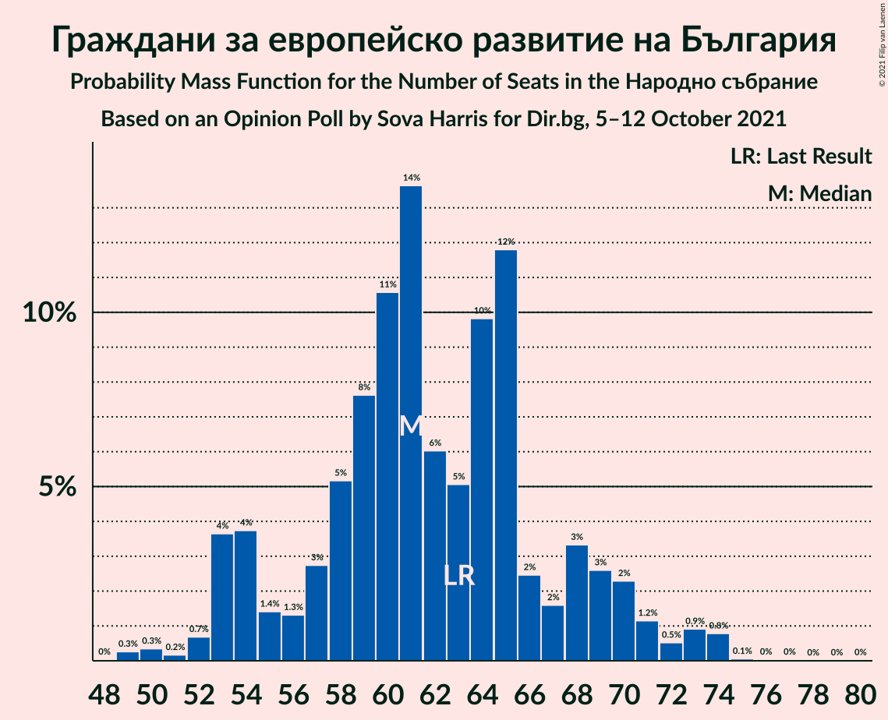
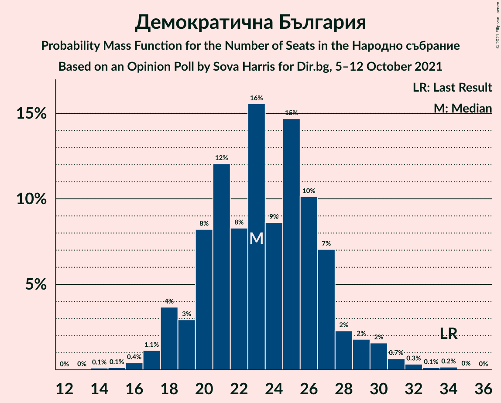
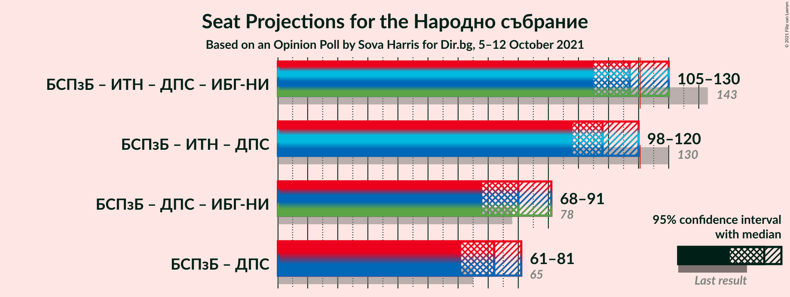

# Opinion Poll by Sova Harris for Dir.bg, 5–12 October 2021

<a href="#voting-intentions">Voting Intentions</a> | <a href="#seats">Seats</a> | <a href="#coalitions">Coalitions</a> | <a href="#technical-information">Technical Information</a>

## Voting Intentions

### Confidence Intervals

| Party | Last Result | Poll Result | 80% Confidence Interval | 90% Confidence Interval | 95% Confidence Interval | 99% Confidence Interval |
|:-----:|:-----------:|:-----------:|:-----------------------:|:-----------------------:|:-----------------------:|:-----------------------:|
| Граждани за европейско развитие на България | 23.2% | 24.6% | 22.3–27.0% |21.7–27.7% |21.2–28.3% |20.1–29.5% |
| БСП за България | 13.2% | 19.4% | 17.3–21.6% |16.8–22.3% |16.3–22.8% |15.4–24.0% |
| Продължаваме промяната | 0.0% | 14.9% | 13.1–17.0% |12.6–17.6% |12.2–18.1% |11.4–19.1% |
| Има такъв народ | 23.8% | 14.5% | 12.8–16.6% |12.3–17.2% |11.8–17.7% |11.0–18.7% |
| Демократична България | 12.5% | 9.1% | 7.7–10.9% |7.3–11.4% |7.0–11.8% |6.4–12.7% |
| Движение за права и свободи | 10.6% | 9.0% | 7.6–10.7% |7.2–11.2% |6.9–11.6% |6.2–12.5% |
| Изправи се БГ! Ние идваме! | 5.0% | 4.3% | 3.4–5.6% |3.1–6.0% |2.9–6.3% |2.5–7.0% |
| Възраждане | 3.0% | 2.0% | 1.4–3.0% |1.2–3.2% |1.1–3.5% |0.9–4.0% |
| ВМРО–Българско Национално Движение | 3.1% | 1.8% | 1.2–2.7% |1.1–3.0% |1.0–3.3% |0.8–3.8% |

*Note:* The poll result column reflects the actual value used in the calculations. Published results may vary slightly, and in addition be rounded to fewer digits.

## Seats

### Confidence Intervals

| Party | Last Result | Median | 80% Confidence Interval | 90% Confidence Interval | 95% Confidence Interval | 99% Confidence Interval |
|:-----:|:-----------:|:------:|:-----------------------:|:-----------------------:|:-----------------------:|:-----------------------:|
| <a href="#граждани-за-европейско-развитие-на-българия">Граждани за европейско развитие на България</a> | 63 | 61 | 54–70 |53–70 |53–70 |51–74 |
| <a href="#бсп-за-българия">БСП за България</a> | 36 | 50 | 45–53 |43–54 |41–57 |38–61 |
| <a href="#продължаваме-промяната">Продължаваме промяната</a> | 0 | 38 | 33–44 |30–46 |29–46 |29–48 |
| <a href="#има-такъв-народ">Има такъв народ</a> | 65 | 38 | 32–41 |31–45 |29–46 |28–49 |
| <a href="#демократична-българия">Демократична България</a> | 34 | 22 | 19–28 |18–30 |17–30 |16–32 |
| <a href="#движение-за-права-и-свободи">Движение за права и свободи</a> | 29 | 23 | 17–27 |17–28 |16–30 |15–30 |
| <a href="#изправи-се-бг!-ние-идваме!">Изправи се БГ! Ние идваме!</a> | 13 | 11 | 0–16 |0–16 |0–16 |0–18 |
| <a href="#възраждане">Възраждане</a> | 0 | 0 | 0 |0 |0 |0 |
| <a href="#вмро–българско-национално-движение">ВМРО–Българско Национално Движение</a> | 0 | 0 | 0 |0 |0 |0–10 |

### Граждани за европейско развитие на България

*For a full overview of the results for this party, see the [Граждани за европейско развитие на България](party-гражданизаевропейскоразвитиенабългария.html) page.*

| Number of Seats | Probability | Accumulated | Special Marks |
|:---------------:|:-----------:|:-----------:|:-------------:|
| 47 | 0% | 100% |  |
| 48 | 0.1% | 99.9% |  |
| 49 | 0.2% | 99.9% |  |
| 50 | 0.1% | 99.7% |  |
| 51 | 0.1% | 99.6% |  |
| 52 | 0.9% | 99.5% |  |
| 53 | 7% | 98.6% |  |
| 54 | 6% | 92% |  |
| 55 | 6% | 86% |  |
| 56 | 1.0% | 80% |  |
| 57 | 3% | 79% |  |
| 58 | 8% | 76% |  |
| 59 | 3% | 68% |  |
| 60 | 12% | 65% |  |
| 61 | 8% | 53% | Median |
| 62 | 4% | 45% |  |
| 63 | 4% | 41% | Last Result |
| 64 | 5% | 37% |  |
| 65 | 5% | 32% |  |
| 66 | 6% | 27% |  |
| 67 | 0.5% | 21% |  |
| 68 | 3% | 21% |  |
| 69 | 2% | 18% |  |
| 70 | 13% | 16% |  |
| 71 | 0.1% | 2% |  |
| 72 | 0.7% | 2% |  |
| 73 | 0.5% | 1.3% |  |
| 74 | 0.7% | 0.8% |  |
| 75 | 0% | 0.1% |  |
| 76 | 0% | 0.1% |  |
| 77 | 0.1% | 0.1% |  |
| 78 | 0% | 0% |  |

### БСП за България

*For a full overview of the results for this party, see the [БСП за България](party-бспзабългария.html) page.*

| Number of Seats | Probability | Accumulated | Special Marks |
|:---------------:|:-----------:|:-----------:|:-------------:|
| 35 | 0.1% | 100% |  |
| 36 | 0.1% | 99.9% | Last Result |
| 37 | 0.1% | 99.9% |  |
| 38 | 0.6% | 99.7% |  |
| 39 | 0.5% | 99.1% |  |
| 40 | 0.4% | 98.6% |  |
| 41 | 2% | 98% |  |
| 42 | 0.9% | 96% |  |
| 43 | 0.3% | 95% |  |
| 44 | 3% | 95% |  |
| 45 | 5% | 92% |  |
| 46 | 13% | 87% |  |
| 47 | 2% | 74% |  |
| 48 | 8% | 72% |  |
| 49 | 1.1% | 65% |  |
| 50 | 18% | 63% | Median |
| 51 | 27% | 46% |  |
| 52 | 4% | 18% |  |
| 53 | 8% | 15% |  |
| 54 | 2% | 6% |  |
| 55 | 0.8% | 4% |  |
| 56 | 0.5% | 3% |  |
| 57 | 1.4% | 3% |  |
| 58 | 0.3% | 2% |  |
| 59 | 0.1% | 1.2% |  |
| 60 | 0.2% | 1.1% |  |
| 61 | 0.8% | 0.9% |  |
| 62 | 0% | 0.1% |  |
| 63 | 0% | 0.1% |  |
| 64 | 0% | 0.1% |  |
| 65 | 0% | 0.1% |  |
| 66 | 0% | 0% |  |

### Продължаваме промяната

*For a full overview of the results for this party, see the [Продължаваме промяната](party-продължавамепромяната.html) page.*

| Number of Seats | Probability | Accumulated | Special Marks |
|:---------------:|:-----------:|:-----------:|:-------------:|
| 0 | 0% | 100% | Last Result |
| 1 | 0% | 100% |  |
| 2 | 0% | 100% |  |
| 3 | 0% | 100% |  |
| 4 | 0% | 100% |  |
| 5 | 0% | 100% |  |
| 6 | 0% | 100% |  |
| 7 | 0% | 100% |  |
| 8 | 0% | 100% |  |
| 9 | 0% | 100% |  |
| 10 | 0% | 100% |  |
| 11 | 0% | 100% |  |
| 12 | 0% | 100% |  |
| 13 | 0% | 100% |  |
| 14 | 0% | 100% |  |
| 15 | 0% | 100% |  |
| 16 | 0% | 100% |  |
| 17 | 0% | 100% |  |
| 18 | 0% | 100% |  |
| 19 | 0% | 100% |  |
| 20 | 0% | 100% |  |
| 21 | 0% | 100% |  |
| 22 | 0% | 100% |  |
| 23 | 0% | 100% |  |
| 24 | 0% | 100% |  |
| 25 | 0% | 100% |  |
| 26 | 0.2% | 100% |  |
| 27 | 0.1% | 99.8% |  |
| 28 | 0.1% | 99.7% |  |
| 29 | 3% | 99.7% |  |
| 30 | 3% | 97% |  |
| 31 | 0.8% | 94% |  |
| 32 | 1.5% | 93% |  |
| 33 | 16% | 92% |  |
| 34 | 12% | 75% |  |
| 35 | 3% | 63% |  |
| 36 | 6% | 60% |  |
| 37 | 2% | 53% |  |
| 38 | 15% | 52% | Median |
| 39 | 2% | 37% |  |
| 40 | 2% | 35% |  |
| 41 | 10% | 33% |  |
| 42 | 11% | 23% |  |
| 43 | 1.0% | 12% |  |
| 44 | 2% | 11% |  |
| 45 | 0.8% | 9% |  |
| 46 | 7% | 8% |  |
| 47 | 0.4% | 1.0% |  |
| 48 | 0.3% | 0.6% |  |
| 49 | 0.1% | 0.3% |  |
| 50 | 0.1% | 0.2% |  |
| 51 | 0.1% | 0.1% |  |
| 52 | 0% | 0.1% |  |
| 53 | 0% | 0% |  |

### Има такъв народ

*For a full overview of the results for this party, see the [Има такъв народ](party-иматакъвнарод.html) page.*

| Number of Seats | Probability | Accumulated | Special Marks |
|:---------------:|:-----------:|:-----------:|:-------------:|
| 26 | 0.3% | 100% |  |
| 27 | 0.2% | 99.7% |  |
| 28 | 2% | 99.5% |  |
| 29 | 0.5% | 98% |  |
| 30 | 1.0% | 97% |  |
| 31 | 5% | 96% |  |
| 32 | 3% | 91% |  |
| 33 | 2% | 88% |  |
| 34 | 9% | 86% |  |
| 35 | 5% | 77% |  |
| 36 | 6% | 72% |  |
| 37 | 7% | 66% |  |
| 38 | 19% | 59% | Median |
| 39 | 3% | 40% |  |
| 40 | 19% | 38% |  |
| 41 | 10% | 19% |  |
| 42 | 2% | 9% |  |
| 43 | 2% | 8% |  |
| 44 | 0.4% | 6% |  |
| 45 | 3% | 5% |  |
| 46 | 1.5% | 3% |  |
| 47 | 0.2% | 1.1% |  |
| 48 | 0% | 0.9% |  |
| 49 | 0.7% | 0.8% |  |
| 50 | 0% | 0.1% |  |
| 51 | 0% | 0.1% |  |
| 52 | 0% | 0% |  |
| 53 | 0% | 0% |  |
| 54 | 0% | 0% |  |
| 55 | 0% | 0% |  |
| 56 | 0% | 0% |  |
| 57 | 0% | 0% |  |
| 58 | 0% | 0% |  |
| 59 | 0% | 0% |  |
| 60 | 0% | 0% |  |
| 61 | 0% | 0% |  |
| 62 | 0% | 0% |  |
| 63 | 0% | 0% |  |
| 64 | 0% | 0% |  |
| 65 | 0% | 0% | Last Result |

### Демократична България

*For a full overview of the results for this party, see the [Демократична България](party-демократичнабългария.html) page.*

| Number of Seats | Probability | Accumulated | Special Marks |
|:---------------:|:-----------:|:-----------:|:-------------:|
| 14 | 0.2% | 100% |  |
| 15 | 0.1% | 99.8% |  |
| 16 | 0.7% | 99.7% |  |
| 17 | 3% | 99.1% |  |
| 18 | 3% | 96% |  |
| 19 | 6% | 93% |  |
| 20 | 16% | 87% |  |
| 21 | 17% | 71% |  |
| 22 | 6% | 54% | Median |
| 23 | 7% | 47% |  |
| 24 | 3% | 40% |  |
| 25 | 13% | 37% |  |
| 26 | 7% | 24% |  |
| 27 | 5% | 17% |  |
| 28 | 2% | 12% |  |
| 29 | 2% | 9% |  |
| 30 | 5% | 8% |  |
| 31 | 0.5% | 2% |  |
| 32 | 1.5% | 2% |  |
| 33 | 0.1% | 0.2% |  |
| 34 | 0.1% | 0.1% | Last Result |
| 35 | 0% | 0% |  |

### Движение за права и свободи

*For a full overview of the results for this party, see the [Движение за права и свободи](party-движениезаправаисвободи.html) page.*

| Number of Seats | Probability | Accumulated | Special Marks |
|:---------------:|:-----------:|:-----------:|:-------------:|
| 14 | 0.2% | 100% |  |
| 15 | 2% | 99.8% |  |
| 16 | 0.8% | 98% |  |
| 17 | 8% | 97% |  |
| 18 | 2% | 89% |  |
| 19 | 22% | 87% |  |
| 20 | 3% | 65% |  |
| 21 | 4% | 62% |  |
| 22 | 4% | 58% |  |
| 23 | 8% | 54% | Median |
| 24 | 4% | 46% |  |
| 25 | 20% | 42% |  |
| 26 | 6% | 23% |  |
| 27 | 8% | 17% |  |
| 28 | 5% | 8% |  |
| 29 | 0.7% | 3% | Last Result |
| 30 | 2% | 3% |  |
| 31 | 0.2% | 0.5% |  |
| 32 | 0% | 0.3% |  |
| 33 | 0.1% | 0.3% |  |
| 34 | 0.1% | 0.1% |  |
| 35 | 0% | 0% |  |

### Изправи се БГ! Ние идваме!

*For a full overview of the results for this party, see the [Изправи се БГ! Ние идваме!](party-изправисебгниеидваме.html) page.*

| Number of Seats | Probability | Accumulated | Special Marks |
|:---------------:|:-----------:|:-----------:|:-------------:|
| 0 | 34% | 100% |  |
| 1 | 0% | 66% |  |
| 2 | 0% | 66% |  |
| 3 | 0% | 66% |  |
| 4 | 0% | 66% |  |
| 5 | 0% | 66% |  |
| 6 | 0% | 66% |  |
| 7 | 0% | 66% |  |
| 8 | 0% | 66% |  |
| 9 | 0% | 66% |  |
| 10 | 8% | 66% |  |
| 11 | 11% | 58% | Median |
| 12 | 21% | 47% |  |
| 13 | 4% | 26% | Last Result |
| 14 | 9% | 22% |  |
| 15 | 3% | 13% |  |
| 16 | 10% | 11% |  |
| 17 | 0.2% | 0.8% |  |
| 18 | 0.2% | 0.6% |  |
| 19 | 0.3% | 0.4% |  |
| 20 | 0.1% | 0.1% |  |
| 21 | 0% | 0% |  |

### Възраждане

*For a full overview of the results for this party, see the [Възраждане](party-възраждане.html) page.*

| Number of Seats | Probability | Accumulated | Special Marks |
|:---------------:|:-----------:|:-----------:|:-------------:|
| 0 | 99.7% | 100% | Last Result, Median |
| 1 | 0% | 0.3% |  |
| 2 | 0% | 0.3% |  |
| 3 | 0% | 0.3% |  |
| 4 | 0% | 0.3% |  |
| 5 | 0% | 0.3% |  |
| 6 | 0% | 0.3% |  |
| 7 | 0% | 0.3% |  |
| 8 | 0% | 0.3% |  |
| 9 | 0% | 0.3% |  |
| 10 | 0.1% | 0.3% |  |
| 11 | 0.1% | 0.2% |  |
| 12 | 0.1% | 0.1% |  |
| 13 | 0% | 0% |  |

### ВМРО–Българско Национално Движение

*For a full overview of the results for this party, see the [ВМРО–Българско Национално Движение](party-вмро–българсконационалнодвижение.html) page.*

| Number of Seats | Probability | Accumulated | Special Marks |
|:---------------:|:-----------:|:-----------:|:-------------:|
| 0 | 99.5% | 100% | Last Result, Median |
| 1 | 0% | 0.5% |  |
| 2 | 0% | 0.5% |  |
| 3 | 0% | 0.5% |  |
| 4 | 0% | 0.5% |  |
| 5 | 0% | 0.5% |  |
| 6 | 0% | 0.5% |  |
| 7 | 0% | 0.5% |  |
| 8 | 0% | 0.5% |  |
| 9 | 0% | 0.5% |  |
| 10 | 0.3% | 0.5% |  |
| 11 | 0.2% | 0.2% |  |
| 12 | 0% | 0% |  |

## Coalitions

### Confidence Intervals

| Coalition | Last Result | Median | Majority? | 80% Confidence Interval | 90% Confidence Interval | 95% Confidence Interval | 99% Confidence Interval |
|:---------:|:-----------:|:------:|:---------:|:-----------------------:|:-----------------------:|:-----------------------:|:-----------------------:|
| БСП за България – Има такъв народ – Движение за права и свободи – Изправи се БГ! Ние идваме! | 143 | 119 | 31% | 110–124 | 106–127 | 104–130 | 102–132 |
| БСП за България – Има такъв народ – Движение за права и свободи | 130 | 110 | 2% | 102–116 | 101–119 | 99–120 | 95–123 |
| БСП за България – Движение за права и свободи – Изправи се БГ! Ние идваме! | 78 | 81 | 0% | 69–89 | 67–90 | 67–92 | 66–95 |
| БСП за България – Движение за права и свободи | 65 | 73 | 0% | 65–79 | 64–81 | 61–82 | 59–84 |

### БСП за България – Има такъв народ – Движение за права и свободи – Изправи се БГ! Ние идваме!

| Number of Seats | Probability | Accumulated | Special Marks |
|:---------------:|:-----------:|:-----------:|:-------------:|
| 100 | 0.1% | 100% |  |
| 101 | 0.1% | 99.8% |  |
| 102 | 0.4% | 99.7% |  |
| 103 | 0.1% | 99.3% |  |
| 104 | 4% | 99.2% |  |
| 105 | 0.3% | 95% |  |
| 106 | 0.8% | 95% |  |
| 107 | 0.5% | 94% |  |
| 108 | 1.1% | 94% |  |
| 109 | 1.1% | 93% |  |
| 110 | 2% | 92% |  |
| 111 | 0.3% | 89% |  |
| 112 | 4% | 89% |  |
| 113 | 2% | 86% |  |
| 114 | 8% | 84% |  |
| 115 | 2% | 75% |  |
| 116 | 16% | 73% |  |
| 117 | 4% | 58% |  |
| 118 | 3% | 54% |  |
| 119 | 14% | 51% |  |
| 120 | 6% | 37% |  |
| 121 | 6% | 31% | Majority |
| 122 | 5% | 25% | Median |
| 123 | 3% | 20% |  |
| 124 | 7% | 17% |  |
| 125 | 2% | 9% |  |
| 126 | 2% | 8% |  |
| 127 | 0.9% | 6% |  |
| 128 | 2% | 5% |  |
| 129 | 0.4% | 3% |  |
| 130 | 1.1% | 3% |  |
| 131 | 0.1% | 2% |  |
| 132 | 1.2% | 1.5% |  |
| 133 | 0.3% | 0.3% |  |
| 134 | 0% | 0.1% |  |
| 135 | 0% | 0% |  |
| 136 | 0% | 0% |  |
| 137 | 0% | 0% |  |
| 138 | 0% | 0% |  |
| 139 | 0% | 0% |  |
| 140 | 0% | 0% |  |
| 141 | 0% | 0% |  |
| 142 | 0% | 0% |  |
| 143 | 0% | 0% | Last Result |

### БСП за България – Има такъв народ – Движение за права и свободи

| Number of Seats | Probability | Accumulated | Special Marks |
|:---------------:|:-----------:|:-----------:|:-------------:|
| 89 | 0.1% | 100% |  |
| 90 | 0.1% | 99.9% |  |
| 91 | 0% | 99.8% |  |
| 92 | 0% | 99.8% |  |
| 93 | 0.1% | 99.8% |  |
| 94 | 0.1% | 99.7% |  |
| 95 | 0.3% | 99.6% |  |
| 96 | 0.2% | 99.3% |  |
| 97 | 0.3% | 99.1% |  |
| 98 | 1.0% | 98.8% |  |
| 99 | 0.6% | 98% |  |
| 100 | 2% | 97% |  |
| 101 | 1.3% | 95% |  |
| 102 | 6% | 94% |  |
| 103 | 10% | 88% |  |
| 104 | 7% | 79% |  |
| 105 | 2% | 71% |  |
| 106 | 3% | 70% |  |
| 107 | 5% | 67% |  |
| 108 | 6% | 62% |  |
| 109 | 1.5% | 57% |  |
| 110 | 11% | 55% |  |
| 111 | 2% | 44% | Median |
| 112 | 11% | 42% |  |
| 113 | 2% | 31% |  |
| 114 | 6% | 29% |  |
| 115 | 2% | 23% |  |
| 116 | 13% | 21% |  |
| 117 | 0.5% | 8% |  |
| 118 | 2% | 8% |  |
| 119 | 2% | 5% |  |
| 120 | 1.0% | 3% |  |
| 121 | 0.7% | 2% | Majority |
| 122 | 0.3% | 1.2% |  |
| 123 | 0.5% | 0.8% |  |
| 124 | 0% | 0.3% |  |
| 125 | 0.2% | 0.3% |  |
| 126 | 0% | 0.1% |  |
| 127 | 0% | 0.1% |  |
| 128 | 0% | 0.1% |  |
| 129 | 0% | 0% |  |
| 130 | 0% | 0% | Last Result |

### БСП за България – Движение за права и свободи – Изправи се БГ! Ние идваме!

| Number of Seats | Probability | Accumulated | Special Marks |
|:---------------:|:-----------:|:-----------:|:-------------:|
| 61 | 0% | 100% |  |
| 62 | 0% | 99.9% |  |
| 63 | 0% | 99.9% |  |
| 64 | 0% | 99.9% |  |
| 65 | 0.3% | 99.8% |  |
| 66 | 1.3% | 99.6% |  |
| 67 | 4% | 98% |  |
| 68 | 0.7% | 94% |  |
| 69 | 4% | 94% |  |
| 70 | 1.0% | 90% |  |
| 71 | 0.4% | 89% |  |
| 72 | 0.4% | 88% |  |
| 73 | 1.3% | 88% |  |
| 74 | 3% | 87% |  |
| 75 | 2% | 83% |  |
| 76 | 15% | 81% |  |
| 77 | 3% | 66% |  |
| 78 | 3% | 64% | Last Result |
| 79 | 5% | 60% |  |
| 80 | 3% | 56% |  |
| 81 | 16% | 53% |  |
| 82 | 3% | 37% |  |
| 83 | 2% | 34% |  |
| 84 | 0.6% | 31% | Median |
| 85 | 7% | 31% |  |
| 86 | 1.2% | 24% |  |
| 87 | 0.5% | 22% |  |
| 88 | 6% | 22% |  |
| 89 | 7% | 16% |  |
| 90 | 6% | 10% |  |
| 91 | 0.5% | 4% |  |
| 92 | 2% | 4% |  |
| 93 | 0.3% | 2% |  |
| 94 | 0.9% | 2% |  |
| 95 | 0.2% | 0.7% |  |
| 96 | 0.2% | 0.5% |  |
| 97 | 0.2% | 0.2% |  |
| 98 | 0.1% | 0.1% |  |
| 99 | 0% | 0% |  |

### БСП за България – Движение за права и свободи

| Number of Seats | Probability | Accumulated | Special Marks |
|:---------------:|:-----------:|:-----------:|:-------------:|
| 56 | 0% | 100% |  |
| 57 | 0% | 99.9% |  |
| 58 | 0.1% | 99.9% |  |
| 59 | 2% | 99.8% |  |
| 60 | 0.4% | 98% |  |
| 61 | 0.7% | 98% |  |
| 62 | 0.6% | 97% |  |
| 63 | 2% | 97% |  |
| 64 | 2% | 95% |  |
| 65 | 9% | 93% | Last Result |
| 66 | 4% | 83% |  |
| 67 | 14% | 79% |  |
| 68 | 2% | 65% |  |
| 69 | 5% | 63% |  |
| 70 | 2% | 58% |  |
| 71 | 4% | 56% |  |
| 72 | 0.9% | 52% |  |
| 73 | 3% | 52% | Median |
| 74 | 8% | 49% |  |
| 75 | 2% | 41% |  |
| 76 | 16% | 38% |  |
| 77 | 2% | 23% |  |
| 78 | 8% | 20% |  |
| 79 | 4% | 12% |  |
| 80 | 3% | 8% |  |
| 81 | 2% | 6% |  |
| 82 | 2% | 3% |  |
| 83 | 0.7% | 2% |  |
| 84 | 0.4% | 0.8% |  |
| 85 | 0.1% | 0.4% |  |
| 86 | 0% | 0.3% |  |
| 87 | 0.1% | 0.3% |  |
| 88 | 0% | 0.2% |  |
| 89 | 0.1% | 0.2% |  |
| 90 | 0% | 0% |  |

## Technical Information

### Opinion Poll

+ **Polling firm:** Sova Harris
+ **Commissioner(s):** Dir.bg
+ **Fieldwork period:** 5–12 October 2021

### Calculations

+ **Sample size:** 558
+ **Simulations done:** 131,072
+ **Error estimate:** 5.43%

