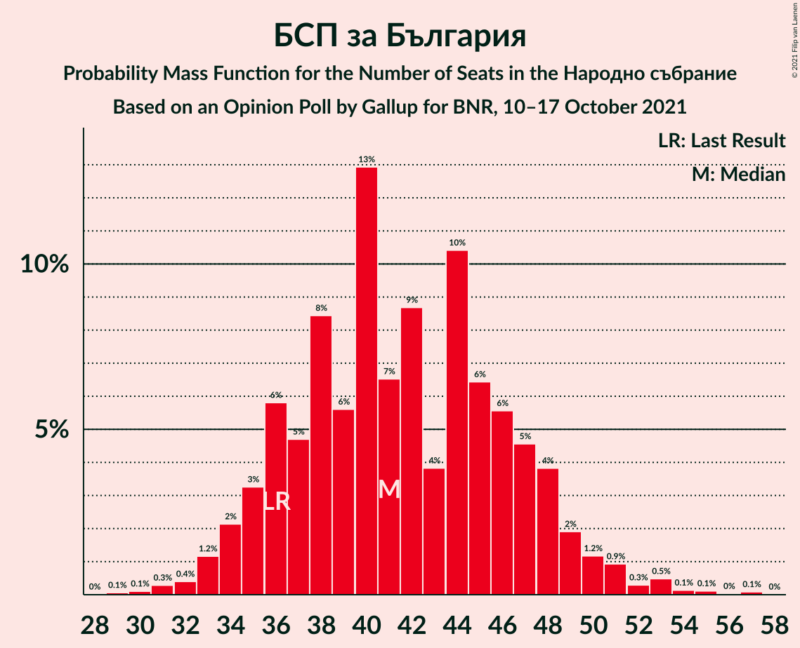
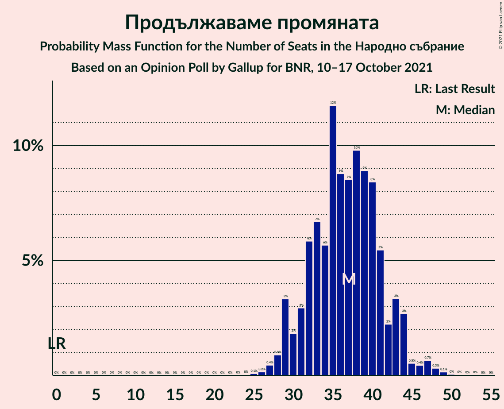
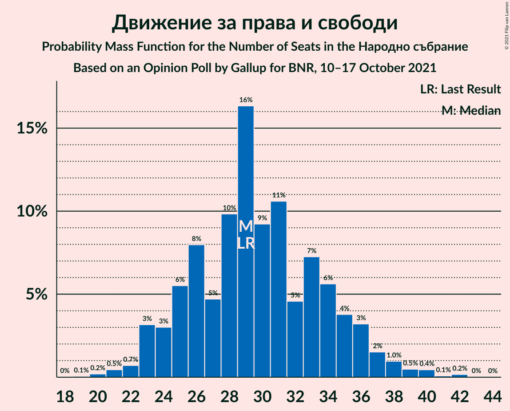
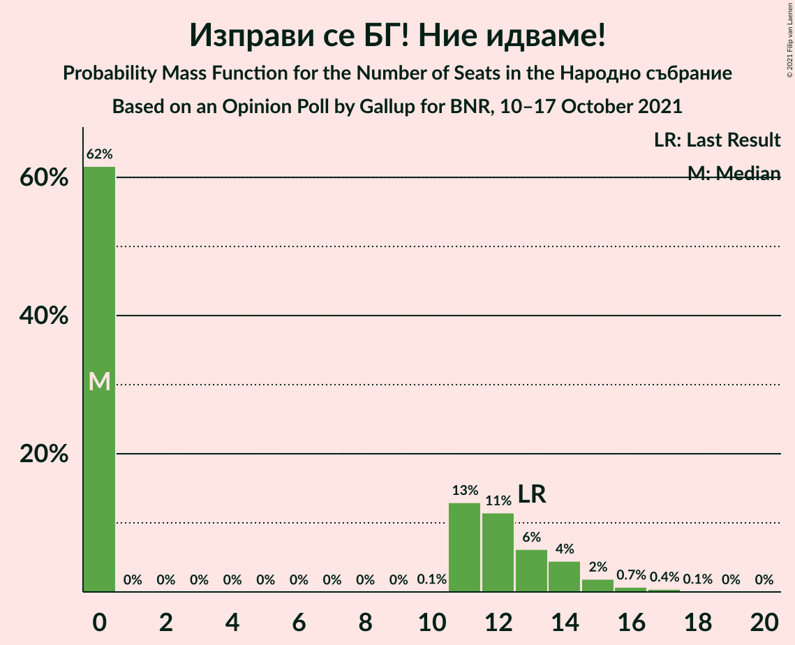
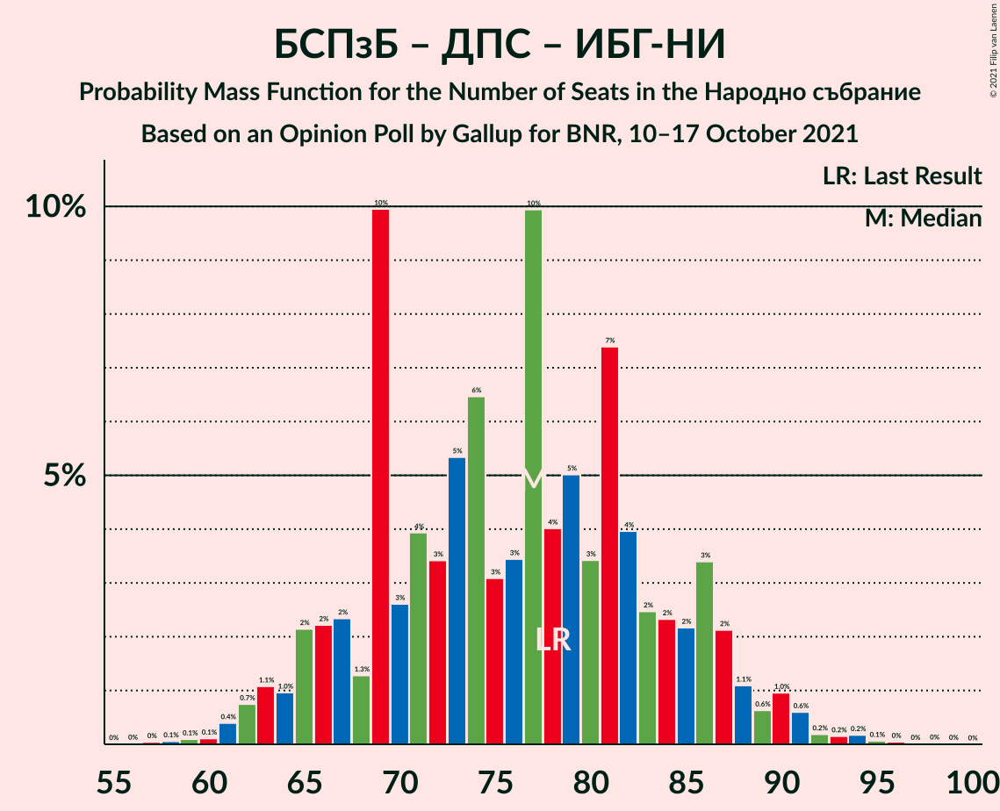

# Opinion Poll by Gallup for BNR, 10–17 October 2021

<a href="#voting-intentions">Voting Intentions</a> | <a href="#seats">Seats</a> | <a href="#coalitions">Coalitions</a> | <a href="#technical-information">Technical Information</a>

## Voting Intentions

### Confidence Intervals

| Party | Last Result | Poll Result | 80% Confidence Interval | 90% Confidence Interval | 95% Confidence Interval | 99% Confidence Interval |
|:-----:|:-----------:|:-----------:|:-----------------------:|:-----------------------:|:-----------------------:|:-----------------------:|
| Граждани за европейско развитие на България | 23.2% | 22.5% | 20.3–24.9% |19.7–25.6% |19.2–26.2% |18.2–27.4% |
| БСП за България | 13.2% | 15.2% | 13.4–17.3% |12.8–17.9% |12.4–18.4% |11.6–19.5% |
| Продължаваме промяната | 0.0% | 13.3% | 11.6–15.4% |11.2–16.0% |10.7–16.5% |10.0–17.5% |
| Има такъв народ | 23.8% | 12.2% | 10.6–14.2% |10.2–14.8% |9.8–15.3% |9.0–16.3% |
| Демократична България | 12.5% | 11.2% | 9.6–13.1% |9.1–13.6% |8.8–14.1% |8.1–15.0% |
| Движение за права и свободи | 10.6% | 10.8% | 9.3–12.7% |8.8–13.2% |8.5–13.7% |7.8–14.6% |
| Изправи се БГ! Ние идваме! | 5.0% | 3.7% | 2.8–4.9% |2.6–5.3% |2.4–5.6% |2.0–6.2% |
| Възраждане | 3.0% | 2.9% | 2.2–4.1% |2.0–4.4% |1.8–4.7% |1.5–5.3% |
| ВМРО–Българско Национално Движение | 3.1% | 2.4% | 1.7–3.4% |1.5–3.7% |1.4–4.0% |1.1–4.6% |

*Note:* The poll result column reflects the actual value used in the calculations. Published results may vary slightly, and in addition be rounded to fewer digits.

## Seats

### Confidence Intervals

| Party | Last Result | Median | 80% Confidence Interval | 90% Confidence Interval | 95% Confidence Interval | 99% Confidence Interval |
|:-----:|:-----------:|:------:|:-----------------------:|:-----------------------:|:-----------------------:|:-----------------------:|
| <a href="#граждани-за-европейско-развитие-на-българия">Граждани за европейско развитие на България</a> | 63 | 62 | 56–66 |53–69 |52–70 |47–74 |
| <a href="#бсп-за-българия">БСП за България</a> | 36 | 41 | 36–49 |35–51 |33–51 |32–53 |
| <a href="#продължаваме-промяната">Продължаваме промяната</a> | 0 | 38 | 32–41 |31–43 |30–45 |27–47 |
| <a href="#има-такъв-народ">Има такъв народ</a> | 65 | 34 | 29–39 |28–39 |26–42 |24–46 |
| <a href="#демократична-българия">Демократична България</a> | 34 | 29 | 27–36 |25–38 |24–39 |22–42 |
| <a href="#движение-за-права-и-свободи">Движение за права и свободи</a> | 29 | 29 | 25–33 |24–36 |23–38 |21–39 |
| <a href="#изправи-се-бг!-ние-идваме!">Изправи се БГ! Ние идваме!</a> | 13 | 0 | 0–14 |0–14 |0–15 |0–17 |
| <a href="#възраждане">Възраждане</a> | 0 | 0 | 0–11 |0–11 |0–12 |0–14 |
| <a href="#вмро–българско-национално-движение">ВМРО–Българско Национално Движение</a> | 0 | 0 | 0 |0–11 |0–11 |0–12 |

### Граждани за европейско развитие на България

*For a full overview of the results for this party, see the [Граждани за европейско развитие на България](party-гражданизаевропейскоразвитиенабългария.html) page.*

| Number of Seats | Probability | Accumulated | Special Marks |
|:---------------:|:-----------:|:-----------:|:-------------:|
| 46 | 0% | 100% |  |
| 47 | 0.6% | 99.9% |  |
| 48 | 0.2% | 99.3% |  |
| 49 | 0.2% | 99.2% |  |
| 50 | 0.4% | 99.0% |  |
| 51 | 1.1% | 98.6% |  |
| 52 | 2% | 98% |  |
| 53 | 0.7% | 95% |  |
| 54 | 0.9% | 94% |  |
| 55 | 3% | 93% |  |
| 56 | 2% | 90% |  |
| 57 | 2% | 88% |  |
| 58 | 4% | 86% |  |
| 59 | 9% | 82% |  |
| 60 | 0.9% | 73% |  |
| 61 | 10% | 72% |  |
| 62 | 27% | 62% | Median |
| 63 | 5% | 35% | Last Result |
| 64 | 2% | 30% |  |
| 65 | 5% | 28% |  |
| 66 | 15% | 23% |  |
| 67 | 0.6% | 8% |  |
| 68 | 1.4% | 8% |  |
| 69 | 3% | 6% |  |
| 70 | 1.2% | 3% |  |
| 71 | 0.2% | 2% |  |
| 72 | 1.0% | 2% |  |
| 73 | 0.1% | 1.0% |  |
| 74 | 0.5% | 0.8% |  |
| 75 | 0.1% | 0.4% |  |
| 76 | 0% | 0.3% |  |
| 77 | 0.2% | 0.3% |  |
| 78 | 0% | 0.1% |  |
| 79 | 0% | 0.1% |  |
| 80 | 0% | 0% |  |

### БСП за България

*For a full overview of the results for this party, see the [БСП за България](party-бспзабългария.html) page.*

| Number of Seats | Probability | Accumulated | Special Marks |
|:---------------:|:-----------:|:-----------:|:-------------:|
| 29 | 0% | 100% |  |
| 30 | 0.2% | 99.9% |  |
| 31 | 0.2% | 99.8% |  |
| 32 | 0.7% | 99.6% |  |
| 33 | 1.4% | 98.9% |  |
| 34 | 0.3% | 97% |  |
| 35 | 7% | 97% |  |
| 36 | 11% | 90% | Last Result |
| 37 | 7% | 79% |  |
| 38 | 3% | 72% |  |
| 39 | 11% | 69% |  |
| 40 | 5% | 58% |  |
| 41 | 7% | 53% | Median |
| 42 | 4% | 46% |  |
| 43 | 3% | 42% |  |
| 44 | 8% | 39% |  |
| 45 | 1.0% | 31% |  |
| 46 | 5% | 30% |  |
| 47 | 13% | 25% |  |
| 48 | 2% | 12% |  |
| 49 | 4% | 10% |  |
| 50 | 0.2% | 6% |  |
| 51 | 3% | 6% |  |
| 52 | 0.9% | 2% |  |
| 53 | 1.0% | 1.5% |  |
| 54 | 0.3% | 0.5% |  |
| 55 | 0% | 0.2% |  |
| 56 | 0% | 0.2% |  |
| 57 | 0.1% | 0.2% |  |
| 58 | 0% | 0% |  |

### Продължаваме промяната

*For a full overview of the results for this party, see the [Продължаваме промяната](party-продължавамепромяната.html) page.*

| Number of Seats | Probability | Accumulated | Special Marks |
|:---------------:|:-----------:|:-----------:|:-------------:|
| 0 | 0% | 100% | Last Result |
| 1 | 0% | 100% |  |
| 2 | 0% | 100% |  |
| 3 | 0% | 100% |  |
| 4 | 0% | 100% |  |
| 5 | 0% | 100% |  |
| 6 | 0% | 100% |  |
| 7 | 0% | 100% |  |
| 8 | 0% | 100% |  |
| 9 | 0% | 100% |  |
| 10 | 0% | 100% |  |
| 11 | 0% | 100% |  |
| 12 | 0% | 100% |  |
| 13 | 0% | 100% |  |
| 14 | 0% | 100% |  |
| 15 | 0% | 100% |  |
| 16 | 0% | 100% |  |
| 17 | 0% | 100% |  |
| 18 | 0% | 100% |  |
| 19 | 0% | 100% |  |
| 20 | 0% | 100% |  |
| 21 | 0% | 100% |  |
| 22 | 0% | 100% |  |
| 23 | 0% | 100% |  |
| 24 | 0% | 100% |  |
| 25 | 0.3% | 100% |  |
| 26 | 0.2% | 99.7% |  |
| 27 | 0.6% | 99.5% |  |
| 28 | 0.8% | 99.0% |  |
| 29 | 0.4% | 98% |  |
| 30 | 2% | 98% |  |
| 31 | 2% | 96% |  |
| 32 | 10% | 93% |  |
| 33 | 9% | 83% |  |
| 34 | 7% | 74% |  |
| 35 | 2% | 67% |  |
| 36 | 7% | 65% |  |
| 37 | 6% | 58% |  |
| 38 | 2% | 52% | Median |
| 39 | 3% | 49% |  |
| 40 | 29% | 46% |  |
| 41 | 10% | 17% |  |
| 42 | 2% | 7% |  |
| 43 | 2% | 6% |  |
| 44 | 0.6% | 3% |  |
| 45 | 1.0% | 3% |  |
| 46 | 1.0% | 2% |  |
| 47 | 0.1% | 0.5% |  |
| 48 | 0.2% | 0.4% |  |
| 49 | 0% | 0.2% |  |
| 50 | 0% | 0.1% |  |
| 51 | 0% | 0.1% |  |
| 52 | 0% | 0.1% |  |
| 53 | 0.1% | 0.1% |  |
| 54 | 0% | 0% |  |

### Има такъв народ

*For a full overview of the results for this party, see the [Има такъв народ](party-иматакъвнарод.html) page.*

| Number of Seats | Probability | Accumulated | Special Marks |
|:---------------:|:-----------:|:-----------:|:-------------:|
| 22 | 0% | 100% |  |
| 23 | 0.1% | 99.9% |  |
| 24 | 0.4% | 99.9% |  |
| 25 | 0.7% | 99.5% |  |
| 26 | 1.4% | 98.7% |  |
| 27 | 2% | 97% |  |
| 28 | 4% | 96% |  |
| 29 | 9% | 92% |  |
| 30 | 4% | 83% |  |
| 31 | 3% | 79% |  |
| 32 | 20% | 75% |  |
| 33 | 1.4% | 55% |  |
| 34 | 9% | 54% | Median |
| 35 | 2% | 46% |  |
| 36 | 5% | 43% |  |
| 37 | 12% | 38% |  |
| 38 | 13% | 26% |  |
| 39 | 9% | 13% |  |
| 40 | 1.4% | 4% |  |
| 41 | 0.4% | 3% |  |
| 42 | 0.6% | 3% |  |
| 43 | 0.8% | 2% |  |
| 44 | 0.5% | 1.2% |  |
| 45 | 0% | 0.7% |  |
| 46 | 0.6% | 0.7% |  |
| 47 | 0% | 0.1% |  |
| 48 | 0% | 0% |  |
| 49 | 0% | 0% |  |
| 50 | 0% | 0% |  |
| 51 | 0% | 0% |  |
| 52 | 0% | 0% |  |
| 53 | 0% | 0% |  |
| 54 | 0% | 0% |  |
| 55 | 0% | 0% |  |
| 56 | 0% | 0% |  |
| 57 | 0% | 0% |  |
| 58 | 0% | 0% |  |
| 59 | 0% | 0% |  |
| 60 | 0% | 0% |  |
| 61 | 0% | 0% |  |
| 62 | 0% | 0% |  |
| 63 | 0% | 0% |  |
| 64 | 0% | 0% |  |
| 65 | 0% | 0% | Last Result |

### Демократична България

*For a full overview of the results for this party, see the [Демократична България](party-демократичнабългария.html) page.*

| Number of Seats | Probability | Accumulated | Special Marks |
|:---------------:|:-----------:|:-----------:|:-------------:|
| 20 | 0.1% | 100% |  |
| 21 | 0.1% | 99.9% |  |
| 22 | 0.9% | 99.8% |  |
| 23 | 1.3% | 98.9% |  |
| 24 | 2% | 98% |  |
| 25 | 3% | 95% |  |
| 26 | 2% | 92% |  |
| 27 | 9% | 91% |  |
| 28 | 8% | 82% |  |
| 29 | 29% | 73% | Median |
| 30 | 8% | 44% |  |
| 31 | 7% | 37% |  |
| 32 | 6% | 30% |  |
| 33 | 10% | 24% |  |
| 34 | 0.9% | 14% | Last Result |
| 35 | 3% | 13% |  |
| 36 | 2% | 10% |  |
| 37 | 1.3% | 9% |  |
| 38 | 3% | 7% |  |
| 39 | 2% | 4% |  |
| 40 | 0.1% | 1.4% |  |
| 41 | 0.5% | 1.3% |  |
| 42 | 0.4% | 0.8% |  |
| 43 | 0.2% | 0.3% |  |
| 44 | 0.1% | 0.1% |  |
| 45 | 0% | 0% |  |

### Движение за права и свободи

*For a full overview of the results for this party, see the [Движение за права и свободи](party-движениезаправаисвободи.html) page.*

| Number of Seats | Probability | Accumulated | Special Marks |
|:---------------:|:-----------:|:-----------:|:-------------:|
| 19 | 0% | 100% |  |
| 20 | 0.3% | 99.9% |  |
| 21 | 0.3% | 99.6% |  |
| 22 | 0.5% | 99.3% |  |
| 23 | 2% | 98.8% |  |
| 24 | 4% | 97% |  |
| 25 | 11% | 94% |  |
| 26 | 13% | 83% |  |
| 27 | 6% | 70% |  |
| 28 | 4% | 64% |  |
| 29 | 11% | 60% | Last Result, Median |
| 30 | 23% | 50% |  |
| 31 | 9% | 27% |  |
| 32 | 4% | 18% |  |
| 33 | 4% | 13% |  |
| 34 | 2% | 10% |  |
| 35 | 1.1% | 8% |  |
| 36 | 3% | 7% |  |
| 37 | 1.1% | 4% |  |
| 38 | 2% | 3% |  |
| 39 | 0.7% | 1.2% |  |
| 40 | 0.3% | 0.5% |  |
| 41 | 0.1% | 0.2% |  |
| 42 | 0% | 0.1% |  |
| 43 | 0% | 0.1% |  |
| 44 | 0.1% | 0.1% |  |
| 45 | 0% | 0% |  |

### Изправи се БГ! Ние идваме!

*For a full overview of the results for this party, see the [Изправи се БГ! Ние идваме!](party-изправисебгниеидваме.html) page.*

| Number of Seats | Probability | Accumulated | Special Marks |
|:---------------:|:-----------:|:-----------:|:-------------:|
| 0 | 69% | 100% | Median |
| 1 | 0% | 31% |  |
| 2 | 0% | 31% |  |
| 3 | 0% | 31% |  |
| 4 | 0% | 31% |  |
| 5 | 0% | 31% |  |
| 6 | 0% | 31% |  |
| 7 | 0% | 31% |  |
| 8 | 0% | 31% |  |
| 9 | 0% | 31% |  |
| 10 | 0.5% | 31% |  |
| 11 | 3% | 30% |  |
| 12 | 9% | 27% |  |
| 13 | 7% | 17% | Last Result |
| 14 | 7% | 10% |  |
| 15 | 1.3% | 3% |  |
| 16 | 0.2% | 1.4% |  |
| 17 | 0.9% | 1.2% |  |
| 18 | 0.3% | 0.3% |  |
| 19 | 0% | 0% |  |

### Възраждане

*For a full overview of the results for this party, see the [Възраждане](party-възраждане.html) page.*

| Number of Seats | Probability | Accumulated | Special Marks |
|:---------------:|:-----------:|:-----------:|:-------------:|
| 0 | 89% | 100% | Last Result, Median |
| 1 | 0% | 11% |  |
| 2 | 0% | 11% |  |
| 3 | 0% | 11% |  |
| 4 | 0% | 11% |  |
| 5 | 0% | 11% |  |
| 6 | 0% | 11% |  |
| 7 | 0% | 11% |  |
| 8 | 0% | 11% |  |
| 9 | 0% | 11% |  |
| 10 | 0.5% | 11% |  |
| 11 | 6% | 11% |  |
| 12 | 3% | 5% |  |
| 13 | 0.7% | 1.5% |  |
| 14 | 0.5% | 0.8% |  |
| 15 | 0.1% | 0.2% |  |
| 16 | 0.1% | 0.1% |  |
| 17 | 0% | 0% |  |

### ВМРО–Българско Национално Движение

*For a full overview of the results for this party, see the [ВМРО–Българско Национално Движение](party-вмро–българсконационалнодвижение.html) page.*

| Number of Seats | Probability | Accumulated | Special Marks |
|:---------------:|:-----------:|:-----------:|:-------------:|
| 0 | 94% | 100% | Last Result, Median |
| 1 | 0% | 6% |  |
| 2 | 0% | 6% |  |
| 3 | 0% | 6% |  |
| 4 | 0% | 6% |  |
| 5 | 0% | 6% |  |
| 6 | 0% | 6% |  |
| 7 | 0% | 6% |  |
| 8 | 0% | 6% |  |
| 9 | 0% | 6% |  |
| 10 | 0.1% | 6% |  |
| 11 | 4% | 6% |  |
| 12 | 2% | 2% |  |
| 13 | 0.1% | 0.3% |  |
| 14 | 0.1% | 0.2% |  |
| 15 | 0% | 0% |  |

## Coalitions

### Confidence Intervals

| Coalition | Last Result | Median | Majority? | 80% Confidence Interval | 90% Confidence Interval | 95% Confidence Interval | 99% Confidence Interval |
|:---------:|:-----------:|:------:|:---------:|:-----------------------:|:-----------------------:|:-----------------------:|:-----------------------:|
| БСП за България – Има такъв народ – Движение за права и свободи – Изправи се БГ! Ние идваме! | 143 | 109 | 5% | 100–118 | 96–120 | 96–125 | 94–126 |
| БСП за България – Има такъв народ – Движение за права и свободи | 130 | 105 | 0.6% | 95–114 | 95–116 | 94–118 | 89–121 |
| БСП за България – Движение за права и свободи – Изправи се БГ! Ние идваме! | 78 | 75 | 0% | 65–84 | 65–86 | 64–88 | 60–92 |
| БСП за България – Движение за права и свободи | 65 | 70 | 0% | 63–78 | 61–81 | 61–84 | 57–85 |

### БСП за България – Има такъв народ – Движение за права и свободи – Изправи се БГ! Ние идваме!

| Number of Seats | Probability | Accumulated | Special Marks |
|:---------------:|:-----------:|:-----------:|:-------------:|
| 88 | 0.1% | 100% |  |
| 89 | 0% | 99.9% |  |
| 90 | 0% | 99.9% |  |
| 91 | 0.1% | 99.8% |  |
| 92 | 0.1% | 99.7% |  |
| 93 | 0% | 99.6% |  |
| 94 | 1.2% | 99.6% |  |
| 95 | 0.1% | 98% |  |
| 96 | 4% | 98% |  |
| 97 | 0.3% | 95% |  |
| 98 | 0.5% | 94% |  |
| 99 | 0.3% | 94% |  |
| 100 | 4% | 93% |  |
| 101 | 3% | 89% |  |
| 102 | 2% | 86% |  |
| 103 | 2% | 85% |  |
| 104 | 9% | 83% | Median |
| 105 | 6% | 74% |  |
| 106 | 5% | 68% |  |
| 107 | 7% | 64% |  |
| 108 | 2% | 57% |  |
| 109 | 16% | 55% |  |
| 110 | 2% | 40% |  |
| 111 | 9% | 37% |  |
| 112 | 2% | 28% |  |
| 113 | 2% | 26% |  |
| 114 | 5% | 25% |  |
| 115 | 3% | 19% |  |
| 116 | 2% | 17% |  |
| 117 | 4% | 15% |  |
| 118 | 2% | 10% |  |
| 119 | 2% | 8% |  |
| 120 | 1.3% | 6% |  |
| 121 | 1.2% | 5% | Majority |
| 122 | 0.5% | 4% |  |
| 123 | 0.2% | 3% |  |
| 124 | 0.6% | 3% |  |
| 125 | 2% | 3% |  |
| 126 | 0.5% | 0.7% |  |
| 127 | 0.2% | 0.3% |  |
| 128 | 0% | 0.1% |  |
| 129 | 0% | 0.1% |  |
| 130 | 0% | 0% |  |
| 131 | 0% | 0% |  |
| 132 | 0% | 0% |  |
| 133 | 0% | 0% |  |
| 134 | 0% | 0% |  |
| 135 | 0% | 0% |  |
| 136 | 0% | 0% |  |
| 137 | 0% | 0% |  |
| 138 | 0% | 0% |  |
| 139 | 0% | 0% |  |
| 140 | 0% | 0% |  |
| 141 | 0% | 0% |  |
| 142 | 0% | 0% |  |
| 143 | 0% | 0% | Last Result |

### БСП за България – Има такъв народ – Движение за права и свободи

| Number of Seats | Probability | Accumulated | Special Marks |
|:---------------:|:-----------:|:-----------:|:-------------:|
| 85 | 0% | 100% |  |
| 86 | 0.1% | 99.9% |  |
| 87 | 0% | 99.9% |  |
| 88 | 0.2% | 99.9% |  |
| 89 | 0.3% | 99.7% |  |
| 90 | 0.6% | 99.4% |  |
| 91 | 0.5% | 98.8% |  |
| 92 | 0.5% | 98% |  |
| 93 | 0.1% | 98% |  |
| 94 | 2% | 98% |  |
| 95 | 6% | 96% |  |
| 96 | 5% | 90% |  |
| 97 | 0.4% | 85% |  |
| 98 | 6% | 84% |  |
| 99 | 2% | 78% |  |
| 100 | 6% | 76% |  |
| 101 | 3% | 70% |  |
| 102 | 2% | 67% |  |
| 103 | 5% | 65% |  |
| 104 | 9% | 60% | Median |
| 105 | 6% | 52% |  |
| 106 | 6% | 45% |  |
| 107 | 2% | 39% |  |
| 108 | 1.1% | 38% |  |
| 109 | 15% | 37% |  |
| 110 | 1.4% | 21% |  |
| 111 | 4% | 20% |  |
| 112 | 2% | 16% |  |
| 113 | 1.0% | 14% |  |
| 114 | 5% | 13% |  |
| 115 | 3% | 8% |  |
| 116 | 0.9% | 5% |  |
| 117 | 0.1% | 4% |  |
| 118 | 2% | 4% |  |
| 119 | 2% | 2% |  |
| 120 | 0% | 0.6% |  |
| 121 | 0.2% | 0.6% | Majority |
| 122 | 0.3% | 0.4% |  |
| 123 | 0% | 0.1% |  |
| 124 | 0% | 0.1% |  |
| 125 | 0% | 0.1% |  |
| 126 | 0% | 0% |  |
| 127 | 0% | 0% |  |
| 128 | 0% | 0% |  |
| 129 | 0% | 0% |  |
| 130 | 0% | 0% | Last Result |

### БСП за България – Движение за права и свободи – Изправи се БГ! Ние идваме!

| Number of Seats | Probability | Accumulated | Special Marks |
|:---------------:|:-----------:|:-----------:|:-------------:|
| 54 | 0.1% | 100% |  |
| 55 | 0% | 99.9% |  |
| 56 | 0% | 99.9% |  |
| 57 | 0% | 99.9% |  |
| 58 | 0% | 99.8% |  |
| 59 | 0.1% | 99.8% |  |
| 60 | 0.6% | 99.7% |  |
| 61 | 0.1% | 99.2% |  |
| 62 | 0.2% | 99.0% |  |
| 63 | 0.3% | 98.8% |  |
| 64 | 3% | 98.6% |  |
| 65 | 8% | 96% |  |
| 66 | 2% | 88% |  |
| 67 | 5% | 86% |  |
| 68 | 0.9% | 80% |  |
| 69 | 5% | 80% |  |
| 70 | 3% | 75% | Median |
| 71 | 6% | 72% |  |
| 72 | 3% | 66% |  |
| 73 | 3% | 63% |  |
| 74 | 7% | 60% |  |
| 75 | 3% | 53% |  |
| 76 | 3% | 50% |  |
| 77 | 16% | 47% |  |
| 78 | 7% | 31% | Last Result |
| 79 | 1.1% | 24% |  |
| 80 | 7% | 23% |  |
| 81 | 3% | 16% |  |
| 82 | 1.2% | 13% |  |
| 83 | 0.3% | 12% |  |
| 84 | 3% | 12% |  |
| 85 | 3% | 9% |  |
| 86 | 1.5% | 6% |  |
| 87 | 1.0% | 5% |  |
| 88 | 2% | 4% |  |
| 89 | 0.2% | 2% |  |
| 90 | 0.8% | 2% |  |
| 91 | 0.4% | 0.9% |  |
| 92 | 0.1% | 0.5% |  |
| 93 | 0.1% | 0.5% |  |
| 94 | 0.3% | 0.4% |  |
| 95 | 0% | 0.1% |  |
| 96 | 0% | 0.1% |  |
| 97 | 0% | 0% |  |

### БСП за България – Движение за права и свободи

| Number of Seats | Probability | Accumulated | Special Marks |
|:---------------:|:-----------:|:-----------:|:-------------:|
| 54 | 0.1% | 100% |  |
| 55 | 0% | 99.9% |  |
| 56 | 0.2% | 99.8% |  |
| 57 | 0.2% | 99.6% |  |
| 58 | 0.1% | 99.5% |  |
| 59 | 0.5% | 99.4% |  |
| 60 | 0.8% | 98.9% |  |
| 61 | 6% | 98% |  |
| 62 | 0.5% | 92% |  |
| 63 | 2% | 92% |  |
| 64 | 3% | 90% |  |
| 65 | 11% | 87% | Last Result |
| 66 | 10% | 76% |  |
| 67 | 6% | 66% |  |
| 68 | 2% | 60% |  |
| 69 | 5% | 58% |  |
| 70 | 3% | 53% | Median |
| 71 | 6% | 49% |  |
| 72 | 5% | 43% |  |
| 73 | 3% | 38% |  |
| 74 | 1.0% | 35% |  |
| 75 | 4% | 34% |  |
| 76 | 3% | 30% |  |
| 77 | 15% | 27% |  |
| 78 | 2% | 12% |  |
| 79 | 0.4% | 10% |  |
| 80 | 3% | 9% |  |
| 81 | 3% | 6% |  |
| 82 | 0.6% | 4% |  |
| 83 | 0% | 3% |  |
| 84 | 1.3% | 3% |  |
| 85 | 2% | 2% |  |
| 86 | 0% | 0.3% |  |
| 87 | 0% | 0.3% |  |
| 88 | 0.1% | 0.2% |  |
| 89 | 0.1% | 0.2% |  |
| 90 | 0.1% | 0.1% |  |
| 91 | 0% | 0% |  |

## Technical Information

### Opinion Poll

+ **Polling firm:** Gallup
+ **Commissioner(s):** BNR
+ **Fieldwork period:** 10–17 October 2021

### Calculations

+ **Sample size:** 547
+ **Simulations done:** 131,072
+ **Error estimate:** 3.03%

