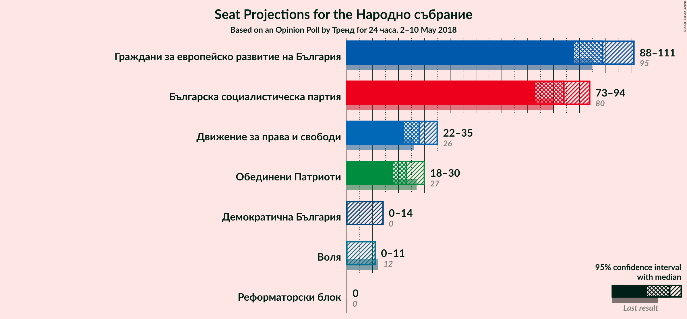
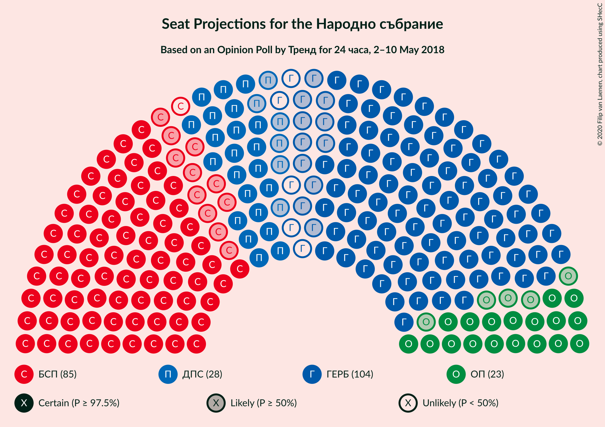
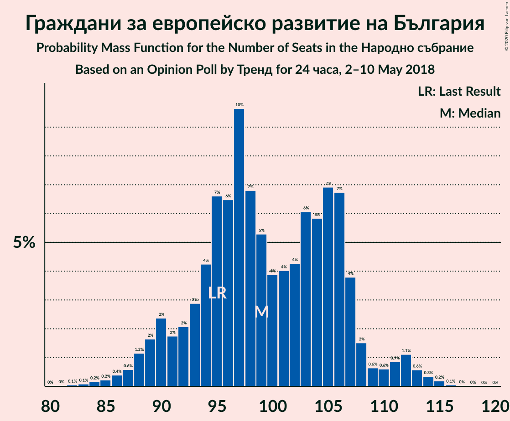
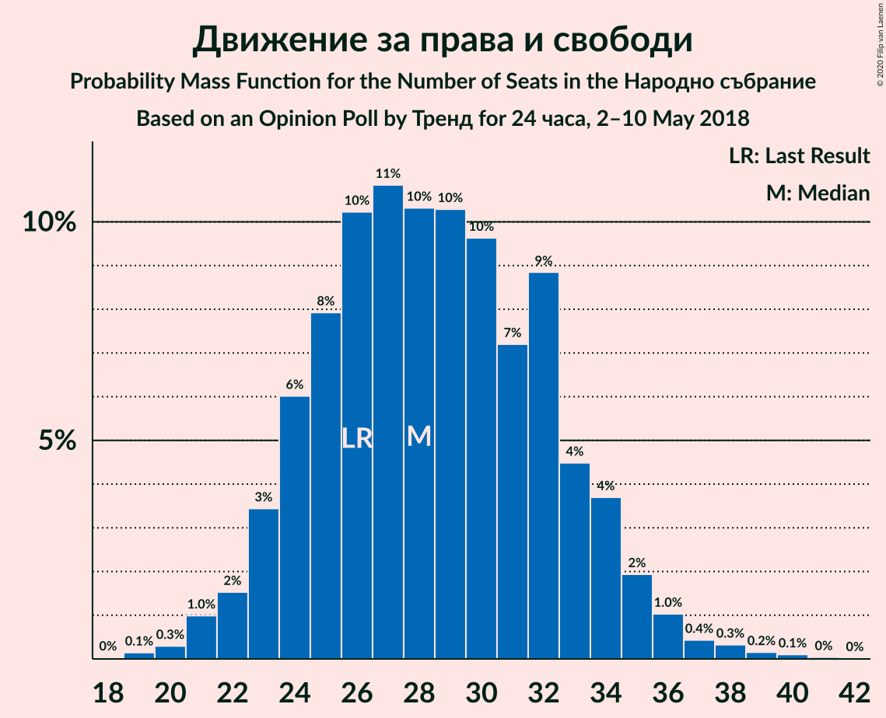
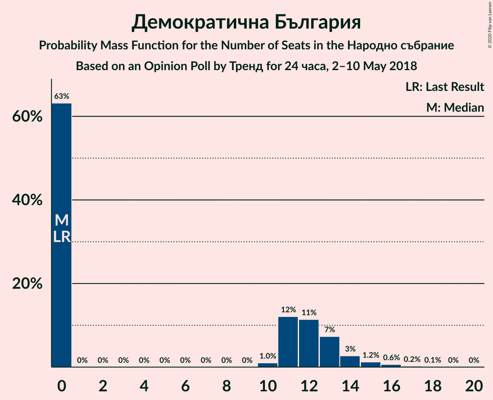
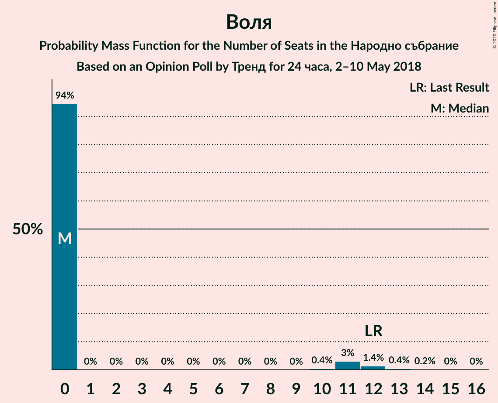
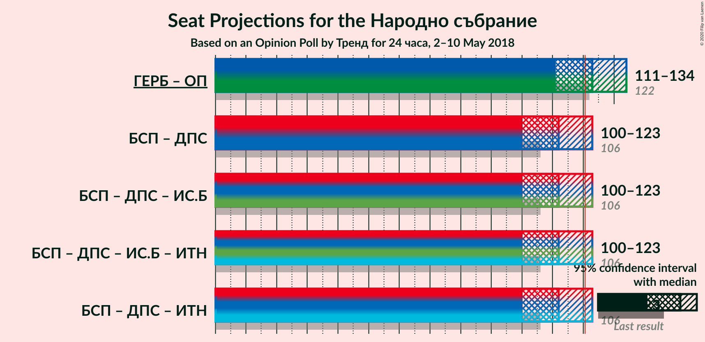
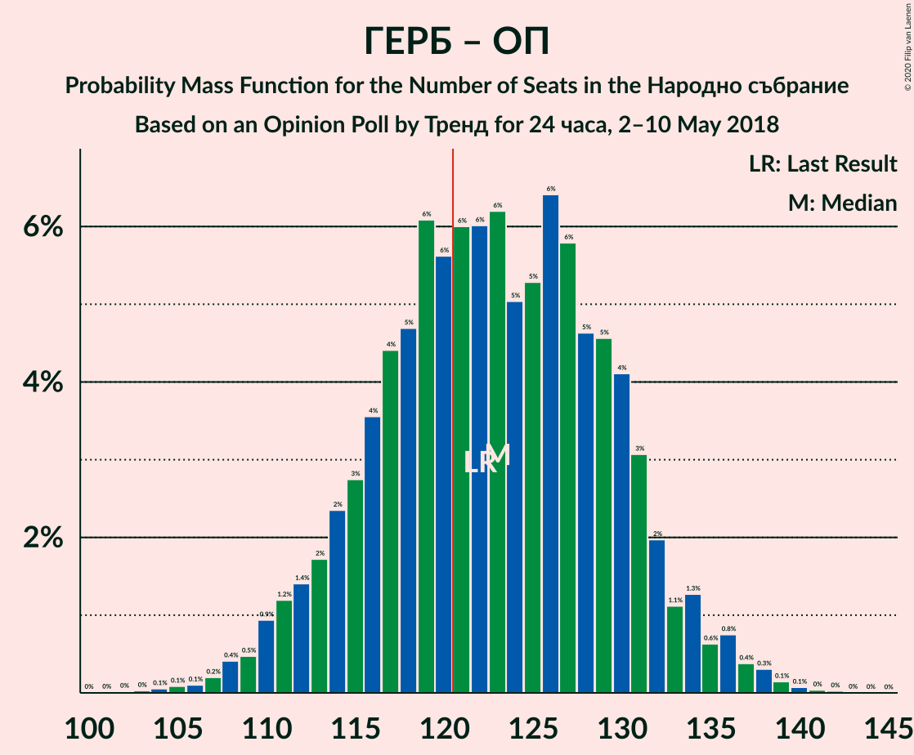
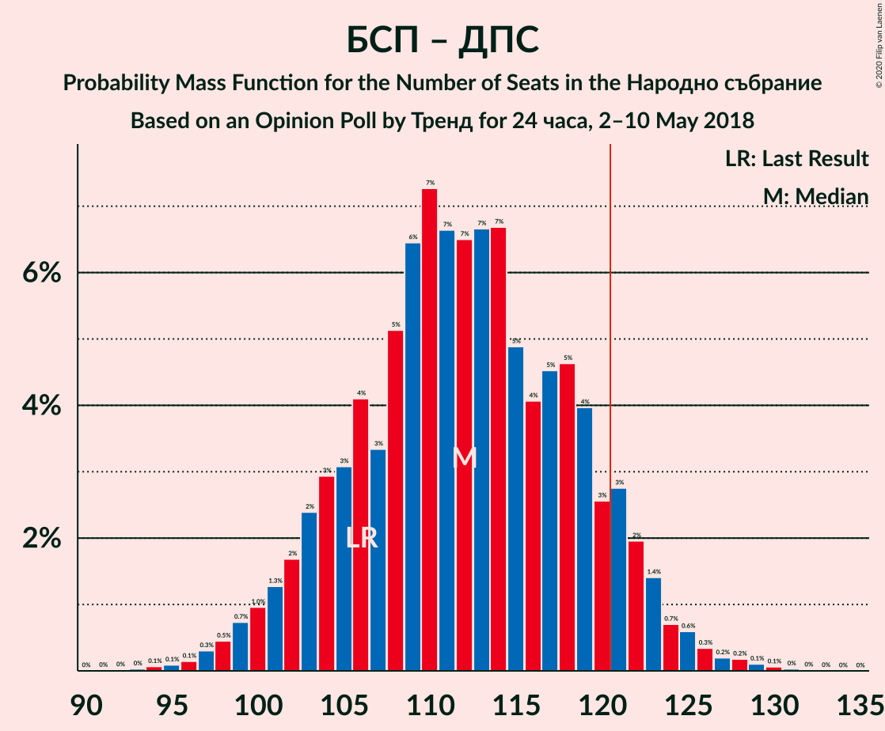

# Opinion Poll by Тренд for 24 часа, 2–10 May 2018

<a href="#voting-intentions">Voting Intentions</a> | <a href="#seats">Seats</a> | <a href="#coalitions">Coalitions</a> | <a href="#technical-information">Technical Information</a>

## Voting Intentions

### Confidence Intervals

| Party | Last Result | Poll Result | 80% Confidence Interval | 90% Confidence Interval | 95% Confidence Interval | 99% Confidence Interval |
|:-----:|:-----------:|:-----------:|:-----------------------:|:-----------------------:|:-----------------------:|:-----------------------:|
| Граждани за европейско развитие на България | 33.5% | 37.0% | 34.6–39.6% |33.9–40.3% |33.3–40.9% |32.2–42.1% |
| Българска социалистическа партия | 27.9% | 31.1% | 28.8–33.5% |28.1–34.2% |27.6–34.8% |26.5–36.0% |
| Движение за права и свободи | 9.2% | 10.5% | 9.0–12.2% |8.6–12.7% |8.3–13.1% |7.7–14.0% |
| Обединени Патриоти | 9.3% | 8.5% | 7.3–10.2% |6.9–10.6% |6.6–11.0% |6.0–11.8% |
| Демократична България | 0.0% | 3.7% | 2.9–4.9% |2.7–5.2% |2.5–5.5% |2.1–6.1% |
| Воля | 4.3% | 2.7% | 2.1–3.8% |1.9–4.1% |1.7–4.3% |1.4–4.9% |
| Реформаторски блок | 3.1% | 2.1% | 1.5–3.0% |1.4–3.3% |1.2–3.6% |1.0–4.1% |

*Note:* The poll result column reflects the actual value used in the calculations. Published results may vary slightly, and in addition be rounded to fewer digits.

## Seats

### Confidence Intervals

| Party | Last Result | Median | 80% Confidence Interval | 90% Confidence Interval | 95% Confidence Interval | 99% Confidence Interval |
|:-----:|:-----------:|:------:|:-----------------------:|:-----------------------:|:-----------------------:|:-----------------------:|
| <a href="#граждани-за-европейско-развитие-на-българия">Граждани за европейско развитие на България</a> | 95 | 99 | 92–106 |90–108 |88–111 |85–114 |
| <a href="#българска-социалистическа-партия">Българска социалистическа партия</a> | 80 | 84 | 77–90 |75–93 |73–94 |70–97 |
| <a href="#движение-за-права-и-свободи">Движение за права и свободи</a> | 26 | 28 | 24–33 |23–34 |22–35 |21–38 |
| <a href="#обединени-патриоти">Обединени Патриоти</a> | 27 | 23 | 19–27 |18–28 |18–30 |16–32 |
| <a href="#демократична-българия">Демократична България</a> | 0 | 0 | 0–13 |0–13 |0–14 |0–16 |
| <a href="#воля">Воля</a> | 12 | 0 | 0 |0–11 |0–11 |0–13 |
| <a href="#реформаторски-блок">Реформаторски блок</a> | 0 | 0 | 0 |0 |0 |0–11 |

### Граждани за европейско развитие на България

*For a full overview of the results for this party, see the [Граждани за европейско развитие на България](party-гражданизаевропейскоразвитиенабългария.html) page.*

| Number of Seats | Probability | Accumulated | Special Marks |
|:---------------:|:-----------:|:-----------:|:-------------:|
| 81 | 0% | 100% |  |
| 82 | 0.1% | 99.9% |  |
| 83 | 0.1% | 99.9% |  |
| 84 | 0.2% | 99.8% |  |
| 85 | 0.2% | 99.6% |  |
| 86 | 0.4% | 99.4% |  |
| 87 | 0.6% | 99.0% |  |
| 88 | 1.2% | 98% |  |
| 89 | 2% | 97% |  |
| 90 | 2% | 96% |  |
| 91 | 2% | 93% |  |
| 92 | 2% | 92% |  |
| 93 | 3% | 89% |  |
| 94 | 4% | 87% |  |
| 95 | 7% | 82% | Last Result |
| 96 | 6% | 76% |  |
| 97 | 10% | 69% |  |
| 98 | 7% | 60% |  |
| 99 | 5% | 53% | Median |
| 100 | 4% | 47% |  |
| 101 | 4% | 44% |  |
| 102 | 4% | 40% |  |
| 103 | 6% | 35% |  |
| 104 | 6% | 29% |  |
| 105 | 7% | 23% |  |
| 106 | 7% | 16% |  |
| 107 | 4% | 10% |  |
| 108 | 2% | 6% |  |
| 109 | 0.6% | 4% |  |
| 110 | 0.6% | 4% |  |
| 111 | 0.9% | 3% |  |
| 112 | 1.1% | 2% |  |
| 113 | 0.6% | 1.2% |  |
| 114 | 0.3% | 0.7% |  |
| 115 | 0.2% | 0.3% |  |
| 116 | 0.1% | 0.1% |  |
| 117 | 0% | 0.1% |  |
| 118 | 0% | 0% |  |

### Българска социалистическа партия

*For a full overview of the results for this party, see the [Българска социалистическа партия](party-българскасоциалистическапартия.html) page.*

| Number of Seats | Probability | Accumulated | Special Marks |
|:---------------:|:-----------:|:-----------:|:-------------:|
| 67 | 0% | 100% |  |
| 68 | 0.1% | 99.9% |  |
| 69 | 0.2% | 99.8% |  |
| 70 | 0.4% | 99.7% |  |
| 71 | 0.5% | 99.3% |  |
| 72 | 0.8% | 98.8% |  |
| 73 | 1.0% | 98% |  |
| 74 | 1.1% | 97% |  |
| 75 | 2% | 96% |  |
| 76 | 3% | 94% |  |
| 77 | 4% | 91% |  |
| 78 | 5% | 87% |  |
| 79 | 6% | 82% |  |
| 80 | 6% | 76% | Last Result |
| 81 | 6% | 70% |  |
| 82 | 6% | 63% |  |
| 83 | 6% | 58% |  |
| 84 | 6% | 52% | Median |
| 85 | 9% | 45% |  |
| 86 | 6% | 37% |  |
| 87 | 8% | 30% |  |
| 88 | 6% | 23% |  |
| 89 | 5% | 17% |  |
| 90 | 3% | 12% |  |
| 91 | 2% | 9% |  |
| 92 | 2% | 7% |  |
| 93 | 2% | 5% |  |
| 94 | 1.0% | 3% |  |
| 95 | 1.0% | 2% |  |
| 96 | 0.6% | 1.3% |  |
| 97 | 0.3% | 0.7% |  |
| 98 | 0.2% | 0.4% |  |
| 99 | 0.1% | 0.2% |  |
| 100 | 0% | 0.1% |  |
| 101 | 0% | 0.1% |  |
| 102 | 0% | 0% |  |

### Движение за права и свободи

*For a full overview of the results for this party, see the [Движение за права и свободи](party-движениезаправаисвободи.html) page.*

| Number of Seats | Probability | Accumulated | Special Marks |
|:---------------:|:-----------:|:-----------:|:-------------:|
| 19 | 0.1% | 100% |  |
| 20 | 0.3% | 99.8% |  |
| 21 | 1.0% | 99.5% |  |
| 22 | 2% | 98.5% |  |
| 23 | 3% | 97% |  |
| 24 | 6% | 94% |  |
| 25 | 8% | 88% |  |
| 26 | 10% | 80% | Last Result |
| 27 | 11% | 69% |  |
| 28 | 10% | 59% | Median |
| 29 | 10% | 48% |  |
| 30 | 10% | 38% |  |
| 31 | 7% | 28% |  |
| 32 | 9% | 21% |  |
| 33 | 4% | 12% |  |
| 34 | 4% | 8% |  |
| 35 | 2% | 4% |  |
| 36 | 1.0% | 2% |  |
| 37 | 0.4% | 1.1% |  |
| 38 | 0.3% | 0.6% |  |
| 39 | 0.2% | 0.3% |  |
| 40 | 0.1% | 0.2% |  |
| 41 | 0% | 0.1% |  |
| 42 | 0% | 0% |  |

### Обединени Патриоти

*For a full overview of the results for this party, see the [Обединени Патриоти](party-обединенипатриоти.html) page.*

| Number of Seats | Probability | Accumulated | Special Marks |
|:---------------:|:-----------:|:-----------:|:-------------:|
| 14 | 0% | 100% |  |
| 15 | 0.2% | 99.9% |  |
| 16 | 0.6% | 99.8% |  |
| 17 | 1.4% | 99.2% |  |
| 18 | 3% | 98% |  |
| 19 | 5% | 94% |  |
| 20 | 8% | 89% |  |
| 21 | 10% | 81% |  |
| 22 | 13% | 71% |  |
| 23 | 13% | 58% | Median |
| 24 | 13% | 45% |  |
| 25 | 10% | 32% |  |
| 26 | 8% | 22% |  |
| 27 | 6% | 14% | Last Result |
| 28 | 4% | 8% |  |
| 29 | 2% | 5% |  |
| 30 | 1.3% | 3% |  |
| 31 | 0.6% | 1.3% |  |
| 32 | 0.4% | 0.6% |  |
| 33 | 0.1% | 0.3% |  |
| 34 | 0.1% | 0.1% |  |
| 35 | 0% | 0% |  |

### Демократична България

*For a full overview of the results for this party, see the [Демократична България](party-демократичнабългария.html) page.*

| Number of Seats | Probability | Accumulated | Special Marks |
|:---------------:|:-----------:|:-----------:|:-------------:|
| 0 | 63% | 100% | Last Result, Median |
| 1 | 0% | 37% |  |
| 2 | 0% | 37% |  |
| 3 | 0% | 37% |  |
| 4 | 0% | 37% |  |
| 5 | 0% | 37% |  |
| 6 | 0% | 37% |  |
| 7 | 0% | 37% |  |
| 8 | 0% | 37% |  |
| 9 | 0% | 37% |  |
| 10 | 1.0% | 37% |  |
| 11 | 12% | 36% |  |
| 12 | 11% | 24% |  |
| 13 | 7% | 12% |  |
| 14 | 3% | 5% |  |
| 15 | 1.2% | 2% |  |
| 16 | 0.6% | 1.0% |  |
| 17 | 0.2% | 0.3% |  |
| 18 | 0.1% | 0.1% |  |
| 19 | 0% | 0% |  |

### Воля

*For a full overview of the results for this party, see the [Воля](party-воля.html) page.*

| Number of Seats | Probability | Accumulated | Special Marks |
|:---------------:|:-----------:|:-----------:|:-------------:|
| 0 | 94% | 100% | Median |
| 1 | 0% | 6% |  |
| 2 | 0% | 6% |  |
| 3 | 0% | 6% |  |
| 4 | 0% | 6% |  |
| 5 | 0% | 6% |  |
| 6 | 0% | 6% |  |
| 7 | 0% | 6% |  |
| 8 | 0% | 6% |  |
| 9 | 0% | 6% |  |
| 10 | 0.4% | 6% |  |
| 11 | 3% | 5% |  |
| 12 | 1.4% | 2% | Last Result |
| 13 | 0.4% | 0.7% |  |
| 14 | 0.2% | 0.2% |  |
| 15 | 0% | 0.1% |  |
| 16 | 0% | 0% |  |

### Реформаторски блок

*For a full overview of the results for this party, see the [Реформаторски блок](party-реформаторскиблок.html) page.*

| Number of Seats | Probability | Accumulated | Special Marks |
|:---------------:|:-----------:|:-----------:|:-------------:|
| 0 | 99.4% | 100% | Last Result, Median |
| 1 | 0% | 0.6% |  |
| 2 | 0% | 0.6% |  |
| 3 | 0% | 0.6% |  |
| 4 | 0% | 0.6% |  |
| 5 | 0% | 0.6% |  |
| 6 | 0% | 0.6% |  |
| 7 | 0% | 0.6% |  |
| 8 | 0% | 0.6% |  |
| 9 | 0% | 0.6% |  |
| 10 | 0.1% | 0.6% |  |
| 11 | 0.4% | 0.6% |  |
| 12 | 0.1% | 0.2% |  |
| 13 | 0% | 0% |  |

## Coalitions

### Confidence Intervals

| Coalition | Last Result | Median | Majority? | 80% Confidence Interval | 90% Confidence Interval | 95% Confidence Interval | 99% Confidence Interval |
|:---------:|:-----------:|:------:|:---------:|:-----------------------:|:-----------------------:|:-----------------------:|:-----------------------:|
| Граждани за европейско развитие на България – Обединени Патриоти | 122 | 123 | 64% | 115–130 | 113–132 | 111–134 | 107–138 |
| Българска социалистическа партия – Движение за права и свободи | 106 | 112 | 8% | 104–120 | 102–122 | 100–123 | 97–127 |

### Граждани за европейско развитие на България – Обединени Патриоти

| Number of Seats | Probability | Accumulated | Special Marks |
|:---------------:|:-----------:|:-----------:|:-------------:|
| 103 | 0% | 100% |  |
| 104 | 0.1% | 99.9% |  |
| 105 | 0.1% | 99.9% |  |
| 106 | 0.1% | 99.8% |  |
| 107 | 0.2% | 99.7% |  |
| 108 | 0.4% | 99.5% |  |
| 109 | 0.5% | 99.1% |  |
| 110 | 0.9% | 98.6% |  |
| 111 | 1.2% | 98% |  |
| 112 | 1.4% | 96% |  |
| 113 | 2% | 95% |  |
| 114 | 2% | 93% |  |
| 115 | 3% | 91% |  |
| 116 | 4% | 88% |  |
| 117 | 4% | 85% |  |
| 118 | 5% | 80% |  |
| 119 | 6% | 76% |  |
| 120 | 6% | 69% |  |
| 121 | 6% | 64% | Majority |
| 122 | 6% | 58% | Last Result, Median |
| 123 | 6% | 52% |  |
| 124 | 5% | 46% |  |
| 125 | 5% | 41% |  |
| 126 | 6% | 35% |  |
| 127 | 6% | 29% |  |
| 128 | 5% | 23% |  |
| 129 | 5% | 18% |  |
| 130 | 4% | 14% |  |
| 131 | 3% | 10% |  |
| 132 | 2% | 7% |  |
| 133 | 1.1% | 5% |  |
| 134 | 1.3% | 4% |  |
| 135 | 0.6% | 2% |  |
| 136 | 0.8% | 2% |  |
| 137 | 0.4% | 1.0% |  |
| 138 | 0.3% | 0.6% |  |
| 139 | 0.1% | 0.3% |  |
| 140 | 0.1% | 0.2% |  |
| 141 | 0% | 0.1% |  |
| 142 | 0% | 0% |  |

### Българска социалистическа партия – Движение за права и свободи

| Number of Seats | Probability | Accumulated | Special Marks |
|:---------------:|:-----------:|:-----------:|:-------------:|
| 93 | 0% | 100% |  |
| 94 | 0.1% | 99.9% |  |
| 95 | 0.1% | 99.9% |  |
| 96 | 0.1% | 99.8% |  |
| 97 | 0.3% | 99.6% |  |
| 98 | 0.5% | 99.3% |  |
| 99 | 0.7% | 98.9% |  |
| 100 | 1.0% | 98% |  |
| 101 | 1.3% | 97% |  |
| 102 | 2% | 96% |  |
| 103 | 2% | 94% |  |
| 104 | 3% | 92% |  |
| 105 | 3% | 89% |  |
| 106 | 4% | 86% | Last Result |
| 107 | 3% | 82% |  |
| 108 | 5% | 78% |  |
| 109 | 6% | 73% |  |
| 110 | 7% | 67% |  |
| 111 | 7% | 60% |  |
| 112 | 7% | 53% | Median |
| 113 | 7% | 46% |  |
| 114 | 7% | 40% |  |
| 115 | 5% | 33% |  |
| 116 | 4% | 28% |  |
| 117 | 5% | 24% |  |
| 118 | 5% | 20% |  |
| 119 | 4% | 15% |  |
| 120 | 3% | 11% |  |
| 121 | 3% | 8% | Majority |
| 122 | 2% | 6% |  |
| 123 | 1.4% | 4% |  |
| 124 | 0.7% | 2% |  |
| 125 | 0.6% | 2% |  |
| 126 | 0.3% | 0.9% |  |
| 127 | 0.2% | 0.6% |  |
| 128 | 0.2% | 0.4% |  |
| 129 | 0.1% | 0.2% |  |
| 130 | 0.1% | 0.1% |  |
| 131 | 0% | 0.1% |  |
| 132 | 0% | 0% |  |

## Technical Information

### Opinion Poll

+ **Polling firm:** Тренд
+ **Commissioner(s):** 24 часа
+ **Fieldwork period:** 2–10 May 2018

### Calculations

+ **Sample size:** 621
+ **Simulations done:** 1,048,576
+ **Error estimate:** 1.28%

