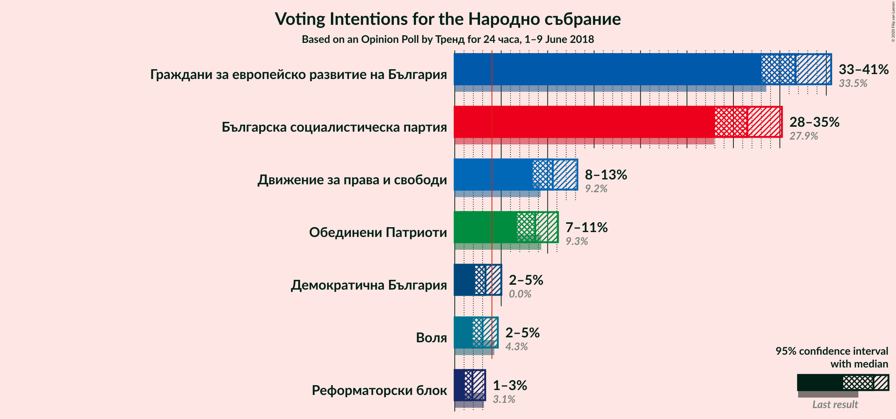
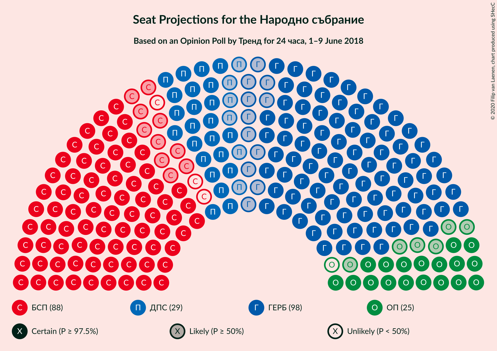
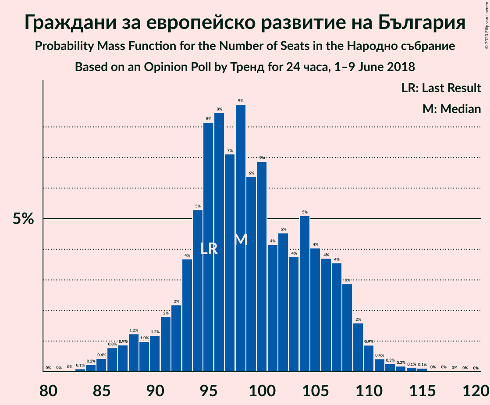
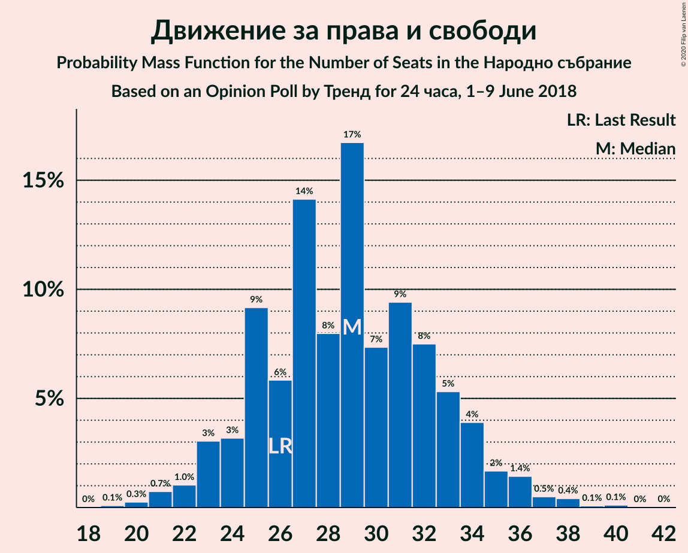
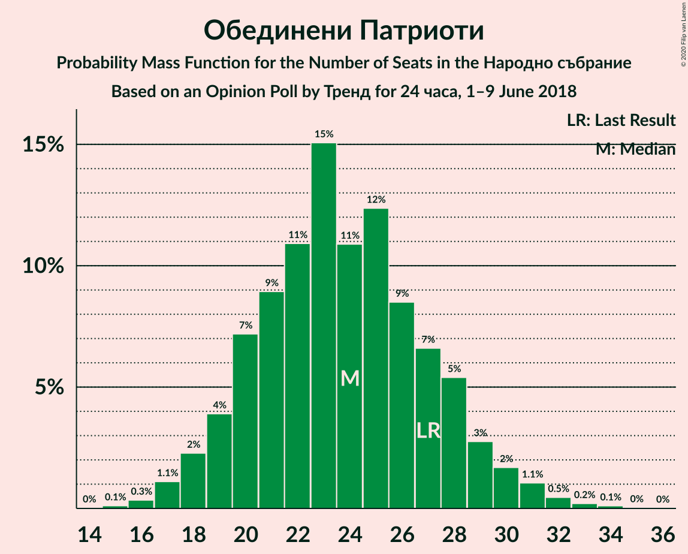
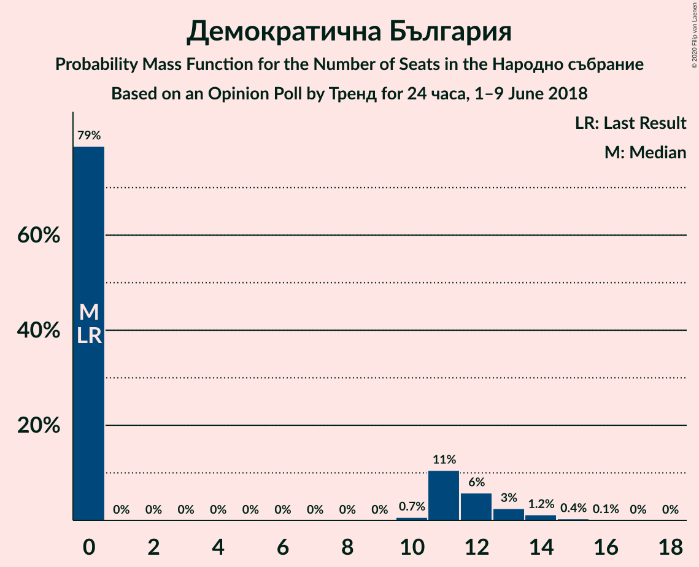
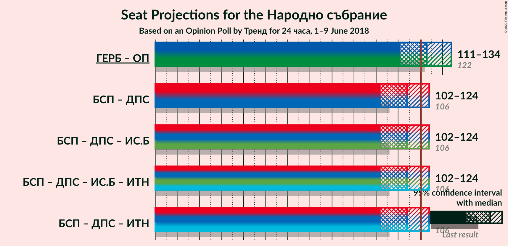
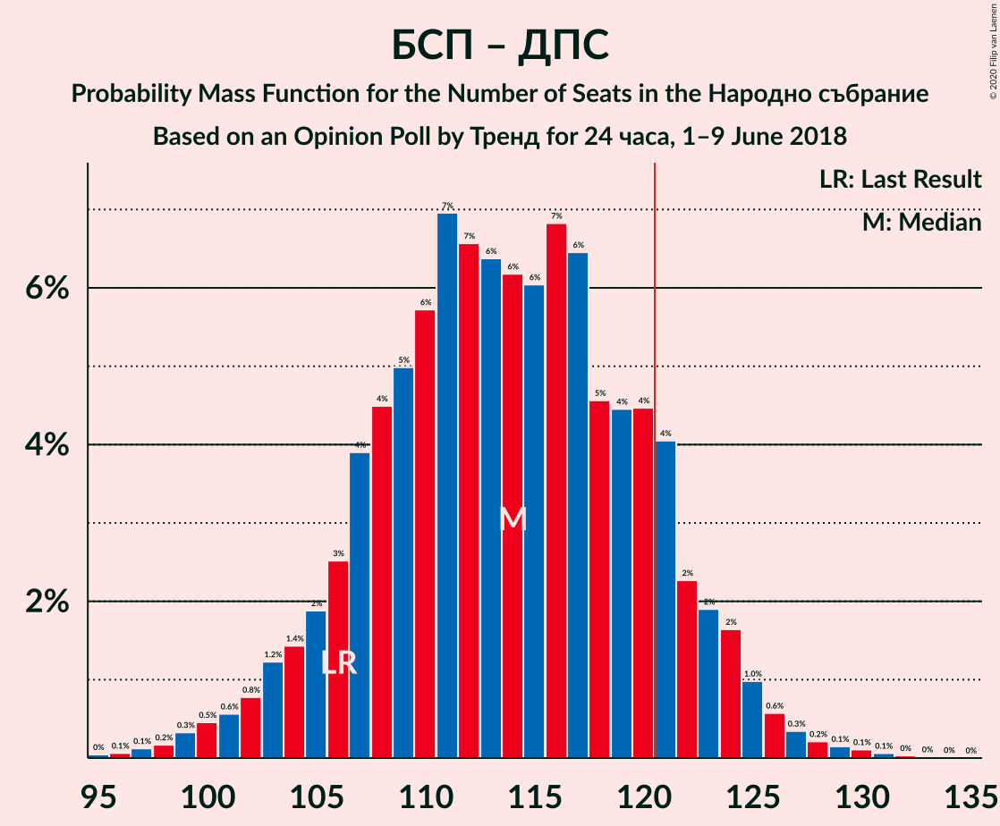

# Opinion Poll by Тренд for 24 часа, 1–9 June 2018

<a href="#voting-intentions">Voting Intentions</a> | <a href="#seats">Seats</a> | <a href="#coalitions">Coalitions</a> | <a href="#technical-information">Technical Information</a>

## Voting Intentions

### Confidence Intervals

| Party | Last Result | Poll Result | 80% Confidence Interval | 90% Confidence Interval | 95% Confidence Interval | 99% Confidence Interval |
|:-----:|:-----------:|:-----------:|:-----------------------:|:-----------------------:|:-----------------------:|:-----------------------:|
| Граждани за европейско развитие на България | 33.5% | 36.7% | 34.3–39.2% |33.6–39.9% |33.0–40.5% |31.9–41.7% |
| Българска социалистическа партия | 27.9% | 31.5% | 29.2–33.9% |28.5–34.6% |28.0–35.2% |26.9–36.4% |
| Движение за права и свободи | 9.2% | 10.6% | 9.1–12.3% |8.7–12.8% |8.4–13.2% |7.8–14.1% |
| Обединени Патриоти | 9.3% | 8.7% | 7.4–10.3% |7.0–10.7% |6.7–11.1% |6.1–11.9% |
| Демократична България | 0.0% | 3.3% | 2.6–4.4% |2.3–4.7% |2.2–5.0% |1.9–5.6% |
| Воля | 4.3% | 3.0% | 2.3–4.1% |2.1–4.4% |1.9–4.6% |1.6–5.2% |
| Реформаторски блок | 3.1% | 1.9% | 1.4–2.8% |1.2–3.0% |1.1–3.3% |0.9–3.8% |

*Note:* The poll result column reflects the actual value used in the calculations. Published results may vary slightly, and in addition be rounded to fewer digits.

## Seats

### Confidence Intervals

| Party | Last Result | Median | 80% Confidence Interval | 90% Confidence Interval | 95% Confidence Interval | 99% Confidence Interval |
|:-----:|:-----------:|:------:|:-----------------------:|:-----------------------:|:-----------------------:|:-----------------------:|
| <a href="#граждани-за-европейско-развитие-на-българия">Граждани за европейско развитие на България</a> | 95 | 98 | 93–107 |90–108 |87–109 |85–113 |
| <a href="#българска-социалистическа-партия">Българска социалистическа партия</a> | 80 | 85 | 78–92 |76–94 |75–95 |72–98 |
| <a href="#движение-за-права-и-свободи">Движение за права и свободи</a> | 26 | 29 | 25–33 |23–34 |23–36 |21–38 |
| <a href="#обединени-патриоти">Обединени Патриоти</a> | 27 | 24 | 20–28 |19–29 |18–30 |17–32 |
| <a href="#демократична-българия">Демократична България</a> | 0 | 0 | 0–12 |0–12 |0–13 |0–15 |
| <a href="#воля">Воля</a> | 12 | 0 | 0 |0–11 |0–12 |0–14 |
| <a href="#реформаторски-блок">Реформаторски блок</a> | 0 | 0 | 0 |0 |0 |0 |

### Граждани за европейско развитие на България

*For a full overview of the results for this party, see the [Граждани за европейско развитие на България](party-гражданизаевропейскоразвитиенабългария.html) page.*

| Number of Seats | Probability | Accumulated | Special Marks |
|:---------------:|:-----------:|:-----------:|:-------------:|
| 81 | 0% | 100% |  |
| 82 | 0% | 99.9% |  |
| 83 | 0.1% | 99.9% |  |
| 84 | 0.2% | 99.8% |  |
| 85 | 0.4% | 99.6% |  |
| 86 | 0.8% | 99.1% |  |
| 87 | 0.9% | 98% |  |
| 88 | 1.2% | 97% |  |
| 89 | 1.0% | 96% |  |
| 90 | 1.2% | 95% |  |
| 91 | 2% | 94% |  |
| 92 | 2% | 92% |  |
| 93 | 4% | 90% |  |
| 94 | 5% | 86% |  |
| 95 | 8% | 81% | Last Result |
| 96 | 8% | 73% |  |
| 97 | 7% | 64% |  |
| 98 | 9% | 57% | Median |
| 99 | 6% | 49% |  |
| 100 | 7% | 42% |  |
| 101 | 4% | 35% |  |
| 102 | 5% | 31% |  |
| 103 | 4% | 27% |  |
| 104 | 5% | 23% |  |
| 105 | 4% | 18% |  |
| 106 | 4% | 14% |  |
| 107 | 4% | 10% |  |
| 108 | 3% | 7% |  |
| 109 | 2% | 4% |  |
| 110 | 0.9% | 2% |  |
| 111 | 0.4% | 1.2% |  |
| 112 | 0.3% | 0.8% |  |
| 113 | 0.2% | 0.5% |  |
| 114 | 0.1% | 0.3% |  |
| 115 | 0.1% | 0.2% |  |
| 116 | 0% | 0.1% |  |
| 117 | 0% | 0.1% |  |
| 118 | 0% | 0% |  |

### Българска социалистическа партия

*For a full overview of the results for this party, see the [Българска социалистическа партия](party-българскасоциалистическапартия.html) page.*

| Number of Seats | Probability | Accumulated | Special Marks |
|:---------------:|:-----------:|:-----------:|:-------------:|
| 68 | 0% | 100% |  |
| 69 | 0.1% | 99.9% |  |
| 70 | 0.1% | 99.9% |  |
| 71 | 0.2% | 99.8% |  |
| 72 | 0.4% | 99.6% |  |
| 73 | 0.6% | 99.2% |  |
| 74 | 0.9% | 98.6% |  |
| 75 | 1.4% | 98% |  |
| 76 | 1.5% | 96% |  |
| 77 | 2% | 95% |  |
| 78 | 3% | 92% |  |
| 79 | 4% | 89% |  |
| 80 | 4% | 86% | Last Result |
| 81 | 6% | 81% |  |
| 82 | 8% | 76% |  |
| 83 | 7% | 68% |  |
| 84 | 8% | 61% |  |
| 85 | 8% | 53% | Median |
| 86 | 7% | 45% |  |
| 87 | 6% | 38% |  |
| 88 | 7% | 32% |  |
| 89 | 5% | 25% |  |
| 90 | 4% | 19% |  |
| 91 | 4% | 15% |  |
| 92 | 3% | 11% |  |
| 93 | 3% | 8% |  |
| 94 | 2% | 5% |  |
| 95 | 1.0% | 3% |  |
| 96 | 1.0% | 2% |  |
| 97 | 0.5% | 1.2% |  |
| 98 | 0.3% | 0.7% |  |
| 99 | 0.2% | 0.5% |  |
| 100 | 0.1% | 0.2% |  |
| 101 | 0.1% | 0.1% |  |
| 102 | 0% | 0.1% |  |
| 103 | 0% | 0% |  |

### Движение за права и свободи

*For a full overview of the results for this party, see the [Движение за права и свободи](party-движениезаправаисвободи.html) page.*

| Number of Seats | Probability | Accumulated | Special Marks |
|:---------------:|:-----------:|:-----------:|:-------------:|
| 19 | 0.1% | 100% |  |
| 20 | 0.3% | 99.9% |  |
| 21 | 0.7% | 99.6% |  |
| 22 | 1.0% | 98.9% |  |
| 23 | 3% | 98% |  |
| 24 | 3% | 95% |  |
| 25 | 9% | 92% |  |
| 26 | 6% | 82% | Last Result |
| 27 | 14% | 77% |  |
| 28 | 8% | 62% |  |
| 29 | 17% | 54% | Median |
| 30 | 7% | 38% |  |
| 31 | 9% | 30% |  |
| 32 | 8% | 21% |  |
| 33 | 5% | 13% |  |
| 34 | 4% | 8% |  |
| 35 | 2% | 4% |  |
| 36 | 1.4% | 3% |  |
| 37 | 0.5% | 1.2% |  |
| 38 | 0.4% | 0.7% |  |
| 39 | 0.1% | 0.2% |  |
| 40 | 0.1% | 0.2% |  |
| 41 | 0% | 0.1% |  |
| 42 | 0% | 0% |  |

### Обединени Патриоти

*For a full overview of the results for this party, see the [Обединени Патриоти](party-обединенипатриоти.html) page.*

| Number of Seats | Probability | Accumulated | Special Marks |
|:---------------:|:-----------:|:-----------:|:-------------:|
| 15 | 0.1% | 100% |  |
| 16 | 0.3% | 99.9% |  |
| 17 | 1.1% | 99.5% |  |
| 18 | 2% | 98% |  |
| 19 | 4% | 96% |  |
| 20 | 7% | 92% |  |
| 21 | 9% | 85% |  |
| 22 | 11% | 76% |  |
| 23 | 15% | 65% |  |
| 24 | 11% | 50% | Median |
| 25 | 12% | 39% |  |
| 26 | 9% | 27% |  |
| 27 | 7% | 18% | Last Result |
| 28 | 5% | 12% |  |
| 29 | 3% | 6% |  |
| 30 | 2% | 4% |  |
| 31 | 1.1% | 2% |  |
| 32 | 0.5% | 0.8% |  |
| 33 | 0.2% | 0.4% |  |
| 34 | 0.1% | 0.2% |  |
| 35 | 0% | 0.1% |  |
| 36 | 0% | 0% |  |

### Демократична България

*For a full overview of the results for this party, see the [Демократична България](party-демократичнабългария.html) page.*

| Number of Seats | Probability | Accumulated | Special Marks |
|:---------------:|:-----------:|:-----------:|:-------------:|
| 0 | 79% | 100% | Last Result, Median |
| 1 | 0% | 21% |  |
| 2 | 0% | 21% |  |
| 3 | 0% | 21% |  |
| 4 | 0% | 21% |  |
| 5 | 0% | 21% |  |
| 6 | 0% | 21% |  |
| 7 | 0% | 21% |  |
| 8 | 0% | 21% |  |
| 9 | 0% | 21% |  |
| 10 | 0.7% | 21% |  |
| 11 | 11% | 21% |  |
| 12 | 6% | 10% |  |
| 13 | 3% | 4% |  |
| 14 | 1.2% | 2% |  |
| 15 | 0.4% | 0.5% |  |
| 16 | 0.1% | 0.2% |  |
| 17 | 0% | 0% |  |

### Воля

*For a full overview of the results for this party, see the [Воля](party-воля.html) page.*

| Number of Seats | Probability | Accumulated | Special Marks |
|:---------------:|:-----------:|:-----------:|:-------------:|
| 0 | 90% | 100% | Median |
| 1 | 0% | 10% |  |
| 2 | 0% | 10% |  |
| 3 | 0% | 10% |  |
| 4 | 0% | 10% |  |
| 5 | 0% | 10% |  |
| 6 | 0% | 10% |  |
| 7 | 0% | 10% |  |
| 8 | 0% | 10% |  |
| 9 | 0% | 10% |  |
| 10 | 0.7% | 10% |  |
| 11 | 5% | 9% |  |
| 12 | 3% | 4% | Last Result |
| 13 | 1.0% | 2% |  |
| 14 | 0.4% | 0.6% |  |
| 15 | 0.1% | 0.2% |  |
| 16 | 0% | 0.1% |  |
| 17 | 0% | 0% |  |

### Реформаторски блок

*For a full overview of the results for this party, see the [Реформаторски блок](party-реформаторскиблок.html) page.*

| Number of Seats | Probability | Accumulated | Special Marks |
|:---------------:|:-----------:|:-----------:|:-------------:|
| 0 | 99.8% | 100% | Last Result, Median |
| 1 | 0% | 0.2% |  |
| 2 | 0% | 0.2% |  |
| 3 | 0% | 0.2% |  |
| 4 | 0% | 0.2% |  |
| 5 | 0% | 0.2% |  |
| 6 | 0% | 0.2% |  |
| 7 | 0% | 0.2% |  |
| 8 | 0% | 0.2% |  |
| 9 | 0% | 0.2% |  |
| 10 | 0% | 0.2% |  |
| 11 | 0.1% | 0.2% |  |
| 12 | 0% | 0.1% |  |
| 13 | 0% | 0% |  |

## Coalitions

### Confidence Intervals

| Coalition | Last Result | Median | Majority? | 80% Confidence Interval | 90% Confidence Interval | 95% Confidence Interval | 99% Confidence Interval |
|:---------:|:-----------:|:------:|:---------:|:-----------------------:|:-----------------------:|:-----------------------:|:-----------------------:|
| Граждани за европейско развитие на България – Обединени Патриоти | 122 | 123 | 63% | 115–130 | 113–132 | 111–134 | 107–137 |
| Българска социалистическа партия – Движение за права и свободи | 106 | 114 | 12% | 107–121 | 104–123 | 102–124 | 99–128 |

### Граждани за европейско развитие на България – Обединени Патриоти

| Number of Seats | Probability | Accumulated | Special Marks |
|:---------------:|:-----------:|:-----------:|:-------------:|
| 103 | 0% | 100% |  |
| 104 | 0.1% | 99.9% |  |
| 105 | 0.1% | 99.9% |  |
| 106 | 0.2% | 99.7% |  |
| 107 | 0.3% | 99.6% |  |
| 108 | 0.5% | 99.2% |  |
| 109 | 0.6% | 98.8% |  |
| 110 | 0.6% | 98% |  |
| 111 | 0.9% | 98% |  |
| 112 | 1.2% | 97% |  |
| 113 | 1.4% | 95% |  |
| 114 | 2% | 94% |  |
| 115 | 3% | 92% |  |
| 116 | 4% | 89% |  |
| 117 | 4% | 85% |  |
| 118 | 5% | 81% |  |
| 119 | 7% | 76% |  |
| 120 | 6% | 69% |  |
| 121 | 7% | 63% | Majority |
| 122 | 6% | 57% | Last Result, Median |
| 123 | 7% | 51% |  |
| 124 | 7% | 44% |  |
| 125 | 6% | 37% |  |
| 126 | 5% | 32% |  |
| 127 | 4% | 26% |  |
| 128 | 5% | 22% |  |
| 129 | 4% | 17% |  |
| 130 | 4% | 13% |  |
| 131 | 3% | 9% |  |
| 132 | 2% | 7% |  |
| 133 | 2% | 4% |  |
| 134 | 1.1% | 3% |  |
| 135 | 0.7% | 2% |  |
| 136 | 0.3% | 1.0% |  |
| 137 | 0.4% | 0.7% |  |
| 138 | 0.1% | 0.3% |  |
| 139 | 0.1% | 0.2% |  |
| 140 | 0% | 0.1% |  |
| 141 | 0% | 0.1% |  |
| 142 | 0% | 0% |  |

### Българска социалистическа партия – Движение за права и свободи

| Number of Seats | Probability | Accumulated | Special Marks |
|:---------------:|:-----------:|:-----------:|:-------------:|
| 95 | 0% | 100% |  |
| 96 | 0.1% | 99.9% |  |
| 97 | 0.1% | 99.8% |  |
| 98 | 0.2% | 99.7% |  |
| 99 | 0.3% | 99.6% |  |
| 100 | 0.5% | 99.2% |  |
| 101 | 0.6% | 98.8% |  |
| 102 | 0.8% | 98% |  |
| 103 | 1.2% | 97% |  |
| 104 | 1.4% | 96% |  |
| 105 | 2% | 95% |  |
| 106 | 3% | 93% | Last Result |
| 107 | 4% | 90% |  |
| 108 | 4% | 86% |  |
| 109 | 5% | 82% |  |
| 110 | 6% | 77% |  |
| 111 | 7% | 71% |  |
| 112 | 7% | 64% |  |
| 113 | 6% | 58% |  |
| 114 | 6% | 51% | Median |
| 115 | 6% | 45% |  |
| 116 | 7% | 39% |  |
| 117 | 6% | 32% |  |
| 118 | 5% | 26% |  |
| 119 | 4% | 21% |  |
| 120 | 4% | 17% |  |
| 121 | 4% | 12% | Majority |
| 122 | 2% | 8% |  |
| 123 | 2% | 6% |  |
| 124 | 2% | 4% |  |
| 125 | 1.0% | 2% |  |
| 126 | 0.6% | 2% |  |
| 127 | 0.3% | 0.9% |  |
| 128 | 0.2% | 0.6% |  |
| 129 | 0.1% | 0.4% |  |
| 130 | 0.1% | 0.2% |  |
| 131 | 0.1% | 0.1% |  |
| 132 | 0% | 0.1% |  |
| 133 | 0% | 0% |  |

## Technical Information

### Opinion Poll

+ **Polling firm:** Тренд
+ **Commissioner(s):** 24 часа
+ **Fieldwork period:** 1–9 June 2018

### Calculations

+ **Sample size:** 635
+ **Simulations done:** 1,048,576
+ **Error estimate:** 1.27%

