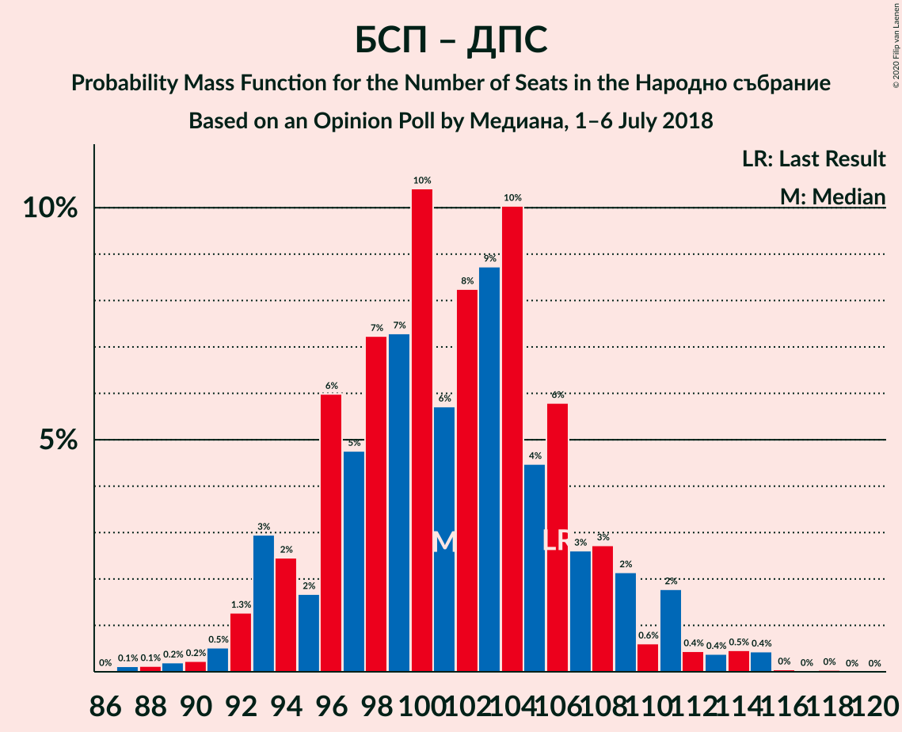

# Opinion Poll by Медиана, 1–6 July 2018

<a href="#voting-intentions">Voting Intentions</a> | <a href="#seats">Seats</a> | <a href="#coalitions">Coalitions</a> | <a href="#technical-information">Technical Information</a>

## Voting Intentions

### Confidence Intervals

| Party | Last Result | Poll Result | 80% Confidence Interval | 90% Confidence Interval | 95% Confidence Interval | 99% Confidence Interval |
|:-----:|:-----------:|:-----------:|:-----------------------:|:-----------------------:|:-----------------------:|:-----------------------:|
| Граждани за европейско развитие на България | 33.5% | 31.9% | 29.8–34.1% |29.3–34.8% |28.7–35.3% |27.8–36.4% |
| Българска социалистическа партия | 27.9% | 26.4% | 24.5–28.5% |23.9–29.1% |23.5–29.6% |22.6–30.7% |
| Обединени Патриоти | 9.3% | 12.5% | 11.1–14.2% |10.7–14.6% |10.4–15.0% |9.7–15.9% |
| Движение за права и свободи | 9.2% | 10.7% | 9.4–12.3% |9.1–12.7% |8.7–13.1% |8.2–13.9% |
| Има такъв народ | 0.0% | 6.0% | 5.0–7.2% |4.8–7.6% |4.5–7.9% |4.1–8.5% |
| Воля | 4.3% | 2.7% | 2.1–3.6% |1.9–3.8% |1.8–4.1% |1.5–4.5% |
| Алтернатива за българско възраждане | 1.6% | 2.4% | 1.8–3.3% |1.7–3.5% |1.6–3.8% |1.3–4.2% |
| Демократична България | 0.0% | 2.0% | 1.5–2.9% |1.4–3.1% |1.3–3.3% |1.1–3.7% |
| Реформаторски блок | 3.1% | 1.8% | 1.3–2.6% |1.2–2.8% |1.1–3.0% |0.9–3.4% |
| Демократи за силна България | 0.0% | 0.5% | 0.3–1.0% |0.2–1.2% |0.2–1.3% |0.1–1.6% |

*Note:* The poll result column reflects the actual value used in the calculations. Published results may vary slightly, and in addition be rounded to fewer digits.

## Seats

### Confidence Intervals

| Party | Last Result | Median | 80% Confidence Interval | 90% Confidence Interval | 95% Confidence Interval | 99% Confidence Interval |
|:-----:|:-----------:|:------:|:-----------------------:|:-----------------------:|:-----------------------:|:-----------------------:|
| <a href="#граждани-за-европейско-развитие-на-българия">Граждани за европейско развитие на България</a> | 95 | 88 | 81–93 |80–95 |78–96 |76–99 |
| <a href="#българска-социалистическа-партия">Българска социалистическа партия</a> | 80 | 72 | 67–77 |65–79 |63–80 |61–85 |
| <a href="#обединени-патриоти">Обединени Патриоти</a> | 27 | 34 | 31–39 |29–40 |28–40 |26–43 |
| <a href="#движение-за-права-и-свободи">Движение за права и свободи</a> | 26 | 30 | 26–33 |24–35 |24–35 |22–38 |
| <a href="#има-такъв-народ">Има такъв народ</a> | 0 | 16 | 13–20 |13–21 |12–22 |11–23 |
| <a href="#воля">Воля</a> | 12 | 0 | 0 |0 |0 |0–12 |
| <a href="#алтернатива-за-българско-възраждане">Алтернатива за българско възраждане</a> | 0 | 0 | 0 |0 |0 |0–11 |
| <a href="#демократична-българия">Демократична България</a> | 0 | 0 | 0 |0 |0 |0 |
| <a href="#реформаторски-блок">Реформаторски блок</a> | 0 | 0 | 0 |0 |0 |0 |
| <a href="#демократи-за-силна-българия">Демократи за силна България</a> | 0 | 0 | 0 |0 |0 |0 |

### Граждани за европейско развитие на България

*For a full overview of the results for this party, see the [Граждани за европейско развитие на България](party-гражданизаевропейскоразвитиенабългария.html) page.*

| Number of Seats | Probability | Accumulated | Special Marks |
|:---------------:|:-----------:|:-----------:|:-------------:|
| 73 | 0.1% | 100% |  |
| 74 | 0.1% | 99.9% |  |
| 75 | 0.2% | 99.8% |  |
| 76 | 0.5% | 99.5% |  |
| 77 | 0.5% | 99.0% |  |
| 78 | 2% | 98.5% |  |
| 79 | 1.3% | 97% |  |
| 80 | 1.1% | 95% |  |
| 81 | 5% | 94% |  |
| 82 | 5% | 90% |  |
| 83 | 3% | 85% |  |
| 84 | 8% | 82% |  |
| 85 | 10% | 74% |  |
| 86 | 8% | 64% |  |
| 87 | 5% | 55% |  |
| 88 | 5% | 50% | Median |
| 89 | 10% | 46% |  |
| 90 | 14% | 36% |  |
| 91 | 2% | 21% |  |
| 92 | 3% | 20% |  |
| 93 | 8% | 17% |  |
| 94 | 2% | 9% |  |
| 95 | 2% | 7% | Last Result |
| 96 | 3% | 5% |  |
| 97 | 1.1% | 2% |  |
| 98 | 0.4% | 0.9% |  |
| 99 | 0.2% | 0.5% |  |
| 100 | 0.2% | 0.4% |  |
| 101 | 0.1% | 0.2% |  |
| 102 | 0% | 0.1% |  |
| 103 | 0% | 0% |  |

### Българска социалистическа партия

*For a full overview of the results for this party, see the [Българска социалистическа партия](party-българскасоциалистическапартия.html) page.*

| Number of Seats | Probability | Accumulated | Special Marks |
|:---------------:|:-----------:|:-----------:|:-------------:|
| 58 | 0% | 100% |  |
| 59 | 0.1% | 99.9% |  |
| 60 | 0.1% | 99.8% |  |
| 61 | 0.8% | 99.7% |  |
| 62 | 0.7% | 99.0% |  |
| 63 | 1.0% | 98% |  |
| 64 | 1.1% | 97% |  |
| 65 | 1.2% | 96% |  |
| 66 | 4% | 95% |  |
| 67 | 6% | 91% |  |
| 68 | 12% | 85% |  |
| 69 | 6% | 73% |  |
| 70 | 7% | 67% |  |
| 71 | 4% | 59% |  |
| 72 | 16% | 56% | Median |
| 73 | 8% | 39% |  |
| 74 | 10% | 31% |  |
| 75 | 4% | 22% |  |
| 76 | 4% | 17% |  |
| 77 | 3% | 13% |  |
| 78 | 3% | 10% |  |
| 79 | 3% | 7% |  |
| 80 | 2% | 4% | Last Result |
| 81 | 1.1% | 2% |  |
| 82 | 0.4% | 1.4% |  |
| 83 | 0.2% | 1.0% |  |
| 84 | 0.2% | 0.8% |  |
| 85 | 0.4% | 0.6% |  |
| 86 | 0.1% | 0.2% |  |
| 87 | 0% | 0.1% |  |
| 88 | 0% | 0% |  |

### Обединени Патриоти

*For a full overview of the results for this party, see the [Обединени Патриоти](party-обединенипатриоти.html) page.*

| Number of Seats | Probability | Accumulated | Special Marks |
|:---------------:|:-----------:|:-----------:|:-------------:|
| 25 | 0.1% | 100% |  |
| 26 | 0.4% | 99.9% |  |
| 27 | 0.7% | 99.5% | Last Result |
| 28 | 2% | 98.8% |  |
| 29 | 2% | 96% |  |
| 30 | 4% | 95% |  |
| 31 | 17% | 90% |  |
| 32 | 13% | 73% |  |
| 33 | 6% | 61% |  |
| 34 | 8% | 55% | Median |
| 35 | 11% | 47% |  |
| 36 | 14% | 36% |  |
| 37 | 5% | 22% |  |
| 38 | 4% | 17% |  |
| 39 | 5% | 13% |  |
| 40 | 6% | 8% |  |
| 41 | 1.1% | 2% |  |
| 42 | 0.4% | 1.2% |  |
| 43 | 0.5% | 0.8% |  |
| 44 | 0.2% | 0.4% |  |
| 45 | 0.1% | 0.2% |  |
| 46 | 0% | 0.1% |  |
| 47 | 0% | 0% |  |

### Движение за права и свободи

*For a full overview of the results for this party, see the [Движение за права и свободи](party-движениезаправаисвободи.html) page.*

| Number of Seats | Probability | Accumulated | Special Marks |
|:---------------:|:-----------:|:-----------:|:-------------:|
| 20 | 0.1% | 100% |  |
| 21 | 0.1% | 99.9% |  |
| 22 | 0.4% | 99.7% |  |
| 23 | 1.2% | 99.3% |  |
| 24 | 5% | 98% |  |
| 25 | 3% | 93% |  |
| 26 | 4% | 90% | Last Result |
| 27 | 12% | 86% |  |
| 28 | 9% | 75% |  |
| 29 | 12% | 65% |  |
| 30 | 14% | 53% | Median |
| 31 | 7% | 39% |  |
| 32 | 18% | 32% |  |
| 33 | 5% | 13% |  |
| 34 | 3% | 8% |  |
| 35 | 3% | 5% |  |
| 36 | 1.0% | 2% |  |
| 37 | 0.5% | 1.2% |  |
| 38 | 0.3% | 0.8% |  |
| 39 | 0.3% | 0.4% |  |
| 40 | 0% | 0.1% |  |
| 41 | 0% | 0% |  |

### Има такъв народ

*For a full overview of the results for this party, see the [Има такъв народ](party-иматакъвнарод.html) page.*

| Number of Seats | Probability | Accumulated | Special Marks |
|:---------------:|:-----------:|:-----------:|:-------------:|
| 0 | 0.3% | 100% | Last Result |
| 1 | 0% | 99.7% |  |
| 2 | 0% | 99.7% |  |
| 3 | 0% | 99.7% |  |
| 4 | 0% | 99.7% |  |
| 5 | 0% | 99.7% |  |
| 6 | 0% | 99.7% |  |
| 7 | 0% | 99.7% |  |
| 8 | 0% | 99.7% |  |
| 9 | 0% | 99.7% |  |
| 10 | 0% | 99.7% |  |
| 11 | 0.2% | 99.7% |  |
| 12 | 3% | 99.5% |  |
| 13 | 8% | 97% |  |
| 14 | 9% | 89% |  |
| 15 | 17% | 80% |  |
| 16 | 18% | 63% | Median |
| 17 | 13% | 45% |  |
| 18 | 6% | 32% |  |
| 19 | 8% | 27% |  |
| 20 | 9% | 19% |  |
| 21 | 7% | 10% |  |
| 22 | 3% | 3% |  |
| 23 | 0.3% | 0.7% |  |
| 24 | 0.2% | 0.3% |  |
| 25 | 0.1% | 0.1% |  |
| 26 | 0% | 0% |  |

### Воля

*For a full overview of the results for this party, see the [Воля](party-воля.html) page.*

| Number of Seats | Probability | Accumulated | Special Marks |
|:---------------:|:-----------:|:-----------:|:-------------:|
| 0 | 98% | 100% | Median |
| 1 | 0% | 2% |  |
| 2 | 0% | 2% |  |
| 3 | 0% | 2% |  |
| 4 | 0% | 2% |  |
| 5 | 0% | 2% |  |
| 6 | 0% | 2% |  |
| 7 | 0% | 2% |  |
| 8 | 0% | 2% |  |
| 9 | 0% | 2% |  |
| 10 | 0% | 2% |  |
| 11 | 2% | 2% |  |
| 12 | 0.6% | 1.0% | Last Result |
| 13 | 0.1% | 0.3% |  |
| 14 | 0.2% | 0.2% |  |
| 15 | 0% | 0% |  |

### Алтернатива за българско възраждане

*For a full overview of the results for this party, see the [Алтернатива за българско възраждане](party-алтернативазабългарсковъзраждане.html) page.*

| Number of Seats | Probability | Accumulated | Special Marks |
|:---------------:|:-----------:|:-----------:|:-------------:|
| 0 | 98.7% | 100% | Last Result, Median |
| 1 | 0% | 1.3% |  |
| 2 | 0% | 1.3% |  |
| 3 | 0% | 1.3% |  |
| 4 | 0% | 1.3% |  |
| 5 | 0% | 1.3% |  |
| 6 | 0% | 1.3% |  |
| 7 | 0% | 1.3% |  |
| 8 | 0% | 1.3% |  |
| 9 | 0% | 1.3% |  |
| 10 | 0% | 1.3% |  |
| 11 | 0.9% | 1.3% |  |
| 12 | 0.4% | 0.4% |  |
| 13 | 0% | 0.1% |  |
| 14 | 0% | 0% |  |

### Демократична България

*For a full overview of the results for this party, see the [Демократична България](party-демократичнабългария.html) page.*

| Number of Seats | Probability | Accumulated | Special Marks |
|:---------------:|:-----------:|:-----------:|:-------------:|
| 0 | 99.9% | 100% | Last Result, Median |
| 1 | 0% | 0.1% |  |
| 2 | 0% | 0.1% |  |
| 3 | 0% | 0.1% |  |
| 4 | 0% | 0.1% |  |
| 5 | 0% | 0.1% |  |
| 6 | 0% | 0.1% |  |
| 7 | 0% | 0.1% |  |
| 8 | 0% | 0.1% |  |
| 9 | 0% | 0.1% |  |
| 10 | 0% | 0.1% |  |
| 11 | 0.1% | 0.1% |  |
| 12 | 0.1% | 0.1% |  |
| 13 | 0% | 0% |  |

### Реформаторски блок

*For a full overview of the results for this party, see the [Реформаторски блок](party-реформаторскиблок.html) page.*

| Number of Seats | Probability | Accumulated | Special Marks |
|:---------------:|:-----------:|:-----------:|:-------------:|
| 0 | 100% | 100% | Last Result, Median |

### Демократи за силна България

*For a full overview of the results for this party, see the [Демократи за силна България](party-демократизасилнабългария.html) page.*

| Number of Seats | Probability | Accumulated | Special Marks |
|:---------------:|:-----------:|:-----------:|:-------------:|
| 0 | 100% | 100% | Last Result, Median |

## Coalitions

### Confidence Intervals

| Coalition | Last Result | Median | Majority? | 80% Confidence Interval | 90% Confidence Interval | 95% Confidence Interval | 99% Confidence Interval |
|:---------:|:-----------:|:------:|:---------:|:-----------------------:|:-----------------------:|:-----------------------:|:-----------------------:|
| Граждани за европейско развитие на България – Обединени Патриоти | 122 | 121 | 67% | 115–128 | 114–130 | 112–131 | 109–134 |
| Българска социалистическа партия – Движение за права и свободи – Има такъв народ | 106 | 119 | 26% | 112–124 | 110–126 | 109–128 | 106–130 |
| Българска социалистическа партия – Движение за права и свободи | 106 | 101 | 0% | 96–107 | 93–109 | 92–111 | 90–115 |

### Граждани за европейско развитие на България – Обединени Патриоти

| Number of Seats | Probability | Accumulated | Special Marks |
|:---------------:|:-----------:|:-----------:|:-------------:|
| 105 | 0% | 100% |  |
| 106 | 0% | 99.9% |  |
| 107 | 0.1% | 99.9% |  |
| 108 | 0.1% | 99.8% |  |
| 109 | 0.3% | 99.7% |  |
| 110 | 0.8% | 99.4% |  |
| 111 | 1.1% | 98.6% |  |
| 112 | 0.9% | 98% |  |
| 113 | 1.1% | 97% |  |
| 114 | 3% | 96% |  |
| 115 | 3% | 93% |  |
| 116 | 3% | 90% |  |
| 117 | 3% | 87% |  |
| 118 | 8% | 83% |  |
| 119 | 5% | 76% |  |
| 120 | 4% | 71% |  |
| 121 | 24% | 67% | Majority |
| 122 | 5% | 44% | Last Result, Median |
| 123 | 5% | 39% |  |
| 124 | 10% | 34% |  |
| 125 | 5% | 24% |  |
| 126 | 2% | 19% |  |
| 127 | 3% | 17% |  |
| 128 | 5% | 13% |  |
| 129 | 2% | 9% |  |
| 130 | 4% | 6% |  |
| 131 | 1.0% | 3% |  |
| 132 | 0.9% | 2% |  |
| 133 | 0.2% | 0.7% |  |
| 134 | 0.2% | 0.5% |  |
| 135 | 0.1% | 0.3% |  |
| 136 | 0.1% | 0.2% |  |
| 137 | 0% | 0.1% |  |
| 138 | 0% | 0.1% |  |
| 139 | 0% | 0% |  |

### Българска социалистическа партия – Движение за права и свободи – Има такъв народ

| Number of Seats | Probability | Accumulated | Special Marks |
|:---------------:|:-----------:|:-----------:|:-------------:|
| 101 | 0% | 100% |  |
| 102 | 0% | 99.9% |  |
| 103 | 0.1% | 99.9% |  |
| 104 | 0.2% | 99.8% |  |
| 105 | 0.2% | 99.7% |  |
| 106 | 0.3% | 99.5% | Last Result |
| 107 | 0.2% | 99.2% |  |
| 108 | 1.0% | 99.0% |  |
| 109 | 1.1% | 98% |  |
| 110 | 4% | 97% |  |
| 111 | 3% | 93% |  |
| 112 | 5% | 90% |  |
| 113 | 4% | 85% |  |
| 114 | 3% | 81% |  |
| 115 | 5% | 78% |  |
| 116 | 10% | 73% |  |
| 117 | 5% | 63% |  |
| 118 | 5% | 58% | Median |
| 119 | 24% | 53% |  |
| 120 | 4% | 29% |  |
| 121 | 5% | 26% | Majority |
| 122 | 7% | 21% |  |
| 123 | 3% | 14% |  |
| 124 | 2% | 11% |  |
| 125 | 3% | 8% |  |
| 126 | 2% | 6% |  |
| 127 | 0.9% | 3% |  |
| 128 | 0.8% | 3% |  |
| 129 | 0.8% | 2% |  |
| 130 | 0.6% | 1.0% |  |
| 131 | 0.2% | 0.3% |  |
| 132 | 0.1% | 0.2% |  |
| 133 | 0.1% | 0.1% |  |
| 134 | 0% | 0% |  |

### Българска социалистическа партия – Движение за права и свободи

| Number of Seats | Probability | Accumulated | Special Marks |
|:---------------:|:-----------:|:-----------:|:-------------:|
| 87 | 0.1% | 100% |  |
| 88 | 0.1% | 99.8% |  |
| 89 | 0.2% | 99.7% |  |
| 90 | 0.2% | 99.5% |  |
| 91 | 0.5% | 99.3% |  |
| 92 | 1.3% | 98.8% |  |
| 93 | 3% | 97% |  |
| 94 | 2% | 95% |  |
| 95 | 2% | 92% |  |
| 96 | 6% | 90% |  |
| 97 | 5% | 84% |  |
| 98 | 7% | 80% |  |
| 99 | 7% | 72% |  |
| 100 | 10% | 65% |  |
| 101 | 6% | 55% |  |
| 102 | 8% | 49% | Median |
| 103 | 9% | 41% |  |
| 104 | 10% | 32% |  |
| 105 | 4% | 22% |  |
| 106 | 6% | 18% | Last Result |
| 107 | 3% | 12% |  |
| 108 | 3% | 9% |  |
| 109 | 2% | 6% |  |
| 110 | 0.6% | 4% |  |
| 111 | 2% | 4% |  |
| 112 | 0.4% | 2% |  |
| 113 | 0.4% | 1.4% |  |
| 114 | 0.5% | 1.0% |  |
| 115 | 0.4% | 0.6% |  |
| 116 | 0% | 0.1% |  |
| 117 | 0% | 0.1% |  |
| 118 | 0% | 0.1% |  |
| 119 | 0% | 0% |  |

## Technical Information

### Opinion Poll

+ **Polling firm:** Медиана
+ **Commissioner(s):** —
+ **Fieldwork period:** 1–6 July 2018

### Calculations

+ **Sample size:** 783
+ **Simulations done:** 1,048,576
+ **Error estimate:** 2.15%

