# Opinion Poll by Sova Harris for БГНЕС, 8–14 September 2018

<a href="#voting-intentions">Voting Intentions</a> | <a href="#seats">Seats</a> | <a href="#coalitions">Coalitions</a> | <a href="#technical-information">Technical Information</a>

## Voting Intentions

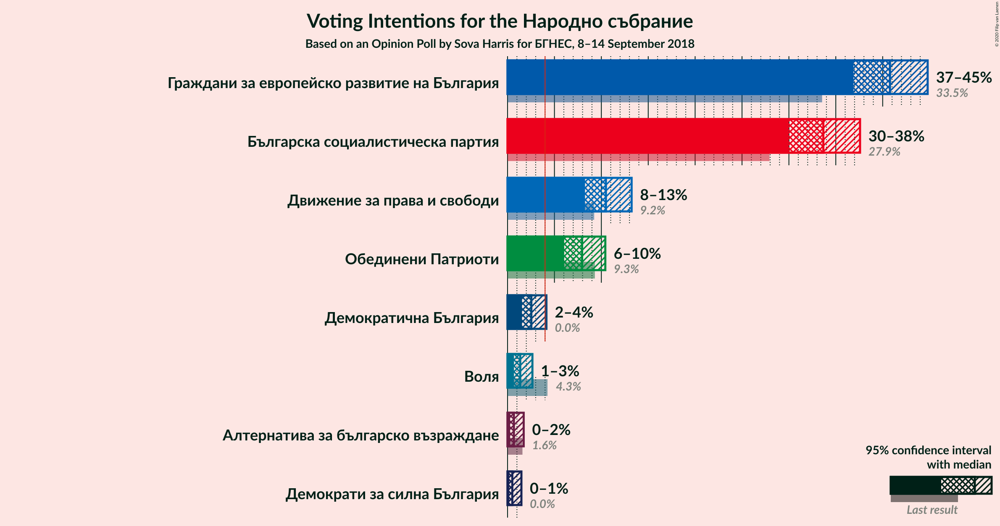

### Confidence Intervals

| Party | Last Result | Poll Result | 80% Confidence Interval | 90% Confidence Interval | 95% Confidence Interval | 99% Confidence Interval |
|:-----:|:-----------:|:-----------:|:-----------------------:|:-----------------------:|:-----------------------:|:-----------------------:|
| Граждани за европейско развитие на България | 33.5% | 40.8% | 38.2–43.4% |37.5–44.2% |36.9–44.8% |35.7–46.1% |
| Българска социалистическа партия | 27.9% | 33.7% | 31.2–36.2% |30.6–37.0% |30.0–37.6% |28.8–38.8% |
| Движение за права и свободи | 9.2% | 10.5% | 9.0–12.3% |8.6–12.8% |8.3–13.2% |7.6–14.1% |
| Обединени Патриоти | 9.3% | 8.0% | 6.7–9.6% |6.3–10.0% |6.0–10.4% |5.5–11.2% |
| Демократична България | 0.0% | 2.5% | 1.9–3.6% |1.7–3.9% |1.5–4.1% |1.3–4.7% |
| Воля | 4.3% | 1.4% | 0.9–2.2% |0.8–2.4% |0.7–2.7% |0.5–3.1% |
| Алтернатива за българско възраждане | 1.6% | 0.7% | 0.4–1.4% |0.3–1.5% |0.3–1.7% |0.2–2.1% |
| Демократи за силна България | 0.0% | 0.5% | 0.3–1.1% |0.2–1.3% |0.2–1.5% |0.1–1.8% |

*Note:* The poll result column reflects the actual value used in the calculations. Published results may vary slightly, and in addition be rounded to fewer digits.

## Seats

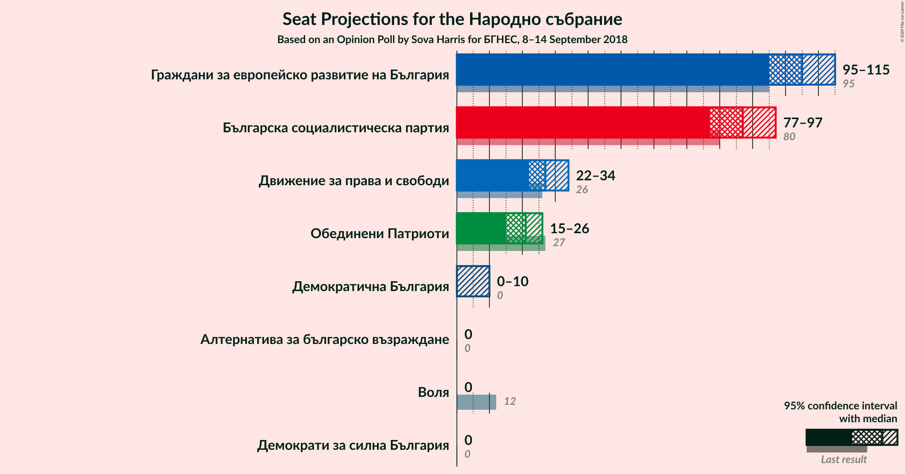

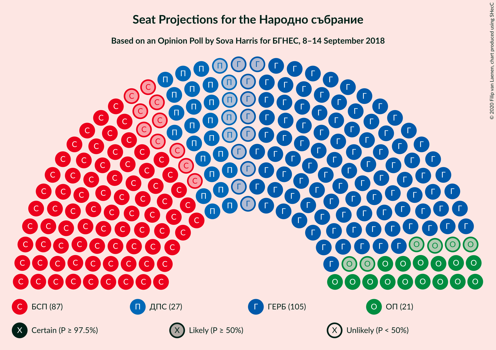

### Confidence Intervals

| Party | Last Result | Median | 80% Confidence Interval | 90% Confidence Interval | 95% Confidence Interval | 99% Confidence Interval |
|:-----:|:-----------:|:------:|:-----------------------:|:-----------------------:|:-----------------------:|:-----------------------:|
| <a href="#граждани-за-европейско-развитие-на-българия">Граждани за европейско развитие на България</a> | 95 | 105 | 98–112 |96–113 |95–115 |91–118 |
| <a href="#българска-социалистическа-партия">Българска социалистическа партия</a> | 80 | 87 | 81–94 |79–95 |77–97 |74–99 |
| <a href="#движение-за-права-и-свободи">Движение за права и свободи</a> | 26 | 27 | 23–31 |22–33 |22–34 |20–36 |
| <a href="#обединени-патриоти">Обединени Патриоти</a> | 27 | 21 | 17–24 |17–26 |15–26 |14–29 |
| <a href="#демократична-българия">Демократична България</a> | 0 | 0 | 0 |0 |0–10 |0–12 |
| <a href="#воля">Воля</a> | 12 | 0 | 0 |0 |0 |0 |
| <a href="#алтернатива-за-българско-възраждане">Алтернатива за българско възраждане</a> | 0 | 0 | 0 |0 |0 |0 |
| <a href="#демократи-за-силна-българия">Демократи за силна България</a> | 0 | 0 | 0 |0 |0 |0 |

### Граждани за европейско развитие на България

*For a full overview of the results for this party, see the [Граждани за европейско развитие на България](party-гражданизаевропейскоразвитиенабългария.html) page.*

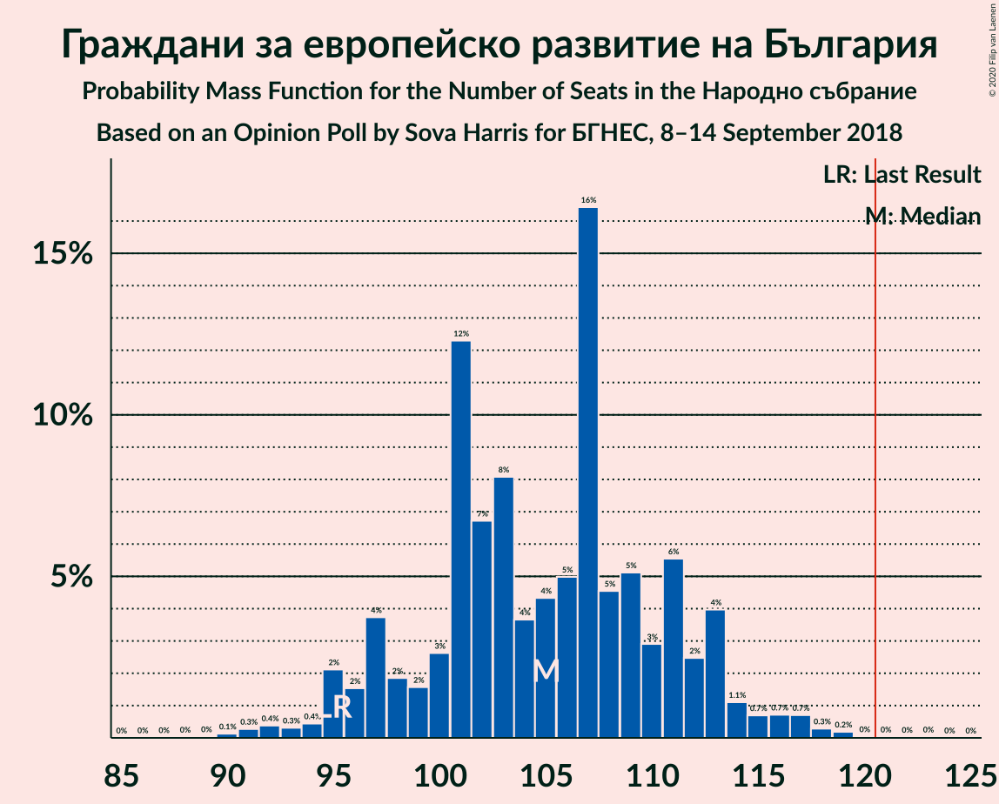

| Number of Seats | Probability | Accumulated | Special Marks |
|:---------------:|:-----------:|:-----------:|:-------------:|
| 88 | 0% | 100% |  |
| 89 | 0% | 99.9% |  |
| 90 | 0.1% | 99.9% |  |
| 91 | 0.3% | 99.8% |  |
| 92 | 0.4% | 99.5% |  |
| 93 | 0.3% | 99.1% |  |
| 94 | 0.4% | 98.8% |  |
| 95 | 2% | 98% | Last Result |
| 96 | 2% | 96% |  |
| 97 | 4% | 95% |  |
| 98 | 2% | 91% |  |
| 99 | 2% | 89% |  |
| 100 | 3% | 88% |  |
| 101 | 12% | 85% |  |
| 102 | 7% | 73% |  |
| 103 | 8% | 66% |  |
| 104 | 4% | 58% |  |
| 105 | 4% | 54% | Median |
| 106 | 5% | 50% |  |
| 107 | 16% | 45% |  |
| 108 | 5% | 28% |  |
| 109 | 5% | 24% |  |
| 110 | 3% | 19% |  |
| 111 | 6% | 16% |  |
| 112 | 2% | 10% |  |
| 113 | 4% | 8% |  |
| 114 | 1.1% | 4% |  |
| 115 | 0.7% | 3% |  |
| 116 | 0.7% | 2% |  |
| 117 | 0.7% | 1.3% |  |
| 118 | 0.3% | 0.6% |  |
| 119 | 0.2% | 0.3% |  |
| 120 | 0% | 0.1% |  |
| 121 | 0% | 0.1% | Majority |
| 122 | 0% | 0.1% |  |
| 123 | 0% | 0% |  |

### Българска социалистическа партия

*For a full overview of the results for this party, see the [Българска социалистическа партия](party-българскасоциалистическапартия.html) page.*

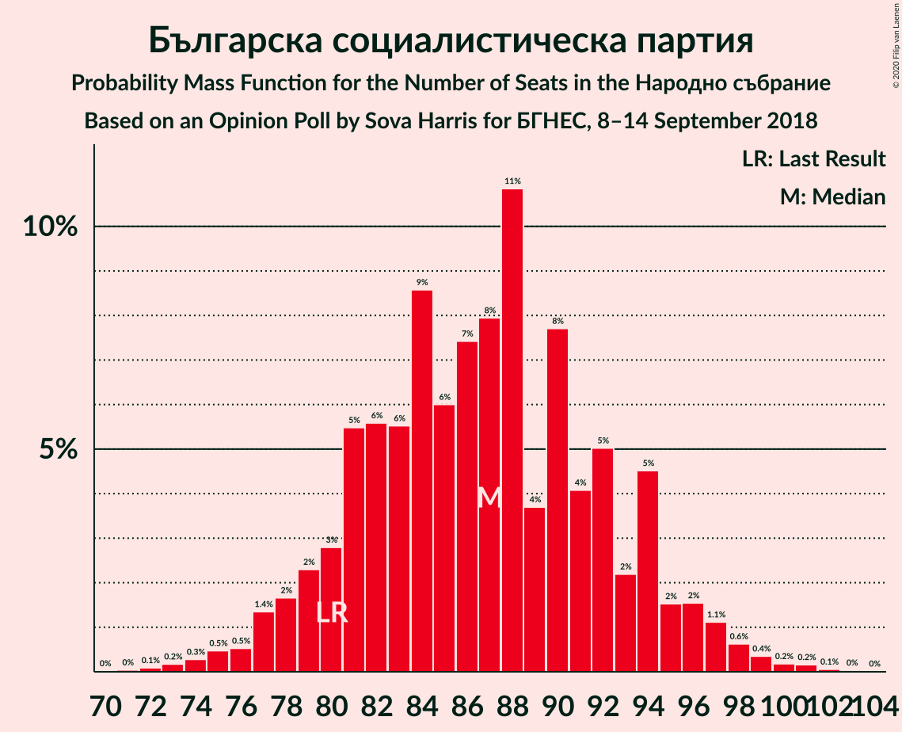

| Number of Seats | Probability | Accumulated | Special Marks |
|:---------------:|:-----------:|:-----------:|:-------------:|
| 71 | 0% | 100% |  |
| 72 | 0.1% | 99.9% |  |
| 73 | 0.2% | 99.8% |  |
| 74 | 0.3% | 99.7% |  |
| 75 | 0.5% | 99.4% |  |
| 76 | 0.5% | 98.9% |  |
| 77 | 1.4% | 98% |  |
| 78 | 2% | 97% |  |
| 79 | 2% | 95% |  |
| 80 | 3% | 93% | Last Result |
| 81 | 5% | 90% |  |
| 82 | 6% | 85% |  |
| 83 | 6% | 79% |  |
| 84 | 9% | 74% |  |
| 85 | 6% | 65% |  |
| 86 | 7% | 59% |  |
| 87 | 8% | 52% | Median |
| 88 | 11% | 44% |  |
| 89 | 4% | 33% |  |
| 90 | 8% | 29% |  |
| 91 | 4% | 21% |  |
| 92 | 5% | 17% |  |
| 93 | 2% | 12% |  |
| 94 | 5% | 10% |  |
| 95 | 2% | 6% |  |
| 96 | 2% | 4% |  |
| 97 | 1.1% | 3% |  |
| 98 | 0.6% | 1.5% |  |
| 99 | 0.4% | 0.8% |  |
| 100 | 0.2% | 0.5% |  |
| 101 | 0.2% | 0.3% |  |
| 102 | 0.1% | 0.1% |  |
| 103 | 0% | 0.1% |  |
| 104 | 0% | 0% |  |

### Движение за права и свободи

*For a full overview of the results for this party, see the [Движение за права и свободи](party-движениезаправаисвободи.html) page.*

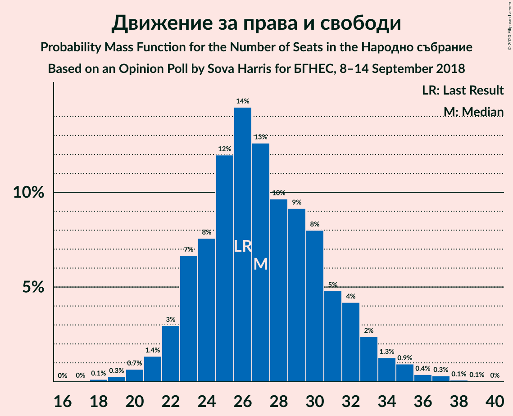

| Number of Seats | Probability | Accumulated | Special Marks |
|:---------------:|:-----------:|:-----------:|:-------------:|
| 18 | 0.1% | 100% |  |
| 19 | 0.3% | 99.8% |  |
| 20 | 0.7% | 99.6% |  |
| 21 | 1.4% | 98.9% |  |
| 22 | 3% | 98% |  |
| 23 | 7% | 95% |  |
| 24 | 8% | 88% |  |
| 25 | 12% | 80% |  |
| 26 | 14% | 68% | Last Result |
| 27 | 13% | 54% | Median |
| 28 | 10% | 41% |  |
| 29 | 9% | 32% |  |
| 30 | 8% | 22% |  |
| 31 | 5% | 14% |  |
| 32 | 4% | 10% |  |
| 33 | 2% | 5% |  |
| 34 | 1.3% | 3% |  |
| 35 | 0.9% | 2% |  |
| 36 | 0.4% | 0.9% |  |
| 37 | 0.3% | 0.5% |  |
| 38 | 0.1% | 0.2% |  |
| 39 | 0.1% | 0.1% |  |
| 40 | 0% | 0% |  |

### Обединени Патриоти

*For a full overview of the results for this party, see the [Обединени Патриоти](party-обединенипатриоти.html) page.*

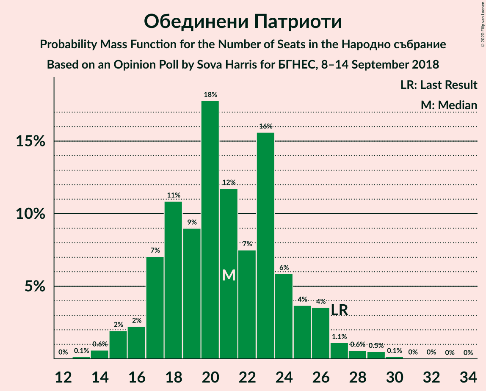

| Number of Seats | Probability | Accumulated | Special Marks |
|:---------------:|:-----------:|:-----------:|:-------------:|
| 12 | 0% | 100% |  |
| 13 | 0.1% | 99.9% |  |
| 14 | 0.6% | 99.8% |  |
| 15 | 2% | 99.2% |  |
| 16 | 2% | 97% |  |
| 17 | 7% | 95% |  |
| 18 | 11% | 88% |  |
| 19 | 9% | 77% |  |
| 20 | 18% | 68% |  |
| 21 | 12% | 50% | Median |
| 22 | 7% | 39% |  |
| 23 | 16% | 31% |  |
| 24 | 6% | 16% |  |
| 25 | 4% | 10% |  |
| 26 | 4% | 6% |  |
| 27 | 1.1% | 2% | Last Result |
| 28 | 0.6% | 1.3% |  |
| 29 | 0.5% | 0.7% |  |
| 30 | 0.1% | 0.3% |  |
| 31 | 0% | 0.1% |  |
| 32 | 0% | 0.1% |  |
| 33 | 0% | 0% |  |

### Демократична България

*For a full overview of the results for this party, see the [Демократична България](party-демократичнабългария.html) page.*

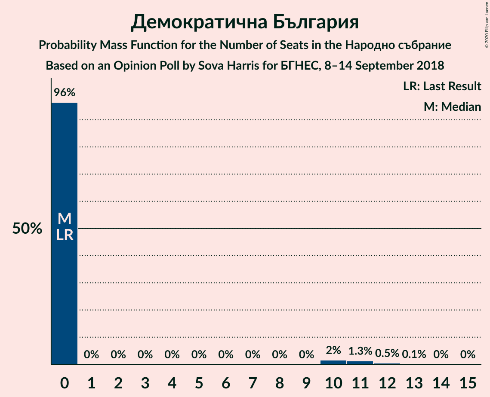

| Number of Seats | Probability | Accumulated | Special Marks |
|:---------------:|:-----------:|:-----------:|:-------------:|
| 0 | 96% | 100% | Last Result, Median |
| 1 | 0% | 4% |  |
| 2 | 0% | 4% |  |
| 3 | 0% | 4% |  |
| 4 | 0% | 4% |  |
| 5 | 0% | 4% |  |
| 6 | 0% | 4% |  |
| 7 | 0% | 4% |  |
| 8 | 0% | 4% |  |
| 9 | 0% | 4% |  |
| 10 | 2% | 4% |  |
| 11 | 1.3% | 2% |  |
| 12 | 0.5% | 0.7% |  |
| 13 | 0.1% | 0.2% |  |
| 14 | 0% | 0.1% |  |
| 15 | 0% | 0% |  |

### Воля

*For a full overview of the results for this party, see the [Воля](party-воля.html) page.*

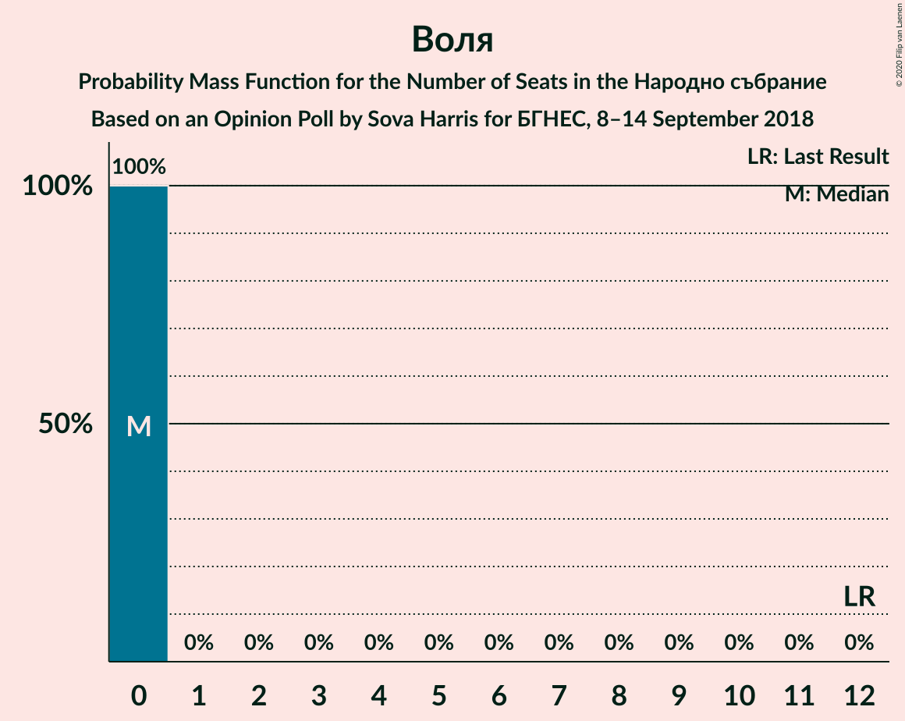

| Number of Seats | Probability | Accumulated | Special Marks |
|:---------------:|:-----------:|:-----------:|:-------------:|
| 0 | 100% | 100% | Median |
| 1 | 0% | 0% |  |
| 2 | 0% | 0% |  |
| 3 | 0% | 0% |  |
| 4 | 0% | 0% |  |
| 5 | 0% | 0% |  |
| 6 | 0% | 0% |  |
| 7 | 0% | 0% |  |
| 8 | 0% | 0% |  |
| 9 | 0% | 0% |  |
| 10 | 0% | 0% |  |
| 11 | 0% | 0% |  |
| 12 | 0% | 0% | Last Result |

### Алтернатива за българско възраждане

*For a full overview of the results for this party, see the [Алтернатива за българско възраждане](party-алтернативазабългарсковъзраждане.html) page.*

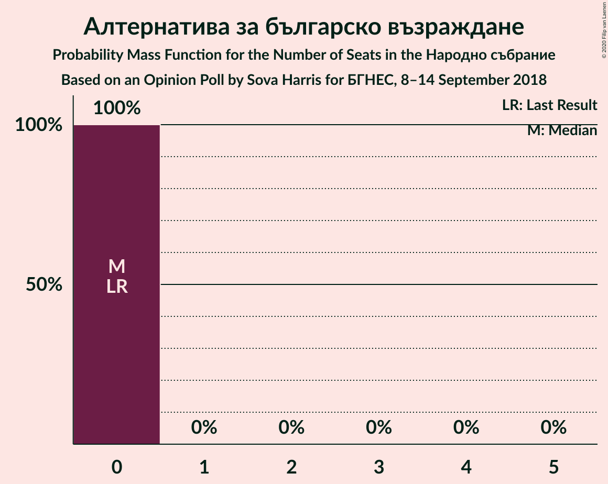

| Number of Seats | Probability | Accumulated | Special Marks |
|:---------------:|:-----------:|:-----------:|:-------------:|
| 0 | 100% | 100% | Last Result, Median |

### Демократи за силна България

*For a full overview of the results for this party, see the [Демократи за силна България](party-демократизасилнабългария.html) page.*

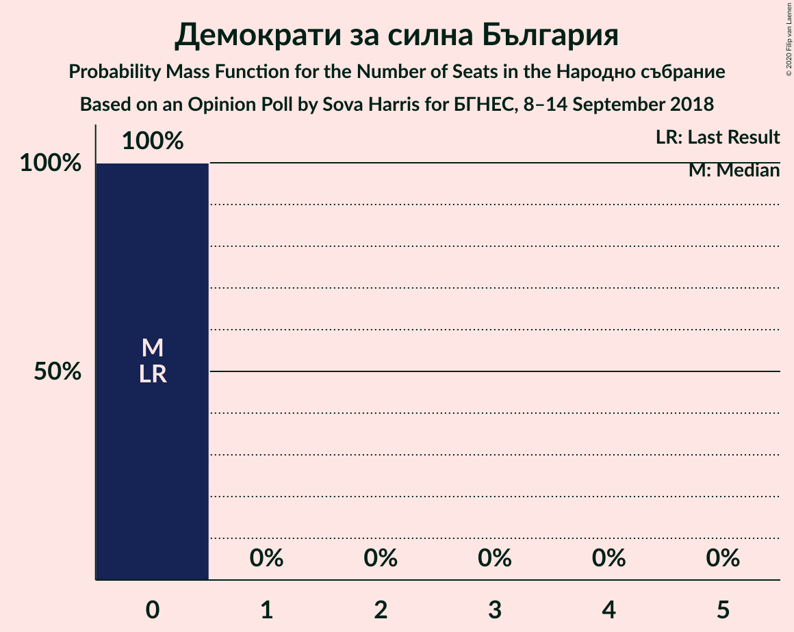

| Number of Seats | Probability | Accumulated | Special Marks |
|:---------------:|:-----------:|:-----------:|:-------------:|
| 0 | 100% | 100% | Last Result, Median |

## Coalitions

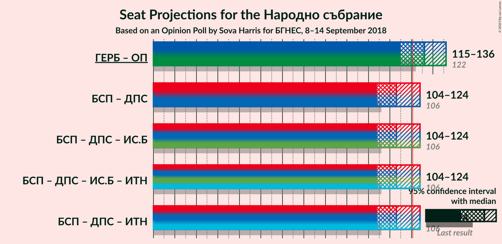

### Confidence Intervals

| Coalition | Last Result | Median | Majority? | 80% Confidence Interval | 90% Confidence Interval | 95% Confidence Interval | 99% Confidence Interval |
|:---------:|:-----------:|:------:|:---------:|:-----------------------:|:-----------------------:|:-----------------------:|:-----------------------:|
| Граждани за европейско развитие на България – Обединени Патриоти | 122 | 126 | 83% | 119–133 | 117–134 | 115–136 | 112–139 |
| Българска социалистическа партия – Движение за права и свободи | 106 | 113 | 13% | 107–121 | 105–122 | 104–124 | 101–127 |

### Граждани за европейско развитие на България – Обединени Патриоти

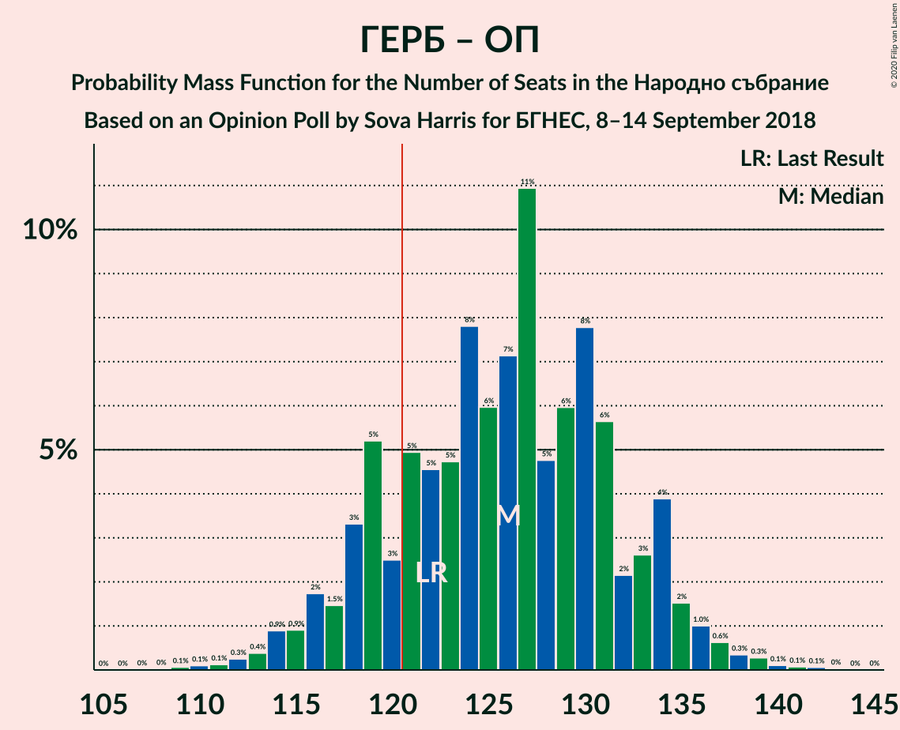

| Number of Seats | Probability | Accumulated | Special Marks |
|:---------------:|:-----------:|:-----------:|:-------------:|
| 108 | 0% | 100% |  |
| 109 | 0.1% | 99.9% |  |
| 110 | 0.1% | 99.9% |  |
| 111 | 0.1% | 99.8% |  |
| 112 | 0.3% | 99.7% |  |
| 113 | 0.4% | 99.4% |  |
| 114 | 0.9% | 99.0% |  |
| 115 | 0.9% | 98% |  |
| 116 | 2% | 97% |  |
| 117 | 1.5% | 95% |  |
| 118 | 3% | 94% |  |
| 119 | 5% | 91% |  |
| 120 | 3% | 85% |  |
| 121 | 5% | 83% | Majority |
| 122 | 5% | 78% | Last Result |
| 123 | 5% | 73% |  |
| 124 | 8% | 69% |  |
| 125 | 6% | 61% |  |
| 126 | 7% | 55% | Median |
| 127 | 11% | 48% |  |
| 128 | 5% | 37% |  |
| 129 | 6% | 32% |  |
| 130 | 8% | 26% |  |
| 131 | 6% | 18% |  |
| 132 | 2% | 13% |  |
| 133 | 3% | 11% |  |
| 134 | 4% | 8% |  |
| 135 | 2% | 4% |  |
| 136 | 1.0% | 3% |  |
| 137 | 0.6% | 2% |  |
| 138 | 0.3% | 0.9% |  |
| 139 | 0.3% | 0.6% |  |
| 140 | 0.1% | 0.3% |  |
| 141 | 0.1% | 0.2% |  |
| 142 | 0.1% | 0.1% |  |
| 143 | 0% | 0.1% |  |
| 144 | 0% | 0% |  |

### Българска социалистическа партия – Движение за права и свободи

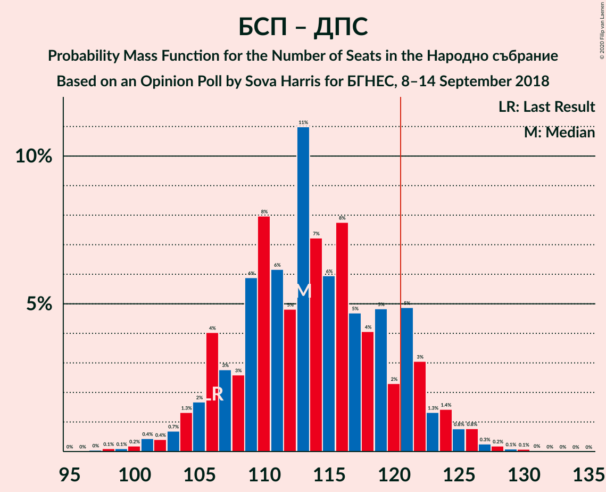

| Number of Seats | Probability | Accumulated | Special Marks |
|:---------------:|:-----------:|:-----------:|:-------------:|
| 97 | 0% | 100% |  |
| 98 | 0.1% | 99.9% |  |
| 99 | 0.1% | 99.8% |  |
| 100 | 0.2% | 99.7% |  |
| 101 | 0.4% | 99.5% |  |
| 102 | 0.4% | 99.1% |  |
| 103 | 0.7% | 98.7% |  |
| 104 | 1.3% | 98% |  |
| 105 | 2% | 97% |  |
| 106 | 4% | 95% | Last Result |
| 107 | 3% | 91% |  |
| 108 | 3% | 88% |  |
| 109 | 6% | 86% |  |
| 110 | 8% | 80% |  |
| 111 | 6% | 72% |  |
| 112 | 5% | 66% |  |
| 113 | 11% | 61% |  |
| 114 | 7% | 50% | Median |
| 115 | 6% | 43% |  |
| 116 | 8% | 37% |  |
| 117 | 5% | 29% |  |
| 118 | 4% | 24% |  |
| 119 | 5% | 20% |  |
| 120 | 2% | 15% |  |
| 121 | 5% | 13% | Majority |
| 122 | 3% | 8% |  |
| 123 | 1.3% | 5% |  |
| 124 | 1.4% | 4% |  |
| 125 | 0.8% | 2% |  |
| 126 | 0.8% | 1.5% |  |
| 127 | 0.3% | 0.7% |  |
| 128 | 0.2% | 0.4% |  |
| 129 | 0.1% | 0.2% |  |
| 130 | 0.1% | 0.1% |  |
| 131 | 0% | 0.1% |  |
| 132 | 0% | 0% |  |

## Technical Information

### Opinion Poll

+ **Polling firm:** Sova Harris
+ **Commissioner(s):** БГНЕС
+ **Fieldwork period:** 8–14 September 2018

### Calculations

+ **Sample size:** 591
+ **Simulations done:** 1,048,576
+ **Error estimate:** 2.67%

