# Opinion Poll by Тренд for 24 часа, 10–17 January 2019

<a href="#voting-intentions">Voting Intentions</a> | <a href="#seats">Seats</a> | <a href="#coalitions">Coalitions</a> | <a href="#technical-information">Technical Information</a>

## Voting Intentions

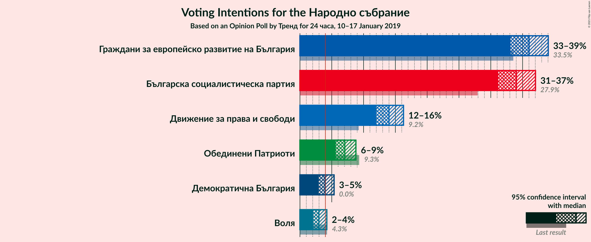

### Confidence Intervals

| Party | Last Result | Poll Result | 80% Confidence Interval | 90% Confidence Interval | 95% Confidence Interval | 99% Confidence Interval |
|:-----:|:-----------:|:-----------:|:-----------------------:|:-----------------------:|:-----------------------:|:-----------------------:|
| Граждани за европейско развитие на България | 33.5% | 36.0% | 34.1–38.0% |33.6–38.5% |33.1–39.0% |32.2–40.0% |
| Българска социалистическа партия | 27.9% | 34.0% | 32.1–36.0% |31.6–36.5% |31.2–37.0% |30.3–38.0% |
| Движение за права и свободи | 9.2% | 14.0% | 12.7–15.5% |12.3–15.9% |12.0–16.3% |11.4–17.0% |
| Обединени Патриоти | 9.3% | 7.0% | 6.1–8.2% |5.8–8.5% |5.6–8.8% |5.2–9.4% |
| Демократична България | 0.0% | 4.0% | 3.3–4.9% |3.1–5.1% |2.9–5.4% |2.6–5.8% |
| Воля | 4.3% | 3.0% | 2.4–3.8% |2.2–4.0% |2.1–4.2% |1.8–4.6% |

*Note:* The poll result column reflects the actual value used in the calculations. Published results may vary slightly, and in addition be rounded to fewer digits.

## Seats

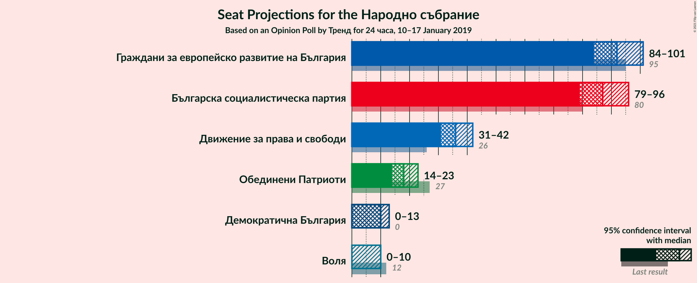

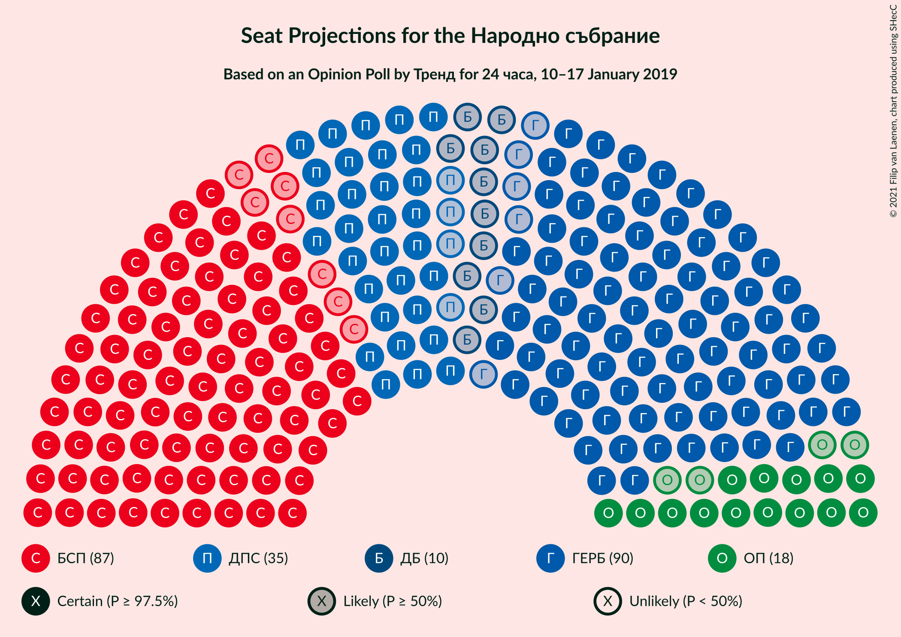

### Confidence Intervals

| Party | Last Result | Median | 80% Confidence Interval | 90% Confidence Interval | 95% Confidence Interval | 99% Confidence Interval |
|:-----:|:-----------:|:------:|:-----------------------:|:-----------------------:|:-----------------------:|:-----------------------:|
| <a href="#граждани-за-европейско-развитие-на-българия">Граждани за европейско развитие на България</a> | 95 | 92 | 87–98 |85–100 |84–101 |81–104 |
| <a href="#българска-социалистическа-партия">Българска социалистическа партия</a> | 80 | 87 | 82–93 |80–94 |79–96 |76–99 |
| <a href="#движение-за-права-и-свободи">Движение за права и свободи</a> | 26 | 36 | 32–40 |31–41 |31–42 |29–44 |
| <a href="#обединени-патриоти">Обединени Патриоти</a> | 27 | 18 | 16–21 |15–22 |14–23 |13–24 |
| <a href="#демократична-българия">Демократична България</a> | 0 | 10 | 0–12 |0–13 |0–13 |0–15 |
| <a href="#воля">Воля</a> | 12 | 0 | 0 |0 |0–10 |0–12 |

### Граждани за европейско развитие на България

*For a full overview of the results for this party, see the [Граждани за европейско развитие на България](party-гражданизаевропейскоразвитиенабългария.html) page.*

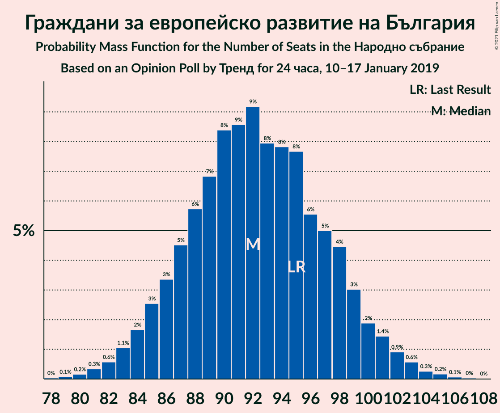

| Number of Seats | Probability | Accumulated | Special Marks |
|:---------------:|:-----------:|:-----------:|:-------------:|
| 78 | 0% | 100% |  |
| 79 | 0.1% | 99.9% |  |
| 80 | 0.2% | 99.9% |  |
| 81 | 0.3% | 99.7% |  |
| 82 | 0.6% | 99.3% |  |
| 83 | 1.1% | 98.8% |  |
| 84 | 2% | 98% |  |
| 85 | 3% | 96% |  |
| 86 | 3% | 93% |  |
| 87 | 5% | 90% |  |
| 88 | 6% | 86% |  |
| 89 | 7% | 80% |  |
| 90 | 8% | 73% |  |
| 91 | 9% | 65% |  |
| 92 | 9% | 56% | Median |
| 93 | 8% | 47% |  |
| 94 | 8% | 39% |  |
| 95 | 8% | 31% | Last Result |
| 96 | 6% | 23% |  |
| 97 | 5% | 18% |  |
| 98 | 4% | 13% |  |
| 99 | 3% | 8% |  |
| 100 | 2% | 5% |  |
| 101 | 1.4% | 4% |  |
| 102 | 0.9% | 2% |  |
| 103 | 0.6% | 1.1% |  |
| 104 | 0.3% | 0.6% |  |
| 105 | 0.2% | 0.3% |  |
| 106 | 0.1% | 0.1% |  |
| 107 | 0% | 0.1% |  |
| 108 | 0% | 0% |  |

### Българска социалистическа партия

*For a full overview of the results for this party, see the [Българска социалистическа партия](party-българскасоциалистическапартия.html) page.*

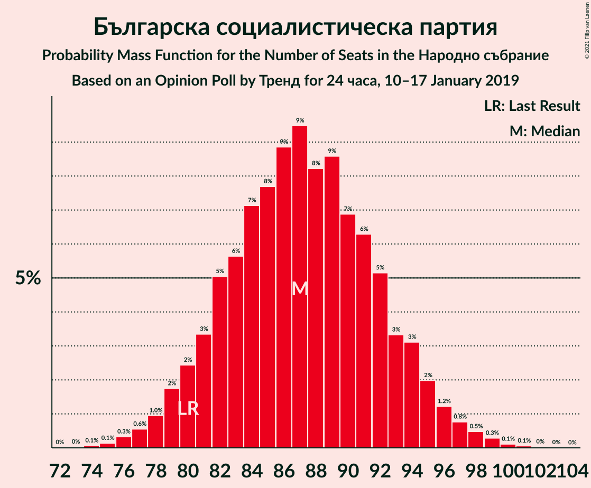

| Number of Seats | Probability | Accumulated | Special Marks |
|:---------------:|:-----------:|:-----------:|:-------------:|
| 73 | 0% | 100% |  |
| 74 | 0.1% | 99.9% |  |
| 75 | 0.1% | 99.9% |  |
| 76 | 0.3% | 99.7% |  |
| 77 | 0.6% | 99.4% |  |
| 78 | 1.0% | 98.9% |  |
| 79 | 2% | 98% |  |
| 80 | 2% | 96% | Last Result |
| 81 | 3% | 94% |  |
| 82 | 5% | 90% |  |
| 83 | 6% | 85% |  |
| 84 | 7% | 80% |  |
| 85 | 8% | 73% |  |
| 86 | 9% | 65% |  |
| 87 | 9% | 56% | Median |
| 88 | 8% | 47% |  |
| 89 | 9% | 38% |  |
| 90 | 7% | 30% |  |
| 91 | 6% | 23% |  |
| 92 | 5% | 17% |  |
| 93 | 3% | 11% |  |
| 94 | 3% | 8% |  |
| 95 | 2% | 5% |  |
| 96 | 1.2% | 3% |  |
| 97 | 0.8% | 2% |  |
| 98 | 0.5% | 1.0% |  |
| 99 | 0.3% | 0.5% |  |
| 100 | 0.1% | 0.2% |  |
| 101 | 0.1% | 0.1% |  |
| 102 | 0% | 0.1% |  |
| 103 | 0% | 0% |  |

### Движение за права и свободи

*For a full overview of the results for this party, see the [Движение за права и свободи](party-движениезаправаисвободи.html) page.*

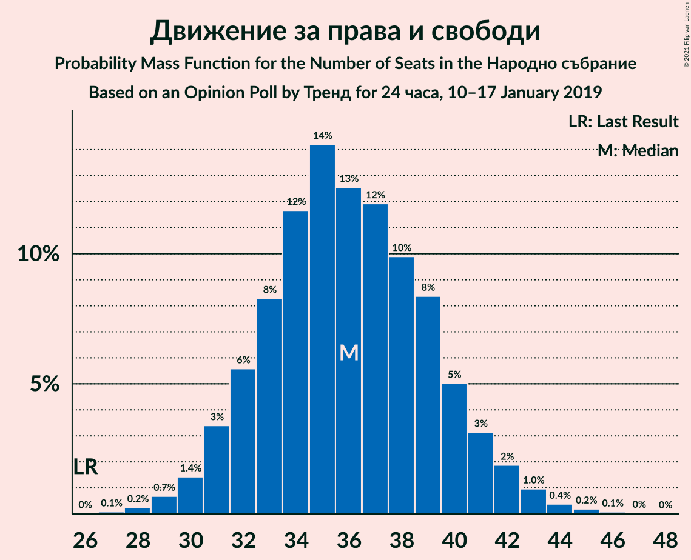

| Number of Seats | Probability | Accumulated | Special Marks |
|:---------------:|:-----------:|:-----------:|:-------------:|
| 26 | 0% | 100% | Last Result |
| 27 | 0.1% | 100% |  |
| 28 | 0.2% | 99.9% |  |
| 29 | 0.7% | 99.7% |  |
| 30 | 1.4% | 99.0% |  |
| 31 | 3% | 98% |  |
| 32 | 6% | 94% |  |
| 33 | 8% | 89% |  |
| 34 | 12% | 80% |  |
| 35 | 14% | 69% |  |
| 36 | 13% | 54% | Median |
| 37 | 12% | 42% |  |
| 38 | 10% | 30% |  |
| 39 | 8% | 20% |  |
| 40 | 5% | 12% |  |
| 41 | 3% | 7% |  |
| 42 | 2% | 4% |  |
| 43 | 1.0% | 2% |  |
| 44 | 0.4% | 0.7% |  |
| 45 | 0.2% | 0.3% |  |
| 46 | 0.1% | 0.1% |  |
| 47 | 0% | 0% |  |

### Обединени Патриоти

*For a full overview of the results for this party, see the [Обединени Патриоти](party-обединенипатриоти.html) page.*

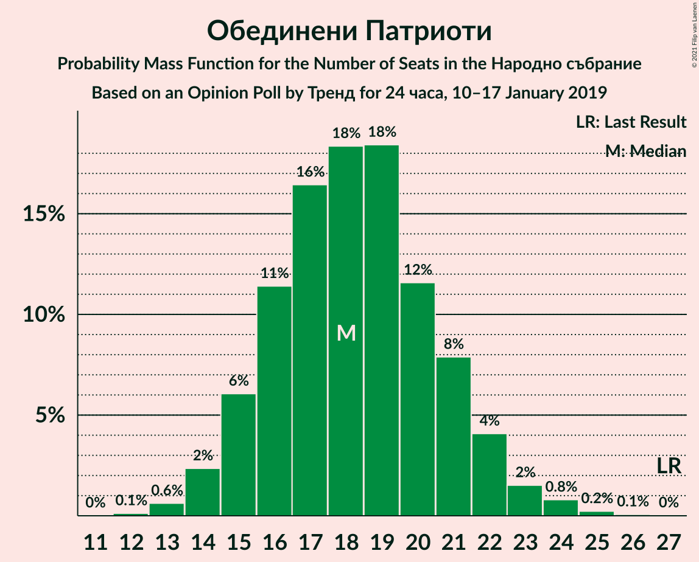

| Number of Seats | Probability | Accumulated | Special Marks |
|:---------------:|:-----------:|:-----------:|:-------------:|
| 12 | 0.1% | 100% |  |
| 13 | 0.6% | 99.9% |  |
| 14 | 2% | 99.2% |  |
| 15 | 6% | 97% |  |
| 16 | 11% | 91% |  |
| 17 | 16% | 79% |  |
| 18 | 18% | 63% | Median |
| 19 | 18% | 45% |  |
| 20 | 12% | 26% |  |
| 21 | 8% | 15% |  |
| 22 | 4% | 7% |  |
| 23 | 2% | 3% |  |
| 24 | 0.8% | 1.1% |  |
| 25 | 0.2% | 0.3% |  |
| 26 | 0.1% | 0.1% |  |
| 27 | 0% | 0% | Last Result |

### Демократична България

*For a full overview of the results for this party, see the [Демократична България](party-демократичнабългария.html) page.*

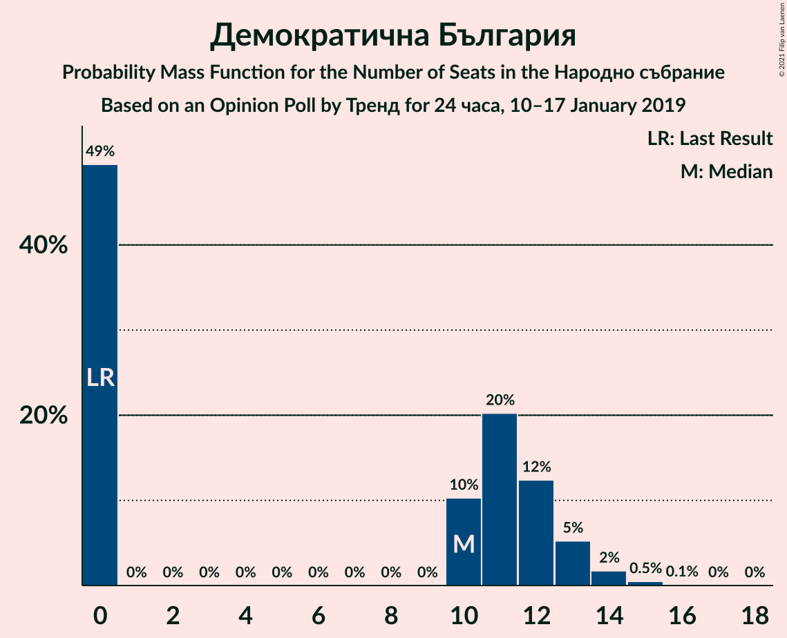

| Number of Seats | Probability | Accumulated | Special Marks |
|:---------------:|:-----------:|:-----------:|:-------------:|
| 0 | 49% | 100% | Last Result |
| 1 | 0% | 51% |  |
| 2 | 0% | 51% |  |
| 3 | 0% | 51% |  |
| 4 | 0% | 51% |  |
| 5 | 0% | 51% |  |
| 6 | 0% | 51% |  |
| 7 | 0% | 51% |  |
| 8 | 0% | 51% |  |
| 9 | 0% | 51% |  |
| 10 | 10% | 51% | Median |
| 11 | 20% | 40% |  |
| 12 | 12% | 20% |  |
| 13 | 5% | 8% |  |
| 14 | 2% | 2% |  |
| 15 | 0.5% | 0.6% |  |
| 16 | 0.1% | 0.1% |  |
| 17 | 0% | 0% |  |

### Воля

*For a full overview of the results for this party, see the [Воля](party-воля.html) page.*

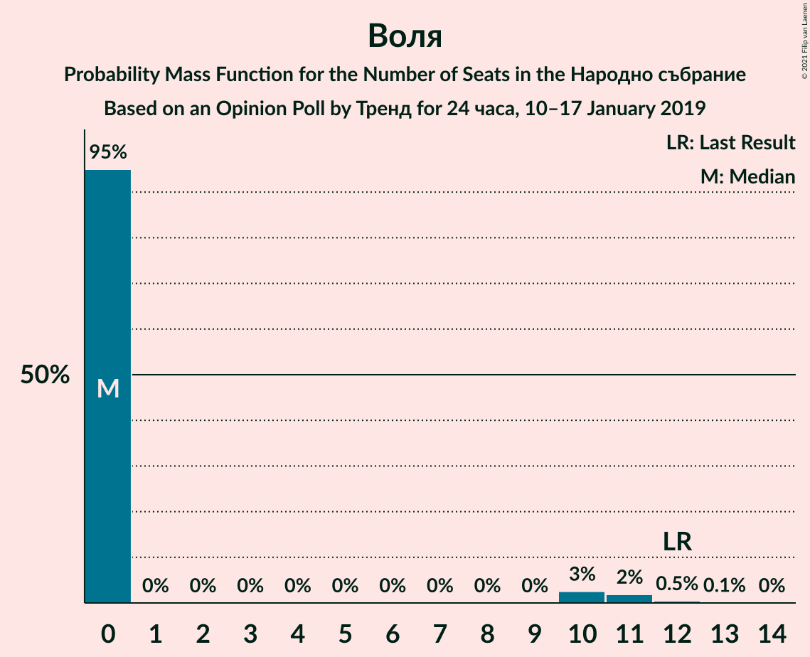

| Number of Seats | Probability | Accumulated | Special Marks |
|:---------------:|:-----------:|:-----------:|:-------------:|
| 0 | 95% | 100% | Median |
| 1 | 0% | 5% |  |
| 2 | 0% | 5% |  |
| 3 | 0% | 5% |  |
| 4 | 0% | 5% |  |
| 5 | 0% | 5% |  |
| 6 | 0% | 5% |  |
| 7 | 0% | 5% |  |
| 8 | 0% | 5% |  |
| 9 | 0% | 5% |  |
| 10 | 3% | 5% |  |
| 11 | 2% | 2% |  |
| 12 | 0.5% | 0.6% | Last Result |
| 13 | 0.1% | 0.1% |  |
| 14 | 0% | 0% |  |

## Coalitions

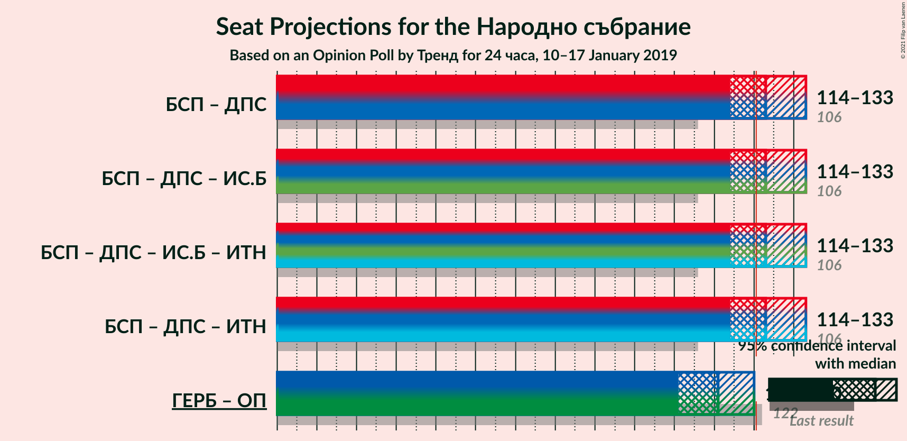

### Confidence Intervals

| Coalition | Last Result | Median | Majority? | 80% Confidence Interval | 90% Confidence Interval | 95% Confidence Interval | 99% Confidence Interval |
|:---------:|:-----------:|:------:|:---------:|:-----------------------:|:-----------------------:|:-----------------------:|:-----------------------:|
| Българска социалистическа партия – Движение за права и свободи | 106 | 123 | 70% | 117–130 | 115–131 | 114–133 | 111–136 |
| Граждани за европейско развитие на България – Обединени Патриоти | 122 | 111 | 2% | 104–117 | 103–118 | 101–120 | 98–123 |

### Българска социалистическа партия – Движение за права и свободи

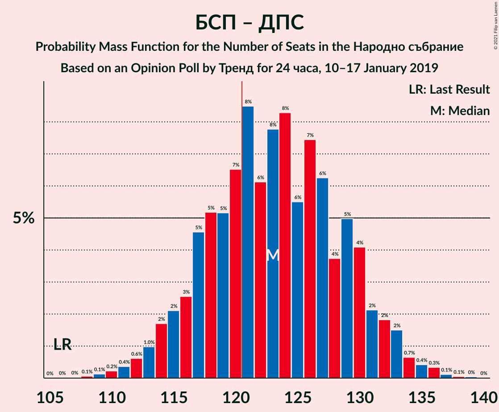

| Number of Seats | Probability | Accumulated | Special Marks |
|:---------------:|:-----------:|:-----------:|:-------------:|
| 106 | 0% | 100% | Last Result |
| 107 | 0% | 100% |  |
| 108 | 0.1% | 99.9% |  |
| 109 | 0.1% | 99.9% |  |
| 110 | 0.2% | 99.8% |  |
| 111 | 0.4% | 99.5% |  |
| 112 | 0.6% | 99.2% |  |
| 113 | 1.0% | 98.6% |  |
| 114 | 2% | 98% |  |
| 115 | 2% | 96% |  |
| 116 | 3% | 94% |  |
| 117 | 5% | 91% |  |
| 118 | 5% | 87% |  |
| 119 | 5% | 81% |  |
| 120 | 7% | 76% |  |
| 121 | 8% | 70% | Majority |
| 122 | 6% | 61% |  |
| 123 | 8% | 55% | Median |
| 124 | 8% | 47% |  |
| 125 | 6% | 39% |  |
| 126 | 7% | 34% |  |
| 127 | 6% | 26% |  |
| 128 | 4% | 20% |  |
| 129 | 5% | 16% |  |
| 130 | 4% | 11% |  |
| 131 | 2% | 7% |  |
| 132 | 2% | 5% |  |
| 133 | 2% | 3% |  |
| 134 | 0.7% | 2% |  |
| 135 | 0.4% | 1.0% |  |
| 136 | 0.3% | 0.6% |  |
| 137 | 0.1% | 0.2% |  |
| 138 | 0.1% | 0.1% |  |
| 139 | 0% | 0.1% |  |
| 140 | 0% | 0% |  |

### Граждани за европейско развитие на България – Обединени Патриоти

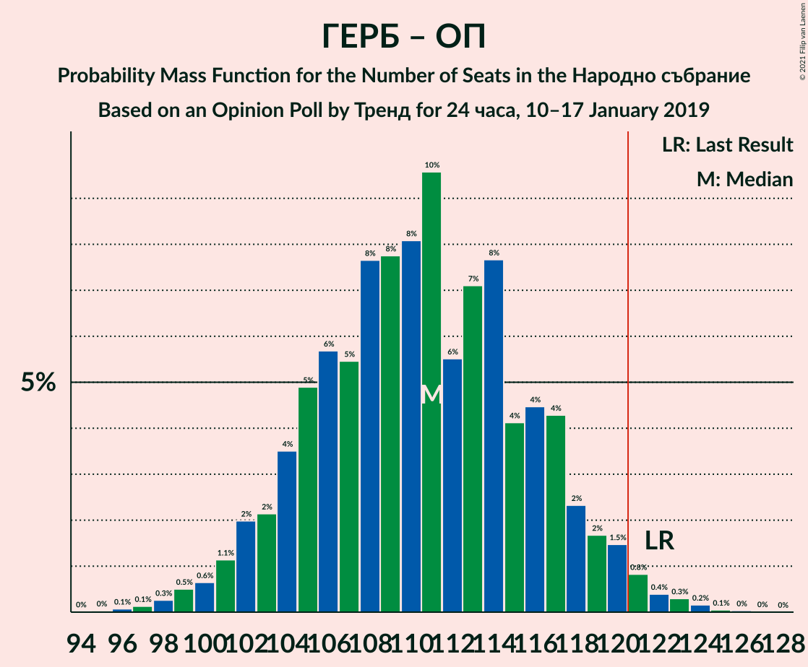

| Number of Seats | Probability | Accumulated | Special Marks |
|:---------------:|:-----------:|:-----------:|:-------------:|
| 95 | 0% | 100% |  |
| 96 | 0.1% | 99.9% |  |
| 97 | 0.1% | 99.9% |  |
| 98 | 0.3% | 99.7% |  |
| 99 | 0.5% | 99.5% |  |
| 100 | 0.6% | 99.0% |  |
| 101 | 1.1% | 98% |  |
| 102 | 2% | 97% |  |
| 103 | 2% | 95% |  |
| 104 | 4% | 93% |  |
| 105 | 5% | 90% |  |
| 106 | 6% | 85% |  |
| 107 | 5% | 79% |  |
| 108 | 8% | 74% |  |
| 109 | 8% | 66% |  |
| 110 | 8% | 58% | Median |
| 111 | 10% | 50% |  |
| 112 | 6% | 40% |  |
| 113 | 7% | 35% |  |
| 114 | 8% | 28% |  |
| 115 | 4% | 20% |  |
| 116 | 4% | 16% |  |
| 117 | 4% | 12% |  |
| 118 | 2% | 7% |  |
| 119 | 2% | 5% |  |
| 120 | 1.5% | 3% |  |
| 121 | 0.8% | 2% | Majority |
| 122 | 0.4% | 1.0% | Last Result |
| 123 | 0.3% | 0.6% |  |
| 124 | 0.2% | 0.3% |  |
| 125 | 0.1% | 0.1% |  |
| 126 | 0% | 0.1% |  |
| 127 | 0% | 0% |  |

## Technical Information

### Opinion Poll

+ **Polling firm:** Тренд
+ **Commissioner(s):** 24 часа
+ **Fieldwork period:** 10–17 January 2019

### Calculations

+ **Sample size:** 1008
+ **Simulations done:** 1,048,576
+ **Error estimate:** 0.29%

