# Opinion Poll by Тренд, 5–13 February 2019

<a href="#voting-intentions">Voting Intentions</a> | <a href="#seats">Seats</a> | <a href="#coalitions">Coalitions</a> | <a href="#technical-information">Technical Information</a>

## Voting Intentions

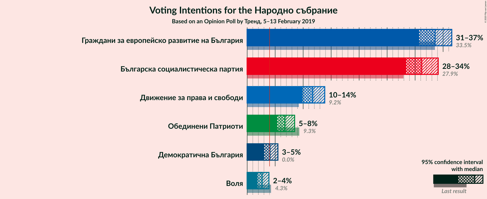

### Confidence Intervals

| Party | Last Result | Poll Result | 80% Confidence Interval | 90% Confidence Interval | 95% Confidence Interval | 99% Confidence Interval |
|:-----:|:-----------:|:-----------:|:-----------------------:|:-----------------------:|:-----------------------:|:-----------------------:|
| Граждани за европейско развитие на България | 33.5% | 33.6% | 31.7–35.5% |31.2–36.1% |30.7–36.5% |29.8–37.5% |
| Българска социалистическа партия | 27.9% | 31.2% | 29.4–33.1% |28.8–33.6% |28.4–34.1% |27.5–35.1% |
| Движение за права и свободи | 9.2% | 11.7% | 10.5–13.1% |10.2–13.5% |9.9–13.9% |9.3–14.6% |
| Обединени Патриоти | 9.3% | 6.8% | 5.8–7.9% |5.6–8.2% |5.3–8.5% |5.0–9.1% |
| Демократична България | 0.0% | 4.1% | 3.4–5.0% |3.2–5.3% |3.0–5.5% |2.7–6.0% |
| Воля | 4.3% | 2.7% | 2.1–3.5% |2.0–3.7% |1.8–3.9% |1.6–4.3% |

*Note:* The poll result column reflects the actual value used in the calculations. Published results may vary slightly, and in addition be rounded to fewer digits.

## Seats

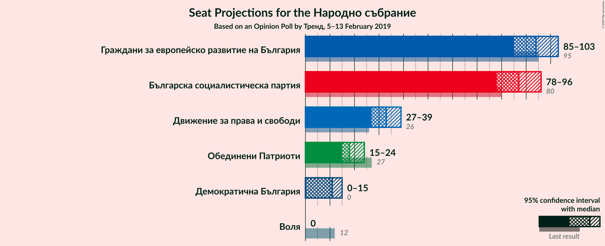

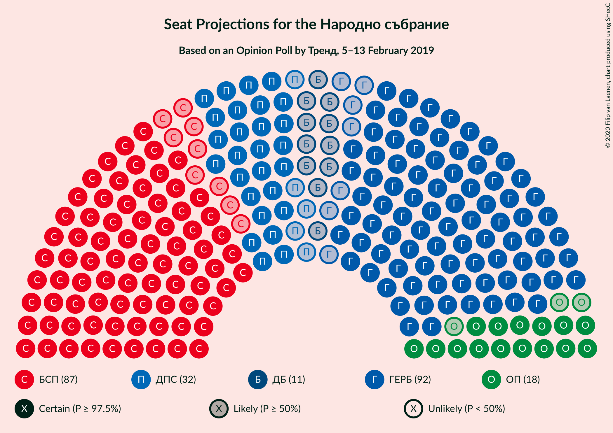

### Confidence Intervals

| Party | Last Result | Median | 80% Confidence Interval | 90% Confidence Interval | 95% Confidence Interval | 99% Confidence Interval |
|:-----:|:-----------:|:------:|:-----------------------:|:-----------------------:|:-----------------------:|:-----------------------:|
| <a href="#граждани-за-европейско-развитие-на-българия">Граждани за европейско развитие на България</a> | 95 | 94 | 88–100 |86–102 |85–103 |82–106 |
| <a href="#българска-социалистическа-партия">Българска социалистическа партия</a> | 80 | 87 | 81–93 |80–94 |78–96 |76–99 |
| <a href="#движение-за-права-и-свободи">Движение за права и свободи</a> | 26 | 33 | 29–37 |28–38 |27–39 |26–41 |
| <a href="#обединени-патриоти">Обединени Патриоти</a> | 27 | 18 | 16–22 |16–23 |15–24 |14–25 |
| <a href="#демократична-българия">Демократична България</a> | 0 | 11 | 0–14 |0–14 |0–15 |0–16 |
| <a href="#воля">Воля</a> | 12 | 0 | 0 |0 |0 |0–12 |

### Граждани за европейско развитие на България

*For a full overview of the results for this party, see the [Граждани за европейско развитие на България](party-гражданизаевропейскоразвитиенабългария.html) page.*

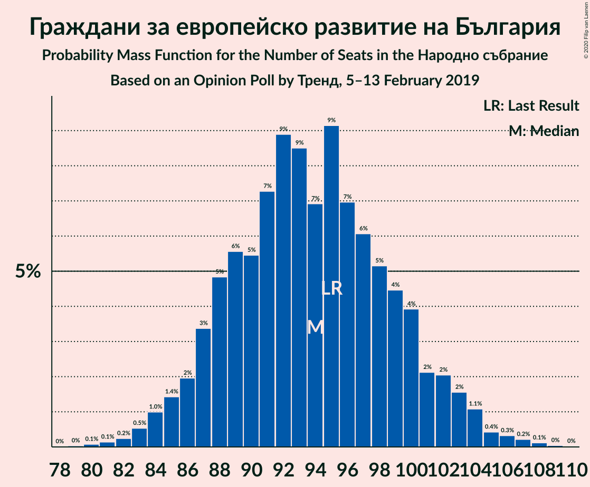

| Number of Seats | Probability | Accumulated | Special Marks |
|:---------------:|:-----------:|:-----------:|:-------------:|
| 79 | 0% | 100% |  |
| 80 | 0.1% | 99.9% |  |
| 81 | 0.1% | 99.9% |  |
| 82 | 0.2% | 99.7% |  |
| 83 | 0.5% | 99.5% |  |
| 84 | 1.0% | 98.9% |  |
| 85 | 1.4% | 98% |  |
| 86 | 2% | 97% |  |
| 87 | 3% | 95% |  |
| 88 | 5% | 91% |  |
| 89 | 6% | 86% |  |
| 90 | 5% | 81% |  |
| 91 | 7% | 75% |  |
| 92 | 9% | 68% |  |
| 93 | 9% | 59% |  |
| 94 | 7% | 51% | Median |
| 95 | 9% | 44% | Last Result |
| 96 | 7% | 35% |  |
| 97 | 6% | 28% |  |
| 98 | 5% | 22% |  |
| 99 | 4% | 16% |  |
| 100 | 4% | 12% |  |
| 101 | 2% | 8% |  |
| 102 | 2% | 6% |  |
| 103 | 2% | 4% |  |
| 104 | 1.1% | 2% |  |
| 105 | 0.4% | 1.2% |  |
| 106 | 0.3% | 0.7% |  |
| 107 | 0.2% | 0.4% |  |
| 108 | 0.1% | 0.2% |  |
| 109 | 0% | 0.1% |  |
| 110 | 0% | 0% |  |

### Българска социалистическа партия

*For a full overview of the results for this party, see the [Българска социалистическа партия](party-българскасоциалистическапартия.html) page.*

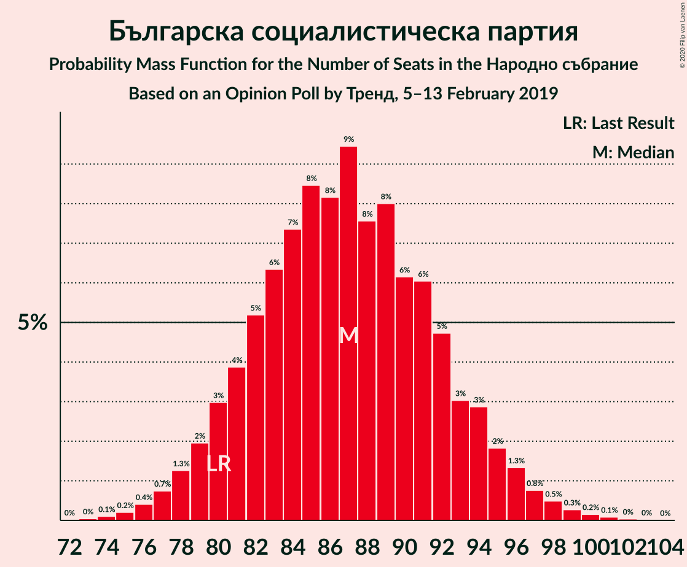

| Number of Seats | Probability | Accumulated | Special Marks |
|:---------------:|:-----------:|:-----------:|:-------------:|
| 73 | 0% | 100% |  |
| 74 | 0.1% | 99.9% |  |
| 75 | 0.2% | 99.8% |  |
| 76 | 0.4% | 99.6% |  |
| 77 | 0.7% | 99.2% |  |
| 78 | 1.3% | 98% |  |
| 79 | 2% | 97% |  |
| 80 | 3% | 95% | Last Result |
| 81 | 4% | 92% |  |
| 82 | 5% | 88% |  |
| 83 | 6% | 83% |  |
| 84 | 7% | 77% |  |
| 85 | 8% | 69% |  |
| 86 | 8% | 61% |  |
| 87 | 9% | 53% | Median |
| 88 | 8% | 43% |  |
| 89 | 8% | 36% |  |
| 90 | 6% | 28% |  |
| 91 | 6% | 22% |  |
| 92 | 5% | 16% |  |
| 93 | 3% | 11% |  |
| 94 | 3% | 8% |  |
| 95 | 2% | 5% |  |
| 96 | 1.3% | 3% |  |
| 97 | 0.8% | 2% |  |
| 98 | 0.5% | 1.1% |  |
| 99 | 0.3% | 0.6% |  |
| 100 | 0.2% | 0.3% |  |
| 101 | 0.1% | 0.2% |  |
| 102 | 0% | 0.1% |  |
| 103 | 0% | 0% |  |

### Движение за права и свободи

*For a full overview of the results for this party, see the [Движение за права и свободи](party-движениезаправаисвободи.html) page.*

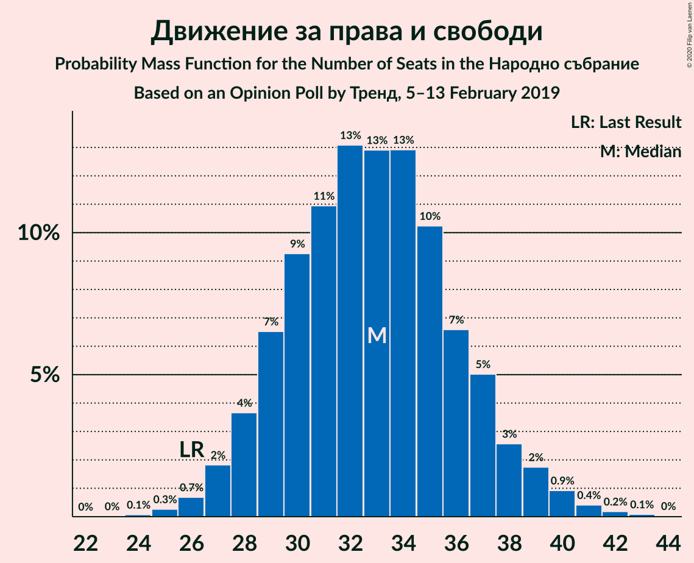

| Number of Seats | Probability | Accumulated | Special Marks |
|:---------------:|:-----------:|:-----------:|:-------------:|
| 24 | 0.1% | 100% |  |
| 25 | 0.3% | 99.9% |  |
| 26 | 0.7% | 99.6% | Last Result |
| 27 | 2% | 99.0% |  |
| 28 | 4% | 97% |  |
| 29 | 7% | 93% |  |
| 30 | 9% | 87% |  |
| 31 | 11% | 78% |  |
| 32 | 13% | 67% |  |
| 33 | 13% | 54% | Median |
| 34 | 13% | 41% |  |
| 35 | 10% | 28% |  |
| 36 | 7% | 18% |  |
| 37 | 5% | 11% |  |
| 38 | 3% | 6% |  |
| 39 | 2% | 3% |  |
| 40 | 0.9% | 2% |  |
| 41 | 0.4% | 0.7% |  |
| 42 | 0.2% | 0.3% |  |
| 43 | 0.1% | 0.1% |  |
| 44 | 0% | 0% |  |

### Обединени Патриоти

*For a full overview of the results for this party, see the [Обединени Патриоти](party-обединенипатриоти.html) page.*

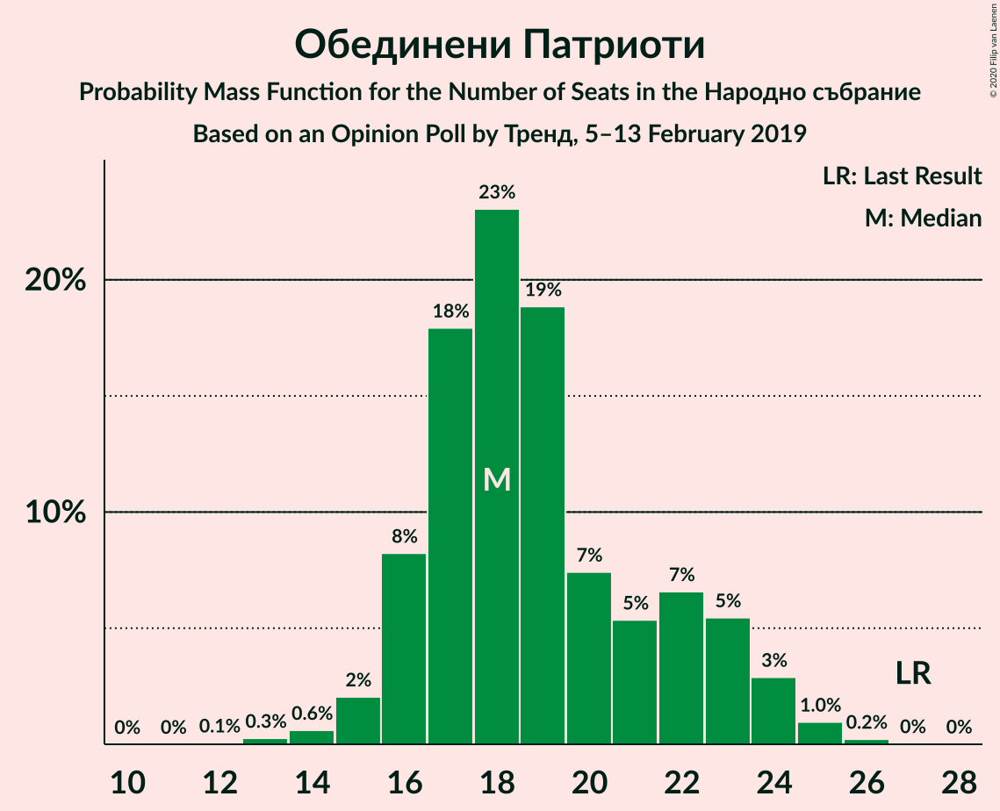

| Number of Seats | Probability | Accumulated | Special Marks |
|:---------------:|:-----------:|:-----------:|:-------------:|
| 12 | 0.1% | 100% |  |
| 13 | 0.3% | 99.9% |  |
| 14 | 0.6% | 99.7% |  |
| 15 | 2% | 99.1% |  |
| 16 | 8% | 97% |  |
| 17 | 18% | 89% |  |
| 18 | 23% | 71% | Median |
| 19 | 19% | 48% |  |
| 20 | 7% | 29% |  |
| 21 | 5% | 22% |  |
| 22 | 7% | 16% |  |
| 23 | 5% | 10% |  |
| 24 | 3% | 4% |  |
| 25 | 1.0% | 1.3% |  |
| 26 | 0.2% | 0.3% |  |
| 27 | 0% | 0.1% | Last Result |
| 28 | 0% | 0% |  |

### Демократична България

*For a full overview of the results for this party, see the [Демократична България](party-демократичнабългария.html) page.*

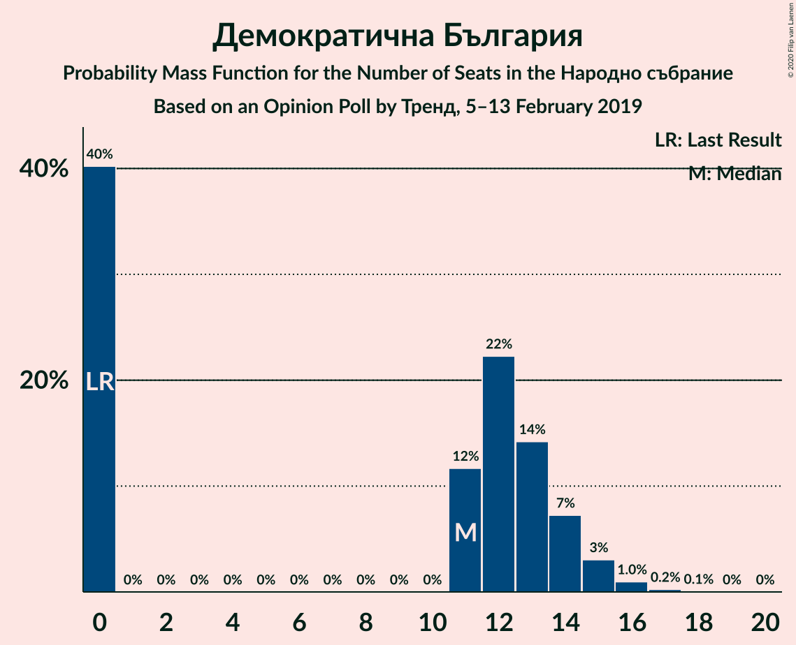

| Number of Seats | Probability | Accumulated | Special Marks |
|:---------------:|:-----------:|:-----------:|:-------------:|
| 0 | 40% | 100% | Last Result |
| 1 | 0% | 60% |  |
| 2 | 0% | 60% |  |
| 3 | 0% | 60% |  |
| 4 | 0% | 60% |  |
| 5 | 0% | 60% |  |
| 6 | 0% | 60% |  |
| 7 | 0% | 60% |  |
| 8 | 0% | 60% |  |
| 9 | 0% | 60% |  |
| 10 | 0% | 60% |  |
| 11 | 12% | 60% | Median |
| 12 | 22% | 48% |  |
| 13 | 14% | 26% |  |
| 14 | 7% | 12% |  |
| 15 | 3% | 4% |  |
| 16 | 1.0% | 1.3% |  |
| 17 | 0.2% | 0.3% |  |
| 18 | 0.1% | 0.1% |  |
| 19 | 0% | 0% |  |

### Воля

*For a full overview of the results for this party, see the [Воля](party-воля.html) page.*

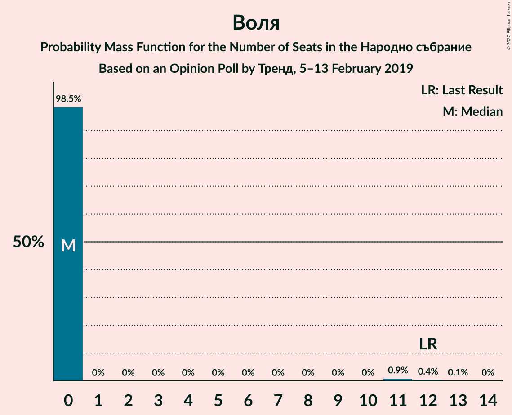

| Number of Seats | Probability | Accumulated | Special Marks |
|:---------------:|:-----------:|:-----------:|:-------------:|
| 0 | 98.5% | 100% | Median |
| 1 | 0% | 1.5% |  |
| 2 | 0% | 1.5% |  |
| 3 | 0% | 1.5% |  |
| 4 | 0% | 1.5% |  |
| 5 | 0% | 1.5% |  |
| 6 | 0% | 1.5% |  |
| 7 | 0% | 1.5% |  |
| 8 | 0% | 1.5% |  |
| 9 | 0% | 1.5% |  |
| 10 | 0% | 1.5% |  |
| 11 | 0.9% | 1.4% |  |
| 12 | 0.4% | 0.6% | Last Result |
| 13 | 0.1% | 0.1% |  |
| 14 | 0% | 0% |  |

## Coalitions

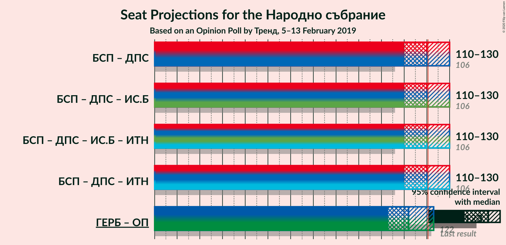

### Confidence Intervals

| Coalition | Last Result | Median | Majority? | 80% Confidence Interval | 90% Confidence Interval | 95% Confidence Interval | 99% Confidence Interval |
|:---------:|:-----------:|:------:|:---------:|:-----------------------:|:-----------------------:|:-----------------------:|:-----------------------:|
| Българска социалистическа партия – Движение за права и свободи | 106 | 120 | 43% | 113–127 | 112–129 | 110–130 | 107–133 |
| Граждани за европейско развитие на България – Обединени Патриоти | 122 | 112 | 7% | 106–119 | 105–121 | 103–123 | 100–126 |

### Българска социалистическа партия – Движение за права и свободи

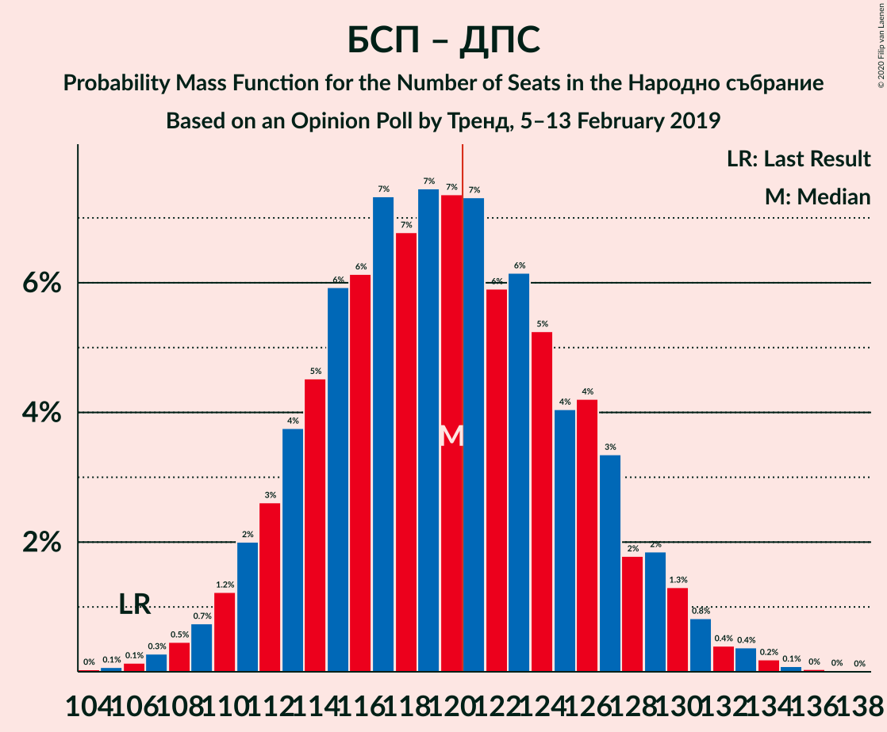

| Number of Seats | Probability | Accumulated | Special Marks |
|:---------------:|:-----------:|:-----------:|:-------------:|
| 104 | 0% | 100% |  |
| 105 | 0.1% | 99.9% |  |
| 106 | 0.1% | 99.9% | Last Result |
| 107 | 0.3% | 99.7% |  |
| 108 | 0.5% | 99.4% |  |
| 109 | 0.7% | 99.0% |  |
| 110 | 1.2% | 98% |  |
| 111 | 2% | 97% |  |
| 112 | 3% | 95% |  |
| 113 | 4% | 92% |  |
| 114 | 5% | 89% |  |
| 115 | 6% | 84% |  |
| 116 | 6% | 78% |  |
| 117 | 7% | 72% |  |
| 118 | 7% | 65% |  |
| 119 | 7% | 58% |  |
| 120 | 7% | 50% | Median |
| 121 | 7% | 43% | Majority |
| 122 | 6% | 36% |  |
| 123 | 6% | 30% |  |
| 124 | 5% | 24% |  |
| 125 | 4% | 19% |  |
| 126 | 4% | 14% |  |
| 127 | 3% | 10% |  |
| 128 | 2% | 7% |  |
| 129 | 2% | 5% |  |
| 130 | 1.3% | 3% |  |
| 131 | 0.8% | 2% |  |
| 132 | 0.4% | 1.1% |  |
| 133 | 0.4% | 0.7% |  |
| 134 | 0.2% | 0.4% |  |
| 135 | 0.1% | 0.2% |  |
| 136 | 0% | 0.1% |  |
| 137 | 0% | 0% |  |

### Граждани за европейско развитие на България – Обединени Патриоти

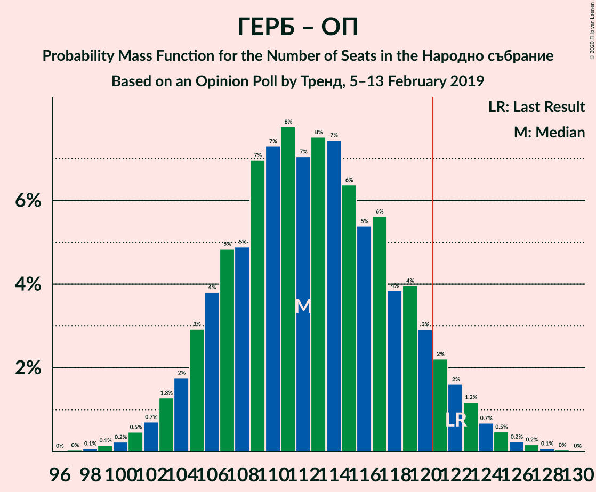

| Number of Seats | Probability | Accumulated | Special Marks |
|:---------------:|:-----------:|:-----------:|:-------------:|
| 97 | 0% | 100% |  |
| 98 | 0.1% | 99.9% |  |
| 99 | 0.1% | 99.9% |  |
| 100 | 0.2% | 99.7% |  |
| 101 | 0.5% | 99.5% |  |
| 102 | 0.7% | 99.0% |  |
| 103 | 1.3% | 98% |  |
| 104 | 2% | 97% |  |
| 105 | 3% | 95% |  |
| 106 | 4% | 92% |  |
| 107 | 5% | 89% |  |
| 108 | 5% | 84% |  |
| 109 | 7% | 79% |  |
| 110 | 7% | 72% |  |
| 111 | 8% | 65% |  |
| 112 | 7% | 57% | Median |
| 113 | 8% | 50% |  |
| 114 | 7% | 42% |  |
| 115 | 6% | 35% |  |
| 116 | 5% | 28% |  |
| 117 | 6% | 23% |  |
| 118 | 4% | 17% |  |
| 119 | 4% | 14% |  |
| 120 | 3% | 10% |  |
| 121 | 2% | 7% | Majority |
| 122 | 2% | 4% | Last Result |
| 123 | 1.2% | 3% |  |
| 124 | 0.7% | 2% |  |
| 125 | 0.5% | 1.0% |  |
| 126 | 0.2% | 0.5% |  |
| 127 | 0.2% | 0.3% |  |
| 128 | 0.1% | 0.1% |  |
| 129 | 0% | 0.1% |  |
| 130 | 0% | 0% |  |

## Technical Information

### Opinion Poll

+ **Polling firm:** Тренд
+ **Commissioner(s):** —
+ **Fieldwork period:** 5–13 February 2019

### Calculations

+ **Sample size:** 1007
+ **Simulations done:** 1,048,576
+ **Error estimate:** 0.55%

