# Opinion Poll by AFIS, 22–28 February 2019

<a href="#voting-intentions">Voting Intentions</a> | <a href="#seats">Seats</a> | <a href="#coalitions">Coalitions</a> | <a href="#technical-information">Technical Information</a>

## Voting Intentions

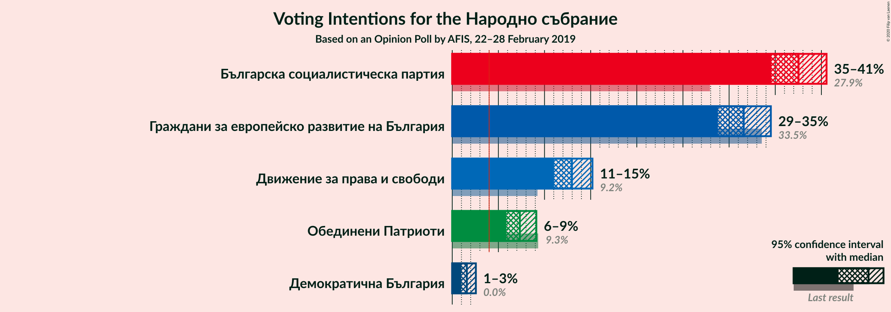

### Confidence Intervals

| Party | Last Result | Poll Result | 80% Confidence Interval | 90% Confidence Interval | 95% Confidence Interval | 99% Confidence Interval |
|:-----:|:-----------:|:-----------:|:-----------------------:|:-----------------------:|:-----------------------:|:-----------------------:|
| Българска социалистическа партия | 27.9% | 37.5% | 35.6–39.5% |35.1–40.1% |34.6–40.6% |33.7–41.5% |
| Граждани за европейско развитие на България | 33.5% | 31.6% | 29.8–33.5% |29.2–34.0% |28.8–34.5% |27.9–35.5% |
| Движение за права и свободи | 9.2% | 13.0% | 11.7–14.4% |11.3–14.8% |11.0–15.2% |10.5–15.9% |
| Обединени Патриоти | 9.3% | 7.3% | 6.4–8.5% |6.1–8.8% |5.9–9.1% |5.4–9.7% |
| Демократична България | 0.0% | 1.6% | 1.2–2.2% |1.1–2.4% |1.0–2.6% |0.8–2.9% |

*Note:* The poll result column reflects the actual value used in the calculations. Published results may vary slightly, and in addition be rounded to fewer digits.

## Seats

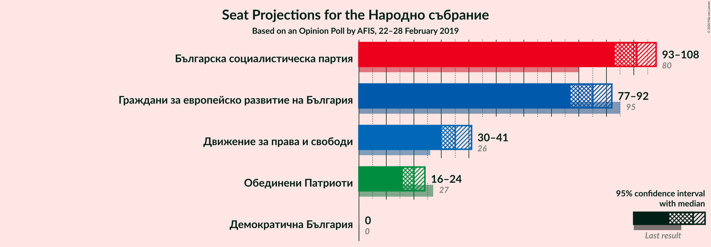

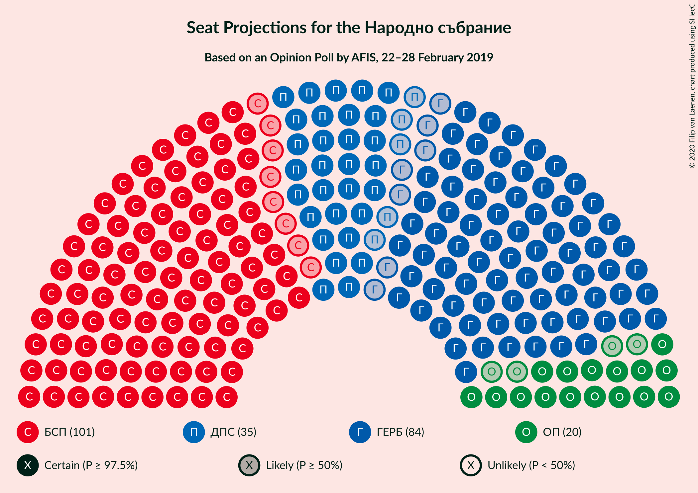

### Confidence Intervals

| Party | Last Result | Median | 80% Confidence Interval | 90% Confidence Interval | 95% Confidence Interval | 99% Confidence Interval |
|:-----:|:-----------:|:------:|:-----------------------:|:-----------------------:|:-----------------------:|:-----------------------:|
| <a href="#българска-социалистическа-партия">Българска социалистическа партия</a> | 80 | 101 | 96–106 |94–107 |93–108 |91–111 |
| <a href="#граждани-за-европейско-развитие-на-българия">Граждани за европейско развитие на България</a> | 95 | 85 | 80–90 |79–91 |77–92 |75–95 |
| <a href="#движение-за-права-и-свободи">Движение за права и свободи</a> | 26 | 35 | 31–39 |30–40 |30–41 |28–42 |
| <a href="#обединени-патриоти">Обединени Патриоти</a> | 27 | 20 | 17–23 |16–23 |16–24 |15–26 |
| <a href="#демократична-българия">Демократична България</a> | 0 | 0 | 0 |0 |0 |0 |

### Българска социалистическа партия

*For a full overview of the results for this party, see the [Българска социалистическа партия](party-българскасоциалистическапартия.html) page.*

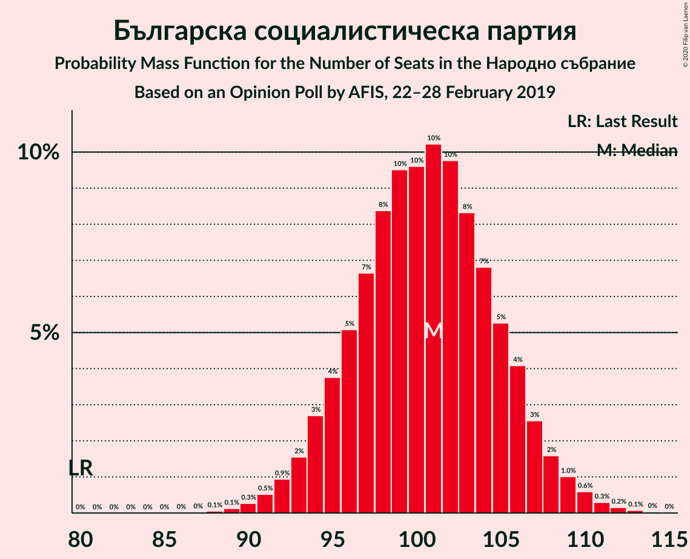

| Number of Seats | Probability | Accumulated | Special Marks |
|:---------------:|:-----------:|:-----------:|:-------------:|
| 80 | 0% | 100% | Last Result |
| 81 | 0% | 100% |  |
| 82 | 0% | 100% |  |
| 83 | 0% | 100% |  |
| 84 | 0% | 100% |  |
| 85 | 0% | 100% |  |
| 86 | 0% | 100% |  |
| 87 | 0% | 100% |  |
| 88 | 0.1% | 100% |  |
| 89 | 0.1% | 99.9% |  |
| 90 | 0.3% | 99.8% |  |
| 91 | 0.5% | 99.5% |  |
| 92 | 0.9% | 99.0% |  |
| 93 | 2% | 98% |  |
| 94 | 3% | 96% |  |
| 95 | 4% | 94% |  |
| 96 | 5% | 90% |  |
| 97 | 7% | 85% |  |
| 98 | 8% | 78% |  |
| 99 | 10% | 70% |  |
| 100 | 10% | 60% |  |
| 101 | 10% | 51% | Median |
| 102 | 10% | 41% |  |
| 103 | 8% | 31% |  |
| 104 | 7% | 22% |  |
| 105 | 5% | 16% |  |
| 106 | 4% | 10% |  |
| 107 | 3% | 6% |  |
| 108 | 2% | 4% |  |
| 109 | 1.0% | 2% |  |
| 110 | 0.6% | 1.2% |  |
| 111 | 0.3% | 0.6% |  |
| 112 | 0.2% | 0.3% |  |
| 113 | 0.1% | 0.1% |  |
| 114 | 0% | 0.1% |  |
| 115 | 0% | 0% |  |

### Граждани за европейско развитие на България

*For a full overview of the results for this party, see the [Граждани за европейско развитие на България](party-гражданизаевропейскоразвитиенабългария.html) page.*

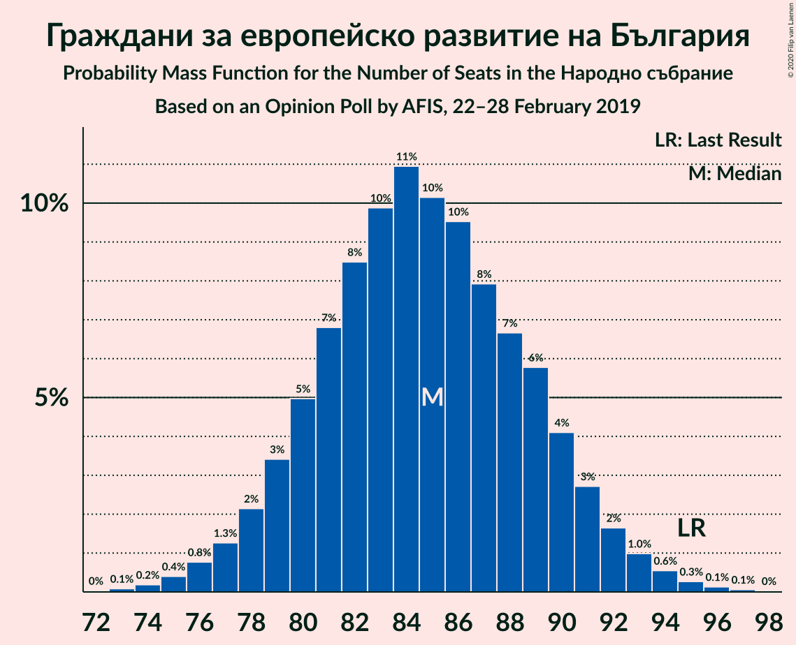

| Number of Seats | Probability | Accumulated | Special Marks |
|:---------------:|:-----------:|:-----------:|:-------------:|
| 72 | 0% | 100% |  |
| 73 | 0.1% | 99.9% |  |
| 74 | 0.2% | 99.9% |  |
| 75 | 0.4% | 99.7% |  |
| 76 | 0.8% | 99.3% |  |
| 77 | 1.3% | 98.5% |  |
| 78 | 2% | 97% |  |
| 79 | 3% | 95% |  |
| 80 | 5% | 92% |  |
| 81 | 7% | 87% |  |
| 82 | 8% | 80% |  |
| 83 | 10% | 71% |  |
| 84 | 11% | 62% |  |
| 85 | 10% | 51% | Median |
| 86 | 10% | 40% |  |
| 87 | 8% | 31% |  |
| 88 | 7% | 23% |  |
| 89 | 6% | 16% |  |
| 90 | 4% | 11% |  |
| 91 | 3% | 6% |  |
| 92 | 2% | 4% |  |
| 93 | 1.0% | 2% |  |
| 94 | 0.6% | 1.1% |  |
| 95 | 0.3% | 0.5% | Last Result |
| 96 | 0.1% | 0.2% |  |
| 97 | 0.1% | 0.1% |  |
| 98 | 0% | 0% |  |

### Движение за права и свободи

*For a full overview of the results for this party, see the [Движение за права и свободи](party-движениезаправаисвободи.html) page.*

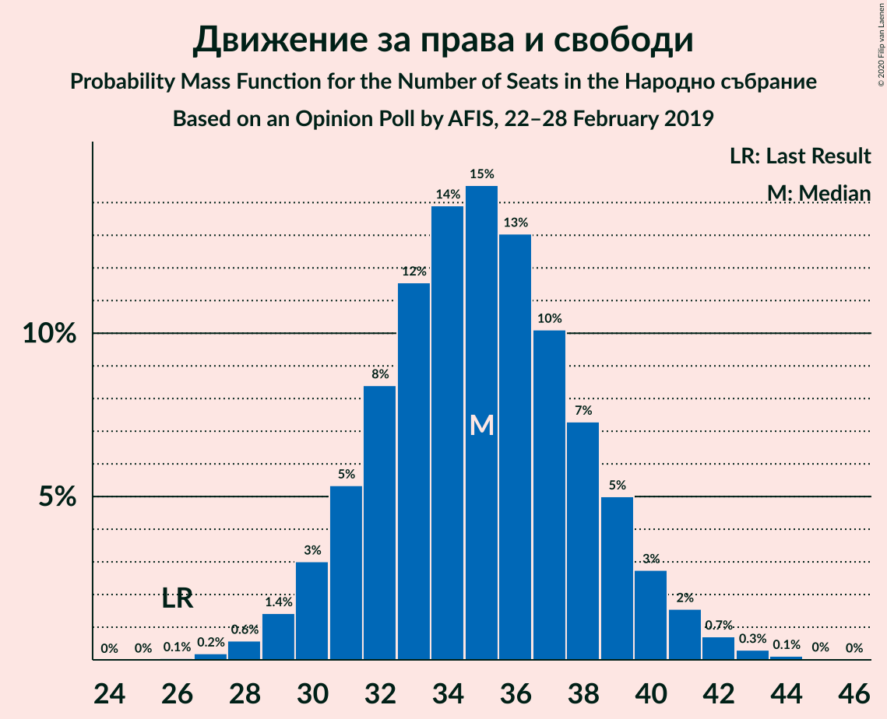

| Number of Seats | Probability | Accumulated | Special Marks |
|:---------------:|:-----------:|:-----------:|:-------------:|
| 26 | 0.1% | 100% | Last Result |
| 27 | 0.2% | 99.9% |  |
| 28 | 0.6% | 99.7% |  |
| 29 | 1.4% | 99.2% |  |
| 30 | 3% | 98% |  |
| 31 | 5% | 95% |  |
| 32 | 8% | 89% |  |
| 33 | 12% | 81% |  |
| 34 | 14% | 69% |  |
| 35 | 15% | 56% | Median |
| 36 | 13% | 41% |  |
| 37 | 10% | 28% |  |
| 38 | 7% | 18% |  |
| 39 | 5% | 11% |  |
| 40 | 3% | 6% |  |
| 41 | 2% | 3% |  |
| 42 | 0.7% | 1.2% |  |
| 43 | 0.3% | 0.5% |  |
| 44 | 0.1% | 0.2% |  |
| 45 | 0% | 0.1% |  |
| 46 | 0% | 0% |  |

### Обединени Патриоти

*For a full overview of the results for this party, see the [Обединени Патриоти](party-обединенипатриоти.html) page.*

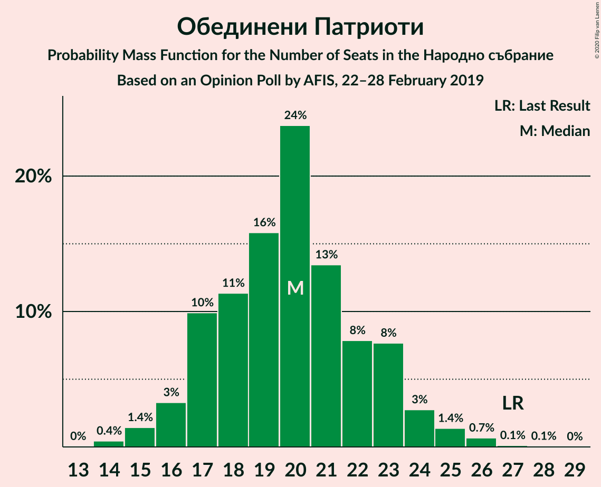

| Number of Seats | Probability | Accumulated | Special Marks |
|:---------------:|:-----------:|:-----------:|:-------------:|
| 14 | 0.4% | 100% |  |
| 15 | 1.4% | 99.5% |  |
| 16 | 3% | 98% |  |
| 17 | 10% | 95% |  |
| 18 | 11% | 85% |  |
| 19 | 16% | 74% |  |
| 20 | 24% | 58% | Median |
| 21 | 13% | 34% |  |
| 22 | 8% | 21% |  |
| 23 | 8% | 13% |  |
| 24 | 3% | 5% |  |
| 25 | 1.4% | 2% |  |
| 26 | 0.7% | 0.9% |  |
| 27 | 0.1% | 0.2% | Last Result |
| 28 | 0.1% | 0.1% |  |
| 29 | 0% | 0% |  |

### Демократична България

*For a full overview of the results for this party, see the [Демократична България](party-демократичнабългария.html) page.*

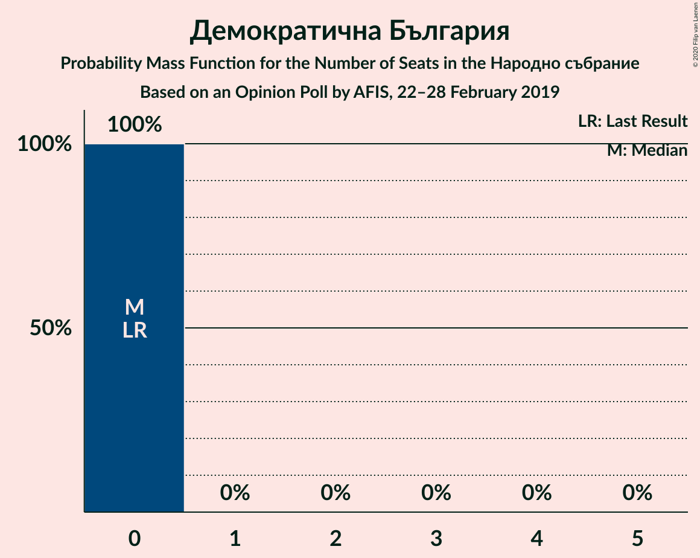

| Number of Seats | Probability | Accumulated | Special Marks |
|:---------------:|:-----------:|:-----------:|:-------------:|
| 0 | 100% | 100% | Last Result, Median |

## Coalitions

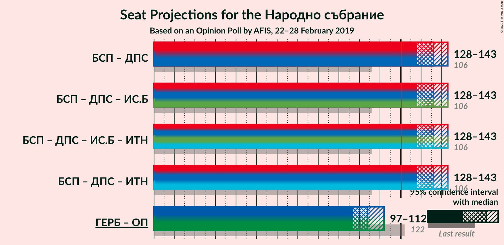

### Confidence Intervals

| Coalition | Last Result | Median | Majority? | 80% Confidence Interval | 90% Confidence Interval | 95% Confidence Interval | 99% Confidence Interval |
|:---------:|:-----------:|:------:|:---------:|:-----------------------:|:-----------------------:|:-----------------------:|:-----------------------:|
| Българска социалистическа партия – Движение за права и свободи | 106 | 136 | 100% | 130–140 | 129–142 | 128–143 | 125–146 |
| Граждани за европейско развитие на България – Обединени Патриоти | 122 | 104 | 0% | 100–110 | 98–111 | 97–112 | 94–115 |

### Българска социалистическа партия – Движение за права и свободи

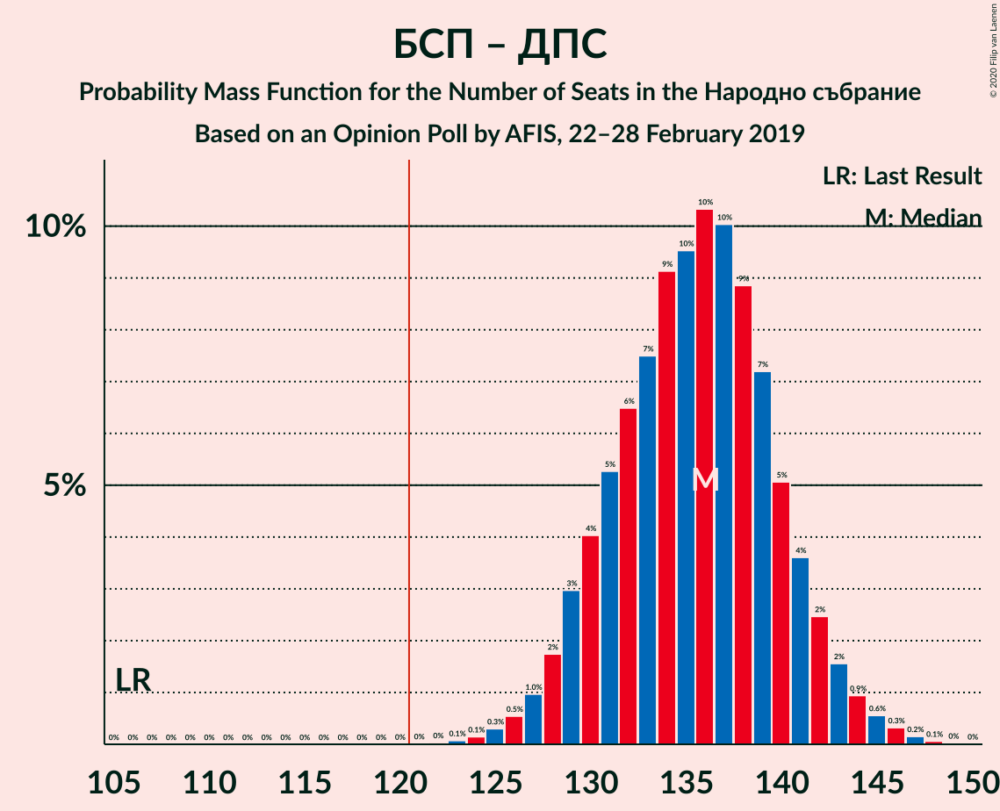

| Number of Seats | Probability | Accumulated | Special Marks |
|:---------------:|:-----------:|:-----------:|:-------------:|
| 106 | 0% | 100% | Last Result |
| 107 | 0% | 100% |  |
| 108 | 0% | 100% |  |
| 109 | 0% | 100% |  |
| 110 | 0% | 100% |  |
| 111 | 0% | 100% |  |
| 112 | 0% | 100% |  |
| 113 | 0% | 100% |  |
| 114 | 0% | 100% |  |
| 115 | 0% | 100% |  |
| 116 | 0% | 100% |  |
| 117 | 0% | 100% |  |
| 118 | 0% | 100% |  |
| 119 | 0% | 100% |  |
| 120 | 0% | 100% |  |
| 121 | 0% | 100% | Majority |
| 122 | 0% | 100% |  |
| 123 | 0.1% | 99.9% |  |
| 124 | 0.1% | 99.9% |  |
| 125 | 0.3% | 99.7% |  |
| 126 | 0.5% | 99.4% |  |
| 127 | 1.0% | 98.9% |  |
| 128 | 2% | 98% |  |
| 129 | 3% | 96% |  |
| 130 | 4% | 93% |  |
| 131 | 5% | 89% |  |
| 132 | 6% | 84% |  |
| 133 | 7% | 77% |  |
| 134 | 9% | 70% |  |
| 135 | 10% | 61% |  |
| 136 | 10% | 51% | Median |
| 137 | 10% | 41% |  |
| 138 | 9% | 31% |  |
| 139 | 7% | 22% |  |
| 140 | 5% | 15% |  |
| 141 | 4% | 10% |  |
| 142 | 2% | 6% |  |
| 143 | 2% | 4% |  |
| 144 | 0.9% | 2% |  |
| 145 | 0.6% | 1.1% |  |
| 146 | 0.3% | 0.6% |  |
| 147 | 0.2% | 0.3% |  |
| 148 | 0.1% | 0.1% |  |
| 149 | 0% | 0% |  |

### Граждани за европейско развитие на България – Обединени Патриоти

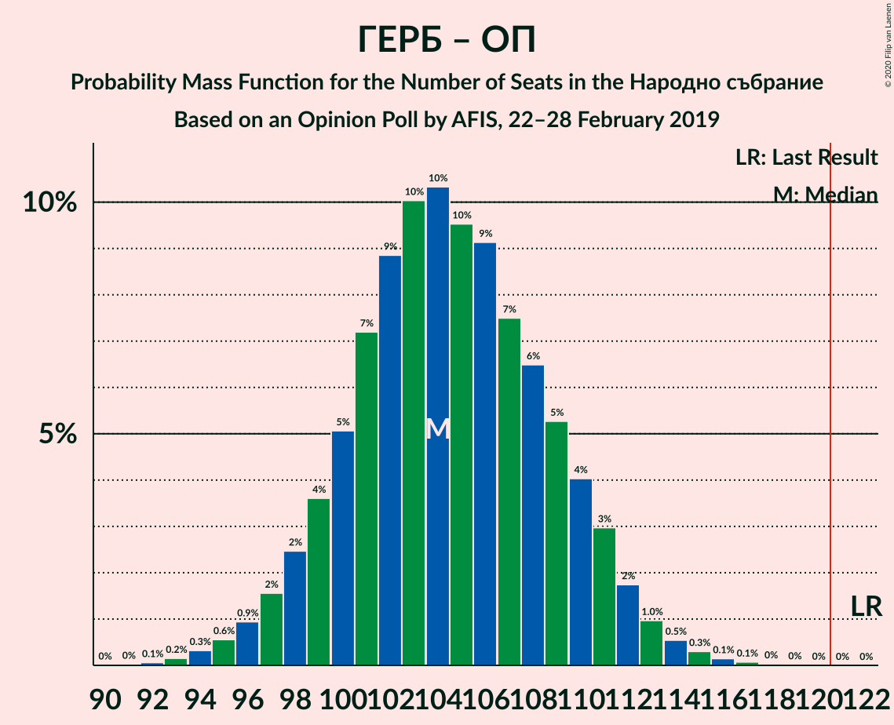

| Number of Seats | Probability | Accumulated | Special Marks |
|:---------------:|:-----------:|:-----------:|:-------------:|
| 92 | 0.1% | 100% |  |
| 93 | 0.2% | 99.9% |  |
| 94 | 0.3% | 99.7% |  |
| 95 | 0.6% | 99.4% |  |
| 96 | 0.9% | 98.9% |  |
| 97 | 2% | 98% |  |
| 98 | 2% | 96% |  |
| 99 | 4% | 94% |  |
| 100 | 5% | 90% |  |
| 101 | 7% | 85% |  |
| 102 | 9% | 78% |  |
| 103 | 10% | 69% |  |
| 104 | 10% | 59% |  |
| 105 | 10% | 49% | Median |
| 106 | 9% | 39% |  |
| 107 | 7% | 30% |  |
| 108 | 6% | 23% |  |
| 109 | 5% | 16% |  |
| 110 | 4% | 11% |  |
| 111 | 3% | 7% |  |
| 112 | 2% | 4% |  |
| 113 | 1.0% | 2% |  |
| 114 | 0.5% | 1.1% |  |
| 115 | 0.3% | 0.6% |  |
| 116 | 0.1% | 0.3% |  |
| 117 | 0.1% | 0.1% |  |
| 118 | 0% | 0.1% |  |
| 119 | 0% | 0% |  |
| 120 | 0% | 0% |  |
| 121 | 0% | 0% | Majority |
| 122 | 0% | 0% | Last Result |

## Technical Information

### Opinion Poll

+ **Polling firm:** AFIS
+ **Commissioner(s):** —
+ **Fieldwork period:** 22–28 February 2019

### Calculations

+ **Sample size:** 1010
+ **Simulations done:** 1,048,576
+ **Error estimate:** 0.75%

